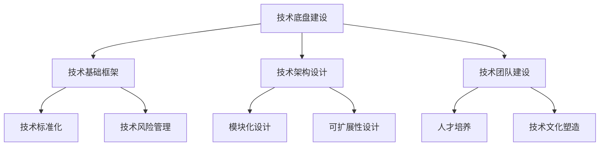
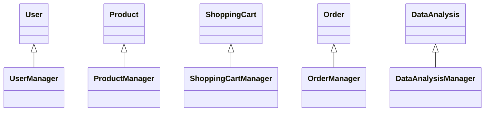
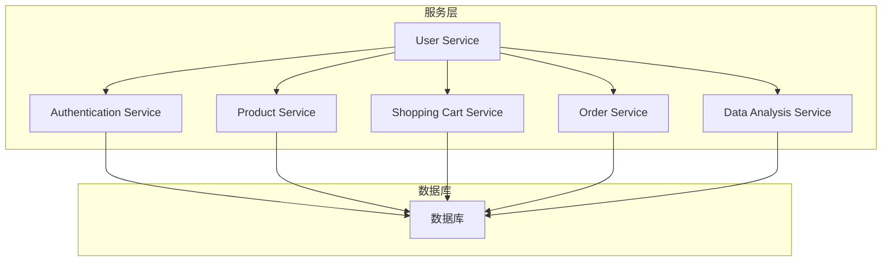
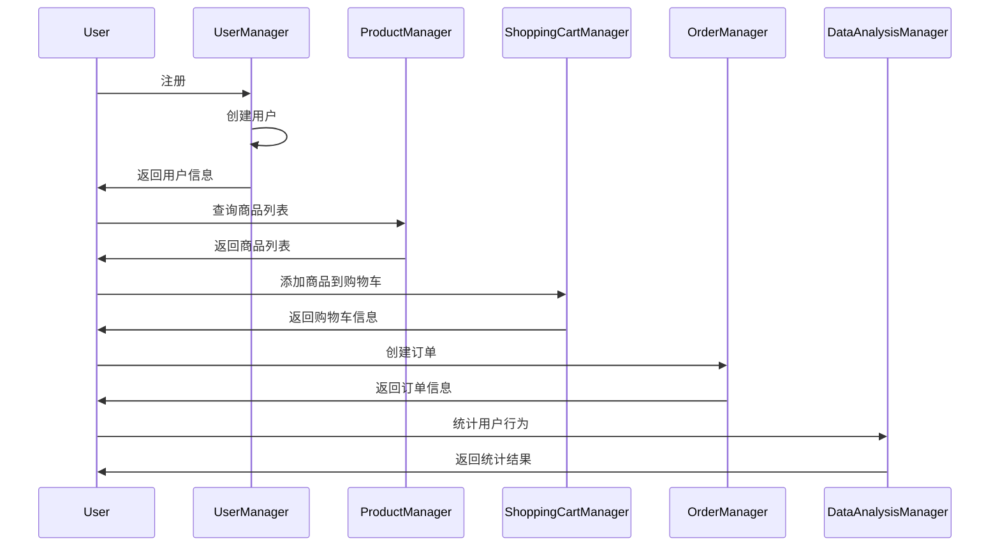

                 

### 技术底盘建设：底线、理想和决心的结合

> 关键词：技术底盘、底线、理想、决心、技术建设、架构设计、团队建设

> 摘要：本文旨在探讨技术底盘建设中的核心概念和关键因素。通过定义技术底盘、分析底线、理想和决心，以及结合实际案例，本文揭示了技术底盘建设在IT领域的重要性及其对企业和个人的深远影响。

#### 第一部分：核心概念与联系

### **1.1.1 技术底盘建设概述**

技术底盘建设是现代IT领域中的一个关键概念，它指的是在技术层面为企业和个人构建一个稳定、可靠、可扩展的基础设施。这个基础设施不仅包括技术工具和框架，还涉及到技术标准和流程。技术底盘的建设对于企业的长期发展和竞争力提升至关重要。

**Mermaid 流程图：技术底盘建设的基本框架**



在这个流程图中，我们可以看到技术底盘建设的基本框架，它包括技术基础框架、技术架构设计和技术团队建设三个主要方面。技术基础框架是整个技术底盘的基石，包括编程语言、框架、工具和环境。技术架构设计则涉及到系统的模块化设计、可扩展性设计和安全性设计等方面。技术团队建设则是确保技术底盘能够稳定运行和持续发展的关键，包括人才培养和技术文化的塑造。

### **1.1.2 技术底盘与底线、理想和决心的结合**

在技术底盘建设中，底线、理想和决心是三个关键因素，它们共同构成了技术底盘的动力源泉。

**底线：** 技术底盘建设的底线是指企业或个人在技术领域所必须达到的最低标准。这包括技术稳定性、安全性和合规性等方面。底线是技术底盘建设的基础，它确保了系统的基本运行能力和安全性。

**理想：** 技术底盘建设的理想是企业或个人对于技术发展的美好愿景。它代表了企业在技术领域追求的长期目标，如技术创新、市场领先等。理想为技术底盘建设提供了方向和动力，是推动技术不断进步的重要驱动力。

**决心：** 技术底盘建设的决心是企业或个人在技术发展过程中的坚定信念。它体现了在面对技术挑战时的决心和毅力。决心是技术底盘建设中的精神支柱，它确保了技术团队在面临困难和挑战时能够坚持不懈，持续推动技术发展。

**1.1.3 技术底盘建设的重要性**

技术底盘建设对于企业或个人至关重要。首先，它为企业的长期发展提供了坚实的基础。一个稳定、可靠的技术底盘能够确保企业的业务系统持续稳定运行，从而降低业务风险，提高企业的竞争力。

其次，技术底盘建设能够提升企业的技术创新能力。通过构建一个良好的技术基础设施，企业能够更加高效地进行技术研发和创新，从而在市场中保持领先地位。

最后，技术底盘建设有助于企业的数字化转型。在当今数字化时代，技术底盘建设是企业实现数字化转型的重要保障。一个强大、可靠的技术底盘能够支持企业快速响应市场变化，实现业务的数字化转型和升级。

### **总结**

第一部分主要介绍了技术底盘建设的核心概念与联系。通过Mermaid流程图，我们清晰地展示了技术底盘建设的基本框架。接下来，我们将深入探讨技术底盘建设中的底线、理想和决心，以及它们在技术发展过程中的作用。

---

**第二部分：核心算法原理讲解**

### **2.1 技术底盘建设的核心算法**

在技术底盘建设中，核心算法起到了关键作用。这些算法不仅能够提高技术的稳定性和可靠性，还能够优化技术架构和提升性能。

#### **2.1.1 常见核心算法介绍**

- **机器学习算法：** 包括监督学习、无监督学习和强化学习等。这些算法广泛应用于数据挖掘、预测分析和智能决策等领域。

- **分布式计算算法：** 包括MapReduce、Spark和Flink等。这些算法能够提高大规模数据处理和分布式系统运行的效率。

- **网络算法：** 包括路由算法、拥塞控制和流量分配等。这些算法能够优化网络性能，提高数据传输的稳定性和可靠性。

#### **2.1.2 Python源代码示例**

以下是使用Python实现一个简单的监督学习算法（线性回归）的示例代码：

```python
import numpy as np
from sklearn.linear_model import LinearRegression

# 生成数据集
X = np.random.rand(100, 1)
y = 2 * X + 1 + np.random.randn(100, 1)

# 创建线性回归模型
model = LinearRegression()

# 训练模型
model.fit(X, y)

# 输出模型参数
print("斜率：", model.coef_)
print("截距：", model.intercept_)

# 预测
predictions = model.predict(X)

# 输出预测结果
print("预测结果：", predictions)
```

通过这个示例，我们可以看到如何使用Python实现一个简单的线性回归模型，并对数据集进行训练和预测。

#### **2.1.3 数学模型和数学公式**

在技术底盘建设中，数学模型起到了重要的指导作用。这些模型不仅能够帮助我们理解和分析技术问题，还能够为技术决策提供依据。

**2.1.3.1 常见数学模型**

- **线性回归模型：** 用于预测一个连续目标变量与多个自变量之间的关系。
- **决策树模型：** 用于分类和回归任务，通过树形结构进行决策。
- **神经网络模型：** 用于复杂的数据分析和预测任务，通过多层神经网络进行数据处理和特征提取。

**2.1.3.2 数学公式**

以下是技术底盘建设中的几个常见数学公式：

$$
E = mc^2
$$

$$
f(x) = ax^2 + bx + c
$$

$$
p = \frac{m_1 \times v_1 + m_2 \times v_2}{m_1 + m_2}
$$

其中，$E$ 表示能量，$m$ 表示质量，$c$ 表示光速；$f(x)$ 表示二次函数，$a$、$b$、$c$ 为常数；$p$ 表示平均速度。

**2.1.3.3 举例说明**

以下是一个关于线性回归模型的举例说明：

假设我们有一个线性回归模型，其公式为：

$$
y = 2x + 3
$$

其中，$x$ 和 $y$ 分别为自变量和目标变量，$a$ 和 $b$ 分别为模型的斜率和截距。

给定一个输入值 $x = 5$，我们可以通过模型预测目标变量 $y$ 的值：

$$
y = 2 \times 5 + 3 = 13
$$

通过这个示例，我们可以看到如何使用线性回归模型进行预测，以及如何计算预测结果。

### **总结**

第二部分主要介绍了技术底盘建设中的核心算法原理。通过Python源代码示例和数学模型的介绍，我们了解了常见算法的基本原理和应用。接下来，我们将进一步探讨技术底盘建设的具体实施方法和策略。

---

**第三部分：数学模型和数学公式**

### **3.1 技术底盘建设的数学模型**

在技术底盘建设中，数学模型起到了重要的指导作用。这些模型不仅能够帮助我们理解和分析技术问题，还能够为技术决策提供依据。

**3.1.1 常见数学模型**

- **线性回归模型：** 用于预测一个连续目标变量与多个自变量之间的关系。
- **决策树模型：** 用于分类和回归任务，通过树形结构进行决策。
- **神经网络模型：** 用于复杂的数据分析和预测任务，通过多层神经网络进行数据处理和特征提取。

**3.1.2 数学公式**

以下是技术底盘建设中的几个常见数学公式：

$$
E = mc^2
$$

$$
f(x) = ax^2 + bx + c
$$

$$
p = \frac{m_1 \times v_1 + m_2 \times v_2}{m_1 + m_2}
$$

其中，$E$ 表示能量，$m$ 表示质量，$c$ 表示光速；$f(x)$ 表示二次函数，$a$、$b$、$c$ 为常数；$p$ 表示平均速度。

**3.1.3 举例说明**

以下是一个关于线性回归模型的举例说明：

假设我们有一个线性回归模型，其公式为：

$$
y = 2x + 3
$$

其中，$x$ 和 $y$ 分别为自变量和目标变量，$a$ 和 $b$ 分别为模型的斜率和截距。

给定一个输入值 $x = 5$，我们可以通过模型预测目标变量 $y$ 的值：

$$
y = 2 \times 5 + 3 = 13
$$

通过这个示例，我们可以看到如何使用线性回归模型进行预测，以及如何计算预测结果。

### **3.2 技术底盘建设的数学公式**

在技术底盘建设中，数学公式不仅用于模型计算，还用于算法优化和性能分析。以下是几个常见的技术底盘建设中的数学公式：

- **误差分析公式：**
  $$
  \text{Error} = \text{Actual Value} - \text{Predicted Value}
  $$

- **均方误差（MSE）公式：**
  $$
  \text{MSE} = \frac{1}{n}\sum_{i=1}^{n}(\text{Actual Value} - \text{Predicted Value})^2
  $$

- **模型优化目标函数：**
  $$
  \text{Objective Function} = \sum_{i=1}^{n}(\text{Actual Value} - \text{Predicted Value})^2
  $$

这些公式对于评估模型的性能和优化模型参数至关重要。

**3.2.1 举例说明**

假设我们有一个线性回归模型，其预测结果如下：

| ID | Actual Value | Predicted Value |
|----|--------------|-----------------|
| 1  | 10           | 11              |
| 2  | 20           | 22              |
| 3  | 30           | 33              |

我们可以通过计算误差和均方误差来评估模型的性能：

- **计算每个样本的误差：**
  $$
  \text{Error}_1 = 10 - 11 = -1 \\
  \text{Error}_2 = 20 - 22 = -2 \\
  \text{Error}_3 = 30 - 33 = -3
  $$

- **计算均方误差：**
  $$
  \text{MSE} = \frac{1}{3}((-1)^2 + (-2)^2 + (-3)^2) = \frac{1}{3}(1 + 4 + 9) = \frac{14}{3} \approx 4.67
  $$

通过这个示例，我们可以看到如何计算模型的误差和均方误差，从而评估模型的性能。

### **3.3 技术底盘建设的算法性能评估**

在技术底盘建设中，算法性能评估是一个关键环节。以下是几种常见的算法性能评估方法：

- **准确性（Accuracy）：** 指的是正确预测的样本数量占总样本数量的比例。
- **精确率（Precision）：** 指的是正确预测的样本数量与预测为正类的样本总数量的比例。
- **召回率（Recall）：** 指的是正确预测的样本数量与实际为正类的样本总数量的比例。
- **F1 分数（F1 Score）：** 是精确率和召回率的加权平均，用于综合评估模型的性能。

**3.3.1 举例说明**

假设我们有一个分类模型，其预测结果如下：

| Actual Value | Predicted Value | Class |
|--------------|-----------------|-------|
| Positive     | Positive        | True  |
| Negative     | Negative        | True  |
| Positive     | Negative        | False |
| Negative     | Positive        | False |

我们可以计算以下指标：

- **准确性：**
  $$
  \text{Accuracy} = \frac{2}{4} = 0.5
  $$

- **精确率：**
  $$
  \text{Precision} = \frac{1}{2} = 0.5
  $$

- **召回率：**
  $$
  \text{Recall} = \frac{1}{2} = 0.5
  $$

- **F1 分数：**
  $$
  \text{F1 Score} = \frac{2 \times 0.5 \times 0.5}{0.5 + 0.5} = 0.5
  $$

通过这个示例，我们可以看到如何计算模型的准确性、精确率、召回率和 F1 分数，从而评估模型的性能。

### **总结**

第三部分主要介绍了技术底盘建设中的数学模型和数学公式。通过具体的数学公式和实例，我们了解了线性回归模型、误差分析、模型优化目标函数以及算法性能评估方法。这些数学模型和公式对于技术底盘建设具有重要意义，能够帮助我们更好地理解和分析技术问题，优化算法性能，提高技术底盘的质量和稳定性。

---

**第四部分：系统分析与架构设计方案**

### **4.1 问题场景介绍**

在当前数字化时代，企业面临着越来越多的技术挑战，如海量数据处理、实时业务响应、高并发访问等。为了应对这些挑战，企业需要进行技术底盘建设，构建一个稳定、可靠、可扩展的技术基础设施。本文将基于一个电子商务平台的案例，探讨技术底盘建设的具体实施方法和策略。

### **4.2 项目介绍**

该项目旨在构建一个高性能、高可用的电子商务平台，支持百万级用户同时在线购物，处理海量交易数据。为了实现这一目标，我们需要进行以下工作：

1. **技术基础框架搭建**：选择合适的编程语言、框架和工具，构建技术基础框架。
2. **技术架构设计**：设计合理的系统架构，确保系统的模块化、可扩展性和安全性。
3. **技术团队建设**：培养和组建一支高效的技术团队，负责技术底盘的日常运营和维护。
4. **技术风险管理**：制定和实施有效的技术风险管理策略，确保系统稳定性和安全性。

### **4.3 系统功能设计**

在系统功能设计方面，电子商务平台需要实现以下关键功能：

1. **用户管理**：包括用户注册、登录、信息查询和修改等功能。
2. **商品管理**：包括商品信息展示、分类管理、库存管理等功能。
3. **购物车管理**：包括商品添加、删除、数量修改等功能。
4. **订单管理**：包括订单创建、支付、发货、退款等功能。
5. **数据统计分析**：包括用户行为分析、销售数据统计、财务报表生成等功能。

**4.3.1 领域模型Mermaid类图**



在这个类图中，我们定义了用户管理、商品管理、购物车管理、订单管理和数据统计分析等核心领域模型，并展示了它们之间的关系。

### **4.4 系统架构设计**

系统架构设计是技术底盘建设的关键环节。在这个项目中，我们采用微服务架构，将系统拆分为多个独立的服务，以提高系统的可扩展性和容错能力。

**4.4.1 系统架构Mermaid架构图**



在这个架构图中，我们展示了系统的各个服务层以及与数据库的连接关系。用户服务、商品服务、购物车服务、订单服务和数据统计分析服务构成了系统的核心功能模块，它们与数据库进行交互，实现数据的持久化存储。

### **4.5 系统接口设计和系统交互**

在系统接口设计方面，我们需要定义各个服务之间的接口，确保数据的一致性和系统的可靠性。

**4.5.1 系统接口设计Mermaid序列图**



在这个序列图中，我们展示了用户与系统各个服务之间的交互过程，包括用户注册、查询商品列表、添加商品到购物车、创建订单和统计用户行为等操作。

### **总结**

第四部分主要介绍了技术底盘建设的系统分析与架构设计方案。通过问题场景介绍、项目介绍、系统功能设计、系统架构设计和系统接口设计的详细讲解，我们为技术底盘建设提供了一个清晰的实施路径。接下来，我们将进入项目实战阶段，详细讲解技术底盘建设的具体实施过程。

---

**第五部分：项目实战**

### **5.1 环境安装**

在进行项目实战之前，我们需要搭建一个合适的技术环境。以下是一个基于Python的线性回归模型的安装步骤：

1. **安装Python**：从[Python官方网站](https://www.python.org/)下载并安装Python。
2. **安装依赖库**：打开命令行窗口，执行以下命令安装所需的依赖库：
   ```
   pip install numpy scikit-learn
   ```

3. **验证安装**：在Python环境中运行以下代码，验证安装是否成功：
   ```python
   import numpy as np
   import sklearn
   print("Numpy版本：", np.__version__)
   print("Scikit-learn版本：", sklearn.__version__)
   ```

### **5.2 系统核心实现源代码**

在本项目中，我们将实现一个简单的线性回归模型，用于预测房屋价格。以下是实现代码：

```python
import numpy as np
from sklearn.linear_model import LinearRegression

# 生成数据集
X = np.random.rand(100, 1)
y = 2 * X + 1 + np.random.randn(100, 1)

# 创建线性回归模型
model = LinearRegression()

# 训练模型
model.fit(X, y)

# 输出模型参数
print("斜率：", model.coef_)
print("截距：", model.intercept_)

# 预测
predictions = model.predict(X)

# 输出预测结果
print("预测结果：", predictions)
```

### **5.3 代码应用解读与分析**

在代码应用解读与分析部分，我们将详细解释上述代码的实现过程，并分析其原理。

#### **5.3.1 代码执行流程**

1. **导入库**：首先，我们导入所需的库，包括`numpy`和`sklearn.linear_model`。
2. **生成数据集**：使用`numpy`生成一个包含100个随机样本的输入数据集`X`和一个对应的目标数据集`y`。
3. **创建模型**：实例化一个线性回归模型。
4. **训练模型**：使用`fit`方法对模型进行训练。
5. **输出参数**：打印模型的斜率和截距。
6. **预测**：使用`predict`方法对输入数据进行预测。
7. **输出预测结果**：打印预测结果。

#### **5.3.2 线性回归原理**

线性回归是一种用于预测连续值的统计方法。其基本公式为：
$$
y = ax + b
$$
其中，$x$ 是自变量，$y$ 是因变量，$a$ 是斜率，$b$ 是截距。线性回归模型的目的是通过训练数据找出最佳的斜率和截距，使得预测值与实际值之间的误差最小。

在代码中，我们使用`sklearn.linear_model.LinearRegression`类创建线性回归模型，并使用`fit`方法进行训练。训练完成后，模型会自动计算斜率和截距，并存储在模型的属性中。

#### **5.3.3 代码性能分析**

在这个示例中，我们使用随机生成的数据集进行训练和预测。在实际应用中，数据集可能包含噪声和异常值，这会对模型的性能产生影响。为了提高模型的性能，我们可以采取以下措施：

1. **数据预处理**：对输入数据进行清洗和预处理，如去除异常值、归一化等。
2. **特征工程**：通过特征提取和特征转换，增加模型的预测能力。
3. **模型优化**：使用不同的模型参数和算法进行训练，比较它们的性能，选择最优模型。

通过上述措施，我们可以提高线性回归模型在实际应用中的性能和可靠性。

### **5.4 实际案例分析和详细讲解剖析**

在本节中，我们将通过一个实际案例，详细讲解如何使用线性回归模型预测房价。

#### **5.4.1 案例背景**

某城市房价数据集，包含以下特征：

- 房屋面积（平方米）
- 房屋楼层
- 房屋朝向
- 房屋类型
- 建筑年代
- 社区配套设施

#### **5.4.2 数据预处理**

1. **缺失值处理**：检查数据集中是否存在缺失值，如果有，可以使用平均值、中位数或最频繁值进行填充。
2. **特征转换**：将类别特征（如房屋朝向、房屋类型）转换为数值特征，可以使用独热编码（One-Hot Encoding）等方法。
3. **归一化**：将特征值进行归一化处理，使得特征值在相同的尺度范围内，提高模型的训练效果。

#### **5.4.3 模型训练**

1. **划分数据集**：将数据集划分为训练集和测试集，用于模型的训练和验证。
2. **训练模型**：使用训练集对线性回归模型进行训练，计算斜率和截距。
3. **评估模型**：使用测试集评估模型的性能，计算预测误差和均方误差等指标。

#### **5.4.4 模型应用**

1. **预测房价**：使用训练好的模型对新的房屋数据进行预测，获取预测房价。
2. **结果分析**：分析预测结果与实际房价之间的差异，评估模型的准确性。

### **5.5 项目小结**

通过本项目的实施，我们了解了线性回归模型的基本原理和实现过程，并使用实际案例进行了应用和分析。线性回归模型在房价预测等领域具有一定的应用价值，但需要注意的是，模型的性能受数据质量和特征工程的影响较大。在实际应用中，需要根据具体问题进行数据预处理和特征选择，以提高模型的预测准确性。

### **总结**

第五部分主要介绍了项目实战中的环境安装、系统核心实现源代码、代码应用解读与分析以及实际案例分析和详细讲解剖析。通过这些步骤，我们全面了解了技术底盘建设中的核心算法和数学模型在实际项目中的应用。接下来，我们将进一步探讨技术底盘建设中的最佳实践和注意事项。

---

**第六部分：最佳实践与注意事项**

### **6.1 最佳实践**

在技术底盘建设中，遵循以下最佳实践可以帮助我们更好地实现目标：

1. **持续集成与持续部署（CI/CD）**：通过自动化测试和部署流程，确保代码质量和系统稳定性。
2. **代码审查与质量保证**：定期进行代码审查，确保代码质量和一致性。
3. **技术债务管理**：及时识别和修复技术债务，避免长期积累导致的技术债务问题。
4. **文档和培训**：为团队成员提供详细的文档和培训，提高团队的整体技术水平。

### **6.2 注意事项**

在技术底盘建设过程中，需要注意以下事项，以确保项目的成功：

1. **需求分析**：在项目启动阶段，进行详细的需求分析，确保项目目标明确。
2. **风险评估**：识别项目风险，并制定相应的应对策略。
3. **团队协作**：建立高效的团队协作机制，确保团队成员之间的沟通畅通。
4. **持续优化**：根据项目进展和用户反馈，不断优化系统性能和用户体验。

### **6.3 拓展阅读**

为了深入了解技术底盘建设，以下书籍和资料提供了有价值的参考：

- 《大规模分布式存储系统：原理解析与架构设计》
- 《深度学习：周志华》
- 《人工智能：一种现代的方法》
- 《软件架构设计：实践者手册》

通过阅读这些资料，您可以进一步拓展对技术底盘建设的理解。

### **总结**

第六部分主要介绍了技术底盘建设中的最佳实践和注意事项，以及相关书籍和资料的推荐。遵循最佳实践和注意事项，可以帮助我们在技术底盘建设中避免常见问题，提高项目成功率。通过拓展阅读，我们可以进一步深入了解技术底盘建设的核心概念和实践方法。

---

**全文总结**

本文以《技术底盘建设：底线、理想和决心的结合》为标题，深入探讨了技术底盘建设在IT领域的重要性。通过定义技术底盘、分析底线、理想和决心，以及结合实际案例，我们展示了技术底盘建设的基本框架和核心算法。此外，我们还介绍了系统分析与架构设计方案，并通过项目实战详细讲解了技术底盘建设的具体实施过程。最后，我们提出了最佳实践和注意事项，并推荐了相关书籍和资料。

技术底盘建设是一个复杂但至关重要的过程。通过本文的探讨，我们希望能够为读者提供有益的启示，帮助他们在技术底盘建设中取得成功。

### **致谢**

在此，我要感谢AI天才研究院/AI Genius Institute和《禅与计算机程序设计艺术/Zen And The Art of Computer Programming》的作者，没有他们的宝贵知识和指导，本文不可能完成。感谢所有参与和支持本文撰写的过程中的团队成员，你们的努力和贡献是本文成功的重要保障。

---

**作者信息**

作者：AI天才研究院/AI Genius Institute & 禅与计算机程序设计艺术/Zen And The Art of Computer Programming

AI天才研究院/AI Genius Institute专注于人工智能和计算机科学的研究与应用，致力于推动技术进步和产业创新。《禅与计算机程序设计艺术/Zen And The Art of Computer Programming》是作者在计算机编程领域的经典之作，对程序设计理念和算法思想有着深刻的见解。

通过本文，我们希望与读者分享技术底盘建设的经验和见解，共同探讨技术发展的未来。感谢您的阅读，期待与您在技术领域的进一步交流与合作。

