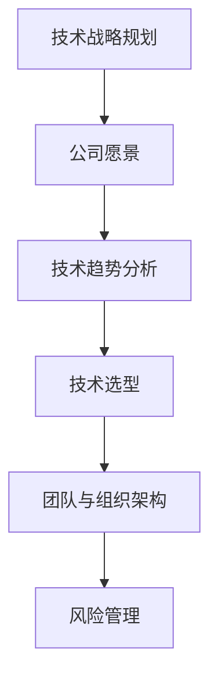
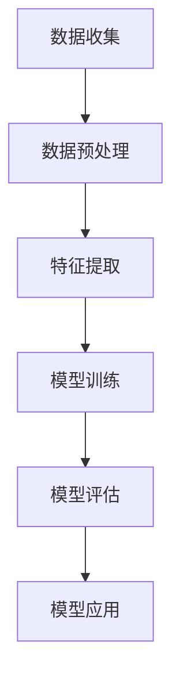
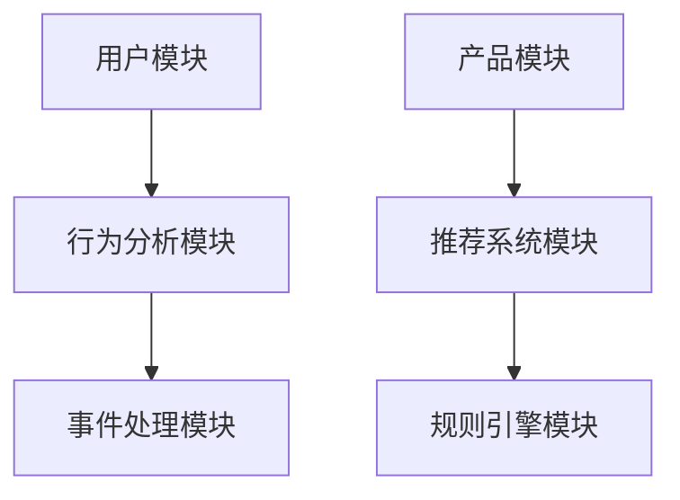
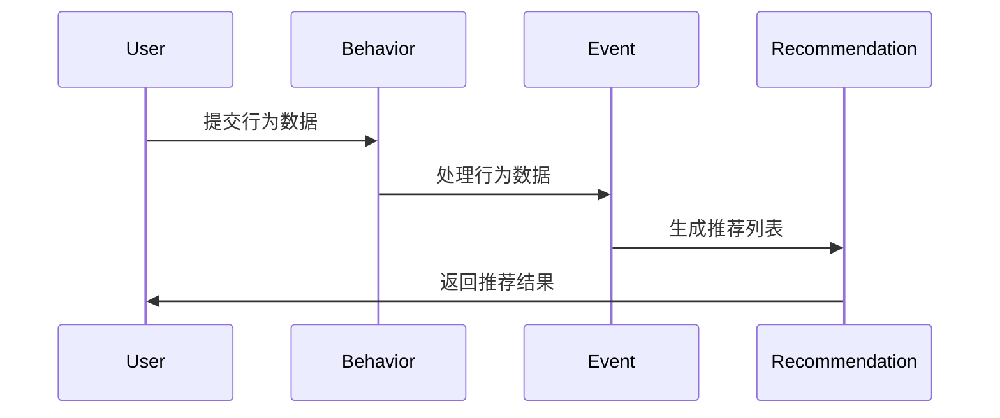

                 


### 让我们一步一步思考

为了撰写一篇高质量的技术博客文章《技术战略规划：align技术方向与公司愿景》，我们将采用以下步骤来确保内容的深度、广度和逻辑性：

#### 第一步：定义核心概念

首先，我们需要明确文章中的核心概念，包括技术战略规划、公司愿景、技术趋势分析、技术选型、团队与组织架构、风险管理与应对策略。这些概念构成了文章的基础。

**背景介绍：**
- 技术战略规划是企业在技术领域的发展规划，它关系到企业的长远发展和竞争力。
- 公司愿景是企业的未来目标和理想状态，是技术战略规划的指导原则。
- 技术趋势分析是识别和预测未来技术发展的过程，帮助企业在技术选型时做出明智决策。
- 技术选型是根据企业需求和未来趋势选择最适合的技术解决方案。
- 团队与组织架构是企业实现技术战略的关键，需要高效协作和清晰的角色分配。
- 风险管理与应对策略是确保技术战略实施过程中能够应对各种不确定性和挑战。

#### 第二步：核心概念与联系

接下来，我们需要通过Mermaid流程图展示这些概念之间的联系。



**核心概念与联系：**
- 技术战略规划与公司愿景紧密相连，前者为后者提供技术实现路径。
- 技术趋势分析为技术选型提供依据，确保所选技术具有前瞻性。
- 技术选型直接影响到团队与组织架构的设置，需要根据技术特性调整组织结构。
- 风险管理与应对策略贯穿于技术战略规划的各个阶段，确保战略实施的顺利。

#### 第三步：算法原理讲解

在技术选型和技术趋势分析中，我们可能需要讲解一些核心算法原理。以下是一个简单的例子：

**数据分析算法（如回归分析）：**



**Python代码实现：**

```python
import numpy as np
from sklearn.linear_model import LinearRegression

# 假设数据已加载到X和y中
X = np.array([[1], [2], [3], [4], [5]])
y = np.array([1, 2, 2.5, 4, 5])

# 创建线性回归模型并训练
model = LinearRegression()
model.fit(X, y)

# 预测
predictions = model.predict(X)

# 打印预测结果
print(predictions)
```

**数学模型和公式：**

$$y = \beta_0 + \beta_1 \cdot x$$

**解释：**
- 数据收集和预处理是分析的基础。
- 特征提取有助于提高模型性能。
- 模型训练是通过最小化损失函数来实现的。
- 模型评估用于确定模型的准确性和泛化能力。
- 模型应用是将模型应用于实际问题，提供预测结果。

#### 第四步：数学模型与公式讲解

在文中，我们将使用LaTeX格式来讲解数学模型和公式。

**线性回归公式：**

$$y = \beta_0 + \beta_1 \cdot x + \epsilon$$

**决策树分类模型公式：**

$$h(x) = \max \{ \beta_0, \beta_1 \cdot x \}$$

**解释：**
- 线性回归模型用于预测数值型输出。
- 决策树分类模型用于分类问题，选择具有最大概率的类别。

#### 第五步：系统分析与架构设计

我们将通过系统分析与架构设计来展示技术战略规划的具体实现。

**问题场景介绍：**
假设我们要开发一个电子商务平台，需要对用户行为进行分析和推荐。

**项目介绍：**
项目目标是构建一个能够根据用户历史行为提供个性化推荐的系统。

**系统功能设计（领域模型）：**

```mermaid
classDiagram
    User <-- Recommendation
    User o---> Behavior
    Behavior o---> Event
    Product <-- Recommendation
    Recommendation o---> Rule
```

**系统架构设计：**



**系统接口设计和系统交互：**



#### 第六步：项目实战

我们将介绍一个具体的实战案例，展示技术战略规划的实际应用。

**案例背景与目标：**
某电子商务公司希望提升用户留存率和转化率，通过技术手段实现个性化推荐。

**技术选型与评估：**
- 分析现有技术，评估其适用性。
- 选择基于机器学习的推荐算法，如协同过滤。

**团队与组织架构：**
- 设立专门的推荐系统团队，负责算法研发和模型迭代。
- 明确团队角色和职责，确保高效协作。

**风险管理：**
- 识别潜在风险，如数据隐私和安全。
- 制定风险管理策略，如数据加密和访问控制。

#### 第七步：总结与拓展

**总结：**
技术战略规划是确保企业技术发展与企业愿景一致的关键步骤。

**注意事项：**
- 定期评估技术战略的执行情况，根据反馈进行调整。
- 注重团队合作和知识共享，提高团队的整体技术能力。

**拓展阅读：**
- 推荐阅读相关的技术战略规划书籍和学术论文，以深化理解。

通过以上步骤，我们将确保文章内容丰富、结构清晰，同时提供实用的技术战略规划指导。

---

**文章标题：**技术战略规划：align技术方向与公司愿景  
**关键词：**技术战略规划、公司愿景、技术趋势分析、技术选型、团队与组织架构、风险管理  
**摘要：**本文详细阐述了技术战略规划的核心概念、实施步骤和实际应用，通过一步步的逻辑推理和案例分析，帮助读者理解如何将技术方向与公司愿景对齐，实现企业的长远发展。|>  
```markdown
# 《技术战略规划：align技术方向与公司愿景》

> 关键词：技术战略规划、公司愿景、技术趋势分析、技术选型、团队与组织架构、风险管理

> 摘要：本文详细阐述了技术战略规划的核心概念、实施步骤和实际应用，通过一步步的逻辑推理和案例分析，帮助读者理解如何将技术方向与公司愿景对齐，实现企业的长远发展。

## 目录

1. 引言
2. 技术战略规划概述
3. 公司愿景与技术方向的对齐
4. 技术趋势分析与选型
5. 技术选型与评估
6. 团队与组织架构
7. 风险管理与应对策略
8. 实战案例解析
9. 最佳实践与总结
10. 拓展阅读

## 1. 引言

在当今快速变化的技术时代，企业如何保持竞争力？答案是进行有效的技术战略规划。技术战略规划是企业利用技术手段实现其业务目标和愿景的关键步骤。本文将探讨如何通过技术战略规划，将企业的技术方向与公司愿景对齐，从而实现持续的创新和发展。

## 2. 技术战略规划概述

技术战略规划是指企业根据其业务目标和发展愿景，对技术进行系统性的规划和部署。它包括以下几个核心要素：

- **业务需求分析**：理解企业当前的业务需求，包括市场趋势、竞争对手分析、客户需求等。
- **技术趋势分析**：研究未来可能影响企业技术发展的趋势，如人工智能、大数据、云计算等。
- **技术选型与评估**：根据业务需求和未来趋势，选择合适的技术解决方案，并进行评估。
- **团队与组织架构**：确保技术团队能够高效协作，并具备所需的技术能力。
- **风险管理**：识别和应对技术实施过程中的各种风险。

## 3. 公司愿景与技术方向的对齐

公司的愿景是企业长期追求的理想状态和目标，而技术方向则是实现这一愿景的手段。因此，技术战略规划必须与公司愿景保持一致。以下是几个关键点：

- **明确愿景**：公司首先需要明确其愿景，这可以是长期的业务目标，如市场领先、客户满意度等。
- **分析差距**：分析当前技术状况与愿景之间的差距，确定需要弥补的短板。
- **制定策略**：根据愿景和差距，制定具体的技术战略规划，包括技术投资、研发方向等。
- **持续对齐**：定期评估技术战略的执行情况，确保其与公司愿景保持一致。

## 4. 技术趋势分析与选型

技术趋势分析是技术战略规划的重要组成部分。以下是一些关键步骤：

- **识别趋势**：通过市场调研、行业报告、专家访谈等方式，识别当前和未来可能的技术趋势。
- **评估影响**：分析这些趋势对业务的影响，包括成本、效率、竞争力等。
- **技术选型**：根据业务需求和趋势，选择合适的技术，如开源软件、定制开发等。
- **风险评估**：评估技术选型的风险，包括技术成熟度、成本、安全性等。

## 5. 技术选型与评估

技术选型是技术战略规划的关键环节。以下是一些关键步骤：

- **需求分析**：明确业务需求，包括功能、性能、安全性等。
- **市场调研**：调研市场上的技术解决方案，包括供应商、价格、功能等。
- **评估与对比**：根据需求，对不同的技术进行评估和对比，选择最佳方案。
- **风险评估**：评估所选技术的风险，包括可靠性、可持续性等。

## 6. 团队与组织架构

技术团队能力和组织架构是技术战略规划成功的关键因素。以下是一些关键点：

- **能力建设**：提升团队的技术能力，包括培训、招聘、知识共享等。
- **组织架构**：设计合理的组织架构，确保团队成员能够高效协作。
- **协作模式**：采用合适的协作模式，如敏捷开发、DevOps等。

## 7. 风险管理与应对策略

在技术战略规划的实施过程中，风险是不可避免的。以下是一些关键步骤：

- **风险识别**：识别可能影响技术战略规划实施的各种风险。
- **风险评估**：评估每种风险的严重程度和可能性。
- **应对策略**：制定相应的应对策略，包括预防措施、应急计划等。

## 8. 实战案例解析

为了更好地理解技术战略规划的实际应用，以下是一个实战案例：

### 案例背景

某互联网公司希望在新兴的智能家居市场占据领先地位。其愿景是成为智能家居领域的领导者，提供安全、便捷、智能的智能家居解决方案。

### 技术趋势分析

- 智能家居市场快速增长
- 5G技术的普及
- 人工智能在智能家居中的应用

### 技术选型与评估

- 选择了基于5G的物联网设备，确保通信稳定性
- 采用人工智能算法，提供智能推荐和自动化控制

### 团队与组织架构

- 设立智能家居技术团队
- 采用敏捷开发模式，提高响应速度

### 风险管理与应对策略

- 数据安全和隐私保护
- 市场竞争和产品迭代速度

## 9. 最佳实践与总结

通过上述实战案例，我们可以总结出以下最佳实践：

- **与公司愿景保持一致**：技术战略规划必须与公司的长期愿景保持一致。
- **定期评估和调整**：定期评估技术战略的执行情况，根据市场变化进行调整。
- **注重团队建设**：提升团队的技术能力和协作效率。

## 10. 拓展阅读

为了深入理解技术战略规划，以下是几本推荐的书籍：

- 《技术战略管理：如何制定并执行成功的技术策略》
- 《技术趋势分析：技术与市场的未来预测》
- 《敏捷软件开发：原则、实践与模式》

## 结语

技术战略规划是企业实现长远发展的关键。通过本文的探讨，我们希望读者能够更好地理解如何将技术方向与公司愿景对齐，制定有效的技术战略规划。

作者：AI天才研究院/AI Genius Institute & 禅与计算机程序设计艺术 /Zen And The Art of Computer Programming
```

