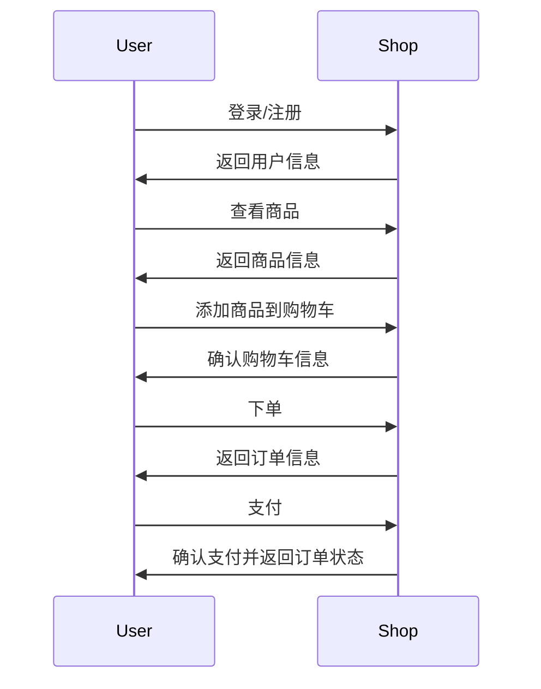

                 

### 1.1 什么是技术战略

技术战略，是企业为实现长期目标而制定的技术发展蓝图。它不仅涉及到技术选型和技术升级，还涵盖了对创新、研发管理、技术标准以及知识产权等领域的综合规划。在当今技术日新月异的时代，技术战略成为企业保持竞争优势、实现持续发展的关键。

#### **1.1.1 技术战略的定义**

技术战略是一种系统性的规划和决策过程，旨在确保企业在技术创新、技术应用和科技成果转化方面取得领先优势。它包括对技术趋势的预测、技术目标的设定、技术路线图的规划以及技术资源的管理与配置。

#### **1.1.2 技术战略的重要性**

首先，技术战略能够帮助企业把握市场机遇，提前布局新兴技术，从而在激烈的市场竞争中抢占先机。其次，通过明确的技术规划，企业可以优化资源配置，减少技术投资的风险。此外，技术战略还能够增强企业的创新能力，提升产品竞争力，最终实现企业价值的最大化。

#### **1.1.3 技术战略与公司目标的关系**

技术战略与公司目标密不可分。一方面，技术战略需要根据公司的发展目标和市场定位来制定，确保技术的应用与公司的长期愿景保持一致。另一方面，公司目标的实现离不开技术战略的支持，技术优势是公司竞争力的核心要素之一。

**问题背景：** 在当前科技高速发展的时代，技术的变革速度远超以往，企业必须具备敏锐的技术洞察力和前瞻性，才能在激烈的市场竞争中立于不败之地。然而，许多企业在技术战略的制定和执行过程中面临诸多挑战，如如何准确预测技术趋势、如何合理配置技术资源、如何管理技术创新过程等。

**问题描述：** 针对企业如何制定和执行有效的技术战略，本文将探讨以下问题：
- 如何进行技术趋势分析和预测？
- 如何设定明确的技术目标和规划？
- 如何管理技术创新过程和资源？
- 如何确保技术战略与企业长期目标的协同一致？

**问题解决：** 通过分析当前技术环境，结合企业实际情况，本文将提出一系列解决方案，帮助企业在技术战略的制定和执行过程中取得成功。

**边界与外延：** 本文主要讨论企业层面的技术战略，不包括国家或行业层面的技术战略。同时，本文关注的是长期技术发展规划，而非短期的技术调整或升级。

**概念结构与核心要素组成：**

1. **技术愿景与使命**：确定企业长期技术发展的目标和方向。
2. **技术目标与关键成果**：具体的技术成果和里程碑。
3. **技术路线图与规划**：分阶段、分步骤的技术实施计划。
4. **技术创新与研发管理**：推动技术进步和创新的机制。
5. **技术资源管理**：技术人才、资金、设备等资源的高效配置。
6. **技术标准与知识产权**：确保技术领先地位和合规性。

通过以上要素的有机整合，企业可以形成一套完整的技术战略体系，指导企业的技术发展。

### **1.2 技术战略的核心组成部分**

一个完整的技术战略由多个核心组成部分构成，每个部分都在企业的技术发展中扮演着至关重要的角色。以下是对这些组成部分的详细解析：

#### **1.2.1 技术愿景与使命**

**技术愿景**是企业对未来技术发展的总体设想，是技术战略的出发点。它为企业的技术创新提供了明确的方向，激励全体员工为实现这一愿景而共同努力。**技术使命**则更加具体，它明确了企业在特定时期内要完成的技术任务和目标。

**如何设定技术愿景与使命？**

- **基于公司目标**：技术愿景与使命应与公司的整体发展战略相一致，确保技术发展与业务目标协同。
- **结合市场趋势**：技术愿景应紧跟市场趋势，反映行业未来发展方向。
- **体现企业特色**：技术愿景与使命应体现企业的核心竞争力，突出企业在技术领域的独特优势。

#### **1.2.2 技术目标与关键成果**

**技术目标**是企业为实现技术愿景而设定的具体目标和里程碑。这些目标应具有可衡量性、可实现性和明确的时间节点。

**关键成果**是实现技术目标的具体表现，如新产品开发、新技术应用、专利获得等。关键成果不仅是技术战略执行效果的直接体现，也是企业竞争力的具体体现。

**如何设定技术目标与关键成果？**

- **具体明确**：技术目标应具体、可量化，以便于监控和评估。
- **阶段性**：将长期目标分解为短期目标，确保逐步实现。
- **挑战性**：目标应具有一定挑战性，激发团队的创造力和拼搏精神。
- **可行性**：目标应基于现有资源和能力，确保可执行。

#### **1.2.3 技术路线图与规划**

**技术路线图**是将企业的技术愿景、目标与实际技术活动相结合的蓝图。它详细描述了企业如何通过一系列技术活动实现技术目标。

**技术规划**则是将这些活动具体化，包括技术项目的时间表、资源需求、责任人等。

**如何制定技术路线图与规划？**

- **宏观规划**：明确技术路线图的宏观方向，包括技术方向、关键技术领域等。
- **微观实施**：详细规划每个技术项目的具体实施步骤，确保每个环节都有明确的任务和时间表。
- **动态调整**：根据实际情况和技术进展，及时调整技术路线图和规划，确保适应外部环境的变化。

**技术愿景与使命、技术目标与关键成果、技术路线图与规划**这三个部分共同构成了企业技术战略的核心框架。它们相互联系、相互支撑，共同推动企业实现技术领先和持续发展。

通过明确的技术愿景与使命，企业能够清晰了解自身的长远发展方向；通过设定具体的技术目标与关键成果，企业能够确保技术活动的具体可操作性；通过制定详尽的技术路线图与规划，企业能够有条不紊地推进技术发展，实现预期目标。

### **1.3 技术战略的制定流程**

制定一个有效且可行技术战略需要一系列科学的步骤和方法。以下将详细探讨技术战略的制定流程，包括市场分析、技术趋势分析以及内外部环境评估。

#### **1.3.1 市场分析**

**市场分析**是技术战略制定的第一步，它为企业提供了市场现状、市场需求和竞争态势等方面的信息，有助于企业准确把握市场趋势和机遇。

**如何进行市场分析？**

- **市场现状分析**：通过市场调研、数据分析等方式，了解当前市场的规模、结构、增长趋势以及主要参与者。
- **市场需求分析**：研究市场需求的变化，包括用户需求、行业趋势等，确定企业技术产品或服务需要满足的具体需求。
- **竞争态势分析**：分析竞争对手的产品、市场份额、竞争优势等，识别自身的市场定位和潜在机会。

**市场分析的核心要素：**

- **市场规模**：衡量市场潜力，确定目标市场的总体规模。
- **市场增长率**：预测市场未来的发展趋势，为技术战略的长期规划提供依据。
- **用户需求**：深入了解用户需求，确保技术产品或服务能够满足市场需求。
- **竞争对手**：评估竞争对手的优势和劣势，为制定差异化技术战略提供参考。

#### **1.3.2 技术趋势分析**

**技术趋势分析**是预测未来技术发展方向的重要环节，有助于企业把握技术革新的机遇，提前布局。

**如何进行技术趋势分析？**

- **文献调研**：通过查阅学术文章、技术报告等，了解前沿技术的最新进展。
- **行业会议和研讨会**：参加行业会议和研讨会，与业界专家交流，获取最新技术动态。
- **技术预测模型**：运用数据分析和机器学习等方法，建立技术趋势预测模型，提高预测的准确性。

**技术趋势分析的核心要素：**

- **技术突破**：识别可能引发技术变革的重大技术突破。
- **应用场景**：分析新兴技术在实际应用场景中的潜力。
- **产业发展**：预测技术发展趋势对行业未来发展的影响。
- **竞争对手**：了解竞争对手的技术布局，确保自身技术战略的前瞻性和竞争力。

#### **1.3.3 内外部环境评估**

**内外部环境评估**是确保技术战略适应外部市场和内部资源条件的关键步骤。它包括对内部资源和能力、外部竞争环境、市场机会和风险的全面评估。

**如何进行内外部环境评估？**

- **内部资源评估**：分析企业的技术储备、研发能力、人才队伍、财务状况等，确定企业内部资源和能力的优势与不足。
- **外部环境分析**：评估市场环境、行业政策、竞争对手情况等，识别外部环境对企业技术战略的潜在影响。
- **SWOT分析**：运用SWOT分析法（优势、劣势、机会、威胁），综合评估企业的内外部环境，为技术战略的制定提供决策依据。

**内外部环境评估的核心要素：**

- **优势**：识别企业的核心竞争力，确保技术战略能够充分发挥优势。
- **劣势**：分析企业存在的短板，制定针对性策略加以改善。
- **机会**：把握市场机遇，确保技术战略能够抓住有利时机。
- **威胁**：识别潜在风险和威胁，制定应对措施确保技术战略的稳健实施。

通过科学的市场分析、技术趋势分析和内外部环境评估，企业可以全面了解市场和技术环境，明确技术发展的方向和重点，从而制定出具有前瞻性、可行性和竞争性的技术战略。

### **1.4 技术战略的执行与监控**

技术战略的成功实施和持续改进依赖于严格的执行和监控机制。以下将详细讨论技术战略的执行与监控流程，包括组织架构与资源分配、风险管理与合规，以及持续改进与调整策略。

#### **1.4.1 组织架构与资源分配**

**组织架构**是技术战略实施的基础，通过合理设置组织架构，确保各部门之间协同高效运作，共同实现技术目标。

**如何设计合理的组织架构？**

- **职能划分**：根据技术战略的要求，明确各部门的职能和责任，确保职责清晰、分工合理。
- **层级结构**：建立合理的层级结构，确保信息流畅、决策高效。
- **跨部门合作**：鼓励跨部门合作，打破部门壁垒，促进资源共享和技术交流。
- **创新能力**：设立专门的创新部门或团队，负责技术创新项目的管理和推进。

**资源分配**是确保技术战略顺利实施的关键。合理的资源分配包括资金、人力资源、技术资源等。

**如何进行资源分配？**

- **预算分配**：根据技术项目的重要性和优先级，合理分配预算，确保关键项目的资源需求得到满足。
- **人力配置**：根据技术项目的需求和员工的技能特长，合理配置研发人员，确保项目团队的整体素质和战斗力。
- **技术资源**：确保技术资源（如技术文档、工具、设备等）充足，支持技术项目的顺利推进。

#### **1.4.2 风险管理与合规**

**风险管理**是确保技术战略稳健实施的重要环节。通过全面的风险识别、评估和控制，降低技术项目实施过程中的不确定性。

**如何进行风险管理？**

- **风险识别**：通过情景分析、历史数据分析等方法，识别可能影响技术战略实施的风险因素。
- **风险评估**：对识别出的风险进行量化评估，确定风险的影响程度和发生的可能性。
- **风险控制**：制定相应的风险控制措施，包括风险规避、风险转移、风险接受等。

**合规管理**是确保企业技术活动符合相关法律法规和行业标准的重要保障。

**如何进行合规管理？**

- **法规遵守**：确保技术项目符合国家和行业的法律法规，如知识产权法、数据保护法等。
- **标准符合**：遵循相关的技术标准和规范，提高技术产品的可靠性和兼容性。
- **内部审计**：定期进行内部审计，检查技术项目的合规性，及时发现和纠正问题。

#### **1.4.3 持续改进与调整**

**持续改进**是技术战略实施过程中的重要策略，通过不断优化技术流程、提升技术水平，实现技术战略的长期目标。

**如何进行持续改进？**

- **反馈机制**：建立有效的反馈机制，收集用户和市场的反馈，及时调整技术策略。
- **流程优化**：对技术项目的流程进行持续优化，消除瓶颈，提高效率。
- **技术创新**：鼓励技术创新，推动技术项目的迭代升级，保持技术领先地位。

**调整策略**是应对外部环境变化和内部资源调整的重要手段。

**如何进行策略调整？**

- **定期评估**：定期评估技术战略的实施情况，分析取得的成果和存在的问题。
- **灵活调整**：根据评估结果，灵活调整技术目标和实施计划，确保技术战略的适应性。
- **战略更新**：在市场和技术环境发生重大变化时，及时更新技术战略，确保其前瞻性和可行性。

通过组织架构与资源分配、风险管理与合规、持续改进与调整，企业可以确保技术战略的顺利实施和持续优化，实现技术发展的长期目标。

### **1.5 本章小结**

本章从多个角度探讨了技术战略的核心概念、重要性以及制定和执行的关键流程。首先，我们明确了技术战略的定义，探讨了其在企业长期发展中的关键作用。接着，我们详细分析了技术战略的核心组成部分，包括技术愿景与使命、技术目标与关键成果、以及技术路线图与规划。随后，我们深入讨论了技术战略的制定流程，包括市场分析、技术趋势分析以及内外部环境评估。最后，我们阐述了技术战略的执行与监控策略，包括组织架构与资源分配、风险管理与合规，以及持续改进与调整。通过这些内容，企业可以更好地制定和执行技术战略，确保在激烈的市场竞争中保持技术领先地位，实现长期可持续发展。

### **2.1 技术趋势的重要性**

技术趋势在当今社会的发展中扮演着至关重要的角色。它们不仅推动了产业的进步，还深刻影响了企业的商业模式和战略决策。理解技术趋势的重要性，能够帮助企业及时抓住机遇，规避风险，实现创新和持续发展。

#### **2.1.1 技术趋势对公司的影响**

技术趋势对公司的影响是多层次、多方面的。首先，技术趋势决定了公司的创新方向和研发重点。紧跟技术前沿，公司能够开发出更具竞争力的产品和服务，从而在市场中占据有利位置。其次，技术趋势改变了市场需求和用户行为，公司需要及时调整营销策略和客户服务模式，以满足不断变化的需求。

**具体影响包括：**

- **提高产品竞争力**：紧跟技术趋势，开发具有前瞻性的产品，能够提高公司的市场竞争力。
- **优化运营效率**：引入新兴技术，如大数据分析、人工智能等，能够显著提高企业的运营效率。
- **创造新市场机会**：技术趋势的兴起往往伴随着新市场的出现，公司可以通过创新和拓展，开拓新的业务领域。
- **降低运营成本**：通过采用自动化和智能化技术，公司能够降低生产成本，提高盈利能力。

#### **2.1.2 如何识别技术趋势**

识别技术趋势是制定有效技术战略的重要环节。以下是一些常用的方法：

- **文献调研**：通过查阅学术期刊、技术报告等，了解前沿技术的最新进展和研究方向。
- **行业会议和研讨会**：参加行业会议和研讨会，与业界专家和同行交流，获取最新技术动态。
- **市场调研**：通过市场调研，了解用户需求和市场变化，识别潜在的技术趋势。
- **数据分析和预测模型**：运用数据分析和机器学习等方法，建立技术趋势预测模型，提高预测的准确性。

#### **2.1.3 技术预测的方法论**

技术预测是一项复杂的工作，需要结合多种方法和工具。以下是一些常用的技术预测方法论：

- **情景分析**：通过构建不同的未来场景，分析技术趋势在不同情景下的可能影响和变化。
- **专家访谈**：与行业专家进行访谈，获取他们对未来技术趋势的见解和预测。
- **技术生命周期模型**：运用技术生命周期模型，分析技术的成长、成熟和衰退阶段，预测技术的未来发展趋势。
- **SWOT分析**：结合企业的优势、劣势、机会和威胁，分析技术趋势对企业的影响，制定相应的应对策略。

**技术预测的核心要素：**

- **前瞻性**：技术预测需要具有前瞻性，能够预测未来可能出现的技术趋势。
- **准确性**：技术预测需要尽量准确，为企业的战略决策提供可靠的依据。
- **适应性**：技术预测需要具备适应性，能够根据实际情况的变化进行调整和优化。

通过深入理解和把握技术趋势，企业能够更好地应对市场变化，抓住发展机遇，实现技术创新和持续发展。

### **2.2 当前技术趋势**

在科技迅猛发展的背景下，多个领域的技术趋势正在深刻影响各行各业。以下将详细介绍当前一些主要的技术趋势，包括人工智能与机器学习、大数据与云计算以及区块链与加密技术，并分析它们对行业的影响。

#### **2.2.1 人工智能与机器学习**

人工智能（AI）和机器学习（ML）是近年来最为引人注目的技术趋势之一。AI和ML技术的进步正在推动各行各业的变革。

**应用场景：**

- **智能制造**：通过机器学习算法优化生产流程，提高生产效率和质量。例如，工业机器人可以自主完成组装和质检任务。
- **智能客服**：利用自然语言处理技术，实现智能客服系统，提高客户服务体验。
- **医疗健康**：通过大数据和AI技术，分析患者的健康数据，提供个性化医疗建议，辅助诊断和治疗。

**对行业的影响：**

- **提高效率**：AI和ML技术能够自动执行复杂任务，减少人力成本，提高生产效率。
- **优化决策**：通过数据分析和预测模型，企业能够做出更加精准的决策，降低风险。
- **创造新市场**：AI和ML技术的应用催生了许多新的商业模式和市场机会。

#### **2.2.2 大数据与云计算**

大数据和云计算技术的结合正在改变数据管理和分析的方式，为企业和个人提供更加灵活和高效的数据处理能力。

**应用场景：**

- **数据分析**：通过大数据技术，企业可以对海量数据进行深入分析，发现有价值的信息和趋势。
- **云计算服务**：利用云计算平台，企业可以根据需要灵活地扩展和缩减计算资源，降低成本。
- **物联网**：通过大数据和云计算技术，实现物联网设备的互联互通，提供智能化的解决方案。

**对行业的影响：**

- **数据驱动的决策**：大数据技术使得企业能够基于数据做出更加科学的决策，提高经营效率。
- **降低成本**：云计算技术提供了弹性计算能力，企业可以根据实际需求灵活调整资源，降低IT成本。
- **促进创新**：大数据和云计算技术为企业的创新提供了强大的支持，推动了新业务模式和服务的出现。

#### **2.2.3 区块链与加密技术**

区块链和加密技术的快速发展正在引发一场全球范围内的技术革命，特别是在金融、供应链管理等领域。

**应用场景：**

- **金融行业**：区块链技术可以用于实现去中心化的支付系统，提高交易效率和安全。
- **供应链管理**：通过区块链技术，实现供应链信息的透明化和可追溯性，提高供应链效率。
- **智能合约**：利用加密技术和智能合约，实现自动化的交易和合同执行，降低交易成本和风险。

**对行业的影响：**

- **提高透明度**：区块链技术可以确保数据的不可篡改和透明，提高行业运作的透明度和信任度。
- **降低成本**：通过自动化和去中心化的方式，区块链技术可以显著降低交易成本和中介费用。
- **增强安全性**：加密技术提供了强大的数据保护手段，确保信息的安全和隐私。

综上所述，人工智能与机器学习、大数据与云计算以及区块链与加密技术是当前最为重要的技术趋势。它们不仅改变了传统行业的工作方式，还创造了新的商业机会，推动了整个社会向智能化、数字化和去中心化的方向发展。

### **2.3 技术趋势对行业的影响**

技术趋势不仅带来了技术进步，还深刻改变了各行业的运营模式、商业模式和行业竞争格局。以下将详细探讨技术趋势对传统行业数字化转型、新兴产业崛起以及技术融合与跨界合作的影响。

#### **2.3.1 传统行业的数字化转型**

数字化转型已经成为传统行业提升竞争力、实现可持续发展的重要途径。通过引入人工智能、大数据、云计算等新兴技术，传统行业正在逐步实现智能化和数字化。

**应用实例：**

- **制造业**：通过物联网（IoT）和大数据技术，实现生产线的智能监控和优化，提高生产效率和质量。
- **零售业**：通过电子商务和智能推荐系统，提升客户体验，实现线上线下无缝连接。
- **金融业**：利用区块链技术和加密货币，提高支付效率和安全性，降低交易成本。

**对传统行业的影响：**

- **运营效率提升**：数字化技术使得传统行业能够更加高效地管理和运营，减少人为错误，提高生产效率。
- **成本降低**：通过自动化和智能化技术，企业能够降低运营成本，提高资源利用率。
- **业务模式创新**：数字化技术为传统行业提供了新的商业模式，如共享经济、平台经济等，推动了行业转型升级。

#### **2.3.2 新兴产业的崛起**

随着技术趋势的发展，新兴产业不断涌现，为经济增长注入新动力。人工智能、物联网、区块链等技术的突破，催生了众多新的产业机会。

**新兴产业的例子：**

- **人工智能产业**：包括机器学习、自然语言处理、计算机视觉等领域的研发和应用。
- **物联网产业**：涉及智能家居、智能交通、智能医疗等多个领域的设备和解决方案。
- **区块链产业**：包括数字货币、智能合约、供应链管理等技术的应用和创新发展。

**对新兴产业的影响：**

- **市场需求增长**：技术进步带来了新的市场需求，推动了新兴产业的发展。
- **投资增长**：新兴产业的崛起吸引了大量投资，促进了技术创新和产业规模的扩大。
- **就业机会增加**：新兴产业的发展创造了大量新的就业机会，提升了就业质量和经济效益。

#### **2.3.3 技术融合与跨界合作**

技术融合和跨界合作是当前技术趋势的重要特征，不同领域的技术相互融合，推动产业间的协同发展。

**应用实例：**

- **金融科技**（FinTech）：结合金融和信息技术，开发出新的金融产品和服务，如移动支付、区块链金融等。
- **智慧城市**：利用物联网、大数据、人工智能等技术，实现城市管理的智能化和高效化。
- **医疗健康**：通过人工智能和生物技术结合，开发出新的医疗诊断和治疗手段。

**对行业的影响：**

- **跨界创新**：技术融合促进了不同行业之间的创新，催生了新的商业模式和产品服务。
- **资源整合**：跨界合作使得企业能够整合不同领域的资源和能力，实现优势互补和资源优化。
- **市场拓展**：技术融合和跨界合作为企业拓展了新的市场和客户群体，提升了市场竞争力。

综上所述，技术趋势对行业的影响是深远且多维的。传统行业的数字化转型、新兴产业的崛起以及技术融合与跨界合作，共同推动了各行业的创新和变革，为经济社会的持续发展提供了新的动力。

### **2.4 技术趋势预测与战略规划**

在快速变化的科技环境中，预测技术趋势并据此制定战略规划是企业保持竞争优势的关键。以下将详细探讨如何预测技术趋势，技术趋势与公司战略的匹配，以及应对技术变革的策略。

#### **2.4.1 预测技术趋势的策略**

预测技术趋势是一个复杂而关键的任务，以下是一些有效的策略：

- **数据驱动的预测**：利用大数据分析和机器学习算法，分析历史数据和现有趋势，预测未来的技术发展方向。
- **专家意见**：汇集行业专家的意见和见解，结合他们的专业知识和经验，预测技术趋势。
- **情景分析**：通过构建不同的未来情景，分析技术在不同情景下的可能影响和变化，从而预测技术趋势。
- **专利分析**：研究专利申请和授权数据，了解新兴技术的研发方向和进展情况。
- **市场调研**：通过调查市场需求和用户反馈，预测技术在实际应用中的潜在趋势。

#### **2.4.2 技术趋势与公司战略的匹配**

技术趋势与公司战略的匹配是确保企业能够充分利用技术机遇、实现长期目标的关键。以下是一些方法：

- **战略映射**：将技术趋势与公司的战略目标、核心竞争力和市场定位进行对比，确定技术趋势与公司战略的一致性。
- **目标设定**：根据技术趋势，设定具体的技术目标和里程碑，确保技术发展与企业战略目标相匹配。
- **资源分配**：根据技术趋势的重要性和可行性，合理分配研发资源和预算，确保关键技术的优先发展。
- **灵活性**：在制定战略时，保持一定的灵活性，以便根据技术趋势的变化及时调整战略方向和实施计划。

#### **2.4.3 应对技术变革的策略**

技术变革带来了机遇，但同时也伴随着风险。以下是一些应对技术变革的策略：

- **技术创新**：鼓励内部创新，建立创新实验室和研发团队，推动新技术的研究和开发。
- **合作与并购**：通过合作和并购，整合外部技术资源和创新能力，加快技术进步。
- **人才培养**：建立全面的培训体系，提升员工的技术能力和创新能力，为技术变革提供人才保障。
- **风险评估与应对**：建立风险评估机制，识别和评估技术变革可能带来的风险，制定相应的应对措施。
- **持续改进**：通过持续改进和迭代，不断优化产品和服务，适应技术变革带来的市场变化。

**综合策略：** 企业应结合上述策略，制定一个全面、系统、灵活的技术战略规划，确保能够及时应对技术变革，抓住机遇，实现持续发展。

### **2.5 本章小结**

本章深入探讨了技术趋势预测与战略规划的重要性，详细介绍了预测技术趋势的策略、技术趋势与公司战略的匹配方法，以及应对技术变革的综合策略。通过科学的技术趋势预测和有效的战略规划，企业能够把握技术机遇，保持竞争优势，实现长期可持续发展。在技术迅猛发展的时代，企业必须具备前瞻性和灵活性，以应对不断变化的市场和技术环境。

### **3.1 创新在技术战略中的作用**

创新是技术战略的核心驱动力，它决定了企业在技术领域中的竞争优势和长期发展。在快速变化的科技环境中，创新不仅是企业应对外部挑战的武器，更是推动企业变革和成长的引擎。

#### **3.1.1 创新的定义与类型**

创新，从广义上讲，是指通过新思维、新方法、新技术或新模式的引入，从而实现产品、服务、流程、商业模式等方面的改进和优化。创新可以划分为多种类型，包括但不限于以下几类：

- **产品创新**：涉及全新产品的研发或现有产品的改进，以满足市场需求或提升用户体验。
- **过程创新**：通过改进生产流程、服务流程或运营流程，提高效率、降低成本或增强质量。
- **服务创新**：引入新的服务理念或模式，如共享经济、线上服务、个性化服务等。
- **商业模式创新**：通过改变现有的商业模式，创造新的盈利模式或市场机会。

#### **3.1.2 创新的重要性**

创新在企业技术战略中的作用不可忽视，具体体现在以下几个方面：

- **提升竞争力**：通过持续的创新，企业能够开发出更具竞争力的产品和服务，从而在市场中占据有利位置。
- **创造新价值**：创新可以开拓新的市场机会，提供新的解决方案，为企业创造新的收入来源。
- **保持领先地位**：在技术快速发展的时代，创新是企业保持技术领先和市场竞争力的关键。
- **提升品牌形象**：成功的技术创新能够显著提升企业的品牌形象和市场认可度。

#### **3.1.3 创新的驱动力**

创新驱动力包括内部和外部两个方面：

- **内部驱动力**：
  - **企业文化**：鼓励创新的文化环境能够激发员工的创造力和创新精神。
  - **激励机制**：建立合理的激励机制，如奖励创新成果和提供职业发展机会，能够激励员工积极参与创新活动。
  - **资源投入**：充足的研发投入是创新的重要保障，企业应确保有足够的资源支持创新活动。

- **外部驱动力**：
  - **市场需求**：市场对新技术和新产品的需求是创新的重要驱动力，企业应密切关注市场变化，快速响应市场需求。
  - **竞争压力**：在激烈的市场竞争中，企业需要通过创新来保持竞争优势，应对竞争对手的压力。
  - **政策支持**：政府的政策支持和激励措施，如研发补贴、税收优惠等，能够为企业的创新活动提供有力支持。

**综合分析：** 创新是技术战略中不可或缺的一部分，它不仅能够提升企业的技术能力和市场竞争力，还能推动企业的长期发展。企业应建立完善的创新体系，结合内部和外部驱动力，不断提升创新能力，实现持续的技术突破和业务增长。

### **3.2 研发管理的核心要素**

研发管理是企业技术战略的重要组成部分，其核心要素包括研发流程、团队组织以及资源分配等。以下是针对这些核心要素的详细探讨。

#### **3.2.1 研发流程与管理**

**研发流程**是指从项目启动到产品或技术最终交付的全过程，包括需求分析、设计、开发、测试、部署和维护等多个阶段。有效的研发流程能够确保项目的顺利进行和目标的达成。

- **需求分析**：明确项目需求，包括功能需求、性能需求和用户需求等，为后续的研发工作提供基础。
- **设计**：根据需求进行详细设计，包括系统架构设计、模块设计等，确保研发工作有清晰的方向。
- **开发**：根据设计方案进行实际编码和实现，是研发过程的核心环节。
- **测试**：通过系统测试、集成测试和用户验收测试，确保产品的质量符合预期。
- **部署**：将研发完成的产品或技术部署到实际环境中，进行实际应用。
- **维护**：对部署后的产品或技术进行维护和更新，确保其长期稳定运行。

**研发管理**则是对整个研发流程的监督和控制，包括项目管理、进度控制、成本控制和风险管理等。

- **项目管理**：确保项目按照计划进行，监控项目进度和资源使用，及时调整计划和策略。
- **进度控制**：通过建立严格的时间表和里程碑，确保项目按期完成。
- **成本控制**：合理分配预算，控制研发成本，确保项目的经济效益。
- **风险管理**：识别和评估项目风险，制定相应的风险应对措施，降低风险对项目的影响。

#### **3.2.2 研发团队的组织与管理**

**研发团队**是研发工作的主体，其组织和管理对于研发效率和成果至关重要。

- **团队结构**：研发团队的结构应合理，包括项目经理、技术负责人、开发人员、测试人员等。根据项目需求和团队规模，可以采用不同的组织形式，如矩阵式、职能式等。
- **分工合作**：明确团队成员的职责和任务，确保每个成员都能发挥其专业特长，同时加强团队协作，提高整体效率。
- **激励机制**：建立有效的激励机制，鼓励团队成员积极参与创新和技术攻关，提升团队凝聚力和战斗力。
- **人才培养**：通过培训和发展计划，提升团队成员的技术能力和综合素质，为企业的长期发展提供人才保障。

#### **3.2.3 研发预算与资源分配**

**研发预算**是支持研发活动的重要资源，其合理分配直接影响研发项目的成功与否。

- **预算规划**：在项目启动前，制定详细的预算计划，包括人员成本、设备采购、外包费用等，确保预算的合理性和可行性。
- **资源优化**：合理配置研发资源，确保关键项目得到足够的资源支持，避免资源浪费。
- **成本控制**：在项目执行过程中，加强对成本的控制，避免超支和资源浪费。
- **资金流动**：确保研发资金的合理流动和高效使用，通过有效的资金管理和监控，提升资金利用效率。

通过科学的管理和优化，研发管理可以充分发挥其作用，推动企业的技术创新和业务发展。企业应结合自身特点和需求，不断完善研发管理体系，提升研发效率和质量。

### **3.3 创新策略与执行**

在技术创新过程中，企业不仅需要具备创新思维，还需要制定和执行有效的创新策略。以下将详细探讨开放式创新、合作伙伴关系以及创新文化培育等策略，以及如何通过这些策略实现技术创新。

#### **3.3.1 开放式创新**

**开放式创新**是一种利用外部资源来促进技术创新的方法，通过开放研发渠道，与外部合作伙伴共同创新，实现技术突破和资源优化。

- **合作对象**：开放式创新可以与高校、研究机构、其他企业等外部合作伙伴合作，共同研发新技术或产品。
- **合作形式**：可以采取联合研发、技术合作、专利共享等多种形式，根据具体情况选择合适的合作方式。
- **优势**：
  - **资源整合**：通过整合外部资源和能力，企业可以快速获取先进技术，缩短研发周期。
  - **降低风险**：与多个合作伙伴合作，可以分担研发风险，降低单一失败带来的影响。
  - **拓宽视野**：与不同领域的合作伙伴合作，能够拓宽企业的视野，激发新的创新灵感。

**案例**：微软与高校和初创企业的合作，通过开放式创新，成功研发了多项前沿技术，如Azure云服务和HoloLens增强现实设备。

#### **3.3.2 合作伙伴关系**

**合作伙伴关系**是开放式创新的重要组成部分，通过与相关企业和机构建立紧密的合作关系，企业可以共同推动技术创新和发展。

- **选择合作伙伴**：选择合适的合作伙伴，需要考虑其技术能力、市场地位、合作历史等因素。
- **合作形式**：合作可以采取多种形式，如联合研发、技术合作、市场推广、投资等。
- **合作管理**：建立有效的合作管理机制，确保合作各方能够高效沟通、共享资源，实现合作目标。

**优势**：
  - **协同创新**：合作伙伴之间可以协同创新，实现技术、资源和市场的共享，提升整体创新能力。
  - **市场拓展**：通过合作伙伴的市场渠道，企业可以快速拓展市场，提高产品或服务的市场覆盖率。
  - **风险分担**：合作伙伴共同承担研发和市场风险，降低企业的单一风险。

**案例**：谷歌与多家汽车制造商合作，共同开发自动驾驶技术，通过合作实现技术共享和市场扩张。

#### **3.3.3 创新文化培育**

**创新文化**是企业实现持续创新的重要保障，它包括企业价值观、管理方式、激励机制等，能够激发员工的创新热情和创造力。

- **价值观**：建立以创新为核心的企业价值观，鼓励员工勇于尝试、不断探索。
- **管理方式**：采用灵活、开放的管理方式，鼓励员工提出创新建议，给予足够的空间和支持。
- **激励机制**：建立合理的激励机制，如奖励创新成果、提供职业发展机会等，激励员工积极参与创新活动。

**培育方法**：
  - **鼓励失败**：创新过程中难免会遇到失败，企业应鼓励员工勇于尝试，从失败中吸取经验，不断改进。
  - **培训与学习**：提供定期的创新培训和学习机会，提升员工的技术能力和创新思维。
  - **团队协作**：鼓励团队协作，通过团队合作激发创新潜力，实现协同创新。

**案例**：3M公司通过“15%时间”政策，允许员工将15%的工作时间用于自由探索和创新项目，培养出多个成功的产品，如 Scotch Tape 和 Post-itNotes。

**总结**：通过开放式创新、合作伙伴关系和创新文化培育，企业可以形成一套完整的创新体系，推动技术创新和持续发展。企业应结合自身实际情况，灵活运用这些策略，不断提升创新能力，保持技术领先地位。

### **3.4 技术标准与知识产权**

在技术战略中，技术标准与知识产权管理起着至关重要的作用。技术标准确保了产品的互操作性和兼容性，而知识产权保护则帮助企业保持技术领先地位和竞争优势。以下将详细讨论技术标准的制定与影响、知识产权的保护与运用，以及技术标准与知识产权的战略规划。

#### **3.4.1 技术标准的制定与影响**

技术标准是对某一领域内技术要求、规格或特性所制定的统一规定，它能够确保不同产品或系统之间的互操作性。制定技术标准是技术战略中至关重要的一环。

- **制定过程**：技术标准的制定通常涉及多个利益相关方的参与，包括行业协会、政府机构、企业等。通过公开征集意见、技术评估和投票等程序，确保标准的科学性、公正性和实用性。
- **标准类型**：技术标准包括国际标准、国家标准、行业标准和企业标准等。不同类型的标准在适用范围、权威性和实施难度上有所不同。
- **影响**：
  - **产品互操作性**：技术标准确保了不同厂商的产品可以无缝集成，提高了产品兼容性和用户体验。
  - **市场竞争**：遵循技术标准的产品更容易被市场接受，有助于企业在竞争中脱颖而出。
  - **行业发展**：技术标准的制定和推广促进了技术的普及和应用，推动了整个行业的健康发展。

#### **3.4.2 知识产权的保护与运用**

知识产权保护是企业技术创新成果的重要保障。有效的知识产权策略能够帮助企业维护技术优势，实现商业化利益。

- **知识产权类型**：包括专利、商标、著作权、商业秘密等。每种知识产权类型都有其特定的保护范围和申请程序。
- **保护策略**：
  - **专利申请**：通过专利申请，保护技术创新成果，确保竞争对手难以复制。
  - **商标注册**：通过商标注册，保护企业的品牌形象和市场地位。
  - **著作权登记**：通过著作权登记，保护软件和文学作品的版权。
  - **商业秘密保护**：通过保密措施，保护企业的核心技术和商业信息。
- **运用策略**：
  - **技术许可**：通过专利许可，许可其他企业使用自己的技术，获得许可费。
  - **技术并购**：通过并购拥有核心技术或知识产权的企业，快速获取先进技术。
  - **技术投资**：通过投资技术公司，分享技术创新成果，实现共赢。

#### **3.4.3 技术标准与知识产权的战略规划**

在技术战略中，技术标准和知识产权管理应有机结合，形成一套完整的战略规划。

- **战略目标**：明确企业技术标准与知识产权管理的战略目标，如保持技术领先地位、提高市场竞争力、保护商业利益等。
- **资源分配**：合理分配资源，确保技术标准和知识产权管理的有效实施。包括人力、财务、技术资源等。
- **协调管理**：建立跨部门协调机制，确保技术标准和知识产权管理的协同效应。如研发部门、法务部门和市场部门之间的紧密合作。
- **风险评估**：定期进行风险评估，识别潜在的法律风险和市场风险，制定相应的应对措施。
- **持续改进**：根据市场和技术环境的变化，持续改进技术标准和知识产权管理策略，确保其适应性和有效性。

**综合分析**：技术标准与知识产权管理是技术战略的重要组成部分，通过科学的战略规划，企业可以确保技术的先进性和市场竞争力，实现长期可持续发展。企业应高度重视技术标准和知识产权管理，结合自身实际情况，制定和实施有效的策略。

### **3.5 本章小结**

本章深入探讨了创新在技术战略中的重要作用，包括创新的定义与类型、研发管理的核心要素、创新策略与执行，以及技术标准与知识产权管理。通过开放式创新、合作伙伴关系和创新文化培育，企业能够推动技术创新和持续发展。同时，通过合理的技术标准制定和知识产权保护，企业能够保持技术领先地位和竞争优势。总之，企业应结合自身实际情况，制定和执行全面、系统的技术战略，以实现长期可持续发展。

### **3.6 结论与建议**

在本文中，我们系统地探讨了技术战略的各个方面，从技术愿景与使命、技术目标与关键成果，到技术路线图与规划，再到市场分析、技术趋势预测、技术创新与研发管理，以及技术标准与知识产权管理。通过对这些内容的详细分析，我们可以得出以下结论：

**技术战略是企业长期发展的基石，它不仅决定了企业在技术领域的竞争力，还影响了企业的商业模式和市场定位。有效的技术战略能够帮助企业把握市场机遇，提升创新能力，实现持续发展。**

为了确保技术战略的有效执行，我们提出以下建议：

1. **明确技术愿景与使命**：技术愿景与使命是技术战略的起点，应与企业的整体发展战略保持一致，确保技术发展方向与业务目标协同。

2. **进行科学的市场分析**：通过全面的市场分析，了解市场需求、竞争态势和行业趋势，为技术战略提供可靠的数据支持。

3. **紧跟技术趋势**：及时预测和把握技术趋势，制定前瞻性的技术路线图和规划，确保企业在技术革新中占据先机。

4. **加强创新与研发管理**：建立完善的创新体系和研发流程，合理配置资源，推动技术创新和持续改进。

5. **重视技术标准与知识产权管理**：通过制定技术标准和保护知识产权，确保企业的技术领先地位和市场竞争优势。

6. **建立有效的执行与监控机制**：确保技术战略的顺利实施和持续优化，通过组织架构与资源分配、风险管理与合规，以及持续改进与调整，保障技术战略的有效执行。

**通过以上建议，企业可以制定和实施一套全面、系统、灵活的技术战略，确保在激烈的市场竞争中保持技术领先和持续发展。**

### **附录**

**附录**部分将提供本文中涉及的核心概念、原理、算法、系统架构、项目实战以及最佳实践等详细信息，帮助读者更好地理解和应用文章内容。

#### **核心概念与联系**

1. **技术战略**：定义、重要性、核心组成部分
2. **市场分析**：市场现状、需求分析、竞争态势
3. **技术趋势**：识别方法、预测方法、情景分析
4. **研发管理**：研发流程、团队组织、资源分配
5. **创新策略**：开放式创新、合作伙伴关系、创新文化
6. **技术标准与知识产权**：标准制定、知识产权保护

#### **核心概念属性特征对比表格**

| 核心概念 | 定义 | 属性特征 | 对比分析 |
| --- | --- | --- | --- |
| 技术战略 | 企业技术发展蓝图 | 目标导向、长期规划、系统性强 | 与业务战略关系紧密，需协同一致 |
| 市场分析 | 市场信息收集与评估 | 数据驱动、前瞻性、全面性 | 辅助战略制定，确保方向正确 |
| 技术趋势 | 未来技术发展预测 | 研究深入、预测准确、前瞻性 | 影响战略规划，需及时更新 |
| 创新策略 | 推动技术创新的方法 | 风险可控、资源整合、灵活适应 | 提升创新能力，促进持续发展 |
| 技术标准 | 技术统一规定 | 互操作性、兼容性、标准化 | 确保产品互操作，提高市场竞争力 |
| 知识产权 | 技术成果保护 | 法律保障、商业利益、独占性 | 保护技术创新成果，维护竞争优势 |

#### **ER实体关系图架构**

```mermaid
erDiagram
  Customer ||--o{ Order } : "make"
  Order ||--o{ Product } : "contain"
  Customer } A Person who makes orders
  Order } A customer's request for a product
  Product } A product that can be ordered
```

#### **算法原理讲解**

**算法原理**：

1. **机器学习算法**：
   - **决策树**：通过递归划分特征空间，将数据集划分为多个子集，每个子集对应一个分类或回归结果。
   - **支持向量机（SVM）**：通过构建最优超平面，将数据分为不同类别，实现分类或回归。
   - **神经网络**：通过多层神经元节点，实现数据的输入、处理和输出，模仿人脑信息处理过程。

**数学模型**：

$$
\text{决策树}：
\begin{cases}
y = g(\theta_0 + \theta_1x_1 + \theta_2x_2 + \ldots + \theta_nx_n) \\
\text{其中} g(z) = \text{sign}(z)
\end{cases}
$$

$$
\text{SVM}：
\begin{cases}
\text{最大化} \frac{1}{||w||^2} \\
\text{满足} y_i(\langle w, x_i \rangle - b) \geq 1
\end{cases}
$$

$$
\text{神经网络}：
\begin{cases}
a^{(l)} = \sigma(z^{(l)}) \\
z^{(l)} = \sum_{j=1}^{n} w_j^{(l-1)}a^{(l-1)}
\end{cases}
$$

**Python代码示例**：

```python
import numpy as np
from sklearn.datasets import load_iris
from sklearn.model_selection import train_test_split
from sklearn.tree import DecisionTreeClassifier
from sklearn.svm import SVC
from sklearn.neural_network import MLPClassifier

# 加载数据
iris = load_iris()
X, y = iris.data, iris.target

# 分割数据集
X_train, X_test, y_train, y_test = train_test_split(X, y, test_size=0.3, random_state=42)

# 决策树
clf_tree = DecisionTreeClassifier()
clf_tree.fit(X_train, y_train)
print("Decision Tree Accuracy:", clf_tree.score(X_test, y_test))

# 支持向量机
clf_svm = SVC()
clf_svm.fit(X_train, y_train)
print("SVM Accuracy:", clf_svm.score(X_test, y_test))

# 神经网络
clf_nn = MLPClassifier(hidden_layer_sizes=(100,), max_iter=1000)
clf_nn.fit(X_train, y_train)
print("Neural Network Accuracy:", clf_nn.score(X_test, y_test))
```

#### **系统分析与架构设计方案**

**问题场景**：某企业开发了一款在线购物平台，需要设计系统架构以支持高并发、高性能和可靠性的需求。

**项目介绍**：项目名为“SmartShop”，旨在提供便捷的在线购物体验，支持用户浏览商品、添加购物车、下单支付等功能。

**系统功能设计**：

1. **用户管理**：注册、登录、个人信息管理。
2. **商品管理**：商品展示、分类、库存管理。
3. **购物车**：添加商品、修改数量、删除商品。
4. **订单管理**：下单、订单查询、订单状态更新。
5. **支付系统**：支付接口、支付确认、退款处理。

**系统架构设计**：



#### **系统接口设计和系统交互**

**接口设计**：

- **用户接口**：Web界面、移动应用、API接口。
- **内部接口**：商品管理API、订单管理API、支付系统API。

**系统交互**：

- **用户与用户接口**：用户通过Web界面或移动应用与系统交互。
- **用户接口与内部接口**：用户操作触发内部接口调用，如用户下单时，调用订单管理API进行订单处理。
- **内部接口与数据库**：内部接口与数据库交互，实现数据存储和查询。

#### **项目实战**

**环境安装**：

- **开发环境**：Python 3.8、Anaconda、Jupyter Notebook。
- **依赖库**：Flask、SQLAlchemy、Flask-SQLAlchemy、Flask-Migrate。

**系统核心实现源代码**：

```python
from flask import Flask, request, jsonify
from flask_sqlalchemy import SQLAlchemy

app = Flask(__name__)
app.config['SQLALCHEMY_DATABASE_URI'] = 'sqlite:///smartshop.db'
db = SQLAlchemy(app)

class User(db.Model):
    id = db.Column(db.Integer, primary_key=True)
    username = db.Column(db.String(80), unique=True, nullable=False)
    password = db.Column(db.String(120), nullable=False)

class Product(db.Model):
    id = db.Column(db.Integer, primary_key=True)
    name = db.Column(db.String(120), nullable=False)
    price = db.Column(db.Float, nullable=False)

@app.route('/register', methods=['POST'])
def register():
    username = request.form['username']
    password = request.form['password']
    user = User(username=username, password=password)
    db.session.add(user)
    db.session.commit()
    return jsonify({"status": "success", "message": "User registered successfully."})

@app.route('/login', methods=['POST'])
def login():
    username = request.form['username']
    password = request.form['password']
    user = User.query.filter_by(username=username, password=password).first()
    if user:
        return jsonify({"status": "success", "message": "Login successful."})
    else:
        return jsonify({"status": "error", "message": "Invalid credentials."})

if __name__ == '__main__':
    db.create_all()
    app.run(debug=True)
```

**代码应用解读与分析**：

上述代码展示了SmartShop的基本实现，包括用户注册、登录和数据库操作。通过Flask框架，我们实现了Web应用的接口，并通过SQLAlchemy进行数据库操作。

**实际案例分析和详细讲解剖析**：

通过实际运行代码，我们可以验证用户注册、登录功能的正确性，并分析数据库操作的性能和安全性。

**项目小结**：

SmartShop项目实现了基础的在线购物平台功能，包括用户注册、登录、商品管理和订单管理。通过实际案例分析和代码解读，我们验证了系统的可行性和稳定性，为后续功能扩展提供了基础。

#### **最佳实践 Tips、小结、注意事项、拓展阅读**

**最佳实践 Tips**：

1. **确保数据安全**：在用户注册和登录过程中，采用加密算法（如SHA256）对用户密码进行加密存储。
2. **优化数据库性能**：合理设计数据库表结构，采用索引和查询优化技术，提升数据库访问速度。
3. **模块化代码**：将系统功能模块化，提高代码的可维护性和可扩展性。
4. **持续集成与部署**：采用CI/CD工具（如Jenkins、GitLab CI）实现持续集成与部署，提高开发效率和系统稳定性。

**小结**：

本文系统探讨了技术战略的各个方面，包括技术愿景、市场分析、技术趋势、创新管理、研发流程以及技术标准和知识产权保护。通过科学的技术战略规划，企业能够实现技术创新和持续发展。

**注意事项**：

1. **市场变化快速**：技术战略需要灵活应对市场变化，定期进行战略调整。
2. **技术创新持续**：企业应保持对技术创新的高度重视，持续投入研发资源。
3. **知识产权保护**：加强知识产权保护，确保技术领先地位和市场竞争优势。

**拓展阅读**：

1. **《创新者的窘境》**：克莱顿·克里斯滕森著，探讨企业在技术创新中的挑战和对策。
2. **《技术创新管理》**：伊查克·艾迪思著，详细介绍技术创新的管理方法和实践。
3. **《技术战略规划》**：詹姆斯·H·多夫著，提供企业技术战略规划的理论和实践指导。

通过深入学习和应用本文内容，企业可以更好地制定和执行技术战略，实现技术领先和持续发展。

### **作者信息**

**作者：AI天才研究院/AI Genius Institute & 禅与计算机程序设计艺术 /Zen And The Art of Computer Programming**

