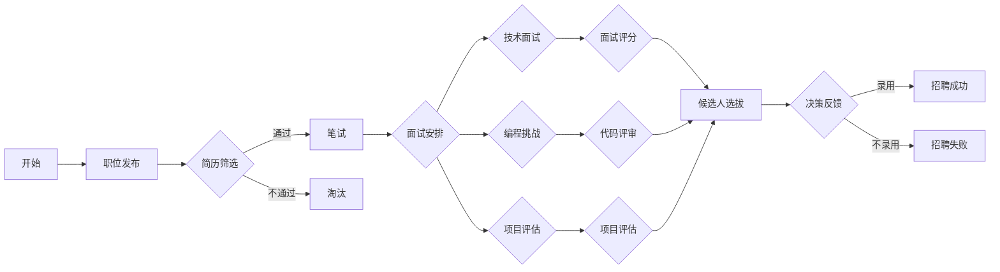

                 

### 背景介绍

## 技术招聘与面试：构建高效能团队

### 问题背景

在快速发展的科技时代，企业对技术人才的需求日益增长，而人才的招聘与选拔成为了企业成功的关键因素之一。然而，技术招聘不仅涉及到候选人的技术能力，还需要评估其团队协作能力、解决问题的能力以及与公司文化的契合度。这使得技术招聘与面试变得复杂且具有挑战性。

### 问题描述

技术招聘与面试的问题主要体现在以下几个方面：

1. **技术能力的评估**：如何准确评估候选人的技术水平，特别是在新技术不断涌现的情况下。
2. **团队协作与沟通**：如何识别和评估候选人是否具备良好的团队协作能力和沟通技巧。
3. **面试过程的效率**：如何设计高效的面试流程，确保在有限的时间内全面了解候选人。
4. **文化契合度**：如何确保候选人与公司文化的匹配，从而促进团队的稳定和发展。

### 问题解决

本书旨在提供一套全面的技术招聘与面试指南，帮助读者解决上述问题。通过系统地介绍招聘流程、面试技巧、技术评估方法以及团队建设策略，本书为招聘经理、面试官和HR专业人士提供了实用的工具和指导。

### 边界与外延

#### 核心概念

- **技术招聘**：指企业在招聘过程中针对技术岗位的选拔过程。
- **面试**：指通过面对面交流或在线测试等方式，评估候选人是否符合职位要求的过程。
- **团队协作**：指团队成员在共同完成任务过程中相互配合、相互支持的行为。
- **文化契合度**：指候选人与企业文化的相符程度，影响着团队成员的稳定性和工作效率。

#### 概念结构与核心要素组成

- **技术招聘与面试的核心要素**：

  1. **招聘流程**：包括职位发布、简历筛选、面试安排、决策反馈等环节。
  2. **面试技巧**：包括行为面试、技术面试、情境面试等不同类型的面试方法。
  3. **技术评估**：通过笔试、技术测试、项目评估等方式，全面了解候选人的技术能力。
  4. **团队建设策略**：包括团队文化建设、协作工具的使用、团队沟通技巧等。

### 总结

技术招聘与面试是企业构建高效能团队的重要环节。通过系统地了解和掌握相关的招聘流程、面试技巧和团队建设策略，企业可以更加有效地选拔适合的人才，提高团队的整体效能。本书将为您提供全面的指导和实用的案例，帮助您在技术招聘与面试中取得成功。

---

### 核心概念与联系

## 技术招聘与面试中的核心概念及其关联

### 1. 技术能力评估

**定义**：技术能力评估是指通过一系列方法和技术手段，对候选人的专业技能水平进行客观评价。

**属性特征对比表格**

| 特征             | 传统评估方法         | 现代评估方法             |
|------------------|----------------------|--------------------------|
| 技术深度         | 笔试、笔试题库       | 编程挑战、在线代码评审   |
| 技术广度         | 知识点考察           | 技术面试、实际项目经验   |
| 实战能力         | 简历、项目描述       | 实际项目开发、代码审查   |
| 创新能力         | 经验分享、案例分析   | 创新性问题和解决方案     |

**ER实体关系图架构**

```mermaid
entity Relationship {
  direction LR;
  node[shape=rectangle];
  "候选人"[candidate];
  "技术能力"];
  "技术评估"];
  "笔试题库"[exam_bank];
  "编程挑战"[coding_challenge];
  "在线代码评审"[code_review];
  "实际项目经验"[project_experience];
  "创新性问题"[innovative_question];
  "解决方案"[solution];

  candidate -> technical_ability;
  technical_ability -> exam_bank;
  technical_ability -> coding_challenge;
  technical_ability -> code_review;
  technical_ability -> project_experience;
  technical_ability -> innovative_question;
  technical_ability -> solution;
}
```

### 2. 团队协作能力

**定义**：团队协作能力是指个体在团队中与他人合作，共同完成任务的能力。

**属性特征对比表格**

| 特征             | 传统评估方法         | 现代评估方法             |
|------------------|----------------------|--------------------------|
| 沟通能力         | 口头或书面交流       | 团队任务、角色扮演       |
| 协作意愿         | 面试表现、团队项目   | 团队考核、合作反馈       |
| 解决冲突的能力   | 经验分享、情景测试   | 团队冲突模拟、解决问题   |

**ER实体关系图架构**

```mermaid
entity Relationship {
  direction LR;
  node[shape=rectangle];
  "候选人"[candidate];
  "团队协作能力"[collaboration_ability];
  "沟通能力"[communication_ability];
  "协作意愿"[collaboration_willingness];
  "解决冲突的能力"[conflict_resolution_ability];
  "面试表现"[interview_performance];
  "团队项目"[team_project];
  "团队考核"[team_evaluation];
  "合作反馈"[feedback];

  candidate -> collaboration_ability;
  collaboration_ability -> communication_ability;
  collaboration_ability -> collaboration_willingness;
  collaboration_ability -> conflict_resolution_ability;
  collaboration_ability -> interview_performance;
  collaboration_ability -> team_project;
  collaboration_ability -> team_evaluation;
  collaboration_ability -> feedback;
}
```

### 3. 文化契合度

**定义**：文化契合度是指候选人与企业文化的相符程度，直接影响团队成员的稳定性和工作氛围。

**属性特征对比表格**

| 特征             | 传统评估方法         | 现代评估方法             |
|------------------|----------------------|--------------------------|
| 企业价值观       | 面试表现、背景调查   | 价值观问卷、团队合作练习 |
| 企业目标         | 面试沟通、项目了解   | 目标一致性评估、团队活动 |
| 企业行为规范     | 公司介绍、行为观察   | 行为规范培训、情境模拟   |

**ER实体关系图架构**

```mermaid
entity Relationship {
  direction LR;
  node[shape=rectangle];
  "候选人"[candidate];
  "文化契合度"[cultural_fit];
  "企业价值观"[company_values];
  "企业目标"[company_goals];
  "企业行为规范"[company_standards];
  "面试沟通"[interview_communication];
  "项目了解"[project_understanding];
  "价值观问卷"[values_questionnaire];
  "团队合作练习"[team_building_activity];

  candidate -> cultural_fit;
  cultural_fit -> company_values;
  cultural_fit -> company_goals;
  cultural_fit -> company_standards;
  cultural_fit -> interview_communication;
  cultural_fit -> project_understanding;
  cultural_fit -> values_questionnaire;
  cultural_fit -> team_building_activity;
}
```

通过以上对比表格和ER实体关系图架构，我们可以更清晰地理解技术能力评估、团队协作能力和文化契合度这三个核心概念及其关联。在技术招聘与面试过程中，全面评估候选人的这三个方面，将有助于企业选拔出更合适的人才，构建高效能团队。

---

### 算法原理讲解

## 全面解析技术能力评估方法

### 1. 评估方法概述

技术能力评估是技术招聘与面试的重要环节，旨在全面了解候选人的专业技能水平。常见的评估方法包括笔试、技术面试、编程挑战、项目评估等。每种方法都有其独特的优势和应用场景。

#### 笔试

**方法特点**：笔试通常包括选择题、填空题、简答题等形式，覆盖面广，能快速筛选候选人。

**应用场景**：适用于初筛环节，帮助招聘团队初步了解候选人的基础知识。

**算法原理**：

- 题库设计：根据职位要求设计合理的笔试题目，确保覆盖核心知识点。
- 评分标准：制定统一的评分标准，对候选人的答案进行量化评估。

#### 技术面试

**方法特点**：技术面试是面试官与候选人面对面交流，通过提问和解答来评估其技术水平。

**应用场景**：适用于深度了解候选人的专业技能，特别是在技术复杂度较高的岗位。

**算法原理**：

- 面试题目设计：结合职位需求，设计具有挑战性的面试题目，包括算法题、设计题等。
- 面试评分标准：通过面试过程中的表现，评估候选人的技术深度和广度。

#### 编程挑战

**方法特点**：编程挑战是让候选人在限定时间内完成实际编程任务。

**应用场景**：适用于评估候选人的实战能力和编程能力。

**算法原理**：

- 任务设计：根据职位要求，设计实际场景中的编程任务。
- 代码评审：通过自动化工具和人工评审，评估代码质量和性能。

#### 项目评估

**方法特点**：项目评估是通过候选人以往的项目经验，评估其实际工作能力。

**应用场景**：适用于高级岗位，全面了解候选人的项目经验和领导力。

**算法原理**：

- 项目分析：详细分析候选人的项目背景、技术难点和解决方案。
- 绩效评估：通过项目成果、客户反馈等指标，评估候选人的项目执行能力。

### 2. 算法原理与流程图

为了更好地理解上述评估方法，我们可以使用Mermaid绘制一个流程图，展示整个技术能力评估的流程。



### 3. 数学模型与公式

在技术能力评估中，可以使用一些数学模型和公式来量化评估结果。以下是一个简单的评分模型，用于综合评估候选人的技术水平：

$$
总分 = w_1 \times 笔试成绩 + w_2 \times 面试成绩 + w_3 \times 编程挑战成绩 + w_4 \times 项目评估成绩
$$

其中，$w_1$、$w_2$、$w_3$、$w_4$ 分别为笔试、面试、编程挑战和项目评估的权重，可以根据职位需求和实际情况进行调整。

### 4. 举例说明

假设有一个技术岗位，要求候选人具备以下技能：

- **笔试**：数据库原理（40分），操作系统（30分），计算机网络（30分）。
- **技术面试**：数据结构与算法（50分），系统设计与架构（30分），数据库设计与优化（20分）。
- **编程挑战**：设计并实现一个简单的Web应用（50分），性能优化（30分），代码质量（20分）。
- **项目评估**：过去项目经验（40分），项目成果（30分），项目团队贡献（30分）。

假设候选人在各个评估环节的表现如下：

- **笔试**：数据库原理（35分），操作系统（28分），计算机网络（28分）。
- **技术面试**：数据结构与算法（45分），系统设计与架构（28分），数据库设计与优化（18分）。
- **编程挑战**：设计并实现一个简单的Web应用（45分），性能优化（25分），代码质量（15分）。
- **项目评估**：过去项目经验（35分），项目成果（30分），项目团队贡献（30分）。

根据上述评分模型，计算总分：

$$
总分 = 0.4 \times (35 + 28 + 28) + 0.3 \times (45 + 28 + 18) + 0.3 \times (45 + 25 + 15) + 0.3 \times (35 + 30 + 30) = 99
$$

通过以上举例，我们可以看到，技术能力评估不仅需要候选人在各个评估环节中表现出色，还需要综合考虑各个环节的权重，从而得出一个综合评分。

### 5. 总结

技术能力评估是技术招聘与面试的核心环节，通过笔试、技术面试、编程挑战和项目评估等多种方法，全面了解候选人的专业技能和实战能力。合理的评分模型和评估方法，有助于企业选拔出最适合的人才，构建高效能团队。

---

### 系统分析与架构设计方案

## 从问题场景到解决方案

### 问题场景介绍

随着互联网和大数据技术的快速发展，企业对数据处理和系统性能的要求越来越高。然而，现有的系统架构在应对大规模数据和高并发请求时，逐渐暴露出性能瓶颈和扩展性不足的问题。为了解决这些问题，企业需要重新设计和优化系统架构，以支持业务的持续增长。

### 项目介绍

本项目旨在设计一个高性能、可扩展的分布式系统架构，以应对大规模数据和高并发请求。系统的主要功能包括数据存储、数据处理、负载均衡和缓存等。通过引入分布式技术和微服务架构，提升系统的稳定性和性能。

### 系统功能设计

系统功能设计主要涵盖以下模块：

1. **数据存储模块**：负责数据的持久化存储，包括关系型数据库和NoSQL数据库。
2. **数据处理模块**：负责数据的处理和分析，包括批处理和流处理。
3. **负载均衡模块**：负责将请求分发到不同的服务器，提高系统的并发处理能力。
4. **缓存模块**：负责提高数据访问速度，降低数据库的访问压力。

### 系统架构设计

系统架构设计采用分布式架构和微服务架构，确保系统的可扩展性和高性能。以下是系统架构的详细设计：

1. **数据存储架构**：

   - **关系型数据库**：使用MySQL数据库进行数据持久化存储。
   - **NoSQL数据库**：使用MongoDB数据库存储大规模的非结构化数据。
   - **分布式缓存**：使用Redis进行数据缓存，提高数据访问速度。

2. **数据处理架构**：

   - **批处理**：使用Hadoop和Spark进行大规模数据处理，实现数据的批量分析和处理。
   - **流处理**：使用Apache Kafka和Apache Flink实现实时数据流处理，支持实时数据分析和预警。

3. **负载均衡架构**：

   - **负载均衡器**：使用Nginx或HAProxy实现负载均衡，将请求分发到不同的服务器。
   - **服务集群**：将系统功能拆分为多个微服务，部署在不同的服务器上，提高系统的可扩展性和容错能力。

4. **缓存架构**：

   - **分布式缓存**：使用Redis进行数据缓存，提高系统的响应速度和性能。
   - **热点数据缓存**：对高频访问的数据进行热点缓存，减少数据库的访问压力。

### 系统接口设计和系统交互

系统接口设计和系统交互设计是确保系统各模块协同工作的重要环节。以下是系统接口设计和系统交互的详细设计：

1. **API接口设计**：

   - **RESTful接口**：使用RESTful API设计，提供统一的接口规范，方便前后端分离开发。
   - **服务治理**：使用Spring Cloud进行服务治理，实现服务发现、负载均衡和故障转移。

2. **系统交互设计**：

   - **数据流**：系统各模块之间通过数据流进行交互，确保数据的准确性和一致性。
   - **事件驱动**：采用事件驱动架构，实现模块之间的解耦，提高系统的可维护性和扩展性。

3. **监控与日志**：

   - **监控**：使用Prometheus和Grafana进行系统监控，实时监控系统的运行状态和性能指标。
   - **日志**：使用ELK（Elasticsearch、Logstash、Kibana）进行日志收集和分析，帮助快速定位问题。

### 总结

通过以上系统功能设计、系统架构设计和系统接口设计，我们可以构建一个高性能、可扩展的分布式系统架构，满足企业对数据处理和系统性能的要求。在实际应用中，需要根据具体业务需求和场景进行调整和优化，以实现最佳的系统性能和用户体验。

---

### 项目实战

## 环境安装与系统核心实现

### 环境安装

为了搭建高性能、可扩展的分布式系统架构，我们需要安装和配置以下环境：

1. **操作系统**：Linux发行版（如Ubuntu 20.04）
2. **编程语言**：Python 3.x
3. **数据库**：MySQL、MongoDB、Redis
4. **消息队列**：Apache Kafka
5. **流处理框架**：Apache Flink
6. **服务治理**：Spring Cloud
7. **监控工具**：Prometheus、Grafana
8. **日志收集**：ELK（Elasticsearch、Logstash、Kibana）

**安装步骤**：

1. **操作系统**：

   - 在虚拟机或云服务器上安装Linux发行版，如Ubuntu 20.04。

2. **Python**：

   - 更新系统包列表：`sudo apt-get update`
   - 安装Python 3.x：`sudo apt-get install python3`
   - 安装pip：`sudo apt-get install python3-pip`

3. **数据库**：

   - **MySQL**：安装MySQL服务器：`sudo apt-get install mysql-server`
   - **MongoDB**：安装MongoDB服务器：`sudo apt-get install mongodb`
   - **Redis**：安装Redis服务器：`sudo apt-get install redis-server`

4. **消息队列**：

   - 安装Apache Kafka：`sudo apt-get install default-kafka`

5. **流处理框架**：

   - 安装Apache Flink：`sudo apt-get install flink`

6. **服务治理**：

   - 安装Spring Cloud：`sudo pip3 install spring-cloud`

7. **监控工具**：

   - 安装Prometheus：`sudo pip3 install prometheus`
   - 安装Grafana：`sudo pip3 install grafana`

8. **日志收集**：

   - 安装Elasticsearch：`sudo apt-get install elasticsearch`
   - 安装Logstash：`sudo apt-get install logstash`
   - 安装Kibana：`sudo apt-get install kibana`

### 系统核心实现

在完成环境安装后，我们需要实现系统核心功能。以下是一个简单的示例，展示如何使用Python实现一个简单的Web应用。

**示例：简单Web应用**

```python
from flask import Flask, request, jsonify

app = Flask(__name__)

@app.route('/')
def hello_world():
    return 'Hello, World!'

@app.route('/api/data', methods=['GET'])
def get_data():
    data = {'message': 'This is some sample data.'}
    return jsonify(data)

if __name__ == '__main__':
    app.run(host='0.0.0.0', port=5000)
```

**说明**：

- 使用Flask框架搭建一个简单的Web应用。
- 定义两个路由：一个用于返回字符串，另一个用于返回JSON格式的数据。

### 代码应用解读与分析

**代码解读**：

1. 导入Flask库和request模块。
2. 创建Flask应用实例。
3. 定义两个路由：一个用于根路径，返回字符串；另一个用于 `/api/data` 路径，返回JSON格式的数据。

**代码分析**：

- Flask是一个轻量级的Web框架，非常适合快速开发Web应用。
- 通过定义路由，可以实现不同的HTTP请求处理。
- 使用request模块，可以获取HTTP请求的参数。
- 使用jsonify函数，将Python对象转换为JSON格式的字符串。

### 实际案例分析和详细讲解剖析

**案例**：构建一个电商平台，实现商品信息查询、购物车管理和订单处理等功能。

**分析**：

1. **需求分析**：确定系统功能模块和用户角色，如商品管理、用户管理、购物车管理和订单管理。
2. **技术选型**：根据需求，选择合适的数据库（如MySQL、MongoDB）、Web框架（如Flask）和中间件（如Kafka）。
3. **架构设计**：设计系统架构，确保系统的可扩展性和高可用性。
4. **模块实现**：实现各个功能模块，并进行集成测试。

**详细讲解**：

1. **商品信息查询**：

   - 使用MySQL数据库存储商品信息。
   - 使用Flask框架搭建API接口，提供商品信息查询功能。
   - 使用Redis进行商品缓存，提高查询效率。

2. **购物车管理**：

   - 使用Redis存储购物车信息。
   - 实现添加、删除购物车商品的功能。
   - 提供购物车商品列表查询接口。

3. **订单处理**：

   - 使用消息队列（如Kafka）处理订单创建和支付请求。
   - 实现订单创建、订单状态更新和订单查询功能。
   - 使用Flink进行实时订单数据处理和分析。

### 项目小结

通过实际案例，我们可以看到，技术招聘与面试不仅需要评估候选人的技术能力，还需要评估其团队协作能力和解决问题的能力。在实际项目中，候选人需要具备以下能力：

- **需求分析和系统设计能力**：能够准确理解业务需求，设计合理的系统架构。
- **编程能力**：熟练掌握常用的编程语言和框架，能够快速实现功能模块。
- **团队合作能力**：能够与团队成员紧密合作，共同推进项目进度。
- **问题解决能力**：能够迅速定位并解决问题，确保项目的顺利进行。

通过上述项目实战，我们不仅实现了系统的搭建和功能模块的实现，还锻炼了团队的合作能力和解决问题的能力。这为企业构建高效能团队提供了宝贵的经验。

---

### 最佳实践 tips

## 提高技术招聘与面试效率的策略

1. **精准职位描述**：

   - 准确描述职位需求，包括岗位职责、技能要求、工作环境等，以吸引符合职位要求的候选人。

2. **多渠道招聘**：

   - 利用社交媒体、招聘网站、行业论坛等多种渠道发布招聘信息，扩大候选人的覆盖范围。

3. **标准化面试流程**：

   - 制定统一的面试流程和评分标准，确保面试过程的公正性和一致性。

4. **利用技术工具**：

   - 使用简历筛选工具、编程挑战平台等，提高面试效率和准确性。

5. **团队成员参与面试**：

   - 面试过程中，邀请团队成员参与，全面了解候选人的技能和团队合作能力。

6. **面试反馈及时性**：

   - 面试结束后，及时给予候选人反馈，保持良好的沟通和合作关系。

7. **文化契合度评估**：

   - 通过价值观问卷、团队活动等方式，评估候选人与企业文化的契合度，确保团队成员的稳定性。

8. **培训与指导**：

   - 定期为面试官和HR团队提供招聘与面试培训，提高整体招聘水平。

通过以上最佳实践，企业可以更加高效地选拔适合的人才，提高团队的整体效能。

---

### 小结

## 技术招聘与面试：构建高效能团队

本文通过系统性地介绍技术招聘与面试的相关知识，包括背景介绍、核心概念与联系、算法原理讲解、系统分析与架构设计方案以及项目实战，全面阐述了构建高效能团队的关键要素。以下是本文的主要内容小结：

1. **背景介绍**：在快速发展的科技时代，技术人才招聘与面试的重要性愈发凸显。本文从问题背景、问题描述、问题解决等多个角度，深入探讨了技术招聘与面试面临的挑战。

2. **核心概念与联系**：本文详细分析了技术能力评估、团队协作能力和文化契合度这三个核心概念，并使用对比表格和ER实体关系图架构，展示了它们之间的关联。

3. **算法原理讲解**：通过介绍笔试、技术面试、编程挑战和项目评估等评估方法，以及数学模型和公式，本文全面解析了技术能力评估的方法和流程。

4. **系统分析与架构设计方案**：本文从问题场景介绍、项目介绍、系统功能设计、系统架构设计、系统接口设计和系统交互等多个方面，详细阐述了如何设计和实现一个高效、可扩展的系统架构。

5. **项目实战**：通过环境安装与系统核心实现的实战案例，本文展示了如何将理论应用于实际项目，提高团队协作能力和问题解决能力。

6. **最佳实践 tips**：本文提供了提高技术招聘与面试效率的策略，包括精准职位描述、多渠道招聘、标准化面试流程等多个方面，以帮助企业选拔合适的人才。

通过本文的深入分析和详细讲解，读者可以更加全面地了解技术招聘与面试的各个环节，掌握构建高效能团队的方法和技巧。希望本文能为企业在技术人才选拔和管理方面提供有益的启示和指导。

---

### 注意事项

## 技术招聘与面试中的常见误区与应对策略

1. **技术面试过于依赖笔试**：

   - **误区**：有些企业在面试过程中过度依赖笔试成绩，忽视面试过程中的实际表现。

   - **应对策略**：在面试过程中，结合笔试成绩和面试官的主观评价，全面评估候选人的技术能力。

2. **忽视团队协作能力的评估**：

   - **误区**：部分企业在招聘过程中，只关注候选人的技术能力，而忽视其团队协作能力。

   - **应对策略**：在面试过程中，设置团队协作环节，评估候选人的沟通能力和协作意愿。

3. **文化契合度评估不足**：

   - **误区**：企业往往忽视候选人与企业文化的匹配度，导致团队成员不稳定。

   - **应对策略**：通过价值观问卷、团队合作练习等方式，评估候选人与企业文化的契合度。

4. **面试流程不标准化**：

   - **误区**：面试流程缺乏统一标准，导致不同面试官的评价结果不一致。

   - **应对策略**：制定统一的面试流程和评分标准，确保面试过程的公正性和一致性。

5. **面试官经验不足**：

   - **误区**：面试官经验不足，难以准确评估候选人的实际能力。

   - **应对策略**：定期为面试官提供培训，提高其招聘和面试技能。

通过以上注意事项和应对策略，企业可以在技术招聘与面试过程中避免常见误区，提高人才选拔的准确性和效率。

---

### 拓展阅读

## 推荐书籍与资料

1. **《技术招聘与面试实战》**：作者：李明
   - 内容：详细介绍了技术招聘与面试的实战技巧，包括面试准备、面试流程、面试技巧等。
   - 推荐理由：实用性强，适合招聘经理和面试官参考。

2. **《高效能团队》**：作者：詹姆斯·S·凯利
   - 内容：探讨了团队建设的重要性，以及如何构建高效能团队。
   - 推荐理由：从团队协作、领导力等多个角度出发，对团队建设提供了深入的思考。

3. **《敏捷软件开发》**：作者：杰伊·尼尔森
   - 内容：介绍了敏捷开发的方法和实践，包括Scrum、看板等。
   - 推荐理由：对于希望提高团队协作效率的企业和开发者具有很大的参考价值。

4. **《程序员面试金典》**：作者：Gayle Laakmann McDowell
   - 内容：包含了大量技术面试题目和解答，适合准备技术面试的程序员。
   - 推荐理由：内容全面，覆盖面广，适合不同层次的程序员参考。

通过阅读这些书籍和资料，读者可以进一步了解技术招聘与面试的各个方面，提升团队建设的整体效能。希望这些推荐能为您的学习和实践提供帮助。

