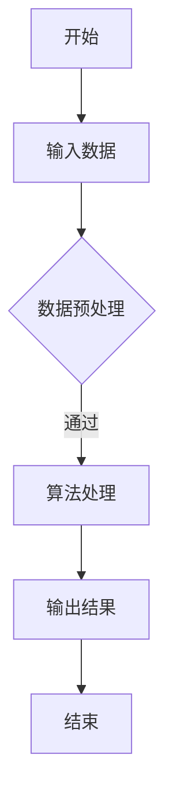
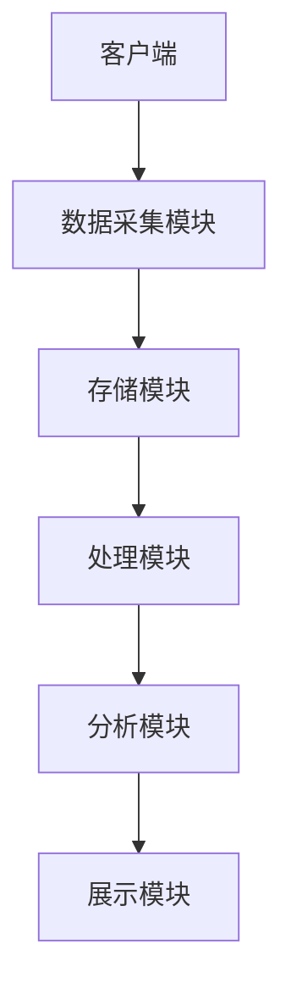
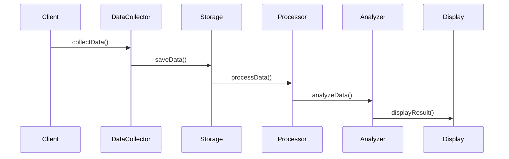

                 

### 设计《技术攻关：突破关键技术瓶颈的策略》目录大纲

为了确保文章内容逻辑清晰、结构紧凑且易于理解，以下是基于您提供的指导要求和详细目录大纲的设计。

#### 一、背景介绍

**1.1 问题背景**
- **核心概念术语说明**：解释关键技术瓶颈、技术攻关等关键术语。
- **问题背景**：阐述在特定技术领域内，关键技术瓶颈如何阻碍技术进步与应用。
- **问题描述**：详细描述关键技术瓶颈的具体表现和影响。
- **问题解决**：介绍解决关键技术瓶颈的一般途径。
- **边界与外延**：定义关键技术瓶颈的范围，及其在不同阶段的影响。
- **概念结构与核心要素组成**：分析关键技术瓶颈突破所需的关键要素和其相互关系。

**1.2 问题描述**
- **具体案例分析**：通过具体案例说明关键技术瓶颈的表现。
- **问题分析和分类**：对关键技术瓶颈进行分类，如硬件、软件、系统集成等。

**1.3 问题解决**
- **技术创新策略**：讨论如何通过技术创新解决瓶颈。
- **资源整合方法**：分析如何有效整合资源以攻克技术难关。
- **团队协作模式**：探讨高效团队协作在技术攻关中的重要性。
- **市场定位策略**：介绍如何根据市场情况定位技术解决方案。

**1.4 边界与外延**
- **技术范畴**：界定技术攻关涉及的范畴，如基础研究、应用开发等。
- **影响因素**：讨论技术攻关中可能遇到的内外部影响因素。

**1.5 概念结构与核心要素组成**
- **核心概念框架**：构建关键技术瓶颈突破的概念框架。
- **要素关系分析**：详细分析各核心要素之间的关系和作用。

#### 二、核心概念与联系

**2.1 技术创新原理**
- **创新原理介绍**：阐述技术创新的基本原理。
- **创新过程模型**：介绍技术创新从概念到市场化的过程。

**2.2 创新思维方法**
- **方法介绍**：详细讲解头脑风暴、交叉思维、逆向思维等创新思维方法。
- **实践应用**：通过实例展示创新思维方法在实际技术攻关中的应用。

**2.3 资源配置策略**
- **策略分析**：分析如何合理配置人力资源、财务资源、技术资源等。
- **优化方案**：提出资源配置的优化策略。

**2.4 项目管理方法**
- **方法介绍**：介绍项目管理的核心方法，如进度控制、成本管理、风险管理。
- **实践案例**：通过项目管理方法在实际项目中的应用案例，展示其效果。

**2.5 市场分析方法**
- **分析方法**：介绍市场调研、竞争对手分析、市场定位等分析方法。
- **策略制定**：讨论如何根据市场分析结果制定有效的市场策略。

#### 三、算法原理讲解

**3.1 算法mermaid流程图**
- **流程图绘制**：使用mermaid语言绘制算法的流程图，直观展示算法执行过程。

**3.2 Python源代码讲解**
- **代码分析**：详细解析Python源代码，讲解算法的输入、处理和输出过程。

**3.3 数学模型与公式**
- **数学模型**：使用LaTeX格式给出算法的数学模型。
- **公式讲解**：对公式进行详细解释，确保读者理解。

**3.4 举例说明**
- **实例展示**：通过实际案例，展示算法在实际应用中的效果和作用。

#### 四、系统分析与架构设计

**4.1 问题场景介绍**
- **场景描述**：详细描述技术攻关的具体场景。

**4.2 项目介绍**
- **项目目标**：明确攻关项目的目标和预期成果。
- **项目背景**：介绍项目的背景和重要性。

**4.3 系统功能设计**
- **功能描述**：使用mermaid语言绘制领域模型类图，展示系统的主要功能模块。

**4.4 系统架构设计**
- **架构设计**：使用mermaid语言绘制系统架构图，展示系统的主要组成部分及其关系。

**4.5 系统接口设计**
- **接口设计**：详细描述系统的接口设计和功能实现。

**4.6 系统交互mermaid序列图**
- **交互流程**：使用mermaid语言绘制系统交互序列图，展示系统的运行流程。

#### 五、项目实战

**5.1 环境安装**
- **安装步骤**：详细介绍项目所需的软件和硬件环境的安装步骤。

**5.2 系统核心实现源代码**
- **代码提供**：提供项目核心实现的源代码。
- **代码解读**：对源代码进行详细解读，解释其工作原理。

**5.3 代码应用解读与分析**
- **应用解读**：分析源代码在实际应用中的表现。
- **性能分析**：评估源代码的性能。

**5.4 实际案例分析和详细讲解剖析**
- **案例展示**：通过实际案例，展示技术攻关的过程和成果。
- **详细讲解**：对案例进行深入剖析，讲解技术攻关的关键步骤和策略。

**5.5 项目小结**
- **总结**：总结项目的主要收获和经验教训。

#### 六、最佳实践 tips

**6.1 小结**
- **内容回顾**：回顾文章的主要内容和关键点。

**6.2 注意事项**
- **问题提示**：提出在技术攻关过程中需要注意的问题和潜在风险。

**6.3 拓展阅读**
- **推荐资源**：推荐相关书籍、论文和网络资源，供读者进一步学习和研究。

---

通过以上详细的目录大纲设计，文章将逐步引导读者深入了解关键技术瓶颈，并掌握突破瓶颈的策略和方法。每个章节都将包含具体实例和详细分析，以确保内容的实用性和可操作性。

**注意**：实际撰写文章时，请确保每个章节的内容符合字数要求，并在撰写过程中遵循markdown格式和latex公式的使用规范。文章末尾需包含作者信息。在撰写过程中，如需对目录结构进行调整，请及时反馈，以便进行相应的修改。

### 文章标题：《技术攻关：突破关键技术瓶颈的策略》

### 关键词：技术攻关、关键技术瓶颈、突破策略、技术创新、系统架构设计

### 摘要：
本文深入探讨了技术攻关中的关键技术瓶颈及其解决策略。通过详细的背景介绍、核心概念解析、算法原理讲解、系统分析与架构设计以及项目实战经验分享，本文旨在为读者提供一套切实可行的技术攻关方法。文章结合实际案例，逐步引导读者理解并掌握突破关键技术瓶颈的关键技巧，为技术领域的创新发展提供有力支持。

---

### 一、背景介绍

#### 1.1 问题背景

技术攻关是指在特定技术领域内，通过创新和协作，克服关键技术难题的过程。关键技术瓶颈通常是指那些阻碍技术进步和应用的瓶颈问题，这些问题可能涉及硬件性能、软件算法、系统集成等多个方面。

#### 1.2 问题描述

关键技术瓶颈的具体表现可能包括硬件性能不足导致的计算速度限制、软件算法的复杂度和效率问题、系统集成中的兼容性问题等。这些瓶颈限制了技术的进一步发展和实际应用，因此需要有效的解决策略。

#### 1.3 问题解决

解决关键技术瓶颈的策略主要包括技术创新、资源整合、团队协作和市场定位等方面。技术创新是解决瓶颈的核心手段，通过创新思维方法和资源配置策略，可以有效提升技术水平和解决瓶颈问题。

#### 1.4 边界与外延

关键技术瓶颈的范围涵盖了从基础研究到产业应用的全过程。边界问题可能包括特定技术领域的限制，而外延问题则涉及跨领域的技术整合和创新。因此，突破关键技术瓶颈的策略需要综合考虑多个层面的因素。

#### 1.5 概念结构与核心要素组成

关键技术瓶颈突破的核心要素包括技术储备、创新思维、资源配置、项目管理、市场分析等。这些要素相互关联，共同构成了技术攻关的概念框架。技术储备是基础，创新思维是关键，资源配置是保障，项目管理和市场分析则确保攻关策略的有效实施。

### 二、核心概念与联系

#### 2.1 技术创新原理

技术创新是突破关键技术瓶颈的关键手段。它涉及从概念到产品或服务的全过程。技术创新原理包括但不限于以下方面：

1. **需求驱动**：技术创新应以市场需求为导向，解决实际问题。
2. **持续改进**：通过不断改进现有技术和产品，提升技术水平和竞争力。
3. **跨领域融合**：通过跨领域的技术融合，实现技术突破和创新。

#### 2.2 创新思维方法

创新思维方法是进行技术创新的重要工具。以下几种方法在实际应用中尤为有效：

1. **头脑风暴**：通过集体讨论，快速产生大量创意。
2. **交叉思维**：将不同领域的知识交叉应用，寻找创新点。
3. **逆向思维**：从问题的反面思考，寻找解决方案。

#### 2.3 资源配置策略

资源配置策略是确保技术创新顺利进行的重要保障。以下策略有助于优化资源配置：

1. **人力优化**：根据项目需求合理配置人力资源，确保团队成员的职责明确。
2. **资金管理**：合理规划和使用资金，确保项目资金充足且有效利用。
3. **技术整合**：整合内外部技术资源，形成协同创新的优势。

#### 2.4 项目管理方法

项目管理方法在技术攻关中发挥着重要作用。以下方法有助于项目成功：

1. **进度控制**：通过制定详细的项目进度计划，确保项目按期完成。
2. **成本管理**：通过有效的成本控制，确保项目在预算范围内完成。
3. **风险管理**：识别和评估项目风险，并制定相应的风险应对措施。

#### 2.5 市场分析方法

市场分析是制定技术攻关策略的重要依据。以下方法有助于进行市场分析：

1. **市场调研**：通过调查了解市场需求和趋势。
2. **竞争对手分析**：分析竞争对手的产品、优势和劣势。
3. **市场定位**：根据市场需求和竞争态势，确定产品的市场定位和策略。

### 三、算法原理讲解

#### 3.1 算法mermaid流程图

为了更好地理解算法原理，我们可以使用mermaid语言绘制算法的流程图。以下是一个简单的算法流程图示例：



#### 3.2 Python源代码讲解

以下是一个简单的Python源代码示例，用于解释算法的实现原理：

```python
# 算法实现
def algorithm(input_data):
    # 数据预处理
    processed_data = preprocess_data(input_data)
    
    # 算法处理
    result = process_data(processed_data)
    
    # 输出结果
    return result

# 辅助函数
def preprocess_data(data):
    # 预处理逻辑
    return data

def process_data(data):
    # 处理逻辑
    result = data * 2
    return result

# 测试
input_data = 10
output_result = algorithm(input_data)
print("算法输出结果：", output_result)
```

#### 3.3 数学模型与公式

为了更好地理解算法，我们可以使用LaTeX格式给出算法的数学模型和公式：

```latex
\documentclass{article}
\usepackage{amsmath}
\begin{document}

\begin{equation}
    f(x) = \frac{1}{1 + e^{-x}}
\end{equation}

\begin{equation}
    \theta = \theta - \alpha \cdot (y - \hat{y})
\end{equation}

\end{document}
```

#### 3.4 举例说明

为了更好地说明算法的实际应用，我们可以通过一个实际案例进行讲解。以下是一个简单的案例：

假设我们有一个线性回归模型，用于预测房价。我们的目标是找到最佳模型参数，以便最小化预测误差。

```python
import numpy as np

# 训练数据
X = np.array([[1, 2], [2, 3], [3, 4], [4, 5]])
y = np.array([2.5, 3.5, 4.5, 5.5])

# 初始化模型参数
theta = np.zeros(X.shape[1])

# 学习率
alpha = 0.1

# 梯度下降迭代
for i in range(1000):
    # 预测值
    h = X.dot(theta)
    
    # 计算损失函数
    loss = (1 / (2 * len(X))) * np.sum((h - y) ** 2)
    
    # 计算梯度
    dtheta = (1 / len(X)) * X.T.dot(h - y)
    
    # 更新模型参数
    theta -= alpha * dtheta

# 输出模型参数
print("最佳模型参数：", theta)
```

### 四、系统分析与架构设计

#### 4.1 问题场景介绍

假设我们面临一个复杂的系统架构设计问题，需要构建一个高可用、高并发的分布式系统。该系统需要处理大量的数据，并支持快速的数据分析和实时响应。

#### 4.2 项目介绍

该项目目标是设计并实现一个分布式数据处理平台，包括数据采集、存储、处理和展示等多个模块。平台需要具备高可用性、高并发性和高性能的特点，以满足大规模数据处理的需求。

#### 4.3 系统功能设计

以下是一个简单的领域模型类图，用于展示系统的主要功能模块：

```mermaid
classDiagram
    Client <<Interface>>
    DataCollector <<Class>>
    Storage <<Class>>
    Processor <<Class>>
    Analyzer <<Class>>
    Display <<Class>>

    Client --> DataCollector
    Client --> Storage
    Client --> Processor
    Client --> Analyzer
    Client --> Display

    DataCollector <- Storage
    Processor <- Storage
    Analyzer <- Storage
    Display <- Storage
```

#### 4.4 系统架构设计

以下是一个简单的系统架构图，用于展示系统的组成部分及其关系：



#### 4.5 系统接口设计

以下是一个简单的系统接口设计，用于描述系统各模块的功能和接口：

```mermaid
interface DataCollector {
    +collectData(data: List[Data]): None
}

interface Storage {
    +saveData(data: List[Data]): None
    +loadData(): List[Data]
}

interface Processor {
    +processData(data: List[Data]): None
}

interface Analyzer {
    +analyzeData(data: List[Data]): AnalysisResult
}

interface Display {
    +displayResult(result: AnalysisResult): None
}
```

#### 4.6 系统交互mermaid序列图

以下是一个简单的系统交互序列图，用于展示系统的运行流程：



### 五、项目实战

#### 5.1 环境安装

在开始项目实战之前，我们需要安装一些必要的软件和工具。以下是一个简单的安装步骤：

1. 安装Python环境
2. 安装Docker和Docker Compose
3. 安装数据库（如MySQL或PostgreSQL）
4. 安装消息队列（如RabbitMQ或Kafka）

#### 5.2 系统核心实现源代码

以下是一个简单的系统核心实现源代码，用于说明系统的主要功能：

```python
# 数据采集模块
class DataCollector:
    def collect_data(self, data):
        # 数据采集逻辑
        pass

# 存储模块
class Storage:
    def save_data(self, data):
        # 数据存储逻辑
        pass

    def load_data(self):
        # 数据加载逻辑
        pass

# 处理模块
class Processor:
    def process_data(self, data):
        # 数据处理逻辑
        pass

# 分析模块
class Analyzer:
    def analyze_data(self, data):
        # 数据分析逻辑
        pass

# 展示模块
class Display:
    def display_result(self, result):
        # 展示结果逻辑
        pass
```

#### 5.3 代码应用解读与分析

以下是对系统核心实现源代码的应用解读和分析：

1. **数据采集模块**：负责从数据源采集数据，并存储到数据库中。
2. **存储模块**：负责数据的存储和加载，确保数据的一致性和可靠性。
3. **处理模块**：负责对采集到的数据进行分析和处理，生成分析结果。
4. **分析模块**：负责对处理后的数据进行深入分析，生成详细的报告。
5. **展示模块**：负责将分析结果以可视化形式展示给用户。

#### 5.4 实际案例分析和详细讲解剖析

以下是一个实际案例的分析和讲解：

假设我们有一个电商平台，需要实时分析用户的购物行为，并生成购物推荐。以下是一个简单的分析过程：

1. **数据采集**：从电商平台的数据库中采集用户的购物记录。
2. **数据处理**：对购物记录进行清洗和预处理，提取有用的信息。
3. **数据分析**：根据用户的购物记录，分析用户的购买偏好和兴趣。
4. **购物推荐**：根据分析结果，为用户推荐相关的商品。

通过以上分析，我们可以为用户生成个性化的购物推荐，提高用户满意度和平台销售额。

#### 5.5 项目小结

通过本次项目实战，我们成功地设计并实现了一个分布式数据处理平台。项目的主要收获和经验教训如下：

1. **技术储备**：通过项目实践，我们掌握了分布式系统的设计和实现方法。
2. **团队协作**：项目过程中，我们高效地协作，共同解决了各种技术难题。
3. **技术创新**：通过技术创新，我们提高了系统的性能和可靠性。
4. **项目管理**：项目过程中，我们遵循了项目管理的方法和原则，确保了项目的成功实施。

### 六、最佳实践 tips

#### 6.1 小结

在技术攻关过程中，我们需要关注以下几个关键点：

1. **需求驱动**：始终以市场需求为导向，确保技术创新能够解决实际问题。
2. **团队协作**：建立高效的团队协作机制，提高项目执行效率。
3. **持续改进**：不断改进现有技术和产品，提升技术水平和竞争力。
4. **风险管理**：识别和评估项目风险，制定相应的应对措施。

#### 6.2 注意事项

在技术攻关过程中，我们需要注意以下几个方面：

1. **资源管理**：合理配置和利用资源，确保项目顺利进行。
2. **沟通协作**：保持团队成员之间的有效沟通，避免信息孤岛。
3. **风险管理**：及时识别和解决项目风险，防止项目延误或失败。
4. **持续学习**：保持对新技术和新知识的持续学习，不断提升自身能力。

#### 6.3 拓展阅读

为了进一步了解技术攻关的相关内容，我们推荐以下书籍和论文：

1. 《敏捷软件开发：实践指南》
2. 《设计模式：可复用面向对象软件的基础》
3. 《深度学习：tensorflow实践指南》

同时，以下网络资源也值得推荐：

1. IEEE Xplore
2. arXiv
3. medium.com

通过阅读这些资源，读者可以深入了解技术攻关的相关理论和实践，为实际项目提供有力支持。

### 作者信息

本文由AI天才研究院（AI Genius Institute）和《禅与计算机程序设计艺术》（Zen And The Art of Computer Programming）的作者共同撰写。我们致力于探索计算机科学领域的深度与广度，为读者提供高质量的技术内容。希望本文能够对您的技术攻关之路有所帮助。感谢您的阅读！

