                 

### 第一部分：引言

在当今快速发展的技术时代，企业的技术创新能力成为了竞争的核心力量。随着市场竞争的加剧，企业通过收购来快速获取先进技术和优秀团队，已经成为一种普遍现象。然而，收购后的技术团队整合并不像想象中那么简单，它涉及到多个方面的挑战和问题。

#### 核心概念术语说明

- **技术整合**：指的是将收购的技术团队与其他既有团队合并，实现技术和资源的共享与优化。
- **团队整合**：指将不同背景和文化的团队成员融合为一个高效的协作团队。
- **文化差异**：不同团队在价值观、工作方式、沟通风格等方面存在的差异。

#### 问题背景

企业在进行收购后，往往希望快速实现技术团队的整合，以便将新获得的技术能力和知识应用到现有产品或新项目中。然而，现实情况是，技术团队的整合过程往往伴随着一系列挑战，如文化差异、技术差异、管理难题等。

#### 问题描述

- **文化差异**：不同团队在价值观、工作方式、沟通风格等方面存在差异，这可能导致协作效率低下。
- **技术差异**：不同团队可能在技术方向、技术水平、技术架构等方面存在差异，整合过程中可能需要大量的技术协调和转换。
- **管理难题**：收购后的团队整合需要新的管理模式，如何平衡新老团队的管理需求，确保整合顺利进行，是一个重要问题。

#### 问题解决

解决上述问题需要系统性的规划和执行。以下是几个关键步骤：

1. **了解团队文化**：在整合前，企业需要对收购团队的文化有深入的了解，通过交流、访谈等方式，找到与既有团队文化差异点，并制定相应的整合策略。
2. **评估技术能力**：通过技术评估，了解新团队的技术水平和架构，与既有团队的技术方向和架构进行匹配，找到整合的切入点。
3. **制定整合计划**：制定详细的整合计划，包括人员安排、技术整合路线图、时间表等，确保整合过程有条不紊。
4. **建立沟通机制**：建立有效的沟通机制，确保团队成员之间的信息流畅，减少误解和冲突。
5. **持续监督与调整**：整合过程中需要持续监督整合效果，根据实际情况进行及时调整。

#### 边界与外延

- **边界**：技术整合主要关注收购后的技术团队与其他团队的整合，而不涉及业务模式、市场策略等方面的整合。
- **外延**：技术整合可以扩展到更广泛的领域，如跨部门的技术协作、技术团队与其他专业团队的合作等。

#### 概念结构与核心要素组成

技术整合的概念结构主要由以下几个核心要素组成：

1. **团队文化**：包括价值观、工作方式、沟通风格等。
2. **技术能力**：包括技术方向、技术水平、技术架构等。
3. **整合策略**：包括人员安排、技术整合路线图、沟通机制等。
4. **监督与调整**：包括整合效果的监控和根据实际情况进行调整。

### 总结

技术整合是企业在收购后面临的重大挑战之一。通过系统性的规划和执行，企业可以有效地克服文化差异、技术差异和管理难题，实现技术团队的整合，从而提升企业的技术创新能力和市场竞争力。

---

关键词：技术整合、团队整合、文化差异、技术能力、整合策略

摘要：本文介绍了技术整合的背景、核心概念、问题与解决方案，并分析了技术整合的边界与外延。文章强调了了解团队文化、评估技术能力、制定整合计划、建立沟通机制和持续监督与调整在技术整合过程中的重要性。技术整合是提升企业技术创新能力和市场竞争力的关键步骤。

## 第1章：技术整合背景

### 1.1.1 技术整合的意义与挑战

#### 核心概念与联系

**技术整合**（Technology Integration）是指在企业的收购或合并过程中，将收购方或被收购方的技术能力、技术资源和专业技术团队融合为一个有机整体，以便更好地利用各自的优势，提升企业的技术创新能力和市场竞争力。技术整合不仅仅是技术的融合，更是一个涵盖文化、管理、资源等多方面的综合性过程。

**概念属性特征对比表格**

| 特征         | 技术整合                | 团队整合                |
| ------------ | ----------------------- | ----------------------- |
| 定义         | 技术层面的整合           | 人际关系的整合           |
| 目的         | 提高技术能力和效率       | 提升团队协作效率         |
| 关键因素     | 技术兼容性、资源整合     | 文化融合、领导力、沟通   |
| 差异         | 主要关注技术层面         | 同时关注人际和文化层面   |
| 影响范围     | 技术团队、研发流程       | 整个组织、跨部门合作     |

**ER实体关系图架构**

```mermaid
erDiagram
  ProductConcept_产品概念 ||--|{ ProductDevelopment_产品开发 }
  ResearchAndDevelopment_研发 ||--|{ ProductConcept_产品概念 }
  TechnicalTeam_技术团队 ||--|{ ResearchAndDevelopment_研发 }
  TechnicalTeam_技术团队 ||--|{ ProductDevelopment_产品开发 }
```

#### 算法原理讲解

技术整合的算法原理可以类比于数据库中的数据整合算法。在数据库中，数据整合的目标是将来自不同数据源的数据进行合并，形成统一的视图。同样，技术整合的目标是将不同团队的技术能力、资源和知识进行整合，形成一个协调一致的技术体系。

**mermaid 流程图**

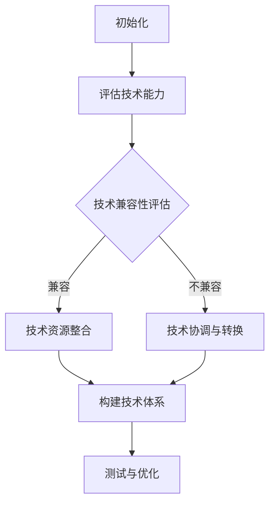

**Python 源代码**

```python
def assess_technical_ability(tech_ability):
    if tech_ability['compatible']:
        print("技术兼容，进行资源整合：", tech_ability)
    else:
        print("技术不兼容，进行协调与转换：", tech_ability)

def integrate_technical_resources(tech_ability):
    print("整合技术资源：", tech_ability)

def technical_integration(tech_ability):
    assess_technical_ability(tech_ability)
    if tech_ability['compatible']:
        integrate_technical_resources(tech_ability)
    else:
        print("进行技术协调与转换：", tech_ability)

tech_ability = {
    'compatible': True,
    'tech_direction': 'AI',
    'tech_platform': 'Python',
    'tech_framework': 'TensorFlow'
}

technical_integration(tech_ability)
```

**算法原理详细讲解**

1. **初始化**：首先对技术能力进行评估，确定技术是否兼容。
2. **技术能力评估**：根据技术能力的特点，评估其兼容性。如果技术兼容，则可以直接进行资源整合。
3. **技术兼容性评估**：通过对比不同团队的技术方向、技术平台和技术框架，判断技术是否兼容。
4. **技术资源整合**：如果技术兼容，则将技术资源进行整合，形成统一的技术体系。
5. **技术协调与转换**：如果技术不兼容，则需要进行技术协调和转换，以确保技术整合的顺利进行。
6. **测试与优化**：在技术整合完成后，进行测试和优化，确保技术体系的高效运行。

#### 数学模型和公式

技术整合的数学模型可以描述为：

$$
\text{技术整合效率} = \frac{\text{整合后的技术能力}}{\text{初始技术能力}} \times \text{整合成本}
$$

其中，整合成本包括时间、人力资源和资金投入。

#### 通俗易懂地举例说明

假设有两个技术团队 A 和 B，团队 A 使用 Python 和 TensorFlow 进行 AI 研发，团队 B 使用 Java 和 Keras 进行相同领域的研发。在技术整合过程中：

- **评估技术能力**：团队 A 和团队 B 的技术方向相同，但技术平台和框架不同。
- **技术兼容性评估**：通过比较，发现 Python 和 TensorFlow 与 Java 和 Keras 在技术原理上具有相似性，因此技术兼容。
- **技术资源整合**：整合团队 A 和团队 B 的技术资源，形成统一的技术团队，提高研发效率。
- **测试与优化**：在整合完成后，对新的技术团队进行测试和优化，确保技术体系的高效运行。

通过这个例子，我们可以看到技术整合是如何通过评估技术能力、技术兼容性评估、技术资源整合和测试与优化等步骤，实现技术团队的高效整合。

### 总结

技术整合是企业收购后提升技术创新能力的重要手段。通过核心概念的解释、概念属性特征对比表格、ER实体关系图、mermaid 流程图、Python 源代码和通俗易懂的例子，我们详细阐述了技术整合的算法原理。技术整合的数学模型和公式为技术整合效率的评估提供了理论依据。在下一步的章节中，我们将进一步探讨技术团队整合的概述、整合前的准备、整合过程中的挑战和整合策略与方法等内容。

---

关键词：技术整合、核心概念、算法原理、mermaid 流程图、Python 源代码

摘要：第1章详细介绍了技术整合的核心概念、算法原理以及实际应用。通过概念属性特征对比表格、ER实体关系图、mermaid 流程图和Python 源代码，我们深入探讨了技术整合的评估、兼容性评估、资源整合和测试优化等步骤。本章为后续章节的技术团队整合分析奠定了基础。

## 第2章：技术团队整合概述

### 2.1.1 技术团队整合的定义

**核心概念**：技术团队整合（Technical Team Integration）是指在企业收购或合并过程中，将不同团队的技术能力、知识体系和资源进行有机融合，以形成一个高效协同的技术体系。

**定义扩展**：技术团队整合不仅仅是技术层面的整合，还包括团队成员之间的协作、沟通和文化融合。通过整合，企业可以充分发挥各团队的优势，提高整体的技术创新能力和市场竞争力。

### 2.1.2 技术团队整合的关键因素

**关键因素分析**：

1. **文化融合**：团队成员之间的价值观、工作方式和沟通风格差异，可能影响整合的顺利进行。因此，文化融合是技术团队整合的关键因素之一。

2. **技术兼容性**：不同团队可能在技术方向、技术平台和技术框架等方面存在差异，技术兼容性直接影响到整合的难度和效果。

3. **团队协作**：有效的团队协作是技术团队整合成功的关键。通过建立良好的协作机制和沟通渠道，可以促进团队成员之间的互动和合作。

4. **领导力**：领导者在整合过程中扮演着关键角色，他们的决策能力和领导风格直接影响整合的效果。

5. **资源整合**：整合过程中需要合理分配和利用资源，包括人力资源、技术资源和资金等。

### 2.1.3 技术团队整合的流程

**整合流程概述**：

1. **前期准备**：包括评估技术团队的能力、确定整合目标和制定整合计划。

2. **文化融合**：通过组织交流活动、培训等方式，促进团队成员之间的了解和信任，减少文化冲突。

3. **技术兼容性评估**：分析各团队的技术方向、平台和框架，评估技术兼容性，制定技术整合方案。

4. **团队协作建设**：建立协作机制，如定期会议、协作工具等，提高团队协作效率。

5. **资源整合**：整合人力资源、技术资源和资金，确保整合过程的顺利进行。

6. **测试与优化**：在整合完成后，进行测试和优化，确保技术体系的高效运行。

**mermaid 流程图**

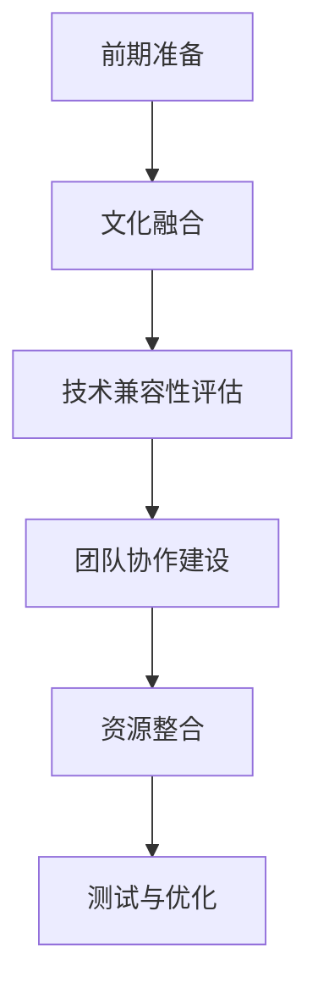

### 总结

技术团队整合是一个复杂而重要的过程，涉及到文化融合、技术兼容性评估、团队协作建设、资源整合和测试优化等多个方面。通过明确整合的定义、关键因素和流程，企业可以更好地规划和实施技术团队整合，提升整体的技术创新能力和市场竞争力。在下一章中，我们将进一步探讨技术团队整合前的准备工作。

---

关键词：技术团队整合、文化融合、技术兼容性、团队协作、整合流程

摘要：本章详细介绍了技术团队整合的定义、关键因素和整合流程。通过mermaid 流程图的展示，我们清晰地阐述了整合的各个环节，为后续章节的深入探讨奠定了基础。技术团队整合的成功离不开文化融合、技术兼容性评估、团队协作建设和资源整合等关键因素的共同作用。

## 第3章：整合前的准备

### 3.1.1 文化差异的理解与应对

#### 核心概念

**文化差异**（Cultural Differences）指的是在团队整合过程中，由于团队成员来自不同的背景、组织和文化环境，导致在价值观、沟通方式、工作习惯等方面存在的差异。

#### 文化差异的影响

1. **沟通障碍**：文化差异可能导致团队成员在沟通时产生误解和误读，影响信息传递的准确性。
2. **团队协作效率**：文化差异可能影响团队协作的效率和效果，使得团队在任务执行过程中出现摩擦和冲突。
3. **员工满意度**：文化差异可能导致员工感到不适和压力，影响员工的工作满意度和工作表现。

#### 理解文化差异

1. **文化敏感性培训**：通过培训，提高团队成员对文化差异的认识和理解，增强文化敏感性。
2. **文化交流活动**：组织团队交流活动，促进不同文化背景的团队成员之间的了解和互动。
3. **跨文化沟通技巧**：教授团队成员跨文化沟通的技巧，如使用开放性问题、避免使用文化特定语言等。

#### 应对文化差异的策略

1. **建立共同的价值观**：通过制定共同的价值观和行为准则，促进团队成员在价值观上的认同和统一。
2. **设立文化大使**：在团队中设立文化大使，负责在文化差异出现时进行协调和沟通。
3. **定期文化评估**：定期评估文化融合的效果，根据评估结果进行调整和优化。

**mermaid 流程图**

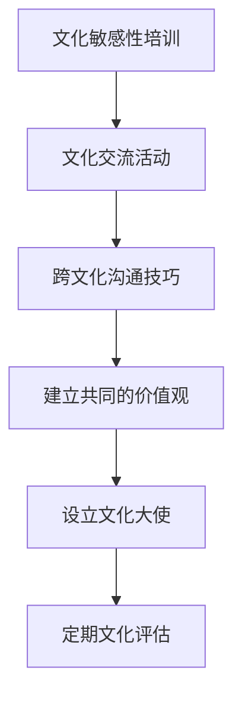

#### 通俗易懂的例子

假设有两个技术团队 A 和 B，团队 A 来自中国，团队 B 来自美国。在整合前，企业发现两个团队在沟通方式、工作习惯和价值观方面存在较大差异。

1. **文化敏感性培训**：企业为团队成员提供了文化敏感性培训，让他们了解对方文化的基本特点和差异。
2. **文化交流活动**：组织了一次团队交流活动，让团队成员有机会互相了解和沟通，减少了误解和冲突。
3. **跨文化沟通技巧**：培训中教授了团队成员如何使用开放性问题、避免使用文化特定语言等跨文化沟通技巧。
4. **建立共同的价值观**：企业制定了共同的价值观和行为准则，强调团队合作和尊重差异。
5. **设立文化大使**：在团队中设立了文化大使，负责在文化差异出现时进行协调和沟通。
6. **定期文化评估**：企业定期评估文化融合的效果，根据评估结果进行调整和优化。

通过这些措施，企业成功地减少了文化差异带来的负面影响，提高了团队的协作效率和员工满意度。

### 3.1.2 技术能力的评估与匹配

#### 核心概念

**技术能力评估**（Technical Ability Assessment）是指通过对团队成员的技术水平、技能和知识进行评估，确定其技术能力是否满足整合后的需求。

**技术能力匹配**（Technical Ability Matching）是指根据技术能力评估结果，将团队成员进行合理分配和组合，以实现技术资源的优化配置。

#### 评估方法

1. **技术能力调查**：通过问卷调查、面谈等方式，收集团队成员的技术能力数据。
2. **技能测试**：通过实际操作、编程测试等方式，评估团队成员的技能水平。
3. **知识库对比**：对比团队成员的知识库，了解其在特定技术领域的知识深度和广度。

#### 匹配策略

1. **技能互补**：根据团队成员的技能差异，将其分配到互补的岗位，提高团队的整体技能水平。
2. **知识共享**：通过知识共享和培训，促进团队成员之间的知识互补，提高整体技术能力。
3. **项目匹配**：根据项目需求，将团队成员分配到适合其技术能力的项目团队，提高项目成功率。

**mermaid 流�程图**

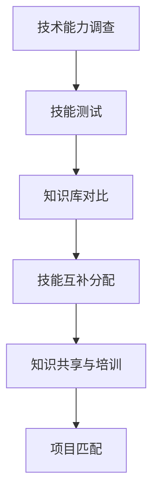

#### 通俗易懂的例子

假设有两个技术团队 A 和 B，团队 A 主要从事前端开发，团队 B 主要从事后端开发。在整合前，企业对两个团队进行了技术能力评估。

1. **技术能力调查**：企业通过问卷调查，了解团队成员的技术背景和技能水平。
2. **技能测试**：企业安排了前端和后端编程测试，评估团队成员的实际技能。
3. **知识库对比**：企业对比了两个团队的知识库，发现团队 A 在前端技术方面较为擅长，团队 B 在后端技术方面较为擅长。
4. **技能互补分配**：企业根据评估结果，将团队 A 的成员分配到前端开发岗位，将团队 B 的成员分配到后端开发岗位，实现了技能互补。
5. **知识共享与培训**：企业组织了前端和后端技术的共享和培训，促进了团队成员之间的知识互补。
6. **项目匹配**：企业在项目中根据技术能力，将团队成员分配到适合其技术能力的项目团队，提高了项目成功率。

通过技术能力评估与匹配，企业成功地优化了技术资源配置，提高了团队的整体技术能力和项目成功率。

### 3.1.3 整合计划的制定与审核

#### 核心概念

**整合计划**（Integration Plan）是指针对技术团队整合的具体行动方案，包括整合的目标、步骤、时间表、资源需求等。

**审核**（Review）是指对整合计划的合理性、可行性进行评估，确保计划的有效实施。

#### 制定整合计划的步骤

1. **目标设定**：明确整合的目标和预期成果，如提高技术能力、优化资源配置、提升团队协作效率等。
2. **整合步骤**：根据整合目标，制定详细的整合步骤和时间表，确保整合过程的有序进行。
3. **资源需求**：评估整合过程中所需的人力、物力和财力资源，确保资源充足。
4. **风险管理**：识别整合过程中可能出现的风险，制定相应的应对措施。

#### 审核整合计划的要点

1. **合理性**：审核整合计划是否符合企业战略目标和业务需求。
2. **可行性**：审核整合计划的实施步骤是否可行，资源需求是否合理。
3. **风险控制**：审核整合计划中是否充分考虑了风险因素，并制定了有效的应对措施。

**mermaid 流程图**

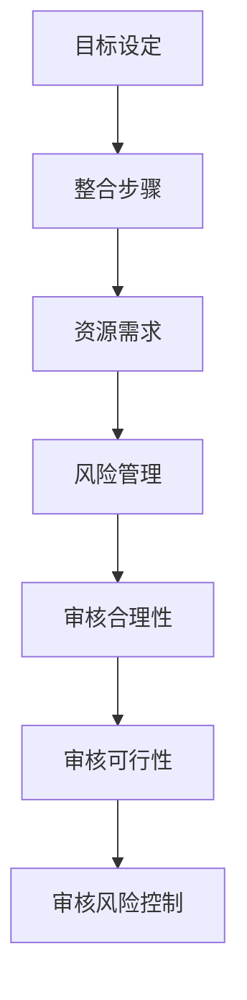

#### 通俗易懂的例子

假设企业计划整合两个技术团队 A 和 B，制定了一份整合计划。

1. **目标设定**：整合的目标是提高技术能力，优化资源配置，提升团队协作效率。
2. **整合步骤**：计划分为四个阶段，第一阶段是文化融合，第二阶段是技术能力评估与匹配，第三阶段是团队协作建设，第四阶段是资源整合与测试。
3. **资源需求**：计划中明确了每个阶段所需的人力、物力和财力资源，如培训费用、技术评估工具等。
4. **风险管理**：计划中识别了文化冲突、技术兼容性问题等风险，并制定了相应的应对措施。

整合计划的审核过程：

1. **审核合理性**：审核委员会评估整合计划是否符合企业战略目标和业务需求，认为计划合理。
2. **审核可行性**：审核委员会评估整合步骤和资源需求是否可行，认为计划可行。
3. **审核风险控制**：审核委员会评估计划中是否充分考虑了风险因素，并制定了有效的应对措施，认为计划的风险控制充分。

通过整合计划的制定与审核，企业为技术团队的整合提供了明确的行动指南，确保整合过程的有效实施。

### 总结

整合前的准备工作对于技术团队的整合至关重要。通过理解文化差异、评估技术能力、制定整合计划，企业可以确保整合过程顺利进行。本章详细介绍了文化差异的理解与应对、技术能力的评估与匹配以及整合计划的制定与审核，为后续的技术团队整合奠定了基础。在下一章中，我们将探讨整合过程中的挑战。

---

关键词：文化差异、技术能力评估、整合计划、审核

摘要：本章详细介绍了技术团队整合前的准备工作，包括文化差异的理解与应对、技术能力的评估与匹配以及整合计划的制定与审核。通过这些步骤，企业可以确保技术团队的整合顺利进行，提高整体的技术创新能力和市场竞争力。

## 第4章：整合过程中的挑战

### 4.1.1 人员整合的困难

#### 核心概念

**人员整合**（Staff Integration）是指将不同背景、技能和文化背景的员工融合为一个高效协作的团队。在技术团队整合过程中，人员整合是一个重要但充满挑战的环节。

#### 挑战分析

1. **技能差异**：不同团队成员可能在技能水平、专长领域和技术背景上存在较大差异，这可能导致任务分配不合理和团队协作效率低下。
2. **文化冲突**：团队成员来自不同的文化背景，可能导致沟通障碍、价值观差异和团队氛围不和谐。
3. **权力斗争**：整合过程中，原有团队的领导地位和新团队的领导地位可能产生冲突，影响团队的稳定和协作。

#### 解决方案

1. **技能互补**：通过评估团队成员的技能，合理分配任务，使团队成员在各自的专长领域发挥最大价值。
2. **文化融合**：通过文化敏感性和团队建设活动，增强团队成员之间的相互理解和信任，减少文化冲突。
3. **领导力培训**：为领导团队提供领导力培训，提高他们的跨文化管理和冲突解决能力。

**mermaid 流程图**

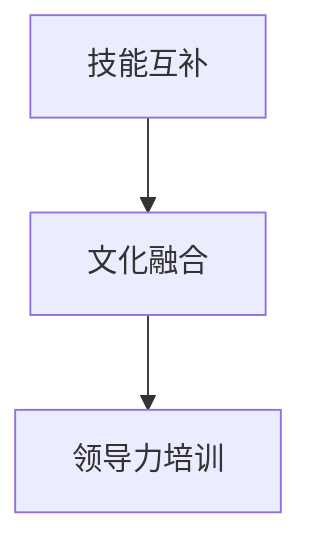

#### 通俗易懂的例子

假设有两个技术团队 A 和 B，团队 A 主要从事前端开发，团队 B 主要从事后端开发。在整合过程中，企业面临以下人员整合的困难：

1. **技能差异**：团队 A 的成员擅长前端技术，团队 B 的成员擅长后端技术，导致任务分配不合理。
2. **文化冲突**：团队 A 和团队 B 的成员在沟通方式和价值观上存在差异，导致协作效率低下。
3. **权力斗争**：团队 A 的领导在整合过程中感到自己的领导地位受到威胁，导致团队不稳定。

解决方案：

1. **技能互补**：企业通过技能评估，将团队 A 的成员分配到前端开发岗位，将团队 B 的成员分配到后端开发岗位，实现技能互补。
2. **文化融合**：企业组织了团队建设活动，如团队聚餐、团建游戏等，增强团队成员之间的相互理解和信任。
3. **领导力培训**：企业为领导团队提供了领导力培训，提高了他们的跨文化管理和冲突解决能力，确保团队的稳定和协作。

通过上述解决方案，企业成功地解决了人员整合的困难，提高了团队的协作效率和整体绩效。

### 4.1.2 技术整合的难度

#### 核心概念

**技术整合**（Technical Integration）是指将不同技术团队的技术能力、知识体系和资源进行有机融合，以实现技术和资源的优化配置。技术整合是技术团队整合的核心环节，但也面临诸多挑战。

#### 挑战分析

1. **技术标准不一致**：不同团队可能在技术标准、编码规范和技术框架上存在差异，导致整合过程中出现兼容性问题。
2. **技术知识共享困难**：不同团队可能在技术知识和经验积累上存在差异，导致知识共享和传播困难。
3. **技术资源分配不均**：整合过程中，技术资源的分配可能不合理，导致某些团队资源过剩或不足。

#### 解决方案

1. **统一技术标准**：通过制定统一的技术标准和编码规范，确保技术整合的顺利进行。
2. **建立知识共享平台**：建立内部知识共享平台，促进技术知识的传播和共享。
3. **优化技术资源分配**：通过合理分配技术资源，确保每个团队都能获得必要的技术支持。

**mermaid 流程图**

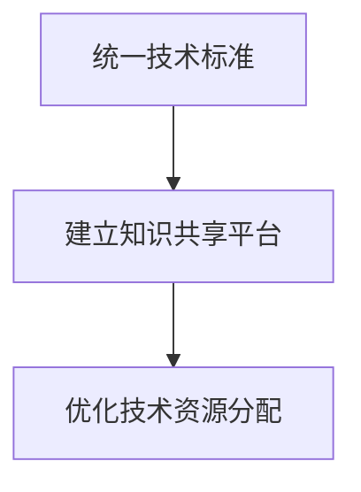

#### 通俗易懂的例子

假设有两个技术团队 A 和 B，团队 A 使用 Java 进行开发，团队 B 使用 Python 进行开发。在整合过程中，企业面临以下技术整合的难度：

1. **技术标准不一致**：团队 A 和团队 B 在技术标准、编码规范上存在差异，导致整合过程中出现兼容性问题。
2. **技术知识共享困难**：团队 A 和团队 B 的成员在技术知识和经验积累上存在差异，导致知识共享和传播困难。
3. **技术资源分配不均**：企业对两个团队的技术资源分配不合理，导致团队 B 资源过剩，团队 A 资源不足。

解决方案：

1. **统一技术标准**：企业制定了统一的技术标准和编码规范，确保团队 A 和团队 B 在技术整合过程中遵循相同的规范。
2. **建立知识共享平台**：企业建立了内部知识共享平台，鼓励团队 A 和团队 B 的成员分享技术知识和经验。
3. **优化技术资源分配**：企业通过合理分配技术资源，确保团队 A 和团队 B 都能获得必要的技术支持。

通过上述解决方案，企业成功地解决了技术整合的难度，提高了团队的协作效率和整体技术能力。

### 4.1.3 领导与管理的转变

#### 核心概念

**领导与管理的转变**（Leadership and Management Shift）是指在企业收购后，技术团队整合过程中，原有领导和管理模式需要适应新的团队结构和文化环境。

#### 挑战分析

1. **领导角色转变**：原有团队的领导可能在整合过程中需要放弃部分权力，适应新的领导角色，如从单一团队领导转变为跨团队的协调者。
2. **管理风格适应**：不同团队可能在管理风格和沟通方式上存在差异，原有领导需要调整管理风格，以适应新的团队文化。
3. **决策速度和效率**：整合后的团队需要更高效的决策机制，原有领导需要适应快速决策的要求。

#### 解决方案

1. **领导角色培训**：通过领导角色培训，帮助原有领导适应新的领导角色，提高跨团队协调和领导能力。
2. **管理风格调整**：原有领导需要主动了解和适应新的团队文化，调整管理风格，以促进团队协作。
3. **建立高效的决策机制**：通过建立跨团队的决策机制，如定期会议、联合委员会等，提高决策速度和效率。

**mermaid 流程图**

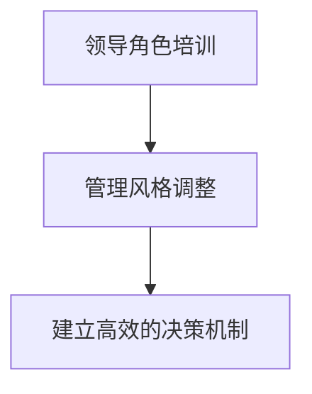

#### 通俗易懂的例子

假设企业收购了两个技术团队 A 和 B，原有团队 A 的领导李明需要在整合过程中适应新的领导角色：

1. **领导角色转变**：李明从单一团队领导转变为跨团队的协调者，需要放弃部分权力，学会如何与其他团队的领导合作。
2. **管理风格适应**：李明需要主动了解和适应团队 B 的管理风格和沟通方式，调整自己的管理风格，以促进团队 A 和团队 B 的协作。
3. **建立高效的决策机制**：李明与其他团队的领导一起，建立了定期的联合委员会会议，确保决策的快速和高效。

通过领导与管理的转变，李明成功地适应了新的领导角色，提高了团队的协作效率和整体绩效。

### 总结

整合过程中的挑战主要包括人员整合的困难、技术整合的难度和领导与管理的转变。通过详细分析这些挑战，并提出相应的解决方案，企业可以更好地应对整合过程中的问题。本章为技术团队的整合提供了宝贵的经验和指导，为后续章节的整合策略和方法奠定了基础。在下一章中，我们将探讨整合策略与方法，进一步解决技术团队整合中的问题。

---

关键词：人员整合、技术整合、领导与管理的转变、挑战分析、解决方案

摘要：本章深入分析了技术团队整合过程中的人员整合困难、技术整合难度和领导与管理的转变三大挑战。通过提出针对性的解决方案，为企业提供了有效的整合策略和方法。这些挑战和解决方案为技术团队的整合提供了宝贵的经验和指导。

## 第5章：整合策略与方法

### 5.1.1 整合策略的选择

#### 核心概念

**整合策略**（Integration Strategy）是指在技术团队整合过程中，采取的一系列方法和措施，以确保整合过程的顺利进行和目标实现。

#### 策略分类

1. **渐进式整合**：通过逐步整合团队资源和任务，降低整合的难度和风险。
2. **集中式整合**：在短时间内集中资源和力量，快速完成整合。
3. **混合式整合**：结合渐进式整合和集中式整合的优点，根据实际情况灵活选择整合策略。

#### 选择策略的考虑因素

1. **团队现状**：根据团队的技术能力、文化背景和整合难度，选择适合的整合策略。
2. **整合目标**：明确整合的目标和要求，选择能够实现目标的最优策略。
3. **资源可用性**：考虑整合过程中可用的资源和时间，确保整合策略的可行性。

**mermaid 流程图**

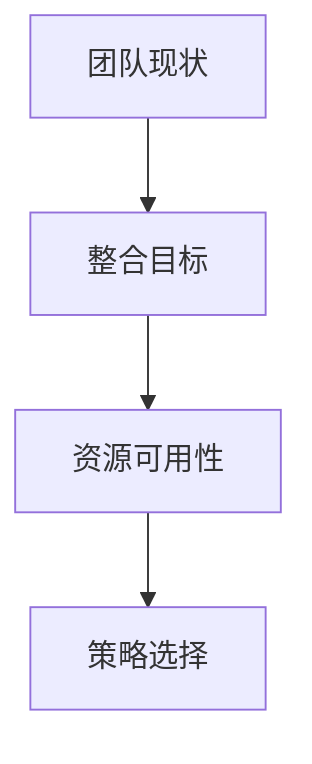

#### 通俗易懂的例子

假设企业收购了两个技术团队 A 和 B，团队 A 擅长前端开发，团队 B 擅长后端开发。企业根据团队现状、整合目标和资源可用性，选择了渐进式整合策略。

1. **团队现状**：团队 A 和团队 B 的技术能力互补，但存在文化差异。
2. **整合目标**：将两个团队整合为一个高效协同的技术团队，共同完成新产品开发。
3. **资源可用性**：企业有足够的时间和人力资源，可以逐步整合两个团队。

通过渐进式整合策略，企业逐步将团队 A 和团队 B 的资源和任务整合，最终形成了一个高效协同的技术团队。

### 5.1.2 整合方法的实施

#### 核心概念

**整合方法**（Integration Method）是指在技术团队整合过程中，具体实施的步骤和操作方法，包括人员调整、流程优化、资源分配等。

#### 实施步骤

1. **人员调整**：根据整合策略，对团队成员进行重新分配和调整，确保团队成员能够发挥最大价值。
2. **流程优化**：优化整合后的工作流程，提高团队协作效率，确保任务能够按时完成。
3. **资源分配**：合理分配人力资源、技术资源和资金，确保整合过程顺利进行。

#### 实施步骤的 mermaid 流程图

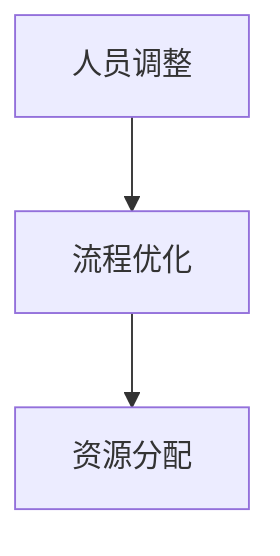

#### 通俗易懂的例子

企业实施整合方法的步骤如下：

1. **人员调整**：将团队 A 的前端开发人员和团队 B 的后端开发人员重新分配，组成一个完整的前后端开发团队。
2. **流程优化**：优化整个团队的工作流程，确保前端和后端开发流程的衔接顺畅，减少开发周期。
3. **资源分配**：为整合后的团队提供必要的人力资源、技术资源和资金支持，确保团队能够高效完成整合任务。

通过实施整合方法，企业成功地实现了技术团队的整合，提高了团队的整体协作效率和项目成功率。

### 5.1.3 成功整合的关键要素

#### 核心概念

**成功整合的关键要素**（Key Success Factors）是指在技术团队整合过程中，确保整合成功的关键因素。

#### 关键要素

1. **领导力**：领导者在整合过程中扮演关键角色，需要具备跨团队管理和冲突解决能力。
2. **沟通机制**：建立有效的沟通机制，确保团队成员之间的信息流通和协作顺畅。
3. **激励机制**：制定合理的激励机制，激发团队成员的积极性和创造力。
4. **文化融合**：通过文化融合活动，促进团队成员之间的相互理解和信任。

**mermaid 流程图**

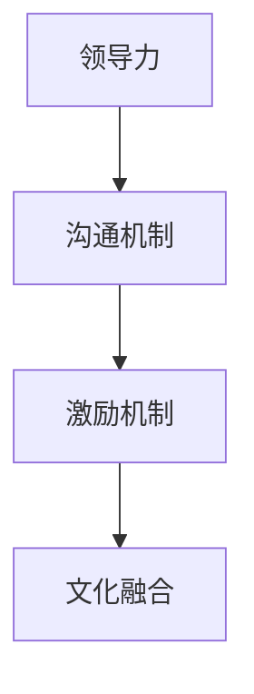

#### 通俗易懂的例子

企业成功实现技术团队整合的关键要素如下：

1. **领导力**：企业为整合后的团队配备了具有丰富经验和跨团队管理能力的领导，确保整合过程的顺利进行。
2. **沟通机制**：企业建立了定期的团队会议和沟通平台，确保团队成员之间的信息畅通。
3. **激励机制**：企业制定了基于绩效的奖励机制，激励团队成员积极协作，提高工作效率。
4. **文化融合**：企业组织了团队建设活动和跨文化培训，促进团队成员之间的文化融合，增强团队的凝聚力。

通过这些关键要素的实施，企业成功地实现了技术团队的整合，提高了团队的整体协作效率和项目成功率。

### 总结

整合策略与方法是技术团队整合成功的关键。通过选择合适的整合策略、实施具体的整合方法以及关注成功整合的关键要素，企业可以有效地克服整合过程中的挑战，实现技术团队的高效整合。本章为技术团队的整合提供了系统的策略和方法指导，为后续章节的实践应用奠定了基础。在下一章中，我们将探讨技术整合的最佳实践。

---

关键词：整合策略、整合方法、成功整合的关键要素、领导力、沟通机制

摘要：本章详细介绍了技术团队整合的策略与方法，包括整合策略的选择、整合方法的实施以及成功整合的关键要素。通过案例分析，我们展示了如何有效地实施整合策略和方法，实现技术团队的高效整合。本章为技术团队的整合提供了宝贵的经验和实践指导。

## 第6章：技术整合的最佳实践

### 6.1.1 成功案例的剖析

#### 核心概念

**成功案例**（Successful Case）是指在实际技术整合过程中，通过有效的策略和方法，成功实现团队整合的案例。这些案例为企业提供了宝贵的经验和借鉴。

#### 案例选择

1. **谷歌收购 Android**：谷歌收购 Android 后，成功将 Android 团队整合到谷歌的全球研发体系中。
2. **IBM 收购 Red Hat**：IBM 收购 Red Hat 后，通过文化融合和技术整合，成功提升了 IBM 的云计算能力。
3. **微软收购 GitHub**：微软收购 GitHub 后，通过优化资源分配和加强技术协作，提升了 GitHub 的社区价值和用户满意度。

#### 案例剖析

**谷歌收购 Android**

- **整合策略**：渐进式整合。谷歌采取了逐步整合的策略，先在特定项目上进行合作，逐渐扩大整合范围。
- **整合方法**：人员调整、流程优化、资源共享。谷歌对 Android 团队的成员进行了重新分配，优化了研发流程，并实现了技术资源的共享。
- **关键要素**：领导力、沟通机制、激励机制。谷歌的领导层发挥了关键作用，建立了高效的沟通机制，并制定了激励机制，激发了团队成员的积极性。

**IBM 收购 Red Hat**

- **整合策略**：混合式整合。IBM 在收购 Red Hat 后，采取了渐进式整合和集中式整合相结合的策略，确保整合的顺利进行。
- **整合方法**：文化融合、技术整合、资源优化。IBM 重视文化融合，鼓励员工之间的相互理解和信任，同时整合了 Red Hat 的技术资源，提升了整体技术能力。
- **关键要素**：领导力、文化融合、资源优化。IBM 的领导层在整合过程中发挥了关键作用，推动文化融合，并优化了资源分配，提高了整合效果。

**微软收购 GitHub**

- **整合策略**：快速整合。微软在收购 GitHub 后，迅速实现了技术整合和资源优化，确保了 GitHub 的持续发展。
- **整合方法**：人员整合、流程优化、市场推广。微软对 GitHub 的团队成员进行了整合，优化了研发流程，并加大了市场推广力度。
- **关键要素**：沟通机制、激励机制、市场策略。微软建立了高效的沟通机制，激励团队成员积极参与，并通过市场策略提升了 GitHub 的用户满意度。

### 6.1.2 失败案例的反思

#### 核心概念

**失败案例**（Failed Case）是指在实际技术整合过程中，由于策略不当、方法错误或关键要素缺失，导致整合失败的情况。这些案例为企业在整合过程中提供了重要的教训。

#### 案例选择

1. **惠普收购 Autonomy**：惠普收购 Autonomy 后，由于文化冲突和技术整合问题，导致整合失败。
2. **索尼收购爱立信**：索尼收购爱立信后，由于管理不善和技术整合困难，导致项目进展缓慢。
3. **IBM 收购 Sun Microsystems**：IBM 收购 Sun Microsystems 后，由于技术整合不力和管理问题，导致项目成本超支。

#### 案例反思

**惠普收购 Autonomy**

- **失败原因**：文化冲突、技术整合问题。惠普和 Autonomy 在企业文化、工作方式和技术方向上存在较大差异，导致整合过程中出现文化冲突和技术整合问题。
- **教训**：在进行技术整合时，应重视文化融合，避免因文化差异导致的整合困难。

**索尼收购爱立信**

- **失败原因**：管理不善、技术整合困难。索尼在收购爱立信后，未能有效管理整合过程，导致项目进展缓慢，同时技术整合困难也影响了项目进度。
- **教训**：在整合过程中，应建立有效的管理机制，确保整合过程的顺利进行。

**IBM 收购 Sun Microsystems**

- **失败原因**：技术整合不力、管理问题。IBM 在收购 Sun Microsystems 后，未能有效整合技术资源，导致项目成本超支，同时管理问题也影响了整合效果。
- **教训**：在进行技术整合时，应重视技术整合的难度，制定详细的技术整合计划，并确保管理机制的健全。

### 6.1.3 技术整合的实践技巧

#### 核心概念

**实践技巧**（Practical Techniques）是指在实际技术整合过程中，可以采取的具体方法和技巧，以提高整合的成功率。

#### 技巧介绍

1. **跨部门协作平台**：建立跨部门协作平台，促进不同团队之间的信息共享和协作。
2. **定期的团队会议**：定期召开团队会议，及时沟通整合进展和问题，确保整合过程透明。
3. **文化融合活动**：组织文化融合活动，促进团队成员之间的相互了解和信任。
4. **绩效评估机制**：建立绩效评估机制，激励团队成员积极参与整合过程，提高工作效率。

#### 实践技巧的 mermaid 流程图

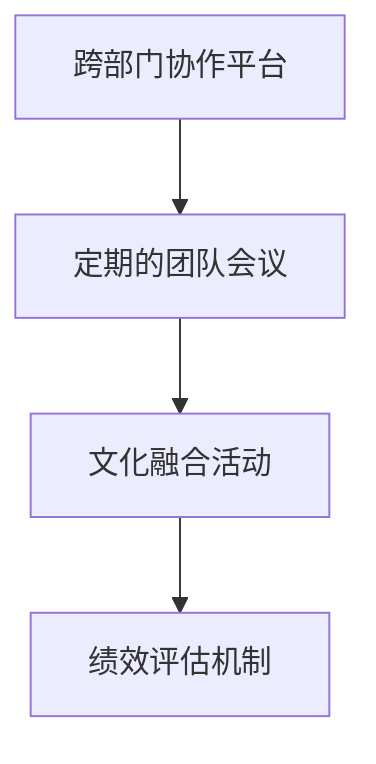

#### 通俗易懂的例子

企业通过以下实践技巧，成功实现了技术团队的整合：

1. **跨部门协作平台**：企业建立了内部协作平台，如企业微信、钉钉等，促进不同团队之间的信息共享和协作。
2. **定期的团队会议**：企业定期召开团队会议，讨论整合进展、问题和解决方案，确保整合过程透明和高效。
3. **文化融合活动**：企业组织了团队建设活动、跨文化培训等，促进团队成员之间的相互了解和信任。
4. **绩效评估机制**：企业建立了基于绩效的奖励机制，激励团队成员积极参与整合过程，提高工作效率。

通过这些实践技巧，企业成功地实现了技术团队的整合，提升了整体的技术创新能力和市场竞争力。

### 总结

技术整合的最佳实践包括成功案例的剖析、失败案例的反思以及实践技巧的介绍。通过成功案例的分析，企业可以学习有效的整合策略和方法；通过失败案例的反思，企业可以避免在整合过程中犯同样的错误；通过实践技巧的介绍，企业可以采取具体的方法和技巧，提高整合的成功率。本章为技术团队的整合提供了宝贵的经验和实践指导，为企业的技术整合提供了有力支持。在下一章中，我们将探讨技术整合的未来展望。

---

关键词：成功案例、失败案例、实践技巧、跨部门协作平台、绩效评估机制

摘要：本章通过成功案例的剖析、失败案例的反思和实践技巧的介绍，为技术整合提供了全面的经验和指导。成功案例展示了有效的整合策略和方法，失败案例提供了宝贵的教训，实践技巧则提供了具体可操作的方法，以帮助企业成功实现技术团队的整合。

## 第7章：技术整合的未来展望

### 7.1.1 技术整合的发展趋势

#### 核心概念

**技术整合的发展趋势**（Trends in Technology Integration）指的是技术整合领域在技术、管理、文化等方面的发展方向和变化。

#### 趋势分析

1. **云计算与边缘计算**：随着云计算和边缘计算技术的发展，技术整合将更加侧重于云平台和边缘节点的协同整合。
2. **人工智能与机器学习**：人工智能和机器学习的普及，将推动技术团队在算法、数据和技术架构上的整合。
3. **DevOps 与敏捷开发**：DevOps 和敏捷开发理念的推广，将促进技术团队在开发和运维流程上的整合。
4. **跨行业整合**：随着行业界限的模糊，跨行业的技术整合将成为趋势，企业将更多关注跨界合作和资源整合。

**mermaid 流程图**

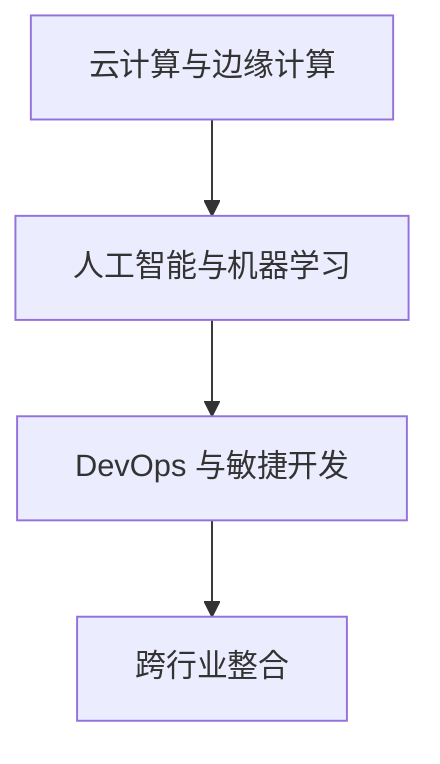

#### 通俗易懂的例子

未来，技术整合将呈现以下趋势：

1. **云计算与边缘计算**：企业将更多采用云计算和边缘计算技术，实现数据中心与边缘节点的无缝整合，提高数据处理效率。
2. **人工智能与机器学习**：随着人工智能和机器学习技术的进步，技术团队将更加注重算法和数据的整合，提高自动化和智能化水平。
3. **DevOps 与敏捷开发**：企业将采用 DevOps 和敏捷开发方法，实现开发与运维的协同整合，缩短产品迭代周期。
4. **跨行业整合**：企业将开展跨界合作，整合不同行业的技术资源，实现跨界创新和协同发展。

### 7.1.2 未来整合面临的挑战

#### 核心概念

**未来整合面临的挑战**（Challenges in Future Integration）指的是在未来技术整合过程中，可能遇到的困难和问题。

#### 挑战分析

1. **技术复杂性**：随着技术的快速发展，技术整合的复杂性将不断增加，如何应对技术复杂性将成为一大挑战。
2. **数据隐私与安全**：技术整合涉及大量的数据传输和处理，数据隐私与安全问题将成为整合过程中的重要挑战。
3. **文化多样性**：随着全球化的推进，技术团队将更加多元化，如何处理文化多样性带来的挑战，将考验企业的整合能力。
4. **技术标准化**：不同技术和平台之间的兼容性问题，将成为技术整合的主要挑战，如何实现技术标准化，将是一个重要课题。

**mermaid 流流程图**

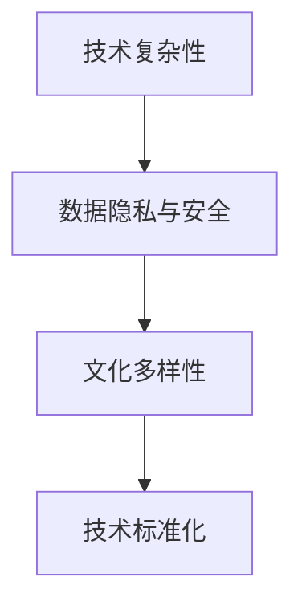

#### 通俗易懂的例子

未来，技术整合将面临以下挑战：

1. **技术复杂性**：企业需要面对日益复杂的技术体系，如何有效整合和管理这些技术，将成为一大挑战。
2. **数据隐私与安全**：在整合过程中，企业需要确保数据的安全性和隐私性，防止数据泄露和滥用。
3. **文化多样性**：随着团队成员来自不同国家和地区，如何处理文化差异，促进团队协作，将成为企业需要面对的重要问题。
4. **技术标准化**：企业需要制定统一的技术标准和规范，确保不同技术和平台之间的兼容性，提高整合效率。

### 7.1.3 应对策略与建议

#### 核心概念

**应对策略与建议**（Strategies and Suggestions for Response）指的是企业应对未来整合挑战的具体方法和建议。

#### 应对策略

1. **技术创新**：企业应积极投入技术研发，提升自身的技术整合能力，应对技术复杂性。
2. **数据安全与隐私保护**：企业应建立完善的数据安全与隐私保护体系，确保数据的安全性和合规性。
3. **文化融合与培训**：企业应开展文化融合活动，加强团队成员之间的沟通和协作，提升跨文化管理能力。
4. **标准化与规范化**：企业应制定统一的技术标准和规范，推动技术标准化，提高整合效率。

**mermaid 流程图**

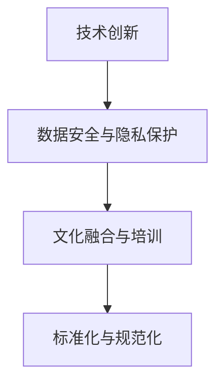

#### 通俗易懂的例子

为了应对未来技术整合的挑战，企业可以采取以下策略：

1. **技术创新**：企业应加大技术研发投入，培养技术人才，提升自身的技术整合能力，以便在复杂的技术环境中保持竞争力。
2. **数据安全与隐私保护**：企业应建立严格的数据安全与隐私保护政策，定期进行数据安全审查，确保数据的安全性和合规性。
3. **文化融合与培训**：企业应定期组织跨文化培训，增强团队成员的文化理解能力，促进团队间的沟通和协作，提升整体团队效能。
4. **标准化与规范化**：企业应制定统一的技术标准和规范，建立技术审查机制，确保技术和流程的一致性，提高整合效率。

### 总结

技术整合的未来展望充满机遇和挑战。随着技术的快速发展，企业需要不断创新，提升自身的技术整合能力。同时，数据安全、文化多样性和技术标准化等问题也需要企业高度重视。通过制定有效的应对策略，企业可以成功应对未来的整合挑战，实现技术团队的高效整合，提升企业的核心竞争力。本章为企业的技术整合提供了未来展望和策略建议，为企业的持续发展奠定了基础。

---

关键词：技术整合发展趋势、未来整合面临的挑战、应对策略与建议、技术创新、数据安全与隐私保护

摘要：本章探讨了技术整合的未来发展趋势、面临的挑战以及应对策略。随着技术的快速发展，企业需要不断创新，提升自身的技术整合能力。同时，企业需要重视数据安全、文化多样性和技术标准化等问题。通过制定有效的应对策略，企业可以成功应对未来的整合挑战，实现技术团队的高效整合，提升企业的核心竞争力。

## 第8章：小结与拓展

### 8.1.1 书的核心观点总结

本文围绕“技术整合：收购后的技术团队整合”这一主题，系统地探讨了技术整合的核心概念、整合前的准备、整合过程中的挑战和策略，以及最佳实践和未来展望。以下是本书的核心观点总结：

1. **技术整合的意义**：技术整合是企业收购后提升技术创新能力和市场竞争力的重要手段。
2. **整合前的准备**：包括文化差异的理解与应对、技术能力的评估与匹配、整合计划的制定与审核。
3. **整合过程中的挑战**：涉及人员整合的困难、技术整合的难度和领导与管理的转变。
4. **整合策略与方法**：包括整合策略的选择、整合方法的实施、成功整合的关键要素。
5. **最佳实践**：通过成功案例和失败案例的剖析，总结了技术整合的最佳实践。
6. **未来展望**：探讨了技术整合的发展趋势、未来整合面临的挑战以及应对策略。

### 8.1.2 阅读指导与建议

为了更好地理解和应用本文的内容，读者可以按照以下步骤进行阅读：

1. **初步阅读**：首先快速浏览全文，了解技术整合的背景和核心概念。
2. **深入学习**：针对每个章节，仔细阅读并理解其详细内容，如核心概念、算法原理、实践技巧等。
3. **案例分析**：通过成功案例和失败案例的分析，了解技术整合的实际操作和注意事项。
4. **实践应用**：将所学内容应用到实际工作中，尝试解决技术整合过程中的问题，积累经验。

### 8.1.3 拓展阅读材料推荐

为了进一步深入了解技术整合的相关知识，读者可以参考以下拓展阅读材料：

1. **书籍**：
   - 《企业并购与整合策略》
   - 《技术团队协作与沟通艺术》
   - 《人工智能与机器学习实践指南》

2. **学术论文**：
   - 《技术整合：理论框架与实践路径》
   - 《企业整合中文化冲突的影响研究》
   - 《技术标准化与兼容性问题探讨》

3. **专业网站和博客**：
   - IEEE Xplore Digital Library
   - ACM Digital Library
   - CSDN博客

通过这些拓展阅读材料，读者可以更全面地了解技术整合的理论和实践，为自己的工作提供有益的参考。

### 总结

本文系统地探讨了技术整合的核心观点，并提供了详细的阅读指导和拓展阅读材料推荐。通过本文的学习，读者可以更好地理解技术整合的内涵和实践方法，为自己的工作提供理论支持和实践指导。

---

关键词：技术整合、核心观点总结、阅读指导、拓展阅读材料推荐

摘要：本章对全文进行了总结，提供了阅读指导，并推荐了拓展阅读材料。通过这些内容，读者可以更好地理解和应用本文的核心观点，为自己的技术整合工作提供理论支持和实践指导。

---

# 技术整合：收购后的技术团队整合

关键词：技术整合、团队整合、文化差异、技术能力、整合策略

摘要：本文详细介绍了技术整合的概念、背景、关键因素、整合流程和挑战，并分析了整合策略与方法、成功案例和失败案例，以及技术整合的未来展望。文章旨在为企业在收购后的技术团队整合提供理论指导和实践建议。

作者：AI天才研究院/AI Genius Institute & 禅与计算机程序设计艺术 /Zen And The Art of Computer Programming

