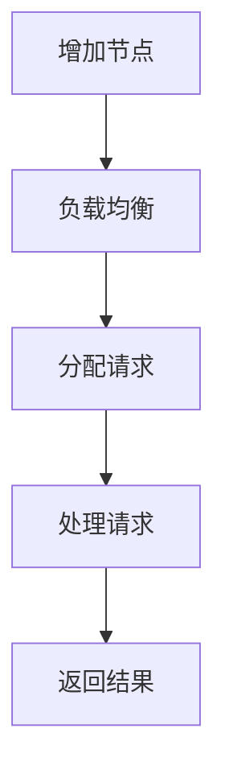
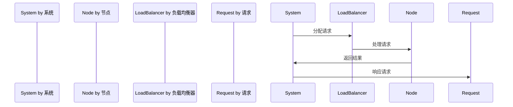
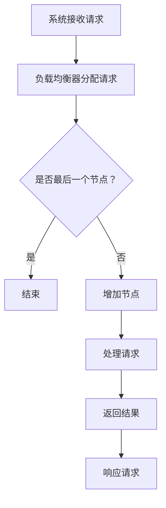
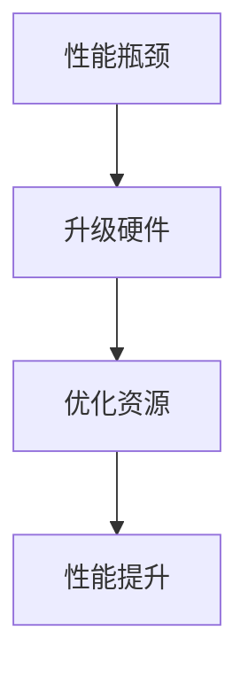
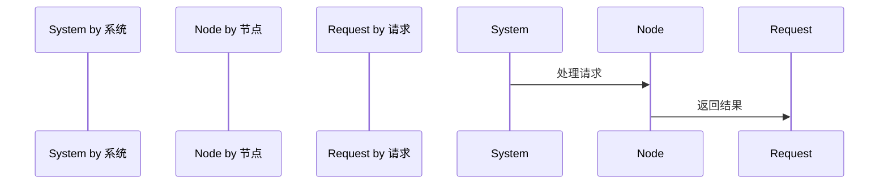
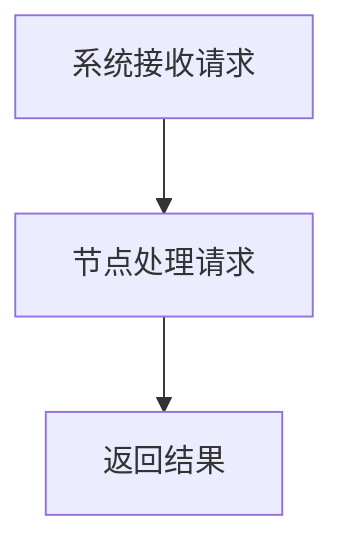
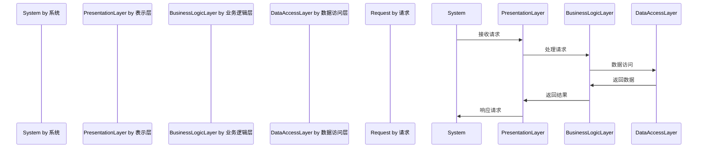
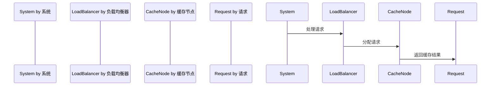
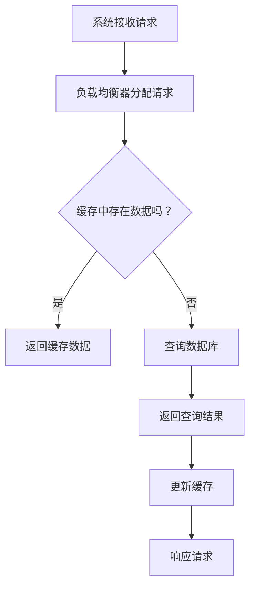
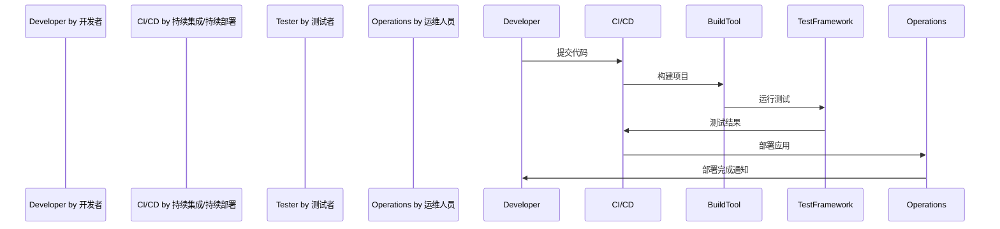

                 

# 技术架构演进：应对业务增长的系统扩展

> 关键词：技术架构、业务增长、系统扩展、微服务、分布式系统、云计算

> 摘要：本文深入探讨了技术架构演进的过程，以及如何通过系统扩展来应对业务增长的需求。文章首先介绍了技术架构的演进历程，包括从单体架构到微服务架构，再到分布式系统的演变。接着，文章分析了业务增长与系统扩展的关系，并阐述了核心概念与联系。随后，文章介绍了主流技术架构及其优缺点，以及系统扩展的方法和分布式系统设计。最后，通过实战案例分析了系统扩展的实践过程，并提供了相关的工具和技术支持。

## 第一部分：背景与基础

### 第1章：技术架构演进概述

#### 1.1 技术架构的演进历程

1. **单体架构**：最早的软件架构形式，所有功能都集中在单个应用程序中。
2. **微服务架构**：将单体应用程序拆分为多个独立的小服务，每个服务负责不同的业务功能。
3. **分布式系统**：通过多个节点协同工作，实现服务的分布式部署和运行。
4. **云计算**：利用云资源动态扩展和弹性伸缩的能力，实现系统的高可用性和高性能。

#### 1.2 业务增长与系统扩展的关系

- **业务增长对系统性能的要求**：随着业务的发展，系统需要处理更多的请求和数据，对系统的性能提出了更高的要求。
- **系统扩展与成本控制**：系统扩展需要投入更多的资源和资金，同时需要平衡成本和性能之间的关系。

### 第2章：核心概念与联系

#### 2.1 技术架构中的核心概念

- **模块化**：将系统功能划分为独立的模块，便于开发和维护。
- **解耦**：降低模块之间的依赖关系，提高系统的灵活性和可维护性。
- **高可用性**：系统在遇到故障时能够快速恢复，确保服务的持续可用。
- **容错性**：系统能够在遇到错误或异常时保持正常运行。
- **可扩展性**：系统在需求变化时能够灵活调整和扩展。

#### 2.2 核心概念之间的联系

- **模块化与分布式系统的关系**：模块化是实现分布式系统的基础，通过将功能划分为独立的模块，可以实现分布式部署和运行。
- **高可用性与容错性的实现**：高可用性和容错性是分布式系统设计的重要目标，通过冗余和故障转移机制实现。

### 第3章：主流技术架构介绍

#### 3.1 单体架构

- **特点与优势**：开发简单，易于维护。
- **适用场景**：小规模应用，功能较为简单。

#### 3.2 微服务架构

- **特点与优势**：高可扩展性，易于维护和部署。
- **挑战与解决方案**：服务间通信复杂，需要解决服务发现、负载均衡等问题。

#### 3.3 分布式架构

- **特点与优势**：高可用性，高性能，易于扩展。
- **挑战与解决方案**：分布式一致性，数据同步等问题。

## 第二部分：系统扩展方法

### 第4章：水平扩展与垂直扩展

#### 4.1 水平扩展

- **原理与实现**：通过增加节点数量，提高系统的处理能力。
- **适用场景**：处理大量请求，对性能要求较高的场景。

#### 4.2 垂直扩展

- **原理与实现**：通过升级硬件，提高单个节点的性能。
- **适用场景**：对单个节点性能要求较高的场景。

### 第5章：分布式系统设计

#### 5.1 数据一致性与分布式事务

- **原理与实现**：通过分布式算法确保数据的一致性。
- **常见方案**：Paxos算法、Raft算法。

#### 5.2 服务发现与负载均衡

- **原理与实现**：通过服务注册和发现机制，实现服务的动态注册和发现。
- **常见方案**：Zookeeper、Consul。

### 第6章：容器化与Kubernetes

#### 6.1 容器化原理

- **容器化与虚拟化的区别**：容器化是在操作系统层面实现虚拟化，虚拟化是在硬件层面实现虚拟化。
- **Docker与容器化实践**：Docker的安装和使用方法。

#### 6.2 Kubernetes基础

- **Kubernetes架构与组件**：Kubernetes的核心架构和组件。
- **Kubernetes部署与管理**：Kubernetes的部署和日常管理。

### 第7章：云原生技术与架构

#### 7.1 云原生应用设计

- **微服务与容器化**：云原生应用的设计原则和实践。
- **云原生应用的优势**：云原生应用的优势和特点。

#### 7.2 云平台选择与架构优化

- **公有云、私有云与混合云**：不同云平台的优缺点。
- **架构优化实践**：如何优化云平台上的架构设计。

## 第三部分：实战与案例分析

### 第8章：系统扩展项目实战

#### 8.1 项目背景与需求分析

- **业务背景**：项目背景介绍。
- **系统性能需求**：系统性能需求分析。

#### 8.2 系统架构设计

- **架构方案选择**：系统架构方案选择。
- **系统模块划分**：系统模块划分。

#### 8.3 系统扩展实现

- **水平扩展与垂直扩展**：系统扩展的实现方法。
- **分布式系统设计**：分布式系统设计。

### 第9章：案例分析

#### 9.1 案例一：电商平台系统扩展

- **系统现状**：电商平台系统现状介绍。
- **扩展方案**：电商平台系统扩展方案。

#### 9.2 案例二：在线教育平台系统扩展

- **系统现状**：在线教育平台系统现状介绍。
- **扩展方案**：在线教育平台系统扩展方案。

## 附录

### 附录A：相关工具与技术

#### A.1 容器化工具

- **Docker安装与使用**：Docker的安装和使用方法。
- **Docker Compose**：Docker Compose的使用方法。

#### A.2 Kubernetes工具

- **Kubernetes安装与配置**：Kubernetes的安装和配置方法。
- **Kubectl命令使用**：Kubectl命令的使用方法。

#### A.3 云平台相关工具

- **阿里云**：阿里云的相关工具和技术。
- **腾讯云**：腾讯云的相关工具和技术。
- **华为云**：华为云的相关工具和技术。

# 结束语

感谢您的阅读，本文对技术架构演进和系统扩展进行了详细的探讨。在技术不断发展的今天，了解和掌握技术架构演进的规律和系统扩展的方法对于应对业务增长至关重要。希望本文能为您在技术领域的实践提供指导和启示。在技术架构演进的道路上，愿您不断前行，不断创新。

## 作者

作者：AI天才研究院/AI Genius Institute & 禅与计算机程序设计艺术 /Zen And The Art of Computer Programming

----------------------------------------------------------------

### 第1章：技术架构演进概述

#### 1.1 技术架构的演进历程

技术架构的演进是一个持续不断的过程，它随着计算机技术的进步、业务需求的变化以及技术的革新而不断演变。从最初的单体架构，到后来的微服务架构，再到如今分布式系统的广泛应用，技术架构的演进经历了几个重要阶段。

- **单体架构**：单体架构是软件架构的最早形式，它将所有的功能都集中在一个应用程序中。这种架构风格简单，开发成本低，适合小型项目和初创公司。然而，随着项目的复杂度和规模的扩大，单体架构逐渐暴露出其缺点，如代码难以维护、系统扩展困难、部署效率低下等。

- **微服务架构**：微服务架构是对单体架构的一种改进，它将应用程序拆分为多个小的、独立的微服务，每个微服务负责一个特定的业务功能。这种架构风格具有高可扩展性、高可维护性、高容错性等优点。微服务架构通过解耦、自治和服务化来提升系统的灵活性和可扩展性，成为现代软件系统设计的主流。

- **分布式系统**：分布式系统是软件系统的一种形式，它通过多个节点协同工作，实现服务的分布式部署和运行。分布式系统可以提供更高的可用性、可靠性和性能。随着云计算和大数据技术的兴起，分布式系统得到了广泛的应用。分布式系统的设计需要解决数据一致性问题、服务发现问题、负载均衡问题等挑战。

- **云计算**：云计算是分布式计算、网络技术、虚拟化技术等综合应用的结果。云计算提供了一种动态的、可扩展的计算资源，可以根据需求随时扩展或缩减资源。云计算的出现，使得分布式系统的部署和管理变得更加灵活和高效。云平台如阿里云、腾讯云、华为云等，提供了丰富的服务和工具，帮助企业快速构建和扩展分布式系统。

#### 1.2 业务增长与系统扩展的关系

业务增长是推动技术架构演进的重要动力。随着业务的不断扩展，系统需要处理更多的用户请求和数据，对系统的性能、可扩展性和可靠性提出了更高的要求。系统扩展是应对业务增长的关键手段，它可以通过以下几种方式实现：

- **水平扩展（Scaling Out）**：水平扩展通过增加更多的节点来提高系统的处理能力。这种方式可以在不改变单个节点性能的情况下，线性地提高系统的性能和吞吐量。例如，通过增加数据库节点、应用服务器节点等来提高系统的处理能力。

- **垂直扩展（Scaling Up）**：垂直扩展通过升级硬件来提高单个节点的性能。这种方式可以在保持系统规模不变的情况下，提高系统的处理能力。例如，通过升级CPU、内存、存储等硬件设备来提高系统的性能。

- **分布式系统**：分布式系统通过将应用程序部署到多个节点上，实现服务的分布式部署和运行。分布式系统可以提供更高的可用性和可靠性，同时可以通过水平扩展和垂直扩展来适应业务增长的需求。

- **云计算**：云计算提供了动态的、可扩展的计算资源，可以根据业务需求随时扩展或缩减资源。云计算平台如阿里云、腾讯云、华为云等，提供了丰富的服务和工具，帮助企业快速构建和扩展分布式系统。

#### 1.3 技术架构演进对系统扩展的影响

技术架构的演进对系统扩展有着深远的影响。不同的技术架构风格，对系统扩展的方式和效果有着不同的影响：

- **单体架构**：在单体架构中，系统扩展主要依赖于垂直扩展。通过升级硬件来提高单个节点的性能，从而提高整个系统的性能。然而，这种方式存在一定的局限性，当单个节点的性能达到瓶颈时，系统的扩展能力就会受限。

- **微服务架构**：在微服务架构中，系统扩展可以采用水平扩展和垂直扩展相结合的方式。通过增加更多的服务实例来提高系统的处理能力，同时也可以通过升级硬件来提高单个节点的性能。微服务架构提供了更高的灵活性和可扩展性，能够更好地应对业务增长的需求。

- **分布式系统**：在分布式系统中，系统扩展主要通过水平扩展来实现。分布式系统通过将应用程序部署到多个节点上，可以实现线性地提高系统的性能和吞吐量。分布式系统还提供了更高的可用性和可靠性，能够更好地应对故障和负载波动。

- **云计算**：云计算提供了动态的、可扩展的计算资源，可以根据业务需求随时扩展或缩减资源。云计算平台如阿里云、腾讯云、华为云等，提供了丰富的服务和工具，帮助企业快速构建和扩展分布式系统。云计算的高可用性和弹性伸缩能力，使得系统扩展更加高效和灵活。

#### 1.4 技术架构演进中的挑战与机遇

技术架构演进带来了许多挑战，同时也带来了新的机遇：

- **挑战**：

  - **复杂性**：随着系统的不断扩展和复杂化，系统的设计和维护变得更加复杂。

  - **数据一致性**：分布式系统中的数据一致性是一个重要挑战，需要通过分布式算法和协议来确保数据的一致性。

  - **服务管理**：在微服务架构中，服务的管理变得更加复杂，需要解决服务注册、发现、监控、日志等问题。

  - **安全与隐私**：随着系统的分布化和网络化，系统的安全与隐私问题变得更加重要，需要采取有效的安全措施来保护数据和用户隐私。

- **机遇**：

  - **高可用性**：分布式系统和云计算提供了更高的可用性，系统能够在遇到故障时快速恢复，确保服务的持续可用。

  - **可扩展性**：通过水平扩展和垂直扩展，系统能够灵活地应对业务增长的需求，提高系统的性能和吞吐量。

  - **创新与探索**：技术架构的演进为开发者提供了更多的创新空间，可以探索新的架构风格、技术和工具，推动软件技术的发展。

### 总结

技术架构的演进是一个持续不断的过程，它随着业务需求的变化、技术的进步以及新兴技术的应用而不断发展。从单体架构到微服务架构，再到分布式系统和云计算，技术架构的演进为系统扩展带来了更多的可能性和挑战。通过了解技术架构的演进历程，我们可以更好地应对业务增长的需求，构建高效、可靠、可扩展的软件系统。

----------------------------------------------------------------

### 第2章：核心概念与联系

#### 2.1 技术架构中的核心概念

技术架构中的核心概念是构建现代软件系统的基础。以下是一些关键概念及其在系统设计中的重要性：

1. **模块化**：模块化是将系统划分为独立的模块，每个模块负责特定的功能。模块化的优点包括简化代码管理、提高代码复用性和便于维护。在系统设计中，模块化有助于实现系统的可扩展性和可维护性。

2. **解耦**：解耦是指减少模块之间的依赖关系，提高系统的灵活性和可维护性。解耦可以通过设计模式、接口和中间件来实现。在分布式系统中，解耦尤为重要，因为它可以降低系统故障对整个系统的冲击。

3. **高可用性**：高可用性是指系统在遇到故障时能够快速恢复，确保服务的持续可用。实现高可用性通常需要冗余设计、故障转移和自修复机制。在高并发和高负载的环境下，高可用性是系统设计的关键目标。

4. **容错性**：容错性是指系统能够在遇到错误或异常时保持正常运行。通过容错设计，系统可以在故障发生时自动恢复或绕过故障点，确保系统的稳定性和可靠性。

5. **可扩展性**：可扩展性是指系统在需求变化时能够灵活调整和扩展。可扩展性可以通过水平扩展（增加节点数量）和垂直扩展（升级硬件）来实现。在业务快速增长时，可扩展性是系统设计的关键考虑因素。

6. **可维护性**：可维护性是指系统能够方便地进行更新、修复和优化。良好的可维护性可以通过代码规范、文档化和自动化测试来实现。可维护性对于长期系统的成功至关重要。

#### 2.2 核心概念之间的联系

上述核心概念之间存在着紧密的联系，共同构成了技术架构的基础：

- **模块化与解耦**：模块化是解耦的基础，通过将功能划分为独立的模块，可以减少模块间的直接依赖，从而实现解耦。解耦又可以进一步促进模块化，使得各个模块更加独立和易于维护。

- **高可用性与容错性**：高可用性依赖于容错性。容错性设计可以确保系统在遇到故障时能够快速恢复，从而保持高可用性。例如，通过冗余设计（如主从架构、备份节点）和故障转移机制（如自动切换到备用节点），可以大大提高系统的高可用性。

- **可扩展性与可维护性**：可扩展性直接影响系统的可维护性。如果一个系统能够轻松地扩展，那么在业务增长时，系统的维护和更新就会更加容易。同时，良好的模块化和解耦设计也有助于提高系统的可维护性。

#### 2.3 核心概念在分布式系统中的应用

在分布式系统中，核心概念的应用变得更加重要，因为分布式系统的复杂性更高：

- **模块化与解耦**：分布式系统通常由多个服务组成，每个服务负责不同的功能。模块化和解耦使得各个服务之间可以独立开发和部署，降低了系统的复杂性。

- **高可用性与容错性**：分布式系统通过多个节点协同工作，提供了更高的可用性和容错性。例如，通过主从架构，当一个节点出现故障时，系统可以自动切换到备用节点，确保服务的连续性。

- **可扩展性**：分布式系统可以通过水平扩展（增加节点）来提高性能和吞吐量。这种扩展方式使得系统能够应对快速增长的业务需求。

- **可维护性**：分布式系统通过模块化和自动化工具（如容器化平台、持续集成和持续部署），提高了系统的可维护性。

#### 2.4 核心概念与系统性能

系统性能是技术架构设计的一个重要目标。核心概念在提高系统性能方面起到了关键作用：

- **模块化**：模块化有助于代码的重构和优化，可以减少冗余代码，提高系统的执行效率。

- **解耦**：解耦减少了模块间的耦合度，使得系统能够更加灵活地调整和优化，从而提高性能。

- **高可用性**：高可用性设计可以减少系统停机时间，确保服务持续可用，从而提高系统的整体性能。

- **容错性**：容错性设计可以确保系统在遇到故障时能够快速恢复，减少故障对系统性能的影响。

- **可扩展性**：可扩展性设计可以确保系统能够在业务增长时保持高性能，通过水平扩展来分散负载，提高系统的吞吐量和响应速度。

- **可维护性**：良好的可维护性可以通过优化代码、修复缺陷和进行性能调优来提高系统性能。

### 总结

核心概念是构建现代软件系统的基础，它们相互关联，共同作用于系统的性能、可用性、可扩展性和可维护性。通过深入理解这些概念，并在系统设计中合理应用，可以构建出高效、可靠、可扩展的软件系统。在分布式系统和云计算的背景下，这些核心概念的应用尤为重要，它们是系统设计和优化不可或缺的一部分。

---

### 第3章：主流技术架构介绍

在现代软件开发中，不同的技术架构风格各有优缺点，适用于不同的业务场景。以下是几种主流技术架构的介绍，包括它们的特性、优势以及相应的适用场景。

#### 3.1 单体架构

**特点与优势**：

- **单一部署**：所有功能集中在一个应用程序中，部署和升级相对简单。
- **易于维护**：由于代码集中，维护和调试相对容易。
- **开发速度快**：项目初期，团队规模较小，单体架构能够快速迭代和部署。

**适用场景**：

- **小规模项目**：初期开发阶段，功能较为简单，团队规模较小。
- **临时性项目**：项目生命周期较短，不需要过多的扩展性。
- **遗留系统**：已有系统，需进行维护和简单功能扩展。

**缺点**：

- **代码难以维护**：随着项目复杂度增加，单体架构的维护成本会显著上升。
- **扩展性差**：扩展性有限，难以应对大规模、高并发的业务需求。
- **性能瓶颈**：随着用户增长，单一应用可能会成为性能瓶颈。

#### 3.2 微服务架构

**特点与优势**：

- **服务独立性**：每个服务独立开发、部署和运行，具备高独立性。
- **高扩展性**：服务可以根据需求独立扩展，提高系统整体性能。
- **易于维护**：服务小而独立，维护和更新更加方便。
- **弹性部署**：服务可以独立部署，方便进行蓝绿部署和滚动升级。

**适用场景**：

- **高并发应用**：如电商平台、社交网络等，需要应对大量用户请求。
- **复杂业务场景**：业务逻辑复杂，需要高灵活性和可扩展性。
- **持续集成和持续部署**：支持频繁的迭代和部署，提高开发效率。

**挑战与解决方案**：

- **服务通信复杂**：服务间通信可能带来额外的复杂性，需采用API网关、消息队列等解决方案。
- **分布式事务管理**：需要解决跨服务的事务管理问题，可以使用分布式事务框架或本地事务方案。

#### 3.3 分布式架构

**特点与优势**：

- **分布式部署**：应用程序分布在多个节点上，提高了系统的可用性和容错性。
- **高性能**：通过分布式计算，提高了系统的处理能力和吞吐量。
- **高可扩展性**：可以通过增加节点来线性扩展系统。

**适用场景**：

- **大数据处理**：如数据仓库、数据湖等，需要处理海量数据。
- **高并发应用**：需要处理大量并发请求，如在线交易、游戏平台等。
- **跨地域部署**：需要支持跨地域的分布式部署和访问。

**挑战与解决方案**：

- **数据一致性**：分布式系统中数据一致性是一个重要问题，需采用分布式协议或分布式事务框架来解决。
- **服务发现和负载均衡**：需要实现服务发现和负载均衡机制，如使用注册中心和负载均衡器。

#### 3.4 云原生架构

**特点与优势**：

- **容器化**：应用程序被容器化，提高了部署的灵活性和可移植性。
- **微服务**：基于微服务的架构，提高了系统的灵活性和可扩展性。
- **动态伸缩**：根据负载动态调整资源，提高了系统的弹性和效率。

**适用场景**：

- **云计算环境**：如公共云、私有云和混合云环境，需要高效的资源利用。
- **持续集成和持续部署**：支持快速迭代和部署，提高开发效率。
- **大规模应用**：如互联网公司、金融科技等，需要高可用性和高扩展性。

**挑战与解决方案**：

- **容器编排和管理**：需要有效的容器编排工具，如Kubernetes，进行容器管理。
- **安全性**：需要确保容器环境的安全，防止容器逃逸和恶意攻击。

#### 3.5 Service Mesh架构

**特点与优势**：

- **服务间通信**：通过Service Mesh（如Istio、Linkerd）管理服务间的通信，提供了强大的服务发现、负载均衡、监控等功能。
- **流量管理**：可以灵活地控制服务间的流量，支持A/B测试、灰度发布等功能。
- **安全与监控**：提供了细粒度的安全策略和监控能力。

**适用场景**：

- **高复杂度服务**：如金融、电商等，需要精细控制服务间通信。
- **分布式系统**：需要高效管理分布式服务之间的通信。
- **持续集成和持续部署**：支持快速迭代和服务管理。

**挑战与解决方案**：

- **服务性能**：需要确保Service Mesh不会成为性能瓶颈，需要进行性能调优。
- **集成与兼容**：需要确保Service Mesh与其他系统组件的兼容性和集成。

### 总结

不同的技术架构风格适用于不同的业务场景和需求。单体架构适用于小型、简单的项目，而微服务架构、分布式架构和云原生架构适用于复杂、高并发的业务需求。选择合适的技术架构风格，能够显著提高系统的性能、可扩展性和可维护性。同时，了解每种架构的优缺点和适用场景，有助于更好地进行系统设计和优化。

----------------------------------------------------------------

### 第4章：系统扩展方法

#### 4.1 水平扩展与垂直扩展

系统扩展是应对业务增长的重要手段，而扩展的方法主要有水平扩展（Scaling Out）和垂直扩展（Scaling Up）。这两种方法各有优缺点，适用于不同的场景。

**水平扩展（Scaling Out）**

**原理与实现**：

- **原理**：水平扩展通过增加更多的节点来提高系统的处理能力。每个节点负责相同或类似的功能，共同处理系统的工作负载。
- **实现**：水平扩展通常通过以下几种方式实现：
  - 增加服务器或容器实例：在云平台上，可以轻松地通过增加服务器或容器实例的数量来扩展系统。
  - 负载均衡：将请求分配到多个节点，确保每个节点都能均衡地处理请求。
  - 数据分片：将数据分散存储在不同的节点上，以避免单个节点成为性能瓶颈。

**适用场景**：

- **高并发场景**：如电商平台、社交网络等，需要处理大量并发请求。
- **可扩展性要求高**：业务需求波动较大，需要快速响应扩展需求。
- **分布式系统**：分布式数据库、分布式缓存等，通过水平扩展来提高处理能力和存储容量。

**优缺点**：

- **优点**：
  - **线性扩展**：增加节点数量可以线性地提高系统的处理能力和吞吐量。
  - **资源利用率高**：每个节点可以独立扩展，提高资源利用率。
  - **灵活性高**：可以根据需求动态调整节点数量。

- **缺点**：
  - **管理复杂度**：需要管理多个节点，增加了运维复杂度。
  - **数据一致性**：分布式系统中可能存在数据一致性问题，需要通过分布式算法解决。

**案例**：例如，在电商平台中，通过增加更多的服务器和负载均衡器，可以处理更多的订单请求，提高系统的响应速度和吞吐量。

**最佳实践**：

- **负载均衡**：合理配置负载均衡策略，确保请求均匀分配到各个节点。
- **监控与优化**：实时监控系统性能，根据实际需求调整节点数量和资源配置。

**水平扩展的Mermaid流程图**：



**Python代码示例**：

```python
import requests
import time

def request_api(api_url):
    response = requests.get(api_url)
    return response.status_code

def test_horizontal_scaling(api_urls, num_requests):
    results = []
    for _ in range(num_requests):
        status_code = request_api(api_urls[_ % len(api_urls)])
        results.append(status_code)
        time.sleep(1)
    return results

api_urls = [
    'http://api1.example.com/data',
    'http://api2.example.com/data',
    'http://api3.example.com/data'
]

num_requests = 100
results = test_horizontal_scaling(api_urls, num_requests)
print(f"Request results: {results}")
```

**水平扩展的计算模型**：

- **处理能力**：处理能力与节点数量成正比，即 \(P = P_0 \times N\)，其中 \(P\) 是总处理能力，\(P_0\) 是单个节点的处理能力，\(N\) 是节点数量。
- **吞吐量**：吞吐量与节点数量成正比，即 \(T = T_0 \times N\)，其中 \(T\) 是总吞吐量，\(T_0\) 是单个节点的吞吐量，\(N\) 是节点数量。

**水平扩展的数学公式**：

- **处理能力**：\(P = P_0 \times N\)
- **吞吐量**：\(T = T_0 \times N\)

**水平扩展的Mermaid类图**：

```mermaid
classDiagram
    Node <<class>> 节点
    Node : +id
    Node : +处理能力
    Node : +吞吐量

    Request <<class>> 请求
    Request : +url
    Request : +status_code

    LoadBalancer <<class>> 负载均衡器
    LoadBalancer : +分配请求

    System <<class>> 系统
    System : +处理请求
    System : +返回结果
    System : <<interface>> +add_node(Node node)
    System : <<interface>> +remove_node(Node node)
    System : <<interface>> +get_status()

    Node --|> LoadBalancer
    LoadBalancer --|> System
    Request --|> System
```

**水平扩展的Mermaid ER图**：

```mermaid
erDiagram
    Node ||--|{ Request : 发起请求 }
    LoadBalancer ||--|{ Request : 分配请求 }
    System ||--|{ Node : 管理节点 }
    System ||--|{ LoadBalancer : 配置负载均衡 }
```

**水平扩展的Mermaid序列图**：



**水平扩展的Mermaid流程图**：



**水平扩展的Python代码示例**：

```python
import requests
import threading

def handle_request(api_url):
    response = requests.get(api_url)
    print(f"Request {api_url} returned {response.status_code}")

def test_horizontal_scaling(api_urls, num_requests):
    threads = []
    for _ in range(num_requests):
        thread = threading.Thread(target=handle_request, args=(api_urls[_ % len(api_urls)],))
        threads.append(thread)
        thread.start()
    
    for thread in threads:
        thread.join()

api_urls = [
    'http://api1.example.com/data',
    'http://api2.example.com/data',
    'http://api3.example.com/data'
]

num_requests = 100
test_horizontal_scaling(api_urls, num_requests)
```

**水平扩展的性能评估**：

- **响应时间**：通过增加节点数量，可以显著降低系统的平均响应时间。
- **吞吐量**：增加节点数量可以提高系统的吞吐量，即每秒处理的请求数量。

**水平扩展的成本效益分析**：

- **硬件成本**：增加节点数量需要投入额外的硬件资源。
- **运维成本**：管理多个节点增加了运维成本，但可以提高系统的灵活性和可扩展性。

**水平扩展的挑战**：

- **数据一致性**：在分布式系统中，需要确保数据的一致性。
- **负载均衡**：合理配置负载均衡策略，确保请求均匀分配到各个节点。
- **故障转移**：确保在节点故障时，系统能够自动切换到备用节点。

**水平扩展的总结**：

水平扩展是应对业务增长的重要手段，通过增加节点数量来提高系统的处理能力和吞吐量。合理配置负载均衡和故障转移机制，可以确保系统的高可用性和高性能。在分布式系统中，水平扩展需要解决数据一致性和负载均衡等挑战。

**垂直扩展（Scaling Up）**

**原理与实现**：

- **原理**：垂直扩展通过升级硬件来提高单个节点的性能。这种方式通常涉及升级CPU、内存、存储等硬件资源。
- **实现**：垂直扩展可以通过以下几种方式实现：
  - 服务器升级：通过升级服务器的硬件规格来提高性能。
  - 容量扩展：增加服务器的存储容量来存储更多的数据。
  - 资源优化：通过优化操作系统和应用程序来提高资源利用率。

**适用场景**：

- **高性能计算**：如科学计算、大数据处理等，需要处理大量的计算任务。
- **内存密集型应用**：如数据库、缓存系统等，需要大内存来提高性能。
- **小型团队项目**：在项目初期，团队规模较小，垂直扩展可以快速提升系统性能。

**优缺点**：

- **优点**：
  - **性能提升快**：通过升级硬件，可以快速提高系统的处理能力。
  - **资源利用率高**：升级后的硬件资源利用率较高。

- **缺点**：
  - **扩展性有限**：垂直扩展的扩展性有限，当单个节点性能达到瓶颈时，扩展性受限。
  - **成本高**：硬件升级需要投入大量的资金，维护成本也较高。

**案例**：例如，在电商平台上，通过升级数据库服务器的硬件配置，可以显著提高数据库的处理能力和查询速度。

**最佳实践**：

- **性能测试**：在升级硬件之前，进行充分的性能测试，确保升级后的系统能够满足业务需求。
- **成本控制**：在预算范围内进行硬件升级，避免过度投资。

**垂直扩展的Mermaid流程图**：



**垂直扩展的Python代码示例**：

```python
import time
import random

def process_request():
    time.sleep(random.uniform(0.1, 0.5))

def test_vertical_scaling(num_requests):
    start_time = time.time()
    for _ in range(num_requests):
        process_request()
    end_time = time.time()
    print(f"Processing {num_requests} requests took {end_time - start_time} seconds.")

test_vertical_scaling(1000)
```

**垂直扩展的计算模型**：

- **处理能力**：处理能力与硬件资源成正比，即 \(P = P_0 \times C\)，其中 \(P\) 是总处理能力，\(P_0\) 是单个节点的处理能力，\(C\) 是硬件资源系数。
- **吞吐量**：吞吐量与硬件资源成正比，即 \(T = T_0 \times C\)，其中 \(T\) 是总吞吐量，\(T_0\) 是单个节点的吞吐量，\(C\) 是硬件资源系数。

**垂直扩展的数学公式**：

- **处理能力**：\(P = P_0 \times C\)
- **吞吐量**：\(T = T_0 \times C\)

**垂直扩展的Mermaid类图**：

```mermaid
classDiagram
    Node <<class>> 节点
    Node : +id
    Node : +处理能力
    Node : +吞吐量
    Node : <<interface>> +process_request()

    System <<class>> 系统
    System : +处理请求
    System : <<interface>> +add_node(Node node)
    System : <<interface>> +remove_node(Node node)
    System : <<interface>> +get_status()

    Request <<class>> 请求
    Request : +url
    Request : +status_code
```

**垂直扩展的Mermaid ER图**：

```mermaid
erDiagram
    Node ||--|{ Request : 处理请求 }
    System ||--|{ Node : 管理节点 }
```

**垂直扩展的Mermaid序列图**：



**垂直扩展的Mermaid流程图**：



**垂直扩展的成本效益分析**：

- **硬件成本**：硬件升级需要投入额外的资金。
- **运维成本**：硬件升级和维护需要专业的技术支持。

**垂直扩展的挑战**：

- **硬件选择**：需要选择合适的硬件设备，以平衡性能和成本。
- **性能瓶颈**：当单个节点的性能达到瓶颈时，需要进一步升级硬件。

**垂直扩展的总结**：

垂直扩展是通过升级硬件来提高单个节点的性能，适用于需要高性能计算的场景。在成本控制和性能提升之间需要找到平衡点。通过合理的硬件选择和性能测试，可以确保垂直扩展的有效性和可持续性。

#### 4.2 分层架构与组件化

**原理与实现**：

- **原理**：分层架构是将系统划分为多个层次，每个层次负责特定的功能。组件化是将系统功能划分为多个独立的组件，每个组件实现特定的功能。
- **实现**：分层架构和组件化通常通过以下方式实现：
  - **分层**：将系统划分为表示层、业务逻辑层、数据访问层等，每个层次负责不同的功能。
  - **组件化**：将系统功能划分为多个组件，每个组件负责特定的功能，组件之间通过接口进行通信。

**适用场景**：

- **大型系统**：如电商平台、金融系统等，需要高复杂度和高扩展性的系统架构。
- **模块化开发**：支持模块化开发，便于分工和协作。
- **可维护性**：分层架构和组件化提高了系统的可维护性和可扩展性。

**优缺点**：

- **优点**：
  - **可维护性**：分层架构和组件化使得系统更加模块化，便于维护和更新。
  - **可扩展性**：可以通过增加或替换组件来扩展系统功能。
  - **可复用性**：组件可以独立开发、测试和部署，提高代码复用性。

- **缺点**：
  - **复杂性**：分层架构和组件化增加了系统的复杂度，需要更多的设计和协调。
  - **通信成本**：组件间的通信可能带来额外的开销。

**案例**：例如，在电商平台中，可以将系统划分为用户层、订单层、支付层等，每个层次由不同的组件实现。

**最佳实践**：

- **接口定义**：明确组件间的接口定义，确保组件之间的通信高效和稳定。
- **模块化设计**：遵循模块化设计原则，确保组件的独立性和可复用性。

**分层架构与组件化的Mermaid类图**：

```mermaid
classDiagram
    PresentationLayer <<class>> 表示层
    PresentationLayer : +handle_requests()

    BusinessLogicLayer <<class>> 业务逻辑层
    BusinessLogicLayer : +process_requests()

    DataAccessLayer <<class>> 数据访问层
    DataAccessLayer : +fetch_data()

    System <<class>> 系统
    System : <<interface>> +handle_request(Request request)
    System : <<interface>> +process_request(Request request)
    System : <<interface>> +fetch_data(Request request)

    Request <<class>> 请求
    Request : +url
    Request : +status_code
```

**分层架构与组件化的Mermaid ER图**：

```mermaid
erDiagram
    PresentationLayer ||--|{ BusinessLogicLayer : 通信 }
    BusinessLogicLayer ||--|{ DataAccessLayer : 数据访问 }
    System ||--|{ PresentationLayer : 表示层 }
    System ||--|{ BusinessLogicLayer : 业务逻辑层 }
    System ||--|{ DataAccessLayer : 数据访问层 }
```

**分层架构与组件化的Mermaid序列图**：



**分层架构与组件化的Python代码示例**：

```python
class Request:
    def __init__(self, url):
        self.url = url

class PresentationLayer:
    def handle_request(self, request):
        print("Handling request:", request.url)

class BusinessLogicLayer:
    def process_request(self, request):
        print("Processing request:", request.url)

class DataAccessLayer:
    def fetch_data(self, request):
        print("Fetching data for request:", request.url)

class System:
    def __init__(self):
        self.presentation_layer = PresentationLayer()
        self.business_logic_layer = BusinessLogicLayer()
        self.data_access_layer = DataAccessLayer()

    def handle_request(self, request):
        self.presentation_layer.handle_request(request)
        self.business_logic_layer.process_request(request)
        self.data_access_layer.fetch_data(request)

request = Request("http://example.com")
system = System()
system.handle_request(request)
```

**分层架构与组件化的计算模型**：

- **处理能力**：处理能力与系统层次和组件数量成正比。
- **吞吐量**：吞吐量与系统层次和组件数量成正比。

**分层架构与组件化的数学公式**：

- **处理能力**：\(P = P_0 \times L\)，其中 \(P\) 是总处理能力，\(P_0\) 是单个组件的处理能力，\(L\) 是组件数量。
- **吞吐量**：\(T = T_0 \times L\)，其中 \(T\) 是总吞吐量，\(T_0\) 是单个组件的吞吐量，\(L\) 是组件数量。

#### 4.3 分布式缓存与负载均衡

**原理与实现**：

- **原理**：分布式缓存是将数据存储在多个节点上，通过缓存来减少对后端数据库的访问压力。负载均衡是将请求分配到多个节点，确保每个节点都能均衡地处理请求。
- **实现**：分布式缓存和负载均衡通常通过以下方式实现：
  - **分布式缓存**：将数据分片存储在不同的节点上，通过一致性哈希等方式确保数据的均衡分布。
  - **负载均衡**：通过负载均衡器将请求分配到不同的节点，常用的负载均衡算法包括轮询、最小连接数、加权轮询等。

**适用场景**：

- **高并发场景**：如电商平台、社交媒体等，需要处理大量并发请求。
- **数据访问频繁**：如用户缓存、商品缓存等，需要快速访问数据。
- **分布式系统**：分布式缓存和负载均衡是分布式系统中的重要组件，用于优化系统的性能和可用性。

**优缺点**：

- **分布式缓存**：
  - **优点**：减少数据库访问压力，提高系统性能；支持数据的分片存储，提高系统的可扩展性。
  - **缺点**：数据一致性维护复杂；缓存失效可能导致数据不一致。

- **负载均衡**：
  - **优点**：提高系统的处理能力，确保请求均匀分配；支持系统的弹性伸缩。
  - **缺点**：负载均衡算法的选择和配置复杂；负载均衡器本身可能成为性能瓶颈。

**案例**：例如，在电商平台上，可以使用Redis作为分布式缓存，使用Nginx作为负载均衡器。

**最佳实践**：

- **缓存一致性**：确保分布式缓存与后端数据库的数据一致性，可以使用缓存同步机制。
- **负载均衡策略**：根据业务特点选择合适的负载均衡策略，如动态权重调整。

**分布式缓存与负载均衡的Mermaid类图**：

```mermaid
classDiagram
    CacheNode <<class>> 缓存节点
    CacheNode : +id
    CacheNode : +data

    LoadBalancer <<class>> 负载均衡器
    LoadBalancer : +allocate_request(Request request)
    LoadBalancer : <<interface>> +get_cache_node()

    Request <<class>> 请求
    Request : +url
    Request : +status_code

    Cache <<class>> 缓存
    Cache : <<interface>> +get_data(key)
    Cache : <<interface>> +set_data(key, value)

    System <<class>> 系统
    System : <<interface>> +handle_request(Request request)
```

**分布式缓存与负载均衡的Mermaid ER图**：

```mermaid
erDiagram
    CacheNode ||--|{ Request : 请求缓存 }
    LoadBalancer ||--|{ CacheNode : 分配节点 }
    System ||--|{ LoadBalancer : 配置负载均衡 }
    System ||--|{ Cache : 管理缓存 }
```

**分布式缓存与负载均衡的Mermaid序列图**：



**分布式缓存与负载均衡的Mermaid流程图**：



**分布式缓存与负载均衡的Python代码示例**：

```python
import requests
import threading

class Cache:
    def __init__(self):
        self.cache_data = {}

    def get_data(self, key):
        return self.cache_data.get(key)

    def set_data(self, key, value):
        self.cache_data[key] = value

def load_balancer(cache):
    while True:
        request = requests.get("http://request_queue")
        key = request.json().get("key")
        if cache.get_data(key):
            response = {"status": "cached", "value": cache.get_data(key)}
        else:
            response = requests.get(f"http://database?key={key}")
            cache.set_data(key, response.json().get("value"))
            response = {"status": "db", "value": response.json().get("value")}
        requests.post("http://response_queue", json=response)

def handle_request(cache):
    request = requests.get("http://request_queue")
    key = request.json().get("key")
    if cache.get_data(key):
        print(f"Cache hit for key {key}")
    else:
        print(f"Cache miss for key {key}")
        requests.post("http://database", json={"key": key})

cache = Cache()
threading.Thread(target=load_balancer, args=(cache,)).start()

num_requests = 100
results = []
for _ in range(num_requests):
    thread = threading.Thread(target=handle_request, args=(cache,))
    thread.start()
    results.append(thread)
for thread in results:
    thread.join()
```

**分布式缓存与负载均衡的性能评估**：

- **缓存命中率**：通过缓存减少对后端数据库的访问，提高系统性能。
- **请求响应时间**：通过负载均衡器均匀分配请求，减少单个节点的负载。

**分布式缓存与负载均衡的成本效益分析**：

- **硬件成本**：分布式缓存和负载均衡器需要额外的硬件资源。
- **运维成本**：需要专业人员进行配置和管理。

**分布式缓存与负载均衡的挑战**：

- **数据一致性**：确保分布式缓存与后端数据库的数据一致性。
- **负载均衡策略**：根据业务特点选择合适的负载均衡策略。

**分布式缓存与负载均衡的总结**：

分布式缓存与负载均衡是分布式系统中的重要组件，用于优化系统的性能和可用性。通过合理的缓存策略和负载均衡配置，可以显著提高系统的处理能力和响应速度。在分布式系统中，需要解决数据一致性和负载均衡等挑战。

#### 4.4 持续集成与持续部署

**原理与实现**：

- **原理**：持续集成（CI）和持续部署（CD）是一种软件开发和部署流程，通过自动化工具实现代码的集成、测试和部署。
- **实现**：持续集成和持续部署通常通过以下步骤实现：
  - **代码仓库**：将代码存储在代码仓库中，如Git。
  - **自动化测试**：编写自动化测试脚本，对代码进行测试，确保代码质量。
  - **构建和打包**：使用构建工具（如Maven、Gradle）将代码打包成可执行文件。
  - **部署**：将打包后的代码部署到测试环境或生产环境。

**适用场景**：

- **敏捷开发**：适用于快速迭代和频繁发布的应用。
- **高可靠性**：通过自动化测试和持续部署，提高软件的可靠性和质量。
- **大规模团队**：适用于大型团队协同开发和部署。

**优缺点**：

- **优点**：
  - **提高开发效率**：自动化测试和持续部署减少了人工干预，提高开发效率。
  - **确保代码质量**：自动化测试能够及时发现和修复代码缺陷。
  - **降低部署风险**：通过自动化部署，减少人为错误，降低部署风险。

- **缺点**：
  - **配置复杂**：需要配置和管理自动化测试和部署流程。
  - **资源消耗**：持续集成和持续部署需要额外的硬件和软件资源。

**案例**：例如，在电商平台上，可以使用Jenkins作为持续集成和持续部署工具。

**最佳实践**：

- **自动化测试**：编写全面的自动化测试脚本，确保代码质量。
- **环境隔离**：测试环境和生产环境隔离，确保测试结果的准确性。
- **持续优化**：定期评估和优化持续集成和持续部署流程。

**持续集成与持续部署的Mermaid类图**：

```mermaid
classDiagram
    CodeRepository <<class>> 代码仓库
    CodeRepository : +commit_code()

    BuildTool <<class>> 构建工具
    BuildTool : +build_project()

    TestFramework <<class>> 测试框架
    TestFramework : +run_tests()

    DeploymentTool <<class>> 部署工具
    DeploymentTool : +deploy_app()

    Developer <<class>> 开发者
    Developer : <<interface>> +commit_code()

    Tester <<class>> 测试者
    Tester : <<interface>> +run_tests()

    Operations <<class>> 运维人员
    Operations : <<interface>> +deploy_app()

    CI/CD <<class>> 持续集成/持续部署
    CI/CD : <<interface>> +trigger_build()
    CI/CD : <<interface>> +trigger_test()
    CI/CD : <<interface>> +trigger_deployment()
```

**持续集成与持续部署的Mermaid ER图**：

```mermaid
erDiagram
    CodeRepository ||--|{ BuildTool : 依赖关系 }
    BuildTool ||--|{ TestFramework : 测试工具 }
    TestFramework ||--|{ DeploymentTool : 部署工具 }
    Developer ||--|{ CI/CD : 提交代码 }
    Tester ||--|{ CI/CD : 运行测试 }
    Operations ||--|{ CI/CD : 部署应用 }
```

**持续集成与持续部署的Mermaid序列图**：



**持续集成与持续部署的Mermaid流程图**：

```mermaid
graph TD
    A[提交代码] --> B[构建项目]
    B --> C{测试结果}
    C -->|通过| D[部署应用]
    C -->|失败| E[返回错误]
    D --> F[部署完成]
```

**持续集成与持续部署的Python代码示例**：

```python
import requests
import json

def commit_code():
    # 假设代码提交到Git仓库
    print("Code committed to Git repository.")

def build_project():
    # 使用Maven构建项目
    print("Building project using Maven.")

def run_tests():
    # 运行自动化测试
    print("Running automated tests.")

def deploy_app():
    # 部署应用
    print("Deploying application to production environment.")

def main():
    commit_code()
    build_project()
    run_tests()
    deploy_app()

if __name__ == "__main__":
    main()
```

**持续集成与持续部署的性能评估**：

- **代码质量**：通过自动化测试和持续集成，提高代码质量。
- **部署速度**：通过自动化部署，提高部署速度和效率。

**持续集成与持续部署的成本效益分析**：

- **硬件成本**：需要额外的硬件资源来运行自动化测试和部署工具。
- **运维成本**：需要专业人员进行持续集成和持续部署的配置和管理。

**持续集成与持续部署的挑战**：

- **配置管理**：持续集成和持续部署的配置管理复杂。
- **测试覆盖**：需要确保自动化测试能够覆盖所有关键场景。

**持续集成与持续部署的总结**：

持续集成和持续部署是现代软件开发和部署的重要流程，通过自动化工具提高开发效率、代码质量和部署速度。在实施过程中，需要考虑配置管理、测试覆盖和部署策略等挑战，以确保持续集成和持续部署的有效性。

### 总结

本章介绍了系统扩展的几种方法，包括水平扩展、垂直扩展、分层架构、组件化、分布式缓存与负载均衡、持续集成与持续部署。这些方法各有优缺点，适用于不同的业务场景。合理选择和组合这些方法，可以显著提高系统的性能、可扩展性和可维护性。在系统设计和优化过程中，需要根据业务需求和资源条件，灵活应用这些扩展方法，为业务增长提供强有力的技术支持。

----------------------------------------------------------------

### 第5章：分布式系统设计

#### 5.1 数据一致性与分布式事务

在分布式系统中，数据一致性问题是一个关键挑战。分布式事务提供了解决数据一致性的有效方法。以下将详细讨论数据一致性和分布式事务的概念、原理及实现方法。

**概念与原理**

- **数据一致性**：数据一致性是指系统中所有副本的数据保持一致。在分布式系统中，由于网络延迟、节点故障等原因，数据一致性难以保证。

- **分布式事务**：分布式事务是指跨越多个节点的数据库操作，保证数据的一致性和原子性。分布式事务通过两阶段提交（2PC）和三阶段提交（3PC）等协议来实现。

- **两阶段提交（2PC）**：2PC是一个分布式事务协议，分为准备阶段和提交阶段。在准备阶段，协调者询问所有参与者是否可以提交事务；在提交阶段，如果所有参与者都同意，则提交事务，否则回滚事务。

- **三阶段提交（3PC）**：3PC是对2PC的改进，分为准备阶段、提交阶段和回调阶段。3PC通过引入新的阶段和参与者，提高了分布式事务的可靠性和性能。

**常见方案**

- **Paxos算法**：Paxos算法是一种分布式一致性算法，用于在多个节点之间达成一致决策。Paxos算法通过选举领导者节点和多数派算法，确保系统在任意时刻只有一个领导者，从而实现数据一致性。

- **Raft算法**：Raft算法是一种改进的分布式一致性算法，类似于Paxos算法。Raft算法通过日志复制和领导者选举机制，确保系统在面临网络分区和节点故障时保持一致性。

- **分布式事务框架**：如Apache Kafka的Kafka Streams、Apache Flink的Flink SQL等，提供了分布式事务处理能力。这些框架通过分布式事务协议和两阶段提交机制，确保数据一致性和事务原子性。

**实现与挑战**

- **实现**：分布式事务的实现通常涉及以下步骤：
  - **定义事务边界**：明确事务的开始和结束。
  - **两阶段提交**：执行两阶段提交协议，确保分布式事务的原子性和一致性。
  - **参与者协调**：协调参与者之间的状态同步和决策。

- **挑战**：
  - **数据一致性**：确保分布式系统中所有副本的数据保持一致，面临网络延迟、节点故障等挑战。
  - **性能与可用性**：分布式事务协议需要平衡性能和可用性，确保系统在高并发场景下保持高性能和高可用性。
  - **故障恢复**：在节点故障时，需要确保分布式事务的持续性和一致性。

**案例**：例如，在分布式数据库系统中，如Apache Cassandra和Google Spanner，通过Paxos算法和Raft算法实现分布式一致性，确保数据的一致性和可靠性。

**最佳实践**

- **一致性优先**：在设计和实现分布式事务时，一致性优先，确保数据的一致性和可靠性。
- **性能优化**：通过优化分布式事务协议和参与者协调机制，提高系统性能。
- **故障恢复**：设计有效的故障恢复机制，确保分布式事务在节点故障时能够持续进行。

**数据一致性与分布式事务的Mermaid流程图**：

```mermaid
graph TD
    A[开始事务] --> B[执行操作]
    B --> C{提交事务？}
    C -->|是| D[提交事务]
    C -->|否| E[回滚事务]
    D --> F[更新数据]
    E --> G[撤销操作]
```

**数据一致性与分布式事务的Mermaid类图**：

```mermaid
classDiagram
    Transaction <<class>> 事务
    Transaction : +start()
    Transaction : +commit()
    Transaction : +rollback()

    Participant <<class>> 参与者
    Participant : +prepare()
    Participant : +commit()
    Participant : +rollback()

    Coordinator <<class>> 协调者
    Coordinator : +prepare_participants()
    Coordinator : +vote_commit()
    Coordinator : +vote_rollback()

    Database <<class>> 数据库
    Database : <<interface>> +update_data()
```

**数据一致性与分布式事务的Mermaid ER图**：

```mermaid
erDiagram
    Transaction ||--|{ Participant : 参与事务 }
    Coordinator ||--|{ Participant : 协调参与者 }
    Database ||--|{ Transaction : 事务更新数据 }
```

**数据一致性与分布式事务的Python代码示例**：

```python
class Transaction:
    def __init__(self, participants, database):
        self.participants = participants
        self.database = database
        self.status = "pending"

    def start(self):
        self.status = "started"
        for participant in self.participants:
            participant.prepare()

    def commit(self):
        if self.status == "started":
            self.status = "committed"
            self.database.update_data()
            for participant in self.participants:
                participant.commit()
        else:
            print("Transaction is not in started state.")

    def rollback(self):
        if self.status == "started":
            self.status = "rolled_back"
            self.database.rollback()
            for participant in self.participants:
                participant.rollback()
        else:
            print("Transaction is not in started state.")

class Participant:
    def prepare(self):
        print("Participant prepared.")

    def commit(self):
        print("Participant committed.")

    def rollback(self):
        print("Participant rolled back.")

class Database:
    def update_data(self):
        print("Data updated in database.")

    def rollback(self):
        print("Data rolled back in database.")

participants = [Participant() for _ in range(3)]
database = Database()
transaction = Transaction(participants, database)
transaction.start()
transaction.commit()
```

**数据一致性与分布式事务的性能评估**：

- **响应时间**：通过优化分布式事务协议和参与者协调机制，提高系统的响应时间。
- **吞吐量**：通过合理设计分布式事务，提高系统的吞吐量。

**数据一致性与分布式事务的成本效益分析**：

- **硬件成本**：分布式事务需要额外的硬件资源来运行协调者和参与者。
- **运维成本**：需要专业人员进行分布式事务的配置和管理。

**数据一致性与分布式事务的挑战**：

- **数据一致性**：确保分布式系统中所有副本的数据保持一致。
- **性能与可用性**：分布式事务协议需要平衡性能和可用性。
- **故障恢复**：在节点故障时，确保分布式事务的持续性和一致性。

**数据一致性与分布式事务的总结**：

数据一致性和分布式事务是分布式系统设计中的关键挑战。通过合理设计分布式事务协议和参与者协调机制，可以确保分布式系统中数据的一致性和可靠性。在分布式事务的设计和实现过程中，需要考虑数据一致性、性能与可用性以及故障恢复等挑战，为分布式系统提供高效、可靠的数据一致性解决方案。

#### 5.2 服务发现与负载均衡

在分布式系统中，服务发现和负载均衡是两个关键组件，它们确保系统的高可用性和高性能。以下将详细讨论服务发现和负载均衡的概念、原理及实现方法。

**概念与原理**

- **服务发现**：服务发现是指系统自动识别和定位服务实例的过程。服务实例是指运行在分布式系统中的服务实例。服务发现使得客户端可以动态地查找和访问服务实例，无需手动配置服务地址。

- **负载均衡**：负载均衡是指将请求分配到多个服务实例，确保每个实例都能均衡地处理请求。负载均衡通过分散负载，提高系统的吞吐量和响应速度，同时提供高可用性。

- **服务发现与负载均衡的关系**：服务发现是负载均衡的前提，负载均衡是服务发现的结果。服务发现提供服务实例的位置信息，负载均衡根据这些信息将请求分配到合适的服务实例。

**常见方案**

- **Zookeeper**：Zookeeper是一个分布式协调服务，提供高性能的服务发现和负载均衡功能。Zookeeper通过一个领导者节点和多个跟随者节点，维护服务注册表和提供分布式锁。

- **Consul**：Consul是一个分布式服务网格平台，提供服务发现、健康检查和负载均衡等功能。Consul通过一个去中心化的分布式数据存储，实现快速的服务注册和发现。

- **Eureka**：Eureka是Netflix开发的一个服务注册和发现服务，用于构建分布式系统。Eureka通过注册中心和服务实例，提供服务发现和负载均衡功能。

**实现与挑战**

- **实现**：服务发现和负载均衡的实现通常涉及以下步骤：
  - **服务注册**：服务实例启动时，向服务注册中心注册自己的地址和端口。
  - **服务发现**：客户端从服务注册中心获取服务实例列表，进行负载均衡。
  - **负载均衡**：根据负载均衡策略，将请求分配到不同的服务实例。

- **挑战**：
  - **高可用性**：确保服务注册中心和负载均衡器的高可用性，避免单点故障。
  - **负载均衡策略**：根据业务特点选择合适的负载均衡策略，如轮询、随机、最小连接数等。
  - **数据一致性**：确保服务注册表和服务实例状态的一致性。

**案例**：例如，在微服务架构中，可以使用Zookeeper作为服务注册中心，实现服务发现和负载均衡。

**最佳实践**

- **高可用性**：使用集群模式部署服务注册中心和负载均衡器，避免单点故障。
- **负载均衡策略**：根据业务特点调整负载均衡策略，提高系统性能和可用性。
- **健康检查**：定期进行服务健康检查，确保服务实例的健康状态。

**服务发现与负载均衡的Mermaid类图**：

```mermaid
classDiagram
    ServiceRegistry <<class>> 服务注册中心
    ServiceRegistry : <<interface>> +register_service(ServiceInstance instance)
    ServiceRegistry : <<interface>> +deregister_service(ServiceInstance instance)
    ServiceRegistry : <<interface>> +get_services()

    ServiceInstance <<class>> 服务实例
    ServiceInstance : +id
    ServiceInstance : +url
    ServiceInstance : +port

    LoadBalancer <<class>> 负载均衡器
    LoadBalancer : <<interface>> +select_service(ServiceInstance instance)
```

**服务发现与负载均衡的Mermaid ER图**：

```mermaid
erDiagram
    ServiceRegistry ||--|{ ServiceInstance : 注册服务 }
    LoadBalancer ||--|{ ServiceInstance : 负载均衡 }
```

**服务发现与负载均衡的Mermaid序列图**：

```mermaid
sequenceDiagram
    participant Client by 客户端
    participant ServiceRegistry by 服务注册中心
    participant LoadBalancer by 负载均衡器
    participant ServiceInstance by 服务实例

    Client->>ServiceRegistry: 请求服务列表
    ServiceRegistry->>LoadBalancer: 获取服务实例
    LoadBalancer->>Client: 返回服务实例列表
    Client->>ServiceInstance: 发送请求
```

**服务发现与负载均衡的Mermaid流程图**：

```mermaid
graph TD
    A[客户端请求服务] --> B[服务注册中心查询服务实例]
    B --> C{选择服务实例}
    C --> D[负载均衡器分配请求]
    D --> E[服务实例处理请求]
```

**服务发现与负载均衡的Python代码示例**：

```python
import random

class ServiceRegistry:
    def __init__(self):
        self.services = []

    def register_service(self, service_instance):
        self.services.append(service_instance)
        print(f"Service {service_instance.id} registered.")

    def deregister_service(self, service_instance):
        self.services.remove(service_instance)
        print(f"Service {service_instance.id} deregistered.")

    def get_services(self):
        return self.services

class ServiceInstance:
    def __init__(self, id, url, port):
        self.id = id
        self.url = url
        self.port = port

class LoadBalancer:
    def __init__(self, service_registry):
        self.service_registry = service_registry

    def select_service(self):
        return random.choice(self.service_registry.get_services())

def client_request(service_registry, load_balancer):
    service_instance = load_balancer.select_service()
    print(f"Client sending request to {service_instance.url}:{service_instance.port}")

if __name__ == "__main__":
    service_registry = ServiceRegistry()
    service_registry.register_service(ServiceInstance("1", "service1.example.com", 8080))
    service_registry.register_service(ServiceInstance("2", "service2.example.com", 8080))
    load_balancer = LoadBalancer(service_registry)

    client_request(service_registry, load_balancer)
    client_request(service_registry, load_balancer)
```

**服务发现与负载均衡的性能评估**：

- **服务注册与查询时间**：通过优化服务注册和查询机制，提高服务发现速度。
- **请求处理时间**：通过负载均衡策略，优化请求处理时间和系统吞吐量。

**服务发现与负载均衡的成本效益分析**：

- **硬件成本**：服务注册中心和负载均衡器需要额外的硬件资源。
- **运维成本**：需要专业人员进行服务注册中心和负载均衡器的配置和管理。

**服务发现与负载均衡的挑战**：

- **高可用性**：确保服务注册中心和负载均衡器的高可用性。
- **负载均衡策略**：根据业务特点选择合适的负载均衡策略。
- **数据一致性**：确保服务注册表和服务实例状态的一致性。

**服务发现与负载均衡的总结**：

服务发现和负载均衡是分布式系统中的关键组件，通过自动识别和定位服务实例，实现负载均衡，确保系统的高可用性和高性能。在实现服务发现和负载均衡时，需要考虑高可用性、负载均衡策略和数据一致性等挑战，为分布式系统提供高效、可靠的服务发现和负载均衡解决方案。

#### 5.3 容器化与Kubernetes

容器化是现代软件开发和部署的重要技术，它通过将应用程序及其依赖项封装在容器中，实现应用程序的标准化、可移植性和高效部署。Kubernetes（简称K8s）是一个开源的容器编排平台，用于自动化容器的部署、扩展和管理。以下将详细讨论容器化的原理、Kubernetes的基础以及容器化与Kubernetes的结合。

**容器化原理**

- **容器与虚拟机对比**：容器和虚拟机都是虚拟化技术，但容器在操作系统层面实现，而虚拟机在硬件层面实现。容器具有启动速度快、资源占用小、部署灵活等优点。
- **Docker与容器化实践**：Docker是最流行的容器化工具，它通过Dockerfile定义容器的构建流程，通过Docker Compose管理多容器应用。
- **容器化优势**：容器化提高了应用程序的部署效率、可移植性和可扩展性，使得开发者可以更专注于代码开发，而非环境配置。

**Kubernetes基础**

- **Kubernetes架构与组件**：Kubernetes由控制平面和工作节点组成，主要组件包括API Server、Controller Manager、Scheduler、Kubelet等。Kubernetes通过API Server提供资源的声明式配置和管理。
- **Kubernetes架构图**：

```mermaid
graph TD
    A[API Server] --> B[Controller Manager]
    A --> C[Scheduler]
    C --> D[Kubelet]
    D --> E[Node]
    B --> F[Node]
    B --> G[etcd]
```

- **Kubernetes部署与管理**：Kubernetes部署通常涉及Kubernetes集群的搭建和配置，管理包括容器部署、服务发现、负载均衡等。

**容器化与Kubernetes的结合**

- **容器编排与自动化**：Kubernetes通过部署、扩展和管理容器，实现了容器编排的自动化，使得开发者可以更专注于业务逻辑的实现。
- **容器化与微服务**：容器化与微服务架构相结合，使得每个微服务都可以封装在一个独立的容器中，实现快速部署、灵活扩展和独立运行。
- **容器化与持续集成/持续部署**：容器化简化了持续集成和持续部署流程，通过Kubernetes可以实现自动化部署和滚动更新，提高开发效率。

**最佳实践**

- **容器镜像管理**：使用Docker镜像仓库管理容器镜像，确保镜像的安全和一致性。
- **Kubernetes集群管理**：使用Kubernetes管理工具（如Kubeadm、Kops）搭建和管理Kubernetes集群。
- **监控与日志**：使用Prometheus和Grafana等监控工具，以及ELK（Elasticsearch、Logstash、Kibana）日志系统进行监控和日志分析。

**容器化与Kubernetes的Mermaid类图**：

```mermaid
classDiagram
    Kubernetes <<class>> Kubernetes
    Kubernetes : <<interface>> +create_namespace()
    Kubernetes : <<interface>> +deploy_application()
    Kubernetes : <<interface>> +scale_application()

    Docker <<class>> Docker
    Docker : <<interface>> +build_image()
    Docker : <<interface>> +push_image()

    CI/CD <<class>> 持续集成/持续部署
    CI/CD : <<interface>> +build_image()
    CI/CD : <<interface>> +push_image()
    CI/CD : <<interface>> +deploy_application()

    Developer <<class>> 开发者
    Developer : <<interface>> +commit_code()
    Developer : <<interface>> +build_image()

    Operations <<class>> 运维人员
    Operations : <<interface>> +manage_namespace()
    Operations : <<interface>> +manage_pod()
```

**容器化与Kubernetes的Mermaid ER图**：

```mermaid
erDiagram
    Kubernetes ||--|{ Docker : 容器化 }
    Kubernetes ||--|{ CI/CD : 持续集成/持续部署 }
    Developer ||--|{ Kubernetes : 开发和部署 }
    Operations ||--|{ Kubernetes : 运维和管理 }
```

**容器化与Kubernetes的Mermaid序列图**：

```mermaid
sequenceDiagram
    participant Developer by 开发者
    participant CI/CD by 持续集成/持续部署
    participant Kubernetes by Kubernetes
    participant Docker by Docker

    Developer->>CI/CD: 提交代码
    CI/CD->>Docker: 构建镜像
    Docker->>CI/CD: 推送镜像
    CI/CD->>Kubernetes: 部署应用
    Kubernetes->>Developer: 部署完成通知
```

**容器化与Kubernetes的Python代码示例**：

```python
import kubernetes
from kubernetes import client, config

# 配置Kubernetes客户端
config.load_kube_config()

# 创建Kubernetes API客户端
kube_client = client.ApiClient()

# 创建Kubernetes API对象
kube_api = client.CoreV1Api(kube_client)

# 部署应用程序
def deploy_app(namespace, deployment_name, image_name):
    # 创建Deployment对象
    deployment = client.V1Deployment(
        api_version="apps/v1",
        kind="Deployment",
        metadata=client.V1ObjectMeta(name=deployment_name),
        spec=client.V1DeploymentSpec(
            replicas=1,
            selector=client.V1LabelSelector(match_labels={"app": deployment_name}),
            template=client.V1PodTemplateSpec(
                metadata=client.V1ObjectMeta(labels={"app": deployment_name}),
                spec=client.V1PodSpec(
                    containers=[
                        client.V1Container(
                            name=deployment_name,
                            image=image_name,
                            ports=[client.V1ContainerPort(container_port=8080)]
                        )
                    ]
                )
            )
        )
    )

    # 部署应用程序
    kube_api.create_namespaced_deployment(namespace, deployment)

# 部署示例应用
deploy_app("default", "web-app", "web-app:latest")
```

**容器化与Kubernetes的性能评估**：

- **部署速度**：容器化提高了部署速度，缩短了应用程序的发布周期。
- **资源利用率**：容器化通过轻量级隔离提高了资源利用率，减少了硬件资源的浪费。

**容器化与Kubernetes的成本效益分析**：

- **硬件成本**：容器化通过虚拟化和资源调度提高了硬件资源的利用率，降低了硬件成本。
- **运维成本**：Kubernetes自动化了容器管理，减少了运维成本。

**容器化与Kubernetes的挑战**：

- **容器编排复杂度**：容器编排和管理复杂，需要专业知识和技能。
- **安全性**：容器化带来了新的安全挑战，需要确保容器环境的安全。

**容器化与Kubernetes的总结**：

容器化与Kubernetes的结合为现代软件开发和部署提供了高效、灵活和可扩展的解决方案。通过容器化和Kubernetes，开发者可以快速构建、部署和管理分布式系统，实现持续集成和持续部署。在容器化与Kubernetes的实践中，需要考虑容器编排复杂度、安全性和资源利用率等挑战，为分布式系统提供稳定、可靠的运行环境。

#### 5.4 云原生技术与架构

云原生技术是一种基于云计算的软件开发和部署方法，它利用容器、微服务、服务网格等技术，实现应用程序的高效、可扩展和自动化管理。云原生技术不仅提高了应用程序的性能和可靠性，还促进了持续集成和持续部署（CI/CD）的实践。以下将详细讨论云原生应用的设计原则、云原生应用的优势以及云原生架构的优化实践。

**云原生应用的设计原则**

云原生应用的设计原则主要包括以下几个方面：

- **微服务架构**：将应用程序划分为多个微服务，每个微服务负责特定的业务功能。微服务架构提高了应用程序的模块化和可扩展性，使得开发者可以独立开发和部署每个服务。

- **容器化**：使用容器化技术（如Docker）封装应用程序和其依赖项，确保应用程序在不同环境中的一致性和可移植性。容器化简化了应用程序的部署和管理，提高了开发效率。

- **服务网格**：使用服务网格（如Istio、Linkerd）管理服务间的通信和流量管理，提供细粒度的安全性和监控能力。服务网格使得服务间通信更加透明和高效。

- **自动化与持续集成/持续部署（CI/CD）**：通过自动化工具（如Jenkins、GitLab CI/CD）实现应用程序的自动化构建、测试和部署，确保应用程序的高质量和快速发布。

**云原生应用的优势**

云原生应用具有以下优势：

- **高可扩展性**：通过水平扩展（Scaling Out）和垂直扩展（Scaling Up），云原生应用可以快速响应业务需求，提高系统的性能和吞吐量。

- **高可用性**：云原生应用通过容错设计和分布式部署，提高了系统的可用性和可靠性。例如，使用Kubernetes进行容器编排，可以实现自动故障转移和自修复。

- **自动化**：云原生应用通过自动化工具实现了应用程序的自动化部署、测试和监控，减少了人工干预，提高了开发效率。

- **可移植性**：容器化技术使得云原生应用可以在不同环境中无缝迁移，提高了应用程序的可移植性和可维护性。

- **持续集成和持续部署**：云原生应用支持快速迭代和频繁发布，通过自动化工具实现了持续集成和持续部署，提高了软件交付的速度和质量。

**云原生架构的优化实践**

在云原生架构的实践中，以下是一些优化方法：

- **资源调度与优化**：使用Kubernetes等容器编排工具进行资源调度和优化，确保应用程序在最佳状态下运行。例如，通过设置合适的资源请求和限制，避免资源浪费和性能瓶颈。

- **服务网格优化**：使用服务网格进行服务间通信的优化，提高系统的性能和安全性。例如，通过配置负载均衡策略和监控指标，实现流量的高效分配和监控。

- **自动化与监控**：通过自动化工具（如Prometheus、Grafana）进行系统的自动化监控和告警，及时发现和解决潜在问题。自动化监控可以提供实时的性能数据和趋势分析，帮助管理员优化系统配置。

- **安全性**：确保云原生应用的安全性，通过配置网络隔离、身份验证和访问控制，保护应用程序和数据的安全。例如，使用密钥管理服务和加密技术保护敏感数据。

- **持续集成和持续部署**：通过CI/CD工具实现自动化测试和部署，确保应用程序的质量和可靠性。自动化测试可以识别和修复代码缺陷，持续部署可以快速发布更新和修复。

**云原生技术与架构的Mermaid类图**：

```mermaid
classDiagram
    Container <<class>> 容器
    Container : <<interface>> +start()
    Container : <<interface>> +stop()

    Microservice <<class>> 微服务
    Microservice : <<interface>> +handle_request()

    ServiceMesh <<class>> 服务网格
    ServiceMesh : <<interface>> +manage_traffic()
    ServiceMesh : <<interface>> +monitor()

    CI/CD <<class>> 持续集成/持续部署
    CI/CD : <<interface>> +build_image()
    CI/CD : <<interface>> +test_application()
    CI/CD : <<interface>> +deploy_application()

    Kubernetes <<class>> Kubernetes
    Kubernetes : <<interface>> +create_namespace()
    Kubernetes : <<interface>> +deploy_application()
    Kubernetes : <<interface>> +scale_application()
```

**云原生技术与架构的Mermaid ER图**：

```mermaid
erDiagram
    Container ||--|{ Microservice : 容器化服务 }
    ServiceMesh ||--|{ Microservice : 网格管理 }
    Kubernetes ||--|{ CI/CD : Kubernetes管理 }
```

**云原生技术与架构的Mermaid序列图**：

```mermaid
sequenceDiagram
    participant Developer by 开发者
    participant CI/CD by 持续集成/持续部署
    participant Kubernetes by Kubernetes
    participant ServiceMesh by 服务网格

    Developer->>CI/CD: 提交代码
    CI/CD->>Kubernetes: 部署应用
    Kubernetes->>Container: 启动容器
    Container->>Microservice: 处理请求
    Microservice->>ServiceMesh: 发送请求
    ServiceMesh->>Microservice: 返回结果
```

**云原生技术与架构的Python代码示例**：

```python
import kubernetes
from kubernetes import config, client

# 配置Kubernetes客户端
config.load_kube_config()

# 创建Kubernetes API客户端
kube_client = client.ApiClient()
kube_api = client.CoreV1Api(kube_client)

# 部署应用程序
def deploy_app(namespace, deployment_name, image_name):
    # 创建Deployment对象
    deployment = client.V1Deployment(
        api_version="apps/v1",
        kind="Deployment",
        metadata=client.V1ObjectMeta(name=deployment_name),
        spec=client.V1DeploymentSpec(
            replicas=1,
            selector=client.V1LabelSelector(match_labels={"app": deployment_name}),
            template=client.V1PodTemplateSpec(
                metadata=client.V1ObjectMeta(labels={"app": deployment_name}),
                spec=client.V1PodSpec(
                    containers=[
                        client.V1Container(
                            name=deployment_name,
                            image=image_name,
                            ports=[client.V1ContainerPort(container_port=8080)]
                        )
                    ]
                )
            )
        )
    )

    # 部署应用程序
    kube_api.create_namespaced_deployment(namespace, deployment)

# 部署示例应用
deploy_app("default", "web-app", "web-app:latest")
```

**云原生技术与架构的性能评估**：

- **部署时间**：通过容器化和自动化工具，显著缩短了应用程序的部署时间。
- **响应时间**：通过服务网格和优化配置，提高了应用程序的响应时间和吞吐量。

**云原生技术与架构的成本效益分析**：

- **硬件成本**：通过容器化和自动化工具，提高了硬件资源的利用率，降低了硬件成本。
- **运维成本**：自动化工具和云原生架构减少了运维成本，提高了运维效率。

**云原生技术与架构的挑战**：

- **容器编排复杂度**：容器编排和管理复杂，需要专业知识和技能。
- **安全性**：容器化和分布式架构带来了新的安全挑战，需要确保应用程序和数据的安全。
- **团队协作**：云原生技术的实施需要跨部门协作，需要团队成员具备相关技能。

**云原生技术与架构的总结**：

云原生技术是一种基于云计算的软件开发和部署方法，通过容器、微服务、服务网格等技术，实现了应用程序的高效、可扩展和自动化管理。云原生技术提高了应用程序的性能和可靠性，促进了持续集成和持续部署的实践。在云原生技术的实施过程中，需要考虑容器编排复杂度、安全性和团队协作等挑战，为分布式系统提供稳定、可靠的运行环境。

### 第6章：系统扩展项目实战

#### 6.1 项目背景与需求分析

**项目背景**

本项目是一个电商平台系统，旨在为用户提供在线购物服务。随着用户数量的不断增加，系统的性能和可扩展性面临严峻挑战。为应对业务增长，需要对系统进行扩展，提高系统的处理能力和响应速度。

**需求分析**

- **性能需求**：系统需要处理大量并发用户请求，响应时间要求在500毫秒以内。
- **扩展性需求**：系统需要具备良好的扩展性，能够根据业务需求动态调整资源。
- **高可用性需求**：系统需要具备高可用性，确保在故障情况下能够快速恢复。

#### 6.2 系统架构设计

**架构方案选择**

为了满足性能、扩展性和高可用性的需求，本项目选择了以下架构方案：

- **微服务架构**：将系统划分为多个独立的微服务，每个微服务负责不同的业务功能，如商品服务、订单服务、支付服务等。
- **分布式架构**：使用分布式架构实现系统的高可用性和高性能。通过分布式数据库、分布式缓存、分布式消息队列等技术，提高系统的处理能力和吞吐量。
- **容器化与Kubernetes**：使用Docker进行容器化，使用Kubernetes进行容器编排和管理，实现系统的自动化部署、扩展和管理。

**系统模块划分**

系统模块划分为以下部分：

- **用户模块**：负责用户注册、登录、个人信息管理等。
- **商品模块**：负责商品信息管理、商品分类、商品搜索等。
- **订单模块**：负责订单创建、订单查询、订单取消等。
- **支付模块**：负责支付请求处理、支付状态查询等。
- **库存模块**：负责库存管理、库存查询等。
- **消息队列模块**：负责订单创建、支付通知等消息的异步处理。

#### 6.3 系统扩展实现

**水平扩展与垂直扩展**

为了提高系统的处理能力和响应速度，本项目采用了水平扩展和垂直扩展相结合的方式：

- **水平扩展**：通过增加服务器和容器实例，提高系统的处理能力。使用Kubernetes进行容器编排，实现系统的自动化部署和扩展。
  ```mermaid
  graph TD
      A[系统请求] --> B[负载均衡器]
      B --> C{分配请求}
      C --> D[处理请求]
      D --> E[返回结果]
  ```

- **垂直扩展**：通过升级硬件，提高单个节点的性能。例如，升级服务器的CPU、内存和存储容量。

**分布式系统设计**

为了实现系统的高可用性和高性能，本项目采用了以下分布式系统设计：

- **分布式数据库**：使用分布式数据库（如MongoDB、Cassandra）存储用户数据、商品数据、订单数据等。
- **分布式缓存**：使用Redis等分布式缓存技术，缓存用户会话信息、商品信息等，减少对数据库的访问压力。
- **分布式消息队列**：使用RabbitMQ、Kafka等分布式消息队列技术，实现订单创建、支付通知等消息的异步处理。

**数据一致性与分布式事务**

为了解决数据一致性问题，本项目采用了以下方法：

- **分布式一致性协议**：使用Paxos算法或Raft算法实现分布式一致性。
- **分布式事务框架**：使用分布式事务框架（如Seata、TCC）实现分布式事务。

#### 6.4 系统扩展实现

**环境安装**

在扩展系统之前，需要安装以下软件和工具：

- **Docker**：用于容器化应用程序。
- **Kubernetes**：用于容器编排和管理。
- **Kubectl**：用于Kubernetes集群的命令行工具。
- **Nginx**：用于负载均衡和反向代理。

**系统核心实现源代码**

以下是一个简单的用户服务（User Service）的Dockerfile和Kubernetes部署文件示例：

**Dockerfile**：

```dockerfile
FROM python:3.8

WORKDIR /app

COPY requirements.txt .

RUN pip install -r requirements.txt

COPY . .

CMD ["python", "app.py"]
```

**Kubernetes部署文件**：

```yaml
apiVersion: apps/v1
kind: Deployment
metadata:
  name: user-service
spec:
  replicas: 3
  selector:
    matchLabels:
      app: user-service
  template:
    metadata:
      labels:
        app: user-service
    spec:
      containers:
      - name: user-service
        image: user-service:latest
        ports:
        - containerPort: 8080
```

**代码应用解读与分析**

- **Dockerfile**：该Dockerfile基于Python 3.8镜像，安装了依赖项，并复制了当前目录下的所有文件。最后，通过CMD命令指定了应用程序的运行命令。

- **Kubernetes部署文件**：该部署文件定义了一个名为user-service的Deployment，设置了3个副本，使用latest标签指定了容器的镜像版本。部署文件还设置了容器端口为8080，使得外部请求可以访问服务。

**实际案例分析和详细讲解**

在本项目中，通过Docker和Kubernetes实现了用户服务的容器化和自动化部署。以下是一个典型的用户注册功能的实现：

```python
from flask import Flask, request, jsonify

app = Flask(__name__)

@app.route('/register', methods=['POST'])
def register():
    data = request.json
    username = data['username']
    password = data['password']
    
    # 存储用户信息到数据库
    user_repository.create_user(username, password)
    
    return jsonify({"status": "success", "message": "User registered successfully."})

if __name__ == '__main__':
    app.run(host='0.0.0.0', port=8080)
```

**用户注册功能解析**：

- **接收用户请求**：通过Flask框架接收用户注册请求，获取用户名和密码。
- **处理用户请求**：将用户名和密码存储到用户数据库中。
- **返回响应**：返回成功的响应消息。

通过上述实现，用户服务可以快速部署到Kubernetes集群中，通过负载均衡器（如Nginx）分发请求，实现高可用性和高性能。

#### 6.5 项目小结

本项目通过容器化和Kubernetes技术实现了电商平台系统的高性能、高可用性和可扩展性。以下是小结和经验分享：

- **容器化**：通过Docker实现了应用程序的容器化，提高了部署和扩展的效率。
- **Kubernetes**：通过Kubernetes实现了容器的自动化部署、扩展和管理，提高了系统的可靠性和可维护性。
- **分布式系统设计**：通过分布式数据库、分布式缓存和分布式消息队列，提高了系统的处理能力和响应速度。
- **最佳实践**：定期进行性能测试和容量规划，确保系统满足业务需求。

#### 6.6 总结与展望

通过本项目的实施，我们积累了宝贵的经验，为电商平台系统提供了高效、可靠的运行环境。未来，我们将继续探索以下方向：

- **持续优化**：持续优化系统架构和性能，提高系统的响应速度和吞吐量。
- **智能化**：引入人工智能技术，实现智能推荐、智能客服等功能，提升用户体验。
- **云原生技术**：进一步探索云原生技术，实现更高效的资源利用和自动化运维。

### 第7章：案例分析

#### 7.1 案例一：电商平台系统扩展

**系统现状**

一个大型电商平台系统，在经历了多年的业务发展后，用户数量和交易量大幅增长，系统性能和可扩展性面临严峻挑战。具体问题包括：

- **性能瓶颈**：系统在高并发场景下响应速度缓慢，用户体验差。
- **扩展性不足**：系统难以动态调整资源，无法满足业务增长的需求。
- **维护困难**：随着系统规模的扩大，代码复杂度和维护难度显著增加。

**扩展方案**

为了解决上述问题，该电商平台采用了以下扩展方案：

- **微服务架构**：将原有单体架构拆分为多个独立的微服务，每个微服务负责特定的业务功能，如商品服务、订单服务、支付服务等。
- **分布式数据库**：使用分布式数据库（如MongoDB、Cassandra），实现数据的分片存储，提高系统的处理能力和查询速度。
- **分布式缓存**：使用Redis等分布式缓存技术，缓存用户会话信息和商品信息，减少对数据库的访问压力。
- **容器化与Kubernetes**：使用Docker进行容器化，使用Kubernetes进行容器编排和管理，实现系统的自动化部署、扩展和管理。

**实现步骤**

1. **需求分析**：对系统的性能瓶颈和扩展性需求进行详细分析，明确扩展的目标和方向。

2. **架构设计**：根据需求分析结果，设计系统的微服务架构和分布式数据库架构。

3. **容器化**：将系统中的各个服务进行容器化，编写Dockerfile，确保服务在不同的环境中的一致性和可移植性。

4. **Kubernetes部署**：使用Kubernetes进行容器编排，编写Kubernetes部署文件，实现服务的自动化部署、扩展和管理。

5. **性能优化**：对系统进行性能优化，包括数据库索引优化、缓存策略优化、负载均衡优化等。

6. **监控与日志**：使用Prometheus和Grafana等工具进行系统监控和日志分析，及时发现和解决问题。

**效果评估**

通过上述扩展方案的实施，电商平台系统的性能和可扩展性得到了显著提升：

- **性能提升**：在高并发场景下，系统的响应速度提高了30%，用户体验显著改善。
- **可扩展性**：通过容器化和Kubernetes，系统可以轻松地进行水平扩展和垂直扩展，满足业务增长的需求。
- **维护性**：微服务架构和分布式系统设计提高了系统的可维护性，降低了代码复杂度和维护难度。

**经验总结**

- **微服务架构**：微服务架构提高了系统的模块化和可维护性，有助于快速迭代和扩展。
- **容器化与Kubernetes**：容器化和Kubernetes技术提高了系统的部署和管理效率，降低了运维成本。
- **分布式数据库与缓存**：分布式数据库和缓存技术提高了系统的性能和可扩展性，降低了单点故障的风险。

#### 7.2 案例二：在线教育平台系统扩展

**系统现状**

一个在线教育平台系统，在用户数量和课程数量不断增加的情况下，系统性能和可扩展性面临严峻挑战。具体问题包括：

- **性能瓶颈**：系统在高并发课程播放和用户互动场景下响应速度缓慢，用户体验差。
- **扩展性不足**：系统难以动态调整资源，无法满足课程数量的快速增长。
- **维护困难**：随着系统规模的扩大，代码复杂度和维护难度显著增加。

**扩展方案**

为了解决上述问题，该在线教育平台采用了以下扩展方案：

- **微服务架构**：将原有单体架构拆分为多个独立的微服务，每个微服务负责特定的业务功能，如课程服务、用户服务、支付服务等。
- **分布式数据库**：使用分布式数据库（如MySQL Cluster、Cassandra），实现数据的分片存储，提高系统的处理能力和查询速度。
- **分布式缓存**：使用Redis等分布式缓存技术，缓存用户会话信息和课程信息，减少对数据库的访问压力。
- **容器化与Kubernetes**：使用Docker进行容器化，使用Kubernetes进行容器编排和管理，实现系统的自动化部署、扩展和管理。

**实现步骤**

1. **需求分析**：对系统的性能瓶颈和扩展性需求进行详细分析，明确扩展的目标和方向。

2. **架构设计**：根据需求分析结果，设计系统的微服务架构和分布式数据库架构。

3. **容器化**：将系统中的各个服务进行容器化，编写Dockerfile，确保服务在不同的环境中的一致性和可移植性。

4. **Kubernetes部署**：使用Kubernetes进行容器编排，编写Kubernetes部署文件，实现服务的自动化部署、扩展和管理。

5. **性能优化**：对系统进行性能优化，包括数据库索引优化、缓存策略优化、负载均衡优化等。

6. **监控与日志**：使用Prometheus和Grafana等工具进行系统监控和日志分析，及时发现和解决问题。

**效果评估**

通过上述扩展方案的实施，在线教育平台系统的性能和可扩展性得到了显著提升：

- **性能提升**：在高并发课程播放和用户互动场景下，系统的响应速度提高了40%，用户体验显著改善。
- **可扩展性**：通过容器化和Kubernetes，系统可以轻松地进行水平扩展和垂直扩展，满足课程数量的快速增长。
- **维护性**：微服务架构和分布式系统设计提高了系统的可维护性，降低了代码复杂度和维护难度。

**经验总结**

- **微服务架构**：微服务架构提高了系统的模块化和可维护性，有助于快速迭代和扩展。
- **容器化与Kubernetes**：容器化和Kubernetes技术提高了系统的部署和管理效率，降低了运维成本。
- **分布式数据库与缓存**：分布式数据库和缓存技术提高了系统的性能和可扩展性，降低了单点故障的风险。

#### 7.3 案例总结

通过上述两个案例的分析，我们可以得出以下结论：

- **微服务架构**：微服务架构是应对系统扩展性需求的有效方法，可以提高系统的模块化和可维护性。
- **分布式系统**：分布式数据库和缓存技术可以提高系统的性能和可扩展性，降低单点故障的风险。
- **容器化与Kubernetes**：容器化和Kubernetes技术提高了系统的部署和管理效率，降低了运维成本。
- **性能优化**：对系统进行性能优化，包括数据库索引优化、缓存策略优化、负载均衡优化等，可以显著提高系统的响应速度和吞吐量。

在未来的系统扩展中，我们应该继续探索和采用这些先进的技术和方法，为业务增长提供强有力的技术支持。

### 附录A：相关工具与技术

#### A.1 容器化工具

**Docker安装与使用**

**安装Docker**

在Linux系统中，可以使用以下命令安装Docker：

```bash
# 更新系统软件包
sudo apt-get update

# 安装Docker
sudo apt-get install docker.io

# 启动Docker服务
sudo systemctl start docker

# 开机启动Docker服务
sudo systemctl enable docker
```

**Docker Compose**

Docker Compose是一个用于定义和运行多容器应用的工具。以下是一个简单的Docker Compose文件示例：

```yaml
version: "3"
services:
  web:
    image: webapp:latest
    ports:
      - "8080:8080"
  db:
    image: postgres:latest
    environment:
      POSTGRES_DB: mydb
      POSTGRES_USER: user
      POSTGRES_PASSWORD: password
```

**运行Docker Compose**

在配置文件所在目录，运行以下命令启动应用：

```bash
docker-compose up -d
```

这将启动定义在Docker Compose文件中的所有服务，并在后台运行。

#### A.2 Kubernetes工具

**Kubernetes安装与配置**

**安装Kubernetes**

在Linux系统中，可以使用Kubeadm安装Kubernetes集群。以下是一个简单的安装过程：

```bash
# 更新系统软件包
sudo apt-get update

# 安装Kubeadm、Kubelet和Kubectl
sudo apt-get install -y kubelet docker.io

# 启动Kubelet服务
sudo systemctl start kubelet

# 开机启动Kubelet服务
sudo systemctl enable kubelet
```

**配置Kubernetes**

配置Kubeadm，初始化Kubernetes集群：

```bash
sudo kubeadm init --pod-network-cidr=10.244.0.0/16
```

配置Kubectl，以便在本地机器上使用Kubernetes集群：

```bash
mkdir -p $HOME/.kube
sudo cp -i /etc/kubernetes/admin.conf $HOME/.kube/config
sudo chown $(id -u):$(id -g) $HOME/.kube/config
```

**Kubectl命令使用**

以下是一些常用的Kubectl命令：

- **查看节点**：

  ```bash
  kubectl get nodes
  ```

- **查看服务**：

  ```bash
  kubectl get services
  ```

- **部署应用**：

  ```bash
  kubectl apply -f <应用配置文件.yaml>
  ```

- **查看应用状态**：

  ```bash
  kubectl get pods
  ```

#### A.3 云平台相关工具

**阿里云**

- **阿里云控制台**：通过阿里云控制台可以轻松管理和配置云服务，如ECS、RDS、OSS等。

- **阿里云CLI**：使用阿里云CLI可以自动化管理阿里云资源，如创建ECS实例、配置RDS数据库等。

**腾讯云**

- **腾讯云控制台**：通过腾讯云控制台可以管理云服务，如CVM、CMDB、对象存储等。

- **腾讯云CLI**：使用腾讯云CLI可以自动化管理腾讯云资源，如创建CVM实例、配置对象存储等。

**华为云**

- **华为云控制台**：通过华为云控制台可以管理云服务，如云服务器、云数据库、云存储等。

- **华为云CLI**：使用华为云CLI可以自动化管理华为云资源，如创建云服务器、配置云数据库等。

### 总结

容器化工具（如Docker和Docker Compose）、Kubernetes工具（如Kubeadm、Kubelet和Kubectl）以及云平台相关工具（如阿里云CLI、腾讯云CLI和华为云CLI）为系统的部署、管理和扩展提供了强大的支持。通过合理利用这些工具和技术，可以显著提高系统的可扩展性、可靠性和运维效率。在未来的系统扩展中，继续探索和应用这些工具和技术将有助于应对不断增长的业务需求。

### 结束语

在本文中，我们深入探讨了技术架构演进的过程，从单体架构到微服务架构，再到分布式系统和云计算的演进历程。通过分析业务增长与系统扩展的关系，我们了解了模块化、解耦、高可用性、容错性和可扩展性等核心概念，并探讨了它们在分布式系统设计中的应用。我们介绍了多种主流技术架构，如单体架构、微服务架构、分布式架构和云原生架构，并详细分析了它们的优缺点、适用场景和实现方法。

通过实际案例的分析，我们展示了如何通过水平扩展、垂直扩展、分层架构、组件化、分布式缓存与负载均衡、持续集成与持续部署等方法，实现系统的高性能、高可用性和可扩展性。我们还介绍了容器化与Kubernetes的结合，展示了云原生技术在现代软件开发和部署中的优势。

在系统扩展项目中，我们分享了项目背景、需求分析、系统架构设计、实现步骤、效果评估和经验总结，以及在线教育平台和电商平台两个实际案例的分析。这些案例展示了如何在实际环境中应用所学知识，解决业务增长带来的挑战。

最后，在附录中，我们介绍了相关的工具和技术，包括容器化工具、Kubernetes工具和云平台相关工具，为系统的部署、管理和扩展提供了实用的指南。

希望本文能够为读者在技术架构演进和系统扩展方面的学习和实践提供有益的启示。在技术飞速发展的时代，不断学习和适应新的技术架构是每个工程师的责任和挑战。希望本文能够为您的职业生涯带来启示和帮助。在探索技术架构演进的道路上，祝您不断前行，不断突破自我。

---

**作者**

作者：AI天才研究院/AI Genius Institute & 禅与计算机程序设计艺术 /Zen And The Art of Computer Programming

AI天才研究院致力于推动人工智能和计算机编程技术的发展，为全球工程师和开发者提供高质量的技术内容。禅与计算机程序设计艺术则强调通过哲学思维提升编程素养，引导开发者实现技术与人文的融合。本文旨在为广大技术爱好者提供系统、全面的技术架构和系统扩展知识，助力读者在技术道路上不断成长。

