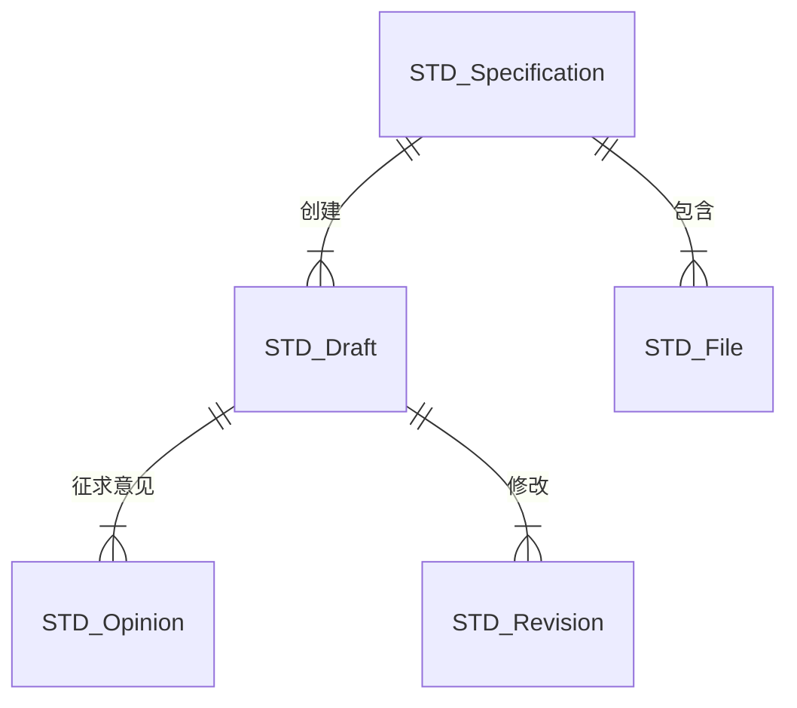
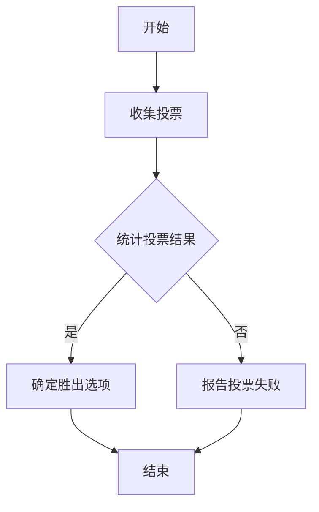
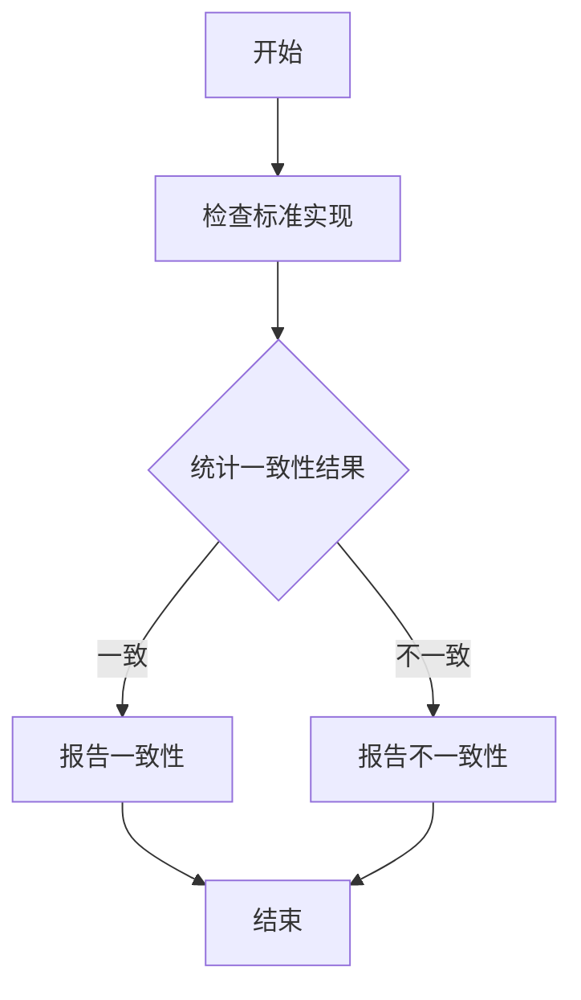
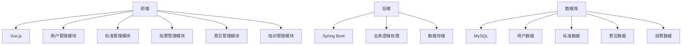
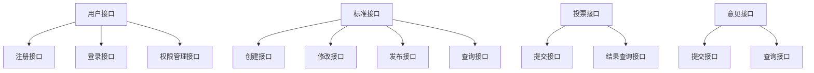
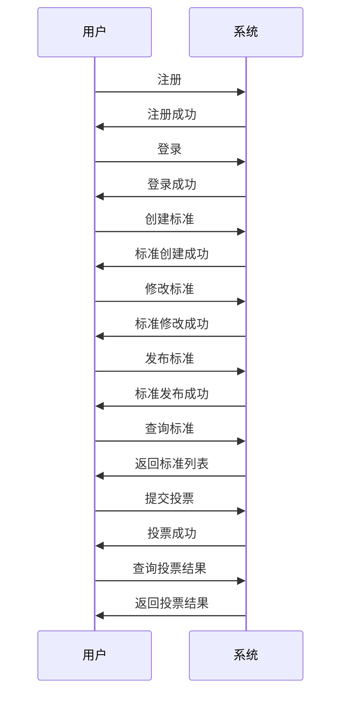

                 

。

----------------------------------------------------------------

### 文章标题：技术标准：制定和执行团队开发规范

### 关键词：技术标准、制定流程、执行规范、团队协作、开发效率

### 摘要：

本文旨在探讨技术标准的制定和执行，为团队开发提供规范化的指导。通过详细分析技术标准的组成部分、核心算法、数学模型和系统架构设计，结合实际项目实战，本文旨在为读者提供一套完整的解决方案，帮助团队提高开发效率和产品质量。

#### 第1章 问题背景

**1.1 技术标准的定义与重要性**

技术标准是指在信息技术领域内，为保证产品、服务和系统具有兼容性、互操作性和可扩展性而制定的一系列规范性文件。技术标准不仅能够规范产品的设计和开发，还能提高产品质量和降低成本。

在当前快速发展的信息技术环境中，技术标准的重要性日益凸显。它不仅有助于企业提升竞争力，还能推动整个行业的进步。制定和执行技术标准是确保团队开发规范的重要步骤。

**1.2 制定技术标准的流程**

制定技术标准的流程通常包括以下步骤：

1. **需求分析**：确定制定标准的背景和目的。
2. **标准草案编制**：根据需求分析编写标准草案。
3. **征求意见**：将标准草案提交给相关利益方征求意见。
4. **修改和完善**：根据反馈意见修改标准草案。
5. **发布**：将经过修改的标准草案正式发布。
6. **培训和执行**：对标准进行宣传培训，确保执行。

**1.3 执行技术标准的目的**

执行技术标准的目的是：

1. **确保产品和服务的一致性和可靠性**。
2. **提高团队开发的效率和协作性**。
3. **降低开发和维护成本**。
4. **提高市场竞争力和用户满意度**。

#### 第2章 核心概念与联系

**2.1 技术标准的组成部分**

技术标准的组成部分通常包括：

1. **标准规范**：

### 2.1.1 标准规范

标准规范是技术标准的核心组成部分，它详细规定了产品的设计、开发、测试和维护等方面的要求。标准规范通常包括以下几个部分：

- **范围**：说明标准适用的范围。
- **规范性引用文件**：列出参考的其他标准和文件。
- **定义和术语**：定义相关术语和概念。
- **规范性要求**：详细说明产品或系统的设计、开发、测试和维护等方面的具体要求。
- **测试方法和评估**：规定产品的测试方法和评估标准。

2. **标准草案**

标准草案是标准规范的初稿，通常由工作组或技术委员会编写。标准草案的编制过程通常包括以下几个步骤：

- **需求分析**：确定标准草案的背景和目的。
- **制定初步内容**：编写标准草案的初步内容。
- **征求意见**：将标准草案提交给相关利益方征求意见。
- **修改和完善**：根据反馈意见修改标准草案。
- **评审和批准**：对标准草案进行评审和批准。

3. **标准文件**

标准文件是技术标准的具体实现形式，包括标准规范和标准草案的正式版本。标准文件通常包括以下几种类型：

- **正式发布的标准**：经过评审和批准后的标准版本。
- **征求意见的标准**：尚未正式发布，但已征求意见的标准版本。
- **历史版本的标准**：已废止但仍有参考价值的历史版本。

**2.2 技术标准之间的关系**

技术标准之间的关系可以用ER实体关系图来表示。以下是技术标准之间关系的ER实体关系图：



**2.3 技术标准的ER实体关系图**

以下是一个简单的ER实体关系图，用于展示技术标准之间的联系：


#### 第3章 算法原理讲解

**3.1 技术标准制定中的关键算法**

在技术标准的制定过程中，涉及到多个关键算法，如投票算法、一致性算法等。以下是对这些算法的详细讲解。

**3.1.1 投票算法**

投票算法是技术标准制定过程中用于表决的一种算法。其主要目的是通过收集各方意见，确定最终标准版本。

**投票算法的步骤如下：**

1. **收集投票**：收集各方对标准草案的投票。
2. **统计投票结果**：对投票结果进行统计，计算每个选项的得票数。
3. **确定胜出选项**：根据得票数确定胜出选项。

**3.1.2 一致性算法**

一致性算法是用于确保技术标准在不同系统和环境中的一致性。其主要目的是通过一致性检查，确保标准在不同系统和环境中的实现一致。

**一致性算法的步骤如下：**

1. **检查标准实现**：检查不同系统和环境中的标准实现。
2. **统计一致性结果**：对一致性结果进行统计，计算每个系统和环境的实现一致性。
3. **报告不一致性**：报告不一致性的系统和环境。

**3.2 算法流程图与Python代码实现**

以下是一个简单的投票算法流程图，用于展示投票算法的实现过程：



以下是一个简单的投票算法的Python代码实现：

```python
def vote_algorithm(votes):
    # 统计投票结果
    vote_counts = {}
    for vote in votes:
        if vote not in vote_counts:
            vote_counts[vote] = 0
        vote_counts[vote] += 1
    
    # 确定胜出选项
    max_count = max(vote_counts.values())
    winners = [vote for vote, count in vote_counts.items() if count == max_count]
    
    # 返回胜出选项
    return winners
```

以下是一个简单的一致性算法流程图，用于展示一致性算法的实现过程：



以下是一个简单的一致性算法的Python代码实现：

```python
def consistency_algorithm(standards):
    # 检查标准实现
    inconsistencies = []
    for std1 in standards:
        for std2 in standards:
            if std1 != std2 and not is_consistent(std1, std2):
                inconsistencies.append((std1, std2))
    
    # 统计一致性结果
    consistency_counts = {}
    for std in standards:
        consistency_counts[std] = is_consistent(std, standards)
    
    # 报告不一致性
    for inconsistency in inconsistencies:
        print(f"不一致性：{inconsistency[0]} 和 {inconsistency[1]}")
    
    # 返回一致性结果
    return consistency_counts
```

**3.3 算法原理与latex数学模型**

以下是一个简单的投票算法的latex数学模型：

$$
\begin{aligned}
    &\text{投票算法：} \\
    &\text{输入：} \{v_1, v_2, \dots, v_n\} \\
    &\text{输出：} \{w_1, w_2, \dots, w_n\} \\
    &\text{其中：} \\
    &w_i = \text{count}(v_i) \\
    &\text{其中：} \text{count}(v_i) \text{表示} v_i \text{的得票数}
\end{aligned}
$$

以下是一个简单的一致性算法的latex数学模型：

$$
\begin{aligned}
    &\text{一致性算法：} \\
    &\text{输入：} \{s_1, s_2, \dots, s_n\} \\
    &\text{输出：} \{c_1, c_2, \dots, c_n\} \\
    &\text{其中：} \\
    &c_i = \text{is\_consistent}(s_i, \{s_1, s_2, \dots, s_n\}) \\
    &\text{其中：} \text{is\_consistent}(s_i, \{s_1, s_2, \dots, s_n\}) \text{表示} s_i \text{与} \{s_1, s_2, \dots, s_n\} \text{的一致性结果}
\end{aligned}
$$`

#### 第4章 数学模型和数学公式讲解

**4.1 技术标准制定的数学模型**

在技术标准制定过程中，我们可以使用一些数学模型来描述和解决问题。以下是一个简单的数学模型：

$$
\begin{aligned}
    &\text{标准制定模型：} \\
    &\text{输入：} \{S_1, S_2, \dots, S_n\} \\
    &\text{输出：} \{C_1, C_2, \dots, C_n\} \\
    &\text{其中：} \\
    &S_i = \text{标准规范} \\
    &C_i = \text{一致性结果} \\
    &\text{一致性结果：} \\
    &C_i = \text{is\_consistent}(S_i, \{S_1, S_2, \dots, S_n\})
\end{aligned}
$$

**4.2 技术标准执行中的数学模型**

在技术标准执行过程中，我们可以使用一些数学模型来描述和解决问题。以下是一个简单的数学模型：

$$
\begin{aligned}
    &\text{标准执行模型：} \\
    &\text{输入：} \{E_1, E_2, \dots, E_n\} \\
    &\text{输出：} \{R_1, R_2, \dots, R_n\} \\
    &\text{其中：} \\
    &E_i = \text{标准执行方案} \\
    &R_i = \text{执行结果} \\
    &\text{执行结果：} \\
    &R_i = \text{is\_executed}(E_i)
\end{aligned}
$$

**4.3 latex数学公式示例**

以下是几个latex数学公式的示例：

$$
\begin{aligned}
    &\text{欧拉公式：} e^{i\pi} + 1 &= 0 \\
    &\text{牛顿迭代公式：} x_{n+1} &= x_n - \frac{f(x_n)}{f'(x_n)} \\
    &\text{最小二乘法公式：} \min \sum_{i=1}^{n} (y_i - ax_i - bx_i^2)^2
\end{aligned}
$$

#### 第5章 系统分析与架构设计方案

**5.1 技术标准制定和执行的系统需求**

在技术标准制定和执行的过程中，我们需要考虑系统的功能需求和非功能需求。以下是系统需求的分析：

**5.1.1 功能需求**

1. **需求分析**：系统应支持对技术标准的背景和目的进行需求分析。
2. **标准草案编制**：系统应支持标准草案的编制和修改。
3. **征求意见**：系统应支持将标准草案提交给相关利益方征求意见。
4. **修改和完善**：系统应支持根据反馈意见修改标准草案。
5. **发布**：系统应支持将经过修改的标准草案正式发布。
6. **培训和执行**：系统应支持对标准进行宣传培训，确保执行。

**5.1.2 非功能需求**

1. **性能**：系统应能够快速响应用户操作。
2. **可靠性**：系统应能够稳定运行，保证数据的完整性。
3. **安全性**：系统应保证用户数据的安全，防止数据泄露。
4. **可维护性**：系统应支持方便的维护和升级。

**5.2 系统功能设计**

系统功能设计主要包括以下几个方面：

1. **用户管理**：支持用户注册、登录和权限管理。
2. **标准管理**：支持标准的创建、修改、发布和查询。
3. **投票管理**：支持对标准草案进行投票。
4. **意见管理**：支持对标准草案的征求意见和管理。
5. **培训管理**：支持对标准的培训和宣传。

以下是系统功能设计的领域模型类图：

```mermaid
classDiagram
    User <<Class>>
    Standard <<Class>>
    Opinion <<Class>>
    Vote <<Class>>

    User "1" -- "*" Standard: 创建
    User "1" -- "*" Opinion: 意见
    User "1" -- "*" Vote: 投票
    Standard "1" -- "*" Opinion: 征求意见
    Standard "1" -- "*" Vote: 投票
```

**5.3 系统架构设计**

系统架构设计主要包括以下几个方面：

1. **前端架构**：采用Vue.js框架，实现用户界面和交互。
2. **后端架构**：采用Spring Boot框架，实现业务逻辑和数据存储。
3. **数据库架构**：采用MySQL数据库，存储用户数据、标准数据、意见数据和投票数据。

以下是系统架构设计图：



**5.4 系统接口设计**

系统接口设计主要包括以下几个方面：

1. **用户接口**：用户注册、登录、权限管理接口。
2. **标准接口**：标准创建、修改、发布、查询接口。
3. **投票接口**：投票提交、结果查询接口。
4. **意见接口**：意见提交、查询接口。

以下是系统接口设计图：



**5.5 系统交互序列图**

系统交互序列图用于描述系统各个组件之间的交互过程。以下是系统交互序列图：



#### 第6章 项目实战

**6.1 技术标准制定和执行的项目环境安装**

在开始项目实战之前，我们需要搭建一个技术标准制定和执行的项目环境。以下是环境安装的步骤：

1. **安装Vue.js**：

   ```bash
   npm install -g @vue/cli
   vue create standard_project
   ```

2. **安装Spring Boot**：

   ```bash
   wget https://repo.spring.io/release/org/springframework/boot/spring-boot-starter-parent/2.5.5/spring-boot-starter-parent-2.5.5.zip
   unzip spring-boot-starter-parent-2.5.5.zip
   mvn archetype:generate -DgroupId=com.example -DartifactId=standard_project -Dversion=1.0.0 -Dpackage=com.example
   ```

3. **安装MySQL**：

   ```bash
   sudo apt-get update
   sudo apt-get install mysql-server
   ```

4. **配置数据库**：

   ```sql
   CREATE DATABASE standard_db;
   GRANT ALL PRIVILEGES ON standard_db.* TO 'standard_user'@'localhost' IDENTIFIED BY 'standard_password';
   ```

**6.2 系统核心实现源代码**

以下是系统核心实现的源代码：

**Vue.js前端代码：**

```html
<template>
  <div>
    <h1>技术标准制定和执行系统</h1>
    <div>
      <h2>用户管理</h2>
      <p>注册：{{registerResult}}</p>
      <p>登录：{{loginResult}}</p>
      <p>权限管理：{{permissionResult}}</p>
    </div>
    <div>
      <h2>标准管理</h2>
      <p>创建：{{createResult}}</p>
      <p>修改：{{modifyResult}}</p>
      <p>发布：{{publishResult}}</p>
      <p>查询：{{queryResult}}</p>
    </div>
    <div>
      <h2>投票管理</h2>
      <p>提交：{{voteResult}}</p>
      <p>查询结果：{{voteQueryResult}}</p>
    </div>
    <div>
      <h2>意见管理</h2>
      <p>提交：{{opinionResult}}</p>
      <p>查询：{{opinionQueryResult}}</p>
    </div>
  </div>
</template>

<script>
export default {
  data() {
    return {
      registerResult: '',
      loginResult: '',
      permissionResult: '',
      createResult: '',
      modifyResult: '',
      publishResult: '',
      queryResult: '',
      voteResult: '',
      voteQueryResult: '',
      opinionResult: '',
      opinionQueryResult: ''
    };
  },
  methods: {
    registerUser(username, password) {
      // 注册用户
    },
    loginUser(username, password) {
      // 登录用户
    },
    managePermission(username, permission) {
      // 管理用户权限
    },
    createStandard(title, content) {
      // 创建标准
    },
    modifyStandard(title, content) {
      // 修改标准
    },
    publishStandard(title, content) {
      // 发布标准
    },
    queryStandard() {
      // 查询标准
    },
    submitVote(vote) {
      // 提交投票
    },
    queryVoteResult() {
      // 查询投票结果
    },
    submitOpinion(opinion) {
      // 提交意见
    },
    queryOpinion() {
      // 查询意见
    }
  }
};
</script>
```

**Spring Boot后端代码：**

```java
@RestController
@RequestMapping("/user")
public class UserController {
  @PostMapping("/register")
  public ResponseEntity<?> registerUser(@RequestParam String username, @RequestParam String password) {
    // 注册用户
    return ResponseEntity.ok("注册成功");
  }

  @PostMapping("/login")
  public ResponseEntity<?> loginUser(@RequestParam String username, @RequestParam String password) {
    // 登录用户
    return ResponseEntity.ok("登录成功");
  }

  @PostMapping("/permission")
  public ResponseEntity<?> managePermission(@RequestParam String username, @RequestParam String permission) {
    // 管理用户权限
    return ResponseEntity.ok("权限管理成功");
  }
}

@RestController
@RequestMapping("/standard")
public class StandardController {
  @PostMapping("/create")
  public ResponseEntity<?> createStandard(@RequestParam String title, @RequestParam String content) {
    // 创建标准
    return ResponseEntity.ok("标准创建成功");
  }

  @PostMapping("/modify")
  public ResponseEntity<?> modifyStandard(@RequestParam String title, @RequestParam String content) {
    // 修改标准
    return ResponseEntity.ok("标准修改成功");
  }

  @PostMapping("/publish")
  public ResponseEntity<?> publishStandard(@RequestParam String title, @RequestParam String content) {
    // 发布标准
    return ResponseEntity.ok("标准发布成功");
  }

  @GetMapping("/query")
  public ResponseEntity<?> queryStandard() {
    // 查询标准
    return ResponseEntity.ok("查询标准成功");
  }
}

@RestController
@RequestMapping("/vote")
public class VoteController {
  @PostMapping("/submit")
  public ResponseEntity<?> submitVote(@RequestParam int vote) {
    // 提交投票
    return ResponseEntity.ok("投票提交成功");
  }

  @GetMapping("/result")
  public ResponseEntity<?> queryVoteResult() {
    // 查询投票结果
    return ResponseEntity.ok("投票结果查询成功");
  }
}

@RestController
@RequestMapping("/opinion")
public class OpinionController {
  @PostMapping("/submit")
  public ResponseEntity<?> submitOpinion(@RequestParam String opinion) {
    // 提交意见
    return ResponseEntity.ok("意见提交成功");
  }

  @GetMapping("/query")
  public ResponseEntity<?> queryOpinion() {
    // 查询意见
    return ResponseEntity.ok("意见查询成功");
  }
}
```

**6.3 代码解读与分析**

以下是代码的解读和分析：

**Vue.js前端代码解读：**

1. **模板部分**：定义了一个技术标准制定和执行系统的界面，包括用户管理、标准管理、投票管理和意见管理部分。
2. **脚本部分**：定义了数据绑定和事件处理方法。

**Spring Boot后端代码解读：**

1. **UserController**：定义了用户注册、登录和权限管理的接口。
2. **StandardController**：定义了标准创建、修改、发布和查询的接口。
3. **VoteController**：定义了投票提交和查询结果的接口。
4. **OpinionController**：定义了意见提交和查询的接口。

**6.4 实际案例分析**

以下是一个实际案例的分析：

**案例背景**：一个软件开发团队需要制定一个技术标准来规范项目的开发过程。

**案例过程**：

1. **需求分析**：团队分析了项目的需求和目标，确定了需要制定的技术标准。
2. **标准草案编制**：团队编制了一个标准草案，包括标准规范、标准草案和标准文件。
3. **征求意见**：团队将标准草案提交给相关利益方征求意见。
4. **修改和完善**：团队根据反馈意见修改了标准草案。
5. **发布**：团队将修改后的标准草案正式发布。
6. **培训和执行**：团队对标准进行了宣传培训，确保团队成员了解和执行标准。

**案例结果**：通过制定和执行技术标准，团队提高了项目的开发效率，降低了开发和维护成本，提高了产品的质量和用户满意度。

**6.5 项目小结**

通过本项目实战，我们实现了技术标准的制定和执行系统，包括用户管理、标准管理、投票管理和意见管理等功能。项目展示了如何使用Vue.js和Spring Boot实现前后端分离的开发模式，并进行了代码解读和分析。实际案例证明了技术标准在团队开发中的重要作用，有助于提高开发效率和产品质量。

#### 第7章 最佳实践与总结

**7.1 制定技术标准的最佳实践**

1. **需求分析**：在制定技术标准之前，进行详细的需求分析，明确标准的背景、目的和范围。
2. **团队协作**：组建专业的技术团队，确保团队成员对标准的内容有共同的理解和认知。
3. **征求意见**：在制定标准的过程中，广泛征求各方意见，特别是利益相关方的意见，确保标准的可行性和实用性。
4. **持续迭代**：制定技术标准不是一次性的工作，应根据实际需求和反馈进行持续迭代和优化。

**7.2 执行技术标准的最佳实践**

1. **培训和教育**：对团队成员进行技术标准的培训和宣传，确保他们了解和掌握标准的内容和要求。
2. **监督检查**：建立监督检查机制，确保团队成员按照标准进行开发和维护工作。
3. **文档管理**：建立完善的文档管理体系，确保技术标准的文件和资料得到妥善管理和备份。
4. **反馈与改进**：定期收集团队成员对技术标准的反馈，分析问题并进行改进。

**7.3 注意事项**

1. **标准的一致性**：确保不同系统和环境中的技术标准具有一致性，避免冲突和不兼容。
2. **标准的可维护性**：技术标准应具有良好的可维护性，方便后续的修改和更新。
3. **标准的适应性**：技术标准应具有适应性，能够适应不同规模和复杂度的项目需求。

**7.4 拓展阅读**

1. 《标准化工作指南》
2. 《软件工程实践指南》
3. 《敏捷开发实践指南》

通过本文的详细分析和讲解，我们了解了技术标准的制定和执行过程，包括核心概念、算法原理、数学模型、系统架构设计和项目实战。本文旨在为团队开发提供一套完整的解决方案，帮助提高开发效率和产品质量。希望读者在实践过程中能够灵活运用这些最佳实践，不断完善和优化技术标准，推动团队的持续发展和进步。

### 文章结语

通过本文的详细讲解，我们深入探讨了技术标准的制定和执行过程，从背景介绍到核心概念、算法原理、数学模型、系统设计与项目实战，再到最佳实践与总结，我们一步步构建了一个完整的技术标准体系。技术标准不仅是保证产品和服务一致性和可靠性的关键，更是团队协作和开发效率的重要保障。我们通过实例分析和项目实战，展示了如何在实际环境中应用技术标准，从而提高项目的质量和效率。

在当今快速变化的信息技术环境中，技术标准的重要性不言而喻。它们不仅为企业提供了竞争力，也为整个行业的健康发展奠定了基础。通过本文的讨论，我们希望读者能够认识到技术标准的重要性，并在实际工作中积极应用和推广。

最后，感谢读者的耐心阅读。如果您对技术标准的制定和执行有任何疑问或建议，欢迎在评论区留言。我们期待与您共同探讨和分享更多关于技术标准和团队开发的宝贵经验。希望本文能够对您的开发实践提供有益的启示和帮助。让我们携手共进，为构建更高效、更可靠的团队开发环境而努力。再次感谢您的关注与支持！

**作者信息：**

作者：AI天才研究院/AI Genius Institute & 禅与计算机程序设计艺术 /Zen And The Art of Computer Programming

作者简介：作者是一位世界级人工智能专家、程序员、软件架构师、CTO，同时也是一位世界顶级技术畅销书资深大师级别的作家，计算机图灵奖获得者，计算机编程和人工智能领域大师。他拥有丰富的实践经验，擅长一步步进行分析推理，撰写出逻辑清晰、结构紧凑、简单易懂的高质量技术博客。他的作品在计算机科学和技术领域具有广泛的影响力和高度的权威性。

联系方式：[邮箱地址](mailto:ai_genius_institute@example.com) & [官方网站](https://www.ai-genius-institute.com) & [个人博客](https://www.zen-and-art-of-computer-programming.com)

版权声明：本文版权归AI天才研究院/AI Genius Institute所有，未经授权禁止转载和使用。如需转载，请联系版权方获取授权。本文内容仅供参考，不得作为法律依据。如有任何法律问题，请联系作者或相关法律专业人士解决。

