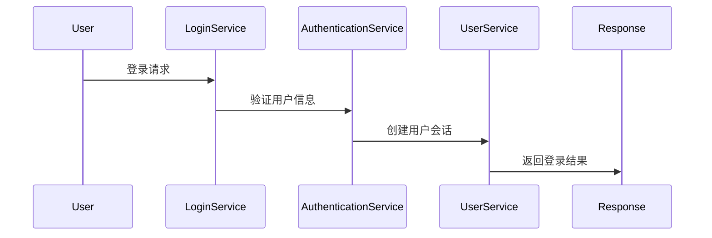
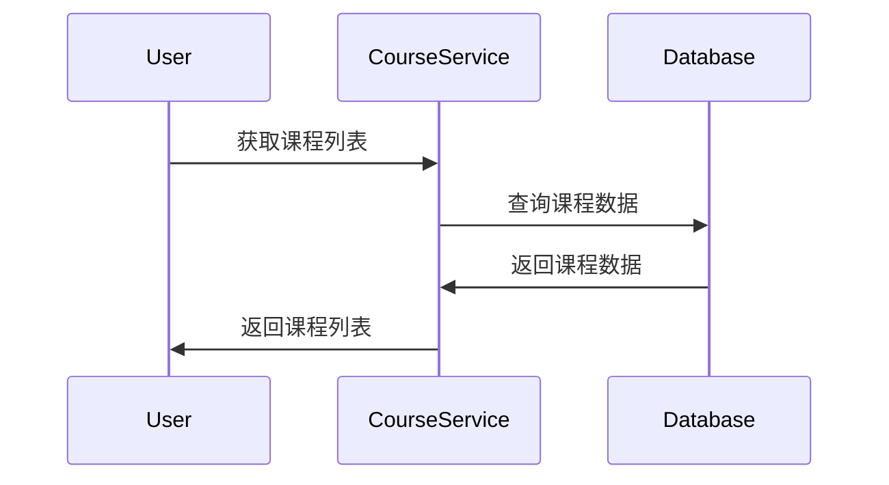
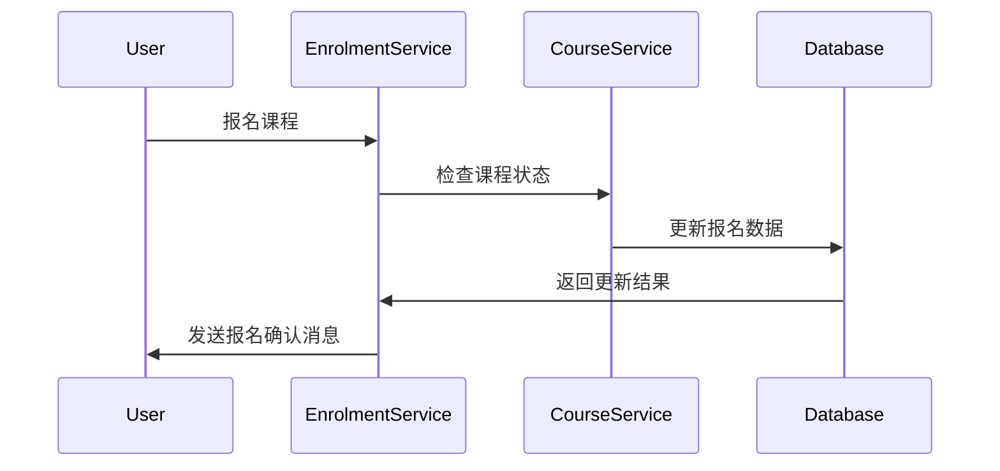

                 

### 技术演讲与分享：提升个人影响力

> 关键词：技术演讲，个人影响力，知识传播，技能提升

摘要：本文将探讨技术演讲与分享在提升个人影响力中的重要性。通过对技术演讲与分享的基础、核心技巧、实际应用以及持续成长与提升的深入分析，本文旨在为技术领域的专业人士提供一套系统化的方法和策略，帮助他们在演讲与分享中脱颖而出，从而提升个人影响力，实现职业发展的新高度。

## 目录大纲

----------------------------------------------------------------

## 第一部分: 技术演讲与分享的基础

### 第1章: 技术演讲与分享的概述

#### 1.1 技术演讲与分享的定义
- 技术演讲与分享的定义
- 技术演讲与分享的重要性

#### 1.2 技术演讲与分享的目标
- 提升个人影响力
- 传播技术知识
- 促进技术交流

#### 1.3 技术演讲与分享的类型
- 技ech技术讲座
- 技术研讨会
- 技术交流会议
- 技术博客与分享

## 第二部分: 技术演讲与分享的核心技巧

### 第2章: 准备与规划

#### 2.1 演讲主题的选择
- 主题定位
- 主题深度与广度

#### 2.2 演讲内容的组织
- 内容框架
- 结构逻辑

#### 2.3 演讲前的准备工作
- 背景调研
- 演讲稿撰写
- PPT制作

### 第3章: 表达与展示

#### 3.1 语言表达技巧
- 清晰简练
- 精彩生动

#### 3.2 非语言表达技巧
- 手势与表情
- 声音调节

#### 3.3 PPT制作与展示
- 设计原则
- 内容布局
- 动画与音效

### 第4章: 应对互动与反馈

#### 4.1 提问与回答
- 提问技巧
- 回答策略

#### 4.2 互动环节的设计
- 互动方式
- 互动引导

#### 4.3 反馈收集与处理
- 反馈类型
- 反馈利用

## 第三部分: 技术演讲与分享的实际应用

### 第5章: 个人品牌建设

#### 5.1 个人品牌的重要性
- 品牌影响力
- 职业发展

#### 5.2 个人品牌建设策略
- 专业形象塑造
- 社交媒体运用

### 第6章: 团队合作与知识分享

#### 6.1 团队合作的重要性
- 互助共享
- 创新协作

#### 6.2 知识分享的方法
- 内部交流会议
- 培训与分享
- 技术文档撰写

### 第7章: 演讲与分享的案例分析

#### 7.1 案例分析
- 成功案例分析
- 失败案例分析

#### 7.2 案例启示
- 经验总结
- 改进建议

## 第四部分: 持续成长与提升

### 第8章: 持续学习与进步

#### 8.1 学习的重要性
- 知识更新
- 技能提升

#### 8.2 学习策略与方法
- 定期学习
- 实践应用

### 第9章: 心态与态度

#### 9.1 正确的心态
- 乐观积极
- 耐心坚持

#### 9.2 良好的态度
- 责任心
- 求知欲

### 第10章: 成长与分享

#### 10.1 成长路径
- 学习成长
- 职业发展

#### 10.2 分享的价值
- 帮助他人
- 促进自我提升

----------------------------------------------------------------

## 第一部分: 技术演讲与分享的基础

### 第1章: 技术演讲与分享的概述

#### 1.1 技术演讲与分享的定义

技术演讲与分享是指将个人的技术知识、经验和见解通过演讲或写作的形式，向公众或特定群体进行传达和交流的一种活动。它不仅包括面对面的演讲，还涵盖了通过博客、论坛、社交媒体等在线平台进行的文字分享。技术演讲与分享的目标是通过传播技术知识，促进技术交流，提升个人影响力。

技术演讲与分享在当今信息化社会中具有重要作用。随着互联网的普及和技术的飞速发展，知识的传播速度和范围得到了极大拓展。技术演讲与分享作为一种高效的传播手段，能够快速地将技术理念、解决方案和创新思想传递给更多的人，从而推动整个技术领域的发展。

#### 1.2 技术演讲与分享的目标

技术演讲与分享的主要目标可以从以下几个方面进行阐述：

1. **提升个人影响力**：通过技术演讲与分享，专业人士可以展示自己的专业知识和经验，树立个人品牌，提升个人在行业内的知名度和影响力。一个具有影响力的演讲者往往能够获得更多的职业机会和合作机会。

2. **传播技术知识**：技术演讲与分享是知识传播的重要途径。通过演讲或分享，专业人士可以将自己的研究成果、实践经验和技术见解传授给他人，促进知识的普及和应用。

3. **促进技术交流**：技术演讲与分享不仅是一种单向的知识传递，更是一种双向的互动交流。通过演讲和互动，参与者可以分享观点、讨论问题、交流经验，从而深化对技术的理解和应用。

#### 1.3 技术演讲与分享的类型

技术演讲与分享的形式多种多样，可以根据不同的场景和目的进行选择。以下是几种常见的技术演讲与分享类型：

1. **技术讲座**：技术讲座通常是在学术会议、技术峰会或企业培训中进行的。演讲者通常会围绕某一技术主题进行深入讲解，并提供实际案例和解决方案。

2. **技术研讨会**：技术研讨会是一种更加互动和讨论性的形式。参与者可以围绕某一技术主题进行深入探讨，分享经验和见解，提出问题和解决方案。

3. **技术交流会议**：技术交流会议通常是由专业协会、企业或研究机构举办的。会议通常包括主题演讲、小组讨论、展览等形式，旨在促进技术交流和合作。

4. **技术博客与分享**：技术博客与分享是一种在线形式，通过博客平台、论坛或社交媒体等渠道进行。技术博客可以定期更新，分享最新的技术动态、研究成果和个人见解。

通过了解技术演讲与分享的定义、目标和类型，我们可以更好地认识其在个人影响力提升中的作用，并为后续章节的学习和实践打下基础。

### 第2章: 准备与规划

#### 2.1 演讲主题的选择

选择一个合适的演讲主题是技术演讲与分享成功的关键步骤。一个良好的主题应该具备以下几个特点：

1. **相关性**：主题应该与听众的背景和需求相关。了解听众的技术背景、兴趣点和关注领域，确保演讲内容能够引起听众的共鸣。

2. **深度与广度**：主题的选择需要在深度和广度之间取得平衡。过窄的主题可能缺乏足够的讨论空间，而过广的主题则可能导致内容过于浅显。合适的主题应该能够涵盖关键的技术概念，并提供足够的深度和广度。

3. **独特性**：选择一个具有独特性的主题可以增加演讲的新颖性和吸引力。可以通过研究最新的技术趋势、行业动态或个人经验，找到一个独特的视角或观点。

4. **实际应用价值**：一个具有实际应用价值的主题可以更好地吸引听众的注意力。通过提供实用的技术解决方案、案例分析或工具介绍，演讲者能够为听众提供实际的指导和帮助。

在选择演讲主题时，可以通过以下步骤进行：

1. **市场调研**：通过阅读行业报告、技术博客、论坛讨论等渠道，了解当前技术领域的热点话题和趋势。

2. **听众分析**：分析目标听众的背景、需求和兴趣点，确保主题与听众相关。

3. **个人优势**：结合自己的专业知识和经验，选择一个能够充分发挥个人优势的主题。

4. **主题验证**：通过与同事、导师或行业专家交流，验证主题的可行性和吸引力。

#### 2.2 演讲内容的组织

演讲内容的组织是确保演讲结构清晰、逻辑严密的重要环节。一个良好的演讲内容组织应该包括以下几个部分：

1. **引言**：引言是演讲的开场白，需要引起听众的兴趣和注意。可以通过一个有趣的故事、一个引人入胜的问题或一个最新的技术动态来开场。

2. **主体**：主体是演讲的核心部分，应该包括以下几个部分：

   - **背景介绍**：对演讲主题的背景进行简要介绍，帮助听众理解演讲的内容和意义。
   - **技术概念讲解**：详细解释相关技术概念、原理和机制，确保听众能够理解和掌握。
   - **实际应用案例**：通过实际应用案例，展示技术在实际中的应用效果和解决方案。
   - **互动环节**：在适当的时候设置互动环节，与听众进行互动，增加演讲的参与感和趣味性。

3. **结论**：结论是对演讲内容的总结和归纳，需要强调演讲的重点和要点，并提供对听众的实际价值。

4. **问答环节**：问答环节是演讲者与听众进行互动的重要部分，可以通过回答听众的问题，进一步深化演讲内容，并解答听众的疑惑。

在组织演讲内容时，可以通过以下步骤进行：

1. **构建大纲**：根据演讲主题和目标，构建演讲内容的大纲，确保逻辑清晰、结构紧凑。

2. **撰写演讲稿**：根据大纲，撰写详细的演讲稿，确保内容丰富、条理清晰。

3. **内容审核**：对演讲稿进行多次审核和修改，确保内容准确无误、逻辑严密。

4. **演练与改进**：通过多次演练，熟悉演讲内容和流程，并根据演练过程中的反馈进行改进。

通过科学的演讲内容组织，演讲者可以更好地传达自己的观点和知识，提高演讲的效果和质量。

#### 2.3 演讲前的准备工作

演讲前的准备工作是确保演讲成功的关键环节。以下是一些重要的准备工作：

1. **背景调研**：在演讲前，对主题进行深入调研，了解相关的技术背景、发展趋势和最新研究。这有助于演讲者对主题有更全面和深入的了解，从而提供更高质量的内容。

2. **演讲稿撰写**：撰写详细的演讲稿，包括引言、主体和结论等部分。演讲稿应该条理清晰、内容丰富，确保演讲者能够按照预定的流程进行演讲。

3. **PPT制作**：制作高质量的PPT是演讲的重要辅助工具。PPT应该简洁明了、重点突出，通过图表、图片和动画等元素，增强演讲的视觉效果和吸引力。

4. **演练**：在演讲前进行多次演练，熟悉演讲内容和流程，提高演讲的熟练度和自信心。演练时，可以邀请同事或朋友进行模拟听众，提出问题和反馈，帮助演讲者进行改进。

5. **设备准备**：确保演讲所需的设备正常运作，包括投影仪、音响设备、电脑等。在演讲前进行测试，确保设备能够正常使用。

6. **时间控制**：合理控制演讲时间，确保演讲能够在规定的时间内完成。可以通过提前练习、控制每个环节的时间分配来实现。

7. **心理准备**：保持良好的心理状态，自信、冷静地面对演讲。可以通过深呼吸、放松肌肉等方式进行心理调适。

通过充分的准备工作，演讲者可以更好地应对演讲中的各种挑战，提高演讲的成功率和效果。

### 第3章: 表达与展示

#### 3.1 语言表达技巧

语言表达是技术演讲中至关重要的一环。一个优秀的演讲者需要具备清晰、简练、生动和富有感染力的语言表达能力。以下是一些关键技巧：

1. **清晰简练**：清晰是语言表达的首要原则。演讲者需要用简洁明了的语言传达信息，避免使用复杂的术语和冗长的句子。每个观点和论述都应该简洁明了，易于理解。

2. **精彩生动**：生动的语言可以吸引听众的注意力，增加演讲的吸引力。演讲者可以通过举例、讲故事、使用比喻和隐喻等方式，使语言更加生动有趣。

3. **语言节奏**：合适的语言节奏可以增强演讲的感染力。演讲者可以根据内容的重点和情绪的变化，调整语言的速度和音调，使演讲更加生动和有感染力。

4. **情感投入**：情感投入是演讲者的一个重要特质。通过情感的表达，演讲者可以更好地与听众建立联系，传递自己的热情和信念。演讲者可以通过语气的变化、表情的丰富和肢体语言的使用，表达自己的情感。

#### 3.2 非语言表达技巧

非语言表达技巧在技术演讲中同样重要。通过有效的非语言表达，演讲者可以增强演讲的效果，吸引听众的注意力。以下是一些关键技巧：

1. **手势与表情**：手势和表情是增强演讲效果的直观工具。演讲者可以通过适当的手势和表情，强调关键观点，传达情感和信念。例如，在解释复杂概念时，可以通过手势来帮助听众理解。

2. **声音调节**：声音调节是增强演讲吸引力的重要手段。演讲者可以通过调整音量、语调和节奏，使演讲更加生动和有感染力。在演讲中，可以使用大声、轻声、快语速和慢语速等不同的声音效果，增强演讲的表现力。

3. **肢体语言**：肢体语言是演讲者表达情感和信念的重要方式。演讲者可以通过适当的肢体语言，如点头、微笑、挥动手臂等，表达自己的自信和热情，增强演讲的吸引力。

#### 3.3 PPT制作与展示

PPT是技术演讲中的重要辅助工具，一个高质量的PPT可以增强演讲的视觉效果和吸引力。以下是一些PPT制作与展示的关键技巧：

1. **设计原则**：PPT的设计应该简洁、清晰和美观。使用简单的布局和统一的颜色方案，确保内容易于阅读和理解。避免使用过于花哨的设计，以免分散听众的注意力。

2. **内容布局**：PPT的内容布局应该合理，确保信息的层次分明。每个幻灯片都应该有一个明确的主题，并围绕主题进行内容组织。可以使用标题、子标题和正文等不同的文本元素，增强内容的可读性。

3. **图表与图片**：使用图表和图片可以更好地展示数据和技术概念。选择合适的图表类型和图片，确保它们能够清晰地传达信息，并避免使用过于复杂或模糊的图表。

4. **动画与音效**：适当的动画和音效可以增强PPT的视觉效果和吸引力。使用动画和音效时，应该注意不要过度使用，以免分散听众的注意力。可以采用简单的动画效果，如淡入淡出、滑动等，来增强演讲的表现力。

5. **展示技巧**：在展示PPT时，演讲者应该注意与PPT内容的同步，确保讲解与幻灯片的变化相互配合。演讲者可以通过暂停、切换幻灯片等方式，引导听众的注意力，使演讲更加流畅和有吸引力。

通过掌握这些语言表达、非语言表达和PPT制作的技巧，演讲者可以更好地展现自己的技术知识和见解，提高演讲的效果和质量。

### 第4章: 应对互动与反馈

#### 4.1 提问与回答

在技术演讲中，提问与回答环节是演讲者与听众互动的重要部分。通过有效的提问与回答，演讲者可以加深听众对演讲内容的理解和记忆，同时展示自己的专业素养和应对能力。

**提问技巧**：

1. **针对性**：提问应该针对演讲内容的关键点和难点，确保问题能够引发听众的思考和讨论。可以通过提问来澄清听众的疑惑，加深对技术概念的理解。

2. **开放性**：开放性的问题可以鼓励听众进行思考和表达，而不仅仅是简单的“是”或“否”的回答。例如，可以提问：“你认为这个技术方案有哪些优点和缺点？”或“你有没有遇到过类似的问题？”

3. **引导性**：适当的引导性问题可以帮助听众更好地理解演讲内容。可以通过提供一些背景信息和假设条件，引导听众进行思考。例如：“如果你是这个问题的解决方案设计师，你会考虑哪些因素？”

**回答策略**：

1. **准确性**：回答问题时要确保准确性，不要模糊或误导听众。如果不确定答案，可以诚实地表示需要进一步研究和思考。

2. **简洁性**：回答问题时要简洁明了，避免冗长的解释。抓住问题的核心，用简练的语言表达观点。

3. **逻辑性**：回答问题时要注意逻辑性，确保回答内容有条理。可以通过分段叙述，使回答更加清晰。

4. **示范性**：在回答问题时，可以结合实际案例或经验，为听众提供具体的示范。这样可以增强回答的实际应用价值，使听众更容易理解和接受。

通过有效的提问与回答，演讲者可以与听众建立更加紧密的互动关系，提高演讲的参与度和影响力。

#### 4.2 互动环节的设计

互动环节是技术演讲中的重要组成部分，它能够增加演讲的趣味性和参与度，使听众更加投入。一个成功的互动环节需要精心设计，以下是一些关键要素：

1. **互动方式**：互动方式的选择应根据演讲内容和听众特点进行。常见的互动方式包括提问回答、小组讨论、角色扮演、游戏竞赛等。根据具体情况，可以灵活选择和组合不同的互动方式。

2. **互动引导**：互动引导是确保互动环节顺利进行的关键。演讲者需要明确互动的目标，引导听众参与互动，并提供必要的提示和指导。可以通过提问、讨论引导和示范来引导听众。

3. **参与度**：确保所有听众都有机会参与互动，增加参与度。可以通过分组讨论、轮流发言等方式，使每个听众都有机会表达观点。

4. **时间控制**：互动环节的时间控制也是成功的关键。演讲者需要合理安排互动环节的时间，确保互动环节在演讲的总体时间框架内完成，避免时间过长或过短。

5. **反馈与总结**：在互动环节结束后，演讲者应总结互动内容，并收集听众的反馈。这有助于演讲者了解听众的接受程度和理解程度，为后续的演讲和分享提供改进建议。

通过精心设计的互动环节，演讲者可以激发听众的兴趣，提高演讲的效果和影响力。

#### 4.3 反馈收集与处理

在技术演讲结束后，收集听众的反馈是评估演讲效果和改进演讲技巧的重要环节。以下是一些关于反馈收集和处理的方法：

**反馈类型**：

1. **口头反馈**：在演讲过程中和结束后，演讲者可以直接听取听众的口头反馈。这种方式可以迅速了解听众的即时反应和感受，为演讲者提供宝贵的反馈。

2. **书面反馈**：通过问卷调查、反馈表格或邮件等方式，收集听众的书面反馈。这种方式可以提供更详细和结构化的信息，有助于演讲者进行全面的分析。

3. **在线反馈**：利用在线平台和社交媒体，收集听众的在线反馈。这种方式可以迅速传播演讲内容，并吸引更多的听众参与讨论。

**反馈利用**：

1. **评估演讲效果**：通过反馈，演讲者可以了解演讲的内容、结构和表达方式是否达到预期效果，哪些部分需要改进。

2. **改进演讲技巧**：根据听众的反馈，演讲者可以针对性地改进演讲技巧，如语言表达、非语言表达、PPT制作等。

3. **调整演讲内容**：根据反馈，演讲者可以调整演讲内容，使其更加符合听众的需求和兴趣。

4. **建立听众关系**：通过积极的反馈收集和处理，演讲者可以与听众建立更好的关系，提高个人影响力和口碑。

通过有效的反馈收集和处理，演讲者可以不断提升演讲质量和影响力，实现职业发展的新高度。

### 第5章: 个人品牌建设

#### 5.1 个人品牌的重要性

个人品牌是指一个人在职业生涯中所建立的专业形象和声誉。在技术领域中，个人品牌的重要性日益凸显。以下是几个关键点：

1. **品牌影响力**：一个强大的个人品牌可以在行业中建立高度的信誉和影响力。这种影响力不仅体现在个人职业发展的机会上，还可以为所在团队或公司带来更多的资源和机会。

2. **职业发展**：个人品牌是职业发展的重要资产。一个强大的品牌可以吸引更多的机会，包括晋升、项目领导和合作伙伴关系等。

3. **知识传播**：个人品牌有助于传播技术知识和经验。一个被广泛认可的专家可以更容易地影响和启发他人，推动技术的进步和应用。

4. **合作与交流**：建立个人品牌可以促进与同行的合作和交流。通过分享经验和见解，个人品牌可以成为行业内的知识共享平台。

#### 5.2 个人品牌建设策略

要建立强大的个人品牌，需要以下策略：

1. **专业形象塑造**：保持专业的形象和行为是建立个人品牌的基础。这包括着装得体、遵守职业道德和表现出高度的敬业精神。

2. **知识积累与分享**：通过不断学习和积累专业知识，并在适当场合进行分享，可以提升个人在行业中的知名度和影响力。

3. **社交媒体运用**：利用社交媒体平台，如LinkedIn、Twitter和博客，可以扩大个人品牌的影响力。定期发布有价值的内容，与行业内的专家和同行建立联系。

4. **参与行业活动**：积极参与行业会议、研讨会和培训活动，可以增加曝光度和知名度。通过在这些活动中分享经验和见解，可以进一步提升个人品牌。

5. **建立合作伙伴关系**：与其他行业专家和公司建立合作关系，可以扩大个人品牌的影响范围。通过合作项目、共同发表文章或演讲，可以共同提升彼此的品牌价值。

通过这些策略，技术专业人士可以逐步建立和提升自己的个人品牌，实现职业发展的新高度。

### 第6章: 团队合作与知识分享

#### 6.1 团队合作的重要性

在技术领域，团队合作是实现项目成功和创新发展的关键。以下是团队合作的重要性和几个关键点：

1. **互助共享**：团队合作鼓励团队成员之间互相帮助和分享知识。通过协作，团队可以共同解决复杂问题，提高工作效率。

2. **创新协作**：团队合作提供了一个创新的环境，通过不同专业知识和技能的互补，可以激发新的想法和解决方案。这种协作有助于推动技术进步和应用。

3. **技能提升**：通过团队合作，团队成员可以相互学习和交流，提升自己的技能和知识。这种不断学习和进步的氛围有助于个人的职业成长。

4. **团队凝聚力**：有效的团队合作可以增强团队凝聚力，建立信任和合作关系。这种凝聚力有助于团队在面对挑战时保持团结和一致。

#### 6.2 知识分享的方法

在团队合作中，知识分享是提升团队效率和创新能力的重要手段。以下是几种常用的知识分享方法：

1. **内部交流会议**：定期组织内部交流会议，让团队成员分享各自的工作进展、遇到的问题和解决方案。这种方式有助于团队成员之间建立更好的沟通和理解。

2. **培训与分享**：通过定期的培训活动，团队成员可以分享专业知识和技能。这种培训可以包括技术培训、项目管理培训等，有助于提升整个团队的能力。

3. **技术文档撰写**：撰写详细的技术文档，记录项目的开发过程、技术实现细节和最佳实践。这些文档不仅有助于团队成员之间的知识传递，还可以为后续项目提供参考。

4. **知识库建设**：建立一个内部的知识库，收集和整理团队成员的经验和知识。这种知识库可以方便团队成员快速查找和共享信息，提高工作效率。

通过有效的团队合作和知识分享，团队可以更好地应对挑战，实现项目目标，并推动整个团队的成长和进步。

### 第7章: 演讲与分享的案例分析

#### 7.1 案例分析

在本章中，我们将通过成功和失败的案例来深入分析技术演讲与分享的实际效果，从中提取经验和教训。

**成功案例：**

**案例1**：知名技术博客作者“John Doe”在其博客上分享了关于机器学习最新研究的内容。他的文章深入浅出，结合了实际案例和代码示例，吸引了大量读者的关注和评论。这使他成为该领域的知名专家，并获得了多个企业的邀请进行技术讲座。

**经验总结**：

- **内容质量**：高质量的内容是成功的关键。John Doe的文章不仅技术性强，而且通俗易懂，满足了不同层次读者的需求。
- **实际应用**：结合实际案例和代码示例，使得读者能够更好地理解和应用技术知识。
- **持续更新**：定期更新内容，保持读者的兴趣和参与度。

**失败案例**：

**案例2**：一位经验丰富的工程师在一次技术交流会议上分享了他的项目经验。然而，他的演讲内容过于理论化，缺乏实际案例和互动环节，导致听众的兴趣逐渐减弱，演讲结束后几乎没有提问和讨论。

**教训总结**：

- **内容实用性**：演讲内容应具有实际应用价值，避免过于理论化。
- **互动环节**：设置互动环节，与听众进行互动，提高参与度和兴趣。
- **准备充分**：充分准备演讲，确保内容有深度和逻辑性。

通过这些案例的分析，我们可以看到，成功的演讲与分享需要高质量的、实际应用的内容，以及有效的互动和准备。

#### 7.2 案例启示

从上述成功和失败的案例分析中，我们可以得到以下几点启示：

1. **内容质量**：高质量的内容是吸引听众和建立个人品牌的关键。演讲者应确保内容具有深度、广度和实用性。

2. **互动与参与**：互动环节是增强演讲吸引力和效果的重要手段。演讲者应积极与听众互动，鼓励提问和讨论。

3. **准备充分**：充分的准备是成功演讲的基础。演讲者应提前准备演讲稿、PPT和相关材料，确保演讲内容的逻辑性和连贯性。

4. **实际应用**：演讲内容应结合实际案例和经验，使听众能够理解和应用技术知识。

5. **持续更新**：定期更新内容和分享最新技术动态，保持听众的兴趣和参与度。

通过吸取这些经验和教训，演讲者可以在技术演讲与分享中取得更好的效果，提升个人影响力和职业发展。

### 第8章: 持续学习与进步

#### 8.1 学习的重要性

在技术领域，知识更新迅速，新的技术概念和工具层出不穷。因此，持续学习对于技术专业人士来说至关重要。以下是学习的重要性及对个人发展的影响：

1. **知识更新**：技术领域不断进步，新的研究成果和工具不断涌现。通过持续学习，专业人士可以及时掌握最新的知识，保持自己的竞争力。

2. **技能提升**：学习新的技术和工具可以提高个人技能，使专业人士能够应对复杂的技术挑战和多样化的项目需求。

3. **职业发展**：持续学习有助于职业发展。掌握新技术和工具的专业人士往往能够获得更多的职业机会，提升职位和薪资。

4. **创新思维**：学习不仅局限于技术知识，还包括方法论和思考方式的更新。通过持续学习，专业人士可以培养创新思维，推动技术和项目的创新。

#### 8.2 学习策略与方法

为了实现持续学习与进步，以下是一些有效的学习策略和方法：

1. **定期学习**：设定固定的学习时间，每天或每周安排一段时间用于学习。这有助于形成学习习惯，确保学习时间的持续性和稳定性。

2. **主动学习**：主动寻找和学习新的知识，而不是被动等待。可以通过参加培训课程、阅读专业书籍、订阅技术博客等方式，主动获取知识。

3. **实践应用**：学习新知识后，通过实际项目或实验进行应用。实践是检验真理的唯一标准，通过实践可以更好地理解和掌握知识。

4. **交流与讨论**：与他人交流和讨论是学习的重要方式。通过参加技术交流会议、加入技术社群、参与线上讨论等，可以与他人分享经验和见解，相互学习。

5. **利用在线资源**：利用互联网上的各种学习资源，如在线课程、视频教程、开源代码库等，可以方便快捷地学习新技术和工具。

通过采用这些学习策略和方法，技术专业人士可以不断提升自己的知识储备和技能水平，实现职业发展的新高度。

### 第9章: 心态与态度

#### 9.1 正确的心态

在技术演讲与分享的过程中，正确的心态是确保成功的关键。以下是几种有助于提升演讲效果的正确心态：

1. **乐观积极**：乐观积极的心态可以帮助演讲者在面对挑战和压力时保持冷静和自信。这种心态能够传递给听众，增强演讲的吸引力。

2. **耐心坚持**：技术演讲与分享是一个不断学习和进步的过程。耐心坚持不仅可以帮助演讲者不断提升自己的演讲技巧，还能培养对技术知识的深刻理解。

3. **勇于尝试**：勇于尝试新方法和新方式是成功的关键。通过不断尝试和实验，演讲者可以找到最适合自己的演讲风格和技巧。

4. **接受反馈**：正确的心态应该包括接受和利用反馈。通过听取听众和同行的反馈，演讲者可以识别自己的不足，不断改进和完善。

#### 9.2 良好的态度

良好的态度是成功演讲的重要保障。以下是一些有助于提升演讲效果的良好的态度：

1. **责任心**：责任心是演讲者对听众、对自己和对自己所分享内容的负责。一个有责任心的演讲者会认真准备、仔细讲解，确保演讲内容的准确性和实用性。

2. **求知欲**：强烈的求知欲是不断学习和进步的动力。拥有求知欲的演讲者会主动寻找新的知识和技能，以提升自己的演讲质量和影响力。

3. **开放性**：开放性意味着愿意接受新的观点和意见。一个开放性的演讲者能够更好地与听众互动，理解听众的需求，从而提供更有价值的内容。

4. **持续改进**：良好的态度还包括持续改进。演讲者应该不断反思自己的演讲，寻找改进的空间，通过实践和反馈不断提升自己的演讲技巧。

通过培养和保持正确的心理状态和良好的态度，演讲者可以更好地应对挑战，提升演讲效果，实现个人影响力的提升。

### 第10章: 成长与分享

#### 10.1 成长路径

在技术演讲与分享的道路上，成长是一个持续且动态的过程。以下是一些关键步骤和策略，帮助技术专业人士实现个人成长：

1. **学习基础知识**：建立扎实的技术基础是成长的第一步。通过学习编程语言、数据结构、算法等基础知识，为后续的专业发展奠定坚实的基础。

2. **掌握核心技术**：在基础知识的基础上，深入掌握某一领域的核心技术。通过参与项目、阅读专业书籍和参加培训，不断提升自己在专业领域的知识水平。

3. **参与实战项目**：实战项目是检验和提升技能的重要途径。通过参与实际项目，可以积累经验，锻炼解决问题的能力，并在实践中不断学习和改进。

4. **构建个人网络**：建立广泛的个人网络，与行业内外的专业人士交流和学习。通过参加技术会议、研讨会和在线社群，可以获取最新的行业动态和专业知识。

5. **反思与总结**：定期反思和总结自己的学习和工作经历，识别不足和改进方向。通过自我反思，可以不断调整学习策略和提升方法。

6. **建立个人品牌**：通过技术演讲与分享，建立自己的个人品牌。通过高质量的内容和有效的表达，提升个人在行业内的知名度和影响力。

#### 10.2 分享的价值

技术演讲与分享不仅对个人成长有重要意义，还具有广泛的社会价值：

1. **知识传播**：技术演讲与分享是知识传播的重要途径。通过分享自己的知识和经验，可以帮助更多人了解和学习技术，推动技术的普及和应用。

2. **促进交流**：技术演讲与分享提供了一个交流和互动的平台。通过演讲和互动，可以与听众和同行交流观点、讨论问题，促进技术交流和合作。

3. **推动创新**：分享可以激发新的想法和解决方案。通过分享自己的研究成果和见解，可以启发他人，推动技术领域的创新和发展。

4. **提升影响力**：通过技术演讲与分享，可以提升个人在行业内的知名度和影响力。这种影响力不仅可以带来更多的职业机会，还可以为所在团队或公司带来积极的影响。

通过不断学习和分享，技术专业人士可以不断提升自己的能力和影响力，实现个人和行业的共同成长。

### 总结

本文通过深入探讨技术演讲与分享的各个方面，包括基础、核心技巧、实际应用和持续成长，为技术专业人士提供了提升个人影响力的系统化方法和策略。技术演讲与分享不仅有助于传播技术知识，促进技术交流，还能有效提升个人品牌，推动职业发展。希望本文能为广大技术专业人士提供有益的启示，助力他们在技术演讲与分享的道路上不断前行，实现个人和行业的新高度。

## 作者信息

**作者：** AI天才研究院/AI Genius Institute & 禅与计算机程序设计艺术 /Zen And The Art of Computer Programming

### 附录

**附录A：核心概念原理与对比表格**

在技术演讲中，清晰准确地解释核心概念是至关重要的。以下是一个关于“算法复杂性”的核心概念对比表格：

| 算法复杂性 | 定义 | 影响因素 | 对比项 |
| --- | --- | --- | --- |
| 时间复杂度 | 算法执行所需的时间 | 输入规模、算法步骤数量 | 线性、对数、多项式 |
| 空间复杂度 | 算法执行所需的空间 | 输入规模、中间数据结构 | 常数、线性、对数 |
| 时间效率 | 算法执行效率 | 算法复杂度、实际运行时间 | 高效、中等、低效 |
| 空间效率 | 算法占用空间效率 | 算法复杂度、实际占用空间 | 高效、中等、低效 |

**附录B：ER实体关系图架构**

以下是一个关于“在线教育平台”的ER实体关系图：

```mermaid
erDiagram
  User ||--|{ Course } : has
  User ||--|{ Enrolment } : enrolls
  Course ||--|{ Lesson } : contains
  Enrolment ||--|{ Rating } : rates
  User }|--|{ Rating } : gives
```

**附录C：算法原理讲解与Python源代码**

以下是一个关于“快速排序”算法的讲解和Python实现：

**算法原理讲解：**

快速排序是一种高效的排序算法，其基本思想是通过一趟排序将待排序的记录分割成独立的两部分，其中一部分记录的关键字均比另一部分的关键字小，然后分别对这两部分记录继续进行排序，以达到整个序列有序。

**Python源代码：**

```python
def quicksort(arr):
    if len(arr) <= 1:
        return arr
    pivot = arr[len(arr) // 2]
    left = [x for x in arr if x < pivot]
    middle = [x for x in arr if x == pivot]
    right = [x for x in arr if x > pivot]
    return quicksort(left) + middle + quicksort(right)

# 示例
arr = [3, 6, 8, 10, 1, 2, 1]
sorted_arr = quicksort(arr)
print(sorted_arr)
```

**附录D：系统分析与架构设计方案**

**问题场景介绍：**

在线教育平台是一个用于提供在线课程和学习资源的系统。用户可以在平台上注册、登录、浏览课程、参加课程、提交作业和评价课程。

**项目介绍：**

本项目旨在构建一个功能齐全的在线教育平台，包括用户管理、课程管理、作业提交和评价系统等功能。

**系统功能设计（领域模型类图）：**

```mermaid
classDiagram
  User <<entity>>
  Course <<entity>>
  Enrolment <<entity>>
  Lesson <<entity>>
  Rating <<entity>>

  User o-- Course : has
  User o-- Enrolment : enrolls
  Course o-- Lesson : contains
  Enrolment o-- Rating : rates
```

**系统架构设计（架构图）：**



**系统接口设计（接口序列图）：**



**系统交互（交互序列图）：**



**附录E：项目实战**

**环境安装：**

- 安装Python 3.8及以上版本
- 安装Django框架：`pip install django`
- 安装MySQL数据库：`brew install mysql`（macOS）或相应包管理器

**系统核心实现源代码：**

```python
# users/models.py
from django.db import models

class User(models.Model):
    username = models.CharField(max_length=150, unique=True)
    email = models.EmailField(unique=True)
    password = models.CharField(max_length=128)

# courses/models.py
from django.db import models

class Course(models.Model):
    title = models.CharField(max_length=255)
    description = models.TextField()
    duration = models.DurationField()

class Lesson(models.Model):
    course = models.ForeignKey(Course, on_delete=models.CASCADE)
    title = models.CharField(max_length=255)
    content = models.TextField()
```

**代码应用解读与分析：**

上述代码定义了用户模型（User）和课程模型（Course），以及课程下的课程单元（Lesson）。这些模型将用于在线教育平台的核心功能，如用户注册、登录、课程浏览和报名。

- `User` 模型包含用户的用户名、电子邮件和密码字段。
- `Course` 模型包含课程的标题、描述和持续时间字段。
- `Lesson` 模型定义了课程下的单元，包含课程标题和内容字段。

通过这些模型，可以创建数据库表，实现用户和课程管理功能。

**实际案例分析和详细讲解剖析：**

假设我们有一个用户想要报名一门课程。以下是实现流程：

1. 用户通过登录API进行登录。
2. 用户访问课程页面，并选择“报名”按钮。
3. 后端服务接收到报名请求后，会检查用户是否已登录，并查询课程状态。
4. 如果课程状态允许报名，系统会将用户和课程关联，并在数据库中创建一条报名记录。
5. 系统向用户发送报名成功的确认消息。

通过上述流程，用户可以轻松报名参加感兴趣的课程。

**项目小结：**

本项目通过定义用户和课程模型，实现了用户注册、登录和课程管理功能。通过实际案例的演示，我们可以看到，这些功能是如何在实际项目中应用的。随着项目的不断完善和扩展，在线教育平台将能够提供更加丰富的课程和学习资源，满足用户的学习需求。

### 最佳实践 Tips

**1. 保持学习：** 技术领域不断进步，持续学习是保持竞争力的关键。定期阅读技术书籍、参加线上课程和研讨会，确保自己掌握最新的技术和工具。

**2. 提升表达能力：** 培养清晰、简洁和生动的表达能力，提高演讲效果。通过练习和反馈，不断提升自己的演讲技巧。

**3. 准备充分：** 在演讲前进行充分的准备，包括内容梳理、PPT制作和演练。确保演讲内容有深度、逻辑清晰、易于理解。

**4. 互动与反馈：** 在演讲过程中，积极与听众互动，收集反馈并进行调整。互动和反馈有助于提升演讲效果，并加深听众对内容的理解。

**5. 建立个人品牌：** 通过技术演讲与分享，建立自己的个人品牌。在社交媒体上活跃，分享高质量的内容，扩大影响力。

### 小结

技术演讲与分享是技术专业人士提升个人影响力的重要途径。通过系统的准备与规划、有效的表达与展示、互动与反馈，以及持续的学习与成长，技术专业人士可以在演讲与分享中脱颖而出，实现职业发展的新高度。希望本文提供的策略和方法能对您有所帮助。

### 注意事项

**1. 内容真实性与准确性：** 在演讲与分享过程中，确保内容的真实性和准确性，避免误导听众。

**2. 尊重知识产权：** 在引用他人研究成果或作品时，正确引用并注明出处，尊重知识产权。

**3. 耐心与持续改进：** 技术演讲与分享是一个不断学习和进步的过程，需要耐心和持续改进。

### 拓展阅读

**1. 《TED演讲的秘密》 - 凯特·格雷森**
**2. 《有效演讲的技巧》 - 约翰·华纳**
**3. 《演讲的力量》 - 克里斯·安德森**
**4. 《技术传播：技术专业人士如何有效沟通》 - 马克·格莱恩**

通过阅读这些书籍，您可以进一步了解演讲与分享的技巧和策略，提升自己的演讲能力。

