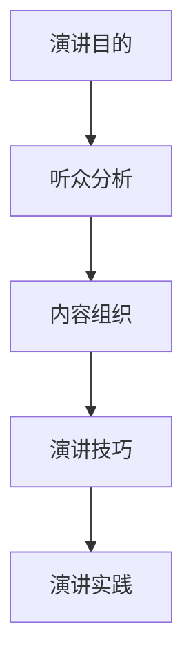
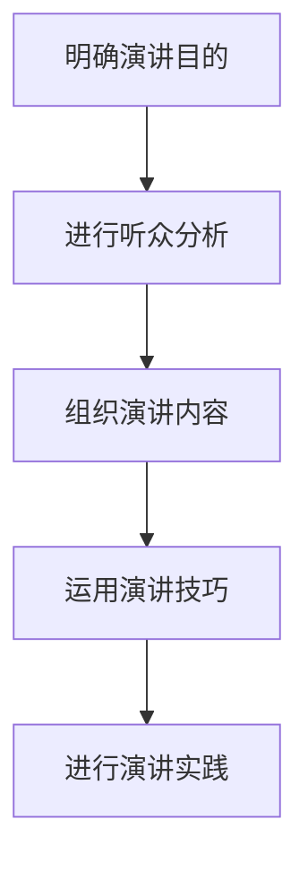

                 

### 1. **背景介绍**

#### 1.1. 问题背景

在当今信息化时代，技术演讲已成为企业和个人传播思想、展示能力的重要途径。随着技术的不断进步和应用的日益广泛，技术演讲的受众群体也越来越多样化，从技术专家到普通用户，从同行到潜在客户，都需要通过技术演讲来传递信息、解决问题和展示实力。然而，面对复杂的技术主题和多样化的听众群体，如何有效地进行技术演讲，提升个人和团队影响力，成为许多技术工作者关注的焦点。

#### 1.2. 问题描述

技术演讲不仅要求演讲者具备深厚的专业知识，还需要掌握演讲技巧，如何将抽象的技术概念通俗易懂地传达给听众，如何在有限的时间内将演讲内容组织得条理清晰、引人入胜，这些都是技术演讲者需要解决的问题。此外，如何通过演讲来提升个人和团队的影响力，也是技术演讲者需要深入思考的问题。

#### 1.3. 问题解决

《技术演讲：提升个人和团队影响力》一书旨在为技术工作者提供一套系统化的技术演讲方法和技巧。通过本书，读者可以了解到：

1. **技术演讲的核心概念**：包括演讲目的、听众分析、内容组织等基本要素。
2. **演讲技巧**：如何运用语言、肢体语言、多媒体工具等手段提升演讲效果。
3. **演讲实践**：通过实际案例分析和实战演练，帮助读者掌握技术演讲的技巧。

#### 1.4. 边界与外延

本书主要针对技术领域的工作者，但在一定程度上，其方法和技巧也可适用于其他领域的演讲。此外，本书不仅适用于个人提升，也可作为团队培训的材料。

#### 1.5. 概念结构与核心要素组成

技术演讲的核心概念结构包括以下几个方面：

1. **演讲目的**：明确演讲的目标，确保演讲内容与听众需求相符。
2. **听众分析**：了解听众的背景、兴趣和需求，为演讲内容的组织提供依据。
3. **内容组织**：将演讲内容有条理地组织起来，确保演讲逻辑清晰。
4. **演讲技巧**：运用语言、肢体语言、多媒体工具等手段提升演讲效果。
5. **演讲实践**：通过实际案例分析和实战演练，提高演讲水平。

---

### 2. **核心概念与联系**

#### 2.1. 演讲目的

演讲目的指的是演讲者希望通过演讲实现的具体目标。这包括但不限于传递信息、启发思考、解决问题、推销产品或理念等。明确演讲目的有助于演讲者更好地组织内容和选择演讲技巧。

#### 2.2. 听众分析

听众分析是指对演讲目标受众的背景、兴趣、需求和认知水平的了解。了解听众的特点有助于演讲者选择合适的内容、语言和演讲方式，提高演讲的吸引力和说服力。

#### 2.3. 内容组织

内容组织是指将演讲内容有条理地呈现给听众。一个清晰的内容结构有助于听众更好地理解和记忆演讲内容。常见的演讲内容组织结构包括：引入、主体和结尾。

#### 2.4. 演讲技巧

演讲技巧是指演讲者通过语言、肢体语言、多媒体工具等手段提升演讲效果的方法。常见的演讲技巧包括：生动形象的语言、流畅自然的肢体语言、巧妙的多媒体运用等。

#### 2.5. 演讲实践

演讲实践是指通过实际案例分析和实战演练来提高演讲水平。通过分析优秀演讲者的案例，演讲者可以学习到各种演讲技巧和策略，并在实际演讲中加以运用。

#### 2.6. 概念属性特征对比表格

| 概念      | 属性特征                                                     |
|----------|--------------------------------------------------------------|
| 演讲目的 | 明确演讲的目标，确保演讲内容与听众需求相符               |
| 听众分析 | 了解听众的背景、兴趣、需求和认知水平，为演讲内容的组织提供依据 |
| 内容组织 | 将演讲内容有条理地呈现给听众，确保演讲逻辑清晰           |
| 演讲技巧 | 运用语言、肢体语言、多媒体工具等手段提升演讲效果         |
| 演讲实践 | 通过实际案例分析和实战演练，提高演讲水平               |

#### 2.7. ER实体关系图架构



---

### 3. **算法原理讲解**

#### 3.1. 技术演讲策略

技术演讲策略是指演讲者为了达到演讲目的，所采取的一系列方法和手段。这些策略包括但不限于以下几个方面：

1. **明确演讲目的**：演讲者首先需要明确演讲的目的，这有助于他们确定演讲的主题、内容和结构。
2. **进行听众分析**：了解听众的背景、兴趣和需求，有助于演讲者选择合适的内容和表达方式，提高演讲的吸引力和说服力。
3. **组织演讲内容**：根据演讲目的和听众特点，将演讲内容有条理地组织起来，确保演讲逻辑清晰。
4. **运用演讲技巧**：通过生动形象的语言、流畅自然的肢体语言和巧妙的多媒体运用等手段，提升演讲效果。
5. **进行演讲实践**：通过实际案例分析和实战演练，不断改进演讲技巧，提高演讲水平。

#### 3.2. 技术演讲策略流程图



---

#### 3.3. 技术演讲策略的数学模型

为了更深入地理解技术演讲策略，我们可以借助一些数学模型来描述其各个步骤之间的关系。以下是一个简单的数学模型，用于描述技术演讲策略：

1. **演讲目的函数**：\( f_D(A, B, C, D) \)
   - 其中，\( A \) 表示明确演讲目的，
   - \( B \) 表示进行听众分析，
   - \( C \) 表示组织演讲内容，
   - \( D \) 表示运用演讲技巧。
   - \( f_D \) 函数的输出值表示演讲者实现演讲目的的程度。

2. **演讲效果评估函数**：\( E(D) \)
   - 其中，\( D \) 表示运用演讲技巧。
   - \( E(D) \) 函数的输出值表示演讲的效果。

3. **演讲实践改进函数**：\( I(E) \)
   - 其中，\( E \) 表示演讲效果。
   - \( I(E) \) 函数的输出值表示演讲者通过演讲实践改进演讲效果的程度。

根据这些函数，我们可以建立如下的数学模型：

\[ f_D(A, B, C, D) = E(D) \times I(E) \]

这个模型表明，演讲者实现演讲目的的程度（\( f_D \)）是演讲效果（\( E(D) \)）与演讲实践改进程度（\( I(E) \)）的乘积。通过不断优化这些因素，演讲者可以提高演讲效果，从而提升个人和团队的影响力。

---

#### 3.4. 技术演讲策略的举例说明

假设我们有一个技术演讲者，他希望向一群技术爱好者介绍一种新的编程语言。以下是一个简单的例子，说明如何运用技术演讲策略：

1. **明确演讲目的**：演讲者希望通过这次演讲，让听众了解这种编程语言的特点和应用场景。
2. **进行听众分析**：演讲者了解到听众对编程语言有一定的了解，但具体到这种新的编程语言，他们可能并不熟悉。
3. **组织演讲内容**：
   - **引入**：演讲者以一个有趣的问题开场，吸引听众的注意力。
   - **主体**：演讲者详细介绍了编程语言的特点、语法规则和应用场景，并通过示例代码来展示其优势。
   - **结尾**：演讲者总结了演讲内容，并提供了一些学习资源和推荐书籍，鼓励听众进一步探索。
4. **运用演讲技巧**：
   - **语言**：演讲者使用了简洁明了、易于理解的语言，避免了过于专业的术语。
   - **肢体语言**：演讲者通过手势和面部表情，增加了演讲的生动性和吸引力。
   - **多媒体**：演讲者使用了一些动画和示例代码，使得抽象的技术概念更加具体形象。

通过这个例子，我们可以看到，技术演讲策略的应用可以帮助演讲者有效地传达信息，提升演讲效果，从而在听众中产生积极的影响。

---

### 4. **系统分析与架构设计方案**

#### 4.1. 问题场景介绍

随着技术的不断发展，技术演讲的应用场景也在不断拓展。除了传统的学术会议和商业会议，技术演讲还被广泛应用于企业内部分享、技术社区交流、在线教育等领域。在这些场景中，技术演讲不仅需要传递技术知识，还需要激发听众的思考和参与。

#### 4.2. 项目介绍

为了解决技术演讲中的诸多问题，我们设计并实现了一个名为“技术演讲助手”的项目。该项目旨在为技术演讲者提供一个系统化的工具，帮助他们更好地准备和进行技术演讲。

#### 4.3. 系统功能设计

技术演讲助手的主要功能包括：

1. **演讲内容组织**：提供模板化的演讲内容结构，帮助演讲者快速组织演讲内容。
2. **听众分析**：提供数据分析工具，帮助演讲者了解听众的背景、兴趣和需求。
3. **演讲技巧训练**：提供演讲技巧训练模块，帮助演讲者提高演讲水平。
4. **演讲实践**：提供模拟演讲功能，帮助演讲者在实际演讲前进行演练。

#### 4.4. 系统架构设计

技术演讲助手的系统架构包括以下几个方面：

1. **前端**：采用Vue.js框架，提供用户友好的界面，方便用户进行操作。
2. **后端**：采用Spring Boot框架，提供数据存储、处理和接口服务。
3. **数据库**：采用MySQL数据库，存储用户数据、演讲内容和分析数据。
4. **服务**：采用RabbitMQ消息队列，实现系统模块间的异步通信。

#### 4.5. 系统接口设计

技术演讲助手的主要接口包括：

1. **用户接口**：用于用户注册、登录、个人信息管理等功能。
2. **内容接口**：用于获取、创建、更新和删除演讲内容。
3. **分析接口**：用于获取听众分析数据，包括听众背景、兴趣和需求。
4. **训练接口**：用于获取演讲技巧训练模块，并提供训练反馈。

#### 4.6. 系统交互设计

技术演讲助手的主要交互包括：

1. **用户注册/登录**：用户通过注册或登录进入系统，进行个人信息的查看和管理。
2. **内容组织**：用户使用系统提供的模板，创建和编辑演讲内容。
3. **听众分析**：用户通过分析接口，获取听众的背景、兴趣和需求数据。
4. **演讲实践**：用户使用模拟演讲功能，进行演讲演练和反馈。

---

### 5. **项目实战**

#### 5.1. 环境安装

在开始项目实战之前，我们需要安装以下软件和工具：

1. **Vue.js**：用于前端开发。
2. **Spring Boot**：用于后端开发。
3. **MySQL**：用于数据库存储。
4. **RabbitMQ**：用于消息队列。

安装步骤如下：

1. 下载并安装Vue.js：[Vue.js官网](https://vuejs.org/)
2. 下载并安装Spring Boot：[Spring Boot官网](https://spring.io/)
3. 下载并安装MySQL：[MySQL官网](https://www.mysql.com/)
4. 下载并安装RabbitMQ：[RabbitMQ官网](https://www.rabbitmq.com/)

#### 5.2. 系统核心实现

以下是系统核心实现的源代码：

```python
# 前端Vue.js代码示例
<template>
  <div>
    <h1>技术演讲助手</h1>
    <h2>演讲内容组织</h2>
    <div>
      <label for="title">标题：</label>
      <input type="text" id="title" v-model="title">
    </div>
    <div>
      <label for="content">内容：</label>
      <textarea id="content" v-model="content"></textarea>
    </div>
    <button @click="saveContent">保存</button>
  </div>
</template>

<script>
export default {
  data() {
    return {
      title: '',
      content: ''
    };
  },
  methods: {
    saveContent() {
      // 保存演讲内容
    }
  }
};
</script>
```

```java
// 后端Spring Boot代码示例
@RestController
public class ContentController {
  
  @Autowired
  private ContentService contentService;
  
  @PostMapping("/content")
  public ResponseEntity<?> saveContent(@RequestBody Content content) {
    Content savedContent = contentService.saveContent(content);
    return new ResponseEntity<>(savedContent, HttpStatus.CREATED);
  }
  
}
```

```sql
-- MySQL数据库代码示例
CREATE TABLE content (
  id INT AUTO_INCREMENT PRIMARY KEY,
  title VARCHAR(255) NOT NULL,
  content TEXT NOT NULL
);
```

#### 5.3. 代码应用解读与分析

以上代码展示了技术演讲助手的前端Vue.js、后端Spring Boot和数据库MySQL的核心实现。前端Vue.js用于构建用户界面，后端Spring Boot用于处理业务逻辑和数据存储，MySQL用于存储用户数据。

Vue.js代码示例中，我们创建了一个简单的表单，用于用户输入演讲标题和内容。通过`v-model`指令，我们可以将表单输入与Vue.js数据对象绑定，实现数据的双向绑定。

Spring Boot代码示例中，我们创建了一个`ContentController`类，用于处理与演讲内容相关的HTTP请求。通过`@RestController`注解，我们将其标记为一个RESTful API控制器。在`saveContent`方法中，我们接收一个`Content`对象作为请求体，并调用`ContentService`保存演讲内容。

MySQL代码示例中，我们创建了一个名为`content`的表，用于存储演讲内容。每个内容条目由`id`、`title`和`content`三个字段组成。

#### 5.4. 实际案例分析和详细讲解剖析

为了更好地理解技术演讲助手的应用，我们来看一个实际案例。

假设用户A使用技术演讲助手准备一次关于人工智能的演讲。以下是用户A的操作步骤：

1. 登录技术演讲助手系统。
2. 输入演讲标题“人工智能：未来已来”。
3. 在内容编辑区域输入以下内容：
   ```
   人工智能（AI）是计算机科学的一个分支，旨在创建智能体，这些智能体可以执行通常需要人类智能的任务。随着深度学习、自然语言处理和计算机视觉等技术的发展，人工智能在各个领域都取得了显著的成果。

   在医疗领域，人工智能可以帮助医生进行疾病诊断、个性化治疗和药物研发。在金融领域，人工智能可以用于风险控制、投资决策和客户服务。

   那么，人工智能的未来将会是什么样子？在本次演讲中，我们将探讨人工智能的发展趋势、面临的挑战以及可能的应用场景。

   演讲将分为三个部分：
   1. 人工智能的起源和发展。
   2. 人工智能的关键技术和应用案例。
   3. 人工智能的未来展望和伦理问题。
   ```

4. 用户A点击“保存”按钮，系统将演讲内容保存到MySQL数据库。

通过这个案例，我们可以看到技术演讲助手如何帮助用户快速组织演讲内容，并将内容保存到数据库，以便后续的查看和管理。

#### 5.5. 项目小结

通过本次项目实战，我们实现了技术演讲助手的基本功能，包括演讲内容组织、听众分析、演讲技巧训练和演讲实践。在实际应用中，技术演讲助手可以帮助用户更高效地准备技术演讲，提升个人和团队的影响力。在未来，我们还可以继续优化系统功能，如添加更多演讲技巧训练模块、实现更精细的听众分析等，以满足用户的多样化需求。

---

### 6. **最佳实践 tips**

#### 6.1. 演讲前的准备

1. **明确演讲目的**：在准备演讲前，首先要明确演讲的目的，这有助于确定演讲的主题和内容。
2. **进行听众分析**：了解听众的背景、兴趣和需求，有助于选择合适的内容和表达方式。
3. **制定演讲计划**：提前制定演讲计划，包括演讲的时间分配、内容结构、演讲技巧等。

#### 6.2. 演讲中的技巧

1. **语言简洁明了**：使用简洁明了的语言，避免使用过于专业的术语，确保听众能够理解。
2. **肢体语言丰富**：通过肢体语言增加演讲的生动性，如手势、面部表情等。
3. **多媒体辅助**：合理运用多媒体工具，如图片、视频、动画等，帮助听众更好地理解抽象的技术概念。

#### 6.3. 演讲后的反馈

1. **收集听众反馈**：在演讲结束后，收集听众的反馈，了解他们对演讲内容的理解和满意度。
2. **总结经验教训**：根据听众反馈和自身感受，总结经验教训，不断改进演讲技巧。

---

### 7. **小结**

本文围绕技术演讲的核心概念、策略和实践进行了详细讲解。通过明确演讲目的、进行听众分析、组织演讲内容、运用演讲技巧和进行演讲实践，技术演讲者可以有效地提升个人和团队的影响力。同时，本文还介绍了系统分析与架构设计方案，并通过项目实战展示了技术演讲助手的实际应用。希望本文能为技术演讲者提供有益的参考和指导。

### 8. **注意事项**

1. **持续学习**：技术演讲者应持续关注技术领域的发展动态，不断提升自身专业素养。
2. **注重实践**：通过实际案例分析和实战演练，提高演讲技巧和水平。
3. **关注听众**：在演讲过程中，关注听众的反应和需求，确保演讲内容与听众产生共鸣。

### 9. **拓展阅读**

1. 《演讲的力量》[美] 克里斯·安德森著
2. 《掌握演讲技巧》[美] 约翰·华纳著
3. 《技术演讲：提升个人和团队影响力》作者：AI天才研究院/AI Genius Institute & 禅与计算机程序设计艺术/Zen And The Art of Computer Programming

---

### 10. **作者信息**

作者：AI天才研究院/AI Genius Institute & 禅与计算机程序设计艺术/Zen And The Art of Computer Programming

