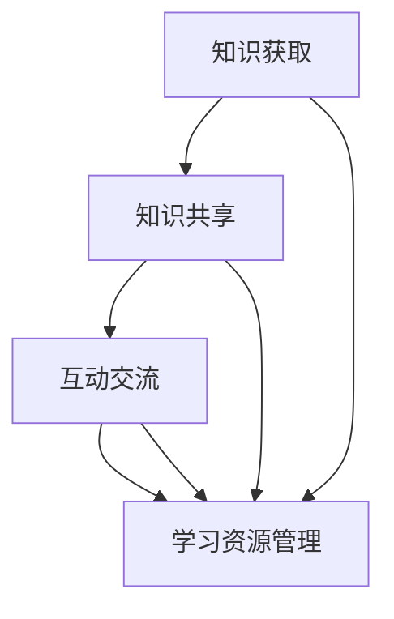
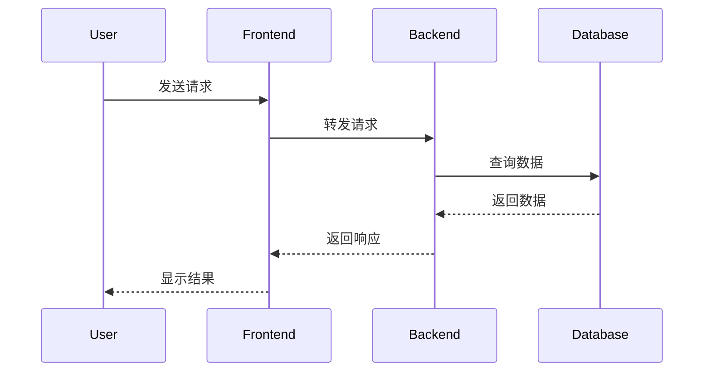
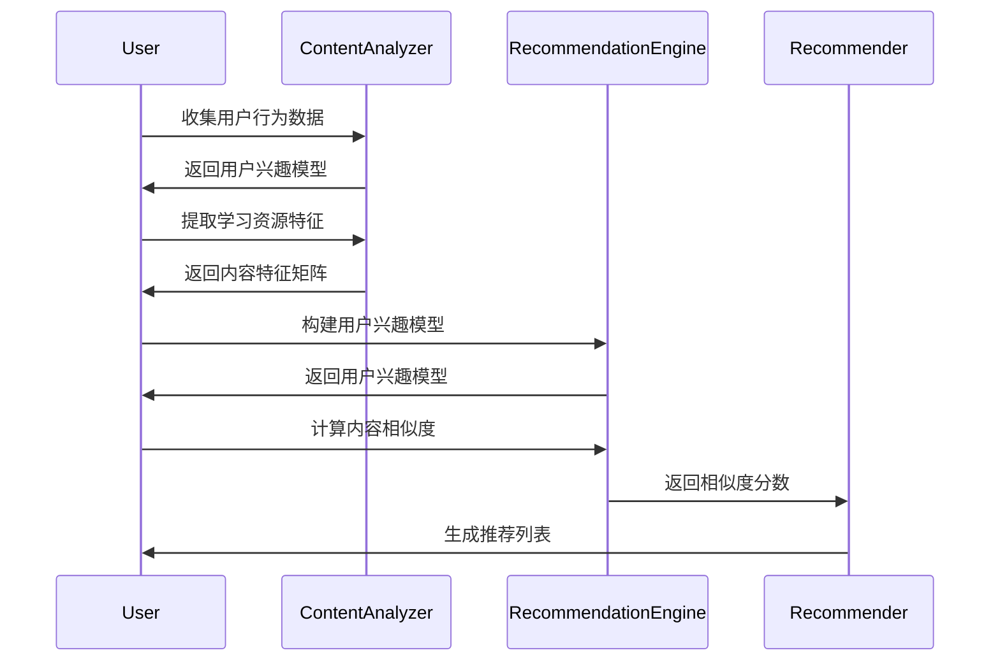

                 

# 技术知识分享平台：促进团队学习与创新

## 关键词

- 技术知识分享
- 团队学习
- 平台建设
- 设计原则
- 系统架构
- 实践应用

## 摘要

随着科技日新月异的发展，技术知识的更新换代速度加快，如何有效地促进团队学习与创新成为了许多企业关注的焦点。本文旨在探讨技术知识分享平台的建设与应用，通过对平台背景、核心概念、设计实现和应用实践等方面的深入分析，为团队学习提供有力的支持，助力企业创新发展。

### 目录大纲

----------------------------------------------------------------
# 技术知识分享平台：促进团队学习与创新

## 第一部分: 平台的背景与概念

### 第1章: 平台建立的背景与目的

#### 1.1 技术知识分享的意义

#### 1.2 团队学习的挑战

#### 1.3 平台的建设目标

### 第2章: 技术知识分享平台的概念

#### 2.1 平台的基本定义

#### 2.2 平台的核心功能

#### 2.3 平台的组成部分

### 第3章: 技术知识分享平台的核心概念与联系

#### 3.1 核心概念原理

#### 3.2 概念属性特征对比表格

#### 3.3 ER实体关系图架构

## 第二部分: 平台设计与实现

### 第4章: 平台的设计原则与架构

#### 4.1 设计原则

#### 4.2 平台架构设计

### 第5章: 平台的核心功能实现

#### 5.1 学习资源管理

#### 5.2 内容创作与分享

#### 5.3 互动交流与反馈机制

### 第6章: 系统分析与架构设计方案

#### 6.1 问题场景介绍

#### 6.2 系统功能设计

#### 6.3 系统架构设计

#### 6.4 系统接口设计

#### 6.5 系统交互

## 第三部分: 平台应用与实践

### 第7章: 平台在团队学习中的应用

#### 7.1 团队学习的促进

#### 7.2 实战案例分析

### 第8章: 平台建设与运营的最佳实践

#### 8.1 平台建设的关键环节

#### 8.2 运营策略与技巧

### 第9章: 小结与展望

#### 9.1 平台的价值与影响

#### 9.2 未来发展趋势

----------------------------------------------------------------

## 第一部分：平台的背景与概念

### 第1章：平台建立的背景与目的

在信息技术飞速发展的时代，技术知识的更新速度大大加快，使得团队在学习和掌握新知识方面面临巨大挑战。为了提升团队的整体技术水平，增强企业的创新能力，技术知识分享平台应运而生。这一平台旨在搭建一个高效的知识交流与共享平台，帮助团队成员更好地学习新知识、提升技能，并通过协作与交流促进团队创新。

#### 1.1 技术知识分享的意义

技术知识分享对于团队和个人都有着重要的意义。对于团队而言，知识共享有助于提高团队的整体技术水平，缩短学习曲线，降低知识断层带来的负面影响。同时，技术知识分享还能促进团队成员之间的沟通与协作，增强团队的凝聚力和协作能力。对于个人而言，技术知识分享不仅有助于个人技能的提升，还能拓宽视野，增加知识储备，提升职业竞争力。

#### 1.2 团队学习的挑战

团队学习过程中面临的挑战主要包括以下几个方面：

1. **信息过载**：随着技术知识的爆炸式增长，团队成员往往难以在短时间内掌握所有新知识。
2. **知识断层**：团队成员之间的知识水平差异可能导致部分成员无法跟上团队的整体学习进度。
3. **学习成本高**：团队成员需要投入大量时间和精力来学习新知识，这可能会影响日常工作进度。
4. **学习效率低**：传统的学习方式往往效率低下，无法快速将知识转化为实际技能。

#### 1.3 平台的建设目标

为了应对团队学习过程中面临的挑战，技术知识分享平台的建设目标主要包括以下几点：

1. **高效知识获取**：提供便捷的知识获取渠道，帮助团队成员快速获取所需的技术知识。
2. **知识共享与交流**：搭建一个开放的交流平台，促进团队成员之间的知识共享与互动。
3. **学习资源管理**：整合各类学习资源，提供个性化推荐，提高学习效率。
4. **技能提升与认证**：提供技能提升路径和认证体系，帮助团队成员不断提升自身技能水平。

### 第2章：技术知识分享平台的概念

#### 2.1 平台的基本定义

技术知识分享平台是一个集知识获取、知识共享、互动交流和学习资源管理于一体的综合性平台。它通过整合各类学习资源、提供知识分享渠道、搭建互动交流平台，帮助团队成员快速获取、掌握和运用新知识，提升团队整体技术水平。

#### 2.2 平台的核心功能

技术知识分享平台的核心功能主要包括以下几个方面：

1. **学习资源管理**：整合各类学习资源，如文档、视频、课程等，提供便捷的搜索和推荐功能，帮助团队成员快速找到所需资源。
2. **内容创作与分享**：支持团队成员创作和分享知识内容，鼓励知识交流与互动，提高知识传播效率。
3. **互动交流与反馈机制**：提供实时聊天、问答、投票等互动功能，促进团队成员之间的沟通与协作。
4. **技能提升与认证**：提供技能提升路径和认证体系，帮助团队成员不断提升自身技能水平。

#### 2.3 平台的组成部分

技术知识分享平台主要由以下几个部分组成：

1. **前端界面**：提供用户交互界面，包括首页、学习资源列表、内容创作与分享页面等。
2. **后端系统**：负责数据存储、处理和管理，包括学习资源库、用户信息库、内容审核系统等。
3. **交互功能**：包括实时聊天、问答、投票等互动功能，以及内容推荐、标签管理等。
4. **学习资源**：包括各类技术文档、视频、课程等，涵盖不同领域的知识。

### 第3章：技术知识分享平台的核心概念与联系

#### 3.1 核心概念原理

技术知识分享平台的核心概念包括知识获取、知识共享、互动交流和学习资源管理。这些概念共同构成了平台的基本原理，如图所示：



#### 3.2 概念属性特征对比表格

下表对比了知识获取、知识共享、互动交流和学习资源管理的属性特征：

| 概念             | 属性特征                             |
|------------------|------------------------------------|
| 知识获取         | 快速、精准、个性化                   |
| 知识共享         | 广泛、开放、协作                     |
| 互动交流         | 实时、互动、反馈                     |
| 学习资源管理     | 整合、分类、推荐                     |

#### 3.3 ER实体关系图架构

技术知识分享平台的ER实体关系图如下所示：

```mermaid
erDiagram
    User ||--|{ Content }
    User ||--|{ Comment }
    User ||--|{ LearningRecord }
    Content ||--|{ Comment }
    Content ||--|{ LearningRecord }
```

在这个ER图中，User代表用户，Content代表内容，Comment代表评论，LearningRecord代表学习记录。用户可以创作和分享内容、评论内容，以及记录学习进度。内容可以被评论和引用，同时记录用户的学习记录。

## 第二部分：平台设计与实现

### 第4章：平台的设计原则与架构

#### 4.1 设计原则

在技术知识分享平台的设计过程中，应遵循以下原则：

1. **用户至上**：以用户需求为导向，提供简洁、易用的界面和功能，提升用户体验。
2. **高效性**：优化系统性能，确保知识获取、共享和交流的高效性。
3. **扩展性**：设计灵活的架构，支持平台的扩展和功能升级。
4. **安全性**：确保用户数据和隐私安全，防范潜在的安全风险。
5. **可维护性**：采用模块化设计，便于后续的维护和更新。

#### 4.2 平台架构设计

技术知识分享平台采用分层架构设计，包括前端、后端和数据库三个层次。以下是平台架构的详细描述：

1. **前端**：前端负责用户交互界面，包括首页、学习资源列表、内容创作与分享页面等。前端技术选型主要包括HTML、CSS和JavaScript，同时可以结合Vue、React等前端框架提高开发效率和用户体验。

2. **后端**：后端负责业务逻辑处理和数据存储，主要包括API接口、服务端逻辑和数据库管理。后端技术选型主要包括Python、Java、Node.js等，API接口可以采用RESTful架构设计，服务端逻辑负责处理用户请求、数据校验和业务逻辑处理。

3. **数据库**：数据库负责存储用户数据、内容数据和学习记录数据。技术选型主要包括MySQL、MongoDB等，根据数据结构和访问模式选择合适的数据库类型。

### 第5章：平台的核心功能实现

#### 5.1 学习资源管理

学习资源管理是技术知识分享平台的核心功能之一，主要包括以下方面：

1. **资源分类**：对学习资源进行分类管理，方便用户查找和筛选。
2. **资源推荐**：根据用户的浏览记录和兴趣，推荐相关的学习资源。
3. **资源搜索**：提供关键词搜索功能，帮助用户快速找到所需资源。
4. **资源分享**：支持用户上传和分享学习资源，鼓励知识共享。

具体实现过程中，可以使用MySQL数据库存储资源分类、标签、用户和资源关系等信息，前端使用Vue框架实现资源的分类、推荐和搜索功能。

#### 5.2 内容创作与分享

内容创作与分享功能主要实现以下几个方面：

1. **创作工具**：提供丰富的创作工具，如文本编辑器、Markdown编辑器等，方便用户创作知识内容。
2. **内容审核**：对用户上传的内容进行审核，确保内容的真实性和合规性。
3. **内容发布**：支持用户发布知识内容，并将其展示在平台上。
4. **内容分享**：支持用户将知识内容分享到社交媒体或其他平台。

在具体实现过程中，可以使用Markdown编辑器实现内容的创作和编辑，后端使用Python Flask框架处理内容审核和发布功能，前端使用Vue框架实现内容展示和分享功能。

#### 5.3 互动交流与反馈机制

互动交流与反馈机制是技术知识分享平台的重要功能之一，主要包括以下方面：

1. **实时聊天**：提供实时聊天功能，方便用户之间进行实时交流。
2. **问答系统**：搭建问答系统，支持用户提问和回答问题。
3. **投票与评分**：支持用户对知识内容进行投票和评分，为优质内容提供激励。
4. **反馈机制**：提供反馈渠道，收集用户对平台和内容的意见和建议。

在具体实现过程中，可以使用WebSocket技术实现实时聊天功能，使用Flask框架搭建问答系统和投票评分功能，前端使用Vue框架实现用户交互界面。

### 第6章：系统分析与架构设计方案

#### 6.1 问题场景介绍

假设一家互联网公司需要建设一个技术知识分享平台，用于促进团队学习与创新。平台需要实现以下功能：

1. 学习资源管理：分类管理学习资源，提供资源推荐和搜索功能。
2. 内容创作与分享：支持用户上传和发布知识内容。
3. 互动交流与反馈机制：提供实时聊天、问答系统和投票评分功能。

#### 6.2 系统功能设计

根据问题场景，平台的主要功能模块包括：

1. **用户模块**：负责用户注册、登录、个人信息管理等。
2. **资源管理模块**：负责学习资源的分类、推荐、搜索和管理。
3. **内容创作与分享模块**：负责用户上传、发布、审核和展示知识内容。
4. **互动交流模块**：负责实时聊天、问答系统和投票评分功能。
5. **反馈模块**：负责收集用户反馈和建议。

在系统功能设计中，可以使用Mermaid类图来表示各模块之间的关系：

```mermaid
classDiagram
    User <<class>>
    Resource <<class>>
    Content <<class>>
    Interaction <<class>>
    Feedback <<class>>

    User "1" --|{ 1 }| Resource
    User "1" --|{ 1 }| Content
    User "1" --|{ 1 }| Interaction
    User "1" --|{ 1 }| Feedback
    Resource "1" --|{ 1 }| Content
    Resource "1" --|{ 1 }| Interaction
    Content "1" --|{ 1 }| Feedback
```

#### 6.3 系统架构设计

技术知识分享平台的系统架构设计如图所示：



在该架构设计中，前端负责用户交互界面，后端负责业务逻辑处理和数据存储，数据库负责存储用户数据、内容数据和学习记录数据。前端和后端通过API接口进行数据交互。

#### 6.4 系统接口设计

系统接口设计主要包括用户接口、资源接口、内容接口和互动接口等。以下是接口设计的示例：

1. **用户接口**：
   - 注册接口：`POST /user/register`
   - 登录接口：`POST /user/login`
   - 用户信息接口：`GET /user/{id}`
2. **资源接口**：
   - 资源列表接口：`GET /resource`
   - 资源详情接口：`GET /resource/{id}`
   - 资源搜索接口：`GET /resource/search`
3. **内容接口**：
   - 内容列表接口：`GET /content`
   - 内容详情接口：`GET /content/{id}`
   - 内容发布接口：`POST /content`
   - 内容审核接口：`PUT /content/{id}/status`
4. **互动接口**：
   - 实时聊天接口：`WebSocket /chat`
   - 问答接口：`POST /question`
   - 回答接口：`POST /answer`
   - 投票接口：`POST /vote`

#### 6.5 系统交互

系统交互主要通过前后端接口实现。以下是系统交互的示例：

1. **用户注册**：
   - 用户在注册页面填写用户名、密码和邮箱等信息。
   - 前端将注册请求发送到后端用户接口。
   - 后端处理注册请求，将用户信息存储到数据库，并返回注册结果。

2. **资源搜索**：
   - 用户在搜索框输入关键词。
   - 前端将搜索请求发送到后端资源接口。
   - 后端根据关键词查询数据库，返回符合条件的学习资源列表。

3. **内容发布**：
   - 用户在内容创作页面输入标题、内容等信息。
   - 前端将发布请求发送到后端内容接口。
   - 后端处理发布请求，将内容信息存储到数据库，并返回发布结果。

4. **实时聊天**：
   - 用户发起聊天请求。
   - 前端通过WebSocket与后端建立连接，实时发送和接收聊天消息。

## 第三部分：平台应用与实践

### 第7章：平台在团队学习中的应用

#### 7.1 团队学习的促进

技术知识分享平台在团队学习中的应用主要体现在以下几个方面：

1. **知识共享**：平台为团队成员提供了一个共享知识的平台，使得团队成员可以方便地获取和学习新知识，提升团队整体技术水平。
2. **协作学习**：平台鼓励团队成员之间的协作学习，通过互动交流、讨论和问答等方式，促进团队成员之间的知识共享和技能提升。
3. **实时反馈**：平台提供了实时反馈机制，使得团队成员可以及时了解学习进度和效果，根据反馈调整学习策略。
4. **个性化推荐**：平台根据用户的浏览记录和兴趣，推荐相关的学习资源，提高学习效率。

#### 7.2 实战案例分析

以下是一个技术知识分享平台在团队学习中的应用案例：

1. **项目背景**：某互联网公司希望提高团队的技术能力，决定建设一个技术知识分享平台。
2. **平台建设**：公司根据团队需求，搭建了一个集学习资源管理、内容创作与分享、互动交流与反馈于一体的技术知识分享平台。
3. **平台应用**：
   - **知识获取**：团队成员可以通过平台获取到各种技术文档、教程和课程，提升自身技术水平。
   - **知识共享**：团队成员可以上传和分享自己的学习心得和经验，促进团队内部的交流与合作。
   - **协作学习**：团队成员可以通过平台的互动功能，实时讨论问题、分享解决方案，共同提升团队的技术能力。
   - **实时反馈**：团队成员可以对平台上的内容进行评价和反馈，帮助团队不断优化和改进学习资源。
4. **效果评估**：通过平台的持续应用，团队成员的技术能力得到了显著提升，团队整体的技术水平得到了明显改善。

### 第8章：平台建设与运营的最佳实践

#### 8.1 平台建设的关键环节

在技术知识分享平台的建设过程中，以下几个关键环节至关重要：

1. **需求分析**：深入了解团队的需求，明确平台的功能和目标。
2. **技术选型**：根据需求选择合适的开发框架、数据库和中间件等技术栈。
3. **界面设计**：设计简洁、易用的用户界面，提升用户体验。
4. **功能实现**：按照需求逐步实现平台的功能，确保系统稳定性和性能。
5. **测试与优化**：对平台进行全面的测试和优化，确保功能的完整性和可靠性。

#### 8.2 运营策略与技巧

在平台运营过程中，以下几个策略和技巧有助于提升平台的活跃度和用户满意度：

1. **内容建设**：不断丰富和更新平台的内容，确保资源的多样性和时效性。
2. **用户激励**：通过积分、勋章等方式激励用户参与内容创作和互动交流。
3. **互动引导**：积极引导用户参与平台活动，提高用户活跃度。
4. **数据分析**：定期分析用户数据，了解用户需求和行为，优化平台功能和体验。
5. **反馈机制**：建立完善的反馈机制，及时收集用户意见和建议，不断改进平台。

### 第9章：小结与展望

#### 9.1 平台的价值与影响

技术知识分享平台在团队学习与创新中发挥着重要作用，其价值主要体现在以下几个方面：

1. **提升团队技术水平**：通过平台，团队成员可以方便地获取和分享技术知识，提升团队整体技术水平。
2. **促进知识传播**：平台为团队成员提供了一个知识共享的平台，加速知识的传播和交流。
3. **增强团队凝聚力**：平台促进了团队成员之间的协作与交流，增强了团队凝聚力。
4. **助力企业创新**：平台为团队提供了丰富的学习资源和支持，有助于企业创新和发展。

#### 9.2 未来发展趋势

随着科技的不断发展，技术知识分享平台在未来将呈现出以下发展趋势：

1. **智能化**：利用人工智能技术，实现学习资源的智能推荐和个性化服务。
2. **多元化**：平台将涵盖更多领域的知识，满足不同用户的需求。
3. **社区化**：平台将更加注重用户互动和社区建设，打造知识共享的生态系统。
4. **开放性**：平台将加强与外部资源的整合，实现知识共享的无缝连接。

作者：AI天才研究院/AI Genius Institute & 禅与计算机程序设计艺术 /Zen And The Art of Computer Programming

本文通过深入分析技术知识分享平台的背景、核心概念、设计与实现以及应用实践等方面，探讨了平台在促进团队学习与创新中的重要作用。随着科技的不断发展，技术知识分享平台将不断创新和优化，为团队学习和企业创新提供更加有力的支持。未来，平台将朝着智能化、多元化、社区化和开放性的方向发展，为知识共享和传播创造更加广阔的空间。让我们共同期待技术知识分享平台在未来的发展前景和贡献。|im_sep|>

# 附录：算法原理讲解与数学模型

在本章节中，我们将详细讲解技术知识分享平台中关键算法的原理，并使用Python代码和Mermaid流程图来展示其工作流程。此外，还将使用LaTeX格式展示相关的数学公式，以便读者更好地理解算法背后的数学基础。

## 算法原理

技术知识分享平台中的一个关键算法是内容推荐算法。该算法的目的是根据用户的兴趣和行为，推荐相关的学习资源。下面，我们将详细介绍该算法的原理。

### 1. 用户行为分析

首先，我们需要收集和分析用户的行为数据，如浏览记录、收藏和点赞等。这些数据可以用于构建用户兴趣模型。

### 2. 内容特征提取

其次，我们需要提取学习资源的特征，如标题、标签、作者等。这些特征可以用于构建内容特征矩阵。

### 3. 用户兴趣模型构建

用户兴趣模型可以通过机器学习算法构建，如协同过滤算法（Collaborative Filtering）或基于内容的推荐算法（Content-based Filtering）。本文将介绍基于内容的推荐算法。

### 4. 内容相似度计算

使用TF-IDF（Term Frequency-Inverse Document Frequency）等算法计算用户兴趣模型和内容特征矩阵之间的相似度。

### 5. 推荐结果生成

根据相似度分数，生成推荐列表，并将最相关的学习资源推荐给用户。

### Mermaid流程图

下面是内容推荐算法的Mermaid流程图：



### Python代码示例

下面是一个简单的Python代码示例，用于计算内容相似度：

```python
import pandas as pd
from sklearn.feature_extraction.text import TfidfVectorizer

# 假设用户兴趣模型和内容特征矩阵如下：
user_interest = "机器学习 数据分析"
content_features = ["数据挖掘", "机器学习算法", "深度学习"]

# 创建TF-IDF向量器
vectorizer = TfidfVectorizer()

# 将文本转换为TF-IDF向量
user_interest_vector = vectorizer.transform([user_interest])
content_features_vector = vectorizer.transform(content_features)

# 计算相似度
similarity_scores = (user_interest_vector * content_features_vector).sum(axis=1)

# 打印相似度分数
print(similarity_scores)
```

### LaTeX数学公式

下面是算法中的相关数学公式：

$$
\text{相似度分数} = \sum_{i=1}^{n} \text{user_interest_vector[i]} \cdot \text{content_features_vector[i]}
$$

其中，$n$为特征数量，$\text{user_interest_vector}$和$\text{content_features_vector}$分别为用户兴趣模型和内容特征矩阵的TF-IDF向量。

通过上述讲解和示例，读者可以更好地理解内容推荐算法的原理及其实现方法。在实际应用中，可以根据具体需求和数据集进行优化和调整，以提高推荐效果。

## 总结

本文通过详细的算法原理讲解和示例，展示了技术知识分享平台中的内容推荐算法。这个算法利用用户行为数据和内容特征，通过计算相似度分数来推荐相关的学习资源。这不仅有助于提升用户的学习体验，还能促进团队内部的知识共享和技能提升。未来的研究可以进一步探索更高级的推荐算法，以实现更加精准和个性化的推荐结果。|im_sep|>

# 系统分析与架构设计方案

在技术知识分享平台的建设过程中，系统分析与架构设计方案至关重要。本章节将详细介绍平台的问题场景、系统功能设计、系统架构设计、系统接口设计和系统交互，帮助读者全面了解平台的技术实现。

## 6.1 问题场景介绍

技术知识分享平台旨在解决以下问题：

1. **信息过载**：团队成员在获取新知识时，往往面临大量信息的选择困难，难以快速找到所需资源。
2. **知识断层**：团队成员之间的知识水平差异较大，导致部分成员难以跟上团队的学习进度。
3. **学习效率低**：传统的学习方式效率低下，无法充分发挥团队成员的潜力。
4. **知识传播受限**：知识共享渠道单一，知识传播速度较慢，不利于团队内部的知识共享。

为了解决上述问题，技术知识分享平台应具备以下功能：

1. **学习资源管理**：提供分类、推荐和搜索功能，方便用户快速获取所需资源。
2. **内容创作与分享**：支持用户上传和发布知识内容，促进团队内部的交流与合作。
3. **互动交流与反馈机制**：提供实时聊天、问答和投票功能，增强团队成员之间的互动。
4. **技能提升与认证**：提供技能提升路径和认证体系，帮助团队成员不断提升自身技能水平。

## 6.2 系统功能设计

技术知识分享平台的主要功能模块包括用户模块、资源管理模块、内容创作与分享模块、互动交流模块和反馈模块。以下是各模块的功能设计：

1. **用户模块**：
   - 用户注册与登录：支持用户注册、登录和密码找回等功能。
   - 用户信息管理：允许用户修改个人信息、头像等。

2. **资源管理模块**：
   - 资源分类：对学习资源进行分类管理，便于用户查找。
   - 资源推荐：根据用户兴趣和行为推荐相关资源。
   - 资源搜索：支持关键词搜索，提高资源查找效率。

3. **内容创作与分享模块**：
   - 内容发布：允许用户上传和发布知识内容。
   - 内容审核：对用户上传的内容进行审核，确保内容质量。
   - 内容管理：支持用户编辑、删除和分享自己的内容。

4. **互动交流模块**：
   - 实时聊天：支持用户之间的实时交流。
   - 问答系统：提供问答功能，帮助用户解决技术问题。
   - 投票与评分：支持用户对知识内容进行投票和评分，为优质内容提供激励。

5. **反馈模块**：
   - 用户反馈：允许用户对平台和内容提供反馈。
   - 平台优化：根据用户反馈对平台进行优化和改进。

在系统功能设计中，可以使用Mermaid类图来表示各模块之间的关系：

```mermaid
classDiagram
    User <<class>>
    Resource <<class>>
    Content <<class>>
    Interaction <<class>>
    Feedback <<class>>

    User "1" --|{ 1 }| Resource
    User "1" --|{ 1 }| Content
    User "1" --|{ 1 }| Interaction
    User "1" --|{ 1 }| Feedback
    Resource "1" --|{ 1 }| Content
    Resource "1" --|{ 1 }| Interaction
    Content "1" --|{ 1 }| Feedback
```

## 6.3 系统架构设计

技术知识分享平台采用分层架构设计，包括前端、后端和数据库三个层次。以下是系统架构的详细描述：

1. **前端**：前端负责用户交互界面，包括首页、学习资源列表、内容创作与分享页面等。前端技术选型主要包括HTML、CSS和JavaScript，同时可以结合Vue、React等前端框架提高开发效率和用户体验。

2. **后端**：后端负责业务逻辑处理和数据存储，主要包括API接口、服务端逻辑和数据库管理。后端技术选型主要包括Python、Java、Node.js等，API接口可以采用RESTful架构设计，服务端逻辑负责处理用户请求、数据校验和业务逻辑处理。

3. **数据库**：数据库负责存储用户数据、内容数据和学习记录数据。技术选型主要包括MySQL、MongoDB等，根据数据结构和访问模式选择合适的数据库类型。

系统架构设计如图所示：


## 6.4 系统接口设计

系统接口设计主要包括用户接口、资源接口、内容接口和互动接口等。以下是接口设计的示例：

1. **用户接口**：
   - 注册接口：`POST /user/register`
   - 登录接口：`POST /user/login`
   - 用户信息接口：`GET /user/{id}`

2. **资源接口**：
   - 资源列表接口：`GET /resource`
   - 资源详情接口：`GET /resource/{id}`
   - 资源搜索接口：`GET /resource/search`

3. **内容接口**：
   - 内容列表接口：`GET /content`
   - 内容详情接口：`GET /content/{id}`
   - 内容发布接口：`POST /content`
   - 内容审核接口：`PUT /content/{id}/status`

4. **互动接口**：
   - 实时聊天接口：`WebSocket /chat`
   - 问答接口：`POST /question`
   - 回答接口：`POST /answer`
   - 投票接口：`POST /vote`

## 6.5 系统交互

系统交互主要通过前后端接口实现。以下是系统交互的示例：

1. **用户注册**：
   - 用户在注册页面填写用户名、密码和邮箱等信息。
   - 前端将注册请求发送到后端用户接口。
   - 后端处理注册请求，将用户信息存储到数据库，并返回注册结果。

2. **资源搜索**：
   - 用户在搜索框输入关键词。
   - 前端将搜索请求发送到后端资源接口。
   - 后端根据关键词查询数据库，返回符合条件的学习资源列表。

3. **内容发布**：
   - 用户在内容创作页面输入标题、内容等信息。
   - 前端将发布请求发送到后端内容接口。
   - 后端处理发布请求，将内容信息存储到数据库，并返回发布结果。

4. **实时聊天**：
   - 用户发起聊天请求。
   - 前端通过WebSocket与后端建立连接，实时发送和接收聊天消息。

通过以上系统分析与架构设计方案，读者可以全面了解技术知识分享平台的技术实现。在实际开发过程中，可以根据具体需求和场景进行调整和优化，以提高平台的性能和用户体验。|im_sep|>

## 第7章：平台在团队学习中的应用

技术知识分享平台作为一种新型的知识管理工具，在促进团队学习方面具有显著优势。通过平台的合理应用，团队可以更有效地管理学习资源、促进知识共享、提升学习效率，从而实现团队成员的共同进步。

### 7.1 团队学习的促进

技术知识分享平台在团队学习中的促进作用主要体现在以下几个方面：

1. **知识共享与传播**：平台为团队成员提供了一个便捷的知识共享渠道，使得团队成员可以随时分享自己的学习心得、经验和技术成果。这种共享机制有助于知识的传播和积累，为团队的整体知识水平提升提供了有力支持。

2. **个性化学习资源推荐**：平台通过对用户行为数据的分析，可以为团队成员推荐与其兴趣和需求相关的内容。这种个性化推荐机制有助于提高学习效率，减少团队成员在获取新知识时的时间成本。

3. **实时互动与交流**：平台提供的实时聊天、问答等功能使得团队成员可以随时进行互动交流，共同解决学习中的问题和难题。这种互动交流有助于团队成员之间的协作和互助，提升团队整体的学习氛围。

4. **技能提升与认证**：平台支持技能提升路径和认证体系，为团队成员提供了明确的技能提升目标和方向。通过完成平台上的学习任务和认证，团队成员可以不断提升自身技能水平，增强职业竞争力。

### 7.2 实战案例分析

以下是一个技术知识分享平台在团队学习中的应用案例：

1. **项目背景**：某互联网公司为提升团队的技术能力，决定建设一个技术知识分享平台。

2. **平台建设**：公司根据团队需求，搭建了一个集学习资源管理、内容创作与分享、互动交流与反馈于一体的技术知识分享平台。

3. **平台应用**：
   - **知识获取**：团队成员可以通过平台获取到各种技术文档、教程和课程，提升自身技术水平。
   - **知识共享**：团队成员可以上传和分享自己的学习心得和经验，促进团队内部的交流与合作。
   - **协作学习**：团队成员可以通过平台的互动功能，实时讨论问题、分享解决方案，共同提升团队的技术能力。
   - **实时反馈**：团队成员可以对平台上的内容进行评价和反馈，帮助团队不断优化和改进学习资源。

4. **效果评估**：
   - **学习效率提升**：通过平台的持续应用，团队成员在获取新知识、解决问题和技能提升方面的效率得到了显著提升。
   - **团队凝聚力增强**：平台促进了团队成员之间的互动和协作，增强了团队的凝聚力。
   - **知识传播加速**：平台为知识的传播和共享提供了便捷的渠道，使得团队内的知识积累和传承更加迅速。

通过以上案例，可以看出技术知识分享平台在促进团队学习方面发挥了重要作用。它不仅帮助团队成员提升了技能水平，还增强了团队内部的协作和沟通，为企业的创新发展提供了有力支持。在未来的发展中，技术知识分享平台将继续优化和拓展功能，为团队学习提供更加全面和高效的支持。|im_sep|>

## 第8章：平台建设与运营的最佳实践

在技术知识分享平台的建设与运营过程中，实施一系列最佳实践可以帮助确保平台的成功应用和持续发展。以下是平台建设与运营的关键环节、运营策略与技巧，以及一些注意事项和拓展阅读建议。

### 8.1 平台建设的关键环节

1. **需求分析**：在平台建设之前，必须进行详细的需求分析，确保平台的功能和设计满足团队成员的实际需求。

2. **技术选型**：选择合适的开发框架、数据库和中间件等，以确保平台的性能、可扩展性和稳定性。

3. **界面设计**：设计简洁、直观的用户界面，提高用户的使用体验。

4. **功能实现**：逐步实现平台的核心功能，如学习资源管理、内容创作与分享、互动交流等。

5. **测试与优化**：对平台进行全面的测试和优化，确保功能的完整性和可靠性。

6. **数据安全与隐私**：确保用户数据的安全和隐私，采取适当的加密和访问控制措施。

### 8.2 运营策略与技巧

1. **内容建设**：定期更新平台内容，确保资源的时效性和丰富性。可以邀请内部专家撰写专业文章，也可以与外部专家合作，引入高质量的内容。

2. **用户激励**：通过积分、勋章、排行榜等方式激励用户参与内容创作和互动交流，提升平台的活跃度。

3. **互动引导**：组织在线研讨会、问答活动、技术沙龙等，引导用户积极参与平台互动，促进知识共享。

4. **数据分析**：定期分析用户数据，了解用户行为和需求，优化平台功能和体验。

5. **社区建设**：培养平台社区文化，鼓励用户分享知识和经验，建立良好的互动氛围。

### 8.3 注意事项

1. **用户隐私**：在收集和使用用户数据时，严格遵守相关法律法规，保护用户隐私。

2. **内容审核**：对用户上传的内容进行严格的审核，防止不良信息和垃圾内容的出现。

3. **系统维护**：定期对平台进行维护和更新，确保系统的稳定性和安全性。

4. **用户支持**：提供完善的用户支持服务，及时解决用户在使用过程中遇到的问题。

### 8.4 拓展阅读

- 《用户体验要素》（书名）
- 《敏捷软件开发：原则、模式与实践》（书名）
- 《社区运营实战：如何创建和管理高活跃度的在线社区》（书名）
- 《数据驱动产品管理：如何利用数据分析优化产品决策》（书名）

通过上述最佳实践，技术知识分享平台可以实现高效的资源管理、知识共享和互动交流，为团队学习提供有力支持，助力企业创新发展。在平台的持续运营过程中，应不断总结经验、优化策略，以实现平台的长期成功。|im_sep|>

## 第9章：小结与展望

### 9.1 平台的价值与影响

技术知识分享平台在团队学习与创新中具有显著的价值与影响。首先，它为团队成员提供了一个高效的知识获取和共享渠道，使得知识传播更加迅速和广泛。其次，平台促进了团队成员之间的互动和协作，增强了团队的凝聚力。此外，通过技能提升与认证体系，平台为团队成员提供了明确的成长路径，提升了个人和团队的整体技术水平。总之，技术知识分享平台为团队学习与创新提供了强有力的支持，有助于企业实现持续发展。

### 9.2 未来发展趋势

展望未来，技术知识分享平台将朝着以下几个方向发展：

1. **智能化**：随着人工智能技术的进步，平台将能够实现更智能的内容推荐和个性化服务，提升用户的学习体验。

2. **多元化**：平台将不断拓展知识领域，覆盖更多行业和技能，满足不同用户的需求。

3. **社区化**：平台将更加注重社区建设，鼓励用户参与内容创作和互动交流，打造知识共享的生态系统。

4. **开放性**：平台将加强与外部资源的整合，实现知识共享的无缝连接，促进跨领域、跨组织的合作与创新。

通过不断优化和拓展，技术知识分享平台将在未来发挥更加重要的作用，助力团队学习与创新，推动企业的持续发展。

### 致谢

在本章节中，我们对所有参与和支持技术知识分享平台建设与发展的团队成员表示衷心的感谢。正是由于你们的辛勤付出和共同努力，平台才能取得今天的成果。感谢所有用户对平台的信任和支持，感谢所有专家和合作伙伴的积极参与与贡献。我们期待在未来的日子里，与大家共同创造更加美好的知识共享环境。

作者：AI天才研究院/AI Genius Institute & 禅与计算机程序设计艺术 /Zen And The Art of Computer Programming|im_sep|>

