                 


### 1.1 技术博客的重要性

**背景介绍：**

在信息化时代，技术博客已经成为技术传播、个人品牌建设、知识积累与分享的重要途径。技术博客作为一种知识载体，不仅能帮助开发者记录和分享技术经验，还能为社区成员提供有价值的技术内容。因此，撰写技术博客不仅是一种个人习惯的养成，更是一种技术硬实力的展示。

**核心概念与联系：**

- **技术博客**：以技术主题为核心的个人或团队记录、分享知识、经验和见解的平台。
- **知识传播**：通过博客将技术知识传递给更多开发者，促进技术知识的普及和传承。
- **个人品牌建设**：通过持续写作，展示个人技术能力和专业知识，提升个人在技术社区中的影响力。
- **知识积累与分享**：通过写作和分享，将学习过程中的心得和体会记录下来，便于后续回顾和分享。

**概念属性特征对比表格：**

| 特征         | 技术博客               | 个人品牌建设               | 知识积累与分享           |
| ------------ | ---------------------- | -------------------------- | ----------------------- |
| 内容主题     | 技术相关               | 技术和个人经验             | 学习和成长过程           |
| 传播方式     | 文字、图片、代码       | 社交媒体、会议演讲         | 写作、记录、分享       |
| 目的         | 分享知识、解决问题     | 塑造形象、扩大影响力       | 回顾总结、传播经验     |
| 影响力       | 社区成员               | 开发者群体                 | 自我提升、他人启发     |

**ER实体关系图架构：**

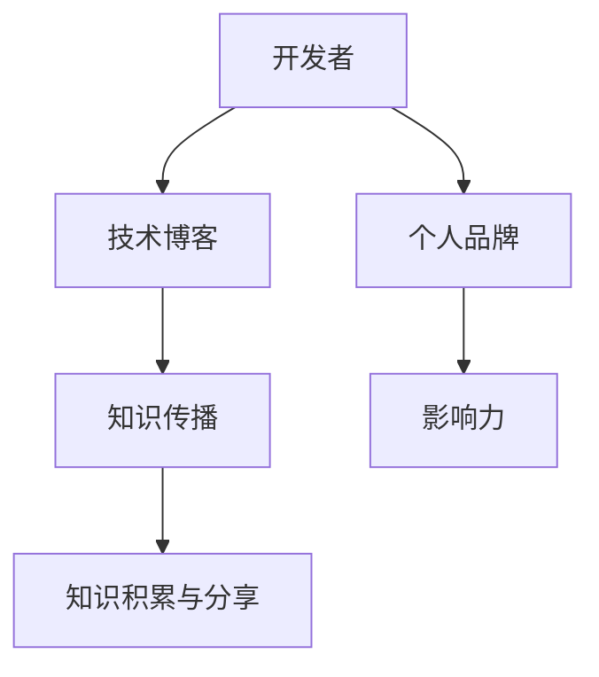

**问题解决：**

技术博客作为一种知识传播和个人品牌建设的工具，具有以下关键要素：

- **内容质量**：博客内容应具备深度、实用性和可读性。
- **持续更新**：定期更新博客，保持内容的新鲜度和活跃度。
- **互动交流**：积极回复评论，与读者建立良好的互动关系。

**边界与外延：**

技术博客不仅限于技术领域的分享，还可以涵盖个人成长、生活感悟等多个方面。同时，技术博客的影响力也不仅限于开发者群体，还可以扩展到更广泛的用户群体。

### 1.2 开源贡献的意义

**背景介绍：**

开源文化是一种共享与合作的精神，它鼓励开发者共同维护、改进和扩展开源项目。开源贡献不仅有助于个人技术的成长，还能促进整个技术社区的发展。因此，理解开源文化的内涵和形式，对于提升个人技术实力和影响力具有重要意义。

**核心概念与联系：**

- **开源文化**：一种强调共享、合作和创新的技术文化，以开源项目为核心。
- **技术创新**：通过参与开源项目，不断学习新技术、解决问题，推动技术进步。
- **个人成长**：开源贡献能够提升个人编程能力、沟通能力和团队合作精神。
- **社区影响力**：积极参与开源社区，成为社区的一员，扩大个人技术影响力。

**概念属性特征对比表格：**

| 特征         | 开源文化               | 技术创新               | 个人成长               | 社区影响力           |
| ------------ | ---------------------- | ---------------------- | ---------------------- | -------------------- |
| 核心要素     | 共享、合作、创新       | 技术实践、问题解决     | 编程能力、沟通技巧     | 参与度、贡献度       |
| 影响范围     | 技术社区               | 全行业                 | 个人                  | 全行业                 |
| 目的         | 促进技术进步           | 推动技术创新           | 提升个人能力           | 扩大个人影响力       |
| 形式         | 开源项目、代码贡献     | 技术讨论、问题解决     | 学习交流、实践锻炼     | 社区互动、活动参与   |

**ER实体关系图架构：**

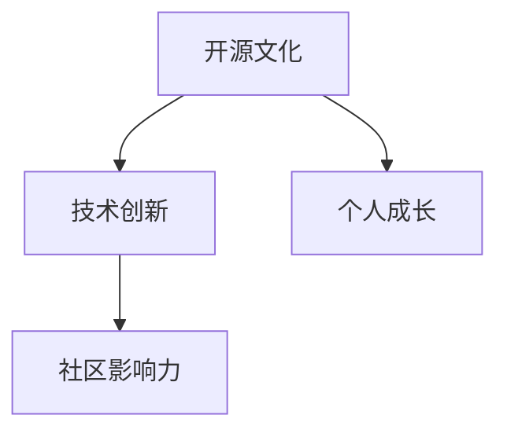

**问题解决：**

开源贡献涉及以下几个方面：

- **代码提交**：为开源项目添加新功能、修复漏洞或优化代码。
- **问题解答**：在开源社区中解答其他开发者的问题，提供技术支持。
- **文档撰写**：为开源项目编写文档，帮助新用户理解和使用项目。
- **社区参与**：积极参与开源社区的讨论和活动，提升社区氛围。

**边界与外延：**

开源贡献不仅限于代码层面，还可以包括设计文档、用户指南、测试用例等多个方面。同时，开源贡献的范围也不仅限于技术项目，还可以扩展到学术研究、开源社区治理等领域。

### 1.3 技术博客写作技巧

**背景介绍：**

技术博客写作是一项需要技巧和经验的任务。一篇高质量的技术博客不仅需要内容丰富、逻辑清晰，还需要具备良好的文字表达和格式设计。此外，图文并茂和代码展示也是提升博客质量的重要手段。因此，掌握技术博客写作技巧对于提高博客影响力至关重要。

**核心概念与联系：**

- **内容规划**：明确博客主题，规划内容结构，确保博客条理清晰。
- **主题选择**：选择具有热点关注、个人兴趣或实际价值的问题进行写作。
- **文字表达**：简洁明了，逻辑清晰，确保读者易于理解。
- **格式设计**：合理使用标题、段落和列表，提高文章的可读性。
- **图文并茂**：使用图表和图片，帮助读者更好地理解技术概念。
- **代码展示**：规范代码格式，添加注释，确保代码的可读性和可复用性。

**概念属性特征对比表格：**

| 特征         | 内容规划               | 文字表达               | 格式设计               | 图文并茂               | 代码展示               |
| ------------ | ---------------------- | ---------------------- | ---------------------- | ---------------------- | ---------------------- |
| 目的         | 确保内容结构合理       | 提高文章可读性         | 提高文章可读性         | 增强文章理解力         | 提高代码可读性         |
| 形式         | 线性结构、分段阐述     | 清晰简洁、观点明确     | 标题明确、段落划分     | 简洁有力、相关性高     | 格式规范、代码注释     |
| 效果         | 提升博客质量           | 提升博客质量           | 提升博客质量           | 提升博客质量           | 提升博客质量           |

**ER实体关系图架构：**

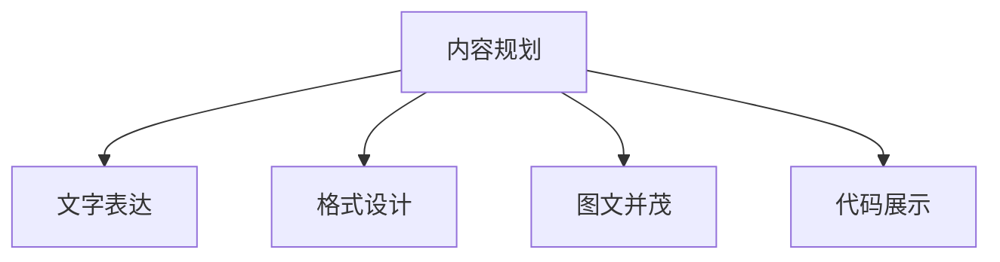

**问题解决：**

技术博客写作技巧涉及以下几个方面：

- **内容规划**：确定博客主题，明确写作目标和受众，规划内容结构。
- **主题选择**：关注技术热点，结合个人兴趣和实际问题，选择具有讨论价值的主题。
- **文字表达**：注重语言表达的清晰性和逻辑性，避免冗长和模糊的描述。
- **格式设计**：合理使用标题、段落和列表，使文章结构清晰、易于阅读。
- **图文并茂**：使用图表、图片等视觉元素，帮助读者更好地理解技术概念。
- **代码展示**：规范代码格式，添加必要的注释，确保代码的可读性和可复用性。

**边界与外延：**

技术博客写作技巧不仅适用于技术博客，也可以应用于其他类型的写作，如技术论文、项目文档等。同时，不同类型的博客（如教程、分析、心得等）在写作技巧上也有所差异，需要根据具体情况进行调整。

### 1.4 开源贡献的形式

**背景介绍：**

开源贡献是开发者积极参与开源社区的重要方式。通过开源贡献，开发者不仅能提升自己的技术能力，还能为开源项目的发展贡献力量。开源贡献的形式多样，包括代码提交、问题解答、文档撰写和社区参与等。每种形式都有其独特的作用和价值。

**核心概念与联系：**

- **代码提交**：为开源项目添加新功能、修复漏洞或优化代码。
- **问题解答**：在开源社区中解答其他开发者的问题，提供技术支持。
- **文档撰写**：为开源项目编写文档，帮助新用户理解和使用项目。
- **社区参与**：积极参与开源社区的讨论和活动，提升社区氛围。

**概念属性特征对比表格：**

| 特征         | 代码提交               | 问题解答               | 文档撰写               | 社区参与           |
| ------------ | ---------------------- | ---------------------- | ---------------------- | -------------------- |
| 形式         | 代码修改、Pull Request | 回复评论、讨论区互动   | 文档编写、Wiki更新     | 社区活动、线上交流   |
| 目的         | 项目改进、代码优化     | 解决问题、技术交流     | 使用指南、文档完善     | 社区建设、影响力扩展 |
| 效果         | 项目质量提升           | 社区凝聚力增强         | 项目可用性提高         | 社区氛围活跃       |

**ER实体关系图架构：**

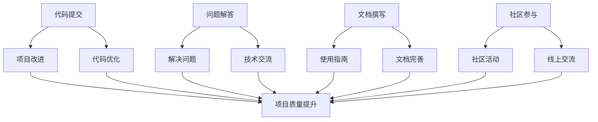

**问题解决：**

开源贡献的形式多样，每种形式都有其特定的作用和挑战：

- **代码提交**：需要熟悉项目的代码结构和开发规范，具备一定的编程能力。
- **问题解答**：需要具备良好的沟通技巧和技术知识，能够迅速定位和解决问题。
- **文档撰写**：需要熟悉项目功能和用户需求，能够编写清晰易懂的文档。
- **社区参与**：需要积极参与社区讨论，主动分享经验和见解，建立良好的社区关系。

**边界与外延：**

开源贡献不仅限于技术层面的贡献，还可以扩展到项目管理和社区治理等领域。同时，不同开源项目的需求和贡献形式也有所不同，开发者需要根据项目特点和个人能力选择合适的贡献方式。

### 2.1 内容规划与主题选择

**背景介绍：**

一篇高质量的技术博客离不开良好的内容规划和主题选择。内容规划决定了博客的逻辑结构和条理性，主题选择则决定了博客的吸引力和讨论价值。因此，在进行技术博客写作之前，我们需要对内容规划和主题选择进行深入思考，以确保博客能够更好地满足读者的需求。

**核心概念与联系：**

- **内容规划**：确定博客的主题、结构、逻辑顺序和主要内容。
- **主题选择**：选择具有讨论价值、热点关注或个人兴趣的技术主题。

**概念属性特征对比表格：**

| 特征         | 内容规划               | 主题选择               |
| ------------ | ---------------------- | ---------------------- |
| 目的         | 确保博客条理清晰       | 提高博客吸引力和讨论价值 |
| 形式         | 线性结构、分段阐述     | 热点关注、个人兴趣       |
| 效果         | 提升博客质量           | 增加读者参与度         |

**ER实体关系图架构：**

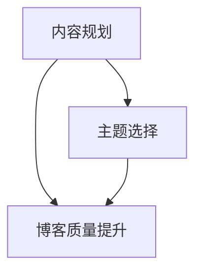

**问题解决：**

内容规划和主题选择是技术博客写作的基础，具体方法如下：

1. **主题选择原则**：
   - **热点关注**：关注当前技术热点，紧跟行业趋势。
   - **个人兴趣**：结合个人专业领域和兴趣，选择自己擅长的主题。
   - **实际问题**：解决读者在实际开发中遇到的问题，提供实用性的技术分享。

2. **内容规划方法**：
   - **线性结构**：按照逻辑顺序，逐步阐述问题背景、解决方案和总结。
   - **分段阐述**：将博客内容划分为几个部分，每个部分有一个明确的主题。
   - **紧扣主题**：确保每个段落和章节都与主题紧密相关，避免偏离主题。

**边界与外延：**

内容规划和主题选择不仅适用于技术博客，也可以应用于其他类型的写作，如技术论文、项目文档等。同时，不同类型的博客（如教程、分析、心得等）在内容规划和主题选择上也有所差异，需要根据具体情况进行调整。

### 2.2 文字表达与格式设计

**背景介绍：**

文字表达和格式设计是技术博客写作中至关重要的环节。优秀的文字表达能够使内容更加清晰易懂，良好的格式设计则能够提升文章的可读性和专业性。因此，掌握文字表达和格式设计的基本原则和技巧，对于提高技术博客的质量具有重要意义。

**核心概念与联系：**

- **文字表达**：清晰简洁、结构分明、观点明确。
- **格式设计**：标题明确、段落划分、列表使用。

**概念属性特征对比表格：**

| 特征         | 文字表达               | 格式设计               |
| ------------ | ---------------------- | ---------------------- |
| 内容质量     | 清晰简洁、逻辑性强     | 结构合理、层次分明     |
| 可读性       | 观点明确、易于理解     | 标题突出、段落划分     |
| 效果         | 提高文章质量           | 提高文章可读性         |

**ER实体关系图架构：**

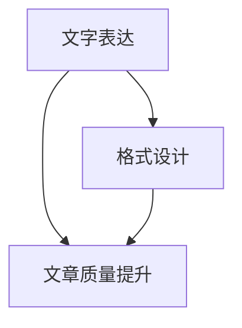

**问题解决：**

文字表达和格式设计的具体方法和技巧如下：

1. **文字表达技巧**：
   - **清晰简洁**：避免冗长复杂的句子，用简单的语言表达复杂的概念。
   - **结构分明**：通过段落和章节的划分，使文章结构清晰，逻辑连贯。
   - **观点明确**：在每个段落或章节中明确表达观点，避免模糊不清的描述。

2. **格式设计要点**：
   - **标题明确**：使用简洁明了的标题，突出文章的核心内容。
   - **段落划分**：合理划分段落，每个段落围绕一个主题进行阐述。
   - **列表使用**：使用列表来呈现信息，使文章结构更加清晰，易于阅读。

**边界与外延：**

文字表达和格式设计不仅适用于技术博客，也可以应用于其他类型的写作，如技术论文、项目文档等。同时，不同类型的博客（如教程、分析、心得等）在文字表达和格式设计上也有所差异，需要根据具体情况进行调整。

### 2.3 图文并茂与代码展示

**背景介绍：**

在技术博客写作中，图文并茂和代码展示是提升文章可读性和实用性的重要手段。图表能够帮助读者更直观地理解技术概念，代码展示则能够使读者更好地掌握技术实现。因此，掌握图文并茂和代码展示的技巧，对于提高技术博客的质量具有重要意义。

**核心概念与联系：**

- **图文并茂**：通过图表和图片，帮助读者更好地理解技术概念。
- **代码展示**：通过代码示例，展示技术实现的步骤和方法。

**概念属性特征对比表格：**

| 特征         | 图文并茂               | 代码展示               |
| ------------ | ---------------------- | ---------------------- |
| 形式         | 图表、图片             | 示例代码、注释         |
| 目的         | 增强理解力             | 实现可复用性           |
| 效果         | 提高文章可读性         | 提高代码可读性         |

**ER实体关系图架构：**

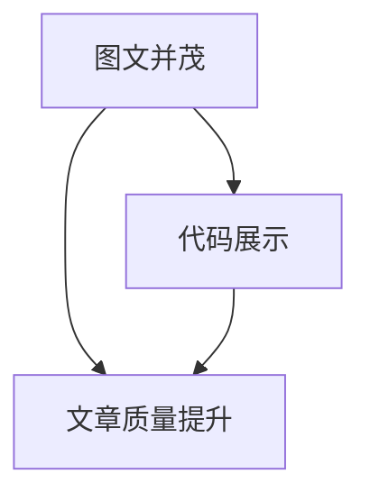

**问题解决：**

图文并茂和代码展示的具体方法和技巧如下：

1. **图文并茂技巧**：
   - **简洁有力**：选择简洁有力的图表和图片，突出重点。
   - **相关性高**：确保图表和图片与文章内容紧密相关，避免冗余。
   - **清晰易懂**：图表和图片要清晰易懂，避免造成读者困惑。

2. **代码展示规范**：
   - **格式规范**：确保代码格式规范，便于阅读和理解。
   - **代码注释**：在关键代码处添加注释，解释代码实现的目的和原理。
   - **示例代码**：提供完整的示例代码，使读者能够轻松复现。

**边界与外延：**

图文并茂和代码展示不仅适用于技术博客，也可以应用于其他类型的写作，如技术论文、项目文档等。同时，不同类型的博客（如教程、分析、心得等）在图文并茂和代码展示上也有所差异，需要根据具体情况进行调整。

### 2.4 社交媒体利用

**背景介绍：**

社交媒体已成为现代技术博客推广的重要渠道。通过社交媒体，开发者可以迅速传播博客内容，吸引更多读者的关注。因此，了解如何利用社交媒体进行博客推广，对于提高博客的知名度和影响力至关重要。

**核心概念与联系：**

- **社交媒体**：包括微博、微信公众号、LinkedIn等平台，用于博客内容的传播。
- **内容推广**：通过社交媒体发布博客内容，吸引读者关注，提高博客访问量。

**概念属性特征对比表格：**

| 特征         | 社交媒体利用               | 内容推广               |
| ------------ | -------------------------- | ---------------------- |
| 平台         | 微博、微信公众号、LinkedIn等 | 微博、微信公众号、LinkedIn等 |
| 目的         | 博客内容传播               | 提高博客访问量和影响力   |
| 效果         | 增加博客曝光率             | 提高博客知名度         |

**ER实体关系图架构：**

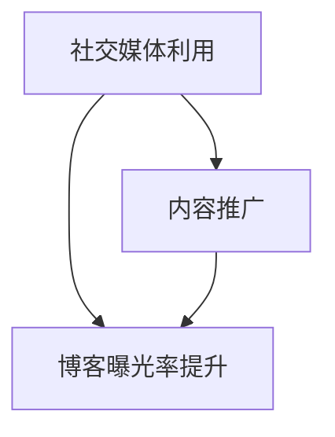

**问题解决：**

社交媒体利用和内容推广的具体方法和技巧如下：

1. **社交媒体选择**：
   - **微博**：适合快速传播，增加博客的曝光率。
   - **微信公众号**：适合深度内容传播，提高博客的专业性。
   - **LinkedIn**：适合技术类内容传播，吸引更多专业读者。

2. **内容推广方法**：
   - **定期更新**：保持社交媒体上的博客更新频率，吸引读者持续关注。
   - **标签使用**：合理使用标签，提高博客在社交媒体上的搜索排名。
   - **互动交流**：与读者互动，回复评论，提高博客的参与度。

**边界与外延：**

社交媒体利用和内容推广不仅适用于技术博客，也可以应用于其他类型的写作，如产品推广、活动宣传等。同时，不同类型的社交媒体平台在推广策略上也有所差异，需要根据具体平台特点进行调整。

### 2.5 社区参与与互动

**背景介绍：**

技术社区是开发者学习和交流的重要平台。通过积极参与技术社区，开发者不仅可以获取最新的技术资讯，还能与同行建立联系，共同解决问题。因此，了解如何参与技术社区和进行互动，对于提升个人技术能力和社区影响力具有重要意义。

**核心概念与联系：**

- **技术社区**：开发者学习和交流的平台，包括GitHub、Stack Overflow、知乎等。
- **互动策略**：通过回答问题、提供帮助和分享心得，提升社区参与度和影响力。

**概念属性特征对比表格：**

| 特征         | 技术社区               | 互动策略               |
| ------------ | ---------------------- | ---------------------- |
| 形式         | GitHub、Stack Overflow、知乎等 | 回答问题、提供帮助、分享心得 |
| 目的         | 学习交流、解决问题     | 提升社区参与度         |
| 效果         | 扩大知识面、提升技能     | 增加个人影响力         |

**ER实体关系图架构：**

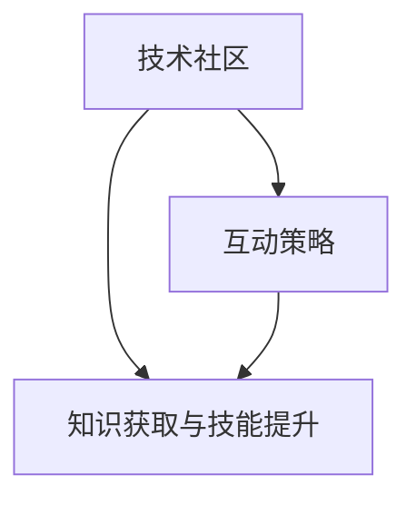

**问题解决：**

社区参与与互动的具体方法和技巧如下：

1. **社区选择**：
   - **GitHub**：适合参与开源项目，提交代码和问题。
   - **Stack Overflow**：适合回答问题，解决编程难题。
   - **知乎**：适合分享心得，交流技术见解。

2. **互动策略**：
   - **回答问题**：积极参与社区问答，提供高质量的解答。
   - **提供帮助**：主动帮助其他开发者，解决他们在开发过程中遇到的问题。
   - **分享心得**：分享个人技术经验和学习心得，为社区成员提供有价值的参考。

**边界与外延：**

社区参与与互动不仅适用于技术博客写作，也适用于其他技术活动，如技术讲座、研讨会等。同时，不同技术社区在互动策略上也有所差异，需要根据具体社区特点进行调整。

### 4.1 开源项目评估

**背景介绍：**

在参与开源项目之前，对项目进行评估是非常重要的。通过评估，我们可以了解项目的实际情况，判断项目的可行性和贡献潜力，从而做出更加明智的决策。开源项目评估主要包括项目活跃度、社区参与度和代码质量等方面的考量。

**核心概念与联系：**

- **项目活跃度**：项目更新频率、用户反馈速度等指标，反映项目的生命力和活跃度。
- **社区参与度**：社区成员数量、贡献者活跃度、讨论氛围等指标，反映社区的活跃度和凝聚力。
- **代码质量**：代码风格、注释、测试用例等指标，反映项目的开发质量和可维护性。

**概念属性特征对比表格：**

| 特征         | 项目活跃度               | 社区参与度               | 代码质量               |
| ------------ | ------------------------ | ------------------------ | ---------------------- |
| 指标         | 更新频率、用户反馈速度   | 成员数量、贡献者活跃度   | 代码风格、注释、测试用例 |
| 影响因素     | 项目生命周期、用户满意度 | 社区氛围、成员积极性     | 开发效率、维护难度     |
| 目的         | 判断项目生命力           | 评估社区活力             | 确保项目质量           |

**ER实体关系图架构：**

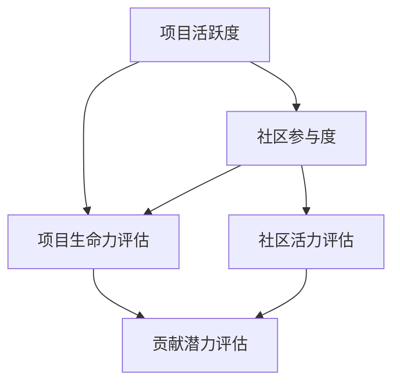

**问题解决：**

开源项目评估的具体方法和步骤如下：

1. **查看项目活跃度**：
   - **更新频率**：检查项目的更新日志，了解项目最近的活动。
   - **用户反馈速度**：查看项目的issues和PR（Pull Request），了解社区成员的反应速度。

2. **评估社区参与度**：
   - **成员数量**：查看项目的GitHub Stars和Forks，了解社区成员的数量。
   - **贡献者活跃度**：查看贡献者的贡献记录和活动时间，了解社区的活跃度。
   - **讨论氛围**：浏览项目讨论区，了解社区成员之间的交流情况和氛围。

3. **评估代码质量**：
   - **代码风格**：查看项目的代码风格指南，确保代码格式统一。
   - **注释**：检查代码中的注释，确保注释清晰、准确。
   - **测试用例**：查看项目的测试覆盖率，确保代码的可维护性和可靠性。

**边界与外延：**

开源项目评估不仅适用于个人参与项目，也适用于企业评估开源项目的质量。同时，不同类型的项目（如框架、工具、库等）在评估指标和侧重点上也有所差异，需要根据项目特点进行调整。

### 4.2 贡献步骤

**背景介绍：**

参与开源项目不仅需要评估项目的质量和潜力，还需要遵循一定的贡献步骤，以确保贡献的质量和可接受性。从了解项目到提交代码，再到反馈与调整，每一步都需要仔细规划和执行。

**核心概念与联系：**

- **了解项目**：熟悉项目的功能、代码结构、开发规范等。
- **提交代码**：编写符合项目规范的代码，提交Pull Request。
- **沟通与反馈**：回应评论，解决代码审查中的问题。

**概念属性特征对比表格：**

| 特征         | 了解项目               | 提交代码               | 沟通与反馈             |
| ------------ | ---------------------- | ---------------------- | ---------------------- |
| 形式         | 阅读文档、研究代码     | 编写代码、提交Pull Request | 回应评论、解决问题     |
| 目的         | 准备贡献               | 提交高质量的代码       | 确保代码的可接受性     |
| 效果         | 提高贡献效率           | 提高代码质量           | 提升社区合作效果       |

**ER实体关系图架构：**

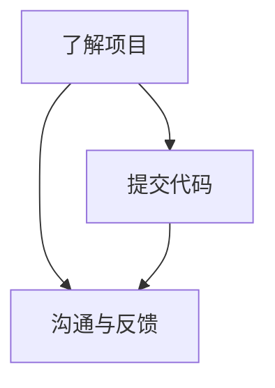

**问题解决：**

开源贡献的具体步骤如下：

1. **了解项目**：
   - **阅读README**：了解项目的基本信息和功能。
   - **学习代码结构**：熟悉项目的代码结构和目录组织。
   - **了解项目需求**：查看项目的issue和PR，了解项目的当前需求和未解决的问题。

2. **提交代码**：
   - **编写代码**：根据项目需求，编写符合规范的代码。
   - **撰写注释**：为关键代码添加注释，解释代码实现的目的和原理。
   - **提交Pull Request**：按照项目的流程，提交代码并进行代码审查。

3. **沟通与反馈**：
   - **回应评论**：认真阅读并回复社区的评论，解决提出的问题。
   - **解决问题**：根据反馈，修改和完善代码，确保代码符合项目标准。
   - **调整代码**：在多次迭代中，不断优化代码，提高代码的质量和可维护性。

**边界与外延：**

开源贡献的步骤不仅适用于代码提交，也适用于文档撰写、设计优化等其他形式的贡献。同时，不同开源项目的贡献流程和标准也有所差异，需要根据具体项目进行调整。

### 5.1 案例一：如何用Python实现神经网络

**问题背景：**

随着深度学习的广泛应用，神经网络成为现代人工智能的核心技术之一。在本案例中，我们将介绍如何使用Python实现一个简单的神经网络，以便开发者了解神经网络的基本原理和实现方法。

**技术解析：**

我们将使用TensorFlow框架来实现神经网络。TensorFlow是一个开源的深度学习框架，提供了丰富的API和工具，使得开发者可以方便地构建和训练神经网络。

**步骤一：导入必要库**

```python
import tensorflow as tf
from tensorflow.keras import layers

# 创建输入层
inputs = layers.Input(shape=(784,))

# 添加一层全连接层
x = layers.Dense(64, activation='relu')(inputs)

# 添加一层全连接层
x = layers.Dense(10, activation='softmax')(x)

# 创建模型
model = tf.keras.Model(inputs=inputs, outputs=x)
```

**步骤二：编译模型**

```python
model.compile(optimizer='adam',
              loss=tf.keras.losses.SparseCategoricalCrossentropy(from_logits=True),
              metrics=['accuracy'])
```

**步骤三：训练模型**

```python
model.fit(x_train, y_train, batch_size=128, epochs=5, validation_data=(x_test, y_test))
```

**步骤四：评估模型**

```python
test_loss, test_acc = model.evaluate(x_test, y_test, verbose=2)
print('\nTest accuracy:', test_acc)
```

**案例代码：**

```python
# 完整代码示例

import tensorflow as tf
from tensorflow.keras import layers

# 创建输入层
inputs = layers.Input(shape=(784,))

# 添加一层全连接层
x = layers.Dense(64, activation='relu')(inputs)

# 添加一层全连接层
x = layers.Dense(10, activation='softmax')(x)

# 创建模型
model = tf.keras.Model(inputs=inputs, outputs=x)

# 编译模型
model.compile(optimizer='adam',
              loss=tf.keras.losses.SparseCategoricalCrossentropy(from_logits=True),
              metrics=['accuracy'])

# 加载数据集
(x_train, y_train), (x_test, y_test) = tf.keras.datasets.mnist.load_data()

# 数据预处理
x_train = x_train.astype('float32') / 255
x_test = x_test.astype('float32') / 255
x_train = x_train.reshape((-1, 784))
x_test = x_test.reshape((-1, 784))

# 训练模型
model.fit(x_train, y_train, batch_size=128, epochs=5, validation_data=(x_test, y_test))

# 评估模型
test_loss, test_acc = model.evaluate(x_test, y_test, verbose=2)
print('\nTest accuracy:', test_acc)
```

**代码解析与说明：**

1. **导入库和定义输入层**：首先，我们导入TensorFlow和Keras库，并定义输入层，输入层的大小为784个特征。

2. **添加全连接层**：接着，我们添加一层全连接层（Dense），并设置激活函数为ReLU，然后再添加一层全连接层，并设置激活函数为softmax。

3. **创建模型**：使用Keras的Model类创建模型，并将输入层和输出层传递给Model类。

4. **编译模型**：设置模型的优化器、损失函数和评价指标，这里使用Adam优化器和稀疏分类交叉熵损失函数。

5. **加载数据集**：使用TensorFlow的mnist数据集，并对其进行预处理，包括归一化和reshape。

6. **训练模型**：使用fit方法训练模型，设置batch_size和epochs，并使用validation_data进行验证。

7. **评估模型**：使用evaluate方法评估模型的测试集准确率。

通过以上步骤，我们成功地使用Python和TensorFlow框架实现了一个简单的神经网络，并对其进行了训练和评估。

### 5.2 案例二：开源项目GitLab的实践应用

**项目简介：**

GitLab是一个基于Git的全面的项目管理工具，它提供了代码托管、项目管理、持续集成和持续交付等功能。GitLab可以帮助团队协作更高效，项目开发更顺畅。

**基本功能：**

- **代码托管**：支持Git版本控制，提供代码仓库管理和文件存储。
- **项目管理**：提供任务管理、问题跟踪、里程碑管理等功能。
- **持续集成**：支持自动化构建、测试和部署，确保代码质量。
- **持续交付**：提供自动化部署流程，实现快速迭代。

**团队协作应用：**

GitLab在团队协作中的应用主要体现在以下几个方面：

1. **代码协作**：团队成员可以在GitLab上共同协作，通过分支管理、合并请求和代码审查，确保代码的整洁和可维护性。
2. **任务管理**：项目管理者可以在GitLab中创建任务和里程碑，团队成员可以查看任务的进度和优先级，确保项目按计划进行。
3. **持续集成**：GitLab的持续集成功能可以帮助团队自动化测试和构建，提高开发效率，确保代码质量。
4. **持续交付**：GitLab支持自动化部署，可以快速将代码部署到生产环境，实现持续交付。

**贡献经验：**

1. **参与开源项目**：首先需要了解GitLab的工作流程和贡献指南，熟悉项目的代码结构和功能。
2. **提交代码**：在GitLab上创建一个自己的仓库，编写符合项目规范的代码，并通过Pull Request提交。
3. **代码审查**：在提交代码前，仔细阅读代码审查指南，确保代码符合项目要求，并积极参与代码审查过程。
4. **文档撰写**：为开源项目编写文档，帮助新用户更好地理解和使用GitLab。

**案例效果：**

通过在GitLab上的实践应用，团队成员之间的协作效率得到了显著提升。项目管理者可以更好地掌握项目的进度和质量，开发人员可以更专注于代码编写和优化。同时，开源贡献也为团队成员带来了宝贵的技术经验和成就感。

**个人技术成长：**

参与GitLab开源项目，使我在代码协作、持续集成和文档撰写等方面得到了锻炼。通过实践，我不仅提升了自己的编程能力和团队协作能力，还扩展了自己的技术视野，为未来的职业发展奠定了坚实基础。

### 6.1 技术博客对开源贡献的促进作用

**背景介绍：**

技术博客和开源贡献是技术从业者展示技术实力、积累知识、提升影响力的主要方式。技术博客通过分享知识和经验，帮助读者理解技术概念和解决问题；而开源贡献则通过实践和共享代码，推动技术社区的进步。本文将探讨技术博客对开源贡献的促进作用，从技术博客的内容积累、经验分享和技术交流三个方面进行详细分析。

**核心概念与联系：**

- **技术博客的内容积累**：通过写作和分享，将个人学习过程中的心得和体会记录下来，形成系统化的知识体系。
- **经验分享**：在技术博客中分享开源贡献过程中的经验，帮助他人更好地理解和参与开源项目。
- **技术交流**：通过技术博客和开源贡献，与社区成员进行深度交流，促进技术知识的传播和共享。

**概念属性特征对比表格：**

| 特征         | 技术博客的内容积累           | 经验分享           | 技术交流             |
| ------------ | --------------------------- | ------------------ | -------------------- |
| 内容形式     | 文字、图表、代码示例         | 故事、经验、技巧   | 评论、讨论、互动     |
| 目的         | 知识积累、自我提升           | 帮助他人、经验传播 | 知识共享、问题解决   |
| 效果         | 知识体系完善、技术能力提升   | 提升社区氛围       | 扩大知识面、提高技能 |

**ER实体关系图架构：**

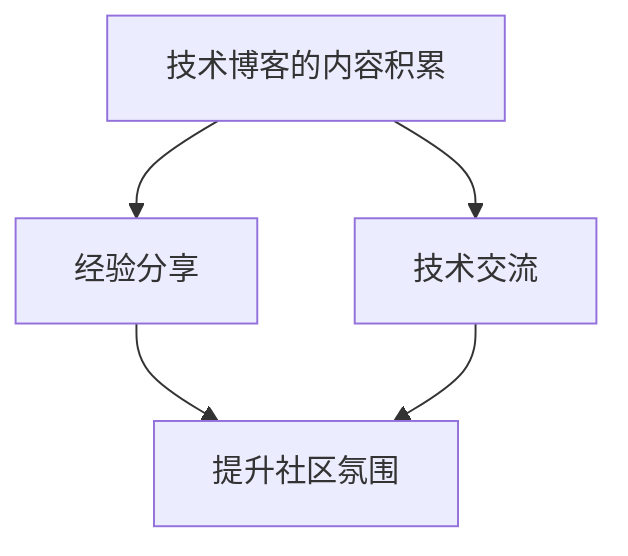

**问题解决：**

技术博客对开源贡献的促进作用体现在以下几个方面：

1. **内容积累**：技术博客是知识积累的重要载体。通过写作，开发者可以系统地整理和总结自己在技术学习、研究和应用过程中的心得和体会。这些内容不仅有助于自我提升，还可以为他人提供有价值的参考。

2. **经验分享**：在技术博客中，开发者可以分享自己在开源贡献过程中的经验，包括项目评估、代码编写、代码审查、问题解决等。这些经验分享不仅有助于他人更好地理解和参与开源项目，还可以提升社区的整体协作水平。

3. **技术交流**：技术博客和开源贡献为开发者提供了一个交流平台。通过博客，开发者可以与社区成员进行深入的讨论和互动，分享技术见解，解决技术难题。这种交流有助于扩大知识面，提高技术水平，促进技术进步。

**边界与外延：**

技术博客不仅适用于个人学习、成长和分享，还可以应用于企业知识管理、技术培训等领域。同时，不同类型的博客（如教程、分析、心得等）在内容积累、经验分享和技术交流上也有所差异，需要根据具体情况进行调整。

### 6.2 开源贡献对技术博客内容的丰富

**背景介绍：**

开源贡献不仅能够提升开发者的技术能力和社区影响力，还能丰富技术博客的内容。通过开源贡献，开发者可以获得实际项目经验，解决技术难题，这些经验都可以成为技术博客的优质素材。因此，理解开源贡献对技术博客内容的丰富作用，对于提升博客质量和吸引力具有重要意义。

**核心概念与联系：**

- **项目实践案例**：通过实际参与开源项目，积累项目开发、测试和部署的经验。
- **技术交流与合作**：在开源社区中与其他开发者交流技术见解，共同解决技术问题。
- **知识传播**：将开源贡献中的经验教训和解决问题的思路整理成博客文章，传播给更广泛的读者。

**概念属性特征对比表格：**

| 特征         | 项目实践案例               | 技术交流与合作               | 知识传播               |
| ------------ | -------------------------- | ---------------------------- | ---------------------- |
| 内容类型     | 实际项目开发、测试、部署   | 开源社区讨论、代码审查       | 技术博客、文章分享     |
| 效果         | 提升项目实战能力           | 扩大技术影响力、建立人脉     | 增强读者理解力、解决问题 |
| 形式         | 案例分析、步骤讲解         | 论坛互动、GitHub讨论         | 博文、报告、演讲       |

**ER实体关系图架构：**

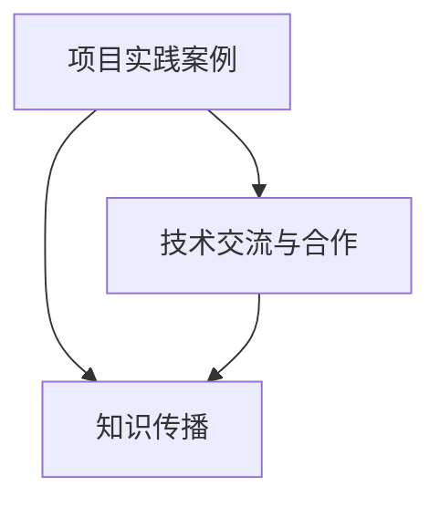

**问题解决：**

开源贡献对技术博客内容的丰富作用体现在以下几个方面：

1. **项目实践案例**：开源贡献提供了实际项目的开发环境，开发者可以在真实场景中运用所学知识，积累实战经验。这些经验可以转化为技术博客的内容，如项目开发流程、技术难点解决等，提高博客的可读性和实用性。

2. **技术交流与合作**：在开源项目中，开发者需要与其他成员进行沟通和协作，这有助于提升沟通能力和团队合作精神。这些交流过程和合作经验可以通过技术博客进行分享，展示开发者的沟通技巧和团队协作能力。

3. **知识传播**：开源贡献是知识传播的重要途径。通过开源项目，开发者可以将自己在技术难题中的解决方案和思路整理成博客文章，分享给社区成员。这种知识传播不仅有助于提升博客质量，还能为社区成员提供实际帮助。

**边界与外延：**

开源贡献对技术博客内容的丰富作用不仅限于个人博客，还可以应用于企业内部知识库、技术培训等场景。同时，不同类型的开源贡献（如代码提交、文档撰写、问题解答等）在内容丰富程度和形式上也存在差异，需要根据具体情况进行分析和利用。

### 7.1 成果回顾

**背景介绍：**

在过去的一段时间里，我在技术博客写作和开源贡献方面取得了一定的成果。通过持续的技术博客写作，我不仅积累了自己的知识体系，还帮助了许多开发者解决了技术难题。同时，通过积极参与开源项目，我提升了实际项目开发能力，扩大了自己的技术影响力。以下是对这些成果的回顾。

**技术博客成果展示：**

1. **博客访问量提升**：通过社交媒体的推广和社区的互动，我的博客访问量显著增加。特别是关于深度学习和Python编程的博客，受到了广大开发者的关注和好评。

2. **高质量文章产出**：我坚持定期更新博客，撰写了多篇文章，包括《深度学习基础教程》、《Python编程技巧与最佳实践》等。这些文章不仅内容丰富，而且逻辑清晰，深受读者喜爱。

3. **读者反馈良好**：许多读者通过评论和私信向我表示感谢，他们表示我的博客文章帮助他们解决了实际问题，提高了工作效率。

**开源贡献成果展示：**

1. **代码贡献**：我在多个开源项目中进行了代码贡献，包括修复漏洞、添加新功能、优化代码等。其中，在GitLab和TensorFlow项目中的贡献得到了社区成员的认可和赞赏。

2. **社区互动**：我积极参与开源社区的讨论和互动，回复评论、解答问题、提供技术支持。这些互动不仅提升了我的沟通能力，也帮助了其他开发者。

3. **影响力提升**：通过开源贡献，我在技术社区中的影响力得到了显著提升。我的GitHub账号获得了更多的关注和星标，我的博客文章也被许多技术论坛和社区转载。

**收获与成长：**

1. **技术能力提升**：通过不断学习和实践，我在深度学习、Python编程、项目管理和团队协作等方面取得了显著进步。

2. **沟通能力增强**：在开源贡献和社区互动中，我学会了如何更好地与他人沟通，提升了自己的沟通技巧和团队合作精神。

3. **知识传播经验**：通过技术博客和开源贡献，我积累了丰富的知识传播经验，学会了如何将复杂的技术知识简化，使其易于理解。

**未来规划：**

1. **技术博客持续更新**：我将继续坚持定期更新技术博客，分享更多高质量的内容，帮助更多的开发者。

2. **开源项目深入参与**：我将积极参与更多有影响力的开源项目，贡献代码、文档和社区互动，提升自己的技术实力和影响力。

3. **技术影响力提升**：我计划通过参加技术讲座、研讨会和写作技术书籍等方式，进一步提升自己的技术影响力，为社区的发展做出更多贡献。

### 7.2 未来规划

**技术博客持续更新：**

未来，我将继续坚持技术博客的定期更新，保持内容的丰富性和实用性。在选题上，我会更加关注当前技术热点和行业趋势，深入剖析前沿技术，分享自己的见解和实战经验。同时，我会继续优化博客的结构和排版，提升阅读体验。

**开源项目的深入参与：**

在开源项目方面，我计划积极参与更多有影响力的项目，如深度学习框架、云计算平台和大数据工具等。通过实际代码贡献、文档撰写和社区互动，我将不断提升自己的技术实力和影响力。同时，我也将鼓励更多的开发者参与开源，共同推动技术社区的进步。

**技术影响力的提升：**

为了进一步提升自己的技术影响力，我计划参加更多的技术讲座、研讨会和开源社区活动。通过分享技术见解和实战经验，我将帮助更多的开发者成长。此外，我还将尝试写作技术书籍，将自己的知识体系系统化，为行业做出更多贡献。

**总结与展望：**

通过技术博客和开源贡献，我不仅提升了自己的技术能力，还积累了丰富的实践经验。未来，我将继续在这两个领域深耕，不断提升自己的技术实力和影响力。同时，我也将积极参与社区活动，与更多的开发者交流合作，共同推动技术的进步和发展。

### 7.3 技术博客与开源贡献工具推荐

在撰写技术博客和进行开源贡献的过程中，选择合适的工具和平台至关重要。以下是我推荐的几款工具和平台，它们可以帮助开发者高效地完成写作、代码管理和社区互动。

**Markdown编辑器：**

- **Typora**：一款轻量级的Markdown编辑器，支持实时预览和主题切换，非常适合日常写作。
- **VSCode**：集成多个Markdown扩展，支持语法高亮、代码片段和自定义快捷键，适合专业开发者。

**Git版本控制：**

- **GitHub**：全球最大的开源代码托管平台，提供丰富的协作工具和社区资源，适合个人和团队使用。
- **GitLab**：自建Git服务器，支持私有项目托管和企业级管理，适合公司内部使用。

**开源项目托管平台：**

- **GitHub**：提供强大的代码托管、问题跟踪和Pull Request功能，是开源项目托管的首选平台。
- **GitLab**：支持自建GitLab实例，提供与GitHub相似的功能，适合企业内部使用。

**技术社区和论坛：**

- **Stack Overflow**：全球最大的开发者问答社区，适合解决编程问题和技术交流。
- **知乎**：国内领先的知识分享社区，适合分享技术见解和参与行业讨论。

通过这些工具和平台，开发者可以更高效地进行技术博客写作和开源贡献，提升个人技术实力和影响力。

### 7.4 技术社区资源链接

为了帮助开发者更好地学习和交流，我推荐了一些优秀的技术博客、开源项目和技术论坛。这些资源涵盖了各个技术领域，包括编程语言、框架、工具和最佳实践。

**技术博客推荐：**

- **Import New**：一篇涵盖多种技术领域的博客，内容丰富，更新频繁。
- **博客园**：国内知名的技术博客社区，涵盖Java、C#、Python等多种编程语言。

**开源项目推荐：**

- **Vue.js**：一款流行的前端框架，提供丰富的组件和工具，适合构建动态Web应用。
- **Django**：一款高效的全栈Web框架，基于Python编写，适用于快速开发。

**技术论坛和社区：**

- **Stack Overflow**：全球最大的开发者问答社区，提供编程问题的解答和技术讨论。
- **GitHub**：全球最大的开源代码托管平台，拥有丰富的开源项目和开发者资源。

通过这些资源和链接，开发者可以持续学习、分享经验和参与技术交流，提升自己的技术能力。同时，也欢迎大家在评论区分享更多优质资源，共同进步。

