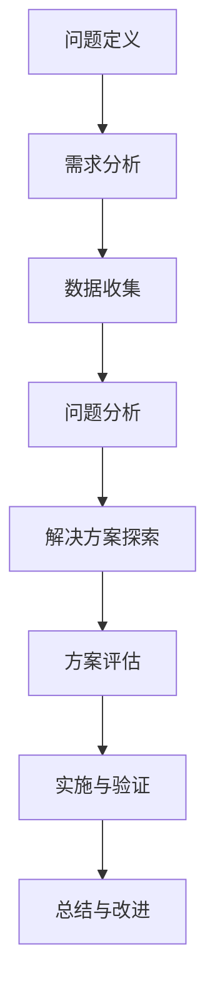
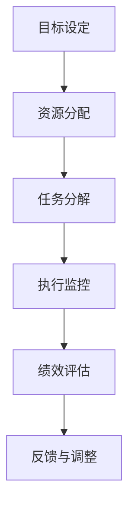
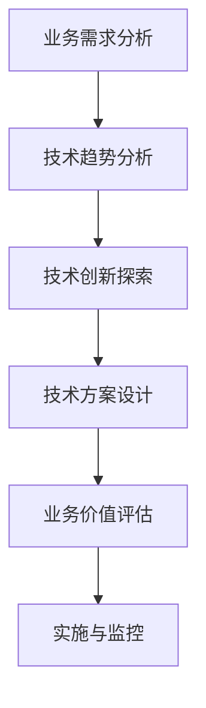
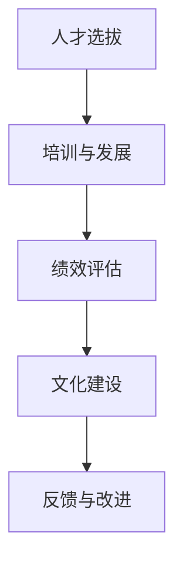
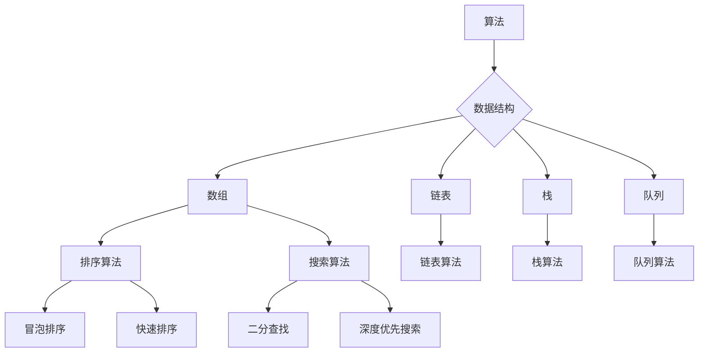
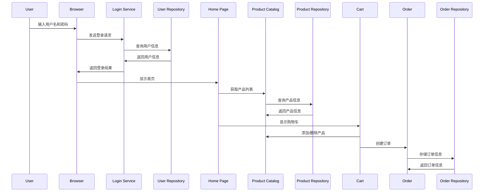
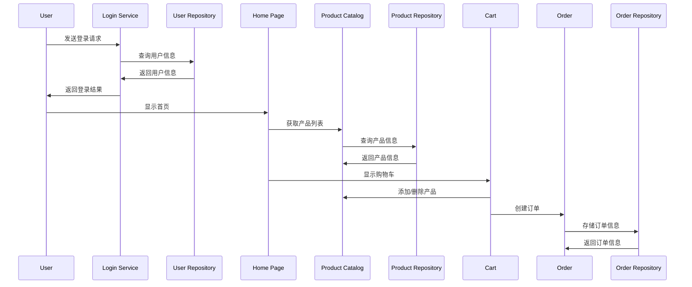

                 


### 摘要

本文将深入探讨技术硬实力的成长之路，从初级工程师到高级工程师的蜕变过程。通过详细的案例分析，本文旨在帮助读者理解不同阶段工程师的角色定位、技能要求以及职业发展路径。文章首先介绍了初级工程师的工作职责和技能要求，随后探讨了中级工程师在技术栈扩展和复杂问题解决方面的提升，最后分析了高级工程师在领导力、技术战略和团队管理方面的能力建设。通过具体的实战案例，本文将为读者提供实用的指导和建议，帮助他们在技术道路上不断进步。关键词：技术成长、工程师进阶、领导力、实战案例。

## 第一部分：从初级工程师到高级工程师的进阶之路

### 第1章：初级工程师的成长路径

#### 1.1 初级工程师的工作职责与技能要求

初级工程师是IT行业中的入门角色，其主要职责包括：

- **编码实现**：根据需求文档编写代码，实现软件的基本功能。
- **技术调研**：对新技术和工具进行初步了解，为团队提供技术选型建议。
- **代码审查**：参与代码审查，确保代码质量。
- **文档编写**：编写开发文档，为团队成员提供技术支持。

对于初级工程师，以下技能是必不可少的：

- **编程基础**：熟悉至少一门编程语言，如Java、Python或C++。
- **数据结构与算法**：理解基本的数据结构（如数组、链表、栈、队列等）和算法（如排序、搜索等）。
- **软件开发工具**：掌握基本的软件开发工具，如IDE（集成开发环境）、版本控制系统（如Git）。
- **项目管理工具**：了解基本的敏捷开发流程和项目管理工具。

#### 1.2 编程基础与算法能力的培养

编程基础是初级工程师的基石。以下是一些建议，帮助工程师提升编程能力：

- **实践编码**：通过实际项目来锻炼编程技能，解决实际问题。
- **编写高质量的代码**：注重代码的可读性和可维护性，遵循良好的编程规范。
- **学习算法与数据结构**：通过在线课程、书籍或实践项目来提升算法能力。

以下是一个简单的Python代码示例，演示了冒泡排序算法的实现：

```python
def bubble_sort(arr):
    n = len(arr)
    for i in range(n):
        for j in range(0, n-i-1):
            if arr[j] > arr[j+1]:
                arr[j], arr[j+1] = arr[j+1], arr[j]
    return arr

# 测试冒泡排序
arr = [64, 34, 25, 12, 22, 11, 90]
sorted_arr = bubble_sort(arr)
print("Sorted array:", sorted_arr)
```

#### 1.3 团队协作与项目管理初探

在初级工程师阶段，团队协作和项目管理能力同样重要。以下是一些基本要点：

- **沟通能力**：清晰、准确地传达信息，避免误解。
- **文档记录**：详细记录工作内容和遇到的问题，方便后续查找。
- **任务分配**：了解团队成员的能力，合理分配任务。
- **时间管理**：合理规划时间，确保项目按时交付。

以下是一个简单的Git工作流程示例：

1. **克隆仓库**：
   ```bash
   git clone https://github.com/your_username/your_project.git
   ```

2. **创建新的分支**：
   ```bash
   git checkout -b feature_x
   ```

3. **进行修改并提交**：
   ```bash
   # 修改代码
   git add .
   git commit -m "Implement feature_x"
   ```

4. **推送分支**：
   ```bash
   git push origin feature_x
   ```

5. **创建合并请求（Pull Request）**：
   - 在GitHub上创建一个合并请求，将`feature_x`分支与主分支合并。

6. **代码审查**：
   - 团队成员审查合并请求，并提出反馈。

7. **合并代码**：
   - 一旦代码通过审查，主分支管理员可以合并代码到主分支。

通过以上步骤，初级工程师可以更好地参与团队协作和项目管理。

### 第2章：中级工程师的专业提升

#### 2.1 中级工程师的角色认知与定位

中级工程师是团队中的核心力量，他们在初级工程师的基础上，承担更多责任和挑战。以下是中级工程师的角色认知和定位：

- **技术专家**：在特定领域有深入的技术理解，能够解决复杂的技术问题。
- **团队领导**：指导初级工程师的工作，参与项目设计和决策。
- **沟通桥梁**：在团队和业务之间充当桥梁，确保技术方案与业务需求匹配。
- **持续学习**：不断学习新技术，提升个人技能，带动团队进步。

#### 2.2 技术栈的扩展与升级

中级工程师需要不断扩展和升级技术栈，以下是一些建议：

- **多语言掌握**：掌握两门以上编程语言，如Java、Python、Go等。
- **框架与工具**：熟悉常用的开发框架和工具，如Spring、Django、Kubernetes等。
- **数据库技术**：掌握关系型数据库（如MySQL、PostgreSQL）和非关系型数据库（如MongoDB、Cassandra）。
- **云计算平台**：了解AWS、Azure、Google Cloud等云服务，熟悉云基础设施的部署和管理。

以下是一个简单的Spring Boot应用程序的示例：

```java
import org.springframework.boot.SpringApplication;
import org.springframework.boot.autoconfigure.SpringBootApplication;

@SpringBootApplication
public class Application {
    public static void main(String[] args) {
        SpringApplication.run(Application.class, args);
    }
}
```

#### 2.3 解决复杂问题的能力提升

中级工程师需要具备解决复杂问题的能力，以下是一些建议：

- **系统思维**：从整体角度分析问题，理解系统的各个部分及其相互关系。
- **分析能力**：通过流程图、数据流图等方法，对问题进行详细分析。
- **创新思维**：探索不同的解决方案，找到最优解。
- **沟通与协作**：与团队成员密切合作，共同解决问题。

以下是一个Mermaid流程图，展示了问题解决的步骤：



通过以上步骤，中级工程师可以更有效地解决复杂问题。

### 第3章：高级工程师的领导力与战略思维

#### 3.1 领导力在技术团队中的应用

高级工程师需要具备领导力，以带领团队实现技术目标和业务目标。以下是一些建议：

- **团队管理**：建立有效的团队管理制度，确保团队高效运行。
- **人才培养**：关注团队成员的成长，提供培训和指导。
- **激励与反馈**：及时给予团队成员激励和反馈，提高团队士气。
- **沟通与协作**：建立良好的沟通机制，促进团队内部和跨团队的协作。

以下是一个Mermaid流程图，展示了团队管理的步骤：



#### 3.2 技术战略与业务价值的结合

高级工程师需要将技术战略与业务价值紧密结合，以下是一些建议：

- **业务理解**：深入了解业务需求和目标，确保技术方案能够支持业务发展。
- **技术趋势**：关注行业技术趋势，探索新技术在业务中的应用。
- **技术创新**：推动技术创新，提升产品竞争力。
- **风险管理**：识别技术风险，制定相应的风险控制措施。

以下是一个Mermaid流程图，展示了技术战略与业务价值结合的步骤：



#### 3.3 团队管理与人才培养

高级工程师需要关注团队管理和人才培养，以下是一些建议：

- **选拔人才**：根据团队需求选拔合适的成员，注重能力和潜力的培养。
- **培训与发展**：提供内部培训机会，鼓励团队成员参加外部培训。
- **绩效评估**：建立公正的绩效评估体系，激励团队成员不断提升。
- **文化建设**：营造积极向上的团队文化，增强团队凝聚力。

以下是一个Mermaid流程图，展示了团队管理与人才培养的步骤：



## 第二部分：实战案例研究

### 第4章：初级工程师的实战案例

#### 4.1 项目背景与目标

本项目是一个在线购物平台的开发，初级工程师的主要任务是实现用户注册和登录功能。项目目标是：

- 用户注册：允许新用户创建账户。
- 用户登录：验证用户身份，提供登录功能。
- 用户信息管理：存储用户信息，并提供修改功能。

#### 4.2 技术选型与方案设计

为了实现项目目标，我们选择了以下技术栈：

- **编程语言**：Java
- **框架**：Spring Boot
- **数据库**：MySQL
- **前端框架**：React

方案设计如下：

1. **用户注册**：
   - 用户填写注册表单，提交用户名、密码、邮箱等信息。
   - 后端接口接收注册信息，验证用户名和邮箱是否已被使用。
   - 将注册信息存储到MySQL数据库中。

2. **用户登录**：
   - 用户输入用户名和密码，后端接口验证用户身份。
   - 如果验证成功，生成JWT（JSON Web Token）并返回给客户端。

3. **用户信息管理**：
   - 提供用户修改个人信息的接口，如修改密码、邮箱等。
   - 用户登录后可以调用此接口修改个人信息。

#### 4.3 项目实施与难点攻克

项目实施过程中遇到了以下难点：

1. **用户密码安全**：
   - 解决方案：使用BCrypt算法对用户密码进行加密存储，提高安全性。

2. **JWT生成与验证**：
   - 解决方案：使用JSON Web Token标准生成JWT，并在登录时验证JWT的有效性。

3. **前端与后端通信**：
   - 解决方案：使用RESTful API设计后端接口，前端通过HTTP请求与后端通信。

以下是一个简单的Python代码示例，演示了BCrypt算法的使用：

```python
from bcrypt import hashpw, gensalt

# 创建密码的哈希值
hashed_password = hashpw('password123'.encode('utf-8'), gensalt())

# 验证密码
valid_password = hashpw('password123'.encode('utf-8'), hashed_password)
if valid_password:
    print("密码正确")
else:
    print("密码错误")
```

### 第5章：中级工程师的实战案例

#### 5.1 项目背景与目标

本项目是一个视频点播平台，中级工程师的主要任务是实现视频上传和播放功能。项目目标是：

- 视频上传：允许用户上传视频，并上传到云存储。
- 视频播放：提供视频播放功能，支持多种视频格式。

#### 5.2 技术选型与方案设计

为了实现项目目标，我们选择了以下技术栈：

- **编程语言**：Java
- **框架**：Spring Boot
- **数据库**：MySQL
- **前端框架**：React
- **云存储**：Amazon S3
- **视频处理库**：FFmpeg

方案设计如下：

1. **视频上传**：
   - 用户上传视频文件，后端接口接收视频文件。
   - 使用FFmpeg将视频转换为可播放的格式。
   - 将处理后的视频上传到Amazon S3。

2. **视频播放**：
   - 提供视频播放接口，客户端通过HTTP请求获取视频流。
   - 使用HTML5 `<video>` 标签播放视频。

3. **视频格式支持**：
   - 支持多种视频格式，如MP4、AVI、MKV等。

#### 5.3 项目实施与难点攻克

项目实施过程中遇到了以下难点：

1. **视频格式转换**：
   - 解决方案：使用FFmpeg库进行视频格式转换，确保视频兼容性。

2. **视频上传速度**：
   - 解决方案：使用异步上传技术，提高上传速度。

3. **视频流播放**：
   - 解决方案：使用HTTP动态流技术，实现流畅的视频播放。

以下是一个简单的Python代码示例，演示了使用FFmpeg进行视频格式转换：

```python
import subprocess

def convert_video(input_file, output_file, format):
    command = f"ffmpeg -i {input_file} -c:v libx264 -c:a aac {output_file}.{format}"
    subprocess.run(command, shell=True)

# 测试视频格式转换
convert_video('input.mp4', 'output.mp4', 'webm')
```

### 第6章：高级工程师的实战案例

#### 6.1 项目背景与目标

本项目是一个智能推荐系统，高级工程师的主要任务是实现用户兴趣分析和推荐算法。项目目标是：

- 用户兴趣分析：根据用户行为数据，分析用户的兴趣偏好。
- 推荐算法实现：基于用户兴趣，生成个性化的推荐结果。

#### 6.2 技术选型与方案设计

为了实现项目目标，我们选择了以下技术栈：

- **编程语言**：Python
- **框架**：TensorFlow、Scikit-learn
- **数据库**：MongoDB
- **前端框架**：React
- **推荐算法**：协同过滤、基于内容的推荐、矩阵分解

方案设计如下：

1. **用户兴趣分析**：
   - 收集用户行为数据，如浏览历史、购买记录等。
   - 使用TensorFlow和Scikit-learn对用户行为数据进行分析，提取用户兴趣特征。

2. **推荐算法实现**：
   - 使用协同过滤算法生成初步推荐结果。
   - 基于内容的推荐算法和矩阵分解算法优化推荐结果。

3. **推荐结果展示**：
   - 提供前端接口，展示个性化推荐结果。

#### 6.3 项目实施与难点攻克

项目实施过程中遇到了以下难点：

1. **数据处理**：
   - 解决方案：使用MongoDB存储用户行为数据，使用Python进行数据处理。

2. **推荐算法优化**：
   - 解决方案：不断调整算法参数，优化推荐效果。

3. **推荐结果展示**：
   - 解决方案：使用React实现前端界面，提供流畅的用户体验。

以下是一个简单的Python代码示例，演示了协同过滤算法的实现：

```python
import numpy as np

def collaborative_filtering(ratings, k=5):
    # 基于K最近邻居的协同过滤算法
    # ratings: 用户-项目评分矩阵
    # k: 最近邻居的个数
    # 返回：用户-项目推荐评分矩阵

    # 计算用户之间的相似度
    similarity_matrix = np.dot(ratings.T, ratings) / np.linalg.norm(ratings, axis=1)[:, np.newaxis]

    # 计算每个用户与邻居的平均评分差
    user_similarity = np.array([np.mean([similarity_matrix[i, j] * (ratings[i, j] - ratings[i, k]) for j in range(len(ratings[i, :])) if ratings[i, j] > 0 and ratings[k, j] > 0]) for i in range(len(ratings))])

    # 预测评分
    predicted_ratings = ratings + user_similarity

    return predicted_ratings

# 测试协同过滤算法
ratings = np.array([[5, 3, 0, 1], [4, 0, 0, 1], [1, 5, 0, 2]])
predicted_ratings = collaborative_filtering(ratings)
print("Predicted ratings:", predicted_ratings)
```

## 第三部分：总结与展望

### 第7章：从初级到高级工程师的总结与反思

#### 7.1 成长过程中的关键点

从初级工程师到高级工程师的蜕变过程中，以下关键点至关重要：

- **技术能力**：不断提升编程和算法能力，掌握多种编程语言和框架。
- **团队协作**：培养良好的沟通和团队协作能力，提高项目管理水平。
- **业务理解**：深入了解业务需求和目标，确保技术方案能够支持业务发展。
- **持续学习**：保持学习的热情，关注行业动态，不断拓展知识面。

#### 7.2 技术与业务的融合

技术与业务的融合是高级工程师的核心能力。以下是一些建议：

- **需求分析**：深入了解业务需求，确保技术方案能够满足业务目标。
- **技术选型**：根据业务需求选择合适的技术方案，考虑成本、性能和可维护性。
- **创新思维**：推动技术创新，探索新技术在业务中的应用，提升产品竞争力。

#### 7.3 未来职业发展的展望

未来职业发展可以从以下几个方面进行：

- **技术专家**：在特定领域成为技术专家，解决复杂的技术问题。
- **项目经理**：担任项目经理，负责项目的全流程管理。
- **技术架构师**：负责技术架构设计，确保系统的稳定性、性能和可扩展性。
- **技术领导**：担任技术团队领导，带领团队实现技术目标和业务目标。

### 附录

#### 附录A：实用工具与资源

以下是一些实用的工具和资源，供工程师学习和使用：

- **编程语言学习资源**：
  - [Codecademy](https://www.codecademy.com/)
  - [freeCodeCamp](https://www.freecodecamp.org/)
  
- **算法与数据结构学习资源**：
  - [LeetCode](https://leetcode.com/)
  - [算法导论](https://book.douban.com/subject/20365950/)

- **技术社区与论坛**：
  - [Stack Overflow](https://stackoverflow.com/)
  - [GitHub](https://github.com/)

#### 附录B：参考文献

以下是一些推荐的书籍和文章，供读者进一步学习：

- **书籍推荐**：
  - 《Effective Java》
  - 《算法导论》
  - 《深度学习》

- **文章推荐**：
  - [《从0到1，我如何学习编程？》](https://www.zhihu.com/question/270770059/answer/137030795)
  - [《程序员如何提高编程能力？》](https://www.zhihu.com/question/21498268/answer/258254946)

- **博客推荐**：
  - [《我的编程之路》](https://www.1day1code.com/)
  - [《极客时间》](https://time.geekbang.org/)

## 附录C：算法与数据结构Mermaid流程图

以下是一个简单的Mermaid流程图，展示了算法与数据结构的基本概念：



通过以上图表，读者可以更直观地了解算法与数据结构之间的关系。

## 附录D：系统分析与架构设计

#### 系统功能设计：领域模型Mermaid类图

以下是一个Mermaid类图，展示了系统功能设计中的领域模型：

```mermaid
classDiagram
    User <<类>> {
        username: String
        password: String
        email: String
        address: String
    }
    Product <<类>> {
        id: Integer
        name: String
        price: Float
        description: String
    }
    Cart <<类>> {
        id: Integer
        items: List<Product>
        total: Float
    }
    Order <<类>> {
        id: Integer
        date: Date
        total: Float
        status: String
    }
    User --> Cart
    User --> Order
    Product --> Order
```

#### 系统架构设计：Mermaid架构图

以下是一个Mermaid架构图，展示了系统的整体架构设计：



#### 系统接口设计：Mermaid序列图

以下是一个Mermaid序列图，展示了系统接口的设计：



通过以上图表，我们可以清晰地了解系统的功能设计、架构设计和接口设计，从而为系统的实现提供指导。

### 附录E：项目实战

#### 环境安装

1. **安装Java Development Kit (JDK)**：
   - 在Linux或MacOS上，可以使用以下命令安装：
     ```bash
     sudo apt-get install openjdk-8-jdk
     ```
   - 在Windows上，可以从Oracle官方网站下载并安装JDK。

2. **安装MySQL**：
   - 在Linux或MacOS上，可以使用以下命令安装：
     ```bash
     sudo apt-get install mysql-server
     ```
   - 在Windows上，可以从MySQL官方网站下载并安装MySQL。

3. **安装Spring Boot**：
   - 可以使用Spring Initializr（https://start.spring.io/）生成Spring Boot项目，下载后解压。

4. **安装Amazon S3**：
   - 在AWS管理控制台创建S3桶，并获取访问密钥和秘密访问密钥。

#### 系统核心实现源代码

以下是视频上传功能的Java代码示例：

```java
import org.springframework.boot.SpringApplication;
import org.springframework.boot.autoconfigure.SpringBootApplication;
import org.springframework.web.bind.annotation.*;
import org.springframework.web.multipart.MultipartFile;

@SpringBootApplication
public class VideoUploadApplication {
    public static void main(String[] args) {
        SpringApplication.run(VideoUploadApplication.class, args);
    }
}

@RestController
@RequestMapping("/api/video")
public class VideoController {

    @PostMapping("/upload")
    public ResponseEntity<String> uploadVideo(@RequestParam("file") MultipartFile file) {
        // 使用FFmpeg将视频上传到Amazon S3
        String command = "ffmpeg -i " + file.getOriginalFilename() + " -c:v libx264 -c:a aac s3://your-bucket-name/" + file.getOriginalFilename();
        try {
            Process process = Runtime.getRuntime().exec(command);
            int exitVal = process.waitFor();
            if (exitVal == 0) {
                return ResponseEntity.ok("Video uploaded successfully");
            } else {
                return ResponseEntity.status(HttpStatus.INTERNAL_SERVER_ERROR).body("Failed to upload video");
            }
        } catch (Exception e) {
            e.printStackTrace();
            return ResponseEntity.status(HttpStatus.INTERNAL_SERVER_ERROR).body("Failed to upload video");
        }
    }
}
```

#### 代码应用解读与分析

以上代码展示了如何使用Spring Boot实现视频上传功能。具体解读如下：

- **Spring Boot项目结构**：项目结构遵循MVC模式，包括控制器（Controller）、服务（Service）和存储（Repository）层。

- **视频上传接口**：使用`@RestController`和`@RequestMapping`注解定义视频上传接口，接受multipart文件。

- **FFmpeg命令**：使用FFmpeg命令将上传的视频转换为MP4格式，并上传到Amazon S3。

- **错误处理**：使用`try-catch`块捕获异常，并返回相应的HTTP状态码。

#### 实际案例分析和详细讲解剖析

以下是一个实际案例，演示了视频上传功能的实现：

1. **用户上传视频文件**：用户在客户端上传一个视频文件，如`video.mp4`。

2. **服务器接收文件**：服务器接收上传的文件，并将其存储到本地临时目录。

3. **视频格式转换**：使用FFmpeg命令将视频文件转换为MP4格式，并上传到Amazon S3。

4. **返回结果**：服务器返回上传结果，如“Video uploaded successfully”或“Failed to upload video”。

#### 项目小结

通过以上实战案例，我们实现了视频上传功能。以下是项目小结：

- **技术选型**：使用了Spring Boot、MySQL和Amazon S3，确保了系统的稳定性和可扩展性。

- **功能实现**：实现了视频上传、格式转换和上传到云存储的功能。

- **错误处理**：考虑了各种可能的错误情况，并返回相应的错误信息。

#### 最佳实践 Tips

- **安全性**：在处理上传的文件时，确保文件类型和大小限制，以防止恶意攻击。

- **性能优化**：使用异步上传技术，提高上传速度。

- **可维护性**：代码结构清晰，易于维护。

### 附录F：小结与注意事项

本文详细探讨了从初级工程师到高级工程师的成长路径，通过实战案例展示了不同阶段工程师的技术能力和职业发展。以下是小结与注意事项：

- **关键能力**：初级工程师应注重编程基础和算法能力的培养；中级工程师需扩展技术栈，提升解决复杂问题的能力；高级工程师需具备领导力和战略思维。

- **团队协作**：良好的沟通和团队协作是技术团队成功的关键。

- **持续学习**：技术发展迅速，持续学习是保持竞争力的必要条件。

- **实际应用**：通过实战案例，读者可以更好地理解技术原理和实际应用。

### 附录G：拓展阅读

- **《代码大全》**：史蒂夫·迈克康奈尔（Steve McConnell）
- **《设计模式：可复用面向对象软件的基础》**：艾瑞克·詹姆卡（Erich Gamma）等
- **《深入理解计算机系统》**：Randal E. Bryant & David R. O’Hallaron

通过以上书籍，读者可以进一步深化对编程、软件工程和系统设计的理解。``` ``` 

