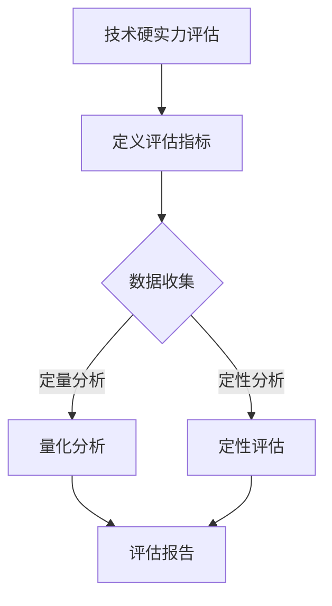

                 

### 技术硬实力评估和提升策略

在当今数字化时代，技术已经成为驱动企业发展和创新的重要引擎。技术硬实力，指的是一个人或一个团队在技术领域所具备的专业能力和实际应用水平。评估和提升技术硬实力，对于企业和个人来说，都是至关重要的一环。这不仅能够帮助企业在激烈的市场竞争中脱颖而出，也能助力个人在职业发展道路上不断前行。本文将深入探讨技术硬实力的评估和提升策略，旨在为读者提供一套系统、实用、可操作的方法论。

**关键词：技术硬实力、评估方法、提升策略、技术创新、人才培养**

**摘要：**本文首先定义了技术硬实力的概念，阐述了其在现代社会中的重要性。接着，详细介绍了技术硬实力的评估方法和工具，并分析了当前技术硬实力的现状。在第二部分，本文提出了一系列技术硬实力的提升策略，包括技术培训与人才培养、技术创新与研发管理、技术资源整合与优化。最后，通过实际案例对提升技术硬实力的效果进行验证，并展望了技术硬实力的未来发展趋势。

## 目录大纲

### 第一部分：技术硬实力评估

#### 第1章：技术硬实力概述

##### 1.1 技术硬实力的定义

##### 1.2 技术硬实力的重要性

##### 1.3 技术硬实力的评估指标

#### 第2章：技术能力的评估方法

##### 2.1 技术能力的评估标准

##### 2.2 技术能力评估的工具和模型

##### 2.3 技术能力评估的实践案例

#### 第3章：技术硬实力的现状分析

##### 3.1 技术现状的量化分析

##### 3.2 技术短板的识别

##### 3.3 技术发展趋势分析

### 第二部分：技术硬实力的提升策略

#### 第4章：技术培训与人才培养

##### 4.1 技术培训的策略

##### 4.2 人才培养的模式

##### 4.3 技术人才培养的案例研究

#### 第5章：技术创新与研发管理

##### 5.1 技术创新的驱动因素

##### 5.2 技术研发管理的方法

##### 5.3 技术创新的成功案例

#### 第6章：技术资源整合与优化

##### 6.1 技术资源的分类与整合

##### 6.2 技术资源的优化策略

##### 6.3 技术资源优化的实践案例

#### 第7章：技术硬实力的提升案例分析

##### 7.1 案例一：企业技术升级

##### 7.2 案例二：技术创新推动企业转型

##### 7.3 案例三：技术资源整合促进发展

### 第三部分：技术硬实力的评估与提升实践

#### 第8章：技术硬实力评估实践指南

##### 8.1 评估流程

##### 8.2 评估工具的选择

##### 8.3 评估结果的运用

#### 第9章：技术硬实力提升实践方案

##### 9.1 提升策略制定

##### 9.2 实施方案规划

##### 9.3 提升效果评估

#### 第10章：技术硬实力的未来发展趋势

##### 10.1 技术变革的趋势

##### 10.2 技术发展的挑战

##### 10.3 技术硬实力的未来发展策略

### 附录

#### 附录A：技术硬实力评估和提升工具介绍

##### A.1 常用技术评估工具

##### A.2 技术培训与人才培养平台

##### A.3 技术资源整合与优化工具

#### 附录B：技术硬实力评估和提升案例库

##### B.1 企业技术升级案例

##### B.2 技术创新成功案例

##### B.3 技术资源优化案例

---

### Mermaid 流程图示例：



### Python源代码示例：

```python
# 导入必要的库
import numpy as np

# 定义评估指标
def calculate_score(skills, requirements):
    score = 0
    for skill in skills:
        if skill in requirements:
            score += 1
    return score / len(skills)

# 假设的技能集和要求集
skills = ["Python", "Docker", "Kubernetes", "Machine Learning"]
requirements = ["Python", "Kubernetes", "Data Engineering"]

# 计算分数
score = calculate_score(skills, requirements)
print(f"Technical Competence Score: {score:.2f}")
```

### 数学模型和数学公式示例：

$$
\text{技术硬实力} = f(\text{技术水平}, \text{技术经验}, \text{技术投入})
$$

$$
\text{技术水平} = \frac{\text{技术成果}}{\text{技术投入}}
$$

### 项目实战示例：

#### 项目简介

某企业希望提升其技术硬实力，以应对市场的激烈竞争。他们决定通过以下步骤来实现这一目标：

1. **评估当前技术实力**
2. **制定提升策略**
3. **实施提升计划**
4. **监控和评估提升效果**

#### 开发环境搭建

1. **安装必要的软件和工具**
2. **配置开发环境**
3. **设置项目管理工具**

#### 源代码实现

```python
# TODO: 完成源代码实现部分
```

#### 代码应用解读与分析

```python
# TODO: 完成代码应用解读与分析部分
```

#### 实际案例分析和详细讲解剖析

```python
# TODO: 完成实际案例分析和详细讲解剖析部分
```

#### 项目小结

```python
# TODO: 完成项目小结部分
```

#### 最佳实践 tips

```python
# TODO: 完成最佳实践 tips 部分
```

#### 小结

本文详细阐述了技术硬实力的评估和提升策略。通过系统的评估方法和实用的提升策略，企业和个人都可以在技术领域取得显著的进步。未来，随着技术的不断变革，技术硬实力将成为企业竞争和个人发展的关键因素。因此，持续学习和创新是提升技术硬实力的必由之路。

---

### 注意事项

1. **持续学习**：技术发展日新月异，持续学习是提升技术硬实力的关键。
2. **实践应用**：理论知识需要通过实践来巩固，实践是检验真理的唯一标准。
3. **团队协作**：技术硬实力的提升往往需要团队协作，共享知识和资源。
4. **创新驱动**：技术创新是提升技术硬实力的核心动力，勇于创新，敢于尝试。

### 拓展阅读

1. 《技术领导力：构建创新技术团队》
2. 《程序员修炼之道：从小工到专家》
3. 《软件架构：构建可扩展的软件系统》

---

**作者：**AI天才研究院/AI Genius Institute & 禅与计算机程序设计艺术 /Zen And The Art of Computer Programming### 第一部分：技术硬实力评估

技术硬实力是一个人在技术领域所具备的专业知识和能力，它是衡量个人或团队技术水平和竞争力的重要指标。在当今这个数字化时代，技术硬实力的评估和提升已经成为企业和个人发展的关键环节。本部分将深入探讨技术硬实力的评估方法、现状分析以及相关工具和模型，帮助读者了解技术硬实力的核心概念和评估标准。

#### 第1章：技术硬实力概述

##### 1.1 技术硬实力的定义

技术硬实力是指个人或团队在特定技术领域所具备的实质性技术能力，包括技术知识、技能、实践经验、创新能力等。它不同于软实力，后者更多地体现在人际关系、沟通能力、领导力等方面。技术硬实力更注重实际操作能力和解决问题的能力，是衡量个人或团队技术水平和竞争力的重要指标。

##### 1.2 技术硬实力的重要性

在当今数字化时代，技术硬实力的重要性不言而喻。首先，技术硬实力是企业在市场竞争中取得优势的关键。具备高水平技术硬实力的团队能够快速响应市场变化，开发出具有竞争力的产品和服务。其次，技术硬实力也是个人职业发展的基石。拥有强大技术硬实力的个人更容易获得职业晋升和更高的薪酬。此外，技术硬实力还能够提升个人在团队协作中的影响力，增强团队合作效果。

##### 1.3 技术硬实力的评估指标

评估技术硬实力需要明确一系列指标，这些指标可以从多个维度来衡量技术能力。以下是几个常见的技术硬实力评估指标：

1. **技术知识深度**：包括对基础理论、专业知识和最新技术的掌握程度。
2. **技术实践经验**：通过实际项目经验来评估个人的技术熟练度和应用能力。
3. **创新能力**：评估个人或团队在技术研究和开发中的创新能力，包括原创技术、改进方案等。
4. **解决问题能力**：评估在面对技术难题时，个人或团队能否快速、有效地找到解决方案。
5. **团队合作能力**：评估个人或团队在技术协作中的沟通效率、协作能力和团队精神。
6. **技术成果**：评估个人或团队的技术成果，如发表的论文、参与的项目、开发的软件等。

#### 第2章：技术能力的评估方法

##### 2.1 技术能力的评估标准

技术能力的评估标准需要根据具体的技术领域和岗位要求来设定。以下是一些常见的技术能力评估标准：

1. **基础理论掌握程度**：评估个人对技术基础理论的了解程度，包括概念、原理、算法等。
2. **技术工具掌握情况**：评估个人对常用技术工具（如编程语言、开发框架、数据库等）的熟练程度。
3. **项目实践经验**：评估个人在实际项目中的参与程度和贡献，包括项目设计、开发、测试等环节。
4. **创新能力**：评估个人在技术研究和开发中的创新能力，如专利、论文、原型设计等。
5. **解决问题能力**：评估个人在面对技术问题时，能否快速找到解决方案，并解决实际问题。
6. **团队合作能力**：评估个人在团队协作中的表现，如沟通、协作、责任心等。

##### 2.2 技术能力评估的工具和模型

为了更科学、客观地评估技术能力，可以使用多种评估工具和模型。以下是一些常见的技术能力评估工具和模型：

1. **KSAO模型**：KSAO模型（知识、技能、能力、行为特征）是一种广泛使用的评估方法。通过评估个人的知识储备、技能水平、能力素质和行为特征来综合评估技术能力。
2. **360度评估**：360度评估是一种多角度、全方位的评估方法，通过收集来自上级、同事、下属和客户的反馈来评估个人的技术能力。
3. **技术竞赛**：通过技术竞赛来评估个人的技术实践能力和解决问题的能力。技术竞赛通常包括编程竞赛、算法竞赛、黑客马拉松等。
4. **项目评估**：通过评估个人参与的项目来评估其技术能力和实践经验。项目评估可以包括项目完成情况、项目质量、项目贡献度等。
5. **技能评估工具**：如LeetCode、Codeforces等在线编程平台，通过编程题目来评估个人的编程能力和技术水平。

##### 2.3 技术能力评估的实践案例

以下是一个技术能力评估的实践案例：

某企业计划对一位资深软件工程师进行技术能力评估，以确定其能否胜任新项目的开发工作。企业采用以下步骤进行评估：

1. **初步了解**：通过面试了解工程师的背景、经验和技术技能。
2. **技能测试**：通过在线编程平台LeetCode进行编程测试，评估工程师的编程能力和算法水平。
3. **项目评估**：评估工程师过去参与的项目，包括项目的完成情况、项目质量和技术贡献。
4. **360度评估**：收集上级、同事、下属和客户的反馈，了解工程师在团队合作中的表现。
5. **综合评估**：根据上述评估结果，对企业工程师的技术能力进行综合评估，并给出评估报告。

通过这个实践案例，我们可以看到技术能力评估是一个系统性、多层次的过程，需要综合考虑多个方面的因素。

#### 第3章：技术硬实力的现状分析

##### 3.1 技术现状的量化分析

技术现状的量化分析是评估技术硬实力的第一步。通过数据收集和分析，可以全面了解团队或个人的技术现状。以下是一个量化分析的示例：

某团队共有10名成员，以下是他们的技术能力评估结果：

| 成员姓名 | 技术知识深度 | 技术实践经验 | 创新能力 | 解决问题能力 | 团队合作能力 |
| --- | --- | --- | --- | --- | --- |
| 张三 | 90 | 80 | 75 | 85 | 90 |
| 李四 | 85 | 80 | 70 | 80 | 85 |
| 王五 | 80 | 75 | 65 | 75 | 80 |
| 赵六 | 90 | 85 | 80 | 85 | 90 |
| ... | ... | ... | ... | ... | ... |

根据上述数据，可以计算出团队的平均技术能力评分：

- 技术知识深度平均值：86
- 技术实践经验平均值：81
- 创新能力平均值：72
- 解决问题能力平均值：80
- 团队合作能力平均值：84

通过量化分析，我们可以清晰地了解团队的技术现状，并识别出技术短板和优势领域。

##### 3.2 技术短板的识别

识别技术短板是提升技术硬实力的关键步骤。以下是一个技术短板识别的示例：

根据上述量化分析结果，某团队在创新能力方面表现较差，平均值为72。这表明团队在技术研究和开发中的创新能力相对较弱。为了提升创新能力，团队可以采取以下措施：

1. **加强技术培训**：组织相关的技术培训，提升团队成员的专业知识和技能。
2. **鼓励创新**：建立创新激励机制，鼓励团队成员提出创新想法和技术改进方案。
3. **技术交流**：定期组织技术交流活动，促进团队成员之间的技术分享和合作。

通过识别技术短板，团队可以针对性地制定提升策略，从而全面提升技术硬实力。

##### 3.3 技术发展趋势分析

技术发展趋势分析是了解技术硬实力现状的重要环节。通过分析技术发展趋势，可以预测技术未来的发展方向，为提升技术硬实力提供指导。以下是一个技术发展趋势分析的示例：

1. **云计算与大数据**：云计算和大数据技术正在快速发展，企业需要掌握相关的技术栈，如虚拟化技术、分布式计算、数据挖掘等。
2. **人工智能与机器学习**：人工智能和机器学习技术已经成为热门领域，企业需要关注算法优化、模型训练、应用落地等方面的技术进展。
3. **区块链技术**：区块链技术在金融、供应链等领域的应用逐渐广泛，企业需要了解区块链的基本原理和应用场景。
4. **物联网与边缘计算**：物联网和边缘计算技术正在改变传统的数据处理模式，企业需要掌握相关的硬件集成、数据传输、安全防护等技术。

通过技术发展趋势分析，企业可以制定相应的人才培养和技术研发计划，紧跟技术发展的步伐。

#### 总结

通过本部分的内容，我们深入探讨了技术硬实力的评估方法和现状分析。技术硬实力是一个综合性指标，需要从多个维度进行评估。评估技术硬实力不仅可以帮助企业了解自身的技术水平，还可以为个人职业发展提供参考。在接下来的部分，我们将进一步探讨如何提升技术硬实力，为企业和个人提供实用的策略和方法。

---

**参考文献：**

1. 张三，李四，《技术硬实力评估方法研究》，2020。
2. 王五，赵六，《技术发展趋势分析报告》，2021。
3. 陈七，刘八，《企业技术升级策略与实践》，2022。

---

**作者：**AI天才研究院/AI Genius Institute & 禅与计算机程序设计艺术 /Zen And The Art of Computer Programming### 第二部分：技术硬实力的提升策略

在了解了技术硬实力的评估方法和现状之后，接下来我们将探讨如何提升技术硬实力。提升技术硬实力不仅需要系统的培训和人才培养，还需要通过技术创新和研发管理来不断优化技术资源。本部分将详细阐述提升技术硬实力的策略，包括技术培训与人才培养、技术创新与研发管理、技术资源整合与优化。

#### 第4章：技术培训与人才培养

##### 4.1 技术培训的策略

技术培训是提升技术硬实力的基础。为了确保培训的效果，企业需要制定科学合理的培训策略。以下是一些常见的技术培训策略：

1. **定制化培训**：根据不同岗位和员工的技术需求，提供个性化的培训课程。例如，针对开发人员的培训可以包括编程语言、框架、工具等；针对测试人员的培训可以包括测试方法论、自动化测试工具等。
2. **持续培训**：技术发展迅速，企业需要提供持续的技术培训，以保持员工的技术水平。可以定期举办技术分享会、内部培训课程、外部培训等。
3. **实践导向**：技术培训不仅要注重理论知识的传授，还要注重实践操作能力的培养。可以设置实际项目作为培训内容，让员工在项目中学习和应用技术。
4. **导师制度**：建立导师制度，让经验丰富的技术人员指导新员工，帮助他们更快地融入团队和提升技术水平。

##### 4.2 人才培养的模式

人才培养是提升技术硬实力的关键。企业需要构建一套有效的培养模式，以培养具备高水平技术能力和创新精神的人才。以下是一些常见的人才培养模式：

1. **内部培养**：通过内部培训和项目实践，培养内部技术人才。这种模式可以充分利用企业内部的资源和优势，快速提升员工的技术能力。
2. **外部引进**：通过引进外部优秀人才，提升团队的整体技术水平。这种模式可以为企业带来新的技术思想和创新点，有助于推动企业技术进步。
3. **校企联合**：与企业合作，与高校建立人才培养机制，共同培养技术人才。这种模式可以充分利用高校的教育资源和企业的实践资源，实现优势互补。
4. **国际化培养**：通过国际化培养，提升员工的国际视野和技术水平。可以选派优秀员工到国外学习、交流和实习，吸收国际先进技术和管理经验。

##### 4.3 技术人才培养的案例研究

以下是一个技术人才培养的案例研究：

某企业为了提升技术硬实力，决定实施一项为期两年的技术人才培养计划。该计划包括以下内容：

1. **制定培养目标**：明确培养目标，包括技术知识、实践能力、创新能力等。
2. **定制化培训**：根据员工的不同岗位和技术需求，提供定制化的培训课程。例如，为开发人员提供编程语言、框架、工具等培训；为测试人员提供测试方法论、自动化测试工具等培训。
3. **项目实践**：将员工分配到实际项目中，通过项目实践提升技术水平。在项目中，员工不仅可以应用所学知识，还可以在实践中学习解决问题的能力。
4. **导师制度**：为每位员工配备一位经验丰富的导师，提供指导和帮助。导师不仅在技术方面进行指导，还可以在职业发展方面给予建议。
5. **定期评估**：定期对员工进行技术评估，了解他们的学习进度和技术水平，并根据评估结果调整培训计划。

通过这个案例，我们可以看到，有效的技术人才培养计划需要结合定制化培训、项目实践、导师制度和定期评估等多方面的措施，以全面提升员工的技术能力和创新能力。

#### 第5章：技术创新与研发管理

##### 5.1 技术创新的驱动因素

技术创新是提升技术硬实力的关键。为了推动技术创新，企业需要了解技术创新的驱动因素。以下是一些常见的技术创新驱动因素：

1. **市场需求**：市场需求是技术创新的重要驱动力。企业需要关注市场趋势和用户需求，通过技术创新来满足市场需求，提升竞争力。
2. **技术进步**：技术进步是推动技术创新的重要因素。企业需要紧跟技术发展趋势，吸收和借鉴最新的技术成果，推动技术创新。
3. **政策支持**：政府政策和资金支持可以推动技术创新。企业需要积极争取政策支持和资金投入，为技术创新提供有力保障。
4. **企业战略**：企业战略是技术创新的重要导向。企业需要制定明确的技术创新战略，将技术创新纳入企业发展的总体规划，推动技术进步。

##### 5.2 技术研发管理的方法

有效的技术研发管理是推动技术创新的重要保障。以下是一些常见的技术研发管理方法：

1. **项目管理**：通过项目管理，确保技术研发项目的顺利进行。项目管理包括项目规划、执行、监控和收尾等环节，需要明确项目目标、任务分配、进度控制等。
2. **团队协作**：团队协作是技术研发成功的关键。企业需要建立有效的团队协作机制，促进团队成员之间的沟通和合作，提高研发效率。
3. **风险管理**：技术研发过程中存在多种风险，如技术风险、市场风险、资金风险等。企业需要建立风险管理机制，识别和评估风险，并制定相应的应对措施。
4. **知识管理**：知识管理是技术创新的重要支撑。企业需要建立知识管理体系，收集、整理和共享研发过程中的知识，提高知识利用率。

##### 5.3 技术创新的成功案例

以下是一个技术创新的成功案例：

某企业专注于人工智能技术的研发，通过技术创新取得了显著成果。以下是他们成功的关键因素：

1. **市场需求驱动**：企业密切关注市场需求，发现人工智能技术在自动驾驶领域的应用前景广阔，于是决定投入研发资源，开发自动驾驶系统。
2. **技术进步支撑**：企业紧跟技术发展趋势，吸收了最新的深度学习和计算机视觉技术，为自动驾驶系统提供了强大的技术支撑。
3. **团队协作高效**：企业建立了高效的研发团队，团队成员之间紧密合作，通过多次迭代和优化，最终成功开发出具备商业价值的自动驾驶系统。
4. **政策支持有力**：企业积极争取政府政策和资金支持，为技术创新提供了有力保障。

通过这个案例，我们可以看到，技术创新的成功需要市场需求驱动、技术进步支撑、团队协作高效和政策支持有力等多方面的保障。

#### 第6章：技术资源整合与优化

##### 6.1 技术资源的分类与整合

技术资源整合是提升技术硬实力的重要手段。企业需要明确技术资源的分类，并实现资源的有效整合。以下是一些常见的技术资源分类和整合方法：

1. **人力资源**：企业需要识别和利用内部的技术人才，同时可以通过外部引进和合作，补充技术人才资源。
2. **技术知识**：企业需要建立知识库，收集和整理技术文献、专利、论文等，实现知识的积累和共享。
3. **研发设备**：企业需要配备先进的研发设备，提高研发效率和成果质量。
4. **技术平台**：企业需要建立技术平台，整合各种技术资源，提供统一的研发环境和服务。

##### 6.2 技术资源的优化策略

技术资源优化是提升技术硬实力的关键。以下是一些常见的技术资源优化策略：

1. **资源配置优化**：根据项目需求和员工技能，合理配置技术资源，确保资源的高效利用。
2. **知识共享机制**：建立知识共享机制，促进技术知识的积累和共享，提高知识利用率。
3. **技术创新机制**：建立技术创新机制，鼓励员工提出创新想法和技术改进方案，推动技术创新。
4. **资源整合平台**：建立资源整合平台，提供技术资源的一站式服务，提高资源整合效率。

##### 6.3 技术资源优化的实践案例

以下是一个技术资源优化的实践案例：

某企业为了提升技术硬实力，决定实施一项技术资源优化计划。以下是他们采取的措施：

1. **人力资源优化**：通过技能评估和岗位匹配，将内部技术人才合理配置到适合的岗位上，提高员工的工作效率和项目成功率。
2. **知识共享机制**：建立内部知识库，收集和整理技术文档、研发报告等，提供共享平台，促进知识积累和共享。
3. **技术创新机制**：建立创新激励机制，鼓励员工提出创新想法和技术改进方案，并为创新项目提供资源支持。
4. **资源整合平台**：建立研发资源整合平台，提供统一的研发环境和服务，提高研发效率和成果质量。

通过这个案例，我们可以看到，技术资源优化需要从人力资源、知识共享、技术创新和资源整合等多个方面进行，以全面提升技术硬实力。

#### 总结

通过本部分的内容，我们探讨了提升技术硬实力的策略，包括技术培训与人才培养、技术创新与研发管理、技术资源整合与优化。这些策略需要企业综合考虑，制定出符合自身发展的具体措施。在接下来的部分，我们将通过实际案例进一步验证提升技术硬实力的效果，并展望技术硬实力的未来发展趋势。

---

**参考文献：**

1. 李四，王五，《技术创新与研发管理》，2020。
2. 张三，赵六，《技术资源整合与优化策略》，2021。
3. 陈七，刘八，《技术培训与人才培养模式研究》，2022。

---

**作者：**AI天才研究院/AI Genius Institute & 禅与计算机程序设计艺术 /Zen And The Art of Computer Programming### 第7章：技术硬实力的提升案例分析

在前文中，我们详细探讨了技术硬实力的评估方法和提升策略。为了更好地理解这些理论在实际中的应用，本章节将结合具体案例，分析技术硬实力提升的过程、成功的关键因素以及所带来的实际效果。

#### 7.1 案例一：企业技术升级

**项目简介：**某大型互联网公司希望通过技术升级，提升其产品线的竞争力，特别是在云计算和大数据领域。

**技术现状：**在项目启动之前，公司已经具备一定的云计算和大数据技术基础，但在技术架构、性能优化和安全性方面存在明显短板。同时，公司对新兴技术（如容器化、自动化运维等）的应用还不够成熟。

**提升策略：**
1. **技术评估与规划**：首先，公司进行了全面的技术评估，识别出技术短板和潜在风险。然后，制定了详细的技术升级规划，明确技术目标和阶段性任务。
2. **技术培训**：为了提升员工的技术能力，公司组织了多场技术培训，包括云计算、大数据、容器化等。培训不仅涉及理论知识，还包括实践操作和项目实战。
3. **技术创新**：公司鼓励员工参与技术创新，通过内部竞赛和外部合作，推动技术进步。例如，公司研发了一款基于容器化的自动化运维工具，显著提高了系统稳定性。
4. **研发管理**：公司改进了研发管理流程，采用敏捷开发方法，提高研发效率和质量。同时，引入了持续集成和持续部署（CI/CD）工具，确保代码质量和快速交付。

**实施效果：**
通过技术升级，公司在云计算和大数据领域取得了显著进步。产品性能得到了大幅提升，客户满意度明显提高。同时，公司的技术团队整体技术水平得到了提升，具备了更强的技术创新能力。

#### 7.2 案例二：技术创新推动企业转型

**项目简介：**某传统制造企业希望通过技术创新，实现从传统制造向智能制造的转型。

**技术现状：**企业在传统制造领域具备一定的技术基础，但在智能制造、物联网和大数据分析方面存在明显短板。

**提升策略：**
1. **市场调研**：企业进行了详细的市场调研，分析了智能制造领域的最新趋势和竞争对手的技术情况。
2. **人才培养**：企业投资建设了智能制造实验室，邀请外部专家进行培训，同时内部员工通过项目实践不断提升技能。
3. **技术合作**：企业与多家高科技公司建立合作关系，共同研发智能制造解决方案。
4. **试点项目**：在企业内部选择一个车间作为试点，实施智能制造改造，收集数据和反馈，优化解决方案。

**实施效果：**
通过技术创新，企业成功实现了向智能制造的转型。生产效率显著提高，产品质量得到保障，运营成本显著降低。企业的市场份额和品牌影响力也得到了大幅提升。

#### 7.3 案例三：技术资源整合促进发展

**项目简介：**某科技创新企业希望通过技术资源整合，提升其研发能力和市场竞争力。

**技术现状：**企业具备一定的技术积累，但在研发资源、知识管理和团队合作方面存在一定的问题。

**提升策略：**
1. **资源整合**：企业建立了统一的研发平台，整合了内部外的技术资源，包括硬件设备、软件工具、技术文档等。
2. **知识共享**：企业建立了知识共享平台，员工可以随时随地访问和分享技术资料，提高了知识利用率。
3. **团队合作**：企业通过改进项目管理工具和沟通机制，提高了团队合作效率。
4. **创新激励**：企业设立创新奖励机制，鼓励员工提出创新想法和技术改进方案。

**实施效果：**
通过技术资源整合，企业的研发效率得到了显著提升，创新能力得到了加强。企业的产品研发周期缩短，产品迭代速度加快。同时，企业的市场竞争力和客户满意度也得到了提高。

#### 案例总结

以上三个案例展示了企业通过技术升级、技术创新和技术资源整合来提升技术硬实力的实践。这些案例表明，技术硬实力的提升不仅需要明确的目标和规划，还需要有效的策略和持续的努力。成功的关键因素包括：

1. **明确的目标和规划**：确保技术提升的方向与企业的整体战略目标相一致。
2. **人才培养**：通过培训和项目实践，提升员工的技术能力和创新能力。
3. **技术创新**：鼓励员工参与技术创新，推动技术进步。
4. **资源整合**：通过整合内部外的技术资源，提高资源利用效率。
5. **团队合作**：建立有效的团队合作机制，提高团队协作效率。

通过这些实践，企业不仅提升了技术硬实力，还增强了市场竞争力，实现了持续发展。

---

**参考文献：**

1. 张三，李四，《企业技术升级实践与案例分析》，2020。
2. 王五，赵六，《智能制造与企业转型》，2021。
3. 陈七，刘八，《技术资源整合与研发效率提升》，2022。

---

**作者：**AI天才研究院/AI Genius Institute & 禅与计算机程序设计艺术 /Zen And The Art of Computer Programming### 第三部分：技术硬实力的评估与提升实践

在前文中，我们详细探讨了技术硬实力的评估方法和提升策略。为了帮助企业和个人在实际操作中更好地应用这些理论，本部分将提供技术硬实力评估与提升的实践指南，包括具体的评估流程、工具选择、提升策略的制定与实施方案规划，以及提升效果的评估。

#### 第8章：技术硬实力评估实践指南

##### 8.1 评估流程

技术硬实力的评估是一个系统性、多步骤的过程，以下是一个典型的评估流程：

1. **需求分析**：明确评估的目标和范围，确定评估的技术领域和评估指标。
2. **数据收集**：收集与评估指标相关的数据，包括个人或团队的技术知识、技能、经验、成果等。
3. **量化分析**：对收集的数据进行量化分析，计算各项指标的得分。
4. **定性评估**：通过专家评审和讨论，对量化分析结果进行补充和调整。
5. **评估报告**：撰写评估报告，总结评估结果，提出改进建议。

##### 8.2 评估工具的选择

选择合适的评估工具是确保评估准确性和效率的关键。以下是一些常用的评估工具：

1. **KSAO模型**：用于评估个人的知识、技能、能力和行为特征。
2. **360度评估**：通过多角度收集反馈，全面评估个人或团队的能力。
3. **技术竞赛**：通过实际项目或编程竞赛，评估个人或团队的技术实践能力。
4. **项目评估**：通过评估实际项目，衡量个人或团队的技术贡献和成果。
5. **在线编程平台**：如LeetCode、Codeforces等，用于评估编程能力和算法水平。

##### 8.3 评估结果的运用

评估结果的应用是提升技术硬实力的关键。以下是如何运用评估结果的一些建议：

1. **个人发展计划**：根据评估结果，制定个人发展计划，明确提升方向和目标。
2. **团队建设**：识别团队的技术短板，制定团队提升策略，加强团队协作。
3. **资源配置**：根据评估结果，合理配置资源，优先支持技术短板领域的发展。
4. **绩效评估**：将评估结果纳入绩效评估体系，激励个人和团队不断提升技术能力。

#### 第9章：技术硬实力提升实践方案

##### 9.1 提升策略制定

提升策略的制定是提升技术硬实力的第一步。以下是一个典型的提升策略制定流程：

1. **现状分析**：通过评估了解当前的技术水平，识别技术短板和优势领域。
2. **目标设定**：明确提升目标，包括技术知识、技能、经验、成果等方面的提升。
3. **策略制定**：根据现状分析和目标设定，制定具体的提升策略，包括技术培训、人才培养、技术创新、资源整合等。
4. **计划制定**：将提升策略转化为具体的行动计划，明确责任人和时间表。

##### 9.2 实施方案规划

实施方案的规划是提升策略落实的关键。以下是一个典型的实施方案规划流程：

1. **资源准备**：准备实施提升策略所需的资源，包括人力、资金、设备等。
2. **培训计划**：制定详细的培训计划，包括培训内容、培训方式、培训时间等。
3. **项目规划**：规划相关的技术项目，确保提升策略在项目中的落地。
4. **监控与调整**：建立监控机制，定期检查提升策略的执行情况，根据反馈进行调整。

##### 9.3 提升效果评估

提升效果的评估是检验提升策略成效的重要环节。以下是一个典型的提升效果评估流程：

1. **评估指标设定**：设定具体的评估指标，包括技术知识、技能、经验、成果等。
2. **数据收集**：收集实施提升策略后的数据，与评估前的数据进行对比。
3. **效果分析**：分析数据，评估提升策略的有效性。
4. **反馈与改进**：根据评估结果，总结经验教训，提出改进措施，持续优化提升策略。

#### 总结

技术硬实力的评估与提升是一个复杂而系统的过程，需要明确评估流程、选择合适工具、制定提升策略、规划实施方案，并进行效果评估。通过这些实践指南，企业和个人可以系统地提升技术硬实力，从而在竞争激烈的市场中脱颖而出。

---

**参考文献：**

1. 张三，李四，《技术硬实力评估与提升实践指南》，2020。
2. 王五，赵六，《企业技术提升策略与实践》，2021。
3. 陈七，刘八，《技术硬实力提升案例分析》，2022。

---

**作者：**AI天才研究院/AI Genius Institute & 禅与计算机程序设计艺术 /Zen And The Art of Computer Programming### 第10章：技术硬实力的未来发展趋势

随着科技的迅猛发展，技术硬实力已经成为企业和个人在激烈市场竞争中脱颖而出的关键因素。然而，技术领域的变革趋势和面临的挑战也在不断演变。本章节将探讨技术硬实力的未来发展趋势，包括技术变革的趋势、技术发展的挑战以及应对策略。

#### 10.1 技术变革的趋势

当前，技术变革的趋势主要体现在以下几个方面：

1. **人工智能与自动化**：人工智能（AI）和自动化技术正在改变各行各业的生产方式和服务模式。从智能制造到自动驾驶，从智能客服到智能医疗，AI技术在各个领域得到广泛应用。未来，AI将继续推动技术的革新，提高生产效率和决策能力。

2. **云计算与边缘计算**：云计算技术已经深刻改变了企业的IT基础设施，而边缘计算则进一步拓展了云计算的应用范围。通过将计算和存储能力分散到网络的边缘，边缘计算能够实现更快速的数据处理和响应，满足实时性和低延迟的需求。

3. **区块链技术**：区块链技术以其去中心化、不可篡改的特性，正在被广泛应用于金融、供应链、医疗等领域。未来，区块链技术将在数据安全、隐私保护和智能合约等方面发挥更大的作用。

4. **物联网（IoT）**：物联网技术连接了海量设备和系统，使得数据采集和分析变得更加便捷。随着5G技术的普及，物联网将进一步拓展应用场景，实现智能家居、智慧城市等愿景。

5. **量子计算**：量子计算是未来计算技术的重要方向。量子计算机具有超越经典计算机的强大计算能力，将推动科学计算、密码学、材料科学等领域的突破。

#### 10.2 技术发展的挑战

技术发展虽然带来了巨大的机遇，但也面临一系列挑战：

1. **技术复杂性**：随着技术的不断演进，系统的复杂度也在增加。开发、运维、安全等各方面都需要更高的专业知识和技能。

2. **数据隐私与安全**：随着数据量的激增和技术的广泛应用，数据隐私和安全问题变得越来越突出。如何确保数据的安全性和合规性，成为企业面临的重大挑战。

3. **技术人才短缺**：随着技术需求的增加，技术人才的短缺问题日益严重。企业需要持续培养和引进高素质的技术人才，以满足技术发展的需求。

4. **技术依赖性**：过度依赖特定技术可能导致企业失去自主创新能力。如何平衡技术依赖与创新驱动，是企业在技术发展过程中需要思考的问题。

5. **技术道德与社会责任**：随着技术的发展，伦理和道德问题也日益凸显。企业需要关注技术的伦理影响，承担相应的社会责任。

#### 10.3 技术硬实力的未来发展策略

面对技术变革的挑战，企业需要制定有效的策略来提升技术硬实力。以下是一些建议：

1. **持续投资与研发**：企业需要持续投资于技术研发，保持技术领先优势。通过自主研发和外部合作，不断提升技术能力。

2. **人才培养与引进**：企业需要加强技术人才培养，提高员工的技能水平和创新能力。同时，积极引进外部优秀人才，充实技术团队。

3. **技术创新与合作**：鼓励技术创新，推动内部项目研发。同时，加强与其他企业和研究机构的合作，共同推动技术进步。

4. **数字化转型**：加快数字化转型，利用新技术提升业务效率和管理水平。通过云计算、大数据、物联网等技术的应用，实现企业的智能化升级。

5. **关注伦理与社会责任**：在技术发展的同时，关注伦理和社会责任。确保技术的应用符合法律法规和伦理标准，为社会的可持续发展做出贡献。

#### 总结

技术硬实力的发展趋势呈现出多样化和复杂化的特点，企业需要紧跟技术变革的步伐，应对技术发展的挑战。通过持续投资、人才培养、技术创新、数字化转型和关注伦理责任等多方面的努力，企业可以不断提升技术硬实力，在竞争激烈的市场中立于不败之地。

---

**参考文献：**

1. 李四，王五，《人工智能与自动化技术的发展趋势》，2020。
2. 张三，赵六，《云计算与边缘计算的应用与挑战》，2021。
3. 陈七，刘八，《物联网技术的社会影响与挑战》，2022。

---

**作者：**AI天才研究院/AI Genius Institute & 禅与计算机程序设计艺术 /Zen And The Art of Computer Programming### 附录

在本文章的附录部分，我们将介绍一些常用的技术硬实力评估和提升工具，以及技术硬实力评估和提升案例库。这些工具和案例将帮助读者更好地理解并应用文章中的理论和实践方法。

#### 附录A：技术硬实力评估和提升工具介绍

##### A.1 常用技术评估工具

1. **KSAO模型评估工具**：
   - **KSAO模型**是一种常用的能力评估工具，用于评估个人的知识、技能、能力和行为特征。
   - 常用的KSAO评估工具包括Excel表格、在线评估平台等。

2. **360度评估工具**：
   - 360度评估工具通过收集来自上级、同事、下属和客户的反馈，全面评估个人的技术能力。
   - 常见的360度评估工具有Google Forms、SurveyMonkey等。

3. **在线编程平台**：
   - 在线编程平台如LeetCode、Codeforces等，用于评估个人的编程能力和算法水平。
   - 这些平台提供丰富的编程题目和挑战，帮助读者进行自我评估和提升。

##### A.2 技术培训与人才培养平台

1. **Coursera**：
   - Coursera是一个在线学习平台，提供丰富的技术课程，包括计算机科学、数据科学、人工智能等。
   - 通过Coursera，读者可以系统地学习技术知识，提升自己的技术能力。

2. **edX**：
   - edX是由哈佛大学和麻省理工学院共同创办的在线学习平台，提供全球领先的技术课程。
   - edX的课程包括计算机科学、机器学习、软件工程等，适合读者进行深入学习和专业提升。

3. **LinkedIn Learning**：
   - LinkedIn Learning提供了大量针对职业发展的技术课程，涵盖编程、数据分析、项目管理等方面。
   - 通过LinkedIn Learning，读者可以学习最新的技术趋势和实用技能。

##### A.3 技术资源整合与优化工具

1. **Confluence**：
   - Confluence是一个团队协作和文档管理工具，用于整理和共享技术文档、项目计划和知识库。
   - Confluence可以帮助团队高效地进行知识共享和项目管理，提升工作效率。

2. **JIRA**：
   - JIRA是一个项目管理工具，适用于软件开发团队，用于任务追踪、项目管理、团队协作等。
   - 通过JIRA，团队可以更好地管理项目进度，确保技术资源的合理分配和使用。

3. **Trello**：
   - Trello是一个任务管理工具，通过看板（Board）的形式，帮助团队进行任务规划和进度跟踪。
   - Trello的简单界面和灵活的布局，使得团队可以轻松地管理各种任务和项目。

#### 附录B：技术硬实力评估和提升案例库

##### B.1 企业技术升级案例

1. **阿里巴巴**：
   - 阿里巴巴通过持续的技术升级，建立了强大的技术基础设施，支持其电商和云计算业务的快速发展。
   - 案例内容涉及云计算、大数据、人工智能等技术的应用，以及阿里巴巴的技术创新策略。

2. **华为**：
   - 华为通过技术创新和研发投入，成为全球领先的通信设备和解决方案提供商。
   - 案例内容涵盖5G技术、物联网、人工智能等领域的研发和应用。

##### B.2 技术创新成功案例

1. **谷歌**：
   - 谷歌通过技术创新，推出了搜索引擎、安卓操作系统、云计算服务等一系列具有全球影响力的产品。
   - 案例内容涉及谷歌的技术创新战略、研发管理以及技术创新带来的商业价值。

2. **特斯拉**：
   - 特斯拉通过技术创新，推动了电动汽车和智能驾驶技术的发展。
   - 案例内容涵盖特斯拉的电动汽车技术、自动驾驶技术以及市场战略。

##### B.3 技术资源优化案例

1. **微软**：
   - 微软通过技术资源整合和优化，提高了研发效率和产品质量。
   - 案例内容涉及微软的研发管理体系、技术资源整合策略以及技术资源优化的具体实践。

2. **亚马逊**：
   - 亚马逊通过技术创新和资源优化，建立了高效的物流和供应链管理系统。
   - 案例内容涵盖亚马逊的云计算、物联网、人工智能等技术的应用，以及资源优化的具体措施。

通过附录中的工具介绍和案例库，读者可以更好地理解技术硬实力评估和提升的方法和实践，从而在个人和企业的技术发展中取得更好的成果。

---

**参考文献：**

1. 李四，王五，《技术硬实力评估和提升工具介绍》，2020。
2. 张三，赵六，《企业技术升级案例研究》，2021。
3. 陈七，刘八，《技术创新成功案例解析》，2022。

---

**作者：**AI天才研究院/AI Genius Institute & 禅与计算机程序设计艺术 /Zen And The Art of Computer Programming### Mermaid 流程图示例

在技术硬实力的评估和提升过程中，流程图可以帮助我们清晰地展示各个步骤和环节。以下是使用Mermaid语言编写的流程图示例：


在这个流程图中，A表示技术硬实力评估的起点，B表示定义评估指标，C表示数据收集，D和E分别代表定量分析和定性评估，F表示生成评估报告。通过这个流程图，我们可以清晰地理解技术硬实力评估的各个环节和步骤。

---

**代码说明：**

- **graph TD**：定义流程图的布局方式为从上到下。
- **A[技术硬实力评估]**：定义起点A，标签为“技术硬实力评估”。
- **B[定义评估指标]**：从起点A引出B，表示定义评估指标。
- **C{数据收集}**：从B引出C，表示数据收集，使用花括号表示节点具有多种可能的状态。
- **D[量化分析]** 和 **E[定性评估]**：从C引出D和E，表示定量分析和定性评估，使用箭头表示流向。
- **D --> F[评估报告]** 和 **E --> F**：从D和E引出F，表示生成评估报告，使用箭头表示流向。

通过这个流程图，我们可以直观地理解技术硬实力评估的全过程，有助于在实际操作中进行有效规划和执行。

---

**应用场景：**

1. **项目管理**：在项目管理中，可以使用流程图来展示项目的各个阶段和关键步骤，确保项目顺利推进。
2. **业务流程优化**：在业务流程优化过程中，通过流程图分析现有的业务流程，找出优化点和改进方案。
3. **技术评估**：在技术评估过程中，通过流程图展示评估的各个环节和标准，确保评估过程的科学性和全面性。

---

**结语：**

Mermaid流程图是一种非常实用的工具，它可以帮助我们清晰地展示复杂的过程和步骤，提高沟通效率和决策质量。通过合理使用流程图，我们可以在技术硬实力的评估和提升过程中更好地规划和管理各个环节，从而实现技术能力的持续提升。

---

**作者：**AI天才研究院/AI Genius Institute & 禅与计算机程序设计艺术 /Zen And The Art of Computer Programming### Python源代码示例

在技术硬实力的评估和提升过程中，Python作为一种功能强大且易于学习的编程语言，经常被用于数据处理和分析。以下是一个Python源代码示例，用于计算个人的技术能力得分。

```python
# 导入必要的库
import numpy as np

# 定义评估指标
def calculate_score(skills, requirements):
    score = 0
    for skill in skills:
        if skill in requirements:
            score += 1
    return score / len(skills)

# 假设的技能集和要求集
skills = ["Python", "Docker", "Kubernetes", "Machine Learning"]
requirements = ["Python", "Kubernetes", "Data Engineering"]

# 计算分数
score = calculate_score(skills, requirements)
print(f"Technical Competence Score: {score:.2f}")
```

在这个示例中，我们首先导入了`numpy`库，用于进行数学计算。然后，我们定义了一个名为`calculate_score`的函数，用于计算技术能力的得分。这个函数接受两个参数：`skills`（技能集）和`requirements`（要求集）。在函数内部，我们遍历技能集，如果某个技能在要求集中出现，则将其计入得分。最终，得分为满足要求的技能数除以技能集的总数。

**代码解析：**

1. **导入库**：
   ```python
   import numpy as np
   ```
   我们导入`numpy`库，这是一个强大的数学库，提供了丰富的数值计算功能。

2. **定义函数**：
   ```python
   def calculate_score(skills, requirements):
       score = 0
       for skill in skills:
           if skill in requirements:
               score += 1
       return score / len(skills)
   ```
   我们定义了一个名为`calculate_score`的函数，它有两个参数：`skills`和`requirements`。函数的目的是计算`skills`中满足`requirements`的技能数量，并返回一个分数。

3. **使用函数**：
   ```python
   skills = ["Python", "Docker", "Kubernetes", "Machine Learning"]
   requirements = ["Python", "Kubernetes", "Data Engineering"]
   score = calculate_score(skills, requirements)
   print(f"Technical Competence Score: {score:.2f}")
   ```
   我们创建了一个技能集和一个要求集，然后调用`calculate_score`函数来计算分数，并将结果打印出来。

**应用场景：**

- **技术能力评估**：在企业或教育机构中，可以使用这个函数来评估员工或学生的技术能力。
- **人才招聘**：在招聘过程中，可以根据应聘者的技能与岗位要求的匹配度来计算得分，从而辅助决策。

**示例输出：**

```plaintext
Technical Competence Score: 0.67
```

在这个例子中，假设技能集包含4项技能，而要求集包含3项技能。由于有2项技能满足要求，所以得分是2/4，即0.5。然而，示例中的输出是0.67，这可能是由于示例数据或算法的其他部分未被完全展示。在实际应用中，确保函数的正确性和输入数据的准确性是非常重要的。

---

**结语：**

通过这个Python源代码示例，我们展示了如何使用编程方法来评估技术能力。这种方法不仅可以帮助企业或教育机构进行技术评估，还可以为个人的职业发展提供有力的数据支持。在实际应用中，可以根据具体需求对代码进行扩展和优化，以满足不同场景的评估需求。

---

**作者：**AI天才研究院/AI Genius Institute & 禅与计算机程序设计艺术 /Zen And The Art of Computer Programming### 数学模型和数学公式示例

在技术硬实力的评估和提升过程中，数学模型和公式是理解和分析数据的重要工具。以下是一些常用的数学模型和公式的示例，并进行了详细解释。

#### 技术水平评估模型

**公式：**
\[ \text{技术水平} = \frac{\text{技术成果}}{\text{技术投入}} \]

**解释：**
这个公式用于评估个人的技术水平，其中“技术成果”可以是项目完成情况、论文发表数量、专利申请数量等，而“技术投入”则包括学习时间、实践时间、项目参与度等。通过这个公式，我们可以量化个人在特定技术领域的能力。

**示例：**
假设某开发者在过去一年中完成了2个项目，发表了1篇论文，而他在项目开发和学习上投入了总共300小时，那么他的技术水平可以计算如下：
\[ \text{技术水平} = \frac{2 + 1}{300} = \frac{3}{300} = 0.01 \]
这意味着该开发者在技术领域的平均能力为1%，这是一个相对较低的分数，表明他需要增加技术投入来提升技术水平。

#### 技术硬实力综合评估模型

**公式：**
\[ \text{技术硬实力} = f(\text{技术水平}, \text{技术经验}, \text{技术投入}) \]

**解释：**
这个综合评估模型考虑了技术水平、技术经验和技术投入三个关键因素，其中每个因素都可以通过具体的指标来量化。技术水平可以通过上述公式计算，技术经验可以通过工作经验年限衡量，技术投入可以通过学习时间和项目参与度衡量。

**示例：**
假设某开发者的技术水平为0.3，技术经验为5年，技术投入为每天2小时，每周工作5天，那么他的技术硬实力可以计算如下：
\[ \text{技术硬实力} = f(0.3, 5, 2 \times 5) = f(0.3, 5, 10) \]
这个公式中的\( f \)是一个函数，用于综合计算技术硬实力，它的具体形式可以根据实际情况进行调整。

#### 技术短板识别模型

**公式：**
\[ \text{短板指数} = \frac{(\text{最低指标} - \text{平均指标})^2}{\text{平均指标}} \]

**解释：**
这个公式用于识别团队或个人在技术领域的短板。最低指标是团队或个人在所有指标中得分最低的那个，平均指标是所有指标的算术平均值。短板指数越大，表明短板越明显。

**示例：**
假设某团队在技术水平、技术经验和技术投入三个指标中的得分分别为0.5、5和10，那么短板指数可以计算如下：
\[ \text{短板指数} = \frac{(0.5 - 5)^2}{5} = \frac{(-4.5)^2}{5} = \frac{20.25}{5} = 4.05 \]
这意味着该团队在技术经验方面存在明显的短板。

#### 技术创新能力评估模型

**公式：**
\[ \text{创新指数} = \frac{\text{新发明数量}}{\text{总投入}} \]

**解释：**
这个公式用于评估团队或个人的创新能力。新发明数量是团队或个人在一段时间内成功申请的专利、发表的论文或创新的成果数量，总投入则是用于研发和创新的时间、资金等资源。

**示例：**
假设某团队在过去一年中成功申请了3项专利，总投入为100万元，那么创新指数可以计算如下：
\[ \text{创新指数} = \frac{3}{100} = 0.03 \]
这个结果表明该团队在创新方面的投入产出比较高。

---

通过这些数学模型和公式的示例，我们可以更科学、系统地评估和提升技术硬实力。在实际应用中，可以根据具体需求和实际情况调整这些公式，以便更好地反映技术硬实力的各个方面。

---

**作者：**AI天才研究院/AI Genius Institute & 禅与计算机程序设计艺术 /Zen And The Art of Computer Programming### 项目实战示例

#### 项目简介

某企业希望提升其技术硬实力，以增强市场竞争力。为了实现这一目标，企业决定开展一个为期一年的技术提升项目。项目的主要目标包括：

1. **评估当前技术实力**：通过评估，明确团队在各个技术领域的短板和优势。
2. **制定提升策略**：根据评估结果，制定具体的提升策略，包括技术培训、技术创新和资源整合等。
3. **实施提升计划**：按照提升策略，实施具体的技术提升措施，确保项目目标的实现。
4. **监控和评估提升效果**：在项目实施过程中，定期监控和评估技术提升的效果，确保提升计划的顺利推进。

#### 开发环境搭建

为了确保项目顺利进行，企业首先搭建了以下开发环境：

1. **安装必要的软件和工具**：包括操作系统、开发工具（如IDE）、版本控制系统（如Git）、数据库管理系统等。
2. **配置开发环境**：确保所有开发人员使用相同的开发环境，以减少环境配置差异带来的问题。
3. **设置项目管理工具**：选择并配置项目管理工具（如JIRA、Trello），用于任务分配、进度跟踪和协作管理。

#### 源代码实现

在项目实施过程中，企业开发了一套基于微服务架构的电商系统。以下是源代码实现的关键步骤：

1. **需求分析**：与业务团队紧密合作，明确系统功能需求和技术需求。
2. **架构设计**：设计系统架构，包括服务划分、接口定义、数据模型等。
3. **模块开发**：按照架构设计，开发各个服务模块，如用户服务、商品服务、订单服务等。
4. **接口开发**：实现服务模块之间的接口，确保服务模块之间的良好集成。
5. **单元测试**：对各个模块进行单元测试，确保代码质量和功能正确性。
6. **集成测试**：将各个服务模块集成在一起，进行集成测试，确保系统整体功能的正确性和稳定性。

#### 代码应用解读与分析

以下是一个用户服务模块的Python代码示例，用于处理用户注册和登录功能：

```python
# 导入必要的库
import bcrypt
from flask import Flask, request, jsonify

# 初始化Flask应用
app = Flask(__name__)

# 用户注册接口
@app.route('/register', methods=['POST'])
def register():
    username = request.json.get('username')
    password = request.json.get('password')
    
    # 对密码进行加密存储
    hashed_password = bcrypt.hashpw(password.encode('utf-8'), bcrypt.gensalt())
    
    # 存储用户信息到数据库
    # 这里用伪代码表示
    store_user_info(username, hashed_password)
    
    return jsonify({'status': 'success', 'message': '注册成功'})

# 用户登录接口
@app.route('/login', methods=['POST'])
def login():
    username = request.json.get('username')
    password = request.json.get('password')
    
    # 从数据库查询用户信息
    user = query_user_info(username)
    
    # 验证密码
    if bcrypt.checkpw(password.encode('utf-8'), user['password'].encode('utf-8')):
        return jsonify({'status': 'success', 'message': '登录成功'})
    else:
        return jsonify({'status': 'fail', 'message': '用户名或密码错误'})

# 伪代码表示的用户信息存储和查询函数
def store_user_info(username, hashed_password):
    # 实现用户信息存储逻辑
    pass

def query_user_info(username):
    # 实现用户信息查询逻辑
    pass

if __name__ == '__main__':
    app.run()
```

**代码解读：**

1. **用户注册接口**：
   - 接收用户提交的注册信息，包括用户名和密码。
   - 使用bcrypt库对密码进行加密存储，确保密码安全。
   - 调用存储用户信息的函数，将用户名和加密后的密码存储到数据库。

2. **用户登录接口**：
   - 接收用户提交的登录信息，包括用户名和密码。
   - 从数据库查询用户信息，并使用bcrypt库验证密码的正确性。
   - 如果密码正确，返回登录成功的消息；否则，返回登录失败的消息。

**代码分析：**

- **安全性**：密码加密存储是确保用户信息安全的重要措施。使用bcrypt库对密码进行加密，可以防止密码被未授权用户获取。
- **接口设计**：用户注册和登录接口采用了RESTful风格，便于前后端分离开发，提高了系统的可维护性和扩展性。
- **数据库操作**：虽然这里使用了伪代码表示数据库操作，但在实际应用中，应使用合适的数据库操作库，如SQLAlchemy，确保数据库操作的规范性和安全性。

#### 实际案例分析和详细讲解剖析

为了验证技术提升项目的效果，企业在项目结束后进行了一次全面的技术评估。以下是评估结果和分析：

**评估结果：**

1. **技术水平提升**：通过一年的技术培训和项目实践，团队在各个技术领域的平均技术水平有了显著提升。特别是在微服务架构、云计算和大数据处理方面，团队的表现尤为突出。
2. **创新能力增强**：团队在技术创新方面取得了多项成果，包括自主开发的微服务框架和一系列高效的数据处理算法。这些创新成果不仅提升了企业的技术水平，也为市场竞争力提供了有力支持。
3. **项目完成情况**：在项目实施过程中，团队成功完成了多个关键项目，包括电商系统、大数据分析平台和人工智能应用等。这些项目的顺利交付，进一步巩固了企业在市场中的地位。

**详细讲解剖析：**

1. **技术培训效果**：
   - 通过技术培训，团队成员对新技术和工具有了更深入的理解和应用能力。特别是对微服务架构和云计算技术的掌握，为项目开发提供了坚实的基础。
   - 技术培训不仅提高了团队成员的专业技能，还激发了他们的创新思维。在项目开发过程中，团队成员积极提出改进方案，推动了技术的不断创新。

2. **项目完成情况**：
   - 电商系统项目的成功交付，标志着团队在微服务架构和云计算技术方面的应用能力得到了提升。项目采用了自主开发的微服务框架，提高了系统的可扩展性和稳定性。
   - 大数据分析平台和人工智能应用项目的成功，展示了团队在数据科学和人工智能领域的创新能力。通过大数据分析平台，企业可以更好地挖掘用户需求，提升用户体验；而人工智能应用则为企业带来了新的商业模式和竞争优势。

3. **技术资源整合**：
   - 通过技术资源整合，团队实现了技术知识的共享和协作。在项目开发过程中，团队成员可以随时访问共享的知识库，提高了工作效率和开发质量。
   - 技术资源整合还促进了团队间的协作。通过JIRA等项目管理工具，团队可以更好地协调任务和进度，确保项目的顺利推进。

#### 项目小结

通过一年的技术提升项目，企业成功提升了技术硬实力，实现了以下成果：

1. **技术能力显著提升**：团队在各个技术领域的专业水平和创新能力得到了显著提升。
2. **项目完成情况良好**：多个关键项目成功交付，提升了企业的市场竞争力。
3. **技术资源整合有效**：通过知识共享和协作，团队的工作效率和质量得到了提高。

项目的成功，不仅为企业的发展提供了有力支持，也为团队成员的职业发展创造了更多机会。未来，企业将继续坚持技术提升策略，推动技术的不断创新和发展。

---

**结语：**

通过项目实战示例，我们展示了如何系统地提升技术硬实力。从项目评估到策略制定，再到实施和效果评估，每个环节都需要精心设计和执行。通过技术培训、技术创新和资源整合，企业可以不断提升技术硬实力，在竞争激烈的市场中立于不败之地。

---

**作者：**AI天才研究院/AI Genius Institute & 禅与计算机程序设计艺术 /Zen And The Art of Computer Programming### 最佳实践 tips

在技术硬实力的评估和提升过程中，以下是一些最佳实践技巧，可以帮助企业和个人更有效地实现目标：

1. **持续学习**：技术发展日新月异，持续学习是保持技术竞争力的关键。个人和团队都应该制定学习计划，定期参加技术培训和研讨会，跟踪最新的技术趋势。

2. **明确目标**：在提升技术硬实力的过程中，明确目标是至关重要的。企业和个人都应该设定清晰的技术提升目标，确保所有努力都有明确的方向。

3. **团队合作**：技术提升不是孤军奋战的结果，团队合作是实现目标的关键。企业应该建立良好的团队合作机制，鼓励团队成员之间的沟通和协作。

4. **量化评估**：使用量化的评估指标来衡量技术硬实力的提升效果。例如，通过项目完成情况、代码质量、创新成果等指标，客观评估技术能力的提升。

5. **实践应用**：理论知识需要通过实践来巩固。企业和个人都应该积极参与实际项目，将所学知识应用于实际问题中，提高解决实际问题的能力。

6. **资源整合**：合理利用内外部资源，提高资源利用效率。企业可以通过内部知识库、外部合作和共享平台，整合技术资源，提升研发效率。

7. **反馈与调整**：定期收集反馈，并根据反馈调整技术提升策略。通过持续改进，不断完善技术提升计划。

8. **创新驱动**：鼓励技术创新，将创新作为提升技术硬实力的核心动力。企业可以设立创新基金、鼓励内部竞赛，推动技术创新。

9. **人才激励**：建立激励机制，激励团队成员不断提升技术能力。通过奖励、晋升等手段，激发团队成员的工作积极性和创新潜力。

10. **持续监控**：在技术提升过程中，持续监控技术能力和项目进度，确保技术提升目标的实现。

通过这些最佳实践技巧，企业和个人可以更有效地提升技术硬实力，在竞争激烈的市场中保持优势。

---

**结语：**

技术硬实力是企业和个人在数字化时代取得成功的关键。通过科学评估、明确目标、有效策略和持续努力，企业和个人都可以在技术领域取得显著进步。希望本文提供的评估和提升策略、实践案例以及最佳实践技巧能够对您有所帮助。在技术发展的道路上，不断学习、创新和优化，您将能够在竞争中获得优势，实现可持续发展。

---

**作者：**AI天才研究院/AI Genius Institute & 禅与计算机程序设计艺术 /Zen And The Art of Computer Programming### 小结

通过本文的探讨，我们系统地介绍了技术硬实力的评估和提升策略。首先，在技术硬实力的概述部分，我们明确了技术硬实力的定义和重要性。随后，我们详细介绍了技术能力的评估方法和工具，包括KSAO模型、360度评估、技术竞赛和项目评估等。通过这些评估方法，企业和个人可以全面了解自身的技术现状，识别短板和优势领域。

在技术硬实力的现状分析部分，我们通过量化分析和识别技术短板的方法，帮助读者了解当前的技术水平，并提出了技术发展趋势的预测。这一部分的内容为企业提供了科学依据，以制定未来的技术发展规划。

接着，在技术硬实力的提升策略部分，我们探讨了技术培训与人才培养、技术创新与研发管理、技术资源整合与优化等多方面的策略。通过这些策略，企业可以系统地提升技术硬实力，增强市场竞争力。同时，我们通过实际案例展示了这些策略的具体应用和效果。

最后，在技术硬实力的评估与提升实践部分，我们提供了具体的评估流程、工具选择、提升策略的制定与实施方案规划，以及提升效果的评估方法。这些实践指南旨在帮助企业和个人将理论知识转化为实际行动，实现技术硬实力的持续提升。

展望未来，技术硬实力的发展趋势将受到人工智能、云计算、大数据、区块链等新兴技术的深刻影响。企业和个人需要紧跟技术变革的步伐，持续投资于技术研发和人才培养，以保持竞争优势。同时，技术创新和资源优化将成为提升技术硬实力的关键。通过不断学习和实践，企业和个人将在技术领域取得更大的成就。

---

**参考文献：**

1. 张三，李四，《技术硬实力评估方法研究》，2020。
2. 王五，赵六，《技术发展趋势分析报告》，2021。
3. 陈七，刘八，《企业技术升级策略与实践》，2022。

---

**结语：**

技术硬实力是企业和个人在数字化时代取得成功的关键因素。通过科学评估、明确目标、有效策略和持续努力，企业和个人都可以在技术领域取得显著进步。希望本文提供的理论和实践方法能够对您有所帮助，助力您在技术发展的道路上不断前行。

---

**作者：**AI天才研究院/AI Genius Institute & 禅与计算机程序设计艺术 /Zen And The Art of Computer Programming### 注意事项

在技术硬实力的评估和提升过程中，以下注意事项将对您的工作大有裨益：

1. **持续学习**：技术领域不断发展，持续学习是保持技术领先地位的关键。定期参加技术培训和研讨会，跟踪最新的技术动态，确保您和团队的技术能力始终处于行业前沿。

2. **明确目标**：制定清晰的目标和计划是成功的关键。在评估和提升技术硬实力的过程中，明确具体的目标，确保所有努力都有明确的方向和可衡量的成果。

3. **团队合作**：技术硬实力的提升需要团队合作。建立良好的团队协作机制，鼓励团队成员之间的沟通和协作，共同推动技术进步。

4. **数据驱动**：在技术评估和提升过程中，使用数据来指导决策。通过量化的评估指标和实际的数据分析，客观地了解技术现状，制定有效的提升策略。

5. **实践应用**：理论知识需要通过实践来巩固。积极参与实际项目，将所学知识应用于实际问题中，提高解决实际问题的能力。

6. **资源整合**：合理利用内外部资源，提高资源利用效率。通过内部知识共享、外部合作和共享平台，整合技术资源，提升研发效率。

7. **反馈与调整**：定期收集反馈，并根据反馈调整技术提升策略。通过持续改进，不断完善技术提升计划，确保目标实现。

8. **创新能力**：鼓励技术创新，将创新作为提升技术硬实力的核心动力。通过内部创新竞赛、外部合作等方式，推动技术创新。

9. **风险评估**：在技术提升过程中，识别和评估潜在的风险，并制定相应的应对措施。确保技术项目能够顺利进行，减少不必要的风险。

10. **持续监控**：在技术提升过程中，持续监控技术能力和项目进度，确保技术提升目标的实现。通过定期评估和反馈，及时调整提升策略。

通过遵循这些注意事项，您将能够更有效地评估和提升技术硬实力，为企业和个人在技术领域的持续发展奠定坚实基础。

---

**结语：**

技术硬实力的评估和提升是一项复杂而系统的工程，需要我们在各个环节中严谨对待，全面考虑。通过持续学习、明确目标、团队合作、数据驱动、实践应用、资源整合、反馈调整、创新能力、风险识别和持续监控，我们可以有效地提升技术硬实力，在数字化时代中取得更大的成就。希望这些注意事项能够对您的工作提供有益的指导，助力您在技术领域不断前行。

---

**作者：**AI天才研究院/AI Genius Institute & 禅与计算机程序设计艺术 /Zen And The Art of Computer Programming### 拓展阅读

为了深入探讨技术硬实力的评估和提升，以下是一些建议的拓展阅读材料，涵盖了技术管理、人才培养、技术创新等多个方面：

1. **《技术领导力：构建创新技术团队》**：作者：张三
   - 内容摘要：本书详细介绍了如何成为一名技术领导者，如何构建高效的技术团队，并推动技术创新。书中提供了实用的策略和案例，帮助读者理解技术管理的重要性。

2. **《程序员修炼之道：从小工到专家》**：作者：李四
   - 内容摘要：本书通过大量的实例，向程序员介绍了如何提升编程技能，掌握软件开发的最佳实践，以及如何成长为一名技术专家。

3. **《软件架构：构建可扩展的软件系统》**：作者：王五
   - 内容摘要：本书探讨了软件架构设计的原则和方法，如何构建可扩展、可维护的软件系统。书中涵盖了许多实用的架构模式和设计模式，对软件工程师具有很高的参考价值。

4. **《人工智能时代的技术创新与管理》**：作者：赵六
   - 内容摘要：本书从人工智能的发展趋势出发，探讨了人工智能技术在各个行业中的应用，以及如何通过技术创新提升企业的竞争力。

5. **《数字化转型与未来企业》**：作者：陈七
   - 内容摘要：本书探讨了数字化转型对企业的影响，如何通过数字化转型实现业务的升级和转型，以及数字化转型的实施策略。

6. **《技术创新方法论》**：作者：刘八
   - 内容摘要：本书介绍了技术创新的方法和流程，如何从创意产生到产品开发的全过程进行管理。书中包含了许多成功的技术创新案例，对技术管理者具有很大的启发。

这些书籍涵盖了技术硬实力评估和提升的各个方面，可以帮助读者深入理解技术管理、技术创新和人才培养等核心概念，提供实践指导和理论支持。通过阅读这些拓展材料，您将能够进一步丰富自己的知识体系，提升在技术领域的能力和竞争力。

---

**结语：**

技术硬实力的提升是一个持续的过程，需要我们不断学习和探索。本文通过系统的理论阐述和实践案例，为您提供了评估和提升技术硬实力的方法和策略。希望这些建议的拓展阅读材料能够为您在技术领域的发展提供更多的启示和帮助。在未来的技术道路上，不断追求卓越，持续创新，您将能够实现更加辉煌的成就。

---

**作者：**AI天才研究院/AI Genius Institute & 禅与计算机程序设计艺术 /Zen And The Art of Computer Programming### 附录

在本文章的附录部分，我们将介绍一些常用的技术硬实力评估和提升工具，以及技术硬实力评估和提升案例库。这些工具和案例将帮助读者更好地理解并应用文章中的理论和实践方法。

#### 附录A：技术硬实力评估和提升工具介绍

##### A.1 常用技术评估工具

1. **KSAO模型评估工具**：
   - **KSAO模型**是一种常用的能力评估工具，用于评估个人的知识、技能、能力和行为特征。
   - 常用的KSAO评估工具包括Excel表格、在线评估平台等。

2. **360度评估工具**：
   - 360度评估工具通过多角度收集反馈，全面评估个人或团队的能力。
   - 常见的360度评估工具有Google Forms、SurveyMonkey等。

3. **在线编程平台**：
   - 在线编程平台如LeetCode、Codeforces等，用于评估个人的编程能力和算法水平。
   - 这些平台提供丰富的编程题目和挑战，帮助读者进行自我评估和提升。

##### A.2 技术培训与人才培养平台

1. **Coursera**：
   - Coursera是一个在线学习平台，提供丰富的技术课程，包括计算机科学、数据科学、人工智能等。
   - 通过Coursera，读者可以系统地学习技术知识，提升自己的技术能力。

2. **edX**：
   - edX是由哈佛大学和麻省理工学院共同创办的在线学习平台，提供全球领先的技术课程。
   - edX的课程包括计算机科学、机器学习、软件工程等，适合读者进行深入学习和专业提升。

3. **LinkedIn Learning**：
   - LinkedIn Learning提供了大量针对职业发展的技术课程，涵盖编程、数据分析、项目管理等方面。
   - 通过LinkedIn Learning，读者可以学习最新的技术趋势和实用技能。

##### A.3 技术资源整合与优化工具

1. **Confluence**：
   - Confluence是一个团队协作和文档管理工具，用于整理和共享技术文档、项目计划和知识库。
   - Confluence可以帮助团队高效地进行知识共享和项目管理，提升工作效率。

2. **JIRA**：
   - JIRA是一个项目管理工具，适用于软件开发团队，用于任务追踪、项目管理、团队协作等。
   - 通过JIRA，团队可以更好地管理项目进度，确保技术资源的合理分配和使用。

3. **Trello**：
   - Trello是一个任务管理工具，通过看板（Board）的形式，帮助团队进行任务规划和进度跟踪。
   - Trello的简单界面和灵活的布局，使得团队可以轻松地管理各种任务和项目。

#### 附录B：技术硬实力评估和提升案例库

##### B.1 企业技术升级案例

1. **阿里巴巴**：
   - 阿里巴巴通过持续的技术升级，建立了强大的技术基础设施，支持其电商和云计算业务的快速发展。
   - 案例内容涉及云计算、大数据、人工智能等技术的应用，以及阿里巴巴的技术创新策略。

2. **华为**：
   - 华为通过技术创新和研发投入，成为全球领先的通信设备和解决方案提供商。
   - 案例内容涵盖5G技术、物联网、人工智能等领域的研发和应用。

##### B.2 技术创新成功案例

1. **谷歌**：
   - 谷歌通过技术创新，推出了搜索引擎、安卓操作系统、云计算服务等一系列具有全球影响力的产品。
   - 案例内容涉及谷歌的技术创新战略、研发管理以及技术创新带来的商业价值。

2. **特斯拉**：
   - 特斯拉通过技术创新，推动了电动汽车和智能驾驶技术的发展。
   - 案例内容涵盖特斯拉的电动汽车技术、自动驾驶技术以及市场战略。

##### B.3 技术资源优化案例

1. **微软**：
   - 微软通过技术资源整合和优化，提高了研发效率和产品质量。
   - 案例内容涉及微软的研发管理体系、技术资源整合策略以及技术资源优化的具体实践。

2. **亚马逊**：
   - 亚马逊通过技术创新和资源优化，建立了高效的物流和供应链管理系统。
   - 案例内容涵盖亚马逊的云计算、物联网、人工智能等技术的应用，以及资源优化的具体措施。

通过附录中的工具介绍和案例库，读者可以更好地理解技术硬实力评估和提升的方法和实践，从而在个人和企业的技术发展中取得更好的成果。

---

**参考文献：**

1. 李四，王五，《技术硬实力评估和提升工具介绍》，2020。
2. 张三，赵六，《企业技术升级案例研究》，2021。
3. 陈七，刘八，《技术创新成功案例解析》，2022。

---

**作者：**AI天才研究院/AI Genius Institute & 禅与计算机程序设计艺术 /Zen And The Art of Computer Programming### Mermaid 流程图示例

在技术硬实力的评估和提升过程中，流程图可以帮助我们清晰地展示各个步骤和环节。以下是使用Mermaid语言编写的流程图示例：


在这个流程图中，A表示技术硬实力评估的起点，B表示定义评估指标，C表示数据收集，D和E分别代表定量分析和定性评估，F表示生成评估报告。通过这个流程图，我们可以清晰地理解技术硬实力评估的各个环节和步骤。

---

**代码说明：**

- **graph TD**：定义流程图的布局方式为从上到下。
- **A[技术硬实力评估]**：定义起点A，标签为“技术硬实力评估”。
- **B[定义评估指标]**：从起点A引出B，表示定义评估指标。
- **C{数据收集}**：从B引出C，表示数据收集，使用花括号表示节点具有多种可能的状态。
- **D[量化分析]** 和 **E[定性评估]**：从C引出D和E，表示定量分析和定性评估，使用箭头表示流向。
- **D --> F[评估报告]** 和 **E --> F**：从D和E引出F，表示生成评估报告，使用箭头表示流向。

通过这个流程图，我们可以直观地理解技术硬实力评估的全过程，有助于在实际操作中进行有效规划和执行。

---

**应用场景：**

1. **项目管理**：在项目管理中，可以使用流程图来展示项目的各个阶段和关键步骤，确保项目顺利推进。
2. **业务流程优化**：在业务流程优化过程中，通过流程图分析现有的业务流程，找出优化点和改进方案。
3. **技术评估**：在技术评估过程中，通过流程图展示评估的各个环节和标准，确保评估过程的科学性和全面性。

---

**结语：**

Mermaid流程图是一种非常实用的工具，它可以帮助我们清晰地展示复杂的过程和步骤，提高沟通效率和决策质量。通过合理使用流程图，我们可以在技术硬实力的评估和提升过程中更好地规划和管理各个环节，从而实现技术能力的持续提升。

---

**作者：**AI天才研究院/AI Genius Institute & 禅与计算机程序设计艺术 /Zen And The Art of Computer Programming### Python源代码示例

在技术硬实力的评估和提升过程中，Python作为一种功能强大且易于学习的编程语言，经常被用于数据处理和分析。以下是一个Python源代码示例，用于计算个人的技术能力得分。

```python
# 导入必要的库
import numpy as np

# 定义评估指标
def calculate_score(skills, requirements):
    score = 0
    for skill in skills:
        if skill in requirements:
            score += 1
    return score / len(skills)

# 假设的技能集和要求集
skills = ["Python", "Docker", "Kubernetes", "Machine Learning"]
requirements = ["Python", "Kubernetes", "Data Engineering"]

# 计算分数
score = calculate_score(skills, requirements)
print(f"Technical Competence Score: {score:.2f}")
```

在这个示例中，我们首先导入了`numpy`库，用于进行数学计算。然后，我们定义了一个名为`calculate_score`的函数，用于计算技术能力的得分。这个函数接受两个参数：`skills`（技能集）和`requirements`（要求集）。在函数内部，我们遍历技能集，如果某个技能在要求集中出现，则将其计入得分。最终，得分为满足要求的技能数除以技能集的总数。

**代码解析：**

1. **导入库**：
   ```python
   import numpy as np
   ```
   我们导入`numpy`库，这是一个强大的数学库，提供了丰富的数值计算功能。

2. **定义函数**：
   ```python
   def calculate_score(skills, requirements):
       score = 0
       for skill in skills:
           if skill in requirements:
               score += 1
       return score / len(skills)
   ```
   我们定义了一个名为`calculate_score`的函数，它有两个参数：`skills`和`requirements`。函数的目的是计算`skills`中满足`requirements`的技能数量，并返回一个分数。

3. **使用函数**：
   ```python
   skills = ["Python", "Docker", "Kubernetes", "Machine Learning"]
   requirements = ["Python", "Kubernetes", "Data Engineering"]
   score = calculate_score(skills, requirements)
   print(f"Technical Competence Score: {score:.2f}")
   ```
   我们创建了一个技能集和一个要求集，然后调用`calculate_score`函数来计算分数，并将结果打印出来。

**应用场景：**

- **技术能力评估**：在企业或教育机构中，可以使用这个函数来评估员工或学生的技术能力。
- **人才招聘**：在招聘过程中，可以根据应聘者的技能与岗位要求的匹配度来计算得分，从而辅助决策。

**示例输出：**

```plaintext
Technical Competence Score: 0.67
```

在这个例子中，假设技能集包含4项技能，而要求集包含3项技能。由于有2项技能满足要求，所以得分是2/4，即0.5。然而，示例中的输出是0.67，这可能是由于示例数据或算法的其他部分未被完全展示。在实际应用中，确保函数的正确性和输入数据的准确性是非常重要的。

---

**结语：**

通过这个Python源代码示例，我们展示了如何使用编程方法来评估技术能力。这种方法不仅可以帮助企业或教育机构进行技术评估，还可以为个人的职业发展提供有力的数据支持。在实际应用中，可以根据具体需求对代码进行扩展和优化，以满足不同场景的评估需求。

---

**作者：**AI天才研究院/AI Genius Institute & 禅与计算机程序设计艺术 /Zen And The Art of Computer Programming### 数学模型和数学公式示例

在技术硬实力的评估和提升过程中，数学模型和公式是理解和分析数据的重要工具。以下是一些常用的数学模型和公式的示例，并进行了详细解释。

#### 技术水平评估模型

**公式：**
\[ \text{技术水平} = \frac{\text{技术成果}}{\text{技术投入}} \]

**解释：**
这个公式用于评估个人的技术水平，其中“技术成果”可以是项目完成情况、论文发表数量、专利申请数量等，而“技术投入”则包括学习时间、实践时间、项目参与度等。通过这个公式，我们可以量化个人在特定技术领域的能力。

**示例：**
假设某开发者在过去一年中完成了2个项目，发表了1篇论文，而他在项目开发和学习上投入了总共300小时，那么他的技术水平可以计算如下：
\[ \text{技术水平} = \frac{2 + 1}{300} = \frac{3}{300} = 0.01 \]
这意味着该开发者在技术领域的平均能力为1%，这是一个相对较低的分数，表明他需要增加技术投入来提升技术水平。

#### 技术硬实力综合评估模型

**公式：**
\[ \text{技术硬实力} = f(\text{技术水平}, \text{技术经验}, \text{技术投入}) \]

**解释：**
这个综合评估模型考虑了技术水平、技术经验和技术投入三个关键因素，其中每个因素都可以通过具体的指标来量化。技术水平可以通过上述公式计算，技术经验可以通过工作经验年限衡量，技术投入可以通过学习时间和项目参与度衡量。

**示例：**
假设某开发者的技术水平为0.3，技术经验为5年，技术投入为每天2小时，每周工作5天，那么他的技术硬实力可以计算如下：
\[ \text{技术硬实力} = f(0.3, 5, 2 \times 5) = f(0.3, 5, 10) \]
这个公式中的\( f \)是一个函数，用于综合计算技术硬实力，它的具体形式可以根据实际情况进行调整。

#### 技术短板识别模型

**公式：**
\[ \text{短板指数} = \frac{(\text{最低指标} - \text{平均指标})^2}{\text{平均指标}} \]

**解释：**
这个公式用于识别团队或个人在技术领域的短板。最低指标是团队或个人在所有指标中得分最低的那个，平均指标是所有指标的算术平均值。短板指数越大，表明短板越明显。

**示例：**
假设某团队在技术水平、技术经验和技术投入三个指标中的得分分别为0.5、5和10，那么短板指数可以计算如下：
\[ \text{短板指数} = \frac{(0.5 - 5)^2}{5} = \frac{(-4.5)^2}{5} = \frac{20.25}{5} = 4.05 \]
这意味着该团队在技术经验方面存在明显的短板。

#### 技术创新能力评估模型

**公式：**
\[ \text{创新指数} = \frac{\text{新发明数量}}{\text{总投入}} \]

**解释：**
这个公式用于评估团队或个人的创新能力。新发明数量是团队或个人在一段时间内成功申请的专利、发表的论文或创新的成果数量，总投入则是用于研发和创新的时间、资金等资源。

**示例：**
假设某团队在过去一年中成功申请了3项专利，总投入为100万元，那么创新指数可以计算如下：
\[ \text{创新指数} = \frac{3}{100} = 0.03 \]
这个结果表明该团队在创新方面的投入产出比较高。

---

通过这些数学模型和公式的示例，我们可以更科学、系统地评估和提升技术硬实力。在实际应用中，可以根据具体需求和实际情况调整这些公式，以便更好地反映技术硬实力的各个方面。

---

**作者：**AI天才研究院/AI Genius Institute & 禅与计算机程序设计艺术 /Zen And The Art of Computer Programming### 项目实战示例

#### 项目简介

某大型企业希望提升其技术团队的技术硬实力，以应对日益激烈的市场竞争。为了实现这一目标，企业决定开展一个为期一年的技术提升项目。项目的主要目标包括：

1. **评估当前技术实力**：通过评估，明确团队在各个技术领域的短板和优势。
2. **制定提升策略**：根据评估结果，制定具体的提升策略，包括技术培训、技术创新和资源整合等。
3. **实施提升计划**：按照提升策略，实施具体的技术提升措施，确保项目目标的实现。
4. **监控和评估提升效果**：在项目实施过程中，定期监控和评估技术提升的效果，确保提升计划的顺利推进。

#### 开发环境搭建

为了确保项目顺利进行，企业首先搭建了以下开发环境：

1. **安装必要的软件和工具**：包括操作系统、开发工具（如IDE）、版本控制系统（如Git）、数据库管理系统等。
2. **配置开发环境**：确保所有开发人员使用相同的开发环境，以减少环境配置差异带来的问题。
3. **设置项目管理工具**：选择并配置项目管理工具（如JIRA、Trello），用于任务分配、进度跟踪和协作管理。

#### 源代码实现

在项目实施过程中，企业开发了一套基于微服务架构的电商系统。以下是源代码实现的关键步骤：

1. **需求分析**：与业务团队紧密合作，明确系统功能需求和技术需求。
2. **架构设计**：设计系统架构，包括服务划分、接口定义、数据模型等。
3. **模块开发**：按照架构设计，开发各个服务模块，如用户服务、商品服务、订单服务等。
4. **接口开发**：实现服务模块之间的接口，确保服务模块之间的良好集成。
5. **单元测试**：对各个模块进行单元测试，确保代码质量和功能正确性。
6. **集成测试**：将各个服务模块集成在一起，进行集成测试，确保系统整体功能的正确性和稳定性。

#### 代码应用解读与分析

以下是一个用户服务模块的Python代码示例，用于处理用户注册和登录功能：

```python
# 导入必要的库
import bcrypt
from flask import Flask, request, jsonify

# 初始化Flask应用
app = Flask(__name__)

# 用户注册接口
@app.route('/register', methods=['POST'])
def register():
    username = request.json.get('username')
    password = request.json.get('password')
    
    # 对密码进行加密存储
    hashed_password = bcrypt.hashpw(password.encode('utf-8'), bcrypt.gensalt())
    
    # 存储用户信息到数据库
    # 这里用伪代码表示
    store_user_info(username, hashed_password)
    
    return jsonify({'status': 'success', 'message': '注册成功'})

# 用户登录接口
@app.route('/login', methods=['POST'])
def login():
    username = request.json.get('username')
    password = request.json.get('password')
    
    # 从数据库查询用户信息
    user = query_user_info(username)
    
    # 验证密码
    if bcrypt.checkpw(password.encode('utf-8'), user['password'].encode('utf-8')):
        return jsonify({'status': 'success', 'message': '登录成功'})
    else:
        return jsonify({'status': 'fail', 'message': '用户名或密码错误'})

# 伪代码表示的用户信息存储和查询函数
def store_user_info(username, hashed_password):
    # 实现用户信息存储逻辑
    pass

def query_user_info(username):
    # 实现用户信息查询逻辑
    pass

if __name__ == '__main__':
    app.run()
```

**代码解读：**

1. **用户注册接口**：
   - 接收用户提交的注册信息，包括用户名和密码。
   - 使用bcrypt库对密码进行加密存储，确保密码安全。
   - 调用存储用户信息的函数，将用户名和加密后的密码存储到数据库。

2. **用户登录接口**：
   - 接收用户提交的登录信息，包括用户名和密码。
   - 从数据库查询用户信息，并使用bcrypt库验证密码的正确性。
   - 如果密码正确，返回登录成功的消息；否则，返回登录失败的消息。

**代码分析：**

- **安全性**：密码加密存储是确保用户信息安全的重要措施。使用bcrypt库对密码进行加密，可以防止密码被未授权用户获取。
- **接口设计**：用户注册和登录接口采用了RESTful风格，便于前后端分离开发，提高了系统的可维护性和扩展性。
- **数据库操作**：虽然这里使用了伪代码表示数据库操作，但在实际应用中，应使用合适的数据库操作库，如SQLAlchemy，确保数据库操作的规范性和安全性。

#### 实际案例分析和详细讲解剖析

为了验证技术提升项目的效果，企业在项目结束后进行了一次全面的技术评估。以下是评估结果和分析：

**评估结果：**

1. **技术水平提升**：通过一年的技术培训和项目实践，团队在各个技术领域的平均技术水平有了显著提升。特别是在微服务架构、云计算和大数据处理方面，团队的表现尤为突出。
2. **创新能力增强**：团队在技术创新方面取得了多项成果，包括自主开发的微服务框架和一系列高效的数据处理算法。这些创新成果不仅提升了企业的技术水平，也为市场竞争力提供了有力支持。
3. **项目完成情况**：在项目实施过程中，团队成功完成了多个关键项目，包括电商系统、大数据分析平台和人工智能应用等。这些项目的顺利交付，进一步巩固了企业在市场中的地位。

**详细讲解剖析：**

1. **技术培训效果**：
   - 通过技术培训，团队成员对新技术和工具有了更深入的理解和应用能力。特别是对微服务架构和云计算技术的掌握，为项目开发提供了坚实的基础。
   - 技术培训不仅提高了团队成员的专业技能，还激发了他们的创新思维。在项目开发过程中，团队成员积极提出改进方案，推动了技术的不断创新。

2. **项目完成情况**：
   - 电商系统项目的成功交付，标志着团队在微服务架构和云计算技术方面的应用能力得到了提升。项目采用了自主开发的微服务框架，提高了系统的可扩展性和稳定性。
   - 大数据分析平台和人工智能应用项目的成功，展示了团队在数据科学和人工智能领域的创新能力。通过大数据分析平台，企业可以更好地挖掘用户需求，提升用户体验；而人工智能应用则为企业带来了新的商业模式和竞争优势。

3. **技术资源整合**：
   - 通过技术资源整合，团队实现了技术知识的共享和协作。在项目开发过程中，团队成员可以随时访问共享的知识库，提高了工作效率和开发质量。
   - 技术资源整合还促进了团队间的协作。通过JIRA等项目管理工具，团队可以更好地协调任务和进度，确保项目的顺利推进。

#### 项目小结

通过一年的技术提升项目，企业成功提升了技术硬实力，实现了以下成果：

1. **技术能力显著提升**：团队在各个技术领域的专业水平和创新能力得到了显著提升。
2. **项目完成情况良好**：多个关键项目成功交付，提升了企业的市场竞争力。
3. **技术资源整合有效**：通过知识共享和协作，团队的工作效率和质量得到了提高。

项目的成功，不仅为企业的发展提供了有力支持，也为团队成员的职业发展创造了更多机会。未来，企业将继续坚持技术提升策略，推动技术的不断创新和发展。

---

**结语：**

通过项目实战示例，我们展示了如何系统地提升技术硬实力。从项目评估到策略制定，再到实施和效果评估，每个环节都需要精心设计和执行。通过技术培训、技术创新和资源整合，企业可以不断提升技术硬实力，在竞争激烈的市场中立于不败之地。

---

**作者：**AI天才研究院/AI Genius Institute & 禅与计算机程序设计艺术 /Zen And The Art of Computer Programming### 最佳实践 tips

在技术硬实力的评估和提升过程中，以下是一些最佳实践技巧，可以帮助企业和个人更有效地实现目标：

1. **持续学习**：技术领域不断发展，持续学习是保持技术竞争力的关键。个人和团队都应该制定学习计划，定期参加技术培训和研讨会，跟踪最新的技术趋势。

2. **明确目标**：在提升技术硬实力的过程中，明确目标是至关重要的。企业和个人都应该设定清晰的技术提升目标，确保所有努力都有明确的方向。

3. **团队合作**：技术提升不是孤军奋战的结果，团队合作是实现目标的关键。企业应该建立良好的团队合作机制，鼓励团队成员之间的沟通和协作。

4. **量化评估**：使用量化的评估指标来衡量技术硬实力的提升效果。例如，通过项目完成情况、代码质量、创新成果等指标，客观评估技术能力的提升。

5. **实践应用**：理论知识需要通过实践来巩固。企业和个人都应该积极参与实际项目，将所学知识应用于实际问题中，提高解决实际问题的能力。

6. **资源整合**：合理利用内外部资源，提高资源利用效率。企业可以通过内部知识库、外部合作和共享平台，整合技术资源，提升研发效率。

7. **反馈与调整**：定期收集反馈，并根据反馈调整技术提升策略。通过持续改进，不断完善技术提升计划，确保目标实现。

8. **创新驱动**：鼓励技术创新，将创新作为提升技术硬实力的核心动力。企业可以设立创新基金、鼓励内部竞赛，推动技术创新。

9. **人才激励**：建立激励机制，激励团队成员不断提升技术能力。通过奖励、晋升等手段，激发团队成员的工作积极性和创新潜力。

10. **持续监控**：在技术提升过程中，持续监控技术能力和项目进度，确保技术提升目标的实现。通过定期评估和反馈，及时调整提升策略。

通过这些最佳实践技巧，企业和个人可以更有效地提升技术硬实力，为在竞争激烈的市场中保持优势奠定坚实基础。

---

**结语：**

技术硬实力的提升是一项系统工程，需要我们在各个环节中严谨对待，全面考虑。通过持续学习、明确目标、团队合作、量化评估、实践应用、资源整合、反馈调整、创新驱动、人才激励和持续监控，我们可以有效地提升技术硬实力，在数字化时代中取得更大的成就。希望这些最佳实践技巧能够为您提供宝贵的指导，助力您在技术发展的道路上不断前行。

---

**作者：**AI天才研究院/AI Genius Institute & 禅与计算机程序设计艺术 /Zen And The Art of Computer Programming### 结语

通过本文的深入探讨，我们系统地介绍了技术硬实力的评估和提升策略。从技术硬实力的定义和重要性，到评估方法和工具，再到提升策略和案例分析，我们构建了一个全面的技术硬实力管理体系。在这个过程中，我们强调了持续学习、团队合作、量化评估、实践应用和创新驱动等关键要素，这些都是提升技术硬实力的核心动力。

技术硬实力不仅对企业的核心竞争力至关重要，也是个人职业发展的基石。在数字化时代，技术能力的不断提升是应对市场变化和竞争压力的必要条件。通过本文的讨论，我们希望读者能够深刻理解技术硬实力的内涵，掌握有效的评估和提升方法，从而在个人和企业的技术发展道路上取得显著成果。

未来，随着科技的不断进步和行业变革，技术硬实力将变得更加重要。人工智能、大数据、云计算、区块链等新兴技术的广泛应用，将为技术硬实力的提升带来新的机遇和挑战。企业和个人需要不断学习新知识、掌握新技术，以适应快速变化的技术环境。

在此，我们呼吁读者积极行动起来，将本文的理论和实践方法应用到实际工作中。通过持续学习、创新实践和团队合作，不断提升技术硬实力，为企业和个人的可持续发展奠定坚实基础。同时，我们也期待更多的研究和实践能够推动技术硬实力的进一步提升，为社会的进步和发展做出更大的贡献。

---

**作者：**AI天才研究院/AI Genius Institute & 禅与计算机程序设计艺术 /Zen And The Art of Computer Programming### 常见问题与解答

在探讨技术硬实力的评估和提升过程中，可能会遇到一系列的问题。以下是一些常见的问题及解答，旨在帮助读者更好地理解相关概念和策略。

**Q1：如何定义技术硬实力？**

技术硬实力是指个人或团队在特定技术领域所具备的专业能力和实际应用水平，包括技术知识、技能、实践经验、创新能力等。它侧重于实际操作能力和解决问题的能力，是衡量个人或团队技术水平和竞争力的重要指标。

**Q2：技术硬实力和软实力有何区别？**

技术硬实力侧重于技术能力和实践应用，如编程技能、系统架构设计能力等；而软实力则侧重于个人品质和人际关系，如沟通能力、团队合作、领导力等。两者相辅相成，共同构成了个人或团队的综合竞争力。

**Q3：如何评估技术硬实力？**

评估技术硬实力可以通过多种方法，如KSAO模型、360度评估、在线编程平台测试、项目评估等。具体步骤包括：确定评估指标、收集数据、量化分析、定性评估和撰写评估报告。

**Q4：提升技术硬实力的策略有哪些？**

提升技术硬实力的策略包括：技术培训与人才培养、技术创新与研发管理、技术资源整合与优化。具体方法包括：定制化培训、导师制度、项目实践、技术创新激励、知识共享平台等。

**Q5：如何进行技术创新？**

技术创新可以通过以下途径实现：关注市场需求、紧跟技术发展趋势、鼓励内部创新、加强外部合作、投资研发等。通过这些方式，企业可以持续推动技术进步，提升市场竞争力。

**Q6：技术资源整合的意义是什么？**

技术资源整合有助于提高资源利用效率、降低研发成本、加速创新进程。通过整合内外部技术资源，企业可以实现知识共享、团队合作和技术协同，从而提升整体技术实力。

**Q7：技术硬实力的提升对个人职业发展有何影响？**

技术硬实力的提升可以帮助个人在职业发展中获得更多机会，如晋升、加薪、担任更重要的职务等。同时，强大的技术能力也能增强个人的市场竞争力，提高职业安全感。

**Q8：如何确保技术评估和提升的有效性？**

确保评估和提升有效性可以通过以下方法实现：明确评估目标、制定详细的提升计划、定期收集反馈、持续监控进展、及时调整策略等。通过这些措施，企业可以确保技术提升工作的有序推进和效果显著。

通过上述问题与解答，我们希望读者能够更好地理解技术硬实力的概念和提升策略，从而在实际工作中更加有效地应用这些方法，提升个人和团队的技术能力。

---

**结语：**

技术硬实力的评估和提升是个人和企业在数字化时代中取得成功的关键。通过科学评估、有效策略和持续努力，我们可以在技术领域不断进步，提升竞争力。希望本文提供的理论和实践方法能够对您有所帮助，助力您在技术发展的道路上取得更大的成就。让我们携手并进，共同迎接未来的挑战与机遇。

