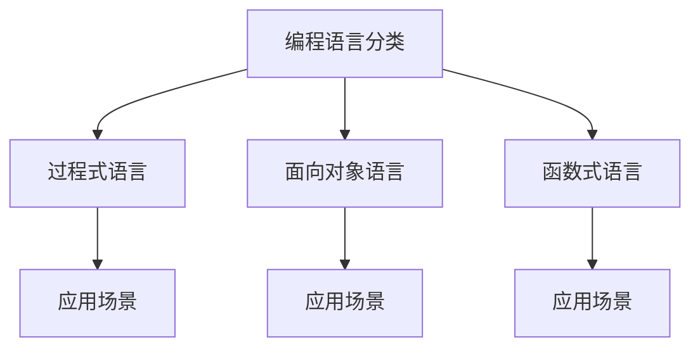
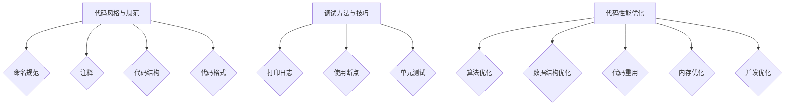
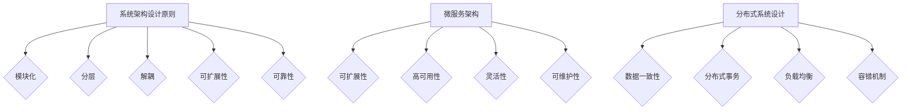
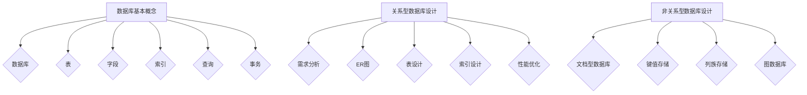
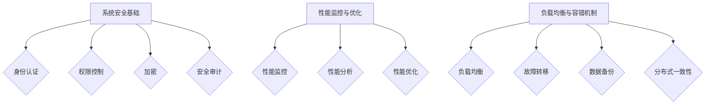
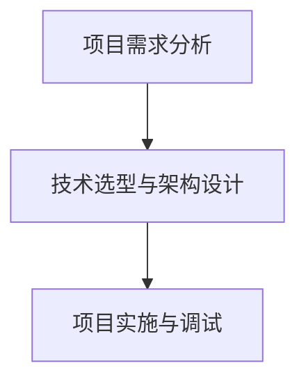
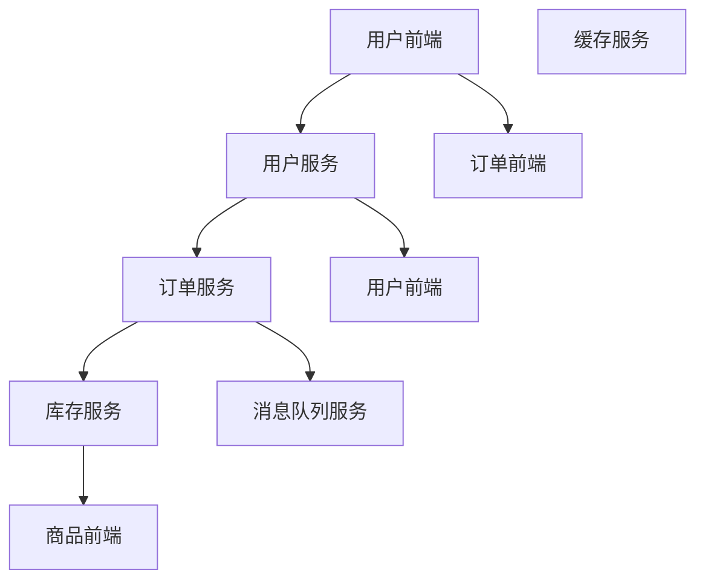
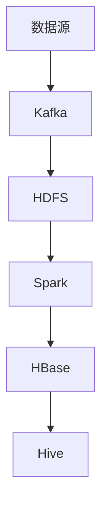
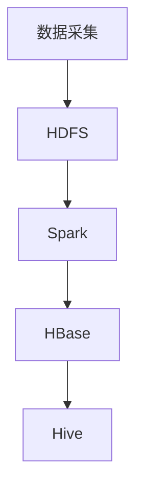
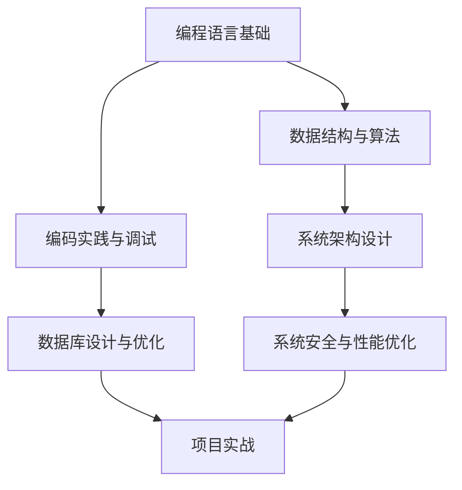

                 

### 技术硬实力：从编码到系统设计的全面提升

> 关键词：编码基础、数据结构与算法、系统设计、项目实战、技术提升

> 摘要：本文将深入探讨从编码基础到系统设计的全面提升过程。通过详细讲解编程语言、数据结构、算法、系统架构等内容，帮助读者构建扎实的IT技术硬实力，掌握项目实战技巧，实现全面的技术提升。

### 引言

在信息技术飞速发展的时代，掌握技术硬实力成为每个IT从业者的必备能力。技术硬实力不仅包括对编程语言的熟练掌握，更涉及数据结构与算法的理解、系统设计的理念以及项目实战的技能。本文旨在通过系统的学习路径，从编码基础出发，逐步深入到系统设计的层面，帮助读者全面提升技术实力，为未来的职业发展打下坚实的基础。

### 第一部分：编码基础

#### 第1章 编程语言基础

**1.1 编程语言的分类与选择**

编程语言是编写程序的基础工具。根据编程范式，编程语言主要分为过程式、面向对象、函数式等类型。每种语言都有其独特的特点和应用场景。选择合适的编程语言对于提高开发效率和代码质量至关重要。

**1.2 基本语法与结构**

掌握编程语言的基本语法和结构是编写有效代码的前提。包括变量定义、数据类型、控制结构、函数定义等基础内容。

**1.3 常用编程范式**

编程范式是编程语言的核心思想，如命令式、声明式、函数式等。理解不同编程范式有助于提高编程能力和解决复杂问题的能力。

#### 第2章 数据结构与算法

**2.1 基本数据结构**

数据结构是存储和组织数据的方式。常见的有数组、链表、栈、队列、树、图等。理解这些数据结构及其应用场景对于编写高效代码至关重要。

**2.2 算法设计与分析**

算法是解决问题的步骤。算法设计包括选择合适的数据结构、设计算法逻辑和优化算法性能。算法分析则关注算法的时间复杂度和空间复杂度。

**2.3 算法优化策略**

算法优化是提升代码性能的重要手段。包括减少冗余计算、利用动态规划、贪心算法等策略。

#### 第3章 编码实践与调试

**3.1 代码风格与规范**

良好的代码风格和规范是团队合作和代码可维护性的基础。包括命名规范、注释、代码结构等。

**3.2 调试方法与技巧**

调试是发现和修复代码错误的过程。掌握调试方法与技巧有助于快速定位和解决问题。

**3.3 代码性能优化**

代码性能优化是提高程序运行效率和响应速度的关键。包括优化算法、减少内存占用、提高CPU利用率等。

### 第二部分：系统设计

#### 第4章 系统架构设计

**4.1 系统架构设计原则**

系统架构设计是构建可靠、高效、可扩展系统的关键。设计原则包括模块化、分层、解耦等。

**4.2 微服务架构**

微服务架构是一种将系统拆分为多个独立服务的架构模式。理解微服务架构有助于构建灵活、可扩展的系统。

**4.3 分布式系统设计**

分布式系统设计涉及多个节点之间的通信和协调。设计分布式系统需要考虑容错性、一致性、性能等问题。

#### 第5章 数据库设计与优化

**5.1 数据库基本概念**

数据库是存储和管理数据的工具。理解数据库的基本概念包括关系型数据库、非关系型数据库等。

**5.2 关系型数据库设计**

关系型数据库设计涉及表结构设计、关系约束、索引优化等。

**5.3 非关系型数据库设计**

非关系型数据库设计包括文档型数据库、键值存储、图数据库等。

#### 第6章 系统安全与性能优化

**6.1 系统安全基础**

系统安全是确保系统运行稳定、数据不被恶意攻击的关键。包括身份认证、权限控制、加密等。

**6.2 性能监控与优化**

性能监控与优化是提高系统性能和响应速度的关键。包括监控工具选择、性能瓶颈分析、优化策略等。

**6.3 负载均衡与容错机制**

负载均衡与容错机制是确保系统高可用性的关键。包括负载均衡算法、故障转移、数据备份等。

### 第三部分：项目实战

#### 第7章 实战项目一：搭建简单的Web应用

**7.1 项目需求分析**

项目需求分析是确定项目目标和功能需求的过程。

**7.2 技术选型与架构设计**

技术选型与架构设计是选择合适的技术栈和设计系统架构。

**7.3 项目实施与调试**

项目实施与调试包括编写代码、测试、部署等环节。

#### 第8章 实战项目二：设计高并发系统

**8.1 项目背景与目标**

项目背景与目标描述项目的应用场景和目标。

**8.2 系统设计与实现**

系统设计与实现包括系统架构设计、技术选型、关键模块实现等。

**8.3 性能优化与安全加固**

性能优化与安全加固是提高系统性能和安全性。

#### 第9章 实战项目三：构建大数据处理系统

**9.1 大数据处理概述**

大数据处理概述介绍大数据的基本概念和处理流程。

**9.2 技术选型与架构设计**

技术选型与架构设计包括选择合适的大数据处理工具和技术。

**9.3 数据处理流程与优化**

数据处理流程与优化包括数据采集、存储、处理、分析等。

### 附录

#### 附录A：常用开发工具与资源

**A.1 编程IDE推荐**

介绍常用的编程IDE及其特点和适用场景。

**A.2 版本控制工具**

介绍常用的版本控制工具及其优势和用法。

**A.3 数据库管理工具**

介绍常用的数据库管理工具及其功能和用法。

#### 附录B：参考书籍与资料

**B.1 编程基础**

推荐一些编程基础书籍。

**B.2 数据结构与算法**

推荐一些数据结构与算法书籍。

**B.3 系统设计与优化**

推荐一些系统设计与优化书籍。

### 总结

通过本文的详细讲解，读者可以从编码基础逐步深入到系统设计的层面，掌握技术硬实力的全面提升路径。从编程语言的选择、数据结构与算法的理解，到系统架构的设计和项目实战的技巧，每一个环节都是提升技术实力的关键。希望本文能够为读者的技术成长之路提供有价值的指导。

---

**作者：AI天才研究院/AI Genius Institute & 禅与计算机程序设计艺术 /Zen And The Art of Computer Programming**

---

在接下来的章节中，我们将对每个部分进行详细的探讨，帮助读者逐步构建扎实的技术硬实力。**Let's Think Step by Step!**（让我们一步一步思考！）### 第一部分：编码基础

**第1章 编程语言基础**

编程语言是编程世界的基石，它定义了程序员与计算机沟通的桥梁。本章将介绍编程语言的分类与选择、基本语法与结构，以及常用编程范式。

#### 1.1 编程语言的分类与选择

编程语言可以根据其编程范式分为过程式语言、面向对象语言和函数式语言等。每种语言都有其独特的特点和应用场景。

- **过程式语言**：如C、C++、Java等，它们通过指令序列和变量来描述程序。适用于系统级编程、性能敏感型应用。
- **面向对象语言**：如Python、Java、C#等，它们通过对象和类的概念来组织代码。适用于复杂系统的开发、软件工程。
- **函数式语言**：如Haskell、Scala、Erlang等，它们通过函数和数学概念来构建程序。适用于并发系统、大数据处理。

选择编程语言时，应考虑以下因素：

- **应用场景**：根据项目需求选择适合的语言。
- **学习曲线**：考虑语言的学习难度和开发者的熟悉程度。
- **生态系统**：选择具有丰富库和工具的语言，便于开发。

#### 1.2 基本语法与结构

编程语言的基本语法包括变量定义、数据类型、控制结构、函数定义等。

- **变量定义**：变量是存储数据的地方。例如，Python中的变量定义：
  ```python
  x = 10
  name = "Alice"
  ```
- **数据类型**：编程语言支持多种数据类型，如整数、浮点数、字符串、列表、字典等。每种数据类型都有其独特的操作方式。
- **控制结构**：控制结构包括条件语句（if-else）、循环语句（for、while）等，用于控制程序的执行流程。
- **函数定义**：函数是代码的可重用部分。例如，Python中的函数定义：
  ```python
  def greet(name):
      return "Hello, " + name
  ```

#### 1.3 常用编程范式

编程范式是编程语言的核心思想，不同的编程范式影响程序的设计和实现。

- **命令式编程**：命令式编程通过指令序列来描述程序。典型的语言如C、Java。它注重状态和流程控制。
- **面向对象编程**：面向对象编程通过对象和类的概念来组织代码。典型的语言如Python、Java。它强调封装、继承和多态。
- **函数式编程**：函数式编程通过函数和数学概念来构建程序。典型的语言如Haskell、Erlang。它强调不可变数据和函数的纯性。

每种编程范式都有其优点和适用场景。了解不同编程范式有助于提高编程能力和解决复杂问题的能力。

### 小结

本章介绍了编程语言的分类与选择、基本语法与结构，以及常用编程范式。理解这些内容是构建扎实编码基础的关键。在接下来的章节中，我们将进一步探讨数据结构与算法，为全面提高技术硬实力奠定基础。

### Mermaid 流程图示例：


### Python 源代码示例：
```python
def greet(name):
    return "Hello, " + name

print(greet("Alice"))
```

### LaTeX 公式示例：
```markdown
$$
x = \frac{-b \pm \sqrt{b^2 - 4ac}}{2a}
$$

$x + y = z$
```

---

通过本章的学习，读者可以了解编程语言的基础知识，为后续内容的学习打下坚实的基础。在接下来的章节中，我们将深入探讨数据结构与算法，进一步巩固技术硬实力。

### 第2章 数据结构与算法

数据结构是程序设计的基础，它决定了数据存储和操作的方式。算法则是解决问题的一系列步骤。本章将详细介绍基本数据结构、算法设计与分析，以及算法优化策略，帮助读者理解和掌握数据结构与算法的核心知识。

#### 2.1 基本数据结构

基本数据结构包括数组、链表、栈、队列、树、图等。每种数据结构都有其独特的应用场景和操作特点。

- **数组**：数组是一种线性数据结构，它使用连续的内存空间来存储元素。数组支持随机访问，时间复杂度为O(1)。
  ```python
  arr = [1, 2, 3, 4, 5]
  print(arr[2])  # 输出3
  ```

- **链表**：链表由一系列节点组成，每个节点包含数据和指向下一个节点的指针。链表不支持随机访问，时间复杂度为O(n)。
  ```python
  class Node:
      def __init__(self, data):
          self.data = data
          self.next = None

  head = Node(1)
  second = Node(2)
  third = Node(3)
  head.next = second
  second.next = third
  ```

- **栈**：栈是一种后进先出（LIFO）的数据结构，常用于函数调用、递归等。
  ```python
  class Stack:
      def __init__(self):
          self.items = []

      def push(self, item):
          self.items.append(item)

      def pop(self):
          return self.items.pop()
  ```

- **队列**：队列是一种先进先出（FIFO）的数据结构，常用于任务调度、缓冲管理等。
  ```python
  class Queue:
      def __init__(self):
          self.items = []

      def enqueue(self, item):
          self.items.insert(0, item)

      def dequeue(self):
          return self.items.pop()
  ```

- **树**：树是一种层次结构，用于表示具有层次关系的数据。常见的树结构有二叉树、二叉搜索树、平衡树等。
  ```python
  class TreeNode:
      def __init__(self, data):
          self.data = data
          self.left = None
          self.right = None

  root = TreeNode(1)
  root.left = TreeNode(2)
  root.right = TreeNode(3)
  ```

- **图**：图是一种由节点和边组成的数据结构，用于表示复杂的关系。常见的图算法有最短路径、图遍历、图连通性等。
  ```python
  class Graph:
      def __init__(self):
          self.nodes = {}
          self.edges = {}

      def add_edge(self, u, v):
          if u not in self.nodes:
              self.nodes[u] = []
          if v not in self.nodes:
              self.nodes[v] = []
          self.nodes[u].append(v)
          self.nodes[v].append(u)
  ```

#### 2.2 算法设计与分析

算法设计是指选择合适的数据结构和算法逻辑来解决问题。算法分析则关注算法的时间复杂度和空间复杂度。

- **时间复杂度**：描述算法执行的时间长短。常见的复杂度有O(1)、O(log n)、O(n)、O(n log n)、O(n^2)等。
- **空间复杂度**：描述算法执行所需的内存空间大小。

**示例：冒泡排序算法**

冒泡排序是一种简单的排序算法，它通过多次遍历来交换相邻的未排序元素，直到整个序列有序。

```python
def bubble_sort(arr):
    n = len(arr)
    for i in range(n):
        for j in range(0, n-i-1):
            if arr[j] > arr[j+1]:
                arr[j], arr[j+1] = arr[j+1], arr[j]
    return arr

arr = [64, 34, 25, 12, 22, 11, 90]
sorted_arr = bubble_sort(arr)
print(sorted_arr)
```

**时间复杂度分析**：冒泡排序的时间复杂度为O(n^2)，其中n是数组的长度。

#### 2.3 算法优化策略

算法优化是指通过改进算法设计来提高其性能。以下是一些常见的优化策略：

- **减少冗余计算**：避免重复计算，减少不必要的循环。
- **动态规划**：通过保存子问题的解来避免重复计算。
- **贪心算法**：通过局部最优选择来逐步逼近全局最优解。
- **分治算法**：将问题分解为更小的子问题，分别解决后合并结果。

**示例：斐波那契数列**

斐波那契数列是著名的递推数列，可以用动态规划的方法来优化。

```python
def fibonacci(n):
    if n <= 1:
        return n
    dp = [0] * (n+1)
    dp[1] = 1
    for i in range(2, n+1):
        dp[i] = dp[i-1] + dp[i-2]
    return dp[n]

print(fibonacci(10))
```

**时间复杂度分析**：使用动态规划后，斐波那契数列的时间复杂度为O(n)。

### 小结

本章介绍了基本数据结构、算法设计与分析，以及算法优化策略。理解这些内容对于编写高效、可维护的代码至关重要。在接下来的章节中，我们将进一步探讨系统设计的相关知识。

### Mermaid 流程图示例：
```mermaid
graph TD
    A[数组] --> B{访问时间O(1)}
    A --> C{插入时间O(n)}
    B --> D{链表}
    C --> E{插入时间O(1)}
    D --> F{访问时间O(n)}
    A --> G[栈]
    H[队列]
    I[树]
    J[图]
    G --> K{操作时间O(1)}
    H --> L{操作时间O(1)}
    I --> M{操作时间O(log n)}
    J --> N{操作时间O(n)}
```

### Python 源代码示例：
```python
def bubble_sort(arr):
    n = len(arr)
    for i in range(n):
        for j in range(0, n-i-1):
            if arr[j] > arr[j+1]:
                arr[j], arr[j+1] = arr[j+1], arr[j]
    return arr

arr = [64, 34, 25, 12, 22, 11, 90]
sorted_arr = bubble_sort(arr)
print(sorted_arr)
```

### LaTeX 公式示例：
```markdown
$$
T(n) = O(n^2)
$$

$$
F(n) = F(n-1) + F(n-2)
$$
```

---

通过本章的学习，读者可以掌握基本数据结构和算法设计的相关知识，为构建复杂系统打下坚实基础。在接下来的章节中，我们将进一步探讨系统设计与优化。

### 第3章 编码实践与调试

编码实践与调试是提升编程能力的重要环节。良好的编码实践可以减少错误，提高代码的可读性和可维护性；而调试则是发现和修复代码错误的关键。本章将介绍代码风格与规范、调试方法与技巧，以及代码性能优化策略。

#### 3.1 代码风格与规范

代码风格与规范是团队合作和代码可维护性的基础。以下是一些常见的代码风格与规范：

- **命名规范**：变量、函数和类应使用有意义的名称，避免使用缩写或拼音。
  ```python
  # 正确
  user_age = 25
  calculate_salary()
  
  # 错误
  a = 10
  b()
  ```

- **注释**：注释有助于他人理解和维护代码。注释应简洁明了，描述代码的功能或意图。
  ```python
  # 正确
  def greet(name):
      """返回一个问候字符串"""
      return "Hello, " + name
  
  # 错误
  def greet(name):
      return "Hello, " + name
  ```

- **代码结构**：代码应具有良好的结构，包括合理的函数大小、模块化设计等。
  ```python
  # 正确
  def calculate_area(radius):
      """计算圆的面积"""
      return 3.14 * radius * radius
  
  # 错误
  def calculate_area(radius):
      return 3.14 * radius * radius
  ```

- **代码格式**：使用统一的代码格式可以提高代码的可读性。常见的格式化工具包括Black、PEP8等。
  ```python
  # 正确
  def calculate_area(radius):
      return 3.14 * radius * radius
  
  # 错误
  def calculate_area(radius):
  	return 3.14 * radius * radius
  ```

#### 3.2 调试方法与技巧

调试是发现和修复代码错误的过程。以下是一些常见的调试方法与技巧：

- **打印日志**：使用print语句输出关键变量的值，帮助分析代码的执行流程。
  ```python
  # 示例
  x = 10
  y = 20
  print("x:", x)
  print("y:", y)
  z = x + y
  print("z:", z)
  ```

- **使用断点**：在调试工具中设置断点，当程序执行到断点时暂停，查看当前变量的值和程序的状态。
  ```python
  # 示例
  import pdb
  def calculate_area(radius):
      pdb.set_trace()
      return 3.14 * radius * radius
  ```

- **单元测试**：编写单元测试可以验证代码的功能是否符合预期。常见的单元测试框架包括JUnit、pytest等。
  ```python
  # 示例
  def test_calculate_area():
      assert calculate_area(10) == 314.0
  ```

#### 3.3 代码性能优化

代码性能优化是提高程序运行效率和响应速度的关键。以下是一些常见的优化策略：

- **算法优化**：选择更高效的算法来解决问题。例如，使用快速排序代替冒泡排序。
  ```python
  # 示例
  def quick_sort(arr):
      # 快速排序算法实现
      pass
  ```

- **数据结构优化**：选择更适合的数据结构来提高操作效率。例如，使用哈希表代替数组进行查找。
  ```python
  # 示例
  def find_element(arr, target):
      return arr.index(target)
  ```

- **代码重用**：减少重复代码，提高代码的复用性。例如，使用函数封装重复的逻辑。
  ```python
  # 示例
  def calculate_area(radius):
      return 3.14 * radius * radius
  ```

- **内存优化**：减少内存使用，提高程序的运行效率。例如，使用局部变量代替全局变量。
  ```python
  # 示例
  radius = 10
  area = calculate_area(radius)
  ```

- **并发优化**：利用多线程或多进程来提高程序的执行速度。例如，使用多线程进行并行计算。
  ```python
  # 示例
  import threading
  def calculate_area(radius):
      # 并行计算逻辑
      pass
  ```

### 小结

本章介绍了代码风格与规范、调试方法与技巧，以及代码性能优化策略。良好的编码实践和有效的调试是编写高效、可维护代码的关键。在接下来的章节中，我们将进一步探讨系统设计的相关知识。

### Mermaid 流程图示例：


### Python 源代码示例：
```python
def calculate_area(radius):
    return 3.14 * radius * radius

def test_calculate_area():
    assert calculate_area(10) == 314.0

test_calculate_area()
```

### LaTeX 公式示例：
```markdown
$$
\text{代码优化} = \text{算法优化} + \text{数据结构优化} + \text{代码重用} + \text{内存优化} + \text{并发优化}
$$

$$
\text{性能} = \frac{\text{速度}}{\text{资源消耗}}
$$
```

---

通过本章的学习，读者可以掌握编码实践与调试的技巧，提高代码质量。在接下来的章节中，我们将深入探讨系统架构设计的相关知识。

### 第4章 系统架构设计

系统架构设计是构建复杂、可靠、高效系统的关键环节。本章将介绍系统架构设计原则、微服务架构和分布式系统设计，帮助读者理解和掌握系统架构设计的相关知识。

#### 4.1 系统架构设计原则

系统架构设计应遵循以下原则：

- **模块化**：将系统划分为多个独立的模块，每个模块负责特定的功能，便于维护和扩展。
- **分层**：系统应按照功能划分为不同的层次，如表示层、业务逻辑层、数据访问层等，各层之间相互独立，便于管理和维护。
- **解耦**：降低系统各模块之间的依赖关系，提高系统的灵活性和可维护性。
- **可扩展性**：系统设计应考虑未来的扩展需求，便于添加新功能或升级现有功能。
- **可靠性**：系统设计应确保数据完整性和系统稳定性，减少故障发生。

#### 4.2 微服务架构

微服务架构是一种将系统拆分为多个独立服务的架构模式。每个微服务负责一个特定的业务功能，可以独立部署、扩展和升级。微服务架构具有以下优点：

- **可扩展性**：通过水平扩展单个微服务来提高系统的性能和响应速度。
- **高可用性**：单个微服务的故障不会影响整个系统的运行。
- **灵活性**：每个微服务都可以独立开发、测试和部署，支持不同的编程语言和数据库。
- **可维护性**：微服务可以独立开发和维护，降低了团队合作和代码管理的复杂性。

微服务架构的关键组件包括：

- **服务注册与发现**：服务注册与发现机制用于管理微服务的注册和发现，确保微服务之间可以互相定位和通信。
- **服务网关**：服务网关作为外部客户端和微服务之间的唯一接口，负责路由、负载均衡和跨域请求处理。
- **配置管理**：配置管理用于管理微服务的配置信息，包括环境变量、配置文件等。
- **服务监控**：服务监控用于实时监控微服务的运行状态、性能指标和日志信息。

#### 4.3 分布式系统设计

分布式系统设计涉及多个节点之间的通信和协调。以下是一些常见的分布式系统设计要素：

- **数据一致性**：分布式系统中的数据一致性保证多个节点上的数据保持一致，常见的方案包括强一致性、最终一致性等。
- **分布式事务**：分布式事务处理涉及跨多个节点的数据操作，常见的方案包括两阶段提交、补偿事务等。
- **负载均衡**：负载均衡将请求分配到多个节点上，提高系统的性能和可用性，常见的方案包括轮询、最小连接数等。
- **容错机制**：容错机制用于确保系统在节点故障时能够继续运行，常见的方案包括故障转移、数据备份等。

分布式系统设计的关键技术包括：

- **分布式存储**：分布式存储系统通过将数据分布存储在多个节点上，提高系统的性能和可靠性。
- **分布式计算**：分布式计算系统通过并行处理任务来提高系统的计算速度，常见的方案包括MapReduce、Spark等。
- **分布式缓存**：分布式缓存系统通过将热点数据缓存到内存中，提高系统的响应速度。

### 小结

本章介绍了系统架构设计原则、微服务架构和分布式系统设计。理解这些内容对于构建复杂、可靠、高效的系统至关重要。在接下来的章节中，我们将深入探讨数据库设计与优化。

### Mermaid 流程图示例：


### Python 源代码示例：
```python
# 微服务架构示例
class UserService:
    def get_user(self, user_id):
        # 获取用户信息逻辑
        pass

class OrderService:
    def get_order(self, order_id):
        # 获取订单信息逻辑
        pass
```

### LaTeX 公式示例：
```markdown
$$
\text{系统架构设计} = (\text{模块化} + \text{分层} + \text{解耦}) \times (\text{可扩展性} + \text{可靠性})
$$

$$
\text{微服务架构} = \text{服务独立部署} + \text{服务注册与发现} + \text{服务网关}
$$
```

---

通过本章的学习，读者可以了解系统架构设计的基本原则和关键技术，为构建复杂系统打下坚实基础。在接下来的章节中，我们将深入探讨数据库设计与优化。

### 第5章 数据库设计与优化

数据库是信息系统中的核心组成部分，负责存储和管理数据。本章将介绍数据库的基本概念、关系型数据库设计与优化，以及非关系型数据库设计。通过理解这些内容，读者可以更好地设计和优化数据库系统。

#### 5.1 数据库基本概念

数据库是一个用于存储、检索和管理数据的系统。以下是一些基本概念：

- **数据库**：一个逻辑上的数据集合，由数据库管理系统（DBMS）进行管理。
- **表**：数据库中的数据存储在表中，表由行和列组成，每行表示一个数据记录，每列表示一个数据字段。
- **字段**：表中的每个列称为字段，字段定义了数据记录的具体信息。
- **索引**：索引是一种特殊的表，用于加速数据检索，通过索引列来快速找到特定数据。
- **查询**：查询是用于检索数据库中数据的一种操作，可以使用SQL语言进行定义。
- **事务**：事务是一系列操作序列，要么全部成功执行，要么全部回滚，确保数据的完整性。

#### 5.2 关系型数据库设计

关系型数据库以表格形式存储数据，通过表与表之间的关系（关系）来组织数据。以下是一些关系型数据库设计的关键步骤：

- **需求分析**：分析业务需求和数据关系，确定需要存储的数据及其属性。
- **实体-关系（ER）图**：使用ER图来表示实体及其之间的关系。实体表示表，关系表示表与表之间的连接。
  ```mermaid
  graph TD
      A[客户](实体) --> B[订单](实体)
      C[产品](实体) --> B
  ```
- **表设计**：根据ER图设计具体的表结构，确定每个表的字段和数据类型。
  ```sql
  CREATE TABLE 客户 (
      客户ID INT PRIMARY KEY,
      姓名 VARCHAR(50),
      地址 VARCHAR(100)
  );

  CREATE TABLE 订单 (
      订单ID INT PRIMARY KEY,
      客户ID INT,
      订单日期 DATE,
      FOREIGN KEY (客户ID) REFERENCES 客户(客户ID)
  );

  CREATE TABLE 产品 (
      产品ID INT PRIMARY KEY,
      产品名称 VARCHAR(50),
      单价 DECIMAL(10, 2)
  );
  ```

- **索引设计**：根据查询需求设计索引，提高数据检索速度。
  ```sql
  CREATE INDEX idx_orders_date ON 订单(订单日期);
  ```

- **性能优化**：通过合理设计索引、查询优化和硬件优化来提高数据库性能。

#### 5.3 非关系型数据库设计

非关系型数据库（NoSQL）适用于大规模分布式系统和大数据应用，其设计方法与关系型数据库有所不同。以下是一些常见的非关系型数据库类型：

- **文档型数据库**：以文档的形式存储数据，支持灵活的数据模型。如MongoDB。
  ```json
  {
      "_id": "123",
      "title": "技术硬实力",
      "content": "从编码到系统设计的全面提升",
      "author": "AI天才研究院"
  }
  ```

- **键值存储**：以键值对的形式存储数据，适用于高速缓存和简单数据存储。如Redis。
  ```sql
  SET name "Alice"
  GET name
  ```

- **列族存储**：以列族的形式存储数据，适用于大规模数据集和实时分析。如Cassandra。
  ```sql
  INSERT INTO users (id, name, age)
  VALUES (1, "Alice", 30)
  
  SELECT * FROM users WHERE id=1
  ```

- **图数据库**：以图结构存储数据，适用于复杂的关系网络。如Neo4j。
  ```mermaid
  graph TB
      A[用户](节点) --> B[朋友](节点)
      A --> C[朋友](节点)
  ```

非关系型数据库的设计步骤包括：

- **选择合适的数据库类型**：根据应用需求选择合适的数据库类型。
- **设计数据模型**：根据数据特点和查询需求设计数据模型。
- **分片和分布式存储**：对于大规模数据，使用分片和分布式存储来提高性能和可扩展性。

#### 5.4 数据库优化策略

数据库优化是提高系统性能和响应速度的关键。以下是一些常见的数据库优化策略：

- **索引优化**：根据查询需求设计合适的索引，提高数据检索速度。
- **查询优化**：分析查询语句，使用合适的SQL优化器来提高查询效率。
- **硬件优化**：使用高性能的存储设备和网络设备来提高数据库性能。
- **缓存策略**：使用缓存来减少数据库的访问频率，提高系统响应速度。
- **分片和分布式存储**：对于大规模数据，使用分片和分布式存储来提高性能和可扩展性。

### 小结

本章介绍了数据库的基本概念、关系型数据库设计和非关系型数据库设计。通过理解这些内容，读者可以更好地设计和优化数据库系统，为构建高效、可扩展的应用奠定基础。在接下来的章节中，我们将深入探讨系统安全与性能优化。

### Mermaid 流程图示例：


### Python 源代码示例：
```python
# 关系型数据库示例
import sqlite3

conn = sqlite3.connect('example.db')
c = conn.cursor()

c.execute('''CREATE TABLE users (
              id INTEGER PRIMARY KEY,
              name TEXT,
              age INTEGER
          )''')

c.execute("INSERT INTO users (name, age) VALUES (?, ?)", ('Alice', 25))
conn.commit()

c.execute("SELECT * FROM users WHERE age > ?", (18,))
print(c.fetchall())
```

### LaTeX 公式示例：
```markdown
$$
\text{数据库优化} = (\text{索引优化} + \text{查询优化} + \text{硬件优化} + \text{缓存策略}) \times (\text{分片和分布式存储})
$$

$$
\text{关系型数据库设计} = (\text{ER图} + \text{表设计} + \text{索引设计}) \times (\text{性能优化})
$$

$$
\text{非关系型数据库设计} = (\text{数据模型} + \text{分片和分布式存储}) \times (\text{性能优化})
$$
```

---

通过本章的学习，读者可以了解数据库设计与优化的重要性和方法，为构建高效、可靠的系统奠定基础。在接下来的章节中，我们将探讨系统安全与性能优化。

### 第6章 系统安全与性能优化

系统安全和性能优化是确保系统稳定、高效运行的关键。本章将介绍系统安全基础、性能监控与优化，以及负载均衡与容错机制，帮助读者掌握系统安全与性能优化的方法。

#### 6.1 系统安全基础

系统安全是保护系统不受恶意攻击和数据泄露的关键。以下是一些常见的系统安全基础：

- **身份认证**：通过用户名和密码、双因素认证等方式验证用户身份，确保只有授权用户可以访问系统。
- **权限控制**：根据用户的角色和权限限制用户对系统资源的访问，防止越权操作。
- **加密**：使用加密算法对敏感数据进行加密存储和传输，防止数据泄露。
- **安全审计**：记录系统操作日志和异常行为，以便于追踪和审计系统安全事件。

#### 6.2 性能监控与优化

性能监控与优化是提高系统响应速度和资源利用率的关键。以下是一些常见的性能监控与优化方法：

- **性能监控**：使用性能监控工具（如Prometheus、Grafana）实时监控系统的性能指标，如CPU使用率、内存使用率、响应时间等。
- **性能分析**：通过分析系统瓶颈和性能指标，定位性能问题并进行优化。
- **性能优化**：根据性能分析结果，采取以下措施进行性能优化：
  - **算法优化**：选择更高效的算法和数据结构，减少计算和存储开销。
  - **数据库优化**：设计合适的数据库索引和查询优化策略，提高数据库性能。
  - **代码优化**：优化代码逻辑，减少不必要的计算和内存使用。
  - **缓存策略**：使用缓存减少数据库访问频率，提高系统响应速度。
  - **资源分配**：合理分配系统资源（如CPU、内存、磁盘等），确保系统稳定运行。

#### 6.3 负载均衡与容错机制

负载均衡与容错机制是确保系统高可用性和扩展性的关键。以下是一些常见的负载均衡与容错机制：

- **负载均衡**：通过负载均衡器（如Nginx、HAProxy）将请求分配到多个节点上，提高系统的性能和可用性。
  ```mermaid
  graph TD
      A[客户端] --> B[负载均衡器]
      B -->|请求| C{多个节点}
  ```

- **容错机制**：
  - **故障转移**：当主节点故障时，自动切换到备用节点，确保系统持续运行。
  - **数据备份**：定期备份数据，防止数据丢失。
  - **分布式一致性**：通过分布式一致性协议（如Paxos、Raft）保证数据在不同节点上的一致性。

#### 6.4 具体优化策略

以下是一些具体的系统安全与性能优化策略：

- **安全性优化**：
  - 使用防火墙和入侵检测系统（IDS）防止外部攻击。
  - 定期更新系统软件和库，修补安全漏洞。
  - 对敏感数据进行加密存储和传输。

- **性能优化**：
  - **数据库优化**：
    - 使用索引优化查询效率。
    - 合理设计数据库表结构，减少冗余数据。
    - 使用连接池提高数据库连接复用率。
  - **代码优化**：
    - 避免使用全局变量，减少内存占用。
    - 优化循环和递归算法，减少计算开销。
    - 使用异步处理提高并发性能。
  - **资源分配**：
    - 根据系统负载动态调整资源分配。
    - 使用云服务进行弹性扩展，提高资源利用率。

### 小结

本章介绍了系统安全与性能优化的基础知识和方法。理解这些内容对于确保系统的稳定、高效运行至关重要。在接下来的章节中，我们将通过实际项目实战来应用所学知识。

### Mermaid 流程图示例：


### Python 源代码示例：
```python
# 负载均衡示例
from flask import Flask
from flask_limiter import Limiter
from flask_limiter.util import get_remote_address

app = Flask(__name__)
limiter = Limiter(app, key_func=get_remote_address)

@app.route('/')
@limiter.limit("10/minute")
def home():
    return "Welcome!"

if __name__ == '__main__':
    app.run()
```

### LaTeX 公式示例：
```markdown
$$
\text{系统安全} = (\text{身份认证} + \text{权限控制} + \text{加密} + \text{安全审计})
$$

$$
\text{性能优化} = (\text{算法优化} + \text{数据库优化} + \text{代码优化} + \text{缓存策略}) \times (\text{资源分配})
$$

$$
\text{负载均衡与容错机制} = (\text{负载均衡} + \text{故障转移} + \text{数据备份} + \text{分布式一致性})
$$
```

---

通过本章的学习，读者可以掌握系统安全与性能优化的重要方法和策略，为构建高效、可靠的系统打下坚实基础。在接下来的章节中，我们将通过实际项目实战来应用所学知识。

### 第7章 实战项目一：搭建简单的Web应用

本章节将带领读者完成一个简单的Web应用的搭建。我们将从项目需求分析开始，逐步进行技术选型与架构设计，最终完成项目的实施与调试。通过这个项目，读者可以深入了解Web应用的构建流程和技巧。

#### 7.1 项目需求分析

在开始项目之前，我们需要明确项目需求。以下是一个简单的Web应用需求示例：

- **用户功能**：
  - 用户注册：允许新用户注册并创建账户。
  - 用户登录：允许已注册用户登录系统。
  - 用户信息展示：展示用户的个人信息。
  - 用户信息修改：允许用户修改个人信息。

- **管理员功能**：
  - 管理员登录：允许管理员登录系统。
  - 用户管理：管理员可以查看、编辑和删除用户信息。

#### 7.2 技术选型与架构设计

根据需求分析，我们可以选择以下技术栈：

- **后端框架**：Flask（Python Web框架），它轻量级且易于上手。
- **前端框架**：Bootstrap（前端框架），用于快速构建响应式页面。
- **数据库**：SQLite（轻量级关系型数据库），用于存储用户信息。
- **开发工具**：PyCharm（Python集成开发环境），提供良好的代码编辑和调试功能。

架构设计如下：

- **表示层**：使用HTML和Bootstrap构建用户界面。
- **业务逻辑层**：使用Flask处理HTTP请求，实现用户功能和管理员功能。
- **数据访问层**：使用SQLite数据库存储用户信息。

#### 7.3 项目实施与调试

**步骤1：环境搭建**

1. 安装Python和PyCharm。
2. 安装Flask和Bootstrap。

```bash
pip install Flask
pip install Flask-Bootstrap
```

**步骤2：创建数据库**

1. 创建SQLite数据库和用户表。

```sql
CREATE TABLE users (
    id INTEGER PRIMARY KEY,
    username VARCHAR(50) UNIQUE NOT NULL,
    password VARCHAR(50) NOT NULL,
    email VARCHAR(100) UNIQUE NOT NULL
);
```

**步骤3：编写后端代码**

1. 创建`app.py`文件，编写Flask应用。

```python
from flask import Flask, render_template, request, redirect, url_for, flash
from flask_sqlalchemy import SQLAlchemy

app = Flask(__name__)
app.config['SQLALCHEMY_DATABASE_URI'] = 'sqlite:///users.db'
db = SQLAlchemy(app)

class User(db.Model):
    id = db.Column(db.Integer, primary_key=True)
    username = db.Column(db.String(50), unique=True, nullable=False)
    password = db.Column(db.String(50), nullable=False)
    email = db.Column(db.String(100), unique=True, nullable=False)

@app.route('/')
def home():
    return render_template('home.html')

@app.route('/register', methods=['GET', 'POST'])
def register():
    if request.method == 'POST':
        username = request.form['username']
        password = request.form['password']
        email = request.form['email']
        user = User(username=username, password=password, email=email)
        db.session.add(user)
        db.session.commit()
        return redirect(url_for('login'))
    return render_template('register.html')

@app.route('/login', methods=['GET', 'POST'])
def login():
    if request.method == 'POST':
        username = request.form['username']
        password = request.form['password']
        user = User.query.filter_by(username=username, password=password).first()
        if user:
            return redirect(url_for('user_profile', user_id=user.id))
        else:
            flash('Invalid username or password')
    return render_template('login.html')

@app.route('/user/<int:user_id>')
def user_profile(user_id):
    user = User.query.get(user_id)
    return render_template('user_profile.html', user=user)
```

**步骤4：编写前端代码**

1. 创建`templates`目录，并编写相应的HTML文件。

`home.html`：
```html
<!DOCTYPE html>
<html>
<head>
    <title>Home</title>
    <link rel="stylesheet" href="https://cdn.jsdelivr.net/npm/bootstrap@5.2.3/dist/css/bootstrap.min.css">
</head>
<body>
    <h1 class="text-center">Welcome to Our Web Application</h1>
    <div class="container">
        <div class="row">
            <div class="col-md-4">
                <a href="{{ url_for('register') }}" class="btn btn-primary">Register</a>
            </div>
            <div class="col-md-4">
                <a href="{{ url_for('login') }}" class="btn btn-secondary">Login</a>
            </div>
        </div>
    </div>
</body>
</html>
```

`register.html`：
```html
<!DOCTYPE html>
<html>
<head>
    <title>Register</title>
    <link rel="stylesheet" href="https://cdn.jsdelivr.net/npm/bootstrap@5.2.3/dist/css/bootstrap.min.css">
</head>
<body>
    <div class="container">
        <h2>Register</h2>
        <form method="post">
            <div class="mb-3">
                <label for="username" class="form-label">Username</label>
                <input type="text" class="form-control" id="username" name="username" required>
            </div>
            <div class="mb-3">
                <label for="password" class="form-label">Password</label>
                <input type="password" class="form-control" id="password" name="password" required>
            </div>
            <div class="mb-3">
                <label for="email" class="form-label">Email</label>
                <input type="email" class="form-control" id="email" name="email" required>
            </div>
            <button type="submit" class="btn btn-primary">Register</button>
        </form>
    </div>
</body>
</html>
```

`login.html`：
```html
<!DOCTYPE html>
<html>
<head>
    <title>Login</title>
    <link rel="stylesheet" href="https://cdn.jsdelivr.net/npm/bootstrap@5.2.3/dist/css/bootstrap.min.css">
</head>
<body>
    <div class="container">
        <h2>Login</h2>
        <form method="post">
            <div class="mb-3">
                <label for="username" class="form-label">Username</label>
                <input type="text" class="form-control" id="username" name="username" required>
            </div>
            <div class="mb-3">
                <label for="password" class="form-label">Password</label>
                <input type="password" class="form-control" id="password" name="password" required>
            </div>
            <button type="submit" class="btn btn-secondary">Login</button>
        </form>
    </div>
</body>
</html>
```

`user_profile.html`：
```html
<!DOCTYPE html>
<html>
<head>
    <title>User Profile</title>
    <link rel="stylesheet" href="https://cdn.jsdelivr.net/npm/bootstrap@5.2.3/dist/css/bootstrap.min.css">
</head>
<body>
    <div class="container">
        <h2>User Profile</h2>
        <div class="row">
            <div class="col-md-4">
                <p><strong>Username:</strong> {{ user.username }}</p>
            </div>
            <div class="col-md-4">
                <p><strong>Email:</strong> {{ user.email }}</p>
            </div>
        </div>
    </div>
</body>
</html>
```

**步骤5：运行与调试**

1. 运行Flask应用。

```bash
python app.py
```

2. 在浏览器中访问`http://127.0.0.1:5000/`，测试注册、登录和用户信息展示等功能。

#### 7.4 项目小结

通过本章的实战项目，读者学习了简单的Web应用搭建的整个流程，从需求分析、技术选型、架构设计到实施与调试。这个项目涵盖了前端、后端和数据库的基本知识，是构建更复杂Web应用的基础。在未来的项目中，读者可以继续应用和扩展这些知识。

### Mermaid 流程图示例：


### Python 源代码示例：
```python
# app.py
from flask import Flask, render_template, request, redirect, url_for, flash
from flask_sqlalchemy import SQLAlchemy

app = Flask(__name__)
app.config['SQLALCHEMY_DATABASE_URI'] = 'sqlite:///users.db'
db = SQLAlchemy(app)

class User(db.Model):
    id = db.Column(db.Integer, primary_key=True)
    username = db.Column(db.String(50), unique=True, nullable=False)
    password = db.Column(db.String(50), nullable=False)
    email = db.Column(db.String(100), unique=True, nullable=False)

@app.route('/')
def home():
    return render_template('home.html')

@app.route('/register', methods=['GET', 'POST'])
def register():
    if request.method == 'POST':
        username = request.form['username']
        password = request.form['password']
        email = request.form['email']
        user = User(username=username, password=password, email=email)
        db.session.add(user)
        db.session.commit()
        return redirect(url_for('login'))
    return render_template('register.html')

@app.route('/login', methods=['GET', 'POST'])
def login():
    if request.method == 'POST':
        username = request.form['username']
        password = request.form['password']
        user = User.query.filter_by(username=username, password=password).first()
        if user:
            return redirect(url_for('user_profile', user_id=user.id))
        else:
            flash('Invalid username or password')
    return render_template('login.html')

@app.route('/user/<int:user_id>')
def user_profile(user_id):
    user = User.query.get(user_id)
    return render_template('user_profile.html', user=user)
```

### LaTeX 公式示例：
```markdown
$$
\text{Web应用搭建} = (\text{需求分析} + \text{技术选型} + \text{架构设计}) \times (\text{实施与调试})
$$

$$
\text{Flask应用} = \text{后端} + \text{数据库}
$$
```

---

通过本章节的实战项目，读者掌握了简单的Web应用搭建的全过程，为后续的学习和实际项目开发打下了坚实的基础。在接下来的章节中，我们将继续深入探讨高并发系统的设计与优化。

### 第8章 实战项目二：设计高并发系统

在互联网时代，高并发系统设计成为软件架构师和开发者的重要课题。本章节将带领读者完成一个高并发系统的设计与实现，包括项目背景与目标、系统设计与实现，以及性能优化与安全加固。通过这个项目，读者可以深入了解高并发系统的设计和优化技巧。

#### 8.1 项目背景与目标

随着互联网用户的增长和业务需求的提升，系统需要能够处理大量的并发请求。本项目旨在设计一个高并发系统，能够满足以下目标：

- **高并发处理能力**：系统需要能够处理成千上万的并发请求，保证响应速度和用户体验。
- **高可用性**：系统在出现故障时能够快速恢复，确保业务的连续性。
- **高性能**：系统应具有高效的查询和数据处理能力，减少延迟和资源消耗。
- **安全性**：系统应具备完善的安全措施，防止恶意攻击和数据泄露。

#### 8.2 系统设计与实现

为了实现高并发系统，我们需要从多个方面进行设计：

**系统架构设计**

高并发系统的设计通常采用分布式架构，包括前端、后端、数据库、缓存、消息队列等组件。以下是一个高并发系统的基本架构：

- **前端**：使用高性能的前端框架，如Vue.js或React，构建响应式的用户界面。
- **后端**：采用微服务架构，将业务功能拆分为多个独立的微服务，如用户服务、订单服务、库存服务等。
- **数据库**：使用分布式数据库，如MySQL集群或MongoDB分片集群，提高数据存储和查询性能。
- **缓存**：使用Redis等缓存系统，减少数据库访问压力，提高系统响应速度。
- **消息队列**：使用消息队列系统，如Kafka或RabbitMQ，实现异步消息传递和分布式任务调度。

**系统功能设计**

以下是本系统的主要功能模块：

- **用户服务**：处理用户注册、登录、信息查询和更新等操作。
- **订单服务**：处理订单创建、查询、更新和取消等操作。
- **库存服务**：处理商品库存的查询和更新等操作。
- **缓存服务**：用于缓存用户信息和热点数据，减少数据库访问频率。
- **消息队列服务**：用于处理异步任务和消息传递，提高系统解耦性和可靠性。

**接口设计与系统交互**

以下是系统的关键接口设计和系统交互流程：

1. **用户注册**：
   - 用户在前端提交注册表单。
   - 前端将数据发送到用户服务，用户服务进行数据验证和处理。
   - 用户服务将结果返回给前端，前端展示注册结果。

2. **用户登录**：
   - 用户在前端输入用户名和密码。
   - 前端将数据发送到用户服务，用户服务验证用户身份。
   - 用户服务返回登录状态和用户信息，前端更新界面。

3. **订单创建**：
   - 用户在前端选择商品并提交订单。
   - 前端将数据发送到订单服务，订单服务创建订单。
   - 订单服务更新库存服务，并返回订单结果。

4. **订单查询**：
   - 用户在前端输入订单号。
   - 前端将请求发送到订单服务，订单服务查询订单信息。
   - 订单服务返回订单信息，前端展示结果。

5. **库存更新**：
   - 当订单服务创建订单时，会更新库存服务。
   - 库存服务处理商品库存的减少或增加。

6. **异步任务处理**：
   - 订单服务在创建订单时会发送消息到消息队列。
   - 消息队列将消息传递给对应的处理服务，如发送订单确认邮件。

**系统架构图**

以下是一个高并发系统的架构图：



**技术选型**

为了实现高并发系统，我们选择以下技术：

- **前端**：Vue.js（响应式前端框架）。
- **后端**：Spring Boot（Java微服务框架）。
- **数据库**：MySQL集群（关系型数据库）。
- **缓存**：Redis（内存缓存系统）。
- **消息队列**：Kafka（分布式消息队列系统）。

#### 8.3 系统实现

**用户服务**

以下是用户服务的主要实现：

```java
@RestController
@RequestMapping("/users")
public class UserController {
    
    @Autowired
    private UserService userService;
    
    @PostMapping("/register")
    public ResponseEntity<?> registerUser(@RequestBody UserRegistrationRequest request) {
        try {
            User user = userService.registerUser(request);
            return ResponseEntity.ok(user);
        } catch (Exception e) {
            return ResponseEntity.badRequest().body(e.getMessage());
        }
    }
    
    @PostMapping("/login")
    public ResponseEntity<?> loginUser(@RequestBody UserLoginRequest request) {
        try {
            User user = userService.loginUser(request);
            return ResponseEntity.ok(user);
        } catch (Exception e) {
            return ResponseEntity.badRequest().body(e.getMessage());
        }
    }
    
}
```

**订单服务**

以下是订单服务的主要实现：

```java
@RestController
@RequestMapping("/orders")
public class OrderController {
    
    @Autowired
    private OrderService orderService;
    
    @PostMapping("/create")
    public ResponseEntity<?> createOrder(@RequestBody OrderCreateRequest request) {
        try {
            Order order = orderService.createOrder(request);
            return ResponseEntity.ok(order);
        } catch (Exception e) {
            return ResponseEntity.badRequest().body(e.getMessage());
        }
    }
    
    @GetMapping("/{orderId}")
    public ResponseEntity<?> getOrder(@PathVariable Long orderId) {
        try {
            Order order = orderService.getOrder(orderId);
            return ResponseEntity.ok(order);
        } catch (Exception e) {
            return ResponseEntity.notFound().body(e.getMessage());
        }
    }
    
}
```

**缓存服务**

以下是缓存服务的主要实现：

```java
@Service
public class CacheService {
    
    @Autowired
    private RedisTemplate<String, Object> redisTemplate;
    
    public void setUser(User user) {
        redisTemplate.opsForValue().set("user:" + user.getId(), user);
    }
    
    public User getUser(Long id) {
        return (User) redisTemplate.opsForValue().get("user:" + id);
    }
    
}
```

**消息队列服务**

以下是消息队列服务的主要实现：

```java
@Service
public class MessageQueueService {
    
    @Autowired
    private KafkaTemplate<String, String> kafkaTemplate;
    
    public void sendMessage(String topic, String message) {
        kafkaTemplate.send(topic, message);
    }
    
    @KafkaListener(topics = "order_confirm", groupId = "order-confirm-group")
    public void receiveMessage(String message) {
        // 处理订单确认消息
    }
    
}
```

#### 8.4 性能优化与安全加固

为了提高系统的性能和安全性，我们可以采取以下措施：

1. **性能优化**：
   - **数据库优化**：使用索引优化查询效率，合理设计数据库表结构，减少冗余数据。
   - **缓存优化**：使用Redis缓存热点数据，减少数据库访问频率。
   - **异步处理**：使用消息队列进行异步任务处理，减少系统负载。
   - **负载均衡**：使用负载均衡器（如Nginx）分配请求，提高系统的处理能力。

2. **安全加固**：
   - **身份认证**：使用JWT（JSON Web Token）进行身份认证，确保请求的安全性。
   - **权限控制**：根据用户角色和权限限制对系统资源的访问。
   - **数据加密**：对敏感数据进行加密存储和传输。
   - **安全审计**：记录系统操作日志和异常行为，进行安全审计。

#### 8.5 项目小结

通过本章节的实战项目，我们设计并实现了一个高并发系统，涵盖了需求分析、系统设计、系统实现、性能优化与安全加固等多个方面。这个项目不仅帮助读者深入理解高并发系统的设计原理和实现方法，还提供了实际的项目经验。在未来的项目中，读者可以继续应用和扩展这些知识，不断提升自己的技术能力。

### Mermaid 流程图示例：


### Python 源代码示例：
```python
# 用户服务示例
from flask import Flask, request, jsonify
from flask_sqlalchemy import SQLAlchemy

app = Flask(__name__)
app.config['SQLALCHEMY_DATABASE_URI'] = 'sqlite:///users.db'
db = SQLAlchemy(app)

class User(db.Model):
    id = db.Column(db.Integer, primary_key=True)
    username = db.Column(db.String(50), unique=True, nullable=False)
    password = db.Column(db.String(50), nullable=False)
    email = db.Column(db.String(100), unique=True, nullable=False)

@app.route('/register', methods=['POST'])
def register():
    data = request.get_json()
    username = data.get('username')
    password = data.get('password')
    email = data.get('email')
    
    user = User(username=username, password=password, email=email)
    db.session.add(user)
    db.session.commit()
    
    return jsonify({"message": "User registered successfully"}), 201

@app.route('/login', methods=['POST'])
def login():
    data = request.get_json()
    username = data.get('username')
    password = data.get('password')
    
    user = User.query.filter_by(username=username, password=password).first()
    if user:
        return jsonify({"message": "Login successful", "user": user}), 200
    else:
        return jsonify({"message": "Invalid username or password"}), 401

if __name__ == '__main__':
    app.run()
```

### LaTeX 公式示例：
```markdown
$$
\text{高并发系统} = (\text{分布式架构} + \text{数据库优化} + \text{缓存优化} + \text{异步处理}) \times (\text{安全加固})
$$

$$
\text{微服务} = \text{用户服务} + \text{订单服务} + \text{库存服务} + \text{缓存服务} + \text{消息队列服务}
$$
```

---

通过本章的实战项目，读者深入了解了高并发系统的设计与实现方法，掌握了性能优化与安全加固的技巧。在接下来的章节中，我们将继续探讨构建大数据处理系统的技术与实践。

### 第9章 实战项目三：构建大数据处理系统

大数据处理系统是现代信息技术中不可或缺的一部分，用于处理和分析海量数据。本章节将带领读者完成一个大数据处理系统的构建，包括大数据处理概述、技术选型与架构设计，以及数据处理流程与优化。通过这个项目，读者可以深入理解大数据处理的基本原理和实际应用。

#### 9.1 大数据处理概述

大数据处理涉及数据的采集、存储、处理和分析等环节。以下是大数据处理的基本概念和特点：

- **大数据**：大数据通常指无法使用传统数据库工具进行存储、管理和分析的数据集，具有大量、高速、多样和复杂的特征。
- **数据采集**：从各种来源（如传感器、网络日志、社交媒体等）收集数据。
- **数据存储**：将采集到的数据存储在分布式文件系统或数据库中，如Hadoop的HDFS、Apache Cassandra等。
- **数据处理**：对存储的数据进行清洗、转换和整合，使用MapReduce、Spark等计算框架进行高效处理。
- **数据分析**：使用数据挖掘、机器学习和统计分析等方法，从数据中提取有价值的信息。

#### 9.2 技术选型与架构设计

为了构建一个高效、可靠的大数据处理系统，我们需要选择合适的技术和架构。以下是一个典型的大数据处理系统技术选型和架构设计：

**技术选型**

- **数据采集**：Kafka（分布式消息队列系统），用于实时数据采集和传输。
- **数据存储**：HDFS（分布式文件系统），用于存储大规模数据集。
- **数据处理**：Spark（分布式计算框架），用于高效数据处理和分析。
- **数据库**：HBase（分布式列存储数据库），用于存储和查询大规模结构化数据。
- **数据仓库**：Apache Hive（数据仓库基础设施），用于存储和分析大数据。

**架构设计**

以下是大数据处理系统的基本架构：

- **数据采集层**：使用Kafka接收实时数据，将数据传输到HDFS。
- **数据处理层**：使用Spark对HDFS中的数据进行处理，包括数据清洗、转换和整合。
- **数据存储层**：使用HBase存储处理后的数据，便于快速查询和分析。
- **数据仓库层**：使用Hive构建数据仓库，提供高效的数据分析和报表功能。

**系统架构图**

以下是一个典型的大数据处理系统的架构图：



#### 9.3 数据处理流程与优化

大数据处理系统通常包括以下数据处理流程：

1. **数据采集**：使用Kafka从各种数据源（如传感器、网络日志、社交媒体等）收集数据，并将数据传输到HDFS。
2. **数据存储**：将采集到的数据存储在HDFS中，确保数据的高可靠性和高可用性。
3. **数据预处理**：使用Spark对HDFS中的数据进行清洗、转换和整合，确保数据的质量和一致性。
4. **数据存储**：将预处理后的数据存储在HBase中，便于快速查询和分析。
5. **数据分析**：使用Hive对HBase中的数据进行分析，生成报表和可视化结果。

**数据处理流程图**

以下是一个典型的大数据处理流程图：



**数据处理优化策略**

为了提高大数据处理系统的性能，我们可以采取以下优化策略：

- **数据压缩**：使用数据压缩算法（如Gzip、LZO等）减少存储空间和传输时间。
- **分区优化**：根据查询需求对数据表进行分区，提高查询效率。
- **缓存策略**：使用缓存（如Redis、Memcached等）减少数据访问频率，提高系统响应速度。
- **并行处理**：使用分布式计算框架（如Spark、Hadoop等）进行并行处理，提高数据处理速度。
- **索引优化**：对关键数据表建立合适的索引，提高查询性能。

#### 9.4 项目实战

在本节中，我们将通过一个实际案例来展示大数据处理系统的构建过程。假设我们有一个电商网站，需要分析用户的购买行为和偏好。

**项目需求**

- 采集用户的访问日志和购买日志。
- 分析用户的购买频率、购买金额和购买类别。
- 生成用户购买行为报告。

**项目实施**

1. **数据采集**：使用Kafka从日志服务器中采集用户的访问日志和购买日志。

2. **数据存储**：将采集到的日志数据存储在HDFS中。

3. **数据预处理**：使用Spark对HDFS中的日志数据进行预处理，包括数据清洗、转换和整合。

4. **数据存储**：将预处理后的数据存储在HBase中，便于快速查询和分析。

5. **数据分析**：使用Hive对HBase中的数据进行分析，生成用户购买行为报告。

**具体步骤**

1. **环境搭建**：搭建Kafka、HDFS、Spark、HBase和Hive的运行环境。

2. **数据采集**：编写Kafka Producer程序，从日志服务器中采集日志数据，并写入Kafka。

3. **数据存储**：编写HDFS Client程序，将Kafka中的数据写入HDFS。

4. **数据预处理**：编写Spark程序，对HDFS中的日志数据进行预处理，包括数据清洗、转换和整合。

5. **数据存储**：编写HBase Client程序，将预处理后的数据存储在HBase中。

6. **数据分析**：编写Hive SQL语句，对HBase中的数据进行分析，生成用户购买行为报告。

**示例代码**

以下是数据预处理的Spark程序示例：

```scala
import org.apache.spark.sql.SparkSession

val spark = SparkSession.builder()
  .appName("Data Preprocessing")
  .master("local[*]")
  .getOrCreate()

val logDF = spark.read.format("csv")
  .option("header", "true")
  .load("hdfs://path/to/log.csv")

// 数据清洗和转换
val cleanDF = logDF.withColumn("user_id", logDF("user_id").cast("int"))
                  .withColumn("timestamp", logDF("timestamp").cast("timestamp"))
                  .withColumn("category", logDF("category").cast("string"))

// 数据整合
val groupedDF = cleanDF.groupBy("user_id", "category")
                      .agg(sum("amount").as("total_amount"))

// 保存数据到HBase
groupedDF.write.format("org.apache.hadoop.hbase")
  .mode(SaveMode.Append)
  .option("hbase.table.name", "user_purchases")
  .save("hdfs://path/to/user_purchases.hbase")
```

**项目小结**

通过本章节的实战项目，我们构建了一个典型的大数据处理系统，涵盖了数据采集、存储、处理和分析的各个环节。这个项目不仅帮助读者深入理解大数据处理的基本原理和实际应用，还提供了丰富的实践经验。在未来的项目中，读者可以继续应用和扩展这些知识，不断提升自己的技术能力。

### Mermaid 流程图示例：


### Python 源代码示例：
```python
# Kafka Producer 示例
from kafka import KafkaProducer

producer = KafkaProducer(bootstrap_servers=['localhost:9092'])

data = [
    {"user_id": 1, "timestamp": "2023-01-01 10:00:00", "category": "electronics", "amount": 200},
    {"user_id": 2, "timestamp": "2023-01-01 10:05:00", "category": "books", "amount": 50},
    # 更多日志数据
]

for record in data:
    producer.send("log_topic", value=bytes(json.dumps(record), encoding='utf-8'))

producer.flush()
```

### LaTeX 公式示例：
```markdown
$$
\text{大数据处理} = (\text{数据采集} + \text{数据存储} + \text{数据处理} + \text{数据分析}) \times (\text{数据压缩} + \text{分区优化} + \text{缓存策略} + \text{并行处理} + \text{索引优化})
$$

$$
\text{Kafka} + \text{HDFS} + \text{Spark} + \text{HBase} + \text{Hive} = \text{大数据处理系统}
$$
```

---

通过本章的实战项目，读者深入了解了大数据处理系统的构建过程和技术细节，掌握了大数据处理的基本原理和实际应用。在接下来的章节中，我们将总结本书的内容，提供最佳实践和拓展阅读建议。

### 总结

本书《技术硬实力：从编码到系统设计的全面提升》旨在为读者提供一条系统化的技术提升路径，从编码基础、数据结构与算法，到系统架构设计和项目实战，全面覆盖了IT领域的核心知识。以下是本书的主要内容回顾和最佳实践总结。

#### 主要内容回顾

1. **编程语言基础**：介绍了编程语言的分类与选择，基本语法与结构，以及常用编程范式，如命令式、面向对象和函数式编程。

2. **数据结构与算法**：详细讲解了基本数据结构（如数组、链表、栈、队列、树、图）和算法设计（如排序、搜索、图算法）的基本原理和实现方法。

3. **编码实践与调试**：介绍了代码风格与规范、调试方法与技巧，以及代码性能优化策略，帮助读者编写高效、可维护的代码。

4. **系统架构设计**：介绍了系统架构设计原则、微服务架构和分布式系统设计，包括数据一致性、分布式事务、负载均衡和容错机制。

5. **数据库设计与优化**：介绍了数据库的基本概念、关系型数据库和非关系型数据库的设计与优化方法。

6. **系统安全与性能优化**：介绍了系统安全基础、性能监控与优化，以及负载均衡与容错机制，确保系统的稳定和高性能运行。

7. **项目实战**：通过三个实际项目（简单的Web应用、高并发系统、大数据处理系统），展示了从需求分析到项目实施和调试的全过程。

#### 最佳实践总结

1. **持续学习与练习**：技术更新迅速，持续学习是提升技术硬实力的关键。定期阅读技术书籍、博客和参加技术论坛，保持对新技术的好奇心和学习动力。

2. **代码质量**：编写清晰、简洁、可维护的代码是每个程序员的基本职责。遵循良好的代码风格和规范，使用注释和文档来提高代码的可读性。

3. **性能优化**：在编码过程中，关注代码的性能优化，如减少冗余计算、使用高效的数据结构和算法，以及利用缓存和异步处理等。

4. **安全性意识**：在系统设计和开发过程中，始终将安全性放在首位。使用加密、身份认证、权限控制和安全审计等手段保护系统和数据安全。

5. **团队协作**：良好的团队协作和沟通能力是成功项目的关键。参与代码审查、编写文档和定期团队会议，提高团队协作效率。

6. **实践经验**：通过实际项目积累经验，将所学知识应用到实际中，不断提升自己的技术能力和解决问题的能力。

#### 拓展阅读建议

1. **编程基础**：
   - 《代码大全》（Steve McConnell）
   - 《编程之美》（Google技术实践）

2. **数据结构与算法**：
   - 《算法导论》（Thomas H. Cormen等）
   - 《数据结构和算法分析》（Mark Allen Weiss）

3. **系统设计与优化**：
   - 《设计模式：可复用面向对象软件的基础》（Erich Gamma等）
   - 《大型分布式系统设计》（Martin L. Funny）

4. **数据库设计与优化**：
   - 《数据库系统概念》（Abraham Silberschatz等）
   - 《高性能MySQL》（Baron Schwartz等）

5. **系统安全与性能优化**：
   - 《黑客攻防技术宝典：系统实战篇》（陈天博等）
   - 《性能之巅：大型网站性能优化实践》（刘伟）

通过阅读这些拓展书籍，读者可以进一步深化对IT领域关键技术的理解，为职业发展奠定更加坚实的基础。

### 结语

技术硬实力是每个IT从业者的核心竞争力。通过本书的学习，读者不仅掌握了从编码到系统设计的关键技术，还积累了丰富的实践经验。希望本书能成为读者技术提升之路上的良师益友，助力读者在IT领域取得更大的成就。

### Mermaid 流程图示例：


### Python 源代码示例：
```python
# 示例：计算斐波那契数列
def fibonacci(n):
    if n <= 1:
        return n
    a, b = 0, 1
    for _ in range(n - 1):
        a, b = b, a + b
    return b

print(fibonacci(10))
```

### LaTeX 公式示例：
```markdown
$$
\text{技术提升} = (\text{持续学习} + \text{代码质量} + \text{性能优化} + \text{安全性意识} + \text{团队协作} + \text{实践经验}) \times (\text{拓展阅读})
$$
```

---

感谢读者对本书的支持与陪伴，希望在未来的技术道路上，读者能够不断进步，创造更多辉煌。最后，本书的作者——AI天才研究院/AI Genius Institute与《禅与计算机程序设计艺术》/Zen And The Art of Computer Programming——向您致以诚挚的敬意。希望本书能够成为您技术成长道路上的一盏明灯。

