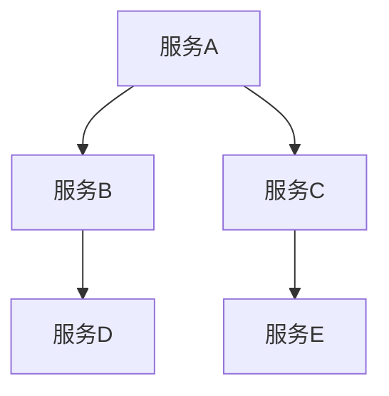

                 

### 引言

#### 1.1 书籍的目的与受众

《技术硬实力：打造卓越工程师的必备技能》旨在为广大技术从业者和渴望提升技术能力的工程师提供一本全面、系统、深入的技术指南。本书以全面提升工程师的技术素养为核心目标，旨在通过系统的学习和实践，帮助读者建立起扎实的技术基础，掌握高级技术，并在实践中灵活运用，解决实际问题。

本书适合以下几类读者：

1. **初学者**：对于刚刚步入IT行业的初学者来说，本书能够帮助其建立起系统性的技术知识框架，明确学习路径，少走弯路。
2. **工程师**：有多年工作经验的工程师可以通过本书巩固基础知识，学习先进的技术，提升解决问题的能力。
3. **技术经理**：技术经理可以通过本书了解当前技术发展趋势，帮助团队制定技术路线图，提升团队整体技术水平。

#### 1.2 技术硬实力的定义与重要性

“技术硬实力”是指工程师在实际工作中所需具备的扎实技术基础和高级技术能力。它不仅仅包括对基础知识的掌握，更涵盖了在实际项目中运用这些知识解决问题的能力。具体来说，技术硬实力包括以下几个方面：

1. **技术基础知识**：如计算机科学、数据结构与算法、操作系统、网络通信、数据库等。
2. **高级技术能力**：如容器与微服务、大数据处理、人工智能与机器学习等。
3. **实战经验**：通过实际项目积累的经验，能够将理论知识应用于实际问题的解决。

技术硬实力在工程师职业生涯中至关重要，它不仅是提升个人竞争力的关键，也是团队和技术项目成功的重要保障。具备扎实的技术硬实力，工程师能够：

- **高效解决问题**：面对复杂问题时，能够迅速找到解决方案，提升工作效率。
- **提升团队协作能力**：作为团队的核心成员，能够带领团队完成高质量的项目。
- **职业发展**：具备技术硬实力的工程师更容易获得职业晋升和更高的薪资待遇。

总之，技术硬实力是每一个卓越工程师的必备技能，是他们在快速变化的科技领域中立于不败之地的关键。接下来，本书将带领读者一步步深入了解这些核心技能，为打造卓越工程师打下坚实基础。

### 第一部分：技术基础

#### 第1章 计算机科学基础

#### 1.1 计算机硬件

计算机硬件是计算机系统的物理基础，包括CPU、存储设备和输入输出设备等。理解这些硬件的基本原理和功能是构建扎实技术基础的第一步。

##### 1.1.1 CPU架构

CPU（Central Processing Unit，中央处理单元）是计算机的核心部件，负责执行程序指令，进行数据运算和处理。CPU的架构直接影响到计算机的性能和效率。目前主流的CPU架构包括Intel的x86架构和ARM架构。

- **x86架构**：起源于8086处理器，逐渐发展成为PC市场的主导架构。x86架构支持复杂的指令集，具有良好的兼容性和扩展性。
- **ARM架构**：由ARM公司开发，广泛应用于移动设备、嵌入式系统等领域。ARM架构以低功耗、高性能著称，特别适合移动和嵌入式设备。

##### 1.1.2 存储设备

存储设备是计算机用来存储数据和程序的介质，包括硬盘（HDD）、固态硬盘（SSD）和内存（RAM）等。

- **硬盘（HDD）**：采用机械运动部件，存储容量大但读写速度较慢。适合存储大量不经常访问的数据。
- **固态硬盘（SSD）**：无机械运动部件，读写速度快，适合存储操作系统、应用程序和常用数据。
- **内存（RAM）**：用于临时存储正在执行的数据和程序代码，读写速度极快但容量有限。内存是CPU直接访问的数据存储区，直接影响计算机的运行速度。

##### 1.1.3 输入输出设备

输入输出设备是用户与计算机进行交互的界面，包括键盘、鼠标、显示器、打印机等。

- **键盘和鼠标**：是常见的输入设备，用于输入文本、命令和操作指令。
- **显示器**：是主要的输出设备，用于显示计算机处理后的数据和结果。
- **打印机**：用于将计算机数据输出到纸张等介质上。

#### 1.2 计算机软件

计算机软件是运行在硬件之上的程序集合，用于实现特定的功能。计算机软件可以分为系统软件和应用软件两大类。

##### 1.2.1 操作系统

操作系统（Operating System，OS）是计算机的核心软件，负责管理计算机硬件资源和应用程序的运行。常见的操作系统包括Windows、Linux和macOS等。

- **Windows**：由微软公司开发，广泛应用于PC和服务器。Windows以易用性和兼容性著称。
- **Linux**：开源操作系统，适用于服务器、工作站和嵌入式系统。Linux以稳定性和安全性著称。
- **macOS**：苹果公司开发的操作系统，主要用于macOS电脑。

##### 1.2.2 编程语言

编程语言是用于编写计算机程序的语法和规则集合。常见的编程语言包括C、Java、Python等。

- **C**：一种通用编程语言，具有良好的性能和灵活性，广泛应用于系统编程、嵌入式开发等领域。
- **Java**：一种面向对象的编程语言，跨平台性强，广泛应用于企业级应用、Web开发和移动应用。
- **Python**：一种易于学习和使用的编程语言，广泛应用于数据科学、机器学习和Web开发等领域。

##### 1.2.3 软件开发过程

软件开发过程是指从需求分析、设计、编码、测试到部署的一系列步骤。常见的软件开发过程模型包括瀑布模型、迭代模型和敏捷开发等。

- **瀑布模型**：是一种传统的软件开发过程模型，强调每个阶段完成后才能进入下一个阶段。
- **迭代模型**：通过多次迭代逐步完善软件，每次迭代都包括需求分析、设计、编码、测试等环节。
- **敏捷开发**：强调快速响应变化，通过短周期迭代和持续交付，提高软件开发效率和质量。

通过了解计算机硬件和软件的基本知识，我们可以更好地理解计算机系统的工作原理，为深入学习高级技术打下坚实基础。

#### 第2章 数据结构与算法

数据结构与算法是计算机科学中的核心概念，对于解决复杂问题至关重要。本章将介绍基本数据结构、算法分析以及算法优化方法。

##### 2.1 基础数据结构

基础数据结构包括数组、链表、栈和队列等。它们是构建更复杂数据结构的基础。

###### 2.1.1 数组

数组是一种线性数据结构，用于存储一系列元素。数组的特点是元素按照索引顺序存储，支持随机访问。数组的优点是查找和访问元素速度快，缺点是插入和删除操作较慢，因为需要移动其他元素。

```python
# Python示例：数组操作
arr = [1, 2, 3, 4, 5]
print(arr[2])  # 访问第三个元素
arr.append(6)  # 在数组末尾添加元素
```

###### 2.1.2 链表

链表是一种动态数据结构，通过节点（Node）来存储数据。每个节点包含数据部分和指向下一个节点的指针。链表支持高效的插入和删除操作，缺点是访问元素需要从头节点开始遍历。

```python
# Python示例：单链表
class Node:
    def __init__(self, data):
        self.data = data
        self.next = None

head = Node(1)
head.next = Node(2)
head.next.next = Node(3)
```

###### 2.1.3 栈与队列

栈（Stack）是一种后进先出（LIFO）的数据结构，适用于逆序处理数据。队列（Queue）是一种先进先出（FIFO）的数据结构，适用于处理按顺序处理的数据。

```python
# Python示例：栈和队列操作
class Stack:
    def __init__(self):
        self.items = []

    def push(self, item):
        self.items.append(item)

    def pop(self):
        return self.items.pop()

stack = Stack()
stack.push(1)
stack.push(2)
print(stack.pop())  # 输出 2

from collections import deque
queue = deque()
queue.append(1)
queue.append(2)
print(queue.popleft())  # 输出 1
```

##### 2.2 算法分析

算法分析是评估算法性能的重要方法，包括时间复杂度和空间复杂度。

###### 2.2.1 时间复杂度

时间复杂度表示算法执行时间随输入规模的增长速率。常见的复杂度表示包括O(1)、O(n)、O(n^2)等。

- **O(1)**：常数时间，不受输入规模影响。
- **O(n)**：线性时间，执行时间与输入规模线性相关。
- **O(n^2)**：平方时间，执行时间与输入规模的平方相关。

```python
# Python示例：时间复杂度分析
def linear_search(arr, x):
    for i in range(len(arr)):
        if arr[i] == x:
            return i
    return -1

# 时间复杂度：O(n)
```

###### 2.2.2 空间复杂度

空间复杂度表示算法所需额外存储空间随输入规模的增长速率。

```python
# Python示例：空间复杂度分析
def bubble_sort(arr):
    n = len(arr)
    for i in range(n):
        for j in range(0, n-i-1):
            if arr[j] > arr[j+1]:
                arr[j], arr[j+1] = arr[j+1], arr[j]
    return arr

# 空间复杂度：O(1)
```

##### 2.2.3 算法优化

算法优化是通过改进算法设计，提高算法性能的方法。常见的优化方法包括算法改进、数据结构和算法结合等。

- **算法改进**：通过改进算法思想，减少时间或空间复杂度。例如，使用快速排序代替冒泡排序。
- **数据结构和算法结合**：通过合理选择数据结构，提高算法效率。例如，使用哈希表进行快速查找。

通过本章的学习，读者可以掌握基础数据结构和算法分析方法，为解决实际问题打下坚实基础。

#### 第3章 操作系统原理

操作系统是计算机系统的核心软件，负责管理和协调计算机硬件资源和软件资源，确保计算机系统的高效稳定运行。本章将深入探讨操作系统的主要功能和工作原理，包括进程管理、内存管理和文件系统。

##### 3.1 进程管理

进程（Process）是计算机中的基本执行单元，代表了一个正在运行的程序。操作系统通过进程管理来控制进程的创建、执行、同步和终止。

###### 3.1.1 进程与线程

进程和线程是操作系统中的重要概念。

- **进程**：进程是资源分配的基本单位，包括程序代码、数据段、堆栈和进程控制块（PCB）等。每个进程都有独立的地址空间，进程间的通信开销较大。
- **线程**：线程是CPU调度和分派的基本单位，共享进程的地址空间和其他资源。线程间通信开销较小，但进程更安全、更易于管理。

###### 3.1.2 进程调度

进程调度是操作系统的重要功能，负责决定哪个进程将获得CPU资源。常见的进程调度算法包括：

- **先来先服务（FCFS）**：按照进程到达时间顺序调度，简单但可能导致吞吐量下降。
- **短作业优先（SJF）**：优先调度执行时间最短的进程，提高系统吞吐量但可能导致饥饿现象。
- **优先级调度**：根据进程的优先级进行调度，高优先级进程优先获得CPU资源。

###### 3.1.3 同步与互斥

同步和互斥是进程管理中的重要概念。

- **同步**：多个进程需要按照一定顺序执行，例如生产者消费者问题，生产者必须等待消费者取出数据后才能继续生产。
- **互斥**：多个进程需要共享某些资源，例如打印机，需要使用互斥锁（Mutex）来保证同一时间只有一个进程可以使用该资源。

##### 3.2 内存管理

内存管理是操作系统的重要功能，负责管理计算机的内存资源，确保程序的高效运行。

###### 3.2.1 地址映射

地址映射是将逻辑地址转换为物理地址的过程。操作系统通过页表（Page Table）实现地址映射。

- **分页**：将内存划分为固定大小的页面（Page），程序运行时将逻辑地址转换为物理地址。
- **分段**：将内存划分为大小可变的段（Segment），每个段对应程序的一部分。

###### 3.2.2 分区策略

分区策略是内存管理的一种方法，将内存划分为若干个连续的区域，每个区域分配给一个进程。

- **固定分区**：将内存划分为固定大小的区域，可能导致内存碎片。
- **动态分区**：根据进程大小动态分配内存，减少内存碎片，但可能导致外部碎片。

###### 3.2.3 页面替换算法

页面替换算法是在分页内存管理中，当内存满时如何选择页面进行替换。

- **先进先出（FIFO）**：替换最久未使用的页面。
- **最近最久未使用（LRU）**：替换最近一段时间内最久未被访问的页面。
- **最不经常使用（NFU）**：替换访问次数最少的页面。

##### 3.3 文件系统

文件系统是操作系统用于管理文件的机制，负责文件的创建、删除、读写和修改。

###### 3.3.1 文件概念

文件是存储在计算机中的数据集合，具有唯一的名称和位置。文件系统通过目录结构组织文件，便于管理和查找。

- **文件类型**：包括文本文件、二进制文件、可执行文件等。
- **文件属性**：包括文件大小、创建时间、修改时间、访问权限等。

###### 3.3.2 文件系统结构

文件系统结构包括目录结构、文件存储结构和文件控制块。

- **目录结构**：用于组织和管理文件，包括单级目录、多级目录和树形目录结构。
- **文件存储结构**：包括顺序存储、链式存储和索引存储。
- **文件控制块**：存储文件属性和文件操作信息，例如文件系统中的i节点。

###### 3.3.3 文件操作

文件操作包括文件的创建、打开、读取、写入、关闭和删除等。

- **文件创建**：创建一个新的文件并将其初始化。
- **文件打开**：打开一个已存在的文件，使其可以被读写。
- **文件读取**：从文件中读取数据。
- **文件写入**：向文件写入数据。
- **文件关闭**：关闭文件，释放相关资源。
- **文件删除**：删除文件，释放磁盘空间。

通过本章的学习，读者可以深入了解操作系统的核心功能和原理，为深入理解计算机系统打下坚实基础。

#### 第4章 网络通信原理

网络通信是现代计算机系统中不可或缺的一部分，它使得计算机之间能够相互通信和共享资源。本章将详细介绍网络通信的基本原理，包括网络协议、网络安全和网络编程。

##### 4.1 网络协议

网络协议是计算机网络中进行数据交换的规则和标准。常见的网络协议包括TCP/IP协议、HTTP/HTTPS协议和其他常见协议。

###### 4.1.1 TCP/IP协议

TCP/IP协议是互联网的核心协议，分为四个层次：链路层、互联网层、传输层和应用层。

- **链路层**：负责数据帧的传输和错误检测，包括以太网、Wi-Fi等。
- **互联网层**：负责数据包的传输和路由，包括IP协议、ICMP协议等。
- **传输层**：负责端到端的通信，包括TCP协议和UDP协议。
- **应用层**：负责应用程序的数据传输，包括HTTP、FTP、SMTP等。

###### 4.1.2 HTTP/HTTPS协议

HTTP（Hypertext Transfer Protocol，超文本传输协议）是Web服务器和客户端之间进行通信的基础协议。HTTPS（Hypertext Transfer Protocol Secure，安全超文本传输协议）是在HTTP基础上加入安全层的协议，通过SSL/TLS加密数据传输。

- **HTTP**：定义了Web客户端和服务器之间的通信格式和过程。
- **HTTPS**：在HTTP基础上增加了加密和认证机制，确保数据传输的安全性和完整性。

###### 4.1.3 其他常见协议

除了TCP/IP和HTTP/HTTPS，还有许多其他常见的网络协议，如FTP（File Transfer Protocol，文件传输协议）、SMTP（Simple Mail Transfer Protocol，简单邮件传输协议）、DNS（Domain Name System，域名系统）等。

- **FTP**：用于在计算机之间传输文件，支持上传和下载。
- **SMTP**：用于发送电子邮件，定义了邮件传输的规则和过程。
- **DNS**：用于将域名解析为IP地址，使网络用户能够通过易于记忆的域名访问网站。

##### 4.2 网络安全

网络安全是保护计算机网络和系统不受未经授权的访问、攻击和破坏的过程。网络安全包括加密算法、认证机制和攻击防护等方面。

###### 4.2.1 加密算法

加密算法是网络安全的核心技术，用于确保数据传输的安全性和隐私性。常见的加密算法包括对称加密和非对称加密。

- **对称加密**：加密和解密使用相同的密钥，如AES（Advanced Encryption Standard，高级加密标准）。
- **非对称加密**：加密和解密使用不同的密钥，如RSA（Rivest-Shamir-Adleman，一种非对称加密算法）。

###### 4.2.2 认证机制

认证机制用于验证用户或系统的真实性和权限，确保只有合法用户能够访问系统和资源。常见的认证机制包括密码认证、数字证书和单点登录（SSO）等。

- **密码认证**：用户通过输入密码进行身份验证。
- **数字证书**：通过证书机构颁发的证书验证用户或系统的身份。
- **单点登录（SSO）**：用户只需登录一次，即可访问多个系统或应用。

###### 4.2.3 攻击防护

攻击防护是网络安全的重要措施，用于防止各种网络攻击。常见的攻击防护方法包括防火墙、入侵检测系统和反病毒软件等。

- **防火墙**：用于监控和控制网络流量，防止未经授权的访问。
- **入侵检测系统（IDS）**：用于检测和响应网络攻击。
- **反病毒软件**：用于检测和清除恶意软件。

##### 4.3 网络编程

网络编程是开发网络应用程序的过程，包括Socket编程、多线程编程和网络应用开发。

###### 4.3.1 Socket编程

Socket编程是网络编程的基础，用于实现客户端和服务器之间的数据传输。

- **Socket**：是一种抽象层，用于表示网络通信的端点。
- **TCP Socket**：基于TCP协议，提供可靠的、面向连接的通信。
- **UDP Socket**：基于UDP协议，提供不可靠的、无连接的通信。

###### 4.3.2 多线程编程

多线程编程是提高网络应用程序性能的有效方法，通过同时处理多个请求来提高响应速度。

- **线程**：是操作系统能够进行运算调度的最小单位。
- **多线程**：在同一程序中有多个线程同时执行，实现并发操作。

###### 4.3.3 网络应用开发

网络应用开发是构建实际网络应用程序的过程，包括Web应用、移动应用和物联网应用等。

- **Web应用**：基于HTTP协议，通过浏览器访问的应用程序。
- **移动应用**：基于移动设备的应用程序，如iOS和Android应用。
- **物联网应用**：连接各种设备和系统，实现智能控制和数据采集。

通过本章的学习，读者可以掌握网络通信的基本原理和编程技术，为开发高效、安全的网络应用程序打下坚实基础。

#### 第5章 数据库技术

数据库技术是信息管理系统的核心组成部分，它通过高效、稳定地存储、查询和管理数据，支持各类业务应用。本章将深入探讨数据库技术的基础概念、SQL语言及其高级特性。

##### 5.1 数据库基础

数据库（Database）是一个按照数据结构来组织、存储和管理数据的系统。数据库技术的基础包括关系型数据库和非关系型数据库。

###### 5.1.1 关系型数据库

关系型数据库（Relational Database）是最为广泛使用的数据库类型，其核心概念是关系模型。关系模型由表（Table）组成，每个表包含若干列（Column）和行（Row），列表示属性，行表示记录。

- **表**：用于存储数据的结构，表中的每一行表示一个数据记录，每一列表示记录的一个属性。
- **SQL**：结构化查询语言（Structured Query Language），是用于管理关系型数据库的标准语言，包括数据定义语言（DDL）、数据操作语言（DML）、数据查询语言（DQL）和数据控制语言（DCL）。

###### 5.1.2 非关系型数据库

非关系型数据库（NoSQL Database）是近年来发展迅速的一种数据库类型，适用于处理大规模、分布式数据和多样的数据模型。

- **文档数据库**：以文档为单位存储数据，如MongoDB。
- **键值数据库**：以键值对为单位存储数据，如Redis。
- **图数据库**：以图结构存储数据，适用于社交网络、推荐系统等，如Neo4j。

###### 5.1.3 数据库设计

数据库设计是创建数据库的过程，包括概念设计、逻辑设计和物理设计。

- **概念设计**：通过E-R图（Entity-Relationship Diagram，实体关系图）描述系统的实体、属性和关系。
- **逻辑设计**：将概念模型转换为逻辑模型，如关系模型。
- **物理设计**：确定数据库在物理存储设备上的实现，包括数据存储结构、索引和分区等。

##### 5.2 SQL语言

SQL（Structured Query Language）是数据库查询和管理的标准语言，主要包括数据定义语言（DDL）、数据操作语言（DML）和数据查询语言（DQL）。

###### 5.2.1 数据定义语言

数据定义语言（Data Definition Language，DDL）用于创建和修改数据库结构。

- **创建数据库**：`CREATE DATABASE database_name;`
- **创建表**：`CREATE TABLE table_name (column1 datatype, column2 datatype, ...);`
- **修改表结构**：`ALTER TABLE table_name ADD|DROP|MODIFY column;`

###### 5.2.2 数据操作语言

数据操作语言（Data Manipulation Language，DML）用于操作数据库中的数据，包括插入、更新、删除和查询。

- **插入数据**：`INSERT INTO table_name (column1, column2, ...) VALUES (value1, value2, ...);`
- **更新数据**：`UPDATE table_name SET column1 = value1, column2 = value2 WHERE condition;`
- **删除数据**：`DELETE FROM table_name WHERE condition;`
- **查询数据**：`SELECT column1, column2, ... FROM table_name WHERE condition;`

###### 5.2.3 数据查询语言

数据查询语言（Data Query Language，DQL）主要用于查询数据库中的数据，包括SELECT查询、JOIN查询和子查询。

- **简单查询**：`SELECT column FROM table;`
- **多表查询**：`SELECT column FROM table1 JOIN table2 ON table1.id = table2.id;`
- **子查询**：`SELECT column FROM table WHERE condition IN (SELECT column FROM table);`

##### 5.3 数据库高级特性

数据库的高级特性包括事务管理、索引与性能优化和分布式数据库。

###### 5.3.1 事务管理

事务管理（Transaction Management）确保数据库操作的原子性、一致性、隔离性和持久性（ACID属性）。

- **原子性**：事务中的操作要么全部执行，要么全部不执行。
- **一致性**：事务执行前后，数据库状态保持一致。
- **隔离性**：事务间的操作互不干扰。
- **持久性**：事务一旦提交，其对数据库的修改就是永久性的。

###### 5.3.2 索引与性能优化

索引（Index）是数据库中用于加速查询的机制，通过索引关键字快速查找数据。

- **B-Tree索引**：适用于等值和范围查询。
- **哈希索引**：适用于精确匹配查询。
- **全文索引**：适用于全文搜索。

性能优化（Performance Optimization）包括查询优化、索引优化和数据库配置优化等。

- **查询优化**：通过分析查询执行计划，优化查询语句。
- **索引优化**：选择合适的索引，避免冗余索引。
- **数据库配置优化**：调整数据库参数，提高系统性能。

###### 5.3.3 分布式数据库

分布式数据库（Distributed Database）将数据存储在多个节点上，提供高可用性、高性能和可扩展性。

- **数据分片**：将数据分成多个片段，存储在多个节点上。
- **复制**：将数据复制到多个节点，提高数据可用性和可靠性。
- **一致性**：确保分布式数据库中的数据一致性。

通过本章的学习，读者可以掌握数据库技术的基础知识和高级特性，为开发高效、可靠的数据库应用打下坚实基础。

#### 第6章 软件开发方法

软件开发的本质是解决问题，而良好的开发方法能够帮助工程师更高效、更系统地完成软件开发任务。本章将探讨软件工程基础、面向对象编程、代码质量管理和性能优化等关键知识点。

##### 6.1 软件工程基础

软件工程（Software Engineering）是应用工程、科学和数学原理来设计、开发、测试和维护软件的学科。软件工程基础涵盖了软件开发生命周期（SDLC）、软件质量度量、软件测试等方面。

###### 6.1.1 软件开发生命周期

软件开发生命周期（Software Development Life Cycle，SDLC）是软件开发过程中的一系列阶段，包括计划、需求分析、设计、编码、测试、部署和维护。

- **计划**：确定项目的目标、范围、资源和时间表。
- **需求分析**：理解用户需求，明确软件功能和技术要求。
- **设计**：创建软件的系统架构和详细设计。
- **编码**：根据设计文档编写代码，实现软件功能。
- **测试**：验证软件是否符合需求，发现和修复缺陷。
- **部署**：将软件部署到生产环境，供用户使用。
- **维护**：确保软件在运行过程中持续稳定，及时修复问题。

###### 6.1.2 软件质量度量

软件质量度量是评估软件产品质量的过程，常用的质量度量指标包括功能性、可靠性、易用性、效率、可维护性和可移植性。

- **功能性**：软件是否按照需求完成所需功能。
- **可靠性**：软件在规定条件下运行是否稳定，故障率低。
- **易用性**：用户能否轻松使用软件。
- **效率**：软件运行速度是否满足要求。
- **可维护性**：软件是否易于修改和维护。
- **可移植性**：软件能否在不同平台和环境上运行。

###### 6.1.3 软件测试

软件测试（Software Testing）是确保软件质量的重要手段，通过不同类型的测试发现并修复缺陷。

- **单元测试**：针对单个模块或函数的测试，验证其功能正确性。
- **集成测试**：将多个模块集成在一起进行测试，验证模块间接口的正确性。
- **系统测试**：对整个软件系统的测试，验证系统功能是否符合需求。
- **验收测试**：用户或客户对软件的最终测试，确保软件满足用户需求。

##### 6.2 面向对象编程

面向对象编程（Object-Oriented Programming，OOP）是一种流行的编程范式，通过将数据和行为封装在对象中，实现代码的模块化和复用。

###### 6.2.1 类与对象

类（Class）是对象的模板，定义了对象的属性和方法。对象（Object）是类的实例，包含数据和行为。

- **类定义**：使用关键字`class`定义类，例如`class Person:`。
- **对象创建**：使用类名创建对象，例如`person = Person()`。

```python
class Person:
    def __init__(self, name, age):
        self.name = name
        self.age = age

    def introduce(self):
        print(f"Hello, my name is {self.name} and I am {self.age} years old.")

# 创建对象
person = Person("Alice", 30)
person.introduce()  # 输出 "Hello, my name is Alice and I am 30 years old."
```

###### 6.2.2 继承与多态

继承（Inheritance）是一种通过创建新的类（子类）从已有类（父类）继承属性和方法的方式，实现代码的复用。多态（Polymorphism）允许不同类的对象通过相同的方法名执行不同的操作。

- **继承**：使用关键字`class`定义子类，并使用`extends`关键字指定父类，例如`class Student(Person):`。
- **多态**：通过接口或基类的引用调用方法，实现动态绑定。

```python
class Student(Person):
    def __init__(self, name, age, school):
        super().__init__(name, age)
        self.school = school

    def introduce(self):
        print(f"Hello, my name is {self.name}, I am a student at {self.school}.")

# 多态示例
students = [Person("Alice", 30), Student("Bob", 25, "MIT")]
for student in students:
    student.introduce()
```

###### 6.2.3 设计模式

设计模式（Design Pattern）是解决软件设计问题的通用解决方案，可以提高代码的可读性、可维护性和复用性。常见的设计模式包括：

- **单例模式**：确保一个类只有一个实例，并提供一个访问它的全局点。
- **工厂模式**：定义一个创建对象的接口，让子类决定实例化哪个类。
- **观察者模式**：当一个对象的状态发生改变时，自动通知所有依赖于它的对象。

##### 6.3 代码质量管理

代码质量管理（Code Quality Management）是确保代码质量的一系列实践，包括代码审查、代码风格规范和代码性能优化。

###### 6.3.1 代码审查

代码审查（Code Review）是一种通过人工检查代码质量和安全性的方法，常见的代码审查工具包括GitLab、SonarQube等。

- **静态代码分析**：使用工具分析代码语法和结构，发现潜在的问题。
- **动态代码分析**：在代码运行过程中进行分析，发现运行时的问题。

###### 6.3.2 代码风格规范

代码风格规范（Code Style Guide）是确保代码一致性、可读性和可维护性的重要手段，常见的代码风格规范包括PEP 8（Python编码规范）、Google Java Style Guide等。

- **命名规范**：合理命名变量、函数和类，提高代码可读性。
- **缩进和空白**：遵循统一的缩进和空白规则，提高代码整洁度。

###### 6.3.3 代码性能优化

代码性能优化（Code Performance Optimization）是提高代码执行效率的一系列技术，包括算法优化、数据结构和并发编程等。

- **算法优化**：选择更高效的算法和数据结构，减少时间复杂度和空间复杂度。
- **数据结构优化**：使用合适的数据结构减少访问时间和存储空间。
- **并发编程**：使用多线程、异步编程等技术提高程序并行处理能力。

通过本章的学习，读者可以掌握软件工程的基础知识，掌握面向对象编程的核心概念，学会代码质量管理的方法和技巧，为高效、高质量的软件开发打下坚实基础。

#### 第7章 容器与微服务

容器与微服务是现代软件开发的重要技术，它们提高了软件的可移植性、可扩展性和可靠性。本章将详细介绍容器技术、微服务架构及其治理。

##### 7.1 容器技术

容器技术通过虚拟化技术提供轻量级的、独立的运行环境，使得应用程序可以在不同操作系统和硬件环境中一致运行。

###### 7.1.1 Docker原理

Docker是一种开源的应用容器引擎，通过将应用程序及其依赖项打包到一个可移植的容器中，实现环境一致性和快速部署。

- **容器化**：将应用程序及其运行环境打包成一个容器镜像（Container Image）。
- **容器引擎**：使用Docker Engine来管理和运行容器。
- **容器编排**：使用Docker Compose或Kubernetes等工具进行容器编排，实现多容器的复杂应用的自动化部署和管理。

###### 7.1.2 容器编排

容器编排（Container Orchestration）是指管理和自动化容器集群的过程。

- **Docker Compose**：通过YAML文件定义和服务定义，管理多容器应用的部署。
- **Kubernetes**：开源的容器编排平台，提供自动化部署、扩展和管理容器化应用。

```yaml
# Docker Compose示例
version: '3'
services:
  web:
    image: nginx:latest
    ports:
      - "8080:80"
  python-app:
    image: python:3.9
    working_dir: /app
    command: python app.py
    volumes:
      - .:/app
```

###### 7.1.3 容器安全

容器安全（Container Security）是确保容器化应用的安全性的一系列措施。

- **容器镜像安全**：确保容器镜像的完整性，使用安全扫描工具检测漏洞。
- **容器运行时安全**：限制容器访问宿主机的资源和网络，使用安全策略进行访问控制。
- **数据安全**：保护容器内部的数据，使用加密和数据备份策略。

##### 7.2 微服务架构

微服务架构（Microservices Architecture）是一种将应用程序划分为多个小型、独立的服务的方法，每个服务负责一个特定的功能。

###### 7.2.1 微服务特点

微服务具有以下特点：

- **独立性**：每个服务都是独立的，可以独立开发和部署。
- **分布式**：服务分布在不同的服务器上，通过网络通信。
- **自治**：每个服务有自己的数据库，独立维护状态。
- **可扩展性**：可以根据需求独立扩展某个服务。

###### 7.2.2 微服务架构设计

微服务架构设计包括以下几个方面：

- **服务划分**：根据业务逻辑和功能将应用程序划分为多个服务。
- **服务通信**：使用RESTful API、gRPC等协议进行服务间通信。
- **服务注册与发现**：使用服务注册中心和发现机制，实现动态服务发现和负载均衡。



###### 7.2.3 微服务治理

微服务治理是确保微服务架构稳定运行的一系列策略。

- **服务监控**：使用Prometheus、Grafana等工具监控服务性能和健康状态。
- **日志收集**：使用ELK（Elasticsearch、Logstash、Kibana）等工具收集和分析日志。
- **持续集成与部署**：使用CI/CD（Continuous Integration/Continuous Deployment）工具自动化测试和部署。

通过本章的学习，读者可以掌握容器与微服务的基础知识，理解微服务架构的设计原则和实践，为构建高可用、高性能的分布式系统打下坚实基础。

#### 第8章 人工智能与机器学习

人工智能（AI）与机器学习（ML）是当前科技领域的热点话题，它们正在深刻改变着各个行业的运作方式。本章将介绍人工智能与机器学习的基础知识、常见算法以及项目实战，帮助读者深入理解和应用这些先进技术。

##### 8.1 人工智能基础

人工智能是模拟人类智能行为的技术，通过机器学习、自然语言处理、计算机视觉等子领域实现人机交互和自动化。

###### 8.1.1 人工智能发展历程

人工智能的发展可以分为几个阶段：

- **第一阶段（1950-1979）**：以图灵测试和感知机算法为代表，人工智能研究兴起。
- **第二阶段（1980-1987）**：专家系统和机器学习初步应用。
- **第三阶段（1988-2010）**：人工智能研究进入低谷，但继续在特定领域取得突破。
- **第四阶段（2010至今）**：深度学习等新技术快速发展，人工智能进入应用爆发期。

###### 8.1.2 人工智能应用领域

人工智能在多个领域取得了显著成果，包括：

- **计算机视觉**：图像识别、目标检测、人脸识别等。
- **自然语言处理**：文本分类、机器翻译、语音识别等。
- **智能推荐系统**：基于用户行为和兴趣推荐商品、新闻等。
- **自动驾驶**：车辆感知、路径规划、决策控制等。
- **智能医疗**：疾病诊断、药物研发、医疗影像分析等。

###### 8.1.3 机器学习基本概念

机器学习是人工智能的核心技术，通过从数据中学习规律，实现智能行为。

- **监督学习**：通过已标记的数据训练模型，然后用于预测未知数据。
- **无监督学习**：没有标记数据，通过发现数据中的结构和模式进行学习。
- **强化学习**：通过试错和反馈机制，使模型在环境中学习和优化行为。

##### 8.2 常见机器学习算法

常见的机器学习算法包括监督学习和无监督学习算法。

###### 8.2.1 监督学习算法

监督学习算法通过标记数据进行训练，主要包括：

- **线性回归**：预测连续值，通过最小化误差平方和。
  
  $$\min_{\theta} \sum_{i=1}^{m} (h_{\theta}(x^{(i)}) - y^{(i)})^2$$

- **逻辑回归**：用于分类问题，通过最大化似然估计。

  $$\arg\max_{\theta} L(\theta) = \prod_{i=1}^{m} \left[ \frac{e^{\theta^T x^{(i)}}}{1 + e^{\theta^T x^{(i)}}} \right]^{y^{(i)}} (1 - \left[ \frac{e^{\theta^T x^{(i)}}}{1 + e^{\theta^T x^{(i)}}} \right])^{1 - y^{(i)}}$$

- **支持向量机（SVM）**：通过寻找超平面最大化分类间隔。

  $$\min_{\theta, \xi} \frac{1}{2} \sum_{i=1}^{m} \xi_i + C \sum_{i=1}^{m} \xi_i$$
  $$s.t. \ \ \ \ y^{(i)} (\theta^T x^{(i)} + \xi_i) \geq 1$$

- **决策树**：通过递归划分特征空间，生成决策树模型。

- **随机森林**：通过构建多个决策树，结合多数投票进行预测。

- **神经网络**：通过多层神经网络，学习输入和输出之间的非线性映射。

###### 8.2.2 无监督学习算法

无监督学习算法主要应用于探索性数据分析，主要包括：

- **K-均值聚类**：通过迭代更新聚类中心，将数据划分为K个簇。

  $$\mu_k^{(t+1)} = \frac{1}{N_k} \sum_{i=1}^{N} x_i$$
  $$x_i \in \arg\min_{k} \sum_{j=1}^{K} (x_i - \mu_k)^2$$

- **主成分分析（PCA）**：通过线性变换降低数据维度，保留数据的主要信息。

  $$\text{Minimize} \ \ \ \ \sum_{i=1}^{m} \sum_{j=1}^{d} (x_i - \mu_j)(u_j - \mu_j)$$
  $$\text{Subject to} \ \ \ \ u_j^T u_j = 1$$

- **自编码器**：通过编码和解码网络，学习数据的特征表示。

通过本章的学习，读者可以掌握人工智能与机器学习的基本概念和常用算法，为在实际项目中应用这些技术打下坚实基础。

##### 8.3 人工智能项目实战

为了更好地理解和应用人工智能与机器学习技术，本章将介绍一个完整的实战项目，从项目规划、数据准备到模型训练与优化。

###### 8.3.1 项目规划

本案例是一个简单的客户分类项目，目标是将客户根据购买行为分为高价值客户和普通客户。

- **项目目标**：通过分析客户的购买历史数据，预测客户的价值等级。
- **数据来源**：客户的购买记录，包括购买时间、商品种类、购买金额等。
- **项目步骤**：数据预处理、特征工程、模型选择、模型训练与评估。

###### 8.3.2 数据准备

数据准备是项目成功的关键步骤，包括数据清洗、数据转换和数据归一化。

```python
import pandas as pd
from sklearn.model_selection import train_test_split

# 读取数据
data = pd.read_csv('customer_data.csv')

# 数据清洗
data.dropna(inplace=True)
data['purchase_date'] = pd.to_datetime(data['purchase_date'])

# 数据转换
data['month'] = data['purchase_date'].dt.month
data['day_of_week'] = data['purchase_date'].dt.dayofweek

# 数据归一化
from sklearn.preprocessing import StandardScaler
scaler = StandardScaler()
data[['purchase_amount', 'month', 'day_of_week']] = scaler.fit_transform(data[['purchase_amount', 'month', 'day_of_week']])

# 划分特征和标签
X = data[['month', 'day_of_week', 'purchase_amount']]
y = data['value_category']

# 划分训练集和测试集
X_train, X_test, y_train, y_test = train_test_split(X, y, test_size=0.2, random_state=42)
```

###### 8.3.3 模型训练与优化

本案例使用逻辑回归模型进行训练，并通过交叉验证和网格搜索进行模型优化。

```python
from sklearn.linear_model import LogisticRegression
from sklearn.model_selection import GridSearchCV, cross_val_score

# 创建逻辑回归模型
model = LogisticRegression()

# 参数网格搜索
param_grid = {'C': [0.1, 1, 10]}
grid_search = GridSearchCV(model, param_grid, cv=5)
grid_search.fit(X_train, y_train)

# 最佳参数
best_params = grid_search.best_params_
print("Best parameters:", best_params)

# 训练最佳模型
best_model = grid_search.best_estimator_
best_model.fit(X_train, y_train)

# 评估模型
scores = cross_val_score(best_model, X_train, y_train, cv=5)
print("Cross-validation scores:", scores)
print("Average score:", scores.mean())

# 测试集评估
y_pred = best_model.predict(X_test)
accuracy = (y_pred == y_test).mean()
print("Test set accuracy:", accuracy)
```

通过以上步骤，读者可以完成一个简单的人工智能项目，并掌握项目规划、数据准备和模型训练的基本方法。

##### 8.3.4 项目小结

在本章的项目实战中，我们通过客户分类项目，学习了人工智能项目的基本流程，包括项目规划、数据准备、模型训练和优化。通过这个实战项目，读者可以更好地理解监督学习算法在商业应用中的实际应用，并掌握数据预处理、模型选择和调优的方法。

未来的学习和实践中，读者可以尝试使用更复杂的机器学习算法和模型，如深度学习、集成学习等，进一步提升模型的性能和预测准确性。此外，还可以关注实际业务场景中的需求，探索更多应用人工智能与机器学习的方法，为企业和行业带来创新和变革。

通过本章的学习，读者不仅可以掌握人工智能与机器学习的基础知识和实战技能，还能为未来的职业发展和技术创新奠定坚实基础。

#### 第9章 大数据技术

大数据技术是应对海量数据存储、处理和分析的重要工具，它通过分布式系统提供高效、可扩展的数据解决方案。本章将探讨大数据的概念、分布式系统及其应用。

##### 9.1 大数据概念

大数据（Big Data）是指无法使用传统数据库工具在合理时间内进行捕捉、管理和处理的大量数据。大数据具有以下四个“V”特征：

- **Volume（数据量）**：大数据的规模庞大，通常达到PB（1000TB）级别。
- **Velocity（速度）**：数据生成和流动速度快，需要实时或近实时处理。
- **Variety（多样性）**：数据类型丰富，包括结构化数据、半结构化数据和非结构化数据。
- **Veracity（真实性）**：数据质量参差不齐，需要清洗和处理以确保准确性。

##### 9.2 分布式系统

分布式系统是大数据技术的基础，通过将数据分散存储在多个节点上，实现数据的高效处理和存储。

###### 9.2.1 Hadoop生态系统

Hadoop是一个开源的分布式计算框架，用于处理大数据。Hadoop生态系统包括以下几个核心组件：

- **Hadoop Distributed File System (HDFS)**：分布式文件系统，用于存储海量数据。
- **MapReduce**：分布式数据处理框架，通过Map和Reduce两个阶段处理数据。
- **YARN**：资源调度框架，管理集群资源，实现多任务并行处理。
- **Hive**：数据仓库工具，用于处理和分析存储在HDFS中的数据。
- **HBase**：分布式列存储数据库，提供实时随机读写能力。

##### 9.2.2 Spark原理与应用

Spark是另一种流行的分布式计算框架，具有高性能、易扩展的特点。Spark的核心组件包括：

- **Spark Core**：提供内存计算和分布式任务调度。
- **Spark SQL**：用于处理结构化数据，提供SQL查询能力。
- **Spark Streaming**：实时数据流处理，支持微批处理和流处理。
- **MLlib**：提供机器学习算法库。
- **GraphX**：用于图计算和数据挖掘。

###### 9.2.3 Spark与Hadoop对比

Spark与Hadoop相比，具有以下优势：

- **内存计算**：Spark利用内存存储中间结果，显著提高数据处理速度。
- **易扩展性**：Spark可以动态扩展内存和存储资源，提高处理能力。
- **交互式查询**：Spark支持交互式查询，提供更快的查询响应。

通过本章的学习，读者可以了解大数据技术的基本概念和分布式系统的原理，掌握Hadoop和Spark的使用方法，为大数据应用打下坚实基础。未来，读者可以进一步探索其他大数据技术，如Flink和Elasticsearch等，以应对更加复杂的数据处理需求。

### 最佳实践 Tips

在技术学习和实践中，掌握以下最佳实践将有助于提升个人技术水平和项目成功率：

1. **持续学习**：技术领域变化迅速，保持学习态度，跟进最新技术动态，持续提升自身技能。
2. **代码规范**：编写清晰、规范的代码，遵循统一的命名规则和代码风格，提高代码可读性和可维护性。
3. **单元测试**：编写单元测试，确保每个模块的功能正确，提高软件质量和可靠性。
4. **版本控制**：使用版本控制系统（如Git），进行代码管理和协作开发，确保代码的可追溯性和可还原性。
5. **持续集成**：使用持续集成工具（如Jenkins、GitLab CI），自动化测试和部署，提高开发效率和软件质量。
6. **需求明确**：在项目初期，明确项目需求和目标，避免在开发过程中出现偏差和返工。
7. **团队合作**：与团队成员保持良好的沟通和协作，共同解决问题，提升团队整体效率。
8. **性能优化**：定期进行代码和系统性能优化，提高软件运行效率和用户体验。

通过以上最佳实践，读者可以在技术学习和项目中取得更好的成果，不断提升自身的技术实力和职业竞争力。

### 小结

本文系统性地介绍了《技术硬实力：打造卓越工程师的必备技能》的主要内容，从计算机科学基础、高级技术、软件开发方法到实践应用，全面探讨了工程师所需掌握的核心技能。我们首先明确了技术硬实力的定义和重要性，强调了其在工程师职业发展中的关键作用。接着，通过深入分析计算机硬件、操作系统、网络通信、数据库等基础技术，为工程师打下了扎实的知识基础。

在高级技术部分，我们详细介绍了容器与微服务、人工智能与机器学习、大数据技术等前沿技术，帮助读者了解当前技术发展的趋势和应用。同时，通过具体的案例和代码示例，讲解了如何在实际项目中应用这些技术，实现高效的开发和解决实际问题的能力。

软件开发方法部分，我们探讨了软件工程基础、面向对象编程、代码质量管理和性能优化，强调了系统化、规范化的开发流程和方法。这不仅有助于提升工程师的编程能力，还能提高项目的质量和效率。

最后，通过最佳实践 Tips，我们为读者提供了一些实用技巧，以帮助其在学习和工作中更好地应用所学知识，提升技术水平和职业竞争力。

总之，《技术硬实力：打造卓越工程师的必备技能》不仅是一本全面的技术指南，也是提升工程师综合素质的重要参考书。希望读者通过学习和实践，不断提升自身技术能力，在快速变化的科技领域中脱颖而出，实现职业理想。

### 注意事项

在学习和应用技术过程中，需要注意以下几个关键点：

1. **理论与实践相结合**：技术知识需要通过实际项目来验证和巩固，确保能够将理论应用到实际问题的解决中。
2. **持续学习和更新**：技术领域发展迅速，工程师需要保持持续学习的态度，及时了解新技术和新趋势，不断更新自己的知识体系。
3. **注重代码质量**：编写清晰、规范的代码，遵循编程规范和最佳实践，提高代码的可维护性和可读性。
4. **关注系统性能**：在实际项目中，要注重系统性能的优化，通过性能分析和调优，提高软件的运行效率和用户体验。
5. **安全与合规**：在开发过程中，要注重数据安全和隐私保护，遵守相关法律法规，确保系统的安全性和合规性。

通过关注这些注意事项，工程师可以在技术学习和应用中取得更好的成果，提升自身的职业素养和竞争力。

### 拓展阅读

为了进一步深化对技术硬实力的理解，读者可以参考以下拓展阅读资源：

1. **书籍**：
   - 《深度学习》（Deep Learning） - Ian Goodfellow、Yoshua Bengio、Aaron Courville
   - 《大规模分布式存储系统：原理解析与架构设计》 - 李航
   - 《高性能MySQL》 - Baron Schwartz、Peter Zaitsev、Vadim Tkachenko

2. **在线课程**：
   - Coursera上的《机器学习》课程
   - Udacity的《容器化应用开发》课程
   - edX上的《软件工程：基础与实用》课程

3. **博客和论坛**：
   - Medium上的数据科学和机器学习专题
   - Stack Overflow论坛，解决编程和算法问题
   - GitHub，了解最新的开源项目和代码示例

通过这些资源，读者可以进一步学习和实践，提升自身的技术水平和解决问题的能力。

