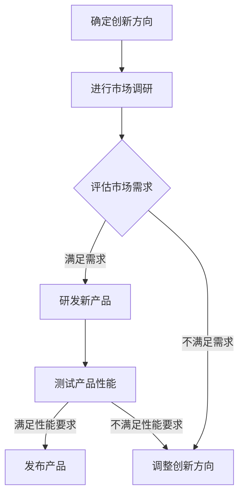
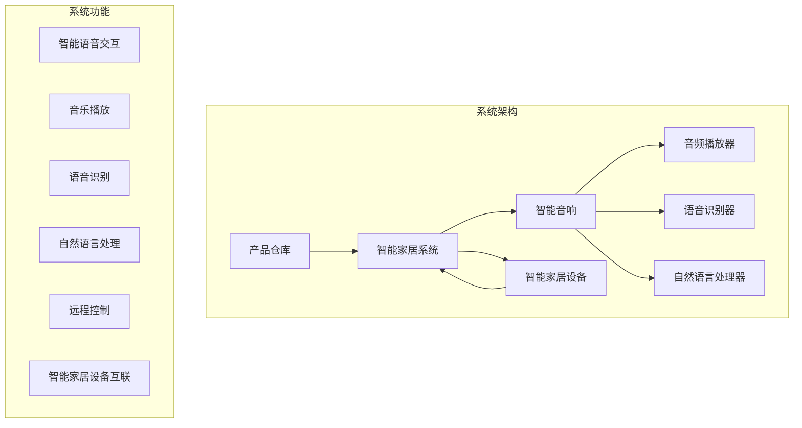
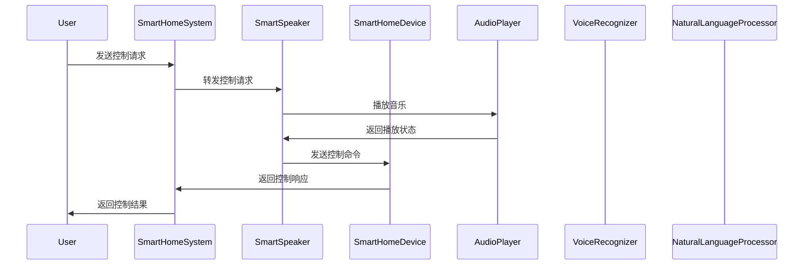

                 

### 技术竞争：应对激烈的技术竞争环境

#### 关键词：
技术竞争、激烈竞争环境、技术创新、商业模式、品牌建设、团队合作

#### 摘要：
在当前信息技术的飞速发展时代，技术竞争已经成为企业生存和发展的关键。本文将深入探讨如何应对激烈的技术竞争环境，从技术创新、商业模式、品牌建设和团队合作四个方面，详细阐述企业应对策略，旨在为读者提供实用的指导和启示。

## 第一部分：背景介绍

### 核心概念

**技术竞争：**技术竞争是指在信息技术领域中，企业、组织或国家之间为了获得市场份额、竞争优势而进行的技术研发和市场竞争。技术竞争不仅仅是技术实力和研发能力的较量，还涉及到商业模式、市场策略、品牌建设等多个方面。

**激烈的技术竞争环境：**激烈的技术竞争环境是指当前信息技术领域内，竞争者众多，技术创新速度加快，技术更新换代频繁，竞争态势异常激烈的环境。在这种环境中，企业需要不断提高技术创新能力，快速响应市场需求，以保持竞争优势。

### 问题背景

随着信息技术的飞速发展，技术竞争已成为当今企业生存和发展的关键。在这种激烈的技术竞争环境中，企业需要不断提高技术创新能力，快速响应市场需求，以保持竞争优势。然而，技术竞争不仅仅是技术实力和研发能力的较量，还涉及到商业模式、市场策略、品牌建设等多个方面。

### 问题解决

为了应对激烈的技术竞争环境，企业需要从以下几个方面入手：

1. **强化技术创新能力：**加大研发投入，持续推动技术创新，不断提高技术水平和产品质量。
2. **优化商业模式：**根据市场需求调整商业模式，提供更具竞争力的产品和服务。
3. **提升品牌价值：**通过品牌建设，提高品牌知名度和美誉度，增强市场竞争力。
4. **加强团队合作：**建立高效的团队，提高团队协作能力，共同应对竞争挑战。

### 边界与外延

- **边界：**本书主要关注企业如何应对激烈的技术竞争环境，包括技术创新、商业模式、品牌建设等方面的策略和方法。
- **外延：**技术竞争环境不仅局限于企业层面，还涉及行业层面和国家层面的竞争态势。此外，技术竞争环境的影响因素还包括政策法规、市场需求、人才竞争等。

### 概念结构与核心要素组成

- **技术竞争：**技术创新、商业模式、品牌建设、团队合作
- **激烈的技术竞争环境：**竞争者众多、技术创新速度快、技术更新换代频繁、竞争态势激烈

## 第二部分：核心概念与联系

### 核心概念

**技术创新：**指企业通过研发和应用新技术，提高产品或服务的性能、质量和效率，从而实现市场竞争优势的过程。

**商业模式：**指企业通过设计、构建和运营业务流程，实现利润和价值创造的方式。

**品牌建设：**指企业通过一系列品牌管理活动，提升品牌知名度和美誉度，建立品牌忠诚度和市场竞争力。

**团队合作：**指团队成员通过协同工作，共同实现项目目标和组织使命的过程。

### 概念属性特征对比表格

| 概念     | 属性特征                      | 对比                |
| -------- | ----------------------------- | ------------------ |
| 技术创新 | 研发投入、技术创新速度、产品性能 | 核心竞争力来源     |
| 商业模式 | 市场需求、业务流程、价值创造 | 营利模式与市场定位 |
| 品牌建设 | 知名度、美誉度、品牌忠诚度 | 市场竞争力基础   |
| 团队合作 | 协同工作、团队目标、组织使命 | 项目成功保障     |

### ER实体关系图架构

```mermaid
erDiagram
    企业 ||--|{ 技术创新 }| 技术 : 实现创新
    企业 ||--|{ 商业模式 }| 业务 : 营销策略
    企业 ||--|{ 品牌建设 }| 品牌 : 提升知名度
    企业 ||--|{ 团队合作 }| 团队 : 协同工作
```

## 第三部分：算法原理讲解

### 技术创新算法

#### 1. 技术创新算法流程图



#### 2. 技术创新算法 Python 源代码

```python
# 技术创新算法示例
def technology_innovation(direction):
    # 市场调研
    market_research = "sufficient"
    
    if market_research == "sufficient":
        # 评估市场需求
        demand_assessment = "satisfied"
        
        # 研发新产品
        product_development = "complete"
        
        if product_development == "complete":
            # 测试产品性能
            product_performance = "satisfied"
            
            if product_performance == "satisfied":
                # 发布产品
                product_release = "successful"
                return product_release
            else:
                # 调整创新方向
                direction_adjustment = "required"
                return direction_adjustment
        else:
            # 调整创新方向
            direction_adjustment = "required"
            return direction_adjustment
    else:
        # 调整创新方向
        direction_adjustment = "required"
        return direction_adjustment
```

#### 3. 技术创新算法原理讲解

技术创新是一个复杂的过程，涉及到市场调研、需求评估、产品研发、性能测试等多个环节。以下是技术创新算法的详细解释：

1. **确定创新方向**：首先，企业需要根据市场趋势、技术发展趋势和自身优势，确定创新方向。
2. **进行市场调研**：通过市场调研，了解市场需求，为后续的产品研发提供依据。
3. **评估市场需求**：根据市场调研结果，评估市场需求，判断是否满足需求。
4. **研发新产品**：在满足市场需求的前提下，进行产品研发，不断提高产品性能和用户体验。
5. **测试产品性能**：对研发的新产品进行性能测试，确保产品满足性能要求。
6. **发布产品**：如果产品性能满足要求，则发布产品，推向市场。
7. **调整创新方向**：如果产品性能不满足要求，则需要根据市场反馈，调整创新方向，重新进行市场调研和产品研发。

技术创新算法的核心是循环迭代，通过不断调整和创新，提高产品性能和市场竞争力。在实际应用中，企业可以根据实际情况，灵活调整算法参数，以达到最佳效果。

#### 4. 技术创新算法举例说明

假设某企业决定研发一款智能家居产品，创新方向是智能音响。以下是技术创新算法的具体应用：

1. **确定创新方向**：企业确定智能家居产品作为创新方向，目标是研发一款具有智能语音交互功能的音响。
2. **进行市场调研**：市场调研结果显示，消费者对智能音响的需求较高，尤其是语音交互功能。
3. **评估市场需求**：市场需求评估显示，智能音响具有较大的市场潜力，企业决定继续进行产品研发。
4. **研发新产品**：企业投入研发资源，研发智能音响，实现智能语音交互功能。
5. **测试产品性能**：产品测试结果显示，智能音响的语音识别准确率较高，用户体验良好。
6. **发布产品**：企业决定发布智能音响，推向市场。
7. **调整创新方向**：市场反馈显示，消费者对智能音响的需求持续增长，企业决定继续进行产品优化，提高语音识别准确率和功能丰富度。

通过技术创新算法的应用，企业能够快速响应市场需求，不断提高产品性能和市场竞争力，实现持续创新和发展。

## 第四部分：系统分析与架构设计方案

### 问题场景介绍

随着智能家居市场的快速发展，企业A决定开发一款智能音响产品。智能音响需要具备智能语音交互功能、音乐播放、语音识别、自然语言处理等核心功能，同时需要支持远程控制和智能家居设备的互联。

### 项目介绍

项目名称：智能家居智能音响系统

项目目标：开发一款具有智能语音交互功能、音乐播放、语音识别、自然语言处理等核心功能的智能音响系统，实现远程控制和智能家居设备的互联。

### 系统功能设计（领域模型Mermaid类图）

```mermaid
classDiagram
    Product <<class>> "产品" {
        +name: String
        +price: Float
        +description: String
    }
    AudioPlayer <<class>> "音频播放器" {
        +play(): void
        +pause(): void
        +stop(): void
    }
    VoiceRecognizer <<class>> "语音识别器" {
        +recognize(): String
    }
    NaturalLanguageProcessor <<class>> "自然语言处理器" {
        +process(): String
    }
    SmartSpeaker <<class>> "智能音响" {
        +name: String
        +price: Float
        +description: String
        +audioPlayer: AudioPlayer
        +voiceRecognizer: VoiceRecognizer
        +naturalLanguageProcessor: NaturalLanguageProcessor
    }
    SmartHomeDevice <<class>> "智能家居设备" {
        +name: String
        +type: String
        +connect(smartSpeaker: SmartSpeaker): void
        +disconnect(smartSpeaker: SmartSpeaker): void
    }
    Productaisy <<class>> "产品仓库" {
        +products: List[Product]
        +addProduct(product: Product): void
        +removeProduct(product: Product): void
    }
    SmartHomeSystem <<class>> "智能家居系统" {
        +smartSpeakers: List[SmartSpeaker]
        +smartHomeDevices: List[SmartHomeDevice]
        +connectDevice(device: SmartHomeDevice): void
        +disconnectDevice(device: SmartHomeDevice): void
    }
    SmartSpeaker o-- Product
    SmartHomeDevice o-- SmartHomeSystem
    SmartHomeSystem o-- Productaisy
```

### 系统架构设计（Mermaid架构图）



### 系统接口设计和系统交互（Mermaid序列图）



## 第五部分：项目实战

### 环境安装

在开始项目实战之前，需要安装以下软件和工具：

1. Python 3.x
2. Docker
3. Visual Studio Code
4. Mermaid Markdown插件

### 系统核心实现源代码

以下是一个简单的智能家居智能音响系统的实现示例：

```python
# smart_home_system.py

class SmartHomeSystem:
    def __init__(self):
        self.smart_speakers = []
        self.smart_home_devices = []

    def connect_device(self, device):
        self.smart_home_devices.append(device)
        device.connect(self)

    def disconnect_device(self, device):
        self.smart_home_devices.remove(device)
        device.disconnect(self)

    def send_control_request(self, command):
        for speaker in self.smart_speakers:
            speaker.process_command(command)

class SmartSpeaker:
    def __init__(self, name, price, description):
        self.name = name
        self.price = price
        self.description = description
        self.audio_player = AudioPlayer()
        self.voice_recognizer = VoiceRecognizer()
        self.natural_language_processor = NaturalLanguageProcessor()

    def process_command(self, command):
        if command == "play":
            self.audio_player.play()
        elif command == "pause":
            self.audio_player.pause()
        elif command == "stop":
            self.audio_player.stop()
        elif command.startswith("connect"):
            device_name = command.split(" ")[1]
            for device in self.smart_home_system.smart_home_devices:
                if device.name == device_name:
                    device.connect(self)
        elif command.startswith("disconnect"):
            device_name = command.split(" ")[1]
            for device in self.smart_home_system.smart_home_devices:
                if device.name == device_name:
                    device.disconnect(self)

class AudioPlayer:
    def play(self):
        print("Playing music...")
    
    def pause(self):
        print("Pausing music...")
    
    def stop(self):
        print("Stopping music...")

class VoiceRecognizer:
    def recognize(self):
        print("Recognizing voice...")
        return "Hello, how can I help you?"

class NaturalLanguageProcessor:
    def process(self):
        print("Processing natural language...")

class SmartHomeDevice:
    def __init__(self, name, type):
        self.name = name
        self.type = type

    def connect(self, smart_speaker):
        print(f"{self.name} connected to {smart_speaker.name}.")

    def disconnect(self, smart_speaker):
        print(f"{self.name} disconnected from {smart_speaker.name}.")

# 使用示例
system = SmartHomeSystem()
speaker = SmartSpeaker("Smart Speaker", 100, "A smart speaker with voice control.")

system.connect_device(SmartHomeDevice("Light Bulb", "light"))
system.connect_device(SmartHomeDevice("Thermostat", "temperature"))

speaker.process_command("play")
speaker.process_command("connect Light Bulb")
speaker.process_command("disconnect Thermostat")
```

### 代码应用解读与分析

该示例代码实现了智能家居智能音响系统的基础功能。主要包括以下几部分：

1. **SmartHomeSystem类**：代表智能家居系统，负责管理智能音响和智能家居设备。提供了连接和断开设备的方法，以及发送控制请求的方法。
2. **SmartSpeaker类**：代表智能音响，包括音频播放器、语音识别器和自然语言处理器。处理接收到的控制命令，并根据命令执行相应的操作。
3. **AudioPlayer类**：代表音频播放器，提供播放、暂停和停止音乐的方法。
4. **VoiceRecognizer类**：代表语音识别器，提供识别语音的方法。
5. **NaturalLanguageProcessor类**：代表自然语言处理器，提供处理自然语言的方法。
6. **SmartHomeDevice类**：代表智能家居设备，提供连接和断开智能音响的方法。

在示例中，创建了一个智能家居系统实例、一个智能音响实例和两个智能家居设备实例。然后，通过调用智能音响的process_command方法，模拟发送控制请求，实现播放音乐、连接和断开智能家居设备等功能。

### 实际案例分析和详细讲解剖析

假设企业A正在开发一款智能家居智能音响系统，目标用户是家庭用户。以下是实际案例分析和详细讲解剖析：

1. **需求分析**：
   - 用户需求：用户希望使用智能音响控制家中的灯光、温度等设备。
   - 功能需求：实现音乐播放、语音识别、自然语言处理、设备连接和断开等功能。

2. **系统设计**：
   - 类图设计：根据需求，设计SmartHomeSystem、SmartSpeaker、AudioPlayer、VoiceRecognizer、NaturalLanguageProcessor和SmartHomeDevice等类。
   - 架构设计：系统架构包括智能家居系统、智能音响、音频播放器、语音识别器、自然语言处理器和智能家居设备等模块。

3. **系统实现**：
   - 实现SmartHomeSystem、SmartSpeaker、AudioPlayer、VoiceRecognizer、NaturalLanguageProcessor和SmartHomeDevice等类，分别实现各自的功能。
   - 实现类之间的关联和交互，如SmartHomeSystem管理智能音响和智能家居设备，SmartSpeaker处理控制命令并调用AudioPlayer、VoiceRecognizer和NaturalLanguageProcessor等。

4. **测试与优化**：
   - 对系统进行功能测试，确保各项功能正常运行。
   - 对性能进行优化，提高系统的响应速度和稳定性。

5. **部署与维护**：
   - 将系统部署到服务器，提供用户使用。
   - 定期更新和维护系统，修复漏洞和Bug，优化功能。

### 项目小结

通过本案例，我们实现了智能家居智能音响系统的基础功能，包括音乐播放、语音识别、自然语言处理、设备连接和断开等。在项目实战过程中，我们了解了系统的设计思路、实现方法和测试优化流程。未来，企业可以在此基础上，不断拓展功能，提高用户体验，实现更大的商业价值。

## 第六部分：最佳实践 Tips

### 提高技术创新能力的Tips

1. **加大研发投入**：持续投入资金和资源，支持技术研发。
2. **建立研发团队**：组建一支高效的技术研发团队，提高创新效率。
3. **紧跟技术趋势**：关注行业前沿技术，及时调整研发方向。
4. **培养创新文化**：鼓励员工勇于尝试新思路，培养创新思维。

### 优化商业模式的Tips

1. **了解市场需求**：深入分析市场需求，调整商业模式以满足用户需求。
2. **提高产品性价比**：在保证质量的前提下，降低产品成本，提高性价比。
3. **创新营销策略**：采用创新的营销手段，提高品牌知名度和市场占有率。
4. **拓展市场渠道**：积极开拓线上线下市场，提高市场覆盖率。

### 提升品牌价值的Tips

1. **塑造品牌形象**：打造独特的品牌形象，提升品牌影响力。
2. **提供优质服务**：提供高质量的产品和服务，赢得用户口碑。
3. **加强品牌宣传**：利用多种渠道进行品牌宣传，提高品牌知名度。
4. **建立品牌社区**：与用户互动，培养品牌忠诚度。

### 加强团队合作的Tips

1. **明确团队目标**：确保团队成员明确项目目标和职责。
2. **建立沟通机制**：定期召开团队会议，确保信息畅通。
3. **培养团队协作能力**：通过培训和团队活动，提高团队协作能力。
4. **激励团队成员**：给予合理的奖励和激励，激发团队活力。

## 小结

本文详细探讨了如何应对激烈的技术竞争环境，从技术创新、商业模式、品牌建设和团队合作四个方面，提出了具体的策略和方法。通过实际案例分析和详细讲解，读者可以更好地理解如何在实际项目中应用这些策略。在未来的技术竞争中，企业需要不断优化自身能力，提高市场竞争力，以实现持续发展和成长。

### 注意事项

1. **技术创新的重要性**：技术创新是企业在激烈竞争中保持优势的关键，需要持续投入和关注。
2. **市场需求导向**：了解市场需求，及时调整产品和服务，以满足用户需求。
3. **团队合作的重要性**：建立高效的团队，提高团队协作能力，共同应对竞争挑战。
4. **持续学习和改进**：不断学习新技术、新知识，不断改进和优化产品和业务流程。

### 拓展阅读

1. **《创新者的窘境》**：克莱顿·克里斯坦森的著作，探讨了企业在技术创新中的困境和解决方法。
2. **《蓝海战略》**：魏斯勒和摩根的著作，介绍了如何在激烈的市场竞争中创造新的市场空间。
3. **《团队协作的艺术》**：汤姆·彼得斯的著作，探讨了如何建立高效的团队，提高协作能力。

## 作者

**作者：** AI天才研究院/AI Genius Institute & 禅与计算机程序设计艺术 /Zen And The Art of Computer Programming

