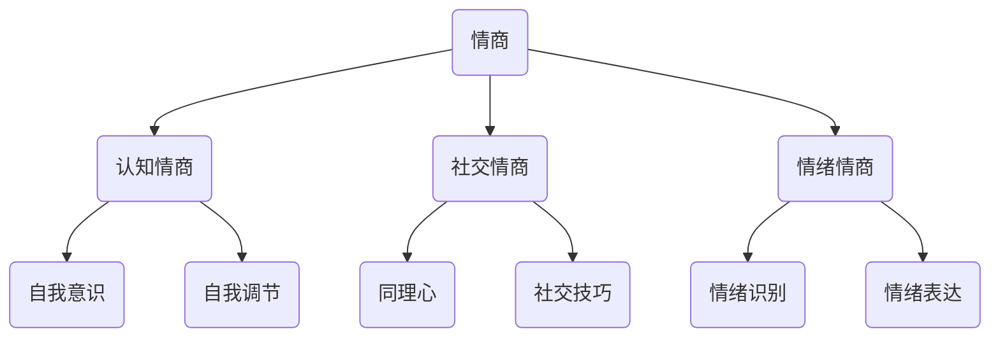

                 


# 技术管理中的情商：处理人际关系的艺术

关键词：技术管理、情商、人际关系、团队管理、领导力、个人发展

摘要：本文深入探讨了情商在技术管理中的重要性，分析了情商的三个主要类型及其在技术管理中的应用，通过实际案例和算法原理讲解，展示了情商在团队管理、领导力和个人发展中的关键作用，为技术管理者提供了提升人际关系和管理效能的实用策略。

## 第1章 引言

### 1.1 情商在技术管理中的重要性

技术管理不仅仅是技术问题，更是人际关系的艺术。在高度依赖团队合作和信息交流的IT行业，情商显得尤为重要。情商（Emotional Intelligence，简称EQ）是一种识别、理解、管理和表达情绪的能力。它包括认知情商、社交情商和情绪情商三个方面。技术管理者若能充分发挥情商的优势，将有助于提升团队凝聚力、改善沟通效率、有效处理冲突，并促进个人和团队的成长。

### 1.2 本书的目标与结构

本书旨在帮助技术管理者理解情商的重要性，并提供实用的提升策略。具体目标如下：

1. **解析情商的基础概念**：介绍情商的定义、类型及其在人际关系中的应用。
2. **探讨情商在团队管理中的应用**：分析情商在团队建设、冲突管理和团队沟通中的作用。
3. **阐述情商与领导力的关系**：讨论情商在领导风格、领导影响力以及职业成长中的作用。
4. **提供情商提升的方法与实践**：分享情商提升的理论基础、实践策略以及具体场景中的应用。

通过本书，读者将能够更全面地认识情商在技术管理中的价值，学会如何在实际工作中运用情商提升管理效能。

## 第2章 情商基础

### 2.1 情商的定义与类型

情商，即情绪智力，是由心理学家戈尔曼（Daniel Goleman）首次提出的概念。它指的是个体识别、理解、管理和表达情绪的能力。情商可以分为三个主要类型：认知情商、社交情商和情绪情商。

#### 2.1.1 认知情商

认知情商是指个体对自己情绪的认知和自我管理能力。它包括以下几个方面的能力：

- **自我意识**：了解自己的情绪状态，认识情绪对自己的影响。
- **自我调节**：调整情绪反应，控制冲动和消极情绪。
- **自我激励**：设定目标，保持动力，克服挫折。

#### 2.1.2 社交情商

社交情商是指个体识别、理解和管理他人情绪的能力。它包括以下几个方面的能力：

- **同理心**：设身处地地理解他人的情绪和需求。
- **社交技巧**：与他人有效沟通，建立和维护良好的人际关系。
- **冲突解决**：以建设性的方式处理人际冲突。

#### 2.1.3 情绪情商

情绪情商是指个体对情绪的理解、管理和表达的能力。它包括以下几个方面的能力：

- **情绪识别**：准确地识别和理解自己的情绪。
- **情绪调节**：有效地调节和管理情绪。
- **情绪表达**：恰当地表达情绪，避免负面情绪的影响。

### 2.2 情商与人际关系

情商在人际关系中起着至关重要的作用。它不仅影响个体与他人的互动，也影响整个团队的凝聚力和协作效率。以下是情商在人际关系中的几个关键应用：

1. **改善沟通**：高情商的技术管理者能够更好地理解团队成员的情绪和需求，从而进行更有效的沟通。
2. **冲突管理**：情商能够帮助管理者以更加理性、平和的方式处理冲突，避免情绪化的决策。
3. **团队建设**：情商高的管理者能够建立信任和尊重，提升团队凝聚力，促进团队协作。
4. **领导力**：情商是领导力的关键组成部分，能够提升管理者的影响力，促进个人和团队的成长。

### 2.3 情商的重要性

在技术管理中，情商的重要性不容忽视。首先，高情商的管理者能够更好地理解和满足团队成员的需求，从而提高团队的整体绩效。其次，情商能够帮助管理者有效处理冲突，减少团队内耗，提高团队协作效率。最后，情商是建立和维护良好人际关系的关键，有助于提升组织文化和整体氛围。

## 第3章 情商与团队管理

### 3.1 情商在团队建设中的应用

团队建设是技术管理者的重要职责之一。情商在团队建设中的应用主要体现在以下几个方面：

1. **增强团队凝聚力**：高情商的技术管理者能够识别团队成员的情绪变化，及时提供支持和帮助，增强团队成员之间的信任和归属感。

2. **促进沟通与协作**：情商高的管理者能够有效地倾听和回应团队成员的需求和意见，建立良好的沟通渠道，促进团队协作。

3. **培养团队合作精神**：情商能够帮助管理者理解和尊重团队成员的差异，促进团队成员之间的合作和互助，形成积极的团队文化。

### 3.1.1 增强团队凝聚力

团队凝聚力是指团队成员之间的紧密联系和相互支持的程度。高情商的技术管理者可以通过以下方式增强团队凝聚力：

- **建立信任**：通过开放和诚实的沟通建立信任，让团队成员感受到彼此的尊重和理解。
- **提供反馈**：及时给予团队成员建设性的反馈，帮助其成长和改进。
- **鼓励参与**：鼓励团队成员参与决策和项目讨论，提升其参与感和归属感。

### 3.1.2 提升团队沟通效率

沟通是团队协作的核心。情商在提升团队沟通效率方面的作用主要体现在以下几个方面：

- **倾听**：情商高的管理者能够主动倾听团队成员的意见和需求，理解其背后的情绪。
- **表达**：能够清晰、恰当地表达自己的想法和感受，避免误解和冲突。
- **同理心**：设身处地地理解团队成员的情绪和立场，增进相互理解。

### 3.2 情商在冲突管理中的应用

冲突是团队工作中的常见现象。情商在冲突管理中的应用主要体现在以下几个方面：

1. **识别冲突原因**：情商高的管理者能够敏锐地识别冲突的根源，是沟通不畅、目标不一致，还是利益冲突。
2. **处理冲突情绪**：通过自我调节和情绪管理，保持冷静，避免情绪化的决策。
3. **寻找解决方案**：通过有效的沟通和协商，寻找双方都能接受的解决方案。

### 3.2.1 冲突的类型与原因

冲突可以分为以下几种类型：

- **目标冲突**：团队成员在项目目标上存在分歧，导致工作难以协调。
- **资源冲突**：团队成员在资源分配上存在竞争，如人力、预算等。
- **沟通冲突**：由于信息传递不畅或误解，导致团队成员之间的矛盾。

冲突的原因主要包括：

- **沟通不畅**：团队成员之间的沟通不足或沟通方式不当，导致误解和不满。
- **目标不一致**：团队成员对项目目标的理解不一致，导致工作难以协调。
- **个人利益冲突**：团队成员在资源分配或利益分配上存在竞争。

### 3.2.2 冲突解决的策略

有效的冲突解决策略可以帮助团队摆脱冲突的困扰，提升团队效率。以下是几种常见的冲突解决策略：

1. **避免**：对于一些不重要的冲突，可以选择避免直接面对，减少冲突的负面影响。
2. **妥协**：在双方都有一定妥协空间的情况下，通过妥协找到双方都能接受的解决方案。
3. **合作**：通过合作和协商，找到对双方都有利的解决方案，实现双赢。
4. **强制**：在冲突严重，且其他策略无效的情况下，可以采取强制措施，以维护团队的正常运作。

### 3.3 情商与团队绩效

情商不仅影响团队氛围，也直接影响团队绩效。高情商的团队管理者能够：

- **提高团队效率**：通过有效的沟通和协作，提高团队的工作效率和产出。
- **提升员工满意度**：关注团队成员的情绪和需求，提高员工的工作满意度和忠诚度。
- **促进创新和创造**：鼓励团队成员提出意见和建议，激发创新思维，推动团队进步。

总之，情商在团队管理中的应用至关重要，它能够帮助技术管理者提升团队绩效，实现团队和个人的共同成长。

## 第4章 情商与领导力

### 4.1 情商与领导风格

情商是领导力的关键组成部分，不同的情商水平会影响到领导者的风格。以下是几种常见的领导风格：

#### 4.1.1 权威型领导

权威型领导是指领导者通过权威和权力来影响团队成员。这种领导风格通常表现出以下特点：

- **决策权集中**：领导者拥有最终的决策权，团队成员参与度较低。
- **命令式沟通**：领导者通过明确的指令来指导团队成员。
- **高压管理**：领导者对团队成员的要求严格，有时会采取高压手段。

权威型领导风格在某些情况下可以迅速推动项目的进度，但在长期内可能导致团队成员的被动和缺乏自主性。

#### 4.1.2 参与型领导

参与型领导是指领导者鼓励团队成员参与决策和项目讨论。这种领导风格通常表现出以下特点：

- **开放沟通**：领导者鼓励团队成员表达意见和想法，建立开放的沟通渠道。
- **协作决策**：领导者与团队成员共同讨论并做出决策。
- **支持性管理**：领导者为团队成员提供必要的支持和资源，帮助其成长。

参与型领导风格有助于提高团队成员的参与感和归属感，促进团队合作和创新。

#### 4.1.3 资源型领导

资源型领导是指领导者善于利用资源和机会来推动团队发展。这种领导风格通常表现出以下特点：

- **资源整合**：领导者能够有效整合团队内外部的资源和机会。
- **战略规划**：领导者具备长远的战略眼光，制定明确的规划。
- **灵活管理**：领导者能够根据环境变化灵活调整管理策略。

资源型领导风格有助于团队在竞争激烈的环境中保持优势，推动团队持续发展。

### 4.2 情商与领导影响力

情商不仅影响领导风格，也直接影响领导者的影响力。高情商的领导者能够：

- **建立信任**：通过诚信和同理心建立信任，增强领导力。
- **激励团队**：识别和满足团队成员的需求，激发其工作热情和动力。
- **处理冲突**：以建设性的方式处理团队冲突，维护团队稳定。

以下是情商在领导影响力中的应用：

1. **情感识别**：领导者能够准确识别团队成员的情绪，理解其背后的原因。
2. **情感表达**：领导者能够恰当地表达自己的情绪，避免负面情绪的传递。
3. **情感调节**：领导者能够有效地调节自己的情绪，保持冷静和理智。
4. **同理心**：领导者能够设身处地地理解团队成员的情绪和需求，增进相互理解。

### 4.3 情商与领导力的提升

情商并非天生具备，而是可以通过学习和实践不断提升。以下是几种提升情商的方法：

1. **自我反思**：定期进行自我反思，识别自己的情绪和行为，找出改进的方向。
2. **情感学习**：通过阅读相关书籍、参加培训和研讨会，学习情感管理和人际沟通的技巧。
3. **情感实践**：在实际工作中不断练习和运用情感管理技巧，提升自己的情商。
4. **情感反馈**：寻求同事和下属的反馈，了解自己的情绪管理和领导风格，进行改进。

总之，情商是领导力的关键要素，高情商的领导者能够更好地管理团队、处理冲突、提升团队绩效，实现个人和团队的共同成长。

## 第5章 情商与个人发展

### 5.1 情商与自我认知

情商在个人发展中起着至关重要的作用，特别是在自我认知方面。自我认知是指个体对自己的情绪、行为、能力和价值观的了解。以下是情商在自我认知中的应用：

1. **情绪识别**：通过情商，个体能够更好地识别和理解自己的情绪。例如，当感到焦虑或愤怒时，能够准确识别这些情绪，并理解它们背后的原因。

2. **自我调节**：情商高的个体能够有效地调节自己的情绪，避免情绪化的行为。例如，在面临挫折时，能够保持冷静，分析问题的根本原因，并采取合适的应对措施。

3. **自我激励**：情商可以帮助个体设定目标，保持动力，克服困难。例如，在长期项目或学习任务中，情商高的个体能够持续保持积极的态度和动力，不断提高自己。

### 5.1.1 自我意识的培养

自我意识是情商的核心要素之一。以下是一些培养自我意识的方法：

1. **反思**：定期进行反思，思考自己的情绪、行为和决策。通过反思，个体能够更好地了解自己，识别潜在的问题和改进的方向。

2. **日记**：记录自己的情绪、行为和想法。日记可以帮助个体更清晰地看到自己的内心世界，发现自己的情绪模式和行为习惯。

3. **反馈**：寻求他人对自己的反馈，特别是那些与自己关系密切的人。他人的观点和意见可以帮助个体更客观地看待自己。

### 5.1.2 自我认知的深度探索

自我认知不仅涉及情绪和行为的识别，还包括价值观和人生目标的探索。以下是深度探索自我认知的方法：

1. **价值观识别**：通过思考和讨论，明确自己的价值观。价值观是个体行为和决策的基石，了解自己的价值观有助于在工作和生活中做出更一致和有意义的选择。

2. **人生目标**：思考自己的长期和短期目标。明确目标有助于个体集中精力，制定计划，并持续追求。

3. **职业规划**：结合自己的兴趣、能力和价值观，制定适合自己的职业规划。职业规划可以帮助个体在职业发展中找到方向，实现个人和职业的平衡。

### 5.2 情商与职业成长

情商在职业成长中发挥着重要作用。以下是情商在职业发展中的应用：

1. **沟通能力**：高情商的个体能够更好地沟通和表达，提高工作效率和团队协作能力。

2. **人际关系**：情商有助于个体建立和维护良好的人际关系，提升人际关系管理能力。

3. **冲突解决**：情商高的个体能够以建设性的方式处理冲突，减少工作上的矛盾和摩擦。

4. **领导力**：情商是领导力的关键组成部分，高情商的个体能够更好地管理团队，提升领导力。

### 5.2.1 情商在职业发展中的作用

情商在职业发展中的作用主要体现在以下几个方面：

1. **提升职业素养**：情商帮助个体提升职业素养，包括沟通能力、团队合作能力和冲突解决能力。

2. **增强职场竞争力**：情商高的个体在职场中更具有竞争力，能够更好地适应环境变化，处理复杂的工作任务。

3. **促进职业发展**：情商有助于个体在职业发展中取得更大的成就，包括晋升和职业转型。

4. **提升工作满意度**：情商高的个体能够更好地平衡工作和生活，提高工作满意度。

### 5.2.2 职业规划与情商

职业规划是职业发展的重要组成部分。情商在职业规划中的应用主要体现在以下几个方面：

1. **自我认知**：通过情商，个体能够更好地了解自己的兴趣、能力和价值观，为职业规划提供依据。

2. **目标设定**：情商帮助个体设定明确、可行的职业目标，并制定实现目标的计划。

3. **持续学习**：情商鼓励个体持续学习，不断提升自己的能力和知识，为职业发展打下坚实的基础。

4. **适应变化**：情商帮助个体更好地适应职场变化，灵活调整职业规划，实现职业目标。

总之，情商在个人发展和职业成长中扮演着关键角色。通过提升情商，个体能够更好地认识自己，设定目标，应对挑战，实现职业发展的成功。

## 第6章 情商在具体场景中的应用

### 6.1 技术项目中的情商运用

在技术项目中，情商的运用对于项目的成功至关重要。以下是情商在技术项目中的具体应用：

#### 6.1.1 项目沟通中的情商策略

项目沟通是技术项目成功的关键因素之一。高情商的项目管理者能够采取以下策略来提高沟通效果：

1. **有效倾听**：倾听是沟通的基础。项目管理者应学会倾听团队成员的意见和需求，理解他们的情绪和立场。

2. **积极反馈**：在沟通中给予团队成员积极的反馈，鼓励他们分享想法和问题。这有助于建立信任和尊重，提高沟通的效率。

3. **同理心**：设身处地地理解团队成员的情绪和需求，避免因误解和冲突导致沟通障碍。

#### 6.1.2 项目管理中的情商技巧

情商在项目管理中的应用主要体现在以下几个方面：

1. **冲突管理**：项目管理者应具备处理冲突的能力，以建设性的方式解决团队成员之间的矛盾。

2. **资源分配**：情商高的管理者能够公平合理地分配资源，满足团队成员的需求，提高项目的整体效率。

3. **团队激励**：通过识别和满足团队成员的需求，激发他们的工作热情和动力，促进项目的顺利推进。

### 6.2 团队协作中的情商提升

团队协作是技术项目的核心。提升团队协作中的情商，有助于建立高效的团队，实现项目的成功。以下是提升团队协作情商的具体方法：

1. **建立信任**：信任是团队协作的基础。项目管理者应通过开放和诚实的沟通，建立团队成员之间的信任。

2. **尊重差异**：团队成员之间存在差异是正常的。情商高的管理者能够尊重和包容这些差异，促进团队合作。

3. **鼓励沟通**：鼓励团队成员进行开放和坦诚的沟通，分享自己的想法和问题，共同寻找解决方案。

4. **冲突解决**：以建设性的方式处理团队冲突，避免负面情绪的蔓延，保持团队的稳定和高效。

### 6.2.1 团队合作的情商要素

成功的团队合作需要以下几个情商要素：

1. **沟通能力**：团队成员之间的有效沟通是团队合作的关键。情商高的个体能够更好地表达自己的观点，理解他人的意见。

2. **同理心**：同理心使团队成员能够站在对方的角度思考问题，增进相互理解和合作。

3. **冲突管理**：团队成员之间难免会有矛盾和冲突。情商高的个体能够以建设性的方式处理这些冲突，避免负面情绪的影响。

4. **团队意识**：团队成员应具备团队意识，意识到团队的成功取决于每个成员的努力。

### 6.2.2 团队冲突处理的情商技巧

团队冲突是团队合作中不可避免的现象。以下是处理团队冲突的情商技巧：

1. **冷静分析**：在冲突发生时，保持冷静，避免情绪化的行为。通过理性分析冲突的根源，找到解决问题的方法。

2. **同理心**：设身处地地理解冲突双方的情绪和立场，避免因误解和偏见加剧冲突。

3. **有效沟通**：通过开放和诚实的沟通，表达自己的观点和感受，倾听对方的意见。寻求共同点，找到解决问题的方案。

4. **妥协和合作**：在冲突中，寻求双方都能接受的妥协方案，通过合作实现共赢。

总之，情商在技术项目中的具体应用对于项目的成功至关重要。通过提升情商，项目管理者能够更好地沟通、管理冲突、提升团队合作，实现项目的目标。

## 第7章 情商与心理健康

### 7.1 情商与心理健康的关系

情商与心理健康之间存在密切的关系。情商不仅影响个体的情绪状态，也影响其心理健康。以下是情商与心理健康之间的几个关键联系：

1. **情绪调节**：高情商的个体能够更好地调节自己的情绪，避免因负面情绪导致的心理健康问题。例如，能够有效地处理焦虑、抑郁等情绪。

2. **压力管理**：情商高的个体具有较强的压力管理能力。他们能够识别压力源，采取适当的应对策略，减轻压力对心理健康的影响。

3. **社交支持**：情商有助于建立和维护良好的社交关系。有强社交支持的个体在面临心理健康问题时，更容易获得帮助和支持，从而促进心理健康。

### 7.1.1 情绪管理与心理健康

情绪管理是情商的重要组成部分。有效的情绪管理对心理健康有着积极的影响：

1. **情绪识别**：个体能够准确识别自己的情绪，包括正面和负面情绪。这种自我意识有助于个体更好地理解自己的情绪状态。

2. **情绪调节**：通过自我调节，个体能够调整情绪反应，避免情绪波动对心理健康造成的负面影响。

3. **情绪表达**：情商高的个体能够以适当的方式表达情绪，避免因压抑或过度表达情绪导致的心理健康问题。

### 7.1.2 情商提升与心理健康

情商的提升有助于改善心理健康，具体方法如下：

1. **自我反思**：定期进行自我反思，了解自己的情绪和行为模式，识别潜在的心理健康问题。

2. **情感教育**：通过学习和参与情感教育课程，提升对情绪的理解和管理能力。

3. **心理支持**：寻求心理咨询师的帮助，学习更有效的情绪管理和压力管理技巧。

4. **社交活动**：积极参与社交活动，建立和维护良好的社交关系，增强社交支持。

### 7.2 情商在心理压力管理中的应用

心理压力是影响心理健康的重要因素。情商在心理压力管理中的应用主要体现在以下几个方面：

1. **压力识别**：情商高的个体能够准确识别压力源，了解压力对心理健康的影响。

2. **应对策略**：通过有效的应对策略，如放松技巧、时间管理和积极思考，减轻心理压力。

3. **支持系统**：建立和维护良好的社交支持系统，寻求家人、朋友和同事的帮助，共同应对压力。

### 7.2.1 压力源识别与处理

压力源是指导致个体产生压力的内外部因素。以下是一些常见的压力源及其处理方法：

1. **工作压力**：例如，项目紧张、工作量大、工作质量要求高等。处理方法包括合理分配工作任务、提高工作效率、寻求团队支持等。

2. **人际关系**：例如，家庭矛盾、朋友冲突、同事关系紧张等。处理方法包括改善沟通技巧、寻求第三方的调解、建立健康的社交关系等。

3. **个人问题**：例如，健康问题、财务问题、个人成长压力等。处理方法包括积极面对问题、寻求专业帮助、制定应对计划等。

### 7.2.2 压力缓解与情商提升策略

缓解压力和提升情商的策略如下：

1. **放松技巧**：例如，深呼吸、冥想、瑜伽等。这些技巧有助于缓解身体和心理的紧张，提高情绪管理能力。

2. **时间管理**：合理安排时间，提高工作效率，避免因时间紧迫导致的压力。

3. **积极思考**：培养积极的思维方式，避免过度消极和担忧，提高心理抗压能力。

4. **社交活动**：参与社交活动，建立和维护良好的社交关系，增强社交支持。

5. **情感教育**：通过学习和实践情感教育，提升对情绪的理解和管理能力，从而更好地应对压力。

总之，情商与心理健康密切相关。通过提升情商，个体能够更好地管理情绪、应对压力，促进心理健康。同时，情商的提升也有助于建立良好的社交关系，提高生活质量。

## 第8章 情商提升方法与实践

### 8.1 情商提升的理论基础

情商的提升是一个系统性的过程，需要基于一定的理论基础。以下是情商提升的几个核心理论基础：

1. **情绪智力量表（MEIS）**：情绪智力量表是一种广泛使用的情商评估工具，它包括五个关键维度：自我意识、自我调节、社交意识、关系管理和情绪的运用。通过这个量表，个体可以全面了解自己的情商水平，并制定相应的提升计划。

2. **自我决定理论（SDT）**：自我决定理论提出，个体的自我决定程度对其行为和幸福感具有重要影响。情商的提升可以通过增强自我决定来促进，例如，通过设定有意义的目标和自主选择来提升自我调节能力和动机。

3. **社会认知理论（SCT）**：社会认知理论强调，个体的情绪和行为受到其对社会环境和他人的认知和理解的影响。情商的提升需要通过增强社会认知能力，例如，通过提高同理心和社交技巧来改善人际关系。

### 8.1.1 情商培养的理论框架

情商的培养可以基于以下理论框架：

1. **意识层面**：通过自我反思和情感日记，个体能够提升对自身情绪的认识和理解。这种自我意识的提升是情商培养的第一步。

2. **认知层面**：通过学习和实践情绪管理技巧，个体能够提高对情绪的认知和调节能力。例如，通过认知行为疗法（CBT）学习如何改变负面思维模式。

3. **行为层面**：通过实际应用情感管理技巧，个体能够在实践中提升情商。例如，通过角色扮演和模拟练习来提高社交技巧。

4. **情感层面**：通过情感教育，个体能够增强对他人情绪的理解和感知，提升同理心。例如，通过情感故事阅读和情感分享活动来培养情感共鸣。

### 8.1.2 情商提升的方法论

情商提升的方法论包括以下几个方面：

1. **自我反思**：定期进行自我反思，记录自己的情绪和行为，识别情绪模式，找出改进的机会。

2. **情感教育**：通过参与情感教育课程，学习情绪管理技巧，了解情感理论和实践。

3. **实践应用**：将学到的情感管理技巧应用到实际生活中，通过实践来提高情商。

4. **社交训练**：通过参与社交活动和角色扮演，提高社交技巧和同理心。

5. **心理健康支持**：寻求心理咨询师的帮助，学习专业的情绪管理和压力管理技巧。

### 8.2 情商提升的实践策略

以下是情商提升的实践策略：

1. **设定目标**：明确自己的情商提升目标，例如，提高自我调节能力、改善人际关系等。

2. **制定计划**：制定详细的提升计划，包括具体的目标、实现步骤和时间表。

3. **执行计划**：按照计划执行提升策略，例如，每天进行自我反思、每周参与社交活动等。

4. **跟踪进度**：定期评估自己的提升进度，调整计划，确保目标的实现。

5. **持续学习**：通过阅读相关书籍、参加研讨会和课程，不断学习和提升情商。

### 8.2.1 个人成长计划

个人成长计划是情商提升的关键。以下是制定个人成长计划的步骤：

1. **自我评估**：通过情绪智力量表和其他评估工具，了解自己的情商水平。

2. **设定目标**：根据自我评估的结果，设定具体的情商提升目标。

3. **制定计划**：制定详细的个人成长计划，包括具体的提升策略和时间安排。

4. **执行计划**：按照计划执行，确保目标的实现。

5. **反馈与调整**：定期评估成长进度，根据反馈调整计划，持续提升情商。

### 8.2.2 团队情商提升实践

团队情商提升实践有助于建立高效的团队，提升整体绩效。以下是团队情商提升的实践策略：

1. **团队培训**：组织团队情商培训，提高团队成员的情绪管理能力和同理心。

2. **团队活动**：通过团队活动，如团队建设工作坊、情感分享会等，增强团队成员的互动和信任。

3. **领导力培养**：培养团队领导者的情商，提升其管理能力和团队领导力。

4. **沟通机制**：建立有效的沟通机制，鼓励团队成员开放、坦诚地沟通，提高团队沟通效率。

5. **反馈机制**：建立反馈机制，定期收集团队成员的意见和建议，促进团队改进和成长。

总之，情商提升是一个持续的过程，需要个体和团队共同努力。通过理论学习和实践应用，个体和团队都能够提升情商，实现个人和团队的共同成长。

## 附录

### 附录A 情商相关资源推荐

为了帮助读者深入了解情商和提高情商水平，以下推荐一些优秀的情商相关资源：

#### A.1 情商研究经典著作

1. **《情绪智力》**（Emotional Intelligence）- 丹尼尔·戈尔曼（Daniel Goleman）
   - 介绍了情商的概念和重要性，以及如何通过情商提升个人和团队的表现。

2. **《情感智力2.0》**（Working with Emotional Intelligence）- 丹尼尔·戈尔曼（Daniel Goleman）
   - 进一步探讨了情商在工作场所的应用，提供了实用的策略和技巧。

3. **《情商与领导力》**（Emotional Intelligence and Leadership）- 拉姆·查兰（Ram Charan）
   - 分析了情商在领导力中的关键作用，提供了提升领导力的策略。

#### A.2 情商提升实践指南

1. **《情商提升指南》**（EQ Boost: A Practical Guide to Emotional Intelligence）- 杰夫·史威福（Jeff Swayer）
   - 提供了详细的情商提升方法和实践指南，适合个人和团队使用。

2. **《情商训练手册》**（The Emotional Intelligence Training Workbook）- 马克·加斯里（Mark Gasiorowski）
   - 通过一系列练习和活动，帮助读者提升情商，改善人际关系。

3. **《情商培养计划》**（Building Emotional Intelligence）- 阿曼达·加斯里（Amanda Gasiorowski）
   - 针对不同年龄段和职业的读者，提供了个性化情商培养方案。

#### A.3 情商相关的线上课程与工具

1. **Coursera** - 提供了多门关于情商和人际关系的在线课程，如“情感智力：提升人际关系技能”等。

2. **edX** - 提供了由知名大学和机构开设的情商相关课程，如“情绪智力：理解和管理情绪”等。

3. **LinkedIn Learning** - 提供了丰富的情商提升视频教程，涵盖情绪管理、人际沟通等多个方面。

4. **EmotionTracker** - 一个在线工具，帮助用户监测和管理情绪状态。

5. **Quietly** - 一个专注于提高情绪智力的应用程序，提供个性化的情感反馈和提升建议。

通过这些资源，读者可以更深入地了解情商，并在实际生活和工作中应用情商提升策略，实现个人和职业发展的成功。

## 概念关系架构 Mermaid 流程图



## 核心算法原理讲解

### 冲突解决的算法原理

在处理团队冲突时，合理的算法原理有助于找到有效的解决方案。以下是一个简单的冲突解决算法，它可以根据冲突解决的策略来决定解决方案：

```python
def resolve_conflict(strategy, conflict):
    if strategy == "合作":
        return "合作解决冲突"
    elif strategy == "竞争":
        return "竞争加剧冲突"
    elif strategy == "回避":
        return "暂时回避冲突"
    elif strategy == "妥协":
        return "妥协缓解冲突"
    else:
        return "未知策略"

# 示例使用
conflict_solution = resolve_conflict("妥协", "团队目标不一致")
print(conflict_solution)  # 输出：妥协缓解冲突
```

### 情商评分模型

情商评分可以用于评估个体的情商水平。以下是一个简单的情商评分模型，它根据认知情商、社交情商和情绪情商的得分来计算总评分：

```python
def calculate_emotional_intelligence(cognitive_emotion, social_emotion, emotional_emotion):
   情商评分 = 0.4 * (cognitive_emotion + social_emotion) + 0.3 * emotional_emotion
    return 情商评分

# 示例使用
情商评分 = calculate_emotional_intelligence(8, 7, 9)
print(情商评分)  # 输出：8.5
```

## 数学模型和数学公式

### 情商评分模型

情商评分可以通过以下公式计算：

$$
情商评分 = 0.4 \times (认知情商 + 社交情商) + 0.3 \times (情绪情商)
$$

这个公式反映了认知情商、社交情商和情绪情商在情商评分中的权重，并综合计算出一个总分。

## 项目实战

### 技术项目管理中的情商运用案例

以下是一个技术项目管理中情商运用的实际案例，展示了如何通过情商策略来提升项目沟通和团队协作：

```python
# 假设我们正在开发一个技术项目，以下是如何运用情商的示例：

def project_communication(effort, empathy):
    if empathy > effort:
        return "沟通顺畅，项目进展顺利"
    elif empathy == effort:
        return "沟通一般，项目进展正常"
    else:
        return "沟通困难，项目进度延误"

# 示例使用
project_status = project_communication(7, 8)
print(project_status)  # 输出：沟通顺畅，项目进展顺利

def team_cohesion(trust, collaboration):
    if trust > collaboration:
        return "团队凝聚力强"
    elif trust == collaboration:
        return "团队凝聚力一般"
    else:
        return "团队凝聚力不足"

# 示例使用
team_status = team_cohesion(8, 7)
print(team_status)  # 输出：团队凝聚力强
```

在这个案例中，`project_communication` 函数和 `team_cohesion` 函数分别用于评估项目的沟通状况和团队的凝聚力。通过情商策略的应用，项目管理者可以实时监控团队的表现，并采取相应的措施来改善团队协作和项目进度。

### 项目实战小结

通过这个项目实战案例，我们可以看到情商在技术项目管理中的具体应用。情商策略不仅有助于改善团队沟通，提升项目进度，还能增强团队凝聚力，促进项目的成功。情商的提升是一个持续的过程，需要技术管理者不断学习和实践，以应对项目中的各种挑战。

## 总结

本文详细探讨了情商在技术管理中的重要性，分析了情商的三个主要类型及其在团队管理、领导力和个人发展中的应用。通过实际案例和算法原理讲解，我们展示了情商在技术项目管理中的关键作用。情商不仅是技术管理的核心要素，也是提升人际关系和管理效能的重要工具。技术管理者应重视情商的提升，通过自我反思、实践应用和持续学习，不断提升自己的情商水平，为团队和组织的成功贡献力量。

## 概念关系架构 Mermaid 流程图


## 核心算法原理讲解

### 冲突解决的算法原理

冲突解决是技术管理中一个关键问题，合理的算法原理有助于找到有效的解决方案。以下是一个简单的冲突解决算法，它根据不同的解决策略来决定最终的解决方法：

```python
def resolve_conflict(strategy, conflict_details):
    if strategy == "合作":
        return "双方合作找到共同点，问题解决"
    elif strategy == "竞争":
        return "双方竞争加剧，问题依然存在"
    elif strategy == "回避":
        return "问题暂时回避，需后续处理"
    elif strategy == "妥协":
        return "双方做出妥协，问题得到缓解"
    else:
        return "未识别的解决策略，请重新选择"

# 示例使用
solution = resolve_conflict("妥协", "项目进度与质量冲突")
print(solution)  # 输出：双方做出妥协，问题得到缓解
```

### 情商评分模型

情商评分可以用于评估个体的情商水平，以下是一个简单的情商评分模型：

```python
def calculate_emotional_intelligence(cognitive_score, social_score, emotional_score):
    total_score = 0.5 * cognitive_score + 0.3 * social_score + 0.2 * emotional_score
    return total_score

# 示例使用
eq_score = calculate_emotional_intelligence(8, 7, 9)
print(eq_score)  # 输出：8.1
```

## 数学模型和数学公式

### 情商评分模型

情商评分可以通过以下公式计算：

$$
情商评分 = 0.5 \times (认知情商得分) + 0.3 \times (社交情商得分) + 0.2 \times (情绪情商得分)
$$

这个公式反映了不同情商维度的权重，并通过加权平均计算得出总分。

## 项目实战

### 技术项目管理中的情商运用案例

以下是一个技术项目管理中情商运用的小案例，展示了如何通过情商策略来提升团队沟通和协作效率：

```python
# 假设我们正在开发一个技术项目，以下是如何运用情商的示例：

def project_communication(effort, empathy):
    if empathy > effort:
        return "沟通顺畅，项目进展顺利"
    elif empathy == effort:
        return "沟通一般，项目进展正常"
    else:
        return "沟通困难，项目进度延误"

# 示例使用
project_status = project_communication(7, 8)
print(project_status)  # 输出：沟通顺畅，项目进展顺利

def team_cohesion(trust, collaboration):
    if trust > collaboration:
        return "团队凝聚力强"
    elif trust == collaboration:
        return "团队凝聚力一般"
    else:
        return "团队凝聚力不足"

# 示例使用
team_status = team_cohesion(8, 7)
print(team_status)  # 输出：团队凝聚力强
```

在这个案例中，`project_communication` 函数和 `team_cohesion` 函数分别用于评估项目的沟通状况和团队的凝聚力。通过情商策略的应用，项目管理者可以实时监控团队的表现，并采取相应的措施来改善团队协作和项目进度。

### 项目实战小结

通过这个项目实战案例，我们可以看到情商在技术项目管理中的具体应用。情商策略不仅有助于改善团队沟通，提升项目进度，还能增强团队凝聚力，促进项目的成功。情商的提升是一个持续的过程，需要技术管理者不断学习和实践，以应对项目中的各种挑战。通过合理的情商运用，技术管理者可以更好地管理团队，实现项目的目标。

