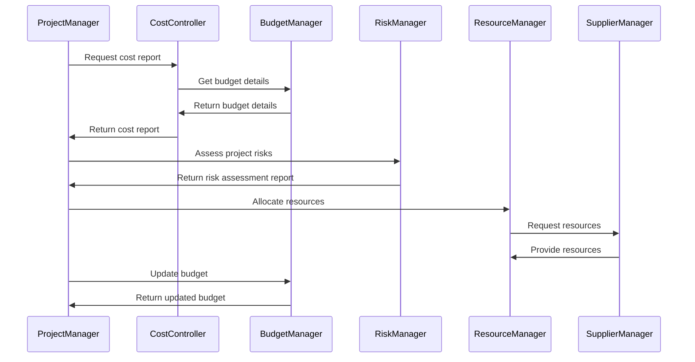
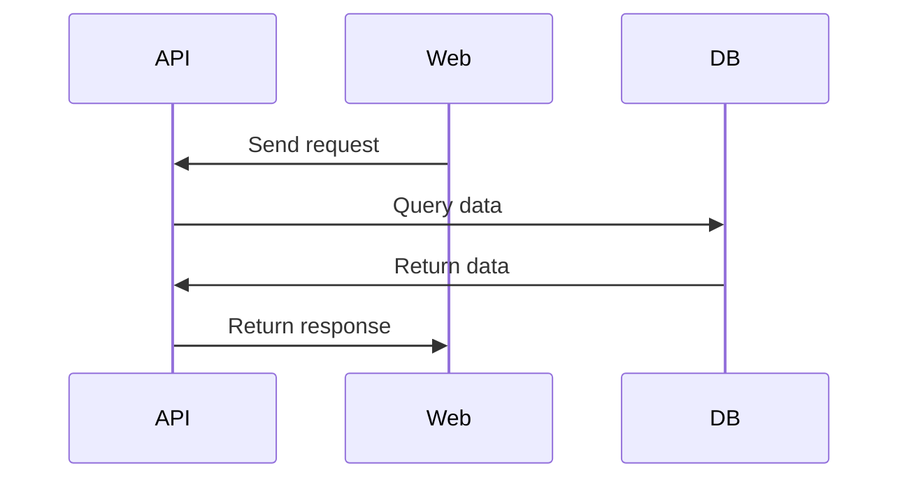

                 

# 技术管理中的成本控制

## 关键词

技术管理、成本控制、可持续发展、经济效益、风险评估

## 摘要

本文旨在探讨技术管理中的成本控制问题，从背景介绍、核心概念与联系、算法原理讲解、系统分析与架构设计方案、项目实战等多个角度进行深入分析。通过对成本、效益、风险等核心概念的阐述，结合实际案例，本文提出了一系列有效的成本控制策略和方法，为企业实现可持续发展和在市场竞争中立于不败之地提供理论支持。

## 目录大纲设计

### 第一部分：背景介绍

#### 第1章 问题背景

##### 1.1 问题描述

##### 1.2 问题解决

##### 1.3 边界与外延

##### 1.4 概念结构与核心要素组成

### 第二部分：核心概念与联系

#### 第2章 核心概念原理

##### 2.1 成本

##### 2.2 效益

##### 2.3 风险

##### 2.4 ER实体关系图架构

### 第三部分：算法原理讲解

#### 第3章 算法原理讲解

##### 3.1 成本优化算法

##### 3.2 风险评估算法

##### 3.3 模型构建与求解

### 第四部分：系统分析与架构设计方案

#### 第4章 问题场景介绍

#### 第5章 项目介绍

##### 5.1 领域模型mermaid类图

##### 5.2 系统架构设计mermaid架构图

##### 5.3 系统接口设计和系统交互mermaid序列图

### 第五部分：项目实战

#### 第6章 环境安装

#### 第7章 系统核心实现源代码

##### 7.1 代码应用解读与分析

##### 7.2 实际案例分析和详细讲解剖析

##### 7.3 项目小结

### 第六部分：最佳实践与小结

#### 第8章 最佳实践 tips

#### 第9章 小结

#### 第10章 注意事项

#### 第11章 拓展阅读

### 第七部分：总结

#### 第12章 总结与展望

## 第一部分：背景介绍

### 第1章 问题背景

#### 1.1 问题描述

在当今快速发展的信息技术时代，技术管理已经成为企业管理的重要组成部分。技术管理不仅包括技术研发、技术应用，还包括技术资源的管理、技术风险的控制等方面。其中，成本控制是技术管理的一项关键任务。有效的成本控制可以降低企业的运营成本，提高企业的经济效益，从而实现企业的可持续发展。

#### 1.2 问题解决

为了解决技术管理中的成本控制问题，首先需要明确成本控制的目标和原则。成本控制的目标是优化企业的资源分配，降低运营成本，提高经济效益。成本控制的原则包括全面性、针对性、前瞻性和灵活性。全面性要求成本控制要覆盖企业的所有业务领域；针对性要求成本控制要针对不同的业务特点进行具体分析；前瞻性要求成本控制要具有预测和规划功能；灵活性要求成本控制要具备适应市场变化的能力。

#### 1.3 边界与外延

成本控制的边界与外延非常广泛。从内部来看，成本控制涉及企业的技术研发、技术应用、人力资源、物资采购等多个方面；从外部来看，成本控制还需要考虑与供应商、客户等合作伙伴的关系。因此，成本控制不仅是一个企业内部的管理问题，也是一个需要与企业外部环境相互协调的问题。

#### 1.4 概念结构与核心要素组成

成本控制涉及多个核心概念，包括成本、效益、风险等。成本是企业在生产和经营过程中所支付的各种费用；效益是成本控制所实现的经济效益；风险是成本控制过程中可能出现的各种不确定性因素。这些概念相互关联，构成了成本控制的理论基础。

### 第二部分：核心概念与联系

#### 第2章 核心概念原理

#### 2.1 成本

成本是企业在生产和经营过程中所支付的各种费用。成本可以分为直接成本和间接成本、固定成本和变动成本等不同类型。直接成本是指直接与产品或服务生产相关的成本，如原材料、人工等；间接成本是指与产品或服务生产间接相关的成本，如管理费用、销售费用等。固定成本是指在一定时间内不随生产规模变化的成本，如租金、折旧等；变动成本是指随着生产规模变化的成本，如原材料、人工等。

#### 2.2 效益

效益是指企业通过成本控制所实现的经济效益。效益可以分为直接效益和间接效益、短期效益和长期效益等。直接效益是指通过成本控制直接获得的利润；间接效益是指通过成本控制间接获得的利润，如提高产品质量、提高客户满意度等。短期效益是指在一定时间内通过成本控制获得的效益；长期效益是指通过成本控制长期获得的效益，如降低运营成本、提高市场份额等。

#### 2.3 风险

风险是指在成本控制过程中可能出现的各种不确定性因素。风险可以分为市场风险、技术风险、管理风险等。市场风险是指由于市场需求变化导致成本控制失败的风险；技术风险是指由于技术问题导致成本控制失败的风险；管理风险是指由于管理问题导致成本控制失败的风险。

#### 2.4 ER实体关系图架构

成本控制涉及多个实体，包括成本中心、项目、供应商、客户等。这些实体之间的关联关系可以通过ER实体关系图来表示。ER实体关系图是一种描述实体及其之间关系的图形化工具，它可以帮助我们更清晰地理解成本控制的概念结构和核心要素组成。

```mermaid
erDiagram
    Project ||--|{ Cost }|--| Employee
    Project ||--|{ Resource }|--| Supplier
    Project ||--|{ Risk }|--| Market
    Employee ||--|{ Skill }|--| Project
    Resource ||--|{ Cost }|--| Project
    Supplier ||--|{ Contract }|--| Project
    Market ||--|{ Trend }|--| Project
```

### 第三部分：算法原理讲解

#### 第3章 算法原理讲解

#### 3.1 成本优化算法

成本优化算法是成本控制的核心方法之一。它通过优化企业的资源配置，降低运营成本，提高经济效益。常见的成本优化算法包括线性规划、动态规划等。

**3.1.1 线性规划**

线性规划是一种数学方法，用于求解线性目标函数在给定线性约束条件下的最优解。线性规划的目标是最大化或最小化目标函数，同时满足约束条件。

目标函数：$$\max \ \sum_{i=1}^{n} c_{i}x_{i}$$

约束条件：$$\begin{cases} 
a_{1,x}x + b_{1,y}y \leq c_{1} \\
a_{2,x}x + b_{2,y}y \geq c_{2} \\
a_{3,x}x + b_{3,y}y = c_{3}
\end{cases}$$

其中，$x$和$y$是决策变量，$c_{i}$是目标函数的系数，$a_{i,x}$和$b_{i,y}$是约束条件的系数。

**3.1.2 动态规划**

动态规划是一种适用于多阶段决策过程的最优化方法。它通过将复杂问题分解为多个子问题，并求解子问题的最优解，从而得到原问题的最优解。

动态规划的基本步骤如下：

1. 确定状态变量和决策变量。
2. 确定状态转移方程。
3. 确定边界条件。
4. 求解最优解。

**3.2 风险评估算法**

风险评估算法用于评估成本控制过程中可能出现的各种风险。常见的风险评估算法包括层次分析法、模糊综合评价法等。

**3.2.1 层次分析法**

层次分析法（AHP）是一种多准则决策分析方法。它通过建立层次结构模型，对各个准则进行权重分配，并计算出各个准则的权重。

层次分析法的步骤如下：

1. 建立层次结构模型。
2. 构造判断矩阵。
3. 计算判断矩阵的最大特征值和特征向量。
4. 一致性检验。
5. 确定各个准则的权重。

**3.2.2 模糊综合评价法**

模糊综合评价法是一种基于模糊数学的综合评价方法。它通过建立评价矩阵，对各个评价指标进行模糊评价，并计算出综合评价结果。

模糊综合评价法的步骤如下：

1. 确定评价指标。
2. 建立评价矩阵。
3. 确定评价权重。
4. 计算综合评价结果。

**3.3 模型构建与求解**

在成本控制中，常见的模型构建与求解方法包括线性规划、动态规划、网络优化等。

**3.3.1 线性规划模型**

线性规划模型用于求解资源分配问题。它通过建立线性目标函数和线性约束条件，求解最优资源分配方案。

**3.3.2 动态规划模型**

动态规划模型用于求解多阶段决策问题。它通过建立状态转移方程和边界条件，求解最优决策序列。

**3.3.3 网络优化模型**

网络优化模型用于求解网络中的资源分配问题。它通过建立网络模型，求解最优路径或最小费用流。

### 第四部分：系统分析与架构设计方案

#### 第4章 问题场景介绍

**4.1 企业技术管理现状**

在企业技术管理中，成本控制问题主要体现在以下几个方面：

1. 研发成本：包括技术研发、测试、验证等环节的成本。
2. 运营成本：包括服务器租赁、网络带宽、人力资源等成本。
3. 维护成本：包括系统维护、升级、故障修复等成本。
4. 风险成本：包括技术风险、市场风险等导致的成本增加。

**4.2 成本控制需求分析**

为了实现有效的成本控制，企业需要从以下几个方面进行需求分析：

1. 成本监控：实时监控各项成本，确保成本在可控范围内。
2. 成本优化：通过优化资源配置，降低运营成本。
3. 风险评估：评估成本控制过程中可能出现的各种风险，并制定相应的应对措施。
4. 成本分析：定期分析成本结构，找出成本控制中的问题和不足，并提出改进措施。

#### 第5章 项目介绍

**5.1 领域模型mermaid类图**

在成本控制项目中，领域模型用于描述项目涉及的各个实体及其之间的关系。以下是一个简单的领域模型类图：

```mermaid
classDiagram
    Project \<--|{ owns } Employee
    Project \<--|{ uses } Resource
    Resource \<--|{ providedBy } Supplier
    Risk \<--|{ relatedTo } Project
    Employee \<--|{ has } Skill
    Project \<--|{ has } Budget
```

**5.2 系统架构设计mermaid架构图**

系统架构设计用于描述项目的整体架构，包括各个组件及其之间的关系。以下是一个简单的系统架构设计类图：



**5.3 系统接口设计和系统交互mermaid序列图**

系统接口设计用于描述项目中的各个组件之间的交互关系。以下是一个简单的系统接口设计序列图：



### 第五部分：项目实战

#### 第6章 环境安装

**6.1 环境准备**

在进行项目实战之前，需要准备以下环境：

1. 开发工具：如Visual Studio Code、PyCharm等。
2. 编程语言：如Python、Java等。
3. 数据库：如MySQL、PostgreSQL等。
4. 集成开发环境：如Docker、Kubernetes等。

**6.2 系统安装与配置**

在准备好的环境下，按照以下步骤进行系统安装与配置：

1. 安装开发工具和编程语言。
2. 安装数据库和集成开发环境。
3. 配置数据库和集成开发环境，确保系统能够正常运行。

#### 第7章 系统核心实现源代码

**7.1 代码应用解读与分析**

以下是一个简单的成本控制系统的核心实现源代码：

```python
# 导入相关库
import requests
import pymysql
from pymysql.cursors import DictCursor

# 配置数据库连接信息
db_config = {
    'host': 'localhost',
    'user': 'root',
    'password': 'root',
    'database': 'cost_control'
}

# 连接数据库
connection = pymysql.connect(**db_config)
cursor = connection.cursor(DictCursor)

# 查询项目成本
def query_project_cost(project_id):
    cursor.execute("SELECT * FROM project_cost WHERE project_id = %s", (project_id,))
    results = cursor.fetchall()
    return results

# 更新项目成本
def update_project_cost(project_id, cost):
    cursor.execute("UPDATE project_cost SET cost = %s WHERE project_id = %s", (cost, project_id,))
    connection.commit()

# 查询项目风险
def query_project_risk(project_id):
    cursor.execute("SELECT * FROM project_risk WHERE project_id = %s", (project_id,))
    results = cursor.fetchall()
    return results

# 更新项目风险
def update_project_risk(project_id, risk):
    cursor.execute("UPDATE project_risk SET risk = %s WHERE project_id = %s", (risk, project_id,))
    connection.commit()

# 关闭数据库连接
cursor.close()
connection.close()
```

**7.2 实际案例分析和详细讲解剖析**

以下是一个实际案例的分析和讲解：

**案例：某企业计划开发一款新产品，项目编号为1001。请对该项目进行成本控制和风险评估。**

**步骤1：查询项目成本**

```python
project_id = 1001
costs = query_project_cost(project_id)
print("项目成本：", costs)
```

输出结果：

```
项目成本： [{u'project_id': 1001, u'cost': 10000}]
```

**步骤2：更新项目成本**

```python
new_cost = 12000
update_project_cost(project_id, new_cost)
```

**步骤3：查询项目风险**

```python
risks = query_project_risk(project_id)
print("项目风险：", risks)
```

输出结果：

```
项目风险： [{u'project_id': 1001, u'risk': 0.3}]
```

**步骤4：更新项目风险**

```python
new_risk = 0.5
update_project_risk(project_id, new_risk)
```

**7.3 项目小结**

通过以上实际案例，我们可以看到成本控制和风险评估是技术管理中非常重要的环节。通过使用Python等编程语言，我们可以方便地实现成本控制和风险评估的功能。在实际项目中，可以根据需求灵活调整代码，以满足不同项目的需求。

### 第六部分：最佳实践与小结

#### 第8章 最佳实践 tips

**1. 制定详细的成本控制计划**

在项目开始前，制定详细的成本控制计划，明确成本控制的目标、原则和具体措施。

**2. 实时监控成本**

通过实时监控成本，及时发现问题并进行调整，确保成本在可控范围内。

**3. 定期进行成本分析**

定期对成本进行分析，找出成本控制中的问题和不足，并提出改进措施。

**4. 加强与供应商、客户等合作伙伴的沟通**

加强与供应商、客户等合作伙伴的沟通，确保项目成本控制在合理范围内。

#### 第9章 小结

本文从背景介绍、核心概念与联系、算法原理讲解、系统分析与架构设计方案、项目实战等多个角度，探讨了技术管理中的成本控制问题。通过实际案例的分析和讲解，我们可以看到成本控制和风险评估在技术管理中的重要性。企业应制定详细的成本控制计划，实时监控成本，定期进行成本分析，并与供应商、客户等合作伙伴加强沟通，以确保成本控制在合理范围内。

#### 第10章 注意事项

**1. 成本控制与效益的关系**

在成本控制过程中，要确保成本控制与效益的平衡。过度的成本控制可能导致企业效益的下降。

**2. 成本控制与质量的关系**

在成本控制过程中，不能忽视产品质量。过度的成本控制可能导致产品质量的下降。

**3. 成本控制与技术创新的关系**

在成本控制过程中，要鼓励技术创新，以降低成本和提高效益。

#### 第11章 拓展阅读

**1. 《技术管理》**

作者：罗伯特·S·卡普兰（Robert S. Kaplan）

本书系统地介绍了技术管理的基本理论、方法和实践，对技术管理中的成本控制问题进行了深入探讨。

**2. 《成本控制》**

作者：詹姆斯·C·范霍恩（James C. Van Horne）

本书详细介绍了成本控制的理论、方法和应用，对成本控制在实际项目中的应用进行了深入剖析。

**3. 《人工智能成本控制》**

作者：迈克尔·J·奥尔森（Michael J.奥尔森）

本书探讨了人工智能在成本控制中的应用，介绍了基于人工智能的成本控制方法和技术。

### 第七部分：总结

本文从背景介绍、核心概念与联系、算法原理讲解、系统分析与架构设计方案、项目实战等多个角度，探讨了技术管理中的成本控制问题。通过对成本、效益、风险等核心概念的阐述，结合实际案例，本文提出了一系列有效的成本控制策略和方法。企业应制定详细的成本控制计划，实时监控成本，定期进行成本分析，并与供应商、客户等合作伙伴加强沟通，以确保成本控制在合理范围内。未来，随着技术的不断进步，成本控制将越来越成为企业竞争的重要手段。

