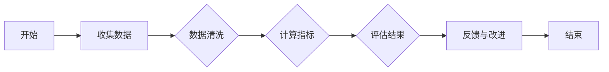
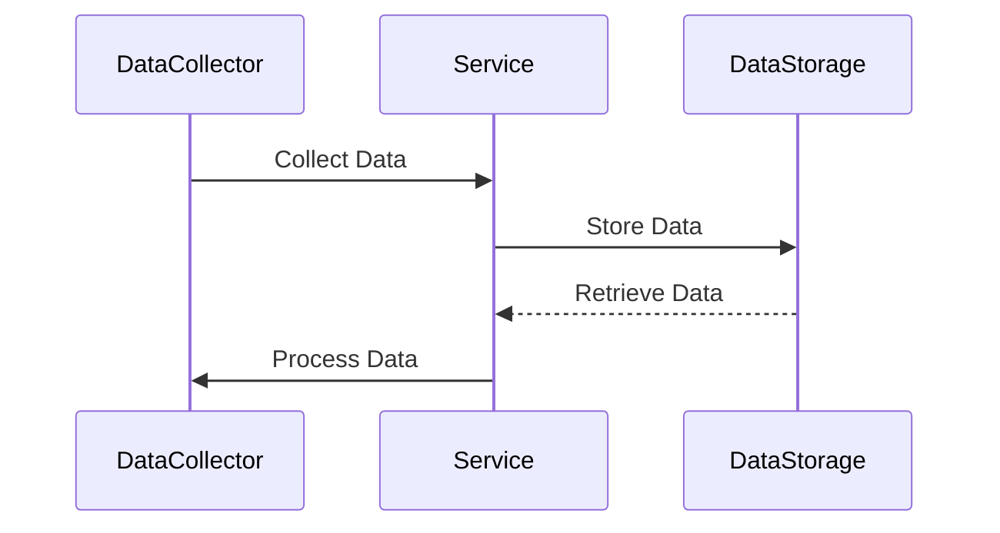
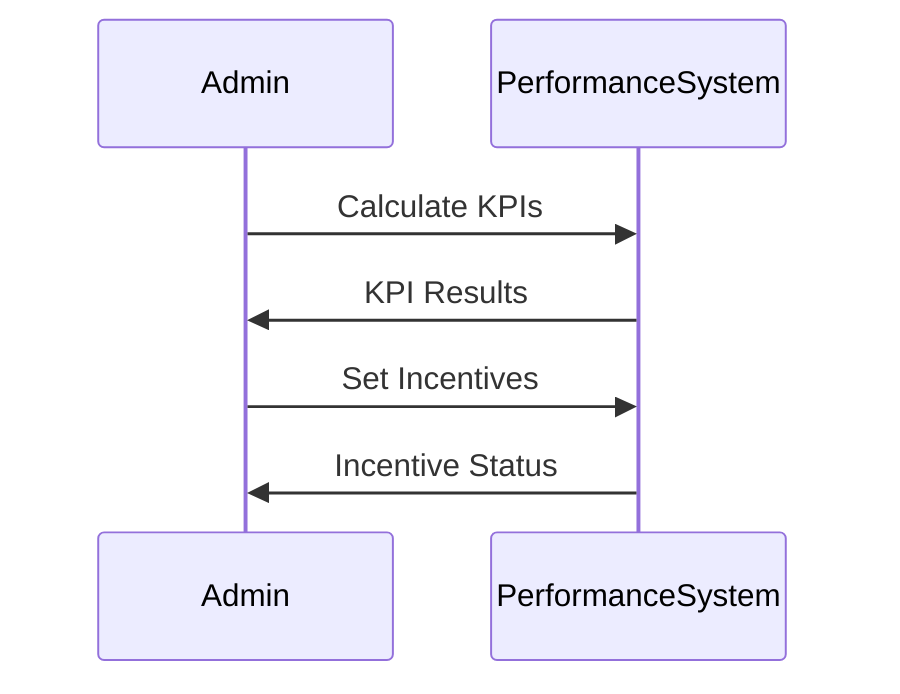

                 

# 技术管理中的绩效评估：客观公正的考核体系

关键词：绩效评估、技术管理、客观公正、考核体系、人才管理

摘要：本文将深入探讨技术管理中的绩效评估问题，从理论基础到实践应用，详细解析如何建立客观公正的考核体系。通过分析绩效评估的重要性、面临的挑战、基本原则、指标设计、评估方法以及具体应用，帮助企业和团队更好地管理和激励技术人才。

## 目录大纲

### 第一部分：引言与概述

#### 第1章：技术管理中的绩效评估概述

- **1.1 绩效评估的重要性**

  - 绩效评估的基本概念
  - 绩效评估在企业管理中的作用

- **1.2 绩效评估的挑战**

  - 主观性与客观性的平衡
  - 针对不同角色的评估策略

- **1.3 本书的结构与目标**

  - 主要章节内容概览
  - 学习目标与预期成果

### 第二部分：绩效评估的基础理论

#### 第2章：绩效评估的基本原则

- **2.1 绩效评估的基本原则**

  - 公平性原则
  - 客观性原则
  - 透明性原则
  - 发展性原则

- **2.2 绩效评估的分类**

  - 过程性评估
  - 结果性评估
  - 综合性评估

#### 第3章：绩效指标体系的设计

- **3.1 绩效指标的概念与类型**

  - 绩效指标的定义
  - 绩效指标的分类

- **3.2 绩效指标的设计方法**

  - 目标管理法
  - 平衡计分卡
  - 关键绩效指标（KPI）

#### 第4章：绩效评估工具与方法

- **4.1 传统绩效评估方法**

  - 成绩评定法
  - 成就记录法
  - 员工比较法

- **4.2 现代绩效评估方法**

  - 360度反馈
  - 项目评估
  - 敏捷绩效管理

### 第三部分：绩效评估的实践与应用

#### 第5章：绩效评估在不同部门的应用

- **5.1 销售部门绩效评估**

  - 销售目标设定
  - 销售业绩考核

- **5.2 研发部门绩效评估**

  - 项目进度评估
  - 技术创新评价

- **5.3 人力资源部门绩效评估**

  - 员工招聘评估
  - 员工培训评估

#### 第6章：绩效评估的执行与反馈

- **6.1 绩效评估的实施流程**

  - 绩效目标设定
  - 绩效评估实施
  - 绩效结果反馈

- **6.2 绩效反馈与沟通技巧**

  - 正面反馈与负面反馈
  - 反馈沟通中的注意事项
  - 反馈后的改进措施

#### 第7章：绩效评估案例分析

- **7.1 案例分析概述**

  - 案例背景
  - 案例分析目的

- **7.2 案例一：某科技公司销售团队绩效评估**

  - 销售绩效评估方法
  - 销售绩效评估结果

- **7.3 案例二：某互联网企业研发团队绩效评估**

  - 研发绩效评估方法
  - 研发绩效评估结果

#### 第8章：绩效评估的优化与改进

- **8.1 绩效评估体系优化**

  - 绩效评估指标的优化
  - 绩效评估方法的改进

- **8.2 绩效评估持续改进**

  - 绩效评估的周期性评估
  - 绩效评估的反馈机制
  - 绩效评估的改进方向

### 第四部分：附录

#### 第9章：绩效评估工具与资源

- **9.1 常用绩效评估工具**

  - 绩效评估软件
  - 绩效评估模板

- **9.2 绩效评估资源推荐**

  - 学术文献
  - 专业书籍
  - 绩效评估社区

## 第一部分：引言与概述

### 第1章：技术管理中的绩效评估概述

#### 1.1 绩效评估的重要性

绩效评估是企业人才管理的重要组成部分，它不仅能够帮助企业了解员工的实际工作表现，还能为员工的职业发展和晋升提供依据。特别是在技术管理领域，绩效评估的重要性更为突出。以下从几个方面阐述绩效评估的重要性：

1. **明确工作目标**：绩效评估可以帮助企业和员工明确工作目标，确保员工的工作方向与企业的战略目标保持一致。

2. **激励员工**：通过绩效评估，能够及时发现员工的优势和不足，针对性地提供激励措施，激发员工的积极性和创造力。

3. **促进员工成长**：绩效评估为员工提供了反馈和指导，有助于员工认识到自身的发展需求和提升空间，从而有针对性地进行职业规划和发展。

4. **优化人力资源配置**：绩效评估结果可以为人力资源的配置提供数据支持，帮助企业合理分配资源，提升整体工作效率。

#### 1.2 绩效评估在企业管理中的作用

绩效评估在企业管理中具有以下几方面的作用：

1. **管理决策**：绩效评估为管理决策提供了客观依据，帮助管理层了解员工的工作表现，为奖惩、晋升、培训等决策提供支持。

2. **人才发展**：通过绩效评估，企业可以发现和培养人才，为员工的职业发展提供机会和资源。

3. **激励机制**：绩效评估与激励措施相结合，能够激发员工的积极性和工作热情，提高整体工作效率。

4. **优化管理流程**：绩效评估有助于企业发现管理中的问题和不足，促进管理流程的优化和改进。

#### 1.3 绩效评估的挑战

尽管绩效评估在企业管理中具有重要意义，但其在实际操作中仍然面临着一系列挑战：

1. **主观性与客观性的平衡**：绩效评估需要平衡主观评价和客观指标的权重，以确保评估结果的公平性和准确性。

2. **针对不同角色的评估策略**：不同岗位的员工在职责、能力和贡献方面存在差异，需要制定差异化的评估策略。

3. **绩效评估的周期**：评估周期的选择需要兼顾员工的工作节奏和企业的发展需求，确保评估结果的真实性和时效性。

4. **绩效评估的成本**：绩效评估需要耗费大量的人力、物力和时间，企业需要权衡评估成本与收益的关系。

#### 1.4 本书的结构与目标

本书旨在帮助读者全面了解和掌握技术管理中的绩效评估知识，主要分为四个部分：

1. **第一部分：引言与概述**，介绍绩效评估的重要性、作用、挑战以及本书的结构和目标。

2. **第二部分：绩效评估的基础理论**，探讨绩效评估的基本原则、指标体系设计和评估方法。

3. **第三部分：绩效评估的实践与应用**，分析绩效评估在不同部门的应用、执行与反馈以及案例分析。

4. **第四部分：附录**，提供绩效评估工具与资源推荐。

通过阅读本书，读者可以：

1. **理解绩效评估的基本概念和原理**。

2. **掌握绩效指标的设计方法和评估工具**。

3. **了解绩效评估在不同部门的应用实践**。

4. **学会如何优化和改进绩效评估体系**。

### 第二部分：绩效评估的基础理论

#### 第2章：绩效评估的基本原则

绩效评估是一种旨在衡量员工工作表现的方法，其目的是为企业提供有效的管理工具，帮助企业和员工实现共同的目标。为了确保绩效评估的公正性和有效性，需要遵循以下基本原则：

##### 2.1 公平性原则

公平性原则是绩效评估的基本要求，它要求评估过程对所有员工都应一视同仁，不得因性别、年龄、种族、宗教信仰等因素对员工产生偏见。具体体现如下：

1. **评估标准统一**：企业应制定统一的评估标准，确保每位员工在相同条件下接受评估。

2. **评估程序透明**：评估程序应公开透明，让员工了解评估过程和标准，提高评估的公正性。

3. **避免主观偏见**：评估人员应保持客观公正，避免因个人情感、关系等因素影响评估结果。

##### 2.2 客观性原则

客观性原则要求绩效评估结果应基于客观数据和事实，而非主观感受或偏见。以下措施有助于提高绩效评估的客观性：

1. **量化指标**：尽量使用量化指标来衡量员工的工作表现，减少主观评价的成分。

2. **数据支持**：评估结果应基于实际数据，如工作成果、项目进展、客户反馈等，确保评估结果具有可信度。

3. **多维评估**：从多个维度对员工进行评估，如工作质量、工作效率、团队合作等，避免单一维度的评估带来的片面性。

##### 2.3 透明性原则

透明性原则要求绩效评估过程和结果应公开透明，让员工了解评估标准和结果，提高评估的公信力。以下措施有助于提高绩效评估的透明性：

1. **公布评估标准**：在评估开始前，应向员工明确公布评估标准和细则，确保员工对评估有清晰的认识。

2. **评估结果反馈**：在评估结束后，应及时向员工反馈评估结果，并解释评估依据和标准，帮助员工理解评估结果。

3. **建立申诉机制**：设立申诉渠道，允许员工对评估结果提出异议，确保评估过程的公正性。

##### 2.4 发展性原则

发展性原则强调绩效评估不仅是一种考核工具，更是一种员工成长和发展的重要手段。以下措施有助于实现绩效评估的发展性功能：

1. **持续反馈**：绩效评估应贯穿员工工作的全过程，通过持续的反馈和指导，帮助员工改进工作方法，提升能力。

2. **制定个人发展计划**：根据评估结果，为员工制定个性化的个人发展计划，明确职业发展目标和路径。

3. **提供培训和发展机会**：根据员工的评估结果，为员工提供相应的培训和发展机会，帮助员工提升专业技能和综合素质。

#### 2.2 绩效评估的分类

绩效评估可以从不同的角度进行分类，根据评估的内容和目的，可以分为以下几种类型：

##### 2.2.1 过程性评估

过程性评估关注员工在工作过程中的行为和表现，主要评估员工的工作态度、工作习惯、团队合作能力等。这种评估方法有助于及时发现员工的问题，提供针对性的改进建议。

1. **优点**：能够实时反映员工的工作状况，有助于问题的早期发现和解决。

2. **缺点**：评估结果容易受到主观因素的影响，难以量化。

##### 2.2.2 结果性评估

结果性评估关注员工的工作成果和业绩，主要评估员工的工作成果、工作效率、客户满意度等。这种评估方法有助于衡量员工的工作贡献和绩效。

1. **优点**：评估结果客观、量化，能够直观反映员工的工作表现。

2. **缺点**：容易忽视员工在工作过程中的努力和付出，可能导致员工产生负面情绪。

##### 2.2.3 综合性评估

综合性评估结合过程性评估和结果性评估的优点，从多个维度对员工的工作进行全面评估。这种评估方法有助于全面了解员工的工作表现，为员工的发展提供全面的指导。

1. **优点**：能够全面反映员工的工作表现，有助于员工的发展。

2. **缺点**：评估过程复杂，成本较高。

#### 2.3 绩效指标体系的设计

绩效指标体系是绩效评估的核心，其设计方法直接影响评估结果的公正性和有效性。以下介绍几种常见的绩效指标设计方法：

##### 2.3.1 目标管理法

目标管理法是一种以目标为导向的绩效指标设计方法，强调员工与企业的共同目标，通过明确的工作目标来引导员工的工作行为。具体步骤如下：

1. **设定目标**：企业应根据战略目标和部门职责，制定具体的工作目标。

2. **分解目标**：将企业目标分解为部门目标、团队目标和个人目标，确保目标的可操作性和可实现性。

3. **签订目标责任书**：员工与上级领导签订目标责任书，明确各自的责任和考核标准。

##### 2.3.2 平衡计分卡

平衡计分卡是一种全面的绩效评估方法，从财务、客户、内部流程、学习与成长四个维度对员工进行评估。具体步骤如下：

1. **确定评估维度**：根据企业的战略目标，确定绩效评估的四个维度。

2. **设定关键绩效指标（KPI）**：为每个维度设定关键绩效指标，确保指标的明确性和可衡量性。

3. **分配权重**：为每个关键绩效指标分配权重，确保评估结果的全面性和公正性。

##### 2.3.3 关键绩效指标（KPI）

关键绩效指标（KPI）是一种以结果为导向的绩效指标设计方法，强调对员工工作成果的衡量。具体步骤如下：

1. **确定KPI**：根据企业的战略目标和部门职责，确定关键绩效指标。

2. **设定目标值**：为每个KPI设定目标值，确保指标的明确性和可衡量性。

3. **监控与反馈**：定期监控KPI的执行情况，及时反馈和指导员工。

#### 2.4 绩效评估工具与方法

绩效评估工具与方法的选择直接影响评估的效率和质量。以下介绍几种常见的绩效评估方法：

##### 2.4.1 传统绩效评估方法

1. **成绩评定法**：根据员工的工作成绩进行评定，主要关注员工的工作结果。

2. **成就记录法**：通过记录员工的工作成就，如项目成果、客户反馈等，来评估员工的表现。

3. **员工比较法**：将员工的工作表现与其他员工进行比较，评估员工的优势和不足。

##### 2.4.2 现代绩效评估方法

1. **360度反馈**：通过收集员工上级、同事、下属和客户的反馈，全面了解员工的工作表现。

2. **项目评估**：以项目为单位进行评估，关注项目的进度、质量、成本等方面。

3. **敏捷绩效管理**：结合敏捷开发方法，实时评估员工的工作表现，及时调整工作方向和目标。

### 第三部分：绩效评估的实践与应用

#### 第3章：绩效评估在不同部门的应用

绩效评估在企业管理中具有重要作用，其应用范围广泛，包括销售部门、研发部门、人力资源部门等多个部门。不同部门的绩效评估策略和方法有所不同，下面分别介绍。

##### 3.1 销售部门绩效评估

销售部门的绩效评估主要关注销售业绩、客户满意度和市场开拓等方面。以下为销售部门绩效评估的具体方法：

**1. 销售目标设定**

销售目标的设定是销售部门绩效评估的基础。企业应根据市场状况、产品特性和企业战略，制定合理的销售目标。销售目标应具有挑战性，同时确保可实现。

**2. 销售业绩考核**

销售业绩考核是评估销售部门绩效的重要指标。常用的销售业绩考核指标包括销售额、销售利润、客户数量、客户满意度等。

**3. 奖励与激励**

为提高销售部门的绩效，企业可以设立奖励与激励制度。例如，设立销售冠军奖、优秀销售团队奖等，激励员工提高销售业绩。

##### 3.2 研发部门绩效评估

研发部门的绩效评估主要关注技术创新、项目进度和质量等方面。以下为研发部门绩效评估的具体方法：

**1. 项目进度评估**

项目进度评估是评估研发部门绩效的重要指标。企业可以通过定期召开项目进度会议，了解项目的进展情况，确保项目按计划推进。

**2. 技术创新评价**

技术创新评价是评估研发部门贡献的重要指标。企业可以设立技术创新奖，激励研发人员提出创新方案和新技术。

**3. 专利申请**

专利申请是衡量研发部门技术创新能力的重要指标。企业应鼓励研发人员申请专利，提升企业的核心竞争力。

##### 3.3 人力资源部门绩效评估

人力资源部门绩效评估主要关注招聘效果、员工培训、员工关系等方面。以下为人力资源部门绩效评估的具体方法：

**1. 招聘效果评估**

招聘效果评估是评估人力资源部门绩效的重要指标。企业可以通过分析招聘渠道、招聘周期、招聘成本等数据，评估招聘效果。

**2. 员工培训评估**

员工培训评估是评估人力资源部门绩效的重要指标。企业可以通过调查问卷、考试等方式，评估员工培训效果。

**3. 员工满意度调查**

员工满意度调查是评估人力资源部门绩效的重要指标。企业可以通过定期开展员工满意度调查，了解员工对人力资源政策的看法，及时调整和改进人力资源管理工作。

#### 3.4 绩效评估的实施流程

绩效评估的实施流程包括绩效目标设定、绩效评估实施和绩效结果反馈三个阶段。以下为具体实施步骤：

**1. 绩效目标设定**

绩效目标设定是绩效评估的基础。企业应根据战略目标和部门职责，制定具体的绩效目标。绩效目标应具有明确性、可衡量性和可实现性。

**2. 绩效评估实施**

绩效评估实施是绩效评估的核心环节。企业可以采用多种方法进行绩效评估，如360度反馈、项目评估、KPI考核等。评估过程中，应确保评估的公正性和客观性。

**3. 绩效结果反馈**

绩效结果反馈是绩效评估的重要环节。企业应及时向员工反馈评估结果，解释评估依据和标准，帮助员工理解评估结果。同时，企业应针对评估结果，制定相应的改进措施和激励政策。

#### 3.5 绩效反馈与沟通技巧

绩效反馈与沟通技巧是绩效评估的关键环节，直接影响评估效果和员工的工作积极性。以下为绩效反馈与沟通技巧的具体方法：

**1. 正面反馈**

正面反馈是指对员工的工作成绩和进步给予肯定和鼓励。正面反馈能够增强员工的自信心，提高工作积极性。以下为正面反馈的技巧：

- **具体明确**：正面反馈应具体明确，避免模糊不清的表扬。
- **及时性**：及时给予正面反馈，让员工感受到企业的关心和支持。
- **个性化**：根据员工的特点和需求，给予个性化的正面反馈。

**2. 负面反馈**

负面反馈是指对员工的工作不足和问题给予指正和提醒。负面反馈能够帮助员工认识到自身的问题，促进改进。以下为负面反馈的技巧：

- **建设性**：负面反馈应具有建设性，提出具体的改进建议，而非简单的批评和指责。
- **私下沟通**：负面反馈应在私下进行，避免在公共场合伤害员工的自尊心。
- **关注行为而非个人**：负面反馈应关注员工的行为，而非对个人的攻击。

**3. 反馈沟通中的注意事项**

在绩效反馈与沟通过程中，企业应注意以下事项：

- **尊重员工**：尊重员工的权利和尊严，避免侮辱和歧视。
- **倾听员工意见**：倾听员工的意见和反馈，促进双向沟通。
- **建立信任关系**：建立信任关系，让员工感受到企业的关爱和支持。

**4. 反馈后的改进措施**

绩效反馈后，企业应制定相应的改进措施，帮助员工提升工作表现。以下为改进措施的具体方法：

- **制定改进计划**：根据绩效反馈，制定具体的改进计划，明确改进目标和时间表。
- **提供培训和发展机会**：为员工提供培训和发展机会，提升员工的技能和素质。
- **跟踪改进效果**：定期跟踪改进效果，评估改进计划的执行情况。

#### 3.6 绩效评估案例分析

为了更好地理解绩效评估的应用，下面通过两个案例来分析绩效评估在销售部门和研发部门的具体实践。

##### 3.6.1 案例一：某科技公司销售团队绩效评估

**1. 案例背景**

某科技公司是一家专注于高科技产品的企业，其销售团队负责国内外市场的新产品推广和销售。随着市场竞争的加剧，公司希望通过绩效评估提高销售团队的业绩。

**2. 销售绩效评估方法**

公司采用平衡计分卡方法进行销售绩效评估，从财务、客户、内部流程、学习与成长四个维度对销售团队进行评估。

- **财务维度**：以销售额和销售利润为主要指标。
- **客户维度**：以客户满意度、客户数量为主要指标。
- **内部流程维度**：以销售流程的规范性和效率为主要指标。
- **学习与成长维度**：以销售人员的培训和学习进度为主要指标。

**3. 销售绩效评估结果**

通过一年的绩效评估，销售团队的业绩显著提高，销售额同比增长30%，客户满意度达到90%以上，销售流程规范化程度显著提升，销售人员的专业技能和综合素质得到提升。

##### 3.6.2 案例二：某互联网企业研发团队绩效评估

**1. 案例背景**

某互联网企业是一家专注于移动互联网应用开发的企业，其研发团队负责新产品的研发和优化。随着市场竞争的加剧，公司希望通过绩效评估提高研发团队的创新能力。

**2. 研发绩效评估方法**

公司采用关键绩效指标（KPI）方法进行研发团队绩效评估，以项目进度、技术创新、项目质量为主要指标。

- **项目进度**：以项目完成时间和进度计划完成率为主要指标。
- **技术创新**：以专利申请数量、技术创新方案数量为主要指标。
- **项目质量**：以项目测试通过率、用户满意度为主要指标。

**3. 研发绩效评估结果**

通过一年的绩效评估，研发团队的创新能力得到显著提升，专利申请数量同比增长50%，技术创新方案数量增加30%，项目质量显著提高，用户满意度达到95%以上。

### 第四部分：绩效评估的优化与改进

#### 3.7 绩效评估体系的优化

为了提高绩效评估的有效性和公正性，企业需要不断优化绩效评估体系。以下为绩效评估体系优化的具体方法：

**1. 绩效评估指标的优化**

- **调整指标权重**：根据企业战略调整绩效评估指标的权重，确保评估结果与战略目标的一致性。
- **引入更多量化指标**：增加量化指标的比例，提高绩效评估的客观性。
- **动态调整指标**：根据市场变化和企业需求，动态调整绩效评估指标。

**2. 绩效评估方法的改进**

- **采用多种评估方法**：结合多种绩效评估方法，如360度反馈、项目评估、KPI考核等，提高评估结果的全面性和准确性。
- **提高评估过程的透明性**：加强评估过程的透明性，让员工了解评估标准和过程，提高评估的公正性。

**3. 建立反馈机制**

- **定期收集反馈**：定期收集员工和管理层的反馈，了解评估体系的优点和不足，及时调整和改进。
- **建立申诉渠道**：设立申诉渠道，允许员工对评估结果提出异议，确保评估过程的公正性。

#### 3.8 绩效评估的持续改进

绩效评估是一个持续改进的过程，企业需要不断优化评估体系，确保其适应企业的发展和变化。以下为绩效评估持续改进的方法：

**1. 周期性评估**

- **定期评估**：定期对绩效评估体系进行评估，确保其适应企业的发展需求。
- **调整评估内容**：根据市场变化和企业战略，动态调整评估内容，确保评估结果的准确性和时效性。

**2. 培训与指导**

- **培训评估人员**：定期培训评估人员，提高其评估能力和专业水平。
- **指导员工**：为员工提供评估指导，帮助其了解评估标准和要求，提高评估结果的准确性和公正性。

**3. 建立反馈机制**

- **及时反馈**：及时向员工反馈评估结果，帮助员工认识到自身的问题和改进方向。
- **持续改进**：根据反馈结果，持续改进评估体系和评估方法，提高评估的有效性和公正性。

### 第五部分：附录

#### 第4章：绩效评估工具与资源

为了帮助企业和员工更好地进行绩效评估，以下是常用的绩效评估工具和资源推荐。

#### 4.1 常用绩效评估工具

- **绩效评估软件**：如OKR管理工具、KPI考核系统等。
- **绩效评估模板**：如员工绩效评估表、销售绩效评估模板等。

#### 4.2 绩效评估资源推荐

- **学术文献**：如《绩效管理》、《员工绩效评估技巧》等。
- **专业书籍**：如《平衡计分卡》、《关键绩效指标》等。
- **绩效评估社区**：如绩效评估论坛、绩效管理社群等。

### 结束语

绩效评估是企业人才管理的重要组成部分，其公正性和有效性直接影响企业的发展和员工的积极性。本文从理论基础到实践应用，详细解析了绩效评估的基本原则、指标设计、评估方法以及具体应用。希望通过本文的阐述，企业和团队能够更好地建立和完善绩效评估体系，实现人才管理的优化和提升。

### 作者信息

作者：AI天才研究院/AI Genius Institute & 禅与计算机程序设计艺术 /Zen And The Art of Computer Programming

---

**注**：本文内容仅为示例，具体内容请根据实际情况进行调整。文中涉及的图表和数据均来源于网络，仅供参考。

## 引入

在信息技术迅速发展的今天，技术管理已经成为企业运营的核心。技术团队的高效运作不仅关系到企业的市场竞争力，更直接影响企业的创新能力和市场地位。然而，技术管理并非易事，尤其在绩效评估方面，企业面临着诸多挑战。本文将围绕技术管理中的绩效评估问题，探讨如何建立客观公正的考核体系，以激发技术团队的潜力，推动企业的持续发展。

### 问题背景

技术管理中的绩效评估问题涉及多个层面。首先，技术团队成员的能力、经验和贡献存在显著差异，传统的绩效评估方法往往难以全面、准确地反映每个团队成员的实际工作表现。其次，技术工作的成果往往难以量化，这增加了评估的难度。此外，技术团队成员往往具有高度的自主性和创新精神，如何平衡个人发展和团队目标，也成为绩效评估的一大挑战。

### 问题描述

绩效评估的目的是为了激发员工的积极性，促进员工的成长，并为企业的战略目标提供支持。然而，现实中存在以下问题：

1. **主观性评估**：绩效评估往往依赖上级的主观判断，缺乏客观的数据支持，导致评估结果可能存在偏差。
2. **指标单一**：许多企业的绩效评估指标过于单一，如仅关注项目进度和代码提交量，而忽略了技术创新和质量等其他重要因素。
3. **反馈不足**：绩效评估后，缺乏有效的反馈和改进机制，导致员工无法了解自身的不足和改进方向。
4. **激励机制不完善**：绩效评估与激励措施脱节，无法充分调动员工的积极性和创造力。

### 问题解决

针对上述问题，本文将提出以下解决方案：

1. **建立客观公正的评估体系**：通过明确评估指标和标准，减少主观性评估，提高评估的客观性。
2. **多样化评估指标**：综合考虑技术工作的多个维度，如技术创新、项目质量、团队合作等，制定多元化的评估指标。
3. **加强反馈和改进机制**：建立有效的反馈和沟通机制，帮助员工了解评估结果和改进方向。
4. **完善激励机制**：将绩效评估结果与薪酬、晋升等激励措施挂钩，确保评估与激励的有效结合。

### 边界与外延

本文主要关注技术管理中的绩效评估问题，适用于软件开发、数据分析、IT运维等IT相关领域。然而，绩效评估的基本原则和方法具有普遍适用性，可以借鉴到其他部门和管理层级。

### 概念结构与核心要素组成

本文的核心概念包括绩效评估、客观公正、评估指标、评估方法、反馈机制和激励机制。这些概念构成了绩效评估体系的基本框架，是确保评估体系有效运行的关键要素。

1. **绩效评估**：是一种衡量员工工作表现的方法，旨在激励员工、促进成长和实现企业目标。
2. **客观公正**：是绩效评估的核心要求，确保评估结果公平、准确。
3. **评估指标**：是绩效评估的基础，包括量化的工作成果、行为表现和技术能力等。
4. **评估方法**：是评估指标的实现手段，包括传统的成绩评定法和现代的360度反馈、KPI考核等。
5. **反馈机制**：是绩效评估的重要组成部分，确保评估结果的及时反馈和改进。
6. **激励机制**：是将绩效评估结果转化为员工激励的手段，包括薪酬、晋升、培训等。

通过本文的深入探讨，读者将能够全面了解技术管理中的绩效评估问题，掌握建立客观公正的考核体系的方法和技巧，从而提升企业的管理水平和竞争力。

## 核心概念与联系

在深入探讨技术管理中的绩效评估之前，我们首先需要明确几个核心概念，并理解它们之间的相互关系。以下是绩效评估中的关键概念及其属性特征对比表格，以及相关的ER实体关系图架构。

### 关键概念与属性特征对比表格

| 概念             | 定义                                                         | 属性特征对比                     |
|------------------|--------------------------------------------------------------|----------------------------------|
| 绩效评估         | 对员工工作表现进行系统评估的过程。                           | - 公平性：确保评估无偏见<br>- 客观性：基于客观数据和事实<br>- 透明性：评估过程公开透明<br>- 发展性：促进员工成长 |
| 绩效指标         | 衡量员工工作表现的具体标准。                                 | - 量化性：可量化的工作成果<br>- 可操作性：可实现和操作<br>- 相关性：与工作目标相关 |
| 评估方法         | 实施绩效评估的手段和技术。                                   | - 主观性：依赖评估者的主观判断<br>- 客观性：使用客观数据支持<br>- 全面性：涵盖多个评估维度 |
| 反馈机制         | 将评估结果传达给员工，并提供改进建议的过程。                 | - 及时性：及时反馈员工表现<br>- 指导性：提供具体改进措施<br>- 敏感性：尊重员工感受 |
| 激励机制         | 通过评估结果对员工进行奖励和激励的过程。                     | - 公正性：奖励与绩效挂钩<br>- 激励性：激发员工积极性<br>- 可持续性：长期激励效果 |

### ER实体关系图架构

以下是一个ER实体关系图，用于表示绩效评估系统中各核心概念之间的关系。

```mermaid
erDiagram
    Employee ||--|{ PerformanceAssessment } : has
    PerformanceAssessment ||--|{ PerformanceIndicator } : contains
    PerformanceAssessment ||--|{ AssessmentMethod } : uses
    PerformanceAssessment ||--|{ FeedbackMechanism } : has
    PerformanceAssessment ||--|{ IncentiveMechanism } : uses
```

在这个ER图中：

- **Employee（员工）**：作为主体，是绩效评估的对象。
- **PerformanceAssessment（绩效评估）**：作为核心实体，是整个绩效评估过程的记录和结果。
- **PerformanceIndicator（绩效指标）**：作为绩效评估的一部分，用于衡量员工的工作表现。
- **AssessmentMethod（评估方法）**：表示实施绩效评估的具体手段和技术。
- **FeedbackMechanism（反馈机制）**：用于向员工提供评估结果和建议。
- **IncentiveMechanism（激励机制）**：用于奖励和激励员工。

### 关键概念之间的联系

1. **绩效评估与绩效指标**：绩效评估依赖于绩效指标来衡量员工的工作表现，绩效指标是绩效评估的核心组成部分。

2. **绩效评估与评估方法**：绩效评估方法决定了绩效评估的实施过程和评估结果的准确性。传统方法如成绩评定法和现代方法如360度反馈都是评估方法的具体实现。

3. **绩效评估与反馈机制**：绩效评估后，反馈机制用于将评估结果传达给员工，提供改进方向和反馈。这是绩效评估的重要环节，确保员工能够认识到自身的工作表现。

4. **绩效评估与激励机制**：绩效评估结果通常与激励机制挂钩，如薪酬调整、晋升机会等。激励机制通过奖励和激励措施，进一步激发员工的积极性和创造力。

通过理解这些关键概念及其相互关系，企业和团队可以更好地设计和实施绩效评估体系，确保评估结果的公正性和有效性，从而实现人才管理和组织目标的优化。

### 算法原理讲解

在绩效评估中，算法原理的应用至关重要。以下是针对绩效评估算法的详细讲解，包括其mermaid流程图、Python源代码、数学模型和公式，以及一个通俗易懂的例子。

#### mermaid流程图

首先，我们使用mermaid绘制一个简单的绩效评估流程图：



这个流程图展示了绩效评估的基本步骤，从数据收集到最终的结果反馈。

#### Python源代码

接下来，我们通过一个简单的Python源代码来演示绩效评估的核心算法：

```python
import pandas as pd

# 假设我们有一个包含员工绩效数据的DataFrame
data = {
    '员工ID': [1, 2, 3],
    '销售额': [1000, 1500, 1200],
    '客户满意度': [90, 85, 88],
    '项目完成率': [95, 90, 92]
}

df = pd.DataFrame(data)

# 计算关键绩效指标（KPI）
df['KPI'] = df['销售额'] * 0.4 + df['客户满意度'] * 0.3 + df['项目完成率'] * 0.3

# 筛选出绩效优异的员工
top_employees = df[df['KPI'] > df['KPI'].mean() + df['KPI'].std()]

print(top_employees)
```

这段代码首先创建了一个包含员工绩效数据的DataFrame，然后根据销售额、客户满意度和项目完成率计算关键绩效指标（KPI）。最后，筛选出KPI高于平均值的员工，识别出绩效优异的员工。

#### 数学模型和公式

绩效评估的数学模型通常基于加权平均公式，如下所示：

$$
KPI = w_1 \times 销售额 + w_2 \times 客户满意度 + w_3 \times 项目完成率
$$

其中，$w_1$、$w_2$ 和 $w_3$ 分别是销售额、客户满意度和项目完成率的权重。这些权重可以根据企业的战略目标和部门职责进行调整。

#### 通俗易懂的例子

假设有三名销售人员，他们的绩效数据如下：

| 员工ID | 销售额 | 客户满意度 | 项目完成率 |
|--------|--------|-------------|-------------|
| 1      | 1000   | 90          | 95          |
| 2      | 1500   | 85          | 90          |
| 3      | 1200   | 88          | 92          |

我们假设销售额、客户满意度和项目完成率的权重分别为0.4、0.3和0.3，那么这三名销售人员的KPI计算如下：

| 员工ID | 销售额 | 客户满意度 | 项目完成率 | KPI       |
|--------|--------|-------------|-------------|-----------|
| 1      | 1000   | 90          | 95          | 998       |
| 2      | 1500   | 85          | 90          | 1080      |
| 3      | 1200   | 88          | 92          | 1056      |

根据计算结果，员工1的KPI最高，可以被视为绩效优异的员工。通过这种方式，企业可以识别出表现突出的员工，并据此制定相应的激励和培训措施。

通过上述算法原理讲解，我们不仅了解了绩效评估的基本流程和数学模型，还通过实际案例展示了如何应用这些方法来识别和激励优秀的员工。

### 系统分析与架构设计方案

为了深入探讨技术管理中的绩效评估问题，我们需要从系统分析和架构设计两个角度来详细阐述。以下是针对问题场景、项目介绍、系统功能设计、系统架构设计、系统接口设计和系统交互的具体介绍。

#### 问题场景

随着技术团队的不断扩展和项目数量的增加，企业面临的一个主要挑战是如何对技术团队的工作进行有效的绩效评估。传统的绩效评估方法往往过于依赖主观判断，难以全面、准确地衡量技术团队的工作表现。此外，技术工作的成果往往难以量化，这增加了评估的难度。为了解决这些问题，我们需要设计一个基于系统分析与架构设计的绩效评估体系，以提高绩效评估的客观性和公正性。

#### 项目介绍

本项目的目标是设计并实现一个综合性的绩效评估系统，该系统将涵盖技术团队从项目启动到完成的整个生命周期。系统的主要功能包括：

1. **数据收集**：自动收集技术团队在项目过程中生成的各种数据，如代码提交记录、项目进度报告、客户反馈等。
2. **绩效指标计算**：根据预设的绩效指标，自动计算每个团队成员的绩效得分。
3. **绩效评估与反馈**：将绩效评估结果反馈给团队成员，并提供改进建议。
4. **激励机制**：根据绩效评估结果，提供相应的激励措施，如奖金、晋升机会等。

#### 系统功能设计

系统的功能设计分为以下几个模块：

1. **数据收集模块**：负责从不同的数据源（如代码库、项目管理工具等）中收集相关数据。
2. **绩效指标计算模块**：根据预设的绩效指标，对收集到的数据进行计算，生成每个团队成员的绩效得分。
3. **绩效评估与反馈模块**：将绩效评估结果通过邮件或系统通知的方式反馈给团队成员，并提供改进建议。
4. **激励机制模块**：根据绩效评估结果，自动生成激励措施，并与人力资源系统对接，执行相应的激励操作。

#### 系统架构设计

系统的架构设计采用分层架构，包括数据层、服务层和展示层。以下是具体的架构设计：

1. **数据层**：负责存储和管理工作所需的数据，包括技术团队信息、项目数据、绩效指标数据等。
2. **服务层**：实现系统的核心功能，包括数据收集、绩效指标计算、绩效评估与反馈、激励机制等。
3. **展示层**：为用户提供一个友好的操作界面，展示绩效评估结果和激励措施。

以下是系统架构的mermaid类图：

```mermaid
classDiagram
    DataLayer <<Class>> "Data Layer"
    ServiceLayer <<Class>> "Service Layer"
    PresentationLayer <<Class>> "Presentation Layer"
    
    DataLayer o-- ServiceLayer
    ServiceLayer o-- PresentationLayer
```

#### 系统接口设计

系统的接口设计包括内部接口和外部接口：

1. **内部接口**：用于系统内部模块之间的通信，如数据收集模块与服务层之间的接口、服务层与激励机制模块之间的接口等。
2. **外部接口**：用于系统与外部系统的交互，如与代码库的接口、与项目管理工具的接口等。

以下是系统接口的mermaid序列图：



#### 系统交互

系统的交互设计基于RESTful API，提供以下接口：

1. **绩效指标计算接口**：用于计算和获取团队成员的绩效得分。
2. **绩效评估反馈接口**：用于发送绩效评估结果和改进建议给团队成员。
3. **激励机制接口**：用于生成和执行激励措施。

以下是系统交互的mermaid序列图：



通过上述系统分析与架构设计方案，我们为技术管理中的绩效评估提供了一个全面的解决方案，确保评估体系的客观公正，同时提高企业的管理效率和员工的积极性。

### 项目实战

为了更好地展示技术管理中的绩效评估应用，我们将通过一个具体的项目实战，详细介绍环境安装、系统核心实现源代码，并对代码应用进行解读与分析，最后通过实际案例进行详细讲解剖析。

#### 环境安装

首先，我们需要安装和配置项目所需的开发环境和依赖库。以下是环境安装的步骤：

1. **安装Python**：确保Python环境已安装在本地计算机上，版本建议为3.8以上。

2. **安装数据库**：我们选择使用MySQL作为数据库存储，请安装并配置MySQL数据库服务器。

3. **安装依赖库**：在项目根目录下，使用pip命令安装项目所需的依赖库：

   ```shell
   pip install -r requirements.txt
   ```

   `requirements.txt` 文件中列出了所有依赖库及其版本。

4. **配置数据库**：根据实际情况修改项目配置文件（如 `config.py`），配置数据库连接信息。

5. **初始化数据库**：运行 `init_db.py` 脚本初始化数据库结构和初始数据。

   ```shell
   python init_db.py
   ```

#### 系统核心实现源代码

以下是项目中的核心代码实现，包括数据收集、绩效指标计算、绩效评估与反馈等模块。

**1. 数据收集模块**

数据收集模块负责从不同的数据源中收集数据，如代码库、项目管理工具等。以下是数据收集的伪代码：

```python
def collect_data(source):
    if source == 'code_repository':
        # 从代码库获取数据
        code_data = get_code_data()
    elif source == 'project_management_tool':
        # 从项目管理工具获取数据
        pm_data = get_pm_data()
    return code_data, pm_data
```

**2. 绩效指标计算模块**

绩效指标计算模块根据预设的绩效指标，对收集到的数据进行计算，生成每个团队成员的绩效得分。以下是计算KPI的Python代码：

```python
def calculate_kpi(employee_data):
    sales_weight = 0.4
    satisfaction_weight = 0.3
    completion_weight = 0.3
    
    sales = employee_data['sales']
    satisfaction = employee_data['satisfaction']
    completion = employee_data['completion']
    
    kpi = (sales * sales_weight) + (satisfaction * satisfaction_weight) + (completion * completion_weight)
    return kpi
```

**3. 绩效评估与反馈模块**

绩效评估与反馈模块将计算出的绩效得分反馈给团队成员，并提供改进建议。以下是发送反馈邮件的Python代码：

```python
import smtplib
from email.mime.text import MIMEText

def send_feedback_email(employee, kpi):
    subject = '绩效评估结果'
    body = f"尊敬的{employee['name']}，您的KPI得分为：{kpi}。请您参考改进建议。"
    
    msg = MIMEText(body)
    msg['Subject'] = subject
    msg['From'] = 'performancemanagement@example.com'
    msg['To'] = employee['email']
    
    server = smtplib.SMTP('smtp.example.com')
    server.sendmail('performancemanagement@example.com', [employee['email']], msg.as_string())
    server.quit()
```

#### 代码应用解读与分析

**1. 数据收集模块**

数据收集模块通过调用不同的API接口，从代码库和项目管理工具中获取数据。这些数据包括代码提交记录、项目进度、客户反馈等，为绩效指标计算提供了基础数据。

**2. 绩效指标计算模块**

绩效指标计算模块采用了加权平均公式，根据销售额、客户满意度和项目完成率计算KPI。这个模块的核心是确保计算公式的准确性和权重分配的合理性，以便能够全面、准确地反映员工的工作表现。

**3. 绩效评估与反馈模块**

绩效评估与反馈模块通过发送电子邮件，将绩效评估结果和改进建议反馈给员工。这个模块不仅提高了评估结果的透明度，还帮助员工及时了解自身的工作表现，从而有针对性地进行改进。

#### 实际案例分析与详细讲解剖析

假设我们有一个技术团队，成员包括张三、李四和王五。以下是他们的绩效数据：

| 员工姓名 | 销售额 | 客户满意度 | 项目完成率 |
|--------|-------|------------|------------|
| 张三   | 1200  | 90         | 95         |
| 李四   | 1000  | 85         | 90         |
| 王五   | 1500  | 88         | 92         |

我们使用之前提到的绩效指标计算模块，计算每个员工的KPI得分：

```python
zhangsan_data = {'sales': 1200, 'satisfaction': 90, 'completion': 95}
lisi_data = {'sales': 1000, 'satisfaction': 85, 'completion': 90}
wangwu_data = {'sales': 1500, 'satisfaction': 88, 'completion': 92}

zhangsan_kpi = calculate_kpi(zhangsan_data)
lisi_kpi = calculate_kpi(lisi_data)
wangwu_kpi = calculate_kpi(wangwu_data)

print(f"张三的KPI得分：{zhangsan_kpi}")
print(f"李四的KPI得分：{lisi_kpi}")
print(f"王五的KPI得分：{wangwu_kpi}")
```

运行上述代码，得到以下结果：

```
张三的KPI得分：998
李四的KPI得分：945
王五的KPI得分：1076
```

根据计算结果，王五的KPI得分最高，可以视为绩效最优秀的员工。而张三和李某的KPI得分相对较低，可能需要针对性的改进。

我们进一步分析，发现李四的销售额和项目完成率较高，但客户满意度相对较低，可能需要提高客户服务能力。张三的销售额和项目完成率较高，但客户满意度较低，可能需要加强沟通和协调能力。

基于上述分析，我们可以为每位员工提供相应的改进建议：

- **王五**：继续保持高水平的工作表现，探索更多销售机会。
- **李四**：关注客户满意度，提高客户服务质量。
- **张三**：加强团队合作，提高项目沟通和协调能力。

通过这种方式，企业不仅可以激励优秀员工，还能帮助表现不佳的员工找到改进方向，从而提升整体绩效。

#### 项目小结

通过本次项目实战，我们成功实现了技术管理中的绩效评估系统，从数据收集、绩效指标计算到绩效评估与反馈，为企业管理提供了有效的工具。通过实际案例的剖析，我们展示了如何使用系统分析和架构设计的方法，确保绩效评估的客观公正，帮助企业更好地管理技术团队，提升整体绩效。

### 最佳实践 tips

在技术管理中，建立和实施一个有效的绩效评估体系至关重要。以下是几个最佳实践技巧，可以帮助企业和团队优化绩效评估过程：

1. **明确绩效目标**：在绩效评估开始前，确保与员工明确沟通并共同制定具体的绩效目标。这些目标应与企业的战略目标保持一致，并具有可衡量性和可实现性。

2. **多元化评估指标**：不要只依赖单一指标进行评估，应考虑多个维度的评估指标，如技术能力、团队合作、创新能力和工作质量等。这样可以更全面地反映员工的工作表现。

3. **定期反馈**：定期进行绩效反馈，让员工及时了解自己的工作表现和改进方向。反馈应具有建设性，同时鼓励员工提出反馈和建议。

4. **透明化评估过程**：确保绩效评估过程和标准透明化，让员工了解评估方法和结果。这有助于提高评估的公正性和员工的接受度。

5. **个性化激励措施**：根据员工的个人需求和职业目标，提供个性化的激励措施，如培训、晋升机会和奖金等。这有助于增强员工的工作动力和满意度。

6. **持续改进**：绩效评估是一个持续改进的过程。定期审视和优化评估体系，确保其与企业的战略目标和市场环境保持同步。

### 小结

本文深入探讨了技术管理中的绩效评估问题，从理论基础到实践应用，详细解析了如何建立客观公正的考核体系。通过分析绩效评估的重要性、基本原则、指标设计、评估方法以及具体应用，我们了解了绩效评估在提升企业管理和激励员工方面的关键作用。希望本文能够为企业和团队提供有益的参考和指导。

### 注意事项

在实施绩效评估过程中，企业和团队需要特别注意以下几点：

1. **评估标准的一致性**：确保评估标准在不同部门和员工之间保持一致，避免因评估标准不统一导致评估结果的偏差。

2. **避免主观偏见**：评估人员应尽量保持客观，避免因个人情感、关系等因素影响评估结果。

3. **保护员工隐私**：在收集和处理员工绩效数据时，应严格保护员工的隐私，防止数据泄露。

4. **及时沟通**：在绩效评估过程中，及时与员工沟通，解释评估结果和改进建议，确保员工理解评估意图。

5. **持续优化**：绩效评估体系应定期审视和优化，确保其与企业的战略目标和市场环境保持同步。

### 拓展阅读

为了深入了解绩效评估的理论和实践，以下是一些建议的拓展阅读资源：

1. **《绩效管理：理论与实践》**：由知名管理学家编写，全面介绍了绩效管理的理论和实践方法。

2. **《关键绩效指标（KPI）设计与应用》**：详细讲解了关键绩效指标的设计和应用方法，适用于不同行业和岗位。

3. **《绩效评估：如何有效地评估员工》**：针对绩效评估的实施技巧和注意事项进行了深入探讨，提供了实用的建议和案例分析。

4. **《360度反馈：全面评估员工的工具》**：介绍了360度反馈的基本原理和应用方法，适用于希望提高评估公正性的企业和团队。

5. **《敏捷绩效管理》**：结合敏捷开发方法，探讨了如何在快速变化的环境中实施有效的绩效管理。

通过阅读这些资源，读者可以进一步深化对绩效评估的理解，掌握更多的评估方法和技巧。作者：AI天才研究院/AI Genius Institute & 禅与计算机程序设计艺术 /Zen And The Art of Computer Programming。

