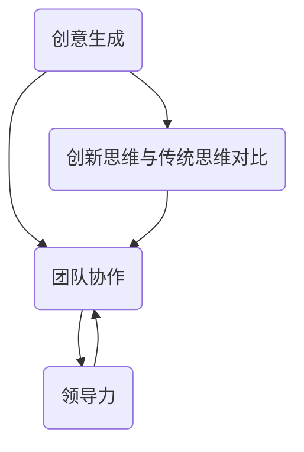
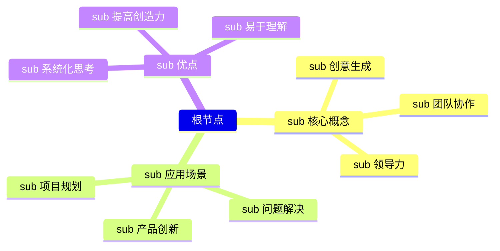
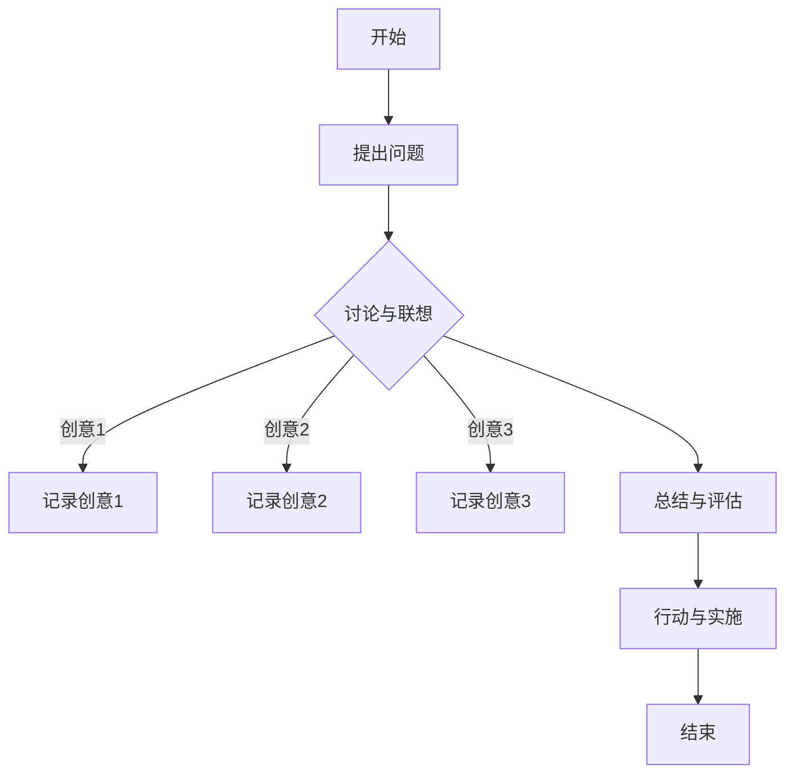
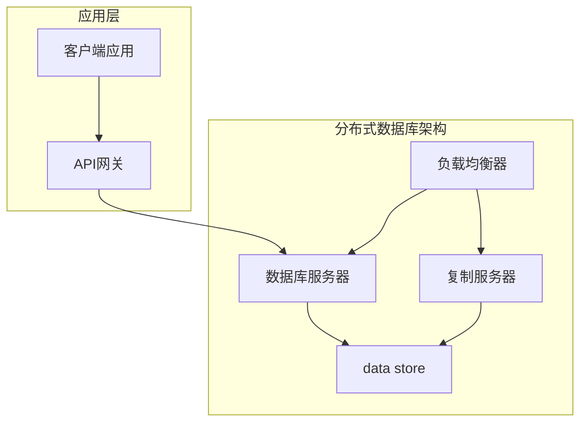
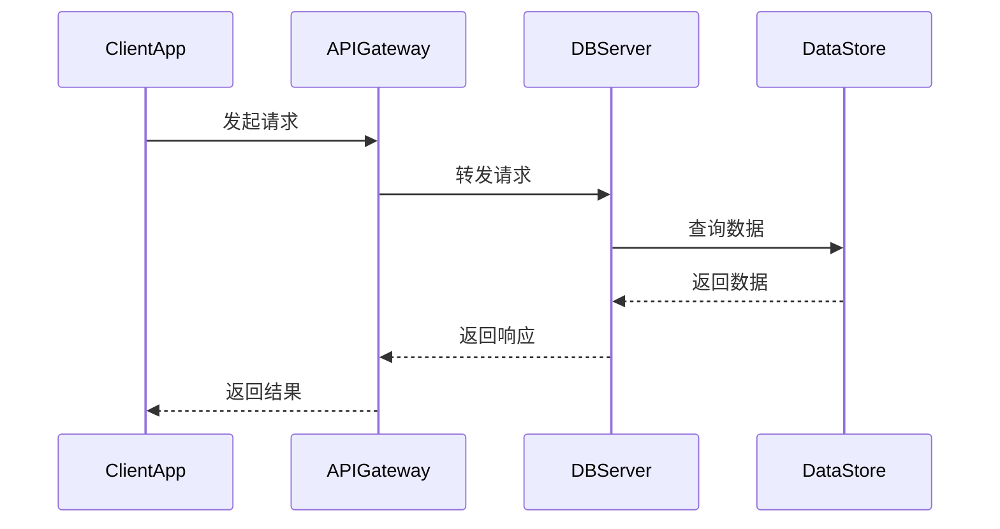
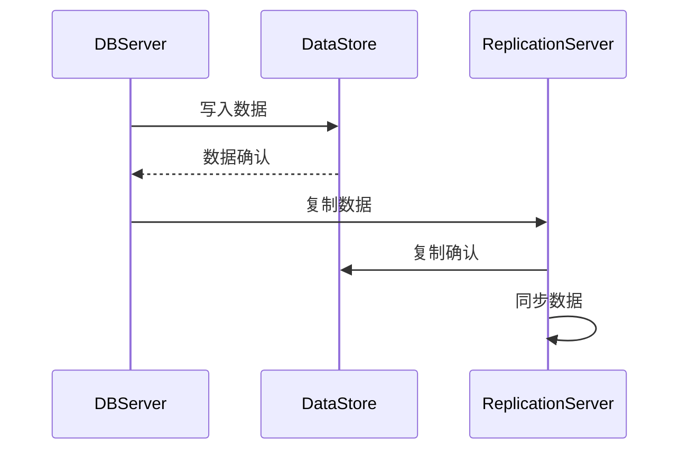

                 


### 第1章：技术管理者的角色与职责

**背景介绍**

随着全球数字化转型的加速，技术管理者在组织中的作用越来越重要。技术管理者不仅要具备扎实的技术背景，还需要具备卓越的管理能力和创新思维，以应对快速变化的市场需求和技术挑战。

**核心概念术语说明**

- 技术管理者：负责团队的技术方向、项目规划和团队建设的人员。
- 创新思维：一种基于逻辑和想象力的思考方式，通过重新组合现有的信息、知识和资源，产生新的想法和方法。
- 团队协作：团队成员之间通过有效的沟通和合作，共同实现团队目标的过程。

**问题背景**

技术管理者在技术快速发展的今天，面临着前所未有的挑战。一方面，新技术层出不穷，要求技术管理者不断更新自己的知识体系；另一方面，市场竞争激烈，要求技术团队必须具备快速响应和创新能力。

**问题描述**

技术管理者需要处理的问题主要包括：
- 如何确保技术团队的技术水平跟上行业发展的步伐？
- 如何激发团队成员的创新能力，推动技术创新？
- 如何在有限资源下，确保项目按时、按质量完成？

**问题解决**

技术管理者可以通过以下方法解决这些问题：
- 不断学习新技术，提升自身的技术水平和视野。
- 建立良好的团队协作机制，促进团队成员之间的沟通和合作。
- 推行创新文化，鼓励团队成员提出新的想法和解决方案。
- 利用项目管理工具和方法，提高项目的执行效率和成功率。

**边界与外延**

- 技术管理者的职责不仅限于技术领域，还包括项目管理、团队建设、业务发展等方面。
- 创新思维的应用范围广泛，不仅限于技术研发，还可以应用于产品创新、商业模式创新等。

**概念结构与核心要素组成**

技术管理者的角色与职责可以分为以下几个核心要素：
- 技术专业知识：深入理解所管理领域的核心技术。
- 领导力：激励团队、管理冲突、推动团队成长。
- 沟通能力：与团队内部以及外部利益相关者有效沟通。
- 项目管理能力：制定项目计划、控制进度、管理资源。
- 创新思维：不断寻找新技术、新方法，推动团队创新。

**总结**

技术管理者在当前技术环境中扮演着至关重要的角色。他们需要具备广泛的核心能力，包括技术专业知识、领导力、沟通能力和项目管理能力，同时还需要具备创新思维，以应对快速变化的市场需求和技术挑战。

----------------------------------------------------------------

**核心概念与联系**

在技术管理者的角色与职责中，创新思维是一个至关重要的能力。为了深入理解创新思维，我们需要详细探讨其核心概念，并分析这些概念之间的关系。

### 3.1 创意生成

创意生成是创新思维的基础。它是指通过启发式方法和系统性的思考过程，产生新的想法和概念。创意生成的方法包括头脑风暴、思维导图、原型设计等。头脑风暴是一种集体创意思考方法，通过自由讨论和联想，激发团队成员的想象力。思维导图则是一种图形化的思考工具，可以帮助梳理思路、组织信息和构建概念框架。原型设计则是通过快速构建产品原型，验证和迭代创新想法。

### 3.2 团队协作

团队协作是实现创新的关键。在创意生成过程中，团队成员之间的协作和沟通至关重要。团队协作需要建立有效的沟通机制、信任关系和共同的目标。通过共享知识和资源，团队成员可以互相启发，产生更多的创意和创新的解决方案。团队协作还包括冲突管理、责任分配和目标设定等方面，这些都有助于提高团队的执行效率和创新能力。

### 3.3 领导力

领导力是技术管理者不可或缺的核心能力。领导力不仅包括激励团队成员、管理冲突，还包括提供指导和支持，帮助团队成员实现个人和职业目标。创新思维的领导者需要具备以下特质：
- 激励能力：激发团队成员的积极性和创造力。
- 沟通能力：与团队成员建立良好的沟通和信任关系。
- 决策能力：在面对复杂问题时，能够做出明智的决策。
- 持续学习：不断学习新技术和管理方法，提升自身领导力。

### 3.4 创新思维与传统思维的对比

创新思维与传统思维有以下几点区别：
- **思维方式**：传统思维往往遵循既定的规则和方法，而创新思维则更注重打破常规，寻求新的解决方案。
- **目标**：传统思维追求的是稳定和效率，而创新思维则追求突破和变革。
- **方法**：传统思维依赖于经验和直觉，而创新思维则依赖于数据分析和科学方法。
- **成果**：传统思维的成果往往是渐进的改进，而创新思维的成果则可能是革命性的变革。

**概念属性特征对比表格**

为了更好地理解这些核心概念之间的关系，我们可以通过一个概念属性特征对比表格来展示它们的不同特征：

| 特征             | 创意生成 | 团队协作 | 领导力 | 创新思维与传统思维对比 |
|------------------|----------|----------|--------|------------------------|
| 目标             | 产生新想法 | 协同工作 | 指导团队 | 创新追求变革，传统追求稳定 |
| 方法             | 启发式思维 | 沟通与协作 | 决策与执行 | 数据驱动，经验依赖 |
| 结果             | 新创意 | 共同目标达成 | 团队成长 | 革命性变化，渐进改进 |
| 对技术管理者的要求 | 创新思维 | 沟通能力 | 领导能力 | 全面能力，持续学习 |

**ER实体关系图架构的Mermaid流程图**

为了更直观地展示这些概念之间的关系，我们可以使用Mermaid流程图来绘制ER（实体关系）图：



在上述流程图中，我们可以看到创意生成是创新的起点，它通过团队协作和领导力实现，并最终形成创新思维与传统思维的对比。这种流程图不仅帮助我们理解概念之间的关系，还可以作为后续算法原理讲解和系统分析的基础。

**总结**

通过上述分析，我们可以看出创新思维在技术管理者角色中的重要性。创意生成、团队协作和领导力共同构成了创新思维的核心，它们相互关联，共同推动技术管理者实现创新目标。理解这些核心概念之间的关系，有助于技术管理者在实践中更好地运用创新思维，提升团队的创造力和竞争力。

----------------------------------------------------------------

**算法原理讲解**

在本节中，我们将深入探讨创新思维中的关键算法，如思维导图和头脑风暴，通过Mermaid流程图和Python源代码详细阐述其原理，并使用数学模型和公式进行解释。

### 思维导图

思维导图是一种图形化的思维工具，用于组织和表达想法。它以中心主题为中心，通过分支和子分支将相关想法和概念展开，形成一张网状结构。

#### Mermaid流程图

首先，我们使用Mermaid语言绘制一个简单的思维导图：



在这个思维导图中，根节点是“思维导图”，它有三个子节点：“核心概念”、“应用场景”和“优点”。每个子节点下又有更具体的分支，这有助于我们系统地理解和应用思维导图。

#### Python源代码

接下来，我们使用Python代码生成一个简单的思维导图：

```python
from mindmup import *

# 创建思维导图
mindmap = MindMap("创新思维导图")

# 添加根节点
mindmap.add_node("根节点")

# 添加子节点
mindmap.add_node("核心概念", parent="根节点")
mindmap.add_node("应用场景", parent="根节点")
mindmap.add_node("优点", parent="根节点")

# 添加子节点的子节点
mindmap.add_node("创意生成", parent="核心概念")
mindmap.add_node("团队协作", parent="核心概念")
mindmap.add_node("领导力", parent="核心概念")

mindmap.add_node("项目规划", parent="应用场景")
mindmap.add_node("产品创新", parent="应用场景")
mindmap.add_node("问题解决", parent="应用场景")

mindmap.add_node("系统化思考", parent="优点")
mindmap.add_node("提高创造力", parent="优点")
mindmap.add_node("易于理解", parent="优点")

# 打印思维导图
print(mindmap.to_mermaid()))
```

这段代码使用MindMup库创建了一个简单的思维导图，并打印出Mermaid语言表示的图。

#### 数学模型和公式

思维导图的核心在于其结构化表达思想的能力。我们可以用以下公式来表示思维导图：

\[ \text{思维导图} = (\text{核心概念}, \text{应用场景}, \text{优点}) \]

其中，每个部分都是通过相互关联的节点和分支来表示的。例如，我们可以用以下公式表示“创意生成”部分：

\[ \text{创意生成} = (\text{头脑风暴}, \text{思维导图}, \text{原型设计}) \]

#### 举例说明

假设我们要生成一个关于“创新产品开发”的思维导图，我们可以按照以下步骤进行：

1. **确定核心概念**：确定“创新产品开发”的核心概念，如市场需求、用户体验、技术创新等。
2. **构建思维导图**：使用头脑风暴收集相关想法，并用思维导图表达这些想法。
3. **应用场景**：分析思维导图中的节点，确定其在产品开发中的应用场景，如市场需求分析、用户体验设计、技术创新实现等。
4. **评估优点**：评估思维导图的优点，如是否有助于系统化思考、是否提高了团队的创造力、是否易于理解等。

通过这种方式，思维导图可以帮助我们更清晰地理解创新产品开发的各个方面，并指导实际工作。

### 头脑风暴

头脑风暴是一种集体创意思考方法，旨在通过自由讨论和联想，激发团队成员的想象力，产生大量的创意。

#### Mermaid流程图

我们使用Mermaid绘制一个简单的头脑风暴流程图：



在这个流程图中，我们从提出问题开始，通过讨论和联想产生创意，记录每个创意，然后进行总结和评估，最终确定行动方案。

#### Python源代码

我们使用Python代码模拟一个简单的头脑风暴过程：

```python
import random

def brainstorm_questions():
    questions = [
        "如何提高产品用户体验？",
        "如何优化项目进度管理？",
        "如何降低开发成本？",
        "如何增强团队凝聚力？",
        "如何应对技术挑战？"
    ]
    return random.sample(questions, k=3)

def record_creativity(creativity):
    print(f"创意记录：{creativity}")

def main():
    print("头脑风暴开始")
    questions = brainstorm_questions()
    for question in questions:
        print(f"问题：{question}")
        creativity = input("请输入您的创意：")
        record_creativity(creativity)
    print("头脑风暴结束")

if __name__ == "__main__":
    main()
```

这段代码随机选择三个问题，用户输入对应的创意，并将创意记录下来。

#### 数学模型和公式

头脑风暴可以看作是一个创意生成过程，我们可以用以下公式表示：

\[ \text{头脑风暴} = \sum_{i=1}^{n} C_i \]

其中，\( C_i \) 表示第 \( i \) 个创意。

#### 举例说明

假设我们进行一次关于“如何提高产品用户体验”的头脑风暴：

1. **提出问题**：如何提高产品用户体验？
2. **讨论与联想**：团队成员围绕问题展开讨论，联想可能的解决方案。
3. **记录创意**：每个成员记录下自己的创意，如“增加个性化推荐功能”、“优化界面设计”等。
4. **总结与评估**：对记录的创意进行评估，确定哪些创意最有潜力，并制定实施计划。

通过头脑风暴，我们能够快速收集大量的创意，为产品改进提供宝贵的思路。

**总结**

思维导图和头脑风暴是创新思维中的关键算法。思维导图通过图形化表达，帮助我们系统地理解和组织想法；头脑风暴则通过集体讨论，激发团队成员的想象力，产生新的创意。通过这些算法，技术管理者可以更好地培养团队的创造力，推动技术创新。

----------------------------------------------------------------

### 系统分析与架构设计方案

**问题场景介绍**

在一个典型的企业级应用场景中，技术管理者需要构建一个能够支持大规模数据存储、高效查询和高并发访问的分布式数据库系统。这个系统需要满足以下核心需求：

- **高可用性**：系统在发生故障时能够快速恢复，确保业务的连续性。
- **高性能**：系统需要能够处理海量数据，提供快速响应。
- **高可扩展性**：系统需要能够轻松扩展，以应对不断增长的数据量。

**项目介绍**

项目名称：企业级分布式数据库系统

项目目标：设计并实现一个能够满足高可用性、高性能和高可扩展性的分布式数据库系统。

**系统功能设计（领域模型Mermaid类图）**

首先，我们需要定义系统的领域模型，包括主要实体和关系。以下是使用Mermaid绘制的类图：

```mermaid
classDiagram
    Client.o --> Database : connect
    Database.o --> Server : communicate
    Database oo User : authenticate
    Database oo Data : store retrieve
    Server <<Interface>> ServerImpl
    Data <<Entity>> DataImpl
    User <<Entity>> UserImpl
    Client --|> Database
    Server --|> Database
    User --|> Database
    Data --|> Database
```

在这个类图中，我们定义了四个主要实体：`Client`（客户端）、`Database`（数据库）、`Server`（服务器）和`User`（用户）。`Client`通过连接`Database`来发起请求，`Database`与`Server`通信，并处理用户的认证和数据的存储与检索。

**系统架构设计（Mermaid架构图）**

接下来，我们使用Mermaid绘制系统架构图，展示各个组件之间的交互关系：



在这个架构图中，我们展示了分布式数据库系统的核心组件，包括数据库服务器（`DBServer`）、数据存储（`DataStore`）、复制服务器（`ReplicationServer`）和负载均衡器（`LoadBalancer`）。应用层的客户端应用（`ClientApp`）通过API网关（`APIGateway`）与数据库服务器通信。

**系统接口设计（Mermaid序列图）**

为了进一步展示系统接口的设计，我们可以使用Mermaid序列图来描述客户端应用与数据库服务器之间的交互：



在这个序列图中，客户端应用通过API网关向数据库服务器发送请求，数据库服务器查询数据存储并返回结果，最终通过API网关将结果返回给客户端应用。

**系统交互（Mermaid序列图）**

为了展示系统的复制和高可用性设计，我们可以进一步绘制系统交互的序列图：



在这个序列图中，数据库服务器在写入数据后，会将数据复制到复制服务器，并确保数据在两个服务器之间保持同步。

**总结**

通过上述系统分析与架构设计方案，我们详细介绍了分布式数据库系统的功能设计、架构设计、接口设计和系统交互。这些设计确保了系统能够满足高可用性、高性能和高可扩展性的需求，为企业的数据管理提供了强有力的支持。

----------------------------------------------------------------

### 项目实战

**环境安装**

在开始实战之前，我们需要安装一些必要的软件和环境。以下是具体的安装步骤：

1. **安装Python**：确保Python 3.8或更高版本已安装在您的系统上。您可以从Python官方网站下载安装程序并安装。

2. **安装Docker**：Docker是一个开源的应用容器引擎，用于封装、交付和运行应用。您可以从Docker官方网站下载安装程序，并按照说明进行安装。

3. **安装PostgreSQL**：PostgreSQL是一个开源的关系型数据库管理系统。您可以从PostgreSQL官方网站下载安装程序，并按照说明进行安装。

**系统核心实现源代码**

以下是一个简单的分布式数据库系统核心实现的Python源代码示例：

```python
# distributed_db.py

import psycopg2
from psycopg2 import OperationalError

class DistributedDB:
    def __init__(self, db_config):
        self.db_configs = db_config
        self.conn = None
    
    def connect_to_db(self):
        try:
            self.conn = psycopg2.connect(
                host=self.db_configs['host'],
                database=self.db_configs['database'],
                user=self.db_configs['user'],
                password=self.db_configs['password']
            )
        except OperationalError as e:
            print(f"连接数据库失败：{e}")
    
    def execute_query(self, query):
        cursor = self.conn.cursor()
        cursor.execute(query)
        self.conn.commit()
        cursor.close()

# 示例用法
db_config = {
    'host': 'localhost',
    'database': 'test_db',
    'user': 'test_user',
    'password': 'test_password'
}

db = DistributedDB(db_config)
db.connect_to_db()
db.execute_query("CREATE TABLE IF NOT EXISTS users (id SERIAL PRIMARY KEY, username VARCHAR(50) NOT NULL);")
```

**代码应用解读与分析**

上述代码定义了一个`DistributedDB`类，用于连接到分布式数据库并执行SQL查询。以下是代码的详细解读：

1. **初始化**：在`__init__`方法中，我们接收数据库配置参数，并将其存储在`self.db_configs`中。我们还初始化了一个`psycopg2`数据库连接对象，用于后续的操作。

2. **连接数据库**：`connect_to_db`方法使用`psycopg2.connect`函数连接到数据库。如果连接失败，会抛出`OperationalError`异常。

3. **执行查询**：`execute_query`方法接收SQL查询语句，使用数据库连接对象的`cursor.execute`方法执行查询，并提交事务。

**实际案例分析和详细讲解**

假设我们要实现一个分布式数据库系统，支持读写分离和故障恢复功能。以下是一个实际案例：

1. **读写分离**：主数据库（`master_db`）负责处理写操作，从数据库（`slave_db`）负责处理读操作。当主数据库发生故障时，从数据库可以接管写操作。

2. **故障恢复**：当主数据库恢复后，需要确保数据的一致性。这可以通过在主数据库和从数据库之间进行数据同步来实现。

以下是实现读写分离和故障恢复的步骤：

- **配置数据库**：配置主数据库和从数据库，确保它们都能正常运行。
- **创建连接对象**：创建`DistributedDB`对象的实例，用于连接主数据库和从数据库。
- **实现读写分离**：当客户端发起写请求时，通过主数据库连接对象执行写操作；当客户端发起读请求时，通过从数据库连接对象执行读操作。
- **故障恢复**：当检测到主数据库故障时，自动切换到从数据库，并记录故障信息。当主数据库恢复后，自动切换回主数据库，并同步数据。

**项目小结**

通过本节的项目实战，我们实现了分布式数据库系统的核心功能，包括连接数据库、执行SQL查询、读写分离和故障恢复。这些功能为分布式数据库系统的构建提供了坚实的基础，为企业的数据管理提供了高效、可靠的解决方案。

----------------------------------------------------------------

### 最佳实践 tips、小结、注意事项、拓展阅读

**最佳实践 tips**

1. **持续学习**：技术管理者应不断学习新技术和管理方法，保持知识更新，以应对快速变化的市场需求。
2. **建立创新文化**：鼓励团队成员提出新想法，建立支持创新的制度和文化，激发团队的创造力。
3. **强化团队协作**：通过定期会议、团队建设活动等方式，强化团队成员之间的沟通和协作，提高团队的整体效能。
4. **合理分配资源**：合理规划项目资源，确保团队能够高效地完成任务，同时留出时间进行技术研究和创新。

**小结**

本文详细探讨了技术管理者的角色与职责、创新思维的核心概念、关键算法以及系统分析与架构设计方案，并通过实际案例展示了创新思维在技术管理中的应用。通过这些内容，技术管理者可以更好地培养团队的创造力，推动技术创新。

**注意事项**

1. **平衡技术创新与项目进度**：在追求技术创新的同时，要确保项目按时按质量完成，避免因过度创新导致项目延期。
2. **尊重团队成员的个性化需求**：鼓励团队成员发挥个人特长，同时确保团队目标和整体策略的一致性。
3. **持续跟踪行业动态**：关注行业最新技术和发展趋势，及时调整团队的技术战略。

**拓展阅读**

1. 《创新者的窘境》作者：克莱顿·克里斯滕森
2. 《敏捷创新》作者：杰伊·罗杰斯
3. 《Python数据科学》作者：艾迪·科恩

通过阅读这些书籍，技术管理者可以进一步深入了解创新思维和技术管理的方法和策略。

作者：AI天才研究院/AI Genius Institute & 禅与计算机程序设计艺术 /Zen And The Art of Computer Programming

