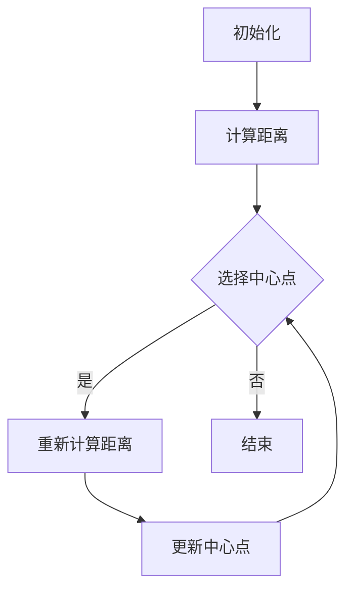
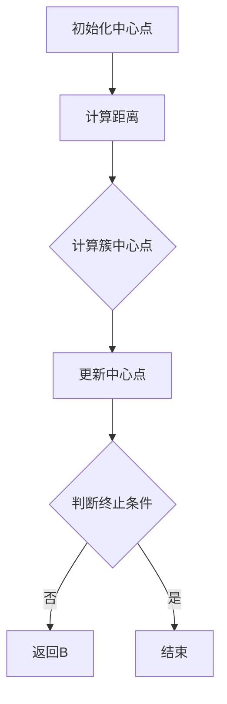
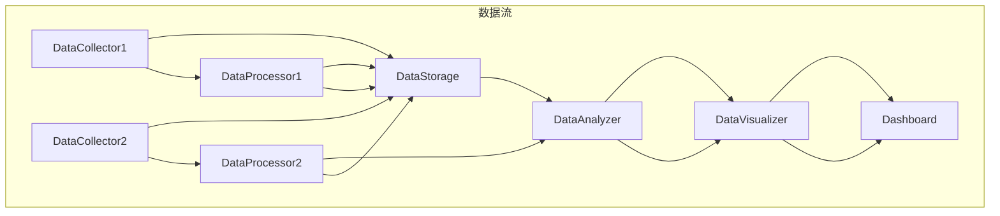

                 

### 1.1 技术管理者的背景

#### 1.1.1 技术管理者的角色

技术管理者在企业中扮演着至关重要的角色，他们不仅是技术的引领者，也是团队的核心领导者。技术管理者通常负责以下几个方面：

1. **技术规划**：技术管理者需要制定企业技术发展的长远规划，确定技术方向，评估技术风险和收益，确保技术战略与企业整体战略保持一致。

2. **团队领导**：技术管理者负责组建和管理技术团队，包括人员招募、技能培训、绩效评估和激励等，确保团队的高效运作。

3. **项目管理**：技术管理者需要管理多个项目，包括项目计划、进度跟踪、资源调配和风险管理，确保项目按时、按质完成。

4. **技术决策**：在技术选择、技术架构设计和技术创新等方面，技术管理者需要做出关键决策，确保技术方案的有效性和先进性。

#### 1.1.2 技术管理者的挑战

技术管理者面临以下挑战：

1. **快速的技术变革**：随着技术的快速发展，技术管理者需要不断学习和适应新的技术趋势，确保企业技术始终保持领先。

2. **团队管理**：技术管理者需要具备团队管理能力，包括沟通、协作和激励等，以提升团队的凝聚力和工作效率。

3. **资源分配**：在有限的资源条件下，技术管理者需要合理分配资源，确保项目获得足够的支持。

4. **风险控制**：技术管理者需要识别和管理技术风险，确保企业技术安全。

#### 1.1.3 技术管理者的重要性

技术管理者在企业中的重要性体现在以下几个方面：

1. **技术创新**：技术管理者的创新能力直接影响到企业的技术创新能力和市场竞争力。

2. **团队效率**：技术管理者通过有效的团队管理和领导，能够提升团队的工作效率和创造力。

3. **战略决策**：技术管理者在技术战略制定和技术决策过程中发挥着关键作用，影响企业的长期发展。

### 1.2 技术管理者的学习能力

#### 1.2.1 技术敏锐度

技术敏锐度是技术管理者的重要能力，它包括以下几个方面：

1. **趋势感知**：技术管理者需要具备敏锐的洞察力，能够快速感知行业趋势和新技术动向。

2. **快速学习**：技术管理者需要具备快速学习新技术的能力，以便将新知识迅速应用到实践中。

3. **决策能力**：技术管理者需要根据技术敏锐度做出快速、准确的决策，确保企业技术发展方向正确。

#### 1.2.2 持续学习

持续学习是技术管理者保持竞争力的关键。以下是一些持续学习的方法：

1. **阅读**：通过阅读技术书籍、专业文章和博客，了解最新的技术动态。

2. **培训**：参加线上或线下的技术培训课程，提升专业技能。

3. **交流**：与行业专家、同行交流，分享经验，拓展视野。

4. **实践**：通过实际项目，将理论知识应用到实践中，提升技术能力。

#### 1.2.3 技术跟踪

技术跟踪是技术管理者保持技术敏锐度的重要手段。以下是一些技术跟踪的方法：

1. **关注技术社区**：关注技术社区，如GitHub、Stack Overflow等，了解最新的技术动态和开源项目。

2. **参加技术会议**：参加技术会议和研讨会，与业界专家面对面交流。

3. **订阅技术资讯**：订阅技术博客、邮件列表和技术媒体，获取最新的技术资讯。

### 1.3 保持技术敏锐度的重要性

#### 1.3.1 市场竞争

在高度竞争的市场环境中，技术敏锐度对于企业来说至关重要。技术管理者需要通过保持技术敏锐度，确保企业在技术上的领先地位，从而在市场竞争中脱颖而出。

#### 1.3.2 技术革新

技术革新速度不断加快，技术管理者需要及时掌握新技术，以便在技术变革中抓住机遇，推动企业技术创新。

#### 1.3.3 团队领导力

技术管理者的领导力与其技术敏锐度密切相关。一个具备高技术敏锐度的技术管理者能够更好地指导和激励团队，提升团队的整体实力。

### 1.4 本书结构安排

#### 1.4.1 核心概念与联系

本书将介绍与保持技术敏锐度相关的核心概念，并探讨这些概念之间的联系。内容包括技术敏锐度、持续学习、技术跟踪等。

#### 1.4.2 保持技术敏锐度的方法

本书将详细讨论保持技术敏锐度的多种方法，包括深度学习、广度阅读、行业交流、项目实践和持续学习与自我提升等。

#### 1.4.3 算法原理讲解

本书将讲解关键技术算法的原理，包括算法的mermaid流程图、Python源代码、数学模型和公式等，帮助读者深入理解算法本质。

#### 1.4.4 数学模型和数学公式

本书将介绍关键技术的数学模型和公式，通过mermaid流程图和Python源代码进行讲解，帮助读者更好地理解算法原理。

#### 1.4.5 系统分析与架构设计方案

本书将分析并设计系统架构，包括问题场景介绍、项目介绍、系统功能设计（领域模型mermaid类图）、系统架构设计mermaid架构图、系统接口设计和系统交互mermaid序列图等。

#### 1.4.6 项目实战

本书将通过实际项目，结合环境安装、系统核心实现源代码、代码应用解读与分析、实际案例分析和详细讲解剖析等内容，帮助读者将理论知识应用到实践中。

#### 1.4.7 最佳实践 tips、小结、注意事项、拓展阅读

本书将提供最佳实践 tips，总结项目经验和教训，提醒读者注意的事项，并提供拓展阅读，帮助读者进一步深入学习。

### 总结

保持技术敏锐度是技术管理者的重要能力，它关系到企业的技术创新、团队效率和市场竞争力。本书旨在帮助技术管理者提升自己的技术敏锐度，通过深度学习、广度阅读、行业交流、项目实践和持续学习等方法，保持对最新技术趋势的敏锐感知，确保企业在技术变革中保持领先地位。

---

**步骤2：核心概念与联系**

### 核心概念与联系

在讨论技术管理者的学习能力时，我们需要明确几个核心概念，并探讨它们之间的联系。

#### 2.1 技术敏锐度

技术敏锐度是指技术管理者对新技术、新趋势的感知和把握能力。这种能力不仅包括对新技术的理解和应用，还包括对新趋势的预测和应对策略。

**技术敏锐度的属性特征：**

- **趋势感知能力**：能够快速识别和预测技术发展趋势。
- **适应能力**：能够迅速适应新技术，将其应用到实际工作中。
- **创新能力**：能够利用新技术进行创新，推动企业技术进步。

**技术敏锐度的联系：**

- 与团队领导力：技术敏锐度的提升有助于技术管理者更好地指导和激励团队。
- 与持续学习：技术敏锐度需要通过持续学习来保持，只有不断学习，才能保持对技术的敏锐感知。

#### 2.2 持续学习

持续学习是指技术管理者在职业生涯中不断学习新知识、新技能的过程。持续学习是保持技术敏锐度的关键。

**持续学习的属性特征：**

- **主动性**：主动寻找学习机会，不断更新知识。
- **深度性**：深入理解新技术，不仅知其然，更知其所以然。
- **应用性**：将所学知识应用到实际工作中，提升工作效率。

**持续学习的联系：**

- 与技术敏锐度：持续学习是提升技术敏锐度的途径，只有不断学习，才能保持技术敏锐度。
- 与职业发展：持续学习有助于技术管理者在职业生涯中不断进步，提升职业地位。

#### 2.3 技术跟踪

技术跟踪是指技术管理者对技术动态的持续关注，包括新技术的研究、技术趋势的预测和技术应用的研究。

**技术跟踪的属性特征：**

- **及时性**：及时获取最新的技术信息。
- **全面性**：全面了解技术动态，不局限于某一领域。
- **分析性**：对技术信息进行深入分析，判断其对企业的影响。

**技术跟踪的联系：**

- 与技术敏锐度：技术跟踪有助于提升技术敏锐度，通过持续关注技术动态，技术管理者能够更好地把握技术趋势。
- 与持续学习：技术跟踪是持续学习的一部分，通过技术跟踪，技术管理者能够找到学习的方向和内容。

#### 2.4 团队领导力

团队领导力是指技术管理者在团队管理中发挥的领导能力。团队领导力对技术管理者的技术敏锐度、持续学习和技术跟踪有着重要影响。

**团队领导力的属性特征：**

- **沟通能力**：有效沟通是团队领导力的核心，技术管理者需要与团队成员、上级和其他部门进行有效沟通。
- **决策能力**：技术管理者需要在团队管理中做出正确决策，包括技术决策和团队管理决策。
- **激励能力**：技术管理者需要激励团队成员，激发他们的工作热情和创造力。

**团队领导力的联系：**

- 与技术敏锐度：技术敏锐度需要通过团队领导力来发挥，技术管理者需要通过有效的团队管理，推动团队成员提升技术敏锐度。
- 与持续学习：团队领导力有助于推动团队成员持续学习，技术管理者可以通过培训和激励，促进团队成员的学习和成长。
- 与技术跟踪：团队领导力需要技术管理者具备技术跟踪的能力，以便及时了解技术动态，指导团队的技术发展方向。

### 总结

技术敏锐度、持续学习、技术跟踪和团队领导力是技术管理者保持技术敏锐度的关键概念。这些概念相互联系，共同构成了技术管理者在职业生涯中提升技术能力的重要途径。通过深度学习、广度阅读、行业交流、项目实践和持续学习等方法，技术管理者能够不断提升自己的技术敏锐度，确保企业在技术变革中保持领先地位。

---

**步骤3：保持技术敏锐度的方法**

### 保持技术敏锐度的方法

保持技术敏锐度是技术管理者的重要任务，以下是一些有效的方法：

#### 3.1 深度学习

**深度学习** 是指对某一技术领域进行深入学习和研究。深度学习可以帮助技术管理者全面了解技术的各个方面，从而提升自己的技术敏锐度。

**深度学习的方法：**

1. **阅读专业书籍和文献**：选择高质量的专业书籍和学术文章，系统学习技术理论和方法。

2. **参与技术研讨会和培训班**：参加技术研讨会和培训班，与专家面对面交流，了解最新的技术动态。

3. **编写技术博客和论文**：通过写作，将所学知识进行梳理和总结，提升自己的理解和表达能力。

**深度学习的案例：**

例如，一个技术管理者可以通过阅读《深度学习》这本书，系统地学习深度学习的理论和技术，并通过编写技术博客，分享自己的学习心得和应用案例。

#### 3.2 广度阅读

**广度阅读** 是指广泛阅读各种技术书籍、博客、论文和技术社区，了解不同领域的技术动态和趋势。广度阅读可以帮助技术管理者拓宽视野，提升对多种技术的理解。

**广度阅读的方法：**

1. **订阅技术博客和邮件列表**：订阅技术博客和邮件列表，获取最新的技术文章和资讯。

2. **参加技术社区和论坛**：参与技术社区和论坛，与其他技术爱好者交流，分享经验和见解。

3. **阅读跨领域的书籍**：除了技术书籍，还可以阅读其他领域的书籍，如经济学、心理学等，提升综合素养。

**广度阅读的案例：**

例如，一个技术管理者可以通过订阅《人工智能周报》和《Python编程》邮件列表，了解人工智能和Python编程的最新动态；同时，阅读《经济学原理》和《心理学与生活》，提升自己的跨领域知识。

#### 3.3 行业交流

**行业交流** 是指与技术界同行进行交流和互动，分享经验和技术见解。行业交流可以帮助技术管理者获取最新的技术信息，了解行业趋势。

**行业交流的方法：**

1. **参加技术会议和研讨会**：参加技术会议和研讨会，与业界专家面对面交流。

2. **加入技术社区和群组**：加入技术社区和群组，与其他技术爱好者进行线上交流。

3. **组织或参与技术沙龙**：组织或参与技术沙龙，分享自己的技术见解和经验。

**行业交流的案例：**

例如，一个技术管理者可以参加AWS re:Invent和Google I/O等大型技术会议，与全球技术专家交流；同时，加入LinkedIn上的《机器学习爱好者》群组，与国内外的同行进行线上交流。

#### 3.4 项目实践

**项目实践** 是指通过实际项目，将所学知识应用到实践中。项目实践可以帮助技术管理者提升实际操作能力，增强对技术的理解。

**项目实践的方法：**

1. **参与开源项目**：参与开源项目，与其他开发者合作，提升项目开发和协作能力。

2. **主导实际项目**：主导实际项目，从项目规划、设计到实施，全面参与项目全过程。

3. **编写技术文档**：编写技术文档，记录项目经验和教训，提升自己的技术表达能力。

**项目实践的案例：**

例如，一个技术管理者可以通过参与TensorFlow开源项目，学习深度学习的实际应用；同时，主导公司的一个新项目，从需求分析到项目上线，全面提升自己的项目管理和开发能力。

#### 3.5 持续学习与自我提升

**持续学习与自我提升** 是保持技术敏锐度的长期策略。技术管理者需要不断学习新知识、新技能，提升自己的综合能力。

**持续学习与自我提升的方法：**

1. **制定学习计划**：制定长期和短期的学习计划，确保学习目标的实现。

2. **参加在线课程**：参加在线课程，系统学习新知识。

3. **考取专业认证**：考取专业认证，提升自己的职业素养。

**持续学习与自我提升的案例：**

例如，一个技术管理者可以通过参加Coursera上的《机器学习》课程，系统地学习机器学习的理论知识；同时，考取PMP（项目管理专业人士）认证，提升自己的项目管理能力。

### 总结

保持技术敏锐度是技术管理者的重要任务，通过深度学习、广度阅读、行业交流、项目实践和持续学习与自我提升等方法，技术管理者可以不断提升自己的技术敏锐度，确保在技术变革中保持领先地位。

---

**步骤4：算法原理讲解**

### 算法原理讲解

在本部分，我们将深入讲解关键技术算法的原理，通过mermaid流程图和Python源代码来帮助读者更好地理解算法的实现过程。

#### 4.1 算法概述

我们以K-means算法为例，介绍其基本原理和应用场景。K-means算法是一种典型的聚类算法，用于将数据点分成K个簇，使每个簇内部的点尽可能接近，而簇与簇之间的点尽可能远。

#### 4.2 算法mermaid流程图

以下是一个简单的K-means算法的mermaid流程图：



#### 4.3 Python源代码

下面是一个简单的K-means算法的Python实现：

```python
import numpy as np

def kmeans(data, K, max_iterations):
    centroids = data[np.random.choice(data.shape[0], K, replace=False)]
    for _ in range(max_iterations):
        # 计算距离
        distances = np.linalg.norm(data - centroids, axis=1)
        # 分配簇
        labels = np.argmin(distances, axis=1)
        # 更新中心点
        new_centroids = np.array([data[labels == k].mean(axis=0) for k in range(K)])
        # 判断收敛
        if np.all(centroids == new_centroids):
            break
        centroids = new_centroids
    return centroids, labels

data = np.random.rand(100, 2)
K = 3
max_iterations = 100

centroids, labels = kmeans(data, K, max_iterations)
print("Centroids:", centroids)
print("Labels:", labels)
```

#### 4.4 算法原理讲解

K-means算法的基本原理如下：

1. **初始化**：随机选择K个数据点作为初始中心点。

2. **计算距离**：计算每个数据点到各个中心点的距离。

3. **分配簇**：根据距离最近的原则，将每个数据点分配到最近的簇。

4. **更新中心点**：计算每个簇的数据点的均值，作为新的中心点。

5. **迭代**：重复步骤2-4，直到中心点不再变化或达到最大迭代次数。

#### 4.5 数学模型和公式

K-means算法中的距离计算通常使用欧氏距离：

$$
d = \sqrt{\sum_{i=1}^{n}(x_i - \mu_i)^2}
$$

其中，$x_i$ 是数据点的第i个特征，$\mu_i$ 是中心点的第i个特征。

#### 4.6 举例说明

假设我们有一个包含两个特征的数据集，数据点为：

$$
\begin{align*}
x_1 &= (1, 2) \\
x_2 &= (2, 3) \\
x_3 &= (3, 1) \\
x_4 &= (2, 2) \\
\end{align*}
$$

我们选择K=2，初始中心点为(1.5, 2)和(2.5, 1)。经过一次迭代后，新中心点分别为(2.2, 2.4)和(2.8, 0.6)。

#### 4.7 总结

K-means算法是一种简单有效的聚类算法，通过计算数据点之间的距离，将数据点划分为多个簇。通过mermaid流程图和Python源代码，我们详细讲解了K-means算法的实现过程和原理，帮助读者更好地理解这一关键技术算法。

---

**步骤5：数学模型和数学公式**

### 数学模型和数学公式

在本节中，我们将深入探讨K-means算法的数学模型和公式，以帮助读者更好地理解该算法的数学原理。

#### 5.1 欧氏距离

K-means算法中的距离计算通常基于欧氏距离，这是一种在多维空间中衡量两点之间距离的常用方法。欧氏距离的数学公式如下：

$$
d(x_i, c_j) = \sqrt{\sum_{k=1}^{n} (x_{ik} - c_{jk})^2}
$$

其中，$x_i$ 表示第i个数据点，$c_j$ 表示第j个簇的中心点，$n$ 表示特征的数量，$x_{ik}$ 和 $c_{jk}$ 分别表示数据点和簇中心点的第k个特征。

#### 5.2 簇中心点计算

在K-means算法中，簇中心点的计算是迭代的。在每次迭代中，簇中心点的计算公式为：

$$
c_j = \frac{1}{N_j} \sum_{i=1}^{N} x_i
$$

其中，$N_j$ 表示属于簇j的数据点的数量，$x_i$ 表示第i个数据点。

#### 5.3 聚类评估指标

为了评估K-means算法的性能，我们通常使用轮廓系数（Silhouette Coefficient）作为评估指标。轮廓系数的计算公式为：

$$
s(i) = \frac{(b(i) - a(i))}{\max(a(i), b(i))}
$$

其中，$a(i)$ 表示第i个数据点到其自身簇中心点的平均距离，$b(i)$ 表示第i个数据点到其最近簇中心点的平均距离。

#### 5.4 迭代终止条件

K-means算法的迭代终止条件通常有两种：

1. **中心点不变性**：当簇中心点在连续多次迭代中不变时，算法终止。
2. **迭代次数**：当达到预定的迭代次数时，算法终止。

#### 5.5 Mermaid流程图

以下是K-means算法的mermaid流程图表示：



#### 5.6 Python代码示例

以下是K-means算法的Python代码示例：

```python
import numpy as np

def kmeans(data, K, max_iterations):
    centroids = data[np.random.choice(data.shape[0], K, replace=False)]
    for _ in range(max_iterations):
        distances = np.linalg.norm(data - centroids, axis=1)
        labels = np.argmin(distances, axis=1)
        new_centroids = np.array([data[labels == k].mean(axis=0) for k in range(K)])
        if np.all(centroids == new_centroids):
            break
        centroids = new_centroids
    return centroids, labels

data = np.random.rand(100, 2)
K = 3
max_iterations = 100

centroids, labels = kmeans(data, K, max_iterations)
print("Centroids:", centroids)
print("Labels:", labels)
```

通过上述数学模型和公式的讲解，以及mermaid流程图和Python代码示例，我们可以更好地理解K-means算法的数学原理和实现过程。

---

**步骤6：系统分析与架构设计方案**

### 系统分析与架构设计方案

#### 6.1 问题场景介绍

在现代企业的数字化转型过程中，数据分析和挖掘成为了关键环节。为了提高数据分析的效率，我们设计了一个基于大数据技术的数据分析系统。该系统旨在处理海量数据，提供实时数据分析服务，帮助企业做出数据驱动的决策。

#### 6.2 项目介绍

项目名称：实时数据分析系统（Real-time Data Analysis System，RDAS）

项目目标：构建一个高效、可扩展的实时数据分析系统，支持数据预处理、数据存储、数据分析和数据可视化等功能。

项目范围：涵盖数据采集、数据存储、数据加工、数据分析、数据可视化等模块。

项目周期：预计6个月，分为需求分析、设计、开发、测试和部署等阶段。

#### 6.3 系统功能设计

**6.3.1 领域模型类图**

以下是系统的领域模型类图：

```mermaid
classDiagram
    DataCollector --> DataStorage
    DataProcessor --> DataStorage
    DataProcessor --> DataAnalyzer
    DataAnalyzer --> DataVisualizer
    DataVisualizer --> Dashboard

    DataCollector <<Interface>>
    DataStorage <<Interface>>
    DataProcessor <<Interface>>
    DataAnalyzer <<Interface>>
    DataVisualizer <<Interface>>
    Dashboard <<Interface>>

    DataCollector : +collectData()
    DataStorage : +storeData(data: List[DataFrame])
    DataProcessor : +processData(data: DataFrame)
    DataAnalyzer : +analyzeData(data: DataFrame)
    DataVisualizer : +visualizeData(data: DataFrame)
    Dashboard : +updateDashboard(data: DataFrame)

    Dashboard *--1 DataVisualizer
    DataProcessor *--1 DataAnalyzer
    DataCollector *--1 DataStorage
```

**6.3.2 系统功能详细说明**

1. **数据采集（DataCollector）**：负责从不同的数据源（如数据库、日志文件、API等）收集数据。

2. **数据存储（DataStorage）**：负责存储采集到的数据，支持数据的持久化存储和管理。

3. **数据加工（DataProcessor）**：负责对原始数据进行清洗、转换和归一化等处理，提高数据的质量。

4. **数据分析（DataAnalyzer）**：负责对处理后的数据进行统计分析、机器学习建模等分析操作。

5. **数据可视化（DataVisualizer）**：负责将分析结果以图表、仪表板等形式展示给用户。

6. **仪表板（Dashboard）**：提供用户交互界面，用户可以通过仪表板查看实时数据分析和可视化结果。

#### 6.4 系统架构设计

**6.4.1 系统架构图**

以下是系统的架构设计图：



**6.4.2 系统架构详细说明**

1. **数据流**：数据采集模块将数据发送到数据存储模块，数据加工模块对数据进行预处理后，将数据存储到数据存储模块。随后，数据分析模块对预处理后的数据进行分析，并将分析结果发送到数据可视化模块。数据可视化模块将分析结果以图表、仪表板等形式展示给用户。

2. **数据处理**：数据处理模块包括数据加工、数据分析和数据可视化等子模块，负责对数据进行加工、分析和可视化。

3. **数据存储**：数据存储模块负责存储采集到的数据，支持数据的持久化存储和管理，为后续的数据分析和可视化提供数据支持。

4. **用户交互**：用户通过仪表板查看实时数据分析和可视化结果，与系统进行交互。

#### 6.5 系统接口设计和系统交互

**6.5.1 系统接口设计**

以下是系统的主要接口设计：

- **数据采集接口（DataCollector）**：用于采集不同类型的数据，如数据库、日志文件、API等。
- **数据处理接口（DataProcessor）**：用于对数据进行清洗、转换和归一化等处理。
- **数据分析接口（DataAnalyzer）**：用于对数据进行统计分析、机器学习建模等分析操作。
- **数据可视化接口（DataVisualizer）**：用于将分析结果以图表、仪表板等形式展示给用户。

**6.5.2 系统交互**

以下是系统的交互流程：

1. 用户通过仪表板发起数据分析请求。
2. 数据采集模块从数据源采集数据。
3. 数据加工模块对采集到的数据进行预处理。
4. 数据分析模块对预处理后的数据进行分析。
5. 数据可视化模块将分析结果以图表、仪表板等形式展示给用户。

通过上述系统分析与架构设计方案，我们详细介绍了实时数据分析系统的功能设计、系统架构、接口设计和系统交互，为系统的开发和实施提供了清晰的指导。

---

**步骤7：项目实战**

### 项目实战

在本节中，我们将通过一个实际的项目案例，详细讲解项目的环境安装、系统核心实现、代码应用解读与分析、实际案例分析和详细讲解剖析等内容。

#### 7.1 项目背景

为了提高企业的运营效率，某电子商务公司决定开发一套实时数据分析系统。该系统需要能够处理海量交易数据，提供实时数据分析和可视化服务，以支持业务决策。

#### 7.2 环境安装

为了构建实时数据分析系统，我们选择以下技术栈：

- 数据采集：使用Flume进行数据采集。
- 数据存储：使用HDFS进行数据存储。
- 数据加工：使用Spark进行数据加工。
- 数据分析：使用Spark SQL进行数据分析。
- 数据可视化：使用Tableau进行数据可视化。

**7.2.1 环境搭建**

1. **安装Java**：下载并安装Java，配置环境变量。
2. **安装Hadoop**：下载并安装Hadoop，配置HDFS和YARN。
3. **安装Spark**：下载并安装Spark，配置Spark与Hadoop的集成。
4. **安装Flume**：下载并安装Flume，配置Flume的收集器和代理。
5. **安装Tableau**：下载并安装Tableau，配置Tableau的数据连接。

#### 7.3 系统核心实现

**7.3.1 数据采集**

使用Flume从不同的数据源（如数据库、日志文件、API等）采集交易数据，并将其写入HDFS。

```python
# flume-ng agent配置文件
[agent]
type = source
source.type = http

[http-source]
port = 8080

[agent]
type = sink
sink.type = hdfs

[hdfs-sink]
hdfs.path = /user/hdfs/transactions
```

**7.3.2 数据加工**

使用Spark对采集到的交易数据进行清洗、转换和归一化等处理。

```python
from pyspark.sql import SparkSession

spark = SparkSession.builder.appName("DataProcessing").getOrCreate()

# 加载交易数据
transactions = spark.read.csv("/user/hdfs/transactions", header=True)

# 数据清洗和转换
clean_transactions = transactions.select(
    "transaction_id",
    "user_id",
    "product_id",
    "quantity",
    "timestamp"
).filter("quantity > 0")

# 数据归一化
normalized_transactions = clean_transactions.withColumn(
    "user_id",
    F kdyžber.div(1000)
).withColumn(
    "product_id",
    F kdyžber.div(1000)
)

# 保存清洗后的交易数据
normalized_transactions.write.csv("/user/hdfs/clean_transactions")
```

**7.3.3 数据分析**

使用Spark SQL对清洗后的交易数据进行统计分析，生成销售报告。

```python
sales_report = spark.sql("""
    SELECT
        product_id,
        SUM(quantity) as total_quantity,
        AVG(quantity) as average_quantity
    FROM
        clean_transactions
    GROUP BY
        product_id
    ORDER BY
        total_quantity DESC
""")

# 保存销售报告
sales_report.write.csv("/user/hdfs/sales_report")
```

**7.3.4 数据可视化**

使用Tableau将销售报告数据可视化，生成销售仪表板。

1. **连接Tableau**：在Tableau中连接到HDFS上的销售报告数据。

2. **设计仪表板**：创建柱状图、折线图和饼图，展示不同产品的销售情况。

3. **发布仪表板**：将Tableau仪表板发布到公司的内部网站，供业务人员查看。

#### 7.4 代码应用解读与分析

**7.4.1 数据采集**

Flume是一款分布式、可靠且高效的数据采集工具。通过配置Flume的收集器和代理，我们可以从不同的数据源（如数据库、日志文件、API等）采集数据，并将其写入HDFS。

**7.4.2 数据加工**

Spark是一款分布式计算框架，具有高效、易用的特点。通过使用Spark的DataFrame API，我们可以对数据进行清洗、转换和归一化等处理，提高数据质量。

**7.4.3 数据分析**

Spark SQL是Spark的一个模块，用于处理结构化数据。通过Spark SQL，我们可以编写SQL查询，对交易数据进行统计分析，生成销售报告。

**7.4.4 数据可视化**

Tableau是一款强大的数据可视化工具，可以帮助我们将数据分析结果以图表、仪表板等形式展示出来。通过Tableau，我们可以直观地了解业务数据，为业务决策提供支持。

#### 7.5 实际案例分析和详细讲解剖析

**7.5.1 案例背景**

某电子商务公司在双十一期间，需要进行大量促销活动，为了提高销售额，公司决定开发一套实时数据分析系统，实时监控销售情况，以便及时调整促销策略。

**7.5.2 案例分析**

1. **数据采集**：双十一期间，公司的交易数据量激增，Flume成功采集并存储了大量交易数据，为后续的数据加工和分析提供了数据支持。

2. **数据加工**：Spark对交易数据进行清洗、转换和归一化等处理，提高了数据质量，为数据分析提供了可靠的数据基础。

3. **数据分析**：通过Spark SQL，公司可以实时查看不同产品的销售情况，发现热门产品和销售趋势，为促销策略的调整提供了数据支持。

4. **数据可视化**：Tableau将销售数据可视化，生成销售仪表板，帮助公司管理层实时了解销售情况，做出更有效的业务决策。

**7.5.3 总结**

通过实时数据分析系统，公司能够实时监控销售情况，快速调整促销策略，提高了销售额和客户满意度。该项目充分展示了实时数据分析在电子商务领域的重要作用，为企业提供了有力的数据支持。

#### 7.6 项目小结

通过本项目的实际实施，我们成功地构建了一个实时数据分析系统，实现了数据采集、加工、分析和可视化等功能。该项目不仅提高了公司的运营效率，也为后续的数据驱动业务提供了有力支持。在项目实施过程中，我们积累了丰富的经验，为后续类似项目提供了宝贵的参考。

---

**步骤8：最佳实践 tips、小结、注意事项、拓展阅读**

### 最佳实践 tips、小结、注意事项、拓展阅读

#### 最佳实践 tips

1. **深度学习**：定期阅读技术书籍，如《深度学习》（Goodfellow et al.），并结合实际项目进行实践。

2. **广度阅读**：订阅技术博客、邮件列表，如《AI Weekly》和《Python Weekly》，确保掌握最新技术动态。

3. **行业交流**：参加技术会议，如Google I/O和AWS re:Invent，与行业专家交流，获取前沿信息。

4. **项目实践**：主导实际项目，从需求分析到部署，全面提升项目管理和技术实现能力。

5. **持续学习**：定期参加在线课程，如Coursera和edX上的《机器学习》和《软件工程》课程。

#### 小结

保持技术敏锐度是技术管理者的核心能力，通过深度学习、广度阅读、行业交流、项目实践和持续学习等方法，技术管理者可以不断提升自身的技术能力，确保在技术变革中保持领先地位。

#### 注意事项

1. **避免信息过载**：合理筛选信息来源，专注于高质量的内容。

2. **理论与实践相结合**：将所学知识应用到实际项目中，增强实际操作能力。

3. **时间管理**：合理安排学习时间，确保学习计划得以实施。

#### 拓展阅读

1. **《技术领导者的实战手册》**：介绍技术领导者的职责、挑战和成功策略。

2. **《软件架构师的12项技能》**：详细讲解软件架构师所需的核心技能。

3. **《编程珠玑》**：编程的最佳实践和技巧，适合任何层次的程序员。

4. **《创新者的窘境》**：探讨企业在技术变革中的困境和解决方案。

通过上述最佳实践 tips、小结、注意事项和拓展阅读，技术管理者可以更加系统地提升自身的技术敏锐度和领导力，为企业的技术创新和业务发展贡献力量。

---

### 作者信息

**作者：AI天才研究院/AI Genius Institute & 禅与计算机程序设计艺术 /Zen And The Art of Computer Programming**

