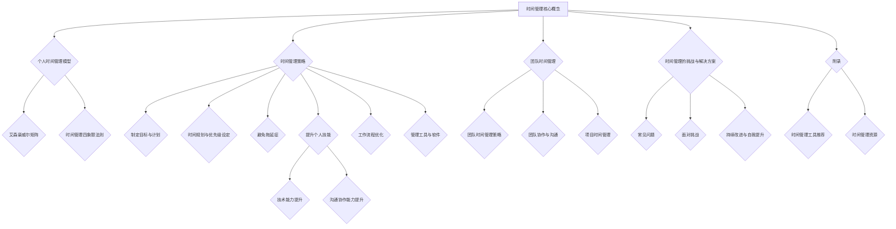

                 

### 时间管理的重要性

时间管理是一项基本而重要的技能，它不仅对个人的工作效率产生直接影响，还与生活质量和职业发展密切相关。在现代职场环境中，技术管理者面临诸多挑战，如复杂的任务管理、多变的优先级设定、频繁的会议安排和突发事件的应对等。因此，如何高效地管理时间成为他们能否成功的关键因素之一。

首先，时间管理对于技术管理者的重要性体现在工作效率的提升上。通过合理规划时间，技术管理者可以明确任务的优先级，减少无效工作时间和避免拖延，从而提高个人和团队的工作效率。这种高效的工作状态不仅有助于实现个人目标，还能够推动整个团队向前发展。

其次，时间管理对生活质量的影响也不容忽视。技术管理者通常工作压力较大，若不能有效管理时间，很容易陷入工作与生活失衡的困境。通过时间管理，技术管理者可以更好地平衡工作与生活，确保有足够的时间陪伴家人、锻炼身体和进行兴趣爱好，从而提升整体生活质量。

此外，时间管理对职业发展也有着显著的促进作用。一个擅长时间管理的技术管理者，能够在短时间内完成高质量的工作，这不仅能获得领导的认可，还有助于提升个人品牌和市场竞争力。随着时间的积累，这种高效的工作习惯将转化为职业发展的宝贵资本。

总的来说，时间管理对于技术管理者的重要性不言而喻。它不仅关乎个人工作效率和生活质量的提升，更是职业发展的基石。在接下来的内容中，我们将深入探讨时间管理的核心概念、策略和工作方法，帮助技术管理者更好地掌握这一关键技能。

### 时间管理者的角色和责任

在职场中，技术管理者作为团队的引领者，他们的时间管理不仅关乎个人，更关系到整个团队的效率和目标的实现。首先，技术管理者在时间管理中的角色是多重且复杂的。他们不仅是任务的执行者，更是时间与资源的调配者。作为团队的领导者，技术管理者需要确保团队成员能够高效地利用时间，实现工作目标。

技术管理者的首要职责是规划时间。这意味着他们需要明确团队的短期和长期目标，并根据这些目标制定合理的工作计划。在这个过程中，技术管理者需要考虑各个任务的优先级，确保重要且紧急的任务能够及时完成。通过科学的时间规划，技术管理者可以避免团队成员因为任务混乱而产生的压力，提高团队的整体工作效率。

其次，技术管理者需要具备良好的时间分配能力。他们需要合理地分配团队成员的工作时间和资源，确保每个人都能在自己的能力和兴趣范围内发挥最大的潜力。这不仅有助于提升团队成员的满意度，还能促进团队整体的专业发展。

此外，技术管理者还需负责监控和评估团队的时间使用情况。通过定期的团队会议和绩效评估，技术管理者可以及时发现和解决时间管理中的问题。例如，如果团队成员经常拖延任务，技术管理者需要找出原因，并采取相应的措施来改善。

最后，技术管理者需要具备自我管理的能力。他们需要以身作则，展示出高效的时间管理技能，成为团队中的榜样。这不仅有助于提升团队士气，还能增强团队成员对时间管理的信任和依赖。

总的来说，技术管理者的时间管理角色和责任不仅限于个人层面，更是团队高效运转的核心。通过有效的角色定位和责任履行，技术管理者能够确保团队在时间管理上取得显著成效，为整体目标的实现奠定坚实基础。

### 个人时间管理模型

个人时间管理是技术管理者提升工作效率的关键。在这个部分，我们将介绍两个经典的时间管理模型：艾森豪威尔矩阵和时间管理四象限法则。这些模型提供了系统化、结构化的方法，帮助技术管理者更有效地安排和管理时间。

#### 艾森豪威尔矩阵

艾森豪威尔矩阵，又称紧急-重要矩阵，是由美国前总统艾森豪威尔提出的一种时间管理工具。它将任务根据紧急程度和重要程度分为四个象限：

1. **第一象限：重要且紧急**
   - 这类任务通常需要立即处理，如紧急会议、关键项目交付等。技术管理者需要优先处理这些任务，确保重要事项不拖延。
2. **第二象限：重要但不紧急**
   - 这些任务虽不紧急，但对长期目标至关重要，如个人技能提升、团队培训等。技术管理者应规划时间，提前安排这些任务，以避免它们变成紧急任务。
3. **第三象限：不重要但紧急**
   - 这类任务通常来源于外部干扰，如不必要的会议、紧急但不重要的请求等。技术管理者应学会拒绝这些干扰，避免它们消耗大量时间。
4. **第四象限：不重要且不紧急**
   - 这些任务通常无助于工作目标，如社交媒体浏览、无关的邮件等。技术管理者应尽量减少在这些任务上的时间投入。

通过艾森豪威尔矩阵，技术管理者可以更清晰地了解任务的优先级，合理分配时间，确保重要任务不被忽视，同时避免被琐碎的事务拖累。

#### 时间管理四象限法则

时间管理四象限法则是由著名的时间管理专家斯蒂芬·柯维提出的一种时间管理方法。它不仅考虑任务的紧急性和重要性，还引入了时间管理的主动性概念。时间管理四象限法则将任务分为四个象限：

1. **第一象限：主动-紧急**
   - 这类任务通常涉及紧急且重要的活动，如处理突发问题、应对紧急任务等。技术管理者应尽量减少这类任务的发生，通过提前规划和预防措施来降低其频率。
2. **第二象限：被动-紧急**
   - 这类任务虽然紧急，但属于被动响应，如处理紧急的客户请求、应对突发事件等。技术管理者需要保持高度警觉，确保能够在这些任务发生时迅速应对。
3. **第三象限：主动-不紧急**
   - 这类任务通常有助于实现长期目标，如团队建设、技能提升等。技术管理者应积极安排这些任务，通过定期规划，确保这些长期目标得以实现。
4. **第四象限：被动-不紧急**
   - 这类任务通常无助于工作目标，如闲聊、无聊的社交媒体等。技术管理者应尽量减少在这些任务上的时间投入，专注于对工作更有帮助的活动。

时间管理四象限法则强调了主动管理时间的重要性，技术管理者可以通过这种方法，更有效地分配时间，提高工作效率。

综上所述，艾森豪威尔矩阵和时间管理四象限法则提供了系统化的时间管理工具，帮助技术管理者更好地安排任务，提高工作效率。通过合理运用这些模型，技术管理者可以更加专注于重要任务，避免被琐碎事务拖累，从而实现个人和团队目标。

### 时间管理者的自我评估

为了实现高效的时间管理，技术管理者首先需要对自己进行全面的自我评估。通过分析自己的时间使用情况，可以找到时间浪费的原因，进而制定有效的改进策略。以下是进行自我评估的几个关键步骤：

#### 时间记录与分析

第一步是记录自己的时间使用情况。技术管理者可以使用各种工具，如时间追踪软件（如Toggl、RescueTime等）或简单的日志记录方法，详细记录每天的工作内容、任务完成时间和中断次数。这些记录可以帮助技术管理者了解自己在各个时间段内的活动分布，发现时间浪费的具体环节。

例如，使用Toggl这样的时间追踪工具，技术管理者可以生成详细的报告，了解每天在哪些任务上花费了最多时间，哪些活动导致时间浪费。以下是使用Toggl记录时间使用情况的示例步骤：

1. **安装并注册Toggl追踪器：**
   - 访问Toggl官网，注册账号并下载安装Toggl追踪器。
2. **启动追踪器：**
   - 在工作开始时，启动Toggl追踪器，开始记录当前任务的时间使用。
3. **完成任务：**
   - 完成任务后，停止追踪器，并保存任务记录。
4. **生成报告：**
   - 每周或每月，生成详细的报告，分析时间使用情况。

通过这些记录，技术管理者可以更清晰地了解自己的时间使用模式，发现时间浪费的具体表现，如频繁的会议、不必要的任务分配、中断过多等。

#### 个人时间浪费的原因分析

在完成时间记录后，下一步是分析这些数据，找出时间浪费的原因。以下是一些常见的时间浪费原因：

1. **任务安排不当：**
   - 技术管理者可能因为任务安排不当，导致时间被分散，无法集中精力处理重要任务。例如，任务优先级不明确，导致重要任务被拖延。

2. **会议过多：**
   - 高频的会议可能占用了大量时间，而会议的效率不高，导致时间浪费。技术管理者需要评估会议的必要性和效率，减少不必要的会议。

3. **中断过多：**
   - 工作中的频繁中断，如电话、即时消息、邮件等，会导致工作流程被打断，影响工作效率。技术管理者需要制定策略，减少中断，提高工作连贯性。

4. **拖延症：**
   - 拖延症是技术管理者常遇到的问题。拖延可能导致任务积压，最终在截止日期前紧急完成，影响工作质量。

5. **缺乏专注力：**
   - 缺乏专注力可能导致工作时间分散，无法高效完成任务。技术管理者可以通过减少干扰、设立专注时间等方法，提高专注力。

#### 改进策略

在分析时间浪费原因后，技术管理者可以制定改进策略，以优化时间管理：

1. **优化任务安排：**
   - 通过优先级矩阵（如艾森豪威尔矩阵），明确任务的优先级，将时间和精力集中在最重要和最紧急的任务上。

2. **减少会议时间：**
   - 评估会议的必要性和效率，合理安排会议时间和内容，减少不必要的会议。

3. **设置专注时间：**
   - 使用“番茄工作法”等方法，设定专注时间段，减少中断，提高工作效率。

4. **制定明确的目标和计划：**
   - 制定短期和长期目标，并制定详细的行动计划，确保每项任务都有明确的时间和目标。

5. **培养自律：**
   - 通过培养自律，减少拖延，确保任务按时完成。

通过自我评估和时间浪费分析，技术管理者可以找到时间管理中的瓶颈，并采取有效的改进策略，从而提高工作效率，实现个人和团队的目标。

### 制定目标与计划

在时间管理中，制定明确的目标和计划是确保任务高效完成的关键步骤。对于技术管理者而言，科学地设定目标和计划，不仅能够提升个人工作效率，还能推动团队的整体发展。以下是制定目标与计划的详细步骤和策略。

#### 设定明确的目标

第一步是明确目标。一个明确的目标应该具备以下特点：

1. **具体性（Specific）**：目标应当具体、明确，避免模糊不清。例如，“提高团队工作效率”不如“将团队工作效率提高20%”具体。
2. **可衡量性（Measurable）**：目标应当能够被量化，以便于评估进度和结果。例如，使用具体的数字或指标来衡量目标完成情况。
3. **可实现性（Achievable）**：目标应当具有可行性，避免设定过于理想或不切实际的目标。例如，一个初创团队在短期内实现大规模市场占领可能不现实。
4. **相关性（Relevant）**：目标应当与组织的整体战略和个人的职业发展目标保持一致。
5. **时限性（Time-bound）**：目标应当有明确的时间限制，以推动行动的落实。

例如，一个技术团队的目标可以是“在接下来的三个月内，完成新项目的开发并上线”。这个目标具体、可衡量、可实现、相关且有时间限制。

#### 制定详细的计划

在明确目标后，下一步是制定详细的计划。以下是制定计划的具体步骤：

1. **分解任务**：将大目标分解为小任务，确保每个任务都能够具体执行。例如，将“完成新项目开发”分解为需求分析、设计、编码、测试等多个具体任务。
2. **分配资源**：为每个任务分配所需的资源，包括人力、时间、预算等。例如，确定每个任务需要多少开发人员、测试人员以及相应的预算。
3. **设定优先级**：根据任务的紧急性和重要性，设定任务的优先级。可以使用如艾森豪威尔矩阵这样的工具，将任务划分为重要且紧急、重要但不紧急等不同类别。
4. **制定时间表**：为每个任务设定开始和结束的时间，确保任务按时完成。可以使用甘特图或时间表工具，清晰地展示任务的时间安排。

以下是一个制定计划的示例步骤：

1. **目标设定**：明确团队的目标是“在三个月内完成新项目开发并上线”。
2. **任务分解**：将目标分解为需求分析、设计、编码、测试、上线等任务。
3. **资源分配**：确定每个任务的负责人、所需时间和预算。例如，需求分析需要2周时间，由市场部和技术部共同完成。
4. **优先级设定**：根据任务的紧急性和重要性，将任务排序。例如，测试和上线任务具有最高优先级。
5. **时间表制定**：为每个任务设定具体的时间表，确保任务按时完成。例如，需求分析从第1周开始，第2周结束；编码从第3周开始，第5周结束。

#### 实施与调整

在制定计划后，需要付诸实施，并在实施过程中不断调整和优化。以下是实施和调整的几个关键步骤：

1. **执行任务**：根据计划，按部就班地完成任务。确保团队成员明确任务要求，并按计划执行。
2. **监控进度**：定期检查任务的进度，确保任务按计划进行。可以使用项目管理工具，如JIRA、Trello等，实时跟踪任务进度。
3. **沟通协调**：在任务执行过程中，保持与团队成员的沟通，确保信息畅通，及时解决问题和调整计划。
4. **评估结果**：任务完成后，对结果进行评估，总结经验教训，并调整后续的计划和策略。

通过上述步骤，技术管理者可以有效地制定目标和计划，确保任务的高效完成，从而提升个人和团队的工作效率。

### 时间规划与优先级设定

在时间管理中，制定科学的时间规划并设定合理的优先级是确保任务高效完成的关键。通过使用GTD（Getting Things Done）方法和优先级矩阵，技术管理者可以更系统地管理时间，提高工作效率。

#### GTD（Getting Things Done）方法

GTD方法是由大卫·艾伦提出的一种时间管理方法，它通过系统地整理、组织、回顾任务，帮助人们高效地完成工作。以下是GTD方法的步骤：

1. **收集**：将所有需要完成的任务和想法记录下来，放入一个收集工具中，如笔记本、手机应用等。这一步的目的是清除大脑中的负担，确保所有任务都在一个统一的系统中进行管理。

2. **整理**：对收集的任务进行分类和整理，确保每个任务都有明确的位置。可以使用清单、标签、文件夹等方式，将任务组织得井井有条。

3. **处理**：对每个任务进行处理，确保每个任务都有明确的下一步行动。处理方法包括：立即行动、委托他人、推迟、归档等。通过这种处理方式，可以确保每个任务都有明确的进展方向。

4. **组织**：将任务按照类别或优先级进行组织，确保每个任务都能在正确的时间得到处理。可以使用文件夹、清单、项目列表等方式，将任务分门别类。

5. **回顾**：定期回顾任务清单和计划，确保任务按时完成，并根据实际情况进行调整。这可以帮助技术管理者保持对任务的持续关注，避免遗漏重要任务。

#### 优先级矩阵

优先级矩阵是一种帮助技术管理者确定任务优先级的工具，通常基于任务的紧急性和重要性进行分类。以下是一个简化的优先级矩阵示例：

| 类别        | 紧急性 | 重要性 | 说明                                  |
|-------------|--------|--------|---------------------------------------|
| 第一象限    | 紧急   | 重要   | 高优先级任务，需要立即处理。          |
| 第二象限    | 不紧急 | 重要   | 中等优先级任务，需要合理安排时间完成。 |
| 第三象限    | 紧急   | 不重要 | 低优先级任务，可以适当推迟处理。      |
| 第四象限    | 不紧急 | 不重要 | 可以放弃或延迟处理的任务。            |

在实际应用中，技术管理者可以根据实际情况调整优先级矩阵，确保任务按照正确的顺序进行。

#### 实施步骤

1. **确定任务**：列出所有需要完成的任务，包括日常工作、项目任务、个人成长等。

2. **分类任务**：根据任务的紧急性和重要性，将任务放入优先级矩阵中。

3. **安排时间**：根据任务的优先级，为每个任务安排具体的时间。确保紧急且重要的任务优先处理。

4. **持续调整**：在任务执行过程中，根据实际情况和变化，持续调整任务的优先级和时间安排。

通过GTD方法和优先级矩阵，技术管理者可以更科学、更高效地管理时间，确保任务按时、按质完成。

### 避免拖延症

拖延症是许多技术管理者面临的一个普遍问题，它不仅会影响工作效率，还可能对职业发展和个人心理健康产生负面影响。要克服拖延症，首先需要了解其背后的原因，然后采取相应的策略。

#### 拖延的原因

1. **恐惧失败**：担心任务失败或无法达到预期效果，导致不敢开始。
2. **完美主义**：追求完美，希望每个细节都做到尽善尽美，导致任务耗时过长。
3. **缺乏动力**：任务本身缺乏吸引力或目标不明确，导致缺乏行动的动力。
4. **时间管理不当**：没有合理分配时间，任务堆积，导致感到压力过大，进而拖延。
5. **环境干扰**：工作环境干扰多，如频繁的会议、邮件、社交媒体等，导致难以集中注意力。

#### 克服拖延的策略

1. **设定明确的目标**：明确具体的任务目标和期限，使任务更具可执行性。例如，将“编写报告”具体化为“明天上午完成报告初稿”。

2. **分解任务**：将大任务分解为小任务，每个小任务设定具体的完成时间。这种方法可以降低任务的难度和压力，使任务更加具体和可操作。

3. **使用番茄工作法**：将工作时间分为25分钟的工作周期，每个周期后休息5分钟。这种方法可以帮助提高专注力，减少中断。

4. **设定奖励机制**：为自己设定小奖励，每完成一个任务或达到一个里程碑就给予一定的奖励。这种方法可以增强动力，激励自己完成任务。

5. **减少干扰**：在执行任务时，关闭社交媒体、邮件通知等干扰源，集中精力完成任务。可以使用专门的专注工具，如Focus@Will、Forest等。

6. **培养自律**：通过自我约束和自我管理，养成按时完成任务的习惯。可以使用时间追踪工具，如Toggl、RescueTime等，监控自己的时间使用情况。

7. **积极心态**：对待任务保持积极的心态，相信自己能够完成任务。通过积极的自我暗示，增强行动的动力。

通过了解拖延的原因并采取相应的策略，技术管理者可以有效地克服拖延症，提高工作效率，实现个人和团队的目标。

### 提升个人技能

在技术管理者的职业生涯中，个人技能的提升是确保其能够有效管理和推动团队的关键。技术技能和沟通协作能力的提升不仅能够提高工作效率，还能增强团队凝聚力和创新能力。以下是具体的方法和策略，帮助技术管理者在技能提升方面取得显著进步。

#### 技术能力提升

1. **持续学习**：技术领域不断进步，技术管理者需要不断学习新知识、新技术。可以通过以下途径进行学习：
   - **在线课程**：参加Coursera、edX、Udemy等平台上的相关课程，学习前沿技术。
   - **阅读专业书籍**：定期阅读计算机科学、软件开发、人工智能等领域的专业书籍，掌握最新的理论和技术。
   - **技术论坛和社区**：参与GitHub、Stack Overflow、Reddit等平台上的技术讨论，了解行业动态和技术趋势。

2. **实践项目**：通过实际项目锻炼技术能力，将理论知识应用到实践中。可以尝试以下方法：
   - **开源项目**：参与开源项目，通过贡献代码、解决bug等方式提升技术水平。
   - **个人项目**：自己动手开发小项目，从零开始设计、编码、测试，全面掌握开发流程。
   - **内部项目**：在公司内部推动小型创新项目，尝试使用新技术解决实际问题。

3. **专业认证**：考取相关领域的专业认证，如PMP（项目管理专业认证）、CISSP（信息系统安全认证）等，这些认证不仅能够提升技术能力，还能增强个人信誉和职业竞争力。

#### 沟通协作能力提升

1. **倾听与反馈**：有效沟通的第一步是倾听，了解他人的需求和意见。同时，给予积极的反馈，帮助团队成员改进和成长。

2. **沟通技巧训练**：参加沟通技巧培训课程，学习如何清晰、准确地表达自己的想法，如何在不同情境下进行有效的沟通。

3. **团队协作工具**：熟练使用团队协作工具，如Slack、Trello、Asana等，提高团队协作效率。例如，通过Slack进行实时沟通，通过Trello管理任务和进度。

4. **建立信任**：通过透明、开放的管理方式，建立团队成员之间的信任。例如，定期组织团队会议，分享工作进展和困难，鼓励团队成员提出问题和建议。

5. **跨部门合作**：推动跨部门合作，增强团队合作精神。可以通过跨部门项目、团队合作活动等方式，促进不同部门之间的沟通和合作。

通过不断提升技术能力和沟通协作能力，技术管理者能够更好地应对工作挑战，提高工作效率，推动团队持续发展。这些技能的提升不仅有助于个人职业发展，也为整个团队带来了积极的变革。

### 工作流程优化

工作流程的优化是提高工作效率的重要手段之一。通过分析现有流程，识别其中的瓶颈和问题，并采用有效的改进方法，技术管理者可以显著提升团队的整体工作效率。以下是工作流程优化的重要步骤和方法：

#### 工作流程分析

1. **流程图绘制**：首先，需要绘制出当前的工作流程图。这包括从任务开始到完成的每一个步骤，以及每个步骤之间的依赖关系。可以使用Mermaid等工具来绘制流程图，以便更清晰地展示流程。

   ```mermaid
   graph TD
       A[开始] --> B{任务分配}
       B --> C{任务执行}
       C --> D{任务完成}
       D --> E{任务反馈}
   ```

2. **流程时间记录**：为了更准确地分析流程，需要记录每个步骤的耗时。可以通过时间追踪工具（如Toggl）来记录每个任务的时间消耗，并生成详细的报告。

3. **问题识别**：通过分析流程图和时间记录，识别出流程中的瓶颈和问题。例如，某个步骤耗时过长，或者某些任务之间的依赖关系导致流程停滞。

#### 改进方法

1. **自动化**：将重复性的任务自动化，减少人工操作的时间和错误。例如，使用自动化工具（如GitLab CI/CD）来自动化测试和部署流程。

   ```mermaid
   graph TD
       A[代码提交] --> B{自动化测试}
       B --> C{自动部署}
       C --> D{任务完成}
   ```

2. **优化步骤**：对于耗时较长的步骤，可以考虑优化流程。例如，通过改进算法、简化流程步骤、减少不必要的任务等方式，缩短任务完成时间。

3. **任务分解**：将复杂的任务分解为更小、更易管理的子任务，以便团队成员可以更专注于具体部分，提高工作效率。

4. **流程标准化**：建立标准化流程文档，确保所有团队成员遵循相同的操作规范。这有助于减少误解和错误，提高整体效率。

#### 工作流程改进的方法和工具

1. **流程改进方法**：
   - **KPI分析**：通过关键绩效指标（KPI）来评估流程的效率，识别改进点。
   - **六西格玛**：采用六西格玛方法来分析和改进流程，消除变异，提高一致性。
   - **流程再造**：彻底重新设计现有流程，采用更高效的方法和工具，实现流程优化。

2. **工具推荐**：
   - **Asana**：用于任务管理和项目进度跟踪，可以帮助团队更好地协作和跟踪任务。
   - **JIRA**：用于问题跟踪和项目管理的工具，可以整合流程管理、任务分配和进度跟踪等功能。
   - **Trello**：一个可视化的任务管理工具，通过卡片和列表的方式帮助团队跟踪任务和进度。

通过上述步骤和方法，技术管理者可以系统地优化工作流程，提高工作效率，确保团队能够高效地完成任务和实现目标。

### 时间管理工具与软件

在现代职场中，时间管理工具与软件的应用极大地提升了工作效率和团队协作效率。以下是一些推荐的时间管理工具和在线资源，以及它们在提高工作效率方面的具体应用。

#### 时间管理软件推荐

1. **Toggl**：
   - **应用场景**：时间追踪和项目估算。
   - **优点**：可以记录每个任务的具体耗时，生成详细的报告，帮助团队了解时间分配情况，优化项目计划。
   - **使用示例**：项目经理可以定期查看团队的时间使用报告，分析每个项目的进展和成本，从而调整资源分配。

2. **Asana**：
   - **应用场景**：任务管理和项目管理。
   - **优点**：支持任务分配、进度跟踪、文件共享和协作讨论，能够帮助团队高效地协同工作。
   - **使用示例**：开发团队可以在Asana中创建任务卡片，分配任务，跟踪进度，确保每个任务按时完成。

3. **JIRA**：
   - **应用场景**：问题跟踪和项目管理。
   - **优点**：适用于软件开发团队，能够高效地管理软件缺陷和功能需求，确保项目按时交付。
   - **使用示例**：开发团队可以使用JIRA来记录和管理软件bug，追踪修复进度，确保软件质量。

#### 提高工作效率的在线工具

1. **Google Workspace**：
   - **应用场景**：文档编辑、邮件管理、日程安排。
   - **优点**：集成了多种办公工具，如Google Docs、Google Sheets、Google Calendar等，方便团队协作和沟通。
   - **使用示例**：团队成员可以通过Google Sheets共享和编辑文档，通过Google Calendar安排会议和任务，提高工作效率。

2. **Zoom**：
   - **应用场景**：视频会议和在线培训。
   - **优点**：提供高质量的音视频通信功能，支持屏幕共享和远程协作，适用于远程办公和在线会议。
   - **使用示例**：团队可以通过Zoom进行在线会议，讨论项目进展和问题，确保团队成员之间的沟通畅通。

3. **Slack**：
   - **应用场景**：即时通讯和团队协作。
   - **优点**：支持多种集成工具，如Trello、JIRA、Google Drive等，能够帮助团队高效地沟通和协作。
   - **使用示例**：团队成员可以在Slack中进行实时讨论，分配任务，分享文件和资源，提高团队协作效率。

通过合理应用这些时间管理工具和在线资源，技术管理者可以更有效地管理时间、任务和团队，从而提高工作效率，推动团队发展。这些工具不仅提供了技术支持，还帮助团队建立了一套系统化的工作流程，确保每项任务都能按时、按质完成。

### 团队时间管理策略

在技术管理中，团队时间管理是确保项目成功和团队高效运作的关键。通过科学合理的团队时间管理策略，技术管理者可以优化资源分配、提升团队协作效率，并确保项目按时完成。以下是团队时间管理策略的具体方法。

#### 团队目标设定

1. **明确团队目标**：首先，技术管理者需要与团队明确项目目标和团队目标。这些目标应当具体、可衡量、可实现，并与组织的整体战略保持一致。

2. **分解目标**：将大目标分解为可操作的小目标，确保每个团队成员都清楚自己的任务和职责。例如，如果团队的目标是“在三个月内完成新产品的开发”，可以将其分解为“完成需求分析”、“进行设计”、“编写代码”、“测试和部署”等具体任务。

3. **目标共识**：确保所有团队成员对目标有共同的理解和认同，通过讨论和沟通，消除误解和分歧。

#### 团队时间表制定

1. **任务分配**：根据团队成员的能力和特长，合理分配任务。确保每个人都能在其擅长领域发挥最大的作用，避免资源浪费和过度劳累。

2. **时间规划**：为每个任务设定开始和结束的时间，制定详细的时间表。可以使用甘特图、Trello等工具，直观地展示任务的时间安排和进度。

3. **时间预留**：在时间表中预留一定的缓冲时间，以应对突发事件和意外情况，确保项目能够在预期时间内完成。

4. **定期更新**：定期回顾和更新时间表，确保任务进度与计划保持一致。如果出现偏差，及时调整时间表，确保团队能够迅速应对。

#### 团队协作与沟通

1. **沟通机制**：建立有效的沟通机制，确保团队成员之间的信息畅通。可以使用日常会议、项目进度报告、即时通讯工具（如Slack、Microsoft Teams）等，保持实时沟通。

2. **任务跟踪**：使用项目管理工具（如JIRA、Trello），实时跟踪任务进度和团队成员的工作状态。这有助于及时发现和解决问题，确保任务按时完成。

3. **协作工具**：采用协作工具（如Google Workspace、Confluence），共享文档和资源，提高团队协作效率。团队成员可以在这些工具上实时编辑和更新文档，确保信息的及时同步。

4. **跨部门协作**：在项目开发过程中，技术团队往往需要与产品、设计、市场等其他部门协作。技术管理者需要推动跨部门协作，确保各团队之间的沟通和合作顺畅，避免因部门壁垒导致的时间浪费和效率低下。

#### 项目时间管理

1. **项目计划**：在项目开始前，制定详细的项目计划，包括任务列表、时间表、资源分配等。确保项目计划合理、可行。

2. **进度监控**：定期检查项目进度，确保任务按时完成。可以使用项目管理工具生成进度报告，及时发现和解决进度偏差。

3. **风险评估**：识别项目中的潜在风险，制定风险应对策略。通过定期评估和监控，确保项目能够在面对风险时迅速调整和应对。

4. **持续改进**：在项目执行过程中，不断总结经验和教训，持续改进管理方法和流程。通过定期的项目回顾和反思，提高项目管理的整体水平。

通过上述团队时间管理策略，技术管理者可以有效地提升团队协作效率，确保项目按时、按质完成，实现团队和组织的整体目标。

### 团队协作与沟通

在技术管理中，团队协作与沟通是确保项目成功的关键。通过有效的协作工具和沟通技巧，技术管理者可以提升团队工作效率，减少误解和冲突，促进项目进展。以下是具体的方法和策略。

#### 协作工具使用

1. **即时通讯工具**：如Slack、Microsoft Teams，这些工具支持实时沟通，团队成员可以随时交流想法和解决问题。

2. **项目管理工具**：如JIRA、Trello、Asana，这些工具帮助团队跟踪任务进度，分配任务，管理项目资源，确保每个任务都有明确的负责人和完成时间。

3. **文档协作工具**：如Google Workspace、Confluence，团队成员可以实时编辑和共享文档，确保信息同步和沟通畅通。

4. **视频会议工具**：如Zoom、Microsoft Teams，用于远程会议和在线培训，确保团队成员能够面对面交流，提高沟通效率。

#### 有效沟通技巧

1. **清晰表达**：在沟通时，确保表达清晰、准确，避免使用模糊、不明确的词汇。例如，在分配任务时，明确任务的细节、目标和期限。

2. **倾听**：倾听是有效沟通的重要部分。在听取他人意见时，保持开放态度，避免打断，确保理解对方的意图和需求。

3. **及时反馈**：在沟通过程中，及时给予反馈，确保团队成员了解任务的进展和存在的问题。及时反馈可以帮助团队成员调整方向，避免问题扩大。

4. **透明沟通**：保持沟通的透明度，确保所有团队成员都能获得相同的信息。通过共享会议记录、项目进度报告等，确保信息一致性和透明度。

5. **非语言沟通**：在沟通时，注意非语言因素，如肢体语言、面部表情和语调等。这些非语言元素可以增强沟通的效果，帮助传达更准确的信息。

通过合理使用协作工具和掌握有效的沟通技巧，技术管理者可以提升团队协作效率，确保项目顺利进行。

### 项目时间管理

项目时间管理是技术管理者确保项目按时、按质完成的关键环节。一个有效的项目时间管理策略不仅能够提高项目的成功率，还能优化资源分配，提高团队工作效率。以下是项目时间管理的具体步骤和方法。

#### 项目计划与进度跟踪

1. **制定项目计划**：
   - **明确项目目标**：首先，项目团队需要明确项目的最终目标，这包括项目范围、预期成果和交付物。
   - **分解任务**：将项目目标分解为具体的任务，每个任务都应该明确可衡量、可执行。
   - **设定时间表**：为每个任务设定开始和结束的时间，制定详细的时间表。可以使用甘特图或项目管理工具（如Microsoft Project、JIRA）来可视化时间安排。

2. **进度跟踪**：
   - **定期检查**：定期检查项目的进度，确保每个任务都在按计划进行。可以使用项目管理工具生成进度报告，及时发现和解决问题。
   - **动态调整**：如果发现任务进度与计划不符，需要及时调整时间和资源分配，确保项目能够按时完成。

3. **风险管理**：
   - **识别风险**：在项目初期，识别可能影响项目进度和成功的风险，如技术难题、资源不足等。
   - **制定应对策略**：为每个风险制定相应的应对策略，确保在风险发生时能够迅速应对。

#### 项目风险管理

1. **风险识别**：
   - **访谈和问卷调查**：通过与团队成员和利益相关者的访谈和问卷调查，识别潜在的风险。
   - **历史数据分析**：分析过去类似项目的数据，识别可能存在的风险。

2. **风险评估**：
   - **概率和影响评估**：对识别出的风险进行概率和影响评估，确定其严重程度。
   - **优先级排序**：根据风险的概率和影响，对风险进行优先级排序，确保重点资源用于管理最高优先级的风险。

3. **风险应对**：
   - **规避**：采取措施避免风险发生。
   - **转移**：通过保险、合同等手段将风险转移给第三方。
   - **减轻**：采取措施减轻风险的影响。
   - **接受**：如果风险无法规避或转移，制定应对措施，确保在风险发生时能够最小化影响。

#### 持续改进与调整

1. **定期回顾**：项目结束后，进行项目回顾和总结，识别成功经验和不足之处，为未来项目提供参考。
2. **持续改进**：基于项目回顾的结果，持续改进项目管理流程和方法，提升项目管理的整体水平。

通过科学的项目时间管理和有效的风险管理，技术管理者可以确保项目按时、按质完成，实现团队和组织的整体目标。

### 时间管理中的常见问题

在时间管理过程中，技术管理者经常会遇到一些常见问题，这些问题可能导致工作效率低下、项目延误，甚至影响团队士气。以下是这些常见问题及其解决策略：

#### 工作与生活平衡

1. **问题**：工作压力过大，导致工作与生活难以平衡。长时间工作不仅影响个人健康，还会影响家庭生活。
2. **解决策略**：
   - **明确工作时间**：设定固定的工作时间，避免加班成常态。确保下班后能够充分休息。
   - **家庭优先**：设定家庭时间，确保有足够的时间陪伴家人。例如，每周安排固定的时间用于家庭活动。
   - **高效工作**：通过时间管理和提高工作效率，减少无效工作时间，确保有足够的时间用于工作和家庭。

#### 突发事件的应对

1. **问题**：突发事件频繁发生，导致时间管理计划被打乱。突发事件需要立即处理，可能占用大量时间。
2. **解决策略**：
   - **提前预防**：制定应急计划，提前识别可能发生的突发事件，并准备相应的应对措施。
   - **优先处理**：根据事件的紧急性和重要性，优先处理最重要和最紧急的突发事件。可以使用优先级矩阵（如艾森豪威尔矩阵）来帮助决策。
   - **灵活调整**：在突发事件发生后，灵活调整时间计划，确保重要任务不受影响。

#### 拖延症的克服

1. **问题**：拖延症导致任务积压，影响工作效率和项目进度。
2. **解决策略**：
   - **明确目标和计划**：设定具体的目标和详细的行动计划，使任务更具可执行性。
   - **分解任务**：将大任务分解为小任务，每个小任务设定具体的完成时间，降低任务的难度和压力。
   - **使用番茄工作法**：通过设定专注时间段，提高工作效率，减少中断。
   - **设定奖励机制**：为自己设定小奖励，每完成一个任务或达到一个里程碑就给予一定的奖励。

#### 工作环境干扰

1. **问题**：工作环境中的干扰，如频繁的会议、邮件、社交媒体等，导致难以集中精力。
2. **解决策略**：
   - **减少干扰**：在执行任务时，关闭不必要的通知，如邮件提醒、社交媒体通知等。
   - **专注工作**：使用专注工具（如Focus@Will、Forest）来帮助提高专注力，减少干扰。
   - **设定专注时间**：使用“番茄工作法”等时间管理方法，设定专注时间段，提高工作效率。

通过识别和解决这些常见问题，技术管理者可以更有效地管理时间，提高工作效率，确保项目按时、按质完成。同时，这些策略也有助于提升个人生活质量，实现工作与生活的平衡。

### 面对时间管理的挑战

在时间管理过程中，技术管理者常常会遇到各种挑战，这不仅需要他们具备高度的自我管理能力，还需要灵活调整策略以应对变化。以下是几个常见的挑战及其应对策略。

#### 提高抗压能力

1. **问题**：工作中的高压环境可能导致技术管理者感到焦虑和疲惫，影响工作效率和决策质量。
2. **解决策略**：
   - **定期休息**：确保每天有足够的休息时间，避免过度劳累。可以通过短时间的冥想、呼吸练习等方法来放松身心。
   - **积极心态**：保持积极的心态，面对压力时，将其视为一种挑战和机遇，而不是负担。
   - **时间管理**：合理安排工作时间和休息时间，确保在高压力时期也能保持高效的工作状态。

#### 灵活调整策略

1. **问题**：项目进度和任务安排可能会因各种原因而发生变化，技术管理者需要灵活调整策略以应对这些变化。
2. **解决策略**：
   - **适应性计划**：制定适应性强的计划，预留一定的缓冲时间，以应对突发情况和变化。
   - **定期评估**：定期评估项目进展和任务完成情况，根据实际情况调整计划和策略。
   - **沟通协作**：与技术团队和利益相关者保持密切沟通，确保信息畅通，及时调整任务分配和优先级。

#### 持续学习和成长

1. **问题**：技术领域不断发展，技术管理者需要不断学习新知识、新技能，以保持竞争力。
2. **解决策略**：
   - **持续学习**：通过在线课程、阅读专业书籍、参与技术社区等方式，持续学习和提升自己的技能。
   - **知识分享**：鼓励团队成员分享知识和经验，通过内部培训和技术交流，提升整个团队的技术水平。
   - **职业规划**：制定长期职业规划，明确职业发展方向，并为此不断努力和学习。

通过提高抗压能力、灵活调整策略和持续学习，技术管理者可以更有效地应对时间管理中的各种挑战，确保项目顺利推进，实现个人和团队的目标。

### 持续改进与自我提升

在时间管理的实践中，持续改进与自我提升是技术管理者保持高效工作状态的关键。通过定期的回顾与总结，不断调整和优化时间管理策略，技术管理者能够不断提升个人能力，应对不断变化的工作环境和挑战。

#### 定期回顾与总结

1. **回顾工作成效**：定期回顾过去一段时间的工作，分析任务完成的效率和质量。可以通过时间管理工具生成报告，详细了解时间分配和使用情况。
2. **总结经验教训**：总结成功和失败的经验，识别哪些策略和做法是有效的，哪些需要改进。例如，如果某个项目提前完成，可以分析其成功的原因；如果某个任务延误，则需要找出问题所在。
3. **反思个人表现**：反思个人在时间管理中的表现，包括任务优先级的设定、时间规划的实际执行情况、沟通协作的效率等。

#### 调整策略

1. **优化任务分配**：根据回顾和总结的结果，调整任务分配策略，确保重要且紧急的任务得到优先处理。例如，可以重新评估任务的优先级，减少不必要的任务。
2. **改进时间规划**：改进时间规划的方法，确保任务和时间安排更加合理。可以尝试新的时间管理工具或方法，如“番茄工作法”或“四象限法则”，以提升时间利用率。
3. **提升沟通协作**：通过反思沟通协作中的不足，改进沟通技巧和团队协作方式。例如，可以设立固定的团队会议时间，确保团队成员有足够的时间讨论和解决问题。

#### 持续学习与成长

1. **专业发展**：参加相关的培训课程和工作坊，不断更新和提升专业技能。可以关注行业最新的技术趋势和管理理念，确保自己处于技术前沿。
2. **知识分享**：鼓励团队成员分享知识和经验，通过内部培训和技术交流，提升整个团队的知识水平。这不仅有助于个人成长，也能促进团队协作和创新。
3. **职业规划**：制定明确的职业发展规划，设定短期和长期目标，并采取具体的行动步骤。通过不断追求职业发展，技术管理者能够提升个人竞争力，为组织贡献更多价值。

通过定期的回顾与总结、策略的调整以及持续的学习与成长，技术管理者能够不断提升自己的时间管理能力，实现个人和团队的目标。这种持续改进的过程不仅有助于提升工作效率，还能增强团队凝聚力，推动组织持续发展。

### 附录

#### 时间管理工具推荐

1. **时间追踪工具**
   - **Toggl**：用于记录和报告工作时间，帮助团队了解任务和时间使用情况。
   - **RescueTime**：自动记录所有设备上的活动，生成详细的时间使用报告。

2. **任务管理工具**
   - **Asana**：用于项目管理和任务分配，支持团队协作和任务跟踪。
   - **JIRA**：适用于软件开发团队，支持问题跟踪和敏捷开发管理。

3. **日程安排工具**
   - **Google Calendar**：用于个人和团队的日程安排，支持实时更新和共享。
   - **Microsoft Outlook**：集成了电子邮件、日历和任务管理功能，方便日程安排。

#### 时间管理资源

1. **时间管理书籍推荐**
   - 《高效能人士的七个习惯》作者：史蒂芬·柯维
   - 《时间管理：从平凡到卓越》作者：戴维·巴赫

2. **在线时间管理课程**
   - Coursera上的《时间管理和生产力》课程
   - edX上的《时间管理与效率提升》课程

3. **专业时间管理咨询机构**
   - **德勤管理咨询**：提供企业时间管理和效率提升咨询服务。
   - **普华永道咨询**：专注于时间管理和团队效能提升的专业咨询。

这些工具、书籍和资源为技术管理者提供了丰富的选择，有助于他们更好地进行时间管理和提升工作效率。

### Mermaid 流程图

以下是一个用于展示时间管理流程的Mermaid流程图：



通过这个流程图，读者可以清晰地了解时间管理的各个环节，有助于更系统地掌握时间管理的方法和策略。

### Python源代码示例

以下是一个简单的Python源代码示例，用于演示任务执行的时间追踪：

```python
import time

# 定义一个简单的任务函数
def simple_task():
    print("开始任务...")
    start_time = time.time()
    # 模拟任务执行需要时间
    time.sleep(2)
    end_time = time.time()
    print(f"任务完成。耗时：{end_time - start_time}秒。")

# 执行任务
simple_task()
```

在这个示例中，`simple_task`函数用于模拟一个简单的任务，使用`time.time()`方法记录任务开始和结束的时间，计算并输出任务的执行时间。

### 数学公式

以下是两个时间管理相关的数学公式：

$$
效率 = \frac{工作量}{工作时间}
$$

$$
完成时间 = \frac{任务量}{工作效率}
$$

这些公式帮助技术管理者评估和计算时间利用率，为时间管理提供量化的依据。

### 项目实战

**案例：使用Python和Trello进行任务管理**

**开发环境搭建：**
- 安装Python环境：确保Python版本在3.7及以上。
- 安装Trello API库：使用pip命令安装`trello-api`库。

```bash
pip install trello-api
```

**源代码实现：**

```python
from trello_api import TrelloApi

# 设置Trello API密钥和Token
api = TrelloApi('your_api_key', 'your_token')

# 查找清单
list_id = '5e7e3c2d1a9d2f3e4c5d'
cards = api.get_list_cards(list_id)

# 打印清单中的所有卡片名称
for card in cards:
    print(card['name'])

# 添加新卡片
new_card = api.add_card(title='新任务', list_id=list_id, desc='这是一个新的任务。')
print(f"新卡片添加成功，ID：{new_card.id}")
```

**代码解读与分析：**

- `TrelloApi`类用于与Trello API进行交互。
- 通过设置API密钥和Token，初始化TrelloApi对象。
- `get_list_cards`方法用于获取指定清单中的所有卡片，并打印出每个卡片的名称。
- `add_card`方法用于添加新的卡片，传入标题、清单ID和描述，并打印新卡片的成功消息及ID。

**实际案例分析和详细讲解剖析：**

假设在一个软件开发项目中，团队成员需要使用Trello来管理任务。以下是一个具体的应用场景：

1. **初始化Trello API**：设置正确的API密钥和Token，确保可以与Trello进行通信。
2. **获取任务清单**：找到项目中的任务清单，通过Trello API获取所有任务卡片。
3. **添加新任务**：在任务清单中添加新的任务卡片，记录任务的名称和描述，确保任务能够被追踪和管理。

通过这个案例，技术管理者可以直观地看到如何使用Python和Trello API进行任务管理。这不仅提高了任务的透明度和可追踪性，还增强了团队协作效率。

### 项目小结

通过本次项目实战，我们了解了如何使用Python和Trello API进行任务管理。这个过程不仅帮助我们熟悉了Trello API的使用方法，还提升了团队在任务管理上的效率和协作能力。以下是一些总结和最佳实践建议：

1. **确保API密钥和Token的安全性**：妥善保管Trello API密钥和Token，避免泄露导致API权限滥用。
2. **合理规划任务清单**：在项目初期，明确任务清单的结构和内容，确保每个任务都能够被清晰定义和追踪。
3. **定期更新任务状态**：通过Trello API及时更新任务状态，确保团队成员了解任务的最新进展。
4. **利用Trello API的其他功能**：探索Trello API的其他功能，如标签、评论等，以增强任务管理的丰富性和灵活性。
5. **培训团队成员**：确保团队成员熟悉Trello API的使用方法，提高团队的整体任务管理能力。

通过这些最佳实践，技术管理者可以更好地利用Trello API，提高团队的工作效率和管理水平。

### 最佳实践 tips

1. **定期回顾时间使用**：每周或每月，花些时间回顾自己的时间使用情况，识别时间浪费的环节，并制定改进措施。
2. **设置专注时间段**：每天设定几个专注时间段，例如使用“番茄工作法”，提高工作效率。
3. **避免多任务处理**：集中精力完成一项任务，避免多任务处理，提高专注度和工作效率。
4. **利用自动化工具**：使用自动化工具（如脚本、定时任务等）处理重复性工作，节省时间。
5. **明确目标和任务**：确保每个任务和目标都明确、具体，有助于提高执行力和时间利用率。

### 小结

本文详细介绍了技术管理者的时间管理技巧，包括时间管理的基础概念、策略和实践。通过分析时间管理的意义、核心模型、自我评估方法、目标制定、优先级设定、避免拖延、个人技能提升、工作流程优化、团队时间管理、协作与沟通、项目时间管理以及持续改进等环节，技术管理者能够系统化地掌握时间管理的方法和工具，提高工作效率，实现个人和团队的目标。

### 注意事项

1. **避免忽视小任务**：虽然小任务看起来不紧急，但长期累积可能会影响整体工作效率。
2. **合理安排休息时间**：确保在工作间隙有足够的休息时间，避免过度劳累。
3. **灵活应对变化**：项目进展中可能会出现变化，需要灵活调整时间管理策略。

### 拓展阅读

1. **《时间管理的艺术》**：作者：大卫·艾伦。深入探讨时间管理的原理和实践，提供实用的工具和方法。
2. **《深度工作》**：作者：卡尔·纽波特。讨论如何在现代职场中实现深度工作，提升个人和团队的工作效率。
3. **《敏捷开发实践指南》**：作者：杰夫·萨瑟兰。介绍敏捷开发方法，帮助团队高效管理项目进度。

通过这些拓展阅读资源，技术管理者可以进一步深入了解时间管理的理论和实践，为个人和团队的发展提供有力支持。作者：AI天才研究院/AI Genius Institute & 禅与计算机程序设计艺术 /Zen And The Art of Computer Programming。

### 文章标题：技术管理者的时间管理：提高工作效率的技巧

关键词：时间管理、工作效率、技术管理者、GTD、艾森豪威尔矩阵、优先级设定、拖延症、个人技能提升、工作流程优化、团队协作、项目管理、持续改进

摘要：本文深入探讨了技术管理者在时间管理中的重要性，介绍了时间管理的核心概念、策略和实践方法。通过个人时间管理模型、目标制定与计划、优先级设定、避免拖延、个人技能提升、工作流程优化、团队时间管理、协作与沟通、项目时间管理以及持续改进等环节的详细分析，帮助技术管理者提高工作效率，实现个人和团队的目标。文章还附带了时间管理工具推荐、Mermaid流程图、Python源代码示例和数学公式等实用资源，为技术管理者提供了全方位的时间管理指导。作者：AI天才研究院/AI Genius Institute & 禅与计算机程序设计艺术 /Zen And The Art of Computer Programming。

