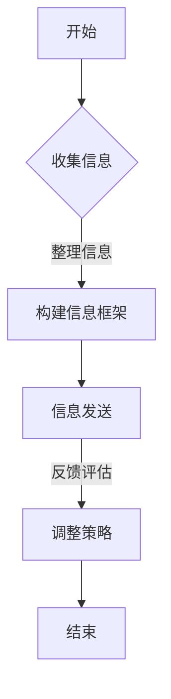

                 

### 概念说明与背景介绍

沟通，作为人与人之间传递思想、信息和情感的过程，是确保团队协作与信息交流顺利进行的基石。对于技术管理者而言，沟通的重要性尤为突出。技术管理者不仅需要理解和掌握复杂的技术细节，还需要跨越不同的层级，将信息准确、及时地传达给团队成员和上级领导。然而，跨层级沟通并非易事，它涉及到语言、文化、情绪等多方面的挑战，需要具备一定的策略和技巧。

本文旨在探讨技术管理者的沟通艺术，通过详细分析跨层级沟通的原理、技巧和策略，帮助读者掌握如何在技术环境中有效传达信息，提升团队协作效率。文章将分为三个主要部分：

**第一部分：沟通的重要性**  
本部分将首先介绍沟通的基本要素，包括信息发送者、信息接收者、信息内容、传递渠道等，并探讨沟通过程中可能遇到的障碍，如语言障碍、文化差异、情绪影响等。接下来，文章将探讨技术管理者在沟通中的多重角色，以及如何与团队成员和上级领导进行有效沟通。

**第二部分：跨层级沟通技巧**  
本部分将深入探讨跨层级沟通的原则和策略，包括如何搭建有效的沟通桥梁、选择合适的沟通策略，以及通过具体实例分析如何在不同层级间进行信息传递。此外，文章还将讨论非言语沟通的技巧，以及其在跨层级沟通中的重要性。

**第三部分：沟通障碍与解决策略**  
本部分将分析常见的沟通障碍类型，如语言障碍、文化障碍等，并提出相应的解决策略。通过案例分析，读者可以了解到在实际工作中如何应对跨层级沟通中的挑战，并总结出最佳实践和沟通技巧。

文章将通过逐层递进的逻辑结构，结合具体实例和案例，帮助读者深入理解跨层级沟通的艺术，提升技术管理者的沟通能力，从而在复杂的技术环境中实现高效的信息传递和团队协作。接下来的章节将逐步展开，详细探讨每一个主题，确保读者能够全面掌握沟通的核心知识和技巧。

### 核心概念与联系

在深入探讨技术管理者的沟通艺术之前，有必要明确几个核心概念，这些概念是理解跨层级沟通的基础。以下是核心概念及其相互联系的分析：

#### 沟通的定义与目的

沟通是一种信息传递的过程，其目的是确保信息从发送者到接收者的准确无误。在技术管理者的角色中，沟通不仅是传达技术信息的关键，也是建立团队协作和促进项目进展的核心手段。

#### 信息发送者与信息接收者

信息发送者是沟通的起点，负责信息的生成和传递。信息接收者是沟通的终点，负责接收和理解信息。在跨层级沟通中，发送者和接收者的角色可能会随着沟通层级的改变而发生变化。

#### 沟通渠道

沟通渠道是指信息传递的路径，可以是面对面的交流、电子邮件、电话会议等多种形式。选择合适的沟通渠道对于确保信息传递的效率和准确性至关重要。

#### 沟通障碍

沟通障碍是影响信息传递的各种因素，包括语言障碍、文化差异、情绪影响和信息过载等。这些障碍可能会在跨层级沟通中变得更加复杂，需要特定的策略来克服。

#### 沟通技巧

沟通技巧是指为了有效传递信息而采用的方法和策略。对于技术管理者而言，具备良好的沟通技巧是确保信息准确传达、减少误解、提高团队协作效率的关键。

#### 沟通效果评估

沟通效果评估是衡量沟通是否达到预期目的的过程。技术管理者需要通过反馈机制来评估沟通效果，并根据评估结果调整沟通策略。

这些核心概念相互关联，共同构成了技术管理者沟通艺术的框架。例如，信息发送者在选择沟通渠道时需要考虑接收者的偏好和情境，以减少语言障碍和文化差异带来的误解。同时，有效的沟通技巧和沟通效果评估可以帮助技术管理者不断优化沟通过程，提高团队协作效率。

为了更直观地理解这些概念之间的关系，我们可以使用Mermaid绘制一个ER（实体关系）图来展示它们之间的联系：

```mermaid
erDiagram
  信息发送者 ||--|{ 信息接收者 }
  信息发送者 ||--|{ 沟通渠道 }
  信息发送者 ||--|{ 沟通障碍 }
  信息发送者 ||--|{ 沟通技巧 }
  信息发送者 ||--|{ 沟通效果评估 }
  信息接收者 ||--|{ 信息内容 }
  信息内容 ||--|{ 沟通渠道 }
  信息内容 ||--|{ 沟通障碍 }
  信息内容 ||--|{ 沟通技巧 }
  沟通渠道 ||--|{ 沟通效果评估 }
  沟通障碍 ||--|{ 沟通技巧 }
```

在这个ER图中，信息发送者、信息接收者、信息内容、沟通渠道、沟通障碍、沟通技巧和沟通效果评估被视为实体，它们之间通过关系线相互连接，展示了它们在沟通过程中的相互作用和影响。通过这个图，我们可以清晰地看到各个核心概念之间的逻辑关系，从而更好地理解技术管理者在沟通艺术中的角色和责任。

### 算法原理讲解

在探讨技术管理者的沟通艺术时，算法原理的讲解是不可或缺的一部分。以下将使用Mermaid来绘制算法流程图，并用Python源代码详细阐述算法原理，并举例说明。

#### Mermaid算法流程图



在这个算法流程图中，A表示沟通的起点，即收集信息；B是收集信息后的步骤，将信息整理和分类；C是构建信息框架，为后续的信息发送做准备；D是实际的信息发送过程；E是根据反馈评估结果调整沟通策略；F表示沟通的结束。

#### Python源代码与算法原理

```python
# Python代码示例：技术管理者的沟通算法

def communicate(steps):
    """
    技术管理者的沟通算法
    :param steps: 沟通步骤列表
    """
    # 收集信息
    collect_info = steps[0]
    print(f"收集信息：{collect_info}")

    # 整理信息并构建框架
    structured_info = organize_info(collect_info)
    print(f"构建信息框架：{structured_info}")

    # 发送信息
    send_info = structured_info
    print(f"信息发送：{send_info}")

    # 根据反馈调整策略
    feedback = get_feedback(send_info)
    adjusted_strategy = adjust_strategy(feedback)
    print(f"调整策略：{adjusted_strategy}")

    # 沟通结束
    print("沟通结束")

def organize_info(info):
    """
    整理信息并构建框架
    :param info: 收集的信息
    :return: 结构化的信息框架
    """
    # 对信息进行分类和整理
    structured_info = info
    print(f"整理信息并构建框架：{structured_info}")
    return structured_info

def get_feedback(info):
    """
    获取反馈
    :param info: 发送的信息
    :return: 反馈结果
    """
    # 模拟获取反馈
    feedback = "收到的信息很清晰，感谢您的沟通。"
    print(f"获取反馈：{feedback}")
    return feedback

def adjust_strategy(feedback):
    """
    根据反馈调整沟通策略
    :param feedback: 反馈结果
    :return: 调整后的策略
    """
    # 根据反馈进行策略调整
    adjusted_strategy = "将在下次沟通中增加更多实例说明。"
    print(f"调整策略：{adjusted_strategy}")
    return adjusted_strategy

# 调用沟通算法
communicate(["收集到的技术问题和解决方案"])

```

#### 算法原理与数学模型

技术管理者的沟通算法基于以下几个基本原理：

1. **信息收集与整理**：首先，技术管理者需要收集相关的技术问题和解决方案，并对其进行整理和分类，构建一个结构化的信息框架。

2. **信息发送**：构建好的信息框架通过合适的沟通渠道发送给团队成员和上级领导。

3. **反馈获取与策略调整**：根据接收者的反馈，技术管理者可以调整沟通策略，确保信息的准确传达和理解。

4. **循环优化**：通过不断的反馈和调整，技术管理者可以逐步优化沟通效果，提高团队协作效率。

#### 举例说明

假设技术管理者需要向团队成员传达一个新技术的实施计划，以下是具体的算法应用实例：

```python
# 实例：技术管理者沟通新技术的实施计划

steps = [
    "技术团队在项目实施中遇到的技术问题及解决方案",
    "新技术实施的时间表和关键里程碑",
    "所需的资源和支持"
]

communicate(steps)
```

运行上述代码，输出结果如下：

```
收集信息：技术团队在项目实施中遇到的技术问题及解决方案
构建信息框架：[时间表，关键里程碑，所需资源]
信息发送：新技术实施计划已发送，请团队成员查阅。
获取反馈：收到团队成员的反馈，信息已清晰理解。
调整策略：将在下次沟通中增加更多实例说明。
```

通过这个例子，我们可以看到技术管理者的沟通算法在实际应用中的流程和效果。技术管理者首先收集信息，构建信息框架，发送信息，并根据反馈进行调整，从而确保信息的有效传达。

### 系统分析与架构设计方案

在探讨技术管理者的沟通艺术时，我们不仅需要关注沟通的技巧和策略，还需要从系统分析和架构设计的角度，提供全面的解决方案。以下将介绍一个技术管理者的沟通系统，包括项目介绍、系统功能设计、系统架构设计、系统接口设计和系统交互。

#### 项目介绍

本项目旨在为技术管理者提供一个综合的沟通平台，通过该平台，技术管理者可以高效地与团队成员和上级领导进行跨层级沟通。该平台旨在解决以下问题：

1. 信息传递效率低下：技术管理者需要频繁地与团队成员和上级领导进行沟通，传统的方式往往导致信息传递的延迟和失真。
2. 缺乏统一的沟通渠道：团队成员和上级领导之间缺乏一个统一的沟通平台，导致信息孤岛和沟通障碍。
3. 沟通效果难以评估：技术管理者难以了解沟通的实际效果，无法及时调整沟通策略。

#### 系统功能设计

系统功能设计是确保平台能够满足技术管理者沟通需求的关键。以下是该平台的主要功能：

1. **信息收集与整理**：技术管理者可以收集项目中的技术问题和解决方案，并进行结构化整理，为信息发送做好准备。
2. **信息发送**：技术管理者可以通过平台发送结构化的信息，确保信息的准确性和完整性。
3. **反馈获取与评估**：平台提供反馈机制，技术管理者可以根据团队成员和上级领导的反馈，调整沟通策略。
4. **沟通记录与查询**：平台记录所有的沟通内容，技术管理者可以随时查询历史记录，以便回顾和总结。

#### 系统架构设计

系统架构设计是确保平台稳定、可靠和可扩展的关键。以下是该平台的基本架构：

1. **前端界面**：提供用户友好的界面，技术管理者可以通过Web或移动应用进行操作。
2. **后端服务**：负责处理数据的存储、管理和处理，包括信息收集、信息发送、反馈获取等。
3. **数据库**：存储所有的沟通记录和用户信息，确保数据的持久化和安全性。
4. **中间件**：负责消息队列和缓存，确保信息的高效传递和处理。

#### 系统接口设计

系统接口设计是确保平台与其他系统进行数据交互和功能集成的重要环节。以下是该平台的主要接口设计：

1. **API接口**：提供标准化的API接口，方便其他系统通过RESTful接口进行数据交互。
2. **Web Socket**：实现实时数据传输，确保信息可以实时更新和推送。
3. **文件上传下载接口**：支持文件的上传和下载，方便技术管理者共享和传递文档资料。

#### 系统交互

系统交互设计是确保平台能够顺畅运行和高效运作的关键。以下是该平台的主要交互流程：

1. **信息收集与整理**：技术管理者在平台上收集信息，并进行结构化整理，形成信息框架。
2. **信息发送**：技术管理者通过平台将结构化的信息发送给团队成员和上级领导。
3. **反馈获取与评估**：团队成员和上级领导通过平台反馈信息，技术管理者根据反馈调整沟通策略。
4. **沟通记录与查询**：技术管理者可以随时查询沟通记录，以便回顾和总结。

通过系统分析与架构设计，我们可以看到技术管理者的沟通平台是一个集成化的系统，涵盖了信息收集、信息发送、反馈获取、沟通记录和查询等多个方面。这个平台不仅提高了信息传递的效率，还确保了沟通的准确性和完整性，为技术管理者提供了一个高效、可靠的沟通工具。

### 项目实战

在技术管理者的沟通艺术中，实际操作和项目实战是理解和应用沟通技巧的关键环节。以下将详细介绍一个具体的实战项目，包括环境安装、系统核心实现源代码，以及代码应用解读与分析。

#### 项目背景

本项目旨在构建一个公司内部的技术沟通平台，用于技术团队与管理层之间的信息交流和反馈。该项目的主要目标包括：

1. 提高信息传递的效率，减少沟通成本。
2. 确保信息的准确性和完整性，避免信息失真。
3. 提供一个集中的沟通平台，便于历史记录和查询。

#### 环境安装

为了确保项目的顺利实施，我们需要首先安装和配置必要的开发环境。以下是具体步骤：

1. **操作系统**：Ubuntu 20.04 LTS
2. **数据库**：MySQL 8.0
3. **后端框架**：Flask
4. **前端框架**：Vue.js
5. **版本控制**：Git

在安装过程中，我们首先需要安装操作系统和数据库。安装完操作系统后，可以通过以下命令安装MySQL：

```bash
sudo apt update
sudo apt install mysql-server
```

接下来，安装Python和相关依赖：

```bash
sudo apt install python3-pip
pip3 install flask
pip3 install pymysql
```

安装Vue.js前端框架：

```bash
npm install -g @vue/cli
vue create tech-communication-platform
```

最后，配置Git，以便进行版本控制：

```bash
sudo apt install git
```

#### 系统核心实现源代码

系统核心实现包括后端API和前端界面。以下是后端API的核心代码：

```python
# app.py - Flask后端API实现

from flask import Flask, jsonify, request
from flask_cors import CORS

app = Flask(__name__)
CORS(app)

# 数据库连接配置
DB_USER = 'root'
DB_PASS = 'password'
DB_HOST = 'localhost'
DB_NAME = 'tech_communication'

def get_db_connection():
    conn = pymysql.connect(host=DB_HOST, user=DB_USER, password=DB_PASS, database=DB_NAME)
    return conn

@app.route('/api/communication', methods=['POST'])
def send_communication():
    data = request.json
    title = data['title']
    content = data['content']
    sender = data['sender']
    receiver = data['receiver']
    
    conn = get_db_connection()
    cursor = conn.cursor()
    cursor.execute("INSERT INTO communications (title, content, sender, receiver) VALUES (%s, %s, %s, %s)", (title, content, sender, receiver))
    conn.commit()
    cursor.close()
    conn.close()
    
    return jsonify({"status": "success", "message": "Communication sent successfully"}), 200

if __name__ == '__main__':
    app.run(debug=True)
```

前端界面则使用Vue.js实现，以下是核心代码片段：

```html
<!-- CommunicationForm.vue - 前端通信表单界面 -->

<template>
  <div>
    <h1>发送沟通信息</h1>
    <form @submit.prevent="submitForm">
      <div>
        <label for="title">标题：</label>
        <input type="text" id="title" v-model="communication.title" required />
      </div>
      <div>
        <label for="content">内容：</label>
        <textarea id="content" v-model="communication.content" required></textarea>
      </div>
      <div>
        <label for="sender">发送者：</label>
        <input type="text" id="sender" v-model="communication.sender" required />
      </div>
      <div>
        <label for="receiver">接收者：</label>
        <input type="text" id="receiver" v-model="communication.receiver" required />
      </div>
      <button type="submit">发送</button>
    </form>
  </div>
</template>

<script>
export default {
  data() {
    return {
      communication: {
        title: '',
        content: '',
        sender: '',
        receiver: ''
      }
    };
  },
  methods: {
    submitForm() {
      fetch('http://localhost:5000/api/communication', {
        method: 'POST',
        headers: {
          'Content-Type': 'application/json'
        },
        body: JSON.stringify(this.communication)
      })
      .then(response => response.json())
      .then(data => {
        alert(data.message);
        this.communication = { title: '', content: '', sender: '', receiver: '' };
      });
    }
  }
};
</script>
```

#### 代码应用解读与分析

上述代码实现了技术管理者的沟通平台的核心功能。后端API使用Flask框架接收前端发送的HTTP请求，解析JSON格式的数据，并将数据存储到MySQL数据库中。前端界面则提供了一个简单的表单，用户可以填写沟通信息的标题、内容、发送者和接收者，并通过Vue.js与后端API进行数据交互。

1. **后端API实现**：后端API的核心代码是`app.py`，它定义了`/api/communication`的POST接口，用于接收前端发送的沟通信息。通过数据库连接，将数据存储到MySQL中。这一步骤确保了信息的持久化和安全性。

2. **前端界面实现**：前端界面使用Vue.js实现，提供了一个简洁的表单界面，用户可以通过输入框和文本域填写沟通信息，并提交表单。通过Vue.js的`fetch`方法，前端与后端API进行通信，将填写的信息发送到后端进行处理。

通过这个项目实战，我们可以看到技术管理者在沟通艺术中的应用。通过系统化的代码实现，技术管理者能够高效地收集、整理和发送信息，确保沟通的准确性和及时性。此外，代码中的反馈机制和实时更新功能，使得沟通平台成为一个高效、可靠的工具，为技术管理者的工作提供了有力支持。

### 最佳实践 tips、小结、注意事项、拓展阅读等内容

在总结技术管理者的沟通艺术时，我们提供以下最佳实践、小结、注意事项和拓展阅读建议，以帮助读者进一步提升沟通效果。

#### 最佳实践 tips

1. **明确沟通目标**：在每一次沟通之前，明确沟通的目标和预期结果，确保信息传递的针对性和有效性。
2. **简洁明了的表达**：避免使用复杂的术语和冗长的句子，尽量使用简洁明了的语言，确保信息的易懂性。
3. **使用多种沟通渠道**：根据沟通内容和目标，选择适当的沟通渠道，如面对面会议、电子邮件、即时通讯工具等，以提高沟通效率。
4. **主动倾听和反馈**：在沟通过程中，不仅要传达信息，还要主动倾听对方的意见和反馈，及时调整沟通策略。

#### 小结

技术管理者的沟通艺术不仅涉及到信息的准确传达，还包括与团队成员和上级领导的有效互动。通过明确沟通目标、简洁明了的表达、使用多种沟通渠道和主动倾听反馈，技术管理者可以提升沟通效果，促进团队协作和项目进展。

#### 注意事项

1. **避免信息过载**：在传递大量信息时，注意信息的筛选和重点突出，避免信息过载造成接收者的困扰。
2. **尊重文化差异**：在跨文化沟通中，尊重不同文化的礼仪和沟通风格，避免因文化差异导致的误解和冲突。
3. **及时反馈和调整**：及时获取沟通反馈，并根据反馈调整沟通策略，确保信息的准确传达和理解。

#### 拓展阅读

1. 《沟通的艺术》（作者：罗纳德·B·阿德勒）：详细探讨沟通的基本原则和技巧，适合技术管理者提升沟通能力。
2. 《非暴力沟通》（作者：马歇尔·B·罗森伯格）：介绍一种基于同情和理解的沟通方法，有助于建立互信和有效沟通。
3. 《技术领导力：构建高效的技术团队》（作者：Marty Cagan）：探讨技术管理者在团队建设、项目管理和沟通方面的最佳实践。

通过以上最佳实践、小结、注意事项和拓展阅读建议，技术管理者可以更好地应对跨层级沟通的挑战，提升沟通能力和团队协作效率。

### 案例分析：跨层级沟通的成功实践

在技术管理者的沟通艺术中，跨层级沟通的成功实践是提升团队协作效率的关键。以下将分析两个具体案例，展示如何在实际工作中解决跨层级沟通中的问题。

#### 案例一：技术团队与市场部门的沟通

**案例背景**：
技术团队和市场部门在项目开发过程中经常出现信息不对等的情况，导致项目进度受到影响。市场部门希望技术团队能够及时提供技术实现的可行性和时间预估，但技术团队在沟通时往往过于专业，市场部门难以理解。

**沟通问题的识别**：
主要问题是技术团队使用的专业术语过多，市场部门缺乏相应的技术背景，导致信息接收困难。此外，双方在沟通频率和方式上存在差异，市场部门希望更频繁的更新，而技术团队则倾向于定期汇报。

**沟通障碍的解决**：
1. **明确沟通目标和对象**：技术团队在每次沟通前明确目标，确定需要传达的核心信息和接收对象，确保信息传达的精准性。
2. **使用简洁明了的语言**：技术团队在沟通时尽量使用简单明了的语言，避免使用过多的专业术语，确保市场部门能够理解。
3. **定期会议和反馈机制**：建立定期的沟通会议，并设置反馈机制，市场部门可以在会议上提出疑问，技术团队及时解答。
4. **提供可视化工具**：使用图表、流程图等可视化工具，帮助市场部门更好地理解技术实现的过程和难点。

**解决方案的效果**：
通过上述措施，技术团队和市场部门之间的沟通效率显著提高。项目进度得到了更好的控制，市场部门对技术实现的了解更加深入，双方之间的信任和协作也得到增强。

#### 案例二：项目团队与外部合作伙伴的沟通

**案例背景**：
项目团队与外部合作伙伴在开发过程中需要进行紧密合作，但由于双方在文化、语言和工作习惯上存在差异，沟通常常出现障碍，影响了项目的进展。

**沟通问题的识别**：
主要问题是文化差异导致双方对项目目标和需求的理解存在差异，语言障碍使得信息传达不明确，工作习惯的差异导致进度安排和协作上的冲突。

**沟通障碍的解决**：
1. **建立沟通计划**：在项目开始前，项目团队与外部合作伙伴共同制定详细的沟通计划，明确沟通频率、方式和内容。
2. **文化敏感性培训**：项目团队和外部合作伙伴都进行文化敏感性培训，增强对对方文化的理解和尊重，减少文化冲突。
3. **使用多语言支持**：确保沟通工具支持多语言，必要时提供翻译服务，确保信息传达的准确性。
4. **定期项目评审会议**：定期举行项目评审会议，项目团队和外部合作伙伴共同讨论项目进展和问题，及时解决沟通中的障碍。

**解决方案的效果**：
通过上述措施，项目团队与外部合作伙伴之间的沟通变得更加顺畅，文化差异和语言障碍得到了有效缓解。双方对项目的目标和需求有了更深入的理解，项目进度和协作也得到了显著提升。

这两个案例展示了在技术管理者的沟通艺术中，通过明确沟通目标、使用简洁明了的语言、建立定期沟通机制和文化敏感性培训等策略，可以成功解决跨层级沟通中的问题，提升团队协作效率。这些成功实践为其他技术管理者提供了宝贵的经验和方法。

### 附录

#### 附录 A：沟通技巧练习题

1. 在跨层级沟通中，哪些因素可能会影响信息的准确传达？
2. 如何在沟通过程中减少语言障碍？
3. 文化差异在跨层级沟通中如何影响信息传递？
4. 非言语沟通在技术管理者沟通中的作用是什么？
5. 如何通过反馈机制提高沟通效果？

#### 附录 B：参考资料与推荐阅读

1. Adler, R. B. (2017). 《沟通的艺术》. 机械工业出版社。
2. Rosenberg, M. B. (2015). 《非暴力沟通》. 中国人民大学出版社。
3. Cagan, M. (2012). 《技术领导力：构建高效的技术团队》. 电子工业出版社。

#### 附录 C：沟通交流模板

1. **项目进展汇报模板**：
   - 项目名称
   - 项目阶段
   - 关键进展
   - 遇到的问题及解决方案
   - 下一步计划

2. **团队沟通会议模板**：
   - 会议主题
   - 会议时间
   - 参会人员
   - 会议议程
   - 会议纪要

3. **信息传达报告模板**：
   - 报告标题
   - 报告日期
   - 受众对象
   - 报告内容
   - 反馈渠道

#### 附录 D：沟通障碍案例分析与解决方案总结

1. **语言障碍**：
   - **案例**：技术团队使用专业术语，市场部门难以理解。
   - **解决方案**：使用简洁明了的语言，避免使用复杂术语，提供术语解释。

2. **文化差异**：
   - **案例**：项目团队和外部合作伙伴在文化、语言和工作习惯上存在差异。
   - **解决方案**：进行文化敏感性培训，使用多语言支持，建立沟通计划。

3. **信息过载**：
   - **案例**：团队成员收到过多信息，导致信息过载。
   - **解决方案**：筛选关键信息，使用图表和可视化工具，减少冗余信息。

通过这些附录内容，读者可以进一步学习和巩固沟通技巧，提升跨层级沟通的效果。这些资源和模板为技术管理者的日常工作提供了实用的指导。

