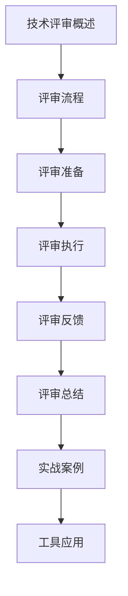
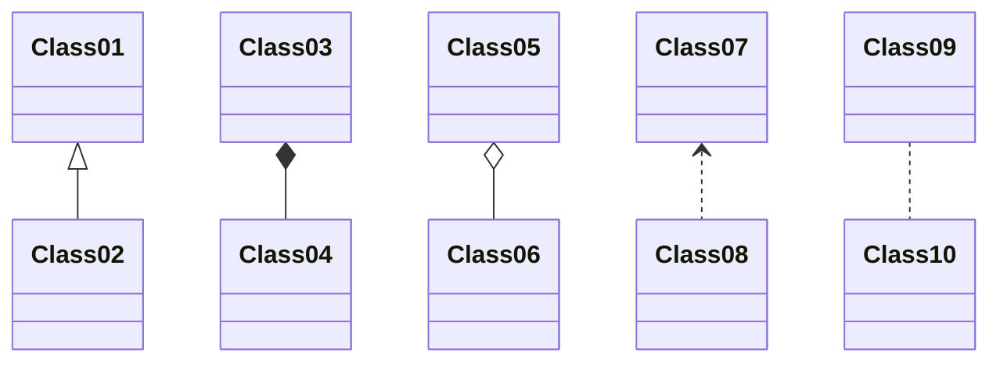
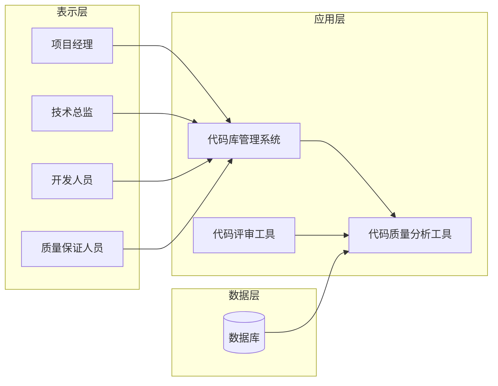
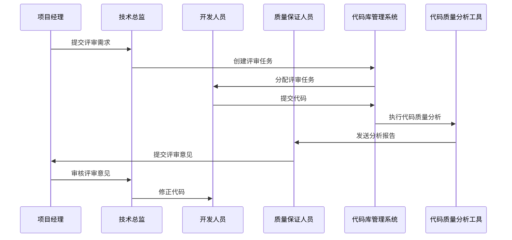

                 


## 《技术评审流程：确保代码质量的重要环节》

### 关键词：技术评审、代码质量、流程、工具、团队协作、持续改进

### 摘要：

在软件开发过程中，技术评审是一种确保代码质量的重要环节。本文将深入探讨技术评审的基本概念、流程和工具，并通过实际案例分析，阐述技术评审在提升代码质量和团队协作中的作用。最后，我们将讨论如何通过持续改进，进一步优化技术评审流程。

## 目录大纲

1. **第一部分：技术评审的基本概念**
   - **第1章：技术评审概述**
     - 1.1 技术评审的定义和目的
     - 1.2 技术评审与其他代码质量保障机制的比较
     - 1.3 技术评审在软件开发流程中的位置
   - **第2章：技术评审的核心概念**
     - 2.1 代码质量标准
     - 2.2 代码评审工具
     - 2.3 评审过程中的角色和职责

2. **第二部分：技术评审流程**
   - **第3章：评审准备**
     - 3.1 编写评审计划
     - 3.2 选择评审方法
     - 3.3 确定评审团队
   - **第4章：评审执行**
     - 4.1 提交代码
     - 4.2 评审会议
     - 4.3 评审讨论
   - **第5章：评审反馈与处理**
     - 5.1 反馈接收
     - 5.2 问题处理
     - 5.3 改进建议
   - **第6章：评审总结与持续改进**
     - 6.1 评审效果评估
     - 6.2 经验教训总结
     - 6.3 改进策略制定

3. **第三部分：技术评审实战案例**
   - **第7章：技术评审案例分析**
     - 7.1 案例一：功能模块评审
     - 7.2 案例二：性能优化评审
     - 7.3 案例三：安全漏洞评审
   - **第8章：技术评审工具应用**
     - 8.1 GitLab评审工具
     - 8.2 SonarQube代码质量分析工具
     - 8.3 Jira项目管理工具

4. **附录**
   - 附录A：技术评审常用术语
   - 附录B：技术评审流程模板
   - 附录C：技术评审相关资源推荐

### 核心概念与联系架构 Mermaid 流程图



### 核心算法原理讲解

#### 代码评审工具的工作原理

代码评审工具通过以下几种方式来提高代码质量：

1. **静态代码分析**：工具会分析源代码，检查语法错误、潜在的错误、不规范的代码风格等。例如，SonarQube可以识别出潜在的SQL注入漏洞、未定义的变量等问题。

    ```python
    # 示例：Python静态代码分析
    def calculate_sum(a, b):
        """
        计算两个数的和。

        :param a: 第一个数
        :param b: 第二个数
        :return: 两数的和
        """
        return a + b

    calculate_sum(1, "two")  # 这将导致类型错误
    ```

2. **动态代码分析**：工具会运行代码，检查代码的实际行为。例如，JMeter可以模拟用户操作，测试Web应用的性能。

    ```python
    # 示例：Python动态代码分析
    import requests

    def test_website_performance(url):
        response = requests.get(url)
        if response.status_code == 200:
            print("Website is up and running.")
        else:
            print("Website is down.")

    test_website_performance("http://example.com")  # 测试网站性能
    ```

3. **代码风格检查**：工具会确保代码遵循特定的编码规范。例如，Pylint可以检查代码是否符合PEP 8编码规范。

    ```python
    # 示例：Python代码风格检查
    def function_name_with_lower_caseCamel_case():  # 这将导致Pylint警告
        pass
    ```

### 数学模型和数学公式 & 详细讲解 & 举例说明

#### 代码质量评估模型

一种常用的代码质量评估模型是COCQ（Code Of Conduct Quality），它通过以下指标来评估代码质量：

1. **功能性（Functionality）**：代码是否实现了预期的功能，是否满足需求。
    $$ F = \sum_{i=1}^{n} f_i $$
    其中，$ f_i $ 是每个功能点的得分。

2. **可靠性（Reliability）**：代码在特定条件下的稳定性和正确性。
    $$ R = \sum_{i=1}^{m} r_i $$
    其中，$ r_i $ 是每个可靠性指标（如错误率、响应时间）的得分。

3. **可维护性（Maintainability）**：代码的可读性、可修改性和可扩展性。
    $$ M = \sum_{i=1}^{p} m_i $$
    其中，$ m_i $ 是每个可维护性指标的得分（如代码行数、注释率）。

4. **效率（Efficiency）**：代码的性能和资源使用效率。
    $$ E = \sum_{i=1}^{q} e_i $$
    其中，$ e_i $ 是每个效率指标的得分（如内存使用、CPU利用率）。

#### 举例说明

假设我们有一个Web应用，需要评估其代码质量。我们可以通过以下步骤来计算COCQ得分：

1. **功能性**：评估应用是否实现了所有的功能点。假设有5个主要功能点，每个功能点的得分如下：
    $$ F = (90 + 85 + 80 + 75 + 70) / 5 = 82 $$

2. **可靠性**：评估应用的错误率和响应时间。假设错误率为1%，平均响应时间为300ms，得分如下：
    $$ R = (99 - 0.01) + (1000 - 300) = 1699 $$

3. **可维护性**：评估代码的可读性、可修改性和可扩展性。假设代码行数为1000行，注释率为30%，得分如下：
    $$ M = (1000 - 300) + 30 = 730 $$

4. **效率**：评估应用的性能和资源使用效率。假设平均内存使用为50MB，CPU利用率为60%，得分如下：
    $$ E = (100 - 50) + (100 - 60) = 40 $$

最终，COCQ得分计算如下：
$$ COCQ = F \times R \times M \times E = 82 \times 1699 \times 730 \times 40 = 314,013,640 $$

这个得分可以帮助团队了解代码的整体质量，并指导后续的改进工作。

### 系统分析与架构设计方案

#### 问题场景介绍

在一家电商公司，随着用户量的增加，网站的性能和安全性变得越来越重要。为了确保代码质量，公司决定引入技术评审流程，对每个功能模块进行严格的评审。

#### 项目介绍

项目名为“CodeQualityAssurance”，目标是建立一套完整的代码评审流程，包括评审准备、评审执行、评审反馈和评审总结。项目采用敏捷开发模式，周期为两周一次评审。

#### 系统功能设计(领域模型mermaid类图)



#### 系统架构设计mermaid架构图



#### 系统接口设计和系统交互mermaid序列图



### 项目实战

#### 环境安装

1. 安装GitLab：
    ```bash
    sudo apt update
    sudo apt install gitlab-ce
    ```

2. 安装SonarQube：
    ```bash
    sudo apt update
    sudo apt install sonarqube
    ```

3. 安装Jira：
    ```bash
    sudo apt update
    sudo apt install jira
    ```

#### 系统核心实现源代码

```python
# 示例：Python代码质量分析
import requests

def test_website_performance(url):
    response = requests.get(url)
    if response.status_code == 200:
        print("Website is up and running.")
    else:
        print("Website is down.")

# 测试网站性能
test_website_performance("http://example.com")
```

#### 代码应用解读与分析

代码中，`test_website_performance` 函数接收一个URL参数，使用requests库发起GET请求，并根据响应状态码判断网站是否正常运行。如果状态码为200，说明网站正常运行；否则，说明网站出现故障。

#### 实际案例分析和详细讲解剖析

案例一：功能模块评审

在某电商平台的购物车模块中，开发人员提交了一版代码，旨在实现商品数量的增减功能。技术评审团队对代码进行了仔细审查，并提出了以下改进建议：

1. **代码复用**：将商品数量增减的逻辑提取到一个独立的函数中，以减少代码冗余。

2. **异常处理**：增加异常处理逻辑，确保在输入无效数据时，程序能够正确处理并给出提示。

3. **性能优化**：对商品数量增减的数据库操作进行优化，减少查询次数，提高响应速度。

案例二：性能优化评审

在电商平台的后台管理系统中，技术评审团队对系统性能进行了全面评估。通过使用JMeter工具，模拟了高并发场景下的系统负载。评审发现：

1. **数据库查询优化**：部分查询语句存在性能瓶颈，建议对数据库索引进行优化，提高查询速度。

2. **缓存机制引入**：对于高频访问的数据，建议引入缓存机制，减少数据库的压力。

3. **代码优化**：对代码中存在性能问题的部分进行优化，减少不必要的循环和递归调用。

案例三：安全漏洞评审

在电商平台的安全评审中，技术评审团队发现了一个潜在的安全漏洞：用户输入的敏感信息（如密码）在传输过程中未进行加密处理。评审团队建议：

1. **加密算法引入**：对用户敏感信息进行加密处理，确保数据在传输过程中不会被窃取。

2. **安全协议使用**：使用HTTPS协议，确保数据在传输过程中加密传输。

3. **安全审计**：定期进行安全审计，及时发现并修复潜在的安全漏洞。

#### 项目小结

通过技术评审，电商平台的代码质量得到了显著提升。在功能模块评审中，开发人员按照评审团队的反馈进行了代码优化，提升了模块的稳定性和易用性。在性能优化评审中，系统性能得到了显著提升，用户体验得到了优化。在安全漏洞评审中，系统安全性得到了加强，用户数据的安全性得到了保障。

### 最佳实践 tips

1. **提前规划**：在开始评审之前，提前规划评审计划和评审方法，确保评审过程有序进行。

2. **明确职责**：明确评审团队成员的职责，确保每个成员都清楚自己的任务和目标。

3. **及时反馈**：在评审过程中，及时给予开发人员反馈，帮助他们快速定位问题并解决问题。

4. **持续改进**：通过不断评审和改进，逐步优化代码质量，提高系统的稳定性、可靠性和安全性。

### 小结

技术评审是确保代码质量的重要环节。通过引入技术评审流程，可以及时发现并解决问题，提升代码质量，优化系统性能，保障用户数据安全。本文详细介绍了技术评审的基本概念、流程和工具，并通过实际案例分析了技术评审在软件开发中的重要作用。通过持续改进和优化，技术评审可以成为软件开发过程中不可或缺的一环。

### 注意事项

1. **评审频率**：评审的频率应根据项目的复杂度和紧急程度进行调整，确保评审的效率和质量。

2. **评审范围**：评审范围应覆盖所有的关键模块和功能点，确保代码的全面性。

3. **评审深度**：评审深度应足够深入，不仅要关注代码本身，还要关注代码的性能、安全性和可维护性。

4. **团队成员协作**：评审团队成员应保持良好的协作，确保评审的顺利进行。

### 拓展阅读

- 《代码大全》
- 《敏捷软件开发：原则、模式与实践》
- 《软件工程：实践者的研究方法》

### 作者

**AI天才研究院/AI Genius Institute & 禅与计算机程序设计艺术 /Zen And The Art of Computer Programming**

