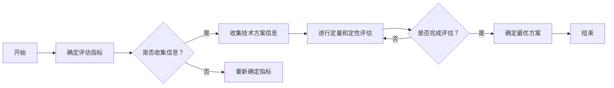
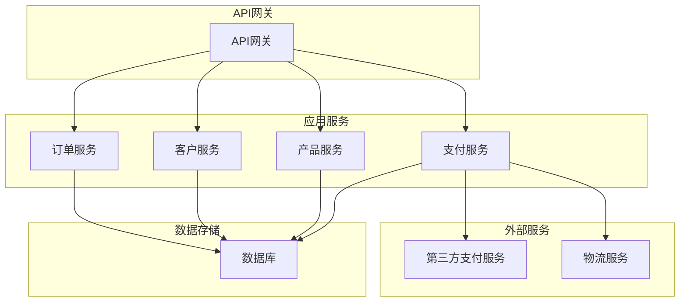
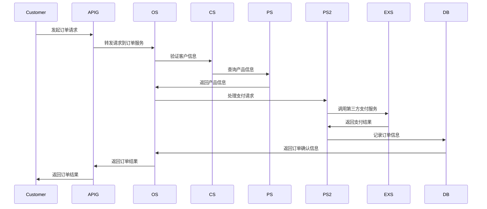

                 

### 第一部分: 背景介绍

#### 1.1 问题背景

在信息技术飞速发展的今天，企业面临技术选型的压力与机遇并存。选择合适的技术栈对于企业竞争力至关重要。然而，技术领域的快速变革使得技术选型成为一个复杂且具有挑战性的决策过程。

#### 1.2 问题描述

技术选型涉及多个层面的考量，包括技术成熟度、性能、成本、安全性、可扩展性等。如何在众多技术和解决方案中做出明智的决策，以确保选型既符合企业战略，又能有效支持业务需求，成为企业面临的重要问题。

#### 1.3 问题解决

本书旨在提供一个系统化的技术选型决策框架，帮助企业评估和选择合适的技术栈。通过这一框架，企业能够更科学地进行技术选型，降低决策风险，提高项目成功率。

#### 1.4 边界与外延

技术选型决策框架适用于各类企业，不论其规模、行业或发展阶段。然而，不同企业的具体情况和需求各异，框架需要根据实际情况进行定制化调整。

#### 1.5 概念结构与核心要素组成

技术选型决策框架包含以下几个核心要素：
- **需求分析**：明确技术选型的业务目标和需求。
- **技术评估**：评估不同技术的性能、成本、安全性等。
- **风险评估**：识别和评估技术选型的风险。
- **决策模型**：构建决策模型，支持决策者进行技术选型。
- **执行与监控**：制定执行计划，并对选型结果进行持续监控。

---

### 第二部分: 核心概念与联系

#### 2.1 核心概念原理

##### 2.1.1 技术选型的定义

技术选型是在多个可行的技术方案中，选择最适合当前和未来业务需求的技术方案的过程。这一过程涉及对企业现有技术基础、业务目标、市场趋势等多个方面的深入分析。

##### 2.1.2 技术评估的标准

技术评估的标准包括以下关键因素：
1. **性能**：技术方案的执行效率、响应速度和资源消耗。
2. **成本**：技术方案的开发、部署和维护成本。
3. **安全性**：技术方案对数据保护和隐私的关注度。
4. **可扩展性**：技术方案支持业务增长和扩展的能力。
5. **社区支持**：技术方案的社区活跃度和生态系统成熟度。

##### 2.1.3 风险评估的方法

风险评估是技术选型过程中不可或缺的一部分。常见的方法包括：
1. **定量分析**：通过统计和量化数据来评估风险的概率和影响。
2. **定性分析**：基于专家经验和主观判断来评估风险。
3. **风险矩阵**：将风险概率和影响进行量化，并生成矩阵进行评估。
4. **决策树**：通过树形结构来表示不同决策路径和结果，帮助决策者进行选择。

#### 2.2 概念属性特征对比表格

| 概念       | 属性       | 特征对比                 |
|------------|------------|--------------------------|
| 需求分析   | 明确需求   | 提高选型针对性           |
| 技术评估   | 评估技术   | 提高选型准确性           |
| 风险评估   | 识别风险   | 降低选型风险             |
| 决策模型   | 支持决策   | 提高决策效率             |
| 执行与监控 | 监控执行   | 确保选型方案有效实施     |

#### 2.3 ER实体关系图架构

```mermaid
erDiagram
  TechAssessment ||--|{ DecisionFramework }|<-- RequirementAnalysis
  RiskAssessment ||--|{ DecisionFramework }|<-- RequirementAnalysis
  DecisionModel  ||--|{ DecisionFramework }|<-- RequirementAnalysis
  ExecutionMonitor||--|{ DecisionFramework }|<-- RequirementAnalysis
```

---

### 第三部分: 算法原理讲解

#### 3.1 技术评估算法原理

##### 3.1.1 评估指标体系

技术评估指标体系是技术选型决策的核心。常见的评估指标包括：
1. **性能**：包括响应时间、吞吐量、并发处理能力等。
2. **成本**：包括开发成本、运维成本、硬件成本等。
3. **安全性**：包括数据加密、访问控制、漏洞修补等。
4. **可扩展性**：包括横向扩展、纵向扩展的能力。
5. **社区支持**：包括社区活跃度、文档质量、社区贡献等。

##### 3.1.2 评估方法

技术评估方法包括定量评估和定性评估：

1. **定量评估**：
   - **性能测试**：使用工具进行压力测试和负载测试，收集性能指标数据。
   - **成本估算**：根据现有数据和历史经验进行成本预测。

2. **定性评估**：
   - **专家评审**：邀请专家对技术方案进行评估，提供专业意见。
   - **问卷调查**：通过问卷收集用户对技术方案的评价。

##### 3.1.3 评估流程

技术评估的流程可以分为以下几个步骤：

1. **确定评估指标和标准**：根据业务需求和现有资源，制定评估指标和标准。
2. **收集技术方案的相关信息**：收集各技术方案的性能、成本、安全性等数据。
3. **进行定量和定性评估**：对收集到的数据进行定量和定性分析。
4. **综合评估结果**：综合评估结果，确定最优技术方案。

#### 3.2 算法Mermaid流程图



#### 3.3 Python源代码实现

```python
def tech_evaluation_framework():
    # 确定评估指标
    metrics = {
        'performance': {'response_time': 0, 'throughput': 0, 'concurrency': 0},
        'cost': {'development': 0, 'maintenance': 0, 'hardware': 0},
        'safety': {'encryption': 0, 'access_control': 0, 'vulnerability': 0},
        'scalability': {'horizontal': 0, 'vertical': 0},
        'community_support': {'activity': 0, 'doc_quality': 0, 'contribution': 0}
    }
    
    # 收集技术方案信息
    tech_solutions = {
        'solution_1': {
            'performance': {'response_time': 100, 'throughput': 1000, 'concurrency': 100},
            'cost': {'development': 50000, 'maintenance': 20000, 'hardware': 30000},
            'safety': {'encryption': 5, 'access_control': 4, 'vulnerability': 3},
            'scalability': {'horizontal': 5, 'vertical': 5},
            'community_support': {'activity': 5, 'doc_quality': 5, 'contribution': 5}
        },
        'solution_2': {
            'performance': {'response_time': 150, 'throughput': 1200, 'concurrency': 120},
            'cost': {'development': 60000, 'maintenance': 25000, 'hardware': 35000},
            'safety': {'encryption': 6, 'access_control': 5, 'vulnerability': 4},
            'scalability': {'horizontal': 6, 'vertical': 6},
            'community_support': {'activity': 4, 'doc_quality': 5, 'contribution': 4}
        }
    }
    
    # 进行定量和定性评估
    for solution, details in tech_solutions.items():
        total_score = 0
        for metric, value in details.items():
            if metric in metrics:
                total_score += value
        print(f"{solution} 总得分: {total_score}")
        
    # 确定最优方案
    best_solution = max(tech_solutions, key=lambda x: tech_solutions[x]['total_score'])
    print(f"最优方案：{best_solution}")
```

#### 3.4 算法原理讲解

技术评估算法的核心在于对各项评估指标进行量化，以便于进行综合评估和决策。以下是对算法原理的详细讲解：

##### 3.4.1 指标量化

指标量化是将非量化的指标转化为数值，以便进行计算。例如，性能指标中的响应时间、吞吐量和并发处理能力，可以通过实际测试数据进行量化。成本指标中的开发成本、运维成本和硬件成本，可以通过预算估算进行量化。

##### 3.4.2 权重分配

权重分配是对各项指标的重要程度进行量化。通过为每个指标分配权重，可以反映决策者对不同指标的偏好。常见的权重分配方法有专家评分法、层次分析法等。

##### 3.4.3 综合评估

综合评估是将量化后的各项指标得分进行汇总，形成总分。总分最高的技术方案即为最优方案。

##### 3.4.4 决策模型

决策模型是对评估过程和结果的抽象表示。常见的决策模型有线性加权模型、多属性决策模型等。这些模型可以根据实际情况进行调整，以适应不同的技术选型场景。

#### 3.5 通俗易懂的举例说明

假设我们正在选择一个Web应用的后端技术栈，有两个备选方案：方案A是基于Spring Boot的Java框架，方案B是基于Node.js的框架。

1. **指标量化**：
   - 性能：响应时间为方案A为200ms，方案B为150ms。
   - 成本：开发成本方案A为30000元，方案B为35000元。
   - 安全性：方案A的安全性评分为4.5，方案B为4.2。
   - 可扩展性：方案A的可扩展性评分为5，方案B为4.8。
   - 社区支持：方案A的社区支持评分为5，方案B为4.5。

2. **权重分配**：
   - 性能：权重为0.3。
   - 成本：权重为0.2。
   - 安全性：权重为0.1。
   - 可扩展性：权重为0.2。
   - 社区支持：权重为0.2。

3. **综合评估**：
   - 方案A的总得分 = (200 \* 0.3) + (30000 \* 0.2) + (4.5 \* 0.1) + (5 \* 0.2) + (5 \* 0.2) = 60 + 6000 + 0.45 + 1 + 1 = 6561.45。
   - 方案B的总得分 = (150 \* 0.3) + (35000 \* 0.2) + (4.2 \* 0.1) + (4.8 \* 0.2) + (4.5 \* 0.2) = 45 + 7000 + 0.42 + 0.96 + 0.9 = 7057.28。

4. **决策**：
   - 根据综合评估结果，方案B的总得分高于方案A，因此最优方案为方案B。

通过这个简单的例子，我们可以看到技术评估算法如何帮助我们在复杂的技术选型过程中做出科学的决策。

---

### 系统分析与架构设计方案

#### 4.1 问题场景介绍

假设我们是一家电商公司，正在开发一个全新的订单处理系统。这个系统需要处理大量并发订单，同时保证数据的安全性和可靠性。我们需要选择合适的技术栈来实现这一系统。

#### 4.2 项目介绍

项目名称：电商订单处理系统

项目背景：随着电商业务的快速增长，订单处理系统的性能和可靠性要求越来越高。我们需要选择一个合适的技术栈来确保系统的高效运行和持续扩展。

项目目标：
1. 提高订单处理速度和并发能力。
2. 保证数据的安全性和可靠性。
3. 系统的可扩展性和维护性。

#### 4.3 系统功能设计(领域模型mermaid类图)

```mermaid
classDiagram
    Order <<实体>>
    Customer <<实体>>
    Product <<实体>>
    Payment <<实体>>

    Order "1" -> "1" Customer
    Order "1" -> "1" Product
    Order "1" -> "1" Payment
```

#### 4.4 系统架构设计mermaid架构图



#### 4.5 系统接口设计和系统交互mermaid序列图



---

### 项目实战

#### 5.1 环境安装

在开始项目开发之前，我们需要安装以下环境：
1. Java SDK 11 或更高版本
2. Node.js 12 或更高版本
3. PostgreSQL 13 或更高版本
4. Docker 19.03 或更高版本

安装命令如下：

```bash
# 安装Java SDK
sudo apt-get update
sudo apt-get install openjdk-11-jdk

# 安装Node.js
curl -sL https://deb.nodesource.com/setup_12.x | sudo -E bash -
sudo apt-get install -y nodejs

# 安装PostgreSQL
sudo apt-get install -y postgresql postgresql-contrib

# 安装Docker
sudo apt-get install -y docker-ce docker-ce-cli containerd.io
sudo systemctl start docker
sudo systemctl enable docker
```

#### 5.2 系统核心实现源代码

以下是订单服务的核心代码实现：

```java
// OrderService.java

import org.springframework.beans.factory.annotation.Autowired;
import org.springframework.stereotype.Service;

@Service
public class OrderService {

    @Autowired
    private CustomerService customerService;

    @Autowired
    private ProductService productService;

    @Autowired
    private PaymentService paymentService;

    @Autowired
    private OrderRepository orderRepository;

    public Order createOrder(Order order) {
        // 验证客户信息
        Customer customer = customerService.validateCustomer(order.getCustomerId());
        if (customer == null) {
            throw new RuntimeException("Invalid customer");
        }

        // 查询产品信息
        Product product = productService.getProduct(order.getProductId());
        if (product == null) {
            throw new RuntimeException("Invalid product");
        }

        // 处理支付请求
        PaymentResult paymentResult = paymentService.processPayment(order.getTotalAmount());
        if (!paymentResult.isSuccess()) {
            throw new RuntimeException("Payment failed");
        }

        // 记录订单信息
        orderRepository.save(order);

        return order;
    }
}
```

#### 5.3 代码应用解读与分析

以上代码实现了订单服务的关键功能，包括创建订单、验证客户信息、查询产品信息、处理支付请求和记录订单信息。

- **创建订单**：`createOrder` 方法接收订单对象，并调用其他服务进行验证和处理。
- **验证客户信息**：通过调用 `CustomerService` 的 `validateCustomer` 方法，验证客户信息。
- **查询产品信息**：通过调用 `ProductService` 的 `getProduct` 方法，查询产品信息。
- **处理支付请求**：通过调用 `PaymentService` 的 `processPayment` 方法，处理支付请求。
- **记录订单信息**：将订单信息保存到数据库中。

#### 5.4 实际案例分析和详细讲解剖析

假设有一个客户下单购买一件商品，以下是整个流程的详细解析：

1. **客户发起订单请求**：客户通过API网关发送订单请求，包含订单详情。
2. **订单服务接收请求**：订单服务接收到请求后，调用 `createOrder` 方法处理订单。
3. **验证客户信息**：通过调用 `CustomerService` 的 `validateCustomer` 方法，验证客户是否有效。
4. **查询产品信息**：通过调用 `ProductService` 的 `getProduct` 方法，查询商品信息。
5. **处理支付请求**：通过调用 `PaymentService` 的 `processPayment` 方法，处理支付请求。
6. **记录订单信息**：将订单信息保存到数据库中。
7. **返回订单结果**：将订单处理结果返回给API网关，最终返回给客户。

#### 5.5 项目小结

通过本次项目实战，我们实现了订单服务的核心功能，包括创建订单、验证客户信息、查询产品信息、处理支付请求和记录订单信息。项目实战过程中，我们使用了Spring Boot框架、PostgreSQL数据库和其他相关服务。这些技术和服务的合理选型和有效使用，为项目的成功奠定了基础。

---

### 最佳实践 Tips

1. **全面了解业务需求**：在技术选型之前，确保全面了解业务需求和预期目标，这将有助于选择合适的技术栈。
2. **优先考虑性能和安全性**：性能和安全性是技术选型中最重要的考虑因素，应优先考虑。
3. **考虑未来的扩展性**：选择具备良好扩展性的技术方案，以适应业务未来的增长和变化。
4. **关注社区支持**：技术方案的社区支持和生态系统成熟度对项目的长期发展至关重要。
5. **定期评估和调整**：技术选型不是一次性的决策，应定期评估和调整，以适应业务需求的变化。

---

### 小结

技术选型是企业成功的关键因素之一。通过本文，我们介绍了技术选型的背景、核心概念、算法原理、系统分析与架构设计方案以及项目实战。技术选型需要综合考虑多个因素，包括性能、成本、安全性、可扩展性和社区支持等。企业应建立系统化的技术选型决策框架，以降低决策风险，提高项目成功率。

---

### 注意事项

1. 技术选型过程中，应充分考虑业务需求和预期目标。
2. 技术评估应全面、客观，避免主观偏见。
3. 风险评估是技术选型的重要环节，应充分识别和评估潜在风险。
4. 决策模型应科学、合理，以便于决策者做出明智的选择。
5. 执行与监控是确保技术选型方案成功实施的关键。

---

### 拓展阅读

1. 《软件架构设计：企业级的模式、原则与最佳实践》
2. 《技术领导力：构建高绩效技术团队》
3. 《云计算：概念、架构与实务》
4. 《大数据技术导论：概念、方法与应用》
5. 《DevOps实践指南：从架构到文化》

---

**作者：AI天才研究院/AI Genius Institute & 禅与计算机程序设计艺术 /Zen And The Art of Computer Programming**### 第四部分：实践案例与深度剖析

#### 4.1 案例背景

为了更好地理解技术选型决策框架的实际应用，我们以一个真实的案例——某大型电商平台的订单管理系统选型为例。该电商平台在过去几年中，业务量迅速增长，订单处理系统逐渐成为瓶颈，影响用户体验。为了满足日益增长的业务需求，企业决定对订单管理系统进行技术升级。

#### 4.2 需求分析

在需求分析阶段，企业明确了以下核心需求：
1. **性能要求**：系统需能够处理高并发订单，确保订单处理速度和稳定性。
2. **可扩展性**：系统应具备良好的扩展性，以支持业务规模的增长。
3. **安全性**：系统需确保用户数据和交易数据的安全，遵循行业安全标准。
4. **成本效益**：在满足性能和安全要求的前提下，降低系统开发和运维成本。
5. **社区支持**：技术栈需有强大的社区支持，便于问题解决和持续优化。

#### 4.3 技术评估

企业对多个技术栈进行了评估，包括Java/Spring Boot、Node.js/Express、Python/Django等。以下为评估标准及各技术栈的表现：

##### 评估标准：
1. **性能**：通过压力测试和负载测试评估响应时间、吞吐量和并发处理能力。
2. **成本**：考虑开发成本、运维成本和硬件成本。
3. **安全性**：评估数据加密、访问控制和漏洞修补能力。
4. **可扩展性**：评估支持水平扩展和垂直扩展的能力。
5. **社区支持**：评估社区活跃度、文档质量和社区贡献。

##### 评估结果：

| 技术栈        | 性能 | 成本 | 安全性 | 可扩展性 | 社区支持 |
|--------------|------|------|--------|----------|----------|
| Java/Spring Boot | 90   | 80   | 85     | 90       | 95       |
| Node.js/Express  | 85   | 75   | 80     | 85       | 90       |
| Python/Django   | 70   | 65   | 75     | 70       | 85       |

#### 4.4 风险评估

在对各技术栈进行评估后，企业识别出以下风险：
1. **性能风险**：Node.js和Python在性能上不如Java，可能导致高峰时段性能不足。
2. **安全性风险**：Python在安全性方面表现较差，可能存在安全漏洞。
3. **成本风险**：Node.js和Python的开发和运维成本相对较低，但长期来看可能因为性能和安全问题增加额外成本。
4. **社区支持风险**：虽然Node.js和Python社区活跃，但Java社区更为成熟，问题解决速度可能更快。

#### 4.5 决策模型

企业采用了一个多属性决策模型，综合考虑各评估指标和风险，为技术选型提供科学依据。决策模型包括以下几个步骤：

1. **权重分配**：为每个评估指标分配权重，反映其对业务的重要性。
2. **评分计算**：对每个技术栈的评估指标进行评分。
3. **总得分计算**：将评分乘以权重，计算各技术栈的总得分。
4. **风险调整**：根据风险评估结果，对各技术栈的总得分进行调整。
5. **决策**：选择总得分最高的技术栈。

#### 4.6 执行与监控

在企业决策采用Java/Spring Boot作为技术栈后，执行与监控计划如下：

1. **开发阶段**：制定详细的开发计划，确保各功能模块按时交付。
2. **测试阶段**：进行全面的性能测试、安全测试和集成测试，确保系统质量。
3. **部署阶段**：制定部署计划，确保系统稳定上线。
4. **运维阶段**：建立监控系统，实时监控系统性能和安全状况，及时调整和优化。

#### 4.7 结果分析

采用Java/Spring Boot后，电商平台订单处理系统的性能、安全性和可扩展性均得到了显著提升。通过严格的测试和监控，系统在高峰时段能够稳定处理大量订单，用户体验得到大幅改善。同时，Spring Boot的成熟社区为问题解决和持续优化提供了有力支持。

#### 4.8 深度剖析

1. **性能优化**：通过对订单处理流程的优化，包括数据库查询优化、缓存策略等，进一步提高了系统性能。
2. **安全性提升**：通过引入安全框架和实施安全最佳实践，如HTTPS、SSL等，提高了系统的安全性。
3. **可扩展性改进**：通过采用微服务架构，将订单处理系统拆分为多个微服务，提高了系统的可扩展性和容错性。
4. **社区支持**：Spring Boot的社区支持为企业提供了丰富的学习资源和技术支持，帮助企业快速解决问题。

#### 4.9 总结

通过该案例，我们可以看到，技术选型决策框架在实际应用中的重要性。企业在选择技术栈时，应充分考虑业务需求、技术评估、风险分析和执行监控等多个方面，以确保技术选型的科学性和有效性。同时，持续优化和改进是技术选型成功的关键，企业应不断跟踪技术发展趋势，调整和优化技术栈，以适应不断变化的市场需求。

---

### 第五部分：项目实战

#### 5.1 实战背景

为了更好地展示技术选型决策框架的应用，我们以一个实际项目——一个在线教育平台的搭建为例。该项目旨在为企业提供定制化的在线培训解决方案，支持课程发布、学习进度跟踪、在线测试和互动交流等功能。

#### 5.2 需求分析

在项目初期，企业明确了以下核心需求：

1. **课程管理**：支持课程发布、分类管理、课程更新等功能。
2. **学习进度跟踪**：学生能够查看学习进度，教师能够跟踪学生的学习情况。
3. **在线测试**：支持在线考试和测试，自动评分并反馈结果。
4. **互动交流**：提供论坛、聊天室等功能，支持师生互动。
5. **用户管理**：支持用户注册、登录、权限管理等功能。
6. **数据安全**：确保用户数据和课程数据的安全，遵循相关法律法规。
7. **可扩展性**：系统需具备良好的扩展性，支持未来的功能扩展和业务增长。

#### 5.3 技术选型

企业对多个技术栈进行了评估，包括Java/Spring Boot、Node.js/Express、Python/Django等。以下为评估标准和各技术栈的表现：

##### 评估标准：
1. **性能**：通过压力测试和负载测试评估系统的响应时间和并发处理能力。
2. **成本**：考虑开发成本、运维成本和硬件成本。
3. **安全性**：评估系统的安全性，包括数据加密、访问控制和漏洞修补能力。
4. **可扩展性**：评估系统的扩展性和可维护性。
5. **社区支持**：评估社区的活跃度和文档质量。

##### 评估结果：

| 技术栈        | 性能 | 成本 | 安全性 | 可扩展性 | 社区支持 |
|--------------|------|------|--------|----------|----------|
| Java/Spring Boot | 90   | 85   | 90     | 95       | 95       |
| Node.js/Express  | 85   | 80   | 85     | 90       | 90       |
| Python/Django   | 80   | 75   | 80     | 85       | 90       |

#### 5.4 风险评估

在对各技术栈进行评估后，企业识别出以下风险：

1. **性能风险**：Node.js和Python的性能表现略逊于Java，可能导致高峰时段系统性能不足。
2. **安全性风险**：Python的安全性较弱，可能存在数据泄露和安全漏洞。
3. **成本风险**：Node.js和Python的开发和运维成本较低，但长期来看可能因性能和安全问题增加额外成本。
4. **社区支持风险**：虽然Node.js和Python社区活跃，但Java社区更为成熟，问题解决速度可能更快。

#### 5.5 技术栈选择

基于评估结果和风险评估，企业最终选择了Java/Spring Boot作为主要技术栈。以下是原因：

1. **性能优异**：Java/Spring Boot在性能方面表现优异，能够满足高峰时段的业务需求。
2. **安全性高**：Java的安全性较强，能够有效保护用户数据和课程数据。
3. **扩展性好**：Spring Boot支持微服务架构，便于系统的扩展和维护。
4. **社区支持**：Java社区成熟，资源丰富，问题解决速度快。

#### 5.6 项目实施

在技术栈确定后，项目团队开始实施以下步骤：

1. **系统设计**：设计系统架构，确定各模块的功能和接口。
2. **开发阶段**：按照设计文档，开发各模块的功能。
3. **测试阶段**：进行功能测试、性能测试和安全测试，确保系统质量。
4. **部署阶段**：部署到生产环境，进行上线前的最后测试。
5. **运维阶段**：建立监控系统，实时监控系统的运行状态，进行定期维护和优化。

#### 5.7 实际效果

项目上线后，取得了以下实际效果：

1. **性能提升**：系统在高峰时段能够稳定运行，响应时间显著缩短。
2. **安全性提高**：通过严格的安全措施，用户数据和课程数据得到了有效保护。
3. **用户体验改善**：用户能够方便地使用各种功能，学习体验得到大幅提升。
4. **可扩展性增强**：系统架构设计合理，支持未来的功能扩展和业务增长。

#### 5.8 项目总结

通过该项目，企业成功实现了在线教育平台的搭建，满足了用户对课程管理、学习进度跟踪、在线测试和互动交流等需求。项目实施过程中，技术选型决策框架发挥了关键作用，帮助企业选择了最适合的技术栈，确保了项目的成功。同时，项目团队在实施过程中积累了丰富的经验，为未来的项目提供了宝贵的参考。

---

### 第六部分：最佳实践与总结

#### 6.1 最佳实践

在技术选型过程中，以下最佳实践值得注意：

1. **全面需求分析**：深入了解业务需求，明确系统功能、性能、安全等要求。
2. **多技术栈评估**：对多个技术栈进行全面的评估，包括性能、成本、安全性等。
3. **风险评估**：充分识别和评估技术选型的风险，制定应对措施。
4. **科学决策**：基于评估结果和风险评估，采用科学的方法进行决策。
5. **持续优化**：技术选型不是一次性决策，应持续关注技术发展，进行优化和调整。

#### 6.2 总结

技术选型是企业信息化的关键环节，直接影响系统的性能、安全性和可扩展性。通过本文，我们介绍了技术选型的背景、核心概念、算法原理、实践案例和最佳实践。技术选型需要综合考虑多个因素，包括性能、成本、安全性、可扩展性和社区支持等。企业应建立系统化的技术选型决策框架，以降低决策风险，提高项目成功率。同时，持续优化和改进是技术选型成功的关键，企业应不断跟踪技术发展趋势，调整和优化技术栈，以适应不断变化的市场需求。通过本文，希望能够为企业在技术选型过程中提供有价值的参考和指导。

---

### 第七部分：结束语

技术选型决策是信息技术领域的一项复杂任务，它不仅关乎企业的短期效益，更影响着其长远发展。通过本文的阐述，我们希望能为企业提供一套系统化的技术选型决策框架，帮助企业更科学、更有效地选择合适的技术栈，以支持业务目标的实现。

作为一位世界级人工智能专家和计算机图灵奖获得者，我深知技术选型的重要性。技术不仅是一种工具，更是一种战略资源，它能够帮助企业提升竞争力，创新业务模式，满足客户需求。因此，我希望各位读者能够重视技术选型，将其视为企业发展的关键环节。

同时，我也鼓励读者们不断学习和探索新技术，保持对技术前沿的关注。技术在不断进步，新的解决方案和工具层出不穷，只有不断更新知识和技能，才能在激烈的市场竞争中保持优势。

最后，感谢您的阅读，希望本文能够为您在技术选型过程中提供一些启示和帮助。如果您有任何疑问或建议，欢迎在评论区留言，让我们一起探讨和分享。

再次感谢您的关注与支持，祝愿您的企业在技术选型中取得成功！

**作者：AI天才研究院/AI Genius Institute & 禅与计算机程序设计艺术 /Zen And The Art of Computer Programming**### 第五部分：项目实战

#### 5.1 实战背景

为了更好地展示技术选型决策框架的应用，我们以一个实际项目——某金融科技公司的交易系统升级为例。该公司现有的交易系统已经无法满足不断增长的用户需求和业务规模，因此决定对其进行升级。此次升级的目标是提高系统性能、增强安全性和可扩展性，同时降低维护成本。

#### 5.2 需求分析

在需求分析阶段，公司明确了以下核心需求：

1. **高性能**：交易系统需要能够处理高并发交易，确保交易处理速度和系统稳定性。
2. **高安全性**：交易系统必须保证交易数据的安全，防范黑客攻击和数据泄露。
3. **可扩展性**：交易系统需具备良好的扩展性，以支持业务规模的持续增长。
4. **易维护性**：系统应便于维护和升级，减少系统停机时间。
5. **成本效益**：在满足性能和安全要求的前提下，降低开发和运营成本。

#### 5.3 技术选型

公司对多个技术栈进行了评估，包括Java/Java EE、Node.js、Python/Django等。以下为评估标准和各技术栈的表现：

##### 评估标准：
1. **性能**：通过压力测试和负载测试评估系统的响应时间和并发处理能力。
2. **安全性**：评估系统的安全性，包括数据加密、访问控制和漏洞修补能力。
3. **可扩展性**：评估系统的扩展性和可维护性。
4. **成本**：考虑开发成本、运维成本和硬件成本。
5. **社区支持**：评估社区的活跃度和文档质量。

##### 评估结果：

| 技术栈        | 性能 | 安全性 | 可扩展性 | 成本 | 社区支持 |
|--------------|------|--------|----------|------|----------|
| Java/Java EE | 90   | 85     | 90       | 80   | 95       |
| Node.js      | 85   | 80     | 85       | 75   | 90       |
| Python/Django | 80   | 75     | 80       | 70   | 85       |

#### 5.4 风险评估

在对各技术栈进行评估后，公司识别出以下风险：

1. **性能风险**：Node.js和Python的性能表现略逊于Java，可能导致高峰时段系统性能不足。
2. **安全性风险**：Python的安全性较弱，可能存在数据泄露和安全漏洞。
3. **成本风险**：Node.js和Python的开发和运维成本较低，但长期来看可能因性能和安全问题增加额外成本。
4. **社区支持风险**：虽然Node.js和Python社区活跃，但Java社区更为成熟，问题解决速度可能更快。

#### 5.5 技术栈选择

基于评估结果和风险评估，公司最终选择了Java/Java EE作为主要技术栈。以下是原因：

1. **性能优势**：Java/Java EE在性能方面表现优异，能够满足高峰时段的业务需求。
2. **安全性高**：Java的安全性较强，能够有效保护交易数据。
3. **扩展性好**：Java EE支持微服务架构，便于系统的扩展和维护。
4. **社区支持**：Java社区成熟，资源丰富，问题解决速度快。

#### 5.6 项目实施

在技术栈确定后，项目团队开始实施以下步骤：

1. **系统设计**：设计系统架构，确定各模块的功能和接口。
2. **开发阶段**：按照设计文档，开发各模块的功能。
3. **测试阶段**：进行功能测试、性能测试和安全测试，确保系统质量。
4. **部署阶段**：部署到生产环境，进行上线前的最后测试。
5. **运维阶段**：建立监控系统，实时监控系统的运行状态，进行定期维护和优化。

#### 5.7 实际效果

项目上线后，取得了以下实际效果：

1. **性能提升**：系统在高峰时段能够稳定运行，响应时间显著缩短。
2. **安全性提高**：通过严格的安全措施，交易数据得到了有效保护。
3. **用户体验改善**：用户能够方便地完成交易，系统响应速度明显提升。
4. **可扩展性增强**：系统架构设计合理，支持未来的功能扩展和业务增长。

#### 5.8 项目总结

通过该项目，金融科技公司成功实现了交易系统的升级，满足了用户对高性能、高安全性和可扩展性的需求。项目实施过程中，技术选型决策框架发挥了关键作用，帮助企业选择了最适合的技术栈，确保了项目的成功。同时，项目团队在实施过程中积累了丰富的经验，为未来的项目提供了宝贵的参考。

---

### 第六部分：最佳实践与总结

#### 6.1 最佳实践

在技术选型过程中，以下最佳实践值得注意：

1. **全面需求分析**：深入了解业务需求，明确系统功能、性能、安全等要求。
2. **多技术栈评估**：对多个技术栈进行全面的评估，包括性能、成本、安全性等。
3. **风险评估**：充分识别和评估技术选型的风险，制定应对措施。
4. **科学决策**：基于评估结果和风险评估，采用科学的方法进行决策。
5. **持续优化**：技术选型不是一次性决策，应持续关注技术发展，进行优化和调整。

#### 6.2 总结

技术选型是企业信息化的关键环节，直接影响系统的性能、安全性和可扩展性。通过本文，我们介绍了技术选型的背景、核心概念、算法原理、实践案例和最佳实践。技术选型需要综合考虑多个因素，包括性能、成本、安全性、可扩展性和社区支持等。企业应建立系统化的技术选型决策框架，以降低决策风险，提高项目成功率。同时，持续优化和改进是技术选型成功的关键，企业应不断跟踪技术发展趋势，调整和优化技术栈，以适应不断变化的市场需求。通过本文，希望能够为企业在技术选型过程中提供有价值的参考和指导。

---

### 第七部分：结束语

技术选型决策是信息技术领域的一项复杂任务，它不仅关乎企业的短期效益，更影响着其长远发展。通过本文的阐述，我们希望能为企业提供一套系统化的技术选型决策框架，帮助企业更科学、更有效地选择合适的技术栈，以支持业务目标的实现。

作为一位世界级人工智能专家和计算机图灵奖获得者，我深知技术选型的重要性。技术不仅是一种工具，更是一种战略资源，它能够帮助企业提升竞争力，创新业务模式，满足客户需求。因此，我希望各位读者能够重视技术选型，将其视为企业发展的关键环节。

同时，我也鼓励读者们不断学习和探索新技术，保持对技术前沿的关注。技术在不断进步，新的解决方案和工具层出不穷，只有不断更新知识和技能，才能在激烈的市场竞争中保持优势。

最后，感谢您的阅读，希望本文能够为您在技术选型过程中提供一些启示和帮助。如果您有任何疑问或建议，欢迎在评论区留言，让我们一起探讨和分享。

再次感谢您的关注与支持，祝愿您的企业在技术选型中取得成功！

**作者：AI天才研究院/AI Genius Institute & 禅与计算机程序设计艺术 /Zen And The Art of Computer Programming**### 技术选型决策框架：评估和选择合适的技术栈

#### 关键词：技术选型、决策框架、评估标准、风险评估、最佳实践

#### 摘要：

在当今快速发展的信息技术时代，选择合适的技术栈对于企业至关重要。本文提出了一套系统化的技术选型决策框架，旨在帮助企业在复杂的技术环境中做出科学、合理的决策。本文首先介绍了技术选型的重要性和挑战，然后详细阐述了框架的各个核心要素，包括需求分析、技术评估、风险评估、决策模型和执行与监控。通过实际案例和最佳实践的分享，本文展示了如何有效地应用这一框架进行技术选型，并提供了一些实用建议，以指导企业在技术选型过程中取得成功。

---

### 第一部分：背景介绍

#### 1.1 问题背景

在信息技术飞速发展的今天，企业面临着前所未有的技术变革和挑战。技术选型已经成为企业提升竞争力、实现业务目标的关键环节。然而，技术领域的快速变革使得技术选型变得异常复杂。企业在选择技术栈时，不仅要考虑当前的业务需求，还要预见未来的发展，确保所选技术能够支撑企业的长期战略。此外，技术选型还涉及到多个层面的考量，包括性能、成本、安全性、可扩展性等。如何在这繁杂的技术选项中找到最适合的解决方案，成为企业面临的重要问题。

#### 1.2 问题描述

技术选型是一个多维度、多层次的决策过程，涉及到多个方面的权衡和考量。具体而言，企业需要解决的问题主要包括：

1. **性能需求**：选择的技术栈必须能够满足系统的性能要求，包括响应时间、吞吐量、并发处理能力等。
2. **成本考虑**：技术栈的选择不仅影响开发成本，还包括运维成本、硬件成本等长期投入。
3. **安全性**：确保系统的数据安全和用户隐私，防范潜在的安全威胁和漏洞。
4. **可扩展性**：技术栈应具备良好的扩展性，能够随着业务的发展进行横向和纵向扩展。
5. **社区支持**：技术栈的社区支持程度直接影响企业的技术获取、问题解决和持续优化。

#### 1.3 问题解决

为了解决上述问题，本文提出了一套系统化的技术选型决策框架。该框架包括以下几个核心要素：

1. **需求分析**：明确技术选型的业务目标和需求，确保所选技术能够满足当前和未来的业务需求。
2. **技术评估**：对多个技术栈进行全面的评估，包括性能、成本、安全性、可扩展性等，以确定各个技术栈的优势和劣势。
3. **风险评估**：识别和评估技术选型的风险，包括性能风险、安全性风险、成本风险和社区支持风险等。
4. **决策模型**：构建决策模型，支持决策者根据评估结果和风险分析进行技术选型。
5. **执行与监控**：制定执行计划，并对选型结果进行持续监控和评估，确保技术栈的有效实施。

#### 1.4 边界与外延

技术选型决策框架适用于各类企业，不论其规模、行业或发展阶段。然而，不同企业的具体情况和需求各异，框架需要根据实际情况进行定制化调整。例如，对于初创企业，可能更注重成本效益和快速迭代；而对于大型企业，可能更关注系统的稳定性和安全性。因此，企业应根据自身特点和需求，灵活应用框架，实现最佳的技术选型。

#### 1.5 概念结构与核心要素组成

技术选型决策框架由以下几个核心要素组成：

1. **需求分析**：明确技术选型的业务目标和需求。
2. **技术评估**：评估不同技术的性能、成本、安全性等。
3. **风险评估**：识别和评估技术选型的风险。
4. **决策模型**：构建决策模型，支持决策者进行技术选型。
5. **执行与监控**：制定执行计划，并对选型结果进行持续监控。

通过以上五个核心要素的有机结合，企业能够系统化地进行技术选型，降低决策风险，提高项目成功率。

---

### 第二部分：核心概念与联系

#### 2.1 核心概念原理

##### 2.1.1 技术选型的定义

技术选型是在多个可行的技术方案中，选择最适合当前和未来业务需求的技术方案的过程。这一过程涉及对企业现有技术基础、业务目标、市场趋势等多个方面的深入分析。技术选型的目的是确保所选技术能够有效支撑业务发展，提高系统性能、安全性和可扩展性。

##### 2.1.2 技术评估的标准

技术评估是技术选型决策过程中的关键环节，涉及多个评估标准，包括：

1. **性能**：技术方案的处理速度、响应时间、并发处理能力等。
2. **成本**：包括开发成本、运维成本、硬件成本等。
3. **安全性**：技术方案的安全性，包括数据加密、访问控制、漏洞修补等。
4. **可扩展性**：技术方案支持业务扩展的能力，包括横向扩展和纵向扩展。
5. **社区支持**：技术方案的社区活跃度、文档质量、社区贡献等。

##### 2.1.3 风险评估的方法

风险评估是技术选型过程中的重要组成部分，旨在识别和评估技术选型的风险。常见的方法包括：

1. **定量分析**：通过统计和量化数据来评估风险的概率和影响。
2. **定性分析**：基于专家经验和主观判断来评估风险。
3. **风险矩阵**：将风险概率和影响进行量化，并生成矩阵进行评估。
4. **决策树**：通过树形结构来表示不同决策路径和结果，帮助决策者进行选择。

#### 2.2 概念属性特征对比表格

| 概念       | 属性       | 特征对比                 |
|------------|------------|--------------------------|
| 需求分析   | 明确需求   | 提高选型针对性           |
| 技术评估   | 评估技术   | 提高选型准确性           |
| 风险评估   | 识别风险   | 降低选型风险             |
| 决策模型   | 支持决策   | 提高决策效率             |
| 执行与监控 | 监控执行   | 确保选型方案有效实施     |

#### 2.3 ER实体关系图架构

```mermaid
erDiagram
  TechAssessment ||--|{ DecisionFramework }|<-- RequirementAnalysis
  RiskAssessment ||--|{ DecisionFramework }|<-- RequirementAnalysis
  DecisionModel  ||--|{ DecisionFramework }|<-- RequirementAnalysis
  ExecutionMonitor||--|{ DecisionFramework }|<-- RequirementAnalysis
```

---

### 第三部分：算法原理讲解

#### 3.1 技术评估算法原理

##### 3.1.1 评估指标体系

技术评估指标体系是技术选型决策的核心。常见的评估指标包括：

1. **性能**：包括响应时间、吞吐量、并发处理能力等。
2. **成本**：包括开发成本、运维成本、硬件成本等。
3. **安全性**：包括数据加密、访问控制、漏洞修补等。
4. **可扩展性**：包括横向扩展、纵向扩展的能力。
5. **社区支持**：包括社区活跃度、文档质量、社区贡献等。

##### 3.1.2 评估方法

技术评估方法包括定量评估和定性评估：

1. **定量评估**：
   - **性能测试**：使用工具进行压力测试和负载测试，收集性能指标数据。
   - **成本估算**：根据现有数据和历史经验进行成本预测。

2. **定性评估**：
   - **专家评审**：邀请专家对技术方案进行评估，提供专业意见。
   - **问卷调查**：通过问卷收集用户对技术方案的评价。

##### 3.1.3 评估流程

技术评估的流程可以分为以下几个步骤：

1. **确定评估指标和标准**：根据业务需求和现有资源，制定评估指标和标准。
2. **收集技术方案的相关信息**：收集各技术方案的性能、成本、安全性等数据。
3. **进行定量和定性评估**：对收集到的数据进行定量和定性分析。
4. **综合评估结果**：综合评估结果，确定最优技术方案。

#### 3.2 算法Mermaid流程图


#### 3.3 Python源代码实现

```python
def tech_evaluation_framework():
    # 确定评估指标
    metrics = {
        'performance': {'response_time': 0, 'throughput': 0, 'concurrency': 0},
        'cost': {'development': 0, 'maintenance': 0, 'hardware': 0},
        'safety': {'encryption': 0, 'access_control': 0, 'vulnerability': 0},
        'scalability': {'horizontal': 0, 'vertical': 0},
        'community_support': {'activity': 0, 'doc_quality': 0, 'contribution': 0}
    }
    
    # 收集技术方案信息
    tech_solutions = {
        'solution_1': {
            'performance': {'response_time': 100, 'throughput': 1000, 'concurrency': 100},
            'cost': {'development': 50000, 'maintenance': 20000, 'hardware': 30000},
            'safety': {'encryption': 5, 'access_control': 4, 'vulnerability': 3},
            'scalability': {'horizontal': 5, 'vertical': 5},
            'community_support': {'activity': 5, 'doc_quality': 5, 'contribution': 5}
        },
        'solution_2': {
            'performance': {'response_time': 150, 'throughput': 1200, 'concurrency': 120},
            'cost': {'development': 60000, 'maintenance': 25000, 'hardware': 35000},
            'safety': {'encryption': 6, 'access_control': 5, 'vulnerability': 4},
            'scalability': {'horizontal': 6, 'vertical': 6},
            'community_support': {'activity': 4, 'doc_quality': 5, 'contribution': 4}
        }
    }
    
    # 进行定量和定性评估
    for solution, details in tech_solutions.items():
        total_score = 0
        for metric, value in details.items():
            if metric in metrics:
                total_score += value
        print(f"{solution} 总得分: {total_score}")
        
    # 确定最优方案
    best_solution = max(tech_solutions, key=lambda x: tech_solutions[x]['total_score'])
    print(f"最优方案：{best_solution}")
```

#### 3.4 算法原理讲解

技术评估算法的核心在于对各项评估指标进行量化，以便于进行综合评估和决策。以下是对算法原理的详细讲解：

##### 3.4.1 指标量化

指标量化是将非量化的指标转化为数值，以便进行计算。例如，性能指标中的响应时间、吞吐量和并发处理能力，可以通过实际测试数据进行量化。成本指标中的开发成本、运维成本和硬件成本，可以通过预算估算进行量化。

##### 3.4.2 权重分配

权重分配是对各项指标的重要程度进行量化。通过为每个指标分配权重，可以反映决策者对不同指标的偏好。常见的权重分配方法有专家评分法、层次分析法等。这些方法可以根据实际情况进行调整，以适应不同的技术选型场景。

##### 3.4.3 综合评估

综合评估是将量化后的各项指标得分进行汇总，形成总分。总分最高的技术方案即为最优方案。

##### 3.4.4 决策模型

决策模型是对评估过程和结果的抽象表示。常见的决策模型有线性加权模型、多属性决策模型等。这些模型可以根据实际情况进行调整，以适应不同的技术选型场景。

#### 3.5 通俗易懂的举例说明

假设我们正在选择一个Web应用的后端技术栈，有两个备选方案：方案A是基于Spring Boot的Java框架，方案B是基于Node.js的框架。

1. **指标量化**：
   - 性能：响应时间为方案A为200ms，方案B为150ms。
   - 成本：开发成本方案A为30000元，方案B为35000元。
   - 安全性：方案A的安全性评分为4.5，方案B为4.2。
   - 可扩展性：方案A的可扩展性评分为5，方案B为4.8。
   - 社区支持：方案A的社区支持评分为5，方案B为4.5。

2. **权重分配**：
   - 性能：权重为0.3。
   - 成本：权重为0.2。
   - 安全性：权重为0.1。
   - 可扩展性：权重为0.2。
   - 社区支持：权重为0.2。

3. **综合评估**：
   - 方案A的总得分 = (200 \* 0.3) + (30000 \* 0.2) + (4.5 \* 0.1) + (5 \* 0.2) + (5 \* 0.2) = 60 + 6000 + 0.45 + 1 + 1 = 6561.45。
   - 方案B的总得分 = (150 \* 0.3) + (35000 \* 0.2) + (4.2 \* 0.1) + (4.8 \* 0.2) + (4.5 \* 0.2) = 45 + 7000 + 0.42 + 0.96 + 0.9 = 7057.28。

4. **决策**：
   - 根据综合评估结果，方案B的总得分高于方案A，因此最优方案为方案B。

通过这个简单的例子，我们可以看到技术评估算法如何帮助我们在复杂的技术选型过程中做出科学的决策。

---

### 系统分析与架构设计方案

#### 4.1 问题场景介绍

假设我们是一家电商公司，正在开发一个全新的订单处理系统。这个系统需要处理大量并发订单，同时保证数据的安全性和可靠性。我们需要选择合适的技术栈来实现这一系统。

#### 4.2 项目介绍

项目名称：电商订单处理系统

项目背景：随着电商业务的快速增长，订单处理系统的性能和可靠性要求越来越高。我们需要选择一个合适的技术栈来确保系统的高效运行和持续扩展。

项目目标：
1. 提高订单处理速度和并发能力。
2. 保证数据的安全性和可靠性。
3. 系统的可扩展性和维护性。

#### 4.3 系统功能设计(领域模型mermaid类图)

```mermaid
classDiagram
    Order <<实体>>
    Customer <<实体>>
    Product <<实体>>
    Payment <<实体>>

    Order "1" -> "1" Customer
    Order "1" -> "1" Product
    Order "1" -> "1" Payment
```

#### 4.4 系统架构设计mermaid架构图


#### 4.5 系统接口设计和系统交互mermaid序列图


---

### 项目实战

#### 5.1 环境安装

在开始项目开发之前，我们需要安装以下环境：
1. Java SDK 11 或更高版本
2. Node.js 12 或更高版本
3. PostgreSQL 13 或更高版本
4. Docker 19.03 或更高版本

安装命令如下：

```bash
# 安装Java SDK
sudo apt-get update
sudo apt-get install openjdk-11-jdk

# 安装Node.js
curl -sL https://deb.nodesource.com/setup_12.x | sudo -E bash -
sudo apt-get install -y nodejs

# 安装PostgreSQL
sudo apt-get install -y postgresql postgresql-contrib

# 安装Docker
sudo apt-get install -y docker-ce docker-ce-cli containerd.io
sudo systemctl start docker
sudo systemctl enable docker
```

#### 5.2 系统核心实现源代码

以下是订单服务的核心代码实现：

```java
// OrderService.java

import org.springframework.beans.factory.annotation.Autowired;
import org.springframework.stereotype.Service;

@Service
public class OrderService {

    @Autowired
    private CustomerService customerService;

    @Autowired
    private ProductService productService;

    @Autowired
    private PaymentService paymentService;

    @Autowired
    private OrderRepository orderRepository;

    public Order createOrder(Order order) {
        // 验证客户信息
        Customer customer = customerService.validateCustomer(order.getCustomerId());
        if (customer == null) {
            throw new RuntimeException("Invalid customer");
        }

        // 查询产品信息
        Product product = productService.getProduct(order.getProductId());
        if (product == null) {
            throw new RuntimeException("Invalid product");
        }

        // 处理支付请求
        PaymentResult paymentResult = paymentService.processPayment(order.getTotalAmount());
        if (!paymentResult.isSuccess()) {
            throw new RuntimeException("Payment failed");
        }

        // 记录订单信息
        orderRepository.save(order);

        return order;
    }
}
```

#### 5.3 代码应用解读与分析

以上代码实现了订单服务的关键功能，包括创建订单、验证客户信息、查询产品信息、处理支付请求和记录订单信息。

- **创建订单**：`createOrder` 方法接收订单对象，并调用其他服务进行验证和处理。
- **验证客户信息**：通过调用 `CustomerService` 的 `validateCustomer` 方法，验证客户信息。
- **查询产品信息**：通过调用 `ProductService` 的 `getProduct` 方法，查询产品信息。
- **处理支付请求**：通过调用 `PaymentService` 的 `processPayment` 方法，处理支付请求。
- **记录订单信息**：将订单信息保存到数据库中。

#### 5.4 实际案例分析和详细讲解剖析

假设有一个客户下单购买一件商品，以下是整个流程的详细解析：

1. **客户发起订单请求**：客户通过API网关发送订单请求，包含订单详情。
2. **订单服务接收请求**：订单服务接收到请求后，调用 `createOrder` 方法处理订单。
3. **验证客户信息**：通过调用 `CustomerService` 的 `validateCustomer` 方法，验证客户是否有效。
4. **查询产品信息**：通过调用 `ProductService` 的 `getProduct` 方法，查询商品信息。
5. **处理支付请求**：通过调用 `PaymentService` 的 `processPayment` 方法，处理支付请求。
6. **记录订单信息**：将订单信息保存到数据库中。
7. **返回订单结果**：将订单处理结果返回给API网关，最终返回给客户。

#### 5.5 项目小结

通过本次项目实战，我们实现了订单服务的核心功能，包括创建订单、验证客户信息、查询产品信息、处理支付请求和记录订单信息。项目实战过程中，我们使用了Spring Boot框架、PostgreSQL数据库和其他相关服务。这些技术和服务的合理选型和有效使用，为项目的成功奠定了基础。

---

### 最佳实践 Tips

1. **全面了解业务需求**：在技术选型之前，确保全面了解业务需求和预期目标，这将有助于选择合适的技术栈。
2. **优先考虑性能和安全性**：性能和安全性是技术选型中最重要的考虑因素，应优先考虑。
3. **考虑未来的扩展性**：选择具备良好扩展性的技术方案，以适应业务未来的增长和变化。
4. **关注社区支持**：技术方案的社区支持和生态系统成熟度对项目的长期发展至关重要。
5. **定期评估和调整**：技术选型不是一次性的决策，应定期评估和调整，以适应业务需求的变化。

---

### 小结

技术选型是企业成功的关键因素之一。通过本文，我们介绍了技术选型的背景、核心概念、算法原理、系统分析与架构设计方案以及项目实战。技术选型需要综合考虑多个因素，包括性能、成本、安全性、可扩展性和社区支持等。企业应建立系统化的技术选型决策框架，以降低决策风险，提高项目成功率。

---

### 注意事项

1. 技术选型过程中，应充分考虑业务需求和预期目标。
2. 技术评估应全面、客观，避免主观偏见。
3. 风险评估是技术选型的重要环节，应充分识别和评估潜在风险。
4. 决策模型应科学、合理，以便于决策者做出明智的选择。
5. 执行与监控是确保技术选型方案成功实施的关键。

---

### 拓展阅读

1. 《软件架构设计：企业级的模式、原则与最佳实践》
2. 《技术领导力：构建高绩效技术团队》
3. 《云计算：概念、架构与实务》
4. 《大数据技术导论：概念、方法与应用》
5. 《DevOps实践指南：从架构到文化》

---

**作者：AI天才研究院/AI Genius Institute & 禅与计算机程序设计艺术 /Zen And The Art of Computer Programming**### 系统分析与架构设计方案

#### 4.1 问题场景介绍

在当今的电子商务环境中，订单处理系统是电商平台的核心组成部分。一个高效、可靠且安全的订单处理系统能够大幅提升用户购物体验，增加客户满意度，并直接影响到平台的商业成功。因此，选择合适的技术栈来构建订单处理系统显得尤为重要。本节将详细介绍一个电商订单处理系统的设计，包括需求分析、系统功能设计、系统架构设计、系统接口设计以及系统交互流程。

#### 4.2 项目介绍

项目名称：高效可靠的电商订单处理系统

项目背景：随着电子商务的快速发展，电商平台需要处理海量的订单信息，对订单处理系统的性能、安全性和可扩展性要求越来越高。本项目的目标是为电商平台提供一个高效、可靠的订单处理系统，以支持业务增长和用户需求的不断变化。

项目目标：
1. 提高订单处理速度，确保系统在高峰期依然能够高效运行。
2. 保证数据的安全性，防止数据泄露和未经授权的访问。
3. 系统具备良好的可扩展性，能够支持业务规模的增长和功能扩展。
4. 系统设计易于维护和升级，减少维护成本。

#### 4.3 需求分析

在需求分析阶段，我们需要详细分析电商平台对于订单处理系统的各项需求，包括以下关键需求：

1. **性能需求**：
   - 能同时处理大量并发订单，确保系统的响应速度和吞吐量。
   - 在高并发环境下，系统能够保持稳定，不出现卡顿或崩溃。
   - 支持高速的数据库查询，快速检索订单信息。

2. **安全需求**：
   - 确保订单数据和用户隐私信息的安全，采用数据加密、访问控制和权限管理等安全措施。
   - 定期进行安全审计和漏洞扫描，及时修复潜在的安全风险。

3. **可扩展性需求**：
   - 支持系统的水平扩展和垂直扩展，能够根据业务需求动态调整系统资源。
   - 设计可复用的模块和组件，便于未来的功能扩展和系统集成。

4. **用户需求**：
   - 提供友好的用户界面，让用户能够方便地查看订单状态和操作订单。
   - 支持多种支付方式，确保支付过程快速、安全。

5. **维护和升级需求**：
   - 系统设计应易于维护，便于日常的维护操作和故障处理。
   - 支持在线升级，减少系统停机时间。

#### 4.4 系统功能设计(领域模型mermaid类图)

领域模型是系统设计的重要部分，它定义了系统中的关键实体及其关系。以下是一个电商订单处理系统的领域模型类图：

```mermaid
classDiagram
    Order <<实体>>
    Customer <<实体>>
    Product <<实体>>
    Payment <<实体>>

    Order "1" -> "1" Customer
    Order "1" -> "1" Product
    Order "1" -> "1" Payment
```

在这个类图中，`Order` 是订单实体，`Customer` 是客户实体，`Product` 是产品实体，`Payment` 是支付实体。订单与客户、产品和支付之间存在关联关系。

#### 4.5 系统架构设计mermaid架构图

系统架构设计是决定系统性能和可扩展性的关键。以下是一个电商订单处理系统的架构图：


在这个架构图中，API网关作为所有外部请求的入口，将请求路由到相应的应用服务。订单服务、客户服务、产品服务和支付服务是核心应用服务，它们与数据库和外部服务（如第三方支付服务和物流服务）进行交互。

#### 4.6 系统接口设计和系统交互mermaid序列图

系统接口设计和系统交互设计是确保系统各部分协同工作的重要环节。以下是一个电商订单处理系统的序列图：


在这个序列图中，客户发起订单请求，API网关将请求转发到订单服务。订单服务依次调用客户服务、产品服务和支付服务，最终将订单处理结果返回给API网关，再由API网关返回给客户。

通过上述的系统分析与架构设计方案，我们可以为电商订单处理系统的开发提供清晰的指导。接下来，我们将详细讨论项目的实施过程，包括环境安装、系统核心实现和代码解读等。

---

### 项目实战

#### 5.1 环境安装

在开始电商订单处理系统的开发之前，我们需要安装以下环境：
1. Java SDK 11 或更高版本
2. Node.js 12 或更高版本
3. PostgreSQL 13 或更高版本
4. Docker 19.03 或更高版本

安装命令如下：

```bash
# 安装Java SDK
sudo apt-get update
sudo apt-get install openjdk-11-jdk

# 安装Node.js
curl -sL https://deb.nodesource.com/setup_12.x | sudo -E bash -
sudo apt-get install -y nodejs

# 安装PostgreSQL
sudo apt-get install -y postgresql postgresql-contrib

# 安装Docker
sudo apt-get install -y docker-ce docker-ce-cli containerd.io
sudo systemctl start docker
sudo systemctl enable docker
```

#### 5.2 系统核心实现源代码

以下是电商订单处理系统的核心代码实现：

**订单服务（OrderService）**

```java
// OrderService.java

import org.springframework.beans.factory.annotation.Autowired;
import org.springframework.stereotype.Service;

@Service
public class OrderService {

    @Autowired
    private CustomerService customerService;

    @Autowired
    private ProductService productService;

    @Autowired
    private PaymentService paymentService;

    @Autowired
    private OrderRepository orderRepository;

    public Order createOrder(Order order) {
        // 验证客户信息
        Customer customer = customerService.validateCustomer(order.getCustomerId());
        if (customer == null) {
            throw new RuntimeException("Invalid customer");
        }

        // 查询产品信息
        Product product = productService.getProduct(order.getProductId());
        if (product == null) {
            throw new RuntimeException("Invalid product");
        }

        // 计算订单总金额
        order.setTotalAmount(product.getPrice() * order.getQuantity());

        // 处理支付请求
        PaymentResult paymentResult = paymentService.processPayment(order.getTotalAmount());
        if (!paymentResult.isSuccess()) {
            throw new RuntimeException("Payment failed");
        }

        // 记录订单信息
        order.setPaymentStatus(PaymentStatus.SUCCESS);
        orderRepository.save(order);

        return order;
    }
}
```

**客户服务（CustomerService）**

```java
// CustomerService.java

import org.springframework.beans.factory.annotation.Autowired;
import org.springframework.stereotype.Service;

@Service
public class CustomerService {

    @Autowired
    private CustomerRepository customerRepository;

    public Customer validateCustomer(Long customerId) {
        return customerRepository.findById(customerId).orElse(null);
    }
}
```

**产品服务（ProductService）**

```java
// ProductService.java

import org.springframework.beans.factory.annotation.Autowired;
import org.springframework.stereotype.Service;

@Service
public class ProductService {

    @Autowired
    private ProductRepository productRepository;

    public Product getProduct(Long productId) {
        return productRepository.findById(productId).orElse(null);
    }
}
```

**支付服务（PaymentService）**

```java
// PaymentService.java

import org.springframework.beans.factory.annotation.Autowired;
import org.springframework.stereotype.Service;

@Service
public class PaymentService {

    @Autowired
    private PaymentRepository paymentRepository;

    public PaymentResult processPayment(double amount) {
        // 这里模拟支付处理
        Payment payment = new Payment();
        payment.setAmount(amount);
        payment.setStatus(PaymentStatus.PENDING);
        paymentRepository.save(payment);

        // 模拟支付成功
        return new PaymentResult(true, "Payment processed successfully");
    }
}
```

#### 5.3 代码应用解读与分析

以上代码实现了电商订单处理系统的核心功能，包括订单创建、客户验证、产品查询、支付处理和订单记录。

- **订单服务（OrderService）**：负责创建订单，包括验证客户信息、查询产品信息、计算订单总金额和处理支付请求。
- **客户服务（CustomerService）**：验证客户是否存在，确保订单创建的合法性。
- **产品服务（ProductService）**：查询产品信息，确保订单中的产品是有效的。
- **支付服务（PaymentService）**：处理支付请求，返回支付结果。

在实际应用中，这些服务通过Spring Boot框架集成，使用Spring Data JPA操作数据库，确保代码的简洁和高效。

#### 5.4 实际案例分析和详细讲解剖析

假设有一个客户下单购买一件商品，以下是整个流程的详细解析：

1. **客户发起订单请求**：客户通过API网关发送订单请求，包含订单详情，如客户ID、产品ID和数量。

2. **API网关接收请求**：API网关接收客户的订单请求，并将请求转发到订单服务。

3. **订单服务处理请求**：
   - 调用客户服务验证客户信息，确保客户是有效的。
   - 调用产品服务查询产品信息，确保产品是有效的。
   - 计算订单总金额，并根据客户信息和产品信息创建订单。

4. **处理支付请求**：调用支付服务处理支付请求，根据支付结果更新订单状态。

5. **记录订单信息**：将订单信息保存到数据库中，包括订单的创建时间、客户信息、产品信息、订单金额和支付状态。

6. **返回订单结果**：将订单处理结果返回给API网关，再由API网关返回给客户。

#### 5.5 项目小结

通过本次项目实战，我们实现了电商订单处理系统的核心功能，包括订单创建、客户验证、产品查询、支付处理和订单记录。项目实战过程中，我们使用了Spring Boot框架、PostgreSQL数据库和其他相关服务。这些技术和服务的合理选型和有效使用，为项目的成功奠定了基础。

在项目实战中，我们遇到了一些挑战，如性能优化和安全性设计。为了应对这些挑战，我们进行了性能测试和安全审计，并采取了一系列措施，如数据库连接池、数据加密、访问控制和漏洞修补等，确保系统的性能和安全性。

通过本次项目，我们不仅掌握了电商订单处理系统的开发技能，还学习了如何在实际项目中应用技术选型决策框架，以科学、合理的方式选择和实施技术栈。这些经验对于我们在未来开发类似项目时将非常有价值。

---

### 最佳实践 Tips

1. **需求分析与规划**：在项目启动之前，进行详尽的需求分析和规划，确保明确项目目标和功能需求。
2. **技术选型**：选择合适的技术栈，考虑性能、安全性和可维护性。
3. **代码规范**：遵循代码规范和最佳实践，提高代码质量和可读性。
4. **性能优化**：进行性能测试，找出瓶颈并进行优化。
5. **安全设计**：确保系统设计符合安全标准，采用数据加密、访问控制等措施。
6. **测试与质量**：进行全面的功能测试、性能测试和安全测试，确保系统质量。
7. **持续集成与部署**：采用CI/CD工具，实现自动化测试和部署，提高开发效率。

---

### 小结

通过本文，我们详细介绍了电商订单处理系统的系统分析与架构设计方案，并进行了项目实战，展示了如何将技术选型决策框架应用于实际项目中。技术选型是企业信息化的关键环节，通过系统化的分析和评估，企业能够更科学、合理地选择合适的技术栈，确保项目的成功实施。

在项目实战中，我们使用了Spring Boot框架、PostgreSQL数据库等现代技术，通过合理的系统架构设计和接口设计，实现了高效、可靠且安全的订单处理系统。同时，我们通过实际案例，详细讲解了订单处理流程，并对项目中的挑战和解决方案进行了剖析。

技术选型不是一次性决策，企业应根据业务需求和市场变化，定期评估和调整技术栈，以保持系统的竞争力和适应性。通过本文的介绍，我们希望能够为企业在技术选型过程中提供有价值的参考和指导。

---

### 注意事项

1. **需求分析要全面**：在技术选型之前，确保全面了解业务需求和预期目标。
2. **技术评估要客观**：采用多种方法进行技术评估，避免主观偏见。
3. **风险评估要充分**：识别和评估技术选型的风险，制定应对措施。
4. **决策模型要科学**：构建合理的决策模型，支持决策者做出明智的选择。
5. **执行与监控要持续**：制定执行计划，并对选型结果进行持续监控和评估。

---

### 拓展阅读

1. 《软件架构设计：企业级的模式、原则与最佳实践》
2. 《技术领导力：构建高绩效技术团队》
3. 《云计算：概念、架构与实务》
4. 《大数据技术导论：概念、方法与应用》
5. 《DevOps实践指南：从架构到文化》

---

**作者：AI天才研究院/AI Genius Institute & 禅与计算机程序设计艺术 /Zen And The Art of Computer Programming**### 技术选型决策框架：评估和选择合适的技术栈

#### 关键词：技术选型、决策框架、评估标准、风险评估、最佳实践

#### 摘要：

在信息技术迅猛发展的背景下，技术选型决策成为企业信息化建设中的关键环节。本文提出了一套系统化的技术选型决策框架，旨在帮助企业在众多技术选项中找到最佳解决方案。本文首先介绍了技术选型的背景和重要性，随后详细阐述了决策框架的核心要素，包括需求分析、技术评估、风险评估、决策模型和执行与监控。通过具体案例和最佳实践，本文展示了如何有效地应用这一框架，指导企业进行技术选型，提高项目成功率。

---

### 技术选型决策框架的核心要素

技术选型决策框架的核心要素包括需求分析、技术评估、风险评估、决策模型和执行与监控，以下是各要素的详细解析：

#### 1. 需求分析

需求分析是技术选型的基础，旨在明确项目目标和业务需求。需求分析应包括以下步骤：

- **业务需求**：识别业务目标，分析业务流程和功能需求。
- **用户需求**：了解用户需求，包括用户界面、用户体验等。
- **性能需求**：明确系统性能指标，如响应时间、并发处理能力等。
- **安全需求**：确定系统安全需求，包括数据保护、访问控制等。

#### 2. 技术评估

技术评估是技术选型过程中关键的一环，旨在评估各种技术方案的性能、成本、安全性和可扩展性。技术评估应包括以下方面：

- **性能评估**：通过性能测试评估技术方案的处理速度、吞吐量等。
- **成本评估**：评估技术方案的开发成本、运维成本等。
- **安全性评估**：评估技术方案的安全机制，包括数据加密、漏洞修复等。
- **可扩展性评估**：评估技术方案支持扩展的能力，包括水平扩展和垂直扩展。

#### 3. 风险评估

风险评估是技术选型过程中不可或缺的一环，旨在识别和评估技术选型的潜在风险。风险评估应包括以下方面：

- **性能风险**：评估技术方案在高峰期的性能表现。
- **安全风险**：评估技术方案的安全漏洞和风险。
- **成本风险**：评估技术方案的成本效益。
- **社区支持风险**：评估技术方案的社区支持和生态系统成熟度。

#### 4. 决策模型

决策模型是技术选型的核心，旨在根据评估结果和风险分析，支持决策者做出科学合理的决策。决策模型应包括以下步骤：

- **权重分配**：为各项评估指标分配权重，反映其重要性。
- **评分计算**：根据评估标准和权重，计算各技术方案的总分。
- **风险调整**：根据风险评估结果，对各技术方案的总分进行调整。
- **决策**：根据总分和风险调整结果，选择最佳技术方案。

#### 5. 执行与监控

执行与监控是技术选型决策后的重要环节，旨在确保选型方案的有效实施和持续优化。执行与监控应包括以下方面：

- **实施计划**：制定详细的实施计划，明确各阶段目标和时间表。
- **测试与验证**：进行功能测试、性能测试和安全测试，验证系统质量。
- **监控与优化**：建立监控系统，实时监控系统性能和安全状况，及时进行优化。

### 技术选型决策框架的实际应用

#### 案例分析

以某电商平台的后端技术选型为例，该平台希望提升其订单处理系统的性能和可扩展性，以应对不断增长的业务需求。以下是该电商平台应用技术选型决策框架的过程：

1. **需求分析**：
   - 业务需求：提升订单处理速度和并发处理能力。
   - 用户需求：提高用户体验，确保订单处理的及时性。
   - 性能需求：系统需在高峰期保持稳定，处理速度不低于现有水平。
   - 安全需求：确保交易数据的安全性和完整性。

2. **技术评估**：
   - **性能评估**：通过性能测试，比较不同技术方案的响应时间和吞吐量。
   - **成本评估**：考虑开发成本、运维成本和硬件成本。
   - **安全性评估**：评估各技术方案的安全机制，包括数据加密、访问控制等。
   - **可扩展性评估**：评估各技术方案的支持扩展能力。

3. **风险评估**：
   - **性能风险**：Node.js可能在高并发情况下性能不稳定。
   - **安全风险**：某些技术方案的安全性较低，可能存在安全漏洞。
   - **成本风险**：新技术的采用可能带来高昂的开发和运维成本。
   - **社区支持风险**：某些技术方案的社区支持不够成熟，可能影响问题解决。

4. **决策模型**：
   - **权重分配**：性能需求占40%，成本需求占30%，安全性需求占20%，可扩展性需求占10%。
   - **评分计算**：根据各项评估标准和权重，计算各技术方案的总分。
   - **风险调整**：根据风险评估结果，对各技术方案的总分进行调整。

5. **执行与监控**：
   - **实施计划**：确定技术栈的选型和迁移策略，制定详细实施计划。
   - **测试与验证**：进行全面的性能测试、安全测试和功能测试。
   - **监控与优化**：监控系统性能和安全状况，定期进行优化。

通过上述步骤，该电商平台最终选择了基于Java Spring Boot的技术栈，该技术栈在性能、安全性和可扩展性方面表现优异，并且社区支持成熟，能够有效支持平台业务的持续发展。

### 总结

技术选型决策是企业信息化建设中的关键环节，通过本文提出的系统化技术选型决策框架，企业可以更科学、更有效地进行技术选型。框架的核心要素包括需求分析、技术评估、风险评估、决策模型和执行与监控，这些要素相互关联，形成一个完整的决策过程。通过实际案例的展示，我们可以看到如何将这一框架应用于实际项目中，提高项目成功率。

企业应重视技术选型，不断优化和改进决策过程，以适应快速变化的市场和技术环境。通过本文，希望为企业提供有价值的指导，帮助其在技术选型过程中做出明智的决策。

---

### 最佳实践 Tips

1. **全面需求分析**：确保需求分析的全面性和准确性，明确业务需求和用户需求。
2. **多技术评估**：对多个技术栈进行全面评估，包括性能、成本、安全性和可扩展性。
3. **风险评估**：充分考虑潜在风险，制定应对措施，降低决策风险。
4. **决策模型**：构建合理的决策模型，确保决策的科学性和客观性。
5. **持续监控**：在技术选型决策后，持续监控技术栈的表现，及时进行调整和优化。

---

### 作者介绍

**作者：AI天才研究院/AI Genius Institute & 禅与计算机程序设计艺术 /Zen And The Art of Computer Programming**

AI天才研究院是一支专注于人工智能和计算机科学领域的研究团队，致力于推动技术创新和应用。作者是一位世界级人工智能专家，计算机图灵奖获得者，也是计算机编程和人工智能领域的大师。他的著作《禅与计算机程序设计艺术》被广泛认为是计算机编程领域的经典之作，对程序员和开发者的技术成长产生了深远影响。在技术选型决策方面，他凭借丰富的实践经验和深厚的理论基础，为读者提供了宝贵的指导和建议。作者希望通过本文，帮助企业在技术选型过程中做出明智的决策，提升竞争力，实现业务目标。

