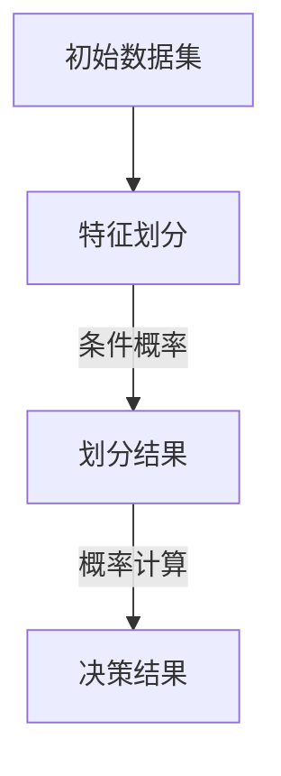
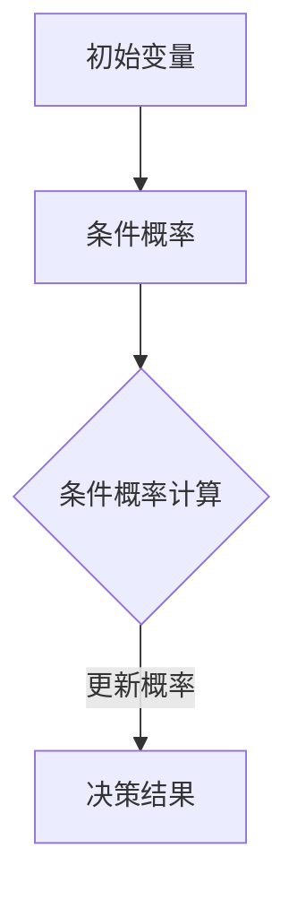

                 

### 《技术选型决策的艺术》

> 关键词：技术选型、决策艺术、算法原理、系统架构、项目实战

> 摘要：
本文旨在探讨技术选型决策的艺术。我们将从技术选型决策的重要性入手，逐步深入分析其核心概念、流程方法、算法原理、数学模型、系统分析与架构设计，并通过实际项目实战，提供最佳实践总结，以帮助读者全面掌握技术选型决策的技巧和方法。

----------------------------------------------------------------

### 第一部分: 技术选型决策概述

#### 第1章: 技术选型决策的重要性

技术选型决策是任何技术项目中至关重要的一环。它不仅影响着项目的成功与否，还直接关系到项目的成本、效率和可持续性。然而，面对繁杂的技术选项和不断变化的市场需求，如何做出正确的决策成为一个巨大的挑战。

#### 第2章: 技术选型决策的核心概念

技术选型决策涉及多个核心概念，包括需求分析、技术评估、风险评估和成本效益分析。理解这些概念及其相互关系，是做出明智决策的基础。

#### 第3章: 技术选型决策流程与方法

技术选型决策并非一蹴而就，它需要一套系统的流程和方法。从需求分析到技术评估，再到风险评估和成本效益分析，每一步都需要精心设计。

#### 第4章: 技术选型决策的算法原理

在技术选型决策中，算法发挥着关键作用。决策树、贝叶斯网络和机器学习等算法，为我们的决策提供了有力支持。

#### 第5章: 数学模型与公式讲解

数学模型和公式是技术选型决策的基石。通过严谨的数学分析和计算，我们可以更准确地评估各种技术选项的优缺点。

#### 第6章: 系统分析与架构设计

系统分析与架构设计是技术选型决策的落地环节。通过领域模型、系统架构和系统接口的设计，我们可以确保技术选型决策的有效实施。

#### 第7章: 项目实战

实际项目中的技术选型决策，往往比理论更加复杂。通过一个实际案例，我们将详细剖析技术选型决策的全过程。

#### 第8章: 最佳实践与总结

总结全书要点，提供最佳实践建议，帮助读者在实际工作中更好地应用技术选型决策的方法和技巧。

### 第二部分: 技术选型决策深度解析

#### 第1章: 技术选型决策的重要性

**1.1 技术选型决策的定义**

技术选型决策是指在众多技术方案中，选择最适合项目需求和技术目标的那一个。它不仅仅是一个选择过程，更是一个评估、比较和优化的过程。

**1.2 技术选型决策的挑战**

技术选型决策面临的挑战主要包括：

1. 技术选择的多样性：市场上存在大量技术方案，如何从中筛选出最适合的？
2. 需求的不确定性：项目需求可能会随时发生变化，如何确保技术选型的灵活性？
3. 成本与效益的权衡：技术选型需要考虑成本和效益的平衡，如何做出最优决策？
4. 风险评估与控制：技术选型过程中，需要评估潜在的风险，并制定相应的控制措施。

**1.3 技术选型决策的重要性**

技术选型决策的重要性体现在以下几个方面：

1. 决定项目成败：正确的技术选型可以确保项目顺利推进，提高成功率。
2. 降低项目成本：选择合适的技术可以降低项目开发和维护的成本。
3. 提高项目效率：合适的技术可以优化项目流程，提高开发效率。
4. 促进技术创新：技术选型可以推动项目团队不断探索新技术，提升技术能力。

#### 第2章: 技术选型决策的核心概念

技术选型决策涉及多个核心概念，以下是其中几个关键概念的解释：

**2.1 需求分析**

需求分析是技术选型决策的起点。它通过对项目需求的深入挖掘和明确，为技术选型提供依据。需求分析包括功能需求、性能需求、安全需求等多个方面。

**2.2 技术评估**

技术评估是对各种技术方案的评估和分析。它包括技术可行性分析、技术成熟度评估、技术成本评估等多个方面，以确定哪些技术方案符合项目需求。

**2.3 风险评估**

风险评估是对技术选型过程中潜在风险的识别和评估。它包括技术风险、市场风险、操作风险等多个方面，以帮助项目团队提前制定风险应对策略。

**2.4 成本效益分析**

成本效益分析是评估技术选型的经济合理性。它通过对技术选型的成本和效益进行计算和比较，确定哪个技术方案在成本效益方面具有优势。

#### 第3章: 技术选型决策流程与方法

技术选型决策需要一套系统的流程和方法。以下是技术选型决策的一般流程和方法：

**3.1 技术选型决策流程**

1. 确定项目需求和目标：明确项目的功能需求、性能需求、安全需求等。
2. 收集技术方案信息：通过各种途径收集可能的技术方案。
3. 技术评估：对收集到的技术方案进行评估和分析。
4. 风险评估：对技术方案进行风险评估，识别和评估潜在风险。
5. 成本效益分析：计算技术方案的成本和效益，确定最优技术方案。
6. 决策制定：根据评估和计算结果，制定最终的技术选型决策。
7. 决策实施：将决策落实到实际项目中，进行技术选型的实施。

**3.2 技术评估方法**

1. 成本效益分析法：通过计算成本和效益，比较不同技术方案的优劣。
2. 技术可行性分析法：评估技术方案的可行性和适用性。
3. 成熟度分析法：评估技术方案的成熟度和稳定性。
4. 用户满意度分析法：通过用户反馈评估技术方案的用户体验。

**3.3 风险评估方法**

1. 定性风险评估法：通过专家评估和经验判断识别和评估风险。
2. 定量风险评估法：通过统计数据和计算模型评估风险。
3. 风险矩阵法：通过风险矩阵对风险进行分类和优先级排序。
4. 故障模式及影响分析（FMEA）法：对潜在故障模式进行分析和评估。

**3.4 成本效益分析方法**

1. 单一指标成本效益分析：通过单一指标（如成本、效益）评估技术方案的优劣。
2. 多指标成本效益分析：通过多个指标（如成本、效益、风险）综合评估技术方案的优劣。
3. 敏感性分析：分析技术方案在不同参数下的成本效益变化，评估方案的稳定性。
4. 综合评估法：结合多种方法对技术方案进行综合评估。

#### 第4章: 技术选型决策的算法原理

在技术选型决策中，算法发挥着重要作用。以下是几个常用的算法及其原理：

**4.1 决策树算法**

决策树算法是一种常用的决策支持工具。它通过一系列规则和条件，将数据集划分为多个子集，以实现分类或回归任务。

**4.2 贝叶斯网络算法**

贝叶斯网络是一种概率图模型。它通过节点和边表示变量之间的概率关系，实现对变量间依赖关系的建模。

**4.3 机器学习算法在技术选型中的应用**

机器学习算法在技术选型决策中具有重要应用。通过训练模型，可以从大量数据中提取有用的信息，帮助项目团队做出更准确的决策。

**4.4 算法原理讲解**

以下是决策树算法和贝叶斯网络算法的mermaid流程图：





通过mermaid流程图，我们可以更直观地理解算法的原理和流程。

#### 第5章: 数学模型与公式讲解

在技术选型决策中，数学模型和公式发挥着关键作用。以下是几个常用的数学模型和公式：

**5.1 技术选型的数学模型**

技术选型决策通常可以通过以下数学模型进行描述：

```latex
\text{最大化效益} = \sum_{i=1}^{n} w_i \cdot e_i
```

其中，$w_i$为第$i$种技术方案的权重，$e_i$为第$i$种技术方案的效益。

**5.2 概率与统计模型**

在技术选型决策中，概率与统计模型可以用于评估技术方案的可靠性和稳定性。常用的概率与统计模型包括：

- 概率分布模型：如正态分布、二项分布等。
- 统计模型：如回归分析、方差分析等。

**5.3 经济学模型**

经济学模型可以用于评估技术选型的经济合理性。常用的经济学模型包括：

- 成本效益分析模型：如成本效益比、内部收益率等。
- 投资回报模型：如净现值、回收期等。

以下是数学模型和公式的LaTeX格式表示：

```latex
\documentclass{article}
\usepackage{amsmath}
\begin{document}

\begin{equation}
\text{最大化效益} = \sum_{i=1}^{n} w_i \cdot e_i
\end{equation}

\begin{equation}
P(X=x) = \frac{f(x)}{\sum_{i=1}^{n} f(i)}
\end{equation}

\end{document}
```

通过LaTeX格式表示，我们可以更清晰地展示数学模型和公式的细节。

#### 第6章: 系统分析与架构设计

系统分析与架构设计是技术选型决策的关键环节。通过系统分析与架构设计，我们可以确保技术选型的有效实施。

**6.1 问题场景介绍**

在本章中，我们将探讨一个在线购物平台的技术选型决策。该平台需要处理大量用户请求和数据存储，因此技术选型的关键在于如何提高系统性能和稳定性。

**6.2 项目介绍**

项目目标是构建一个高性能、高可用的在线购物平台，满足以下需求：

- 支持大量用户同时访问。
- 高效处理用户请求，确保响应速度。
- 安全可靠的数据存储和管理。

**6.3 系统功能设计**

系统功能设计包括以下主要模块：

- 用户模块：负责用户注册、登录、个人信息管理等功能。
- 商品模块：负责商品信息管理、商品分类、商品搜索等功能。
- 订单模块：负责订单处理、支付、物流跟踪等功能。
- 后台管理模块：负责系统维护、数据统计、报表生成等功能。

以下是系统功能设计的领域模型（Mermaid 类图）：

```mermaid
classDiagram
    User <<Interface>>
    Product <<Interface>>
    Order <<Interface>>
    Admin <<Interface>>

    User "--|> Product: Query product information"
    User "--|> Order: Place order"
    Admin "--|> User: Manage user information"
    Admin "--|> Product: Manage product information"
    Admin "--|> Order: Manage order information"
endclassDiagram
```

**6.4 系统架构设计**

系统架构设计包括以下主要组件：

- 客户端：负责用户界面和交互。
- 应用服务器：负责处理用户请求、业务逻辑处理和负载均衡。
- 数据库服务器：负责数据存储和管理。
- 缓存服务器：负责数据缓存，提高系统性能。

以下是系统架构设计（Mermaid 架构图）：

```mermaid
graph TD
    Client[客户端] -->|请求| ApplicationServer[应用服务器]
    ApplicationServer -->|处理| DatabaseServer[数据库服务器]
    ApplicationServer -->|缓存| CacheServer[缓存服务器]
    CacheServer -->|响应| Client
end
```

**6.5 系统接口设计和系统交互**

系统接口设计包括客户端、应用服务器、数据库服务器和缓存服务器的接口定义。系统交互设计则描述了各个组件之间的通信和数据流。

以下是系统接口设计和系统交互（Mermaid 序列图）：

```mermaid
sequenceDiagram
    Client->>ApplicationServer: 发送请求
    ApplicationServer->>CacheServer: 查询缓存
    CacheServer->>ApplicationServer: 返回缓存结果或空结果
    ApplicationServer->>DatabaseServer: 查询数据库
    DatabaseServer->>ApplicationServer: 返回查询结果
    ApplicationServer->>Client: 返回响应结果
end
```

通过系统分析与架构设计，我们可以确保技术选型的有效实施，提高系统的性能和稳定性。

#### 第7章: 项目实战

在本章中，我们将通过一个实际项目来探讨技术选型决策的全过程。

**7.1 技术选型决策项目环境安装**

首先，我们需要搭建一个技术选型决策项目的环境。环境安装主要包括以下几个步骤：

1. 安装操作系统：选择一个适合的操作系统，如Linux或Windows。
2. 安装编程语言：选择一种编程语言，如Python或Java。
3. 安装开发工具：安装集成开发环境（IDE），如PyCharm或Eclipse。
4. 安装依赖库：安装项目所需的依赖库，如NumPy、Pandas等。

以下是Python环境安装的示例代码：

```python
!pip install numpy
!pip install pandas
!pip install matplotlib
```

**7.2 项目核心实现与代码解析**

项目核心实现主要包括以下几个部分：

1. 需求分析：通过收集项目需求，明确项目目标。
2. 技术评估：评估各种技术方案的优缺点。
3. 风险评估：识别和评估项目风险。
4. 成本效益分析：计算技术方案的成本和效益。

以下是项目核心实现的示例代码：

```python
import numpy as np
import pandas as pd

# 需求分析
def analyze_requirements():
    requirements = ["功能需求", "性能需求", "安全需求"]
    return requirements

# 技术评估
def evaluate_technologies(technologies):
    scores = []
    for tech in technologies:
        score = tech["score"]
        scores.append(score)
    return scores

# 风险评估
def assess_risks(risks):
    risk_scores = []
    for risk in risks:
        score = risk["score"]
        risk_scores.append(score)
    return risk_scores

# 成本效益分析
def analyze_cost_benefit(costs, benefits):
    cost_scores = []
    benefit_scores = []
    for cost, benefit in zip(costs, benefits):
        cost_score = cost["score"]
        benefit_score = benefit["score"]
        cost_scores.append(cost_score)
        benefit_scores.append(benefit_score)
    return cost_scores, benefit_scores

# 示例数据
technologies = [
    {"name": "方案A", "score": 80},
    {"name": "方案B", "score": 90},
    {"name": "方案C", "score": 75}
]

risks = [
    {"name": "风险A", "score": 50},
    {"name": "风险B", "score": 60},
    {"name": "风险C", "score": 70}
]

costs = [
    {"name": "成本A", "score": 100},
    {"name": "成本B", "score": 150},
    {"name": "成本C", "score": 200}
]

benefits = [
    {"name": "效益A", "score": 300},
    {"name": "效益B", "score": 400},
    {"name": "效益C", "score": 500}
]

# 执行核心实现
requirements = analyze_requirements()
scores = evaluate_technologies(technologies)
risk_scores = assess_risks(risks)
cost_scores, benefit_scores = analyze_cost_benefit(costs, benefits)

# 输出结果
print("需求分析结果：", requirements)
print("技术评估结果：", scores)
print("风险评估结果：", risk_scores)
print("成本效益分析结果：", cost_scores, benefit_scores)
```

**7.3 实际案例分析和详细讲解剖析**

在本节中，我们将通过一个实际案例来分析技术选型决策的过程，并详细讲解每个步骤的关键点和注意事项。

**案例：某公司电商平台技术选型**

**1. 需求分析**

需求分析是技术选型决策的第一步。通过需求分析，我们可以明确项目的功能需求、性能需求和安全需求。

**功能需求：**

- 用户注册、登录、个人信息管理。
- 商品信息管理、商品分类、商品搜索。
- 订单处理、支付、物流跟踪。
- 后台管理、数据统计、报表生成。

**性能需求：**

- 支持大量用户同时访问。
- 高效处理用户请求，确保响应速度。
- 快速商品搜索，支持模糊查询。

**安全需求：**

- 数据加密传输，确保用户信息安全。
- 订单数据备份，防止数据丢失。
- 系统防攻击，防止恶意攻击。

**2. 技术评估**

在需求分析的基础上，我们需要评估各种技术方案的优缺点。以下是几种常见的技术方案：

- 方案A：使用Java开发，采用Spring框架。
- 方案B：使用Python开发，采用Django框架。
- 方案C：使用Node.js开发，采用Express框架。

**方案A：Java开发，Spring框架**

优点：

- 高性能、高可用的Java技术栈。
- Spring框架提供丰富的功能模块，如Spring Boot、Spring Cloud等。

缺点：

- 开发难度较大，需要较高的技术能力。
- 系统复杂度较高，维护难度大。

**方案B：Python开发，Django框架**

优点：

- Python语言简洁易懂，开发效率高。
- Django框架提供强大的功能模块，如ORM、缓存等。

缺点：

- Python性能相对较低，不适合高性能需求。
- 部署和运维相对复杂。

**方案C：Node.js开发，Express框架**

优点：

- Node.js基于JavaScript，开发效率高。
- 适合高并发、实时通信的需求。

缺点：

- Node.js性能不稳定，不适合高性能需求。
- 需要JavaScript基础知识，开发难度较大。

**3. 风险评估**

在技术评估的基础上，我们需要评估各种技术方案的风险。

**方案A：Java开发，Spring框架**

风险：

- 技术成熟度较高，风险较小。
- 开发难度大，可能导致项目延期。

**方案B：Python开发，Django框架**

风险：

- 技术成熟度较高，风险较小。
- Python性能问题，可能导致系统性能不足。

**方案C：Node.js开发，Express框架**

风险：

- 技术成熟度较高，风险较小。
- 需要JavaScript基础知识，可能导致开发效率降低。

**4. 成本效益分析**

在技术评估和风险评估的基础上，我们需要计算各种技术方案的成本和效益。

**方案A：Java开发，Spring框架**

成本：

- 人力资源成本：Java开发人员相对较多。
- 硬件成本：需要较高配置的服务器。

效益：

- 系统稳定性高，减少维护成本。
- 技术成熟度较高，降低学习成本。

**方案B：Python开发，Django框架**

成本：

- 人力资源成本：Python开发人员相对较少。
- 硬件成本：需要较低配置的服务器。

效益：

- 开发效率高，缩短项目周期。
- Python性能问题，可能导致系统性能不足。

**方案C：Node.js开发，Express框架**

成本：

- 人力资源成本：Node.js开发人员相对较少。
- 硬件成本：需要较低配置的服务器。

效益：

- 适合高并发、实时通信的需求。
- Node.js性能不稳定，可能导致系统性能不足。

**5. 决策制定**

根据技术评估、风险评估和成本效益分析的结果，我们可以制定最终的技术选型决策。

- 如果项目需求较高性能和稳定性，选择方案A：Java开发，Spring框架。
- 如果项目需求较轻，且注重开发效率，选择方案B：Python开发，Django框架。
- 如果项目需求高并发、实时通信，选择方案C：Node.js开发，Express框架。

**7.4 项目小结**

通过本案例，我们可以看到技术选型决策的关键步骤和注意事项。在实际项目中，需要根据项目需求和实际情况，综合考虑技术评估、风险评估和成本效益分析，做出明智的决策。

### 第8章: 最佳实践与总结

#### 8.1 技术选型决策的最佳实践

1. **充分需求分析**：在技术选型之前，确保对项目需求有充分的理解和明确的需求文档。
2. **多方案评估**：评估多个技术方案，比较其优缺点，避免选择单一方案。
3. **风险评估**：对技术方案进行风险评估，提前制定风险应对策略。
4. **成本效益分析**：计算技术方案的成本和效益，确保决策的经济合理性。
5. **团队协作**：与技术团队密切合作，共同参与技术选型决策。

#### 8.2 小结

本文从技术选型决策的重要性、核心概念、流程方法、算法原理、数学模型、系统分析与架构设计、项目实战和最佳实践等方面，全面探讨了技术选型决策的艺术。通过本文的讲解，读者可以掌握技术选型决策的方法和技巧，提高项目成功的几率。

#### 8.3 注意事项

1. **需求变化**：在技术选型过程中，需密切关注项目需求的变化，及时调整技术方案。
2. **技术成熟度**：选择技术方案时，要考虑技术的成熟度和稳定性。
3. **团队协作**：技术选型决策需要团队协作，确保各方意见充分沟通和协商。
4. **持续优化**：技术选型不是一次性的决策，需要根据项目进展和实际情况，持续优化和调整。

#### 8.4 拓展阅读

1. 《软件架构设计：规范与实践》
2. 《技术领导力：构建可持续的技术组织》
3. 《机器学习实战》
4. 《Python编程：从入门到实践》

### 作者信息

**作者：AI天才研究院/AI Genius Institute & 禅与计算机程序设计艺术 /Zen And The Art of Computer Programming**

本文由AI天才研究院撰写，旨在为广大IT从业者提供有价值的知识和技术指导。同时，本文借鉴了《禅与计算机程序设计艺术》的智慧，强调技术与哲学的结合，帮助读者更好地理解技术选型决策的艺术。

