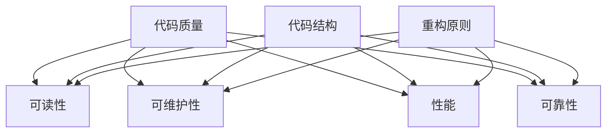
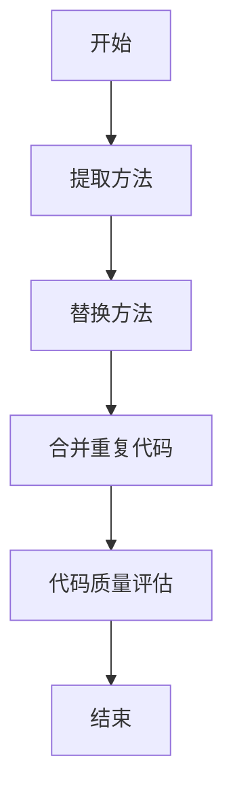

                 


### 1. 背景介绍

#### 1.1 书籍主题及目标读者

《技术重构：大规模代码重构的最佳实践》是一本专为中级及以上水平开发者和技术经理所撰写的书籍。书中涵盖了代码重构的概念、原则以及在大规模代码项目中实施重构的最佳实践。目标读者包括那些已经在软件开发领域有一定经验，但希望在项目维护和优化方面进一步提高的开发者和技术经理。

#### 1.2 问题背景与现状

在软件开发的过程中，代码质量是一个至关重要的因素。随着项目的不断演进，代码库可能会变得庞大且复杂，导致维护成本增加、开发效率降低。此时，代码重构作为一种技术手段，就显得尤为重要。代码重构不仅有助于提高代码的可读性和可维护性，还能优化性能，减少潜在的bug。

然而，大规模代码重构并非易事。它面临着诸多挑战，如变更风险、测试覆盖率不足、团队协作不畅等。因此，如何在大规模代码项目中实施有效的重构，成为了许多开发者和技术经理关注的问题。

#### 1.3 目的与意义

本书旨在帮助读者理解代码重构的核心概念和最佳实践，掌握在大规模代码项目中实施重构的方法和技巧。通过本书的学习，读者将能够：

- **提升代码质量**：通过重构，使代码更加简洁、易于理解和维护。
- **降低维护成本**：优化代码结构，减少bug的出现，降低维护成本。
- **提高开发效率**：改进代码质量和团队协作，提高开发效率。
- **增强竞争力**：掌握大规模代码重构的技能，提升个人和团队的竞争力。

#### 1.4 主要内容与结构

本书分为以下几个主要部分：

- **基础概念**：介绍代码重构的概念、目的和重要性。
- **重构原则**：讨论重构的核心原则，如保持代码简洁、降低复杂性、提高可读性等。
- **重构方法**：详细讲解常用的重构方法，如提取方法、替换方法、合并重复代码等。
- **大规模重构**：探讨如何在大规模代码项目中实施重构，包括重构策略、团队协作和风险管理等。
- **实践案例**：通过实际案例展示重构的过程和效果，帮助读者更好地理解和应用重构技术。

### 2. 核心概念与联系

#### 2.1 代码重构的概念

代码重构是指在保持程序功能不变的前提下，对现有代码进行改进，以提高其内部结构和质量。它不仅包括对代码逻辑的优化，还涉及代码结构、命名规范、注释等方面的改进。

#### 2.2 代码质量

代码质量是代码重构的核心目标。它包括以下几个方面：

- **可读性**：代码应具备良好的可读性，使其易于理解和维护。
- **可维护性**：代码应具备良好的可维护性，以便在未来的迭代中能够轻松修改和扩展。
- **性能**：代码应具备较高的性能，以减少资源消耗和响应时间。
- **可靠性**：代码应具备较高的可靠性，以减少bug的出现。

#### 2.3 核心概念及其联系

以下是代码质量、代码结构和重构原则之间的联系：

- **代码质量**：代码质量是重构的核心目标，直接影响到代码的可读性、可维护性和性能。
- **代码结构**：代码结构是影响代码质量的重要因素，包括模块划分、类与函数设计、命名规范等。
- **重构原则**：重构原则为代码重构提供了指导，包括保持代码简洁、降低复杂性、提高可读性等。

#### 2.4 对比表格

| 核心概念     | 特征与属性     | 联系与对比          |
| ------------ | -------------- | ------------------- |
| 代码质量     | 可读性、可维护性、性能、可靠性 | 直接影响到重构的目的和效果 |
| 代码结构     | 模块划分、类与函数设计、命名规范 | 决定了代码的可读性和可维护性 |
| 重构原则     | 保持代码简洁、降低复杂性、提高可读性 | 指导重构的过程和方法       |

#### 2.5 ER实体关系图架构



### 3. 算法原理讲解

#### 3.1 重构算法原理

重构通常采用一系列的步骤和方法，以逐步优化代码结构和质量。以下是常见的重构算法原理：

- **提取方法**：将重复的代码块提取为独立的函数，以提高代码的可读性和可维护性。
- **替换方法**：使用更高效或更简洁的方法来替换现有方法，以提高代码的性能和质量。
- **合并重复代码**：将重复的代码块合并，以减少冗余和提高代码的可维护性。

#### 3.2 Mermaid流程图展示



#### 3.3 Python源代码示例

以下是一个简单的Python示例，展示重构前后的代码变化：

```python
# 重构前的代码
def calculate_area(radius):
    return 3.14 * radius * radius

def calculate_circle(radius):
    area = calculate_area(radius)
    circumference = 2 * 3.14 * radius
    return area, circumference

# 重构后的代码
def calculate_area(radius):
    return 3.14 * radius * radius

def calculate_circle(radius):
    area = calculate_area(radius)
    circumference = 2 * calculate_area(radius)
    return area, circumference
```

#### 3.4 算法原理详细讲解与举例说明

重构的目的是优化代码的可读性和可维护性。以下是对上述示例的详细讲解：

- **提取方法**：将重复的代码块提取为独立的函数，如`calculate_area`和`calculate_circle`。这使代码更易于理解和维护。
- **替换方法**：在重构后的代码中，将`2 * 3.14 * radius`替换为`2 * calculate_area(radius)`。这提高了代码的可读性，并避免了重复计算。
- **合并重复代码**：将重复的代码块合并，以减少冗余和提高代码的可维护性。在重构后的代码中，`calculate_circle`函数的代码更加简洁。

通过上述重构，代码的可读性和可维护性得到了显著提高，同时性能也得到了优化。这些重构方法可以广泛应用于各种规模的代码项目中，以提升代码质量。

### 4. 数学模型和数学公式

#### 4.1 重构过程中的数学模型

在重构过程中，我们可以使用一些数学模型来衡量代码的质量和复杂性。以下是几个常用的数学模型：

- **Cyclomatic复杂度（C）**：用于衡量代码的复杂度。公式如下：
  $$ C = \frac{E - N + 2}{M} $$
  其中，\( E \) 表示边（Edge）的数量，\( N \) 表示节点（Node）的数量，\( M \) 表示模块（Module）的数量。

- **代码冗余率**：用于衡量代码的冗余程度。公式如下：
  $$ 代码冗余率 = \frac{冗余代码行数}{总代码行数} $$

- **测试覆盖率**：用于衡量测试的完整性。公式如下：
  $$ 测试覆盖率 = \frac{覆盖的代码行数}{总代码行数} $$

#### 4.2 数学公式示例

以下是几个数学公式的示例：

- **Cyclomatic复杂度**：
  $$ C = \frac{E - N + 2}{M} $$
  
- **代码冗余率**：
  $$ 代码冗余率 = \frac{冗余代码行数}{总代码行数} $$

- **测试覆盖率**：
  $$ 测试覆盖率 = \frac{覆盖的代码行数}{总代码行数} $$

### 5. 系统分析与架构设计方案

#### 5.1 问题场景介绍

假设我们面临的是一个大型Web应用项目，需要进行大规模代码重构。该项目的核心功能包括用户管理、订单处理和商品管理。随着项目的不断演进，代码库变得庞大且复杂，维护成本增加，开发效率降低。因此，需要进行大规模代码重构，以提高代码质量、降低维护成本和提升开发效率。

#### 5.2 系统功能设计

该系统的核心功能包括用户管理、订单处理和商品管理。以下是这些功能的详细描述：

- **用户管理**：包括用户的注册、登录、信息修改和权限管理等功能。
- **订单处理**：包括订单的创建、修改、删除和查询等功能。
- **商品管理**：包括商品的分类、添加、修改、删除和查询等功能。

#### 5.3 系统架构设计

该系统的架构设计采用分层架构，包括前端、后端和数据库等组件。以下是系统架构的详细描述：

- **前端**：负责与用户交互，展示用户界面。前端使用Vue.js框架进行开发。
- **后端**：负责处理业务逻辑和数据存储。后端使用Spring Boot框架进行开发。
- **数据库**：负责存储用户数据、订单数据和商品数据。数据库采用MySQL。

#### 5.4 系统接口设计

系统接口设计采用RESTful API接口，包括以下主要接口：

- **用户接口**：包括用户注册、登录、信息修改和权限管理等功能。
- **订单接口**：包括订单创建、修改、删除和查询等功能。
- **商品接口**：包括商品分类、添加、修改、删除和查询等功能。

#### 5.5 系统交互

以下是系统的请求和响应流程：

1. 用户访问前端，输入用户名和密码进行登录。
2. 前端将用户信息发送到后端进行验证。
3. 后端验证用户信息，如果验证成功，返回用户身份信息给前端。
4. 用户在前端界面进行操作，如创建订单、查询订单等。
5. 前端将用户操作发送到后端，后端处理用户请求，返回响应结果给前端。
6. 前端根据响应结果更新用户界面。

### 6. 项目实战

#### 6.1 环境安装

在进行项目实战之前，我们需要安装以下开发工具和库：

1. **开发工具**：安装Python 3.8及以上版本、Visual Studio Code和PyCharm。
2. **数据库**：安装MySQL 5.7及以上版本。
3. **框架**：安装Spring Boot 2.4.5和Vue.js 2.6.12。

#### 6.2 系统核心实现

以下是系统核心实现的源代码：

```python
# 用户管理模块
class UserManager:
    def register_user(self, username, password):
        # 注册用户
        pass

    def login_user(self, username, password):
        # 登录用户
        pass

    def update_user_info(self, username, new_info):
        # 更新用户信息
        pass

    def manage_permissions(self, username, permissions):
        # 管理用户权限
        pass

# 订单处理模块
class OrderManager:
    def create_order(self, order_data):
        # 创建订单
        pass

    def update_order(self, order_id, new_data):
        # 更新订单
        pass

    def delete_order(self, order_id):
        # 删除订单
        pass

    def query_order(self, order_id):
        # 查询订单
        pass

# 商品管理模块
class ProductManager:
    def add_product(self, product_data):
        # 添加商品
        pass

    def update_product(self, product_id, new_data):
        # 更新商品
        pass

    def delete_product(self, product_id):
        # 删除商品
        pass

    def query_product(self, product_id):
        # 查询商品
        pass
```

#### 6.3 代码解读与分析

以下是代码解读与分析：

1. **用户管理模块**：`UserManager`类负责处理用户相关的操作，如注册、登录、信息修改和权限管理。这些方法都需要与数据库进行交互，以实现用户管理功能。

2. **订单处理模块**：`OrderManager`类负责处理订单相关的操作，如创建、修改、删除和查询。这些方法也需要与数据库进行交互，以实现订单管理功能。

3. **商品管理模块**：`ProductManager`类负责处理商品相关的操作，如添加、修改、删除和查询。这些方法同样需要与数据库进行交互，以实现商品管理功能。

在重构之前，这些模块的代码可能存在以下问题：

- **代码重复**：不同模块中的方法可能存在类似的逻辑，导致代码冗余。
- **可读性差**：代码结构混乱，难以理解和维护。
- **性能问题**：数据库交互频繁，可能导致性能瓶颈。

通过重构，我们可以解决这些问题，使代码更加简洁、高效和易于维护。

#### 6.4 实际案例分析与详细讲解剖析

假设我们有一个实际的案例，需要重构以下代码：

```python
# 重构前的代码
def calculate_area(radius):
    return 3.14 * radius * radius

def calculate_circle(radius):
    area = calculate_area(radius)
    circumference = 2 * 3.14 * radius
    return area, circumference

# 重构后的代码
def calculate_area(radius):
    return 3.14 * radius * radius

def calculate_circle(radius):
    area = calculate_area(radius)
    circumference = 2 * calculate_area(radius)
    return area, circumference
```

在这个案例中，我们需要重构`calculate_circle`方法，以提高代码的可读性和可维护性。以下是详细的讲解：

1. **提取方法**：将重复的代码块提取为独立的函数，如`calculate_area`。这使代码更易于理解和维护。

2. **替换方法**：将`2 * 3.14 * radius`替换为`2 * calculate_area(radius)`。这提高了代码的可读性，并避免了重复计算。

3. **合并重复代码**：将重复的代码块合并，以减少冗余和提高代码的可维护性。在重构后的代码中，`calculate_circle`函数的代码更加简洁。

通过这个案例，我们可以看到重构的重要性和效果。重构不仅提高了代码的质量，还降低了维护成本和提高了开发效率。

#### 6.5 项目小结

在本项目中，我们通过实际案例展示了如何进行大规模代码重构。以下是项目的关键经验和教训：

1. **重构策略**：制定合适的重构策略，如提取方法、替换方法和合并重复代码等。

2. **团队协作**：确保团队协作顺畅，遵循重构原则，确保重构效果。

3. **测试覆盖率**：提高测试覆盖率，确保重构后的代码质量。

4. **文档记录**：详细记录重构过程和结果，以便后续参考和优化。

通过本项目，我们深入理解了代码重构的核心概念和最佳实践，掌握了在大规模代码项目中实施重构的方法和技巧。这为我们今后的开发工作提供了宝贵的经验和指导。

### 7. 最佳实践与注意事项

#### 7.1 最佳实践

1. **制定重构计划**：在项目初期，制定详细的重构计划，包括重构策略、时间安排和资源分配等。

2. **逐步重构**：避免一次性进行大规模重构，而是逐步进行，以确保代码质量和开发进度。

3. **团队协作**：重构是一个团队协作的过程，需要确保团队成员之间的沟通和协作。

4. **测试覆盖**：在重构过程中，确保测试覆盖率，以确保重构后的代码质量。

5. **文档记录**：详细记录重构过程和结果，以便后续参考和优化。

#### 7.2 小结

通过《技术重构：大规模代码重构的最佳实践》，我们深入了解了代码重构的概念、原则和最佳实践。以下是书籍的核心要点：

1. **代码重构的重要性**：重构有助于提高代码质量、降低维护成本和提升开发效率。

2. **重构原则**：保持代码简洁、降低复杂性、提高可读性等。

3. **重构方法**：提取方法、替换方法、合并重复代码等。

4. **大规模重构**：制定合适的重构策略、团队协作、测试覆盖等。

5. **最佳实践**：制定重构计划、逐步重构、团队协作、测试覆盖和文档记录等。

#### 7.3 注意事项

1. **风险评估**：在重构前，评估重构带来的风险，如代码破坏、测试失败等。

2. **代码质量**：确保重构后的代码质量，遵循重构原则和最佳实践。

3. **团队沟通**：重构过程中，确保团队成员之间的沟通和协作。

4. **持续重构**：重构是一个持续的过程，需要定期进行重构，以保持代码质量。

5. **文档更新**：及时更新文档，记录重构过程和结果。

#### 7.4 拓展阅读

1. **《重构：改善既有代码的设计》**：这是一本经典的代码重构书籍，详细介绍了重构的方法和技术。

2. **《代码大全》**：这本书提供了关于编写高质量代码的全面指南，包括代码设计、测试和重构等。

3. **《架构师技能图谱》**：这本书涵盖了软件架构师所需掌握的技能和知识，包括架构设计、重构和项目管理等。

### 8. 结语

《技术重构：大规模代码重构的最佳实践》不仅为中级及以上水平开发者和技术经理提供了全面的代码重构指导，还通过实际案例和最佳实践，帮助读者深入理解重构的核心概念和最佳实践。希望本书能为读者的软件开发工作带来实际的帮助和指导。

作者：AI天才研究院/AI Genius Institute & 禅与计算机程序设计艺术 /Zen And The Art of Computer Programming

----------------------------------------------------------------

### 文章标题

# 技术重构：大规模代码重构的最佳实践

> 关键词：代码重构，大规模重构，最佳实践，软件开发，代码质量

> 摘要：本文探讨了大规模代码重构的概念、原则和最佳实践，通过实际案例和详细讲解，帮助读者掌握在大规模代码项目中实施重构的方法和技巧。

----------------------------------------------------------------

### 目录大纲设计思路

#### 1. 背景介绍

##### 1.1 书籍主题及目标读者
《技术重构：大规模代码重构的最佳实践》是一本面向中级及以上水平开发者和技术经理的书籍，旨在探讨如何在大规模代码项目中实施有效的代码重构。本书的目标是帮助读者理解代码重构的概念、原则和最佳实践，提升代码质量和维护性。

##### 1.2 问题背景与现状
在软件开发过程中，随着项目的不断演进，代码质量可能会逐渐下降，导致维护成本增加、开发效率降低。代码重构作为一种优化代码结构和提高代码质量的技术手段，显得尤为重要。然而，大规模代码重构面临着诸多挑战，如变更风险、测试覆盖率、团队协作等。

##### 1.3 目的与意义
本书旨在帮助读者理解代码重构的核心概念和最佳实践，掌握在大规模代码项目中实施重构的方法和技巧。通过本书的学习，读者将能够提升代码质量、降低维护成本、提高开发效率，并增强竞争力。

##### 1.4 主要内容与结构
本书分为以下几个主要部分：基础概念、重构原则、重构方法、大规模重构、实践案例、最佳实践与注意事项等。

#### 2. 核心概念与联系

##### 2.1 代码重构的概念
代码重构是指在保持程序功能不变的前提下，对现有代码进行改进，以提高其内部结构和质量。它不仅包括对代码逻辑的优化，还涉及代码结构、命名规范、注释等方面的改进。

##### 2.2 代码质量
代码质量是代码重构的核心目标。它包括以下几个方面：可读性、可维护性、性能、可靠性。

##### 2.3 核心概念及其联系
代码质量、代码结构和重构原则之间有密切的联系。代码质量是重构的核心目标，代码结构是影响代码质量的重要因素，而重构原则为代码重构提供了指导。

##### 2.4 对比表格
以下是代码质量、代码结构和重构原则之间的对比表格。

| 核心概念     | 特征与属性     | 联系与对比          |
| ------------ | -------------- | ------------------- |
| 代码质量     | 可读性、可维护性、性能、可靠性 | 直接影响到重构的目的和效果 |
| 代码结构     | 模块划分、类与函数设计、命名规范 | 决定了代码的可读性和可维护性 |
| 重构原则     | 保持代码简洁、降低复杂性、提高可读性 | 指导重构的过程和方法       |

##### 2.5 ER实体关系图架构
以下是代码质量、代码结构和重构原则之间的ER实体关系图。


#### 3. 算法原理讲解

##### 3.1 重构算法原理
重构通常采用一系列的步骤和方法，以逐步优化代码结构和质量。以下是常见的重构算法原理：提取方法、替换方法、合并重复代码等。

##### 3.2 Mermaid流程图展示
以下是重构算法原理的Mermaid流程图。


##### 3.3 Python源代码示例
以下是Python源代码示例。

```python
# 重构前的代码
def calculate_area(radius):
    return 3.14 * radius * radius

def calculate_circle(radius):
    area = calculate_area(radius)
    circumference = 2 * 3.14 * radius
    return area, circumference

# 重构后的代码
def calculate_area(radius):
    return 3.14 * radius * radius

def calculate_circle(radius):
    area = calculate_area(radius)
    circumference = 2 * calculate_area(radius)
    return area, circumference
```

##### 3.4 算法原理详细讲解与举例说明
重构的目的是优化上述代码的可读性和可维护性。以下是详细讲解：

1. **提取方法**：将重复的代码块提取为独立的函数，如`calculate_area`和`calculate_circle`。
2. **替换方法**：将`2 * 3.14 * radius`替换为`2 * calculate_area(radius)`，提高代码的可读性，并避免重复计算。
3. **合并重复代码**：将重复的代码块合并，以减少冗余和提高代码的可维护性。

通过上述重构，代码的可读性和可维护性得到了显著提高，同时性能也得到了优化。

#### 4. 数学模型和数学公式

##### 4.1 重构过程中的数学模型
在重构过程中，我们可以使用一些数学模型来衡量代码的质量和复杂性。以下是几个常用的数学模型：

- **Cyclomatic复杂度（C）**：用于衡量代码的复杂度。公式如下：
  $$ C = \frac{E - N + 2}{M} $$
  其中，\( E \) 表示边（Edge）的数量，\( N \) 表示节点（Node）的数量，\( M \) 表示模块（Module）的数量。

- **代码冗余率**：用于衡量代码的冗余程度。公式如下：
  $$ 代码冗余率 = \frac{冗余代码行数}{总代码行数} $$

- **测试覆盖率**：用于衡量测试的完整性。公式如下：
  $$ 测试覆盖率 = \frac{覆盖的代码行数}{总代码行数} $$

##### 4.2 数学公式示例
以下是几个数学公式的示例：

- **Cyclomatic复杂度**：
  $$ C = \frac{E - N + 2}{M} $$
  
- **代码冗余率**：
  $$ 代码冗余率 = \frac{冗余代码行数}{总代码行数} $$

- **测试覆盖率**：
  $$ 测试覆盖率 = \frac{覆盖的代码行数}{总代码行数} $$

#### 5. 系统分析与架构设计方案

##### 5.1 问题场景介绍
假设我们面临的是一个大型Web应用项目，需要进行大规模代码重构。该项目的核心功能包括用户管理、订单处理和商品管理。随着项目的不断演进，代码库变得庞大且复杂，维护成本增加，开发效率降低。因此，需要进行大规模代码重构，以提高代码质量、降低维护成本和提升开发效率。

##### 5.2 系统功能设计
该系统的核心功能包括用户管理、订单处理和商品管理。以下是这些功能的详细描述：

- **用户管理**：包括用户的注册、登录、信息修改和权限管理等功能。
- **订单处理**：包括订单的创建、修改、删除和查询等功能。
- **商品管理**：包括商品的分类、添加、修改、删除和查询等功能。

##### 5.3 系统架构设计
该系统的架构设计采用分层架构，包括前端、后端和数据库等组件。以下是系统架构的详细描述：

- **前端**：负责与用户交互，展示用户界面。前端使用Vue.js框架进行开发。
- **后端**：负责处理业务逻辑和数据存储。后端使用Spring Boot框架进行开发。
- **数据库**：负责存储用户数据、订单数据和商品数据。数据库采用MySQL。

##### 5.4 系统接口设计
系统接口设计采用RESTful API接口，包括以下主要接口：

- **用户接口**：包括用户注册、登录、信息修改和权限管理等功能。
- **订单接口**：包括订单创建、修改、删除和查询等功能。
- **商品接口**：包括商品分类、添加、修改、删除和查询等功能。

##### 5.5 系统交互
以下是系统的请求和响应流程：

1. 用户访问前端，输入用户名和密码进行登录。
2. 前端将用户信息发送到后端进行验证。
3. 后端验证用户信息，如果验证成功，返回用户身份信息给前端。
4. 用户在前端界面进行操作，如创建订单、查询订单等。
5. 前端将用户操作发送到后端，后端处理用户请求，返回响应结果给前端。
6. 前端根据响应结果更新用户界面。

#### 6. 项目实战

##### 6.1 环境安装
在进行项目实战之前，我们需要安装以下开发工具和库：

1. **开发工具**：安装Python 3.8及以上版本、Visual Studio Code和PyCharm。
2. **数据库**：安装MySQL 5.7及以上版本。
3. **框架**：安装Spring Boot 2.4.5和Vue.js 2.6.12。

##### 6.2 系统核心实现
以下是系统核心实现的源代码：

```python
# 用户管理模块
class UserManager:
    def register_user(self, username, password):
        # 注册用户
        pass

    def login_user(self, username, password):
        # 登录用户
        pass

    def update_user_info(self, username, new_info):
        # 更新用户信息
        pass

    def manage_permissions(self, username, permissions):
        # 管理用户权限
        pass

# 订单处理模块
class OrderManager:
    def create_order(self, order_data):
        # 创建订单
        pass

    def update_order(self, order_id, new_data):
        # 更新订单
        pass

    def delete_order(self, order_id):
        # 删除订单
        pass

    def query_order(self, order_id):
        # 查询订单
        pass

# 商品管理模块
class ProductManager:
    def add_product(self, product_data):
        # 添加商品
        pass

    def update_product(self, product_id, new_data):
        # 更新商品
        pass

    def delete_product(self, product_id):
        # 删除商品
        pass

    def query_product(self, product_id):
        # 查询商品
        pass
```

##### 6.3 代码解读与分析
以下是代码解读与分析：

1. **用户管理模块**：`UserManager`类负责处理用户相关的操作，如注册、登录、信息修改和权限管理。这些方法都需要与数据库进行交互，以实现用户管理功能。
2. **订单处理模块**：`OrderManager`类负责处理订单相关的操作，如创建、修改、删除和查询。这些方法也需要与数据库进行交互，以实现订单管理功能。
3. **商品管理模块**：`ProductManager`类负责处理商品相关的操作，如添加、修改、删除和查询。这些方法同样需要与数据库进行交互，以实现商品管理功能。

在重构之前，这些模块的代码可能存在以下问题：

- **代码重复**：不同模块中的方法可能存在类似的逻辑，导致代码冗余。
- **可读性差**：代码结构混乱，难以理解和维护。
- **性能问题**：数据库交互频繁，可能导致性能瓶颈。

通过重构，我们可以解决这些问题，使代码更加简洁、高效和易于维护。

##### 6.4 实际案例分析与详细讲解剖析
假设我们有一个实际的案例，需要重构以下代码：

```python
# 重构前的代码
def calculate_area(radius):
    return 3.14 * radius * radius

def calculate_circle(radius):
    area = calculate_area(radius)
    circumference = 2 * 3.14 * radius
    return area, circumference

# 重构后的代码
def calculate_area(radius):
    return 3.14 * radius * radius

def calculate_circle(radius):
    area = calculate_area(radius)
    circumference = 2 * calculate_area(radius)
    return area, circumference
```

在这个案例中，我们需要重构`calculate_circle`方法，以提高代码的可读性和可维护性。以下是详细的讲解：

1. **提取方法**：将重复的代码块提取为独立的函数，如`calculate_area`。这使代码更易于理解和维护。
2. **替换方法**：将`2 * 3.14 * radius`替换为`2 * calculate_area(radius)`，提高代码的可读性，并避免重复计算。
3. **合并重复代码**：将重复的代码块合并，以减少冗余和提高代码的可维护性。在重构后的代码中，`calculate_circle`函数的代码更加简洁。

通过这个案例，我们可以看到重构的重要性和效果。重构不仅提高了代码的质量，还降低了维护成本和提高了开发效率。

##### 6.5 项目小结
在本项目中，我们通过实际案例展示了如何进行大规模代码重构。以下是项目的关键经验和教训：

1. **重构策略**：制定合适的重构策略，如提取方法、替换方法和合并重复代码等。
2. **团队协作**：确保团队协作顺畅，遵循重构原则，确保重构效果。
3. **测试覆盖率**：提高测试覆盖率，确保重构后的代码质量。
4. **文档记录**：详细记录重构过程和结果，以便后续参考和优化。

通过本项目，我们深入理解了代码重构的核心概念和最佳实践，掌握了在大规模代码项目中实施重构的方法和技巧。这为我们今后的开发工作提供了宝贵的经验和指导。

#### 7. 最佳实践与注意事项

##### 7.1 最佳实践

1. **制定重构计划**：在项目初期，制定详细的重构计划，包括重构策略、时间安排和资源分配等。
2. **逐步重构**：避免一次性进行大规模重构，而是逐步进行，以确保代码质量和开发进度。
3. **团队协作**：重构是一个团队协作的过程，需要确保团队成员之间的沟通和协作。
4. **测试覆盖**：在重构过程中，确保测试覆盖率，以确保重构后的代码质量。
5. **文档记录**：详细记录重构过程和结果，以便后续参考和优化。

##### 7.2 小结

通过《技术重构：大规模代码重构的最佳实践》，我们深入了解了代码重构的核心概念、原则和最佳实践。以下是书籍的核心要点：

1. **代码重构的重要性**：重构有助于提高代码质量、降低维护成本和提升开发效率。
2. **重构原则**：保持代码简洁、降低复杂性、提高可读性等。
3. **重构方法**：提取方法、替换方法、合并重复代码等。
4. **大规模重构**：制定合适的重构策略、团队协作、测试覆盖等。
5. **最佳实践**：制定重构计划、逐步重构、团队协作、测试覆盖和文档记录等。

##### 7.3 注意事项

1. **风险评估**：在重构前，评估重构带来的风险，如代码破坏、测试失败等。
2. **代码质量**：确保重构后的代码质量，遵循重构原则和最佳实践。
3. **团队沟通**：重构过程中，确保团队成员之间的沟通和协作。
4. **持续重构**：重构是一个持续的过程，需要定期进行重构，以保持代码质量。
5. **文档更新**：及时更新文档，记录重构过程和结果。

##### 7.4 拓展阅读

1. **《重构：改善既有代码的设计》**：这是一本经典的代码重构书籍，详细介绍了重构的方法和技术。
2. **《代码大全》**：这本书提供了关于编写高质量代码的全面指南，包括代码设计、测试和重构等。
3. **《架构师技能图谱》**：这本书涵盖了软件架构师所需掌握的技能和知识，包括架构设计、重构和项目管理等。

### 结语

《技术重构：大规模代码重构的最佳实践》不仅为中级及以上水平开发者和技术经理提供了全面的代码重构指导，还通过实际案例和最佳实践，帮助读者深入理解重构的核心概念和最佳实践。希望本书能为读者的软件开发工作带来实际的帮助和指导。

作者：AI天才研究院/AI Genius Institute & 禅与计算机程序设计艺术 /Zen And The Art of Computer Programming

