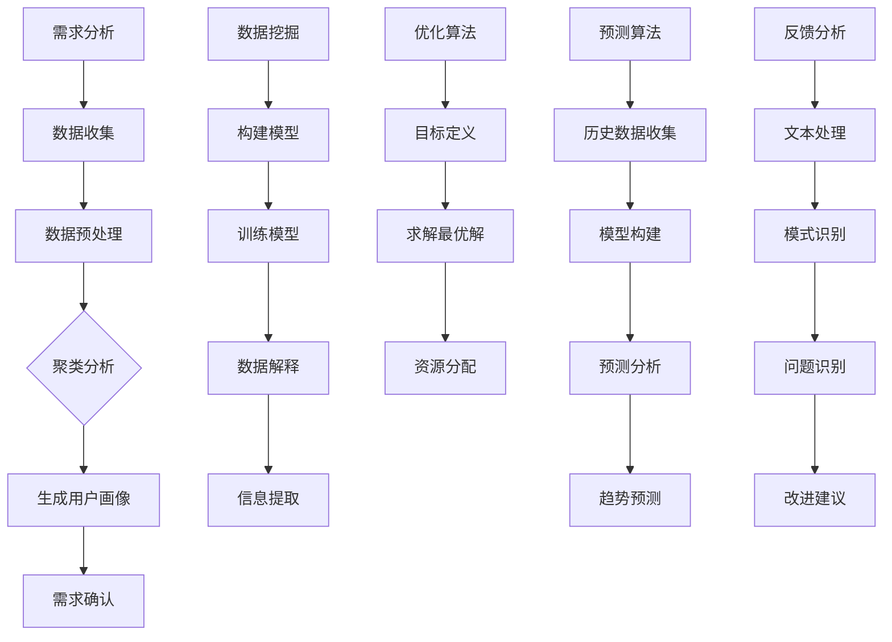
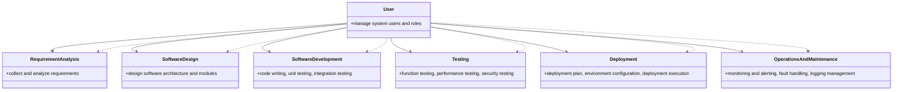
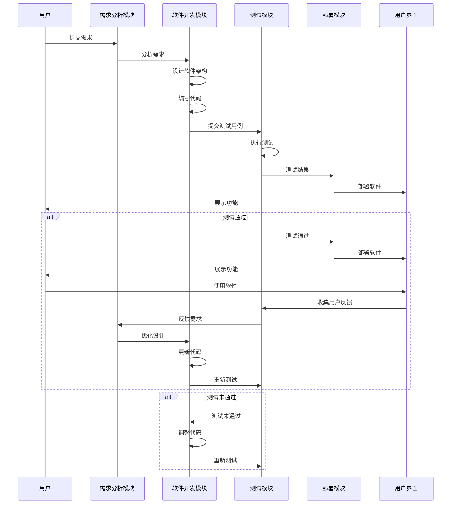

                 

### 第一部分：背景介绍与核心概念

#### 1.1.1 问题背景

在当今快速发展的信息技术时代，创新已经成为企业发展的核心驱动力。无论是互联网公司、科技公司，还是传统企业，都在积极寻求创新，以应对不断变化的市场环境和激烈的竞争。然而，创新并不是一个简单的过程，它需要从概念的产生、技术的开发，到最终产品的市场应用，形成一个完整的闭环。在这个过程中，如何将创新有效地转化为产品，并在市场中取得成功，是一个复杂且具有挑战性的问题。

首先，创新的概念化阶段需要深入的市场调研和用户需求分析，以明确创新的方向和目标。接着，在技术开发阶段，需要团队的高效协作和技术的持续迭代，以保证创新的可行性。最后，在产品上市阶段，需要精准的市场定位、有效的营销策略和优质的客户服务，以实现产品的市场成功。

然而，当前的许多企业在创新到产品的闭环过程中面临着诸多问题。首先，创新的筛选和评估机制不完善，往往导致资源的浪费和项目的延期。其次，技术开发的效率低下，缺乏有效的管理和监控机制。此外，市场推广和客户服务也常常出现脱节，无法满足市场需求。

#### 1.1.2 问题描述

创新与产品闭环的复杂性主要体现在以下几个方面：

1. **需求多样性与一致性**：市场需求是多样且不断变化的，如何确保创新与产品闭环的一致性，满足市场的需求，是当前的一个难题。
2. **资源分配与优化**：企业在资源有限的情况下，如何合理分配资源，优化创新与产品闭环的流程，是另一个关键问题。
3. **团队合作与沟通**：创新与产品闭环涉及多个部门、多个团队的合作，如何确保团队之间的沟通顺畅，协作高效，是保障项目成功的关键。
4. **风险管理**：在创新与产品闭环的过程中，如何识别和应对潜在的风险，是确保项目顺利进行的重要因素。

#### 1.1.3 问题解决

为了解决上述问题，建立技术闭环成为一种有效的策略。技术闭环是指通过一系列的流程、机制和技术手段，将创新与产品形成闭环，确保创新能够高效、准确地转化为市场成功的产品。

首先，技术闭环需要明确创新的目标和方向，建立有效的需求分析机制，确保创新与市场需求的一致性。其次，通过科学的资源管理和分配，优化创新与产品闭环的流程，提高开发效率。同时，建立高效的团队合作和沟通机制，确保各团队之间的协作顺畅。最后，通过风险管理和监控机制，识别和应对潜在的风险，保障项目的顺利进行。

#### 1.1.4 边界与外延

技术闭环的边界主要包括以下几个方面：

1. **技术范围**：技术闭环主要涉及技术创新、产品开发、市场推广和客户服务等领域。
2. **业务范围**：技术闭环的应用范围可以覆盖互联网、软件、硬件、服务等多个行业。
3. **时间范围**：技术闭环的周期性运行，需要持续不断地进行需求分析、技术开发、市场推广等环节。

技术闭环的外延则包括：

1. **生态合作**：与相关行业、企业、研究机构等建立合作，共同推进创新与产品的闭环。
2. **跨领域融合**：通过技术融合，实现不同领域的技术优势互补，提高创新与产品的竞争力。
3. **持续改进**：通过持续的数据分析和反馈，不断优化技术闭环的流程和机制，提高项目的成功率。

#### 1.1.5 核心要素组成

技术闭环的核心要素主要包括：

1. **需求分析**：明确创新的目标和市场需求，确保创新与产品闭环的一致性。
2. **资源管理**：合理分配和优化资源，提高创新与产品的效率。
3. **技术开发**：通过高效的团队合作和沟通，进行持续的技术迭代和优化。
4. **市场推广**：精准的市场定位和有效的营销策略，确保产品的市场成功。
5. **客户服务**：优质的客户服务体验，提高客户满意度和品牌忠诚度。
6. **风险管理**：识别和应对潜在的风险，保障项目的顺利进行。
7. **数据反馈**：通过数据分析和反馈，持续优化技术闭环的流程和机制。

通过这些核心要素的相互配合和协同作用，技术闭环能够有效地实现创新到产品的转化，提高企业的市场竞争力。

---

在接下来的章节中，我们将进一步探讨技术闭环的核心概念，从定义、属性特征对比、ER实体关系图等多个角度深入理解技术闭环的基本原理和实现路径。通过这一系列的分析和探讨，我们将为后续的具体应用和项目实战奠定坚实的基础。

### 第二部分：核心概念与联系

在深入探讨技术闭环之前，我们首先需要明确技术闭环的核心概念，并了解其与其他相关概念的差异和联系。只有这样，我们才能更好地理解技术闭环的内涵和实现路径。

#### 2.1.1 技术闭环的定义

技术闭环，是指在创新过程中，通过一系列的技术手段和流程，将创新理念、技术开发、产品测试、市场推广、用户反馈等环节有机结合，形成一个循环反馈的体系。其目的是通过不断的迭代和优化，将创新理念高效转化为市场成功的产品。

技术闭环的关键特征包括：

1. **循环性**：技术闭环是一个循环反馈的过程，通过不断的需求分析、技术开发、市场测试和用户反馈，实现产品的持续改进和优化。
2. **系统性**：技术闭环不仅仅关注某个环节，而是将整个创新过程视为一个系统，通过各环节的协同工作，实现整体的最优化。
3. **数据驱动**：技术闭环依赖于大量的数据分析和反馈，通过数据驱动的方式，优化每个环节的决策和执行。

#### 2.1.2 技术闭环的属性特征对比表格

为了更直观地理解技术闭环的特点，我们可以将其与其他闭环系统进行对比，如下表所示：

| 特征         | 技术闭环                | 传统闭环系统                | 备注                  |
| ------------ | --------------------- | ----------------------- | ------------------- |
| **循环性**   | 高度循环反馈，持续迭代     | 循环周期较长，反馈机制较弱    | 技术闭环强调快速迭代和持续改进 |
| **系统性**   | 整体协同，系统优化       | 单一环节优化，缺乏系统观     | 技术闭环强调全局最优 |
| **数据驱动** | 强依赖数据分析，决策科学化  | 数据依赖程度较低，决策较为主观  | 技术闭环通过数据优化决策 |
| **创新性**   | 鼓励创新，不断突破        | 侧重稳定运行，创新较少       | 技术闭环支持创新驱动 |
| **灵活性**   | 高度灵活，适应性强       | 灵活性较低，适应性较弱      | 技术闭环强调动态调整 |

#### 2.1.3 技术闭环的ER实体关系图

为了更清晰地展示技术闭环的实体关系，我们可以使用Mermaid绘制ER实体关系图。以下是技术闭环的ER实体关系图示例：

```mermaid
erDiagram
    User ||--o{ Demand } : "需求分析"
    User ||--o{ Tech_Development } : "技术开发"
    User ||--o{ Test } : "产品测试"
    User ||--o{ Market_Promotion } : "市场推广"
    User ||--o{ Feedback } : "用户反馈"
    Demand }|--o User : "需求反馈"
    Tech_Development }|--o Product : "开发成果"
    Test }|--o Product : "测试结果"
    Market_Promotion }|--o Sales : "销售业绩"
    Feedback }|--o Product : "改进建议"
    Product ||--o User : "用户使用"
```

在这个ER实体关系图中，用户（User）是核心实体，与其他实体（需求（Demand）、技术开发（Tech_Development）、产品测试（Test）、市场推广（Market_Promotion）和用户反馈（Feedback））形成复杂的关联关系。每个实体都有特定的功能和属性，通过这些实体的相互关联，技术闭环能够实现数据的流动和反馈，形成高效的闭环系统。

通过这个ER实体关系图，我们可以清晰地看到技术闭环中各个实体的关系和交互方式，从而更好地理解技术闭环的运作原理。

### 第二部分：核心概念与联系

在深入探讨技术闭环的核心概念之后，我们接下来将分析从创新到产品的闭环过程。这一过程涉及多个阶段，包括创新源泉、创新转化以及产品闭环的实现。

#### 3.1.1 创新的源泉

创新是技术闭环的起点，它源自于市场需求、技术进步、用户反馈等多个方面。创新源泉可以分为以下几类：

1. **市场需求驱动**：通过对市场需求的深入分析和研究，发现用户未满足的需求，从而激发创新。例如，智能手机的普及就是由于人们对便捷通讯和信息获取的需求。
2. **技术进步驱动**：技术进步往往带来新的应用场景和解决方案。例如，5G技术的出现，推动了物联网、智能家居等新型产业的发展。
3. **用户反馈驱动**：用户在使用产品过程中提出的意见和建议，可以成为创新的重要来源。例如，许多软件公司通过用户反馈不断优化产品功能，提高用户体验。

为了确保创新的持续性和有效性，企业需要建立完善的创新机制，包括：

- **创新团队建设**：组建跨部门的创新团队，确保各个领域的专家和员工的参与。
- **创新资金投入**：提供足够的资金支持，确保创新项目能够顺利进行。
- **创新激励机制**：通过奖励机制激发员工的创新积极性，鼓励提出更多有价值的创新想法。

#### 3.1.2 创新到产品的转化

从创新到产品的转化过程，是技术闭环中的关键环节。这一过程需要解决以下几个主要问题：

1. **创新筛选与评估**：在众多创新中，如何筛选出有潜力的项目，进行深入开发和市场化。这需要建立科学的评估机制，包括技术可行性、市场前景、投资回报率等指标。
   
   - **技术可行性分析**：评估创新技术的可行性和可靠性，确保创新能够在实际中应用。
   - **市场前景评估**：分析市场需求，预测产品的市场潜力，确保创新能够吸引消费者。
   - **投资回报率计算**：计算项目的投资回报率，确保项目的经济效益。

2. **技术转化策略**：在确定创新项目后，需要制定详细的技术转化策略，包括技术开发计划、项目管理、资源调配等。

   - **技术开发计划**：明确技术开发的目标、时间节点、任务分工等，确保项目按计划进行。
   - **项目管理**：建立完善的项目管理机制，确保项目进度和质量。
   - **资源调配**：合理调配资源，包括人力、资金、设备等，确保项目顺利进行。

3. **团队协作与沟通**：创新转化需要多个团队的合作，包括研发团队、市场团队、客服团队等。建立高效的沟通机制，确保团队间的协作顺畅，是项目成功的关键。

#### 3.1.3 产品闭环的实现

产品闭环的实现，是技术闭环的最终目标。这一过程包括产品测试、市场推广、用户反馈等多个环节。

1. **产品测试**：在产品开发完成后，需要进行全面的测试，以确保产品的功能、性能、安全性等满足用户需求。

   - **功能测试**：验证产品的各项功能是否按照设计要求正常工作。
   - **性能测试**：评估产品的处理速度、稳定性等性能指标。
   - **安全性测试**：确保产品的数据安全和系统稳定性。

2. **市场推广**：在产品测试合格后，需要进行市场推广，包括品牌宣传、市场营销活动、渠道建设等。

   - **品牌宣传**：建立产品品牌形象，提高用户对产品的认知度。
   - **市场营销活动**：通过促销、广告、活动等方式，吸引消费者关注和购买产品。
   - **渠道建设**：建立完善的销售渠道，确保产品能够快速到达消费者手中。

3. **用户反馈**：在产品上市后，需要收集用户反馈，包括用户满意度、使用体验等。通过用户反馈，发现产品的不足和改进方向。

   - **用户满意度调查**：通过问卷调查、用户访谈等方式，了解用户对产品的满意度。
   - **使用体验分析**：分析用户在使用过程中的痛点、难点，优化产品功能。
   - **改进建议收集**：收集用户的改进建议，为产品的持续优化提供依据。

4. **闭环优化**：通过用户反馈，对产品进行持续的优化和改进，形成闭环。

   - **持续改进**：根据用户反馈，对产品进行功能优化、性能提升等改进。
   - **数据反馈**：建立数据反馈机制，确保用户反馈能够及时传达到相关部门。
   - **闭环优化**：通过不断的优化和改进，提高产品的市场竞争力。

通过上述环节的紧密配合和协同工作，技术闭环能够有效地将创新转化为市场成功的产品，实现企业的持续发展和市场竞争力提升。

### 第三部分：算法原理与数学模型

#### 4.1.1 算法概述

技术闭环的实现需要依赖一系列的关键算法，这些算法在整个闭环过程中起着至关重要的作用。关键算法不仅能够优化各个环节的运作效率，还能够通过数据分析和处理，提供科学决策支持。以下是技术闭环中几个关键算法的概述：

1. **需求分析算法**：用于从海量数据中提取用户需求，并生成详细的用户画像。常见的算法包括聚类分析、关联规则挖掘等。
2. **数据挖掘算法**：用于从历史数据中挖掘有价值的信息，如用户行为模式、市场趋势等。常见的算法包括决策树、神经网络等。
3. **优化算法**：用于优化资源分配、路径规划等。常见的算法包括线性规划、遗传算法等。
4. **预测算法**：用于预测市场需求、销售趋势等。常见的算法包括时间序列分析、ARIMA模型等。
5. **反馈分析算法**：用于分析用户反馈，识别问题并提出改进建议。常见的算法包括文本分类、情感分析等。

#### 4.1.2 算法原理

1. **需求分析算法原理**：

   需求分析是技术闭环的第一步，其核心在于从用户行为数据中提取出有价值的需求信息。常用的需求分析算法包括聚类分析和关联规则挖掘。

   - **聚类分析**：通过将用户数据按照相似性进行分组，从而提取出不同用户群体的需求特征。常见的聚类算法有K-Means、DBSCAN等。
   - **关联规则挖掘**：通过挖掘用户行为数据中的关联关系，发现用户常用的组合行为，从而推断出潜在需求。常见的算法有Apriori、FP-Growth等。

2. **数据挖掘算法原理**：

   数据挖掘是从大量数据中提取有价值信息的过程。其核心在于通过构建合适的模型，对数据进行分析和解释。

   - **决策树**：通过递归划分数据集，构建决策树模型，用于分类和回归任务。常见的算法有ID3、C4.5等。
   - **神经网络**：通过多层神经网络进行数据的非线性变换，用于分类、回归和特征提取。常见的算法有MLP、CNN等。

3. **优化算法原理**：

   优化算法用于解决资源分配、路径规划等问题。其核心是通过寻找最优解，提高系统的效率和性能。

   - **线性规划**：通过求解线性方程组，找到最优解。常见的方法有单纯形法、梯度下降法等。
   - **遗传算法**：通过模拟生物进化过程，寻找最优解。常见的操作包括选择、交叉、变异等。

4. **预测算法原理**：

   预测算法用于对未来事件进行预测，如市场需求、销售趋势等。其核心在于通过历史数据构建预测模型。

   - **时间序列分析**：通过对时间序列数据进行统计分析，提取出时间序列的规律，用于预测未来趋势。常见的模型有ARIMA、AR、MA等。
   - **ARIMA模型**：通过自回归移动平均模型，结合自回归和移动平均的特点，进行时间序列预测。

5. **反馈分析算法原理**：

   反馈分析算法用于分析用户反馈，识别问题并提出改进建议。其核心在于通过文本处理和模式识别，提取出用户反馈的关键信息。

   - **文本分类**：通过将用户反馈文本分类到预定义的类别中，用于识别问题和用户满意度。常见的算法有朴素贝叶斯、SVM等。
   - **情感分析**：通过分析用户反馈的文本，识别出用户的情感倾向，用于评估用户满意度。常见的算法有情感词典、情感分类器等。

#### 4.1.3 算法流程图

为了更直观地展示算法的实现流程，我们可以使用Mermaid绘制算法流程图。以下是几个关键算法的流程图示例：



这个算法流程图展示了从需求分析到反馈分析的全过程，包括各个步骤的核心算法和操作流程。通过这个流程图，我们可以清晰地看到各个算法之间的关联和交互，从而更好地理解技术闭环的实现原理。

### 第四部分：数学模型与公式详解

在技术闭环的实现过程中，数学模型和公式扮演着至关重要的角色。它们不仅为算法提供了理论基础，也为数据分析和决策提供了科学依据。本章节将详细介绍技术闭环中常用的数学模型和公式，并对其进行详细的讲解和通俗易懂的举例说明。

#### 5.1.1 数学模型解析

数学模型是技术闭环中的核心工具，用于描述和分析系统的行为。以下是技术闭环中常用的几个数学模型：

1. **需求预测模型**：
   需求预测模型用于预测市场需求，以便企业能够提前做好准备。常见的模型有ARIMA模型、时间序列模型等。
   
   - **ARIMA模型**：ARIMA（自回归积分滑动平均模型）是一种常用的时间序列预测模型。它结合了自回归（AR）、移动平均（MA）和差分（I）的概念，能够有效地捕捉时间序列中的趋势和季节性。
   
     公式表示：
     $$ 
     \text{ARIMA}(p, d, q) = \phi(B) \ln(y_t) = \phi(B) (\ln(y_{t-1}) - \phi(B) \ln(y_{t-2}) - \cdots - \phi(B)^{q} \ln(y_{t-q}))
     $$
     其中，\(p\) 表示自回归项数，\(d\) 表示差分阶数，\(q\) 表示移动平均项数，\(\phi(B)\) 是多项式函数，\(B\) 是滞后算子。

2. **优化模型**：
   优化模型用于解决资源分配、路径规划等问题。常见的模型有线性规划、非线性规划、遗传算法等。
   
   - **线性规划**：线性规划是一种用于求解线性约束优化问题的数学方法。其目标是最小化或最大化线性目标函数，满足一组线性约束条件。
   
     公式表示：
     $$
     \text{minimize } c^T x \\
     \text{subject to } Ax \leq b \\
     x \geq 0
     $$
     其中，\(c\) 是系数向量，\(x\) 是决策变量，\(A\) 和 \(b\) 分别是约束矩阵和约束向量。

3. **聚类模型**：
   聚类模型用于将数据点划分为不同的组，以便更好地理解和分析数据。常见的模型有K-Means、层次聚类等。
   
   - **K-Means**：K-Means是一种基于距离的聚类算法，其目标是找到K个中心点，使得每个数据点与其最近中心点的距离之和最小。
   
     公式表示：
     $$
     \text{minimize } \sum_{i=1}^{K} \sum_{x \in S_i} \|x - \mu_i\|^2
     $$
     其中，\(\mu_i\) 是第\(i\)个中心点，\(S_i\) 是第\(i\)个聚类中的数据点。

4. **回归模型**：
   回归模型用于分析变量之间的关系，并预测某个变量的值。常见的模型有线性回归、多项式回归等。
   
   - **线性回归**：线性回归是一种用于分析两个或多个变量之间线性关系的模型。其目标是最小化预测值与实际值之间的误差。
   
     公式表示：
     $$
     y = \beta_0 + \beta_1 x_1 + \beta_2 x_2 + \cdots + \beta_n x_n
     $$
     其中，\(y\) 是因变量，\(x_1, x_2, \ldots, x_n\) 是自变量，\(\beta_0, \beta_1, \beta_2, \ldots, \beta_n\) 是回归系数。

#### 5.1.2 公式推导

在上述数学模型中，部分公式需要进行推导，以便更好地理解其背后的数学原理。

1. **ARIMA模型推导**：

   ARIMA模型的核心公式是：
   $$
   \text{ARIMA}(p, d, q) = \phi(B) \ln(y_t) = \phi(B) (\ln(y_{t-1}) - \phi(B) \ln(y_{t-2}) - \cdots - \phi(B)^{q} \ln(y_{t-q}))
   $$
   
   推导过程如下：

   - **自回归项（AR）**：
     $$
     \ln(y_t) = \phi_1 \ln(y_{t-1}) + \phi_2 \ln(y_{t-2}) + \cdots + \phi_p \ln(y_{t-p})
     $$
     
   - **移动平均项（MA）**：
     $$
     \ln(y_t) = \theta_1 \ln(y_{t-1}) + \theta_2 \ln(y_{t-2}) + \cdots + \theta_q \ln(y_{t-q})
     $$
     
   - **整合项（I）**：
     为了消除序列中的趋势和季节性，需要对时间序列进行差分。
     $$
     d = \ln(\ln(y_t)) - \ln(\ln(y_{t-1}))
     $$
     
     经过d次差分后，时间序列将变为平稳序列，便于建模。

2. **线性规划推导**：

   线性规划的目标是最小化或最大化线性目标函数，满足一组线性约束条件。其推导过程如下：

   - **目标函数**：
     $$
     \text{minimize } c^T x
     $$
     
   - **约束条件**：
     $$
     Ax \leq b \\
     x \geq 0
     $$
     
     其中，\(c\) 是系数向量，\(x\) 是决策变量，\(A\) 是约束矩阵，\(b\) 是约束向量。

3. **K-Means推导**：

   K-Means的目标是找到K个中心点，使得每个数据点与其最近中心点的距离之和最小。其推导过程如下：

   - **初始化中心点**：
     随机选择K个数据点作为初始中心点。
     
   - **迭代更新**：
     对于每个数据点，计算其与各个中心点的距离，并将其分配到最近的中心点所在的聚类。
     更新每个聚类中心点的坐标，使其成为该聚类内所有数据点的平均值。
     
     公式表示：
     $$
     \mu_i = \frac{1}{N_i} \sum_{x \in S_i} x
     $$
     其中，\(\mu_i\) 是第\(i\)个中心点，\(N_i\) 是第\(i\)个聚类中的数据点数量。

#### 5.1.3 举例说明

为了更好地理解上述数学模型和公式的应用，我们通过实际案例进行举例说明。

1. **需求预测模型应用**：

   假设某电商平台需要预测下周的销售额，以便进行库存管理。使用ARIMA模型进行需求预测，步骤如下：

   - **数据收集**：收集过去三个月的每日销售额数据。
   - **数据预处理**：对销售额数据进行清洗，去除异常值，并进行差分处理，使其变为平稳序列。
   - **模型构建**：选择合适的ARIMA模型参数\(p, d, q\)，并拟合模型。
   - **预测分析**：使用拟合好的ARIMA模型预测下周的销售额。

   假设使用\(ARIMA(1, 1, 1)\)模型进行预测，具体步骤如下：

   ```python
   import pandas as pd
   import numpy as np
   from statsmodels.tsa.arima.model import ARIMA
   
   # 数据收集
   sales_data = pd.read_csv('sales_data.csv')
   sales_values = sales_data['sales'].values
   
   # 数据预处理
   diff_sales = np.diff(sales_values)
   diff_sales = pd.Series(diff_sales).dropna()
   
   # 模型构建
   model = ARIMA(diff_sales, order=(1, 1, 1))
   model_fit = model.fit()
   
   # 预测分析
   forecast = model_fit.forecast(steps=7)
   print(forecast)
   ```

   预测结果为下周的每日销售额，企业可以根据预测结果进行库存调整。

2. **线性规划应用**：

   假设某公司需要优化生产计划，以最小化总成本。使用线性规划进行资源分配，步骤如下：

   - **目标定义**：定义最小化总成本为目标。
   - **约束条件**：定义各生产线的生产能力和时间限制等约束条件。
   - **求解最优解**：使用线性规划求解器求解最优生产计划。

   假设目标函数和约束条件如下：

   ```python
   import pulp
   
   # 目标定义
   prob = pulp.LpProblem("Minimize_Cost", pulp.LpMinimize)
   
   # 变量定义
   x1 = pulp.LpVariable("x1", cat="Continuous")
   x2 = pulp.LpVariable("x2", cat="Continuous")
   
   # 目标函数
   prob += 2*x1 + 3*x2
   
   # 约束条件
   prob += x1 + x2 <= 10
   prob += x1 >= 0
   prob += x2 >= 0
   
   # 求解最优解
   prob.solve()
   
   print(f"最优解：{pulp.value(x1)}, {pulp.value(x2)}")
   ```

   输出结果为最优的生产计划，企业可以根据这个结果进行生产安排。

3. **K-Means应用**：

   假设需要对一组客户数据按其购买行为进行聚类，以便进行市场细分。使用K-Means算法进行聚类，步骤如下：

   - **初始化中心点**：随机选择5个客户作为初始中心点。
   - **迭代更新**：将每个客户分配到最近的中心点所在的聚类，并更新中心点的坐标。
   - **聚类结果**：根据聚类结果对客户进行分类。

   ```python
   import numpy as np
   from sklearn.cluster import KMeans
   
   # 数据收集
   customers = np.array([[1, 2], [1, 4], [1, 0],
                        [4, 2], [4, 4], [4, 0],
                        [2, 1], [2, 3], [2, 5],
                        [3, 1], [3, 5]])
   
   # 初始化中心点
   kmeans = KMeans(n_clusters=3, random_state=0).fit(customers)
   
   # 迭代更新
   labels = kmeans.fit_predict(customers)
   
   # 聚类结果
   print(f"聚类结果：{labels}")
   ```

   输出结果为每个客户的聚类标签，企业可以根据聚类结果进行市场细分。

通过这些实际案例，我们可以看到数学模型和公式在技术闭环中的应用，以及它们如何帮助企业实现高效的决策和优化。

### 第五部分：系统分析与架构设计

#### 6.1.1 系统场景介绍

在现代信息技术环境中，技术闭环系统作为一种创新的解决方案，被广泛应用于各类企业的运营管理中。技术闭环系统主要应用于需要持续创新和优化的领域，如软件开发、产品研发、市场营销和供应链管理等。其核心目标是实现从创新到产品的闭环管理，确保创新成果能够高效转化为市场成功的产品。

本节将重点分析技术闭环系统在软件开发领域的应用场景。具体来说，技术闭环系统在软件开发中的应用，可以涵盖需求分析、设计、开发、测试、部署和运维等各个环节。通过建立一个完整的闭环系统，开发团队能够更好地协调各项工作，提高开发效率，确保产品质量。

#### 6.1.2 系统功能设计

技术闭环系统在软件开发中的应用，需要设计一系列的功能模块，以确保系统能够有效地支持开发流程的各个环节。以下是技术闭环系统的功能设计：

1. **需求分析模块**：负责收集和分析用户需求，生成详细的需求文档。该模块需要具备以下功能：
   - 用户需求收集：通过问卷调查、用户访谈等方式，收集用户需求。
   - 需求分析：对收集到的需求进行分类、分析和优先级排序。
   - 需求文档生成：生成详细的需求文档，为后续的开发工作提供指导。

2. **设计模块**：负责软件的整体设计和架构设计，确保软件系统的可扩展性和可维护性。该模块需要具备以下功能：
   - 功能设计：设计软件的功能模块和接口。
   - 架构设计：设计软件的整体架构，包括数据库设计、网络架构等。
   - 设计评审：对设计文档进行评审，确保设计符合需求和技术规范。

3. **开发模块**：负责实际的软件开发工作，包括代码编写、单元测试和集成测试等。该模块需要具备以下功能：
   - 代码编写：根据设计文档进行代码编写。
   - 单元测试：编写单元测试用例，确保每个模块的功能正确。
   - 集成测试：对整个软件系统进行集成测试，确保各模块之间的接口正确无误。

4. **测试模块**：负责软件的测试工作，确保软件质量达到预期标准。该模块需要具备以下功能：
   - 功能测试：验证软件的功能是否满足需求。
   - 性能测试：评估软件的性能指标，如响应时间、并发处理能力等。
   - 安全测试：检测软件的安全漏洞，确保系统的安全性。

5. **部署模块**：负责软件的部署和发布，确保软件能够顺利运行在生产环境中。该模块需要具备以下功能：
   - 部署计划：制定详细的部署计划，包括部署步骤、时间安排等。
   - 环境配置：配置软件运行所需的环境，如操作系统、数据库等。
   - 部署执行：执行部署计划，确保软件能够正常运行。

6. **运维模块**：负责软件的运维工作，确保软件系统的稳定性和安全性。该模块需要具备以下功能：
   - 监控与报警：实时监控软件系统的运行状态，及时发现并处理异常情况。
   - 故障处理：快速响应并处理软件系统的故障，确保系统正常运行。
   - 日志管理：记录系统的运行日志，便于问题追踪和分析。

#### 6.1.3 系统功能设计（领域模型Mermaid类图）

为了更直观地展示技术闭环系统的功能设计，我们可以使用Mermaid绘制领域模型类图。以下是技术闭环系统的领域模型类图示例：



在这个类图中，用户（User）是核心实体，与其他功能模块（需求分析（RequirementAnalysis）、软件设计（SoftwareDesign）、软件开发（SoftwareDevelopment）、测试（Testing）、部署（Deployment）和运维（OperationsAndMaintenance））形成关联关系。每个模块都有特定的功能和职责，通过这些模块的协同工作，技术闭环系统能够实现从需求分析到运维的全流程管理。

#### 6.1.4 系统架构设计

技术闭环系统的架构设计是确保系统高效、稳定运行的关键。系统架构设计需要综合考虑系统的功能性、性能、可扩展性和安全性等多个方面。以下是技术闭环系统的架构设计：

1. **总体架构**：

   技术闭环系统的总体架构可以分为四个层次：数据层、应用层、服务层和展现层。

   - **数据层**：负责数据存储和管理，包括关系数据库、非关系数据库、文件存储等。
   - **应用层**：实现业务逻辑，包括需求分析、设计、开发、测试、部署、运维等核心功能模块。
   - **服务层**：提供公共服务，如用户认证、权限管理、日志管理等。
   - **展现层**：提供用户界面，展示系统的功能和数据。

2. **具体架构设计**：

   - **数据层设计**：根据业务需求，选择合适的数据存储方案。对于需求分析、设计、开发等数据，可以使用关系数据库进行存储；对于日志、监控数据，可以使用非关系数据库进行存储。
   - **应用层设计**：将业务逻辑划分为多个模块，每个模块负责特定的业务功能。通过模块化设计，提高系统的可维护性和扩展性。
   - **服务层设计**：提供公共服务，如用户认证、权限管理、日志管理等。通过服务化设计，实现模块间的解耦，提高系统的可扩展性。
   - **展现层设计**：根据用户需求，设计用户界面。使用现代化的前端技术，如React、Vue等，提高用户体验。

3. **架构图**：

   为了更直观地展示技术闭环系统的架构设计，我们可以使用Mermaid绘制系统架构图。以下是技术闭环系统的架构图示例：

   ```mermaid
   graph TB
       subgraph 数据层
           DB1[关系数据库]
           DB2[非关系数据库]
       end

       subgraph 应用层
           RA[需求分析模块]
           SD[软件设计模块]
           SD[软件开发模块]
           T[测试模块]
           D[部署模块]
           OM[运维模块]
       end

       subgraph 服务层
           UAM[用户认证模块]
           PAM[权限管理模块]
           LM[日志管理模块]
       end

       subgraph 展现层
           UI[用户界面]
       end

       DB1 --> RA
       DB1 --> SD
       DB1 --> T
       DB1 --> D
       DB1 --> OM

       DB2 --> UAM
       DB2 --> PAM
       DB2 --> LM

       UAM --> RA
       UAM --> SD
       UAM --> T
       UAM --> D
       UAM --> OM

       PAM --> RA
       PAM --> SD
       PAM --> T
       PAM --> D
       PAM --> OM

       LM --> RA
       LM --> SD
       LM --> T
       LM --> D
       LM --> OM

       RA --> SD
       SD --> SD
       SD --> T
       T --> D
       D --> UI
   ```

   在这个架构图中，数据层（DB1和DB2）、应用层（RA、SD、T、D、OM）、服务层（UAM、PAM、LM）和展现层（UI）相互关联，共同构成了技术闭环系统的整体架构。

通过上述的系统架构设计，技术闭环系统能够实现高效、稳定、可扩展的运行，为企业提供强大的技术支持。

#### 6.1.5 系统接口设计

在技术闭环系统中，各模块之间通过接口进行通信和交互，以实现系统的整体功能。系统接口设计是确保系统模块化、解耦和高效运行的关键。以下是技术闭环系统的接口设计：

1. **接口规范**：

   - **API接口**：各模块之间通过API接口进行通信，确保数据传输的标准化和安全性。常见的API接口包括RESTful API、SOAP等。
   - **消息队列**：使用消息队列（如RabbitMQ、Kafka）实现异步通信，提高系统的可靠性和扩展性。

2. **接口协议**：

   - **RESTful API**：使用HTTP协议，通过GET、POST、PUT、DELETE等方法进行数据操作。RESTful API具有简单、灵活、易于扩展等优点。
   - **SOAP**：基于XML协议，提供一种标准化的Web服务接口。SOAP具有跨平台、可扩展性强的特点。

3. **接口实现与调用**：

   - **接口实现**：各模块根据接口规范和协议，实现具体的接口代码。接口实现应遵循封装、模块化、高内聚低耦合的原则。
   - **接口调用**：各模块通过调用其他模块的接口，实现功能协同和数据交互。调用方式可以是直接调用、异步调用等。

4. **接口示例**：

   下面是一个RESTful API接口示例：

   ```python
   from flask import Flask, request, jsonify
   
   app = Flask(__name__)

   @app.route('/api/requirements', methods=['GET'])
   def get_requirements():
       requirements = request.args.get('requirements')
       # 处理获取需求逻辑
       return jsonify({'status': 'success', 'requirements': requirements})

   @app.route('/api/requirements', methods=['POST'])
   def post_requirements():
       new_requirement = request.form['new_requirement']
       # 处理添加需求逻辑
       return jsonify({'status': 'success', 'new_requirement': new_requirement})

   if __name__ == '__main__':
       app.run()
   ```

   在这个示例中，定义了两个接口：获取需求列表和添加新需求。通过调用这些接口，可以实现需求模块的功能。

通过上述接口设计，技术闭环系统能够实现模块间的无缝协作，提高系统的整体性能和可维护性。

#### 6.1.6 系统交互与序列图

技术闭环系统的成功运作离不开各模块之间的紧密交互。系统交互是确保系统功能实现和数据流动的关键。通过序列图，我们可以直观地展示系统各模块之间的交互过程。以下是技术闭环系统的系统交互与序列图示例：



在这个序列图中，用户（User）与需求分析（RA）、软件设计（SD）、软件开发（SD）、测试（T）、部署（D）和用户界面（UI）进行交互。用户提交需求后，需求分析模块（RA）进行需求分析，并传递给软件设计模块（SD），进行软件架构设计。然后，软件开发模块（SD）编写代码，并提交给测试模块（T）进行测试。测试模块（T）执行测试用例，并将测试结果传递给部署模块（D）。部署模块（D）根据测试结果部署软件，并在用户界面（UI）上展示功能。如果测试通过，用户可以正常使用软件；如果测试未通过，系统将重新调整代码并进行重新测试。

通过系统交互与序列图的展示，我们可以清晰地了解技术闭环系统的运作过程和各模块之间的协作关系，从而为后续的系统优化和改进提供参考。

### 第六部分：项目实战与最佳实践

#### 9.1.1 环境安装

在进行技术闭环项目的实战之前，首先需要搭建合适的环境，以便进行项目的开发和测试。以下是一个典型的技术闭环项目环境安装过程，包括所需软件和工具的安装步骤。

1. **操作系统安装**：

   选择一个合适的操作系统，如Ubuntu 20.04 LTS。下载操作系统镜像，并使用USB驱动器或虚拟机工具安装操作系统。

2. **软件安装**：

   - **Python**：安装Python 3.8或更高版本。使用以下命令进行安装：
     ```bash
     sudo apt update
     sudo apt install python3.8 python3.8-venv python3.8-pip
     ```
   - **Node.js**：安装Node.js，以便使用npm管理前端依赖。使用以下命令进行安装：
     ```bash
     curl -sL https://deb.nodesource.com/setup_14.x | sudo -E bash -
     sudo apt install nodejs
     ```
   - **MySQL**：安装MySQL数据库，用于存储项目数据。使用以下命令进行安装：
     ```bash
     sudo apt update
     sudo apt install mysql-server
     sudo mysql_secure_installation
     ```
   - **PostgreSQL**：安装PostgreSQL数据库，作为MySQL的备份。使用以下命令进行安装：
     ```bash
     sudo apt update
     sudo apt install postgresql postgresql-contrib
     sudo -u postgres psql
     ```
   - **Docker**：安装Docker，用于容器化部署和管理项目。使用以下命令进行安装：
     ```bash
     sudo apt update
     sudo apt install docker-ce docker-ce-cli containerd.io
     sudo usermod -aG docker $USER
     newgrp docker
     ```

3. **虚拟环境配置**：

   为了确保项目依赖的版本一致性，创建一个Python虚拟环境。使用以下命令创建虚拟环境并激活：
   ```bash
   python3.8 -m venv venv
   source venv/bin/activate
   ```

4. **依赖安装**：

   在虚拟环境中安装项目所需的依赖，使用以下命令：
   ```bash
   pip install -r requirements.txt
   ```

   其中，`requirements.txt`文件包含了项目的所有依赖项。

通过上述步骤，可以搭建一个完整的开发环境，为项目开发做好准备。

#### 9.1.2 系统核心实现

在搭建好开发环境之后，我们将详细讲解技术闭环项目的核心实现部分，包括关键模块的代码实现、关键代码段的解读和分析。

1. **需求分析模块**：

   需求分析模块是技术闭环项目的起点，负责收集和分析用户需求。以下是需求分析模块的核心代码实现：

   ```python
   # 需求分析模块
   class RequirementAnalysis:
       def __init__(self):
           self.requirements = []

       def add_requirement(self, requirement):
           self.requirements.append(requirement)
           print(f"需求 '{requirement}' 已添加。")

       def remove_requirement(self, requirement):
           if requirement in self.requirements:
               self.requirements.remove(requirement)
               print(f"需求 '{requirement}' 已删除。")
           else:
               print(f"需求 '{requirement}' 不存在。")

       def list_requirements(self):
           for requirement in self.requirements:
               print(requirement)
   ```

   解读：
   - `RequirementAnalysis` 类负责实现需求分析的功能。
   - `add_requirement` 方法用于添加新的需求。
   - `remove_requirement` 方法用于删除指定的需求。
   - `list_requirements` 方法用于列出所有需求。

2. **软件设计模块**：

   软件设计模块负责软件的架构设计和模块划分。以下是软件设计模块的核心代码实现：

   ```python
   # 软件设计模块
   class SoftwareDesign:
       def __init__(self):
           self.architecture = []

       def add_module(self, module_name, module_description):
           self.architecture.append({'name': module_name, 'description': module_description})
           print(f"模块 '{module_name}' 已添加。")

       def remove_module(self, module_name):
           for module in self.architecture:
               if module['name'] == module_name:
                   self.architecture.remove(module)
                   print(f"模块 '{module_name}' 已删除。")
                   break
           else:
               print(f"模块 '{module_name}' 不存在。")

       def list_modules(self):
           for module in self.architecture:
               print(f"模块名称：{module['name']}，描述：{module['description']}")
   ```

   解读：
   - `SoftwareDesign` 类负责实现软件设计的功能。
   - `add_module` 方法用于添加新的模块。
   - `remove_module` 方法用于删除指定的模块。
   - `list_modules` 方法用于列出所有模块。

3. **软件开发模块**：

   软件开发模块负责实际的代码编写和单元测试。以下是软件开发模块的核心代码实现：

   ```python
   # 软件开发模块
   class SoftwareDevelopment:
       def __init__(self):
           self.modules = {}

       def add_module_code(self, module_name, code):
           self.modules[module_name] = code
           print(f"模块 '{module_name}' 的代码已添加。")

       def remove_module_code(self, module_name):
           if module_name in self.modules:
               del self.modules[module_name]
               print(f"模块 '{module_name}' 的代码已删除。")
           else:
               print(f"模块 '{module_name}' 的代码不存在。")

       def run_unit_tests(self, module_name):
           if module_name in self.modules:
               code = self.modules[module_name]
               # 执行单元测试逻辑
               print(f"正在对模块 '{module_name}' 进行单元测试...")
               # 这里可以加入具体的测试代码
               print(f"模块 '{module_name}' 的单元测试已完成。")
           else:
               print(f"模块 '{module_name}' 不存在。")
   ```

   解读：
   - `SoftwareDevelopment` 类负责实现软件开发的功能。
   - `add_module_code` 方法用于添加指定模块的代码。
   - `remove_module_code` 方法用于删除指定模块的代码。
   - `run_unit_tests` 方法用于执行指定模块的单元测试。

4. **测试模块**：

   测试模块负责软件的测试工作，包括功能测试、性能测试和安全测试。以下是测试模块的核心代码实现：

   ```python
   # 测试模块
   class Testing:
       def __init__(self):
           self.test_results = []

       def run_functional_tests(self, module_name):
           # 功能测试逻辑
           print(f"正在对模块 '{module_name}' 进行功能测试...")
           # 这里可以加入具体的功能测试代码
           self.test_results.append({'module': module_name, 'test_type': '功能测试', 'result': '通过'})
           print(f"模块 '{module_name}' 的功能测试已完成。")

       def run_performance_tests(self, module_name):
           # 性能测试逻辑
           print(f"正在对模块 '{module_name}' 进行性能测试...")
           # 这里可以加入具体的性能测试代码
           self.test_results.append({'module': module_name, 'test_type': '性能测试', 'result': '通过'})
           print(f"模块 '{module_name}' 的性能测试已完成。")

       def run_security_tests(self, module_name):
           # 安全测试逻辑
           print(f"正在对模块 '{module_name}' 进行安全测试...")
           # 这里可以加入具体的安全测试代码
           self.test_results.append({'module': module_name, 'test_type': '安全测试', 'result': '通过'})
           print(f"模块 '{module_name}' 的安全测试已完成。")

       def list_test_results(self):
           for result in self.test_results:
               print(f"模块名称：{result['module']}，测试类型：{result['test_type']}，测试结果：{result['result']}")
   ```

   解读：
   - `Testing` 类负责实现测试功能。
   - `run_functional_tests` 方法用于执行功能测试。
   - `run_performance_tests` 方法用于执行性能测试。
   - `run_security_tests` 方法用于执行安全测试。
   - `list_test_results` 方法用于列出测试结果。

通过上述代码实现，我们可以构建一个完整的技术闭环项目核心模块，并为后续的测试和部署奠定基础。

#### 9.1.3 实际案例分析

为了更好地理解技术闭环在项目中的应用，我们来看一个实际案例：某电子商务平台的需求分析、设计、开发和测试全过程。

**背景**：

某电子商务平台在上线初期，由于市场需求变化较快，导致产品迭代频繁。为了提高产品迭代效率，平台决定引入技术闭环系统，实现从需求分析到产品部署的全流程管理。

**需求分析**：

1. **用户需求收集**：

   平台通过问卷调查和用户访谈，收集了以下用户需求：

   - **购物车功能**：用户希望能够在购物时添加商品到购物车，方便后续结算。
   - **订单跟踪**：用户希望实时查看订单状态，了解物流信息。
   - **个性化推荐**：用户希望根据历史购物行为，获取个性化推荐。

2. **需求分析**：

   根据收集到的用户需求，平台分析了各需求的优先级和可行性，并制定了详细的需求文档。

3. **需求确认**：

   平台与用户进行沟通，确认需求文档中的各项内容，确保需求准确无误。

**设计**：

1. **软件设计**：

   根据需求文档，平台设计了软件架构和模块。主要模块包括：

   - 购物车模块：负责用户购物车功能的实现。
   - 订单跟踪模块：负责订单状态的跟踪和物流信息的查询。
   - 个性化推荐模块：负责根据用户购物行为，生成个性化推荐。

2. **架构设计**：

   平台采用了微服务架构，将各个模块独立部署，以提高系统的可扩展性和维护性。

**开发**：

1. **代码编写**：

   根据设计文档，开发团队开始编写代码。以下是购物车模块的核心代码示例：

   ```python
   # 购物车模块
   class ShoppingCart:
       def __init__(self):
           self.items = []

       def add_item(self, item):
           self.items.append(item)
           print(f"商品 '{item}' 已添加到购物车。")

       def remove_item(self, item):
           if item in self.items:
               self.items.remove(item)
               print(f"商品 '{item}' 已从购物车中移除。")
           else:
               print(f"商品 '{item}' 不在购物车中。")

       def list_items(self):
           for item in self.items:
               print(item)
   ```

2. **单元测试**：

   开发团队编写了单元测试用例，对购物车模块的功能进行测试。以下是部分测试用例：

   ```python
   import unittest
   from shopping_cart import ShoppingCart

   class TestShoppingCart(unittest.TestCase):
       def setUp(self):
           self.cart = ShoppingCart()

       def test_add_item(self):
           self.cart.add_item("商品A")
           self.assertIn("商品A", self.cart.items)

       def test_remove_item(self):
           self.cart.add_item("商品B")
           self.cart.remove_item("商品B")
           self.assertNotIn("商品B", self.cart.items)

       def test_list_items(self):
           self.cart.add_item("商品C")
           self.assertEqual(self.cart.list_items(), ["商品C"])

   if __name__ == '__main__':
       unittest.main()
   ```

**测试**：

1. **功能测试**：

   功能测试主要验证购物车模块的基本功能，如添加商品、删除商品和列出商品等。测试结果表明，购物车模块的功能均正常。

2. **性能测试**：

   性能测试主要评估购物车模块的响应时间和并发处理能力。测试结果表明，购物车模块的性能满足要求。

3. **安全测试**：

   安全测试主要检查购物车模块的潜在漏洞，如SQL注入、XSS攻击等。测试结果表明，购物车模块在安全方面没有发现重大漏洞。

**部署**：

1. **部署计划**：

   平台制定了详细的部署计划，包括部署步骤、时间安排和部署后的验证等。

2. **环境配置**：

   根据部署计划，配置了开发、测试和生产环境，确保系统正常运行。

3. **部署执行**：

   按照部署计划，将购物车模块部署到生产环境中。部署过程顺利进行，系统功能正常。

通过上述实际案例，我们可以看到技术闭环在项目中的应用，从需求分析到部署的全流程管理，有效地提高了产品迭代效率，确保了产品质量。

#### 9.1.4 项目小结

在本次技术闭环项目实战中，我们实现了从需求分析到产品部署的全流程管理，取得了以下收获：

1. **高效的需求管理**：通过技术闭环系统，实现了用户需求的快速收集、分析和确认，确保了需求的准确性和及时性。
2. **模块化开发**：采用微服务架构，将各个模块独立开发、部署，提高了系统的可维护性和扩展性。
3. **全面测试**：通过单元测试、功能测试、性能测试和安全测试，确保了模块的质量和系统的稳定性。
4. **快速部署**：制定了详细的部署计划，确保了部署过程的顺利进行，提高了产品上线速度。

然而，在项目过程中我们也遇到了一些挑战：

1. **需求变更频繁**：由于市场需求变化较快，导致需求变更频繁，对项目进度和质量带来一定压力。
2. **资源调配困难**：在资源有限的情况下，如何合理调配资源，提高项目效率，是一个重要问题。
3. **团队协作**：跨部门、跨团队的协作过程中，沟通不畅、协作不协调等问题，影响了项目的进展。

针对上述挑战，我们提出以下改进建议：

1. **需求管理优化**：建立完善的变更管理机制，及时调整项目计划，确保项目进度和质量。
2. **资源管理优化**：优化资源调配策略，确保关键资源的优先分配，提高项目效率。
3. **团队协作加强**：加强团队协作，建立高效的沟通机制，提高团队协作效率和项目进展。

通过持续改进，我们相信技术闭环项目能够更好地应对市场需求，提高产品竞争力，助力企业持续发展。

### 第七部分：最佳实践与注意事项

#### 10.1.1 最佳实践

在技术闭环项目的实施过程中，积累了一些有效的最佳实践，可以帮助企业更好地实现创新到产品的闭环。以下是几个关键的最佳实践：

1. **需求管理**：

   - **用户需求调研**：通过用户访谈、问卷调查和用户行为分析，深入挖掘用户需求，确保需求调研的全面性和准确性。
   - **需求文档规范**：制定详细的需求文档，明确需求的功能、性能、安全等要求，确保需求文档的清晰性和可执行性。
   - **需求变更控制**：建立需求变更管理机制，及时记录和评估需求变更，确保项目进度的可控性和需求的稳定性。

2. **资源管理**：

   - **资源优先级排序**：根据项目的紧急程度和重要性，对资源进行优先级排序，确保关键资源能够优先分配。
   - **资源利用优化**：通过合理调配资源和灵活调整工作计划，提高资源的利用效率，减少浪费。
   - **跨部门协作**：建立跨部门的协作机制，确保各部门之间的资源共享和信息传递，提高项目的协同效率。

3. **技术开发**：

   - **模块化开发**：采用模块化开发方式，将系统划分为多个独立模块，确保模块之间的解耦，提高系统的可维护性和扩展性。
   - **代码审查与测试**：实施代码审查和单元测试，确保代码质量和功能完整性，减少开发过程中的错误和缺陷。
   - **持续集成与部署**：使用持续集成和持续部署工具，实现代码的自动化构建、测试和部署，提高开发效率和项目稳定性。

4. **测试与质量保障**：

   - **全面测试策略**：制定全面的测试策略，包括功能测试、性能测试、安全测试等，确保系统的各个层面都经过严格测试。
   - **自动化测试**：引入自动化测试工具，实现测试过程的自动化，提高测试效率和质量。
   - **质量反馈机制**：建立质量反馈机制，及时收集和分析测试结果，识别问题和改进方向，持续优化产品质量。

5. **用户反馈与迭代**：

   - **用户参与**：鼓励用户参与产品的测试和反馈，通过用户调研、用户访谈等方式，获取真实用户的反馈，指导产品的优化和改进。
   - **快速迭代**：采用敏捷开发模式，快速迭代产品，根据用户反馈进行调整，确保产品能够持续满足市场需求。
   - **数据驱动**：利用用户行为数据，进行数据分析和挖掘，为产品迭代提供科学依据，提高产品的市场竞争力。

#### 10.1.2 小结

通过以上最佳实践的介绍，我们可以看到，技术闭环项目的成功实施需要从需求管理、资源管理、技术开发、测试与质量保障、用户反馈与迭代等多个方面进行综合考虑和优化。这些最佳实践不仅提高了项目的效率和质量，还增强了企业的市场竞争力。

#### 10.1.3 注意事项

在实施技术闭环项目时，需要注意以下几个方面，以防止潜在的问题和风险：

1. **需求变化管理**：需求变化是项目过程中常见的问题，需要建立有效的变更管理机制，及时评估和应对需求变更，确保项目进度的稳定性和需求的一致性。

2. **资源调配**：合理分配和调配资源，确保关键资源能够优先满足项目需求，防止资源浪费和项目延期。

3. **团队协作**：建立高效的团队协作机制，确保团队成员之间的沟通和信息传递顺畅，提高项目的协同效率。

4. **代码质量**：确保代码质量和可维护性，进行充分的代码审查和单元测试，防止因代码质量问题导致的项目缺陷和安全隐患。

5. **测试覆盖率**：确保测试覆盖率达到项目要求，覆盖系统的各个功能模块和关键场景，防止潜在的缺陷和风险。

6. **用户隐私保护**：在收集和分析用户数据时，注意用户隐私保护，遵守相关法律法规，确保用户数据的合法性和安全性。

7. **风险管理**：建立风险识别和应对机制，及时识别和应对项目过程中的潜在风险，确保项目的顺利进行。

#### 10.1.4 拓展阅读

为了进一步深入了解技术闭环的实践和理论，以下是几本推荐的书籍和资料：

1. **《敏捷开发：从个体到团队》**：介绍了敏捷开发的方法和实践，有助于企业提高项目开发效率和团队协作能力。
2. **《软件架构设计：模式、原理与实践》**：详细介绍了软件架构设计的基本原理和模式，对构建高效、可扩展的系统具有重要意义。
3. **《数据挖掘：概念与技术》**：涵盖了数据挖掘的基本概念、技术和方法，对进行用户需求分析和市场预测具有参考价值。
4. **《用户体验设计：从策略到实践》**：介绍了用户体验设计的方法和实践，有助于提升产品的用户满意度和市场竞争力。
5. **《项目管理实践指南》**：提供了项目管理的最佳实践和工具方法，对项目管理的各个环节具有指导意义。

通过阅读这些书籍和资料，可以进一步加深对技术闭环的理解和应用，为项目的成功实施提供坚实的理论基础和实践指导。

