                 

### 第一部分：技术预算基础

#### 1.1 技术预算概述

**关键词：** 技术预算，定义，重要性

**摘要：** 本章节将探讨技术预算的定义及其重要性，为后续章节的深入分析奠定基础。

技术预算是指企业或组织在特定时间内用于技术项目、研发和基础设施建设的资金预算。合理的技术预算可以确保企业在技术领域的可持续发展，提高市场竞争力。本文将详细讨论技术预算的定义、构成要素及其在经济活动中的重要性。

**背景介绍：**

随着全球科技的发展，技术已经成为企业创新和发展的关键驱动力。技术预算作为一种财务规划工具，能够帮助企业合理分配资源，确保在技术投资中获得最大的回报。然而，技术预算并非一成不变，它需要根据市场需求、技术趋势和公司战略进行动态调整。

**核心概念与联系：**

技术预算的构成要素包括研发投入、基础设施投资、技术并购和人才引进等。这些要素相互关联，共同影响着企业的技术发展。以下是一个简化的技术预算构成要素对比表格：

| 构成要素     | 定义                                                     | 对技术预算的影响 |
|------------|--------------------------------------------------------|----------------|
| 研发投入     | 用于新技术研究和开发的投资                               | 提升企业创新能力 |
| 基础设施投资 | 用于技术基础设施建设和维护的投资                         | 保障技术稳定运行 |
| 技术并购     | 通过收购其他企业来获取新技术和人才的投资                 | 快速获取核心技术 |
| 人才引进     | 用于招聘和培养技术人才的投资                           | 提升团队技术水平 |

**联系：**

技术预算的构成要素不仅影响着企业的技术发展，也与其竞争对手和市场需求密切相关。通过合理的预算分配，企业可以在技术领域保持竞争优势，实现可持续发展。

#### 1.2 技术预算的背景与演变

**关键词：** 技术发展，驱动因素，挑战，机遇

**摘要：** 本章节将回顾技术预算的背景，探讨技术发展的驱动因素，以及技术预算所面临的挑战和机遇。

技术预算并非一蹴而就，而是随着技术发展而逐步演变形成的。在过去的几十年里，技术发展经历了多个阶段，如计算机革命、互联网普及和移动通信等。每个阶段都对技术预算产生了深远的影响。

**背景介绍：**

在计算机革命初期，技术预算主要用于硬件设备和软件开发。随着互联网的普及，技术预算开始向互联网技术和电子商务领域倾斜。进入移动通信时代，技术预算的重点又转向移动应用和物联网。这些变化反映了技术发展的趋势和市场需求。

**核心概念与联系：**

技术发展的驱动因素包括技术创新、市场需求和竞争压力等。技术创新是技术预算的核心驱动力，它推动企业不断进行研发和技术升级。市场需求则决定了技术预算的分配方向，只有满足市场需求的技术项目才能获得足够的预算支持。竞争压力迫使企业保持技术领先地位，从而增加了技术预算的需求。

以下是一个技术发展驱动因素与技术预算的联系ER实体关系图：

```mermaid
erDiagram
  CUSTOMER ||--|{ PERSON : has }
  PERSON ||--|{ CUSTOMER : is }
```

**联系：**

技术发展的驱动因素不仅影响着技术预算的构成和分配，也决定了企业在技术领域的竞争策略。通过合理的技术预算规划，企业可以抓住机遇，应对挑战，实现技术突破。

#### 1.3 技术预算的核心概念

**关键词：** 技术投资，成本效益分析，资源分配，优化

**摘要：** 本章节将探讨技术预算的核心概念，包括技术投资、成本效益分析、资源分配和优化策略。

技术预算的核心概念包括技术投资、成本效益分析、资源分配和优化策略。这些概念相互关联，构成了技术预算的理论基础。

**核心概念与联系：**

**技术投资：** 技术投资是指企业或组织在新技术研发、技术并购和技术基础设施建设等方面的资金投入。技术投资是推动企业技术创新和竞争力提升的关键。

**成本效益分析：** 成本效益分析是一种评估技术投资回报的方法，通过比较技术投资的成本和预期收益，帮助企业决策是否进行技术投资。成本效益分析是技术预算的核心工具。

**资源分配：** 资源分配是指将技术预算合理分配到各个技术项目和部门的过程。资源分配需要考虑技术项目的优先级、市场需求和公司战略等因素。

**优化策略：** 优化策略是指通过优化技术投资、成本控制和资源分配等手段，提高技术预算的使用效率和回报。优化策略是技术预算管理的核心目标。

以下是一个简化的成本效益分析表格：

| 项目名称 | 成本 | 收益 | 成本效益比 |
|--------|-----|-----|---------|
| 项目A   | 100万 | 150万 | 1.5     |
| 项目B   | 200万 | 250万 | 1.25    |
| 项目C   | 300万 | 350万 | 1.17    |

**联系：**

技术投资、成本效益分析、资源分配和优化策略相互关联，共同构成了技术预算的核心概念。通过合理的成本效益分析和资源分配，企业可以实现技术投资的最大化回报，提高整体竞争力。

#### 1.4 技术预算的影响因素

**关键词：** 市场趋势，竞争环境，公司战略，目标

**摘要：** 本章节将探讨技术预算的影响因素，包括市场趋势、竞争环境、公司战略和目标。

技术预算的制定和执行不仅受内部因素影响，还受到外部市场环境和企业战略的制约。本章节将分析市场趋势、竞争环境、公司战略和目标对技术预算的影响。

**背景介绍：**

在快速变化的市场环境中，技术预算需要具备灵活性和前瞻性。市场趋势、竞争环境、公司战略和目标等因素共同影响着技术预算的制定和执行。

**核心概念与联系：**

**市场趋势：** 市场趋势包括技术发展趋势、市场需求变化和行业竞争格局等。市场趋势对技术预算的影响体现在技术投资的优先级和资源分配上。

**竞争环境：** 竞争环境是指企业所处行业的技术竞争态势。竞争环境对技术预算的影响体现在技术投资的方向和力度上。

**公司战略：** 公司战略是指企业的长期目标和规划。公司战略对技术预算的影响体现在技术投资的规划和资源配置上。

**目标：** 目标是指企业希望通过技术预算实现的具体目标，如技术创新、市场份额提升和竞争力增强等。目标对技术预算的影响体现在预算的制定和执行上。

以下是一个简化的市场趋势与公司战略的联系ER实体关系图：

```mermaid
erDiagram
  CUSTOMER ||--|{ PERSON : has }
  PERSON ||--|{ CUSTOMER : is }
```

**联系：**

市场趋势、竞争环境、公司战略和目标相互关联，共同影响着技术预算的制定和执行。通过分析这些影响因素，企业可以制定出更加科学和合理的技术预算计划。

#### 1.5 技术预算的设计原则

**关键词：** 预算编制流程，预算控制与调整，预算编制方法

**摘要：** 本章节将探讨技术预算的设计原则，包括预算编制流程、预算控制与调整以及预算编制方法。

技术预算的设计原则是确保预算编制科学、合理和高效的关键。本章节将详细分析预算编制流程、预算控制与调整以及预算编制方法，以帮助读者了解技术预算的设计原则。

**背景介绍：**

技术预算的编制和执行是一个复杂的过程，需要遵循一定的设计原则。这些原则包括预算编制流程、预算控制与调整以及预算编制方法等。

**核心概念与联系：**

**预算编制流程：** 预算编制流程是指从预算需求分析、预算编制到预算审批和执行的全过程。预算编制流程需要明确各个环节的职责和流程，确保预算编制的规范性和效率。

**预算控制与调整：** 预算控制与调整是指对预算执行过程中的偏差进行监控和调整，以确保预算目标的实现。预算控制与调整需要建立完善的监控机制和调整策略，确保预算的合理性和有效性。

**预算编制方法：** 预算编制方法是指用于编制技术预算的具体方法和工具。常见的预算编制方法包括传统预算方法、零基预算方法等。选择合适的预算编制方法可以提高预算的准确性和可行性。

以下是一个简化的预算编制流程与预算控制调整的联系ER实体关系图：

```mermaid
erDiagram
  CUSTOMER ||--|{ PERSON : has }
  PERSON ||--|{ CUSTOMER : is }
```

**联系：**

预算编制流程、预算控制与调整以及预算编制方法相互关联，构成了技术预算的设计原则。通过遵循这些原则，企业可以制定出科学合理的技术预算，提高资源利用效率。

#### 1.6 技术预算的编制方法

**关键词：** 传统预算方法，零基预算方法

**摘要：** 本章节将详细分析技术预算的编制方法，包括传统预算方法和零基预算方法。

技术预算的编制方法对预算的科学性和合理性至关重要。本章节将详细介绍传统预算方法和零基预算方法，帮助读者了解并选择适合自己企业的预算编制方法。

**背景介绍：**

传统预算方法和零基预算方法是两种常见的预算编制方法，各自具有不同的特点和适用场景。传统预算方法侧重于历史数据的分析和调整，而零基预算方法则从零开始，重新评估每个预算项的必要性。

**核心概念与联系：**

**传统预算方法：** 传统预算方法是基于历史数据进行分析和调整的方法。它通过对过去的数据进行趋势分析和预测，来确定未来预算的需求。传统预算方法的优点是操作简便，但缺点是容易受历史数据的影响，无法充分考虑外部环境的变化。

**零基预算方法：** 零基预算方法是一种从零开始重新评估每个预算项的方法。它要求每个预算项目都要经过详细评估，证明其必要性和合理性。零基预算方法的优点是能够更全面地考虑预算的必要性和效果，但缺点是编制过程复杂，耗时较长。

以下是一个简化的传统预算方法与零基预算方法的比较表格：

| 方法        | 特点                                     | 优点           | 缺点           |
|-----------|----------------------------------------|--------------|--------------|
| 传统预算方法 | 基于历史数据进行分析和调整               | 操作简便       | 容易受历史数据影响 |
| 零基预算方法 | 从零开始重新评估每个预算项的必要性和合理性 | 考虑全面       | 编制过程复杂     |

**联系：**

传统预算方法和零基预算方法各有优缺点，适用于不同的企业环境和预算需求。通过了解这两种方法的优缺点，企业可以根据自身情况选择合适的预算编制方法。

#### 1.7 技术预算案例分析

**关键词：** 成功案例，失败案例，原因分析

**摘要：** 本章节将通过成功和失败的技术预算案例，分析技术预算在实践中的效果，探讨成功和失败的原因。

技术预算在实践中既有成功的案例，也有失败的案例。本章节将通过具体案例，分析技术预算在实践中的效果，探讨成功和失败的原因，为读者提供宝贵的经验教训。

**背景介绍：**

技术预算的成功与失败直接影响企业的技术创新和竞争力。本章节将选择具有代表性的成功和失败案例，深入分析其背后的原因。

**核心概念与联系：**

**成功案例：** 成功的技术预算案例通常具备以下几个特点：科学的预算编制方法、合理的预算分配策略、有效的预算控制与调整机制以及与公司战略的紧密衔接。

**失败案例：** 失败的技术预算案例通常存在以下问题：预算编制不科学、预算分配不合理、预算控制不严格以及缺乏有效的调整机制。

以下是一个简化的成功和失败案例的联系ER实体关系图：

```mermaid
erDiagram
  CUSTOMER ||--|{ PERSON : has }
  PERSON ||--|{ CUSTOMER : is }
```

**联系：**

通过分析成功和失败的技术预算案例，企业可以吸取经验教训，优化预算编制和管理流程，提高技术预算的执行效果。

#### 1.8 本章小结

**摘要：** 本章节从技术预算概述、背景与演变、核心概念、影响因素、设计原则、编制方法以及案例分析等方面，系统地介绍了技术预算的基础知识。通过本章节的学习，读者可以了解技术预算的基本概念、重要性以及实际应用方法，为后续章节的深入探讨奠定基础。

### 第二部分：技术预算的分配与执行

#### 2.1 技术资源规划

**关键词：** 技术资源，识别与分类，需求分析

**摘要：** 本章节将探讨技术资源的规划，包括技术资源的识别与分类、需求分析，以及如何合理地规划技术资源。

技术资源是企业或组织在技术研发和创新过程中所需要利用的各种资源。合理的技术资源规划能够提高资源利用效率，确保技术项目的顺利进行。本章节将详细讨论技术资源的识别与分类、需求分析以及技术资源规划的方法。

**背景介绍：**

在快速变化的技术环境中，技术资源规划变得尤为重要。企业需要识别和分类现有技术资源，分析技术需求，并制定合理的规划策略，以确保资源的高效利用和项目的成功实施。

**核心概念与联系：**

**技术资源的识别与分类：** 技术资源的识别与分类是规划技术资源的第一步。企业需要明确自身的技术资源，包括硬件设备、软件工具、专利技术、人才储备等，并进行分类，以便于管理和使用。

**需求分析：** 技术需求分析是确定技术资源需求的关键。企业需要分析当前和未来的技术需求，包括技术研发、项目实施、市场推广等，以确保技术资源能够满足这些需求。

**技术资源规划的方法：** 技术资源规划的方法包括资源分配策略、优先级排序和动态调整等。企业需要根据技术需求和资源状况，制定合理的资源分配策略，并定期进行优先级排序和动态调整，以保持资源利用的灵活性和效率。

以下是一个简化的技术资源需求分析的ER实体关系图：

```mermaid
erDiagram
  CUSTOMER ||--|{ ORDER : has }
  ORDER ||--|{ CUSTOMER : is }
```

**联系：**

通过技术资源的识别与分类、需求分析和合理规划，企业可以确保技术资源的高效利用，为技术创新和项目实施提供坚实的支持。

#### 2.2 技术项目的评估与优先级排序

**关键词：** 技术项目，选择标准，评估方法，优先级排序

**摘要：** 本章节将探讨如何对技术项目进行评估和优先级排序，确保有限的预算资源能够投入到最有价值的技术项目中。

技术项目的成功实施对企业的发展至关重要。然而，企业往往面临资源有限的挑战，因此需要对技术项目进行科学评估和合理排序，以确保预算资源能够最大限度地发挥作用。本章节将详细讨论技术项目的评估标准、评估方法以及优先级排序的策略。

**背景介绍：**

在技术项目众多的情况下，企业需要选择最具潜力、最符合战略目标的项目进行投资。这就需要对技术项目进行全面的评估，并制定科学的优先级排序策略。

**核心概念与联系：**

**技术项目的评估标准：** 技术项目的评估标准包括技术成熟度、市场需求、投资回报率、战略重要性等。这些标准是评估技术项目的重要依据，企业需要根据自身情况和战略目标，制定合适的评估标准。

**评估方法：** 技术项目的评估方法包括定性评估和定量评估。定性评估主要通过专家评审和主观判断来确定项目价值，定量评估则通过数据分析和模型计算来确定项目的投资回报率等指标。

**优先级排序策略：** 优先级排序策略是指根据评估结果，对技术项目进行排序，确保有限的预算资源能够投入到最有价值的项目中。优先级排序策略需要考虑项目的重要性、市场前景、技术难度等因素。

以下是一个简化的技术项目评估与优先级排序的流程图：

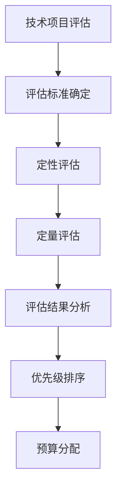

**联系：**

通过科学的技术项目评估和合理的优先级排序策略，企业可以确保有限的预算资源能够投入到最有价值的技术项目中，提高项目的成功率，实现技术突破。

#### 2.3 技术预算的分配策略

**关键词：** 技术预算，分配策略，项目分配，部门分配，动态调整

**摘要：** 本章节将探讨技术预算的分配策略，包括按照项目分配、按照部门或团队分配以及动态调整策略，帮助读者理解如何合理分配技术预算。

技术预算的合理分配是确保项目成功和资源高效利用的关键。本章节将详细讨论技术预算的分配策略，包括按照项目分配、按照部门或团队分配以及动态调整策略，帮助读者了解不同的分配方式及其适用场景。

**背景介绍：**

在技术项目众多、资源有限的情况下，如何合理分配技术预算成为一个重要问题。企业需要根据项目的特点、部门的职责以及预算的实际情况，制定合适的分配策略。

**核心概念与联系：**

**项目分配策略：** 按照项目分配策略是将技术预算直接分配到具体的技术项目中。这种方式适用于项目独立性强、预算需求明确的情况。项目分配策略的关键在于确定每个项目的预算需求，并确保预算的公平性和合理性。

**部门分配策略：** 按照部门或团队分配策略是将技术预算分配到不同的部门或团队，由他们自行决定如何使用。这种方式适用于部门或团队职责明确、资源整合能力强的企业。部门分配策略的关键在于平衡各部门或团队的资源需求，确保整体资源的最大化利用。

**动态调整策略：** 动态调整策略是指在预算执行过程中，根据实际情况和项目进展，对预算进行实时调整。这种方式适用于预算需求变化频繁、项目风险较高的企业。动态调整策略的关键在于建立灵活的调整机制，及时响应变化，确保预算的适应性和有效性。

以下是一个简化的技术预算分配策略的流程图：

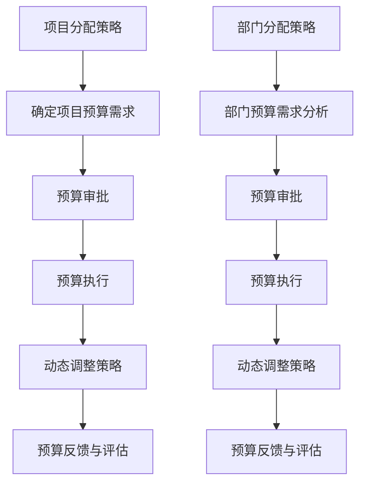

**联系：**

通过结合项目分配策略、部门分配策略和动态调整策略，企业可以确保技术预算的合理分配，提高资源利用效率，确保项目的顺利进行。

#### 2.4 技术预算的执行与监控

**关键词：** 技术预算，执行，监控工具，挑战与应对，效果评估

**摘要：** 本章节将探讨技术预算的执行与监控，包括使用监控工具、面临的主要挑战以及如何应对，以及如何评估预算执行的效果。

技术预算的执行与监控是确保预算目标实现的关键环节。本章节将详细讨论如何使用监控工具，面临的主要挑战以及应对策略，以及如何评估预算执行的效果。

**背景介绍：**

技术预算的执行涉及到多个项目和部门，需要确保资源得到合理利用，项目按计划推进。同时，预算执行过程中可能会面临各种挑战，如项目延期、成本超支等。因此，有效的监控和评估是确保预算目标实现的关键。

**核心概念与联系：**

**监控工具：** 监控工具是用于跟踪和评估技术预算执行情况的重要工具。常见的监控工具包括预算管理系统、项目管理系统和实时监控系统。这些工具可以帮助企业实时掌握预算执行情况，及时发现问题并进行调整。

**主要挑战与应对策略：** 技术预算执行过程中可能面临的主要挑战包括预算超支、项目延期、资源分配不合理等。应对策略包括建立严格的预算审批流程、实时监控项目进展、及时调整预算分配等。

**效果评估：** 预算执行的效果评估是确保预算目标实现的重要环节。评估内容包括预算完成率、成本控制情况、项目进度和质量等。通过评估，企业可以了解预算执行的效果，为下一年的预算制定提供参考。

以下是一个简化的技术预算执行与监控的流程图：

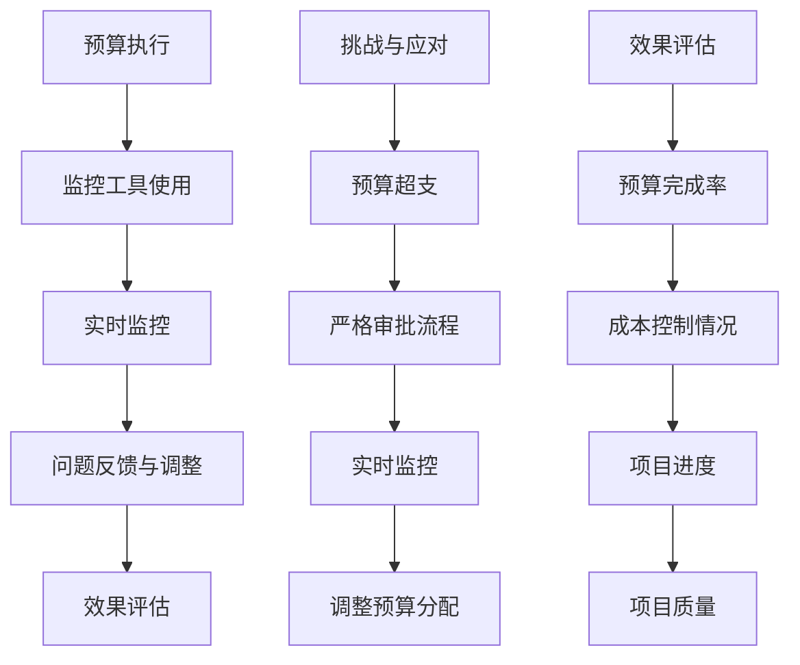

**联系：**

通过合理使用监控工具、积极应对执行过程中面临的挑战，以及科学的效果评估，企业可以确保技术预算的顺利执行，提高预算管理的效率。

#### 2.5 技术预算的风险管理

**关键词：** 技术预算，风险管理，识别与评估，控制与应对

**摘要：** 本章节将探讨技术预算的风险管理，包括如何识别和评估预算风险，如何控制与应对这些风险，以及如何进行有效的风险管理。

技术预算的执行过程中可能会面临各种风险，如预算超支、项目延期、资源短缺等。有效的风险管理是确保技术预算顺利执行的关键。本章节将详细讨论技术预算的风险管理，包括识别与评估、控制与应对以及有效的风险管理策略。

**背景介绍：**

技术预算的执行涉及到多个项目和部门，风险因素复杂多样。有效的风险管理可以帮助企业提前识别和评估潜在风险，采取预防措施，降低风险发生的概率，并确保在风险发生时能够迅速应对，将损失降到最低。

**核心概念与联系：**

**风险识别与评估：** 风险识别与评估是风险管理的第一步。企业需要通过定性和定量方法，识别和评估技术预算执行过程中可能面临的风险，包括预算超支、项目延期、资源短缺等。

**风险控制与应对：** 风险控制与应对是风险管理的核心。企业需要建立完善的风险控制机制，包括制定风险应对策略、建立应急响应团队、制定应急预案等。通过这些措施，企业可以降低风险发生的概率，并确保在风险发生时能够迅速应对。

**有效的风险管理策略：** 有效的风险管理策略包括风险分散、风险规避、风险转移和风险承担等。企业需要根据自身情况和风险承受能力，选择合适的风险管理策略，确保技术预算的顺利执行。

以下是一个简化的技术预算风险管理流程图：

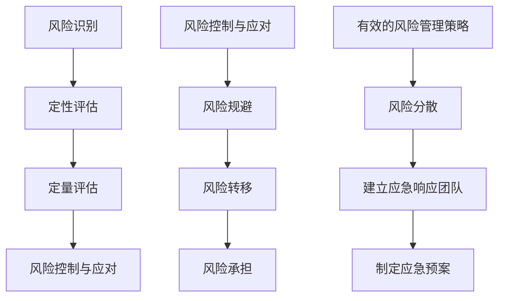

**联系：**

通过识别和评估技术预算执行过程中的风险，采取有效的控制与应对措施，企业可以降低风险发生的概率，确保技术预算的顺利执行。

#### 2.6 技术预算的调整与优化

**关键词：** 技术预算，调整，优化，原则，策略

**摘要：** 本章节将探讨技术预算的调整与优化，包括调整的原则、策略以及优化过程中需要注意的要点。

技术预算的调整与优化是预算管理的重要环节。随着外部环境的变化和内部项目进展的调整，技术预算也需要进行相应的调整和优化，以确保预算的科学性和合理性。本章节将详细讨论技术预算调整的原则、策略以及优化过程中需要注意的要点。

**背景介绍：**

在技术项目执行过程中，可能会出现预算需求的变化，如项目延期、成本超支或市场环境的变化等。这时，企业需要根据实际情况对技术预算进行调整和优化，以保持预算的合理性和有效性。

**核心概念与联系：**

**调整原则：** 技术预算调整的原则包括及时性、科学性、合理性和灵活性。及时性原则要求企业能够及时识别和调整预算变化，科学性原则要求调整过程要基于充分的数据分析和合理的判断，合理性原则要求调整的预算要符合企业的战略目标和实际情况，灵活性原则要求企业能够根据外部环境的变化灵活调整预算。

**调整策略：** 技术预算调整的策略包括动态调整、阶段调整和全面调整等。动态调整是指根据项目进展和预算执行情况，实时调整预算；阶段调整是指按照项目阶段进行预算调整；全面调整是指对整个技术预算进行全面审查和调整。

**优化要点：** 技术预算优化过程中需要注意的要点包括预算编制的准确性、预算执行的监控和反馈机制、预算调整的及时性和灵活性，以及优化过程中的沟通和协调。

以下是一个简化的技术预算调整与优化流程图：

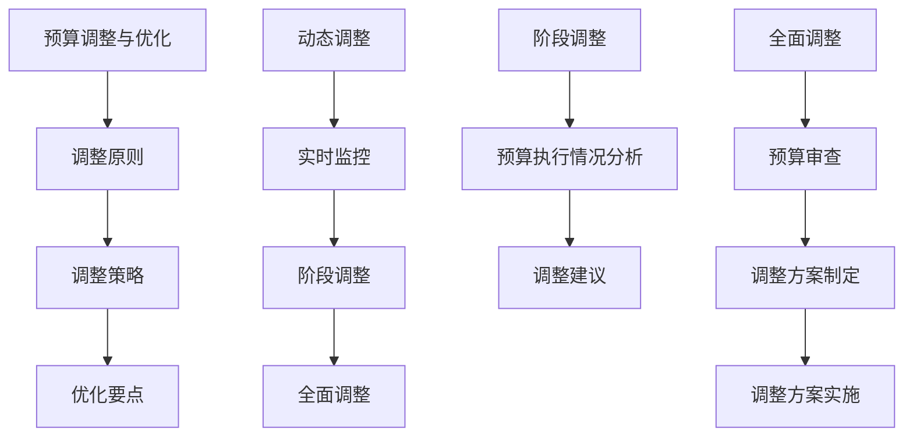

**联系：**

通过遵循调整原则、采用调整策略和关注优化要点，企业可以确保技术预算的合理性和有效性，提高预算管理的效率。

#### 2.7 技术预算的审计与报告

**关键词：** 技术预算，审计，报告，目的与内容，撰写与呈现

**摘要：** 本章节将探讨技术预算的审计与报告，包括审计的目的与内容、报告的撰写与呈现，以及如何通过有效的审计和报告提升预算管理的质量和效率。

技术预算的审计与报告是预算管理的重要环节，通过审计和报告，企业可以确保预算的合规性、准确性和有效性，提升预算管理的整体质量。本章节将详细讨论技术预算审计与报告的目的、内容和撰写与呈现的技巧。

**背景介绍：**

技术预算审计与报告是对技术预算执行过程和结果进行系统性检查和评估的过程。通过审计和报告，企业可以及时发现预算执行中的问题，提出改进建议，确保预算目标的实现，同时为管理层提供决策依据。

**核心概念与联系：**

**审计目的与内容：** 技术预算审计的目的是确保预算的合规性、准确性和有效性。审计内容通常包括预算编制的合理性、预算执行的合规性、预算调整的合理性以及预算使用的有效性等。

**报告撰写与呈现：** 报告的撰写与呈现是技术预算审计成果的重要体现。报告需要清晰地反映预算审计的结果、发现的问题以及改进建议。撰写报告时，应注意逻辑清晰、数据准确、文字简洁，同时，报告的形式和格式也应符合企业的要求和规范。

**联系：**

通过有效的技术预算审计与报告，企业可以确保预算管理的透明度和公正性，提升预算管理的质量和效率，为企业的可持续发展提供有力支持。

### 2.8 本章小结

**摘要：** 本章节从技术资源规划、技术项目评估与优先级排序、技术预算分配策略、执行与监控、风险管理、调整与优化以及审计与报告等方面，系统地介绍了技术预算的分配与执行。通过本章的学习，读者可以全面了解技术预算的分配与执行过程，掌握技术预算管理的核心方法和技巧，为实际工作中的预算管理提供指导。

### 第三部分：技术预算的最佳实践

#### 3.1 国内外技术预算现状与趋势

**关键词：** 技术预算，国内外现状，趋势分析

**摘要：** 本章节将分析国内外技术预算的现状，探讨其发展趋势，为读者提供技术预算的最佳实践参考。

随着全球科技的高速发展，技术预算在企业战略规划中扮演着越来越重要的角色。本章节将分析国内外技术预算的现状，探讨其发展趋势，并结合具体案例，为读者提供技术预算的最佳实践参考。

**背景介绍：**

技术预算作为企业资源分配的重要工具，其编制和执行情况直接影响到企业的技术创新能力和市场竞争力。在全球范围内，不同国家和地区的企业在技术预算的编制和执行上存在差异，也呈现出不同的趋势。

**核心概念与联系：**

**国内技术预算现状：** 中国企业在技术预算方面逐渐重视，随着国家“创新驱动发展”战略的深入推进，企业在研发投入和技术创新方面的预算逐年增加。然而，国内企业在技术预算管理上仍存在一些问题，如预算编制不够科学、预算执行不够严谨等。

**国外技术预算现状：** 国外企业在技术预算管理方面相对成熟，尤其是在欧美国家，技术预算管理已经成为企业运营管理的重要组成部分。这些企业通常采用较为先进的预算编制方法，如零基预算和滚动预算，以提高预算的准确性和灵活性。

**技术预算发展趋势：** 技术预算的发展趋势包括以下几个方面：一是预算编制方法的智能化，通过大数据和人工智能技术，实现预算编制的自动化和精细化；二是预算管理的数字化，利用信息化工具实现预算的实时监控和分析；三是预算决策的科学化，通过数据驱动的决策模型，提高预算决策的准确性和效率。

以下是一个简化的国内外技术预算现状与趋势的比较表格：

| 地区 | 技术预算管理特点 | 发展趋势 |
|------|------------------|----------|
| 国内 | 重视程度逐渐提高 | 智能化、数字化 |
| 国外 | 已较成熟         | 智能化、数字化、科学化 |

**联系：**

通过分析国内外技术预算的现状与趋势，企业可以借鉴国外先进的管理经验，结合自身实际情况，制定更加科学合理的技术预算管理策略，提升企业的技术创新能力和市场竞争力。

#### 3.2 技术预算的最佳实践案例

**关键词：** 技术预算，最佳实践，成功案例，失败案例，反思

**摘要：** 本章节将通过分析国内外技术预算的最佳实践案例，探讨成功的原因和失败的教训，为读者提供技术预算管理的实用指南。

技术预算管理是企业管理的重要组成部分，通过成功的案例可以学习到宝贵的经验，通过失败的案例可以避免重复错误。本章节将精选国内外技术预算的最佳实践案例，深入分析其成功的原因和失败的教训，为读者提供技术预算管理的实用指南。

**背景介绍：**

在全球经济快速发展的背景下，技术预算管理在企业战略中的地位日益重要。成功的案例提供了宝贵的经验，失败的案例则成为了重要的教训。通过研究这些案例，企业可以更好地理解和应用技术预算管理的方法和策略。

**核心概念与联系：**

**成功案例：** 成功的技术预算案例通常具备以下几个特点：

1. **科学的预算编制方法**：企业采用了先进的预算编制方法，如零基预算、滚动预算等，提高了预算编制的准确性和科学性。
2. **有效的预算执行与监控**：企业建立了完善的预算执行与监控机制，通过实时数据分析和反馈，确保预算执行的合规性和有效性。
3. **灵活的风险管理策略**：企业针对预算执行过程中可能出现的问题，制定了灵活的风险管理策略，有效降低了风险发生的概率。
4. **与公司战略的紧密衔接**：技术预算与公司战略紧密结合，确保预算支持公司长期目标的实现。

**失败案例：** 技术预算管理失败的案例通常存在以下问题：

1. **预算编制不合理**：预算编制缺乏科学依据，未能充分考虑市场需求和企业实际情况。
2. **预算执行不严格**：缺乏有效的监控和反馈机制，导致预算执行过程中出现偏差。
3. **风险管理不足**：对预算执行过程中的风险预见不足，缺乏有效的风险应对措施。

以下是一个简化的成功与失败技术预算案例的联系ER实体关系图：

```mermaid
erDiagram
  CUSTOMER ||--|{ PERSON : has }
  PERSON ||--|{ CUSTOMER : is }
```

**联系：**

通过分析成功和失败的技术预算案例，企业可以借鉴成功经验，避免失败陷阱，制定更加科学合理的技术预算管理策略，提高预算管理的质量和效果。

#### 3.3 技术预算的创新方法

**关键词：** 技术预算，创新方法，零基预算，智能预算系统

**摘要：** 本章节将探讨技术预算的创新方法，包括零基预算和智能预算系统，通过这些创新方法提高预算编制的科学性和灵活性。

技术预算的创新方法有助于企业提高预算编制的科学性和灵活性，从而更好地支持企业的战略目标。本章节将详细介绍零基预算和智能预算系统的概念、优势和应用场景，为读者提供技术预算管理的先进工具。

**背景介绍：**

随着科技的进步和企业需求的多样化，传统的预算编制方法已经难以满足现代企业对预算管理的要求。创新的技术预算方法应运而生，零基预算和智能预算系统是其中的代表。

**核心概念与联系：**

**零基预算：** 零基预算是一种从零开始重新评估每个预算项的预算编制方法。与传统的增量预算方法不同，零基预算要求对每个预算项进行详细评估，证明其必要性和合理性。零基预算的优点是能够更全面地考虑预算的必要性和效果，提高预算的准确性和科学性。

**智能预算系统：** 智能预算系统利用大数据、人工智能和机器学习技术，实现预算编制、执行和监控的智能化。智能预算系统可以根据历史数据和市场趋势，自动生成预算建议，提供实时监控和分析，提高预算编制的灵活性和决策效率。

以下是一个简化的零基预算和智能预算系统的联系ER实体关系图：

```mermaid
erDiagram
  CUSTOMER ||--|{ PERSON : has }
  PERSON ||--|{ CUSTOMER : is }
```

**联系：**

通过采用零基预算和智能预算系统，企业可以实现预算编制的科学化、自动化和精细化，提高预算管理的效率和准确性，更好地支持企业的战略目标和业务发展。

#### 3.4 技术预算的未来发展趋势

**关键词：** 技术预算，未来趋势，数据驱动，数字化转型

**摘要：** 本章节将探讨技术预算的未来发展趋势，重点分析数据驱动的预算决策和数字化转型对技术预算的影响，为读者提供技术预算发展的前瞻性视角。

随着科技的不断进步和商业环境的迅速变化，技术预算的管理方式也在不断演进。本章节将深入探讨技术预算的未来发展趋势，特别是数据驱动的预算决策和数字化转型，为读者提供技术预算发展的前瞻性视角。

**背景介绍：**

未来技术预算的发展将受到数据技术、人工智能、云计算等新兴技术的深刻影响。企业需要不断适应这些技术变革，优化预算管理流程，提高预算决策的效率和准确性。

**核心概念与联系：**

**数据驱动的预算决策：** 数据驱动的预算决策是指利用大数据分析技术，对预算编制和执行过程中的数据进行分析和挖掘，以数据为基础做出预算决策。这种方式能够提高预算编制的科学性和准确性，减少人为因素带来的偏差。

**数字化转型：** 数字化转型是指企业通过引入数字化工具和系统，对其业务流程、组织结构和运营模式进行全方位的改造和优化。数字化转型对技术预算的影响体现在多个方面，如预算编制的自动化、预算执行的实时监控和数据分析能力的提升等。

以下是一个简化的数据驱动和数字化转型对技术预算影响的流程图：

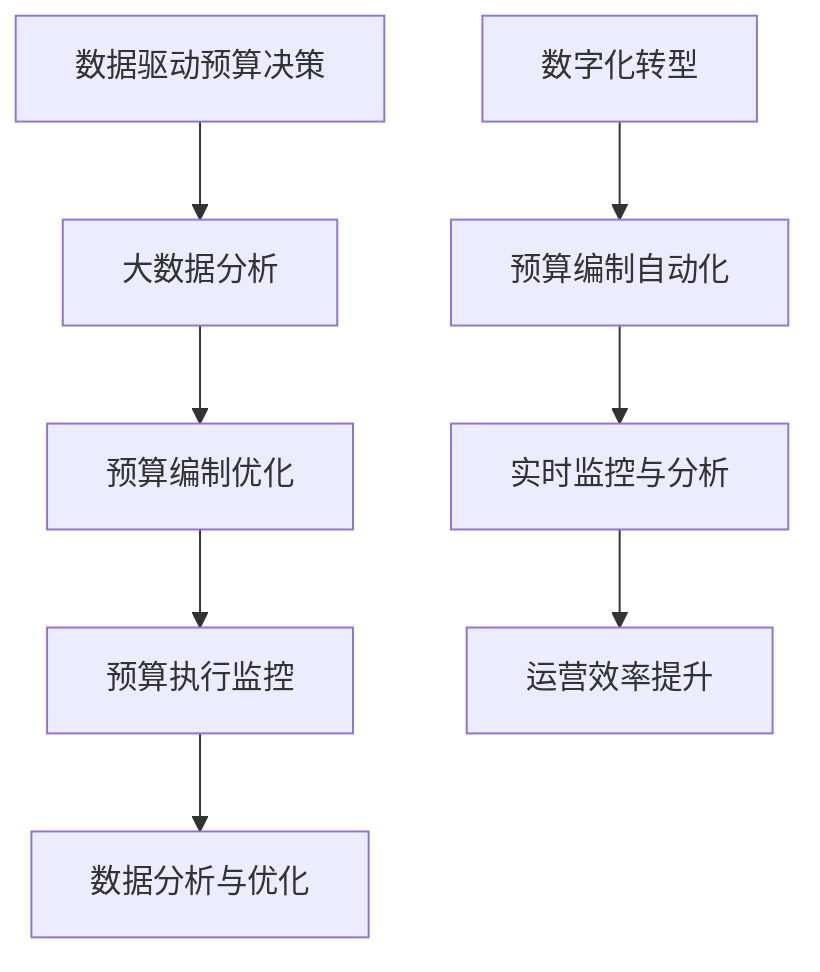

**联系：**

通过数据驱动的预算决策和数字化转型，企业可以实现预算管理的高效化、智能化和精细化，提高预算决策的准确性和效率，为企业的长期发展提供有力支持。

### 3.5 本章小结

**摘要：** 本章节从国内外技术预算现状、最佳实践案例、创新方法以及未来发展趋势等方面，系统地介绍了技术预算的最佳实践。通过本章的学习，读者可以了解技术预算管理的先进方法和趋势，掌握如何在实际工作中应用这些方法，提高预算管理的质量和效果。

### 第四部分：技术预算与组织发展

#### 4.1 技术预算与公司战略的关系

**关键词：** 技术预算，公司战略，规划，支持与制约

**摘要：** 本章节将探讨技术预算与公司战略之间的关系，包括技术预算对公司战略的规划和支持作用，以及技术预算可能带来的制约因素。

技术预算在公司战略中占据重要地位，它不仅支持公司战略的实现，还可能对战略实施产生制约。本章节将详细讨论技术预算与公司战略之间的关系，帮助读者理解技术预算在公司战略中的关键作用。

**背景介绍：**

随着科技在企业运营中的重要性不断提升，技术预算已经成为企业战略规划的重要组成部分。一个科学合理的技术预算能够支持公司的战略目标，促进企业的可持续发展。然而，技术预算的编制和执行也可能面临各种挑战和制约。

**核心概念与联系：**

**技术预算对公司战略的规划和支持：** 技术预算作为公司战略的重要组成部分，其规划和支持作用体现在以下几个方面：

1. **资源配置：** 技术预算的规划确保了公司在技术研发、基础设施建设和人才引进等关键领域的资源得到合理配置，支持公司的长期战略目标。
2. **创新驱动：** 技术预算为公司的创新活动提供了必要的资金保障，促进公司在技术领域的持续创新，增强市场竞争力。
3. **风险管理：** 技术预算通过合理的风险分配和管理，降低公司在技术研发过程中的不确定性，为战略实施提供安全保障。

**制约因素：** 技术预算在支持公司战略的同时，也可能带来一些制约因素：

1. **预算限制：** 技术预算的有限性可能导致公司在某些关键领域的投资不足，影响战略目标的实现。
2. **市场变化：** 市场环境的快速变化可能对技术预算的需求和分配产生重大影响，使得预算难以适应战略调整的需要。
3. **资源整合：** 技术预算的编制和执行需要多个部门和团队的协同工作，资源整合的难度可能导致预算执行的效果受到影响。

以下是一个简化的技术预算与公司战略关系图：

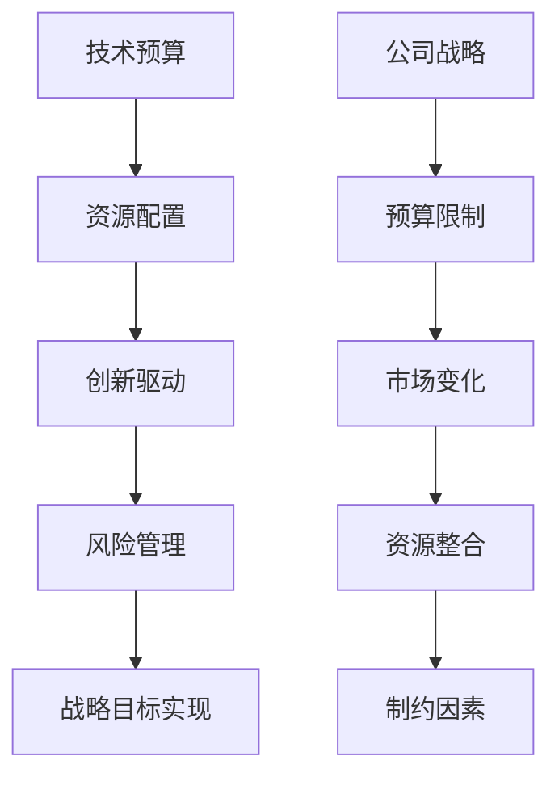

**联系：**

通过理解技术预算与公司战略之间的关系，企业可以更好地将技术预算纳入战略规划中，确保预算支持公司战略的实现，同时识别和应对可能带来的制约因素。

#### 4.2 技术预算与组织文化

**关键词：** 技术预算，组织文化，推行与员工参与，企业文化

**摘要：** 本章节将探讨技术预算与组织文化之间的关系，分析技术预算的推行如何影响员工参与和企业文化，以及如何通过营造良好的企业文化来支持技术预算的实施。

技术预算的推行不仅关系到资源的合理分配，还与组织文化的建设密切相关。一个积极、开放和合作的企业文化能够促进技术预算的有效推行，提高员工的参与度和团队协作能力。本章节将详细讨论技术预算与组织文化之间的关系，提供实用的策略和技巧。

**背景介绍：**

组织文化是企业在长期发展中形成的共同价值观和行为准则，它对企业的发展和员工的工作态度有重要影响。技术预算的推行需要企业的全体员工共同参与和支持，而积极的企业文化能够激发员工的积极性，促进技术预算目标的实现。

**核心概念与联系：**

**推行技术预算与员工参与：** 推行技术预算时，员工的参与至关重要。以下是一些促进员工参与的关键点：

1. **沟通与透明：** 通过定期沟通和透明的预算编制过程，使员工了解技术预算的重要性和具体内容，提高他们的参与度和认同感。
2. **培训与支持：** 为员工提供必要的培训和支持，帮助他们理解技术预算的相关知识，提高其在预算执行中的能力和效率。
3. **激励机制：** 设立合理的激励机制，鼓励员工积极参与技术预算的编制和执行，通过奖励和认可来增强他们的工作动力。

**技术预算与企业文化：** 技术预算的有效推行离不开企业文化的支持。以下是企业文化建设的关键点：

1. **创新意识：** 培养员工的创新意识，鼓励他们提出新的想法和解决方案，以支持技术预算的创新需求。
2. **合作精神：** 倡导团队合作精神，鼓励员工在预算执行过程中相互协作，共同解决问题。
3. **持续改进：** 不断优化企业流程和制度，确保技术预算的管理和执行能够持续改进，适应企业发展的需要。

以下是一个简化的技术预算与组织文化关系图：

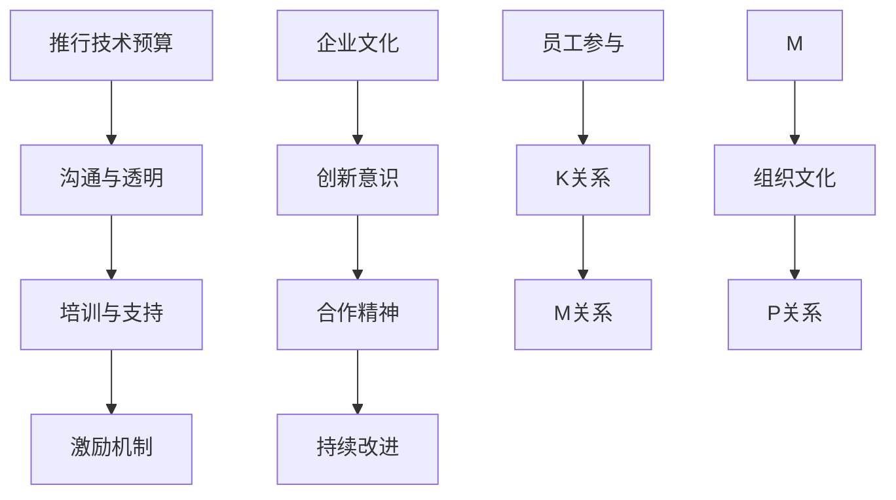

**联系：**

通过营造积极的企业文化，推行技术预算时能够更好地激发员工的参与和创造力，促进技术预算的有效实施。同时，技术预算的推行也能进一步强化企业文化，实现企业与员工的共同成长。

### 4.3 技术预算与人力资源

**关键词：** 技术预算，人力资源，需求分析，员工激励

**摘要：** 本章节将探讨技术预算与人力资源之间的关系，包括技术预算对人才需求的影响，如何通过人才引进和激励策略来支持技术预算的实施。

技术预算的成功实施离不开高素质的人才支持。本章节将详细讨论技术预算与人力资源之间的关系，分析技术预算对人才需求的影响，以及如何通过人才引进和激励策略来支持技术预算的实施。

**背景介绍：**

技术预算在技术研发、项目实施和持续改进中起到关键作用。而这一切的实现都需要依赖于技术人才的支持。技术预算的规模和方向直接影响着企业对技术人才的需求。同时，如何吸引、培养和留住优秀人才也是技术预算管理的重要内容。

**核心概念与联系：**

**技术预算对人才需求的影响：** 技术预算的规模和方向对人才需求产生显著影响。以下是一些关键点：

1. **技术研发：** 技术预算的增加通常意味着更多的研发投入，需要更多具备研发能力和专业知识的技术人才。
2. **项目实施：** 技术预算的分配和执行需要具备项目管理能力和技术背景的人才，以确保项目按计划进行。
3. **持续改进：** 技术预算的持续改进需要持续关注行业动态和新技术发展，这要求企业拥有具备前瞻性思维和创新能力的专业人才。

**人才引进策略：** 为了满足技术预算对人才的需求，企业需要采取有效的人才引进策略：

1. **招聘渠道多样化：** 通过多种渠道招聘人才，如线上招聘平台、行业招聘会、社交媒体等，扩大人才来源。
2. **人才储备计划：** 提前规划人才储备，确保在技术需求高峰期有足够的人才储备。
3. **校企合作：** 与高校和研究机构建立合作关系，通过校企合作培养和选拔优秀人才。

**员工激励策略：** 为了留住和激励人才，企业需要采取有效的激励策略：

1. **薪酬激励：** 提供具有竞争力的薪酬待遇，以吸引和留住优秀人才。
2. **职业发展机会：** 为员工提供职业发展的机会和空间，鼓励他们不断提升自己的能力和技能。
3. **绩效奖励：** 建立公平合理的绩效评估体系，对表现优秀的员工进行奖励，激发他们的工作积极性。

以下是一个简化的技术预算与人力资源关系图：

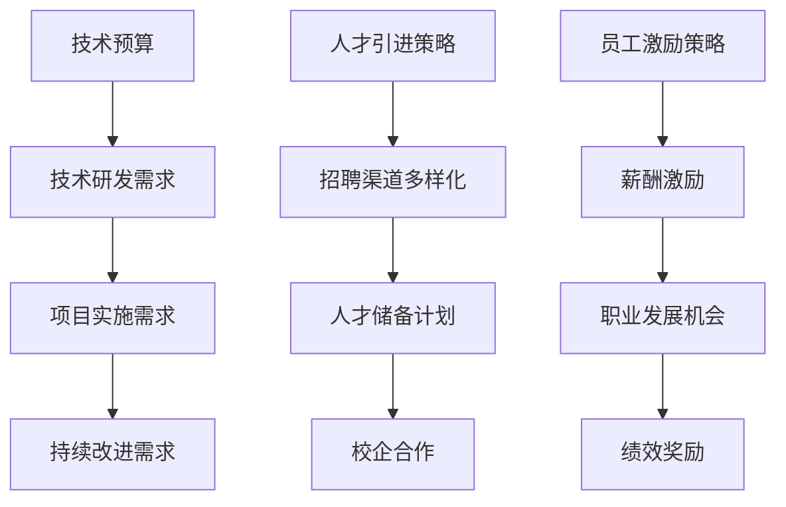

**联系：**

通过科学合理的技术预算规划，企业能够准确预测和满足技术人才需求，并通过有效的人才引进和激励策略，确保技术预算的有效实施和持续改进。

### 4.4 技术预算与项目管理

**关键词：** 技术预算，项目管理，关系，应用

**摘要：** 本章节将探讨技术预算与项目管理之间的关系，分析技术预算在项目管理中的具体应用，以及如何通过技术预算管理提高项目成功率。

技术预算与项目管理密切相关，技术预算的有效管理是项目成功的重要保障。本章节将详细讨论技术预算与项目管理之间的关系，分析技术预算在项目管理中的具体应用，并提供提高项目成功率的方法。

**背景介绍：**

项目管理是企业实现业务目标的重要手段，而技术预算则是项目管理的重要资源。技术预算的合理分配和有效管理能够保障项目顺利推进，提高项目成功率。

**核心概念与联系：**

**技术预算在项目管理中的应用：** 技术预算在项目管理中具有多种应用，包括以下几个方面：

1. **项目启动：** 技术预算为项目启动提供了资金保障，确保项目在启动阶段有足够的资源支持。
2. **项目规划：** 技术预算在项目规划阶段起到了指导作用，帮助项目团队确定项目的预算需求和资源分配策略。
3. **项目执行：** 技术预算在项目执行阶段提供了资金支持，确保项目按计划进行，并在预算范围内完成。
4. **项目监控：** 技术预算的监控与调整有助于项目团队及时发现和解决问题，确保项目在预算范围内顺利完成。

**技术预算管理提高项目成功率的方法：** 为了提高项目成功率，企业可以采取以下方法：

1. **科学的预算编制：** 通过科学的预算编制方法，如零基预算和滚动预算，提高预算的准确性和可行性。
2. **严格的预算控制：** 建立严格的预算控制机制，通过实时监控和反馈，确保预算执行过程中的合规性和有效性。
3. **有效的风险管理：** 通过有效的风险管理策略，降低项目风险，确保项目在预算范围内顺利实施。
4. **持续改进：** 通过对技术预算执行过程的持续改进，提高预算管理的效率和效果，为项目成功提供有力支持。

以下是一个简化的技术预算在项目管理中的应用图：

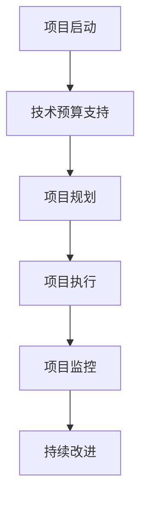

**联系：**

通过技术预算的有效管理，企业可以确保项目在预算范围内顺利进行，提高项目成功率，实现业务目标。

### 4.5 技术预算与可持续发展

**关键词：** 技术预算，可持续发展，环境，社会，经济

**摘要：** 本章节将探讨技术预算与可持续发展之间的关系，分析技术预算如何支持环境、社会和经济可持续发展，并讨论在可持续发展目标下的预算管理策略。

可持续发展是当今世界的重要主题，企业在制定技术预算时也需要考虑可持续发展的要求。本章节将详细讨论技术预算与可持续发展之间的关系，分析技术预算如何支持环境、社会和经济可持续发展，并提供在可持续发展目标下的预算管理策略。

**背景介绍：**

随着全球环境问题日益严重，企业需要承担更多的社会责任，实现可持续发展。技术预算作为企业资源分配的重要工具，对企业的可持续发展具有重要影响。在制定技术预算时，企业需要考虑环境、社会和经济三个方面的可持续性。

**核心概念与联系：**

**技术预算支持可持续发展：** 技术预算支持可持续发展体现在以下几个方面：

1. **环境可持续发展：** 技术预算可以为环保技术的研究和推广提供资金支持，促进环境保护和资源节约。
2. **社会可持续发展：** 技术预算可以支持社会公益项目和社会基础设施的建设，促进社会公平和福祉。
3. **经济可持续发展：** 技术预算可以通过技术创新和产业升级，推动经济增长，提高企业的竞争力。

**可持续发展目标下的预算管理策略：** 为了实现可持续发展目标，企业可以采取以下预算管理策略：

1. **绿色预算编制：** 在预算编制过程中，优先考虑环保项目和技术，确保预算资金的合理使用。
2. **社会责任预算：** 设立专门的社会责任预算，用于支持社会公益项目和基础设施的建设。
3. **经济效益评估：** 在预算执行过程中，对每个项目进行经济效益评估，确保预算资金的高效利用。

以下是一个简化的技术预算支持可持续发展的关系图：

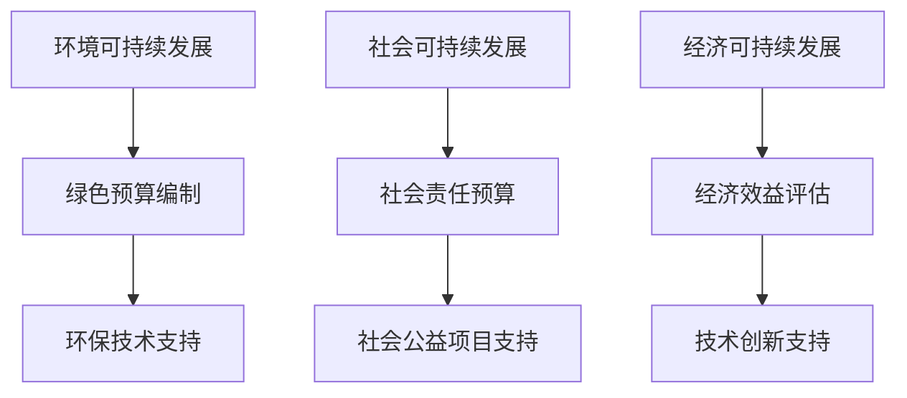

**联系：**

通过将可持续发展目标纳入技术预算管理，企业可以实现经济、社会和环境的协调发展，为企业的长期可持续发展奠定坚实基础。

### 4.6 本章小结

**摘要：** 本章节从技术预算与公司战略、组织文化、人力资源、项目管理以及可持续发展等多个角度，系统地探讨了技术预算与组织发展的关系。通过本章的学习，读者可以全面了解技术预算在组织发展中的重要作用，掌握技术预算管理的核心方法和策略，为企业的可持续发展提供有力支持。

### 总结与展望

在《技术预算：合理分配和使用技术资源》的探讨中，我们系统性地分析了技术预算的定义、核心概念、影响因素、设计原则、分配策略、执行与监控、风险管理、调整与优化以及技术预算与组织发展的关系。通过这些内容的深入探讨，我们可以总结出以下几点关键观点：

1. **技术预算的重要性：** 技术预算是企业技术创新和竞争力提升的重要保障。合理的技术预算能够确保企业在技术领域的可持续发展，提高市场竞争力。

2. **科学合理的预算编制：** 科学合理的预算编制是技术预算管理的核心。企业需要采用先进的预算编制方法，如零基预算和智能预算系统，提高预算编制的准确性和科学性。

3. **有效的预算执行与监控：** 有效的预算执行与监控是确保技术预算目标实现的关键。企业需要建立完善的监控机制，实时掌握预算执行情况，及时调整预算分配，确保项目按计划推进。

4. **灵活的风险管理策略：** 技术预算执行过程中可能面临各种风险，企业需要建立灵活的风险管理策略，降低风险发生的概率，确保预算目标的实现。

5. **与组织发展的紧密衔接：** 技术预算需要与企业的战略目标、组织文化和人力资源等紧密衔接，确保预算支持企业的长期发展。

在展望未来，技术预算管理将面临新的挑战和机遇。随着数字化和智能化的发展，企业可以利用大数据、人工智能等技术，实现预算编制、执行和监控的智能化和精细化。同时，企业也需要不断优化预算管理流程，提高预算管理的效率和效果。

为了更好地应对这些挑战，企业可以采取以下措施：

1. **加强数据驱动：** 利用大数据分析技术，提高预算编制的科学性和准确性，实现数据驱动的预算决策。

2. **推动数字化转型：** 通过数字化转型，实现预算管理的数字化和智能化，提高预算管理的效率和透明度。

3. **培养专业人才：** 加强对预算管理专业人才的培养，提高预算管理的专业水平，确保技术预算的有效实施。

4. **持续优化流程：** 不断优化预算管理流程，简化审批流程，提高预算执行效率。

5. **强化风险意识：** 提高对企业内部风险的认识，建立完善的风险管理体系，确保技术预算的安全性和稳定性。

总之，技术预算管理是一个持续优化和提升的过程。通过不断学习和实践，企业可以更好地掌握技术预算管理的核心方法和策略，提高预算管理的质量和效率，为企业的可持续发展提供有力支持。

### 附录

本附录提供了本文中涉及的一些关键术语和概念的详细解释，以及相关的图表和公式。

#### 关键术语和概念解释

- **技术预算：** 指企业或组织在特定时间内用于技术项目、研发和基础设施建设的资金预算。
- **零基预算：** 一种从零开始重新评估每个预算项的方法，要求每个预算项目都要经过详细评估，证明其必要性和合理性。
- **智能预算系统：** 利用大数据、人工智能和机器学习技术，实现预算编制、执行和监控的智能化和精细化。
- **成本效益分析：** 评估技术投资成本和预期收益的方法，通过比较成本和收益，决定是否进行技术投资。
- **资源规划：** 确定和分配企业或组织在技术研发、项目实施和持续改进过程中所需的各种资源。
- **项目管理：** 通过系统的方法和工具，确保项目在预定的时间、成本和质量范围内顺利完成。

#### 相关图表

- **技术预算构成要素对比表格：**
  | 构成要素 | 定义 | 对技术预算的影响 |
  |----------|----------------|------------------|
  | 研发投入 | 用于新技术研究和开发的投资 | 提升企业创新能力 |
  | 基础设施投资 | 用于技术基础设施建设和维护的投资 | 保障技术稳定运行 |
  | 技术并购 | 通过收购其他企业来获取新技术和人才的投资 | 快速获取核心技术 |
  | 人才引进 | 用于招聘和培养技术人才的投资 | 提升团队技术水平 |

- **技术资源需求分析ER实体关系图：**
  ```mermaid
  erDiagram
    CUSTOMER ||--|{ ORDER : has }
    ORDER ||--|{ CUSTOMER : is }
  ```

#### 相关公式

- **成本效益比公式：**
  $$ \text{成本效益比} = \frac{\text{收益}}{\text{成本}} $$

- **技术投资回报率公式：**
  $$ \text{投资回报率} = \frac{\text{投资收益}}{\text{投资成本}} \times 100\% $$

#### 代码示例

以下是一个简单的Python代码示例，用于计算技术投资回报率：

```python
def calculate_roi(investment_cost, investment_return):
    roi = (investment_return / investment_cost) * 100
    return roi

# 示例数据
investment_cost = 100000
investment_return = 150000

# 计算投资回报率
roi = calculate_roi(investment_cost, investment_return)

# 输出结果
print("投资回报率为：", roi, "%")
```

通过上述附录，读者可以更好地理解本文中涉及的关键术语和概念，以及相关的图表和公式，从而加深对技术预算管理的理解和应用。

