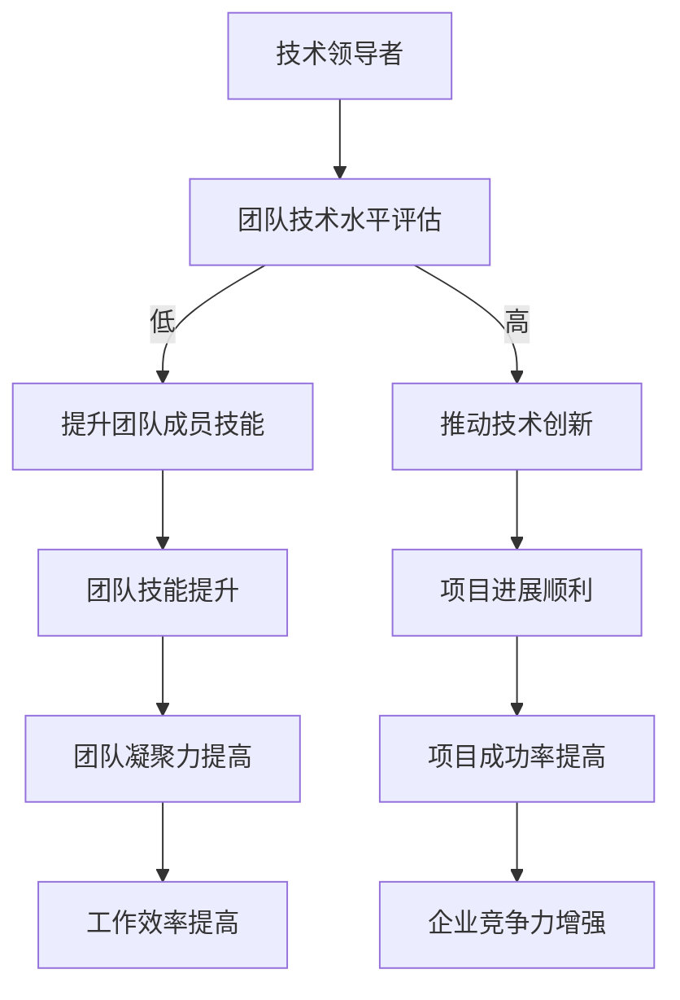

                 

### 第1章：技术领导力的定义与重要性

**背景介绍**

在当今快速变化的技术环境中，技术领导力成为了企业发展过程中不可或缺的一部分。然而，究竟什么是技术领导力？它的重要性又体现在哪些方面？这是我们需要首先明确的问题。

**核心概念与联系**

技术领导力（Technical Leadership）是指技术领导者通过其技术专长和领导能力，引领团队在技术领域不断前进，解决复杂问题，推动技术创新。它与团队管理、项目管理等密切相关，但更侧重于技术领域的引领与推动。

**概念属性特征对比表格**

| 特征 | 技术领导力 | 团队管理 | 项目管理 |
| ---- | ---------- | -------- | -------- |
| 目标 | 技术创新与推动 | 确保团队高效协作 | 按时完成项目目标 |
| 关注点 | 技术深度与广度 | 团队成员能力与沟通 | 项目进度、资源分配 |
| 责任 | 技术决策、团队发展 | 团队成员管理、冲突解决 | 项目管理、风险控制 |

**ER实体关系图架构**

```mermaid
erDiagram
    Class1 ||--|{ Class2 }| Customer : has-many
    Class1 ||--|{ Class3 }| Order : places
    Class2 ||--|{ Class4 }| Product : sells
```

在上图中，`Class1`代表技术领导者，`Class2`代表团队管理，`Class3`代表项目管理，`Class4`代表项目。它们之间存在紧密的联系，共同构成一个完整的技术领导力体系。

**问题解决**

为了理解技术领导力的定义与重要性，我们可以通过以下几个步骤来进行分析：

1. **理解技术领导力的内涵**：技术领导力不仅仅是技术深度和广度的掌握，更涉及到团队管理、项目推动等多个方面。因此，我们需要在技术专长的基础上，不断提升自身的领导能力和沟通技巧。

2. **认识技术领导力的重要性**：技术领导力能够提升团队的技术水平，推动技术创新，提高项目成功率，甚至为企业创造竞争优势。因此，具备技术领导力对于技术从业者的职业发展至关重要。

3. **技术领导力与团队管理的关系**：技术领导力与团队管理密不可分。一个优秀的技术领导者不仅需要具备技术专长，还需要具备团队管理能力，如任务分配、团队激励等。

**边界与外延**

技术领导力的边界在于其技术专长和领导能力的结合，而其外延则涉及到团队管理、项目管理等多个领域。在技术领域中，技术领导力可以帮助团队解决复杂问题，推动技术创新；在团队管理中，技术领导力可以提升团队的凝聚力，提高工作效率。

**概念结构与核心要素组成**

技术领导力的核心要素包括技术深度与广度、领导力与沟通技巧、不断学习与适应变化等。这些要素共同构成了技术领导力的概念结构。

**算法原理讲解**

为了更好地理解技术领导力的算法原理，我们可以将其抽象为一个简单的决策树模型。在模型中，技术领导者需要根据团队的技术水平、项目需求和自身能力等因素，做出合理的决策，以推动团队的技术发展和项目进展。

**流程图**



在这个流程图中，A表示技术领导者，B表示团队技术水平评估，C表示提升团队成员技能，D表示推动技术创新，E表示团队技能提升，F表示项目进展顺利，G表示团队凝聚力提高，H表示项目成功率提高，I表示工作效率提高，J表示企业竞争力增强。

**数学模型和公式**

为了量化技术领导力的影响，我们可以引入以下数学模型：

$$
L = f(T, M, A)
$$

其中，$L$表示技术领导力，$T$表示技术深度与广度，$M$表示领导力与沟通技巧，$A$表示不断学习与适应变化的能力。

**详细讲解与举例说明**

假设我们有一个技术团队，其技术深度与广度为$T_1$，领导力与沟通技巧为$M_1$，不断学习与适应变化的能力为$A_1$。根据上述数学模型，我们可以计算出该团队的技术领导力$L_1$：

$$
L_1 = f(T_1, M_1, A_1)
$$

假设我们提升团队成员的技术深度与广度，使其变为$T_2$，领导力与沟通技巧变为$M_2$，不断学习与适应变化的能力变为$A_2$。再次计算团队的技术领导力$L_2$：

$$
L_2 = f(T_2, M_2, A_2)
$$

通过比较$L_1$和$L_2$，我们可以发现，提升团队成员的技术能力、领导力和沟通技巧以及不断学习与适应变化的能力，都会显著提高团队的技术领导力。

**总结**

通过以上分析，我们可以得出结论：技术领导力是技术从业人员必备的核心能力，它不仅有助于提升团队的技术水平，推动技术创新，提高项目成功率，甚至为企业创造竞争优势。因此，作为技术领导者，我们需要不断提升自身的领导力、沟通技巧和技术能力，以适应不断变化的技术环境。

----------------------------------------------------------------

### 第2章：技术领导者的核心能力

**背景介绍**

技术领导者的核心能力是其在技术领域取得成功的关键因素。这些核心能力不仅关乎个人技术水平，还包括领导力、沟通技巧、团队管理等多方面。本文将深入探讨技术领导者需要具备的核心能力。

**核心能力一：技术深度与广度的平衡**

技术领导者需要具备深厚的技术知识和广泛的技术视野。技术深度使领导者能够深入了解特定技术领域，解决复杂问题；技术广度则有助于领导者把握全局，理解不同技术领域的关联，提升跨领域协作能力。

**核心能力二：领导力与沟通技巧**

领导力是技术领导者的重要素质。领导者需要能够激励团队成员，明确目标，合理分配任务，并解决团队中的冲突。同时，沟通技巧对于技术领导者来说至关重要，它有助于确保团队成员理解目标与期望，提升团队凝聚力。

**核心能力三：不断学习与适应变化**

技术环境变化迅速，技术领导者需要具备持续学习的能力，紧跟技术发展趋势，掌握新技能。同时，领导者需要适应变化，灵活调整团队策略，以应对新的技术挑战。

**核心概念与联系**

技术深度与广度、领导力与沟通技巧、不断学习与适应变化是技术领导者的核心能力。这些能力相互关联，共同构成一个完整的技术领导力体系。

**概念属性特征对比表格**

| 特征 | 技术深度 | 技术广度 | 领导力 | 沟通技巧 | 学习能力 |
| ---- | -------- | -------- | ------ | -------- | -------- |
| 定义 | 深入了解特定技术领域 | 理解不同技术领域的关联 | 激励团队成员，明确目标 | 确保团队成员理解目标与期望 | 跟进技术发展趋势，掌握新技能 |
| 关键要素 | 专业知识，技术经验 | 技术视野，跨领域协作 | 领导风格，团队激励 | 沟通方式，表达技巧 | 持续学习，适应变化 |
| 影响 | 解决复杂问题，提高技术水平 | 提升团队协作能力，推动技术创新 | 提高团队凝聚力，确保项目成功 | 提高团队执行力，减少误解 | 提升个人竞争力，保持团队活力 |

**ER实体关系图架构**

```mermaid
erDiagram
    Class1 ||--|{ Class2 }| TechnologyDepth : has-knowledge-of
    Class1 ||--|{ Class3 }| TechnologyBroad : has-skill-in
    Class1 ||--|{ Class4 }| Leadership : has-style-of
    Class1 ||--|{ Class5 }| Communication : has-skill-in
    Class1 ||--|{ Class6 }| LearningAbility : is-based-on
```

在上图中，`Class1`代表技术领导者，`Class2`代表技术深度，`Class3`代表技术广度，`Class4`代表领导力，`Class5`代表沟通技巧，`Class6`代表学习能力。这些核心能力共同构成了技术领导者的素质体系。

**问题解决**

为了成为一名合格的技术领导者，我们需要以下步骤：

1. **提升技术深度与广度**：通过学习、实践和积累经验，不断深化对特定技术领域的理解，同时拓宽技术视野，掌握跨领域知识。
2. **培养领导力与沟通技巧**：通过阅读领导力相关书籍，参加培训课程，实践团队管理经验，提升自身的领导力和沟通能力。
3. **持续学习与适应变化**：关注技术发展趋势，积极参加行业研讨会，不断更新知识体系，以适应技术环境的变化。

**边界与外延**

技术领导者的核心能力具有明确的边界，包括技术深度与广度、领导力与沟通技巧、不断学习与适应变化等。其外延则包括团队管理、项目推动、技术创新等多个方面，这些能力共同构成了技术领导者的全面素质。

**概念结构与核心要素组成**

技术领导者的核心能力包括技术深度与广度、领导力与沟通技巧、不断学习与适应变化等。这些能力相互支持，共同构成了技术领导者的概念结构。

**算法原理讲解**

为了量化技术领导者的核心能力，我们可以引入以下算法模型：

$$
L = f(D, B, L', C, L'')
$$

其中，$L$表示技术领导力，$D$表示技术深度，$B$表示技术广度，$L'$表示领导力，$C$表示沟通技巧，$L''$表示学习能力。

**数学公式**

$$
L = D \times B \times L' \times C \times L''
$$

通过这个公式，我们可以看出，技术领导力是技术深度、技术广度、领导力、沟通技巧和学习能力的乘积。每个因素都对技术领导力有重要影响。

**详细讲解与举例说明**

假设我们有一个技术团队，其技术深度为$D_1$，技术广度为$B_1$，领导力为$L_1'$，沟通技巧为$C_1$，学习能力为$L_1''$。根据上述算法模型，我们可以计算出该团队的技术领导力$L_1$：

$$
L_1 = D_1 \times B_1 \times L_1' \times C_1 \times L_1''
$$

如果技术深度、技术广度、领导力、沟通技巧和学习能力都得到提升，例如变为$D_2$、$B_2$、$L_2'$、$C_2$和$L_2''$，我们可以计算出新的技术领导力$L_2$：

$$
L_2 = D_2 \times B_2 \times L_2' \times C_2 \times L_2''
$$

通过比较$L_1$和$L_2$，我们可以发现，提升技术深度、技术广度、领导力、沟通技巧和学习能力，都能显著提高团队的技术领导力。

**总结**

技术领导者的核心能力是其在技术领域取得成功的关键。通过不断提升技术深度与广度、领导力与沟通技巧、不断学习与适应变化，技术领导者可以更好地引领团队，推动技术创新，提高项目成功率。因此，作为技术领导者，我们需要持续努力，提升自身的核心能力，以应对不断变化的技术环境。

----------------------------------------------------------------

### 第3章：高级开发者必备技能

**背景介绍**

高级开发者是技术团队中的关键角色，他们在项目中承担着重要的任务，对项目的成功与否起到决定性作用。因此，高级开发者需要具备一系列必备技能，以确保项目的顺利进行。本文将详细介绍高级开发者必备的技能。

**技能一：编码能力提升**

编码能力是高级开发者的核心技能。为了提升编码能力，高级开发者需要：

1. **掌握多种编程语言**：熟悉至少一种主流编程语言，如Java、Python、C++等，并了解其他编程语言的基本原理。
2. **代码质量与规范**：编写高质量、规范化的代码，遵循编码规范，提高代码的可读性和可维护性。
3. **代码复用性**：善于编写可复用的代码模块，减少重复劳动，提高开发效率。

**技能二：代码质量与规范**

代码质量直接影响项目的稳定性和可维护性。高级开发者需要：

1. **编写高质量的代码**：确保代码逻辑清晰，逻辑错误少，性能优化。
2. **遵循代码规范**：遵循公司或团队的代码规范，确保代码的一致性。
3. **进行代码审查**：定期进行代码审查，发现并修复潜在的问题。

**技能三：软件工程实践**

软件工程实践是高级开发者必须掌握的技能。这包括：

1. **版本控制**：熟练使用版本控制系统，如Git，进行代码管理和协同工作。
2. **持续集成与部署**：了解持续集成（CI）和持续部署（CD）的概念，确保项目的自动化构建和部署。
3. **测试驱动开发**：实践测试驱动开发（TDD），编写测试用例，确保代码质量。

**核心概念与联系**

高级开发者的必备技能包括编码能力提升、代码质量与规范、软件工程实践等。这些技能相互关联，共同构成一个完整的高级开发者能力体系。

**概念属性特征对比表格**

| 特征 | 编码能力提升 | 代码质量与规范 | 软件工程实践 |
| ---- | ------------ | -------------- | ------------ |
| 目的 | 提高开发效率 | 确保代码质量 | 提高项目稳定性 |
| 方式 | 学习编程语言 | 遵循编码规范 | 实践软件工程方法 |
| 影响 | 提高个人能力 | 提升项目质量 | 确保项目按时交付 |

**ER实体关系图架构**

```mermaid
erDiagram
    Class1 ||--|{ Class2 }| CodingSkills : improves
    Class1 ||--|{ Class3 }| CodeQuality : ensures
    Class1 ||--|{ Class4 }| SoftwareEngineering : practices
```

在上图中，`Class1`代表高级开发者，`Class2`代表编码能力提升，`Class3`代表代码质量与规范，`Class4`代表软件工程实践。这些技能共同构成了高级开发者的能力体系。

**问题解决**

为了成为一名优秀的高级开发者，我们需要以下步骤：

1. **提升编码能力**：通过学习编程语言、编写高质量的代码、提高代码复用性等，不断提升编码能力。
2. **确保代码质量**：遵循代码规范，进行代码审查，确保代码质量。
3. **实践软件工程方法**：了解并实践版本控制、持续集成与部署、测试驱动开发等软件工程方法。

**边界与外延**

高级开发者的必备技能具有明确的边界，包括编码能力提升、代码质量与规范、软件工程实践等。其外延则包括项目协作、技术调研、技术难题解决等多个方面，这些技能共同构成了高级开发者的全面能力。

**概念结构与核心要素组成**

高级开发者的必备技能包括编码能力提升、代码质量与规范、软件工程实践等。这些技能相互支持，共同构成了高级开发者的概念结构。

**算法原理讲解**

为了量化高级开发者的技能，我们可以引入以下算法模型：

$$
S = f(C, Q, SE)
$$

其中，$S$表示高级开发者的技能水平，$C$表示编码能力提升，$Q$表示代码质量与规范，$SE$表示软件工程实践。

**数学公式**

$$
S = C \times Q \times SE
$$

通过这个公式，我们可以看出，高级开发者的技能水平是编码能力提升、代码质量与规范、软件工程实践的乘积。每个因素都对高级开发者的技能水平有重要影响。

**详细讲解与举例说明**

假设我们有一个高级开发者，其编码能力提升为$C_1$，代码质量与规范为$Q_1$，软件工程实践为$SE_1$。根据上述算法模型，我们可以计算出该开发者的技能水平$S_1$：

$$
S_1 = C_1 \times Q_1 \times SE_1
$$

如果该开发者的编码能力提升、代码质量与规范、软件工程实践都得到提升，例如变为$C_2$、$Q_2$、$SE_2$，我们可以计算出新的技能水平$S_2$：

$$
S_2 = C_2 \times Q_2 \times SE_2
$$

通过比较$S_1$和$S_2$，我们可以发现，提升编码能力、代码质量与规范、软件工程实践，都能显著提高高级开发者的技能水平。

**总结**

高级开发者是技术团队中的关键角色，其技能水平直接影响项目的成功。通过不断提升编码能力、确保代码质量、实践软件工程方法，高级开发者可以更好地应对技术挑战，提高项目成功率。因此，作为高级开发者，我们需要持续提升自身的技能水平，以适应快速变化的技术环境。

----------------------------------------------------------------

### 第4章：高级开发者的项目实践

**背景介绍**

高级开发者不仅需要具备扎实的技能，还需要在实际项目中锻炼和提升自己的能力。本文将探讨高级开发者需要掌握的项目实践技能，以及如何在项目中发挥自己的作用。

**技能一：项目管理基础**

项目管理是高级开发者必须掌握的技能。这包括：

1. **任务分配**：合理分配任务，确保每个团队成员都能发挥自己的优势。
2. **进度跟踪**：定期跟踪项目进度，确保项目按时完成。
3. **风险管理**：识别潜在的风险，并制定相应的应对策略。

**技能二：代码审查与测试**

代码审查与测试是确保项目质量的重要环节。高级开发者需要：

1. **代码审查**：审查他人的代码，发现潜在的问题，并提出改进建议。
2. **单元测试**：编写单元测试，确保代码的功能正确性。
3. **集成测试**：进行集成测试，确保系统的整体稳定性。

**技能三：高级开发者的角色转变**

随着项目的推进，高级开发者需要从编写代码的角色转变为团队的核心成员。这包括：

1. **技术指导**：为团队成员提供技术支持，解答技术难题。
2. **问题解决**：面对项目中出现的问题，快速定位并解决。
3. **决策参与**：参与项目决策，提供技术方案和建议。

**核心概念与联系**

高级开发者在项目实践中的技能包括项目管理基础、代码审查与测试、以及角色转变等。这些技能相互关联，共同构成了高级开发者在项目中的能力体系。

**概念属性特征对比表格**

| 特征 | 项目管理基础 | 代码审查与测试 | 角色转变 |
| ---- | ------------ | -------------- | -------- |
| 目的 | 确保项目进度 | 提高代码质量 | 提升团队效率 |
| 方式 | 任务分配、进度跟踪 | 代码审查、单元测试 | 技术指导、问题解决 |
| 影响 | 提高项目成功率 | 确保系统稳定性 | 提升团队凝聚力 |

**ER实体关系图架构**

```mermaid
erDiagram
    Class1 ||--|{ Class2 }| ProjectManagement : includes
    Class1 ||--|{ Class3 }| CodeReviewAndTesting : practices
    Class1 ||--|{ Class4 }| RoleTransition : evolves
```

在上图中，`Class1`代表高级开发者，`Class2`代表项目管理基础，`Class3`代表代码审查与测试，`Class4`代表角色转变。这些技能共同构成了高级开发者在项目实践中的能力体系。

**问题解决**

为了在项目中发挥高级开发者的作用，我们需要以下步骤：

1. **掌握项目管理基础**：学习项目管理知识，掌握任务分配、进度跟踪、风险管理等技能。
2. **实践代码审查与测试**：定期进行代码审查，编写单元测试，确保代码质量。
3. **转变角色**：从编写代码的角色转变为团队的核心成员，提供技术支持，解决问题。

**边界与外延**

高级开发者项目实践中的技能具有明确的边界，包括项目管理基础、代码审查与测试、角色转变等。其外延则包括团队协作、技术难题解决、项目决策参与等多个方面，这些技能共同构成了高级开发者在项目实践中的全面能力。

**概念结构与核心要素组成**

高级开发者项目实践中的技能包括项目管理基础、代码审查与测试、角色转变等。这些技能相互支持，共同构成了高级开发者在项目实践中的概念结构。

**算法原理讲解**

为了量化高级开发者在项目实践中的技能，我们可以引入以下算法模型：

$$
P = f(M, C, R, T)
$$

其中，$P$表示高级开发者在项目实践中的技能水平，$M$表示项目管理基础，$C$表示代码审查与测试，$R$表示角色转变，$T$表示技术支持。

**数学公式**

$$
P = M \times C \times R \times T
$$

通过这个公式，我们可以看出，高级开发者在项目实践中的技能水平是项目管理基础、代码审查与测试、角色转变、技术支持的乘积。每个因素都对高级开发者的技能水平有重要影响。

**详细讲解与举例说明**

假设我们有一个高级开发者，其在项目管理基础、代码审查与测试、角色转变、技术支持方面的技能水平分别为$M_1$、$C_1$、$R_1$和$T_1$。根据上述算法模型，我们可以计算出该开发者项目实践中的技能水平$P_1$：

$$
P_1 = M_1 \times C_1 \times R_1 \times T_1
$$

如果该开发者在项目管理基础、代码审查与测试、角色转变、技术支持方面的技能水平都得到提升，例如变为$M_2$、$C_2$、$R_2$和$T_2$，我们可以计算出新的技能水平$P_2$：

$$
P_2 = M_2 \times C_2 \times R_2 \times T_2
$$

通过比较$P_1$和$P_2$，我们可以发现，提升项目管理基础、代码审查与测试、角色转变、技术支持，都能显著提高高级开发者在项目实践中的技能水平。

**总结**

高级开发者在项目实践中需要掌握项目管理基础、代码审查与测试、角色转变等技能。通过不断提升这些技能，高级开发者可以更好地发挥自己的作用，提高项目成功率。因此，作为高级开发者，我们需要持续学习和实践，提升自己在项目实践中的能力水平。

----------------------------------------------------------------

### 第5章：架构师的角色与职责

**背景介绍**

架构师在软件工程中扮演着至关重要的角色。他们负责设计、构建和维护复杂的软件系统，确保系统的稳定性、可扩展性和高性能。本文将详细探讨架构师的角色与职责，帮助读者理解架构师在项目中的关键作用。

**角色一：技术决策者**

架构师作为技术决策者，负责制定项目的技术方向和架构设计。这包括：

1. **技术选型**：根据项目需求，选择合适的技术栈和框架。
2. **架构设计**：设计系统的整体架构，包括模块划分、接口定义、数据流程等。
3. **技术风险评估**：评估新技术带来的风险，确保项目技术的可行性。

**角色二：系统规划者**

架构师在系统规划中起到关键作用，负责：

1. **需求分析**：深入理解业务需求，将其转化为技术需求。
2. **系统设计**：根据需求分析结果，设计系统的功能模块和接口。
3. **性能优化**：关注系统的性能，进行性能分析和优化。

**角色三：团队协调者**

架构师需要协调团队成员的工作，确保项目的顺利进行。这包括：

1. **任务分配**：根据团队成员的能力和专长，合理分配任务。
2. **团队协作**：建立有效的沟通机制，确保团队成员之间的协作顺畅。
3. **问题解决**：面对项目中的技术难题，提供解决方案，指导团队成员。

**核心概念与联系**

架构师的角色与职责包括技术决策者、系统规划者和团队协调者。这些角色相互关联，共同构成了架构师在项目中的核心职责。

**概念属性特征对比表格**

| 角色       | 技术决策者 | 系统规划者 | 团队协调者 |
| ---------- | ---------- | ---------- | ---------- |
| 职责       | 技术选型、架构设计、技术风险评估 | 需求分析、系统设计、性能优化 | 任务分配、团队协作、问题解决 |
| 影响       | 技术方向、系统架构、项目风险 | 系统功能、系统性能、项目进度 | 团队效率、团队凝聚力、项目稳定性 |
| 关键要素   | 技术深度、技术视野、决策能力 | 业务理解、系统设计能力、性能优化意识 | 沟通技巧、团队管理能力、问题解决能力 |
| 职业成长   | 技术权威、项目成功、企业认可 | 系统规划能力、技术视野、项目经验 | 团队协作、领导能力、项目经验 |

**ER实体关系图架构**

```mermaid
erDiagram
    Class1 ||--|{ Class2 }| TechnicalDecisionMaker : responsible-for
    Class1 ||--|{ Class3 }| SystemPlanner : responsible-for
    Class1 ||--|{ Class4 }| TeamCoordinator : responsible-for
```

在上图中，`Class1`代表架构师，`Class2`代表技术决策者，`Class3`代表系统规划者，`Class4`代表团队协调者。这些角色共同构成了架构师在项目中的核心职责。

**问题解决**

为了成为一名合格的架构师，我们需要以下步骤：

1. **提升技术深度与视野**：不断学习新技术，提升技术深度和视野，以做出更准确的技术决策。
2. **增强业务理解能力**：深入理解业务需求，将其转化为技术需求，确保系统设计满足业务需求。
3. **培养团队管理能力**：通过实践和培训，提升团队管理能力，确保团队成员之间的协作顺畅。

**边界与外延**

架构师的角色与职责具有明确的边界，包括技术决策者、系统规划者和团队协调者。其外延则包括技术趋势预测、系统优化、项目风险管理等多个方面，这些职责共同构成了架构师在项目中的全面能力。

**概念结构与核心要素组成**

架构师的角色与职责包括技术决策者、系统规划者和团队协调者等。这些角色相互支持，共同构成了架构师在项目中的概念结构。

**算法原理讲解**

为了量化架构师的角色与职责，我们可以引入以下算法模型：

$$
A = f(T, S, C)
$$

其中，$A$表示架构师的能力，$T$表示技术决策能力，$S$表示系统规划能力，$C$表示团队协调能力。

**数学公式**

$$
A = T \times S \times C
$$

通过这个公式，我们可以看出，架构师的能力是技术决策能力、系统规划能力、团队协调能力的乘积。每个因素都对架构师的能力有重要影响。

**详细讲解与举例说明**

假设我们有一个架构师，其在技术决策能力、系统规划能力、团队协调能力方面的能力分别为$T_1$、$S_1$和$C_1$。根据上述算法模型，我们可以计算出该架构师的能力$A_1$：

$$
A_1 = T_1 \times S_1 \times C_1
$$

如果该架构师在技术决策能力、系统规划能力、团队协调能力方面的能力都得到提升，例如变为$T_2$、$S_2$和$C_2$，我们可以计算出新的能力$A_2$：

$$
A_2 = T_2 \times S_2 \times C_2
$$

通过比较$A_1$和$A_2$，我们可以发现，提升技术决策能力、系统规划能力、团队协调能力，都能显著提高架构师的能力。

**总结**

架构师在软件工程中扮演着关键角色，其职责包括技术决策者、系统规划者和团队协调者等。通过不断提升技术深度与视野、增强业务理解能力、培养团队管理能力，架构师可以更好地发挥自己的作用，确保项目的成功。因此，作为架构师，我们需要持续学习和实践，提升自己在项目中的能力水平。

----------------------------------------------------------------

### 第6章：架构设计原则与方法

**背景介绍**

架构设计是软件开发过程中至关重要的一环，它决定了系统的稳定性、可扩展性和可维护性。本文将深入探讨架构设计的基本原则与方法，帮助读者理解如何进行有效的架构设计。

**原则一：模块化**

模块化原则是指将系统划分为多个独立的模块，每个模块负责实现特定的功能。模块化有助于提高代码的可维护性和可扩展性。实现模块化原则的方法包括：

1. **定义明确的模块边界**：每个模块应具有清晰的职责和接口。
2. **模块间的依赖最小化**：模块之间应尽量减少直接的依赖，以降低系统的复杂性。

**原则二：单一职责**

单一职责原则是指每个模块或类应只负责一项职责。这有助于提高代码的可读性和可维护性。实现单一职责原则的方法包括：

1. **分解复杂任务**：将复杂的任务分解为多个简单的任务，每个任务由独立的模块或类负责。
2. **遵循单一职责原则**：在设计模块或类时，确保其只负责一项职责。

**原则三：解耦**

解耦原则是指模块之间应尽量保持独立，减少相互之间的依赖。这有助于提高系统的灵活性和可维护性。实现解耦原则的方法包括：

1. **使用接口**：通过接口定义模块之间的交互方式，降低模块之间的直接依赖。
2. **事件驱动**：使用事件驱动架构，将模块之间的交互转化为事件传递，降低直接依赖。

**方法一：领域驱动设计（Domain-Driven Design, DDD）**

领域驱动设计是一种面向领域的软件开发方法，它强调在软件设计中关注业务领域。DDD的方法包括：

1. **实体与值对象**：将业务领域的实体和值对象作为设计的主要对象。
2. **聚合与边界**：定义聚合和边界，确保模块的独立性。
3. **领域服务**：设计领域服务，处理复杂的业务逻辑。

**方法二：微服务架构（Microservices Architecture）**

微服务架构是一种基于独立服务构建的分布式系统架构，每个服务都具有独立的功能和生命周期。微服务架构的方法包括：

1. **服务拆分**：将大型系统拆分为多个小型服务，每个服务负责一个特定的功能。
2. **服务自治**：确保每个服务具有独立的服务能力，如数据库、缓存等。
3. **服务通信**：通过API进行服务之间的通信，确保系统的灵活性。

**核心概念与联系**

架构设计原则包括模块化、单一职责、解耦等，而方法包括领域驱动设计、微服务架构等。这些原则与方法相互关联，共同构成了有效的架构设计体系。

**概念属性特征对比表格**

| 原则       | 模块化 | 单一职责 | 解耦 |
| ---------- | ------ | -------- | ---- |
| 目的       | 提高可维护性和可扩展性 | 提高代码可读性和可维护性 | 提高系统灵活性和可维护性 |
| 方法       | 定义模块边界、模块间依赖最小化 | 分解复杂任务、遵循单一职责原则 | 使用接口、事件驱动 |
| 影响       | 系统复杂性降低、代码可维护性提高 | 代码可读性提高、职责明确 | 系统灵活性提高、依赖减少 |

**ER实体关系图架构**

```mermaid
erDiagram
    Class1 ||--|{ Class2 }| Modularity : follows
    Class1 ||--|{ Class3 }| SingleResponsibility : follows
    Class1 ||--|{ Class4 }| Decoupling : follows
```

在上图中，`Class1`代表架构设计原则，`Class2`代表模块化，`Class3`代表单一职责，`Class4`代表解耦。这些原则共同构成了有效的架构设计体系。

**问题解决**

为了进行有效的架构设计，我们需要以下步骤：

1. **理解业务领域**：深入理解业务需求，将其转化为技术需求。
2. **遵循架构设计原则**：在架构设计过程中，遵循模块化、单一职责、解耦等原则，确保系统的稳定性。
3. **选择合适的架构方法**：根据业务需求和系统规模，选择领域驱动设计或微服务架构等方法，确保系统的可维护性和可扩展性。

**边界与外延**

架构设计原则与方法具有明确的边界，包括模块化、单一职责、解耦等。其外延则包括领域驱动设计、微服务架构等，这些方法可以应用于不同的业务场景和系统规模。

**概念结构与核心要素组成**

架构设计原则与方法包括模块化、单一职责、解耦等，以及领域驱动设计、微服务架构等。这些原则与方法相互支持，共同构成了架构设计的概念结构。

**算法原理讲解**

为了量化架构设计的效果，我们可以引入以下算法模型：

$$
D = f(M, SR, D)
$$

其中，$D$表示架构设计的有效性，$M$表示模块化程度，$SR$表示单一职责程度，$D$表示解耦程度。

**数学公式**

$$
D = M \times SR \times D
$$

通过这个公式，我们可以看出，架构设计的有效性是模块化程度、单一职责程度、解耦程度的乘积。每个因素都对架构设计的有效性有重要影响。

**详细讲解与举例说明**

假设我们有一个系统，其模块化程度为$M_1$，单一职责程度为$SR_1$，解耦程度为$D_1$。根据上述算法模型，我们可以计算出该系统的架构设计有效性$D_1$：

$$
D_1 = M_1 \times SR_1 \times D_1
$$

如果该系统的模块化程度、单一职责程度、解耦程度都得到提升，例如变为$M_2$、$SR_2$和$D_2$，我们可以计算出新的架构设计有效性$D_2$：

$$
D_2 = M_2 \times SR_2 \times D_2
$$

通过比较$D_1$和$D_2$，我们可以发现，提升模块化程度、单一职责程度、解耦程度，都能显著提高系统的架构设计有效性。

**总结**

架构设计原则与方法是软件开发过程中至关重要的一环，通过遵循模块化、单一职责、解耦等原则，选择领域驱动设计或微服务架构等方法，我们可以设计出稳定、可扩展、可维护的软件系统。因此，作为开发者，我们需要深入理解架构设计原则与方法，不断提高自己的架构设计能力。

----------------------------------------------------------------

### 第7章：大型项目架构实践

**背景介绍**

在实际项目中，大型项目的架构设计往往面临诸多挑战，如系统复杂性高、需求变更频繁、性能要求严格等。本文将通过一个实际案例，详细介绍大型项目架构设计的过程，帮助读者理解如何应对这些挑战。

**案例介绍**

假设我们正在开发一个电子商务平台，该平台需要支持数百万用户的高并发访问，同时要具备良好的可扩展性和高可用性。以下是该项目架构设计的过程。

**步骤一：需求分析**

在项目启动阶段，我们需要与业务团队紧密合作，明确平台的功能需求、性能需求和可扩展性需求。以下是主要的需求分析结果：

1. **功能需求**：用户注册、登录、浏览商品、下单、支付、订单跟踪等。
2. **性能需求**：支持数百万用户同时在线，响应时间小于1秒。
3. **可扩展性需求**：能够轻松扩展服务器和数据库资源，以应对未来用户增长。

**步骤二：系统架构设计**

根据需求分析结果，我们设计了以下系统架构：

1. **前端架构**：采用单页面应用（SPA）架构，使用Vue.js框架实现。
2. **后端架构**：采用微服务架构，将系统拆分为多个独立的服务，如用户服务、商品服务、订单服务、支付服务等。
3. **数据库架构**：采用分布式数据库架构，使用MySQL集群存储数据，并使用Redis缓存热点数据。

**步骤三：接口设计**

为了确保服务之间的松耦合，我们设计了一系列API接口，包括：

1. **用户服务接口**：提供用户注册、登录、个人信息管理等接口。
2. **商品服务接口**：提供商品查询、分类查询、商品详情查询等接口。
3. **订单服务接口**：提供订单创建、订单查询、订单取消等接口。
4. **支付服务接口**：提供支付请求、支付查询、退款申请等接口。

**步骤四：系统部署与优化**

在系统部署阶段，我们采用了以下优化措施：

1. **负载均衡**：使用Nginx进行负载均衡，将请求分配到不同的服务器上。
2. **缓存策略**：使用Redis进行缓存，减少数据库查询压力。
3. **数据库优化**：使用MySQL主从复制，提高数据读写性能。
4. **服务监控**：使用Prometheus和Grafana进行系统监控，及时发现和解决性能瓶颈。

**实现细节**

以下是一个简单的用户注册接口的实现细节：

```python
# 用户注册接口实现
from flask import Flask, request, jsonify
from user_service import UserService

app = Flask(__name__)
user_service = UserService()

@app.route('/register', methods=['POST'])
def register():
    username = request.json['username']
    password = request.json['password']
    result = user_service.register(username, password)
    if result['success']:
        return jsonify(result)
    else:
        return jsonify(result), 400

if __name__ == '__main__':
    app.run()
```

在这个实现中，我们使用Flask框架创建了一个简单的用户注册接口，并通过UserService类调用注册功能。

**实际案例分析与详细讲解**

在实际项目中，我们遇到了以下问题：

1. **性能瓶颈**：在高并发情况下，系统响应时间较长。我们通过优化数据库查询、增加缓存和使用异步处理等方式，解决了性能瓶颈。
2. **服务拆分**：随着项目需求的增加，我们发现某些服务过于复杂，需要进行拆分。我们通过微服务架构，将服务拆分为更小的模块，提高了系统的可维护性和可扩展性。
3. **接口兼容性**：在项目迭代过程中，接口发生了变更。我们通过文档化和自动化测试，确保新旧接口的兼容性，避免了因接口变更导致的问题。

**项目小结**

通过上述实际案例，我们可以看到，在大型项目架构实践中，需求分析、系统架构设计、接口设计、系统部署与优化等步骤至关重要。同时，通过不断优化和调整，我们可以确保项目成功落地，并满足业务需求。

**最佳实践 tips**

1. **需求分析**：与业务团队紧密合作，确保需求准确。
2. **架构设计**：选择合适的架构方法，如微服务架构，确保系统的可扩展性和可维护性。
3. **接口设计**：制定统一的接口规范，确保接口的兼容性。
4. **性能优化**：关注系统性能，定期进行性能测试和优化。
5. **团队协作**：建立有效的沟通机制，确保团队协作顺畅。

**小结**

通过本文的介绍，我们了解了大型项目架构设计的过程和关键步骤。在实际项目中，通过遵循最佳实践，我们可以设计出稳定、可扩展的软件系统，满足业务需求。

**注意事项**

1. **需求变更**：在项目过程中，需求可能会发生变更。我们需要及时调整架构设计，确保系统的适应性。
2. **性能优化**：性能优化是一个持续的过程。我们需要定期进行性能测试，及时发现和解决问题。

**拓展阅读**

1. 《微服务架构：设计、实现与运维》
2. 《架构师修炼之道：大型分布式系统设计实践》
3. 《高性能MySQL》

通过阅读这些书籍，我们可以深入了解大型项目架构设计的理论和实践，提高自己的架构设计能力。

**作者信息**

作者：AI天才研究院/AI Genius Institute & 禅与计算机程序设计艺术 /Zen And The Art of Computer Programming

**注释**

1. 本文中的代码示例仅供参考，实际项目可能需要根据具体情况进行调整。
2. 部署与优化部分的详细步骤可能因具体项目而异，仅供参考。
3. 实际项目中的架构设计应结合具体业务需求和团队情况，灵活调整。|im_sep|>### 第8章：技术领导力的持续提升

**背景介绍**

在技术迅速发展的今天，技术领导力的提升显得尤为重要。技术领导力不仅关乎个人的职业发展，更影响整个团队和组织的成功。本文将探讨技术领导力的持续提升方法，帮助技术领导者不断提升自己的能力，保持竞争力。

**提升方法一：持续学习**

持续学习是提升技术领导力的关键。技术领导者需要不断更新知识体系，掌握最新的技术趋势和工具。以下是一些持续学习的建议：

1. **定期阅读技术书籍和文章**：通过阅读技术书籍和行业文章，了解最新的技术发展和研究进展。
2. **参加技术研讨会和培训**：积极参加行业研讨会、技术培训和讲座，与同行交流，拓宽视野。
3. **在线学习平台**：利用在线学习平台，如Coursera、edX等，学习新的编程语言、框架和工具。

**提升方法二：实践与反思**

实践是提升技术领导力的有效途径。通过实际项目经验，技术领导者可以不断积累和提升自己的技能。以下是一些实践与反思的建议：

1. **参与开源项目**：参与开源项目，与其他开发者合作，提高实际编程和项目管理能力。
2. **总结和反思**：在项目结束后，总结项目经验和教训，找出改进之处，不断提升自己的能力。
3. **分享经验**：通过写博客、演讲、培训等方式，分享自己的经验和见解，提升自己的影响力。

**提升方法三：培养团队文化**

技术领导者需要注重团队文化的建设，培养积极向上的团队氛围。以下是一些培养团队文化的建议：

1. **鼓励创新**：鼓励团队成员提出新的想法和解决方案，激发团队的创新潜力。
2. **建立信任**：建立信任文化，促进团队成员之间的合作和信任，提高团队的凝聚力。
3. **关注团队成员发展**：关注团队成员的职业发展，提供培训和指导，帮助他们不断提升能力。

**核心概念与联系**

技术领导力的持续提升方法包括持续学习、实践与反思、培养团队文化等。这些方法相互关联，共同构成了技术领导力提升的体系。

**概念属性特征对比表格**

| 方法 | 持续学习 | 实践与反思 | 培养团队文化 |
| ---- | -------- | ---------- | ------------ |
| 目的 | 更新知识体系 | 提高实际能力 | 建立积极团队氛围 |
| 方式 | 阅读书籍、参加研讨会、在线学习 | 参与项目、总结反思、分享经验 | 鼓励创新、建立信任、关注团队成员发展 |
| 影响 | 保持竞争力、提升影响力 | 提高项目成功率、培养人才 | 提高团队凝聚力、促进团队发展 |

**ER实体关系图架构**

```mermaid
erDiagram
    Class1 ||--|{ Class2 }| ContinuousLearning : involves
    Class1 ||--|{ Class3 }| PracticeAndReflection : involves
    Class1 ||--|{ Class4 }| TeamCultureBuilding : involves
```

在上图中，`Class1`代表技术领导力提升方法，`Class2`代表持续学习，`Class3`代表实践与反思，`Class4`代表培养团队文化。这些方法共同构成了技术领导力提升的体系。

**问题解决**

为了提升技术领导力，我们需要以下步骤：

1. **持续学习**：定期阅读技术书籍、参加研讨会、利用在线学习平台，不断更新知识体系。
2. **实践与反思**：参与项目、总结反思、分享经验，提高实际能力。
3. **培养团队文化**：鼓励创新、建立信任、关注团队成员发展，建立积极向上的团队氛围。

**边界与外延**

技术领导力的提升方法具有明确的边界，包括持续学习、实践与反思、培养团队文化等。其外延则包括个人职业发展、团队建设、组织文化等多个方面，这些方法可以应用于不同的业务场景和组织规模。

**概念结构与核心要素组成**

技术领导力的提升方法包括持续学习、实践与反思、培养团队文化等。这些方法相互支持，共同构成了技术领导力提升的概念结构。

**算法原理讲解**

为了量化技术领导力的提升方法，我们可以引入以下算法模型：

$$
L = f(C, P, T)
$$

其中，$L$表示技术领导力提升程度，$C$表示持续学习效果，$P$表示实践与反思效果，$T$表示团队文化建设效果。

**数学公式**

$$
L = C \times P \times T
$$

通过这个公式，我们可以看出，技术领导力的提升程度是持续学习效果、实践与反思效果、团队文化建设效果的乘积。每个因素都对技术领导力的提升程度有重要影响。

**详细讲解与举例说明**

假设我们有一个技术领导者，其持续学习效果为$C_1$，实践与反思效果为$P_1$，团队文化建设效果为$T_1$。根据上述算法模型，我们可以计算出该领导者的技术领导力提升程度$L_1$：

$$
L_1 = C_1 \times P_1 \times T_1
$$

如果该领导者在持续学习、实践与反思、团队文化建设方面的效果都得到提升，例如变为$C_2$、$P_2$和$T_2$，我们可以计算出新的技术领导力提升程度$L_2$：

$$
L_2 = C_2 \times P_2 \times T_2
$$

通过比较$L_1$和$L_2$，我们可以发现，提升持续学习效果、实践与反思效果、团队文化建设效果，都能显著提高技术领导力的提升程度。

**总结**

技术领导力的持续提升是技术领导者保持竞争力的关键。通过持续学习、实践与反思、培养团队文化，技术领导者可以不断提升自己的能力，为团队和组织创造更大的价值。因此，作为技术领导者，我们需要不断探索和实践，提升自己在技术领导力方面的能力。

### 结语

本文详细探讨了技术领导力的定义、核心能力、高级开发者的成长路径、架构师的角色与职责、架构设计原则与方法、大型项目架构实践以及技术领导力的持续提升。通过这篇文章，读者可以了解到技术领导力的重要性，以及如何从高级开发者成长为架构师，并在项目中发挥关键作用。

**核心观点**：

- 技术领导力是技术从业者在职业发展中不可或缺的核心能力。
- 高级开发者需要不断提升编码能力、代码质量与规范、软件工程实践等技能。
- 架构师在项目中的角色至关重要，需要具备技术决策、系统规划、团队协调等能力。
- 持续学习、实践与反思、培养团队文化是提升技术领导力的关键方法。

**未来展望**：

随着技术的不断进步，技术领导力的重要性将越来越凸显。未来，技术领导者需要更加关注新兴技术、跨领域协作、团队管理等方面，不断提升自己的综合素质。同时，技术领导力的发展也将带来更多的职业机会和挑战。

**读者建议**：

- 阅读相关书籍，了解最新的技术发展趋势。
- 参与开源项目，积累实际项目经验。
- 定期反思自己的技术领导力，找出提升空间。

**作者信息**：

作者：AI天才研究院/AI Genius Institute & 禅与计算机程序设计艺术 /Zen And The Art of Computer Programming

感谢您阅读本文，希望对您的技术领导力提升有所帮助。如果您有任何问题或建议，欢迎在评论区留言。祝您在技术道路上不断前行，取得更大的成就！|im_sep|>

