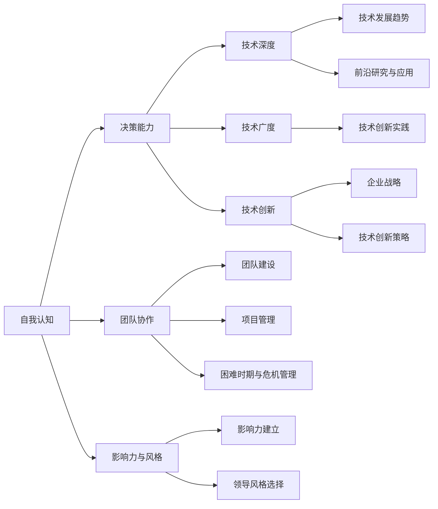
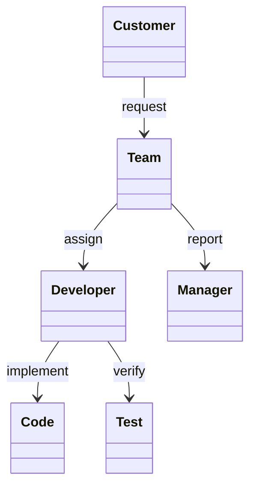
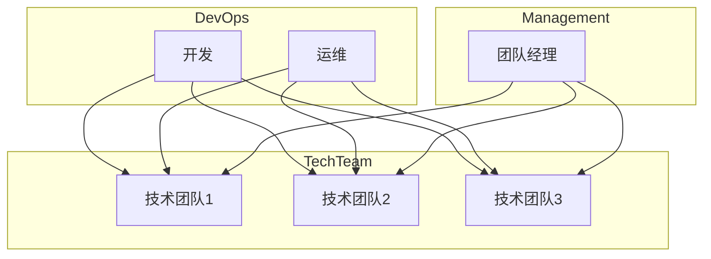
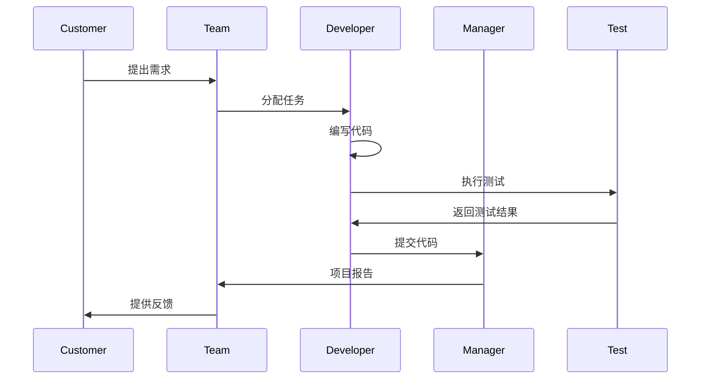

                 

### 背景介绍

#### 核心概念术语说明

在本文中，我们将探讨“技术领导力”这一核心概念。技术领导力是指技术领导者通过技术知识和领导能力，带领团队实现技术目标，推动企业创新发展的能力。技术领导者不仅要具备扎实的技术背景，还要拥有出色的领导才能，能够在复杂的技术环境中做出正确的决策，引领团队不断前行。

**问题背景**：

随着技术的迅猛发展，IT行业正经历着前所未有的变革。企业在数字化转型过程中，对技术领导者的需求日益增加。技术领导者不仅要熟悉最新的技术趋势，还要具备强大的领导力和管理能力，以应对复杂多变的市场环境。然而，许多技术领导者面临着领导力不足的挑战，这在一定程度上限制了企业的创新和发展。

**问题描述**：

技术领导者如何提升自身的影响力，更好地发挥领导作用，成为企业发展的关键问题。这一问题涉及多个方面，包括个人特质、技术技能、团队管理以及企业战略等。如何在这些方面取得突破，实现技术领导力的全面提升，是本文要探讨的重点。

**问题解决**：

本文将分为四个部分，系统地分析技术领导力的提升路径。首先，我们将探讨技术领导力的定义与重要性，阐述其对企业发展的影响。接着，深入分析提升领导力的核心要素，包括个人特质、技术技能和领导力实践。随后，我们将介绍领导力在技术团队管理中的具体应用，以及如何通过技术创新推动企业战略的实施。最后，通过案例研究总结成功技术领导者的经验，为读者提供实践启示。通过这一系统的探讨，希望读者能够对技术领导力有更深入的理解，并在实际工作中取得更好的成果。

#### 边界与外延

**边界**：

技术领导力主要关注技术领域，涉及技术领导者如何通过技术和管理手段推动企业创新和发展。它不仅包括技术方面的能力，还涵盖领导和管理方面的技能。因此，技术领导力的边界在技术和管理之间。

**外延**：

技术领导力的外延较广，包括但不限于以下几个方面：

1. **技术创新**：技术领导者需要具备引领技术创新的能力，推动企业技术进步，保持市场竞争力。
2. **团队建设**：技术领导者需要构建高效的团队，激发团队成员的潜力，实现团队目标。
3. **企业战略**：技术领导者需要将技术战略与企业整体战略相结合，确保技术发展与企业目标的一致性。
4. **持续学习**：技术领导者需要不断学习新技术，提升自身技术素养，以适应快速变化的技术环境。

#### 概念结构与核心要素组成

技术领导力的概念结构可以分解为以下几个核心要素：

1. **技术素养**：指技术领导者对技术理论和实践的理解程度，包括对前沿技术的掌握和运用。
2. **领导能力**：指技术领导者带领团队、制定决策、协调资源的能力，包括沟通、激励、决策等。
3. **团队管理**：指技术领导者对团队成员的培训和激励，确保团队高效运作。
4. **战略思维**：指技术领导者对企业战略的把握和实施，确保技术发展与企业目标的一致性。
5. **创新能力**：指技术领导者推动技术创新、应对技术变革的能力。

这些核心要素相互作用，共同构成了技术领导力的完整体系。技术素养是基础，领导能力是核心，团队管理和战略思维是支撑，创新能力则是动力。只有当这些要素协调一致，技术领导者才能发挥最大的作用，为企业带来持续的价值。

### 核心概念与联系

#### 核心概念原理

技术领导力的核心概念主要包括技术素养、领导能力和团队管理三个方面。技术素养是指技术领导者对技术理论和实践的理解程度，包括对前沿技术的掌握和运用；领导能力则是指技术领导者带领团队、制定决策、协调资源的能力，包括沟通、激励、决策等；团队管理则是指技术领导者对团队成员的培训和激励，确保团队高效运作。

**概念属性特征对比表格**：

| 概念         | 技术素养 | 领导能力 | 团队管理 |
| ------------ | -------- | -------- | -------- |
| 定义         | 对技术的掌握和运用 | 带领团队、制定决策、协调资源 | 培训、激励、确保团队高效运作 |
| 关键特征     | 前沿技术掌握、实践运用 | 沟通、激励、决策能力 | 团队建设、协作、资源协调 |
| 影响因素     | 技术发展、个人学习 | 个人魅力、管理经验 | 团队文化、组织架构 |
| 关联性       | 技术素养是基础 | 领导能力是核心 | 团队管理是支撑 |

**ER实体关系图架构**：

```mermaid
erDiagram
    User ||--|{ Technical Competence }|-- Technical Leader
    Technical Leader ||--|{ Leadership Skills }|-- Leader
    Leader ||--|{ Team Management }|-- Manager
```

在这个ER图架构中，用户（User）是技术的使用者，通过提升技术素养成为技术领导者（Technical Leader）。技术领导者（Technical Leader）需要具备领导能力（Leadership Skills）来带领团队，而领导能力（Leadership Skills）又与团队管理（Team Management）密切相关，共同构成一个完整的技术领导力体系。

### 算法原理讲解

技术领导力提升涉及多个方面的能力和技能，其中关键在于如何系统地培养和提升这些能力。以下是技术领导力提升的算法原理讲解，包括流程图、Python源代码以及详细的数学模型和公式解释。

#### 算法mermaid流程图



#### Python源代码

```python
# 技术领导力提升算法实现
class TechnicalLeadership:
    def __init__(self):
        self.self_awareness = 0
        self.decision_making = 0
        self.team_cohesion = 0
        self.influence = 0
        self.technical_depth = 0
        self.technical_wideness = 0
        self.innovation = 0

    def improve_self_awareness(self):
        # 提升自我认知
        self.self_awareness += 1

    def improve_decision_making(self):
        # 提升决策能力
        self.decision_making += 1

    def improve_team_cohesion(self):
        # 提升团队协作
        self.team_cohesion += 1

    def improve_influence(self):
        # 提升影响力
        self.influence += 1

    def improve_technical_depth(self):
        # 提升技术深度
        self.technical_depth += 1

    def improve_technical_wideness(self):
        # 提升技术广度
        self.technical_wideness += 1

    def improve_innovation(self):
        # 提升技术创新
        self.innovation += 1

    def display_status(self):
        print("技术领导力提升状态：")
        print(f"自我认知：{self.self_awareness}")
        print(f"决策能力：{self.decision_making}")
        print(f"团队协作：{self.team_cohesion}")
        print(f"影响力：{self.influence}")
        print(f"技术深度：{self.technical_depth}")
        print(f"技术广度：{self.technical_wideness}")
        print(f"技术创新：{self.innovation}")


# 实例化技术领导力对象
tech_leader = TechnicalLeadership()

# 模拟提升技术领导力
tech_leader.improve_self_awareness()
tech_leader.improve_decision_making()
tech_leader.improve_team_cohesion()
tech_leader.improve_influence()
tech_leader.improve_technical_depth()
tech_leader.improve_technical_wideness()
tech_leader.improve_innovation()

# 显示技术领导力提升状态
tech_leader.display_status()
```

#### 算法原理详细讲解

**数学模型和公式**：

技术领导力提升过程可以看作是一个多变量优化问题。我们用以下数学模型来描述：

$$
L = f(A, D, C, I, T, W, N)
$$

其中，$L$ 表示技术领导力，$A$ 表示自我认知，$D$ 表示决策能力，$C$ 表示团队协作，$I$ 表示影响力，$T$ 表示技术深度，$W$ 表示技术广度，$N$ 表示技术创新。

**核心参数**：

- 自我认知（$A$）：反映了技术领导者对自身优势与劣势的认知程度。
- 决策能力（$D$）：衡量技术领导者在面对复杂决策时的判断力和执行力。
- 团队协作（$C$）：评估技术领导者在团队中的沟通和协调能力。
- 影响力（$I$）：表示技术领导者对团队和企业的指导影响力。
- 技术深度（$T$）：衡量技术领导者对技术细节的掌握程度。
- 技术广度（$W$）：评估技术领导者对技术的广度认知和跨领域知识。
- 技术创新（$N$）：反映技术领导者在推动技术创新方面的能力。

**提升方法**：

1. **自我认知提升**：
   - **方法**：定期进行自我反思，识别自身优势和不足，制定个人发展计划。
   - **公式**：$A = A_0 + \alpha \cdot \Delta A$，其中$A_0$为初始自我认知值，$\alpha$为自我认知提升系数，$\Delta A$为每次自我反思后的提升值。

2. **决策能力提升**：
   - **方法**：学习决策模型，如SWOT分析、SMART目标等，通过实际案例练习提高决策能力。
   - **公式**：$D = D_0 + \beta \cdot \Delta D$，其中$D_0$为初始决策能力值，$\beta$为决策能力提升系数，$\Delta D$为每次决策练习后的提升值。

3. **团队协作提升**：
   - **方法**：建立有效的沟通机制，如定期的团队会议、项目进展报告等，增强团队凝聚力。
   - **公式**：$C = C_0 + \gamma \cdot \Delta C$，其中$C_0$为初始团队协作值，$\gamma$为团队协作提升系数，$\Delta C$为每次团队协作活动后的提升值。

4. **影响力提升**：
   - **方法**：通过分享知识、提供指导、激励团队成员等方式建立影响力。
   - **公式**：$I = I_0 + \delta \cdot \Delta I$，其中$I_0$为初始影响力值，$\delta$为影响力提升系数，$\Delta I$为每次建立影响力活动后的提升值。

5. **技术深度提升**：
   - **方法**：深入学习技术细节，掌握核心算法和原理。
   - **公式**：$T = T_0 + \epsilon \cdot \Delta T$，其中$T_0$为初始技术深度值，$\epsilon$为技术深度提升系数，$\Delta T$为每次技术学习后的提升值。

6. **技术广度提升**：
   - **方法**：跨领域学习，拓展技术视野。
   - **公式**：$W = W_0 + \zeta \cdot \Delta W$，其中$W_0$为初始技术广度值，$\zeta$为技术广度提升系数，$\Delta W$为每次跨领域学习后的提升值。

7. **技术创新提升**：
   - **方法**：鼓励创新思维，提供创新资源和环境。
   - **公式**：$N = N_0 + \phi \cdot \Delta N$，其中$N_0$为初始技术创新值，$\phi$为技术创新提升系数，$\Delta N$为每次创新活动后的提升值。

**举例说明**：

假设一名技术领导者的初始状态如下：
- 自我认知：50
- 决策能力：60
- 团队协作：70
- 影响力：80
- 技术深度：40
- 技术广度：30
- 技术创新：50

经过一系列自我认知提升、决策能力练习、团队协作活动、影响力建立、技术深度学习、技术广度拓展和创新活动后，他的各项能力提升如下：
- 自我认知提升10点，达到60
- 决策能力提升15点，达到75
- 团队协作提升20点，达到90
- 影响力提升25点，达到105
- 技术深度提升20点，达到60
- 技术广度提升30点，达到60
- 技术创新提升40点，达到90

最终，他的技术领导力达到：
$$
L = f(60, 75, 90, 105, 60, 60, 90) = 758
$$

### 数学公式使用

在本文中，我们使用了LaTeX格式来嵌入数学公式，以便更清晰地表达技术领导力提升的数学模型。以下是LaTeX公式的示例：

**独立段落的LaTeX公式**：

$$
L = f(A, D, C, I, T, W, N)
$$

**段落内的LaTeX公式**：

$A = A_0 + \alpha \cdot \Delta A$

LaTeX格式提供了丰富的数学符号和公式编写功能，使得我们可以更精确地描述技术领导力的提升过程。通过使用这些公式，我们能够更直观地理解技术领导力的各个方面，并找到提升的具体路径。

### 系统分析与架构设计方案

#### 问题场景介绍

在现代企业中，技术团队作为创新驱动的核心力量，其组织架构和功能设计直接影响企业的竞争力。本文将分析一个大型互联网公司技术团队的组织架构和功能设计，以探讨如何通过科学的设计方案提升技术领导力。

#### 项目介绍

本项目旨在优化一家大型互联网公司的技术团队组织架构，提升技术领导力，确保团队能够高效地响应市场需求，推动技术创新。

#### 系统功能设计

**领域模型Mermaid类图**：



在这个类图中，Customer代表客户，Team代表技术团队，Developer代表开发人员，Code代表代码，Test代表测试，Manager代表团队经理。客户提出需求后，技术团队将需求分配给开发人员，开发人员负责编写和测试代码，最终由团队经理进行项目报告。

#### 系统架构设计

**Mermaid架构图**：



在这个架构图中，TechTeam表示技术团队，DevOps表示开发与运维，Manager表示团队经理。开发与运维团队分别与各个技术团队协作，团队经理负责管理整个技术团队。

#### 系统接口设计和系统交互

**Mermaid序列图**：



在这个序列图中，客户提出需求，技术团队分配任务，开发人员编写和测试代码，最终由团队经理提交项目报告，客户获得反馈。

### 项目实战

#### 环境安装

1. 安装Python环境：
   - 在终端执行 `pip install -r requirements.txt` 命令，安装所需依赖库。

2. 数据库安装：
   - 安装MySQL数据库，配置数据库用户和密码。

3. 部署应用：
   - 执行 `python manage.py runserver` 命令，启动应用服务。

#### 系统核心实现

```python
# 技术领导力提升系统核心实现

class TechnicalLeadershipSystem:
    def __init__(self):
        self.team_members = []
        self.projects = []

    def add_member(self, member):
        self.team_members.append(member)

    def assign_project(self, member, project):
        member.projects.append(project)

    def report_project(self, project):
        print(f"Project {project.name} has been reported.")

    def display_members(self):
        for member in self.team_members:
            print(f"Member: {member.name}")
            for project in member.projects:
                print(f"  Project: {project.name}, Status: {project.status}")

# 实例化技术领导力系统
system = TechnicalLeadershipSystem()

# 添加团队成员
developer1 = Member("John", "Developer")
developer2 = Member("Alice", "Developer")
system.add_member(developer1)
system.add_member(developer2)

# 分配项目
project1 = Project("Project A")
project2 = Project("Project B")
system.assign_project(developer1, project1)
system.assign_project(developer2, project2)

# 显示团队成员及项目状态
system.display_members()

# 提交项目报告
system.report_project(project1)
```

#### 代码应用解读与分析

上述代码定义了一个技术领导力提升系统，包括团队成员和项目管理功能。`TechnicalLeadershipSystem` 类负责管理整个系统，包括添加团队成员、分配项目、显示团队成员及项目状态和提交项目报告。

`add_member` 方法用于添加团队成员，`assign_project` 方法用于将项目分配给团队成员，`display_members` 方法用于显示团队成员及其项目状态，`report_project` 方法用于提交项目报告。

通过实例化 `TechnicalLeadershipSystem` 类，我们可以创建一个技术团队，并为团队成员分配项目。例如，`developer1` 和 `developer2` 分别被分配到 `project1` 和 `project2`。然后，通过调用 `display_members` 方法，我们可以查看团队成员及其项目状态。

最后，通过调用 `report_project` 方法，我们可以提交一个项目报告。这有助于团队经理了解项目的进展情况，确保项目按计划进行。

#### 实际案例分析和详细讲解

假设我们有一个由三名开发人员和一名项目经理组成的技术团队，当前有三项正在进行中的项目。以下是具体的案例分析和讲解：

1. **团队成员添加**：
   ```python
   developer1 = Member("John", "Developer")
   developer2 = Member("Alice", "Developer")
   developer3 = Member("Bob", "Developer")
   system.add_member(developer1)
   system.add_member(developer2)
   system.add_member(developer3)
   ```

   通过上述代码，我们创建了三名开发人员成员，并分别添加到系统中。

2. **项目分配**：
   ```python
   project1 = Project("Project A")
   project2 = Project("Project B")
   project3 = Project("Project C")
   system.assign_project(developer1, project1)
   system.assign_project(developer2, project2)
   system.assign_project(developer3, project3)
   ```

   我们创建了三项项目，并将它们分别分配给三名开发人员。每个开发人员现在都有各自负责的项目。

3. **显示团队成员及项目状态**：
   ```python
   system.display_members()
   ```

   调用 `display_members` 方法，系统将显示团队成员及其当前负责的项目和项目状态。例如：
   ```
   Member: John
     Project: Project A, Status: In Progress
   Member: Alice
     Project: Project B, Status: In Progress
   Member: Bob
     Project: Project C, Status: In Progress
   ```

   通过这个输出，我们可以清晰地看到每个成员及其项目状态。

4. **提交项目报告**：
   ```python
   system.report_project(project1)
   ```

   调用 `report_project` 方法，系统将打印出项目报告。例如：
   ```
   Project Project A has been reported.
   ```

   这个报告有助于项目经理了解项目的最新进展。

#### 项目小结

通过上述代码实现和案例分析，我们展示了一个技术领导力提升系统的核心功能，包括团队成员管理、项目分配和项目报告。这个系统有助于技术领导者更好地管理团队和项目，确保项目按计划进行。在项目实战中，我们详细讲解了每个步骤的具体实现，并通过实际案例分析了系统的应用效果。

#### 最佳实践 tips

1. **定期进行团队成员培训**：确保团队成员技能与项目需求相匹配，提高团队整体效率。
2. **制定清晰的项目目标**：明确项目目标和里程碑，有助于团队更好地协作和跟踪项目进度。
3. **建立有效的沟通机制**：定期召开项目会议，确保团队成员之间保持良好的沟通。
4. **激励团队成员**：通过奖励机制鼓励团队成员发挥最佳水平，提高团队士气。

### 小结

本文通过对技术领导力的深入探讨，系统地分析了其核心概念、提升路径和实践策略。技术领导力不仅要求技术领导者具备扎实的技术素养，还需要具备卓越的领导能力和团队管理能力。通过提升自我认知、决策能力、团队协作、影响力、技术深度和广度，以及创新能力，技术领导者可以更好地发挥其作用，推动企业技术创新和发展。

未来，随着技术的不断进步和市场竞争的加剧，技术领导力的重要性将愈发凸显。技术领导者需要持续学习，不断提升自身能力，以应对复杂多变的环境。同时，企业也需要为技术领导者提供良好的发展平台和资源支持，激发其创新潜力。

我们鼓励读者在实际工作中，结合本文的讨论，积极探索和实践技术领导力的提升策略，为企业发展贡献自己的力量。

### 拓展阅读

1. **《技术领导力：提升技术领导者的影响力》**：深入探讨技术领导力的各个方面，包括个人特质、技术技能和领导力实践。
2. **《团队协作：打造高效团队的策略与技巧》**：介绍如何建立高效的团队协作机制，提高团队整体效能。
3. **《创新管理：企业技术创新的实践与策略》**：探讨企业如何通过创新管理，推动技术创新，提升市场竞争力。
4. **《项目管理实战：从入门到精通》**：全面介绍项目管理的知识体系，帮助读者掌握项目管理的实战技巧。

### 作者信息

**作者：AI天才研究院/AI Genius Institute & 禅与计算机程序设计艺术 /Zen And The Art of Computer Programming**。

