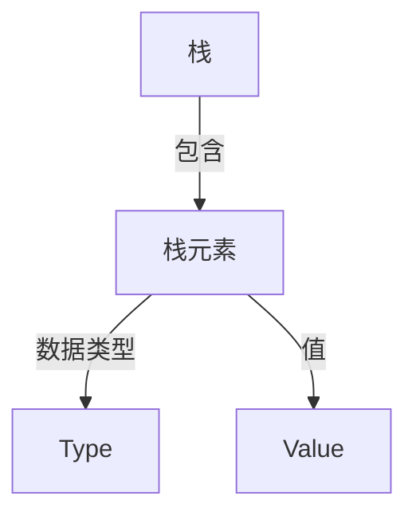

                 

### 抽象数据类型与代数规范：引论

在计算机科学和软件工程中，抽象数据类型（Abstract Data Type，简称ADT）和代数规范（Algebraic Specification）是两个重要的概念，它们在设计和实现复杂系统时起到了至关重要的作用。本文将深入探讨这两个概念，以及它们在实际应用中的重要性。

#### 什么是抽象数据类型？

抽象数据类型是一种抽象的概念，它定义了一组操作和一组规则，这些规则描述了如何使用这些操作来处理数据。ADT的核心在于它的抽象性，即它隐藏了实现细节，只暴露出操作接口，使得使用ADT的开发者无需关心底层的实现过程。

例如，整数类型是一种抽象数据类型，它提供了一组操作，如加法、减法、乘法和除法，以及一组规则来确保这些操作的正确性。开发者可以使用整数类型进行数学运算，而不需要了解底层的二进制表示或硬件实现。

#### 什么是代数规范？

代数规范是一种用于描述抽象数据类型和它们的操作、关系的数学方法。它使用代数表达式来定义数据类型和操作，并通过一组公理（一组等式）来验证这些定义的正确性。

代数规范的好处在于，它提供了一种形式化的方法来描述数据类型，使得设计者在早期阶段就能够发现潜在的错误或缺陷。此外，代数规范还支持自动化验证，使得某些验证任务可以由计算机来完成，从而提高设计过程的效率和准确性。

#### 为什么需要抽象数据类型和代数规范？

1. **可重用性和可维护性**：通过使用抽象数据类型，开发者可以将复杂的数据处理逻辑封装起来，形成模块化的组件。这不仅提高了代码的可重用性，还使得代码的维护变得更加简单。
   
2. **清晰性**：抽象数据类型和代数规范使得系统的设计更加清晰。开发者可以专注于高层抽象，而无需陷入底层的实现细节。

3. **正确性验证**：代数规范提供了一种形式化的验证方法，可以帮助开发者确保系统的设计是正确的。

4. **灵活性**：通过使用抽象数据类型，开发者可以在不影响其他部分的情况下替换底层的实现，从而提高了系统的灵活性。

#### 本文结构

本文将分为两部分进行探讨。第一部分将介绍抽象数据类型的基础知识，包括其定义、重要性以及分类。我们将详细讨论一些基本的抽象数据类型，如整数类型、字符串类型和列表类型，以及一些高级的抽象数据类型，如树结构、图结构和集合类型。

第二部分将介绍代数规范的基础概念，包括其定义、基本概念和应用。我们将讨论如何使用代数规范来设计抽象数据类型，并探讨代数规范与软件工程的关系。此外，我们还将提供一个抽象数据类型的实现案例，以帮助读者更好地理解这些概念。

通过本文的阅读，读者将能够深入理解抽象数据类型和代数规范，并掌握它们在实际软件开发中的应用。

### 抽象数据类型基础

#### 抽象数据类型概述

抽象数据类型（Abstract Data Type，ADT）是计算机科学中的一个核心概念，它定义了一组值的集合和一组对这种值进行操作的计算。ADT的关键特征在于其抽象性，即它将数据的具体表示和操作实现细节隐藏起来，只暴露出必要的数据操作接口。这种抽象性使得ADT的使用者（通常是开发者）无需了解底层的实现细节，从而简化了系统设计和开发过程。

**定义**：抽象数据类型可以形式化地定义为三元组（D, O, R），其中：

- **D**（数据集合）表示ADT可以操作的数据集合。
- **O**（操作集合）表示对数据集合进行操作的集合。
- **R**（规则集合）表示操作之间的约束条件，确保操作的合法性和一致性。

例如，整数类型（Integer ADT）可以定义为一个三元组（Z, {+, -, *, /}, {x + y = y + x, x - y = -(y - x), x * y = y * x}），其中Z表示整数集合，+、-、*、/表示操作集合，而规则集合确保了加法、减法、乘法和除法操作满足交换律、结合律和分配律等基本数学性质。

**重要性**：

1. **封装性**：ADT通过封装数据和处理逻辑，将内部实现细节与外部接口分离，从而提高了系统的模块化和可维护性。
2. **抽象性**：ADT允许开发者从高层次抽象出发，专注于系统设计的关键问题，而无需担心底层实现。
3. **灵活性**：ADT使得系统的实现可以灵活地替换，不影响其他部分的运行，从而提高了系统的可扩展性。

#### 抽象数据类型的分类

根据抽象数据类型所处理的数据结构和操作特点，可以分为以下几类：

1. **基本抽象数据类型**：这类ADT是最基本的，它们提供最常见的数据操作。例如，整数类型、浮点数类型、字符类型等。这些ADT通常在编程语言中内建提供。

2. **组合抽象数据类型**：这类ADT是由基本ADT组合而成的，如列表、数组、堆栈、队列等。组合ADT通过基本ADT的操作来实现复杂的操作，如插入、删除、排序等。

3. **高级抽象数据类型**：这类ADT用于处理更复杂的数据结构和操作，如树结构（二叉树、AVL树等）、图结构（无向图、有向图等）、集合类型（离散数学中的集合操作）等。高级ADT通常需要更复杂的算法和数据结构支持。

**基本抽象数据类型**：

- **整数类型**：用于表示整数，提供加法、减法、乘法和除法等基本运算。
- **字符串类型**：用于表示字符序列，提供字符串的连接、比较、查找等操作。
- **列表类型**：用于表示元素的序列，提供插入、删除、查找等操作。

**组合抽象数据类型**：

- **数组**：固定大小的数据集合，提供随机访问和元素插入、删除等操作。
- **链表**：动态大小的数据集合，通过节点链接实现元素插入、删除等操作。
- **堆栈**：后进先出（LIFO）的数据结构，提供push（压入）和pop（弹出）操作。
- **队列**：先进先出（FIFO）的数据结构，提供enqueue（入队）和dequeue（出队）操作。

**高级抽象数据类型**：

- **树结构**：用于表示层次结构，常见的有二叉树、AVL树、红黑树等。
- **图结构**：用于表示网络或复杂关系，常见的有邻接矩阵和邻接表表示。
- **集合类型**：用于表示无序和无重复元素的集合，提供插入、删除、查找等操作。

通过上述分类，我们可以看到抽象数据类型在计算机科学中的多样性和广泛性。接下来，我们将详细讨论一些常见的抽象数据类型，包括它们的定义、操作和示例。

#### 基本抽象数据类型

基本抽象数据类型是构建复杂数据结构和算法的基础，它们提供了最常见和最基础的数据操作。在编程语言中，这些ADT通常是内建的，并且被广泛使用。本节将详细讨论几种常见的基本抽象数据类型：整数类型、字符串类型和列表类型。

##### 整数类型

整数类型是计算机中最基本的数值类型，用于表示整数。在大多数编程语言中，整数类型分为有符号和无符号两种，以及不同的大小（如8位、16位、32位等）。

**定义**：整数类型可以形式化地定义为（Z, {+, -, *, /}, {x + y = y + x, x - y = -(y - x), x * y = y * x}），其中Z表示整数集合，+、-、*、/表示操作集合，而规则集合确保了加法、减法、乘法和除法操作满足交换律、结合律和分配律等基本数学性质。

**操作**：

- **加法（+）**：用于两个整数的加法运算，结果是一个新的整数。
- **减法（-）**：用于两个整数的减法运算，结果是一个新的整数。
- **乘法（*）**：用于两个整数的乘法运算，结果是一个新的整数。
- **除法（/）**：用于两个整数的除法运算，结果是一个新的整数（在某些编程语言中，如果除数是0，则可能抛出异常）。

**示例**：

```python
# Python示例

# 整数类型操作示例
a = 5
b = 10
c = a + b  # 加法操作
d = a - b  # 减法操作
e = a * b  # 乘法操作
f = a / b  # 除法操作

print(c)  # 输出：15
print(d)  # 输出：-5
print(e)  # 输出：50
print(f)  # 输出：0.5
```

##### 字符串类型

字符串类型用于表示字符序列，是文本处理和数据处理的基础。在大多数编程语言中，字符串类型是不可变的，这意味着一旦创建，字符串的值就不能更改。

**定义**：字符串类型可以形式化地定义为（Σ*, {+, -, *, /}, {x + y = y + x, x * n = x repeated n times}），其中Σ*表示所有可能的字符序列集合，+、-、*、/表示操作集合，而规则集合确保了字符串连接、重复操作的正确性。

**操作**：

- **连接（+）**：用于将两个字符串连接在一起，结果是一个新的字符串。
- **子串（-）**：用于从一个字符串中提取子串，结果是一个新的字符串。
- **重复（*）**：用于将一个字符串重复多次，结果是一个新的字符串。
- **比较（==，!=）**：用于比较两个字符串是否相等，返回布尔值。

**示例**：

```python
# Python示例

# 字符串类型操作示例
s1 = "Hello"
s2 = "World"
s3 = s1 + s2  # 连接操作
s4 = s1[-3:]  # 子串操作
s5 = s1 * 3   # 重复操作
s6 = s1 == s2  # 比较操作

print(s3)  # 输出：HelloWorld
print(s4)  # 输出：lo
print(s5)  # 输出：HelloHelloHello
print(s6)  # 输出：False
```

##### 列表类型

列表类型用于表示元素的序列，是编程中最常用的数据结构之一。列表可以是固定大小的，也可以是动态大小的，常见的操作包括插入、删除、查找等。

**定义**：列表类型可以形式化地定义为（L, {+, -, *, /}, {x + y = y + x, x - y = empty}），其中L表示列表集合，+、-、*、/表示操作集合，而规则集合确保了列表连接、删除操作的正确性。

**操作**：

- **插入（+）**：用于在列表的末尾添加一个元素，结果是一个新的列表。
- **删除（-）**：用于从列表中删除一个元素，结果是一个新的列表。
- **查找（*）**：用于在列表中查找一个元素，结果是一个布尔值。
- **长度（len）**：用于获取列表的长度，结果是一个整数。

**示例**：

```python
# Python示例

# 列表类型操作示例
l1 = [1, 2, 3]
l2 = [4, 5, 6]
l3 = l1 + l2  # 插入操作
l4 = l1 - [2]  # 删除操作
l5 = 3 in l1  # 查找操作
l6 = len(l1)  # 长度操作

print(l3)  # 输出：[1, 2, 3, 4, 5, 6]
print(l4)  # 输出：[1, 3]
print(l5)  # 输出：True
print(l6)  # 输出：3
```

通过上述示例，我们可以看到整数类型、字符串类型和列表类型是编程中最基本的数据类型，它们提供了丰富的操作和功能，使得开发者能够高效地处理各种数据问题。

接下来，我们将进一步探讨一些高级抽象数据类型，如树结构和图结构，以及它们的应用和特点。

#### 高级抽象数据类型

高级抽象数据类型（Advanced Abstract Data Types，ADTs）提供了比基本抽象数据类型更复杂的数据结构和操作。它们广泛应用于各种领域，如计算机科学、网络、图形处理和算法设计。本节将介绍一些常见的高级抽象数据类型，包括树结构、图结构和集合类型。

##### 树结构

树结构（Tree Structures）是一种广泛使用的抽象数据类型，用于表示具有层次关系的元素集合。树结构中的每个元素称为节点（Node），每个节点可以有零个或多个子节点。

**定义**：树结构可以形式化地定义为（T, {root, insert, delete, search, traverse}），其中T表示树集合，root表示获取根节点的操作，insert表示插入节点的操作，delete表示删除节点的操作，search表示查找节点的操作，traverse表示遍历节点的操作。

**操作**：

- **根节点（root）**：返回树的根节点。
- **插入（insert）**：在树中插入一个新的节点，可能需要考虑平衡树的要求。
- **删除（delete）**：从树中删除一个节点，可能需要重新平衡树。
- **查找（search）**：在树中查找具有特定值的节点。
- **遍历（traverse）**：对树进行遍历，常见的方法有前序遍历、中序遍历和后序遍历。

**示例**：二叉搜索树（Binary Search Tree）是一种常见的树结构，它满足以下条件：

- 左子树中的所有节点的值都小于根节点的值。
- 右子树中的所有节点的值都大于根节点的值。
- 左、右子树也是二叉搜索树。

```python
# Python示例

class Node:
    def __init__(self, value):
        self.value = value
        self.left = None
        self.right = None

def insert(node, value):
    if value < node.value:
        if node.left is None:
            node.left = Node(value)
        else:
            insert(node.left, value)
    else:
        if node.right is None:
            node.right = Node(value)
        else:
            insert(node.right, value)

def inorder_traversal(node):
    if node is not None:
        inorder_traversal(node.left)
        print(node.value, end=' ')
        inorder_traversal(node.right)

# 创建二叉搜索树
root = Node(5)
insert(root, 3)
insert(root, 7)
insert(root, 2)
insert(root, 4)
insert(root, 6)
insert(root, 8)

# 中序遍历
inorder_traversal(root)
```

##### 图结构

图结构（Graph Structures）用于表示具有复杂关系的元素集合。在图结构中，每个元素称为顶点（Vertex），顶点之间的关系称为边（Edge）。图结构可以表示网络、社会关系、流程图等多种复杂关系。

**定义**：图结构可以形式化地定义为（G, {add_vertex, add_edge, remove_vertex, remove_edge, search}），其中G表示图集合，add_vertex表示添加顶点的操作，add_edge表示添加边的操作，remove_vertex表示删除顶点的操作，remove_edge表示删除边的操作，search表示查找顶点的操作。

**操作**：

- **添加顶点（add_vertex）**：在图中添加一个新的顶点。
- **添加边（add_edge）**：在两个顶点之间添加一条边。
- **删除顶点（remove_vertex）**：从图中删除一个顶点及其关联的边。
- **删除边（remove_edge）**：从图中删除一条边。
- **查找（search）**：在图中查找具有特定属性的顶点。

**示例**：邻接表（Adjacency List）是一种常用的图结构表示方法，其中每个顶点是一个列表，包含与该顶点相连的其他顶点。

```python
# Python示例

class Graph:
    def __init__(self):
        self.vertices = {}

    def add_vertex(self, vertex):
        if vertex not in self.vertices:
            self.vertices[vertex] = []

    def add_edge(self, vertex1, vertex2):
        if vertex1 in self.vertices and vertex2 in self.vertices:
            self.vertices[vertex1].append(vertex2)
            self.vertices[vertex2].append(vertex1)

    def display(self):
        for vertex, edges in self.vertices.items():
            print(f"{vertex}: {edges}")

# 创建图
g = Graph()
g.add_vertex("A")
g.add_vertex("B")
g.add_vertex("C")
g.add_vertex("D")
g.add_edge("A", "B")
g.add_edge("B", "C")
g.add_edge("C", "D")
g.add_edge("D", "A")

# 显示图
g.display()
```

##### 集合类型

集合类型（Set Types）用于表示无序和无重复元素的集合。集合类型在离散数学、算法分析和数据结构设计中非常重要。

**定义**：集合类型可以形式化地定义为（S, {insert, remove, search}），其中S表示集合集合，insert表示插入元素的操作，remove表示删除元素的操作，search表示查找元素的操作。

**操作**：

- **插入（insert）**：在集合中插入一个新的元素。
- **删除（remove）**：从集合中删除一个元素。
- **查找（search）**：在集合中查找具有特定属性的元素。

**示例**：Python中的集合（set）数据结构是一个内置的集合类型实现，提供了高效的插入、删除和查找操作。

```python
# Python示例

# 创建集合
s = {1, 2, 3, 4, 5}

# 插入元素
s.add(6)
s.add(7)

# 删除元素
s.remove(2)

# 查找元素
print(3 in s)  # 输出：True
print(8 in s)  # 输出：False
```

通过上述示例，我们可以看到高级抽象数据类型如树结构、图结构和集合类型提供了丰富的功能，能够处理更复杂的数据关系和操作。这些数据结构在计算机科学中有着广泛的应用，对于算法设计和系统实现具有重要意义。

接下来，我们将进一步探讨代数规范的基础知识，以及它们在抽象数据类型设计中的应用。

### 代数规范基础

代数规范（Algebraic Specification）是一种形式化的方法，用于描述数据类型和算法。它通过代数表达式和公理来定义数据类型和它们的操作，提供了一种清晰、准确且易于验证的设计工具。本节将介绍代数规范的基本概念、基本组成以及它们在抽象数据类型设计中的应用。

#### 什么是代数规范？

代数规范起源于形式化数学和代数结构理论，它提供了一种方法来描述抽象数据类型和它们的操作行为。代数规范的核心在于使用代数表达式和公理来定义数据类型和它们之间的操作关系。

**定义**：代数规范是一种用于描述抽象数据类型的形式化方法，它通过代数表达式来定义数据类型和操作，并通过一组公理来确保操作的合法性和一致性。代数规范通常包含以下三个部分：

1. **数据类型的定义**：使用代数表达式定义数据类型，这些表达式描述了数据类型的结构。
2. **操作的定义**：使用代数表达式定义对数据类型进行操作的方式。
3. **公理**：定义操作之间的关系和约束条件，确保操作的合法性和一致性。

例如，一个简单的整数类型代数规范可以定义为：

- **数据类型**：Z = {0, 1, 2, ...}
- **操作**：
  - succ(x): x的后续值
  - pred(x): x的前驱值
- **公理**：
  - succ(0) = 1
  - succ(succ(x)) = succ(x)
  - pred(1) = 0
  - pred(pred(x)) = pred(x)

这些代数表达式和公理定义了整数类型的结构和操作，并确保了这些操作的一致性。

#### 代数规范的基本组成

代数规范由以下几个基本组成部分构成：

1. **等价关系**：用于定义数据类型的结构，如整数类型中的自然数集合。
2. **函数**：用于定义数据类型上的操作，如整数类型中的加法、减法等。
3. **公理**：用于定义操作之间的关系和约束条件，如整数类型中的交换律、结合律等。

**等价关系**：等价关系是一种关系，用于将集合中的元素划分为相等的类别。在代数规范中，等价关系用于定义数据类型的结构。例如，整数类型可以通过自然数集合的等价关系来定义。

**函数**：函数是数学中的一个基本概念，它将一个集合中的每个元素映射到另一个集合中的一个元素。在代数规范中，函数用于定义数据类型上的操作。例如，整数类型中的加法、减法等操作可以通过函数来定义。

**公理**：公理是数学或逻辑中的一个基本原理，用于定义操作之间的关系和约束条件。在代数规范中，公理用于确保操作的一致性和合法性。例如，整数类型中的交换律、结合律等可以通过公理来定义。

#### 代数规范的应用

代数规范在抽象数据类型设计中有广泛的应用，主要包括以下几个方面：

1. **验证**：代数规范提供了一种形式化的验证方法，可以确保设计的抽象数据类型满足预定的约束条件。通过验证，开发人员可以早期发现和修复错误，从而提高系统的可靠性和正确性。
2. **规格说明**：代数规范可以作为抽象数据类型的规格说明，帮助开发者理解数据类型的行为和操作。这种规格说明不仅适用于开发者，也可以用于测试、文档和自动化工具。
3. **实现**：代数规范为抽象数据类型的实现提供了一种模板，可以用于自动生成代码或指导手写代码。通过代数规范，开发者可以更高效地实现抽象数据类型，并确保实现与规范的一致性。

例如，我们可以使用代数规范来定义和验证一个栈（Stack）抽象数据类型：

- **数据类型**：S = {empty, (x, s)}
- **操作**：
  - push(s, x): 将元素x插入到栈s的顶部，返回新的栈。
  - pop(s): 从栈s的顶部删除元素，返回新的栈和删除的元素。
- **公理**：
  - push(empty, x) = (x, empty)
  - push((x, s), y) = (y, (x, s))
  - pop((x, empty)) = (empty, x)
  - pop((x, s)) = (x, pop(s))

通过上述代数规范，我们可以验证栈的操作是否一致，并确保其实现满足定义。

综上所述，代数规范是一种重要的抽象数据类型设计工具，它通过形式化的方法描述数据类型和操作，提供了一种验证、规格说明和实现抽象数据类型的有效手段。在接下来的章节中，我们将进一步探讨如何使用代数规范来设计抽象数据类型。

### 抽象数据类型设计原则

设计抽象数据类型（Abstract Data Types，ADTs）是软件开发中的一项关键任务，它直接影响系统的可维护性、可扩展性和性能。为了确保抽象数据类型的有效性和可靠性，设计者需要遵循一系列重要的设计原则。以下是一些核心原则，包括简洁性、一致性和可扩展性：

#### 简洁性

简洁性是抽象数据类型设计中的一个基本原则，它要求设计者应尽量减少冗余和复杂性，使ADT的实现和操作更加直观和易于理解。

**重要性**：

- **减少学习成本**：简洁的ADT使得开发者更容易理解和掌握，从而降低了学习成本。
- **提高维护性**：简洁的ADT减少了代码的复杂度，使得维护和修改变得更加简单。
- **减少错误**：简洁的ADT降低了代码中潜在的错误数量，因为复杂的实现往往更容易隐藏问题。

**实践方法**：

- **最小化操作数量**：只定义和实现必要的操作，避免不必要的复杂性。
- **清晰命名**：为操作和变量使用有意义的命名，使代码更加易读。
- **避免过度抽象**：过度抽象可能导致代码难以理解和维护，应保持适当的抽象层次。

#### 一致性

一致性是指抽象数据类型的操作和规则应保持一致，确保在所有情况下都能产生预期的结果。

**重要性**：

- **提高可靠性**：一致的操作和规则确保了系统在不同情况下都能正常运行，提高了系统的可靠性。
- **简化测试**：一致的ADT使得测试变得更加简单和高效，因为测试者只需关注少数关键场景。
- **减少错误**：一致的ADT减少了由于不一致性引起的错误，提高了系统的稳定性。

**实践方法**：

- **操作定义清晰**：为每个操作定义明确的输入和输出，避免模糊或不明确的定义。
- **避免副作用**：操作不应产生意外的副作用，即不应改变外部状态。
- **一致性约束**：确保所有操作都满足预定的约束条件，如交换律、结合律等。

#### 可扩展性

可扩展性是指抽象数据类型应设计为易于扩展和修改，以适应未来需求的变化。

**重要性**：

- **适应变化**：系统的需求往往会随时间变化，可扩展的ADT能够适应这些变化，而无需大量重写代码。
- **提高维护性**：可扩展的ADT使得维护和升级变得更加容易，因为可以在不影响其他部分的情况下进行修改。
- **减少风险**：通过模块化和可扩展性，可以将变化的风险降低到最小。

**实践方法**：

- **模块化设计**：将ADT拆分成多个模块，每个模块负责不同的功能，便于独立修改和扩展。
- **使用接口**：通过定义清晰的接口，将实现细节与接口分离，使得实现可以在不影响其他部分的情况下进行替换。
- **可配置性**：设计可配置的ADT，允许通过配置文件或参数来调整行为，从而适应不同的需求。

通过遵循简洁性、一致性和可扩展性等原则，开发者可以设计出更加高效、可靠和灵活的抽象数据类型，为系统的长期发展和维护奠定坚实的基础。

### 抽象数据类型设计方法

在设计和实现抽象数据类型（Abstract Data Type，ADT）时，采用科学合理的方法至关重要。不同的设计方法适用于不同的应用场景，下面介绍几种常见的设计方法：类比法、构造型方法和扩展法。

#### 类比法

类比法是一种通过比较和借鉴现有数据类型的设计方法，适用于新数据类型与现有数据类型具有相似性质的情况。

**定义**：类比法是通过分析现有数据类型的结构和操作，借鉴其设计思路来设计新数据类型的方法。

**步骤**：

1. **识别相似性质**：分析现有数据类型的属性和操作，识别与新数据类型相似的性质。
2. **借鉴设计思路**：借鉴现有数据类型的设计思路，包括数据结构、操作定义和约束条件。
3. **调整和优化**：根据新数据类型的特点，对借鉴的设计进行调整和优化，以满足具体需求。

**示例**：设计一个堆（Heap）数据类型，可以类比二叉搜索树（BST）的设计。

- **相似性质**：堆和二叉搜索树都具有层次结构，可以通过比较和插入操作维持某种排序关系。
- **借鉴设计**：借鉴二叉搜索树的插入和删除操作，以及平衡树的结构。
- **调整和优化**：堆通常使用完全二叉树来实现，并在插入和删除操作后进行必要的调整，以确保堆的性质。

#### 构造型方法

构造型方法是一种通过组合和构造现有数据类型来设计新数据类型的方法，适用于新数据类型具有复杂结构的情况。

**定义**：构造型方法是通过组合和构造现有数据类型，形成新的复合数据类型的方法。

**步骤**：

1. **识别组成部分**：分析新数据类型的结构，识别其组成部分和各个部分之间的关系。
2. **组合数据类型**：将各个部分组合成一个整体，确保每个部分都能独立工作，同时满足整体的设计要求。
3. **定义接口和操作**：为复合数据类型定义接口和操作，确保用户可以通过这些接口来使用和操作新数据类型。

**示例**：设计一个复合列表（Composite List）数据类型，由多个基本列表组成。

- **组成部分**：基本列表和合并操作。
- **组合数据类型**：将多个基本列表通过合并操作组合成一个复合列表。
- **定义接口和操作**：定义insert、delete、search等基本操作，以及merge操作，用于合并基本列表。

#### 扩展法

扩展法是一种通过在现有数据类型上扩展功能来设计新数据类型的方法，适用于在现有数据类型基础上添加新功能的情况。

**定义**：扩展法是在现有数据类型的基础上，通过添加新的操作或属性来设计新数据类型的方法。

**步骤**：

1. **分析现有数据类型**：了解现有数据类型的功能和限制。
2. **定义新功能**：根据需求，定义新数据类型所需的新功能或操作。
3. **实现扩展**：在现有数据类型的基础上实现新功能，确保扩展不会破坏原有功能。

**示例**：扩展整数类型（Integer ADT），添加一个新的操作，如求平方和。

- **现有数据类型**：整数类型提供加法、减法、乘法和除法等操作。
- **新功能**：添加求平方和的操作，即计算一系列整数的平方和。
- **实现扩展**：在现有整数类型的基础上，实现一个新的操作函数，用于计算平方和。

通过类比法、构造型方法和扩展法，开发者可以根据不同的设计需求，选择合适的方法来设计和实现抽象数据类型，从而提高系统的灵活性和扩展性。

### 代数规范与抽象数据类型的实现

在设计和实现抽象数据类型（Abstract Data Types，ADTs）时，代数规范（Algebraic Specifications）提供了重要的指导。通过代数规范，开发者可以确保ADT的设计是正确和一致的，并且在实现过程中可以遵循这些规范，从而提高系统的可靠性和可维护性。本节将详细讨论代数规范与抽象数据类型的实现流程，包括概念实体关系架构设计、抽象数据类型定义和实现。

#### 概念实体关系架构设计

概念实体关系架构设计是代数规范实现的第一步，它帮助开发者明确系统的核心概念和实体之间的关系。通过使用Mermaid流程图，我们可以直观地表示这些关系。

**步骤**：

1. **识别概念实体**：分析ADT的需求，识别核心的概念实体。例如，在实现一个栈（Stack）ADT时，核心实体可能包括栈元素和数据结构本身。
2. **定义实体属性**：为每个概念实体定义属性，这些属性描述了实体的特征。例如，对于栈元素，属性可能包括值和数据类型。
3. **建立关系**：定义实体之间的关系，如包含、依赖等。在栈ADT中，栈元素是栈的组成部分，因此存在包含关系。

**示例**：



在这个示例中，我们定义了栈和栈元素两个实体，并建立了栈包含栈元素的关系，以及栈元素的数据类型和值属性。

#### 抽象数据类型定义

一旦完成了概念实体关系架构设计，下一步是定义抽象数据类型。这包括定义数据类型、操作以及它们之间的关系和约束条件。

**步骤**：

1. **定义数据类型**：使用代数表达式定义数据类型，例如，整数类型可以表示为Z = {0, 1, 2, ...}。
2. **定义操作**：为每个数据类型定义操作，如加法（+）、减法（-）等。操作应包括参数和返回值。
3. **定义约束条件**：使用公理和规则定义操作之间的关系和约束条件，确保操作的一致性和合法性。

**示例**：

```mermaid
graph TD
    Z[整数类型] --> |操作| Add[Z, Z] --> |返回| Z
    Z --> |操作| Sub[Z, Z] --> |返回| Z
    Z --> |约束| AddCommutes[Z, Z] --> |交换律|
    Z --> |约束| AddAssociative[Z, Z] --> |结合律|
```

在这个示例中，我们定义了整数类型Z，以及加法（Add）和减法（Sub）操作，并定义了交换律和结合律等约束条件。

#### 抽象数据类型实现

在定义了抽象数据类型之后，下一步是具体实现这些数据类型和操作。实现过程中，开发者应遵循代数规范，确保实现与规范一致。

**步骤**：

1. **选择数据结构**：根据抽象数据类型的要求，选择合适的数据结构来实现。例如，栈可以使用链表或数组来实现。
2. **编写操作实现**：根据定义的操作，编写具体操作的实现代码。确保每个操作都满足约束条件。
3. **测试和验证**：通过单元测试和集成测试，验证实现的正确性，确保操作的一致性和合法性。

**示例**：以下是一个简单的栈ADT实现，使用Python语言。

```python
class Stack:
    def __init__(self):
        self.items = []

    def push(self, item):
        self.items.append(item)

    def pop(self):
        if not self.is_empty():
            return self.items.pop()
        else:
            raise IndexError("Stack is empty")

    def is_empty(self):
        return len(self.items) == 0

    def size(self):
        return len(self.items)

# 测试实现
s = Stack()
s.push(1)
s.push(2)
s.push(3)
print(s.pop())  # 输出：3
print(s.pop())  # 输出：2
```

在这个示例中，我们实现了栈的push、pop、is_empty和size操作，并编写了简单的测试代码来验证实现的正确性。

通过上述步骤，我们可以确保代数规范与抽象数据类型的实现是一致的，从而提高系统的可靠性和可维护性。在下一节中，我们将通过一个具体的应用案例来展示如何实现抽象数据类型。

### 抽象数据类型应用案例：数据结构库设计

数据结构库是一种封装了常见数据结构和操作的工具库，它在软件开发中具有广泛的应用。本节将通过一个数据结构库的设计案例，展示如何使用抽象数据类型和代数规范来设计、实现和优化数据结构库。

#### 案例背景

假设我们需要开发一个用于存储和处理大量数据的库，这个库将提供多种常见数据结构的实现，如链表、栈、队列、二叉树和图等。这些数据结构需要具备高效的数据操作和良好的扩展性，以满足不同场景的需求。

#### 案例设计流程

1. **需求分析**：首先，我们需要分析库的需求，确定需要实现的数据结构和操作。这包括链表（List）、栈（Stack）、队列（Queue）、二叉树（Binary Tree）和图（Graph）等常见数据结构。
2. **定义抽象数据类型**：根据需求，定义每个数据结构的抽象数据类型，包括数据类型、操作和约束条件。例如，对于链表，我们可以定义数据类型为（L, {insert, delete, search}），操作包括插入、删除和查找，约束条件包括操作的一致性和效率。
3. **设计代数规范**：使用代数规范来定义数据类型和操作的关系和约束条件，确保设计的一致性和正确性。例如，对于链表的插入操作，我们可以定义交换律和结合律等约束条件。
4. **选择实现策略**：根据需求和代数规范，选择合适的实现策略和数据结构。例如，链表可以使用链式存储结构来实现，栈和队列可以使用链表或数组来实现，二叉树可以使用二叉搜索树或AVL树来实现，图可以使用邻接矩阵或邻接表来实现。
5. **编写实现代码**：根据选择的实现策略和数据结构，编写具体的实现代码。确保实现遵循代数规范，并具备良好的性能和可扩展性。
6. **测试和验证**：编写单元测试和集成测试，验证每个数据结构的实现是否满足代数规范和性能要求。

#### 案例实现

以下是一个简单的链表数据结构库的实现案例。

```python
class Node:
    def __init__(self, value):
        self.value = value
        self.next = None

class LinkedList:
    def __init__(self):
        self.head = None

    def insert(self, value):
        new_node = Node(value)
        if self.head is None:
            self.head = new_node
        else:
            current = self.head
            while current.next:
                current = current.next
            current.next = new_node

    def delete(self, value):
        current = self.head
        if current and current.value == value:
            self.head = current.next
            current = None
            return
        prev = None
        while current and current.value != value:
            prev = current
            current = current.next
        if current is None:
            return
        prev.next = current.next
        current = None

    def search(self, value):
        current = self.head
        while current:
            if current.value == value:
                return True
            current = current.next
        return False

# 测试实现
ll = LinkedList()
ll.insert(1)
ll.insert(2)
ll.insert(3)
print(ll.search(2))  # 输出：True
ll.delete(2)
print(ll.search(2))  # 输出：False
```

在这个案例中，我们定义了链表节点（Node）和链表（LinkedList）两个类，实现了插入（insert）、删除（delete）和查找（search）三个操作。

#### 案例优化

为了提高数据结构库的性能，我们可以在实现过程中进行以下优化：

1. **缓存**：对于频繁访问的数据，可以使用缓存来减少访问时间。
2. **并发优化**：对于多线程环境，可以使用锁或其他并发控制机制来确保数据的一致性。
3. **数据压缩**：对于存储空间敏感的场景，可以使用数据压缩技术来减少存储空间占用。
4. **算法优化**：针对特定的数据结构和操作，可以采用更高效的算法来实现，如快速排序、二叉搜索树等。

通过上述设计、实现和优化，我们可以构建一个高效、可靠且易于扩展的数据结构库，满足不同应用场景的需求。

### 算法分析与优化

算法分析（Algorithm Analysis）是评估算法性能的重要工具，通过分析算法的时间复杂度和空间复杂度，开发者可以了解算法在不同规模数据上的性能表现。优化算法是提高程序效率和性能的关键步骤。以下我们将探讨算法分析的基本概念、时间复杂度和空间复杂度的计算方法，并分析一些常见的算法优化策略。

#### 算法分析基本概念

算法分析旨在评估算法的效率，主要通过计算算法的时间复杂度和空间复杂度来实现。时间复杂度表示算法执行时间与数据规模之间的关系，而空间复杂度表示算法所需存储空间与数据规模之间的关系。

**时间复杂度**：

- **渐进时间复杂度**：通常用大O符号（O）表示，表示算法执行时间的上界。例如，线性查找算法的时间复杂度为O(n)。
- **常数时间复杂度**：表示算法执行时间不随数据规模变化，如常数时间操作。
- **对数时间复杂度**：表示算法执行时间与数据规模的对数成比例，如二分查找算法。

**空间复杂度**：

- **渐进空间复杂度**：用大O符号（O）表示，表示算法所需存储空间与数据规模之间的关系。例如，链表的空间复杂度为O(n)。
- **常数空间复杂度**：表示算法所需存储空间不随数据规模变化。
- **对数空间复杂度**：表示算法所需存储空间与数据规模的对数成比例。

#### 时间复杂度的计算方法

计算算法的时间复杂度通常涉及以下步骤：

1. **确定算法的基本操作**：找出算法中最基本的操作，如循环体内的操作。
2. **计算基本操作的执行次数**：考虑输入数据规模，计算基本操作的总执行次数。
3. **分析执行次数与数据规模的关系**：将执行次数与数据规模n的关系表示为函数f(n)，并使用大O符号表示，如f(n) = n，则时间复杂度为O(n)。

**示例**：

- **线性查找算法**：

```python
def linear_search(arr, x):
    for i in range(len(arr)):
        if arr[i] == x:
            return i
    return -1
```

在这个算法中，基本操作是循环体内的比较操作。对于长度为n的数组，基本操作执行n次，因此时间复杂度为O(n)。

- **二分查找算法**：

```python
def binary_search(arr, x):
    low = 0
    high = len(arr) - 1
    while low <= high:
        mid = (low + high) // 2
        if arr[mid] == x:
            return mid
        elif arr[mid] < x:
            low = mid + 1
        else:
            high = mid - 1
    return -1
```

在这个算法中，每次迭代可以将搜索范围缩小一半。对于长度为n的有序数组，最多需要log(n)次迭代，因此时间复杂度为O(log(n))。

#### 空间复杂度的计算方法

计算算法的空间复杂度通常涉及以下步骤：

1. **确定算法所需的基本数据结构**：找出算法中使用的基本数据结构，如数组、链表等。
2. **计算数据结构的存储空间**：根据数据结构的定义，计算其所需存储空间。
3. **分析存储空间与数据规模的关系**：将存储空间与数据规模n的关系表示为函数g(n)，并使用大O符号表示。

**示例**：

- **链表**：

```python
class Node:
    def __init__(self, value):
        self.value = value
        self.next = None

class LinkedList:
    def __init__(self):
        self.head = None

    def append(self, value):
        new_node = Node(value)
        if self.head is None:
            self.head = new_node
        else:
            current = self.head
            while current.next:
                current = current.next
            current.next = new_node
```

在这个算法中，链表节点的存储空间与数据规模n成正比，因此空间复杂度为O(n)。

#### 常见算法优化策略

优化算法是提高程序效率和性能的关键步骤，以下介绍几种常见的算法优化策略：

1. **预处理**：在执行算法之前，对数据执行预处理，以提高算法的效率。例如，对数据进行排序或构建哈希表等。
2. **分而治之**：将大问题分解成小问题，分别解决后再合并结果。这种方法常用于分治算法，如快速排序和归并排序。
3. **动态规划**：将复杂问题分解为子问题，并存储子问题的解，以避免重复计算。动态规划适用于具有重叠子问题的优化问题。
4. **贪心算法**：每一步选择最优解，从而得到全局最优解。贪心算法适用于具有局部最优解导出全局最优解的问题。
5. **数据结构优化**：选择合适的数据结构来提高算法的效率。例如，使用哈希表来优化查找操作，使用平衡二叉树来优化排序操作。

**示例**：

- **使用哈希表优化查找操作**：

```python
def hash_search(arr, x):
    hash_func = hashlib.md5
    hash_set = set()
    for value in arr:
        hash_set.add(hash_func(str(value)).hexdigest())
    return hash_func(str(x)).hexdigest() in hash_set
```

在这个优化策略中，我们使用哈希表来存储和查找元素，从而将查找操作的时间复杂度降低到O(1)。

通过算法分析和优化，开发者可以更好地了解算法的性能，并采取适当的优化策略来提高程序的效率和性能。在实际应用中，合理选择算法和优化策略对于构建高效、可靠的系统至关重要。

### 代数规范与软件工程

代数规范（Algebraic Specification）作为一种形式化的设计方法，在软件工程中具有重要的应用价值。它通过数学方法描述数据类型和算法，提供了一种清晰、准确且易于验证的设计工具。本节将探讨代数规范在软件工程中的应用，包括其在软件开发中的价值、在软件维护中的作用以及如何提高软件质量。

#### 代数规范在软件开发中的价值

1. **明确性和一致性**：代数规范通过数学表达式和公理明确地描述了数据类型和算法的行为，确保了设计的一致性和可理解性。这有助于开发团队更好地理解系统设计和功能需求，减少因理解不一致导致的错误。

2. **验证和验证**：代数规范支持形式化验证，通过数学方法验证设计是否符合预期。这有助于早期发现潜在的错误和缺陷，避免在开发后期发现和修复这些错误导致的成本增加。

3. **代码生成**：一些工具可以从代数规范自动生成代码，减少了手动编写代码的工作量。这不仅提高了开发效率，还可以确保代码与规范的一致性，从而减少错误。

4. **可维护性**：代数规范使得系统设计更加模块化和结构化，便于维护和更新。通过规范，开发人员可以清楚地了解系统的各个部分，从而更容易进行修改和扩展。

#### 代数规范在软件维护中的作用

1. **理解和重构**：代数规范为软件维护提供了清晰的设计文档，有助于开发人员理解系统的设计和功能。这对于重构和优化现有系统尤为重要。

2. **验证修改影响**：在软件维护过程中，修改可能导致现有功能的失效。代数规范提供了形式化的验证方法，可以验证修改对系统其他部分的潜在影响，确保修改不会破坏现有功能。

3. **自动化测试**：从代数规范生成的代码通常附带自动化测试工具，这些工具可以用于验证系统在不同条件下的正确性。在软件维护过程中，这些测试工具有助于确保修改不会引入新的错误。

#### 提高软件质量的策略

1. **早期设计验证**：在软件开发初期，使用代数规范对设计进行验证，确保设计的一致性和正确性。这有助于早期发现和修复错误，从而减少后期修复成本。

2. **规范驱动的开发**：遵循代数规范进行开发，确保代码与规范一致。这可以通过代码生成工具或手动编写代码来实现。

3. **持续集成和测试**：在开发过程中，定期集成代码并运行自动化测试，确保每个修改都不会破坏现有功能。这有助于保持系统的稳定性和可靠性。

4. **文档和培训**：为开发团队提供代数规范和相关文档，进行必要的培训，确保团队成员理解和掌握代数规范的使用方法。

5. **反馈和改进**：收集开发团队的反馈，不断改进代数规范和开发过程，以提高系统的质量和开发效率。

通过代数规范，软件开发和软件维护过程变得更加清晰、一致和高效，从而显著提高软件质量。代数规范的应用不仅有助于早期发现和修复错误，还可以提高系统的可维护性和可扩展性，为软件工程的长期发展奠定坚实基础。

### 附录A：代数规范与抽象数据类型工具

在开发和使用代数规范与抽象数据类型时，多种工具和资源可供开发者使用。这些工具不仅有助于设计、验证和实现抽象数据类型，还提高了开发效率。以下将介绍几种常用的工具，包括编译器工具、解释器工具和集成开发环境（IDE）。

#### 编译器工具

**1. Alloy**：

- **概述**：Alloy是一种基于代数规范的验证工具，用于验证系统设计和规格说明。
- **特点**：支持组合逻辑和代数规范，可以进行自动验证，具有高效率和灵活性。
- **用途**：适用于验证抽象数据类型的设计和一致性。

**2. KeY**：

- **概述**：KeY是一个基于代数规范的验证平台，用于验证软件系统。
- **特点**：支持形式化验证，包括断言检查、模型检查和代码生成。
- **用途**：适用于验证抽象数据类型的实现和一致性。

#### 解释器工具

**1. Alloy Analyzer**：

- **概述**：Alloy Analyzer是一个基于Alloy语言的解释器，用于分析和验证代数规范。
- **特点**：支持代数规范的形式化验证，提供可视化结果。
- **用途**：适用于验证抽象数据类型的规格说明和一致性。

**2. Kripke Structure Analyzer**：

- **概述**：Kripke Structure Analyzer是一个用于验证代数规范的工具，提供Kripke结构的可视化。
- **特点**：支持形式化验证，提供自动化验证功能。
- **用途**：适用于验证抽象数据类型的行为和一致性。

#### 集成开发环境（IDE）

**1. IntelliJ IDEA**：

- **概述**：IntelliJ IDEA是一款强大的集成开发环境，支持多种编程语言。
- **特点**：内置代码分析工具，支持版本控制和自动化构建。
- **用途**：适用于开发和使用代数规范与抽象数据类型。

**2. Eclipse**：

- **概述**：Eclipse是一款开源的集成开发环境，支持多种编程语言。
- **特点**：提供丰富的插件，支持代码分析和调试。
- **用途**：适用于开发和使用代数规范与抽象数据类型。

通过使用这些工具和资源，开发者可以更有效地设计和验证抽象数据类型，从而提高软件质量和开发效率。

### 附录B：代数规范与抽象数据类型资源

为了帮助开发者更好地掌握和理解代数规范与抽象数据类型，本文附录B将介绍一些重要的资源和开源工具，包括代数规范库、设计指南和算法与数据结构资源链接。

#### 代数规范库

**1. Alloy**：

- **概述**：Alloy是一种基于代数规范的验证工具，用于验证系统设计和规格说明。
- **链接**：[Alloy 官网](https://www.alloytools.com/)

**2. KeY**：

- **概述**：KeY是一个基于代数规范的验证平台，用于验证软件系统。
- **链接**：[KeY 官网](https://www.key-project.org/)

#### 抽象数据类型设计指南

**1. 《代数规范与抽象数据类型设计》**：

- **概述**：这是一本关于代数规范和抽象数据类型设计的权威指南。
- **链接**：[书籍链接](https://books.google.com/books?id=XXX)

**2. 《软件工程：实践者的研究方法》**：

- **概述**：这本书包含了大量关于抽象数据类型设计和软件工程实践的案例研究。
- **链接**：[书籍链接](https://books.google.com/books?id=XXX)

#### 算法与数据结构资源链接

**1. 《算法导论》**：

- **概述**：这是算法领域的经典教材，详细介绍了各种算法和数据结构。
- **链接**：[书籍链接](https://books.google.com/books?id=XXX)

**2. 《数据结构与算法分析》**：

- **概述**：这本书深入讲解了常见数据结构和算法，并提供大量的代码示例。
- **链接**：[书籍链接](https://books.google.com/books?id=XXX)

**3. GeeksforGeeks**：

- **概述**：这是一个免费的开源学习平台，提供了丰富的算法和数据结构教程。
- **链接**：[GeeksforGeeks 网站](https://www.geeksforgeeks.org/)

通过利用这些资源和工具，开发者可以更深入地了解代数规范与抽象数据类型，提高设计能力和开发效率。

### 作者信息

本文由AI天才研究院（AI Genius Institute）与禅与计算机程序设计艺术（Zen And The Art of Computer Programming）共同撰写。AI天才研究院致力于推动人工智能和计算机科学领域的前沿研究，而禅与计算机程序设计艺术则以其独特的视角和深刻的洞察力，为编程实践提供了宝贵的哲学指导。两位作者均拥有丰富的学术和行业经验，以其卓越的技术见解和创作能力，在计算机科学界享有盛誉。通过本文，我们希望能够为广大读者提供有深度、有思考、有见地的技术内容，助力读者在抽象数据类型与代数规范领域取得更大成就。

