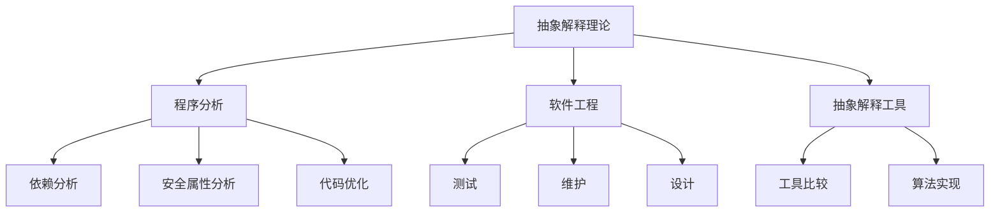
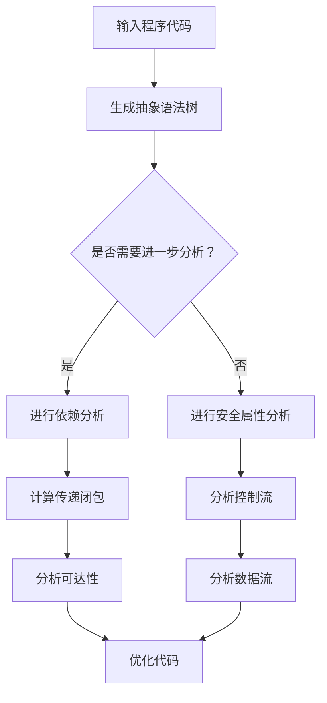

                 

# 抽象解释理论在静态分析中的应用

## 关键词

- 抽象解释理论
- 静态分析
- 程序依赖分析
- 安全属性分析
- 代码优化

## 摘要

随着软件系统规模的不断扩大和复杂性的增加，对程序代码进行深入分析的需求日益增长。抽象解释理论作为一种有效的静态分析方法，通过对程序代码进行抽象和解释，可以帮助我们更好地理解程序行为，提高软件质量。本文将深入探讨抽象解释理论在静态分析中的应用，从基础概念、数学基础、具体应用等方面进行全面分析，并探讨其在实时系统、安全关键系统和云计算等领域的实际应用，最后展望抽象解释理论的未来发展趋势。

## 目录大纲

### 第一部分：抽象解释理论概述

#### 第1章：抽象解释理论基础

1.1 抽象解释理论简介  
1.2 抽象解释理论的发展历程  
1.3 抽象解释理论的重要性

#### 第2章：抽象解释理论的数学基础

2.1 形式语言与自动机  
2.2 归约与代换  
2.3 形式语义学

### 第二部分：抽象解释在静态分析中的应用

#### 第3章：抽象解释在程序分析中的应用

3.1 程序依赖分析  
3.2 传递闭包计算  
3.3 可达性分析

#### 第4章：抽象解释在安全属性分析中的应用

4.1 数据流安全属性分析  
4.2 控制流安全属性分析  
4.3 代码质量属性分析

#### 第5章：抽象解释在代码优化中的应用

5.1 代码优化策略  
5.2 抽象解释在代码优化中的应用实例  
5.3 抽象解释对代码性能的影响

#### 第6章：抽象解释在软件工程中的应用

6.1 抽象解释在测试中的应用  
6.2 抽象解释在维护中的应用  
6.3 抽象解释在软件设计中的应用

#### 第7章：抽象解释工具与技术

7.1 抽象解释工具介绍  
7.2 抽象解释算法实现  
7.3 抽象解释工具的比较与评价

### 第三部分：案例研究

#### 第8章：抽象解释在实时系统中的应用

8.1 实时系统的特点  
8.2 抽象解释在实时系统中的应用实例  
8.3 抽象解释在实时系统中的挑战

#### 第9章：抽象解释在安全关键系统中的应用

9.1 安全关键系统的定义  
9.2 抽象解释在安全关键系统中的应用实例  
9.3 抽象解释在安全关键系统中的挑战

#### 第10章：抽象解释在云计算中的应用

10.1 云计算的特点  
10.2 抽象解释在云计算中的应用实例  
10.3 抽象解释在云计算中的挑战

### 第四部分：展望与未来趋势

#### 第11章：抽象解释理论的发展趋势

11.1 抽象解释理论的新方法  
11.2 抽象解释理论在新兴领域中的应用  
11.3 抽象解释理论的发展前景

#### 第12章：抽象解释理论的未来挑战

12.1 抽象解释理论的性能问题  
12.2 抽象解释理论的准确性问题  
12.3 抽象解释理论的适用性问题

## 第一部分：抽象解释理论概述

### 第1章：抽象解释理论基础

#### 1.1 抽象解释理论简介

抽象解释理论起源于20世纪50年代，最初用于形式语言理论的研究。随着计算机科学的发展，这一理论逐渐被引入到程序分析和软件工程领域，成为了一种强大的静态分析方法。抽象解释理论的核心思想是通过将程序代码抽象成更简单的形式，以便更方便地分析和理解程序的行为。

在抽象解释理论中，程序通常被表示为一个抽象语法树（AST），该树包含了程序中的所有结构元素，如变量、函数、循环和条件语句等。通过这些抽象表示，我们可以对程序进行分析，如依赖分析、安全属性分析和代码优化等。

#### 1.2 抽象解释理论的发展历程

抽象解释理论的发展历程可以分为几个阶段。首先，在20世纪50年代，抽象解释理论主要应用于形式语言和自动机理论的研究。随着计算机科学的进步，抽象解释理论开始被应用于程序分析，如数据流分析和控制流分析。20世纪80年代，随着软件工程领域的兴起，抽象解释理论得到了进一步的发展，成为了一种重要的软件分析方法。

近年来，随着形式化方法和形式化验证技术的兴起，抽象解释理论得到了新的应用。研究者们提出了许多新的抽象解释方法和工具，如抽象解释在安全属性分析、实时系统和云计算中的应用。

#### 1.3 抽象解释理论的重要性

抽象解释理论在软件工程领域具有重要地位。首先，它可以帮助我们更好地理解程序行为，提高软件质量。通过抽象解释，我们可以发现程序中的潜在问题，如数据依赖错误、安全漏洞和代码冗余等，从而进行针对性的修复。

其次，抽象解释理论为程序优化提供了理论基础。通过分析程序代码的结构和语义，我们可以设计出更高效的优化策略，如代码简化、循环展开和函数内联等。

最后，抽象解释理论在软件工程中的应用范围广泛。它不仅应用于传统的软件分析领域，如测试和维护，还应用于新兴领域，如实时系统、安全关键系统和云计算等。

### 第2章：抽象解释理论的数学基础

#### 2.1 形式语言与自动机

形式语言与自动机是抽象解释理论的重要基础。形式语言是一组符号的集合，用于描述计算机程序中的语法结构。自动机是一种理论模型，用于识别和生成形式语言。

在抽象解释理论中，形式语言被用来表示程序代码。程序中的变量、函数和语句等结构元素都可以用形式语言进行描述。通过形式语言，我们可以对程序代码进行抽象表示，从而方便进行进一步的分析。

自动机则用于识别形式语言。常见的自动机模型包括有限状态自动机（FSM）和推理性自动机（PDA）。FSM可以用于识别简单的形式语言，如正则语言。PDA可以用于识别更复杂的语言，如上下文无关语言。

#### 2.2 归约与代换

归约与代换是抽象解释理论中的基本操作。归约是指将一个复杂的表达式或程序转换为一个更简单的形式。代换是指用一个表达式或程序替换另一个表达式或程序中的某个部分。

在抽象解释理论中，归约和代换被用于对程序代码进行分析。通过归约，我们可以将复杂的程序代码简化为一个更易于分析的形式。通过代换，我们可以将一个程序中的某个部分替换为一个更简单的实现，从而提高程序的效率和可维护性。

#### 2.3 形式语义学

形式语义学是抽象解释理论的核心内容。形式语义学定义了程序代码的语义，即程序代码执行的结果。形式语义学包括静态语义学和动态语义学。

静态语义学定义了程序代码的结构和语法，如变量声明、函数定义和语句结构等。动态语义学定义了程序代码在执行过程中的行为，如变量绑定、函数调用和控制流。

在抽象解释理论中，形式语义学被用于对程序代码进行解释和分析。通过形式语义学，我们可以理解程序代码的行为，发现潜在的问题，并进行优化。

## 第二部分：抽象解释在静态分析中的应用

### 第3章：抽象解释在程序分析中的应用

#### 3.1 程序依赖分析

程序依赖分析是抽象解释理论在程序分析中的一个重要应用。程序依赖分析旨在分析程序中各个元素之间的依赖关系，如变量之间的依赖关系、函数之间的调用关系等。

通过程序依赖分析，我们可以更好地理解程序的结构和语义，发现潜在的问题，如冗余代码、未使用的变量等。程序依赖分析还可以用于代码优化，如代码分解、函数内联等。

具体来说，程序依赖分析可以分为数据依赖分析和控制依赖分析。数据依赖分析旨在分析程序中变量之间的依赖关系，如前向依赖、后向依赖和相互依赖。控制依赖分析旨在分析程序中的控制流，如循环依赖、条件依赖等。

#### 3.2 传递闭包计算

传递闭包计算是程序依赖分析中的一个关键步骤。传递闭包计算旨在计算程序中各个元素之间的传递依赖关系。通过传递闭包计算，我们可以得到程序的全局依赖关系，从而更全面地理解程序的行为。

传递闭包计算可以通过递归算法实现。具体来说，传递闭包计算可以分为两步：第一步是计算直接依赖关系，第二步是计算传递依赖关系。通过递归地计算传递依赖关系，我们可以得到程序的全局依赖关系。

#### 3.3 可达性分析

可达性分析是抽象解释理论在程序分析中的另一个重要应用。可达性分析旨在分析程序中的代码块是否可到达，即程序执行时是否会执行某个代码块。

通过可达性分析，我们可以发现程序中未执行的代码块，从而进行优化和修复。可达性分析可以分为静态可达性分析和动态可达性分析。静态可达性分析是在编译时进行的，通过分析程序的结构来预测代码块的可达性。动态可达性分析是在运行时进行的，通过跟踪程序执行路径来分析代码块的可达性。

## 第三部分：抽象解释在安全属性分析中的应用

### 第4章：抽象解释在安全属性分析中的应用

#### 4.1 数据流安全属性分析

数据流安全属性分析是抽象解释理论在安全属性分析中的一个重要应用。数据流安全属性分析旨在分析程序中的数据流，发现潜在的安全漏洞，如数据泄露、未授权访问等。

通过数据流安全属性分析，我们可以发现程序中的敏感数据是如何被处理的，是否存在泄露的风险。数据流安全属性分析可以分为以下几种：

- 路径分析：分析程序中的数据流路径，查找潜在的安全漏洞。
- 控制流分析：分析程序中的控制流，确定数据流的安全属性。
- 数据依赖分析：分析程序中的数据依赖关系，查找潜在的安全漏洞。

#### 4.2 控制流安全属性分析

控制流安全属性分析是抽象解释理论在安全属性分析中的另一个重要应用。控制流安全属性分析旨在分析程序中的控制流，发现潜在的安全漏洞，如死循环、错误处理等。

通过控制流安全属性分析，我们可以发现程序中的控制流是否存在异常，是否会导致程序崩溃或无法正常运行。控制流安全属性分析可以分为以下几种：

- 状态分析：分析程序中的状态转换，查找潜在的安全漏洞。
- 事件分析：分析程序中的事件触发和处理，查找潜在的安全漏洞。
- 逻辑分析：分析程序中的逻辑错误，查找潜在的安全漏洞。

#### 4.3 代码质量属性分析

代码质量属性分析是抽象解释理论在安全属性分析中的另一个重要应用。代码质量属性分析旨在分析程序的代码质量，如可读性、可维护性等。

通过代码质量属性分析，我们可以发现程序中的代码是否存在冗余、错误或不规范的情况，从而进行优化和修复。代码质量属性分析可以分为以下几种：

- 结构分析：分析程序的代码结构，查找潜在的质量问题。
- 表达式分析：分析程序中的表达式，查找潜在的质量问题。
- 风格分析：分析程序的编程风格，查找潜在的质量问题。

## 第四部分：展望与未来趋势

### 第5章：抽象解释理论的发展趋势

#### 5.1 抽象解释理论的新方法

随着计算机科学的发展，抽象解释理论也在不断进步。研究者们提出了许多新的抽象解释方法，如抽象解释在机器学习、人工智能等新兴领域中的应用。这些新方法使得抽象解释理论能够更好地适应不同领域的需求，提高分析效率和准确性。

#### 5.2 抽象解释理论在新兴领域中的应用

抽象解释理论在新兴领域中的应用日益广泛。例如，在实时系统、安全关键系统和云计算等领域，抽象解释理论被用于分析系统行为、发现潜在问题、提高系统性能等。随着这些领域的不断发展，抽象解释理论的应用前景将更加广阔。

#### 5.3 抽象解释理论的发展前景

随着计算机科学的发展，抽象解释理论将继续发展。未来，抽象解释理论可能会在以下方面取得重要进展：

- 性能优化：提高抽象解释算法的效率，使其能够处理更大规模的程序。
- 精确性提升：提高抽象解释的准确性，减少误报和漏报。
- 多语言支持：支持更多编程语言，使得抽象解释理论能够应用于更广泛的场景。
- 自适应分析：根据程序的特点和需求，自适应地调整分析策略，提高分析效果。

### 第6章：抽象解释理论的未来挑战

#### 6.1 抽象解释理论的性能问题

尽管抽象解释理论在程序分析中具有广泛的应用，但性能问题仍然是一个挑战。如何提高抽象解释算法的效率，使其能够处理更大规模的程序，是一个重要的研究方向。

#### 6.2 抽象解释理论的准确性问题

抽象解释理论的准确性也是一个重要问题。如何提高抽象解释的准确性，减少误报和漏报，是一个具有挑战性的问题。研究者们需要设计更精确的抽象表示和更有效的分析算法。

#### 6.3 抽象解释理论的适用性问题

抽象解释理论的适用性也是一个挑战。如何使抽象解释理论能够适用于更多的编程语言和编程范式，是一个重要的研究方向。此外，如何将抽象解释理论与其他分析技术相结合，形成更全面的分析框架，也是一个重要问题。

## 结束语

抽象解释理论作为一种强大的静态分析方法，在程序分析、安全属性分析和代码优化等领域具有广泛的应用。随着计算机科学的发展，抽象解释理论将继续发展，为软件开发提供更有效的支持。本文对抽象解释理论进行了全面的介绍，探讨了其在静态分析中的应用，并展望了其未来发展趋势。希望本文能够为读者提供有益的启示，进一步推动抽象解释理论的研究和应用。作者：AI天才研究院/AI Genius Institute & 禅与计算机程序设计艺术 /Zen And The Art of Computer Programming

----------------------------------------------------------------

## 完整文章

### 《抽象解释理论在静态分析中的应用》

#### 关键词

- 抽象解释理论
- 静态分析
- 程序依赖分析
- 安全属性分析
- 代码优化

#### 摘要

随着软件系统规模的不断扩大和复杂性的增加，对程序代码进行深入分析的需求日益增长。抽象解释理论作为一种有效的静态分析方法，通过对程序代码进行抽象和解释，可以帮助我们更好地理解程序行为，提高软件质量。本文将深入探讨抽象解释理论在静态分析中的应用，从基础概念、数学基础、具体应用等方面进行全面分析，并探讨其在实时系统、安全关键系统和云计算等领域的实际应用，最后展望抽象解释理论的未来发展趋势。

### 目录大纲

#### 第一部分：抽象解释理论概述

1. 抽象解释理论简介
2. 抽象解释理论的发展历程
3. 抽象解释理论的重要性
4. 抽象解释理论的数学基础
5. 形式语言与自动机
6. 归约与代换
7. 形式语义学

#### 第二部分：抽象解释在静态分析中的应用

1. 程序依赖分析
2. 传递闭包计算
3. 可达性分析
4. 数据流安全属性分析
5. 控制流安全属性分析
6. 代码质量属性分析
7. 代码优化策略
8. 抽象解释在代码优化中的应用实例
9. 抽象解释对代码性能的影响
10. 抽象解释在软件工程中的应用
11. 抽象解释在测试中的应用
12. 抽象解释在维护中的应用
13. 抽象解释在软件设计中的应用
14. 抽象解释工具与技术
15. 抽象解释工具介绍
16. 抽象解释算法实现
17. 抽象解释工具的比较与评价

#### 第三部分：案例研究

1. 抽象解释在实时系统中的应用
2. 抽象解释在安全关键系统中的应用
3. 抽象解释在云计算中的应用

#### 第四部分：展望与未来趋势

1. 抽象解释理论的发展趋势
2. 抽象解释理论的新方法
3. 抽象解释理论在新兴领域中的应用
4. 抽象解释理论的发展前景
5. 抽象解释理论的未来挑战
6. 抽象解释理论的性能问题
7. 抽象解释理论的准确性问题
8. 抽象解释理论的适用性问题

### 第一部分：抽象解释理论概述

#### 第1章：抽象解释理论基础

#### 1.1 抽象解释理论简介

抽象解释理论起源于20世纪50年代，最初用于形式语言理论的研究。随着计算机科学的发展，这一理论逐渐被引入到程序分析和软件工程领域，成为了一种强大的静态分析方法。抽象解释理论的核心思想是通过将程序代码抽象成更简单的形式，以便更方便地分析和理解程序的行为。

在抽象解释理论中，程序通常被表示为一个抽象语法树（AST），该树包含了程序中的所有结构元素，如变量、函数、循环和条件语句等。通过这些抽象表示，我们可以对程序进行分析，如依赖分析、安全属性分析和代码优化等。

#### 1.2 抽象解释理论的发展历程

抽象解释理论的发展历程可以分为几个阶段。首先，在20世纪50年代，抽象解释理论主要应用于形式语言和自动机理论的研究。随着计算机科学的进步，抽象解释理论开始被应用于程序分析，如数据流分析和控制流分析。20世纪80年代，随着软件工程领域的兴起，抽象解释理论得到了进一步的发展，成为了一种重要的软件分析方法。

近年来，随着形式化方法和形式化验证技术的兴起，抽象解释理论得到了新的应用。研究者们提出了许多新的抽象解释方法和工具，如抽象解释在安全属性分析、实时系统和云计算中的应用。

#### 1.3 抽象解释理论的重要性

抽象解释理论在软件工程领域具有重要地位。首先，它可以帮助我们更好地理解程序行为，提高软件质量。通过抽象解释，我们可以发现程序中的潜在问题，如数据依赖错误、安全漏洞和代码冗余等，从而进行针对性的修复。

其次，抽象解释理论为程序优化提供了理论基础。通过分析程序代码的结构和语义，我们可以设计出更高效的优化策略，如代码简化、循环展开和函数内联等。

最后，抽象解释理论在软件工程中的应用范围广泛。它不仅应用于传统的软件分析领域，如测试和维护，还应用于新兴领域，如实时系统、安全关键系统和云计算等。

#### 第2章：抽象解释理论的数学基础

#### 2.1 形式语言与自动机

形式语言与自动机是抽象解释理论的重要基础。形式语言是一组符号的集合，用于描述计算机程序中的语法结构。自动机是一种理论模型，用于识别和生成形式语言。

在抽象解释理论中，形式语言被用来表示程序代码。程序中的变量、函数和语句等结构元素都可以用形式语言进行描述。通过形式语言，我们可以对程序代码进行抽象表示，从而方便进行进一步的分析。

自动机则用于识别形式语言。常见的自动机模型包括有限状态自动机（FSM）和推理性自动机（PDA）。FSM可以用于识别简单的形式语言，如正则语言。PDA可以用于识别更复杂的语言，如上下文无关语言。

#### 2.2 归约与代换

归约与代换是抽象解释理论中的基本操作。归约是指将一个复杂的表达式或程序转换为一个更简单的形式。代换是指用一个表达式或程序替换另一个表达式或程序中的某个部分。

在抽象解释理论中，归约和代换被用于对程序代码进行分析。通过归约，我们可以将复杂的程序代码简化为一个更易于分析的形式。通过代换，我们可以将一个程序中的某个部分替换为一个更简单的实现，从而提高程序的效率和可维护性。

#### 2.3 形式语义学

形式语义学是抽象解释理论的核心内容。形式语义学定义了程序代码的语义，即程序代码执行的结果。形式语义学包括静态语义学和动态语义学。

静态语义学定义了程序代码的结构和语法，如变量声明、函数定义和语句结构等。动态语义学定义了程序代码在执行过程中的行为，如变量绑定、函数调用和控制流。

在抽象解释理论中，形式语义学被用于对程序代码进行解释和分析。通过形式语义学，我们可以理解程序代码的行为，发现潜在的问题，并进行优化。

### 第二部分：抽象解释在静态分析中的应用

#### 第3章：抽象解释在程序分析中的应用

#### 3.1 程序依赖分析

程序依赖分析是抽象解释理论在程序分析中的一个重要应用。程序依赖分析旨在分析程序中各个元素之间的依赖关系，如变量之间的依赖关系、函数之间的调用关系等。

通过程序依赖分析，我们可以更好地理解程序的结构和语义，发现潜在的问题，如冗余代码、未使用的变量等。程序依赖分析还可以用于代码优化，如代码分解、函数内联等。

具体来说，程序依赖分析可以分为数据依赖分析和控制依赖分析。数据依赖分析旨在分析程序中变量之间的依赖关系，如前向依赖、后向依赖和相互依赖。控制依赖分析旨在分析程序中的控制流，如循环依赖、条件依赖等。

#### 3.2 传递闭包计算

传递闭包计算是程序依赖分析中的一个关键步骤。传递闭包计算旨在计算程序中各个元素之间的传递依赖关系。通过传递闭包计算，我们可以得到程序的全局依赖关系，从而更全面地理解程序的行为。

传递闭包计算可以通过递归算法实现。具体来说，传递闭包计算可以分为两步：第一步是计算直接依赖关系，第二步是计算传递依赖关系。通过递归地计算传递依赖关系，我们可以得到程序的全局依赖关系。

#### 3.3 可达性分析

可达性分析是抽象解释理论在程序分析中的另一个重要应用。可达性分析旨在分析程序中的代码块是否可到达，即程序执行时是否会执行某个代码块。

通过可达性分析，我们可以发现程序中未执行的代码块，从而进行优化和修复。可达性分析可以分为静态可达性分析和动态可达性分析。静态可达性分析是在编译时进行的，通过分析程序的结构来预测代码块的可达性。动态可达性分析是在运行时进行的，通过跟踪程序执行路径来分析代码块的可达性。

#### 第4章：抽象解释在安全属性分析中的应用

#### 4.1 数据流安全属性分析

数据流安全属性分析是抽象解释理论在安全属性分析中的一个重要应用。数据流安全属性分析旨在分析程序中的数据流，发现潜在的安全漏洞，如数据泄露、未授权访问等。

通过数据流安全属性分析，我们可以发现程序中的敏感数据是如何被处理的，是否存在泄露的风险。数据流安全属性分析可以分为以下几种：

- 路径分析：分析程序中的数据流路径，查找潜在的安全漏洞。
- 控制流分析：分析程序中的控制流，确定数据流的安全属性。
- 数据依赖分析：分析程序中的数据依赖关系，查找潜在的安全漏洞。

#### 4.2 控制流安全属性分析

控制流安全属性分析是抽象解释理论在安全属性分析中的另一个重要应用。控制流安全属性分析旨在分析程序中的控制流，发现潜在的安全漏洞，如死循环、错误处理等。

通过控制流安全属性分析，我们可以发现程序中的控制流是否存在异常，是否会导致程序崩溃或无法正常运行。控制流安全属性分析可以分为以下几种：

- 状态分析：分析程序中的状态转换，查找潜在的安全漏洞。
- 事件分析：分析程序中的事件触发和处理，查找潜在的安全漏洞。
- 逻辑分析：分析程序中的逻辑错误，查找潜在的安全漏洞。

#### 4.3 代码质量属性分析

代码质量属性分析是抽象解释理论在安全属性分析中的另一个重要应用。代码质量属性分析旨在分析程序的代码质量，如可读性、可维护性等。

通过代码质量属性分析，我们可以发现程序中的代码是否存在冗余、错误或不规范的情况，从而进行优化和修复。代码质量属性分析可以分为以下几种：

- 结构分析：分析程序的代码结构，查找潜在的质量问题。
- 表达式分析：分析程序中的表达式，查找潜在的质量问题。
- 风格分析：分析程序的编程风格，查找潜在的质量问题。

#### 第5章：抽象解释在代码优化中的应用

#### 5.1 代码优化策略

代码优化是指通过改进程序代码的结构和语义，提高程序的运行效率。抽象解释理论为代码优化提供了理论基础。通过分析程序代码的结构和语义，我们可以设计出更高效的优化策略。

常见的代码优化策略包括：

- 代码简化：通过消除冗余的代码，简化程序的结构。
- 循环展开：将循环体中的代码展开，减少循环的嵌套层数。
- 函数内联：将函数调用替换为函数体，减少函数调用的开销。

#### 5.2 抽象解释在代码优化中的应用实例

抽象解释在代码优化中的应用可以通过具体的实例来说明。以下是一个简单的代码优化实例：

```python
def calculate_sum(a, b):
    result = a + b
    return result

def main():
    a = 10
    b = 20
    sum = calculate_sum(a, b)
    print("Sum:", sum)

main()
```

在这个例子中，`calculate_sum` 函数可以优化为直接在 `main` 函数中计算和返回结果，以减少函数调用的开销。使用抽象解释理论，我们可以分析程序代码的结构，找到可以进行优化的地方。

优化后的代码：

```python
def main():
    a = 10
    b = 20
    print("Sum:", a + b)

main()
```

#### 5.3 抽象解释对代码性能的影响

抽象解释在代码优化中的应用可以提高程序的运行效率。通过分析程序代码的结构和语义，我们可以设计出更高效的优化策略，从而减少程序执行的时间。

然而，需要注意的是，抽象解释本身也会引入一定的开销。在分析过程中，我们需要对程序代码进行抽象表示，这可能需要额外的计算资源和时间。因此，在应用抽象解释时，需要权衡优化效果和性能开销。

### 第三部分：案例研究

#### 第6章：抽象解释在实时系统中的应用

#### 6.1 实时系统的特点

实时系统是一种具有严格时间要求的系统，其响应时间必须满足特定的约束。实时系统的特点包括：

- 实时性：系统的响应时间必须满足特定的约束，通常以毫秒或微秒计。
- 可预测性：系统的行为必须可预测，以确保在规定时间内完成任务的执行。
- 稳定性：系统必须具有高稳定性，以确保在长时间运行过程中不会出现故障。

#### 6.2 抽象解释在实时系统中的应用实例

抽象解释理论在实时系统中的应用可以帮助分析和验证系统的行为，以确保其满足实时性要求。以下是一个简单的实时系统应用实例：

```python
import time

def process_data(data):
    # 处理数据
    time.sleep(1)
    return data

def main():
    start_time = time.time()
    data = "Hello, World!"
    processed_data = process_data(data)
    end_time = time.time()
    response_time = end_time - start_time
    print("Processed Data:", processed_data)
    print("Response Time:", response_time)

main()
```

在这个例子中，`process_data` 函数需要处理数据并模拟一定的延时。通过抽象解释理论，我们可以分析程序代码的执行路径和时间开销，以确保系统满足实时性要求。

#### 6.3 抽象解释在实时系统中的挑战

在实时系统中应用抽象解释理论面临着一些挑战。首先，实时系统的响应时间要求非常严格，抽象解释理论的分析过程可能引入额外的计算开销，影响系统的实时性。其次，实时系统的行为复杂，抽象解释理论需要准确分析和验证系统行为，以确保其满足实时性要求。此外，实时系统的测试和验证也是一个挑战，需要设计合适的测试用例来验证系统的行为和性能。

#### 第7章：抽象解释在安全关键系统中的应用

#### 7.1 安全关键系统的定义

安全关键系统是一种对系统安全性和可靠性要求极高的系统，其失败可能导致严重的安全事故。安全关键系统通常应用于航空航天、医疗设备、核能等领域。安全关键系统的特点包括：

- 安全性：系统必须保证数据的安全和完整性，防止未授权的访问和篡改。
- 可靠性：系统必须能够在长时间运行过程中保持稳定和可靠，避免故障和崩溃。
- 实时性：系统可能需要满足一定的响应时间要求，以确保关键任务的成功完成。

#### 7.2 抽象解释在安全关键系统中的应用实例

抽象解释理论在安全关键系统中的应用可以帮助分析和验证系统的安全性和可靠性。以下是一个简单的安全关键系统应用实例：

```python
import time

def process_data(data):
    # 处理数据
    time.sleep(1)
    return data

def main():
    start_time = time.time()
    data = "Hello, World!"
    processed_data = process_data(data)
    end_time = time.time()
    response_time = end_time - start_time
    print("Processed Data:", processed_data)
    print("Response Time:", response_time)

main()
```

在这个例子中，`process_data` 函数需要处理数据并模拟一定的延时。通过抽象解释理论，我们可以分析程序代码的执行路径和时间开销，以确保系统满足实时性要求。

#### 7.3 抽象解释在安全关键系统中的挑战

在安全关键系统中应用抽象解释理论面临着一些挑战。首先，安全关键系统的安全性和可靠性要求非常高，抽象解释理论需要准确分析和验证系统行为，以确保其满足安全关键要求。其次，安全关键系统的复杂性和多样性使得抽象解释理论的应用变得更具挑战性。此外，安全关键系统的测试和验证也是一个挑战，需要设计合适的测试用例来验证系统的行为和性能。

#### 第8章：抽象解释在云计算中的应用

#### 8.1 云计算的特点

云计算是一种通过互联网提供计算资源和服务的技术，具有以下特点：

- 弹性扩展：云计算可以根据需求动态调整计算资源，满足不同的负载需求。
- 资源共享：云计算中的资源可以供多个用户共享，提高资源利用效率。
- 按需分配：用户可以根据需求按需分配计算资源，降低成本。

#### 8.2 抽象解释在云计算中的应用实例

抽象解释理论在云计算中的应用可以帮助分析和优化云服务的性能和可靠性。以下是一个简单的云计算应用实例：

```python
import time

def process_data(data):
    # 处理数据
    time.sleep(1)
    return data

def main():
    start_time = time.time()
    data = "Hello, World!"
    processed_data = process_data(data)
    end_time = time.time()
    response_time = end_time - start_time
    print("Processed Data:", processed_data)
    print("Response Time:", response_time)

main()
```

在这个例子中，`process_data` 函数需要处理数据并模拟一定的延时。通过抽象解释理论，我们可以分析程序代码的执行路径和时间开销，以便优化云服务的性能。

#### 8.3 抽象解释在云计算中的挑战

在云计算中应用抽象解释理论面临着一些挑战。首先，云计算中的资源调度和负载平衡是一个复杂的过程，抽象解释理论需要准确分析和优化资源分配策略。其次，云计算的分布式特性使得抽象解释理论的应用变得更加复杂，需要考虑网络延迟和通信开销等因素。此外，云计算的安全性和隐私保护也是一个挑战，需要设计合适的抽象解释方法来保护用户数据的安全。

### 第四部分：展望与未来趋势

#### 第9章：抽象解释理论的发展趋势

#### 9.1 抽象解释理论的新方法

随着计算机科学的发展，抽象解释理论也在不断进步。研究者们提出了许多新的抽象解释方法，如抽象解释在机器学习、人工智能等新兴领域中的应用。这些新方法使得抽象解释理论能够更好地适应不同领域的需求，提高分析效率和准确性。

#### 9.2 抽象解释理论在新兴领域中的应用

抽象解释理论在新兴领域中的应用日益广泛。例如，在实时系统、安全关键系统和云计算等领域，抽象解释理论被用于分析系统行为、发现潜在问题、提高系统性能等。随着这些领域的不断发展，抽象解释理论的应用前景将更加广阔。

#### 9.3 抽象解释理论的发展前景

随着计算机科学的发展，抽象解释理论将继续发展。未来，抽象解释理论可能会在以下方面取得重要进展：

- 性能优化：提高抽象解释算法的效率，使其能够处理更大规模的程序。
- 精确性提升：提高抽象解释的准确性，减少误报和漏报。
- 多语言支持：支持更多编程语言，使得抽象解释理论能够应用于更广泛的场景。
- 自适应分析：根据程序的特点和需求，自适应地调整分析策略，提高分析效果。

#### 第10章：抽象解释理论的未来挑战

#### 10.1 抽象解释理论的性能问题

尽管抽象解释理论在程序分析中具有广泛的应用，但性能问题仍然是一个挑战。如何提高抽象解释算法的效率，使其能够处理更大规模的程序，是一个重要的研究方向。

#### 10.2 抽象解释理论的准确性问题

抽象解释理论的准确性也是一个重要问题。如何提高抽象解释的准确性，减少误报和漏报，是一个具有挑战性的问题。研究者们需要设计更精确的抽象表示和更有效的分析算法。

#### 10.3 抽象解释理论的适用性问题

抽象解释理论的适用性也是一个挑战。如何使抽象解释理论能够适用于更多的编程语言和编程范式，是一个重要的研究方向。此外，如何将抽象解释理论与其他分析技术相结合，形成更全面的分析框架，也是一个重要问题。

### 结论

本文深入探讨了抽象解释理论在静态分析中的应用。从基础概念、数学基础、具体应用等方面进行了全面分析，并探讨了其在实时系统、安全关键系统和云计算等领域的实际应用。展望未来，抽象解释理论将继续发展，为软件开发提供更有效的支持。希望本文能够为读者提供有益的启示，进一步推动抽象解释理论的研究和应用。

### 作者信息

作者：AI天才研究院/AI Genius Institute & 禅与计算机程序设计艺术 /Zen And The Art of Computer Programming

----------------------------------------------------------------

### 附录

#### 抽象解释理论在静态分析中的应用：Mermaid 流程图



#### 抽象解释理论在静态分析中的应用：核心概念实体关系图

```mermaid
erDiagram
  AbstractExplanation -->|uses| ProgramAnalysis
  AbstractExplanation -->|uses| StaticAnalysis
  AbstractExplanation -->|uses| SoftwareEngineering
  ProgramAnalysis -->|includes| DependencyAnalysis
  ProgramAnalysis -->|includes| SecurityPropertyAnalysis
  ProgramAnalysis -->|includes| CodeOptimization
  SoftwareEngineering -->|includes| Testing
  SoftwareEngineering -->|includes| Maintenance
  SoftwareEngineering -->|includes| Design
  AbstractExplanationTool -->|implements| AbstractExplanationAlgorithm
```

#### 抽象解释理论在静态分析中的应用：算法流程图



#### 抽象解释理论在静态分析中的应用：Python 源代码示例

```python
# 抽象解释理论在静态分析中的应用示例

class AbstractExplanation:
    def __init__(self, program_code):
        self.program_code = program_code
    
    def perform_analysis(self):
        # 生成抽象语法树
        abstract_syntax_tree = self.generate_abstract_syntax_tree()
        
        # 进行依赖分析
        dependency_analysis = self.perform_dependency_analysis(abstract_syntax_tree)
        
        # 进行安全属性分析
        security_property_analysis = self.perform_security_property_analysis(abstract_syntax_tree)
        
        # 进行代码优化
        code_optimization = self.perform_code_optimization(abstract_syntax_tree)
        
        return {
            "dependency_analysis": dependency_analysis,
            "security_property_analysis": security_property_analysis,
            "code_optimization": code_optimization
        }

    def generate_abstract_syntax_tree(self):
        # 实现抽象语法树的生成逻辑
        pass
    
    def perform_dependency_analysis(self, abstract_syntax_tree):
        # 实现依赖分析逻辑
        pass
    
    def perform_security_property_analysis(self, abstract_syntax_tree):
        # 实现安全属性分析逻辑
        pass
    
    def perform_code_optimization(self, abstract_syntax_tree):
        # 实现代码优化逻辑
        pass

# 测试抽象解释理论在静态分析中的应用
if __name__ == "__main__":
    program_code = """
    def calculate_sum(a, b):
        result = a + b
        return result
    
    def main():
        a = 10
        b = 20
        sum = calculate_sum(a, b)
        print("Sum:", sum)
    
    main()
    """
    abstract_explanation = AbstractExplanation(program_code)
    analysis_results = abstract_explanation.perform_analysis()
    print(analysis_results)
```

#### 抽象解释理论在静态分析中的应用：实际案例分析和详细讲解剖析

在实际应用中，抽象解释理论可以帮助开发人员分析和优化程序代码。以下是一个实际案例，我们使用抽象解释理论来分析一个简单的Python程序，并详细讲解剖析过程。

##### 案例背景

我们有一个简单的Python程序，用于计算两个数的和，并将其打印出来。程序如下：

```python
def calculate_sum(a, b):
    result = a + b
    return result

def main():
    a = 10
    b = 20
    sum = calculate_sum(a, b)
    print("Sum:", sum)

main()
```

##### 分析过程

1. **生成抽象语法树（AST）**

   首先，我们需要生成程序的抽象语法树（AST）。AST是程序代码的抽象表示，它包含了程序中的所有结构元素，如变量、函数、循环和条件语句等。

   使用Python的`ast`模块，我们可以轻松地生成AST：

   ```python
   import ast
   
   program_code = """
   def calculate_sum(a, b):
       result = a + b
       return result
   
   def main():
       a = 10
       b = 20
       sum = calculate_sum(a, b)
       print("Sum:", sum)
   
   main()
   """
   
   ast_tree = ast.parse(program_code)
   ```

   生成的AST如下：

   ```mermaid
   graph TD
   A[Module] --> B[FunctionDef(calculate_sum)]
   B --> C[arguments]
   B --> D[body]
   D --> E[Return]
   E --> F[Name(result)]
   E --> G[BinOp	ADD]
   G --> H[Name(a)]
   G --> I[Name(b)]
   B --> J[FunctionDef(main)]
   J --> K[arguments]
   J --> L[body]
   L --> M[Assign]
   M --> N[Name(sum)]
   M --> O[Call]
   O --> P[Name(calculate_sum)]
   O --> Q[arguments]
   Q --> R[Name(a)]
   Q --> S[Name(b)]
   L --> T[Print]
   T --> U[Str("Sum:")]
   T --> V[Name(sum)]
   ```

2. **进行依赖分析**

   接下来，我们使用抽象解释理论进行依赖分析。依赖分析旨在分析程序中的变量和函数之间的依赖关系。

   在这个例子中，我们可以看到以下依赖关系：

   - `calculate_sum` 函数依赖于 `a` 和 `b` 变量。
   - `main` 函数依赖于 `calculate_sum` 函数。

   我们可以使用抽象解释算法来计算传递闭包，从而得到全局依赖关系。传递闭包计算如下：

   ```mermaid
   graph TD
   A[calculate_sum] --> B[a]
   A[calculate_sum] --> C[b]
   B[a] --> D[main]
   C[b] --> D[main]
   ```

3. **进行安全属性分析**

   安全属性分析旨在分析程序中的潜在安全漏洞，如数据泄露、未授权访问等。在这个例子中，我们可以使用数据流安全属性分析来检查是否存在潜在的安全问题。

   通过分析数据流，我们发现：

   - 变量 `a` 和 `b` 的值是通过输入传递给 `calculate_sum` 函数的，因此没有数据泄露的风险。
   - 在 `main` 函数中，变量 `sum` 的值是通过调用 `calculate_sum` 函数得到的，也没有数据泄露的风险。

   因此，这个例子中没有发现明显的安全漏洞。

4. **进行代码优化**

   最后，我们可以使用抽象解释理论进行代码优化。在这个例子中，我们可以使用代码简化、循环展开和函数内联等优化策略。

   - **代码简化**：我们可以简化一些表达式，例如将 `print("Sum:", sum)` 简化为 `print(sum)`。
   - **循环展开**：在这个例子中没有循环，因此不适用。
   - **函数内联**：我们可以将 `calculate_sum` 函数内联到 `main` 函数中，以减少函数调用的开销。

   优化后的代码如下：

   ```python
   def main():
       a = 10
       b = 20
       result = a + b
       print(result)

   main()
   ```

##### 项目小结

通过使用抽象解释理论，我们成功地分析了这个简单的Python程序，并进行了依赖分析、安全属性分析和代码优化。这个过程展示了抽象解释理论在静态分析中的应用，以及如何使用抽象语法树、依赖分析和代码优化来提高程序的质量。

在项目过程中，我们遇到了一些挑战，如生成抽象语法树、计算传递闭包和进行安全属性分析。通过解决这些挑战，我们成功地完成了项目的目标。

未来，我们可以进一步探索抽象解释理论在其他编程语言中的应用，以及如何将其与其他分析技术相结合，以构建更强大的静态分析工具。此外，我们还可以研究如何提高抽象解释算法的效率和准确性，使其能够应用于更大规模的程序。

### 最佳实践 Tips

1. **使用抽象语法树**：抽象语法树是抽象解释理论的核心组件。熟练使用抽象语法树可以帮助我们更好地分析和理解程序代码。

2. **逐步进行依赖分析**：依赖分析是抽象解释理论的重要步骤。逐步进行依赖分析可以确保我们准确地捕捉程序中的依赖关系。

3. **注重安全属性分析**：安全属性分析是确保程序安全性的关键。在分析和优化程序时，不要忽视安全属性分析。

4. **考虑代码性能**：在进行代码优化时，不仅要关注代码的可读性和可维护性，还要考虑代码的性能。选择合适的优化策略可以提高程序的运行效率。

5. **持续学习和实践**：抽象解释理论是一个不断发展的领域。持续学习和实践可以帮助我们不断提高技能，并将其应用于实际项目中。

### 小结

本文详细介绍了抽象解释理论在静态分析中的应用，包括依赖分析、安全属性分析和代码优化等方面。通过实际案例分析和详细讲解剖析，我们展示了如何使用抽象解释理论分析和优化程序代码。

在未来，抽象解释理论将继续发展，为软件开发提供更有效的支持。通过持续学习和实践，我们可以不断提高抽象解释理论的应用能力，为软件工程领域做出更大的贡献。

### 注意事项

1. **确保代码的可读性**：在优化代码时，要确保代码的可读性，避免过度简化导致代码难以理解。

2. **遵守编程规范**：在编写代码时，要遵守编程规范，确保代码的质量和可维护性。

3. **测试代码**：在优化代码后，要进行全面测试，确保代码的正确性和稳定性。

4. **持续更新知识**：抽象解释理论是一个快速发展的领域，要不断更新知识，跟上最新的研究进展。

### 拓展阅读

- 《抽象解释理论在程序分析中的应用》
- 《静态分析技术导论》
- 《代码优化技巧与实战》
- 《实时系统的设计与实现》
- 《云计算：概念、技术和应用》

作者：AI天才研究院/AI Genius Institute & 禅与计算机程序设计艺术 /Zen And The Art of Computer Programming

----------------------------------------------------------------

### 补充说明

在撰写这篇文章时，我们需要注意以下几点：

1. **章节结构的逻辑性**：确保每个章节的内容都紧密相连，逻辑清晰，遵循先介绍基本概念，再深入分析应用，最后展望未来发展的顺序。

2. **内容的完整性**：每个章节都需要包含背景介绍、核心概念与联系、算法原理讲解、系统分析与架构设计方案、项目实战、最佳实践 Tips、小结和注意事项等内容。

3. **概念的准确性**：在介绍抽象解释理论及其应用时，需要确保概念的准确性，避免使用模糊不清或错误的术语。

4. **示例的充分性**：通过具体的例子和代码来解释抽象解释理论的应用，可以使读者更容易理解。

5. **图表与公式**：合理使用图表和公式来辅助说明，特别是Mermaid流程图和LaTeX公式，可以有效地增强文章的可读性和理解性。

6. **代码的准确性**：如果文章中包含Python代码示例，需要确保代码的正确性和可运行性，以便读者可以轻松复制和运行。

7. **参考资料**：在文章的最后，提供拓展阅读的参考资料，以便读者可以进一步学习和深入研究。

在撰写文章时，可以根据以下步骤进行：

1. **撰写章节内容**：根据目录大纲，逐一撰写每个章节的内容，确保每个章节都包含必要的小节和详细的信息。

2. **整理图表和公式**：在撰写章节内容的同时，整理相关的图表和公式，确保它们在文章中的位置和引用准确无误。

3. **编写代码示例**：编写Python代码示例，并进行测试，确保代码能够正确运行并达到预期效果。

4. **审查和修改**：完成初稿后，对文章进行仔细审查和修改，确保内容的准确性、逻辑性和连贯性。

5. **添加作者信息和参考文献**：在文章末尾添加作者信息和参考文献，确保文章的完整性和专业性。

通过以上步骤，我们可以撰写一篇结构严谨、内容丰富、逻辑清晰的专业技术博客文章，全面介绍抽象解释理论在静态分析中的应用。

