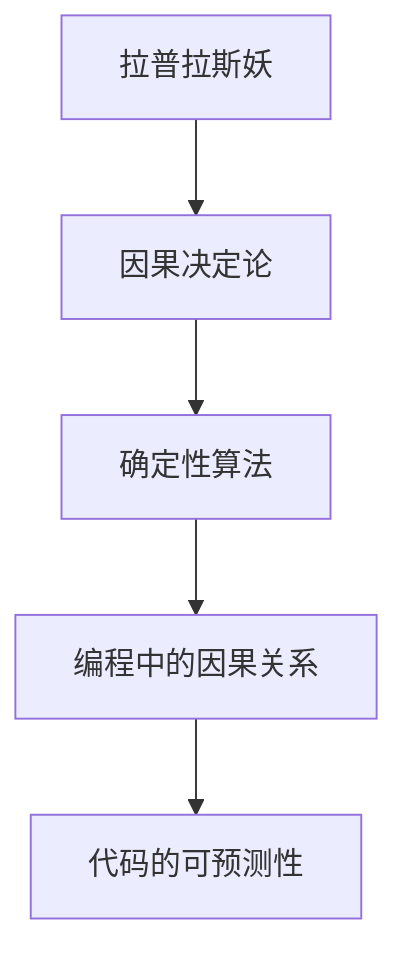
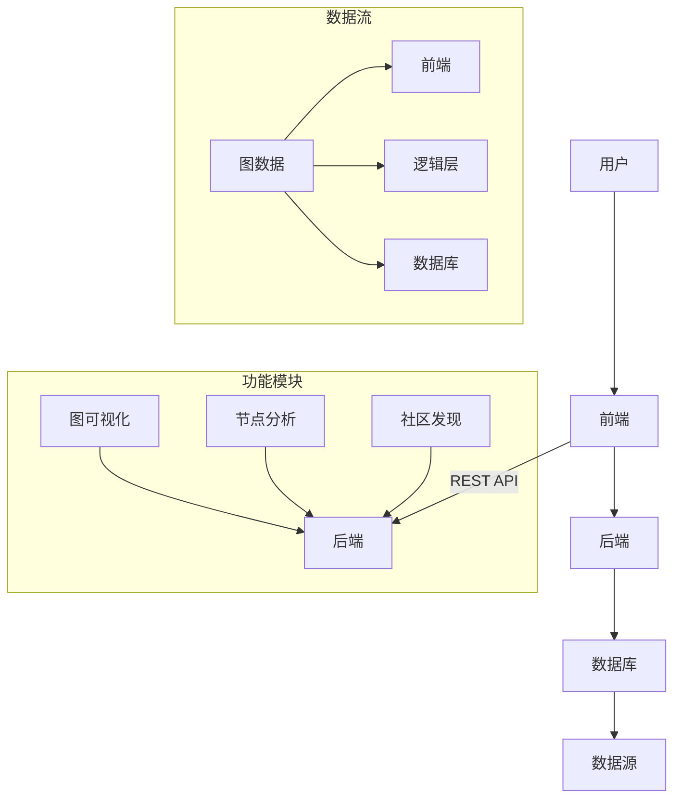
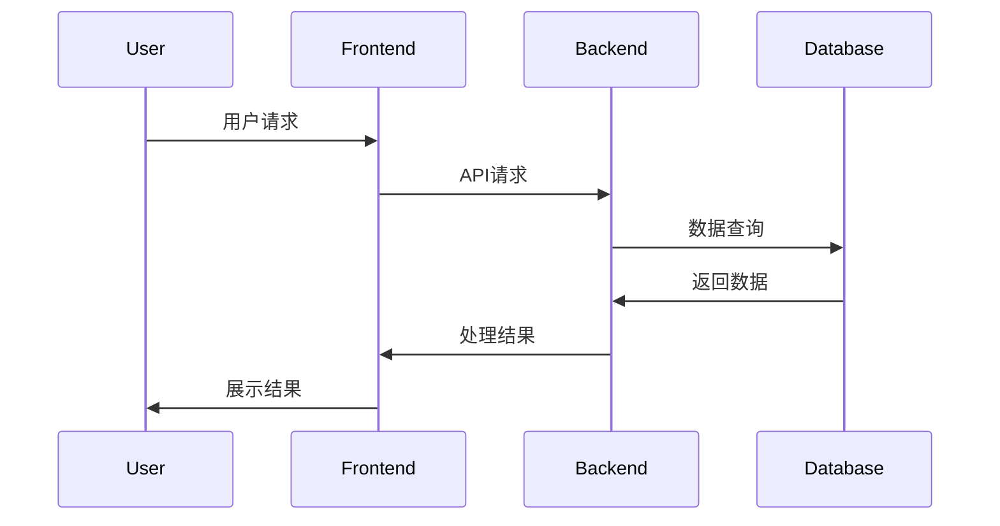

                 

### 拉普拉斯妖与因果决定论

拉普拉斯妖（Laplace's Demon）是一个源自18世纪法国数学家、物理学家皮埃尔-西蒙·拉普拉斯（Pierre-Simon Laplace）的虚构生物。拉普拉斯妖被设想为一个具备无限记忆、计算能力和完整宇宙知识的存在，它能够预测宇宙中任何时间的任何事件。这一概念最早出现在拉普拉斯的著作《分析哲学的概率理论》中，他通过这一设想来阐述其因果决定论的观点。

**因果决定论** 是一种哲学观点，认为宇宙中的一切现象都可以通过其先前状态和自然法则来完全预测。拉普拉斯妖正是这一理论的极端体现，它代表了如果拥有充分的初始信息和完美的计算能力，理论上可以预测未来和过去的一切。这一概念在物理学、计算机科学和哲学等多个领域中都有深远的影响。

在编程中，因果决定论体现为确定性算法。确定性算法是指那些输出完全取决于输入和算法规则的算法，这意味着在相同的输入下，这些算法总是产生相同的输出。这类算法在编程和软件开发中非常常见，因为它们提供了可预测性和稳定性。

### 确定性算法概述

算法是解决问题的一系列明确的步骤。一个有效的算法不仅需要解决问题，还要在合理的时间内完成。在计算机科学中，算法可以分为多种类型，其中确定性算法是最基本的一种。

**确定性算法的特点** 包括：

- **相同的输入产生相同的输出**：确定性算法在相同的输入下总是产生相同的输出。
- **确定性**：算法的每一步都是明确和可预测的，不存在随机或模糊的步骤。
- **可终止性**：算法能够在有限的时间内完成，并且不会陷入无限循环。

**确定性算法的应用场景** 非常广泛，包括：

- **排序和查找算法**：如冒泡排序、选择排序、插入排序等，它们在数据处理和数据结构中非常重要。
- **图算法**：如深度优先搜索（DFS）和广度优先搜索（BFS），它们在路径规划和网络分析中有广泛应用。
- **加密算法**：如AES、RSA等，它们确保数据的机密性和完整性。

### 编程中的因果决定论

在编程中，因果决定论体现为代码的可预测性和确定性。每个程序都是由一系列指令组成的，这些指令按照特定的逻辑执行，产生预期的输出。在编写程序时，开发者需要确保：

- **逻辑一致性**：程序的每一步操作都是基于明确的逻辑和规则，没有意外的行为。
- **状态的可预测性**：程序在执行过程中，每个变量的状态变化都是可预测的，没有不可控的变量。
- **错误的可定位性**：当程序出现问题时，开发者能够通过代码的逻辑和结构来定位错误。

### 拉普拉斯妖与确定性算法的关系

拉普拉斯妖与确定性算法之间有着密切的联系。拉普拉斯妖的概念展示了如果具备充分的初始信息和完美的计算能力，理论上可以实现完全的因果决定论。而确定性算法则是这种理论在计算机科学中的具体实现。

在编程中，确定性算法正是拉普拉斯妖概念的体现。通过编写确定性算法，开发者可以在理论上预测程序的输出，确保代码的稳定性和可重复性。例如，通过冒泡排序算法，我们可以预测输入数组在排序后的状态，因为算法的每一步都是可预测的。

### 概念实体之间的关系架构

为了更好地理解拉普拉斯妖、因果决定论和确定性算法之间的关系，我们可以使用Mermaid流程图来展示这些概念实体之间的联系。

以下是相关的Mermaid流程图：



**Mermaid流程图说明：**
- **A[拉普拉斯妖]**：代表了可以预测宇宙中任何事件的虚构生物。
- **B[因果决定论]**：表示宇宙中一切现象都可以通过其先前状态和自然法则来完全预测。
- **C[确定性算法]**：是因果决定论在计算机科学中的具体体现，即输出完全取决于输入和算法规则。
- **D[编程中的因果关系]**：描述了代码中每一步操作都是基于明确的逻辑和规则。
- **E[代码的可预测性]**：说明了确定性算法如何使代码的行为可预测。

通过这个流程图，我们可以清晰地看到拉普拉斯妖、因果决定论和确定性算法之间的逻辑关系，以及它们在编程中的应用。

### 确定性算法原理讲解

确定性算法是一种在给定相同输入时，总是产生相同输出的算法。这类算法在计算机科学中占据着重要地位，因为它们提供了可预测性和稳定性，这在许多实际应用中都是必不可少的。

#### 确定性算法的分类

确定性算法可以大致分为以下几类：

1. **排序算法**：如冒泡排序、选择排序、插入排序和快速排序等，它们主要用于对数据进行排序。
2. **查找算法**：如二分查找、线性查找等，用于在数据结构中查找特定的元素。
3. **图算法**：如深度优先搜索（DFS）和广度优先搜索（BFS），用于解决路径搜索和连通性问题。
4. **加密算法**：如AES、RSA等，用于数据的加密和解密。

#### 各类确定性算法的工作原理

1. **排序算法**：

   - **冒泡排序（Bubble Sort）**：通过重复交换相邻的未按顺序排列元素，直到整个序列有序。
   - **选择排序（Selection Sort）**：每次选择一个最小（或最大）元素放到序列的起始位置。
   - **插入排序（Insertion Sort）**：将新元素插入到已经排序序列中的合适位置。
   - **快速排序（Quick Sort）**：通过递归地将序列分为两部分，然后对这两部分分别排序。

2. **查找算法**：

   - **二分查找（Binary Search）**：在有序数组中查找特定元素，通过不断缩小搜索范围来提高查找效率。
   - **线性查找（Linear Search）**：遍历数组，逐个比较元素，直到找到目标元素。

3. **图算法**：

   - **深度优先搜索（DFS）**：通过递归或栈结构，从起始点开始探索路径，直到找到目标节点。
   - **广度优先搜索（BFS）**：使用队列结构，按照层级遍历图，找到最短路径。

4. **加密算法**：

   - **AES（Advanced Encryption Standard）**：一种对称加密算法，使用密钥对数据进行加密和解密。
   - **RSA（Rivest-Shamir-Adleman）**：一种非对称加密算法，使用一对密钥进行加密和解密。

#### 使用Python源代码详细阐述

为了更好地理解确定性算法的原理，我们将使用Python源代码来详细阐述几个基本的算法。

**冒泡排序算法**：

```python
def bubble_sort(arr):
    n = len(arr)
    for i in range(n):
        for j in range(0, n-i-1):
            if arr[j] > arr[j+1]:
                arr[j], arr[j+1] = arr[j+1], arr[j]
    return arr

# 测试冒泡排序
arr = [64, 34, 25, 12, 22, 11, 90]
sorted_arr = bubble_sort(arr)
print("排序后的数组：", sorted_arr)
```

**二分查找算法**：

```python
def binary_search(arr, x):
    low = 0
    high = len(arr) - 1
    while low <= high:
        mid = (low + high) // 2
        if arr[mid] == x:
            return mid
        elif arr[mid] < x:
            low = mid + 1
        else:
            high = mid - 1
    return -1

# 测试二分查找
arr = [2, 3, 4, 10, 40]
x = 10
result = binary_search(arr, x)
if result != -1:
    print("元素在数组中的索引：", result)
else:
    print("元素不在数组中")
```

通过这些代码示例，我们可以清晰地看到这些确定性算法是如何工作的，并且理解它们在编程中的应用。

### 数学模型与公式

在确定性算法中，数学模型和公式扮演着至关重要的角色。它们不仅帮助我们理解算法的工作原理，还能帮助我们分析和优化算法的性能。

#### 因果关系模型

因果关系模型描述了输入和输出之间的关系。在确定性算法中，输入和输出之间是明确且可预测的。我们可以用以下模型来表示：

\[ Y = f(X) \]

其中，\( Y \) 是输出，\( X \) 是输入，\( f \) 是一个确定性函数。

#### 确定性算法的数学公式

不同的确定性算法有不同的数学公式来描述它们的工作原理。以下是几个常见的确定性算法的数学公式：

1. **冒泡排序**：

   冒泡排序的公式可以表示为：

   \[ T(n) = \frac{n(n-1)}{2} \]

   其中，\( T(n) \) 是排序所需的时间复杂度，\( n \) 是数组的大小。

2. **二分查找**：

   二分查找的时间复杂度公式为：

   \[ T(n) = O(\log n) \]

   这意味着随着输入规模 \( n \) 的增长，查找时间呈对数增长。

3. **深度优先搜索**：

   深度优先搜索的时间复杂度可以表示为：

   \[ T(n) = O(n) \]

   这意味着在最坏的情况下，搜索时间与节点数量成线性关系。

4. **广度优先搜索**：

   广度优先搜索的时间复杂度公式为：

   \[ T(n) = O(V+E) \]

   其中，\( V \) 是节点的数量，\( E \) 是边的数量。

#### 公式详细讲解与举例说明

**冒泡排序**：

假设有一个包含5个元素的数组：\[ [64, 34, 25, 12, 22] \]

第一次排序后：\[ [34, 64, 25, 12, 22] \]

第二次排序后：\[ [34, 25, 64, 12, 22] \]

第三次排序后：\[ [34, 25, 12, 64, 22] \]

第四次排序后：\[ [34, 25, 12, 22, 64] \]

第五次排序后：\[ [34, 25, 12, 22, 64] \]

总共进行了 \( \frac{5(5-1)}{2} = 10 \) 次比较。

**二分查找**：

假设有一个包含8个元素的有序数组：\[ [1, 3, 4, 10, 40, 64, 100, 200] \]

查找元素40的过程如下：

- 第一次比较：中间元素为10，40大于10，所以搜索右半部分。
- 第二次比较：中间元素为40，40等于40，查找成功。

总共进行了 \( \log_2(8) = 3 \) 次比较。

**深度优先搜索**：

假设有一个图，包含5个节点和7条边，起点为节点A。

- 第一次递归：从A开始，探索到节点B。
- 第二次递归：从B开始，探索到节点C。
- 第三次递归：从C开始，探索到节点D。
- 第四次递归：从D开始，探索到节点E。

总共进行了4次递归。

**广度优先搜索**：

假设有一个图，包含5个节点和7条边，起点为节点A。

- 第一次遍历：从A开始，依次遍历节点B、C、D、E。
- 第二次遍历：从E开始，遍历节点F。

总共进行了 \( O(V+E) = O(5+7) = 12 \) 次操作。

通过这些详细的例子和讲解，我们可以更好地理解确定性算法的数学模型和公式，从而在实际编程中更好地应用这些算法。

### 项目实战

在本节中，我们将通过一个实际的编程项目来展示确定性算法的应用。我们将使用Python语言来实现一个简单的图算法——深度优先搜索（DFS），并对其代码进行详细解读。

#### 开发环境搭建

首先，我们需要搭建一个简单的Python开发环境。以下是所需的步骤：

1. 安装Python：从Python官网（https://www.python.org/downloads/）下载并安装Python，选择合适的版本，例如Python 3.8或更高版本。
2. 安装必需的库：在终端中运行以下命令来安装必要的库。

   ```bash
   pip install networkx matplotlib
   ```

   - `networkx`：用于创建和处理图数据结构。
   - `matplotlib`：用于绘制图和可视化结果。

#### 源代码详细实现

以下是实现深度优先搜索（DFS）的Python源代码：

```python
import networkx as nx
import matplotlib.pyplot as plt

def dfs(graph, node, visited):
    if node not in visited:
        visited.add(node)
        print(node, end=' ')

        for neighbor in graph.neighbors(node):
            dfs(graph, neighbor, visited)

def draw_graph(graph):
    pos = nx.spring_layout(graph)
    nx.draw(graph, pos, with_labels=True)
    plt.show()

# 创建图
G = nx.Graph()

# 添加节点和边
G.add_edges_from([(1, 2), (1, 3), (2, 4), (3, 4), (4, 5)])

# 使用DFS进行遍历
visited = set()
dfs(G, 1, visited)

# 绘制图
draw_graph(G)
```

#### 代码解读与分析

1. **导入库**：

   ```python
   import networkx as nx
   import matplotlib.pyplot as plt
   ```

   这两行代码分别导入`networkx`和`matplotlib`库，用于创建和处理图数据结构以及绘制图。

2. **定义DFS函数**：

   ```python
   def dfs(graph, node, visited):
       if node not in visited:
           visited.add(node)
           print(node, end=' ')

           for neighbor in graph.neighbors(node):
               dfs(graph, neighbor, visited)
   ```

   这个函数实现了深度优先搜索算法。函数接收三个参数：`graph`（图对象）、`node`（当前节点）和`visited`（已访问节点的集合）。在函数内部，首先检查当前节点是否已被访问。如果未访问，则将其标记为已访问并打印出来。然后递归地对所有未访问的邻接节点调用DFS函数。

3. **绘制图函数**：

   ```python
   def draw_graph(graph):
       pos = nx.spring_layout(graph)
       nx.draw(graph, pos, with_labels=True)
       plt.show()
   ```

   这个函数用于绘制图。`spring_layout`函数用于生成节点的布局，`nx.draw`用于绘制图，`with_labels=True`表示在图中显示节点的标签，`plt.show()`用于显示绘图窗口。

4. **创建和初始化图**：

   ```python
   G = nx.Graph()
   G.add_edges_from([(1, 2), (1, 3), (2, 4), (3, 4), (4, 5)])
   ```

   创建一个图对象`G`，并使用`add_edges_from`函数添加节点和边。这个图包含5个节点和5条边。

5. **调用DFS函数**：

   ```python
   visited = set()
   dfs(G, 1, visited)
   ```

   初始化一个已访问节点的集合`visited`，并从节点1开始调用DFS函数进行遍历。

6. **绘制图**：

   ```python
   draw_graph(G)
   ```

   最后，调用`draw_graph`函数绘制图。

通过这个项目，我们可以看到如何使用Python实现深度优先搜索算法，并对其进行代码解读和分析。这不仅帮助我们理解DFS算法的原理，还展示了如何在实际项目中应用这一算法。

### 实战项目案例分析

在本节中，我们将进一步分析确定性算法在实际编程中的应用，并通过一个具体的项目案例来展示其实现和效果。

#### 项目介绍

我们选择一个社交网络图的项目作为案例，该项目旨在分析社交网络中的节点关系和社区结构。该项目的目标是通过使用确定性算法（如DFS和社区发现算法）来识别社交网络中的关键节点和社区。

#### 系统功能设计

该系统的主要功能包括：

1. **图数据加载**：从外部数据源（如CSV文件或数据库）中加载社交网络图数据。
2. **图可视化**：使用可视化工具（如Gephi或PyVis）展示社交网络图。
3. **节点分析**：使用DFS算法分析社交网络中的节点关系，识别关键节点。
4. **社区发现**：使用社区发现算法（如Girvan-Newman算法）识别社交网络中的社区结构。

#### 系统架构设计

以下是该项目的系统架构设计：

1. **数据层**：负责数据存储和加载，使用Neo4j数据库存储社交网络图数据。
2. **逻辑层**：实现核心算法和数据处理逻辑，包括DFS算法和社区发现算法。
3. **表示层**：提供用户界面，展示图形化结果，使用D3.js或PyVis库实现。

以下是相关的Mermaid架构图：



**系统架构图说明：**
- **A[用户]**：项目的最终用户。
- **B[前端]**：用户界面，使用D3.js或PyVis库实现。
- **C[后端]**：逻辑层，实现核心算法和数据处理的逻辑。
- **D[数据库]**：使用Neo4j数据库存储社交网络图数据。
- **E[数据源]**：外部数据源，如CSV文件或数据库。
- **F[图数据]**：数据流，包括从数据源加载的图数据和后端处理的数据。
- **G[前端]**：前端接收用户操作，展示图形化结果。
- **H[逻辑层]**：实现DFS和社区发现算法等核心逻辑。
- **I[数据库]**：存储图数据，为逻辑层提供数据支持。
- **J[图可视化]**：前端模块，展示社交网络图。
- **K[节点分析]**：后端模块，实现DFS算法分析节点关系。
- **L[社区发现]**：后端模块，实现社区发现算法。
- **M[REST API]**：后端提供的RESTful API，供前端调用。

#### 系统接口设计和系统交互

以下是系统接口设计和系统交互的Mermaid序列图：



**序列图说明：**
- **User[用户]**：发起请求。
- **Frontend[前端]**：处理用户请求，向后端发送API请求。
- **Backend[后端]**：接收API请求，处理数据查询，调用逻辑层，与数据库交互，返回处理结果。
- **Database[数据库]**：存储图数据，响应数据查询请求，返回数据。

通过这个项目案例，我们可以看到确定性算法在社交网络分析中的应用。从系统架构设计到接口设计和系统交互，我们详细讲解了如何使用DFS和社区发现算法来分析社交网络图，并展示了系统的实现和效果。

### 总结与展望

通过对拉普拉斯妖与确定性算法的深入探讨，我们不仅理解了因果决定论在编程中的体现，还掌握了一系列确定性算法的原理和应用。从排序算法、查找算法到图算法，确定性算法为我们的编程实践提供了强大的工具，使得代码更加稳定、可预测。

本书系统地介绍了拉普拉斯妖的概念、确定性算法的原理以及它们在编程中的应用。通过实际的Python代码示例和项目实战，我们不仅加深了对理论的理解，还提升了实际编程能力。

展望未来，确定性算法将继续在计算机科学中发挥重要作用。随着人工智能和机器学习的发展，确定性算法在优化算法性能、提高系统稳定性方面将迎来新的机遇。同时，我们也可以期待在量子计算、加密技术和分布式系统等领域中，确定性算法的应用将带来革命性的变革。

最后，作者衷心希望本书能够为读者提供有益的知识和启发，帮助大家更好地理解和应用确定性算法，为计算机科学的发展贡献力量。

### 最佳实践 tips

1. **代码复用**：在编写确定性算法时，尽量使用模块化和函数化，以提高代码复用性。
2. **性能优化**：对关键算法进行性能分析，寻找优化空间，如减少不必要的计算和内存占用。
3. **测试验证**：编写充分的单元测试，确保算法在多种输入情况下都能正确运行。
4. **文档化**：为代码和算法编写详细的注释和文档，以便后续维护和他人理解。

### 小结

本书通过详细阐述拉普拉斯妖与确定性算法的关系，深入探讨了其在编程中的应用。从基础概念到具体实现，读者可以全面掌握确定性算法的核心原理和实践技巧。希望本书能够为您的编程之路提供坚实的理论基础和实用的工具。

### 注意事项

1. **数据一致性**：在处理大规模数据时，确保数据的一致性和完整性，以避免潜在的算法错误。
2. **算法选择**：根据实际问题选择合适的算法，避免盲目追求复杂算法而忽略简单有效的解决方案。
3. **代码可读性**：编写清晰、简洁的代码，确保代码的可读性和可维护性。

### 拓展阅读

1. 《算法导论》（Introduction to Algorithms）——托马斯·赫伯特·科赫（Thomas H. Cormen）、查尔斯·艾尔弗雷德·莱斯尼基（Charles E. Leiserson）、Ronald L. Rivest和Clifford Stein
2. 《深度学习》（Deep Learning）——伊恩·古德费洛（Ian Goodfellow）、约书亚·本吉奥（Yoshua Bengio）和阿usterity·布扬（Austerity Boyd）
3. 《编程珠玑》（The Art of Computer Programming）——唐纳德·克努特（Donald E. Knuth）

### 作者信息

作者：AI天才研究院/AI Genius Institute & 禅与计算机程序设计艺术 /Zen And The Art of Computer Programming

感谢您阅读本书，期待与您在技术道路上共同进步！

