                 

### 《持续学习：保持技术敏锐度的策略》

关键词：持续学习、技术敏锐度、策略、职业发展、技术创新

摘要：在快速变化的技术时代，保持技术敏锐度是IT专业人士不断进步的关键。本文通过深入探讨持续学习的重要性、策略与方法，以及实际应用案例，为读者提供了一整套系统的、实用的技术敏锐度保持方案。

---

### 《持续学习：保持技术敏锐度的策略》目录大纲

## 第一部分：技术敏锐度的重要性与核心概念

### 第1章：技术敏锐度概述

- **1.1 技术敏锐度的定义与重要性**
- **1.2 技术敏锐度的核心要素**
- **1.3 技术敏锐度的衡量标准**

### 第2章：核心概念与联系

- **2.1 技术概念架构图**
- **2.2 技术敏锐度的实体关系架构图**

## 第二部分：保持技术敏锐度的策略与方法

### 第3章：持续学习的策略

- **3.1 自我驱动学习的动力源泉**
- **3.2 学习资源与渠道的选择**
- **3.3 学习方法与技巧**

### 第4章：把握技术趋势

- **4.1 技术趋势的来源**
- **4.2 技术趋势的识别与分析**
- **4.3 技术趋势的应用方向**

### 第5章：创新思维培养

- **5.1 创新思维的培养方法**
- **5.2 创新实践与案例分析**

### 第6章：实践能力的提升

- **6.1 实践能力的重要性**
- **6.2 实践能力的培养方法**
- **6.3 实践案例与技巧**

### 第7章：拓展视野与交流合作

- **7.1 拓展视野的方法**
- **7.2 专业圈子建设**
- **7.3 国际化视野的培养**

## 第三部分：技术敏锐度的应用与案例

### 第8章：技术敏锐度在项目中的实际应用

- **8.1 技术敏锐度在项目规划中的作用**
- **8.2 技术敏锐度在项目实施中的实践**
- **8.3 技术敏锐度在项目总结中的反思**

### 第9章：成功案例解析

- **9.1 成功案例的选取与背景**
- **9.2 案例的技术敏锐度表现**
- **9.3 案例对读者启示**

## 附录

### 附录A：技术资源推荐

- **A.1 在线学习资源**
- **A.2 书籍推荐**
- **A.3 工具与平台**

---

### 第一部分：技术敏锐度的重要性与核心概念

#### 第1章：技术敏锐度概述

**1.1 技术敏锐度的定义与重要性**

**技术敏锐度**，指的是在信息技术领域中，个体能够快速适应新技术、把握技术趋势，并在实践中运用创新思维解决实际问题的能力。它不仅体现了一个专业人士对技术发展的敏感性和洞察力，更是其在职业生涯中脱颖而出的关键因素。

在当前技术快速迭代的背景下，技术敏锐度的重要性愈发凸显。以下是其几个关键点：

1. **职业竞争力**：技术敏锐度能够帮助IT专业人士在竞争激烈的市场中保持优势，提升职业竞争力。
2. **创新驱动**：敏锐度促使专业人士不断探索新技术，推动个人和团队的创新实践。
3. **风险管理**：对技术趋势的把握能够帮助企业和个人规避风险，做出更加明智的决策。
4. **职业发展**：技术敏锐度是职业发展的重要驱动力，能够帮助专业人士在技术和管理领域不断晋升。

**1.2 技术敏锐度的核心要素**

技术敏锐度并非一蹴而就，而是由多个核心要素共同构成的。以下是几个关键要素：

1. **持续学习的态度**：学习是技术敏锐度的基石。只有保持持续学习的态度，才能不断吸收新技术。
2. **技术趋势的把握**：对技术趋势的准确把握能够帮助个体在技术发展潮流中找到自己的位置。
3. **创新思维的培养**：创新思维是技术敏锐度的灵魂。它促使个体在解决问题时能够跳出传统思维框架，寻找新的解决方案。
4. **实践能力的提升**：理论知识如果不转化为实际能力，就无法发挥其价值。实践能力是技术敏锐度的重要组成部分。

**1.3 技术敏锐度的衡量标准**

衡量技术敏锐度，可以从以下几个方面进行：

1. **技术储备的广度与深度**：广泛的技术知识储备和深入的技术理解能力是技术敏锐度的基本要求。
2. **对新技术快速适应的能力**：在面对新技术时，能够快速掌握并应用到实际工作中，体现了技术敏锐度的高水平。
3. **解决实际问题的能力**：技术敏锐度最终体现在解决实际问题的能力上，这是衡量其价值的直接标准。
4. **在专业领域的影响力**：在专业领域内，拥有一定的影响力，如发表技术文章、参与重要项目等，也是技术敏锐度的体现。

通过上述分析，我们可以看到，技术敏锐度是一个复杂但至关重要的能力。在接下来的章节中，我们将深入探讨如何通过具体策略来保持和提升这一能力。

---

### 第2章：核心概念与联系

**2.1 技术概念架构图**

技术领域是庞大而复杂的，了解各类技术概念及其相互关系，是提升技术敏锐度的第一步。以下是一个简化但全面的技术概念架构图，它可以帮助我们理解技术领域的基本框架。

```mermaid
graph TB
    A[基础技术] --> B[网络技术]
    A --> C[数据库技术]
    A --> D[安全技术]
    A --> E[编程语言]
    B --> F[Web技术]
    B --> G[云计算技术]
    C --> H[关系型数据库]
    C --> I[非关系型数据库]
    D --> J[加密技术]
    D --> K[安全协议]
    E --> L[面向对象编程]
    E --> M[函数式编程]
    F --> N[HTML]
    F --> O[CSS]
    F --> P[JavaScript]
    G --> Q[公有云]
    G --> R[私有云]
    G --> S[混合云]
    H --> T[Mysql]
    H --> U[PostgreSQL]
    I --> V[MongoDB]
    I --> W[Redis]
    J --> X[对称加密]
    J --> Y[非对称加密]
    K --> Z[SSL/TLS]
    L --> AA[Java]
    L --> BB[C#]
    M --> CC[Haskell]
    M --> DD[Scala]
    N --> EE[结构化数据]
    N --> FF[超文本数据]
    O --> GG[层叠样式表]
    O --> HH[响应式设计]
    P --> II[前端编程]
    P --> JJ[后端编程]
    Q --> KK[Amazon Web Services]
    Q --> LL[Microsoft Azure]
    Q --> MM[Google Cloud Platform]
    R --> NN[企业私有云]
    R --> OO[开源私有云]
    S --> PP[混合云架构]
    T --> QQ[数据库查询]
    T --> RR[数据库备份]
    U --> SS[高级特性]
    U --> TT[扩展插件]
    V --> WW[文档存储]
    V --> XX[实时查询]
    W --> YY[内存存储]
    W --> ZZ[数据缓存]
    X --> AAA[密钥生成]
    X --> BBB[数字签名]
    Y --> CCC[公钥加密]
    Y --> DDD[私钥加密]
    Z --> EEE[安全传输]
    Z --> FFF[认证协议]
    AA --> GGG[面向对象编程]
    BB --> GGG[面向对象编程]
    CC --> HHH[函数式编程]
    DD --> HHH[函数式编程]
```

**2.2 技术敏锐度的实体关系架构图**

技术敏锐度不仅仅是一个抽象的概念，它由多个具体的实体和因素构成，并通过相互作用来影响个体的技术能力。以下是一个技术敏锐度的实体关系架构图，展示了这些实体及其相互关系。

```mermaid
graph TB
    A[个体] --> B[知识储备]
    A --> C[学习能力]
    A --> D[创新思维]
    A --> E[实践能力]
    B --> F[技术广度]
    B --> G[技术深度]
    C --> H[学习速度]
    C --> I[学习效率]
    D --> J[创新实践]
    D --> K[跨界融合]
    E --> L[问题解决能力]
    E --> M[项目实施经验]
    F --> N[基础技术]
    F --> O[前沿技术]
    G --> P[数据库]
    G --> Q[网络]
    G --> R[安全]
    H --> S[时间管理]
    H --> T[目标设定]
    I --> U[资料整理]
    I --> V[学习策略]
    J --> W[技术落地]
    J --> X[案例研究]
    K --> Y[跨领域学习]
    K --> Z[思维导图]
    L --> AA[问题识别]
    L --> BB[方案设计]
    M --> CC[团队合作]
    M --> DD[文档编写]
    N --> EE[理论知识]
    N --> FF[实际应用]
    O --> GG[技术预测]
    O --> HH[未来方向]
    P --> II[数据模型]
    P --> JJ[查询优化]
    Q --> KK[网络协议]
    Q --> LL[网络安全]
    R --> MM[加密算法]
    R --> NN[安全策略]
    S --> OO[优先级划分]
    S --> PP[时间规划]
    T --> QQ[长期目标]
    T --> RR[短期目标]
    U --> SS[思维导图]
    U --> TT[笔记整理]
    V --> WW[学习技巧]
    V --> XX[学习方法]
    W --> YY[技术实验]
    W --> ZZ[实践反馈]
    X --> AAA[技术创新]
    X --> BBB[技术难题]
    Y --> CCC[跨界融合]
    Y --> DDD[跨领域应用]
    Z --> EEE[创意思维]
    Z --> FFF[创新方案]
    AA --> GGG[问题解决]
    AA --> HHH[创新成果]
    BB --> GGG[问题解决]
    BB --> HHH[创新成果]
```

通过上述架构图，我们可以清晰地看到技术敏锐度是由多个具体的实体和因素构成，并且它们之间相互关联，共同作用。例如，个体的学习能力（C）不仅影响其知识储备（B）和学习的速度与效率（H、I），还直接影响其创新思维（D）和实践能力（E）。这些实体和因素相互作用，共同构成了技术敏锐度的整体框架。

在接下来的章节中，我们将进一步探讨这些核心要素的具体策略与方法，帮助读者提升自己的技术敏锐度。

---

### 第一部分总结

在本部分中，我们详细介绍了技术敏锐度的定义、核心要素及其重要性。首先，通过阐述技术敏锐度的定义，我们明确了其在职业发展和技术创新中的关键作用。接着，我们分析了技术敏锐度的核心要素，包括持续学习的态度、技术趋势的把握、创新思维的培养和实践能力的提升，并给出了衡量技术敏锐度的标准。此外，通过技术概念架构图和实体关系架构图，我们帮助读者更直观地理解技术领域的广泛性和技术敏锐度的复杂性。

在接下来的第二部分，我们将深入探讨如何通过具体的策略和方法来保持和提升技术敏锐度。包括持续学习的策略、把握技术趋势的方法、创新思维的培养、实践能力的提升以及拓展视野和交流合作等方面。这些策略将帮助读者在实际工作中不断提升自己的技术敏锐度，从而在职业生涯中取得更大的成功。

### 第二部分：保持技术敏锐度的策略与方法

在快速变化的技术环境中，保持技术敏锐度不仅是一种能力，更是一种持续的过程。本部分将详细探讨如何通过有效的策略和方法来提升技术敏锐度，包括持续学习的策略、把握技术趋势的方法、创新思维的培养、实践能力的提升以及拓展视野和交流合作等方面。

#### 第3章：持续学习的策略

**3.1 自我驱动学习的动力源泉**

持续学习需要强大的内在动力，而自我驱动的学习动机是实现这一目标的关键。以下是一些激发自我学习动机的来源：

1. **职业发展需求**：明确个人职业目标，认识到持续学习是实现目标的重要途径。
2. **兴趣与热爱**：对技术领域的兴趣是推动持续学习的重要动力。
3. **成就感**：通过学习取得的成就和进步，增强自信心和自我驱动力。
4. **危机意识**：认识到技术迭代速度带来的潜在职业风险，激发学习的紧迫感。

**3.2 学习资源与渠道的选择**

有效的学习资源与渠道是持续学习的重要保障。以下是几种常见的学习资源与渠道：

1. **在线课程与认证**：如Coursera、Udemy、edX等平台提供丰富的技术课程和认证。
2. **技术博客与论坛**：如Stack Overflow、GitHub、CSDN等技术社区，是获取最新技术动态和解决问题的平台。
3. **专业书籍与论文**：经典教材和最新学术成果，是深入了解技术领域的重要资源。
4. **技术会议与研讨会**：如TED、Google I/O、GitHub Universe等，能够与行业领袖和同行交流，拓宽视野。

**3.3 学习方法与技巧**

有效的学习方法与技巧能够提高学习效率，以下是几种常用的学习方法：

1. **分块学习**：将复杂知识点分解为小块，逐步掌握。
2. **精读与泛读结合**：针对重要知识点进行深入阅读，同时广泛浏览相关资料，扩大知识面。
3. **思维导图与笔记整理**：利用思维导图整理知识点，通过笔记记录关键信息，有助于巩固记忆。
4. **实践与理论结合**：将理论知识应用到实际项目中，通过实践加深对知识的理解。

#### 第4章：把握技术趋势

**4.1 技术趋势的来源**

了解技术趋势的来源是把握技术发展方向的前提。以下是几种常见的技术趋势来源：

1. **行业报告**：如IDC、Gartner、Forrester等知名市场研究机构发布的报告，提供了详细的行业趋势分析。
2. **技术领袖的观点**：行业领袖和知名技术专家的见解，往往能引领技术发展的方向。
3. **学术期刊与论文**：最新学术成果和前沿研究，展示了技术领域的前沿动态。
4. **开源社区**：如GitHub、GitLab等开源平台，是新兴技术和创新思想的汇聚地。

**4.2 技术趋势的识别与分析**

识别和分析技术趋势，需要运用一系列方法和工具：

1. **技术曲线分析**：通过技术曲线，观察技术发展的速度和趋势。
2. **技术成熟度评估**：使用技术成熟度指标（如Gartner技术成熟度曲线），评估技术的成熟度和应用潜力。
3. **技术影响分析**：分析新技术对现有技术和业务模式的影响，评估其潜在价值。

**4.3 技术趋势的应用方向**

了解技术趋势的应用方向，有助于将新技术应用于实际业务中：

1. **技术落地场景分析**：结合具体业务需求，分析新技术在现实中的应用场景。
2. **未来技术趋势预测**：基于现有数据和趋势，预测未来技术发展可能的方向。

#### 第5章：创新思维培养

**5.1 创新思维的培养方法**

培养创新思维是提升技术敏锐度的重要途径。以下是几种常用的创新思维培养方法：

1. **发散性思维训练**：通过广泛联想和创造性思维，开拓思路。
2. **跨界思维融合**：结合不同领域的知识，寻找创新解决方案。
3. **头脑风暴**：通过集体讨论，激发创新思维。
4. **设计思维应用**：以用户为中心，通过迭代设计和用户反馈，不断优化创新方案。

**5.2 创新实践与案例分析**

创新实践是检验创新思维的重要环节。以下是几个创新实践与案例分析：

1. **创新项目评估**：通过评估创新项目的可行性、技术和市场风险，确保项目成功。
2. **创新团队建设**：构建跨领域的创新团队，发挥成员的优势，提升团队创新能力。
3. **创新实践案例解析**：分析成功的创新案例，从中学习创新思维和方法。

#### 第6章：实践能力的提升

**6.1 实践能力的重要性**

实践能力是将理论知识转化为实际成果的关键。以下是实践能力的重要性：

1. **理论联系实际**：通过实践，将理论知识应用到实际问题中，加深对知识的理解。
2. **职业发展**：具备较强的实践能力，能够在工作中迅速解决实际问题，提升职业价值。
3. **技术创新**：实践能力是推动技术创新的基础，通过实际操作，发现新的技术点和优化方向。

**6.2 实践能力的培养方法**

以下是几种提升实践能力的具体方法：

1. **技能竞赛与实战项目**：参与技能竞赛和实战项目，锻炼解决实际问题的能力。
2. **实习与工作经验积累**：通过实习和实际工作经验，积累宝贵的实战经验。
3. **持续的技术练习**：定期进行技术练习，保持技能的持续提升。

**6.3 实践案例与技巧**

以下是几个实践案例与技巧：

1. **项目管理与团队协作**：掌握项目管理工具和技巧，提升团队协作效率。
2. **技术难题的解决**：通过分析问题、查阅资料、实际操作，解决技术难题。
3. **技术文档编写与分享**：编写清晰、详细的技术文档，促进知识共享和团队协作。

#### 第7章：拓展视野与交流合作

**7.1 拓展视野的方法**

拓展视野是提升技术敏锐度的重要手段。以下是几种拓展视野的方法：

1. **阅读专业书籍**：通过阅读专业书籍，了解行业最新动态和前沿技术。
2. **参加行业会议**：参加技术会议和研讨会，与行业专家和同行交流，拓宽视野。
3. **混合学习**：结合线上和线下学习，充分利用各种学习资源。

**7.2 专业圈子建设**

专业圈子建设有助于提升个人技术敏锐度和职业发展。以下是几种专业圈子建设的方法：

1. **加入专业社群**：加入技术社群和论坛，参与讨论和交流，提升专业水平。
2. **行业合作与交流**：与同行业企业或个人建立合作关系，开展技术交流和合作项目。
3. **网络资源整合**：利用网络资源，如技术博客、开源社区等，整合各种专业资源。

**7.3 国际化视野的培养**

国际化视野是技术专业人士在全球化背景下不可或缺的素养。以下是几种国际化视野的培养方法：

1. **关注国际技术动态**：关注国际知名技术会议和论坛，了解全球技术发展趋势。
2. **跨文化沟通与合作**：培养跨文化沟通能力，提升国际合作的效率。
3. **国际化项目参与**：参与跨国项目，积累国际工作经验，提升国际化视野。

通过本部分的讨论，我们详细介绍了保持技术敏锐度的多种策略和方法。在下一部分，我们将通过实际案例，展示如何在实际项目中应用这些策略和方法，进一步巩固和提高技术敏锐度。

### 第二部分总结

在本部分中，我们详细探讨了保持技术敏锐度的多种策略和方法。从持续学习的动力源泉、学习资源与渠道的选择、学习方法与技巧，到把握技术趋势、培养创新思维、提升实践能力以及拓展视野和交流合作，每一个环节都是提升技术敏锐度不可或缺的一环。

持续学习是技术敏锐度的基石，通过自我驱动学习和有效的学习资源与渠道，我们能够不断吸收新知识，保持技术的先进性。把握技术趋势，不仅需要了解行业报告和技术领袖的观点，还要运用科学的方法进行识别和分析，将趋势转化为实际应用方向。

创新思维和实践能力是技术敏锐度的灵魂。通过发散性思维训练、跨界思维融合和设计思维应用，我们能够在解决问题时找到创新的解决方案。而实践能力的提升，则通过技能竞赛、实习和工作经验的积累，将理论知识转化为实际成果。

最后，拓展视野和交流合作是提升技术敏锐度的重要手段。无论是阅读专业书籍、参加行业会议，还是加入专业社群和参与国际化项目，都能够帮助我们站在全球技术发展的前沿，不断吸取新的思想和经验。

在下一部分，我们将通过具体的案例，展示这些策略和方法在实际项目中的应用，帮助读者更深入地理解如何保持技术敏锐度，并在职业发展中取得成功。

### 第三部分：技术敏锐度的应用与案例

在快速变化的技术环境中，技术敏锐度不仅是一种能力，更是一种实践。本部分将详细介绍技术敏锐度在实际项目中的应用，通过具体案例展示如何在实际工作中运用这些策略和方法，提升个人和团队的技术能力。

#### 第8章：技术敏锐度在项目中的实际应用

**8.1 技术敏锐度在项目规划中的作用**

在项目规划阶段，技术敏锐度发挥着至关重要的作用。以下是一些关键应用：

1. **技术选型**：基于对技术趋势的把握，选择最适合项目需求的技术栈。例如，在开发一个大数据分析平台时，选择Hadoop和Spark这样的前沿技术，可以确保项目具有高效的处理能力。

2. **风险评估**：通过对新技术的不确定性和潜在风险进行评估，制定相应的风险应对策略。例如，当引入一种新兴的微服务架构时，需要评估其稳定性和兼容性，确保项目能够顺利实施。

3. **项目进度管理**：结合技术敏锐度，制定合理的时间表和里程碑，确保项目按计划进行。例如，在开发过程中，及时跟进技术迭代，调整进度，以适应新的技术发展。

**8.2 技术敏锐度在项目实施中的实践**

在项目实施阶段，技术敏锐度体现在以下几个方面：

1. **技术难题的解决**：面对技术难题时，凭借深厚的知识储备和灵活的思维方式，找到有效的解决方案。例如，在处理大规模数据存储和查询问题时，通过优化数据库设计和使用缓存技术，提高了系统的性能。

2. **实时技术调整**：根据项目进展和实际需求，灵活调整技术方案。例如，当项目需求发生变化时，及时调整技术架构，以适应新的业务场景。

3. **项目成果评估**：通过技术敏锐度，对项目成果进行全面的评估，确保项目达到预期效果。例如，通过性能测试和用户体验评估，优化系统功能，提升用户满意度。

**8.3 技术敏锐度在项目总结中的反思**

在项目总结阶段，技术敏锐度帮助团队进行以下工作：

1. **经验教训的总结**：回顾项目实施过程中的成功经验和教训，总结技术实施的最佳实践。例如，分析项目中遇到的技术难题和解决方案，形成技术文档，为后续项目提供参考。

2. **技术能力提升**：通过项目总结，发现团队和个人在技术能力方面的不足，制定相应的提升计划。例如，针对项目中暴露的编程缺陷，组织技术培训，提高团队成员的技能水平。

3. **团队协作与个人成长**：通过项目总结，提升团队的协作能力和个人职业素养。例如，通过项目复盘会议，鼓励团队成员分享经验和心得，促进知识共享和团队成长。

#### 第9章：成功案例解析

**9.1 成功案例的选取与背景**

为了更好地展示技术敏锐度在实际项目中的应用，我们选取了以下几个成功案例：

1. **案例1：某互联网公司的云计算平台转型**  
   背景：该公司面临业务快速增长的压力，传统的IT基础设施无法满足需求。为了提高系统性能和可扩展性，公司决定进行云计算平台转型。

2. **案例2：某金融机构的区块链技术应用**  
   背景：为了提高交易效率和安全性，该金融机构决定采用区块链技术，改造现有的金融系统。

3. **案例3：某教育科技公司的智能学习平台开发**  
   背景：随着在线教育市场的快速发展，该公司决定开发一款智能学习平台，为用户提供个性化的学习体验。

**9.2 案例的技术敏锐度表现**

在这些案例中，技术敏锐度得到了充分体现：

1. **技术趋势把握**：公司对云计算、区块链和人工智能等前沿技术保持了高度关注，及时把握了技术发展趋势，为项目选型提供了有力支持。

2. **创新思维的应用**：通过创新思维，公司在项目实施过程中不断探索新的解决方案。例如，在云计算平台转型中，采用了容器化和微服务架构，提高了系统的灵活性和可扩展性。

3. **实践能力的发挥**：公司具备强大的技术实践能力，能够在项目中迅速解决各种技术难题，确保项目顺利进行。例如，在区块链技术应用中，成功实现了交易的高效处理和安全性保障。

**9.3 案例对读者启示**

通过这些成功案例，我们可以得到以下启示：

1. **持续学习的重要性**：技术敏锐度离不开持续学习。只有不断更新知识体系，才能在项目中保持竞争力。

2. **技术敏锐度的实际应用**：技术敏锐度不仅体现在理论层面，更需要在实际项目中得到应用。通过把握技术趋势、创新思维和实践能力，公司成功实现了技术转型和业务增长。

3. **职业发展的策略**：技术敏锐度是职业发展的关键。通过不断提升技术能力，可以在职业生涯中取得更大的成功。

通过本部分的讨论，我们详细展示了技术敏锐度在实际项目中的应用和价值。在下一部分，我们将总结全文，并提供一些最佳实践和注意事项，帮助读者在保持技术敏锐度的道路上走得更远。

### 第三部分总结

在本部分中，我们通过具体的项目案例，详细展示了技术敏锐度在实际工作中的应用和重要性。从项目规划到实施，再到总结，每一个环节都体现了技术敏锐度的核心价值。我们看到了技术敏锐度如何在技术选型、风险评估、实时调整、技术难题解决以及项目成果评估中发挥关键作用。

通过案例分析，我们认识到持续学习是技术敏锐度的基石。只有不断更新知识体系，才能把握技术趋势，创新思维，提升实践能力。此外，技术敏锐度不仅体现在个人层面，更需要在团队协作中发挥重要作用，推动项目的成功。

这些成功案例对读者提供了宝贵的启示，强调了持续学习的重要性，展示了技术敏锐度在实际应用中的价值。在职业发展中，技术敏锐度是脱颖而出的关键，通过不断提升自身的技术能力，读者可以在快速变化的技术环境中保持竞争力。

在接下来的部分，我们将总结全文，并给出一些最佳实践和注意事项，帮助读者在保持技术敏锐度的道路上走得更远。

### 全文总结与最佳实践

在本文中，我们深入探讨了技术敏锐度的概念、重要性以及如何通过具体策略和方法来保持和提升这一能力。技术敏锐度不仅仅是对新技术的敏感性和洞察力，更是一种全面的素质，包括持续学习、创新思维、实践能力等多个方面。

**核心要点回顾**：

1. **持续学习**：通过自我驱动学习，利用多种学习资源与渠道，提升知识储备和技能水平。
2. **把握技术趋势**：通过分析行业报告、技术领袖的观点和学术期刊，识别和预测技术发展趋势。
3. **创新思维**：培养发散性思维、跨界融合和设计思维，推动技术创新和解决方案的诞生。
4. **实践能力**：通过技能竞赛、实习、实战项目等实践方式，提升解决问题的能力。
5. **拓展视野**：通过阅读、参加行业会议、加入专业社群和参与国际化项目，拓宽视野，提升国际化视野。

**最佳实践**：

1. **设立学习目标**：明确职业发展目标，制定长期和短期学习计划，确保持续学习的动力。
2. **多样化学习方式**：结合线上和线下学习，利用技术博客、课程、书籍等多种学习资源。
3. **定期进行知识整理**：通过思维导图、笔记整理等方式，巩固学习成果，提高学习效率。
4. **积极参与项目**：通过参与实际项目，将理论知识应用到实践中，积累经验。
5. **搭建专业圈子**：加入专业社群，积极参与技术交流，分享经验和见解。
6. **关注国际动态**：关注国际技术动态，参与跨国项目，提升国际化视野。

**注意事项**：

1. **保持学习的灵活性**：技术发展迅速，要保持学习的灵活性，及时调整学习方向。
2. **避免知识孤岛**：在学习和工作中，要注重跨领域知识的学习和整合，避免知识孤岛。
3. **持续反思与总结**：通过项目总结，不断反思和总结经验教训，提升自身能力。
4. **注重实践与理论结合**：理论学习要与实践相结合，确保技术能力的提升。

通过本文的讨论，我们希望读者能够认识到技术敏锐度的重要性，并采取有效的策略和方法，不断提升自身的技术能力。在快速变化的技术环境中，保持敏锐度，才能在职业发展中取得更大的成功。

### 附录

#### 附录A：技术资源推荐

**A.1 在线学习资源**

- **技术博客推荐**：[GitHub](https://github.com/)、[CSDN](https://www.csdn.net/)、[Stack Overflow](https://stackoverflow.com/)
- **在线课程平台推荐**：[Coursera](https://www.coursera.org/)、[Udemy](https://www.udemy.com/)、[edX](https://www.edx.org/)

**A.2 书籍推荐**

- **持续学习相关书籍**：《如何高效学习》（Scott Young）、《学习之道》（K. Anders Ericsson）
- **技术趋势分析书籍**：《技术趋势报告》（Gartner）、《颠覆性技术》（Kai-Fu Lee）

**A.3 工具与平台**

- **技术社区与论坛**：[GitHub](https://github.com/)、[Stack Overflow](https://stackoverflow.com/)、[CSDN](https://www.csdn.net/)
- **开发工具与平台推荐**：[Visual Studio Code](https://code.visualstudio.com/)、[Jenkins](https://www.jenkins.io/)、[Docker](https://www.docker.com/)

通过这些资源，读者可以更方便地获取最新的技术信息，学习前沿知识，提升自己的技术敏锐度。附录部分提供的工具和平台推荐，则可以帮助读者在实际工作中更加高效地应用所学知识，实现技术能力的提升。

### 结语

作者：AI天才研究院/AI Genius Institute & 禅与计算机程序设计艺术 /Zen And The Art of Computer Programming

技术敏锐度，是IT专业人士在快速变化的技术环境中脱颖而出的关键。通过本文的深入探讨，我们详细介绍了如何通过持续学习、把握技术趋势、培养创新思维、提升实践能力以及拓展视野和交流合作，来保持和提升这一能力。

保持技术敏锐度不仅能够提升个人的职业竞争力，更能够推动技术创新和业务发展。希望读者能够将本文中的策略和方法应用到实际工作中，不断提升自己的技术能力，迎接未来技术的挑战。

让我们持续学习，保持技术敏锐度，共同书写属于我们的技术篇章。感谢您的阅读。

