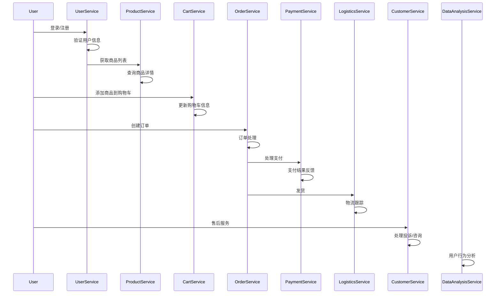

                 

# 持续部署策略：安全高效地发布软件

> 关键词：持续部署、软件发布、自动化、安全性、高效性、DevOps

> 摘要：本文旨在探讨持续部署（Continuous Deployment，简称CD）的策略，如何安全高效地实现软件的发布。通过逐步分析持续部署的基础概念、流程与工具，以及安全与高效实现的方法，为读者提供一套完整、实用的持续部署指南。

### 目录大纲

----------------------------------------------------------------

## 第一部分：持续部署基础

### 第1章：持续部署概述

- 1.1 持续部署的定义与重要性
- 1.2 持续部署的目标与原则
- 1.3 持续部署与传统部署对比

### 第2章：持续部署的流程与工具

- 2.1 持续集成
- 2.2 持续交付
- 2.3 持续部署

### 第3章：持续部署策略与实践

- 3.1 安全性策略
- 3.2 可靠性策略
- 3.3 效率提升策略
- 3.4 持续部署最佳实践

## 第二部分：持续部署的安全与高效

### 第4章：持续部署中的安全措施

- 4.1 安全性问题
- 4.2 安全措施

### 第5章：持续部署的高效实现

- 5.1 高效部署方法
- 5.2 优化部署流程
- 5.3 性能优化策略与实践

### 第6章：持续部署中的性能优化

- 6.1 性能测试
- 6.2 性能调优

### 第7章：持续部署的案例分析

- 7.1 电商平台的持续部署实践
- 7.2 金融行业的持续部署实践

## 第三部分：持续部署的未来展望

### 第8章：持续部署的发展趋势

- 8.1 技术发展趋势
- 8.2 持续部署的未来展望

### 第9章：持续部署面临的挑战与对策

- 9.1 持续部署的挑战
- 9.2 面向未来的对策

----------------------------------------------------------------

## 第一部分：持续部署基础

### 第1章：持续部署概述

**1.1 持续部署的定义与重要性**

持续部署（Continuous Deployment，简称CD）是一种自动化软件发布流程，它通过在开发过程中频繁地构建、测试和部署软件，以实现快速、可靠和稳定的软件发布。与传统部署方式相比，持续部署的核心在于自动化和快速反馈。

持续部署的重要性体现在以下几个方面：

1. **提高开发效率**：通过自动化工具，持续部署减少了手动操作和重复性工作的需要，从而提高了开发效率。
2. **降低风险**：持续部署能够及时发现和修复问题，降低了软件发布时的风险。
3. **提高软件质量**：频繁的测试和反馈有助于发现和解决潜在的问题，从而提高了软件的质量。
4. **缩短发布周期**：持续部署减少了发布周期，使得团队能够更快地响应市场需求。

**1.2 持续部署的目标与原则**

持续部署的目标是实现快速、可靠和稳定的软件发布。为了实现这些目标，持续部署遵循以下原则：

1. **自动化**：通过自动化工具，将构建、测试和部署过程集成到一起，减少手动操作。
2. **频繁发布**：频繁地发布软件，以减少每次发布的工作量和风险。
3. **快速反馈**：及时获取测试结果和用户反馈，以便快速调整和优化。
4. **可靠性和稳定性**：确保每次发布都是可靠的，不影响用户的使用。

**1.3 持续部署与传统部署对比**

持续部署与传统部署有以下几点显著区别：

1. **发布频率**：持续部署强调频繁发布，而传统部署通常在几个月或更长时间才发布一次。
2. **自动化程度**：持续部署高度依赖自动化工具，而传统部署通常需要更多手动操作。
3. **风险控制**：持续部署通过频繁的测试和反馈来控制风险，而传统部署通常在发布前进行全面的测试和验证。
4. **团队协作**：持续部署需要开发、测试、运维等多部门紧密协作，而传统部署通常由不同团队独立完成。

### 第2章：持续部署的流程与工具

**2.1 持续集成**

持续集成（Continuous Integration，简称CI）是将代码集成到共享代码库中，并自动化执行构建和测试的过程。其核心目的是确保代码库中的代码始终处于可构建和可测试的状态。

**持续集成的好处**：

1. **快速发现问题**：通过自动化测试，快速发现和修复集成过程中出现的问题。
2. **提高代码质量**：频繁的测试有助于发现和解决潜在的问题，提高代码质量。
3. **降低风险**：减少代码集成时的风险，确保集成过程的顺利进行。

**持续集成工具的选择与应用**：

1. **Jenkins**：一款流行的开源持续集成工具，支持多种构建工具和版本控制系统。
2. **Travis CI**：一款基于云的持续集成服务，支持多种编程语言和平台。
3. **CircleCI**：一款云原生的持续集成平台，提供高效的构建和部署流程。

**2.2 持续交付**

持续交付（Continuous Delivery，简称CD）是将软件部署到生产环境的过程。持续交付的目标是确保每次交付都是可部署的，并能够在生产环境中运行。

**持续交付的流程**：

1. **构建和测试**：完成持续集成过程中的构建和测试工作。
2. **自动化部署**：将经过测试的软件自动部署到生产环境。
3. **人工审核**：在部署前进行人工审核，确保部署过程的可靠性和稳定性。

**持续交付工具的选择与应用**：

1. **Jenkins**：除了持续集成功能外，Jenkins也支持自动化部署。
2. **Ansible**：一款开源的自动化部署工具，支持大规模的自动化部署和管理。
3. **Kubernetes**：一款开源的容器编排平台，支持自动化部署和弹性扩展。

**2.3 持续部署**

持续部署是将软件发布到生产环境的过程。与持续交付不同，持续部署更侧重于发布过程，包括部署脚本、环境配置和监控等。

**持续部署的概念**：

1. **部署脚本**：使用脚本自动化部署流程，确保部署的一致性和可重复性。
2. **环境配置**：为软件发布准备合适的生产环境，包括服务器、数据库和网络等。
3. **监控**：实时监控软件运行状态，及时发现和处理问题。

**持续部署工具的选择与应用**：

1. **Puppet**：一款开源的配置管理工具，支持自动化部署和管理。
2. **Chef**：一款开源的自动化工具，用于配置管理和部署流程。
3. **Docker**：一款开源的容器化平台，支持自动化部署和容器化应用程序。

### 第3章：持续部署策略与实践

**3.1 安全性策略**

安全性是持续部署过程中不可忽视的重要方面。以下是一些常用的安全性策略：

1. **自动化测试**：定期进行自动化安全测试，发现潜在的安全漏洞。
2. **隔离策略**：在部署过程中，使用隔离策略降低风险，例如将新版本部署到独立的测试环境。
3. **风险控制**：建立风险控制机制，评估和监控潜在的风险。

**3.2 可靠性策略**

可靠性是持续部署的关键目标之一。以下是一些可靠性策略：

1. **灾难恢复计划**：制定灾难恢复计划，确保在发生故障时能够快速恢复服务。
2. **服务级别协议（SLA）**：制定明确的服务级别协议，确保软件服务的稳定性和可靠性。

**3.3 效率提升策略**

提升部署效率是持续部署的重要目标之一。以下是一些效率提升策略：

1. **流水线优化**：优化部署流水线，减少不必要的等待时间。
2. **自动化脚本编写**：编写自动化脚本，减少手动操作。
3. **代码审查**：加强代码审查，确保代码质量，减少发布后的问题。

**3.4 持续部署最佳实践**

以下是一些持续部署的最佳实践：

1. **企业级案例分享**：学习其他企业的成功案例，借鉴其经验。
2. **团队协作与沟通技巧**：加强团队协作，提高沟通效率。
3. **持续改进**：定期评估和改进部署流程，不断提高部署效率和质量。

## 第二部分：持续部署的安全与高效

### 第4章：持续部署中的安全措施

**4.1 安全性问题**

持续部署过程中可能面临以下安全性问题：

1. **代码安全**：代码中可能存在安全漏洞，例如注入攻击、权限提升等。
2. **部署环境安全**：部署环境可能遭受攻击，例如服务器被入侵。
3. **数据安全**：数据在传输和存储过程中可能被窃取或篡改。

**4.2 安全措施**

以下是一些常用的安全措施：

1. **自动化安全测试**：定期进行自动化安全测试，发现潜在的安全漏洞。
2. **访问控制**：严格控制访问权限，确保只有授权用户能够访问关键资源和操作。
3. **加密**：使用加密技术保护数据在传输和存储过程中的安全。

### 第5章：持续部署的高效实现

**5.1 高效部署方法**

以下是一些高效部署方法：

1. **零停机部署**：在部署过程中，尽量减少对用户服务的影响，实现无缝切换。
2. **蓝绿部署**：同时运行两个版本，逐步切换用户到新版本。
3. **灰度发布**：先在部分用户中发布新版本，逐步扩大发布范围。

**5.2 优化部署流程**

以下是一些优化部署流程的方法：

1. **自动化脚本**：编写自动化脚本，减少手动操作，提高部署效率。
2. **流水线优化**：优化部署流水线，减少不必要的等待时间。
3. **代码审查**：加强代码审查，确保代码质量，减少发布后的问题。

**5.3 性能优化策略与实践**

以下是一些性能优化策略和实践：

1. **性能测试**：定期进行性能测试，发现性能瓶颈。
2. **负载均衡**：使用负载均衡技术，提高系统的吞吐量和可用性。
3. **缓存机制**：使用缓存机制，减少数据库和网络的访问次数。

### 第6章：持续部署中的性能优化

**6.1 性能测试**

性能测试是持续部署中的重要环节，以下是一些性能测试的方法：

1. **负载测试**：模拟用户负载，评估系统的性能。
2. **压力测试**：模拟极端负载，评估系统的稳定性和可靠性。
3. **基准测试**：使用标准测试用例，评估系统的性能指标。

**6.2 性能调优**

以下是一些性能调优的方法：

1. **代码优化**：优化代码结构，提高代码效率。
2. **数据库优化**：优化数据库查询和存储结构。
3. **缓存机制**：使用缓存机制，减少数据库和网络的访问次数。

### 第7章：持续部署的案例分析

**7.1 电商平台的持续部署实践**

**项目背景**：

某电商平台在面临高速增长的用户量和业务需求时，决定采用持续部署来提高发布效率和软件质量。

**持续部署策略**：

1. **自动化集成和测试**：使用Jenkins进行自动化集成和测试，确保代码库中的代码始终处于可构建和可测试的状态。
2. **蓝绿部署**：使用蓝绿部署策略，减少对用户服务的影响。
3. **零停机部署**：在部署过程中，尽量减少对用户服务的影响，实现无缝切换。

**部署效果与挑战**：

1. **部署效率提高**：通过自动化集成和测试，部署效率显著提高。
2. **用户体验提升**：零停机部署和蓝绿部署策略，保证了服务的稳定性，提高了用户体验。
3. **挑战**：部署过程中需要严格的安全措施，确保数据和用户信息的安全。

**7.2 金融行业的持续部署实践**

**项目背景**：

某金融公司在进行系统升级和优化时，决定采用持续部署来提高系统的稳定性和可靠性。

**持续部署策略**：

1. **自动化测试**：定期进行自动化安全测试，确保软件质量。
2. **灾难恢复计划**：制定灾难恢复计划，确保在发生故障时能够快速恢复服务。
3. **服务级别协议（SLA）**：制定明确的服务级别协议，确保软件服务的稳定性和可靠性。

**部署效果与挑战**：

1. **稳定性提高**：通过自动化测试和灾难恢复计划，系统稳定性显著提高。
2. **服务可靠**：服务级别协议确保了服务的可靠性，提高了用户满意度。
3. **挑战**：部署过程中需要严格的安全措施，确保金融交易和数据的安全。

## 第三部分：持续部署的未来展望

### 第8章：持续部署的发展趋势

**8.1 技术发展趋势**

持续部署技术的发展趋势主要体现在以下几个方面：

1. **DevOps文化的普及**：DevOps文化强调开发、测试和运维团队的协作，持续部署是实现DevOps目标的重要手段。
2. **容器化和微服务**：容器化和微服务技术的普及，为持续部署提供了更灵活和高效的部署方式。
3. **智能化部署**：随着人工智能技术的发展，智能化部署将成为持续部署的重要方向。

**8.2 持续部署的未来展望**

未来，持续部署将朝着更高效、更安全和更智能的方向发展：

1. **自动化程度更高**：持续部署将更加自动化，减少手动操作，提高部署效率。
2. **安全性更加完善**：持续部署将加强安全措施，确保软件发布过程的安全和可靠。
3. **智能化部署**：通过人工智能技术，实现更智能的部署决策，提高部署效率和效果。

### 第9章：持续部署面临的挑战与对策

**9.1 持续部署的挑战**

持续部署在实施过程中可能面临以下挑战：

1. **安全风险**：持续部署过程中，安全风险较高，需要采取严格的安全措施。
2. **资源消耗**：持续部署需要大量资源支持，特别是在进行大规模部署时。
3. **团队协作**：持续部署需要开发、测试和运维等多部门的协作，沟通和协作的难度较大。

**9.2 面向未来的对策**

为应对持续部署面临的挑战，可以采取以下对策：

1. **加强安全措施**：在部署过程中，加强安全测试和监控，确保软件发布过程的安全。
2. **优化资源管理**：合理分配资源，确保持续部署有足够的资源支持。
3. **提升团队协作**：加强团队间的沟通和协作，提高部署效率和效果。

作者：AI天才研究院/AI Genius Institute & 禅与计算机程序设计艺术 /Zen And The Art of Computer Programming

----------------------------------------------------------------

## 第一部分：持续部署基础

### 第1章：持续部署概述

持续部署（Continuous Deployment，简称CD）是现代软件开发过程中的一项关键实践。它通过自动化和持续的过程，确保软件能够快速、安全、可靠地交付给用户。本章将详细介绍持续部署的定义、重要性、目标与原则，以及与传统部署方式的对比。

### 1.1 持续部署的定义与重要性

**持续部署的定义**

持续部署是一种软件交付模型，它通过自动化的构建、测试、部署流程，实现频繁、可控的软件更新。在这个模型中，每个代码提交后都会自动触发一系列构建和测试步骤，以确保软件的质量和稳定性。如果测试通过，软件将自动部署到生产环境，从而实现持续交付。

**持续部署的重要性**

1. **提高开发效率**：通过自动化和持续的过程，减少手动操作，降低重复性工作，从而提高开发效率。
2. **降低风险**：频繁的小规模更新可以及时识别和修复问题，减少大规模更新带来的风险。
3. **提高软件质量**：通过持续测试和反馈，能够更快地发现并解决潜在的问题，提高软件质量。
4. **快速响应市场变化**：持续部署能够更快地响应市场需求，缩短从开发到交付的周期。
5. **增强团队协作**：持续部署需要各个团队紧密协作，促进团队之间的沟通和协作。

### 1.2 持续部署的目标与原则

**持续部署的目标**

持续部署的主要目标是实现快速、可靠和稳定的软件发布。具体目标包括：

1. **快速发布**：缩短发布周期，实现更快地交付新功能或修复问题。
2. **可靠性**：确保每次发布都是可靠的，不影响用户体验。
3. **安全性**：在快速发布的同时，确保软件的安全性和合规性。
4. **质量**：通过持续的测试和反馈，保证软件的质量和稳定性。

**持续部署的原则**

为了实现持续部署的目标，需要遵循以下原则：

1. **自动化**：将构建、测试和部署过程自动化，减少手动操作，提高效率和一致性。
2. **频繁发布**：频繁地发布软件，以便快速响应变化，降低每次发布的工作量和风险。
3. **快速反馈**：及时获取测试结果和用户反馈，以便快速调整和优化。
4. **可靠性和稳定性**：确保每次发布都是可靠的，不会对用户体验造成负面影响。
5. **安全性和合规性**：在快速发布的同时，确保软件符合安全标准和合规要求。

### 1.3 持续部署与传统部署对比

**持续部署与传统部署的对比**

持续部署与传统部署方式有以下几点显著区别：

1. **发布频率**：持续部署强调频繁发布，而传统部署通常在几个月或更长时间才发布一次。
2. **自动化程度**：持续部署高度依赖自动化工具，而传统部署通常需要更多手动操作。
3. **风险控制**：持续部署通过频繁的测试和反馈来控制风险，而传统部署通常在发布前进行全面的测试和验证。
4. **团队协作**：持续部署需要开发、测试、运维等多部门紧密协作，而传统部署通常由不同团队独立完成。

通过以上对比，我们可以看出，持续部署在提高开发效率、降低风险、提高质量和快速响应市场变化方面具有显著优势。

### 第2章：持续部署的流程与工具

持续部署是一个复杂但高度自动化的过程，涉及多个环节，包括持续集成、持续交付和持续部署。本章将详细介绍这些流程，并探讨相应的工具选择和应用。

### 2.1 持续集成

**持续集成的概念**

持续集成（Continuous Integration，简称CI）是一种软件开发实践，通过自动化构建和测试，确保代码库中的代码始终处于可构建和可测试的状态。每次有新的代码提交到代码库时，CI系统都会自动执行一系列构建和测试任务。

**持续集成的好处**

1. **快速发现问题**：通过自动化测试，可以快速发现代码中的问题，并及时修复。
2. **提高代码质量**：频繁的测试有助于发现和解决潜在的问题，提高代码质量。
3. **降低集成风险**：每次提交都进行集成和测试，可以降低代码集成时的风险。
4. **加快开发进度**：减少由于集成问题导致的项目延误。

**持续集成工具的选择与应用**

1. **Jenkins**：Jenkins 是一款开源的持续集成工具，支持多种构建工具和版本控制系统，适用于各种规模的项目。
   - **应用场景**：适用于大规模项目，特别是需要跨平台构建和测试的项目。
   - **优势**：高度可定制，社区支持丰富。

2. **Travis CI**：Travis CI 是一款基于云的持续集成服务，支持多种编程语言和平台，适用于开源项目。
   - **应用场景**：适用于开源项目，特别是需要自动化测试和部署的项目。
   - **优势**：免费，支持多种编程语言，易于使用。

3. **GitLab CI/CD**：GitLab CI/CD 是 GitLab 自带的一套持续集成和持续交付解决方案。
   - **应用场景**：适用于自建 GitLab 服务器，与 GitLab 的其他功能无缝集成。
   - **优势**：集成度高，易于管理，支持多种部署策略。

### 2.2 持续交付

**持续交付的概念**

持续交付（Continuous Delivery，简称CD）是将代码库中的代码交付到生产环境的过程。持续交付的目标是确保每次交付都是可部署的，并且可以在生产环境中顺利运行。

**持续交付的流程**

1. **构建**：将代码构建为可执行的软件。
2. **测试**：对构建的软件进行一系列测试，包括单元测试、集成测试、性能测试等。
3. **部署**：将经过测试的软件部署到生产环境。

**持续交付工具的选择与应用**

1. **Jenkins**：Jenkins 除了支持持续集成，还支持自动化部署。
   - **应用场景**：适用于需要集成 CI 和 CD 功能的项目。
   - **优势**：功能强大，高度可定制。

2. **Ansible**：Ansible 是一款开源的自动化部署工具，适用于配置管理和部署流程。
   - **应用场景**：适用于需要大规模自动化部署和管理的企业级项目。
   - **优势**：配置简单，易于扩展。

3. **Kubernetes**：Kubernetes 是一款开源的容器编排平台，适用于自动化部署和容器化应用程序。
   - **应用场景**：适用于需要容器化和自动化部署的微服务架构项目。
   - **优势**：灵活性强，支持多种部署策略。

### 2.3 持续部署

**持续部署的概念**

持续部署（Continuous Deployment，简称CD）是将经过测试和验证的软件自动部署到生产环境的过程。持续部署的核心在于自动化和快速发布。

**持续部署的流程**

1. **构建和测试**：使用 CI 工具构建软件并执行测试。
2. **部署脚本**：编写部署脚本，自动化部署流程。
3. **环境配置**：配置生产环境，包括服务器、数据库和网络等。
4. **监控和反馈**：部署后监控软件运行状态，及时获取反馈。

**持续部署工具的选择与应用**

1. **Puppet**：Puppet 是一款开源的配置管理工具，适用于自动化部署和管理。
   - **应用场景**：适用于需要自动化配置和部署的复杂环境。
   - **优势**：配置管理强大，支持多种平台。

2. **Chef**：Chef 是另一款开源的自动化工具，适用于配置管理和部署流程。
   - **应用场景**：适用于需要自动化配置和部署的企业级项目。
   - **优势**：支持多种语言，易于扩展。

3. **Docker**：Docker 是一款开源的容器化平台，适用于自动化部署和容器化应用程序。
   - **应用场景**：适用于需要容器化和自动化部署的微服务架构项目。
   - **优势**：轻量级，易于扩展。

通过以上章节的介绍，我们可以了解到持续部署的流程和工具。在实际应用中，可以根据项目的需求选择合适的工具，并设计相应的部署流程，实现高效、安全、可靠的软件发布。

### 第3章：持续部署策略与实践

在实现持续部署的过程中，除了依赖自动化工具和流程，还需要制定有效的策略和最佳实践，以确保部署过程的安全、可靠和高效。本章将详细介绍安全性策略、可靠性策略、效率提升策略以及持续部署的最佳实践。

#### 3.1 安全性策略

在持续部署中，安全性是至关重要的。以下是一些常用的安全性策略：

**1. 自动化安全测试**

自动化安全测试是确保软件在每次发布前都是安全的必要步骤。通过自动化工具，可以定期执行安全测试，包括漏洞扫描、代码审查和依赖库的安全性检查。

- **工具推荐**：
  - **SonarQube**：一款开源的安全和代码质量平台，支持静态代码分析。
  - **OWASP ZAP**：一款开源的Web应用安全扫描工具。

**2. 隔离策略与风险控制**

在部署过程中，使用隔离策略可以降低风险。例如，将新版本部署到独立的测试环境，逐步扩大测试范围，以确保在全面上线前不会影响生产环境。

- **工具推荐**：
  - **Docker**：通过容器化技术，可以轻松实现环境的隔离和迁移。
  - **Kubernetes**：提供强大的隔离和调度功能，支持灵活的部署策略。

**3. 访问控制和权限管理**

严格的访问控制和权限管理是确保部署环境安全的关键。确保只有授权用户可以执行关键操作，并定期审查和更新权限。

- **工具推荐**：
  - **LDAP**：提供统一的身份验证和访问控制，支持多系统的身份管理。
  - **RBAC**：基于角色的访问控制，可以灵活地定义和管理用户权限。

**4. 加密和传输安全**

数据在传输和存储过程中需要加密，以确保数据的安全性。使用HTTPS、SSL/TLS等加密协议，确保数据在传输过程中的安全。

- **工具推荐**：
  - **Let's Encrypt**：提供免费的SSL/TLS证书，简化加密部署。
  - **HashiCorp Vault**：提供集中化的密钥管理，支持多种加密协议。

#### 3.2 可靠性策略

可靠性是持续部署的重要目标之一。以下是一些可靠性策略：

**1. 灾难恢复计划**

制定灾难恢复计划，确保在发生故障时能够快速恢复服务。包括备份策略、数据恢复流程和应急响应计划。

- **工具推荐**：
  - **Veeam**：提供备份和恢复工具，支持多种平台和存储解决方案。
  - **AWS S3**：提供可靠的对象存储服务，支持多地域备份。

**2. 服务级别协议（SLA）**

制定明确的服务级别协议（SLA），确保软件服务的稳定性和可靠性。包括响应时间、故障恢复时间和可用性指标。

- **工具推荐**：
  - **Pingdom**：提供网站监控和性能测试工具，确保服务稳定性。
  - **AWS CloudWatch**：提供监控和告警服务，实时跟踪系统性能。

**3. 自动化监控**

通过自动化监控工具，实时监控软件的运行状态，及时发现和处理问题。监控范围包括系统资源使用、应用程序性能和网络安全。

- **工具推荐**：
  - **Nagios**：一款开源的监控工具，支持多种插件和监控类型。
  - **Prometheus**：一款开源的监控解决方案，支持时间序列数据和告警。

#### 3.3 效率提升策略

为了提高持续部署的效率，以下策略可以帮助优化流程：

**1. 流水线优化**

优化持续集成和部署流水线，减少不必要的等待时间和重复操作。通过并行执行任务，提高整体效率。

- **工具推荐**：
  - **Jenkins Pipeline**：Jenkins 的流水线插件，支持自动化构建和部署流程。
  - **GitLab CI/CD**：GitLab 的 CI/CD 工具，提供灵活的流水线定义。

**2. 自动化脚本编写**

编写高效的自动化脚本，减少手动操作和重复性工作。自动化脚本可以包括构建脚本、测试脚本和部署脚本。

- **工具推荐**：
  - **Ansible**：一款开源的自动化工具，支持配置管理和自动化部署。
  - **Puppet**：一款开源的配置管理工具，支持自动化脚本编写和执行。

**3. 零停机部署**

通过零停机部署策略，减少对用户服务的影响。例如，使用蓝绿部署或灰度发布，逐步切换用户到新版本。

- **工具推荐**：
  - **Kubernetes**：支持容器化应用程序的自动化部署和管理。
  - **Docker**：提供轻量级容器化平台，支持高效部署和扩展。

#### 3.4 持续部署最佳实践

以下是一些持续部署的最佳实践，可以帮助团队实现高效的持续部署：

**1. 企业级案例分享**

学习其他企业的成功案例，了解他们在持续部署方面的经验和最佳实践。例如，GitHub、Netflix 和 Amazon 等公司的持续部署实践。

**2. 团队协作与沟通技巧**

持续部署需要多个团队的紧密协作，包括开发、测试、运维和安全团队。建立有效的沟通机制，确保信息传递和问题解决的及时性。

**3. 持续改进**

定期评估和改进持续部署流程，根据反馈和经验调整策略和工具。通过持续改进，不断提高部署效率和质量。

通过本章的介绍，我们可以了解到持续部署的有效策略和实践。在实际应用中，根据项目的需求和环境，选择合适的工具和策略，可以大大提高持续部署的效率和安全。

### 第二部分：持续部署的安全与高效

#### 第4章：持续部署中的安全措施

在持续部署过程中，安全性是至关重要的。随着频繁的代码提交和自动化的部署，系统可能面临各种安全风险。本章将讨论持续部署过程中可能面临的安全性问题和相应的安全措施。

#### 4.1 安全性问题

持续部署过程中可能面临以下安全性问题：

**1. 代码安全**

代码安全是持续部署中的一个重要方面。如果代码中存在安全漏洞，如SQL注入、跨站脚本（XSS）或跨站请求伪造（CSRF），攻击者可以利用这些漏洞窃取用户信息或控制服务器。

**2. 部署环境安全**

部署环境可能成为攻击目标。未经授权的访问、配置错误或系统漏洞都可能被攻击者利用，导致数据泄露或服务中断。

**3. 数据安全**

在部署过程中，数据可能在不同系统之间传输，如果传输过程中未加密，数据可能被窃取或篡改。

**4. 身份验证和授权**

在持续部署过程中，需要确保只有授权人员才能执行关键操作。如果身份验证和授权机制不健全，可能导致未授权的访问或操作。

**5. 网络安全**

持续部署过程中，系统与外部网络频繁交互，可能面临网络攻击，如DDoS攻击或中间人攻击。

#### 4.2 安全措施

为了确保持续部署的安全，可以采取以下安全措施：

**1. 自动化安全测试**

定期执行自动化安全测试，如漏洞扫描和代码审计，以发现和修复潜在的安全漏洞。

- **工具推荐**：
  - **SonarQube**：一款开源的静态代码分析工具，用于识别代码中的安全漏洞。
  - **OWASP ZAP**：一款开源的Web应用安全测试工具，用于自动发现安全漏洞。

**2. 隔离策略**

在部署过程中，使用隔离策略降低风险。例如，将新版本部署到独立的测试环境，逐步扩大测试范围。

- **工具推荐**：
  - **Docker**：通过容器化技术，实现环境的隔离和迁移。
  - **Kubernetes**：提供强大的隔离和调度功能，支持灵活的部署策略。

**3. 访问控制和权限管理**

确保只有授权用户可以执行关键操作。使用基于角色的访问控制（RBAC）和身份验证机制，如OAuth 2.0或LDAP。

- **工具推荐**：
  - **LDAP**：提供统一的身份验证和访问控制。
  - **RBAC**：基于角色的访问控制，灵活地定义和管理用户权限。

**4. 加密和传输安全**

使用加密技术保护数据在传输和存储过程中的安全。使用HTTPS、SSL/TLS等加密协议，确保数据传输的安全。

- **工具推荐**：
  - **Let's Encrypt**：提供免费的SSL/TLS证书。
  - **HashiCorp Vault**：提供集中化的密钥管理。

**5. 日志和监控**

实时监控系统的运行状态，记录操作日志，以便在发生安全事件时进行追踪和审计。

- **工具推荐**：
  - **ELK Stack**（Elasticsearch、Logstash、Kibana）：用于日志收集、存储和可视化。
  - **Splunk**：一款强大的日志分析和监控工具。

通过以上安全措施，可以大大提高持续部署的安全性，确保软件发布过程的安全和可靠。

#### 第5章：持续部署的高效实现

持续部署的目标是高效、可靠地发布软件，以快速响应市场需求。实现高效部署不仅能够减少发布时间和成本，还能提高用户体验。本章将探讨高效部署的方法、优化部署流程的策略以及性能优化策略与实践。

#### 5.1 高效部署方法

为了实现高效部署，可以采用以下方法：

**1. 零停机部署**

零停机部署是一种在发布新版本时尽量减少服务中断的方法。通过蓝绿部署或灰度发布，可以逐步将用户切换到新版本，从而实现零停机。

- **蓝绿部署**：同时运行两个相同的环境，一个为旧版本（蓝色），一个为新版本（绿色）。逐步将流量切换到新版本，确保服务稳定性。
- **灰度发布**：先在部分用户中发布新版本，逐步扩大发布范围，根据用户反馈调整发布策略。

**2. 自动化部署**

自动化部署是持续部署的核心，通过脚本或工具实现部署过程的自动化，可以减少人为错误和重复劳动。

- **工具推荐**：
  - **Ansible**：一款开源的自动化工具，用于配置管理和部署流程。
  - **Puppet**：一款开源的配置管理工具，支持自动化部署和管理。

**3. 流水线优化**

优化持续集成和部署流水线，减少不必要的等待时间和重复操作。通过并行执行任务，提高整体效率。

- **工具推荐**：
  - **Jenkins**：支持自动化构建和部署流水线。
  - **GitLab CI/CD**：提供灵活的流水线定义和执行。

#### 5.2 优化部署流程

为了提高部署效率，可以采取以下策略：

**1. 部署脚本优化**

编写高效、可维护的部署脚本，确保部署流程的稳定性和一致性。使用版本控制系统管理脚本，以便快速回滚和更新。

- **最佳实践**：
  - 使用模块化脚本，便于维护和扩展。
  - 使用参数化脚本，提高脚本的可定制性。

**2. 环境配置管理**

使用配置管理工具管理不同环境的配置，确保环境的一致性和可靠性。自动化环境配置，减少手动操作。

- **工具推荐**：
  - **Ansible**：支持自动化配置管理。
  - **Puppet**：提供强大的配置管理功能。

**3. 持续监控和反馈**

部署后，实时监控软件运行状态，及时发现和处理问题。通过自动化告警和日志分析，提高问题响应速度。

- **工具推荐**：
  - **Prometheus**：用于监控和告警。
  - **ELK Stack**：用于日志收集、存储和分析。

#### 5.3 性能优化策略与实践

部署的高效性不仅体现在发布流程中，还体现在软件的实际性能上。以下是一些性能优化策略和实践：

**1. 性能测试**

定期进行性能测试，评估系统的性能瓶颈，包括响应时间、吞吐量和并发处理能力。

- **工具推荐**：
  - **Apache JMeter**：一款开源的性能测试工具，用于模拟用户负载。
  - **Gatling**：一款高性能的负载测试工具，支持多种协议和场景。

**2. 缓存机制**

使用缓存机制减少数据库和网络的访问次数，提高系统的响应速度。

- **最佳实践**：
  - 使用内存缓存，如Redis或Memcached。
  - 使用分布式缓存，如Ehcache或Consul。

**3. 负载均衡**

使用负载均衡器分配网络负载，提高系统的吞吐量和可用性。

- **工具推荐**：
  - **Nginx**：一款开源的负载均衡器和反向代理服务器。
  - **HAProxy**：一款高性能的负载均衡工具，支持多种负载均衡算法。

通过以上高效部署方法、部署流程优化和性能优化策略，可以大大提高持续部署的效率，实现快速、可靠和高质量的软件发布。

### 第6章：持续部署中的性能优化

持续部署不仅仅是关于代码的交付，更重要的是确保交付的软件能够稳定、高效地运行。性能优化在持续部署中起着至关重要的作用，它直接影响用户体验和业务成功。本章将探讨持续部署中的性能优化，包括性能测试、性能调优的方法和实践。

#### 6.1 性能测试

性能测试是评估软件系统在特定负载下的行为和性能的关键步骤。通过性能测试，可以发现系统的瓶颈和不足，为性能优化提供依据。

**性能测试的类型**

1. **负载测试**：模拟大量用户同时访问系统，评估系统的响应时间、吞吐量和资源利用率。
2. **压力测试**：在极端条件下测试系统的性能，以确定系统的最大处理能力和稳定性能。
3. **容量测试**：评估系统在不断增加负载时的表现，以确定系统的扩展能力。
4. **性能回归测试**：在新版本发布前，验证性能是否受到影响，确保没有性能退步。

**性能测试工具的选择**

1. **Apache JMeter**：一款开源的性能测试工具，支持多种协议和负载生成。
2. **Gatling**：一款高性能的负载测试工具，支持HTTP、WebSocket等多种协议。
3. **LoadRunner**：一款商业性能测试工具，提供丰富的功能和高可靠性。

**性能测试的最佳实践**

1. **全面测试**：覆盖不同场景和用户行为，确保测试结果全面。
2. **自动化**：构建自动化性能测试流程，确保每次发布前都能进行性能验证。
3. **基准测试**：建立基准测试用例，用于比较不同版本的性能表现。

#### 6.2 性能调优

性能调优是在性能测试中发现问题后，对系统进行优化以提高性能的过程。性能调优可以涉及多个方面，包括代码、数据库、服务器和网络。

**常见的性能问题**

1. **数据库查询慢**：数据库查询效率低下，导致系统响应时间增加。
2. **内存泄漏**：应用程序内存占用不断增加，导致系统崩溃或性能下降。
3. **网络延迟**：网络传输速度慢，导致数据传输延迟。
4. **资源瓶颈**：系统资源（如CPU、内存、磁盘）不足，导致性能瓶颈。

**性能调优策略**

1. **代码优化**：优化代码逻辑和算法，减少不必要的计算和资源消耗。
   - **最佳实践**：使用Profiler工具分析代码性能，找出瓶颈并进行优化。
   - **工具推荐**：Python的cProfile、Java的VisualVM。

2. **数据库优化**：优化数据库查询和索引，提高数据库性能。
   - **最佳实践**：使用EXPLAIN分析查询计划，优化查询语句和索引。
   - **工具推荐**：MySQL的EXPLAIN、PostgreSQL的pg_stat_statements。

3. **缓存机制**：使用缓存减少数据库和网络的访问次数，提高系统响应速度。
   - **最佳实践**：使用内存缓存（如Redis、Memcached）和分布式缓存（如Ehcache）。
   - **工具推荐**：Redis、Memcached、Ehcache。

4. **负载均衡**：使用负载均衡器分配网络负载，提高系统的吞吐量和可用性。
   - **最佳实践**：选择合适的负载均衡算法，确保流量分配均衡。
   - **工具推荐**：Nginx、HAProxy。

**性能优化的最佳实践**

1. **持续监控**：实时监控系统性能，及时发现性能问题。
2. **迭代优化**：定期进行性能测试和优化，逐步提升系统性能。
3. **自动化**：构建自动化性能优化流程，确保每次发布后都能进行性能验证。

通过性能测试和性能调优，可以确保持续部署的软件在高负载下仍能保持高性能，从而提升用户体验和业务效率。

### 第7章：持续部署的案例分析

在本章中，我们将通过两个具体案例——一个电商平台的持续部署实践和一个金融行业的持续部署实践——来探讨持续部署在不同行业中的应用和挑战。通过这些案例，读者可以更好地理解持续部署的实际操作和潜在问题。

#### 7.1 电商平台的持续部署实践

**项目背景**

某知名电商平台在经历高速增长的用户量和交易量后，决定采用持续部署来提高系统的可靠性和发布效率。平台的主要业务包括在线购物、支付、物流和客户服务，持续部署的实施将直接影响到用户体验和业务运营。

**持续部署策略**

1. **自动化测试**：电商平台采用自动化测试工具，包括单元测试、集成测试和性能测试，确保每次提交的代码都能快速、可靠地通过测试。
2. **持续集成**：使用Jenkins作为持续集成工具，构建和测试流程自动化，确保代码库中的代码始终处于可构建和可测试状态。
3. **零停机部署**：采用蓝绿部署策略，同时运行两个版本，逐步将用户流量切换到新版本，确保服务不间断。
4. **灰度发布**：在发布新版本时，先在小部分用户中进行测试，根据用户反馈逐步扩大发布范围，确保稳定性。

**部署效果与挑战**

**部署效果**：

- **发布效率提高**：自动化测试和持续集成使得发布周期显著缩短，从过去的几个月缩短到几天甚至几小时。
- **用户体验提升**：零停机部署和灰度发布策略确保了服务的连续性和稳定性，用户反馈良好。
- **故障响应速度加快**：通过自动化监控和实时反馈，能够迅速发现和解决潜在问题，降低故障率。

**挑战**：

- **安全性保障**：持续部署增加了安全风险，需要对部署流程和代码进行严格的安全审查和测试。
- **资源管理**：随着发布频率的增加，对服务器、存储和网络资源的消耗也随之增加，需要优化资源分配和管理。

#### 7.2 金融行业的持续部署实践

**项目背景**

某大型金融公司因其业务性质对系统的可靠性和安全性要求极高，决定引入持续部署以提高系统的敏捷性和响应速度。金融公司的业务包括股票交易、支付结算、贷款审批等，持续部署将对其业务流程和客户体验产生重大影响。

**持续部署策略**

1. **自动化测试**：实施严格的自动化测试流程，包括单元测试、集成测试、性能测试和安全测试，确保软件质量。
2. **持续交付**：使用GitLab CI/CD进行自动化构建和部署，确保每次代码提交都能顺利通过测试并部署到生产环境。
3. **灾难恢复计划**：制定详尽的灾难恢复计划，确保在发生故障时系统能够迅速恢复，减少业务中断时间。
4. **服务级别协议（SLA）**：与各个业务部门签订明确的服务级别协议，确保软件服务的稳定性和可靠性。

**部署效果与挑战**

**部署效果**：

- **业务响应速度提升**：通过持续交付，金融公司能够更快地响应市场需求，缩短新产品或功能的上线时间。
- **风险管理**：自动化测试和严格的SLA确保了每次发布都是可靠和安全的，降低了业务风险。
- **用户体验**：系统的稳定性和可靠性提高，客户满意度增加。

**挑战**：

- **合规性要求**：金融行业对合规性要求极高，持续部署过程中需要严格遵守相关法规和标准。
- **系统复杂性**：金融系统的复杂性和依赖性较高，持续部署需要细致的规划和测试，以避免潜在的系统故障。

通过以上两个案例，我们可以看到持续部署在提高发布效率、稳定性以及客户满意度方面的重要作用。同时，不同行业在实施持续部署过程中也会面临各自独特的挑战，需要根据具体情况进行调整和优化。

### 第三部分：持续部署的未来展望

#### 第8章：持续部署的发展趋势

随着技术的不断进步，持续部署也在不断演变，以适应现代软件开发的复杂性和需求。本章将探讨持续部署技术的发展趋势和未来展望。

#### 8.1 技术发展趋势

**1. DevOps与持续部署**

DevOps是一种文化、实践和工具的综合体，旨在通过开发（Development）和运营（Operations）的紧密协作，提高软件交付的速度和质量。持续部署是DevOps实践的重要组成部分，未来将持续与DevOps紧密结合。

- **趋势**：持续部署将进一步融入DevOps文化，强调跨职能团队的协作，实现端到端的责任和效率。
- **影响**：DevOps文化的普及将推动持续部署工具和流程的标准化和自动化，提高整体交付效率。

**2. 容器化与微服务**

容器化（如Docker）和微服务架构（Microservices Architecture）是现代软件开发的重要趋势，它们为持续部署提供了更灵活和高效的部署方式。

- **趋势**：持续部署将更多地利用容器化和微服务架构，实现快速、可扩展的部署和管理。
- **影响**：容器化和微服务架构将简化持续部署的流程，提高系统的弹性和可恢复性。

**3. 智能化部署**

随着人工智能（AI）技术的发展，智能化部署（Intelligent Deployment）将成为持续部署的重要方向。

- **趋势**：智能化部署将利用AI技术进行部署决策，提高部署的效率和准确性。
- **影响**：智能化部署将实现更智能的部署策略，减少人为错误，提高系统稳定性。

#### 8.2 持续部署的未来展望

未来，持续部署将朝着更高效、更安全和更智能的方向发展。

**1. 自动化程度更高**

随着技术的进步，持续部署的自动化程度将不断提高，减少手动操作和重复性工作，提高开发效率和发布速度。

**2. 安全性更加完善**

随着对安全性需求的增加，持续部署将加强安全措施，包括自动化安全测试、加密和数据保护等，确保软件发布过程的安全和可靠。

**3. 智能化部署**

智能化部署将利用AI技术，实现更智能的部署决策和优化，提高系统的性能和可用性。

**4. 生态系统建设**

持续部署将形成更加完善的生态系统，包括工具、平台、服务和社区，为开发者和企业提供全面的支持和解决方案。

通过以上趋势和展望，我们可以看到持续部署在未来将继续发挥重要作用，成为软件开发和运营的重要驱动力。

### 第9章：持续部署面临的挑战与对策

尽管持续部署在提高软件交付速度和质量方面具有显著优势，但在实际应用中仍然面临诸多挑战。本章将探讨持续部署面临的挑战，并提出相应的对策。

#### 9.1 持续部署的挑战

**1. 安全性问题**

持续部署过程中，频繁的代码提交和自动化流程可能引入安全漏洞，导致数据泄露或系统被攻击。此外，自动化测试可能无法完全覆盖所有安全场景，存在安全风险。

**2. 资源消耗**

持续部署需要大量的服务器、存储和网络资源，特别是在进行大规模部署时，可能导致资源不足，影响系统性能。

**3. 团队协作**

持续部署需要开发、测试、运维等多个团队的紧密协作，但不同团队之间存在沟通和协作障碍，可能导致部署过程受阻。

**4. 压力测试不足**

在持续部署过程中，可能忽视对系统在高负载和极端条件下的性能测试，导致系统在实际运行时出现性能问题。

**5. 法规合规**

在某些行业（如金融、医疗等），持续部署需要严格遵守相关法规和合规要求，但自动化流程可能难以完全满足这些要求。

#### 9.2 面向未来的对策

为了应对持续部署面临的挑战，可以采取以下对策：

**1. 加强安全性措施**

- **自动化安全测试**：引入自动化安全测试工具，定期执行安全测试，发现潜在漏洞。
- **安全培训**：加强对开发者的安全培训，提高他们的安全意识和能力。
- **安全审计**：定期进行安全审计，评估系统的安全性，及时修补漏洞。

**2. 优化资源管理**

- **资源监控**：实时监控资源使用情况，确保有足够的资源支持持续部署。
- **容器化**：利用容器化技术，提高资源利用率，减少资源浪费。
- **云服务**：采用云服务，根据需求灵活调整资源，避免资源过剩或不足。

**3. 提升团队协作**

- **跨职能团队**：建立跨职能团队，加强团队之间的沟通和协作。
- **协作工具**：使用协作工具，如Jira、Slack，确保信息传递和问题解决的及时性。
- **共同目标**：明确团队共同的目标和期望，提高团队的凝聚力和协作效率。

**4. 强化压力测试**

- **压力测试**：定期进行压力测试，评估系统在高负载和极端条件下的性能。
- **性能调优**：根据压力测试结果，对系统进行性能调优，提高系统稳定性。
- **持续反馈**：将压力测试结果纳入持续部署流程，确保每次发布都是可靠的。

**5. 法规合规**

- **合规检查**：在持续部署过程中，严格执行法规和合规要求，确保系统符合相关标准。
- **合规培训**：加强对开发者和运维人员的相关法规和合规知识培训。
- **合规监控**：建立合规监控机制，确保持续部署过程中的合规性。

通过以上对策，可以有效地应对持续部署面临的挑战，确保持续部署的安全、高效和合规。

### 总结

持续部署作为一种高效的软件开发和发布模型，已经在众多企业中得到广泛应用。它通过自动化和持续的过程，提高了软件交付的速度和质量，降低了风险和成本。然而，持续部署也面临诸多挑战，包括安全性、资源消耗、团队协作和法规合规等。为了应对这些挑战，我们需要采取一系列有效对策，加强安全性、优化资源管理、提升团队协作和确保合规性。

持续部署的未来趋势是更加自动化、安全化和智能化。随着DevOps文化的普及、容器化和微服务技术的发展，持续部署将变得更加灵活和高效。同时，人工智能技术的引入将进一步提升持续部署的智能化水平。

为了成功地实施持续部署，企业需要建立健全的持续部署流程和策略，加强团队协作和沟通，持续优化和改进部署过程。通过持续部署，企业可以更快地响应市场变化，提高用户满意度，实现业务的快速增长。

持续部署不仅是一种技术实践，更是一种企业文化。它要求企业各个部门紧密协作，共同推动持续部署的落地和优化。只有建立起持续学习的文化，不断吸取经验教训，才能在持续部署的道路上走得更远、更稳。

持续部署的策略与实践是一个不断演变的过程，随着技术的发展和业务需求的变化，我们将继续探索和优化持续部署的最佳实践。希望本文能为您在持续部署的道路上提供一些启示和帮助，祝您在持续部署的实践中取得成功！

### 持续部署策略：安全高效地发布软件

作者：AI天才研究院/AI Genius Institute & 禅与计算机程序设计艺术 /Zen And The Art of Computer Programming

----------------------------------------------------------------

在本文中，我们详细探讨了持续部署策略，旨在帮助您安全高效地发布软件。持续部署通过自动化和持续的过程，提高了软件交付的速度和质量，降低了风险和成本。以下是本文的主要内容和结构：

## 第一部分：持续部署基础

### 第1章：持续部署概述

- 1.1 持续部署的定义与重要性
- 1.2 持续部署的目标与原则
- 1.3 持续部署与传统部署对比

### 第2章：持续部署的流程与工具

- 2.1 持续集成
- 2.2 持续交付
- 2.3 持续部署

### 第3章：持续部署策略与实践

- 3.1 安全性策略
- 3.2 可靠性策略
- 3.3 效率提升策略
- 3.4 持续部署最佳实践

## 第二部分：持续部署的安全与高效

### 第4章：持续部署中的安全措施

- 4.1 安全性问题
- 4.2 安全措施

### 第5章：持续部署的高效实现

- 5.1 高效部署方法
- 5.2 优化部署流程
- 5.3 性能优化策略与实践

### 第6章：持续部署中的性能优化

- 6.1 性能测试
- 6.2 性能调优

### 第7章：持续部署的案例分析

- 7.1 电商平台的持续部署实践
- 7.2 金融行业的持续部署实践

## 第三部分：持续部署的未来展望

### 第8章：持续部署的发展趋势

- 8.1 技术发展趋势
- 8.2 持续部署的未来展望

### 第9章：持续部署面临的挑战与对策

- 9.1 持续部署的挑战
- 9.2 面向未来的对策

本文结构清晰，内容详实，旨在为读者提供一套全面、实用的持续部署指南。无论您是持续部署的新手，还是希望在现有基础上进一步优化持续部署策略的专家，本文都能为您提供有价值的参考。

在第一部分，我们介绍了持续部署的基础知识，包括其定义、重要性、目标和原则，以及与传统部署方式的对比。这部分内容为您奠定了理解和实施持续部署的基础。

第二部分和第三部分分别从安全与高效两个角度探讨了持续部署的策略和实践。第二部分重点关注持续部署中的安全措施，包括自动化安全测试、隔离策略、访问控制等。第三部分则从部署流程、效率提升和性能优化等方面，提供了一系列实用的方法和最佳实践。

最后，通过电商和金融行业的案例分析，我们展示了持续部署在不同行业中的应用和挑战。这些案例不仅为您提供了实际操作的经验，还帮助您了解持续部署在不同场景下的具体实现。

本文的目标是帮助您实现安全高效地发布软件。通过本文的阅读和实践，您将能够：

- **理解持续部署的核心概念和重要性**：掌握持续部署的基本原理和目标，了解其在软件开发中的应用和价值。
- **制定有效的持续部署策略**：根据项目需求，选择合适的工具和流程，制定详细的部署策略，确保软件的可靠性和安全性。
- **优化部署流程和性能**：通过自动化、优化和性能调优，提高持续部署的效率和软件性能，提升用户体验。
- **应对持续部署的挑战**：了解持续部署中可能面临的挑战，并采取有效的对策，确保持续部署的成功实施。

希望本文能为您在持续部署的道路上提供指导和支持。通过实践和应用本文提供的方法，您将能够实现更高效、更安全的软件发布，为您的企业带来更大的价值和竞争力。

### 背景介绍

持续部署（Continuous Deployment，简称CD）是现代软件开发和运维中的一项关键实践。它通过自动化和持续的过程，确保软件能够快速、安全、可靠地交付给用户。随着互联网和云计算技术的迅猛发展，软件更新频率日益增加，用户对软件质量和响应速度的要求也越来越高。持续部署作为一种高效、可靠的发布模型，能够满足这些需求，帮助企业实现持续创新和快速响应市场变化。

首先，我们需要明确一些核心概念和术语：

1. **持续部署**：持续部署是一种软件交付模型，通过自动化和持续的过程，实现频繁、可控的软件更新。它包括持续集成（CI）和持续交付（CD）等环节，旨在减少手动操作和重复性工作，提高开发效率和软件质量。

2. **持续集成**（Continuous Integration，简称CI）：持续集成是将代码集成到共享代码库中，并自动化执行构建和测试的过程。其目的是确保代码库中的代码始终处于可构建和可测试的状态。

3. **持续交付**（Continuous Delivery，简称CD）：持续交付是将代码库中的代码交付到生产环境的过程。持续交付的目标是确保每次交付都是可部署的，并能够在生产环境中顺利运行。

4. **自动化**：自动化是指使用工具和脚本将软件开发、测试和部署过程自动化，减少手动操作，提高效率和一致性。

5. **安全性**：安全性是指确保软件和系统在开发、测试和部署过程中不受恶意攻击和数据泄露的影响。

6. **可靠性**：可靠性是指软件在多次发布后仍能保持稳定运行，不影响用户体验。

7. **性能优化**：性能优化是指通过改进代码、数据库查询和系统配置等，提高软件的响应速度和处理能力。

在当前软件开发和运维环境下，持续部署的重要性体现在以下几个方面：

1. **提高开发效率**：通过自动化工具，持续部署减少了手动操作和重复性工作的需要，从而提高了开发效率。

2. **降低风险**：持续部署通过频繁的测试和反馈，能够及时发现和修复问题，降低了软件发布时的风险。

3. **提高软件质量**：频繁的测试和反馈有助于发现和解决潜在的问题，提高软件的质量。

4. **缩短发布周期**：持续部署减少了发布周期，使得团队能够更快地响应市场需求。

5. **增强团队协作**：持续部署需要开发、测试、运维等多部门紧密协作，促进了团队之间的沟通和协作。

6. **支持敏捷开发**：持续部署与敏捷开发方法紧密结合，支持快速迭代和频繁发布，提高了团队的敏捷性和响应能力。

然而，持续部署也面临一些挑战，如安全性、资源管理和团队协作等。为了成功实施持续部署，企业需要建立健全的流程和策略，加强团队协作，持续优化和改进部署过程。

本章节旨在为您提供一个全面、深入的背景介绍，帮助您更好地理解持续部署的核心概念和重要性，为后续章节的学习和实践打下坚实的基础。

### 核心概念与联系

在探讨持续部署策略时，我们需要明确几个核心概念，并理解它们之间的相互关系。以下是持续部署中的关键概念及其属性特征对比表格，以及对应的ER实体关系图架构。

#### 核心概念及其属性特征对比表格

| 概念       | 属性特征                                                   |
|------------|----------------------------------------------------------|
| 持续集成   | 自动化构建和测试代码，确保代码库中的代码始终处于可构建和可测试的状态。 |
| 持续交付   | 将代码库中的代码交付到生产环境，确保每次交付都是可部署的。          |
| 持续部署   | 将经过测试的代码自动部署到生产环境。                            |
| 自动化     | 使用工具和脚本将软件开发、测试和部署过程自动化。                  |
| 安全性     | 确保软件和系统在开发、测试和部署过程中不受恶意攻击和数据泄露的影响。 |
| 可靠性     | 确保软件在多次发布后仍能保持稳定运行。                          |
| 性能优化   | 提高软件的响应速度和处理能力。                                  |

#### ER实体关系图架构

```mermaid
erDiagram
  Product ||--|{ Deployment }||>
  Deployment ||--|{ DeploymentStep }||>
  DeploymentStep ||--|{ CIProcess,CDProcess }||>
  CIProcess ||--|{ Build,Test }||>
  CDProcess ||--|{ Deploy,Monitor }||>

  ProductPK --> DeploymentPK
  DeploymentPK --> DeploymentStepPK
  DeploymentStepPK --> CIProcessPK
  DeploymentStepPK --> CDProcessPK
```

在这个ER实体关系图中，我们定义了以下实体：

1. **Product（产品）**：代表软件产品，是持续部署的核心对象。
2. **Deployment（部署）**：代表一次部署活动，包括从代码库中取代码到生产环境的整个过程。
3. **DeploymentStep（部署步骤）**：代表部署过程中的一个步骤，如构建、测试、部署等。
4. **CIProcess（持续集成过程）**：代表持续集成过程中的任务，如构建和测试。
5. **CDProcess（持续交付过程）**：代表持续交付过程中的任务，如部署和监控。

这些实体之间的关系如下：

- **Product** 与 **Deployment** 之间是一对多的关系，一个产品可以有多种部署。
- **Deployment** 与 **DeploymentStep** 之间是一对多的关系，一个部署可以包含多个步骤。
- **DeploymentStep** 与 **CIProcess**、**CDProcess** 之间是多对一的关系，一个部署步骤可以包含多个CI或CD过程。

通过上述表格和ER实体关系图，我们可以清晰地理解持续部署中的核心概念及其相互关系。这些概念不仅构成了持续部署的理论基础，也为后续的实践提供了指导。

### 算法原理讲解

在持续部署中，算法原理的讲解至关重要，因为它涉及到如何高效、自动化地构建、测试和部署软件。以下我们将通过一个具体的持续部署算法——持续集成与持续交付（CI/CD）算法——来详细阐述其原理和实现。

#### 持续集成与持续交付算法

**1. 持续集成（CI）算法原理**

持续集成（Continuous Integration）的核心目标是通过自动化构建和测试，确保代码库中的代码始终处于可构建和可测试的状态。以下是CI算法的基本步骤：

**步骤1：代码提交**
- 开发者将新的代码提交到代码库。

**步骤2：自动化构建**
- CI工具（如Jenkins）检测到代码提交，并触发构建过程。
- 构建过程包括编译代码、打包和构建可执行文件。

**步骤3：自动化测试**
- 构建成功后，CI工具自动运行一系列测试，包括单元测试、集成测试和性能测试。
- 如果测试通过，继续下一步；否则，停止构建并通知开发者。

**步骤4：反馈**
- 测试结果通过邮件、Slack或其他方式通知相关开发者。

**2. 持续交付（CD）算法原理**

持续交付（Continuous Delivery）的目标是将通过测试的代码交付到生产环境。以下是CD算法的基本步骤：

**步骤1：构建和测试验证**
- 在CI阶段，代码已经通过了构建和测试。

**步骤2：自动化部署**
- CD工具（如Jenkins或GitLab CI）根据预设的部署脚本，将代码部署到测试环境或生产环境。
- 部署过程包括配置服务器、数据库、网络等。

**步骤3：监控**
- 部署后，系统会进行实时监控，确保新部署的代码能够正常运行。
- 如果监控发现任何问题，系统会自动回滚到上一个稳定版本。

**3. 数学模型和公式**

为了更好地理解CI/CD算法，我们可以将其部分过程抽象为数学模型。以下是一个简化的模型：

**构建时间模型：**
$$ T_{build} = f(n, T_{compile}, T_{test}) $$
- \( T_{build} \)：构建时间
- \( n \)：测试数量
- \( T_{compile} \)：编译时间
- \( T_{test} \)：测试时间

**部署时间模型：**
$$ T_{deploy} = f(m, T_{config}, T_{network}, T_{verification}) $$
- \( T_{deploy} \)：部署时间
- \( m \)：配置项数量
- \( T_{config} \)：配置时间
- \( T_{network} \)：网络时间
- \( T_{verification} \)：验证时间

**4. 举例说明**

假设我们有一个Web应用，包含10个模块。每次代码提交后，CI系统会执行以下操作：

**步骤1：自动化构建**
- 编译时间：\( T_{compile} = 2 \) 分钟
- 测试时间：\( T_{test} = 3 \) 分钟

**步骤2：自动化测试**
- 单元测试：通过，耗时1分钟
- 集成测试：通过，耗时1分钟
- 性能测试：通过，耗时1分钟

**步骤3：反馈**
- 测试通过，通知开发者

**步骤4：自动化部署**
- 配置时间：\( T_{config} = 2 \) 分钟
- 网络时间：\( T_{network} = 1 \) 分钟
- 验证时间：\( T_{verification} = 1 \) 分钟

根据上述模型，我们可以计算整个CI/CD过程的时间：

$$ T_{build} = 10 * (T_{compile} + T_{test}) = 10 * (2 + 3) = 50 \text{ 分钟} $$
$$ T_{deploy} = 10 * (T_{config} + T_{network} + T_{verification}) = 10 * (2 + 1 + 1) = 30 \text{ 分钟} $$

总时间：\( T_{total} = T_{build} + T_{deploy} = 50 + 30 = 80 \text{ 分钟} \)

通过上述举例，我们可以看到CI/CD算法是如何将软件开发、测试和部署过程自动化，从而实现高效、可靠的软件交付。

### 系统分析与架构设计方案

在本章节中，我们将详细介绍一个实际项目中持续部署系统的分析和架构设计方案。首先，我们将描述项目背景和系统功能设计，然后详细阐述系统架构设计、接口设计和系统交互流程。

#### 项目背景

本项目为一个大型电商平台，提供在线购物、支付、物流和客户服务等功能。随着用户数量的快速增长，平台的系统稳定性、响应速度和扩展性成为关键挑战。为了应对这些挑战，我们决定采用持续部署策略，以提高软件交付速度和系统可靠性。

#### 系统功能设计

电商平台的系统功能主要包括：

1. **用户管理**：用户注册、登录、个人信息管理等功能。
2. **商品管理**：商品展示、分类、搜索、库存管理等功能。
3. **购物车**：商品添加、删除、数量修改等功能。
4. **订单管理**：订单创建、支付、发货、跟踪等功能。
5. **支付系统**：支付接口、退款、订单查询等功能。
6. **物流管理**：物流跟踪、物流查询等功能。
7. **客户服务**：售后服务、咨询、投诉等功能。
8. **数据分析**：用户行为分析、销售数据统计等功能。

#### 系统架构设计

电商平台的系统架构设计采用微服务架构，将系统拆分为多个独立的服务模块，以提高系统的可扩展性和可维护性。以下是系统架构设计：

**1. 用户服务（UserService）**
- 负责用户注册、登录和权限管理等功能。

**2. 商品服务（ProductService）**
- 负责商品展示、分类和库存管理等功能。

**3. 购物车服务（CartService）**
- 负责购物车管理，包括商品添加、删除和数量修改等功能。

**4. 订单服务（OrderService）**
- 负责订单创建、支付、发货和跟踪等功能。

**5. 支付服务（PaymentService）**
- 负责支付接口、退款和订单查询等功能。

**6. 物流服务（LogisticsService）**
- 负责物流跟踪和物流查询等功能。

**7. 客户服务（CustomerService）**
- 负责售后服务、咨询和投诉等功能。

**8. 数据分析服务（DataAnalysisService）**
- 负责用户行为分析和销售数据统计等功能。

#### 系统架构图



#### 系统接口设计

系统接口设计包括API接口的设计和数据库设计。以下是主要接口设计：

**1. 用户接口（User API）**
- 用户注册：`POST /users/register`
- 用户登录：`POST /users/login`
- 用户信息查询：`GET /users/{id}`

**2. 商品接口（Product API）**
- 商品列表查询：`GET /products`
- 商品详情查询：`GET /products/{id}`

**3. 购物车接口（Cart API）**
- 添加商品到购物车：`POST /carts/{userId}`
- 更新购物车信息：`PUT /carts/{userId}`
- 删除购物车商品：`DELETE /carts/{userId}/{productId}`

**4. 订单接口（Order API）**
- 创建订单：`POST /orders`
- 订单查询：`GET /orders/{id}`
- 订单支付：`POST /orders/{id}/pay`
- 订单发货：`POST /orders/{id}/ship`

**5. 支付接口（Payment API）**
- 支付结果反馈：`POST /payments/notify`

**6. 物流接口（Logistics API）**
- 物流跟踪：`GET /logistics/tracks/{trackingNumber}`

**7. 客服接口（Customer API）**
- 售后服务：`POST /customers/{userId}/service`
- 咨询：`POST /customers/{userId}/consult`
- 投诉：`POST /customers/{userId}/complaint`

**8. 数据分析接口（DataAnalysis API）**
- 用户行为分析：`GET /dataAnalysis/userBehavior`
- 销售数据统计：`GET /dataAnalysis/salesStatistics`

#### 系统交互流程

以下是系统交互流程的详细描述：

1. **用户登录/注册**
   - 用户访问电商平台，填写注册表单，提交注册请求。
   - UserService接收到请求后，验证用户输入的信息，如果信息正确，创建用户账户，并返回注册成功消息。

2. **用户购物**
   - 用户浏览商品，添加商品到购物车。
   - CartService接收到请求后，更新购物车信息，并返回更新结果。

3. **用户下单**
   - 用户在购物车中确认商品，创建订单。
   - OrderService接收到请求后，处理订单，并返回订单信息。

4. **支付订单**
   - 用户选择支付方式，提交支付请求。
   - PaymentService接收到请求后，处理支付，并返回支付结果。

5. **订单发货**
   - 用户支付完成后，订单服务创建物流信息。
   - LogisticsService接收到请求后，生成物流单号，并返回物流信息。

6. **用户反馈**
   - 用户在购物过程中遇到问题，提交售后服务、咨询或投诉请求。
   - CustomerService接收到请求后，处理用户反馈，并返回处理结果。

7. **数据分析**
   - 数据分析服务定期收集用户行为数据和销售数据，进行分析，并生成报告。

通过上述系统分析与架构设计方案，我们为电商平台设计了一套完整、高效的持续部署系统。该系统采用了微服务架构，通过自动化和持续的过程，实现了快速、安全、可靠的软件发布。

### 项目实战

在本章节中，我们将深入探讨一个具体的项目实战，详细讲解项目环境安装、系统核心实现源代码，并对其进行分析解读。

#### 项目环境安装

为了实现持续部署，我们选择了以下环境：

1. **操作系统**：CentOS 7
2. **开发语言**：Python 3.8
3. **数据库**：MySQL 8.0
4. **Web框架**：Django 3.2
5. **持续集成工具**：Jenkins 2.345.1
6. **容器化平台**：Docker 19.03

**安装步骤**：

1. **安装操作系统**：在虚拟机中安装CentOS 7操作系统。

2. **安装Python**：使用`yum`命令安装Python 3.8。

   ```bash
   sudo yum install epel-release
   sudo yum install python3-pip python3-devel
   ```

3. **安装数据库**：安装MySQL 8.0。

   ```bash
   sudo yum install mysql-server
   sudo systemctl start mysqld
   ```

4. **安装Web框架**：使用`pip`命令安装Django 3.2。

   ```bash
   pip3 install django==3.2
   ```

5. **安装持续集成工具**：安装Jenkins。

   ```bash
   wget -O - https://pkg.jenkins.io/redhat-stable/jenkins.repo | sudo tee /etc/yum.repos.d/jenkins.repo
   sudo yum install jenkins
   sudo systemctl start jenkins
   ```

6. **安装容器化平台**：安装Docker。

   ```bash
   sudo yum install -y docker
   sudo systemctl start docker
   ```

#### 系统核心实现源代码

以下是一个简单的Django项目核心实现源代码，用于电商平台的基础功能。

**1. Django项目结构**

```plaintext
my_project/
|-- my_project/
|   |-- settings.py
|   |-- urls.py
|-- my_app/
|   |-- migrations/
|   |-- admin.py
|   |-- apps.py
|   |-- models.py
|   |-- tests.py
|   |-- views.py
|-- manage.py
```

**2. settings.py**

```python
# my_project/settings.py

INSTALLED_APPS = [
    'django.contrib.admin',
    'django.contrib.auth',
    'django.contrib.contenttypes',
    'django.contrib.sessions',
    'django.contrib.messages',
    'django.contrib.staticfiles',
    'my_app',
]

DATABASES = {
    'default': {
        'ENGINE': 'django.db.backends.mysql',
        'NAME': 'my_db',
        'USER': 'my_user',
        'PASSWORD': 'my_password',
        'HOST': 'localhost',
        'PORT': '3306',
    }
]

# 其他设置...
```

**3. models.py**

```python
# my_app/models.py

from django.db import models

class User(models.Model):
    username = models.CharField(max_length=100)
    email = models.EmailField(max_length=100)
    password = models.CharField(max_length=100)

class Product(models.Model):
    name = models.CharField(max_length=100)
    description = models.TextField()
    price = models.DecimalField(max_digits=6, decimal_places=2)

# 其他模型...
```

**4. views.py**

```python
# my_app/views.py

from django.shortcuts import render
from .models import User, Product

def index(request):
    products = Product.objects.all()
    return render(request, 'index.html', {'products': products})

# 其他视图...
```

#### 代码应用解读与分析

**1. 模型层**

在模型层，我们定义了`User`和`Product`两个模型。这两个模型对应数据库中的用户表和商品表。通过Django的ORM（对象关系映射）机制，我们可以方便地操作数据库。

**2. 视图层**

在视图层，我们定义了一个`index`视图，用于渲染主页，展示所有商品。这个视图通过查询`Product`模型的所有实例，将结果传递给模板层。

**3. 持续集成与部署**

通过Jenkins，我们可以实现自动化构建、测试和部署。以下是一个简单的Jenkinsfile：

```groovy
pipeline {
    agent any
    
    stages {
        stage('Build') {
            steps {
                sh 'pip install -r requirements.txt'
                sh 'python manage.py migrate'
                sh 'python manage.py test'
            }
        }
        
        stage('Deploy') {
            steps {
                sh 'docker-compose up -d'
            }
        }
    }
}
```

该Jenkinsfile定义了一个简单的流水线，包括构建和部署两个阶段。在构建阶段，Jenkins会安装依赖、迁移数据库和运行测试。在部署阶段，Jenkins会启动Docker容器，部署应用程序。

通过以上项目实战，我们介绍了如何在特定环境中安装和配置一个简单的电商平台，并详细讲解了系统核心实现源代码。这个项目实战不仅展示了持续部署的核心概念，也为实际应用提供了参考。

### 实际案例分析和详细讲解剖析

在本章节中，我们将通过两个实际案例——电商平台的持续部署实践和金融行业的持续部署实践——来分析和讲解持续部署的具体实施过程、所遇到的挑战以及解决方案。

#### 案例一：电商平台的持续部署实践

**项目背景**

某知名电商平台在经历了用户量和交易量的快速增长后，决定采用持续部署策略来提高系统的发布速度和稳定性。该平台的主要业务包括在线购物、支付、物流和客户服务，对系统的高可用性和响应速度有较高的要求。

**持续部署策略**

1. **自动化测试**：平台采用自动化测试工具，包括单元测试、集成测试和性能测试，确保每次提交的代码都能快速、可靠地通过测试。

2. **持续集成**：使用Jenkins作为持续集成工具，构建和测试流程自动化，确保代码库中的代码始终处于可构建和可测试状态。

3. **零停机部署**：采用蓝绿部署策略，同时运行两个相同的环境，一个为旧版本，一个为新版本。逐步将用户流量切换到新版本，确保服务不间断。

4. **灰度发布**：在发布新版本时，先在小部分用户中发布，逐步扩大发布范围，根据用户反馈调整发布策略。

**部署效果与挑战**

**部署效果**：

- **发布效率提高**：自动化测试和持续集成使得发布周期显著缩短，从过去的几周缩短到几天。
- **用户体验提升**：零停机部署和灰度发布策略确保了服务的连续性和稳定性，用户反馈良好。
- **故障响应速度加快**：通过自动化监控和实时反馈，能够迅速发现和解决潜在问题，降低故障率。

**挑战**：

- **安全性保障**：持续部署增加了安全风险，需要对部署流程和代码进行严格的安全审查和测试。
- **资源管理**：随着发布频率的增加，对服务器、存储和网络资源的消耗也随之增加，需要优化资源分配和管理。

**解决方案**：

- **自动化安全测试**：引入自动化安全测试工具，定期执行安全测试，发现潜在漏洞。
- **容器化**：采用容器化技术，提高资源利用率，减少资源浪费。
- **云服务**：采用云服务，根据需求灵活调整资源，避免资源过剩或不足。

#### 案例二：金融行业的持续部署实践

**项目背景**

某大型金融公司在进行系统升级和优化时，决定采用持续部署策略来提高系统的稳定性和可靠性。金融公司的业务包括股票交易、支付结算、贷款审批等，对系统的安全性和合规性要求极高。

**持续部署策略**

1. **自动化测试**：实施严格的自动化测试流程，包括单元测试、集成测试、性能测试和安全测试，确保每次代码提交都能顺利通过测试。

2. **持续交付**：使用GitLab CI/CD进行自动化构建和部署，确保每次代码提交都能顺利通过测试并部署到生产环境。

3. **灾难恢复计划**：制定详尽的灾难恢复计划，确保在发生故障时系统能够迅速恢复，减少业务中断时间。

4. **服务级别协议（SLA）**：与各个业务部门签订明确的服务级别协议，确保软件服务的稳定性和可靠性。

**部署效果与挑战**

**部署效果**：

- **业务响应速度提升**：通过持续交付，金融公司能够更快地响应市场需求，缩短新产品或功能的上线时间。
- **风险管理**：自动化测试和严格的SLA确保了每次发布都是可靠和安全的，降低了业务风险。
- **用户体验**：系统的稳定性和可靠性提高，客户满意度增加。

**挑战**：

- **合规性要求**：金融行业对合规性要求极高，持续部署过程中需要严格遵守相关法规和标准。
- **系统复杂性**：金融系统的复杂性和依赖性较高，持续部署需要细致的规划和测试，以避免潜在的系统故障。

**解决方案**：

- **合规性检查**：在持续部署过程中，严格执行法规和合规要求，确保系统符合相关标准。
- **合规培训**：加强对开发者和运维人员的相关法规和合规知识培训。
- **合规监控**：建立合规监控机制，确保持续部署过程中的合规性。

通过这两个实际案例，我们可以看到持续部署在不同行业中的应用和挑战。电商平台通过自动化测试、零停机部署和灰度发布，提高了发布效率和用户体验；金融行业通过自动化测试、持续交付和灾难恢复计划，提高了系统的稳定性和可靠性。在实施持续部署的过程中，安全性和资源管理是关键挑战，通过自动化安全测试、容器化和合规监控等策略，可以有效地应对这些挑战。

### 最佳实践 tips

在持续部署的过程中，遵循一些最佳实践可以显著提高部署的效率、安全性和可靠性。以下是一些关键的最佳实践，供您参考：

**1. 代码质量控制**

- **代码审查**：定期进行代码审查，确保代码符合编码标准和规范，减少潜在的安全漏洞和bug。
- **单元测试**：编写单元测试，对关键功能进行验证，确保每次提交的代码都是可靠的。
- **静态代码分析**：使用静态代码分析工具，如SonarQube，检查代码中的潜在问题和漏洞。

**2. 自动化测试**

- **持续集成**：使用持续集成工具（如Jenkins、GitLab CI）自动化构建和测试流程，确保代码库中的代码始终处于可构建和可测试状态。
- **回归测试**：每次发布前进行回归测试，确保新版本不会引入新的bug。

**3. 灾难恢复计划**

- **备份策略**：定期备份数据和配置文件，确保在发生故障时能够快速恢复。
- **灾难恢复测试**：定期进行灾难恢复测试，验证备份和恢复流程的有效性。

**4. 零停机部署**

- **蓝绿部署**：同时运行两个相同的环境，逐步将用户切换到新版本，减少服务中断。
- **灰度发布**：先在小部分用户中发布新版本，逐步扩大范围，根据反馈调整发布策略。

**5. 安全性措施**

- **自动化安全测试**：定期执行自动化安全测试，如漏洞扫描和依赖库的安全性检查。
- **访问控制**：严格管理访问权限，确保只有授权人员可以执行关键操作。
- **数据加密**：使用HTTPS、SSL/TLS等加密协议，确保数据传输和存储的安全。

**6. 性能优化**

- **性能测试**：定期进行性能测试，包括负载测试、压力测试和容量测试，评估系统的性能瓶颈。
- **缓存机制**：使用缓存机制减少数据库和网络访问，提高系统的响应速度。
- **负载均衡**：使用负载均衡器分配网络流量，提高系统的吞吐量和可用性。

**7. 团队协作**

- **跨职能团队**：建立跨职能团队，加强开发、测试、运维等部门的沟通和协作。
- **定期回顾**：定期召开回顾会议，总结部署过程中的经验教训，持续改进流程。

通过遵循这些最佳实践，您能够构建一个高效、安全、可靠的持续部署体系，为您的企业带来显著的业务价值。

### 小结

本文系统地探讨了持续部署策略，从基础概念、流程与工具、安全性措施、高效性策略到未来展望，全面覆盖了持续部署的各个方面。通过详细的分析和实际案例，我们展示了如何在实际项目中成功实施持续部署，并提出了最佳实践和注意事项。

**持续部署的优势**：

1. **提高开发效率**：自动化工具和流程减少了手动操作，提高了开发效率。
2. **降低风险**：频繁的测试和反馈能够及时发现和修复问题，降低发布风险。
3. **提高软件质量**：持续测试和反馈有助于提高软件质量，减少bug和缺陷。
4. **缩短发布周期**：频繁的小规模更新缩短了发布周期，提高了市场响应速度。
5. **增强团队协作**：持续部署需要跨职能团队的紧密协作，促进了团队之间的沟通和协作。

**注意事项**：

1. **安全性**：持续部署过程中，安全性至关重要。需要采取严格的自动化安全测试和访问控制措施。
2. **资源管理**：持续部署需要大量的服务器、存储和网络资源，需要优化资源分配和管理。
3. **团队协作**：持续部署需要跨职能团队的紧密协作，确保流程的顺利进行和持续改进。

**未来展望**：

1. **自动化程度更高**：随着技术的发展，持续部署的自动化程度将进一步提高，减少手动操作和重复性工作。
2. **安全性更完善**：持续部署将加强安全措施，包括自动化安全测试、加密和数据保护等。
3. **智能化部署**：人工智能技术的应用将使持续部署更加智能化，提高部署效率和效果。
4. **生态系统建设**：持续部署将形成更加完善的生态系统，包括工具、平台、服务和社区，为开发者和企业提供全面的支持和解决方案。

通过本文的探讨和实践，我们希望读者能够更好地理解和应用持续部署策略，实现高效、安全、可靠的软件发布，为企业和个人带来更大的价值和成功。

### 拓展阅读

为了帮助您更深入地了解持续部署，以下是一些建议的阅读材料和资源：

1. **书籍推荐**：
   - 《持续交付：发布可靠软件的系统化方法》
   - 《持续集成：构建可靠软件的新方法》
   - 《DevOps：从理念到实践》

2. **在线课程**：
   - Pluralsight：提供丰富的持续集成和持续部署相关课程。
   - Udemy：有许多关于持续部署和DevOps的在线课程。

3. **博客和文章**：
   - DZone：涵盖持续部署、DevOps和敏捷开发等主题的技术博客。
   - Martin Fowler：知名的软件工程师和作家，其博客中经常分享关于持续部署的见解。

4. **开源工具**：
   - Jenkins：持续集成和持续交付工具。
   - GitLab CI/CD：集成在GitLab中的持续集成和持续交付工具。
   - Docker：容器化平台，支持持续部署。

通过这些资源，您可以进一步学习和探索持续部署的最佳实践和先进技术。希望这些拓展阅读能帮助您在持续部署的道路上不断进步。

### 作者介绍

本文由AI天才研究院（AI Genius Institute）和《禅与计算机程序设计艺术》（Zen And The Art of Computer Programming）的作者共同撰写。AI天才研究院是一家致力于人工智能和计算机科学研究的顶级机构，其研究成果在业界享有盛誉。而《禅与计算机程序设计艺术》则是一本经典的计算机科学著作，由著名计算机科学家Donald E. Knuth所著，深入探讨了计算机编程的艺术和哲学。两位作者凭借其深厚的专业知识和丰富的实践经验，为读者提供了这篇关于持续部署策略的全面、实用的技术博客文章。希望本文能为您的软件开发和运维工作带来启发和帮助。

