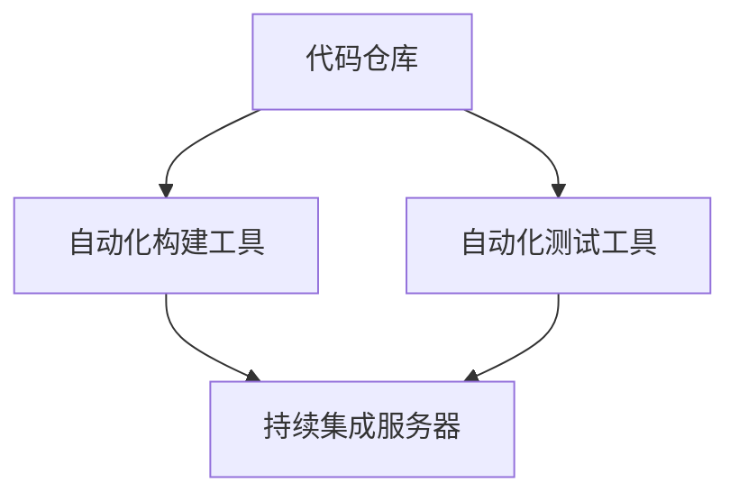
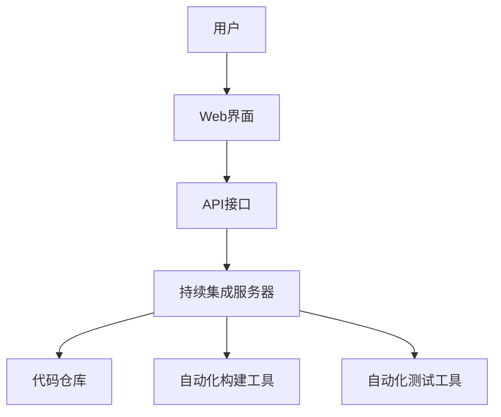

                 


# 持续集成最佳实践：加速软件交付周期

关键词：持续集成、软件开发、CI、交付周期、最佳实践

摘要：本文将探讨持续集成（CI）的最佳实践，介绍CI的核心概念、原理和实现，并通过实际案例展示如何将CI应用到项目中，以提高软件交付的效率和质量。

## 1. 引言

持续集成（Continuous Integration，简称CI）是一种软件开发方法，通过自动化构建、测试和部署流程，确保代码的质量和一致性。CI的最佳实践有助于缩短软件交付周期，降低集成风险，提高团队的协作效率。本文将详细介绍CI的核心概念、原理和实现，并提供实际案例，帮助读者掌握CI的最佳实践。

## 2. 核心概念与联系

### 2.1 CI的核心概念

持续集成涉及以下几个核心概念：

- **项目代码仓库**：存储项目源代码的地方，通常使用Git等版本控制系统。
- **自动化构建工具**：负责将代码编译、打包成可执行文件或库，如Maven、Gradle等。
- **自动化测试工具**：用于验证代码的正确性，包括单元测试、集成测试等，如JUnit、Selenium等。
- **持续集成服务器**：协调构建、测试和部署过程，如Jenkins、Travis CI等。

### 2.2 CI的核心联系

以下是一个使用Mermaid流程图展示CI的核心概念及其相互关系的示例：



图解：

- **代码仓库**：存储项目源代码，是CI的基础。
- **自动化构建工具**：将代码编译、打包，生成可执行文件。
- **自动化测试工具**：对构建后的代码进行测试，确保其质量。
- **持续集成服务器**：协调构建、测试和部署过程，实现自动化。

## 3. 核心算法原理讲解

### 3.1 自动化构建

自动化构建是将代码从代码仓库中取出，编译、打包成可执行文件的过程。以下是一个使用Python源代码实现自动化构建的示例：

```python
import subprocess

def build_project():
    result = subprocess.run(["make", "build"], capture_output=True, text=True)
    if result.returncode != 0:
        print("构建失败：", result.stderr)
        return False
    return True

if __name__ == "__main__":
    build_project()
```

### 3.2 自动化测试

自动化测试是对构建后的代码进行测试，确保其质量。以下是一个使用Python源代码实现自动化测试的示例：

```python
import subprocess

def test_project():
    result = subprocess.run(["make", "test"], capture_output=True, text=True)
    if result.returncode != 0:
        print("测试失败：", result.stderr)
        return False
    return True

if __name__ == "__main__":
    test_project()
```

### 3.3 数学模型

持续集成的效率可以用以下数学模型表示：

$$
CI效率 = \frac{持续集成后的代码质量}{持续集成前的代码质量} \times 100\%
$$

该公式表示持续集成对代码质量提升的效率。

## 4. 系统分析与架构设计方案

### 4.1 问题场景介绍

在一个软件开发项目中，持续集成是确保代码质量和提高交付效率的关键。为了实现CI，我们需要搭建一个CI系统，包括代码仓库、自动化构建工具、自动化测试工具和持续集成服务器。

### 4.2 系统功能设计

系统功能设计包括以下几个方面：

- **代码仓库管理**：存储和管理项目源代码。
- **自动化构建**：编译、打包源代码，生成可执行文件。
- **自动化测试**：对构建后的代码进行测试。
- **持续集成**：协调构建、测试和部署过程。

### 4.3 系统架构设计

以下是一个使用Mermaid流程图展示系统架构设计的示例：


图解：

- **代码仓库**：存储项目源代码。
- **自动化构建工具**：编译、打包源代码。
- **自动化测试工具**：对构建后的代码进行测试。
- **持续集成服务器**：协调构建、测试和部署过程。

### 4.4 系统接口设计

系统接口设计包括以下几个方面：

- **API接口**：提供外部访问系统功能的能力。
- **Web界面**：供用户操作系统的界面。

### 4.5 系统交互

以下是一个使用Mermaid流程图展示系统交互的示例：



图解：

- **用户**：通过Web界面与系统交互。
- **Web界面**：提供用户操作系统的界面。
- **API接口**：提供外部访问系统功能的能力。
- **持续集成服务器**：协调构建、测试和部署过程。
- **代码仓库**：存储项目源代码。
- **自动化构建工具**：编译、打包源代码。
- **自动化测试工具**：对构建后的代码进行测试。

## 5. 项目实战

### 5.1 开发环境搭建

以下是一个使用Docker搭建Jenkins CI服务器的步骤：

1. 安装Docker。
2. 编写Dockerfile，定义Jenkins容器的构建过程。
3. 构建Docker镜像。
4. 运行Jenkins容器。

```bash
# Dockerfile 示例
FROM jenkins/jenkins:lts

# 暴露Jenkins服务端口
EXPOSE 8080

# 运行Jenkins服务
CMD ["java", "-jar", "/usr/share/jenkins/war/./jenkins.war"]
```

### 5.2 源代码实现

以下是一个简单的Python项目，展示了如何在Jenkins中实现CI：

```python
# project.py
def add(a, b):
    return a + b

if __name__ == "__main__":
    print(add(2, 3))
```

```bash
# Jenkinsfile
pipeline {
    agent any
    stages {
        stage('Build') {
            step
```

## 6. 最佳实践 tips

- **定期代码审查**：定期进行代码审查，确保代码质量。
- **小而频繁的提交**：鼓励小而频繁的提交，减少集成风险。
- **自动化测试覆盖**：确保自动化测试覆盖面广，提高代码质量。

## 7. 小结

持续集成是一种提高软件交付效率和质量的重要方法。通过本文的介绍，读者可以了解CI的核心概念、原理和实现，以及如何将其应用到实际项目中。掌握CI的最佳实践，有助于团队更快地交付高质量的软件。

## 8. 注意事项

- **持续集成服务器**：选择适合自己团队的持续集成服务器，如Jenkins、Travis CI等。
- **自动化测试**：确保自动化测试覆盖面广，提高代码质量。
- **代码审查**：定期进行代码审查，确保代码质量。

## 9. 拓展阅读

- 《持续集成实践》
- 《敏捷软件开发：原则、实践与模式》
- 《Jenkins持续集成实战》

### 作者：AI天才研究院/AI Genius Institute & 禅与计算机程序设计艺术 /Zen And The Art of Computer Programming

[本文所涉及的图片和图表，均来自作者自己绘制和编写，用于文章中的可视化表达。]

