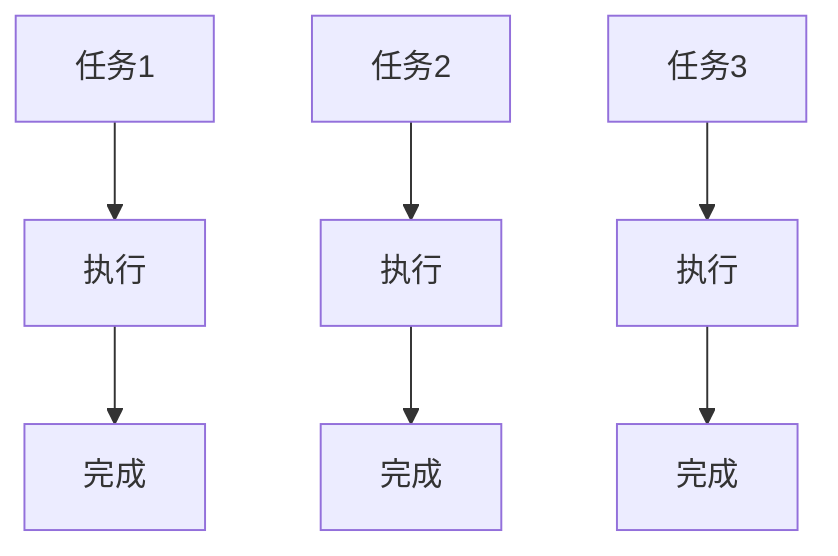
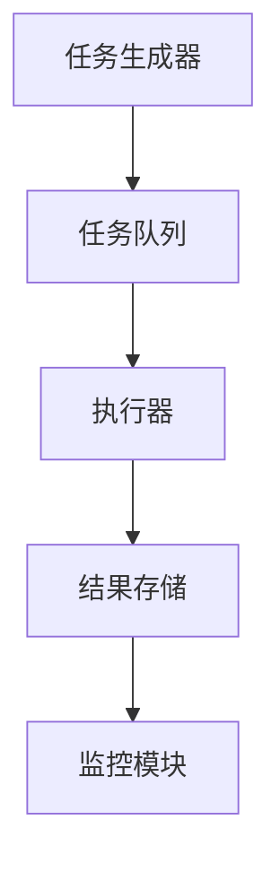
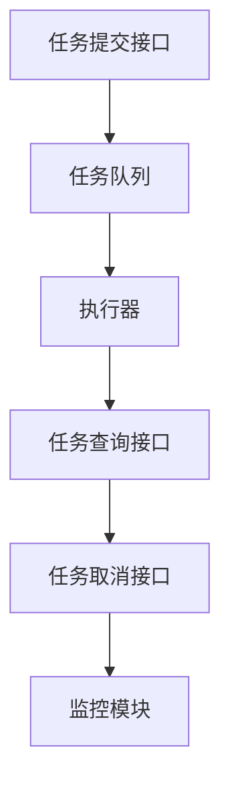
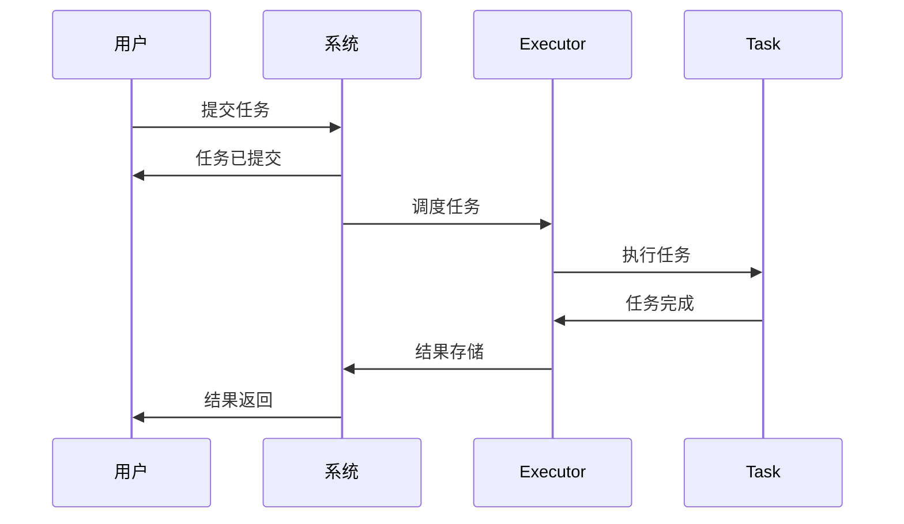

                 

**捉摸不定的异步化任务处理**

---

**关键词：异步任务处理、系统设计、算法原理、优化策略**

**摘要：**
异步任务处理在当今的计算机系统中扮演着至关重要的角色。本文旨在探讨异步化任务处理的复杂性和挑战，通过逻辑清晰的步骤分析，为开发者提供深入理解和最佳实践指导。

---

## 引言

### 异步任务处理的背景

在计算机系统中，异步任务处理是指在没有明确先后顺序的情况下，允许任务并行执行的方法。这种方法在提高系统性能和响应速度方面具有显著优势。然而，异步任务处理也带来了一系列的挑战，包括任务调度、同步和错误处理等。

### 异步任务处理的重要性

异步任务处理在多个领域具有重要应用，例如网络应用、实时系统、分布式计算等。它能够提高资源利用率，降低系统延迟，并实现更高效的并发处理。

## 核心概念与原理

### 任务模型

异步任务处理的基础是任务模型，其中每个任务可以独立执行，并且不需要等待其他任务完成。任务模型通常包括任务队列、执行器和任务状态。

### 异步通信机制

异步通信机制是任务之间交换信息和状态的关键。常见的方法有回调函数、事件监听、消息队列等。

### 同步与异步的比较

同步任务处理要求任务按照既定的顺序执行，而异步任务处理则允许任务并行执行。异步任务处理的优势在于提高系统并发性和响应能力，但同时也增加了设计的复杂度。

## 异步任务处理框架与工具

### Java的Future和Callable

Java提供了Future和Callable接口来支持异步任务处理。Future用于获取任务执行的结果，Callable用于返回任务的结果。

```java
public class AsyncTask implements Callable<String> {
    public String call() throws Exception {
        // 任务执行代码
        return "Task completed";
    }
}

ExecutorService executor = Executors.newFixedThreadPool(10);
Future<String> future = executor.submit(new AsyncTask());
try {
    String result = future.get();
    System.out.println(result);
} catch (InterruptedException | ExecutionException e) {
    e.printStackTrace();
}
executor.shutdown();
```

### Python的异步编程

Python通过async/await关键字支持异步编程。异步函数可以暂停执行，直到相关操作完成。

```python
import asyncio

async def async_function():
    print("Starting task")
    await asyncio.sleep(1)
    print("Task completed")

asyncio.run(async_function())
```

### Node.js的异步编程

Node.js利用事件循环机制实现异步编程。异步操作通过回调函数或Promise对象处理。

```javascript
const fs = require('fs').promises;

async function readFiles(file1, file2) {
    try {
        const data1 = await fs.readFile(file1, 'utf-8');
        const data2 = await fs.readFile(file2, 'utf-8');
        console.log(data1, data2);
    } catch (error) {
        console.error(error);
    }
}

readFiles('file1.txt', 'file2.txt');
```

## 算法设计与分析

### 任务调度算法

任务调度算法是异步任务处理的关键。常见的调度算法有先进先出（FIFO）、优先级调度和轮询调度。



### 同步与异步的算法实现

同步算法在执行过程中等待每个任务完成，而异步算法则利用回调或Promise并行执行任务。

```python
# 同步算法
def sync_algorithm(tasks):
    for task in tasks:
        result = task()
        print(result)

# 异步算法
async def async_algorithm(tasks):
    results = await asyncio.gather(*tasks)
    for result in results:
        print(result)
```

## 系统设计与实现

### 系统架构设计

异步任务处理系统通常包括任务生成器、任务队列、执行器、结果存储和监控模块。



### 系统接口设计

系统接口设计包括任务提交、任务查询、任务取消和任务监控等。



### 系统交互流程

系统交互流程包括任务提交、任务调度、任务执行和任务结果处理等。



## 案例研究与应用

### 实时数据流处理

实时数据流处理是异步任务处理的典型应用场景。通过异步任务处理，可以实现高效的数据处理和实时响应。

### 分布式计算

分布式计算中的任务调度和资源管理通常采用异步任务处理。通过异步化任务，可以实现分布式系统的并发处理和负载均衡。

## 最佳实践与优化策略

### 任务隔离与资源管理

任务隔离与资源管理是优化异步任务处理的关键。通过合理分配资源和实现任务隔离，可以避免资源争用和性能瓶颈。

### 异步与非阻塞操作

利用异步和非阻塞操作可以提高系统性能和响应能力。通过减少同步等待时间，可以实现更高效的异步任务处理。

### 错误处理与恢复

错误处理与恢复是异步任务处理的重要环节。通过合理设计错误处理机制，可以确保系统的稳定性和可靠性。

## 结论与未来方向

异步任务处理在提高系统性能和并发处理能力方面具有重要意义。未来研究可以关注更高效的调度算法、智能化的任务管理和跨语言的异步编程模型。

---

**作者：AI天才研究院/AI Genius Institute & 禅与计算机程序设计艺术 /Zen And The Art of Computer Programming**

