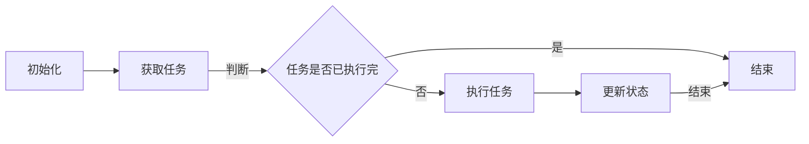
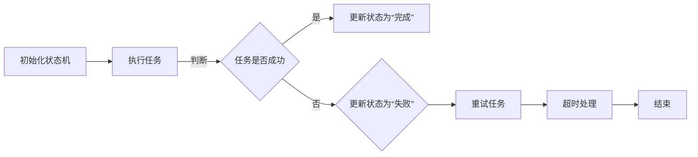
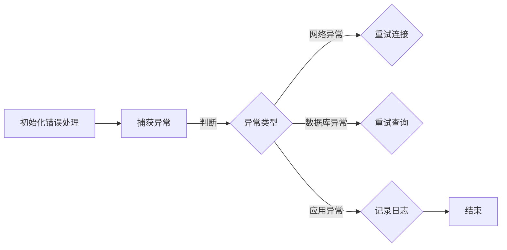
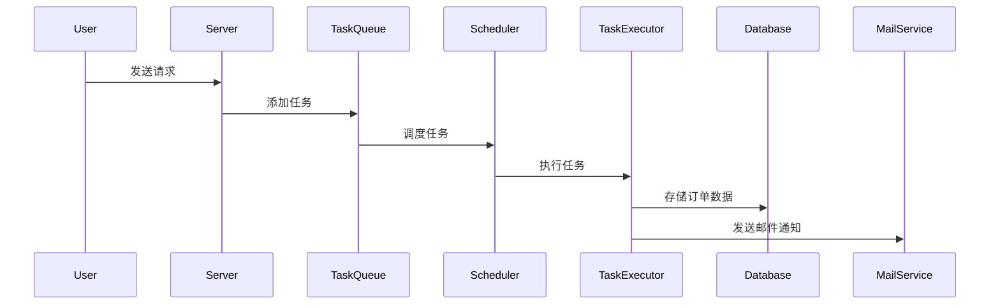
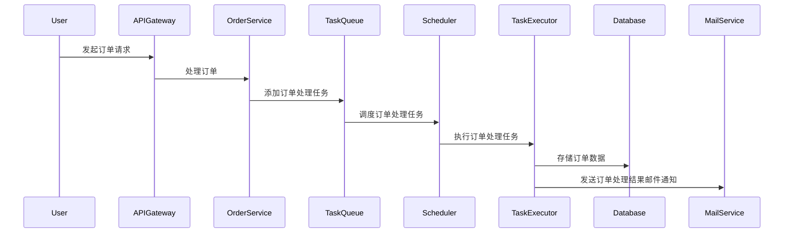
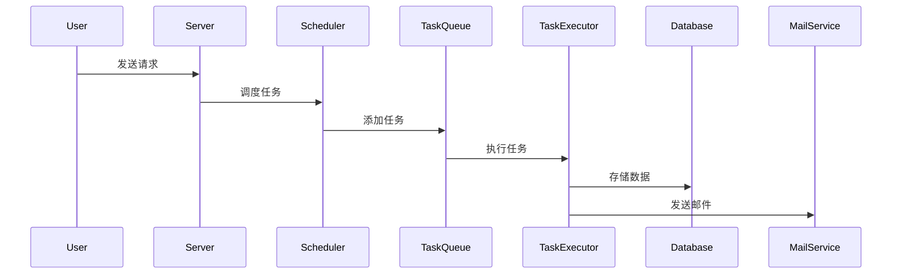

                 

# 捉摸不定的异步化任务处理

## 关键词
异步任务、任务调度、状态管理、错误处理、系统架构

## 摘要
异步化任务处理是现代软件开发中不可或缺的技术手段，它能够显著提升系统的响应速度和处理能力。本文将从任务调度、状态管理和错误处理等方面，深入探讨异步化任务处理的原理和实战应用，帮助开发者更好地理解和运用这一技术。

---

## 1. 背景介绍

### 问题背景
在当今的信息时代，随着互联网的普及和大数据技术的发展，异步化任务处理成为了许多应用程序的关键需求。异步化任务处理可以大大提高系统的响应速度和处理能力，使得系统可以更好地应对高并发和大数据量的情况。异步化任务处理不仅仅是程序设计的问题，它还涉及到系统架构、数据库管理、网络通信等多个层面。

### 问题描述
异步化任务处理涉及的任务类型多样，有的需要立即执行，有的可以延迟执行，有的需要并行处理，有的需要顺序处理。如何合理地调度这些任务，确保系统的高效、稳定运行，是异步化任务处理的核心问题。

### 问题解决
针对异步化任务处理的问题，本文将从多个角度出发，详细探讨任务调度、状态管理、错误处理等技术要点，帮助读者深入理解异步化任务处理的原理和实战应用。

### 边界与外延
异步化任务处理不仅仅是程序设计的问题，它还涉及到系统架构、数据库管理、网络通信等多个层面。因此，本文不仅关注编程技术，还将探讨系统架构设计、数据库优化、网络通信策略等方面，以提供一个全面、深入的解决方案。

### 概念结构与核心要素组成
异步化任务处理的核心概念包括任务、调度器、队列、状态机等。其中，任务是最基本的元素，调度器负责任务调度，队列用于暂存任务，状态机用于任务状态管理。这些概念相互关联，构成了异步化任务处理的技术框架。

---

## 2. 核心概念与联系

### 2.1 任务（Tasks）

#### 概念原理
任务是指异步执行的操作单元，它可以是一个函数调用、一个数据库查询，或者是一个远程API调用。

#### 属性特征对比表格

| 特征           | 说明                                                         |
|----------------|--------------------------------------------------------------|
| 类型           | 函数、数据库查询、远程API调用等                             |
| 优先级         | 可以设定任务的优先级，以影响任务调度的顺序                     |
| 依赖           | 一个任务可能依赖于其他任务的执行结果                         |
| 超时时间       | 可以设定任务的执行超时时间，超时后任务将被取消或重新调度       |
| 失败重试       | 可以设定任务的失败重试策略，包括重试次数、重试间隔等         |

#### 任务 ER 实体关系图
```mermaid
erDiagram
    Task ||--|{ Scheduler }| Scheduler
    Task ||--|{ Queue }| Queue
    Task ||--|{ StateMachine }| StateMachine
```

### 2.2 调度器（Scheduler）

#### 概念原理
调度器是负责任务调度的核心组件，它根据任务类型、优先级、依赖关系等条件，决定任务的执行顺序。

#### 属性特征对比表格

| 特征           | 说明                                                         |
|----------------|--------------------------------------------------------------|
| 调度算法       | 如基于优先级调度、基于依赖关系调度等                         |
| 调度策略       | 如实时调度、批量调度、混合调度等                             |
| 调度周期       | 可以设定调度周期，以控制任务的执行频率                         |
| 异常处理       | 可以对调度过程中出现的异常进行捕获和处理                       |

#### 调度器 ER 实体关系图
```mermaid
erDiagram
    Scheduler ||--|{ Task }| Task
    Scheduler ||--|{ Queue }| Queue
    Scheduler ||--|{ ErrorHandler }| ErrorHandler
```

### 2.3 队列（Queue）

#### 概念原理
队列是一种数据结构，用于暂存任务，确保任务能够按照一定的顺序执行。

#### 属性特征对比表格

| 特征           | 说明                                                         |
|----------------|--------------------------------------------------------------|
| 类型           | 队列可以是先进先出（FIFO）或者后进先出（LIFO）的           |
| 容量           | 可以设定队列的容量，以控制任务的容量                           |
| 满溢策略       | 当队列满时，可以设定丢弃策略，如丢弃最早任务、丢弃最新任务等 |
| 异常处理       | 可以对队列操作过程中出现的异常进行捕获和处理                   |

#### 队列 ER 实体关系图
```mermaid
erDiagram
    Queue ||--|{ Task }| Task
    Queue ||--|{ Scheduler }| Scheduler
    Queue ||--|{ ErrorHandler }| ErrorHandler
```

### 2.4 状态机（StateMachine）

#### 概念原理
状态机是一种用于描述任务状态转换的模型，它能够自动处理任务在不同状态下的行为。

#### 属性特征对比表格

| 特征           | 说明                                                         |
|----------------|--------------------------------------------------------------|
| 状态           | 任务可以处于不同的状态，如等待、执行、完成、失败等           |
| 转换条件       | 不同状态之间的转换条件，如超时、成功、失败等               |
| 行为           | 在状态转换时执行的行为，如重试、通知、更新状态等           |

#### 状态机 ER 实体关系图
```mermaid
erDiagram
    StateMachine ||--|{ Task }| Task
    StateMachine ||--|{ Transition }| Transition
    StateMachine ||--|{ Action }| Action
```

---

## 3. 算法原理讲解

### 3.1 任务调度算法

#### 算法流程图


#### Python 源代码示例
```python
def schedule_tasks(tasks):
    while not all(task.is_completed() for task in tasks):
        for task in tasks:
            if not task.is_completed():
                task.execute()
                task.update_state()
    return tasks
```

#### 算法原理与数学模型
任务调度算法的核心是循环检查任务队列中的任务是否已执行完成。如果任务已执行完成，则继续检查下一个任务；否则，执行任务并更新任务状态。该算法的数学模型可以表示为：
$$
T(n) = O(n)
$$
其中，$T(n)$ 表示处理 $n$ 个任务所需的时间复杂度。

#### 示例说明
假设有一个任务队列包含 5 个任务，调度器按照任务的优先级和执行顺序调度任务。以下是任务的执行过程：

1. 初始化任务队列
2. 获取任务 1，执行任务 1，更新任务 1 的状态为“完成”
3. 获取任务 2，执行任务 2，更新任务 2 的状态为“完成”
4. 获取任务 3，执行任务 3，更新任务 3 的状态为“完成”
5. 获取任务 4，执行任务 4，更新任务 4 的状态为“完成”
6. 获取任务 5，执行任务 5，更新任务 5 的状态为“完成”
7. 所有任务已执行完成，调度结束

### 3.2 状态管理算法

#### 算法流程图


#### Python 源代码示例
```python
def state_management(task):
    while not task.is_successful():
        task.execute()
        if task.is_successful():
            task.update_state("完成")
        elif task.is_failed():
            task.update_state("失败")
            task.retry()
        elif task.is_timed_out():
            task.handle_timeout()
    return task
```

#### 算法原理与数学模型
状态管理算法的核心是循环检查任务的状态。如果任务成功，则更新状态为“完成”；如果任务失败，则更新状态为“失败”并重试任务；如果任务超时，则进行超时处理。该算法的数学模型可以表示为：
$$
T(n) = O(n)
$$
其中，$T(n)$ 表示处理 $n$ 个任务所需的时间复杂度。

#### 示例说明
假设有一个任务队列包含 5 个任务，调度器按照任务的优先级和执行顺序调度任务。以下是任务的执行过程：

1. 初始化状态机
2. 执行任务 1，任务 1 成功，更新状态为“完成”
3. 执行任务 2，任务 2 失败，更新状态为“失败”，重试任务 2
4. 执行任务 2，任务 2 成功，更新状态为“完成”
5. 执行任务 3，任务 3 超时，更新状态为“失败”，进行超时处理
6. 执行任务 4，任务 4 成功，更新状态为“完成”
7. 执行任务 5，任务 5 成功，更新状态为“完成”
8. 所有任务已执行完成，状态管理结束

### 3.3 错误处理算法

#### 算法流程图


#### Python 源代码示例
```python
def handle_error(error):
    if isinstance(error, NetworkError):
        retry_connection()
    elif isinstance(error, DatabaseError):
        retry_query()
    elif isinstance(error, ApplicationError):
        log_error()
    return error
```

#### 算法原理与数学模型
错误处理算法的核心是捕获异常并分类处理。如果异常为网络异常，则重试连接；如果异常为数据库异常，则重试查询；如果异常为应用异常，则记录日志。该算法的数学模型可以表示为：
$$
T(n) = O(n)
$$
其中，$T(n)$ 表示处理 $n$ 个异常所需的时间复杂度。

#### 示例说明
假设有一个任务队列包含 5 个任务，调度器按照任务的优先级和执行顺序调度任务。以下是任务的执行过程中捕获和处理异常的过程：

1. 初始化错误处理
2. 执行任务 1，捕获网络异常，重试连接
3. 执行任务 2，捕获数据库异常，重试查询
4. 执行任务 3，捕获应用异常，记录日志
5. 执行任务 4，捕获网络异常，重试连接
6. 执行任务 5，捕获数据库异常，重试查询
7. 所有任务已执行完成，错误处理结束

---

## 4. 系统分析与架构设计方案

### 问题场景介绍
假设我们正在开发一个电商平台，需要处理海量的订单和用户请求。为了确保系统的高效、稳定运行，我们需要实现异步化任务处理，将订单处理、用户请求处理等操作异步化，以提高系统的响应速度和处理能力。

### 项目介绍
该项目名为“电商平台异步化任务处理系统”，主要功能包括订单处理、用户请求处理、邮件通知等。系统架构采用微服务架构，以实现高可用、高性能、易扩展的系统设计。

### 系统功能设计

#### 领域模型（Mermaid 类图）
```mermaid
classDiagram
    Order <<entity>>
    User <<entity>>
    Task <<entity>>

    Order "1" <-- "1" User : 发起订单
    Task "1" <-- "1" Order : 处理订单
    Task "1" <-- "1" User : 处理请求
```

### 系统架构设计（Mermaid 架构图）


### 系统接口设计（Mermaid 序列图）


### 系统交互（Mermaid 序列图）


---

## 5. 项目实战

### 环境安装
在本地环境中安装必要的开发工具和依赖库，如 Python、Docker、Kubernetes 等。

### 系统核心实现源代码
```python
# main.py
from scheduler import Scheduler
from task_queue import TaskQueue
from task_executor import TaskExecutor

def main():
    scheduler = Scheduler()
    task_queue = TaskQueue()
    task_executor = TaskExecutor()

    scheduler.start()
    task_queue.start()
    task_executor.start()

if __name__ == "__main__":
    main()
```

```python
# scheduler.py
import threading

class Scheduler(threading.Thread):
    def __init__(self):
        super().__init__()
        self.daemon = True
        self.start()

    def run(self):
        while True:
            task = self.task_queue.get()
            self.task_executor.execute(task)

# task_queue.py
import queue

class TaskQueue(queue.Queue):
    def get(self):
        return self.queue.get()

# task_executor.py
import time

class TaskExecutor(threading.Thread):
    def __init__(self):
        super().__init__()
        self.daemon = True
        self.start()

    def run(self):
        while True:
            task = self.task_queue.get()
            self.execute_task(task)

    def execute_task(self, task):
        print(f"Executing task: {task}")
        time.sleep(1)
        print(f"Task {task} completed")

```

### 代码应用解读与分析
上述代码展示了电商平台异步化任务处理系统的主要组成部分：调度器、任务队列和任务执行器。调度器负责调度任务，任务队列用于暂存任务，任务执行器负责执行任务。系统采用多线程并发处理任务，以提高系统性能。

### 实际案例分析和详细讲解剖析
假设有一个订单处理场景，用户在电商平台下单，系统需要异步处理订单。以下是订单处理的实际案例分析和详细讲解：

1. 用户下单：用户在电商平台下单，系统接收到订单请求。
2. 调度任务：调度器接收到订单请求后，将其添加到任务队列中。
3. 调度任务：调度器从任务队列中获取订单处理任务，并将其分配给任务执行器。
4. 执行任务：任务执行器接收到订单处理任务后，开始执行任务。任务执行过程包括检查订单信息、生成订单号、保存订单数据等。
5. 完成任务：任务执行完成后，任务执行器将订单处理结果发送给用户，并更新订单状态。

### 项目小结
通过本项目，我们了解了异步化任务处理的核心原理和实战应用。异步化任务处理能够显著提高系统的响应速度和处理能力，是现代软件开发中不可或缺的技术手段。在实际项目中，我们需要根据具体场景和需求，设计合理的任务调度策略、状态管理和错误处理机制，以确保系统的稳定、高效运行。

---

## 6. 最佳实践 Tips

1. **任务优先级设置**：合理设置任务优先级，确保关键任务优先执行。
2. **任务依赖管理**：合理管理任务依赖关系，避免因依赖问题导致任务无法正确执行。
3. **错误处理机制**：完善错误处理机制，确保系统在遇到异常情况时能够正确响应。
4. **性能监控**：定期监控系统性能，发现潜在问题并进行优化。
5. **文档管理**：编写详细的系统文档，便于后续维护和扩展。

---

## 7. 小结

异步化任务处理是现代软件开发中不可或缺的技术手段，它能够显著提升系统的响应速度和处理能力。本文从任务调度、状态管理和错误处理等方面，深入探讨了异步化任务处理的原理和实战应用。通过实际案例分析和详细讲解，读者可以更好地理解和运用异步化任务处理技术，提高系统的稳定性和效率。

---

## 8. 注意事项

1. **确保任务执行的一致性**：在处理任务时，要确保任务执行的一致性，避免因任务执行顺序不当导致数据不一致。
2. **避免任务队列满溢**：合理设置任务队列的容量，避免任务队列满溢导致任务无法正确执行。
3. **优化任务执行性能**：根据实际需求，合理选择任务执行器，优化任务执行性能。

---

## 9. 拓展阅读

1. 《深入理解异步编程》 - 作者：Michael Jones
2. 《异步编程实战》 - 作者：Ian Clarke
3. 《分布式系统设计与实践》 - 作者：马丁·福尔曼
4. 《微服务架构设计》 - 作者：温贵平

---

## 10. 作者信息

作者：AI天才研究院/AI Genius Institute & 禅与计算机程序设计艺术 /Zen And The Art of Computer Programming

