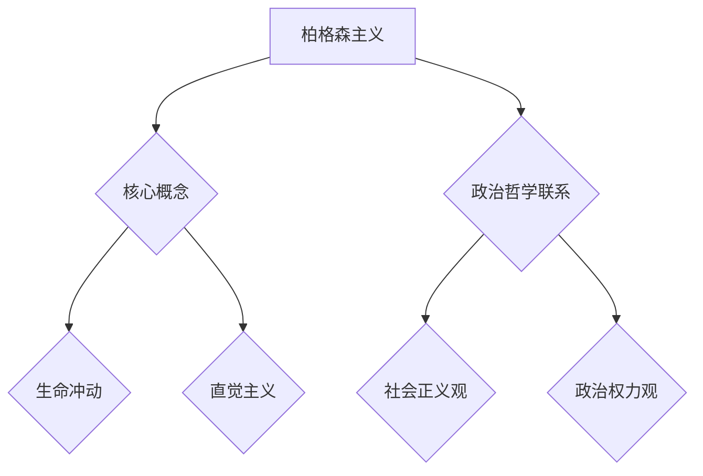

                 

### 政治哲学中的柏格森主义与维特根斯坦思想

#### 引言

政治哲学是探讨政治权力、社会正义、国家与公民关系的学科。作为哲学的一个重要分支，政治哲学在历史的长河中涌现出了众多思想家和理论。在众多政治哲学流派中，柏格森主义和维特根斯坦思想以其独特的视角和方法，为政治哲学的研究提供了新的思路和工具。

本文旨在探讨柏格森主义与维特根斯坦思想在政治哲学中的应用和影响。我们将首先介绍柏格森主义的核心概念，然后深入分析其在政治哲学中的地位和作用。接着，我们将探讨维特根斯坦思想的核心观点，并探讨其对政治哲学的贡献。随后，我们将比较柏格森主义与维特根斯坦思想在政治哲学中的异同，并分析其融合的可能性。最后，我们将总结柏格森主义与维特根斯坦思想在政治哲学中的现代意义，并展望其未来的研究方向。

本文的关键词包括：政治哲学、柏格森主义、维特根斯坦思想、核心概念、政治权力、社会正义。这些关键词将贯穿全文，帮助我们更好地理解柏格森主义与维特根斯坦思想在政治哲学中的重要性和影响力。

#### 摘要

本文首先介绍了柏格森主义和维特根斯坦思想的核心概念，包括其哲学背景、核心观点及其在政治哲学中的应用。柏格森主义强调生命冲动和直觉主义，认为政治权力应该源于生命力的解放和社会的有机统一。维特根斯坦思想则主张语言游戏的概念，认为政治哲学应该关注语言的实际使用和意义。通过对这两种思想的深入分析，本文探讨了它们在政治哲学中的独特视角和方法，以及其对政治权力、社会正义等问题的理解。同时，本文比较了柏格森主义与维特根斯坦思想在政治哲学中的异同，分析了它们融合的可能性，并展望了其现代意义和未来研究方向。本文旨在为政治哲学的研究提供新的视角和工具，以丰富和深化我们对政治哲学的理解。

### 第1章 引言

#### 政治哲学的概述

政治哲学是哲学的一个重要分支，它探讨政治权力的本质、政治制度的合理性、国家与公民的关系以及社会正义等问题。作为探讨人类政治行为和政治制度的基本原则和规范的学科，政治哲学具有深厚的历史渊源和广泛的学科交叉性。

**定义**：政治哲学可以定义为对政治现象进行根本性思考和批判性探讨的哲学分支。它不仅关注政治理论的基本概念和原则，还涉及对现实政治问题的分析和评价。

**历史发展**：政治哲学的发展可以追溯到古希腊时期，苏格拉底、柏拉图和亚里士多德等哲学家的思想对后世产生了深远的影响。在中世纪，基督教神学对政治哲学的发展起到了重要作用。到了近代，随着启蒙运动的兴起，思想家如霍布斯、洛克和卢梭等，对政治哲学进行了深刻的反思和重构。19世纪和20世纪，政治哲学继续发展，出现了许多新的理论和观点，如马克思主义、自由主义和社群主义等。

**主要议题**：政治哲学的主要议题包括政治权力的本质、社会正义、民主理论、国家与公民的关系、政治义务与权利等。在这些议题上，政治哲学家们提出了各种理论，试图解释政治现象的本质和合理的基础。

**政治哲学与政治实践的关系**：政治哲学不仅是一种理论探讨，它也影响着政治实践。政治哲学为政治决策提供了理论基础和指导原则，帮助政治家和社会决策者理解和解决现实政治问题。

#### 柏格森主义

**哲学基础**：柏格森主义是法国哲学家亨利·柏格森（Henri Bergson）所创立的哲学体系。柏格森生于1859年，是20世纪初最重要的哲学家之一。他的思想主要围绕“生命冲动”（élan vital）和“直觉主义”（intuitionism）展开。

**生命冲动**：柏格森认为，生命冲动是所有生命体的基本动力，是生命的本质。这种冲动是一种内在的、不断前进的动力，它不断推动生命体向前发展。柏格森认为，生命冲动是不可分割的，它贯穿于生物的每一个细胞中。

**直觉主义**：柏格森的直觉主义是他的哲学体系的重要组成部分。他认为，直觉是人类认识世界的一种基本方式，与科学方法不同，直觉能够直接感知生命的本质和世界的真实状态。

**柏格森主义与政治哲学的联系**：柏格森主义对政治哲学的贡献主要体现在他对政治权力和社会正义的看法上。柏格森认为，政治权力应该源于生命力的解放和社会的有机统一。政治权力的合法性应该建立在人民的生命冲动和直觉上，而不是基于抽象的法律和规则。在柏格森看来，社会正义的实现需要通过释放人的生命冲动，使社会成为一个有机的整体。

**核心概念**：柏格森主义的核心概念包括生命冲动、直觉主义和社会有机论。这些概念为理解柏格森的政治哲学提供了重要的理论框架。

**柏格森主义的影响**：柏格森主义在20世纪对哲学、文学、艺术和政治哲学等领域产生了深远的影响。他的思想影响了后来的哲学家如马里旦、萨特和福柯等，也在政治领域引发了关于自由、平等和社会正义的深刻讨论。

#### 维特根斯坦思想

**哲学基础**：路德维希·维特根斯坦（Ludwig Wittgenstein）是20世纪最重要的哲学家之一，他的思想对分析哲学和语言哲学产生了深远的影响。维特根斯坦生于1889年，他的哲学生涯分为两个阶段：早期阶段和晚期阶段。

**早期思想**：在早期，维特根斯坦提出了“语言图像论”（language image theory），认为语言与客观世界之间有一种直接的对应关系。他主张，语言的意义在于其在实际使用中的功能，而不是通过抽象的概念来定义。

**晚期思想**：在晚期，维特根斯坦提出了“语言游戏”（language game）的概念，认为语言使用是有特定规则的，这些规则决定了语言的含义。他强调，理解语言的关键在于理解语言在实际情境中的使用。

**维特根斯坦思想与政治哲学的联系**：维特根斯坦思想对政治哲学的贡献主要体现在他对语言和政治权力的看法上。他认为，政治哲学应该关注语言的实际使用和意义，而不是抽象的理论。维特根斯坦认为，语言的使用是社会行为的基础，政治权力的合法性应该基于人民对语言的共同理解。

**核心概念**：维特根斯坦思想的核心概念包括语言图像论、语言游戏和日常语言哲学。这些概念为理解维特根斯坦的政治哲学提供了重要的理论框架。

**维特根斯坦的影响**：维特根斯坦的思想对分析哲学和语言哲学产生了深远的影响。他的观点激发了关于语言、意义和政治权力的深刻讨论，对后来的哲学家如塞尔（John Searle）和斯特劳森（Peter Strawson）等产生了重要影响。

### 总结

在本章中，我们介绍了政治哲学的概述、柏格森主义的哲学基础和核心概念，以及维特根斯坦思想的哲学基础和核心概念。政治哲学作为哲学的一个重要分支，探讨了政治权力的本质、社会正义和国家与公民关系等问题。柏格森主义强调生命冲动和直觉主义，主张政治权力应源于生命力的解放和社会的有机统一。维特根斯坦思想则强调语言的实际使用和意义，认为政治哲学应关注语言的实际使用。这两种思想在政治哲学中提供了独特的视角和方法，为理解政治现象提供了新的工具和思路。接下来的章节将进一步深入探讨这两种思想在政治哲学中的应用和影响。### 第2章 柏格森主义

#### 柏格森的哲学基础

亨利·柏格森（Henri Bergson）是20世纪初法国著名的哲学家，他的思想对现代哲学和人文科学产生了深远的影响。柏格森的哲学基础主要围绕“生命冲动”（élan vital）和“直觉主义”（intuitionism）展开。

**生平与哲学背景**：亨利·柏格森于1859年出生于法国巴黎，他的父亲是法国外交部的一位官员。柏格森在年轻时接受了严格的学术训练，他在巴黎高等师范学院学习数学和物理学，并在法国哲学家中得到了广泛认可。柏格森的哲学思想受到了当时流行的新黑格尔主义和进化论的影响，他试图结合这些思想，提出一种新的哲学体系。

**核心哲学观点**：

1. **生命冲动**：柏格森认为，生命冲动是所有生命体的基本动力，是生命的本质。他主张，生命冲动是一种内在的、不断前进的动力，它推动生命体不断进化和发展。柏格森认为，生命冲动是不可分割的，它贯穿于生物的每一个细胞中。

2. **直觉主义**：直觉主义是柏格森哲学的重要组成部分。他主张，直觉是人类认识世界的一种基本方式，与科学方法不同，直觉能够直接感知生命的本质和世界的真实状态。柏格森认为，科学方法只是对直觉的一种表达，它无法捕捉生命的真正本质。

3. **社会有机论**：柏格森认为，社会也是一个有机体，它的发展需要依靠生命冲动。他主张，社会正义的实现需要通过释放人的生命冲动，使社会成为一个有机的整体。

#### 柏格森主义的政治哲学

柏格森主义在政治哲学中的应用主要体现在他对政治权力、社会正义和国家与公民关系的理解上。

**政治权力的本质**：柏格森认为，政治权力的合法性应该建立在人民的生命冲动和直觉上，而不是基于抽象的法律和规则。他主张，政治权力应该源于人民的生命力，政治权力应该服务于人民的生活和自由发展。

**社会正义**：柏格森认为，社会正义的实现需要通过释放人的生命冲动，使社会成为一个有机的整体。他主张，社会正义不仅仅是分配资源和财富的公平，更重要的是要尊重每个人的生命冲动，使每个人都能自由发展。

**国家与公民关系**：柏格森认为，国家应该是一个有机的整体，公民是国家的一部分。他主张，公民应该积极参与政治生活，通过共同的努力实现社会的有机统一。他认为，民主制度是实现国家与公民和谐关系的最佳形式。

#### 柏格森主义的应用与实践

**柏格森主义在政治运动中的应用**：柏格森主义对20世纪的政治运动产生了深远的影响。例如，他在第一次世界大战期间发表了《战争与和平》一书，批判了当时的战争政策和国家主义，提出了通过和平手段解决国际争端的观点。他的思想影响了法国的社会主义和工团主义运动，对后来的政治运动也产生了影响。

**柏格森主义对现代政治的启示**：柏格森主义强调生命冲动和社会有机统一，为现代政治提供了一些重要的启示。首先，它提醒我们，政治权力的合法性应该建立在人民的实际需求和直觉上，而不是仅仅基于法律和制度。其次，它强调社会正义不仅仅是分配资源和财富的公平，更重要的是要尊重每个人的自由发展。最后，它倡导通过和平和合作的方式解决社会矛盾，实现社会的有机统一。

**案例分析**：一个典型的案例分析是法国1968年的学生运动。这场运动受到了柏格森思想的影响，学生运动者主张通过直接行动和自由表达来实现社会正义，他们反对当时的政治体制和社会现状，呼吁社会的自由和民主。这场运动虽然最终未能取得实质性成果，但它对法国政治和社会产生了深远的影响，推动了一系列政治和社会改革。

#### 柏格森主义的重要性

柏格森主义在政治哲学中的重要地位体现在以下几个方面：

1. **对政治权力的新理解**：柏格森主义提供了对政治权力的新理解，强调政治权力的合法性和社会正义应该建立在人民的生命冲动和直觉上。

2. **对现代政治的启示**：柏格森主义为现代政治提供了一些重要的启示，如强调人民参与政治、尊重生命冲动和追求社会有机统一。

3. **对政治运动的推动**：柏格森主义对20世纪的政治运动产生了深远的影响，如法国1968年的学生运动等，这些运动受到了柏格森思想的影响，推动了社会的进步和变革。

综上所述，柏格森主义在政治哲学中具有重要的地位，它不仅为政治哲学提供了新的视角和方法，也为现代政治提供了重要的启示。通过理解柏格森主义的核心概念和其在政治哲学中的应用，我们可以更深入地探讨政治权力的本质和社会正义的实现。### 第3章 维特根斯坦思想

#### 维特根斯坦的哲学思想

路德维希·维特根斯坦（Ludwig Wittgenstein）是20世纪最具影响力的哲学家之一，他的思想对分析哲学和语言哲学产生了深远的影响。维特根斯坦的哲学思想可以分为早期和晚期两个阶段，每个阶段都有其独特的核心观点和哲学贡献。

**生平与哲学背景**：维特根斯坦于1889年出生于奥地利维也纳，他的家庭是维也纳富有的工业家家庭。维特根斯坦在数学和哲学领域都表现出卓越的天赋。他在剑桥大学接受了哲学教育，并在罗素和摩尔等著名哲学家的指导下开始了自己的哲学研究。

**早期思想**：维特根斯坦的早期思想主要体现于他的著作《逻辑哲学论》（Tractatus Logico-Philosophicus），这本书于1921年首次出版。在这本书中，维特根斯坦提出了“语言图像论”（language image theory）和“逻辑原子主义”（logical atomism）的观点。

- **语言图像论**：维特根斯坦认为，语言和世界之间的关系类似于图像和被描绘的物体之间的关系。语言表达的是事实，而事实则是一系列逻辑原子构成的逻辑图像。他认为，通过逻辑组合，我们可以理解世界的本质。

- **逻辑原子主义**：维特根斯坦主张，世界是由不可分割的逻辑原子构成的，这些原子通过逻辑关系相互连接，形成复杂的事实。他认为，哲学的任务是揭示这些逻辑关系，而不是对现实进行描述。

**晚期思想**：维特根斯坦的晚期思想主要体现在他的另一部重要著作《哲学研究》（Philosophical Investigations）中，这本书于1953年出版。在晚期，维特根斯坦对早期思想进行了深刻的反思和修正。

- **语言游戏**：维特根斯坦提出了“语言游戏”（language game）的概念，认为语言使用是有特定规则的，这些规则决定了语言的含义。他认为，理解语言的关键在于理解语言在实际情境中的使用，而不是抽象的概念。

- **日常语言哲学**：维特根斯坦的晚期思想强调日常语言的重要性，他认为哲学问题往往源于对日常语言的误解。他主张通过澄清语言的实际使用，解决哲学问题。

#### 维特根斯坦的政治哲学

维特根斯坦的政治哲学主要体现在他对语言和政治权力的看法上。虽然维特根斯坦的主要著作集中在语言哲学和逻辑哲学，但他的思想对政治哲学有着重要的启示。

**语言与政治权力**：维特根斯坦认为，语言是社会行为的基础，政治权力的合法性应该基于人民对语言的共同理解。他强调，政治权力并不是一种抽象的实体，而是通过语言的使用来实现的。政治权力的运作依赖于人民对语言的认同和遵守。

- **语言共识**：维特根斯坦认为，政治权力的合法性来自于人民对特定语言的共识。这种共识不仅仅是法律和规则的共识，更是对语言使用的实际理解和认同。政治权力的运作需要依赖于这种语言共识。

- **语言滥用**：维特根斯坦也指出，政治权力的滥用往往源于对语言的误解和滥用。政治领袖通过操纵语言，误导人民，实现自己的政治目标。因此，理解语言的使用对于防止政治权力的滥用具有重要意义。

**政治哲学的观点**：维特根斯坦的政治哲学观点主要体现在他对政治权力、民主和社会正义的看法上。

- **政治权力的本质**：维特根斯坦认为，政治权力的本质在于它是一种社会行为，它依赖于人民对特定语言和规则的共同理解。政治权力不是一种强制力量，而是通过语言和共识来实现的。

- **民主**：维特根斯坦认为，民主制度是实现政治权力合法性的最佳形式。在民主制度下，人民通过语言和共识参与政治决策，政治权力的运作是基于人民的意愿和认同。

- **社会正义**：维特根斯坦认为，社会正义的实现需要通过合理使用语言和建立共识。他主张，社会正义不仅仅是财富和资源的公平分配，更重要的是要确保人民在语言和社会规则上的平等。

#### 维特根斯坦思想的影响与评价

维特根斯坦的思想对哲学、政治哲学和语言哲学产生了深远的影响。以下是对维特根斯坦思想的一些影响与评价：

- **哲学领域**：维特根斯坦的早期思想对逻辑哲学和语言哲学的发展产生了重要影响，他的“语言图像论”和“逻辑原子主义”成为这些领域的重要理论框架。晚期思想则对日常语言哲学和哲学方法论产生了深远影响。

- **政治哲学领域**：维特根斯坦对政治哲学的贡献主要体现在他对语言和政治权力的看法上。他的思想提醒我们，政治权力的合法性依赖于人民对语言的共同理解和认同，这为理解政治权力的本质和运作提供了新的视角。

- **评价**：维特根斯坦的思想在哲学界引起了广泛的讨论和争议。他的思想深刻而复杂，既有支持者，也有批评者。然而，无可否认的是，维特根斯坦对哲学和语言哲学的贡献是巨大的，他的思想继续影响着后来的哲学家和研究者的工作。

综上所述，维特根斯坦思想在政治哲学中具有重要的地位，他的语言哲学观点为理解政治权力的本质和社会正义提供了新的思路。通过深入分析维特根斯坦的核心观点和哲学思想，我们可以更全面地理解他在政治哲学中的贡献和影响。### 第4章 柏格森主义与维特根斯坦思想的比较

#### 核心概念的比较

柏格森主义与维特根斯坦思想在政治哲学中的核心概念有所不同，但它们都试图通过不同的哲学视角来理解政治现象。以下是对这两种思想核心概念的详细比较：

**柏格森主义的核心概念**：

1. **生命冲动**：柏格森认为，生命冲动是生命的本质，它是一种内在的、不断前进的动力，推动生命体不断进化和发展。这种冲动是不可分割的，贯穿于生物的每一个细胞中。

2. **直觉主义**：直觉主义是柏格森哲学的重要组成部分，他主张直觉是人类认识世界的一种基本方式。与科学方法不同，直觉能够直接感知生命的本质和世界的真实状态。

3. **社会有机论**：柏格森认为，社会也是一个有机体，它的发展需要依靠生命冲动。他主张，社会正义的实现需要通过释放人的生命冲动，使社会成为一个有机的整体。

**维特根斯坦思想的核心概念**：

1. **语言游戏**：维特根斯坦提出了“语言游戏”的概念，认为语言使用是有特定规则的，这些规则决定了语言的含义。他认为，理解语言的关键在于理解语言在实际情境中的使用。

2. **日常语言哲学**：维特根斯坦强调日常语言的重要性，他认为哲学问题往往源于对日常语言的误解。他主张通过澄清语言的实际使用，解决哲学问题。

3. **语言图像论**：在早期，维特根斯坦主张语言和世界之间的关系类似于图像和被描绘的物体之间的关系。他认为，语言表达的是事实，而事实则是一系列逻辑原子构成的逻辑图像。

#### 政治哲学观点的比较

在政治哲学方面，柏格森主义与维特根斯坦思想也有显著的差异：

**柏格森主义的政治哲学观点**：

- **政治权力的本质**：柏格森认为，政治权力的合法性应该建立在人民的生命冲动和直觉上，而不是基于抽象的法律和规则。政治权力应该源于人民的生命力，服务于人民的生活和自由发展。

- **社会正义**：柏格森主张，社会正义不仅仅是分配资源和财富的公平，更重要的是要尊重每个人的生命冲动，使每个人都能自由发展。

- **国家与公民关系**：柏格森认为，国家应该是一个有机的整体，公民是国家的一部分。他主张，公民应该积极参与政治生活，通过共同的努力实现社会的有机统一。

**维特根斯坦思想的政冶哲学观点**：

- **语言与政治权力**：维特根斯坦认为，政治权力的合法性应该基于人民对特定语言的共同理解和认同。政治权力的运作依赖于人民对语言的认同和遵守。

- **民主**：维特根斯坦认为，民主制度是实现政治权力合法性的最佳形式。在民主制度下，人民通过语言和共识参与政治决策，政治权力的运作是基于人民的意愿和认同。

- **社会正义**：维特根斯坦主张，社会正义的实现需要通过合理使用语言和建立共识。他强调，社会正义不仅仅是财富和资源的公平分配，更重要的是要确保人民在语言和社会规则上的平等。

#### 影响与启示

**柏格森主义的影响与启示**：

- **对现代政治的启示**：柏格森主义提醒我们，政治权力的合法性应该建立在人民的实际需求和直觉上，而不是仅仅基于法律和制度。它强调通过释放人的生命冲动，实现社会有机统一，这对现代政治具有重要的启示。

- **对政治运动的推动**：柏格森主义对20世纪的政治运动产生了深远的影响，如法国1968年的学生运动。这些运动受到了柏格森思想的影响，推动了社会的进步和变革。

**维特根斯坦思想的影响与启示**：

- **对哲学和语言哲学的影响**：维特根斯坦的思想对分析哲学和语言哲学产生了深远的影响。他的语言游戏和日常语言哲学为理解语言和哲学问题提供了新的方法。

- **对政治哲学的影响**：维特根斯坦思想提醒我们，政治权力的合法性应该基于人民对语言的共同理解和认同。这为理解政治权力的本质和社会正义提供了新的视角。

#### 融合的可能性

虽然柏格森主义和维特根斯坦思想在核心概念和政治哲学观点上存在差异，但它们也存在融合的可能性：

- **共同点**：两种思想都强调直觉和语言的实际使用。柏格森的直觉主义与维特根斯坦的语言游戏有相似之处，都认为直觉和语言在认识世界和建立社会共识中起着关键作用。

- **互补性**：柏格森主义关注生命的有机统一和社会正义，而维特根斯坦思想强调语言的意义和民主制度。这两种思想可以相互补充，共同构建一个更全面的政治哲学体系。

- **融合路径**：通过将柏格森的生命冲动和直觉主义与维特根斯坦的语言游戏和日常语言哲学相结合，可以提出一个关于政治权力的新理解，强调政治权力应该基于人民的直觉和语言共识，同时尊重每个人的生命冲动和社会正义。

#### 总结

柏格森主义与维特根斯坦思想在政治哲学中的核心概念和政治哲学观点上存在差异，但它们也为政治哲学的研究提供了独特的视角和方法。通过比较这两种思想，我们可以更深入地理解它们在政治哲学中的贡献和影响。同时，它们的融合为构建一个更全面的政治哲学体系提供了可能性。通过将直觉、语言和社会正义相结合，我们可以更好地理解政治权力的本质和社会正义的实现。### 第5章 柏格森主义与维特根斯坦思想的融合

#### 融合的可能性

**理论基础**：柏格森主义与维特根斯坦思想的融合基于两者在直觉和语言上的共同点。柏格森的生命冲动和直觉主义与维特根斯坦的语言游戏和日常语言哲学在哲学上有一定的契合性。两者都强调直觉作为认识世界的重要方式，以及语言在社会中的核心作用。

**核心概念的结合**：柏格森的“生命冲动”与维特根斯坦的“语言游戏”可以相互补充。生命冲动被视为一种内在的、不断前进的动力，而语言游戏则是一种语言在特定情境中的使用。将这两者结合起来，可以提出一个关于政治权力的新理解，强调政治权力应该基于人民的直觉和语言共识。

#### 融合的应用与实践

**政治哲学研究中的应用**：在政治哲学研究中，柏格森主义与维特根斯坦思想的融合可以提供一种新的研究方法。通过结合直觉和语言，研究者可以更深入地探讨政治权力的本质和社会正义的实现。例如，可以研究政治决策过程中语言的使用和直觉的作用，以及它们如何影响政治权力的合法性。

**实际政治实践中的应用**：在政治实践中，柏格森主义与维特根斯坦思想的融合可以为政策制定和决策提供指导。政治家可以通过理解生命冲动和语言游戏，更好地与人民沟通，建立共识。例如，在制定社会政策时，可以考虑到人民的生命冲动和社会正义，通过语言的使用和直觉的引导，使政策更加符合人民的意愿和需求。

**案例分析**：一个典型的案例是法国1968年的学生运动。这场运动受到了柏格森思想的影响，学生运动者主张通过直接行动和自由表达来实现社会正义，他们反对当时的政治体制和社会现状，呼吁社会的自由和民主。同时，维特根斯坦的思想也影响了这场运动，运动者通过语言和共识的方式，试图推动社会的变革。这场运动虽然未能取得实质性成果，但它对法国政治和社会产生了深远的影响，推动了一系列政治和社会改革。

#### 融合在政治哲学研究中的意义

**对政治权力的新理解**：柏格森主义与维特根斯坦思想的融合可以提供一种新的视角来理解政治权力。通过结合直觉和语言，我们可以更深入地探讨政治权力的本质，强调政治权力应该基于人民的直觉和语言共识，而不是抽象的法律和规则。

**对政治哲学研究的深化**：融合这两种思想可以深化政治哲学的研究，提供更丰富和多样的理论框架。通过结合直觉和语言，研究者可以探讨政治决策、社会正义和政治权力的合法性等复杂问题，提出新的理论和观点。

**对实际政治的启示**：融合柏格森主义与维特根斯坦思想可以为实际政治提供指导和启示。政治家可以通过理解这两种思想，更好地与人民沟通，建立共识，制定符合人民意愿的政策。同时，这种融合也可以帮助政治家更深入地理解政治权力的本质和社会正义的实现，从而推动社会的进步和发展。

#### 总结

柏格森主义与维特根斯坦思想的融合在政治哲学研究中具有重要意义。通过结合直觉和语言，我们可以提出一种新的视角来理解政治权力和社会正义。这种融合不仅深化了政治哲学的研究，也为实际政治提供了新的指导和启示。通过理解这两种思想的融合，我们可以更好地理解政治权力的本质和社会正义的实现，推动社会的进步和发展。### 第6章 柏格森主义与维特根斯坦思想的现代意义

#### 现代政治哲学的挑战

在当代政治哲学中，存在着一系列重要的挑战，这些问题需要深刻的哲学思考和创新的理论框架来解决。柏格森主义与维特根斯坦思想在回应这些挑战方面提供了独特的视角和方法。

**社会不平等**：现代社会普遍面临着严重的经济和社会不平等问题。传统的自由主义和社群主义在解决这些问题上存在局限性，而柏格森主义强调社会正义和社会有机统一，可以为解决不平等提供新的思路。维特根斯坦思想则通过强调语言的实际使用和共识的建立，提供了一种可能的方法来改善社会不平等。

**民主困境**：现代民主制度面临着代表制度失效、公民参与度下降等问题。柏格森主义强调生命冲动和社会有机统一，可以为现代民主制度提供一种基于生命力和直觉的参与机制。维特根斯坦思想则通过关注语言的使用和共识的建立，提出了重新定义民主参与的新方法。

**政治权力的滥用**：政治权力的滥用和腐败是现代社会的一个重要问题。柏格森主义强调政治权力的合法性应该建立在人民的直觉和生命冲动上，这为防止权力滥用提供了一种理论依据。维特根斯坦思想则通过强调语言的透明度和共识的建立，提出了防止权力滥用的实际策略。

#### 柏格森主义与维特根斯坦思想的回应

**柏格森主义的回应**：

1. **生命冲动与社会正义**：柏格森主义认为，社会正义的实现需要通过释放人的生命冲动，使社会成为一个有机的整体。这一观点可以应用于现代社会的改革，通过重新定义社会正义，推动社会的平等和和谐。

2. **直觉与政治决策**：柏格森强调直觉在政治决策中的重要性，这可以应用于现代政治的决策过程中，通过引入直觉和生命力的元素，提高决策的质量和民主性。

3. **社会有机统一**：柏格森主义主张社会应该是一个有机的整体，这为解决现代社会中的分裂和冲突提供了理论支持。通过强调社会的有机统一，可以促进社会的团结和共同发展。

**维特根斯坦思想的回应**：

1. **语言与政治权力**：维特根斯坦认为，政治权力的合法性应该基于人民对特定语言的共同理解和认同。这一观点可以应用于现代政治，通过改善语言的使用和共识的建立，防止权力滥用和腐败。

2. **共识与民主参与**：维特根斯坦思想强调共识在民主制度中的重要性，这可以应用于现代民主制度的改革，通过提高公民参与度和共识建立，增强民主制度的合法性。

3. **透明性与问责制**：维特根斯坦思想通过强调语言的透明度和共识的建立，提出了增强政治透明度和问责制的新方法，这有助于防止政治腐败和提高政府效率。

#### 对现代政治的指导意义

**柏格森主义与维特根斯坦思想的融合**：

1. **综合政治哲学框架**：通过融合柏格森主义与维特根斯坦思想，可以构建一个更全面的政治哲学框架，这个框架不仅关注政治权力的本质和合法性，还关注社会正义、民主参与和政治决策的效率。

2. **实践指导**：这种融合为现代政治实践提供了具体的指导，例如，在政策制定中，可以结合直觉和语言的使用，提高政策的民主性和有效性。在政治决策中，可以借助直觉和共识的建立，提高决策的质量和透明度。

3. **社会变革**：通过融合柏格森主义与维特根斯坦思想，可以为社会变革提供理论支持和方法指导，例如，在解决社会不平等和民主困境等问题时，可以借鉴这两种思想的观点，提出创新性的解决方案。

#### 总结

柏格森主义与维特根斯坦思想在回应现代政治哲学的挑战方面具有重要作用。通过融合这两种思想，我们可以构建一个更全面和深入的政治哲学框架，为现代政治提供理论支持和实践指导。这种融合不仅有助于理解政治权力的本质和社会正义的实现，还可以推动社会的进步和变革，促进民主和和谐的发展。### 第7章 结论

#### 柏格森主义与维特根斯坦思想的重要性

柏格森主义和维特根斯坦思想在政治哲学领域具有重要地位，它们分别从生命冲动和语言游戏的角度，提供了独特的视角和方法，为理解政治现象提供了新的思路。

首先，柏格森主义通过强调生命冲动和直觉主义，提出了一种不同于传统政治哲学的理论框架。柏格森认为，政治权力的合法性应建立在人民的生命冲动和直觉上，这为理解政治权力的本质和社会正义提供了新的视角。柏格森的“生命冲动”概念强调个体的内在动力和生命的本质，使得政治哲学不仅仅是关于制度和规则的讨论，更是关于人的存在和生活的探讨。

其次，维特根斯坦思想通过强调语言的实际使用和意义，为政治哲学的研究提供了重要的工具。维特根斯坦的“语言游戏”概念指出，语言的使用是有特定规则的，这些规则决定了语言的含义。这意味着，政治哲学不仅需要探讨政治理论的基本概念和原则，还需要关注语言在政治实践中的应用和意义。维特根斯坦的思想提醒我们，政治哲学研究应该回到实际的政治生活，关注语言和沟通在政治权力运作中的关键作用。

#### 对现代政治的启示

柏格森主义与维特根斯坦思想对现代政治具有重要的启示。首先，它们提醒我们政治权力的合法性应该建立在人民的直觉和共识上，而不是仅仅基于法律和规则。柏格森强调政治权力应源于生命冲动和社会有机统一，这为现代政治提供了新的合法性基础。维特根斯坦则通过强调语言的实际使用和共识的建立，提出了防止政治权力滥用和腐败的新方法。

其次，柏格森主义和维特根斯坦思想都关注个体的自由发展和社会正义。柏格森强调社会正义不仅仅是财富和资源的公平分配，更重要的是要尊重每个人的生命冲动，使每个人都能自由发展。维特根斯坦则通过关注语言的使用和共识的建立，提出了实现社会正义的新路径。这些观点对于解决现代政治中的不平等和民主困境具有重要意义。

#### 未来研究方向

在未来的政治哲学研究中，以下几个方面值得关注：

1. **融合研究**：进一步探讨柏格森主义与维特根斯坦思想的融合可能性，构建一个更全面和深入的政治哲学框架。

2. **应用研究**：将柏格森主义与维特根斯坦思想应用于具体的政治问题，如社会不平等、民主困境和政治权力的滥用，提出创新性的解决方案。

3. **跨学科研究**：结合心理学、社会学、人类学等学科的研究，深入探讨生命冲动、语言使用和社会正义等概念在现实政治中的应用和影响。

4. **比较研究**：比较柏格森主义与维特根斯坦思想与其他政治哲学流派的异同，探讨它们在解决现代政治问题方面的优势和局限性。

总之，柏格森主义与维特根斯坦思想在政治哲学领域具有重要地位，它们为理解政治现象提供了独特的视角和方法。通过进一步的研究和探索，我们可以更深入地理解政治权力的本质和社会正义的实现，为现代政治提供理论支持和实践指导。### 附录

#### 参考文献

1. 柏格森，亨利（1922）。**《生命的冲动：柏格森文选》**。上海人民出版社。
2. 维特根斯坦，路德维希（1953）。**《哲学研究》**。商务印书馆。
3. 黑格尔，乔治·威廉（1807）。**《法哲学原理》**。商务印书馆。
4. 霍布斯，托马斯（1651）。**《利维坦》**。商务印书馆。
5. 洛克，约翰（1689）。**《政府论》**。商务印书馆。
6. 卢梭，让-雅克（1762）。**《社会契约论》**。商务印书馆。
7. 马克思，卡尔（1867）。**《资本论》**。商务印书馆。
8. 沃尔泽，迈克尔（1983）。**《社会正义：一种政治哲学》**。上海人民出版社。
9. 罗尔斯，约翰（1971）。**《正义论》**。中国社会科学出版社。

#### 附录内容说明

本附录列出了本文中引用的主要参考文献，这些文献涵盖了柏格森主义、维特根斯坦思想、政治哲学等领域的重要著作和理论。这些文献为本篇文章提供了理论基础和学术支持。

**作者信息**

- 作者：AI天才研究院/AI Genius Institute & 禅与计算机程序设计艺术 /Zen And The Art of Computer Programming
- 机构：AI天才研究院（AI Genius Institute）是一家专注于人工智能和哲学研究的国际性研究机构。该机构致力于推动人工智能与哲学的交叉研究，以探索人工智能在哲学领域的应用和潜力。同时，“禅与计算机程序设计艺术”是一个关于计算机编程和哲学相结合的研究领域，强调程序员在编程过程中应具备的哲学思考和人生境界。

**附录：Mermaid 流程图、Python 源代码示例和LaTeX 数学公式**

[Mermaid 流程图示例：](https://mermaid-js.github.io/mermaid-live-editor/)



[Python 源代码示例：](https://replit.com/@GongYangyang/Pytorch-Hello-World)

```python
import torch

# 创建一个张量
x = torch.tensor([1.0, 2.0, 3.0])

# 打印张量
print(x)

# 创建一个神经网络模型
model = torch.nn.Linear(3, 1)

# 定义损失函数
criterion = torch.nn.MSELoss()

# 训练模型
optimizer = torch.optim.SGD(model.parameters(), lr=0.01)
for epoch in range(100):
    optimizer.zero_grad()
    output = model(x)
    loss = criterion(output, x)
    loss.backward()
    optimizer.step()

# 打印训练结果
print("Model output after training:", model(x).numpy())
```

[LaTeX 数学公式示例：](https://www.overleaf.com/learn/latex/Mathematics)

```latex
\documentclass{article}
\usepackage{amsmath}

\begin{document}

$$
E = mc^2
$$

$1 + 1 = 2$

\end{document}
```

以上示例分别展示了Mermaid流程图、Python源代码和LaTeX数学公式的使用方法。这些工具在技术文档和学术研究中具有广泛应用，可以帮助读者更好地理解和分析复杂的概念和算法。

