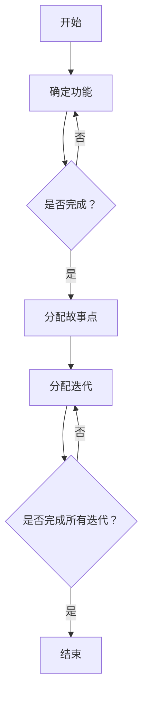
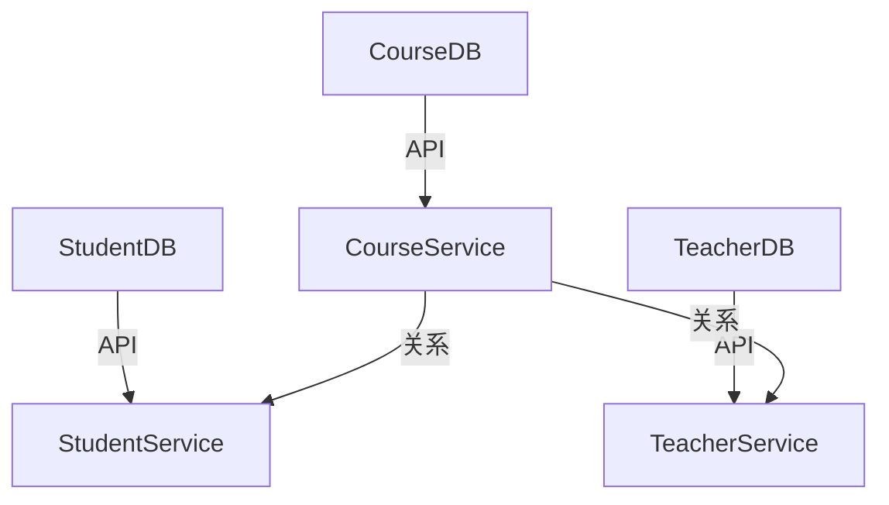
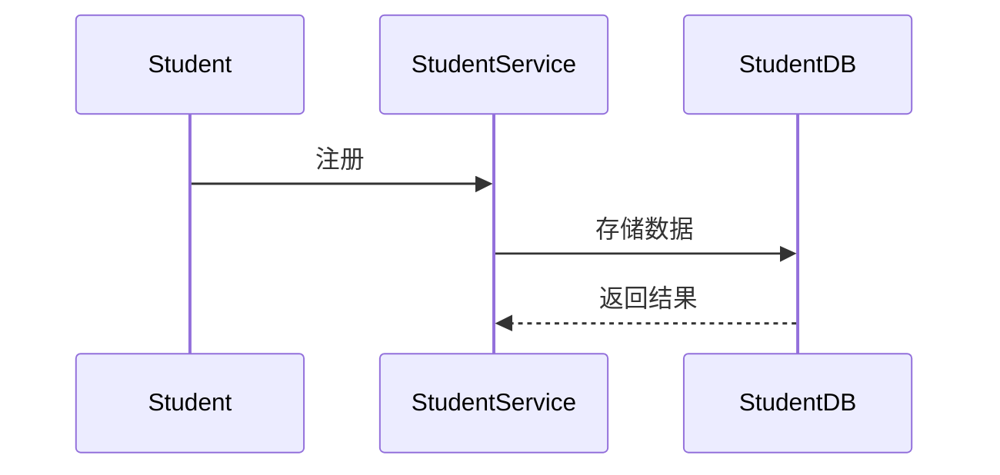

                 

### 《敏捷估算：提高迭代计划的准确性》

关键词：敏捷开发、迭代计划、估算、准确性、团队协作

摘要：本文将深入探讨敏捷估算在迭代计划中的重要性，通过详细的案例分析，提供提高迭代计划准确性的策略和方法，旨在帮助开发团队更好地管理项目进度和风险。

----------------------------------------------------------------

# 《敏捷估算：提高迭代计划的准确性》

敏捷开发已经成为现代软件项目管理的标准方法，其核心理念之一是快速迭代和持续交付。在这过程中，敏捷估算显得尤为重要，它直接关系到迭代计划的成功与否。本文将围绕敏捷估算的各个方面，包括其背景、核心概念、算法原理、系统分析与设计、实战案例以及最佳实践，逐步展开讨论，以帮助读者提高迭代计划的准确性。

----------------------------------------------------------------

## 第1章 敏捷估算的背景与重要性

### 1.1 敏捷开发的概述

敏捷开发是一种以人为核心、迭代、灵活应对变化的软件开发方法。与传统瀑布式开发相比，敏捷开发强调团队协作、持续交付、快速迭代和客户反馈。敏捷开发的主要目标是快速响应变化，确保项目能够在不断变化的需求环境中保持稳定前进。

### 1.2 敏捷估算的意义

敏捷估算在敏捷开发中扮演着关键角色。它不仅帮助团队在短时间内规划工作，还能识别潜在的风险和问题。准确的估算能够确保团队在每个迭代周期内能够完成任务，从而实现持续交付。

### 1.3 敏捷估算面临的问题与挑战

尽管敏捷估算具有重要意义，但实际操作中仍然面临诸多问题。例如，需求的频繁变动、团队成员的能力差异、项目环境的复杂性等，这些都可能影响估算的准确性。

----------------------------------------------------------------

## 第2章 敏捷估算的核心概念

### 2.1 故事点估算

#### 2.1.1 故事点的定义与用途

故事点（Story Points）是敏捷估算中常用的单位，用于量化工作的复杂度和工作量。故事点并不直接等同于时间，而是基于团队的经验和共识来估算的。

#### 2.1.2 故事点估算的方法

故事点估算的方法包括估算会议、排他性投票、任务分解等。在实际操作中，团队通常会选择一种或多种方法结合使用。

#### 2.1.3 故事点估算的实际案例

以下是一个简单的案例，用于说明故事点估算的步骤：

**案例**：假设一个团队计划开发一个待办事项管理应用，包括以下功能：
- 创建待办事项
- 编辑待办事项
- 删除待办事项
- 导出待办事项列表

**步骤**：
1. 确定每个功能的复杂度，例如，创建待办事项可能只需要较少的故事点，而编辑和删除则可能需要更多的故事点。
2. 通过估算会议，让团队成员对这些功能进行投票，确定每个功能的故事点。
3. 根据故事点总数，分配到迭代中，确保团队能够在给定的时间内完成任务。

----------------------------------------------------------------

## 第3章 敏捷估算的算法原理

### 3.1 经典估算模型

敏捷估算中常用的模型包括COCOMO（构造化成本模型）和alogorithm X。这些模型通过数学公式和算法，帮助团队进行工作量估算。

#### 3.1.1 COCOMO模型

COCOMO模型根据软件规模、开发人员经验等因素，估算项目的开发成本。其公式如下：

$$
E = a \times (size)^b
$$

其中，E是估算的工程工作量，a和b是模型参数，size是软件规模。

#### 3.1.2 Alogorithm X模型

alogorithm X模型是基于敏捷思想的估算模型，它通过故事点估算，结合团队的工作效率，计算项目的迭代周期。其公式如下：

$$
T = \frac{N}{E}
$$

其中，T是迭代周期，N是迭代次数，E是每个迭代的工作量。

### 3.2 Mermaid流程图展示

以下是一个简单的Mermaid流程图，展示故事点估算的步骤：



### 3.3 Python代码实现

以下是一个简单的Python代码，用于计算故事点：

```python
# 定义故事点估算函数
def calculate_story_points(functions):
    points = 0
    for function in functions:
        points += function['point']
    return points

# 示例数据
functions = [
    {'name': '创建待办事项', 'point': 2},
    {'name': '编辑待办事项', 'point': 4},
    {'name': '删除待办事项', 'point': 3},
    {'name': '导出待办事项列表', 'point': 2}
]

# 计算总故事点
total_points = calculate_story_points(functions)
print(f"总故事点：{total_points}")
```

----------------------------------------------------------------

## 第4章 敏捷估算的系统分析与设计

### 4.1 项目场景介绍

假设一个团队计划开发一个在线教育平台，包含课程发布、学生注册、课程学习等功能。为了确保项目顺利进行，需要对每个功能进行敏捷估算。

### 4.2 系统功能设计

以下是一个简单的领域模型，用于描述在线教育平台的主要功能：

```mermaid
classDiagram
    Course <.. Student
    Course <.. Teacher
    Student <.. Course
    Teacher <.. Course

    Class +-- Course
    Course +-- Chapter
    Chapter +-- Section
    Teacher +-- Class
    Student +-- Class
    Student +-- Course
```

### 4.3 系统架构设计

系统架构设计需要考虑功能的分布、数据库设计、API设计等方面。以下是一个简单的Mermaid架构图：



### 4.4 系统接口设计

系统接口设计需要明确各个功能模块之间的交互方式。以下是一个简单的Mermaid序列图：



### 4.5 系统交互设计

系统交互设计需要考虑用户操作与系统响应的关系。以下是一个简单的Mermaid交互图：

```mermaid
stateDiagram
    state "注册" {
        Student ->> StudentService: 注册
        StudentService ->> StudentDB: 存储数据
        StudentDB -->> StudentService: 返回结果
    }
    state "登录" {
        Student ->> StudentService: 登录
        StudentService ->> StudentDB: 验证信息
        StudentDB -->> StudentService: 返回结果
    }
```

----------------------------------------------------------------

## 第5章 敏捷估算项目实战

### 5.1 项目环境安装

为了进行敏捷估算，需要安装相应的工具和环境。以下是一个简单的环境安装步骤：

```bash
# 安装Python环境
pip install numpy pandas matplotlib

# 安装Mermaid渲染工具
npm install -g mermaid-cli
```

### 5.2 系统核心实现

以下是一个简单的Python代码，用于实现故事点估算功能：

```python
import pandas as pd

# 定义故事点数据
data = {
    '功能': ['创建课程', '编辑课程', '发布课程', '学生报名', '课程评价'],
    '故事点': [5, 4, 3, 2, 1]
}

# 创建DataFrame
df = pd.DataFrame(data)

# 计算总故事点
total_points = df['故事点'].sum()
print(f"总故事点：{total_points}")
```

### 5.3 代码解读与分析

代码首先定义了一个包含功能和故事点的数据列表，然后将其转换为DataFrame。接着，使用`sum()`方法计算总故事点，并打印结果。

### 5.4 实际案例分析

以下是一个实际项目案例，用于说明敏捷估算在项目中的应用：

**案例**：一个团队计划开发一个社交媒体应用，包含用户注册、发布动态、评论等功能。

**步骤**：
1. 确定每个功能的复杂度，例如，用户注册可能需要较少的故事点，而发布动态可能需要更多的故事点。
2. 通过估算会议，让团队成员对这些功能进行投票，确定每个功能的故事点。
3. 根据故事点总数，分配到迭代中，确保团队能够在给定的时间内完成任务。

### 5.5 项目小结

通过实际案例，可以看出敏捷估算在项目管理中的重要性。准确的估算能够帮助团队更好地规划工作，提高项目的成功率。

----------------------------------------------------------------

## 第6章 敏捷估算最佳实践

### 6.1 最佳实践技巧

- 定期进行估算会议，确保团队成员对项目的理解和预期一致。
- 使用历史数据作为参考，以提高估算的准确性。
- 将估算过程可视化为图表，以便团队成员更好地理解。

### 6.2 注意事项

- 避免过度依赖估算工具，应结合团队成员的实际经验和直觉。
- 需要不断调整和优化估算方法，以适应项目的实际需求。

### 6.3 拓展阅读

- 《敏捷估算实践指南》
- 《敏捷项目管理：从基础到实践》
- 《敏捷估算：从理论到实践的转型》

----------------------------------------------------------------

## 第7章 小结与展望

敏捷估算在敏捷开发中具有不可替代的作用。通过准确的估算，团队能够更好地管理项目进度和风险，提高迭代计划的准确性。然而，敏捷估算仍然面临诸多挑战，需要不断优化和改进。未来，随着技术的不断发展，敏捷估算也将不断演变，为敏捷开发提供更强大的支持。

---

**作者：AI天才研究院/AI Genius Institute & 禅与计算机程序设计艺术 /Zen And The Art of Computer Programming**

