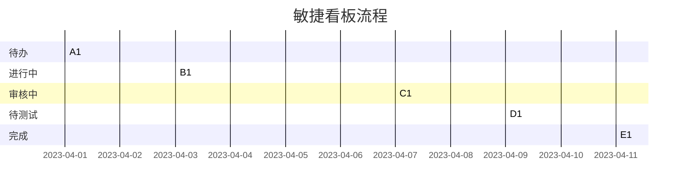
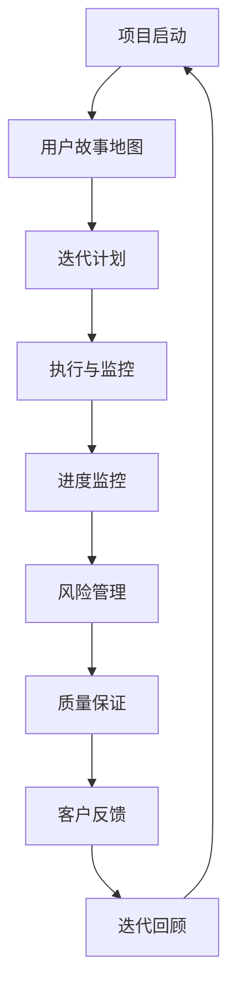
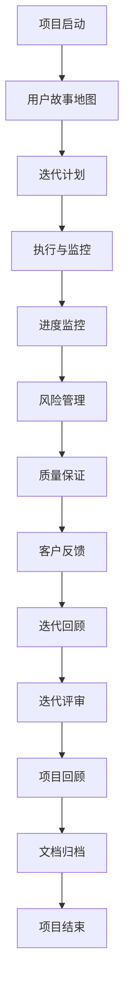

                 


### 1.1 敏捷开发的基本概念

#### 敏捷开发的定义与起源

敏捷开发（Agile Development）是一种以人为核心、迭代、增量和灵活应对变化的软件开发方法。它起源于2001年，当时一些软件开发专家在滑雪度假时共同签署了《敏捷宣言》（Manifesto for Agile Software Development），提出了敏捷开发的核心理念和原则。

敏捷宣言的核心内容包括：

- **个体和互动重于过程和工具**：重视团队成员的沟通与协作，认为有效的沟通比复杂的工具更重要。
- **可工作的软件重于详尽的文档**：强调快速交付可工作的软件，而不是撰写详尽的文档。
- **客户协作重于合同谈判**：鼓励与客户的紧密合作，确保产品能够满足客户需求。
- **响应变化重于遵循计划**：敏捷开发强调快速适应变化，而不是严格遵守预先制定的计划。

#### 敏捷开发的起源与发展

敏捷开发起源于软件开发领域，但其理念可以追溯到更早的管理思想和软件工程实践。例如，亨利·福特（Henry Ford）的流水线生产方式和爱德华兹·戴明（W. Edwards Deming）的质量管理方法都对敏捷开发有启示作用。

在软件开发领域，敏捷开发的发展可以追溯到以下几个重要阶段：

- **瀑布模型**：早期的软件开发方法，强调顺序执行、阶段性的计划和控制。
- **迭代开发**：引入迭代和重复的概念，允许在开发过程中逐步改进和优化软件。
- **增量开发**：将软件开发过程分为多个增量，每个增量都可以交付使用。
- **敏捷开发**：融合了迭代开发和增量开发的优点，强调灵活应对变化、高效团队合作和持续交付价值。

#### 敏捷开发与传统开发模式的区别

传统开发模式，如瀑布模型，通常遵循以下步骤：

1. 需求分析：确定项目需求，撰写详细的需求文档。
2. 设计：根据需求文档进行系统设计，包括架构设计、数据库设计等。
3. 编码：按照设计文档进行编码实现。
4. 测试：对编码实现的软件进行功能测试、性能测试等。
5. 部署：将软件部署到生产环境，进行实际运行。

与传统开发模式相比，敏捷开发具有以下区别：

- **迭代和增量**：敏捷开发强调快速迭代和增量交付，而不是一次性完成整个项目。
- **需求灵活性**：敏捷开发更注重客户需求的变化，允许在开发过程中随时调整需求。
- **团队合作**：敏捷开发强调团队成员之间的紧密合作和沟通，而不是按照职能分工工作。
- **持续交付**：敏捷开发强调持续交付可工作的软件，确保产品能够快速响应市场变化。

总的来说，敏捷开发提供了一种更灵活、更高效、更贴近实际需求的软件开发方法，有助于提高团队效率和产品品质。

### 1.2 敏捷开发的核心原则

#### 敏捷开发的核心原则

敏捷开发的核心原则是在软件开发过程中，以人为核心，注重快速迭代、灵活适应变化和高效团队合作。这些核心原则包括：

- **用户故事**：用户故事是一种简单、明确的描述，用于表达用户需求。它通常遵循“As a [角色]，I want [功能]，so that [目的】”的结构。
- **迭代开发**：迭代开发是指将开发过程分为多个迭代周期，每个迭代周期都包含需求分析、设计、编码、测试和交付等环节。
- **持续集成与持续交付**：持续集成是指将代码定期合并到主分支，并进行自动化测试，以确保软件质量。持续交付是指通过自动化流程，确保软件可以随时发布到生产环境。

#### 用户故事与迭代开发

用户故事是一种简单、明确的描述用户需求的方式。它通常遵循“**As a [角色]，I want [功能]，so that [目的]**”的结构。例如：“**As a user，I want to search for products，so that I can find what I'm looking for easily**”。

用户故事具有以下特点：

- **简洁明了**：用户故事应该简单、直接，避免使用技术术语。
- **可测试**：用户故事应该具有明确的功能点，可以编写相应的测试用例。
- **可分解**：用户故事可以根据复杂度进行分解，拆分为更小、更易于管理的任务。

迭代开发是指将开发过程分为多个迭代周期，每个迭代周期都包含以下环节：

1. **需求分析**：根据用户故事，确定本次迭代需要实现的功能点。
2. **设计**：设计软件的架构和组件，确保功能实现。
3. **编码**：按照设计文档进行编码实现。
4. **测试**：对编码实现的软件进行功能测试、性能测试等，确保软件质量。
5. **交付**：将迭代周期内实现的功能交付给用户。

迭代开发具有以下优点：

- **快速反馈**：通过短周期迭代，可以快速获取用户反馈，及时调整开发方向。
- **灵活性**：允许在迭代过程中根据反馈调整需求，更好地适应变化。
- **持续交付**：每次迭代都可以交付使用，确保产品持续交付价值。

#### 持续集成与持续交付

持续集成（Continuous Integration，CI）是指将代码定期合并到主分支，并进行自动化测试，以确保软件质量。持续集成具有以下优点：

- **早期发现问题**：通过自动化测试，可以尽早发现代码中的问题，避免问题积累。
- **提高代码质量**：定期进行代码审查和测试，有助于提高代码质量。
- **减少集成风险**：通过持续集成，可以减少不同代码模块之间的集成风险。

持续交付（Continuous Delivery，CD）是指通过自动化流程，确保软件可以随时发布到生产环境。持续交付具有以下优点：

- **快速响应**：通过持续交付，可以快速响应市场变化，确保产品竞争力。
- **降低风险**：通过自动化测试和部署，可以降低手动操作引入错误的风险。
- **提高效率**：自动化流程可以提高部署效率，减少人力成本。

持续集成与持续交付通常需要以下工具支持：

- **版本控制系统**：如 Git，用于管理代码版本。
- **自动化构建工具**：如 Jenkins、Travis CI，用于自动化构建和测试。
- **容器化技术**：如 Docker，用于打包和部署应用。

#### 敏捷团队的组织架构

敏捷团队通常采用扁平化管理结构，强调团队成员之间的紧密协作和沟通。敏捷团队通常包括以下角色：

- **产品负责人（Product Owner）**：负责制定产品愿景、确定优先级，与客户进行沟通，确保产品满足客户需求。
- **Scrum Master**：负责推动敏捷实践，帮助团队消除障碍，确保团队高效运行。
- **开发团队**：负责实现产品功能，通常由多个角色组成，如开发者、测试工程师等。

敏捷团队的组织架构有助于提高团队效率和沟通效果，通过短周期迭代、用户故事和持续集成与持续交付，敏捷团队可以更快地响应市场变化，持续交付高质量的产品。

### 1.3 敏捷开发的价值观

敏捷开发的价值观是基于对软件开发实践的深入理解和反思，它强调以人为核心，注重持续交付、团队合作和灵活应对变化。以下是敏捷开发的六大核心价值观：

1. **个体和互动重于过程和工具**：
   - **解释**：敏捷开发认为，软件开发的成功取决于团队成员的能力和互动，而不是依赖于复杂的过程或工具。
   - **示例**：在一个敏捷团队中，成员之间频繁的沟通和协作比遵循繁琐的过程或使用昂贵的工具更为重要。

2. **可工作的软件重于详尽的文档**：
   - **解释**：敏捷开发强调实际可运行的软件是衡量项目成功的关键指标，而不是依赖大量的文档。
   - **示例**：敏捷团队会优先实现能立即交付的功能，而不是编写详尽的文档，以加快产品交付速度。

3. **客户协作重于合同谈判**：
   - **解释**：敏捷开发倡导与客户的紧密合作，以快速响应客户需求和变化。
   - **示例**：敏捷团队会定期与客户开会，获取反馈，确保产品开发方向与客户期望一致。

4. **响应变化重于遵循计划**：
   - **解释**：敏捷开发接受变化作为软件开发过程中的正常现象，并认为灵活适应变化比坚持原计划更为重要。
   - **示例**：敏捷团队会根据客户反馈和市场变化调整优先级，而不是固执地遵循最初的项目计划。

5. **工作软件胜过详尽的文档**：
   - **解释**：敏捷开发认为，完成的软件功能比详尽的文档更有价值，因为软件可以直接使用和验证。
   - **示例**：敏捷团队会确保每个迭代都提供可工作的软件，以便客户和团队成员可以直观地看到进展。

6. **持续交付重于频繁发布**：
   - **解释**：敏捷开发强调持续交付价值，通过频繁的小规模发布来保持软件的持续可用性。
   - **示例**：敏捷团队会通过自动化测试和部署流程，实现频繁但可控的软件发布。

### **对比表格**：敏捷开发与传统开发模式的价值观对比

| **价值观** | **敏捷开发** | **传统开发** |
| --- | --- | --- |
| **个体和互动** | 重视团队协作，强调沟通 | 重视个人技能，依赖个体工作 |
| **可工作的软件** | 以可运行软件为最终目标 | 以详尽文档和设计为依据 |
| **客户协作** | 与客户紧密合作，快速响应 | 通过合同和需求文档明确要求 |
| **响应变化** | 灵活应对变化，接受变化 | 严格遵循计划，避免变化 |
| **工作软件** | 每次迭代交付可用软件 | 在项目末期交付完整软件 |
| **持续交付** | 通过持续交付保持软件可用性 | 通过计划发布周期控制软件更新 |

### **ER实体关系图架构**：敏捷开发中的关键实体及其关系

使用 Mermaid 流程图展示敏捷开发中的关键实体及其关系：

```mermaid
erDiagram
  Product Owner ||--|{ Developer } : implements
  Product Owner ||--|{ Tester } : tests
  Scrum Master ||--|{ Developer } : guides
  Scrum Master ||--|{ Tester } : oversees
  Developer ||--|{ Tester } : collaborates
  Developer ||--|{ Product Owner } : reports progress
  Tester ||--|{ Product Owner } : validates requirements
```

### **敏捷开发中的快速反馈**

敏捷开发中的快速反馈机制是其成功的关键之一。快速反馈有助于团队及时发现并解决问题，从而提高开发效率和产品质量。以下是敏捷开发中快速反馈的几个关键方面：

1. **每日站立会议（Daily Stand-up）**：
   - **目的**：每日站立会议是团队每日同步和沟通的重要环节，旨在确保团队成员了解项目的进展和遇到的问题。
   - **流程**：每个团队成员在会议中回答以下三个问题：
     - **昨天完成了什么？**
     - **今天计划做什么？**
     - **遇到什么问题需要帮助？**
   - **效果**：通过每日站立会议，团队成员可以快速了解项目的整体进展，识别和解决潜在问题。

2. **迭代评审（Iteration Review）**：
   - **目的**：迭代评审是团队在每个迭代结束时对已完成的软件功能进行评估和反馈。
   - **流程**：团队展示迭代成果，客户和其他利益相关者提供反馈，讨论改进建议。
   - **效果**：迭代评审有助于确保交付的产品满足客户需求，同时为后续迭代提供改进方向。

3. **迭代回顾（Iteration Retrospective）**：
   - **目的**：迭代回顾是团队在每个迭代结束时对项目过程和团队协作进行反思和总结。
   - **流程**：团队成员讨论哪些做法有效，哪些需要改进，制定下一迭代的质量提升计划。
   - **效果**：迭代回顾有助于团队不断优化开发流程，提高团队效率和产品质量。

### **敏捷开发中的持续改进**

敏捷开发中的持续改进机制是其保持高效和灵活的重要保障。以下是一些关键方面：

1. **持续学习**：
   - **目的**：鼓励团队成员不断学习和掌握新技能，以提高团队整体能力。
   - **方法**：通过组织内部培训、外部研讨会和读书会等形式，促进团队成员的技能提升。

2. **持续优化**：
   - **目的**：不断优化开发流程和工作方式，提高开发效率和产品质量。
   - **方法**：通过迭代回顾和持续集成，识别改进点，并实施相应的优化措施。

3. **持续反馈**：
   - **目的**：通过快速反馈机制，确保团队能够及时调整和改进。
   - **方法**：定期进行迭代评审和回顾，收集反馈，并制定改进计划。

4. **持续交付**：
   - **目的**：确保软件持续交付价值，快速响应市场变化。
   - **方法**：通过持续集成和持续交付，实现频繁但可控的软件发布。

### **敏捷开发中的定制化策略**

敏捷开发强调灵活性和适应性，不同的项目和团队可能需要不同的敏捷实践。以下是一些定制化策略：

1. **敏捷实践选择**：
   - **目的**：选择最适合项目的敏捷实践，避免过度遵循。
   - **方法**：通过评估项目的特点和需求，选择合适的敏捷实践，如Scrum、Kanban或LeSS。

2. **敏捷工具选择**：
   - **目的**：选择适合团队和项目的敏捷工具，提高协作效率。
   - **方法**：根据团队规模、工作流程和工具熟悉度，选择合适的敏捷工具，如Jira、Trello或Confluence。

3. **敏捷文化培养**：
   - **目的**：建立敏捷文化，鼓励团队成员接受和践行敏捷原则。
   - **方法**：通过培训和团队建设活动，培养团队成员的敏捷意识和文化。

### **总结**

敏捷开发的核心价值观强调以人为核心，注重持续交付、团队合作和灵活应对变化。通过快速反馈、持续改进和定制化策略，敏捷开发能够提高团队效率和产品质量，帮助团队更好地适应快速变化的市场环境。

## 第二部分：敏捷开发实践

### 2.1 敏捷开发工具与技术

#### 敏捷看板

敏捷看板（Kanban）是一种可视化工作流程的工具，它通过看板（Kanban Board）来展示项目的工作流程和进展。看板通常包含以下三个核心组件：

1. **任务卡片（Tasks）**：任务卡片用于表示项目中的具体任务，每个卡片上包含任务的名称、优先级、负责人和进度等信息。
2. **工作区域（Columns）**：工作区域表示项目的工作流程，通常包括“待办（To Do）”、“进行中（In Progress）”、“审核中（In Review）”、“待测试（In Testing）”、“完成（Done）”等状态。
3. **限制在办任务（Work in Process, WIP）**：限制在办任务用于控制每个工作区域的最大任务数，以防止过度工作，提高工作效率。

**Mermaid 流程图**：以下是一个简单的敏捷看板流程图示例。



#### 敏捷规划

敏捷规划是指在敏捷开发过程中对项目进行规划和安排的活动。敏捷规划主要包括以下三个方面：

1. **迭代计划（Sprint Planning）**：在每次迭代开始时，团队会进行迭代计划，确定本次迭代的目标、任务和交付成果。
2. **优先级排序（Priority Sorting）**：在迭代计划过程中，团队会根据用户故事的价值和风险，对任务进行优先级排序。
3. **资源分配（Resource Allocation）**：根据任务优先级和团队资源，合理分配任务和人员。

**Python 源代码示例**：以下是一个简单的迭代计划示例。

```python
def sprint_planning(stories, resources):
    sorted_stories = sorted(stories, key=lambda x: x['priority'], reverse=True)
    allocated_stories = {}
    
    for story in sorted_stories:
        if story['points'] <= resources['points']:
            allocated_stories[story['id']] = story
            resources['points'] -= story['points']
        else:
            break
    
    return allocated_stories

stories = [
    {'id': 1, 'title': '用户故事1', 'points': 5, 'priority': 1},
    {'id': 2, 'title': '用户故事2', 'points': 3, 'priority': 2},
    {'id': 3, 'title': '用户故事3', 'points': 7, 'priority': 3}
]

resources = {'points': 10}

allocated_stories = sprint_planning(stories, resources)
print(allocated_stories)
```

#### 敏捷回顾

敏捷回顾是指在每次迭代结束时，团队对项目过程和团队协作进行反思和总结的活动。敏捷回顾的主要目的是发现问题和改进机会，以提高未来迭代的效果。

1. **回顾会议（Retrospective Meeting）**：在回顾会议中，团队成员分享他们在迭代中的体验和观察，讨论哪些做法有效，哪些需要改进。
2. **反思技术（Reflection Techniques）**：常用的反思技术包括“沉默反思”、“圆圈讨论”和“角色扮演”等，以促进团队成员之间的深入交流和反思。
3. **行动计划（Action Plan）**：在回顾会议结束后，团队会制定行动计划，明确改进措施和时间表。

**Python 源代码示例**：以下是一个简单的回顾会议记录示例。

```python
def retrospective_meeting(issues, actions):
    print("回顾会议记录：")
    for issue in issues:
        print(f"- 问题：{issue['description']}")
        print(f"  行动计划：{issue['action_plan']}")
        print(f"  负责人：{issue['responsible']}")
        print(f"  完成日期：{issue['deadline']}")
        print()

issues = [
    {'description': '沟通不足', 'action_plan': '增加每日站立会议时间', 'responsible': '产品负责人', 'deadline': '2023-04-15'},
    {'description': '任务分配不合理', 'action_plan': '优化任务分配流程', 'responsible': 'Scrum Master', 'deadline': '2023-04-20'}
]

retrospective_meeting(issues, actions)
```

通过敏捷回顾，团队可以不断改进开发过程，提高团队协作效率，从而在后续迭代中实现更好的成果。

### 2.2 敏捷团队协作

敏捷团队协作是敏捷开发成功的关键之一。敏捷团队通过高效的协作和沟通，可以快速响应变化，持续交付高质量的产品。以下是敏捷团队协作的一些关键要素：

#### 敏捷团队的角色与职责

敏捷团队通常包括以下角色：

1. **产品负责人（Product Owner）**：负责定义产品愿景、确定优先级和用户故事，确保团队开发的产品满足客户需求。
2. **Scrum Master**：负责推动敏捷实践，帮助团队消除障碍，确保团队高效运行。
3. **开发团队**：负责实现产品功能，包括开发者、测试工程师等。

每个角色的职责如下：

- **产品负责人**：与客户和利益相关者沟通，收集需求，编写用户故事，确定优先级，确保团队按照正确方向工作。
- **Scrum Master**：确保团队遵循敏捷实践，组织每日站立会议、迭代评审和回顾会议，帮助团队解决障碍，提高团队协作效率。
- **开发团队**：实现用户故事，编写代码，进行测试，确保按时交付高质量的产品。

#### 敏捷沟通与协作技巧

敏捷团队需要高效沟通和协作，以下是一些关键技巧：

1. **每日站立会议**：每日站立会议是团队同步和沟通的重要环节。每个成员在会议中分享进展、问题和计划，确保团队成员了解项目的整体情况。
2. **信息共享**：使用敏捷工具（如Jira、Trello）和共享文档（如Confluence）来记录任务、进度和决策，确保团队成员之间的信息共享。
3. **代码审查**：定期进行代码审查，确保代码质量，提高团队协作效率。
4. **持续集成**：通过持续集成，确保代码质量和及时反馈，减少集成风险。
5. **迭代回顾**：定期进行迭代回顾，总结经验教训，持续改进团队协作和工作流程。

#### 敏捷团队的日常运营

敏捷团队的日常运营包括以下关键活动：

1. **用户故事会议**：产品负责人与团队讨论用户故事，确定优先级和任务分配。
2. **每日站立会议**：团队同步进展，讨论问题和计划。
3. **迭代评审**：团队展示迭代成果，获取客户和利益相关者的反馈。
4. **迭代回顾**：团队反思迭代过程中的经验教训，制定改进计划。

通过高效沟通和协作，敏捷团队能够快速响应变化，持续交付高质量的产品。

### 2.3 敏捷项目管理

敏捷项目管理与传统的瀑布式项目管理不同，它更加灵活、迭代和以客户需求为导向。以下是敏捷项目管理的关键方面：

#### 敏捷项目的规划与执行

敏捷项目的规划与执行通常遵循以下步骤：

1. **项目启动**：确定项目目标和范围，组建敏捷团队，明确团队成员的角色和职责。
2. **用户故事地图**：产品负责人与客户和利益相关者一起，绘制用户故事地图，确定产品的关键功能和使用场景。
3. **迭代计划**：团队根据用户故事地图，确定每次迭代的计划和目标，包括用户故事的选择、任务分配和资源规划。
4. **执行与监控**：在迭代过程中，团队按照计划执行任务，通过每日站立会议、迭代评审和回顾会议等方式，监控项目进展，确保按计划交付。

**Python 源代码示例**：以下是一个简单的迭代计划示例。

```python
def plan_sprint(stories, days):
    sprint_tasks = {}
    current_day = 1
    
    for story in stories:
        if current_day + story['estimate'] <= days:
            sprint_tasks[story['id']] = story
            current_day += story['estimate']
        else:
            break
    
    return sprint_tasks

stories = [
    {'id': 1, 'title': '用户故事1', 'estimate': 3},
    {'id': 2, 'title': '用户故事2', 'estimate': 2},
    {'id': 3, 'title': '用户故事3', 'estimate': 5}
]

days = 10

sprint_tasks = plan_sprint(stories, days)
print(sprint_tasks)
```

#### 敏捷项目的监控与风险管理

敏捷项目的监控与风险管理包括以下关键方面：

1. **进度监控**：通过每日站立会议、迭代评审和回顾会议，监控项目进度和成果，确保按计划交付。
2. **风险管理**：识别项目风险，制定风险应对策略，确保项目顺利进行。
3. **质量保证**：通过持续集成和持续测试，确保软件质量，减少缺陷和风险。
4. **客户反馈**：定期收集客户反馈，了解产品是否符合客户需求，及时调整开发方向。

**Mermaid 流程图**：以下是一个简单的敏捷项目监控流程图示例。



#### 敏捷项目的收尾与评估

敏捷项目的收尾与评估包括以下关键步骤：

1. **迭代评审**：在项目结束时，团队进行最终迭代评审，展示项目的最终成果，获取客户和利益相关者的反馈。
2. **项目回顾**：团队进行项目回顾，总结项目经验教训，评估项目成果和过程，为未来项目提供改进参考。
3. **文档归档**：将项目文档、用户故事、代码等归档，以便未来参考和审计。

**Mermaid 流程图**：以下是一个简单的敏捷项目收尾与评估流程图示例。



通过敏捷项目管理，团队可以更好地控制项目进度、降低风险，确保高质量的产品交付。

### 2.4 敏捷开发中的挑战与应对策略

敏捷开发虽然具有许多优点，但在实际应用中也会面临一些挑战。以下是一些常见的挑战以及相应的应对策略：

#### 沟通障碍

**挑战**：在敏捷开发中，团队需要频繁的沟通和协作，但由于团队成员分布在不同的地点，或者团队成员的背景和技能差异，可能会出现沟通障碍。

**应对策略**：
- **采用适当的沟通工具**：使用即时通讯工具（如 Slack、Microsoft Teams）、视频会议软件（如 Zoom、Microsoft Teams）和协作工具（如 Trello、Jira）来提高沟通效率。
- **明确沟通目标和规则**：制定清晰的沟通目标和规则，确保团队成员知道何时、如何以及与谁沟通。
- **定期团队会议**：定期举行团队会议，确保团队成员之间的信息共享和同步。

#### 变更管理

**挑战**：敏捷开发强调快速响应变化，但在实际操作中，变更管理可能变得复杂，尤其是在项目进行到后期时。

**应对策略**：
- **建立变更控制流程**：制定清晰的变更控制流程，包括变更请求的提交流程、评估和批准流程，以及变更的实施和追踪。
- **优先级管理**：在变更管理过程中，对变更请求进行优先级排序，确保高优先级的变更得到优先处理。
- **沟通和协调**：及时与相关利益相关者沟通变更的影响和方案，确保变更实施过程中各方协作顺畅。

#### 团队冲突

**挑战**：敏捷团队中的冲突可能源于个人差异、工作压力或对项目目标的理解不一致。

**应对策略**：
- **建立冲突解决机制**：制定冲突解决的流程和规则，确保团队成员在发生冲突时能够及时有效地解决。
- **提供培训和支持**：为团队成员提供沟通和冲突解决的培训，提高团队协作能力。
- **建立信任和尊重**：鼓励团队成员之间的信任和尊重，创造一个积极的工作氛围。

通过采取适当的应对策略，敏捷团队可以克服这些挑战，实现高效协作和持续交付。

### 3.1 案例一：某互联网公司敏捷开发实践

#### 项目背景

某互联网公司是一家专注于电子商务平台开发的公司，其核心产品是一个大型在线购物网站。为了在竞争激烈的市场中保持竞争优势，公司决定采用敏捷开发方法来提高团队效率和产品交付速度。

#### 敏捷开发实践过程

1. **团队组建**：公司成立了一个由产品负责人、Scrum Master 和开发团队组成的敏捷团队。团队成员包括前端开发者、后端开发者、测试工程师和UI/UX设计师。

2. **用户故事编写**：产品负责人与客户和利益相关者一起，编写了多个用户故事，并按照优先级进行了排序。用户故事涵盖了网站的各种功能，如商品搜索、购物车、订单管理、用户评论等。

3. **迭代计划**：团队采用Scrum方法，每周进行一次迭代。每次迭代开始时，团队会进行迭代计划会议，确定本次迭代的目标、任务和交付成果。

4. **每日站立会议**：团队每天举行一次每日站立会议，确保团队成员了解项目的进展和遇到的问题。

5. **持续集成与持续交付**：团队使用Jenkins进行持续集成，确保代码质量和及时反馈。同时，使用Docker进行容器化部署，实现快速、可靠的持续交付。

6. **迭代评审与回顾**：在每次迭代结束时，团队进行迭代评审，展示迭代成果，获取客户和利益相关者的反馈。同时，进行迭代回顾，总结经验教训，为下一个迭代做准备。

#### 敏捷开发的效果与收获

通过采用敏捷开发，公司取得了以下效果和收获：

1. **提高团队效率**：敏捷开发方法使团队工作更加高效，任务分配更加明确，沟通更加顺畅。

2. **快速响应变化**：敏捷开发允许团队快速响应市场需求和客户反馈，确保产品能够持续满足用户需求。

3. **提高产品质量**：通过持续集成和测试，代码质量和产品质量得到了显著提高。

4. **增强客户满意度**：敏捷开发方法使客户能够更早地参与到产品开发过程中，提高了客户的满意度和参与度。

5. **团队协作提升**：通过每日站立会议、迭代评审和回顾会议，团队成员之间的协作和沟通得到了显著提升。

#### 项目小结

通过该项目，公司深刻认识到敏捷开发在提高团队效率和产品质量方面的巨大潜力。未来，公司将继续优化敏捷实践，不断提升团队协作和项目交付能力。

### 3.2 案例二：某金融机构敏捷开发转型

#### 项目背景

某金融机构是一家拥有悠久历史的金融机构，其IT系统基于传统的瀑布模型开发，导致项目周期长、成本高且难以适应市场变化。为了提升开发效率和产品竞争力，公司决定进行敏捷开发转型。

#### 敏捷开发转型过程

1. **领导层支持**：公司领导层高度重视敏捷开发转型，明确表示支持并推动转型过程。

2. **团队培训**：公司组织了一系列敏捷开发培训，包括Scrum、Kanban等，使团队成员掌握敏捷开发的基本原理和方法。

3. **过程改进**：公司逐步改进现有开发流程，引入敏捷实践，如用户故事、迭代计划、每日站立会议等。

4. **组织结构调整**：公司调整组织结构，组建跨职能的敏捷团队，包括产品负责人、Scrum Master、开发团队和测试团队。

5. **工具支持**：公司引入了Jira、Confluence等敏捷开发工具，提高团队协作和项目管理效率。

6. **持续改进**：公司通过迭代评审和回顾会议，不断优化敏捷实践，提升团队协作和项目交付能力。

#### 敏捷开发转型的效果与影响

通过敏捷开发转型，公司取得了以下效果和影响：

1. **缩短开发周期**：敏捷开发方法使项目周期显著缩短，从原来的数月缩短到数周，提高了产品交付速度。

2. **降低成本**：通过减少不必要的文档和过程，公司降低了开发成本，提高了资源利用效率。

3. **提高产品质量**：敏捷开发方法使团队成员更加专注于代码质量和用户体验，提高了产品品质。

4. **增强客户满意度**：敏捷开发使公司能够更快速地响应客户需求，提高了客户满意度和忠诚度。

5. **团队凝聚力提升**：通过敏捷实践，团队成员之间的沟通和协作得到加强，团队凝聚力显著提升。

#### 项目小结

敏捷开发转型使该金融机构在开发效率和产品质量方面取得了显著提升。未来，公司将继续优化敏捷实践，持续提升团队协作和项目交付能力，以适应快速变化的市场环境。

### 4.1 敏捷领导力

#### 敏捷领导者的角色与职责

敏捷领导者（Agile Leader）在敏捷开发中扮演着关键角色，他们不仅需要具备传统的领导能力，还要深刻理解敏捷原则和方法，以推动团队高效协作和持续改进。以下是敏捷领导者的一些关键角色和职责：

1. **愿景与目标设定**：敏捷领导者负责设定团队和组织的愿景和目标，确保团队的工作与组织战略保持一致。

2. **促进团队协作**：敏捷领导者要推动团队内的沟通和协作，消除障碍，确保团队成员能够共同为一个目标努力。

3. **激发创新与学习**：敏捷领导者鼓励团队成员进行创新，提供学习和成长的机会，促进团队的持续改进。

4. **支持自我管理**：敏捷领导者支持团队自我管理，尊重团队成员的专业判断和决策，让团队成员在敏捷框架下自主工作。

5. **引导敏捷实践**：敏捷领导者要引导团队遵循敏捷原则和方法，确保敏捷实践得到有效执行。

6. **处理冲突**：敏捷领导者要能够有效处理团队内部和外部的冲突，保持团队的和谐与稳定。

#### 敏捷领导力的培养与提升

要成为一名优秀的敏捷领导者，需要通过以下途径培养和提升自己的领导力：

1. **敏捷认证**：参加敏捷认证课程（如Scrum Master认证、SAFe认证等），了解敏捷原则和方法，掌握敏捷领导技巧。

2. **学习与实践**：通过阅读敏捷相关书籍、参加敏捷研讨会和实际项目管理经验，不断学习和实践敏捷理念。

3. **建立信任**：与团队成员建立信任关系，通过开放沟通、透明决策和尊重他人，增强团队的凝聚力和合作意识。

4. **团队建设**：定期组织团队建设活动，增强团队凝聚力，提升团队协作能力。

5. **持续反思**：定期进行个人和团队的反思，识别优势和不足，制定改进计划，以持续提升领导力和团队绩效。

通过这些途径，敏捷领导者可以不断提升自己的领导能力，为团队创造一个高效、创新和积极的工作环境。

### 4.2 敏捷组织的构建

#### 敏捷组织的结构设计

构建一个敏捷组织是确保敏捷开发方法有效实施的关键。敏捷组织的结构设计应注重灵活性、协作性和快速响应变化的能力。以下是敏捷组织结构设计的关键方面：

1. **跨职能团队**：敏捷组织通常采用跨职能团队（Cross-functional Teams），即一个团队中包含多个职能角色（如开发、测试、设计、运维等），这样可以减少部门之间的壁垒，提高团队协作效率。

2. **自组织团队**：在敏捷组织中，团队应该具备自我组织的能力，可以根据项目需求调整团队成员的职责和任务分配，确保团队能够快速响应变化。

3. **扁平化管理**：敏捷组织通常采用扁平化管理结构，减少层级，缩短决策路径，提高决策效率。

4. **敏捷团队角色**：敏捷团队通常包括以下角色：
   - **产品负责人（Product Owner）**：负责定义产品愿景、确定优先级和用户故事，确保团队开发的产品满足客户需求。
   - **Scrum Master**：负责推动敏捷实践，帮助团队消除障碍，确保团队高效运行。
   - **开发团队**：负责实现产品功能，由多个职能角色组成。

5. **协作平台**：使用协作工具（如Jira、Confluence、Trello等）来支持团队协作，确保团队成员之间的信息共享和任务同步。

#### 敏捷组织的文化建设

敏捷组织的文化是确保敏捷实践成功实施的重要基础。以下是一些关键方面：

1. **透明度**：敏捷组织应保持高度的透明度，确保团队成员之间的信息共享和决策过程的公开性。

2. **信任与尊重**：建立团队成员之间的信任关系，尊重每个人的意见和贡献，鼓励开放沟通和合作。

3. **持续学习**：鼓励团队成员不断学习新知识和技能，通过培训、研讨会和分享会等形式，提升团队整体能力。

4. **自我管理**：支持团队成员的自我管理，鼓励团队成员在敏捷框架下自主决策和工作。

5. **敏捷价值观**：将敏捷价值观（如客户至上、响应变化、持续交付等）融入组织的核心价值观，确保团队成员在日常工作中遵循敏捷原则。

通过合理的组织结构设计和积极的文化建设，敏捷组织可以更好地适应快速变化的市场环境，提高团队效率和产品交付能力。

### 4.3 敏捷开发的核心策略

#### 敏捷开发中的快速反馈

快速反馈是敏捷开发的核心策略之一，它通过缩短反馈周期，使团队能够快速识别和解决问题，从而提高开发效率和产品质量。以下是实现快速反馈的几个关键方面：

1. **短迭代周期**：通过短周期的迭代（如每周或每两周一次），团队能够在较短时间内完成功能开发，并及时获取用户反馈。

2. **自动化测试**：引入自动化测试，确保每次迭代结束后，团队能够快速发现和修复缺陷，提高软件质量。

3. **持续集成**：通过持续集成，将代码定期合并到主分支并进行自动化测试，确保代码质量和减少集成风险。

4. **用户故事映射**：通过用户故事映射，明确每个用户故事的目标和验收标准，确保每次迭代都能交付有价值的软件功能。

5. **反馈机制**：建立有效的反馈机制，如每日站立会议、迭代评审和回顾会议，确保团队成员能够及时了解项目进展和存在的问题。

#### 敏捷开发中的持续改进

持续改进是敏捷开发中的另一个核心策略，它通过不断地评估和优化团队流程，提高开发效率和产品质量。以下是实现持续改进的几个关键方面：

1. **迭代回顾**：在每次迭代结束时，团队进行迭代回顾，总结经验教训，识别改进点，并制定改进计划。

2. **反思与学习**：鼓励团队成员反思和总结每次迭代的经验，识别成功和失败的原因，并从中学习。

3. **改进计划**：根据迭代回顾的结果，团队制定具体的改进计划，包括流程优化、工具改进和团队建设等方面。

4. **实验与实验验证**：通过实验和实验验证，尝试新的方法和工具，以验证其对团队效率和质量的影响。

5. **持续学习和培训**：提供持续学习和培训机会，帮助团队成员不断提升技能和知识水平。

通过快速反馈和持续改进，敏捷开发团队能够不断提高自身的效率和产品的质量，更好地满足客户需求。

### 附录：敏捷开发资源与工具推荐

#### 敏捷开发工具推荐

为了支持敏捷开发实践，以下是一些常用的敏捷开发工具：

1. **Jira**：用于项目管理、任务跟踪和协作。提供了丰富的功能，如敏捷看板、迭代规划、报告分析等。
2. **Trello**：一个简单但功能强大的项目管理工具，通过卡片和列表来管理任务和项目进度。
3. **Confluence**：用于文档共享、知识管理和团队协作。提供了丰富的模板和插件，方便团队编写和共享文档。
4. **Asana**：一个灵活的任务和项目管理工具，适合各种规模的团队。提供了多种视图（如看板、列表、日历等），方便团队跟踪任务进度。
5. **GitLab**：一个全面的Git仓库管理工具，提供了代码托管、持续集成、自动化部署等功能。

#### 敏捷开发资源网站推荐

以下是一些优秀的敏捷开发资源网站，可以帮助您深入了解敏捷开发：

1. **Agile Alliance**：敏捷联盟的官方网站，提供了大量关于敏捷开发的文章、资源和培训课程。
2. **Scrum Alliance**：Scrum联盟的官方网站，提供了Scrum认证课程、培训和社区支持。
3. **Atlassian**：Atlassian公司的官方网站，提供了Jira、Confluence等敏捷开发工具的详细介绍和资源。
4. **Scrum Guide**：官方Scrum指南，由Scrum创始人Jeff Sutherland撰写，是学习Scrum实践的基础。
5. **InfoQ**：一个技术社区网站，提供了大量敏捷开发的文章、演讲和访谈。

#### 敏捷开发书籍推荐

以下是一些推荐的敏捷开发书籍，可以帮助您深入了解敏捷原则和实践：

1. **《敏捷开发：原理、实践与模式》**：由David Starr 和 Angela Wick 著，详细介绍了敏捷开发的原则和实践。
2. **《敏捷估计与规划》**：由Mike Cohn 著，讲解了敏捷项目中的估算、规划和迭代管理。
3. **《敏捷实践指南》**：由Craig Larman 和 Bas Vodde 著，介绍了基于Scrum和XP的敏捷开发实践。
4. **《敏捷迭代管理》**：由Craig Larman 和 Bas Vodde 著，深入探讨了敏捷迭代管理的方法和技巧。
5. **《敏捷项目实践指南》**：由Michael James 著，提供了大量实用的敏捷项目管理技巧和案例。

通过这些工具、资源和书籍的学习和实践，您可以更好地理解和应用敏捷开发，提高团队效率和产品交付能力。

