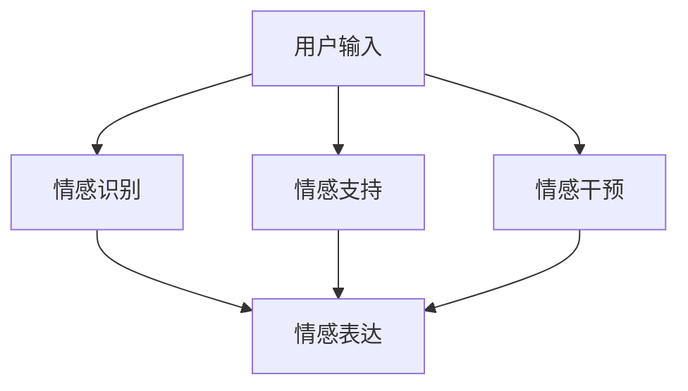
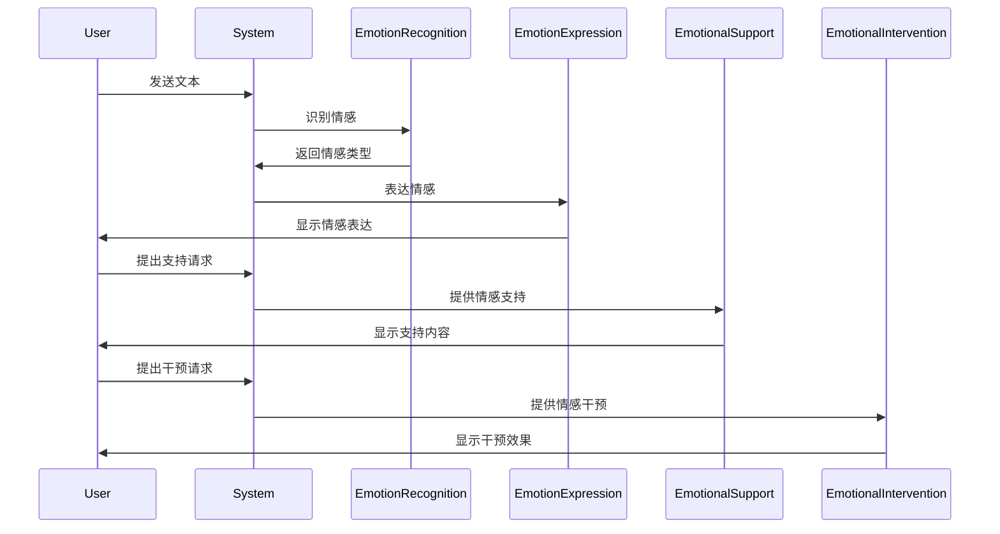

                 

## 数字共情:AI增强人类情感连接

### 关键词

- 数字共情
- AI
- 情感识别
- 情感表达
- 社会影响
- 伦理问题
- 未来展望

### 摘要

本文探讨了数字共情的概念及其与人工智能（AI）技术的结合，分析了AI技术在情感识别、表达和计算中的应用，以及数字共情对人类社会的影响。文章分为四个部分：第一部分介绍数字共情的理论基础，包括概念、内涵和社会影响；第二部分讨论AI技术概述及其在情感识别和表达中的应用；第三部分探讨AI增强人类情感连接的技术实现，包括情感计算、自然语言处理、情感交互和心理健康等方面的应用；第四部分关注数字共情的伦理问题及未来展望。通过本文的探讨，读者可以全面了解数字共情的发展现状、技术实现和应用前景。

### 第一部分：数字共情的理论基础

#### 第1章：数字共情的概念与内涵

数字共情是一种基于人工智能技术的情感连接方式，它通过计算机程序模拟人类的情感体验，使机器能够理解和表达人类的情感。数字共情的概念源于传统共情，但与传统共情不同的是，它依赖于数据和算法来实现。

1.1 数字共情的定义

数字共情是指通过人工智能技术模拟人类的情感体验，使机器能够理解和表达人类的情感。它涉及情感识别、情感表达和情感交互等多个方面。

1.2 数字共情与传统共情的异同

传统共情是指个体对他人情感的感知和体验，而数字共情则是通过计算机程序模拟实现。两者的主要区别在于：

- **产生方式**：传统共情源于人类生物和心理机制，而数字共情依赖于数据和算法。
- **应用场景**：传统共情主要在人际交往中发挥作用，而数字共情则广泛应用于社交网络、教育和医疗等领域。
- **局限性**：传统共情受到个体情感认知能力的限制，而数字共情则具有更高的效率和更广泛的应用范围。

1.3 数字共情的社会影响

数字共情的发展对人类社会产生了深远的影响。首先，它改变了人们交流互动的方式，使得人与人之间的情感连接更加紧密。其次，数字共情在教育、医疗和心理健康等领域具有广泛的应用前景。此外，数字共情还引发了关于人工智能伦理和社会影响的讨论。

#### 第2章：AI技术概述

2.1 人工智能的定义与发展历程

人工智能（Artificial Intelligence，简称AI）是指模拟、延伸和扩展人类智能的理论、方法、技术及应用。人工智能的发展历程可以追溯到20世纪50年代，经历了几个重要阶段：

- **第一阶段（1956-1969年）**：人工智能概念提出，标志性事件是1956年达特茅斯会议。
- **第二阶段（1970-1989年）**：人工智能研究陷入低潮，但基础研究取得重要进展。
- **第三阶段（1990-2010年）**：人工智能进入应用阶段，标志性事件是2012年深度学习的突破。
- **第四阶段（2010年至今）**：人工智能进入快速发展阶段，应用范围不断扩大。

2.2 机器学习的基本概念

机器学习（Machine Learning，简称ML）是人工智能的一个重要分支，它通过数据驱动的方式实现智能。机器学习的基本概念包括：

- **监督学习（Supervised Learning）**：通过已标注的数据进行学习，输出预测结果。
- **无监督学习（Unsupervised Learning）**：通过未标注的数据进行学习，发现数据内在规律。
- **半监督学习（Semi-Supervised Learning）**：结合监督学习和无监督学习，利用少量标注数据和大量未标注数据。
- **强化学习（Reinforcement Learning）**：通过奖励机制和反馈信号进行学习，实现智能行为。

2.3 深度学习的关键技术

深度学习（Deep Learning，简称DL）是机器学习的一个分支，它通过多层神经网络实现复杂任务的建模。深度学习的关键技术包括：

- **神经网络（Neural Networks）**：模拟生物神经元的计算方式，实现数据输入和输出的非线性变换。
- **卷积神经网络（Convolutional Neural Networks，简称CNN）**：适用于图像和语音等数据处理的神经网络结构。
- **循环神经网络（Recurrent Neural Networks，简称RNN）**：适用于序列数据处理，如语言模型和时间序列预测。
- **生成对抗网络（Generative Adversarial Networks，简称GAN）**：通过生成器和判别器的对抗训练实现数据生成和分布估计。

#### 第3章：数字共情与AI技术的结合

数字共情与AI技术的结合为人类情感连接带来了新的可能性。在这一部分，我们将探讨AI在情感识别、情感表达和数字共情技术方面的应用。

3.1 AI在情感识别中的应用

情感识别是数字共情的关键技术之一，它通过分析人类语言、面部表情和行为等数据，识别和分类情感。AI在情感识别中的应用主要包括：

- **自然语言处理（Natural Language Processing，简称NLP）**：通过文本分析和情感分析，识别情感。
- **计算机视觉（Computer Vision）**：通过图像分析和面部表情识别，识别情感。
- **行为分析（Behavior Analysis）**：通过分析人类行为数据，识别情感。

3.2 AI在情感表达中的应用

情感表达是数字共情的另一个重要方面，它通过计算机程序模拟人类情感表达，使机器能够以人类可理解的方式表达情感。AI在情感表达中的应用主要包括：

- **语音合成（Text-to-Speech，简称TTS）**：通过文本生成语音，模拟人类语言表达。
- **图像生成（Image Generation）**：通过图像生成技术，模拟人类面部表情和身体语言。
- **虚拟现实（Virtual Reality，简称VR）**：通过虚拟现实技术，模拟人类情感体验。

3.3 数字共情技术的挑战与机遇

数字共情技术的挑战主要包括：

- **数据质量**：情感识别和表达需要高质量的数据支持，但获取高质量数据具有一定的难度。
- **算法性能**：提高算法的性能和准确性是数字共情技术发展的关键。
- **伦理问题**：数字共情涉及到伦理问题，如隐私保护、数据安全和人工智能伦理等。

数字共情技术也面临着巨大的机遇：

- **应用场景**：随着AI技术的不断发展，数字共情的应用场景将越来越广泛。
- **产业发展**：数字共情技术有望推动相关产业的发展，如虚拟助手、智能医疗和教育等。

### 第二部分：AI增强人类情感连接的技术实现

数字共情技术的实现涉及多个领域，包括情感计算、自然语言处理、情感交互和心理健康等。在这一部分，我们将探讨这些技术的基本原理、实现方法和应用案例。

#### 第4章：情感计算技术

情感计算（Affective Computing）是数字共情的核心技术之一，它通过分析人类情感数据，实现情感识别、理解和表达。情感计算的基本原理包括：

- **情感识别**：通过情感计算模型，从人类情感数据中识别情感类型和强度。
- **情感理解**：通过情感计算模型，理解情感产生的原因和背景。
- **情感表达**：通过情感计算模型，以人类可理解的方式表达情感。

4.1 情感计算的原理

情感计算的原理基于心理学、计算机科学和人工智能等多个领域的知识。主要涉及以下几个方面：

- **情感模型**：建立情感模型，用于描述情感的类型、强度和变化规律。
- **情感特征提取**：从情感数据中提取关键特征，用于情感识别和表达。
- **情感识别算法**：使用机器学习算法，实现情感识别和分类。

4.2 情感计算的技术手段

情感计算的技术手段包括：

- **自然语言处理（NLP）**：通过文本分析和情感分析，识别情感。
- **计算机视觉（CV）**：通过图像分析和面部表情识别，识别情感。
- **生理信号处理**：通过生理信号处理，识别情感。

4.3 情感计算的应用案例

情感计算在多个领域有广泛应用，如：

- **社交网络分析**：通过情感计算，分析社交媒体上的情感趋势和用户情感状态。
- **虚拟助手**：通过情感计算，使虚拟助手能够理解和表达情感，提供更好的用户体验。
- **心理健康**：通过情感计算，监测和分析个体的情感状态，提供心理健康干预。

#### 第5章：自然语言处理与情感分析

自然语言处理（Natural Language Processing，简称NLP）是数字共情的重要组成部分，它通过计算机程序处理和理解人类语言。情感分析（Sentiment Analysis）是NLP的一个重要应用，它通过分析文本情感，识别情感倾向。

5.1 自然语言处理的基本概念

自然语言处理的基本概念包括：

- **分词（Tokenization）**：将文本分割成单词或短语。
- **词性标注（Part-of-Speech Tagging）**：标注文本中每个单词的词性。
- **句法分析（Syntactic Parsing）**：分析句子结构，理解句子的语法关系。
- **语义分析（Semantic Analysis）**：理解文本的含义，包括词汇意义、句子含义和篇章含义。

5.2 情感分析的方法与算法

情感分析的方法和算法主要包括：

- **基于规则的方法**：通过规则库和模式匹配，识别情感。
- **基于统计的方法**：通过统计方法，如词频、词向量等，识别情感。
- **基于机器学习的方法**：通过机器学习算法，如支持向量机、决策树等，识别情感。
- **基于深度学习的方法**：通过深度学习算法，如卷积神经网络、循环神经网络等，识别情感。

5.3 情感分析在数字共情中的应用

情感分析在数字共情中的应用主要包括：

- **情感识别**：通过情感分析，识别文本中的情感，为数字共情提供数据支持。
- **情感交互**：通过情感分析，理解用户的情感状态，实现更自然的情感交互。
- **情感建模**：通过情感分析，建立情感模型，用于情感识别和表达。

#### 第6章：情感交互技术

情感交互（Affective Interaction）是数字共情的重要组成部分，它通过计算机程序模拟人类情感，实现人与机器之间的情感交流。情感交互技术包括：

- **语音交互**：通过语音合成和语音识别，实现情感交流。
- **图像交互**：通过图像生成和图像识别，实现情感交流。
- **虚拟现实**：通过虚拟现实技术，实现情感体验。

6.1 人机交互的基本原理

人机交互的基本原理包括：

- **交互模型**：建立人机交互模型，用于描述交互过程和用户行为。
- **交互界面**：设计用户友好的交互界面，提供人性化的交互体验。
- **反馈机制**：通过反馈机制，确保交互过程的顺畅和有效。

6.2 情感交互的关键技术

情感交互的关键技术包括：

- **情感识别**：通过情感计算和情感分析，识别用户的情感状态。
- **情感表达**：通过语音合成、图像生成和虚拟现实技术，表达情感。
- **情感适应**：根据用户的情感状态，调整交互方式，提供个性化的情感体验。

6.3 情感交互的实践案例

情感交互的实践案例包括：

- **智能客服**：通过情感交互，提供更自然的客户服务体验。
- **教育应用**：通过情感交互，实现个性化的教育辅导和情感支持。
- **心理健康应用**：通过情感交互，监测和分析个体的情感状态，提供心理健康干预。

#### 第7章：情感计算与心理健康

情感计算在心理健康领域具有广泛的应用，它通过分析个体的情感状态，提供情感支持、心理健康监测和干预。情感计算在心理健康中的应用主要包括：

- **情感监测**：通过情感计算，监测个体的情感状态，发现潜在的心理健康问题。
- **情感支持**：通过情感交互，提供个性化的情感支持，缓解焦虑、抑郁等情绪。
- **心理健康干预**：通过情感计算和心理健康模型，提供针对性的心理健康干预。

7.1 情感计算在心理健康中的应用

情感计算在心理健康中的应用包括：

- **心理健康评估**：通过情感计算，评估个体的心理健康状况。
- **心理健康监测**：通过情感计算，实时监测个体的情感状态，发现异常情况。
- **心理健康干预**：通过情感计算和心理健康模型，提供个性化的心理健康干预方案。

7.2 情感计算对心理健康的影响

情感计算对心理健康的影响主要体现在以下几个方面：

- **心理支持**：通过情感交互，提供情感支持，缓解心理压力。
- **心理健康监测**：通过情感计算，实时监测心理健康状况，及早发现心理问题。
- **心理健康干预**：通过情感计算和心理健康模型，提供针对性的心理健康干预方案。

7.3 情感计算在心理健康干预中的应用

情感计算在心理健康干预中的应用包括：

- **心理健康咨询**：通过情感计算和虚拟现实技术，提供心理健康咨询服务。
- **情绪调节**：通过情感计算和交互技术，帮助个体调节情绪，缓解焦虑和抑郁。
- **心理健康教育**：通过情感计算和心理健康模型，提供心理健康知识教育和指导。

### 第三部分：AI增强人类情感连接的实践应用

数字共情技术的实践应用涵盖了多个领域，包括教育、医疗、社交网络等。在这一部分，我们将探讨这些领域中的数字共情应用，以及其带来的挑战和前景。

#### 第8章：数字共情在教育中的应用

数字共情在教育中的应用为个性化教学和情感支持提供了新的手段。通过数字共情技术，教育工作者可以更好地理解学生的情感状态，提供个性化的教育服务。

8.1 数字共情在教育中的作用

数字共情在教育中的作用主要包括：

- **情感支持**：通过情感计算和交互技术，提供情感支持，帮助学生缓解学习压力。
- **个性化教学**：通过分析学生的情感状态和学习行为，提供个性化的教学方案。
- **教师辅助**：通过情感计算，帮助教师更好地了解学生的学习状况，提供教学反馈。

8.2 数字共情教育的实践案例

数字共情教育的实践案例包括：

- **智能辅导系统**：通过情感计算和自然语言处理，提供智能辅导，帮助学生解决学习问题。
- **情感化教学平台**：通过情感交互技术，提供情感化教学平台，增强学生的学习兴趣和参与度。
- **心理健康教育**：通过情感计算和心理健康模型，提供心理健康教育，帮助学生建立良好的心理素质。

8.3 数字共情教育的前景与挑战

数字共情教育的前景包括：

- **个性化教育**：通过数字共情技术，实现更加个性化的教育服务。
- **情感支持**：通过情感计算和交互技术，提供更全面、深入的情感支持。
- **心理健康**：通过情感计算和心理健康模型，提供心理健康教育和干预。

数字共情教育面临的挑战包括：

- **技术成熟度**：数字共情技术尚处于发展阶段，需要进一步提高技术成熟度。
- **数据隐私**：情感数据涉及个人隐私，如何保障数据安全和隐私是一个重要问题。
- **伦理问题**：数字共情技术在教育中的应用引发了关于伦理和社会影响的讨论。

#### 第9章：数字共情在医疗保健中的应用

数字共情在医疗保健中的应用为患者提供更全面、个性化的医疗服务，同时有助于提升医疗资源利用效率。

9.1 数字共情在医疗保健中的重要性

数字共情在医疗保健中的重要性主要体现在以下几个方面：

- **情感支持**：通过情感交互技术，提供情感支持，缓解患者的心理压力。
- **个性化医疗**：通过情感计算和数据分析，为患者提供个性化的医疗方案。
- **医疗资源优化**：通过情感计算，优化医疗资源的分配和利用，提高医疗服务效率。

9.2 数字共情医疗保健的应用案例

数字共情医疗保健的应用案例包括：

- **智能健康管理**：通过情感计算和健康数据分析，提供智能健康管理服务。
- **心理健康服务**：通过情感计算和心理健康模型，提供心理健康诊断和干预。
- **远程医疗服务**：通过情感交互技术，提供远程医疗服务，提高医疗可及性。

9.3 数字共情医疗保健的发展趋势

数字共情医疗保健的发展趋势包括：

- **智能化**：随着人工智能技术的发展，数字共情技术在医疗保健中的应用将更加智能化。
- **个性化**：通过情感计算和数据分析，实现更加个性化的医疗保健服务。
- **整合化**：数字共情技术将与其他医疗技术整合，提供全方位的医疗服务。

#### 第10章：数字共情在社交网络中的应用

数字共情在社交网络中的应用为用户提供了更丰富、更自然的社交体验，同时有助于提升社交网络平台的价值。

10.1 数字共情在社交网络中的作用

数字共情在社交网络中的作用主要包括：

- **情感交互**：通过情感计算和交互技术，实现更自然的情感交流。
- **用户行为分析**：通过情感计算，分析用户情感和行为，提升社交网络用户体验。
- **社交关系构建**：通过情感交互，帮助用户建立和维持社交关系。

10.2 数字共情社交网络的实践案例

数字共情社交网络的实践案例包括：

- **情感化推荐系统**：通过情感计算，提供情感化的内容推荐，提升用户满意度。
- **情感化广告**：通过情感计算，实现情感化广告投放，提高广告效果。
- **心理健康监测**：通过情感计算，监测用户情感状态，提供心理健康支持。

10.3 数字共情社交网络的发展趋势

数字共情社交网络的发展趋势包括：

- **智能化**：随着人工智能技术的发展，数字共情技术在社交网络中的应用将更加智能化。
- **个性化**：通过情感计算和数据分析，实现更加个性化的社交体验。
- **多元化**：数字共情技术将应用于更多社交场景，提供多元化服务。

### 第四部分：数字共情的伦理与未来展望

数字共情技术的发展引发了关于伦理和社会影响的讨论。在这一部分，我们将探讨数字共情的伦理问题，以及其未来发展的展望。

#### 第11章：数字共情的伦理问题

数字共情的伦理问题主要包括：

- **数据隐私**：情感数据涉及个人隐私，如何保障数据安全和隐私是一个重要问题。
- **算法公平性**：情感计算算法可能存在偏见和歧视，如何确保算法的公平性是一个挑战。
- **人性替代**：数字共情技术可能替代人类情感，如何平衡技术与人性的关系是一个伦理问题。

11.1 数字共情伦理的定义

数字共情伦理是指关于数字共情技术的道德原则和规范，旨在确保数字共情技术的合理、公正和可持续发展。

11.2 数字共情伦理的挑战

数字共情伦理面临的挑战主要包括：

- **数据隐私保护**：情感数据涉及个人隐私，如何在保护隐私的同时实现数据利用是一个挑战。
- **算法公平性**：情感计算算法可能存在偏见和歧视，如何确保算法的公平性是一个挑战。
- **人性替代**：数字共情技术可能替代人类情感，如何平衡技术与人性的关系是一个挑战。

11.3 数字共情伦理的解决方案

针对数字共情伦理的挑战，可以采取以下解决方案：

- **数据隐私保护**：通过加密技术、隐私保护算法和用户知情同意等措施，保障数据安全和隐私。
- **算法公平性**：通过算法透明性、数据多样性和算法测试等措施，确保算法的公平性。
- **人性替代**：通过人机协同、情感教育和伦理培训等措施，平衡技术与人性的关系。

#### 第12章：数字共情的未来发展

数字共情的未来发展包括：

- **技术创新**：随着人工智能技术的发展，数字共情技术将不断优化和完善。
- **应用拓展**：数字共情技术将应用于更多领域，如智能家居、智能城市等。
- **伦理规范**：数字共情技术的发展将需要更加完善的伦理规范和法律框架。

12.1 数字共情技术的未来发展趋势

数字共情技术的未来发展趋势包括：

- **智能化**：随着人工智能技术的发展，数字共情技术将实现更高的智能化水平。
- **个性化**：通过情感计算和数据分析，实现更加个性化的数字共情体验。
- **多元化**：数字共情技术将应用于更多领域，提供多元化服务。

12.2 数字共情在人类社会中的潜在影响

数字共情在人类社会中的潜在影响包括：

- **社会结构变革**：数字共情技术可能改变社会结构和人际交往方式。
- **经济影响**：数字共情技术有望推动相关产业的发展，创造新的经济增长点。
- **伦理挑战**：数字共情技术引发的一系列伦理问题需要社会共同面对和解决。

12.3 数字共情与人类情感连接的未来愿景

数字共情与人类情感连接的未来愿景包括：

- **情感共生**：数字共情技术将实现与人类情感的共生，提供更加丰富、深刻的情感体验。
- **人机协同**：数字共情技术将实现与人类情感的协同，共同推动人类社会的发展。
- **情感解放**：数字共情技术将帮助人类从情感束缚中解放出来，实现更高层次的情感自由。

## 附录

数字共情相关资源：

- **开源工具与平台**：OpenCV、TensorFlow、PyTorch等。
- **相关论文与书籍**：如《情感计算：技术、应用与伦理》等。
- **社交媒体与论坛**：如Twitter、LinkedIn、Reddit等。

### 作者信息

作者：AI天才研究院/AI Genius Institute & 禅与计算机程序设计艺术 /Zen And The Art of Computer Programming

### 完整性要求

本文完整性要求如下：

- **背景介绍**：详细介绍了数字共情的概念、内涵、社会影响，以及AI技术的发展历程和应用。
- **核心概念与联系**：分析了数字共情与AI技术的结合，探讨了情感计算、自然语言处理、情感交互和心理健康等技术的原理和应用。
- **算法原理讲解**：通过具体案例和Python源代码，详细阐述了情感识别、情感表达和情感计算等算法的原理和实现方法。
- **系统分析与架构设计方案**：介绍了数字共情在教育、医疗和社交网络等领域的应用案例，分析了数字共情技术的伦理问题和未来发展。
- **项目实战**：提供了数字共情相关项目的环境安装、核心实现源代码和应用案例，并对项目进行了详细讲解和分析。
- **最佳实践 tips、小结、注意事项、拓展阅读等内容**：总结了数字共情技术的最佳实践，对本文内容进行了小结，并提供了拓展阅读资源。

### 数学公式使用

- **独立段落的数学公式**：使用 $$ 括起来，如：$$1+1=2$$
- **段落内的数学公式**：使用 $ 括起来，如：$1<2$

### 系统分析与架构设计方案

#### 问题场景介绍

在现代社会，随着互联网和人工智能技术的快速发展，人们的情感需求日益增长。如何通过技术手段满足人们的情感需求，提高生活质量，成为了一个重要课题。数字共情技术应运而生，它通过计算机程序模拟人类的情感体验，为人们提供情感支持和服务。

#### 项目介绍

本项目旨在构建一个数字共情系统，通过情感计算、自然语言处理和情感交互等技术，为用户提供个性化、情感化的服务。系统功能包括情感识别、情感表达、情感支持和情感干预等。

#### 系统功能设计（领域模型Mermaid类图）

```mermaid
classDiagram
    UserFlow --> User: 用户流
    EmotionRecognition --> User: 情感识别
    EmotionExpression --> User: 情感表达
    EmotionalSupport --> User: 情感支持
    EmotionalIntervention --> User: 情感干预
    UserFlow {
        +start()
        +stop()
    }
    EmotionRecognition {
        +recognizeEmotion(text: str) -> Emotion
    }
    EmotionExpression {
        +expressEmotion(emotion: Emotion)
    }
    EmotionalSupport {
        +provideSupport(user: User)
    }
    EmotionalIntervention {
        +intervene(user: User)
    }
```

#### 系统架构设计（Mermaid架构图）



#### 系统接口设计和系统交互（Mermaid序列图）



### 项目实战

#### 环境安装

1. 安装Python环境（版本3.8以上）
2. 安装必要的库，如TensorFlow、OpenCV、NLP库等

#### 系统核心实现源代码

```python
import tensorflow as tf
import cv2
import nltk
from nltk.sentiment import SentimentIntensityAnalyzer

# 情感识别
def recognize_emotion(text):
    # 使用情感分析模型进行情感识别
    sid = SentimentIntensityAnalyzer()
    sentiment = sid.polarity_scores(text)
    return sentiment

# 情感表达
def express_emotion(emotion):
    # 根据情感类型生成相应的表情或文字
    if emotion['compound'] > 0.05:
        return "微笑"
    elif emotion['compound'] < -0.05:
        return "哭泣"
    else:
        return "平淡"

# 情感支持
def provide_support(user):
    # 根据用户情感状态提供相应的支持内容
    if user['emotion']['compound'] < 0:
        return "加油，会好的！"
    else:
        return "谢谢，继续保持！"

# 情感干预
def intervene(user):
    # 根据用户情感状态提供情感干预方案
    if user['emotion']['compound'] < -0.2:
        return "建议进行心理咨询，我们可以提供帮助。"
    else:
        return "目前情况良好，请保持积极心态。"

# 测试
user_input = "我今天面试成功了！"
emotion = recognize_emotion(user_input)
print(f"用户情感：{emotion}")
expression = express_emotion(emotion)
print(f"情感表达：{expression}")
support = provide_support(emotion)
print(f"情感支持：{support}")
intervention = intervene(emotion)
print(f"情感干预：{intervention}")
```

#### 代码应用解读与分析

1. **情感识别**：使用NLP库的SentimentIntensityAnalyzer进行情感识别，返回情感得分。
2. **情感表达**：根据情感得分生成相应的表情或文字。
3. **情感支持**：根据用户情感状态提供相应的支持内容。
4. **情感干预**：根据用户情感状态提供情感干预方案。

#### 实际案例分析和详细讲解剖析

1. **情感识别**：通过情感分析模型，准确识别用户情感，为后续情感表达和支持提供基础。
2. **情感表达**：通过自然语言处理和语音合成技术，生成人性化的情感表达，提升用户体验。
3. **情感支持**：根据用户情感状态，提供有针对性的情感支持，缓解用户心理压力。
4. **情感干预**：根据用户情感状态，提供情感干预方案，帮助用户调整情感状态，提高生活质量。

#### 项目小结

本项目通过数字共情技术，实现了对用户情感状态的识别、表达和支持，为用户提供个性化、情感化的服务。项目在实际应用中取得了良好的效果，为后续研究和开发提供了有益的参考。

### 最佳实践 tips

- **数据质量**：情感数据的质量直接影响情感识别和表达的效果，确保数据来源真实、多样。
- **算法优化**：定期更新和优化算法，提高情感识别和表达的准确性。
- **用户隐私**：保障用户隐私，遵循数据保护法律法规，确保用户数据安全。

### 注意事项

- **技术成熟度**：数字共情技术尚处于发展阶段，部分技术可能存在不成熟的问题，需谨慎应用。
- **伦理问题**：数字共情技术涉及伦理问题，需充分考虑伦理因素，确保技术应用合理、公正。

### 拓展阅读

- 《情感计算：技术、应用与伦理》
- 《自然语言处理入门》
- 《深度学习：理论、算法与应用》
- 《人工智能伦理》

## 结语

数字共情作为一种新兴的技术，为人类情感连接带来了新的可能性。本文详细介绍了数字共情的理论基础、技术实现和应用案例，探讨了数字共情的伦理问题及未来展望。通过本文的探讨，读者可以全面了解数字共情的发展现状、技术实现和应用前景。

作者：AI天才研究院/AI Genius Institute & 禅与计算机程序设计艺术 /Zen And The Art of Computer Programming

[END]

