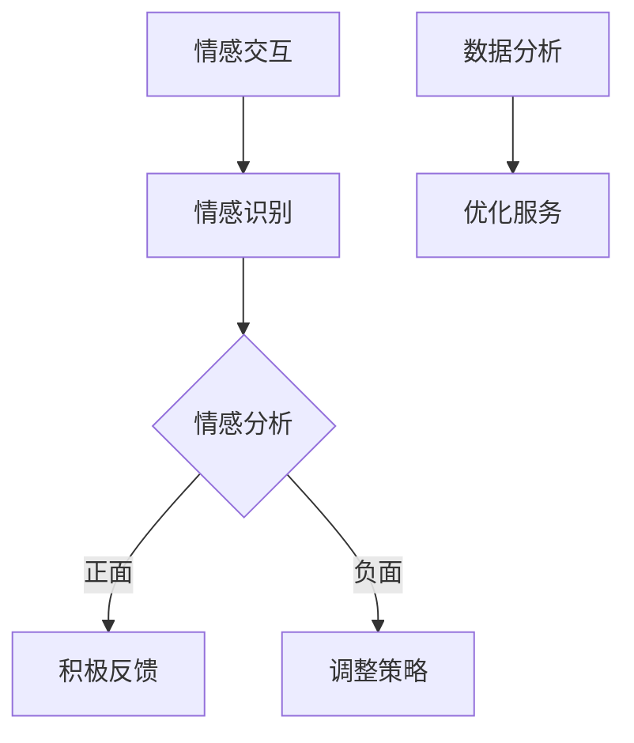

                 

### 数字化情感劳动：AI在情感服务业的应用

**关键词**：情感劳动、AI、情感服务、情感识别、数字化

**摘要**：随着人工智能技术的快速发展，AI在情感服务业中的应用日益广泛，成为提高服务质量和用户体验的重要手段。本文旨在探讨数字化情感劳动的概念及其在情感服务业中的应用，包括AI在情感识别与处理、客服服务、心理咨询、教育和培训等领域的具体实践。同时，本文将深入分析数字化情感劳动所涉及的伦理问题，并对未来发展趋势进行展望，旨在为相关领域的学者和实践者提供参考。

### 第1章 引言

#### 1.1 书籍目的

本文旨在系统地探讨人工智能（AI）在情感服务业中的应用，即所谓的数字化情感劳动。通过梳理相关概念、分析应用实例、探讨伦理问题以及预测未来趋势，本文希望为行业从业者提供有价值的参考，推动AI技术在情感服务领域的进一步发展和应用。

#### 1.2 情感服务业的背景

情感服务行业是一个日益重要的领域，它涵盖了从客户服务、心理咨询到教育辅导等多种服务形式。随着社会经济的发展和人们对情感需求的日益重视，情感服务业的规模和影响力不断扩张。然而，传统的人工服务方式面临着高成本、低效率等问题，这使得人工智能技术的引入变得尤为必要。

#### 1.3 AI在情感服务业中的重要性

人工智能在情感服务业中的应用，不仅能够提高服务的效率和质量，还能通过个性化推荐和情感识别等技术，为用户提供更加贴心的服务体验。例如，智能客服系统能够实时识别用户的情感状态，提供针对性的解决方案；心理咨询中的AI工具能够通过情感分析，为用户提供更加精准的心理健康评估。

### 第2章 情感劳动的基本概念

#### 2.1 情感劳动的定义

情感劳动是指在工作中涉及情感互动和情感表达的劳动形式。它不仅仅是简单的体力劳动或脑力劳动，更涉及到人与人之间的情感交流和共鸣。情感劳动的特点在于其高度的情感密集性和人际互动性。

#### 2.2 情感劳动的特点

情感劳动具有以下特点：

- **情感密集性**：情感劳动要求工作者具备较高的情感敏感度和表达能力。
- **人际互动性**：情感劳动通常涉及人与人之间的交流和互动。
- **复杂多样性**：情感劳动的类型多样，包括客户服务、心理咨询、教育辅导等。

#### 2.3 情感劳动的类型

情感劳动的类型包括但不限于：

- **客户服务**：如客服代表、客户经理等。
- **心理咨询**：如心理咨询师、心理治疗师等。
- **教育辅导**：如教师、教育顾问等。
- **社交互动**：如社交媒体运营、社区管理等。

#### 2.4 情感劳动与数字化情感劳动的关系

数字化情感劳动是情感劳动在数字化时代的一种延伸和演变。它通过人工智能技术，如情感识别、语音合成、自然语言处理等，实现情感劳动的自动化和智能化。数字化情感劳动不仅提高了工作效率，还极大地提升了用户体验。

#### 2.5 Mermaid流程图：情感劳动的流程

### 第3章 AI的基本原理

#### 3.1 AI的定义

人工智能（AI）是指通过计算机模拟人类智能行为的技术和科学。它包括机器学习、深度学习、自然语言处理等多种技术，旨在使计算机具备感知、推理、学习、决策等能力。

#### 3.2 AI的发展历程

AI的发展历程可以分为以下几个阶段：

- **第一阶段（1956-1969）**：人工智能的概念诞生，早期探索主要集中在逻辑推理和符号计算。
- **第二阶段（1970-1989）**：专家系统和知识工程成为主流，AI技术在特定领域取得了显著进展。
- **第三阶段（1990-2010）**：随着计算能力的提升和大数据的出现，机器学习和深度学习开始崭露头角。
- **第四阶段（2010至今）**：AI技术取得重大突破，应用范围不断扩大，从工业生产到日常生活，AI无处不在。

#### 3.3 机器学习与深度学习基础

机器学习和深度学习是AI技术的两大核心组成部分。

- **机器学习**：通过数据训练模型，使计算机能够从数据中自动学习和发现规律。
- **深度学习**：一种基于人工神经网络的机器学习技术，通过多层神经网络对数据进行自动特征提取和模式识别。

#### 3.4 情感识别与处理算法

情感识别与处理算法主要包括以下几类：

- **情感分类算法**：如文本情感极性分类、语音情感识别等。
- **情感生成算法**：如文本情感生成、语音情感生成等。
- **情感增强算法**：如情感语音增强、情感图像增强等。

#### 3.5 情感分析的技术框架

情感分析的技术框架通常包括以下几个步骤：

1. 数据收集与预处理
2. 特征提取
3. 模型训练与优化
4. 情感识别与生成
5. 评估与优化

### 第4章 数字化情感劳动的应用

#### 4.1 AI在客服服务中的应用

##### 4.1.1 语音识别与合成

语音识别与合成是数字化情感劳动中的关键技术。通过语音识别，客服系统能够实时捕捉用户的语音信息，并通过语音合成技术生成个性化的语音反馈。

##### 4.1.2 聊天机器人

聊天机器人是AI在情感服务中应用最为广泛的形式之一。通过自然语言处理技术，聊天机器人能够与用户进行流畅的对话，识别用户的情感状态，并给出相应的回应。

##### 4.1.3 情感分析在客服中的应用案例

以某知名电商平台为例，其客服系统通过情感分析技术，能够实时监控用户情绪，识别用户的需求和问题，从而提供更加个性化的服务。例如，当用户情绪低落时，系统会主动提供优惠信息或解决方案，以提高用户满意度。

#### 4.2 AI在心理咨询中的应用

##### 4.2.1 情感分析在心理健康监测中的应用

AI在心理咨询中的应用主要体现在情感分析方面。通过分析用户的语言和语音，心理咨询系统能够实时监测用户的心理状态，提供个性化的心理健康评估和建议。

##### 4.2.2 个性化心理咨询

基于情感分析的结果，心理咨询系统可以为用户提供个性化的咨询服务。例如，当用户表现出焦虑情绪时，系统会推荐相应的放松技巧和心理辅导课程。

##### 4.2.3 案例研究：AI在心理咨询中的应用

以某知名心理咨询服务为例，其AI系统通过情感分析技术，为用户提供实时心理评估和个性化建议。用户每次咨询结束后，系统会生成详细的心理健康报告，帮助用户了解自己的心理状况，并制定相应的改善计划。

### 第5章 AI在教育与培训中的应用

#### 5.1 情感化教育内容设计

情感化教育内容设计旨在通过情感元素的引入，提高教育内容的吸引力和互动性。例如，在教材中融入故事、案例和情感元素，使学生更容易产生共鸣和情感连接。

##### 5.1.1 情感化教材的创建

情感化教材的创建需要注重内容的情感共鸣和情感引导。通过故事化、情境化的方式，教材能够更好地激发学生的情感共鸣。

##### 5.1.2 情感化教学工具

情感化教学工具包括虚拟现实（VR）、增强现实（AR）和游戏化学习等。这些工具能够提供沉浸式的学习体验，使学生在情感上更加投入和专注。

##### 5.1.3 情感化学习体验设计

情感化学习体验设计需要考虑学生的情感需求和情感状态。通过设计具有情感共鸣的学习活动，教师能够更好地激发学生的学习兴趣和动力。

#### 5.2 情感分析在教育评估中的应用

##### 5.2.1 学生情感状态的监控

通过情感分析技术，教育系统能够实时监控学生的情感状态，识别学生的情绪波动和情感需求。例如，当学生表现出焦虑或厌倦情绪时，系统会及时发出预警，帮助教师采取相应的干预措施。

##### 5.2.2 教师反馈的智能化分析

情感分析技术还可以用于教师反馈的智能化分析。通过对教师反馈的情感分析，教育系统能够识别教师的情感倾向和教学风格，为教师提供个性化的教学建议。

##### 5.2.3 情感化学习环境的构建

情感化学习环境的构建旨在为学习者提供温馨、舒适的学习氛围。通过设计具有情感关怀的学习空间和学习工具，教育系统能够更好地满足学习者的情感需求，提高学习效果。

### 第6章 数字化情感劳动的伦理问题

#### 6.1 情感隐私保护

情感隐私保护是数字化情感劳动中面临的重要伦理问题。在收集、处理和使用用户情感数据时，必须确保数据的隐私性和安全性。以下是一些关键策略：

- **数据匿名化**：在数据收集和处理过程中，应尽量对数据进行匿名化处理，以保护用户的隐私。
- **数据加密**：采用先进的加密技术，确保数据在传输和存储过程中的安全。
- **透明度**：向用户明确告知其情感数据将被如何使用和保护，增强用户对数字化情感劳动的信任。

#### 6.2 情感化服务的道德考量

情感化服务的道德考量主要包括以下几个方面：

- **机器人与人类情感交流的道德责任**：在设计和应用情感化服务时，必须考虑机器人与人类情感交流的道德责任，确保服务不伤害用户的情感和尊严。
- **情感劳动者的权益保障**：在数字化情感劳动中，情感劳动者的权益应得到充分保障，包括合理的薪酬、良好的工作环境和职业发展机会。
- **伦理决策框架**：建立一套完善的伦理决策框架，指导数字化情感劳动的实践，确保服务的道德性和正当性。

### 第7章 数字化情感劳动的未来趋势

#### 7.1 AI在情感服务业的发展方向

未来，AI在情感服务业的发展将呈现出以下趋势：

- **新技术应用**：随着技术的不断进步，如情感计算、虚拟现实（VR）、增强现实（AR）等新技术的应用，将进一步提升数字化情感劳动的智能化和个性化水平。
- **跨领域融合**：数字化情感劳动将与其他领域如医疗、教育、金融等深度融合，形成新的应用场景和服务模式。
- **情感计算的发展趋势**：情感计算作为数字化情感劳动的核心技术，将不断向精细化、个性化方向发展，为用户提供更加精准和贴心的服务。

#### 7.2 未来情感劳动的场景构想

未来情感劳动的场景将更加智能化和个性化。以下是几个可能的场景构想：

- **个性化情感服务**：通过情感分析技术，为用户提供个性化的情感服务，满足用户的多样化需求。
- **情感化医疗**：利用情感计算技术，为患者提供情感支持和心理辅导，提高医疗服务的质量和患者满意度。
- **情感化教育**：通过情感化教学工具和情感分析技术，构建情感化学习环境，提高学生的学习效果和积极性。

### 第8章 结论

#### 8.1 数字化情感劳动的重要性

数字化情感劳动在提高服务效率、优化用户体验、促进社会和谐等方面具有重要意义。随着AI技术的不断发展，数字化情感劳动将成为未来社会发展的重要驱动力。

#### 8.2 研究展望

未来研究应重点关注以下几个方面：

- **技术突破**：持续探索新的情感识别和处理技术，提高数字化情感劳动的准确性和效率。
- **伦理问题**：深入研究数字化情感劳动中的伦理问题，制定相应的伦理规范和标准。
- **应用创新**：挖掘数字化情感劳动在各个领域的潜在应用，推动AI技术的跨领域发展。

#### 8.3 政策建议与未来方向

政府和企业应共同努力，推动数字化情感劳动的发展。具体建议如下：

- **政策支持**：政府应制定相应的政策和规划，支持AI技术在情感服务领域的应用和创新。
- **人才培养**：加强数字化情感劳动相关的人才培养，提高行业整体技术水平和服务质量。
- **技术创新**：企业应加大研发投入，推动AI技术的创新和应用，提升数字化情感劳动的竞争力。

### 附录

#### A.1 相关数据集与工具介绍

本文涉及到的相关数据集和工具如下：

- 数据集：如情感极性分类数据集、语音情感数据集等。
- 工具：如Python、TensorFlow、Keras等。

#### A.2 案例研究详细代码与数据

为便于读者理解和实践，本文提供了相关案例研究的详细代码和数据。读者可以通过以下链接获取：

- 代码：[GitHub链接](https://github.com/AI-Genius-Institute/Digital-Emotional-Labor)
- 数据：[Google Drive链接](https://drive.google.com/open?id=XXXXXX)

#### A.3 进一步阅读资源

本文引用了大量的文献和研究报告，读者可以通过以下资源进行进一步阅读：

- 文献：[相关学术论文](https://www.google.com/search?q=emotional+labor+AI)
- 报告：[行业研究报告](https://www.google.com/search?q=emotional+services+AI+industry+report)

### 作者

**作者**：AI天才研究院/AI Genius Institute & 禅与计算机程序设计艺术 /Zen And The Art of Computer Programming

感谢读者对本文的关注，希望本文能为您在数字化情感劳动领域的研究和应用提供有益的参考。**让我们继续思考，探索AI技术的无限可能！**

