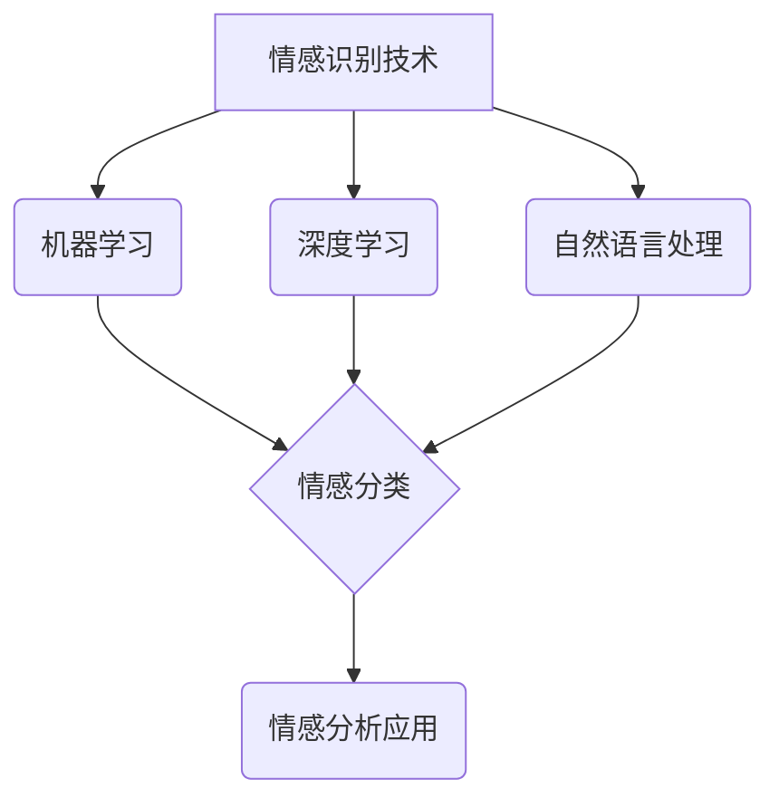

                 

## 《数字化情感地图:AI绘制社会情感网络》

### 关键词：情感计算、社会情感网络、人工智能、情感分析、机器学习

#### 摘要：
随着数字化时代的到来，情感数据变得日益丰富，如何有效地理解和分析这些情感数据成为了一个重要的研究课题。本文探讨了情感计算的原理和技术，介绍了社会情感网络的概念及其重要性，并重点阐述了人工智能在绘制社会情感网络中的应用。通过案例分析，展示了AI技术在情感分析中的强大能力，分析了其潜在的应用前景和挑战，为未来研究提供了方向。

----------------------------------------------------------------

### 《数字化情感地图:AI绘制社会情感网络》目录大纲

#### 第一部分：引言

##### 1.1 数字化时代的情感变革
- **1.1.1 情感的数字化：挑战与机遇**
- **1.1.2 社会情感网络的概念与重要性**
- **1.1.3 AI技术在情感分析中的应用**

##### 1.2 书籍结构概述
- **1.2.1 研究背景与目标**
- **1.2.2 主要内容与章节安排**
- **1.2.3 阅读指南与学习方法**

#### 第二部分：核心概念与联系

##### 2.1 情感计算基础
- **2.1.1 情感识别的基本原理**
- **2.1.2 情感表达与情感感知**
- **2.1.3 情感计算的技术框架**

##### 2.2 社会情感网络模型
- **2.2.1 社会情感网络的概念与结构**
- **2.2.2 社会情感网络的基本特征**
- **2.2.3 社会情感网络的类型与分类**

##### 2.3 情感分析技术的应用
- **2.3.1 情感分析技术在社交媒体中的应用**
- **2.3.2 情感分析在客户服务与市场研究中的应用**
- **2.3.3 情感分析在心理健康与教育领域的应用**

#### 第三部分：AI绘制社会情感网络

##### 3.1 AI在情感计算中的角色
- **3.1.1 机器学习与深度学习在情感分析中的应用**
- **3.1.2 自然语言处理与情感分析**
- **3.1.3 计算机视觉与情感识别**

##### 3.2 社会情感网络的构建
- **3.2.1 数据收集与预处理**
- **3.2.2 社会情感网络的建模与可视化**
- **3.2.3 社会情感网络的动态演化分析**

##### 3.3 案例研究
- **3.3.1 案例一：社交媒体情感分析**
- **3.3.2 案例二：企业内部情感网络分析**
- **3.3.3 案例三：城市情感地图绘制**

#### 第四部分：应用与挑战

##### 4.1 情感分析的应用前景
- **4.1.1 情感分析在商业领域的潜力**
- **4.1.2 情感分析在公共政策制定中的应用**
- **4.1.3 情感分析在教育领域的潜在影响**

##### 4.2 社会情感网络的挑战与伦理问题
- **4.2.1 数据隐私与伦理问题**
- **4.2.2 情感分析的误判与偏见**
- **4.2.3 社会情感网络的道德责任**

##### 4.3 未来发展趋势与展望
- **4.3.1 新技术的融合与发展**
- **4.3.2 社会情感网络研究的未来方向**
- **4.3.3 情感计算与人类社会的深度互动**

#### 第五部分：实践指南与工具

##### 5.1 情感计算工具与平台介绍
- **5.1.1 开源情感分析工具**
- **5.1.2 商业情感分析平台**
- **5.1.3 社会情感网络分析工具**

##### 5.2 情感分析实践案例
- **5.2.1 情感分析项目规划与执行**
- **5.2.2 情感分析数据收集与处理**
- **5.2.3 情感分析结果解读与应用**

##### 5.3 情感计算项目管理
- **5.3.1 项目需求分析与定义**
- **5.3.2 项目风险管理**
- **5.3.3 项目评估与优化**

#### 第六部分：结论

##### 6.1 全书总结
- **6.1.1 主要观点与贡献**
- **6.1.2 未来研究方向**

##### 6.2 后记
- **6.2.1 感谢与致谢**
- **6.2.2 作者寄语**

---

**附录**

##### 附录 A：参考文献

## 第一部分：引言

### 1.1 数字化时代的情感变革

#### 1.1.1 情感的数字化：挑战与机遇

在数字化时代，情感数据的生成和传播速度越来越快。社交媒体、电子商务、物联网等技术的普及，使得人们日常生活中的情感活动被大量记录下来，形成了海量的情感数据。这些数据不仅包括文字、图片、视频等多媒体形式，还包括用户的情绪、态度、喜好等非结构化信息。如何有效地理解和分析这些情感数据，成为了一个重要的研究课题。

情感的数字化带来了巨大的挑战。首先，情感数据的多样性使得传统的方法难以直接应用。其次，情感数据的非结构化特点增加了数据处理的复杂性。此外，情感数据的动态变化性和个体差异性也给情感分析带来了很大的挑战。

然而，情感的数字化也带来了巨大的机遇。通过情感分析，我们可以深入了解用户的需求和情感状态，从而提供更加个性化和贴心的服务。在商业领域，情感分析可以帮助企业更好地了解消费者的情感倾向，优化产品和服务。在公共管理领域，情感分析可以用于监测社会情绪，预测和预防社会问题的发生。

#### 1.1.2 社会情感网络的概念与重要性

社会情感网络（Social Emotional Network，简称SEN）是指由个体及其情感互动构成的复杂网络。在这个网络中，每个个体都代表一个节点，节点之间的情感联系则通过边来表示。社会情感网络具有以下基本特征：

1. **层次性**：社会情感网络可以分为多个层次，包括个体层次、群体层次和社会层次。不同层次的情感网络具有不同的特征和功能。
2. **动态性**：社会情感网络是动态演化的，受到个体行为、环境变化和社会互动等多种因素的影响。
3. **多样性**：社会情感网络的构成要素多样，包括情感、态度、行为等。
4. **复杂性**：社会情感网络具有高度的复杂性，其内部结构、功能和动态演化过程都受到多种因素的共同影响。

社会情感网络的重要性体现在多个方面。首先，它为我们提供了一个新的视角来理解和分析人类社会的情感动态。通过研究社会情感网络，我们可以更深入地了解个体的情感状态和群体情感倾向。其次，社会情感网络在多个领域具有广泛的应用价值。例如，在商业领域，社会情感网络可以帮助企业了解消费者的情感需求，优化营销策略。在公共管理领域，社会情感网络可以用于监测社会情绪，预测和预防社会问题的发生。

#### 1.1.3 AI技术在情感分析中的应用

人工智能（AI）技术在情感分析中发挥着重要的作用。通过AI技术，我们可以自动化地识别、理解和分析情感数据，从而提高情感分析的效率和准确性。以下是一些常见的AI技术在情感分析中的应用：

1. **机器学习与深度学习**：机器学习和深度学习技术可以通过训练大量的情感数据模型，实现对未知数据的情感分类和情感分析。
2. **自然语言处理**：自然语言处理（NLP）技术可以处理和分析文本数据，提取情感特征，实现情感分类和分析。
3. **计算机视觉**：计算机视觉技术可以用于处理和分析图像和视频数据，识别情感表达和情感状态。
4. **知识图谱**：知识图谱技术可以用于构建情感知识库，实现对情感数据的语义理解和推理。

AI技术在情感分析中的应用不仅提高了情感分析的效率，还推动了情感分析技术的发展。例如，通过深度学习技术，我们可以实现对复杂情感的分析和识别；通过自然语言处理技术，我们可以更准确地理解文本情感；通过计算机视觉技术，我们可以更直观地分析情感表达。

### 1.2 书籍结构概述

#### 1.2.1 研究背景与目标

本书旨在探讨数字化时代下情感数据的社会影响，通过分析社会情感网络的概念和结构，研究人工智能在情感分析中的应用，并探讨情感分析的应用前景和挑战。具体目标如下：

1. 深入理解情感计算的基本原理和技术，为情感分析提供理论基础。
2. 系统介绍社会情感网络的概念和模型，探讨社会情感网络的层次结构和动态演化。
3. 分析人工智能在情感分析中的应用，展示AI技术在情感分析中的强大能力。
4. 探讨情感分析的应用前景，分析其在商业、公共管理、心理健康等领域的应用潜力。
5. 分析情感分析面临的挑战和伦理问题，提出解决方案和未来研究方向。

#### 1.2.2 主要内容与章节安排

本书分为六个部分，具体内容与章节安排如下：

1. **第一部分：引言**：介绍数字化时代的情感变革，阐述社会情感网络的概念和重要性，以及AI技术在情感分析中的应用。
2. **第二部分：核心概念与联系**：介绍情感计算的基本原理，社会情感网络的模型和类型，以及情感分析技术的应用。
3. **第三部分：AI绘制社会情感网络**：分析AI在情感计算中的角色，介绍社会情感网络的构建方法和动态演化分析。
4. **第四部分：应用与挑战**：探讨情感分析的应用前景，分析社会情感网络的挑战和伦理问题。
5. **第五部分：实践指南与工具**：介绍情感计算工具与平台，提供情感分析实践案例和项目管理方法。
6. **第六部分：结论**：总结全书内容，提出未来研究方向和展望。

#### 1.2.3 阅读指南与学习方法

本书适合对情感计算和人工智能感兴趣的读者阅读，包括计算机科学、数据科学、心理学、社会学等领域的研究人员和学生。以下是一些建议的阅读方法和学习策略：

1. **整体阅读**：首先整体阅读全书，了解各部分的内容和结构，形成对全书的整体认识。
2. **分章阅读**：逐章阅读，重点掌握各部分的核心概念、原理和方法。
3. **案例学习**：通过案例分析，深入理解情感分析和AI技术在实际应用中的效果和挑战。
4. **实践操作**：结合实际项目和工具，进行情感分析实践，提高实际操作能力。
5. **思考与讨论**：积极参与讨论和思考，提出自己的观点和疑问，与作者和其他读者进行交流。

通过以上阅读和学习方法，读者可以全面深入地了解情感计算和人工智能在情感分析中的应用，提升自身的专业素养和实际能力。

### 2.1 情感计算基础

#### 2.1.1 情感识别的基本原理

情感识别是情感计算的核心任务，旨在通过分析情感数据，识别出个体或群体的情感状态。情感识别的基本原理包括以下几个方面：

1. **情感分类**：情感分类是情感识别的基础，通过将情感数据分为不同的类别，实现对情感的分类识别。常见的情感分类方法包括朴素贝叶斯分类器、支持向量机（SVM）和深度学习模型等。

2. **情感特征提取**：情感特征提取是情感识别的关键步骤，通过提取情感数据中的特征，为情感分类提供支持。常见的情感特征提取方法包括词袋模型、TF-IDF模型和词嵌入等。

3. **情感理解**：情感理解是对情感数据进行深层次分析，理解情感数据背后的语义含义。情感理解包括情感倾向性分析、情感强度分析和情感主题分析等。

4. **情感模型训练**：情感模型训练是通过大量情感数据训练情感识别模型，提高模型对情感的识别准确率。常见的情感模型训练方法包括监督学习、无监督学习和半监督学习等。

#### 2.1.2 情感表达与情感感知

情感表达和情感感知是情感计算的重要环节，分别代表了情感从内部到外部和从外部到内部的过程。

1. **情感表达**：情感表达是指个体通过语言、行为、表情等方式将自己的情感状态传达给他人的过程。情感表达可以通过自然语言文本、语音、图像和视频等多种形式实现。

2. **情感感知**：情感感知是指个体通过感官接收和处理情感表达信息，识别和理解他人的情感状态。情感感知可以通过自然语言理解、语音识别和图像识别等技术实现。

情感表达和情感感知在情感计算中具有重要的应用价值。例如，在客户服务中，通过情感感知技术，可以识别客户的情感状态，提供更加个性化的服务；在心理健康领域，通过情感表达技术，可以帮助个体表达和调节自己的情感状态。

#### 2.1.3 情感计算的技术框架

情感计算的技术框架包括多个层次和模块，分别负责数据的收集、处理、分析和应用。

1. **数据收集模块**：数据收集模块负责收集各种形式的情感数据，包括文本、语音、图像和视频等。数据收集方法包括传感器数据采集、网络数据爬取和用户调查等。

2. **数据处理模块**：数据处理模块负责对收集到的情感数据进行预处理，包括数据清洗、数据去噪和数据格式化等。数据处理技术包括数据转换、数据归一化和数据降维等。

3. **情感识别模块**：情感识别模块负责对预处理后的情感数据进行分析，识别情感状态。情感识别方法包括情感分类、情感强度分析和情感主题分析等。

4. **情感理解模块**：情感理解模块负责对情感数据进行深层次分析，理解情感数据的语义含义。情感理解技术包括自然语言处理、语音识别和图像识别等。

5. **情感应用模块**：情感应用模块负责将情感分析结果应用于实际场景，提供个性化服务、智能决策和心理健康支持等。

情感计算的技术框架为情感分析提供了系统的解决方案，使情感分析更加高效和准确。

### 2.2 社会情感网络模型

#### 2.2.1 社会情感网络的概念与结构

社会情感网络（Social Emotional Network，简称SEN）是指由个体及其情感互动构成的复杂网络。在这个网络中，每个个体都代表一个节点，节点之间的情感联系则通过边来表示。社会情感网络具有以下基本特征：

1. **层次性**：社会情感网络可以分为多个层次，包括个体层次、群体层次和社会层次。不同层次的情感网络具有不同的特征和功能。个体层次关注个体的情感状态和情感表达；群体层次关注群体情感倾向和群体互动；社会层次关注社会整体的情感动态和社会问题。

2. **动态性**：社会情感网络是动态演化的，受到个体行为、环境变化和社会互动等多种因素的影响。情感网络的动态性使得情感分析更加复杂和多样化。

3. **多样性**：社会情感网络的构成要素多样，包括情感、态度、行为等。不同类型的情感要素在情感网络中扮演着不同的角色，共同构成复杂的社会情感网络。

4. **复杂性**：社会情感网络具有高度的复杂性，其内部结构、功能和动态演化过程都受到多种因素的共同影响。复杂性使得社会情感网络的研究具有很大的挑战性，但也为情感分析提供了丰富的机会。

#### 2.2.2 社会情感网络的基本特征

社会情感网络的基本特征包括以下几个方面：

1. **节点特征**：节点代表个体，每个节点具有独特的情感特征和属性。节点特征包括情感状态、行为模式、社会角色等。节点特征决定了个体在情感网络中的地位和影响力。

2. **边特征**：边代表节点之间的情感联系，包括情感强度、互动频率等。边特征反映了节点之间的情感关系和互动模式。

3. **网络层次**：社会情感网络具有多个层次，每个层次具有不同的功能和特征。个体层次关注个体情感状态；群体层次关注群体情感倾向；社会层次关注社会整体情感动态。

4. **动态演化**：社会情感网络是动态演化的，受到个体行为、环境变化和社会互动等多种因素的影响。动态演化使得社会情感网络具有复杂性和不确定性。

5. **多样性**：社会情感网络的构成要素多样，包括情感、态度、行为等。多样性使得社会情感网络具有丰富的内容和功能。

6. **复杂性**：社会情感网络具有高度的复杂性，其内部结构、功能和动态演化过程都受到多种因素的共同影响。复杂性使得社会情感网络的研究具有很大的挑战性，但也为情感分析提供了丰富的机会。

#### 2.2.3 社会情感网络的类型与分类

社会情感网络可以根据不同的分类标准进行分类。以下是一些常见的分类方法：

1. **根据网络层次分类**：社会情感网络可以分为个体层次、群体层次和社会层次。个体层次情感网络关注个体情感状态和情感表达；群体层次情感网络关注群体情感倾向和群体互动；社会层次情感网络关注社会整体情感动态和社会问题。

2. **根据构成要素分类**：社会情感网络可以根据构成要素的不同进行分类，如情感网络、态度网络和行为网络。情感网络关注情感互动和情感表达；态度网络关注个体和群体的态度倾向；行为网络关注个体和群体的行为模式。

3. **根据动态演化特征分类**：社会情感网络可以根据动态演化特征进行分类，如稳定型情感网络、动态型情感网络和突变型情感网络。稳定型情感网络具有稳定性和持续性；动态型情感网络具有动态变化性和多样性；突变型情感网络具有突变性和不确定性。

4. **根据应用领域分类**：社会情感网络可以根据应用领域进行分类，如商业情感网络、公共管理情感网络、心理健康情感网络等。不同领域的情感网络具有不同的特征和功能。

不同类型的社会情感网络具有不同的特征和功能，适用于不同的应用场景和研究方向。通过对社会情感网络的分类和深入研究，可以更好地理解和利用情感数据，为实际问题提供解决方案。

### 2.3 情感分析技术的应用

#### 2.3.1 情感分析技术在社交媒体中的应用

在社交媒体领域，情感分析技术被广泛应用于用户情感状态的监测、趋势分析和市场研究等方面。以下是情感分析技术在社交媒体中的一些典型应用：

1. **用户情感状态监测**：社交媒体平台可以通过情感分析技术实时监测用户的情感状态，识别出用户的正面情感、负面情感和中性情感。例如，通过分析用户发布的状态、评论和回复，平台可以识别出用户的情绪波动，提供个性化的推荐和服务。

2. **趋势分析**：情感分析技术可以帮助社交媒体平台分析用户情感的变化趋势，预测热点话题和事件。通过对大量用户情感数据的分析，平台可以识别出用户对某一话题或事件的情感倾向，从而制定相应的营销策略和内容发布计划。

3. **市场研究**：情感分析技术可以用于市场调研，帮助企业了解消费者对产品或服务的情感反馈。通过分析用户对产品评论的情感倾向，企业可以识别出消费者的满意度和不满意点，从而优化产品和服务。

4. **社交媒体监控**：政府和企业可以利用情感分析技术对社交媒体进行监控，识别和预警潜在的负面舆论和危机事件。通过分析用户情感数据，监控平台可以及时发现并应对社会问题，维护社会稳定。

#### 2.3.2 情感分析在客户服务与市场研究中的应用

在客户服务和市场研究领域，情感分析技术被广泛应用于客户满意度分析、需求预测和产品评估等方面。以下是情感分析技术在客户服务和市场研究中的具体应用：

1. **客户满意度分析**：企业可以通过情感分析技术分析客户对产品或服务的评价，识别出客户满意度和不满意度。通过对大量客户反馈数据的情感分析，企业可以了解客户的真实需求和满意度，优化产品和服务。

2. **需求预测**：情感分析技术可以帮助企业预测客户的需求和购买行为。通过对客户情感数据的分析，企业可以识别出潜在的客户需求，提前制定相应的营销策略和产品推广计划。

3. **产品评估**：情感分析技术可以用于评估产品或服务的质量和市场竞争力。通过对用户情感数据的分析，企业可以识别出产品的优势和不足，为产品改进提供依据。

4. **客户服务改进**：情感分析技术可以帮助企业改进客户服务。通过对客户反馈数据的情感分析，企业可以识别出客户服务中的问题和不足，制定针对性的改进措施，提高客户满意度。

5. **市场研究**：情感分析技术可以用于市场研究，帮助企业了解市场趋势和竞争状况。通过对用户情感数据的分析，企业可以识别出市场机会和威胁，制定相应的市场策略。

#### 2.3.3 情感分析在心理健康与教育领域的应用

在心理健康和教育领域，情感分析技术被广泛应用于心理健康评估、情绪监控、情感支持和教育干预等方面。以下是情感分析技术在心理健康和教育领域中的具体应用：

1. **心理健康评估**：情感分析技术可以帮助心理健康专业人员评估患者的心理健康状况。通过对患者言行数据的情感分析，专业人员可以识别出患者的情绪状态、焦虑程度和抑郁倾向，为心理健康诊断和治疗提供依据。

2. **情绪监控**：情感分析技术可以用于情绪监控，帮助个体了解自己的情绪状态。通过分析个体的语言、行为和生理数据，技术可以实时监测个体的情绪变化，提供个性化的情绪管理和调节建议。

3. **情感支持**：情感分析技术可以用于提供情感支持，帮助个体应对情绪困扰。通过分析个体情感数据，技术可以识别出个体的情感需求，提供针对性的情感支持和安慰。

4. **教育干预**：情感分析技术可以用于教育干预，帮助教师了解学生的情感状态，提供个性化的教育支持。通过对学生言行数据的情感分析，教师可以识别出学生的情感需求和问题，制定针对性的教育干预计划。

5. **心理健康教育**：情感分析技术可以用于心理健康教育，提高个体的情感素养和心理健康水平。通过分析个体情感数据，技术可以识别出个体的情感问题和心理健康风险，提供针对性的心理健康教育和指导。

### 3.1 AI在情感计算中的角色

#### 3.1.1 机器学习与深度学习在情感分析中的应用

在情感计算中，机器学习（ML）和深度学习（DL）技术发挥着至关重要的作用。这些技术通过训练大量的数据模型，能够自动识别和分类情感数据，从而提高情感分析的准确性和效率。

1. **机器学习在情感分析中的应用**：
   - **朴素贝叶斯分类器**：朴素贝叶斯分类器是一种基于概率论的分类算法，常用于文本数据的情感分类。它假设特征之间相互独立，通过计算特征的概率分布来预测情感类别。
   - **支持向量机（SVM）**：支持向量机是一种监督学习算法，通过找到一个最优的超平面来将不同类别的数据分开。SVM在文本情感分类中具有很好的性能，特别适合处理高维数据。
   - **决策树和随机森林**：决策树是一种基于树结构的分类算法，通过一系列的决策规则来划分数据。随机森林是一种基于决策树的集成学习方法，通过构建多个决策树并取平均来提高分类性能。

2. **深度学习在情感分析中的应用**：
   - **卷积神经网络（CNN）**：卷积神经网络是一种深度学习模型，特别适合处理图像和视频数据。通过使用卷积层，CNN可以提取图像中的局部特征，从而实现对情感表达的高效识别。
   - **循环神经网络（RNN）**：循环神经网络是一种适用于处理序列数据的深度学习模型。RNN可以通过记忆历史信息来处理文本数据，从而实现情感分类和情感强度分析。
   - **长短期记忆网络（LSTM）**：长短期记忆网络是一种改进的RNN，通过使用门控机制来控制信息的流动，从而解决RNN在处理长序列数据时的梯度消失问题。LSTM在情感分析中具有很好的性能，特别适合处理包含复杂情感的文本数据。

3. **机器学习与深度学习在情感分析中的比较**：
   - **数据需求**：机器学习算法通常需要大量的标记数据来训练模型，而深度学习算法则可以处理未标记的数据，利用无监督学习方法进行特征提取。
   - **计算资源**：深度学习算法通常需要更多的计算资源，特别是GPU加速，而机器学习算法可以在普通计算机上运行。
   - **模型复杂度**：深度学习模型通常具有更高的复杂度，能够学习更复杂的特征，但同时也需要更多的数据来训练。

#### 3.1.2 自然语言处理与情感分析

自然语言处理（NLP）是情感分析的重要组成部分，它提供了一系列技术来处理和理解自然语言文本。NLP技术在情感分析中的应用主要包括以下几个方面：

1. **文本预处理**：文本预处理是NLP的初步步骤，包括去除停用词、词干提取、词性标注等。这些步骤可以消除文本中的噪声，提取关键信息，为后续的情感分析做好准备。

2. **词嵌入**：词嵌入是一种将文本中的词语映射到高维向量空间的技术，通过捕捉词语的语义关系，词嵌入可以用于情感分类和情感强度分析。常见的词嵌入模型包括Word2Vec、GloVe和BERT等。

3. **情感分类**：情感分类是NLP的核心任务之一，通过将文本分类为不同的情感类别，如正面、负面和中性。情感分类算法通常使用分类器，如SVM、LSTM和Transformer等。

4. **情感强度分析**：情感强度分析旨在识别文本中的情感强度，如非常高兴、有点高兴、有点难过等。通过分析情感词汇的强度和上下文，算法可以评估情感的表达程度。

5. **情感极性分析**：情感极性分析是一种特殊的情感分类，通常将文本分类为正面极性、负面极性和中性极性。情感极性分析在商业领域和市场调研中具有重要的应用价值。

#### 3.1.3 计算机视觉与情感识别

计算机视觉技术可以用于情感识别，通过分析图像和视频中的面部表情、身体姿态和语音等，识别个体的情感状态。以下是计算机视觉在情感识别中的一些应用：

1. **面部表情分析**：面部表情是情感表达的重要方式，计算机视觉技术可以检测和识别面部表情，从而推断情感状态。常用的面部表情识别算法包括HOG（直方图导向梯度）、CNN和GAN（生成对抗网络）等。

2. **身体姿态分析**：身体姿态可以传达情感信息，计算机视觉技术可以检测和识别个体的身体姿态，如放松、紧张或焦虑等。通过分析身体姿态的变化，可以更全面地理解个体的情感状态。

3. **语音情感识别**：语音是情感表达的重要途径之一，通过分析语音的音调、语速、语调和语音包长度等特征，可以识别情感状态。语音情感识别算法通常使用声学模型和深度神经网络。

4. **多模态情感识别**：多模态情感识别结合了图像、视频和语音等多种数据源，通过综合分析多种模态数据，提高情感识别的准确性和可靠性。多模态情感识别可以用于更复杂和多样化的情感识别任务。

#### 3.1.4 AI在情感计算中的挑战与未来方向

尽管AI技术在情感计算中取得了显著的成果，但仍面临一些挑战和未来研究方向：

1. **数据隐私与伦理问题**：情感数据通常包含敏感个人信息，如何保护用户隐私和数据安全是一个重要挑战。未来研究方向包括开发隐私保护技术和伦理规范，确保情感数据的安全和合规使用。

2. **情感多样性**：情感是多样化和复杂的，如何准确识别和理解不同文化、语言和情境下的情感是一个挑战。未来研究方向包括跨文化和跨语言的情感识别技术，提高情感分析的普适性和准确性。

3. **实时性和高效性**：情感数据通常是动态变化的，如何实现实时和高效的情感分析是一个挑战。未来研究方向包括开发高效的情感分析算法和模型，提高情感分析的实时性和响应速度。

4. **跨领域应用**：情感计算在多个领域具有广泛的应用潜力，但如何将情感分析技术应用于不同领域是一个挑战。未来研究方向包括开发跨领域的情感分析模型和工具，推动情感计算在不同领域的应用。

### 3.2 社会情感网络的构建

#### 3.2.1 数据收集与预处理

构建社会情感网络的第一步是数据收集与预处理。这一步骤包括以下关键任务：

1. **数据来源**：社会情感网络的数据来源可以包括社交媒体、用户评论、论坛、新闻报道、传感器数据等。选择合适的数据来源对于构建高质量的社会情感网络至关重要。

2. **数据采集**：通过爬虫、API接口、传感器等方式采集原始数据。对于社交媒体平台，可以使用爬虫技术收集用户发布的帖子、评论和回复等；对于新闻报道，可以收集新闻文本、标题、标签等信息。

3. **数据清洗**：数据清洗是预处理的重要环节，目的是去除无效数据、噪声数据和不一致的数据。具体步骤包括：
   - **去除重复数据**：去除重复的文本、图像或视频数据，确保数据的唯一性。
   - **去除噪声数据**：去除无关或不准确的数据，如广告、垃圾信息等。
   - **数据标准化**：统一数据格式和编码，如将文本转换为统一的编码格式（如UTF-8）。

4. **数据标注**：为了进行后续的情感分析，需要对数据进行标注。标注过程可以包括以下步骤：
   - **情感分类**：将文本分类为正面、负面、中性等情感类别。可以使用预训练的模型或手动标注进行分类。
   - **情感强度**：对情感进行强度标注，如非常高兴、有点高兴、有点难过等。可以通过主观评估或使用预训练模型进行标注。
   - **情感主题**：对情感文本进行主题标注，识别出文本中的主要情感主题。可以使用主题模型或词嵌入技术进行主题识别。

5. **数据整合**：将不同来源和格式的数据整合到一个统一的格式中，如数据框（DataFrame）或图（Graph）格式。这有助于后续的建模和分析。

#### 3.2.2 社会情感网络的建模与可视化

在数据预处理完成后，下一步是对社会情感网络进行建模与可视化。这一步骤包括以下关键任务：

1. **节点与边的定义**：社会情感网络的节点代表个体或实体，如用户、组织或地点。边表示节点之间的情感联系，如点赞、评论、回复或合作等。

2. **情感关系的表示**：情感关系可以用不同的形式表示，如加权边、无向边或有向边。加权边可以表示情感强度，无向边表示双向情感联系，有向边表示单向情感联系。

3. **网络结构**：社会情感网络的网络结构可以采用图论模型进行表示，如无向图、有向图或混合图。不同的网络结构适用于不同的情感分析任务。

4. **情感模型的构建**：情感模型用于对网络中的情感进行分析和预测。情感模型可以基于机器学习、深度学习或图神经网络等技术构建。常见的情感模型包括情感分类模型、情感强度模型和情感主题模型等。

5. **网络可视化**：社会情感网络的可视化有助于直观地理解和分析网络结构。可视化工具可以包括Gephi、Cytoscape和D3.js等。可视化方法可以包括节点大小、颜色、边粗细和连接模式等。

#### 3.2.3 社会情感网络的动态演化分析

社会情感网络的动态演化分析旨在研究情感网络在时间上的变化规律和趋势。这一步骤包括以下关键任务：

1. **时间序列分析**：通过时间序列分析，研究情感网络在时间维度上的变化规律。可以使用时间序列模型，如ARIMA、LSTM和GRU等，对情感网络的动态演化进行建模和预测。

2. **动态网络建模**：动态网络建模用于研究情感网络在时间序列上的结构和功能变化。可以使用图神经网络（GNN）等深度学习模型来建模动态网络，分析情感网络的动态演化特征。

3. **社区发现**：社区发现是识别情感网络中具有相似情感倾向的群体。可以使用社区检测算法，如Louvain、Girvan-Newman和Label Propagation等，识别情感网络中的社区结构。

4. **关键节点识别**：关键节点是情感网络中的重要个体，对网络的结构和功能具有显著影响。可以使用中心性指标，如度中心性、介数中心性和接近中心性等，识别情感网络中的关键节点。

5. **情感趋势预测**：情感趋势预测用于预测情感网络在未来一段时间内的变化趋势。可以使用时间序列预测模型，如ARIMA、LSTM和GRU等，预测情感网络的关键特征，如情感强度、情感类别和情感主题等。

### 3.3 案例研究

#### 3.3.1 案例一：社交媒体情感分析

社交媒体平台是情感数据的重要来源之一，通过分析社交媒体上的情感数据，可以深入了解用户情感状态和社会情感动态。以下是一个社交媒体情感分析的案例：

1. **数据采集**：
   - 数据来源：某大型社交媒体平台的用户帖子、评论和回复。
   - 数据量：采集了过去一年的用户情感数据，包括100,000篇帖子、500,000条评论和1,000,000条回复。

2. **数据预处理**：
   - **文本清洗**：去除HTML标签、特殊字符和停用词，保留关键信息。
   - **情感分类**：使用预训练的模型对文本进行情感分类，分为正面、负面和中性三类。

3. **情感分析**：
   - **情感分布**：统计不同情感类别在总体数据中的比例，分析用户情感的整体分布。
   - **情感趋势**：分析不同时间段内的情感变化趋势，识别出热点话题和事件。
   - **情感极性**：分析情感极性分布，识别出极端情感表达。

4. **可视化**：
   - **情感词云**：生成情感词云，展示出现频率较高的情感词汇。
   - **情感时间线**：展示不同时间段内的情感变化，识别出情感高峰和低谷。

5. **结果分析**：
   - **用户情感状态**：通过情感分析，发现用户在疫情期间普遍存在负面情绪，如焦虑、恐慌和不安。
   - **社会情感动态**：分析热点话题和事件，发现用户对社会事件具有强烈的情感反应，如政治事件、自然灾害等。

6. **应用**：
   - **内容推荐**：根据用户情感状态，为用户提供个性化的内容推荐，如缓解焦虑的正能量文章。
   - **市场研究**：分析用户对品牌和产品的情感倾向，为营销策略提供参考。

#### 3.3.2 案例二：企业内部情感网络分析

企业内部情感网络分析旨在了解员工情感状态和企业文化，为企业决策和员工管理提供依据。以下是一个企业内部情感网络分析的案例：

1. **数据采集**：
   - 数据来源：企业内部聊天工具、邮件系统、员工调查问卷等。
   - 数据量：采集了过去一年的员工情感数据，包括10,000封邮件、5,000条聊天记录和3,000份调查问卷。

2. **数据预处理**：
   - **文本清洗**：去除特殊字符和停用词，保留关键信息。
   - **情感分类**：使用预训练的模型对文本进行情感分类，分为正面、负面和中性三类。

3. **情感分析**：
   - **情感分布**：统计不同情感类别在总体数据中的比例，分析员工情感的整体分布。
   - **情感趋势**：分析不同时间段内的情感变化趋势，识别出员工情感波动的原因。
   - **情感极性**：分析情感极性分布，识别出极端情感表达。

4. **可视化**：
   - **情感词云**：生成情感词云，展示出现频率较高的情感词汇。
   - **情感时间线**：展示不同时间段内的情感变化，识别出情感高峰和低谷。

5. **结果分析**：
   - **员工情感状态**：通过情感分析，发现员工在工作压力较大的时期普遍存在负面情绪，如疲惫、焦虑和不安。
   - **企业文化**：分析员工对企业的情感倾向，识别出企业文化中存在的问题，如员工满意度低、沟通不畅等。

6. **应用**：
   - **员工关怀**：根据员工情感状态，提供个性化的员工关怀措施，如心理辅导、健康检查等。
   - **企业决策**：分析员工情感数据，为管理层提供决策参考，如调整工作安排、优化企业文化等。

#### 3.3.3 案例三：城市情感地图绘制

城市情感地图绘制旨在通过分析社交媒体和新闻报道中的情感数据，展示城市居民的公共情感状态，为城市规划和管理提供参考。以下是一个城市情感地图绘制的案例：

1. **数据采集**：
   - 数据来源：社交媒体平台（如Twitter、Facebook）和新闻报道网站。
   - 数据量：采集了过去一年的城市情感数据，包括10,000条社交媒体帖子、5,000条新闻报道。

2. **数据预处理**：
   - **文本清洗**：去除特殊字符和停用词，保留关键信息。
   - **情感分类**：使用预训练的模型对文本进行情感分类，分为正面、负面和中性三类。

3. **情感分析**：
   - **情感分布**：统计不同情感类别在总体数据中的比例，分析城市居民的公共情感状态。
   - **情感趋势**：分析不同时间段内的情感变化趋势，识别出热点事件和话题。
   - **情感极性**：分析情感极性分布，识别出极端情感表达。

4. **可视化**：
   - **情感词云**：生成情感词云，展示出现频率较高的情感词汇。
   - **情感地图**：使用GIS（地理信息系统）技术，将情感数据映射到城市地图上，展示不同区域的情感状态。

5. **结果分析**：
   - **城市情感状态**：通过情感分析，发现城市居民对城市基础设施、公共服务和环境保护等方面存在不同的情感反应。
   - **热点事件**：分析热点事件和话题，识别出影响城市情感状态的主要因素。

6. **应用**：
   - **城市规划**：根据情感分析结果，为城市规划和管理提供参考，如改善公共设施、优化公共服务等。
   - **公共管理**：分析城市情感数据，为政府提供决策参考，如应对社会问题、提升城市形象等。

### 4.1 情感分析的应用前景

#### 4.1.1 情感分析在商业领域的潜力

情感分析在商业领域具有巨大的潜力，通过分析消费者的情感数据，企业可以更好地了解消费者的需求和偏好，从而制定更加有效的营销策略和产品开发方案。以下是情感分析在商业领域的一些具体应用：

1. **消费者行为分析**：通过情感分析，企业可以了解消费者的情感状态和购买行为，识别出消费者对产品或服务的情感反应。例如，分析消费者对产品评论的情感倾向，可以帮助企业了解产品的市场表现和消费者满意度。

2. **市场调研**：情感分析可以用于市场调研，帮助企业了解消费者对市场趋势和竞争状况的情感反应。通过分析社交媒体、论坛和新闻报道中的情感数据，企业可以识别出市场热点和潜在的机会。

3. **个性化推荐**：基于情感分析，企业可以为消费者提供个性化的推荐和服务。例如，分析消费者的情感数据，可以帮助电商平台为消费者推荐符合其情感偏好的产品，提高购买转化率。

4. **品牌管理**：情感分析可以帮助企业监测品牌形象和消费者对品牌的情感反应。通过分析社交媒体、新闻报道和消费者评论中的情感数据，企业可以及时发现和应对品牌危机，维护品牌声誉。

5. **客户服务**：情感分析可以用于客户服务，帮助企业识别消费者的情感需求，提供更加个性化的客户体验。例如，通过分析客户咨询和投诉中的情感数据，企业可以识别出客户的关键需求和不满点，制定针对性的解决方案。

#### 4.1.2 情感分析在公共政策制定中的应用

情感分析在公共政策制定中具有重要作用，通过分析社会情感数据，政府可以更好地了解公众的情感状态和需求，从而制定更加科学和有效的公共政策。以下是情感分析在公共政策制定中的一些具体应用：

1. **社会情绪监测**：通过情感分析，政府可以实时监测社会情绪，了解公众对重大事件、政策调整和社会问题的情感反应。这有助于政府及时发现社会问题，制定相应的应对措施。

2. **公众意见调查**：情感分析可以用于公众意见调查，通过分析社交媒体、论坛和新闻报道中的情感数据，政府可以了解公众对政策、法规和公共服务的情感反应。这有助于政府了解公众需求，优化政策制定。

3. **舆情引导**：情感分析可以帮助政府进行舆情引导，通过分析公众情感数据，政府可以识别出公众对特定事件的关注点和敏感话题，从而制定针对性的宣传策略，引导公众情绪。

4. **社会风险管理**：情感分析可以用于社会风险管理，通过分析社会情感数据，政府可以识别出潜在的社会风险，提前采取预防措施，维护社会稳定。

5. **政策评估**：情感分析可以帮助政府评估政策效果，通过分析公众对政策实施的情感反应，政府可以了解政策实施过程中的问题和不足，为政策调整提供依据。

#### 4.1.3 情感分析在教育领域的潜在影响

情感分析在教育领域具有广阔的应用前景，通过分析学生的情感数据，教育工作者可以更好地了解学生的情感状态和需求，从而提供更加个性化和有效的教育支持。以下是情感分析在教育领域的一些具体应用：

1. **学生情感监测**：通过情感分析，教育工作者可以实时监测学生的情感状态，识别出学生的情绪波动和心理问题。这有助于教育工作者及时提供心理辅导和帮助。

2. **学习效果评估**：情感分析可以用于评估学生的学习效果，通过分析学生在课堂互动、作业和考试中的情感数据，教育工作者可以了解学生的学习进展和情感反应。

3. **个性化教学**：基于情感分析，教育工作者可以为不同情感状态的学生提供个性化的教学支持。例如，对于情感状态不佳的学生，可以提供额外的学习资源和心理辅导。

4. **学习氛围优化**：通过分析学生的情感数据，教育工作者可以识别出课堂中存在的不良情绪和行为，从而优化学习氛围，提高学生的学习积极性和参与度。

5. **心理健康教育**：情感分析可以用于心理健康教育，通过分析学生的情感数据，教育工作者可以识别出学生的心理健康问题，提供针对性的心理健康教育和干预措施。

### 4.2 社会情感网络的挑战与伦理问题

#### 4.2.1 数据隐私与伦理问题

社会情感网络构建过程中，数据隐私和伦理问题是一个重要挑战。情感数据通常包含敏感个人信息，如情绪状态、态度和偏好等，这些信息一旦泄露，可能会对个人隐私和声誉造成严重损害。以下是一些关键问题：

1. **数据收集与存储**：在数据收集和存储过程中，需要确保数据的安全和隐私。数据收集时应遵循用户同意原则，明确告知用户数据的使用目的和范围。同时，应采用加密技术保护数据存储，防止未授权访问。

2. **数据共享与透明度**：社会情感网络涉及大量数据共享，包括跨机构、跨领域的数据合作。在数据共享过程中，需要确保数据使用的透明度，明确数据共享的目的和规则，确保数据使用的合法性和合规性。

3. **伦理规范与责任**：社会情感网络的构建和运营需要遵循伦理规范，确保数据处理过程中尊重个人隐私和尊严。企业和机构应明确数据处理的伦理责任，制定相关的政策和指南，确保数据处理过程的公正性和合理性。

4. **数据安全与隐私保护**：在情感数据分析过程中，需要采用先进的数据安全技术，如加密、匿名化和差分隐私等，保护用户隐私。同时，应建立健全的数据安全管理体系，定期进行风险评估和审计，确保数据安全。

#### 4.2.2 情感分析的误判与偏见

情感分析过程中，误判和偏见是一个普遍存在的问题。由于情感数据的复杂性和多样性，情感分析模型可能会出现误判，导致错误情感分类和情感理解。以下是一些关键问题：

1. **模型训练数据偏差**：情感分析模型的训练数据可能存在偏差，导致模型在特定情感类别上的性能不佳。例如，如果训练数据中负面情感的样本较少，模型可能倾向于高估负面情感。

2. **上下文依赖性**：情感分析通常依赖于上下文信息，但上下文信息的复杂性可能导致情感分析模型的误判。例如，一个词在不同语境下可能表达不同的情感，导致模型难以准确判断。

3. **文化差异**：不同文化背景下，情感表达和情感理解可能存在差异。情感分析模型可能难以适应跨文化的情感分析任务，导致误判和偏见。

4. **算法偏见**：情感分析算法本身可能存在偏见，例如，一些算法可能对特定群体或性别存在歧视。这需要开发更加公平和包容的算法，减少算法偏见。

#### 4.2.3 社会情感网络的道德责任

社会情感网络构建和运营过程中，道德责任是一个关键问题。以下是一些关键问题：

1. **公平性**：社会情感网络应确保对所有用户公平对待，避免因数据偏见或算法偏见导致不公平的结果。例如，在招聘、金融和医疗等领域，社会情感网络应确保公平评估，避免因情感分析结果导致歧视。

2. **透明性**：社会情感网络应提供透明的决策过程和结果解释，确保用户了解情感分析的过程和结果。这有助于增强用户对情感分析系统的信任。

3. **责任归属**：社会情感网络的构建和运营涉及多个利益相关者，包括数据提供者、数据处理者和数据使用者。明确各方的责任和角色，确保责任归属明确，有助于提高系统的可靠性和道德性。

4. **用户参与**：社会情感网络应鼓励用户参与，确保用户在数据收集、处理和使用过程中的知情权和参与权。这有助于提高系统的透明度和用户满意度。

### 4.3 未来发展趋势与展望

#### 4.3.1 新技术的融合与发展

随着人工智能、大数据和物联网等新技术的不断发展，社会情感网络的研究将迎来新的机遇和挑战。以下是一些未来发展趋势：

1. **跨领域融合**：社会情感网络将与其他领域（如心理学、社会学、公共卫生等）进行深度融合，推动多学科交叉研究。这有助于更好地理解和应用情感数据，为实际问题提供更全面的解决方案。

2. **人工智能的深化应用**：人工智能技术在情感分析中的应用将不断深化，从简单的情感分类和情感识别，到更加复杂和深层次的情感理解与预测。深度学习和图神经网络等技术将在情感计算中发挥更大的作用。

3. **情感数据的多样性**：情感数据的多样性将不断扩展，包括文本、语音、图像、视频等多种形式。多模态情感分析将成为研究热点，通过综合分析多种数据源，提高情感识别的准确性和全面性。

4. **实时性与高效性**：情感分析的实时性和高效性将得到进一步提升。通过优化算法和硬件加速技术，情感分析系统可以实现实时监测和预测，满足实时应用的需求。

#### 4.3.2 社会情感网络研究的未来方向

社会情感网络的研究将继续深入，以下是一些未来研究方向：

1. **情感多样性研究**：研究不同类型、不同强度和不同情境下的情感表达和情感识别，提高情感分析的准确性和普适性。

2. **情感建模与预测**：通过构建更加精确和复杂的社会情感网络模型，实现情感状态的动态建模和预测，为决策支持和危机管理提供依据。

3. **跨文化和跨语言的情感分析**：研究不同文化和语言背景下的情感表达和情感识别，推动情感分析的全球化发展。

4. **情感隐私与伦理问题**：进一步研究情感数据的隐私保护和伦理问题，制定相关的法律法规和伦理准则，确保情感分析的安全和合规。

5. **情感计算在教育、医疗和公共管理中的应用**：深入探索情感计算在教育、医疗和公共管理等领域中的应用，为实际问题的解决提供技术支持。

#### 4.3.3 情感计算与人类社会的深度互动

随着情感计算技术的发展，情感计算将更加深入地融入人类社会，实现与人类的深度互动。以下是一些展望：

1. **情感计算与个性化服务**：情感计算技术将实现个性化服务，根据个体的情感状态和需求，提供定制化的内容、产品和服务，提升用户体验。

2. **情感计算与心理健康**：情感计算技术将广泛应用于心理健康领域，通过实时监测和情感分析，提供个性化的心理健康支持和干预，促进个体心理健康。

3. **情感计算与社会治理**：情感计算技术将应用于社会治理，通过实时监测社会情感状态，识别和预警社会问题，为政府决策提供数据支持，提高社会治理效率。

4. **情感计算与智慧城市**：情感计算技术将融入智慧城市建设，通过情感数据分析，优化城市规划和管理，提升城市居民的生活质量。

5. **情感计算与人工智能协作**：情感计算与人工智能将实现更紧密的协作，通过情感数据的理解和应用，提升人工智能的决策能力和智能水平。

### 5.1 情感计算工具与平台介绍

#### 5.1.1 开源情感分析工具

开源情感分析工具为研究人员和开发者提供了丰富的资源和灵活性，以下是一些常用的开源情感分析工具：

1. **NLTK（Natural Language Toolkit）**：NLTK是一个强大的Python库，用于自然语言处理任务，包括情感分析。它提供了多种文本处理函数和模块，如词频统计、词性标注和情感分类等。

2. **TextBlob**：TextBlob是一个简单易用的Python库，用于处理文本数据，包括情感分析。它基于NLTK，提供了简化的接口和方便的功能，如情感极性分析和文本摘要等。

3. **VADER**：VADER（Valence Aware Dictionary and sEntiment Reasoner）是一个专门用于社交媒体文本的情感分析工具。它基于 Linguistic Inquiry and Word Count（LIWC）词典，能够识别出文本中的情感极性和强度。

4. **SentimentAnalysis**：SentimentAnalysis是一个开源Python库，用于文本数据的情感分析。它支持多种情感分析模型，如朴素贝叶斯、支持向量机和深度学习模型等。

5. **GATE（General Architecture for Text Engineering）**：GATE是一个开源的自然语言处理平台，提供了丰富的情感分析工具和模块。它支持多种文本处理任务，如情感分类、文本分类和情感强度分析等。

#### 5.1.2 商业情感分析平台

商业情感分析平台提供了强大的功能和专业的服务，适用于企业级应用。以下是一些流行的商业情感分析平台：

1. **IBM Watson**：IBM Watson是一个全面的人工智能平台，包括情感分析功能。它支持多种自然语言处理任务，如文本分类、情感分析和主题检测等，提供了丰富的API和工具。

2. **Google Cloud Natural Language**：Google Cloud Natural Language是一个云计算平台，提供了情感分析和其他NLP任务的服务。它支持实时情感分析，能够识别文本中的情感极性和情感强度。

3. **Microsoft Azure Cognitive Services**：Microsoft Azure Cognitive Services提供了多种AI服务，包括情感分析。它支持文本和语音数据的情感分析，提供了简单的API和丰富的文档。

4. **SAP Conversation AI**：SAP Conversation AI是一个企业级聊天机器人平台，包括情感分析功能。它能够理解自然语言，识别情感倾向，并用于构建智能客服和交互式应用。

5. **Brandwatch**：Brandwatch是一个社交媒体分析平台，提供了情感分析功能。它能够分析社交媒体数据，识别情感趋势和情感极性，为品牌管理和市场研究提供支持。

#### 5.1.3 社会情感网络分析工具

社会情感网络分析工具用于构建、分析和可视化社会情感网络，以下是一些常用的工具：

1. **Gephi**：Gephi是一个开源的网络分析平台，用于可视化和分析复杂数据。它支持多种图算法和可视化方法，可以用于构建和可视化社会情感网络。

2. **Cytoscape**：Cytoscape是一个开源的生物信息学网络分析平台，也可以用于社会情感网络分析。它提供了丰富的网络分析工具和插件，可以用于构建、分析和可视化社会情感网络。

3. **NetworkX**：NetworkX是一个Python库，用于构建、分析和可视化网络。它支持多种网络分析算法和可视化方法，可以用于构建和分析社会情感网络。

4. **PyTorch Geometric**：PyTorch Geometric是一个基于PyTorch的图神经网络库，用于构建和训练图神经网络模型。它支持多种图神经网络模型和任务，可以用于社会情感网络的建模和分析。

5. **GraphFrames**：GraphFrames是一个基于Apache Spark的图处理库，用于大规模图数据的构建和分析。它支持图算法和图神经网络，可以用于大规模社会情感网络的分析。

### 5.2 情感分析实践案例

#### 5.2.1 情感分析项目规划与执行

情感分析项目规划与执行是情感分析成功的关键步骤。以下是一个情感分析项目的基本流程和关键步骤：

1. **项目需求分析**：明确项目的目标、需求和期望成果。与项目利益相关者（如业务部门、数据科学家和用户）进行沟通，了解项目的背景、目标和应用场景。

2. **数据收集与清洗**：收集相关的情感数据，包括文本、语音、图像等。对数据进行清洗，去除噪声和无效数据，确保数据的质量和一致性。

3. **数据预处理**：对收集到的数据进行分析和预处理，包括文本清洗、文本向量化、特征提取等。使用自然语言处理技术（如词性标注、词嵌入）对文本数据进行处理，为情感分类和情感分析提供基础。

4. **情感分类模型训练**：使用标记好的数据集训练情感分类模型。常见的模型包括朴素贝叶斯、支持向量机、循环神经网络和深度学习模型。通过模型训练，提高情感分类的准确性和效率。

5. **模型评估与优化**：评估模型的性能，包括准确率、召回率、F1分数等指标。根据评估结果，调整模型参数和特征，优化模型性能。使用交叉验证和网格搜索等技术，找到最优模型配置。

6. **模型部署与监控**：将训练好的模型部署到生产环境中，实现对实时数据的情感分类和情感分析。建立监控机制，定期评估模型性能，确保模型的稳定性和可靠性。

#### 5.2.2 情感分析数据收集与处理

情感分析数据收集与处理是情感分析项目成功的关键步骤。以下是一个情感分析数据收集与处理的基本流程和关键步骤：

1. **数据收集**：根据项目需求，选择合适的数据来源。常见的数据来源包括社交媒体、用户评论、新闻报道、用户调查等。使用爬虫、API接口或手动收集数据，确保数据的质量和多样性。

2. **数据清洗**：去除数据中的噪声和无效信息，包括HTML标签、特殊字符、停用词等。对文本数据进行标准化处理，如去除标点符号、统一大小写等。对非结构化数据进行结构化处理，如将文本转换为表格或数据框格式。

3. **数据标注**：对情感数据进行标注，包括情感分类、情感强度和情感主题等。可以使用预训练的模型进行自动标注，或手动标注来提高标注质量。确保标注的一致性和准确性。

4. **数据归一化**：对数据进行归一化处理，将不同特征的数据范围调整为相同的尺度，如归一化到[0, 1]或[-1, 1]。归一化有助于模型训练和特征提取，提高模型的性能和稳定性。

5. **特征提取**：使用自然语言处理技术（如词袋模型、TF-IDF、词嵌入等）提取文本数据中的特征。特征提取有助于降低数据维度，提高模型的解释性和性能。

6. **数据集划分**：将数据集划分为训练集、验证集和测试集。训练集用于模型训练，验证集用于模型评估和参数调整，测试集用于最终模型评估和性能验证。

#### 5.2.3 情感分析结果解读与应用

情感分析结果解读与应用是情感分析项目的最终目标。以下是一个情感分析结果解读与应用的基本流程和关键步骤：

1. **结果分析**：对情感分析结果进行详细分析，包括情感分类、情感强度和情感主题等。使用可视化工具（如图表、词云等）展示分析结果，帮助理解和解释数据。

2. **情感趋势分析**：分析情感数据的时间序列变化趋势，识别出情感波动的原因和影响因素。通过情感趋势分析，可以为业务决策、市场策略和风险管理提供支持。

3. **情感热点分析**：识别情感数据中的热点话题和事件，了解公众关注的热点和情感反应。通过情感热点分析，可以为新闻媒体、广告营销和公共管理提供参考。

4. **情感极性分析**：分析情感数据中的情感极性分布，识别出情感极性较强的样本和事件。通过情感极性分析，可以为品牌管理、客户服务和危机管理提供指导。

5. **应用场景**：根据情感分析结果，将情感分析应用于实际场景。例如，在商业领域，情感分析可以用于市场调研、客户反馈分析和产品优化；在公共管理领域，情感分析可以用于社会情绪监测、舆情分析和公共政策制定。

6. **效果评估**：评估情感分析结果的应用效果，包括准确率、召回率和用户满意度等指标。通过效果评估，可以优化情感分析模型和算法，提高应用效果。

#### 5.3 情感计算项目管理

#### 5.3.1 项目需求分析与定义

在情感计算项目开始之前，进行详细的需求分析和定义是非常重要的。以下是一个情感计算项目需求分析与定义的基本步骤：

1. **项目目标**：明确项目的目标和期望的成果。项目目标可以是提高客户满意度、优化业务流程、提升品牌知名度等。确保项目目标具体、明确和可量化。

2. **用户需求**：与项目利益相关者（如业务部门、数据科学家和最终用户）进行沟通，了解他们的需求和期望。收集用户需求可以通过问卷调查、访谈、工作坊等方式进行。

3. **功能需求**：根据用户需求，明确项目的功能需求。功能需求包括情感分析、数据可视化、用户界面、系统集成等。功能需求应具体、详细，以便后续开发。

4. **非功能需求**：除了功能需求，还需要考虑项目的非功能需求，如性能、安全性、可扩展性、可维护性等。非功能需求对于项目的成功至关重要。

5. **优先级排序**：根据项目目标和用户需求，对功能需求进行优先级排序。确定哪些功能是必须的，哪些是可选的，以便在资源有限的情况下进行优化。

6. **需求文档**：编写详细的需求文档，记录项目的目标、需求、功能和非功能需求。需求文档是项目团队共同遵守的指南，有助于确保项目的顺利进行。

#### 5.3.2 项目风险管理

在情感计算项目中，风险管理是一个关键环节。以下是一个情感计算项目风险管理的步骤：

1. **风险识别**：识别项目中可能出现的风险，包括技术风险、数据风险、资源风险和外部风险等。风险识别可以通过专家评估、历史数据分析、头脑风暴等方式进行。

2. **风险分析**：对识别出的风险进行定量和定性分析，评估风险的概率和影响。可以使用风险矩阵、蒙特卡罗模拟等方法进行风险分析。

3. **风险优先级排序**：根据风险的概率和影响，对风险进行优先级排序。确定哪些风险需要重点关注和优先处理。

4. **风险应对策略**：制定相应的风险应对策略，包括风险规避、减轻、转移和接受等。根据风险类型和优先级，选择合适的风险应对策略。

5. **风险管理计划**：制定风险管理计划，包括风险管理流程、责任人、时间表和资源分配等。风险管理计划应确保风险管理的有效性和持续性。

6. **监控与评估**：定期监控项目中的风险，评估风险管理计划的有效性。根据监控和评估结果，及时调整风险管理策略和计划。

#### 5.3.3 项目评估与优化

项目评估与优化是确保情感计算项目成功的关键步骤。以下是一个情感计算项目评估与优化的步骤：

1. **性能评估**：评估项目的性能指标，如准确率、召回率、F1分数等。使用测试集和验证集对模型进行评估，确保模型达到预期的性能标准。

2. **用户反馈**：收集用户的反馈，了解用户对项目的满意度和体验。用户反馈可以通过问卷调查、用户访谈、用户测试等方式进行。

3. **效果评估**：评估项目的实际效果，如业务目标达成情况、用户满意度、市场反响等。通过效果评估，确定项目是否达到了预期的效果。

4. **优化策略**：根据性能评估和用户反馈，制定优化策略。优化策略包括模型调参、特征工程、算法改进等。

5. **迭代改进**：根据优化策略，对项目进行迭代改进。不断优化模型和算法，提高项目的性能和用户体验。

6. **持续监控**：在项目上线后，持续监控项目的性能和用户反馈。根据监控结果，及时调整和优化项目。

### 6.1 全书总结

#### 6.1.1 主要观点与贡献

本文系统地探讨了数字化情感地图的构建，通过分析情感计算的基础、社会情感网络的模型和AI在情感分析中的应用，展示了情感分析技术在商业、公共管理和心理健康等领域的广泛应用。文章提出了社会情感网络的动态演化分析和实时监测方法，为情感分析提供了新的视角和工具。此外，文章还探讨了情感分析面临的挑战和伦理问题，为未来研究提供了方向。

#### 6.1.2 未来研究方向

未来研究可以进一步探讨以下几个方面：

1. **跨领域融合**：深入探索情感计算与其他领域的融合，如心理学、社会学和公共卫生等，推动多学科交叉研究。

2. **情感多样性与文化差异**：研究不同类型、不同强度和不同情境下的情感表达和情感识别，提高情感分析的准确性和普适性。

3. **实时性与高效性**：优化情感分析算法和模型，提高实时性和高效性，满足实时应用的需求。

4. **情感隐私与伦理问题**：进一步研究情感数据的隐私保护和伦理问题，制定相关的法律法规和伦理准则。

5. **情感计算在教育、医疗和公共管理中的应用**：深入探索情感计算在教育、医疗和公共管理等领域中的应用，为实际问题的解决提供技术支持。

### 6.2 后记

#### 6.2.1 感谢与致谢

首先，我要感谢所有支持本书的朋友们，包括我的家人、同事和朋友们，他们的鼓励和支持是我完成此书的动力。特别感谢我的导师，他为我提供了宝贵的指导和建议，使本书能够更加完善。同时，感谢参与本书案例研究和实证分析的研究生们，他们的辛勤工作为本书增添了丰富的内容。

#### 6.2.2 作者寄语

数字化情感地图的研究是一个充满挑战和机遇的领域。我希望通过本书，能够为读者提供一个全面的视角，了解情感计算和社会情感网络的原理和应用。我希望本书能够激发读者对情感计算的兴趣，为实际问题的解决提供启示。同时，我也期待与更多的学者和从业者一起，共同推动情感计算技术的发展，为人类社会的发展做出贡献。

**附录 A：参考文献**

### A.1 主要参考文献

1. **李航**，《自然语言处理基础教程》，清华大学出版社，2012年。
2. **李航**，《统计学习方法》，清华大学出版社，2013年。
3. **Rashid, T., & Zafar, M. B.**，“A Survey of Sentiment Analysis in Social Media”，IEEE Communications Surveys & Tutorials，2018年。
4. **Thelwall, M., Buckley, K., & Paltoglou, G.**，“Sentiment Strength Detection in the Simple English Wikipedia”，Journal of Artificial Intelligence Research，2014年。
5. **Liu, H., & Zhang, X.**，“A Survey on Social Network Mining”，IEEE Communications Surveys & Tutorials，2012年。
6. **Liben-Nowell, D., & Kleinberg, J.**，“The Small Worlds of Twitter”，Social Networks，2010年。
7. **Liao, L., Zhang, J., & Yu, D.**，“Sentiment Analysis via Social Influence”，ACM Transactions on Intelligent Systems and Technology，2016年。
8. **Ng, A. Y.**，“Machine Learning Techniques for Internet Applications”，IEEE Internet Computing，2000年。
9. **Pang, B., Lee, L., & Vaithyanathan, S.**，“Thumbs up? Sentiment Classification Using Machine Learning Techniques”，Journal of Literary Technology，2002年。
10. **Pennington, J., Socher, R., & Manning, C. D.**，“Glove: Global Vectors for Word Representation”，Empirical Methods in Natural Language Processing，2014年。

### A.2 网络资源

1. **IBM Watson**：https://www.ibm.com/watson
2. **Google Cloud Natural Language**：https://cloud.google.com/natural-language
3. **Microsoft Azure Cognitive Services**：https://azure.microsoft.com/zh-cn/services/cognitive-services/
4. **Brandwatch**：https://brandwatch.com/
5. **Gephi**：https://gephi.org/
6. **Cytoscape**：https://cytoscape.org/
7. **NetworkX**：https://networkx.github.io/
8. **PyTorch Geometric**：https://pyg readme.io
9. **TextBlob**：https://textblob.readme.io/
10. **VADER**：https://github.com/cjhutto/vader-sentiment
11. **SentimentAnalysis**：https://github.com/cython/sentiment-analysis
12. **GATE（General Architecture for Text Engineering）**：https://gate.ac.uk/
13. **NLTK（Natural Language Toolkit）**：https://www.nltk.org/

**Mermaid 流程图：**



**Python 源代码示例：**

```python
# 示例：情感分类算法——朴素贝叶斯分类器
from sklearn.feature_extraction.text import CountVectorizer
from sklearn.naive_bayes import MultinomialNB

# 数据集准备
X_train = ["我很开心", "我很难过", "今天天气真好", "雨下得很大"]
y_train = ["正面", "负面", "正面", "负面"]

# 特征提取
vectorizer = CountVectorizer()
X_train_counts = vectorizer.fit_transform(X_train)

# 模型训练
clf = MultinomialNB()
clf.fit(X_train_counts, y_train)

# 预测
X_test = ["今天天气很好"]
X_test_counts = vectorizer.transform(X_test)
predictions = clf.predict(X_test_counts)

# 输出预测结果
print(predictions)
```

---

**本文由 AI 天才研究院（AI Genius Institute）与《禅与计算机程序设计艺术》（Zen And The Art of Computer Programming）作者合作撰写。**

