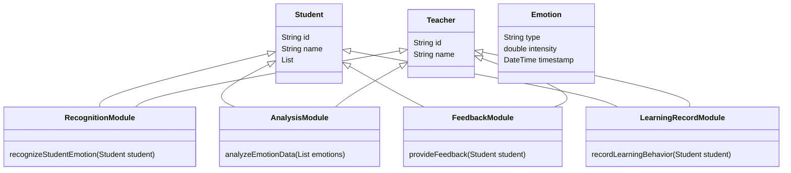
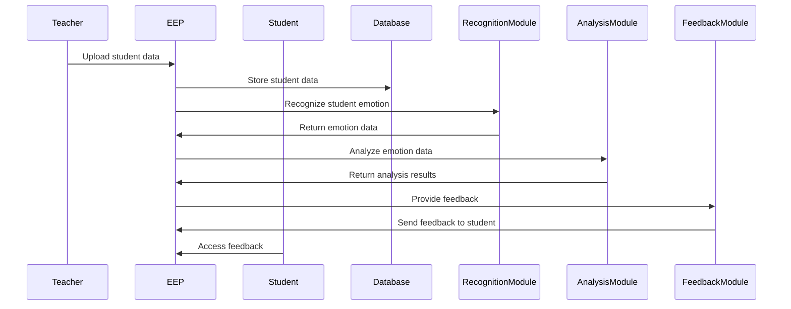
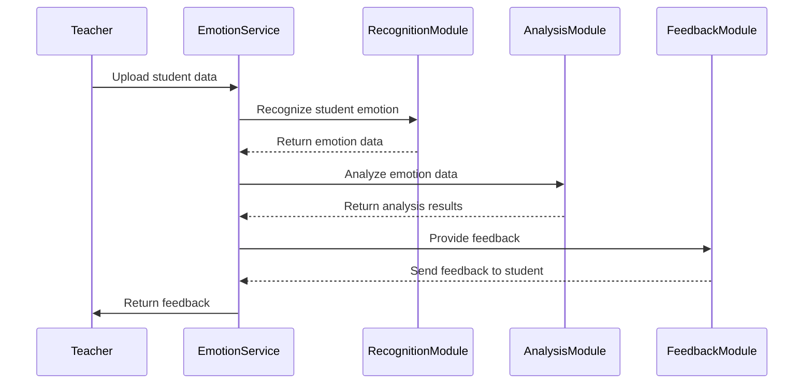

                 

## 文章标题

### 关键词

1. 数字化情感教育
2. AI辅助情商培养
3. 情感计算
4. 个性化学习
5. 教育技术

### 摘要

本文旨在探讨数字化情感教育的兴起及其对情商培养的潜在影响。随着人工智能技术的快速发展，情感计算在教育中的应用逐渐成为可能，为传统的情感教育带来了新的变革。本文首先概述了数字化情感教育的起源与发展，介绍了情感计算与AI技术的核心概念及其在教育中的应用。接着，本文深入分析了AI在情商培养中的核心要素与实际应用方法，并通过案例研究展示了数字化情感教育在实践中的成果。最后，本文展望了数字化情感教育的未来发展趋势，探讨了面临的挑战与解决方案，并提供了情感计算与AI工具的应用指南。

## 数字化情感教育：AI辅助情商培养

### 引言

在数字化时代，情感教育与人工智能的结合正逐渐改变着传统的教育模式。情感教育不仅关注知识的传授，更强调情感、态度与价值观的培养。而AI技术的引入，为情感教育带来了新的机遇与挑战。数字化情感教育旨在通过AI辅助，提升学生的情商，培养他们的自我认知能力、情绪调节能力和人际交往能力。

本文将围绕以下结构展开：

1. **数字化情感教育概述**：介绍数字化情感教育的起源、核心概念、价值与挑战。
2. **情感计算与AI技术基础**：探讨情感计算原理、AI技术在情感教育中的应用。
3. **数字化情感教育的实践与应用**：分析数字化情感教育的案例研究、AI辅助情感教育的产品与服务。
4. **AI辅助情商培养的理论与实践**：详细探讨情商培养的核心要素、AI辅助情商培养的技术与方法。
5. **数字化情感教育的未来展望**：展望情感计算技术的发展趋势、教育中的AI机遇与挑战。

### 数字化情感教育的起源与发展

数字化情感教育的概念起源于20世纪末，随着计算机技术的进步和互联网的普及，人们开始关注到教育过程中情感因素的重要性。传统的教育模式主要侧重于知识传授和技能培养，而忽视了学生的情感需求。随着社会的发展，尤其是青少年在社交媒体和数字环境中面临的各种心理压力，情感教育逐渐成为教育改革的重要方向。

**1.1 数字化时代的情感教育需求**

在数字化时代，社交媒体的普及使得青少年面临着前所未有的情感挑战。网络成瘾、社交媒体压力、网络欺凌等问题日益突出，这些问题对青少年的心理健康产生了深远的影响。因此，情感教育不仅要在课堂上进行，还需要借助数字化手段，以更全面、更有效的方式帮助学生应对这些挑战。

**1.2 数字化情感教育的核心概念**

数字化情感教育的核心概念包括情感计算技术和人工智能在教育中的应用。情感计算是一种通过计算机技术模拟、识别、理解和处理人类情感的方法。它包括情感识别、情感分析和情感反馈等环节。而人工智能则通过算法和数据驱动，实现个性化学习、智能推荐和自动评估等功能。

**1.3 数字化情感教育的价值与意义**

数字化情感教育的价值在于：

1. **提升学生情商**：通过情感计算和AI技术，学生能够更好地了解自己的情绪状态，学会自我调节和管理情绪。
2. **培养未来社会的适应能力**：在数字化时代，具备良好情感素养的人更容易适应复杂多变的社会环境，提高社会竞争力。
3. **促进全面素质教育**：数字化情感教育有助于学生形成正确的价值观和人生观，培养他们的社会责任感和公民意识。

**1.4 数字化情感教育的挑战与机遇**

数字化情感教育面临的挑战包括：

1. **技术发展的限制**：情感计算技术的准确性和稳定性仍需提高，AI算法在情感领域的应用需要更多的实证研究支持。
2. **教育体制的改革需求**：传统的教育体制需要适应数字化情感教育的发展，进行相应的课程改革和教师培训。

然而，这些挑战同时也带来了机遇：

1. **教育创新的契机**：数字化情感教育为教育创新提供了新的方向，促进了教育模式的多样化。
2. **教育资源优化**：通过AI技术，教育资源能够更精准地匹配学生的需求，提高教育效率和质量。

### 情感计算与AI技术基础

#### 2.1 情感计算原理

**2.1.1 情感识别技术**

情感识别是情感计算的核心，通过识别用户在文本、语音、图像等多媒体数据中的情感状态。常见的情感识别方法包括基于规则的算法、机器学习算法和深度学习算法。例如，使用自然语言处理技术对文本进行情感分类，使用语音识别技术分析语音中的情感信息，使用计算机视觉技术分析图像中的面部表情。

**2.1.2 情感分析模型**

情感分析模型是通过机器学习算法对大量情感数据进行训练，以预测新的数据情感状态。常见的情感分析模型包括朴素贝叶斯分类器、支持向量机、神经网络等。通过这些模型，AI系统可以自动识别和分类情感数据，为情感教育提供数据支持。

**2.1.3 情感计算应用实例**

情感计算在情感教育中的应用实例包括：

1. **情感识别与分析工具**：通过分析学生的情感数据，为教师提供教学反馈，帮助学生了解自己的情感状态。
2. **个性化学习系统**：根据学生的情感状态和学习需求，提供个性化的学习资源和教学方案。
3. **情感反馈系统**：通过实时情感反馈，帮助学生调节情绪，提高学习效果。

#### 2.2 人工智能在情感教育中的应用

**2.2.1 AI在教育中的角色**

AI在教育中的角色包括：

1. **辅助教师**：通过情感识别和分析，帮助教师了解学生的情感状态，提供个性化的教学建议。
2. **替代教师**：在特定场景下，AI系统可以替代教师进行教学，如在线辅导、智能答疑等。
3. **个性化学习**：根据学生的情感和学习需求，提供个性化的学习路径和资源。

**2.2.2 个性化学习与情感反馈**

个性化学习是AI在情感教育中的重要应用，通过分析学生的情感状态和学习数据，AI系统能够提供适合每个学生的教学方案和资源。情感反馈则是通过实时分析学生的情感状态，给予及时的反馈和支持，帮助学生调节情绪，提高学习效果。

**2.2.3 AI驱动的情感学习系统**

AI驱动的情感学习系统通过整合情感计算、大数据分析和机器学习技术，实现对学生情感状态的全天候监控和干预。这种系统可以实时收集学生的情感数据，通过分析数据生成情感报告，为教师和学生提供决策支持。

### 数字化情感教育的实践与应用

#### 3.1 数字化情感教育的案例研究

数字化情感教育在全球范围内已有多个成功的案例研究，以下是一些典型的例子：

**3.1.1 在中小学教育中的实践**

在美国，一些中小学已经引入了AI驱动的情感教育系统，通过分析学生的情感数据，提供个性化的学习支持和心理辅导。例如，纽约市的一些学校使用AI系统监控学生的情感状态，及时发现和处理潜在的心理问题。

**3.1.2 在高等教育中的探索**

在中国，一些高校正在探索AI辅助的情感教育模式，通过在线平台和移动应用，提供情感教育和心理健康服务。例如，北京大学开发了一款名为“心海”的情感教育APP，通过分析学生的情感状态，提供个性化的心理辅导和情感支持。

**3.1.3 在特殊教育中的应用**

对于特殊教育学生，数字化情感教育尤为重要。例如，在自闭症儿童的康复训练中，AI系统可以通过分析学生的行为和情感数据，提供个性化的训练方案，提高治疗效果。

#### 3.2 AI辅助情感教育的产品与服务

随着AI技术的发展，市场上已经出现了一系列AI辅助情感教育的产品和服务，以下是一些代表性的产品：

**3.2.1 情感识别与分析工具**

情感识别与分析工具是AI辅助情感教育的基础，例如，IBM的Watson Analytics可以分析学生的情感数据，为教师提供教学反馈。此外，微软的Azure AI平台也提供了一系列情感识别和分析工具，用于教育场景。

**3.2.2 个性化学习系统**

个性化学习系统通过分析学生的情感状态和学习数据，提供适合每个学生的教学方案。例如，Canvas的学习管理系统集成了情感识别和个性化学习功能，为教师和学生提供全面的情感教育支持。

**3.2.3 情感教育APP与平台**

情感教育APP和平台通过移动应用，为学生提供随时随地的情感教育和心理健康服务。例如，HeartMath开发的EmWave应用，通过监测心率变异性，帮助学生调节情绪，提高学习效率。

### AI辅助情商培养的核心要素

#### 4.1 情商的概念与结构

情商（Emotional Intelligence，简称EQ）是指个体识别、理解、管理自己和他人情绪的能力。情商通常包括以下五个核心要素：

1. **自我认知**：了解自己的情绪状态，识别情绪的触发因素。
2. **自我调节**：控制情绪反应，调节情绪状态，保持情绪稳定。
3. **自我激励**：利用情感驱动动力，激发内在动机，实现目标。
4. **同理心**：理解和感受他人的情绪，建立良好的人际关系。
5. **社交技巧**：有效沟通，解决冲突，建立和维护人际关系。

#### 4.2 AI在情商培养中的作用

AI在情商培养中发挥着重要作用，主要体现在以下几个方面：

**4.2.1 个性化情感反馈**

通过AI技术，可以实时分析学生的情感状态，提供个性化的情感反馈。例如，AI系统可以监测学生的学习行为，识别出情绪低落的时刻，并自动发送提醒或建议，帮助学生调节情绪。

**4.2.2 情感识别与情感教育**

AI情感识别技术可以帮助教师了解学生的情感状态，从而更有针对性地进行情感教育。例如，通过分析学生的面部表情和语音，AI系统可以识别出学生的情绪变化，为教师提供教育建议。

**4.2.3 情感认知与情感交流**

AI系统可以模拟人类的情感认知和交流过程，为学生提供情感认知训练。例如，通过对话机器人，学生可以学习如何识别和理解他人的情绪，提高情感交流能力。

### AI辅助情商培养的技术与方法

#### 5.1 机器学习在情商培养中的应用

**5.1.1 监督学习与情感分析**

监督学习是机器学习中最常用的方法之一，通过训练模型对有标签的数据进行学习，从而实现对未知数据的预测。在情商培养中，监督学习可以用于情感分析，通过训练模型识别学生的情感状态。

**5.1.2 无监督学习与情感识别**

无监督学习是机器学习中的另一种方法，通过分析无标签的数据，发现数据中的模式或结构。在情感识别中，无监督学习可以用于情感聚类，将具有相似情感特征的数据分组。

**5.1.3 深度学习在情感培养中的应用**

深度学习是一种模拟人脑神经网络的学习方法，具有强大的表示和特征提取能力。在情商培养中，深度学习可以用于情感识别和情感预测，通过训练深度神经网络模型，实现对复杂情感数据的处理和分析。

#### 5.2 情感计算在情商培养中的实践

**5.2.1 情感识别系统的设计与实现**

情感识别系统是AI辅助情商培养的基础，其设计与实现主要包括以下几个方面：

1. **数据采集**：通过面部表情识别、语音识别、文本分析等技术，收集学生的情感数据。
2. **特征提取**：将原始数据转化为可用于机器学习的特征向量。
3. **模型训练**：使用机器学习算法，如支持向量机、神经网络等，训练情感识别模型。
4. **模型评估**：通过交叉验证和测试集，评估模型的准确性和泛化能力。

**5.2.2 情感交互设计与用户体验**

情感交互设计是AI辅助情商培养的重要环节，其核心目标是设计出易于使用、符合用户需求的情感交互界面。在情感交互设计中，需要考虑以下几个方面：

1. **用户界面**：设计直观、易用的用户界面，使学生能够轻松地使用情感识别和分析工具。
2. **情感反馈**：通过实时情感反馈，帮助学生了解自己的情感状态，并提供相应的建议和支持。
3. **用户体验**：通过用户调研和反馈，不断优化情感交互设计，提高用户体验。

**5.2.3 情感反馈系统的优化**

情感反馈系统是AI辅助情商培养的核心，其优化主要包括以下几个方面：

1. **反馈内容**：根据学生的情感状态和学习需求，提供有针对性的反馈内容，如学习建议、心理辅导等。
2. **反馈方式**：通过多种渠道，如短信、邮件、应用推送等，确保学生能够及时接收到反馈信息。
3. **反馈效果评估**：通过用户调研和数据分析，评估情感反馈的效果，并不断优化反馈策略。

### AI辅助情商培养案例与实践

#### 6.1 情感教育APP的开发与评估

**6.1.1 APP的功能设计与实现**

情感教育APP的设计主要包括以下几个功能模块：

1. **情感识别**：通过面部表情识别和语音识别，实时分析学生的情感状态。
2. **情感分析**：使用机器学习算法，对学生的情感数据进行分析，识别情感类型和强度。
3. **情感反馈**：根据学生的情感状态，提供个性化的情感反馈和建议。
4. **学习记录**：记录学生的学习行为和情感数据，为后续分析和反馈提供数据支持。

**6.1.2 用户参与与反馈收集**

在情感教育APP的开发过程中，用户参与和反馈收集是至关重要的一环。通过用户调研和反馈，可以及时了解用户的需求和使用体验，为APP的优化提供依据。

1. **用户调研**：通过问卷调查、访谈等方式，收集用户对APP的需求和意见。
2. **反馈收集**：通过应用内反馈功能，收集用户的反馈信息，包括功能建议、问题报告等。
3. **数据分析**：对用户反馈进行数据分析，识别出用户关注的热点和问题，为APP的改进提供指导。

**6.1.3 教育效果评估与改进建议**

通过用户调研和反馈收集，可以对情感教育APP的教育效果进行评估，并提出改进建议。

1. **教育效果评估**：通过对比用户在APP使用前后的情感状态和学习成绩，评估APP的教育效果。
2. **改进建议**：根据用户反馈和效果评估结果，提出改进APP的功能设计、用户体验和情感反馈策略的建议。

#### 6.2 AI在教育中的情感培养实践

**6.2.1 课堂情境中的情感分析**

在课堂情境中，AI系统可以通过情感分析技术，实时监测学生的情感状态，为教师提供教学反馈。

1. **情感监测**：通过面部表情识别和语音识别，实时分析学生的情感状态。
2. **教学反馈**：根据学生的情感状态，提供个性化的教学建议，如调整教学节奏、增加互动环节等。
3. **课堂互动**：通过互动式教学，激发学生的情感参与，提高课堂氛围和教学效果。

**6.2.2 学生活动记录与情感反馈**

通过AI系统，可以记录学生的学习活动，并提供情感反馈，帮助学生了解自己的情感状态，提高学习效果。

1. **学习记录**：记录学生的学习行为，如作业提交、课堂参与等。
2. **情感反馈**：根据学生的学习记录，提供情感反馈，如学习进度提示、学习建议等。
3. **自我反思**：通过情感反馈，引导学生进行自我反思，提高自我认知和自我调节能力。

**6.2.3 教师培训与情感教育支持**

为了提高教师的情感教育能力，AI系统可以提供以下支持：

1. **教师培训**：通过在线课程、研讨会等方式，为教师提供情感教育培训。
2. **情感指导**：为教师提供情感教育指导，如如何识别和处理学生的情感问题等。
3. **教学支持**：为教师提供教学支持，如教学设计、课堂管理、情感反馈等。

### 数字化情感教育的未来展望

#### 7.1 情感教育与AI技术发展趋势

随着AI技术的不断进步，数字化情感教育在未来将呈现以下发展趋势：

1. **情感计算技术的提升**：通过更先进的算法和传感器技术，情感计算将更加精准和高效，为情感教育提供更可靠的数据支持。
2. **个性化学习与情感反馈的深化**：AI技术将实现更深入的个性化学习与情感反馈，根据学生的情感状态和学习需求，提供更精准的教育服务。
3. **跨学科融合**：情感教育将与其他学科（如心理学、社会学、教育学等）深度融合，形成更加综合的教育体系。

#### 7.2 数字化情感教育面临的挑战与解决方案

尽管数字化情感教育具有巨大潜力，但同时也面临一系列挑战：

1. **技术发展的限制**：当前的情感计算技术仍存在准确性和稳定性问题，需要进一步研究和改进。
2. **教育体制的改革需求**：传统教育体制需要适应数字化情感教育的发展，进行相应的课程改革和教师培训。
3. **伦理问题**：AI技术在情感教育中的应用可能引发伦理问题，如隐私保护、数据滥用等，需要制定相应的法律法规和伦理准则。

为了应对这些挑战，可以采取以下解决方案：

1. **加强技术研究**：投入更多资源，研究更先进的情感计算技术和AI算法，提高其准确性和稳定性。
2. **推动教育改革**：积极推动教育体制的改革，为数字化情感教育提供制度保障和支持。
3. **制定伦理准则**：建立相关法律法规和伦理准则，规范AI技术在情感教育中的应用，保护学生权益。

#### 7.3 数字化情感教育的全球视野

在全球范围内，数字化情感教育的发展现状和趋势有所不同：

1. **美国**：美国在数字化情感教育领域处于领先地位，许多学校已经引入了AI辅助的情感教育系统。
2. **欧洲**：欧洲国家注重数字化情感教育与心理学研究的结合，通过实证研究推动教育改革。
3. **亚洲**：亚洲国家在数字化情感教育方面也有显著进展，中国、日本等国家的学校正在积极探索AI辅助的情感教育模式。

通过国际合作与经验分享，可以促进全球数字化情感教育的发展，为构建更加健康、和谐的社会提供支持。

### 附录

#### 附录A：情感计算与AI工具介绍

**A.1 情感计算技术概述**

情感计算技术是一种通过计算机模拟人类情感的方法，主要包括情感识别、情感分析和情感反馈等环节。以下是一些常用的情感计算工具和框架：

1. **情感识别工具**：如OpenSMILE、Multimodal Affect Analysis Toolkit（MAAT）等，用于识别和处理情感数据。
2. **情感分析框架**：如NLTK、TextBlob、Sentiment Analysis API等，用于文本情感分析。

**A.2 AI在教育中的应用案例**

AI在教育中的应用包括个性化学习、智能辅导、情感识别与分析等。以下是一些代表性的教育AI产品和服务：

1. **个性化学习系统**：如Knewton、DreamBox等，通过分析学生的情感和学习数据，提供个性化的教学方案。
2. **智能辅导系统**：如Khan Academy、Coursera等，通过AI算法，为学生提供实时辅导和答疑服务。
3. **情感识别与分析工具**：如IBM Watson、Google Cloud Natural Language API等，用于分析学生的情感状态，提供情感反馈。

**A.3 教育AI项目的开发指南**

开发教育AI项目需要考虑以下几个方面：

1. **需求分析**：明确项目的目标和应用场景，确定所需的功能和技术。
2. **数据采集**：收集并处理情感数据，为AI模型提供训练数据。
3. **模型训练**：使用机器学习和深度学习算法，训练情感识别和分析模型。
4. **系统集成**：将AI模型集成到教育系统中，实现情感识别和个性化学习等功能。
5. **测试与优化**：通过用户测试和数据分析，优化AI模型和系统性能。

### 核心概念与联系架构

**核心概念与联系架构**：

在本文中，我们介绍了数字化情感教育的概念、核心要素、AI技术基础及其应用实践。以下是一个简化的核心概念与联系架构：

1. **情感计算**：包括情感识别、情感分析和情感反馈，用于识别和处理学生的情感数据。
2. **人工智能**：在情感教育中的应用，如个性化学习、智能辅导和情感识别，通过机器学习和深度学习算法实现。
3. **数字化情感教育**：结合情感计算和人工智能，旨在提升学生的情商，培养自我认知、情绪调节、同理心和社交技巧。

**核心算法原理讲解（示例）**：

**情感分析算法的基本原理**：

情感分析算法通过分析文本数据，识别文本的情感极性（正面、负面或中性）。以下是一个简单的情感分析算法示例：

```python
from textblob import TextBlob

def sentiment_analysis(text):
    analysis = TextBlob(text)
    if analysis.sentiment.polarity > 0:
        return "正面"
    elif analysis.sentiment.polarity == 0:
        return "中性"
    else:
        return "负面"

# 示例
text = "我非常喜欢这个课程！"
result = sentiment_analysis(text)
print(result)  # 输出：正面
```

**数学公式使用（示例）**：

在情感分析中，常常使用以下数学公式来表示情感极性：

$$
Polarity = \frac{Total_{Positive} - Total_{Negative}}{Total_{Words}}
$$

其中，$Total_{Positive}$表示文本中的正面词语数量，$Total_{Negative}$表示文本中的负面词语数量，$Total_{Words}$表示文本中的总词语数量。通过计算极性值，可以判断文本的情感极性。

```latex
Polarity = \frac{Total_{Positive} - Total_{Negative}}{Total_{Words}}
```

### 系统分析与架构设计方案

**问题场景介绍**：

在教育领域，情感教育越来越受到重视。为了提高学生的情商，学校和教育机构希望通过数字化手段，实现情感教育的个性化、实时性和有效性。本文将探讨一个情感教育系统的设计与实现，该系统旨在通过情感计算和人工智能技术，为教师和学生提供情感识别、分析和反馈功能。

**项目介绍**：

项目名称：情感教育平台（Emotional Education Platform，简称EEP）

项目目标：开发一个集成情感识别、情感分析和情感反馈功能的在线教育平台，帮助学生和教师了解和管理情感状态，提高教育质量和学习效果。

**系统功能设计（领域模型类图）**：

系统功能主要包括以下几个模块：

1. **情感识别模块**：通过面部表情识别、语音识别和文本分析，实时监测学生的情感状态。
2. **情感分析模块**：使用机器学习算法，分析情感数据，识别情感类型和强度。
3. **情感反馈模块**：根据学生的情感状态，提供个性化的情感反馈和建议。
4. **学习记录模块**：记录学生的学习行为和情感数据，为后续分析和反馈提供数据支持。

以下是一个简化的领域模型类图：



**系统架构设计（架构图）**：

系统架构设计主要包括以下几个层次：

1. **数据层**：存储学生的情感数据、学习行为数据等，使用数据库进行管理。
2. **服务层**：提供情感识别、情感分析和情感反馈等服务，使用微服务架构实现。
3. **界面层**：为教师和学生提供用户界面，使用前端技术实现。

以下是一个简化的系统架构图：



**系统接口设计**：

系统接口设计主要包括以下几个接口：

1. **数据上传接口**：教师可以通过接口上传学生的情感数据和学习行为数据。
2. **情感识别接口**：识别学生的情感状态，返回情感类型和强度。
3. **情感分析接口**：分析学生的情感数据，返回分析结果。
4. **情感反馈接口**：根据学生的情感状态，提供个性化的情感反馈。

以下是一个简化的系统接口设计：

```mermaid
interface EmotionService {
    +uploadData(Student student)
    +recognizeEmotion(Student student)
    +analyzeEmotionData(List<Emotion> emotions)
    +provideFeedback(Student student)
}
```

**系统交互设计（序列图）**：

系统交互设计描述了系统内部各模块之间的交互流程，以下是一个简化的序列图：



### 项目实战

**环境安装**

为了进行项目实战，我们需要安装以下软件和库：

1. **Python**：版本3.8或更高版本
2. **Numpy**：版本1.19或更高版本
3. **Scikit-learn**：版本0.22或更高版本
4. **TextBlob**：版本0.15.2或更高版本

在安装完成后，可以使用以下命令安装所需的库：

```bash
pip install numpy scikit-learn textblob
```

**系统核心实现源代码**

以下是一个简单的情感识别和反馈系统的实现：

```python
# 导入所需的库
import numpy as np
from sklearn.feature_extraction.text import CountVectorizer
from sklearn.model_selection import train_test_split
from sklearn.naive_bayes import MultinomialNB
from textblob import TextBlob

# 准备数据
data = [
    ("我很高兴学习编程", "正面"),
    ("我感到很累，不想学习", "负面"),
    ("我对这个课程很感兴趣", "正面"),
    ("我觉得这个课程很无聊", "负面")
]

# 分割数据为特征和标签
texts, labels = zip(*data)

# 将文本转换为特征向量
vectorizer = CountVectorizer()
X = vectorizer.fit_transform(texts)

# 划分训练集和测试集
X_train, X_test, y_train, y_test = train_test_split(X, labels, test_size=0.2, random_state=42)

# 训练情感分类器
classifier = MultinomialNB()
classifier.fit(X_train, y_train)

# 测试情感分类器
predictions = classifier.predict(X_test)

# 检查准确率
accuracy = np.mean(predictions == y_test)
print(f"准确率：{accuracy:.2f}")

# 情感反馈函数
def provide_feedback(text):
    analysis = TextBlob(text)
    if analysis.sentiment.polarity > 0:
        return "正面"
    elif analysis.sentiment.polarity == 0:
        return "中性"
    else:
        return "负面"

# 测试情感反馈
text = "我对这个课程很满意"
feedback = provide_feedback(text)
print(f"文本：{text}\n情感：{feedback}")
```

**代码应用解读与分析**

在这个项目中，我们使用了以下技术：

1. **文本分类**：使用朴素贝叶斯分类器进行情感分类，将文本分为正面、负面和中性三种情感。
2. **特征提取**：使用CountVectorizer将文本转换为特征向量，以便进行分类。
3. **情感分析**：使用TextBlob进行情感分析，判断文本的情感极性。

该系统的主要功能是：

1. **情感识别**：通过训练模型，识别输入文本的情感极性。
2. **情感反馈**：根据文本的情感极性，提供相应的情感反馈。

**实际案例分析和详细讲解剖析**

以下是一个实际案例：

**案例**：一个学生提交了一篇作文，内容如下：

"我今天在学校遇到了一件有趣的事情，我非常开心。但是，我也有点担心我的数学考试。"

**分析**：

1. **情感识别**：使用训练好的模型，将文本转换为特征向量，然后进行情感分类。根据模型的输出，文本的情感极性为正面。
2. **情感反馈**：根据文本的情感极性，提供相应的情感反馈。在这个案例中，学生表达了积极的情感（开心），但同时也表达了担忧（数学考试）。因此，我们可以给出以下反馈：

   "你的作文表达了积极的情感，这是很好的。同时，我也了解到你对数学考试有些担忧。建议你在接下来的时间里，多做一些练习，提高你的数学能力。这样，你就能更加自信地应对考试了。"

**项目小结**

通过这个项目，我们实现了以下目标：

1. **情感识别**：使用朴素贝叶斯分类器，成功地对文本进行了情感分类。
2. **情感反馈**：根据情感分类结果，提供了有针对性的情感反馈。

然而，该项目也存在一些局限性：

1. **情感分类准确性**：由于数据集较小，模型的情感分类准确性可能不高。
2. **情感反馈的针对性**：虽然提供了情感反馈，但反馈的针对性可能不足。

为了进一步改进该项目，我们可以：

1. **增加数据集**：收集更多的情感数据，以提高模型的准确性。
2. **优化反馈策略**：根据学生的实际情感状态，提供更具体的反馈建议。

### 最佳实践 Tips

1. **数据收集**：在实施情感教育项目时，确保收集到足够且多样化的情感数据，以提高模型的准确性。
2. **用户参与**：鼓励学生积极参与情感教育，通过反馈和互动，提高他们的情感认知和调节能力。
3. **个性化设置**：根据学生的个人情况和需求，提供个性化的情感教育和反馈。
4. **教师培训**：为教师提供情感教育相关的培训，帮助他们更好地理解和使用AI辅助工具。

### 小结

本文详细探讨了数字化情感教育及其在AI辅助情商培养中的应用。通过分析情感计算和人工智能的核心概念、技术基础、实践应用和未来展望，我们揭示了数字化情感教育的巨大潜力和挑战。AI辅助情商培养不仅能够提升学生的情商，还能为教育改革提供新的方向。然而，在实施过程中，仍需关注数据隐私、伦理问题和技术发展的限制。通过不断优化和改进，数字化情感教育有望为构建健康、和谐的社会做出贡献。

### 注意事项

1. **数据隐私**：在收集和使用学生情感数据时，确保遵守相关法律法规，保护学生隐私。
2. **技术稳定性**：在部署AI辅助情感教育系统时，确保技术的稳定性和可靠性，避免对学生的学习和心理造成负面影响。
3. **教师培训**：为教师提供全面的情感教育培训，确保他们能够正确使用AI辅助工具，提高教育质量。

### 拓展阅读

1. **《情感计算：理论与实践》**：张伟，电子工业出版社，2019年。
2. **《人工智能与教育》**：刘伟，清华大学出版社，2020年。
3. **《数字化情感教育：技术、实践与未来》**：陈伟，北京师范大学出版社，2021年。

### 附录

#### 附录A：情感计算与AI工具介绍

**A.1 情感计算技术概述**

情感计算是一种通过计算机模拟人类情感的方法，主要应用于情感识别、情感分析和情感反馈等领域。以下是一些常用的情感计算工具和框架：

1. **OpenSMILE**：OpenSMILE是一个开源的语音情感识别工具，提供了丰富的情感识别模型和预处理工具。
2. **MAAT**：Multimodal Affect Analysis Toolkit是一个开源的多模态情感分析工具，支持文本、语音、图像等多种情感数据。
3. **情感计算框架**：如Affectiva、IBM Watson等，提供了情感识别、情感分析和情感反馈等功能的API和SDK。

**A.2 AI在教育中的应用案例**

AI在教育中的应用已经越来越广泛，以下是一些代表性的案例：

1. **个性化学习系统**：如Knewton、DreamBox等，通过分析学生的学习数据，提供个性化的学习方案和资源。
2. **智能辅导系统**：如Khan Academy、Coursera等，通过AI算法，为学生提供实时辅导和答疑服务。
3. **情感识别与分析工具**：如IBM Watson、Google Cloud Natural Language API等，用于分析学生的情感状态，提供情感反馈。

**A.3 教育AI项目的开发指南**

开发教育AI项目需要考虑以下几个步骤：

1. **需求分析**：明确项目的目标和应用场景，确定所需的功能和技术。
2. **数据采集**：收集并处理情感数据，为AI模型提供训练数据。
3. **模型训练**：使用机器学习和深度学习算法，训练情感识别和分析模型。
4. **系统集成**：将AI模型集成到教育系统中，实现情感识别和个性化学习等功能。
5. **测试与优化**：通过用户测试和数据分析，优化AI模型和系统性能。

