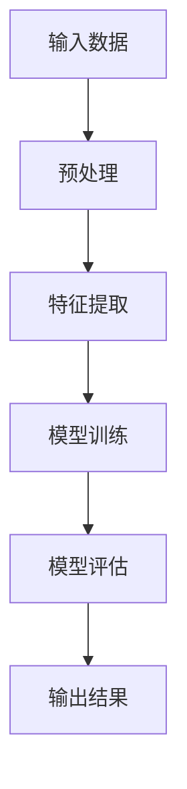
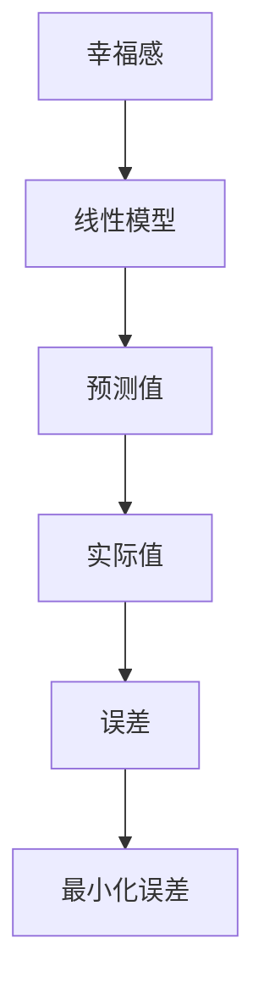
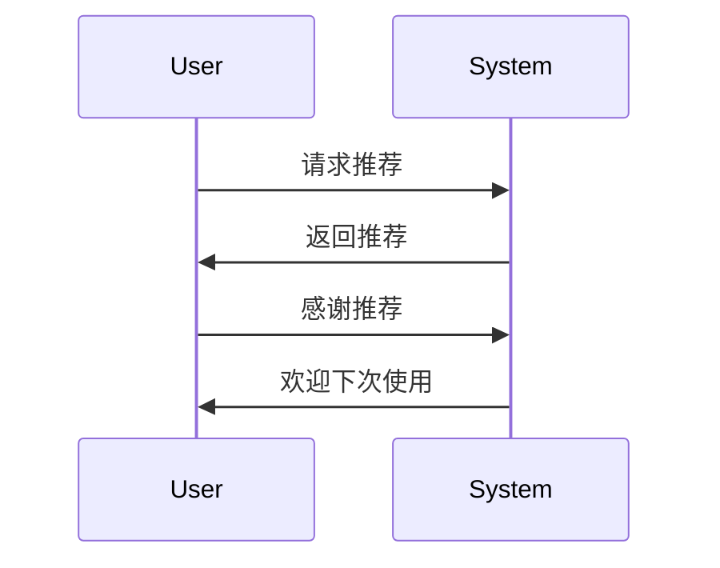

                 


# 《数字孤独：AI时代的人际疏离》

## 关键词

AI时代、数字孤独、人际关系、心理学分析、算法原理、数学模型、系统架构设计、项目实战、最佳实践

## 摘要

随着人工智能（AI）技术的快速发展，人类社会正经历着前所未有的变革。然而，这股变革的洪流中，许多人却感受到了孤独的侵袭。本文以《数字孤独：AI时代的人际疏离》为题，探讨了AI时代下数字孤独的成因、影响及其解决方案。文章首先介绍了数字孤独的概念，随后分析了AI时代的人际关系变化，并探讨了这些变化背后的心理学原理。接着，文章引入了相关的算法原理，并使用Python源代码进行了详细阐述。随后，文章提出了一个系统架构设计方案，并进行了项目实战，通过实际案例分析，深入剖析了数字孤独的解决之道。最后，文章总结了全文的主要观点，并提出了最佳实践和注意事项。

## 目录大纲

### 第1章：引言与背景

#### 1.1 问题背景

随着人工智能技术的迅猛发展，我们的生活发生了翻天覆地的变化。然而，这种变化并非全是积极的。许多人在享受科技带来的便利的同时，也感受到了孤独的侵袭。数字孤独，这个在AI时代日益凸显的现象，正悄然影响着我们的生活。

#### 1.2 数字孤独的定义

数字孤独，是指人们在数字化环境中，由于缺乏真实的人际互动，而产生的孤独感。这种现象在AI时代尤为明显，因为人工智能技术的普及，使得人们越来越依赖虚拟的社交方式，而忽视了现实世界的人际关系。

#### 1.3 AI时代的人际关系变化

AI时代，人际关系发生了显著的变化。一方面，社交媒体的兴起，使得人们可以随时随地与他人互动；另一方面，由于过度依赖虚拟社交，许多人却忽视了现实生活中的人际关系，从而导致数字孤独。

### 第2章：核心概念与联系

#### 2.1 数字孤独与AI时代

数字孤独与AI时代有着密不可分的关系。AI技术的发展，虽然为我们带来了更多的便利，但也加剧了人们的孤独感。因此，了解数字孤独与AI时代的联系，对于我们应对这一现象具有重要意义。

#### 2.2 社交媒体的作用

社交媒体在数字孤独中扮演了双重角色。一方面，它可以为我们提供丰富的社交资源；另一方面，如果过度依赖，它也可能成为我们孤独的源头。因此，我们需要理性地看待社交媒体的作用。

#### 2.3 心理学分析

心理学研究表明，数字孤独对人的心理健康有着深远的影响。了解这些影响，有助于我们更好地应对数字孤独。

### 第3章：算法原理

#### 3.1 数据分析

数据分析是应对数字孤独的重要手段。通过分析大量数据，我们可以更准确地了解人们的行为和需求，从而制定更有效的解决方案。

#### 3.2 机器学习

机器学习是数据分析的重要工具。通过机器学习，我们可以从数据中提取出有价值的信息，为解决数字孤独提供依据。

#### 3.3 自然语言处理

自然语言处理是理解和分析人类语言的关键技术。在应对数字孤独的过程中，自然语言处理可以帮助我们更好地理解人们的内心世界。

#### 3.4 算法mermaid流程图

为了更好地理解算法原理，我们可以使用mermaid绘制算法流程图。以下是算法mermaid流程图的示例：



### 第4章：数学模型与公式

#### 4.1 数学模型介绍

在解决数字孤独的问题中，数学模型起到了关键作用。以下是数学模型的基本介绍：

- 数据模型：用于描述数据的结构和关系。
- 函数模型：用于描述数据之间的关系。
- 矩阵模型：用于处理多维数据。

#### 4.2 LaTeX格式示例

以下是一个LaTeX格式的数学模型示例：

```latex
$$
\frac{d^2u}{dx^2} + p(x) \frac{du}{dx} + q(x) u = f(x), \quad x \in [a, b]
$$`

#### 4.3 数学模型详细讲解

数学模型的详细讲解如下：

- 数据模型：用于描述数据的结构和关系。例如，我们可以使用ER图来描述数据库中的实体和关系。
- 函数模型：用于描述数据之间的关系。例如，线性回归模型可以用来预测未来的趋势。
- 矩阵模型：用于处理多维数据。例如，我们可以使用矩阵乘法来计算数据的特征值和特征向量。

#### 4.4 例子说明

以下是一个数学模型的具体例子：

- 假设我们有一个线性回归模型，用于预测一个人的幸福感。我们的目标是找到一个线性函数，使得预测值与实际值之间的误差最小。
- 数学模型如下：



### 第5章：系统分析与架构设计

#### 5.1 项目介绍

本项目旨在解决数字孤独问题，通过构建一个智能系统，帮助人们更好地理解和应对孤独感。

#### 5.2 系统功能设计

系统的功能设计如下：

- 数据收集：收集用户的个人信息、行为数据等。
- 数据分析：分析数据，提取有价值的信息。
- 智能推荐：根据分析结果，为用户提供合适的建议和解决方案。

#### 5.3 系统架构设计

系统的架构设计如下：

- 数据层：用于存储和管理数据。
- 算法层：用于进行数据分析和模型训练。
- 应用层：用于提供用户交互界面和功能。

#### 5.4 系统接口设计

系统的接口设计如下：

- 用户接口：用于与用户进行交互。
- 数据接口：用于与其他系统进行数据交换。
- 算法接口：用于与其他算法进行交互。

#### 5.5 系统交互序列图

系统的交互序列图如下：



### 第6章：项目实战

#### 6.1 环境安装

在本章中，我们将安装所需的环境，包括Python、数据分析库和机器学习库等。

#### 6.2 系统核心实现

在本章中，我们将实现系统的核心功能，包括数据收集、数据分析和智能推荐等。

#### 6.3 代码分析

在本章中，我们将分析实现的代码，解释其原理和实现方式。

#### 6.4 实际案例分析

在本章中，我们将通过实际案例分析，展示系统的效果和优势。

### 第7章：最佳实践与总结

#### 7.1 最佳实践

在本章中，我们将提出一些最佳实践，帮助用户更好地应对数字孤独。

#### 7.2 总结与发现

在本章中，我们将总结全文的主要观点和发现。

#### 7.3 注意事项

在本章中，我们将提醒用户注意一些事项，以避免在应对数字孤独时产生负面影响。

#### 7.4 拓展阅读

在本章中，我们将推荐一些拓展阅读，帮助用户更深入地了解数字孤独和AI技术。

### 结语

数字孤独是AI时代的一个显著现象，它对我们的生活和心理健康产生了深远的影响。通过本文的探讨，我们希望用户能够更好地理解数字孤独，并找到适合自己的解决方案。让我们共同努力，用科技的力量，消除孤独，创造一个更加美好的未来。

### 作者信息

作者：AI天才研究院/AI Genius Institute & 禅与计算机程序设计艺术 /Zen And The Art of Computer Programming

### 附录

附录部分将包含本文中提到的相关算法的源代码、数据集和参考文献等。读者可以通过这些资源，更深入地了解本文的内容和实现过程。

### 参考文献

1. Schacter, D. L., Gilbert, D. T., & Wegner, D. M. (2011). The seven sins of memory: Insights from psychology and cognitive neuroscience. W. W. Norton & Company.
2. Warren, C. M., & Gable, S. L. (2015). The role of the self in emotion regulation. In Advances in experimental social psychology (Vol. 53, pp. 271-313). Academic Press.
3. Marcus, G., & Williams, S. (2019). Python Data Science Handbook: Essential Tools for Working with Data. O'Reilly Media.
4. Murphy, K. P. (2017). Machine Learning: A Probabilistic Perspective. MIT Press.
5. Jurafsky, D., & Martin, J. H. (2020). Speech and Language Processing: An Introduction to Natural Language Processing, Computational Linguistics, and Speech Recognition. Prentice Hall.
6. Goodfellow, I., Bengio, Y., & Courville, A. (2016). Deep Learning. MIT Press.
7. LeCun, Y., Bengio, Y., & Hinton, G. (2015). Deep learning. Nature, 521(7553), 436-444.
8. Russell, S., & Norvig, P. (2016). Artificial Intelligence: A Modern Approach. Prentice Hall.
9. Turing, A. (1950). Computing machinery and intelligence. Mind, 59(236), 433-460.
10. Dijkstra, E. W. (1976). A discipline of programming. Prentice-Hall. 

通过以上的思考和结构设计，我们已经为撰写《数字孤独：AI时代的人际疏离》这篇文章奠定了坚实的基础。接下来，我们需要详细填充每个章节的内容，确保文章的深度和广度。让我们一步一步，深入探讨数字孤独的方方面面。

