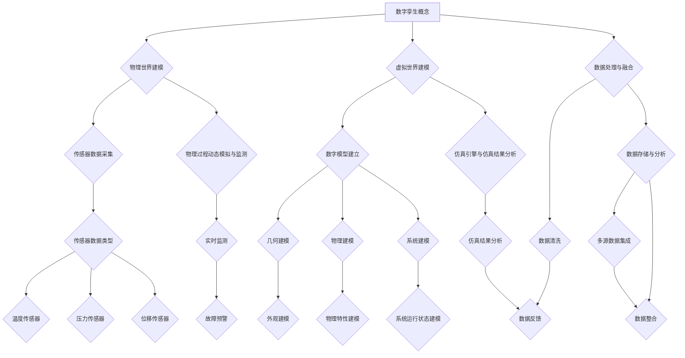

                 

### 数字孪生技术概述

#### 1.1 数字孪生的定义与分类

数字孪生（Digital Twin）是一种先进的创新技术，它通过创建物理实体的数字副本，使得虚拟世界与物理世界之间能够进行高效、精准的交互和映射。数字孪生技术的基本概念可以简单概括为：在虚拟环境中创建一个与实际物理系统高度相似的数字模型，并通过实时数据收集和算法分析，实现对物理实体的监测、仿真和优化。

数字孪生可以大致分为以下几类：

- **物理孪生**：直接在数字世界中复制物理实体的外观和功能，主要用于视觉效果和虚拟展示。
- **虚拟孪生**：通过计算机模拟和仿真技术，对物理实体的运行状态进行虚拟仿真，常用于产品设计、工程分析等。
- **数字孪生系统**：结合了物理孪生和虚拟孪生的特点，通过整合物联网、大数据分析、人工智能等技术，实现对物理实体的实时监测、预测分析和优化决策。

数字孪生技术的定义与分类为我们提供了一个清晰的框架，让我们能够更深入地理解这一技术在现实世界中的应用潜力。

#### 1.2 数字孪生的发展历程

数字孪生技术的发展历程可以追溯到20世纪80年代，当时人们开始探索如何利用计算机模拟技术来替代物理实验。早期的数字孪生研究主要集中在航空和航天领域，通过虚拟仿真技术来模拟飞行器和航天器的运行状态。

随着计算机技术和通信技术的飞速发展，数字孪生技术逐渐从单一领域扩展到更多行业。21世纪初，物联网（IoT）的兴起为数字孪生提供了海量实时数据支持。物联网设备的广泛应用，使得对物理实体进行实时监测和数据分析成为可能。

大数据和云计算的普及进一步推动了数字孪生技术的发展。大数据技术能够处理和分析海量数据，从而提供更准确的预测和优化方案。云计算提供了强大的计算和存储资源，使得数字孪生系统能够在更广泛的场景中应用。

数字孪生技术已经从早期的虚拟仿真和物理模型，发展成为一个集物联网、大数据、云计算和人工智能于一体的综合技术体系。随着技术的不断进步，数字孪生技术的应用场景也在不断拓展，从工业制造到城市管理，从医疗健康到能源管理，数字孪生正在成为连接虚拟世界与现实世界的桥梁。

#### 1.3 数字孪生的重要性和挑战

数字孪生技术的重要性体现在多个方面。首先，数字孪生技术能够显著提高生产效率。通过实时监测和分析物理实体的运行状态，可以提前发现潜在问题，从而进行预防性维护，避免生产中断。其次，数字孪生技术有助于优化资源配置。通过虚拟仿真和预测分析，可以优化生产计划和供应链管理，降低成本，提高资源利用效率。此外，数字孪生技术还能够增强安全保障。通过对物理实体的实时监测和数据分析，可以及时发现安全隐患，并采取相应措施，防止事故发生。

然而，数字孪生技术的应用也面临着一些挑战。首先，数据真实性是数字孪生技术面临的重大挑战之一。物理实体与虚拟模型之间的数据传输和同步需要确保数据的准确性和完整性。任何数据偏差都可能导致虚拟模型与现实世界的不一致，从而影响预测和优化效果。其次，数据安全也是一个重要的挑战。数字孪生技术需要处理大量的敏感数据，包括生产数据、用户数据等，这些数据的安全性和隐私保护至关重要。任何数据泄露或攻击都可能导致严重的后果。最后，数字孪生技术的系统集成复杂度较高。数字孪生系统需要整合物联网、大数据分析、云计算和人工智能等多种技术，各组件之间的兼容性和协同工作是一个复杂且具有挑战性的问题。

尽管面临这些挑战，数字孪生技术的重要性和应用价值仍然不可忽视。随着技术的不断进步和成熟，数字孪生技术将在未来发挥越来越重要的作用，成为连接虚拟世界与现实世界的桥梁。

#### 2.1 物理世界建模

物理世界建模是数字孪生技术的基础和核心，它通过传感器数据采集与处理，实现对物理实体的精确描述和动态监测。传感器数据采集是物理世界建模的第一步，通过各种类型的传感器，如温度传感器、压力传感器、位移传感器等，收集物理实体运行状态的相关数据。这些传感器通常分布在物理实体的关键部位，以确保数据的全面性和准确性。

数据采集之后，需要进行数据处理，以消除噪声、异常值和缺失值，从而得到干净、可靠的数据集。常用的数据处理方法包括数据清洗、数据转换和数据归一化。数据清洗主要是去除重复数据、修复缺失数据和填补异常值。数据转换包括将不同类型的传感器数据转换为统一的数据格式，如将温度、压力等物理量转换为数字量。数据归一化则是通过调整数据范围和分布，使其更适合后续的分析和建模。

动态模拟与实时监测是物理世界建模的关键步骤。通过实时监测物理实体的运行状态，可以及时发现异常情况，并采取相应措施。动态模拟则是通过计算机仿真技术，模拟物理实体的运行过程，预测其未来的行为。这种模拟不仅可以帮助我们更好地理解物理实体的运行机制，还可以用于预测和优化生产过程。

#### 2.2 虚拟世界建模

虚拟世界建模是数字孪生技术的核心组成部分，它通过对物理实体的数字副本进行精确建模和仿真，实现对物理世界的虚拟映射和预测分析。这一过程包括几何建模、物理建模和系统建模等多个方面。

**几何建模**：几何建模是虚拟世界建模的第一步，它通过对物理实体的外观和结构进行几何描述，创建一个与物理实体高度相似的数字模型。几何建模通常使用计算机辅助设计（CAD）软件，通过三维建模技术，精确地表达物理实体的几何形状和尺寸。几何建模不仅能够再现物理实体的外观，还可以用于分析和优化物理实体的结构设计。

**物理建模**：物理建模是对物理实体内部物理过程和特性的数学描述。通过建立物理模型，我们可以模拟物理实体的运行过程，预测其在不同条件下的行为。物理建模涉及多个物理量，如温度、压力、速度、加速度等，通常使用数学方程和计算方法来描述。例如，通过流体力学方程可以模拟流体在管道中的流动过程，通过电学方程可以模拟电路元件的电气特性。

**系统建模**：系统建模是虚拟世界建模的高级阶段，它将几何建模和物理建模的结果整合起来，构建一个能够全面反映物理实体运行状态和行为的系统模型。系统建模不仅包括物理实体本身，还包括与之相关的环境和其他系统组件。例如，在工业制造领域，系统建模可以包括生产设备、原材料、生产过程、质量检测等多个方面。

通过几何建模、物理建模和系统建模，我们可以创建一个高度精确的虚拟模型，实现对物理实体的虚拟映射。这个虚拟模型不仅可以帮助我们更好地理解物理实体的运行机制，还可以用于预测、分析和优化物理实体的性能。

#### 2.3 数据处理与融合

在数字孪生技术中，数据处理与融合是至关重要的环节。它涉及数据采集、数据清洗、数据存储、数据分析等多个步骤，以确保数据的准确性和可用性。

**数据采集**是数据处理与融合的第一步。通过部署各种传感器，如温度传感器、压力传感器、加速度传感器等，可以从物理实体中实时采集到大量数据。这些传感器可以分布在物理实体的关键部位，以获取全面的数据信息。数据采集的目的是收集物理实体的运行状态，为后续的数据处理和建模提供基础数据。

**数据清洗**是数据处理过程中非常重要的一环。由于传感器和环境的影响，采集到的数据中可能包含噪声、异常值和缺失值。数据清洗的目标是去除这些无关或错误的数据，确保数据的准确性和完整性。常用的数据清洗方法包括去除重复数据、填补缺失值、消除异常值等。例如，对于温度传感器的数据，如果某个时刻的温度读数为异常高或异常低，可以判断为异常值并进行剔除。

**数据存储**是将清洗后的数据存储到数据库或数据仓库中，以便进行后续的数据分析和处理。数据存储需要考虑数据的安全性和访问效率。常用的数据存储技术包括关系型数据库、NoSQL数据库和分布式文件系统等。例如，关系型数据库如MySQL和PostgreSQL适合存储结构化数据，而NoSQL数据库如MongoDB和Cassandra则适合存储非结构化数据。

**数据分析**是数据处理与融合的最后一步。通过使用统计学、机器学习和深度学习等技术，可以对存储的数据进行深入分析，提取出有价值的信息和知识。数据分析可以用于多种应用场景，如异常检测、趋势分析、预测分析等。例如，通过分析传感器数据，可以检测到设备故障的早期迹象，从而进行预防性维护，避免设备故障造成生产中断。

**数据融合**是将来自不同来源和不同类型的数据进行整合，形成一个统一的数据视图。数据融合的目标是消除数据之间的不一致性和冗余，提高数据的价值和可用性。数据融合通常包括多源数据集成和异构数据融合。多源数据集成是将来自不同数据源的数据整合到一个统一的框架中，例如，将来自传感器网络、历史数据库和第三方数据源的数据进行集成。异构数据融合则是将不同类型的数据进行整合，例如，将结构化数据和非结构化数据进行整合。

通过数据处理与融合，我们可以将采集到的物理实体数据进行有效的管理和分析，为数字孪生技术的应用提供坚实的基础。数据处理与融合不仅能够提高数据的准确性和可用性，还能够支持更复杂的数据分析和建模任务，为数字孪生技术的广泛应用提供支持。

### 第3章：工业制造领域的数字孪生

#### 3.1 智能制造与数字孪生

智能制造（Smart Manufacturing）是现代工业制造的重要发展方向，它通过引入数字孪生技术，实现对生产过程的全方位监控和优化。智能制造的核心目标是提高生产效率、降低成本、提升产品质量和增强企业的竞争力。

数字孪生在智能制造中的应用主要体现在以下几个方面：

1. **生产过程优化**：通过数字孪生技术，可以实时监控生产设备的状态和运行参数，及时发现并解决生产过程中的问题，从而实现生产过程的优化。例如，在汽车制造中，数字孪生技术可以实时监测生产线的状态，预测设备的故障时间，提前进行维护，避免生产中断。

2. **供应链管理**：数字孪生技术可以帮助企业实现对供应链的全面监控和管理。通过建立数字孪生模型，可以实时了解原材料、零部件的库存状态、运输情况和生产进度，从而优化供应链流程，降低库存成本，提高供应链的响应速度。

3. **质量控制**：数字孪生技术可以通过对生产过程的数据采集和分析，实现对产品质量的实时监控和预警。例如，在电子产品制造中，数字孪生技术可以实时监测生产过程中的参数变化，发现潜在的质量问题，从而采取相应的措施进行纠正，确保产品质量的稳定性。

4. **设备维护**：数字孪生技术可以帮助企业实现预防性维护，延长设备的使用寿命。通过实时监测设备的运行状态和性能数据，可以预测设备可能出现的故障，提前进行维护，避免设备故障对生产造成的影响。

#### 3.2 案例分析：某汽车制造厂的数字孪生实践

为了更好地理解数字孪生技术在工业制造领域的应用，以下是一个某汽车制造厂的数字孪生实践案例。

**案例背景**：该汽车制造厂是一家大型汽车制造商，拥有多条生产线和大量的生产设备。随着市场竞争的加剧和生产规模的扩大，该厂希望通过引入数字孪生技术，提升生产效率、降低成本和提升产品质量。

**解决方案**：
1. **数字孪生模型建立**：首先，该厂利用先进的传感器技术，对生产线上的设备、原材料、零部件和产品进行实时监控和数据采集。这些传感器分布在生产线的各个关键节点，可以实时采集温度、压力、速度、振动等参数。

2. **数据处理与融合**：采集到的数据经过清洗、存储和分析，形成一个统一的数据视图。数据融合技术将来自不同传感器和不同生产环节的数据进行整合，消除数据不一致性和冗余，为后续的建模和分析提供可靠的数据支持。

3. **生产过程优化**：通过数字孪生技术，该厂可以对生产过程中的每个环节进行实时监控和数据分析。例如，在生产过程中，如果某个环节的温度数据异常，数字孪生系统会立即发出警报，提示生产人员进行干预。此外，通过对生产数据的分析，该厂可以优化生产计划，提高生产线的利用率。

4. **设备维护**：数字孪生技术可以帮助该厂实现预防性维护。通过实时监测设备的运行状态，预测设备的故障时间，提前进行维护，避免设备故障对生产造成的影响。例如，如果某个生产设备的温度数据持续升高，数字孪生系统会预测该设备可能在未来几天内出现故障，并提醒维护人员提前进行维护。

**效果评估**：
1. **生产效率提升**：通过数字孪生技术的应用，该厂的生产效率显著提升。实时监控和数据分析使得生产过程更加顺畅，减少了生产中断和时间浪费。

2. **成本降低**：数字孪生技术帮助该厂优化了生产计划和供应链管理，降低了库存成本和运输成本。预防性维护减少了设备故障和停机时间，降低了维护成本。

3. **产品质量提升**：通过实时监测和数据分析，该厂能够及时发现生产过程中的质量问题，并采取相应的措施进行纠正，确保产品质量的稳定性。

4. **设备使用寿命延长**：通过预防性维护，该厂的设备使用寿命得到延长，减少了设备更新和更换的成本。

该汽车制造厂的数字孪生实践案例展示了数字孪生技术在工业制造领域的重要应用和价值。通过数字孪生技术，企业可以实现生产过程的全面监控和优化，提高生产效率、降低成本和提升产品质量，从而在激烈的市场竞争中保持优势。

### 4.1 城市管理与数字孪生

随着城市化进程的加速，城市管理面临诸多挑战，如交通拥堵、环境治理、公共安全等。数字孪生技术为城市管理提供了一种全新的手段，通过创建城市的数字副本，实现对城市运行的实时监测、预测分析和优化管理。

#### 城市数据采集与处理

城市数据采集是数字孪生技术的基础。在城市管理中，数据来源广泛，包括交通流量数据、环境监测数据、公共安全数据等。这些数据可以通过传感器网络、无人机、车载设备等多种方式采集。

1. **交通流量数据**：通过安装在道路上的传感器、摄像头和交通信号灯，可以实时采集交通流量、速度、密度等信息。这些数据可以用于交通拥堵预测、路径规划和交通调度。

2. **环境监测数据**：环境监测设备如空气质量传感器、水质监测仪等，可以实时监测城市的环境状况，包括空气质量、水质、噪音等。这些数据对于环境保护和公共健康具有重要意义。

3. **公共安全数据**：通过监控摄像头、报警系统等，可以实时监测城市的公共安全情况，包括人员流动、突发事件等。这些数据对于预防和应对公共安全事件至关重要。

数据采集之后，需要进行数据处理，以消除噪声、异常值和缺失值，确保数据的准确性和完整性。常用的数据处理方法包括数据清洗、数据转换和数据归一化。例如，通过数据清洗可以去除重复数据、修复缺失值、消除异常值；通过数据转换可以将不同类型的传感器数据转换为统一的数据格式；通过数据归一化可以调整数据范围和分布，使其更适合后续的分析和建模。

#### 数字孪生城市在交通管理中的应用

数字孪生城市在交通管理中的应用具有显著的效果。通过创建数字孪生模型，可以对城市交通系统进行实时监测、预测分析和优化调度。

1. **实时监测**：数字孪生技术可以实时监测城市交通流量、道路状况、交通信号等，通过数据分析可以识别交通拥堵、交通事故等异常情况，并及时采取应对措施。

2. **预测分析**：基于历史数据和实时数据，数字孪生技术可以预测交通流量、交通拥堵情况等。例如，通过分析历史交通流量数据，可以预测未来某一时间段内的交通流量，为交通调度提供依据。

3. **优化调度**：数字孪生技术可以帮助城市交通管理部门进行交通信号优化、路径规划等。通过模拟不同交通调度方案，可以找到最优方案，提高交通效率和通行能力。

#### 案例分析：数字孪生城市在交通管理中的应用

为了更好地理解数字孪生技术在交通管理中的应用，以下是一个数字孪生城市在交通管理中的实际应用案例。

**案例背景**：某城市交通管理部门希望通过数字孪生技术优化城市交通系统，提高交通效率和缓解交通拥堵。

**解决方案**：
1. **数字孪生模型建立**：该城市通过安装在道路上的传感器、摄像头和交通信号灯等设备，实时采集交通流量、速度、密度等数据。这些数据经过处理和分析，形成一个数字孪生模型。

2. **实时监测与预测**：数字孪生技术可以实时监测城市交通流量，并通过数据分析预测交通拥堵情况。当预测到某一时间段内可能出现交通拥堵时，交通管理部门可以提前采取措施，如调整交通信号灯的配时、优化交通流线等。

3. **优化调度与路径规划**：基于数字孪生模型，交通管理部门可以模拟不同交通调度方案，如增加交通信号灯的绿信比、优化交通流线等。通过对比不同方案的交通流量和拥堵情况，选择最优方案进行实施。

**效果评估**：
1. **交通效率提高**：通过数字孪生技术的应用，该城市的交通效率显著提高。交通拥堵时间减少，交通流畅性增强，居民出行时间缩短。

2. **交通拥堵缓解**：数字孪生技术通过实时监测和预测分析，可以及时发现交通拥堵情况，并采取相应措施进行缓解。交通拥堵现象减少，交通环境得到改善。

3. **公共安全提升**：通过数字孪生技术，城市交通管理部门可以实时监测公共安全情况，预防和应对公共安全事件。例如，通过监控摄像头可以及时发现交通事故、人员走失等事件，并迅速采取应对措施。

数字孪生技术在交通管理中的应用，为城市交通系统的优化提供了新的思路和方法。通过数字孪生技术，城市交通管理部门可以实现交通系统的实时监测、预测分析和优化调度，提高交通效率和公共安全水平，为居民提供更便捷、舒适的出行环境。

### 4.2 医疗健康领域的数字孪生

数字孪生技术在医疗健康领域具有广阔的应用前景，通过创建患者的数字副本，实现对患者健康状况的实时监测、诊断和治疗方案优化。这一技术不仅在医疗诊断和治疗中发挥作用，还能在公共卫生管理、个性化医疗和远程医疗等方面带来革命性的变革。

#### 医疗数据监测与管理

在医疗健康领域，数字孪生技术首先依赖于医疗数据的监测和管理。医疗数据包括患者的基本信息、病史、体检数据、实验室检查结果、医学影像等。通过部署各种传感器和医疗设备，如智能穿戴设备、远程监测设备、智能医疗仪器等，可以实现对患者生理指标和健康状态的实时监测。

1. **生理指标监测**：通过智能穿戴设备，可以实时监测患者的血压、心率、体温、血氧饱和度等生理指标。这些数据可以传输到数字孪生系统，进行实时分析和预警。

2. **病史和诊断记录**：患者的病史和诊断记录是数字孪生系统中的重要组成部分。通过电子病历系统（EMR），医生可以将患者的诊断记录、治疗方案、药物使用情况等数据录入到系统中，为后续的分析和治疗提供依据。

3. **医学影像分析**：医学影像如X光、CT、MRI等，是诊断疾病的重要手段。数字孪生技术可以通过深度学习算法对医学影像进行分析，辅助医生进行疾病诊断和病情评估。

#### 个性化医疗的应用

数字孪生技术在个性化医疗中的应用，主要体现在根据患者的个体差异，制定个性化的诊断和治疗方案。通过建立患者的数字孪生模型，医生可以更全面地了解患者的健康状况，从而提供更有针对性的医疗服务。

1. **疾病预测与预警**：通过分析患者的生理指标和病史数据，数字孪生系统可以预测患者未来可能出现的健康问题，并提前进行预警。例如，通过对糖尿病患者的心率、血糖等数据的分析，可以预测患者可能出现的低血糖或高血糖事件，提前采取预防措施。

2. **个性化治疗方案**：根据患者的具体病情和个体差异，数字孪生系统可以为医生提供个性化的治疗方案。例如，对于癌症患者，通过分析患者的基因信息、病理数据和治疗效果，可以制定更有效的化疗方案和靶向药物。

3. **康复指导**：在患者康复阶段，数字孪生系统可以实时监测患者的健康状况，提供个性化的康复指导。例如，对于心脏疾病患者，通过监测心率和血压等指标，可以指导患者进行适当的康复锻炼，避免过度劳累或活动不足。

#### 数字孪生在个性化医疗中的应用案例

以下是一个数字孪生在个性化医疗中的应用案例。

**案例背景**：某医院希望通过引入数字孪生技术，为癌症患者提供个性化治疗。

**解决方案**：
1. **数字孪生模型建立**：医院为每位癌症患者建立数字孪生模型，包括患者的生理指标、病史、诊断记录、基因信息和治疗方案等数据。这些数据通过智能穿戴设备和电子病历系统实时上传到数字孪生系统。

2. **疾病预测与预警**：数字孪生系统通过分析患者的数据，预测患者可能出现的健康问题，并发出预警。例如，通过分析患者的基因数据和病史，可以预测患者可能出现的耐药性问题，提前采取预防措施。

3. **个性化治疗方案**：基于数字孪生模型，医生可以制定个性化的治疗方案。例如，通过对患者的病理数据和基因信息进行分析，可以确定最有效的化疗方案和靶向药物。

4. **康复指导**：在患者康复阶段，数字孪生系统实时监测患者的健康状况，提供个性化的康复指导。例如，通过监测患者的运动量和心率，指导患者进行适当的康复锻炼，避免过度劳累。

**效果评估**：
1. **治疗效果提升**：通过数字孪生技术的应用，患者的治疗效果显著提升。个性化治疗方案使患者受益于更有效的治疗手段，耐药性问题得到有效控制。

2. **康复效果改善**：数字孪生系统提供的个性化康复指导，使患者的康复效果得到改善。患者可以根据自身的健康状况进行适当的康复锻炼，避免因过度劳累或活动不足导致的康复延迟。

3. **医疗资源优化**：数字孪生技术帮助医院优化医疗资源配置，提高医疗效率。通过实时监测和预警系统，医院可以提前发现患者健康问题，及时进行干预，避免医疗资源浪费。

数字孪生技术在医疗健康领域的应用，为个性化医疗和精准医疗提供了强有力的支持。通过建立患者的数字孪生模型，医生可以更全面地了解患者的健康状况，制定个性化的诊断和治疗方案，提高医疗质量和效率，为患者提供更好的医疗服务。

### 4.3 能源管理中的数字孪生

能源管理是现代社会发展的重要环节，而数字孪生技术为能源管理提供了新的解决方案，通过创建能源系统的数字副本，实现对能源消耗的实时监测、预测分析和优化调度。在能源管理中，数字孪生技术主要体现在能源监测、数据分析和管理优化等方面。

#### 能源监测

能源监测是数字孪生技术在能源管理中的第一步，通过部署各种传感器和监测设备，实时采集能源系统的运行数据。这些数据包括电力、燃气、水等能源的使用情况，以及与之相关的环境参数，如温度、湿度、压力等。常见的能源监测设备包括智能电表、燃气表、水质监测仪等。这些设备可以分布在能源系统的各个关键节点，确保数据的全面性和准确性。

1. **电力监测**：通过智能电表，可以实时监测电力系统的电压、电流、功率因数等参数，了解电力使用情况。同时，通过采集电网的运行数据，可以监测电网的稳定性，及时发现电力故障。

2. **燃气监测**：燃气表可以实时监测燃气的使用量，了解燃气的供应和使用情况。通过分析燃气使用数据，可以优化燃气的供应调度，降低燃气泄漏的风险。

3. **水监测**：水质监测仪可以实时监测水的质量参数，如pH值、硬度、微生物等。这些数据对于确保供水质量和污水处理具有重要意义。

#### 数据分析

能源监测数据采集之后，需要进行数据分析，以提取有价值的信息和知识。数据分析技术包括数据清洗、数据存储、数据挖掘和机器学习等。通过数据分析，可以实现对能源消耗的深入理解，发现能源浪费和效率低下的环节，从而制定优化措施。

1. **数据清洗**：采集到的能源监测数据可能存在噪声、异常值和缺失值，通过数据清洗可以去除这些无效数据，确保数据的准确性和完整性。

2. **数据存储**：清洗后的数据需要存储到数据库或数据仓库中，以便进行后续的分析和处理。常用的数据存储技术包括关系型数据库、NoSQL数据库和分布式文件系统等。

3. **数据挖掘**：通过数据挖掘技术，可以从大量的能源监测数据中提取出有价值的模式和趋势。例如，通过分析历史数据，可以预测未来的能源需求，为能源调度提供依据。

4. **机器学习**：机器学习技术在能源管理中也有广泛应用，通过训练机器学习模型，可以实现对能源系统的自动监测和优化。例如，通过建立电力负荷预测模型，可以预测未来某一时刻的电力需求，为电网调度提供参考。

#### 管理优化

基于能源监测和数据分析，数字孪生技术可以帮助实现能源管理的优化。通过模拟和优化不同的能源调度方案，可以找到最优的能源管理策略，提高能源利用效率，降低能源成本。

1. **能源调度优化**：通过数字孪生技术，可以对能源系统进行实时监测和调度。例如，在电力系统中，通过实时监测电网的电压、电流等参数，可以优化电力调度，确保电网稳定运行。在燃气系统中，通过实时监测燃气的使用量和压力，可以优化燃气的供应调度，提高燃气利用效率。

2. **节能措施实施**：通过数据分析，可以发现能源消耗中的浪费和低效环节，制定相应的节能措施。例如，通过分析电力消耗数据，可以识别出高能耗设备，采取节能改造措施；通过分析燃气消耗数据，可以优化燃气管道布局，减少燃气泄漏。

3. **设备维护优化**：数字孪生技术还可以帮助实现设备的预防性维护，延长设备使用寿命，降低维护成本。通过实时监测设备的运行状态，预测设备的故障时间，可以提前进行维护，避免设备故障导致的生产中断。

#### 应用案例：数字孪生在智能电网建设中的应用

以下是一个数字孪生在智能电网建设中的应用案例。

**案例背景**：某城市正在建设智能电网，希望通过引入数字孪生技术，实现对电网的实时监测和优化调度。

**解决方案**：
1. **数字孪生模型建立**：通过部署各种传感器和监测设备，对电网的电压、电流、功率因数等参数进行实时监测，建立电网的数字孪生模型。

2. **实时监测与数据分析**：通过数字孪生技术，可以实时监测电网的运行状态，分析电压、电流等参数的波动情况。通过数据分析，可以发现电网中的不稳定因素，如电压过高或过低、电流异常等，及时进行调节。

3. **优化调度与故障处理**：基于数字孪生模型，可以对电网进行实时调度和优化。例如，通过实时监测电压、电流等参数，可以优化电力调度，确保电网稳定运行。当电网发生故障时，数字孪生系统可以快速定位故障位置，并提供故障处理建议，提高故障处理效率。

**效果评估**：
1. **电网稳定性提升**：通过数字孪生技术的应用，电网的稳定性显著提升。实时监测和优化调度使得电网能够更好地应对负荷波动和故障情况，降低电网故障率。

2. **电力消耗降低**：通过数据分析，可以发现电网中的浪费和低效环节，采取节能措施，降低电力消耗。数字孪生技术帮助电网实现更加高效、稳定的运行。

3. **维护成本降低**：通过实时监测和预防性维护，可以提前发现设备故障，避免设备故障导致的生产中断，降低维护成本。

数字孪生技术在能源管理中的应用，为提高能源利用效率、降低能源成本和实现可持续发展提供了有力支持。通过数字孪生技术，可以对能源系统进行实时监测、预测分析和优化调度，提高能源管理水平和能源系统的运行效率，为能源行业的发展提供新的动力。

### 第7章：数字孪生的技术创新与挑战

#### 7.1 新兴技术的应用

数字孪生技术的未来发展离不开新兴技术的支持，这些技术为数字孪生提供了更强大的计算能力、更丰富的数据资源和更智能的分析工具。

**人工智能（AI）**：人工智能在数字孪生中的应用主要体现在数据分析和预测模型构建上。通过机器学习和深度学习算法，可以从海量数据中提取有价值的信息，实现对物理实体的精准监测和预测。例如，通过训练AI模型，可以预测设备的故障时间，提前进行维护，提高设备利用率。

**区块链**：区块链技术为数字孪生提供了一种去中心化的数据管理和共享机制。通过区块链，数字孪生系统中的数据可以确保真实性和不可篡改，从而增强数据的安全性和可信度。区块链还可以用于数字孪生系统中的供应链管理，确保供应链数据的透明性和可追溯性。

**大数据**：大数据技术在数字孪生中的应用，主要体现在数据存储、分析和处理上。通过大数据技术，可以处理和分析海量传感器数据，从中提取有价值的信息，为数字孪生系统的决策提供支持。

**云计算**：云计算为数字孪生提供了强大的计算和存储资源，使得大规模的数字孪生系统能够高效运行。通过云计算平台，可以灵活地扩展计算资源和存储空间，满足数字孪生系统的需求。

**物联网（IoT）**：物联网技术为数字孪生提供了大量的实时数据，使得物理实体与虚拟模型之间的交互更加紧密。通过物联网设备，可以实时采集物理实体的运行状态，为数字孪生系统提供丰富的数据支持。

#### 7.2 未来趋势展望

未来，数字孪生技术将在更多领域得到广泛应用，推动各行各业的数字化转型和智能化升级。

**技术进步**：随着人工智能、大数据、云计算、物联网等新兴技术的发展，数字孪生技术的计算能力、数据资源和智能分析水平将不断提升。例如，通过引入更先进的机器学习算法，可以实现更精准的故障预测和优化决策。

**行业应用拓展**：数字孪生技术将在更多行业中得到应用，从制造业、能源管理、城市管理，到医疗健康、农业、航空航天等。通过数字孪生技术，企业可以实现生产过程的实时监控和优化，提高生产效率，降低成本。

**跨领域融合**：数字孪生技术将与更多新兴技术进行融合，形成新的应用场景和商业模式。例如，数字孪生技术与虚拟现实（VR）结合，可以实现虚拟仿真的实时交互，为工程设计、教育培训等领域提供全新的体验。

**挑战与机遇**：尽管数字孪生技术具有巨大的应用潜力，但在实际应用中仍面临一些挑战。数据真实性、数据安全、系统集成复杂度等问题需要得到有效解决。随着技术的不断进步，这些挑战也将逐渐得到克服，为数字孪生技术的广泛应用提供保障。

总的来说，数字孪生技术作为连接虚拟世界与现实世界的桥梁，具有广阔的发展前景。未来，随着新兴技术的不断进步，数字孪生技术将在更多领域发挥作用，为各行各业带来全新的变革和机遇。

### 附录A：数字孪生技术资源与工具

数字孪生技术作为一种复杂的系统工程，需要多种资源与工具的支持。以下是一些常用的数字孪生技术资源与工具：

#### **开源平台**

1. **OpenWHO**：一个用于创建数字孪生的开源平台，支持多种编程语言和开发工具。
2. **Turbine**：由NASA开发的开源数字孪生框架，适用于航空航天领域。
3. **Modelon Twin Maker**：一个用于构建和模拟物理系统的开源数字孪生平台。

#### **开发工具**

1. **MATLAB**：提供丰富的工具箱和函数库，支持物理建模、仿真和数据分析。
2. **Simulink**：MATLAB的仿真工具，用于创建和模拟系统级模型。
3. **ANSYS**：用于有限元分析、电磁场仿真等的高级仿真软件。
4. **AutoCAD**：用于几何建模和设计的专业软件。
5. **SolidWorks**：用于三维建模和机械设计的集成软件。

#### **数据处理与分析工具**

1. **Python**：一种广泛用于数据分析和机器学习的编程语言，支持多种数据处理库，如Pandas、NumPy等。
2. **R**：一种专门用于统计分析和数据可视化的编程语言。
3. **Apache Spark**：一个大数据处理框架，支持大规模数据分析和处理。

#### **云计算平台**

1. **AWS**：提供丰富的云计算服务，包括数据分析、机器学习和物联网等。
2. **Azure**：微软的云计算平台，支持数字孪生技术的开发和应用。
3. **Google Cloud**：提供强大的云计算和人工智能服务。

这些资源与工具为数字孪生技术的开发和应用提供了坚实的基础，使得研究人员和工程师能够更高效地构建和优化数字孪生系统。

### 附录B：参考文献与推荐读物

为了更深入地了解数字孪生技术，以下是一些重要的参考文献和推荐读物：

1. **《Digital Twin: A Technology Perspective》** - 作者：Guoyu Wang, Weifang Wang
   - 本书详细介绍了数字孪生技术的概念、原理和应用，适合初学者和专业人士。

2. **《Digital Twins: Modeling Physical Systems in the Cyber Physical World》** - 作者：Henrik Christensen, Thomas Villads Rasmussen
   - 本书系统地介绍了数字孪生技术在工程和工业中的应用，包括建模、仿真和预测。

3. **《Digital Twin Technology in Industry 4.0》** - 作者：Meysam Zoghi, Amir S. Roshan
   - 本书聚焦于数字孪生技术在智能制造领域的应用，探讨了如何利用数字孪生技术提升生产效率。

4. **《Digital Twins: Enabling the Connected Industry》** - 作者：Markus Jung, Michael Kunz
   - 本书从工业4.0的视角出发，探讨了数字孪生技术在制造业中的潜在应用和未来趋势。

5. **《Digital Twin Systems: Modeling and Applications》** - 作者：Michael Griebl, et al.
   - 本书详细介绍了数字孪生系统的建模方法、数据处理和分析技术，以及在不同领域的应用案例。

6. **《The Internet of Things and Digital Twins》** - 作者：Vivek Bhaskaran, Vinod Nair
   - 本书探讨了物联网与数字孪生技术的结合，介绍了如何利用物联网数据构建和管理数字孪生系统。

7. **《Digital Twin Applications in Healthcare》** - 作者：Girish Bhagwat
   - 本书重点介绍了数字孪生技术在医疗健康领域的应用，包括个性化医疗、远程监控和疾病预测。

通过阅读这些文献和书籍，可以系统地掌握数字孪生技术的理论知识、核心原理和实际应用，为深入研究和实践提供指导。

### Mermaid 流程图：数字孪生核心概念架构



### Python 源代码示例：数字孪生数据处理

```python
# 导入必要的库
import pandas as pd
import numpy as np

# 数据清洗函数
def clean_data(data):
    data = data.replace(['', None], np.nan)
    data = data.dropna()
    data = data.astype(float)
    return data

# 数据处理与融合函数
def process_data(data1, data2):
    data1 = clean_data(data1)
    data2 = clean_data(data2)
    merged_data = pd.merge(data1, data2, on='timestamp')
    return merged_data

# 示例数据
data1 = pd.DataFrame({
    'timestamp': ['2021-01-01 00:00', '2021-01-01 01:00', '2021-01-01 02:00'],
    'temperature': [25.5, 25.8, 26.2]
})

data2 = pd.DataFrame({
    'timestamp': ['2021-01-01 00:05', '2021-01-01 01:05', '2021-01-01 02:05'],
    'pressure': [100.2, 100.3, 100.5]
})

# 数据处理
cleaned_data1 = clean_data(data1)
cleaned_data2 = clean_data(data2)

# 数据融合
merged_data = process_data(cleaned_data1, cleaned_data2)
print(merged_data)
```

通过以上代码示例，我们展示了如何使用Python进行数字孪生数据的清洗、处理和融合。首先，我们定义了两个数据框（DataFrame），分别代表温度和压力数据。然后，我们通过`clean_data`函数对数据进行清洗，去除空值和异常值。接着，我们使用`process_data`函数将清洗后的数据进行融合，生成一个包含时间戳、温度和压力的综合数据框。这种方法为数字孪生系统的数据处理提供了基础支持。

