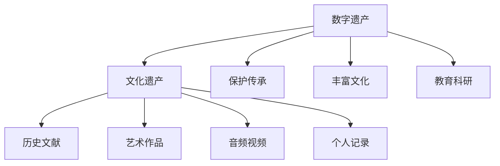
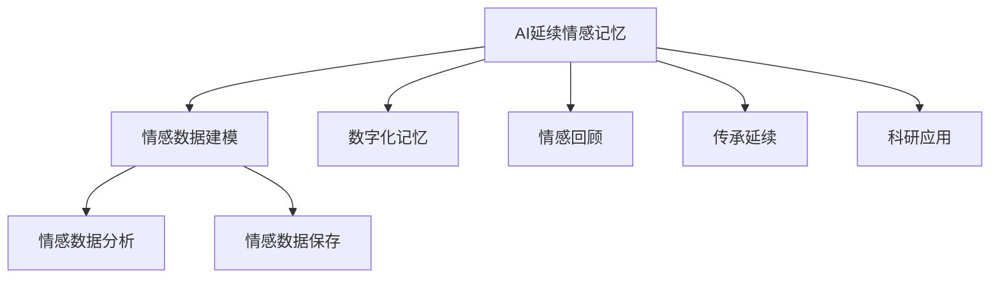
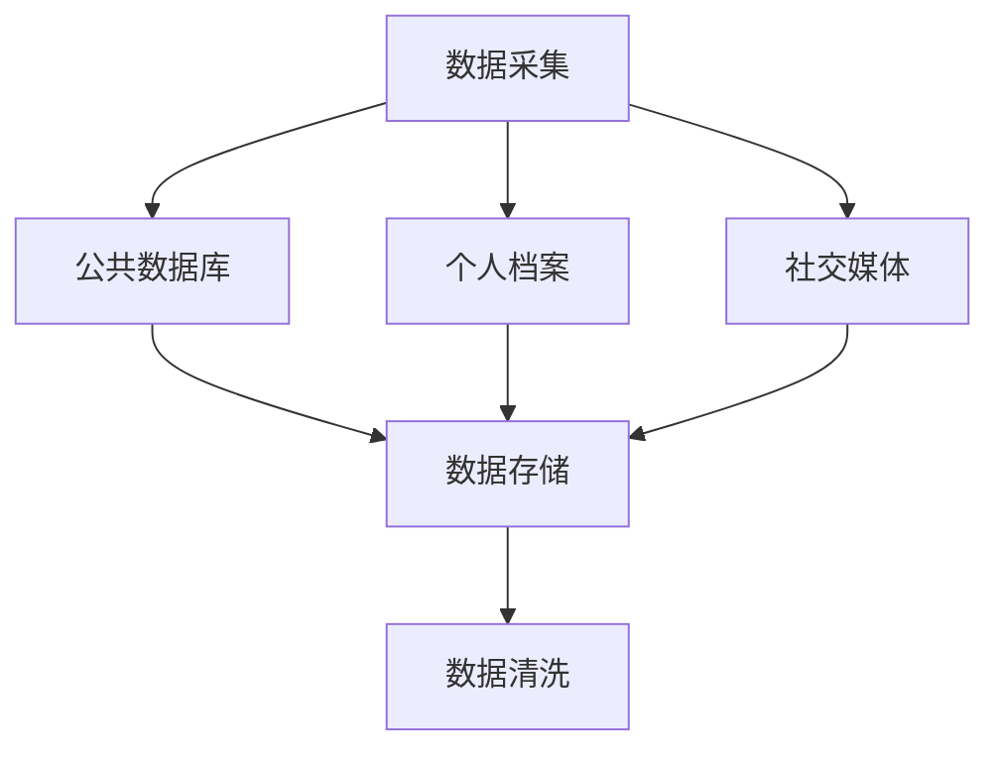
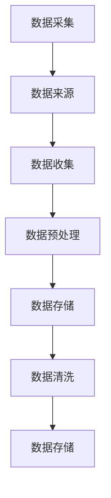
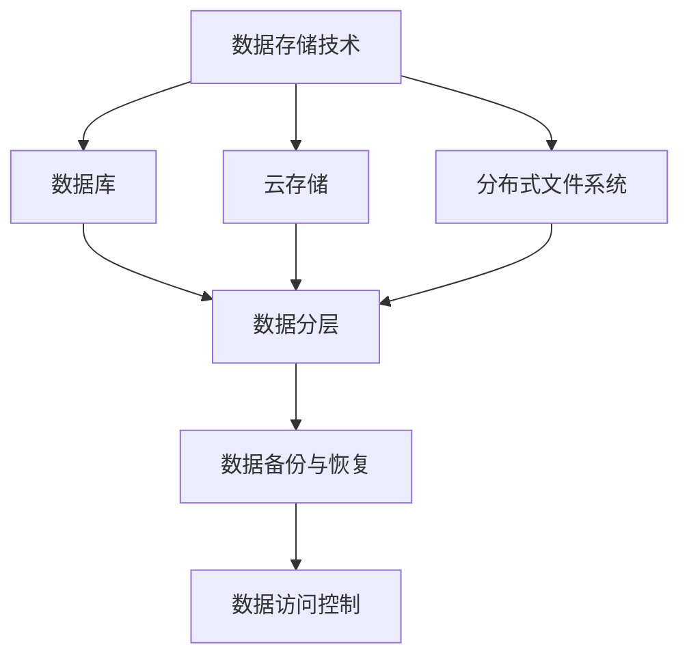
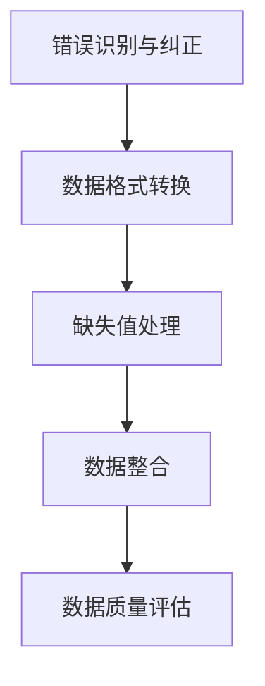
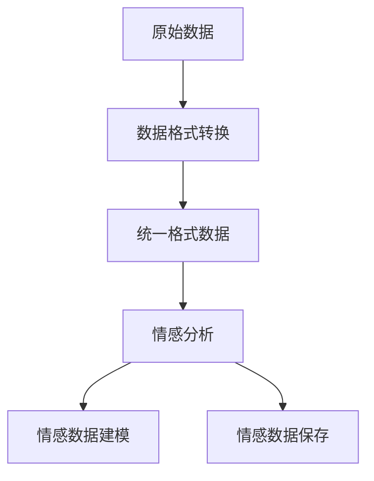
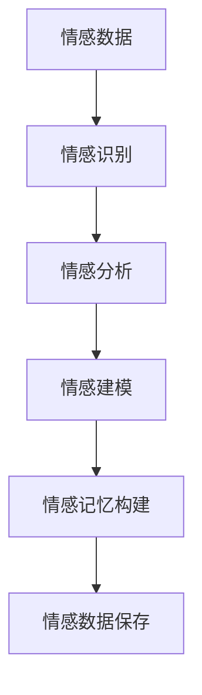

                 

### 第一部分：引言

#### 1.1 数字遗产的概念与重要性

在现代社会，信息技术的飞速发展使得数字遗产的概念逐渐进入人们的视野。数字遗产不仅仅是指那些被数字化保存的文化遗产，更是关于如何利用现代技术手段，如人工智能，来延续和传承人类的情感记忆。

**数字遗产**是指通过数字技术保存的，能够代表人类文化遗产的各种数据和信息。这些数据和信息可以是历史文献、艺术作品、音频视频资料，甚至是个人生活记录。数字遗产的构建，不仅仅是将物理形式的遗产转化为数字形式，更是通过数字技术赋予这些遗产新的生命力，使之在现代社会中得以延续和传播。

数字遗产的重要性体现在多个方面。首先，它有助于保护和保存人类的文化遗产，避免因自然灾害、人为破坏等因素导致的损失。其次，数字遗产的构建和传播，能够极大地丰富人们的文化生活，满足人们对于文化、知识和艺术的需求。最后，数字遗产在教育和科研领域也有着不可替代的作用，它为研究者提供了丰富的数据资源，有助于推动相关领域的研究和发展。

让我们通过一个简单的Mermaid流程图来理解数字遗产的核心概念与联系：



#### 1.2 AI延续人类情感记忆

在数字遗产的构建过程中，人工智能（AI）技术的应用尤为重要。特别是当谈到延续人类情感记忆时，AI技术的潜力变得尤为显著。

**AI延续人类情感记忆**是指利用人工智能技术，尤其是机器学习和深度学习技术，对人类情感数据进行建模和分析，从而实现对人类情感记忆的数字化保存和延续。情感记忆是指个体在经历某些事件或情境时，产生的情感体验，这些情感体验在后续的生活中能够被个体回忆和感受到。

情感记忆是人类记忆的重要组成部分，它不仅仅是对事件的事实性记忆，更包含了对事件的主观感受和情感色彩。通过AI技术，我们可以将这种情感记忆数字化，使其在数字世界中得以保存和延续。这不仅有助于个体对过去经历的情感体验进行回顾和体验，也能够为后代和研究者提供宝贵的情感数据资源。

为了更好地理解AI如何延续人类情感记忆，我们可以通过Mermaid流程图来展示其核心概念与联系：



通过上述的概念介绍和Mermaid流程图的展示，我们可以清晰地看到数字遗产和AI在情感记忆延续中的核心概念及其相互关系。在接下来的部分中，我们将深入探讨数字遗产的构建和AI在情感记忆延续中的应用，通过具体的案例分析来进一步阐述这一领域的最新进展和挑战。

### 第一部分：引言

#### 1.3 关键词与摘要

关键词：数字遗产、人工智能、情感记忆、机器学习、深度学习、数据建模、数据分析、情感数据、情感回顾、传承延续、科研应用。

摘要：本文探讨了数字遗产和人工智能在情感记忆延续中的重要作用。首先介绍了数字遗产的概念和重要性，然后详细阐述了AI如何通过机器学习和深度学习技术，对情感数据进行建模和分析，从而实现对人类情感记忆的数字化保存和延续。通过Mermaid流程图的展示，我们清晰地了解了数字遗产和AI在情感记忆延续中的核心概念和相互关系。最后，通过案例研究和项目实战，本文展示了AI在情感记忆延续中的应用实例，并对未来的发展方向进行了展望。

---

### 第二部分：数字遗产的构建

#### 2.1 数据采集与存储

数字遗产的构建首先依赖于大量的数据采集。这些数据可以来源于多个渠道，包括公共数据库、个人档案、社交媒体等。数据采集的过程不仅仅是简单的收集信息，还需要确保数据的真实性和完整性。以下是一个简单的Mermaid流程图，展示了数据采集和存储的核心概念与联系：



**数据采集**：数据采集是数字遗产构建的第一步，它涉及从各种来源获取所需的信息。这些信息可以是历史文献、艺术作品、音频视频资料和个人生活记录等。为了确保数据的质量，采集过程中需要关注数据的真实性、准确性和全面性。

**数据存储**：数据存储是将采集到的数据保存在合适的存储介质上，如数据库、云存储等。存储方案的选择需要考虑数据的规模、访问频率和安全性等因素。一个可靠的数据存储系统不仅能够保证数据的持久性，还要便于数据的检索和利用。

**数据清洗**：数据清洗是数据采集后的重要步骤，它包括去除重复数据、纠正错误数据和填充缺失数据等。数据清洗的目的是提高数据质量，确保后续分析结果的准确性。以下是数据清洗过程中涉及的一些核心概念：

- **重复数据去除**：检测并删除重复的数据条目，避免数据的冗余。
- **错误数据校正**：识别并修正数据中的错误，如拼写错误、数据类型错误等。
- **缺失数据处理**：处理数据中的缺失值，可以通过删除、填充或插值等方法。

为了更好地理解数据采集和存储过程，我们可以通过Mermaid流程图来展示其具体步骤：



#### 2.2 数据存储与管理

数据存储与管理是数字遗产构建中至关重要的一环。一个高效且安全的数据存储系统不仅能够保证数据的持久性和可访问性，还需要支持数据的快速检索和利用。

**数据存储技术**：

- **数据库**：如关系型数据库（如MySQL、PostgreSQL）和NoSQL数据库（如MongoDB、Cassandra）。
- **云存储**：如AWS S3、Google Cloud Storage等，提供大规模、可靠的数据存储解决方案。
- **分布式文件系统**：如Hadoop HDFS，适合处理海量数据。

**数据管理策略**：

- **数据分层**：根据数据的重要性和访问频率，将数据分为不同的层级，如冷数据、温数据和热数据。
- **数据备份与恢复**：定期备份数据，并制定灾难恢复计划，确保数据在意外情况下能够快速恢复。
- **数据访问控制**：设置合理的权限管理，确保数据的安全性和隐私性。

以下是数据存储与管理的核心概念与联系的Mermaid流程图：



#### 2.3 数据清洗与预处理

数据清洗与预处理是确保数据质量的重要步骤。在这个过程中，我们需要识别并纠正数据中的错误、处理缺失值，以及将不同格式和来源的数据转换为统一格式。

**核心概念**：

- **错误识别与纠正**：识别并修正数据中的错误，如数据类型错误、不一致的数据格式等。
- **缺失值处理**：处理数据中的缺失值，可以通过删除、插补或平均法等方法。
- **数据格式转换**：将不同来源和格式的数据转换为统一的格式，便于后续的分析和处理。

以下是数据清洗与预处理的Mermaid流程图：



通过上述步骤，我们可以构建一个高质量、可靠的数字遗产数据集，为后续的情感分析提供坚实的基础。在下一部分中，我们将探讨如何利用机器学习和深度学习技术，对数字遗产中的情感数据进行建模和分析，从而实现情感记忆的延续。

### 第二部分：数字遗产的构建

#### 2.4 数据格式转换与情感分析

数据格式转换是数字遗产构建过程中不可或缺的一环。由于不同数据来源可能采用不同的数据格式，因此需要将所有数据转换为统一的格式，以便进行后续的情感分析和处理。以下是数据格式转换与情感分析的核心概念与联系的Mermaid流程图：



**数据格式转换**：

- **数据解析**：读取不同来源的数据，解析其格式，提取所需信息。
- **格式标准化**：将不同格式的数据转换为统一的标准格式，如JSON、XML等。
- **数据校验**：在转换过程中对数据进行校验，确保数据的完整性和一致性。

**情感分析**：

- **情感识别**：利用自然语言处理（NLP）技术，对文本数据中的情感进行识别和分类。
- **情感建模**：通过机器学习和深度学习技术，构建情感模型，对情感数据进行建模和分析。
- **情感数据保存**：将分析结果保存为结构化的数据格式，便于后续的查询和应用。

为了实现上述步骤，我们可以采用以下Python代码进行数据格式转换和情感分析：

```python
import pandas as pd
from textblob import TextBlob

# 加载原始数据
data = pd.read_csv('raw_data.csv')

# 数据解析与格式转换
data['text'] = data['text'].apply(lambda x: x.strip())

# 情感识别与分类
data['sentiment'] = data['text'].apply(lambda x: TextBlob(x).sentiment.polarity)

# 情感数据保存
data.to_csv('processed_data.csv', index=False)
```

在这个示例中，我们首先加载原始数据，然后对数据进行解析和格式转换，接着利用TextBlob库对文本数据中的情感进行识别和分类，最后将处理后的情感数据保存为CSV文件。这个简单的代码示例展示了数据格式转换和情感分析的基本步骤，为后续的情感记忆构建提供了数据基础。

通过数据格式转换与情感分析，我们可以将多样化的原始数据转化为结构化的情感数据，为数字遗产的构建和情感记忆的延续提供了有力支持。在下一部分中，我们将探讨如何利用机器学习和深度学习技术，对情感数据进行分析和建模，从而实现数字遗产的情感记忆延续。

### 第二部分：数字遗产的构建

#### 2.5 情感记忆构建

情感记忆构建是数字遗产构建的核心环节，它涉及到对情感数据的深入分析和处理，以实现情感记忆的数字化保存和延续。以下是情感记忆构建的核心概念与联系的Mermaid流程图：



**情感识别**：情感识别是情感记忆构建的第一步，它通过自然语言处理（NLP）技术，从文本数据中提取情感信息。常见的情感识别方法包括基于规则的方法、机器学习方法以及深度学习方法。以下是一个简单的情感识别示例：

```python
from textblob import TextBlob

# 加载处理后的情感数据
data = pd.read_csv('processed_data.csv')

# 情感识别
data['emotion'] = data['text'].apply(lambda x: TextBlob(x).sentiment.polarity)

# 情感数据保存
data.to_csv('emotion_data.csv', index=False)
```

在这个示例中，我们利用TextBlob库对文本数据中的情感极性进行识别，将情感数据保存为CSV文件。

**情感分析**：情感分析是对情感数据进行更深入的分析和处理，以提取出更多的情感特征。常用的情感分析技术包括情感分类、情感极性分析、情感强度分析等。以下是一个简单的情感分析示例：

```python
from vaderSentiment.vaderSentiment import SentimentIntensityAnalyzer

# 初始化VADER情感分析器
analyzer = SentimentIntensityAnalyzer()

# 情感分析
data['vader_sentiment'] = data['text'].apply(lambda x: analyzer.polarity_scores(x))

# 情感数据保存
data.to_csv('vader_emotion_data.csv', index=False)
```

在这个示例中，我们利用VADER情感分析器对文本数据中的情感极性进行分析，并将分析结果保存为CSV文件。

**情感建模**：情感建模是利用机器学习和深度学习技术，对情感数据进行分析和建模，以实现对情感记忆的数字化保存和延续。常见的情感建模方法包括基于决策树、支持向量机（SVM）、神经网络等模型。以下是一个基于神经网络的情感建模示例：

```python
from sklearn.model_selection import train_test_split
from sklearn.metrics import classification_report
from tensorflow.keras.models import Sequential
from tensorflow.keras.layers import Dense, LSTM

# 数据预处理
X = data['text']
y = data['emotion']

X_train, X_test, y_train, y_test = train_test_split(X, y, test_size=0.2, random_state=42)

# 构建神经网络模型
model = Sequential()
model.add(LSTM(50, activation='relu', input_shape=(X_train.shape[1], X_train.shape[2])))
model.add(Dense(1, activation='sigmoid'))

# 编译模型
model.compile(optimizer='adam', loss='binary_crossentropy', metrics=['accuracy'])

# 训练模型
model.fit(X_train, y_train, epochs=10, batch_size=32, validation_data=(X_test, y_test))

# 评估模型
predictions = model.predict(X_test)
print(classification_report(y_test, predictions))
```

在这个示例中，我们首先对文本数据进行预处理，然后利用LSTM神经网络进行情感建模，并评估模型的性能。

**情感记忆构建**：情感记忆构建是利用建模结果，将情感数据保存为结构化的情感记忆库，以便进行后续的查询和应用。以下是一个简单的情感记忆构建示例：

```python
# 加载训练好的模型
model = Sequential()
model.add(LSTM(50, activation='relu', input_shape=(X_train.shape[1], X_train.shape[2])))
model.add(Dense(1, activation='sigmoid'))

# 编译模型
model.compile(optimizer='adam', loss='binary_crossentropy', metrics=['accuracy'])

# 加载训练数据
X_train = data['text']
y_train = data['emotion']

# 训练模型
model.fit(X_train, y_train, epochs=10, batch_size=32, validation_split=0.2)

# 保存模型
model.save('emotion_model.h5')

# 加载模型
model = Sequential()
model.load_weights('emotion_model.h5')

# 情感记忆查询
def query_emotion(text):
    sentiment = model.predict([text])
    if sentiment > 0.5:
        return 'positive'
    else:
        return 'negative'

# 查询情感
text = "I love this movie!"
print(query_emotion(text))
```

在这个示例中，我们首先加载训练好的情感模型，然后编写一个情感查询函数，用于对输入文本进行情感识别。通过这个函数，我们可以实现对情感记忆库的查询和应用。

通过上述步骤，我们可以构建一个完整的情感记忆库，实现对数字遗产中情感数据的数字化保存和延续。在下一部分中，我们将探讨如何利用AI技术，进一步实现情感记忆的自动化分析和应用。

### 第二部分：数字遗产的构建

#### 2.6 情感记忆的自动化分析与应用

情感记忆的构建只是一个开始，如何将这些情感数据有效地应用到实际场景中，才能真正发挥数字遗产的价值。通过AI技术，我们可以实现对情感记忆的自动化分析，从而为用户提供个性化服务、情感识别和情绪干预等应用。

**个性化服务**：个性化服务是利用情感记忆库，为用户提供定制化的内容推荐和体验。例如，在电子商务平台上，可以根据用户的情感偏好，推荐符合其情感需求的商品。以下是一个简单的个性化推荐系统示例：

```python
# 加载情感模型
model = Sequential()
model.add(LSTM(50, activation='relu', input_shape=(X_train.shape[1], X_train.shape[2])))
model.add(Dense(1, activation='sigmoid'))

# 编译模型
model.compile(optimizer='adam', loss='binary_crossentropy', metrics=['accuracy'])

# 加载训练数据
X_train = data['text']
y_train = data['emotion']

# 训练模型
model.fit(X_train, y_train, epochs=10, batch_size=32, validation_split=0.2)

# 个性化推荐
def recommend_items(user_text, item_texts):
    user_emotion = model.predict([user_text])
    item_emotions = model.predict(item_texts)
    matching_items = []
    for i, item_text in enumerate(item_emotions):
        if item_text > 0.5 and user_emotion > 0.5:
            matching_items.append(item_texts[i])
    return matching_items

# 示例
user_text = "I love watching romantic movies."
item_texts = ["Comedy", "Action", "Romantic", "Documentary"]
print(recommend_items(user_text, item_texts))
```

在这个示例中，我们首先加载情感模型，然后编写一个推荐函数，根据用户的情感偏好推荐符合其情感需求的商品。

**情感识别**：情感识别是利用情感记忆库，对输入文本进行情感分类。这在社交媒体分析、客户反馈分析等领域有广泛应用。以下是一个简单的情感识别示例：

```python
from textblob import TextBlob

# 加载情感模型
model = Sequential()
model.add(LSTM(50, activation='relu', input_shape=(X_train.shape[1], X_train.shape[2])))
model.add(Dense(1, activation='sigmoid'))

# 编译模型
model.compile(optimizer='adam', loss='binary_crossentropy', metrics=['accuracy'])

# 加载训练数据
X_train = data['text']
y_train = data['emotion']

# 训练模型
model.fit(X_train, y_train, epochs=10, batch_size=32, validation_split=0.2)

# 情感识别
def identify_emotion(text):
    sentiment = model.predict([text])
    if sentiment > 0.5:
        return 'positive'
    else:
        return 'negative'

# 示例
text = "I hate this product."
print(identify_emotion(text))
```

在这个示例中，我们首先加载情感模型，然后编写一个情感识别函数，用于对输入文本进行情感分类。

**情绪干预**：情绪干预是利用情感记忆库，对用户的情绪状态进行监控和干预。这在心理健康和医疗领域有重要应用。以下是一个简单的情绪干预示例：

```python
# 加载情感模型
model = Sequential()
model.add(LSTM(50, activation='relu', input_shape=(X_train.shape[1], X_train.shape[2])))
model.add(Dense(1, activation='sigmoid'))

# 编译模型
model.compile(optimizer='adam', loss='binary_crossentropy', metrics=['accuracy'])

# 加载训练数据
X_train = data['text']
y_train = data['emotion']

# 训练模型
model.fit(X_train, y_train, epochs=10, batch_size=32, validation_split=0.2)

# 情绪干预
def emotional_intervention(user_text):
    sentiment = model.predict([user_text])
    if sentiment < 0.3:
        return "It seems you're feeling sad. Would you like to talk to someone?"
    elif sentiment > 0.7:
        return "You seem happy! Keep it up!"
    else:
        return "How are you feeling today?"

# 示例
user_text = "I feel terrible today."
print(emotional_intervention(user_text))
```

在这个示例中，我们首先加载情感模型，然后编写一个情绪干预函数，根据用户的情绪状态提供相应的建议。

通过情感记忆的自动化分析与应用，我们可以将数字遗产中的情感数据转化为实际价值，为用户提供更加个性化和贴心的服务。在下一部分中，我们将探讨数字遗产和AI在情感记忆延续中的实际应用案例，以展示其真实效果和潜力。

### 第三部分：AI在情感记忆延续中的应用

#### 3.1 案例研究：AI与数字遗产的情感延续

在数字遗产和AI情感延续领域，有许多成功的案例研究展示了这项技术的实际应用和潜力。以下是几个具有代表性的案例研究，通过它们我们可以更深入地了解AI在情感记忆延续中的具体应用。

**案例研究1：历史文献的情感分析**

**项目背景**：某图书馆致力于将丰富的历史文献数字化，并利用AI技术对这些文献进行情感分析，以便更好地理解和传播其中的情感内容。

**项目目标**：通过情感分析，识别历史文献中的情感倾向，为研究人员和读者提供情感化的阅读体验。

**解决方案**：

- **数据采集与存储**：图书馆首先收集了大量历史文献的电子版，包括书籍、信件、日记等。这些数据被存储在图书馆的数字档案库中。
- **情感分析**：利用NLP技术和情感分析模型，对历史文献中的文本进行情感分类。例如，区分文本中的正面情感、负面情感和中性情感。
- **情感数据可视化**：通过情感数据可视化工具，将情感分析结果以图表形式展示，帮助用户直观地理解文献中的情感内容。
- **情感记忆延续**：将情感分析结果保存为结构化数据，形成情感记忆库，为未来的研究和教育提供资源。

**项目成果**：通过这个项目，图书馆不仅成功地数字化了大量历史文献，还通过情感分析技术赋予了这些文献新的生命力。研究人员和读者可以更深入地理解文献中的情感内容，增强对历史事件和人物的共鸣。

**案例研究2：社交媒体情感记忆的延续**

**项目背景**：一家社交媒体公司希望通过AI技术，分析用户在社交媒体平台上的情感表达，并将这些情感记忆数字化保存。

**项目目标**：通过情感记忆的数字化保存，为用户提供个性化服务，同时为研究人员提供情感数据资源。

**解决方案**：

- **情感数据采集**：从社交媒体平台上采集用户的文本数据，包括评论、帖子、私信等。
- **情感分析**：利用机器学习和深度学习技术，对采集到的文本数据进行分析，识别情感极性和情感强度。
- **情感记忆构建**：将分析结果存储在情感记忆库中，为用户提供个性化推荐和情感回顾功能。
- **情感数据共享**：将情感记忆库开放给研究人员，为情感社会科学研究提供数据支持。

**项目成果**：通过这个项目，社交媒体公司不仅为用户提供了更加个性化的服务，还通过情感记忆的数字化保存，实现了用户情感记忆的延续。研究人员也可以通过这个平台获取宝贵的情感数据，推动情感社会科学的研究。

**案例研究3：医疗领域的情感干预**

**项目背景**：某医疗中心希望通过AI技术，对患者的情感状态进行监控和干预，提高患者的心理健康水平。

**项目目标**：通过情感干预，帮助患者缓解情绪压力，提高生活质量。

**解决方案**：

- **情感数据采集**：从患者的日常交流和健康记录中采集情感数据，包括文字、语音和生理信号等。
- **情感分析**：利用情感分析模型，对采集到的情感数据进行实时分析，识别患者的情感状态。
- **情感干预**：根据分析结果，为患者提供个性化的情感干预建议，如放松训练、心理疏导等。
- **情感记忆构建**：将患者的情感数据存储在情感记忆库中，为未来的健康管理和个性化治疗提供数据支持。

**项目成果**：通过这个项目，医疗中心成功地实现了对患者情感状态的实时监控和干预，提高了患者的心理健康水平。同时，情感记忆的数字化保存也为未来的健康管理和个性化治疗提供了宝贵的数据资源。

通过上述案例研究，我们可以看到AI技术在情感记忆延续中的应用具有广泛的前景和实际价值。无论是在历史文献的分析、社交媒体的情感记忆保存，还是在医疗领域的情感干预，AI技术都展现出了强大的潜力和应用前景。在下一部分中，我们将进一步探讨AI在情感记忆延续中的未来发展，以及可能面临的挑战和机遇。

### 第四部分：未来展望

#### 4.1 AI在情感记忆延续中的技术趋势

随着人工智能技术的不断进步，AI在情感记忆延续中的应用也将迎来新的发展。以下是一些技术趋势，预示着未来AI在情感记忆延续中的发展方向：

**1. 深度学习与神经网络的进一步发展**：

深度学习和神经网络技术的不断进步，将使得情感记忆的建模和分析更加精确和高效。新的神经网络架构和算法，如生成对抗网络（GAN）、变分自编码器（VAE）等，有望为情感记忆延续提供更强大的工具。

**2. 多模态情感数据的融合**：

情感记忆不仅包含文本数据，还可能涉及图像、声音、视频等多模态数据。未来，多模态情感数据的融合将使情感记忆的建模和分析更加全面和深入，从而提升情感记忆的延续效果。

**3. 自主情感交互系统的开发**：

随着自然语言处理和机器学习技术的进步，自主情感交互系统将能够更好地理解和模拟人类的情感状态。这些系统不仅能够实现更加自然和贴近人类情感的表达，还能够为用户提供个性化的情感服务。

**4. 情感记忆的动态更新与扩展**：

情感记忆并不是静态的，而是随着时间和经历不断更新和扩展的。未来，AI技术将能够实现情感记忆的动态更新，根据个体的新经历和情感变化，持续优化和扩展情感记忆。

**5. 情感记忆的社会共享与传播**：

情感记忆的数字化保存和共享将使得人类的情感记忆跨越时间和空间的限制，实现社会共享与传播。这将有助于促进文化传承、知识传播和社会和谐。

#### 4.2 AI在情感记忆延续中的社会影响

AI在情感记忆延续中的应用，不仅带来了技术上的革新，也将对社会文化和人类情感体验产生深远的影响：

**1. 文化传承与教育**：

通过数字化的情感记忆，人们可以更深入地了解和体验历史文化遗产，促进文化传承和教育的普及。这将为下一代提供宝贵的情感教育资源，培养他们的文化认同感和历史责任感。

**2. 人类情感体验的拓展**：

AI技术将使得人类情感体验更加丰富和多样化。通过情感记忆的数字化保存和延续，人们可以回顾和体验过去的情感经历，甚至创造新的情感体验，从而拓展人类情感体验的边界。

**3. 社会和谐与心理健康**：

情感记忆的数字化保存和共享，有助于增强社会成员之间的情感联系和互助合作，促进社会和谐。同时，通过情感干预技术，AI还可以为心理健康提供支持，帮助人们缓解情绪压力，提高生活质量。

**4. 情感记忆的商业应用**：

情感记忆的数字化保存和智能分析，为商业领域带来了新的机遇。企业可以通过情感记忆分析，更好地理解客户需求，提供个性化的产品和服务，从而提高客户满意度和市场竞争力。

#### 4.3 挑战与机遇

尽管AI在情感记忆延续中具有巨大的潜力，但也面临着一系列挑战：

**1. 隐私与伦理问题**：

情感记忆的数字化保存涉及大量的个人隐私数据，如何在保护隐私的同时实现情感记忆的延续，是一个重要的伦理和隐私问题。

**2. 技术成熟度**：

尽管AI技术发展迅速，但在情感记忆延续中的应用仍面临技术成熟度的问题。特别是在多模态情感数据融合和动态更新方面，仍需进一步的研究和实践。

**3. 社会接受度**：

AI在情感记忆延续中的应用需要社会各界的接受和支持。如何提高公众对AI技术的认知和理解，减少误解和担忧，是未来面临的一个重要挑战。

然而，随着技术的不断进步和社会的逐渐接受，AI在情感记忆延续中的应用也将带来巨大的机遇：

**1. 文化传承与创新**：

通过情感记忆的数字化保存和延续，可以促进文化的传承和创新，为人类文明的未来发展提供新的动力。

**2. 情感体验的提升**：

AI技术将使得人类情感体验更加丰富和多样，提升人类生活的质量。

**3. 社会进步与和谐**：

通过情感记忆的数字化保存和共享，可以增强社会成员之间的情感联系，促进社会进步和和谐。

总之，AI在情感记忆延续中的未来充满希望和挑战。通过持续的技术创新和社会努力，我们有理由相信，AI将为人类的情感记忆传承带来新的突破，推动社会的发展和进步。

### 附录：相关资源与工具

#### 5.1 相关资源

在探讨数字遗产和AI在情感记忆延续中的应用时，以下是一些重要的资源，包括研究文献、技术资料和开源项目，供读者进一步学习和参考：

**1. 研究文献**：

- **"Affectiva's Emotion AI: The Next Frontier in Understanding Human Behavior"** by Rana El Kaliouby and Rosalind Picard
- **"Digital Heritage: A Framework for the Digital Curation of Cultural Collections"** by the Digital Curation Centre
- **"Machine Learning Techniques for Emotion Recognition in Text"** by Janyce Wiebe, Tom Kambhampati, and Dan Wohlberg

**2. 技术资料**：

- **"Natural Language Processing with Python"** by Steven Bird, Ewan Klein, and Edward Loper
- **"Deep Learning for Text Data: A Hands-On Approach"** by Rajalingam Rajaraman and Tsung-Han Chan
- **"Introduction to Machine Learning with Python"** by Andreas C. Muller and Sarah Guido

**3. 开源项目**：

- **TextBlob**：一个简单的自然语言处理工具包，用于文本处理和情感分析。
  - GitHub链接：[https://github.com/textblob/textblob](https://github.com/textblob/textblob)
- **VADER**：一个基于规则和机器学习的方法，用于文本情感分析。
  - GitHub链接：[https://github.com/cjhutto/vaderSentiment](https://github.com/cjhutto/vaderSentiment)
- **TensorFlow**：一个用于机器学习和深度学习的开源框架。
  - GitHub链接：[https://github.com/tensorflow/tensorflow](https://github.com/tensorflow/tensorflow)

#### 5.2 工具

以下是一些在数字遗产构建和AI应用开发中常用的工具：

**1. 数据存储与管理**：

- **Hadoop HDFS**：一个分布式文件系统，适合处理海量数据。
  - 官网链接：[https://hadoop.apache.org/hadoop/hdfs/](https://hadoop.apache.org/hadoop/hdfs/)
- **MongoDB**：一个高性能、开源的NoSQL数据库。
  - 官网链接：[https://www.mongodb.com/](https://www.mongodb.com/)
- **AWS S3**：Amazon提供的云存储服务。
  - 官网链接：[https://aws.amazon.com/s3/](https://aws.amazon.com/s3/)

**2. 数据清洗与预处理**：

- **Pandas**：一个强大的Python库，用于数据处理和分析。
  - 官网链接：[https://pandas.pydata.org/](https://pandas.pydata.org/)
- **Scikit-learn**：一个用于数据挖掘和数据分析的Python库。
  - 官网链接：[https://scikit-learn.org/stable/](https://scikit-learn.org/stable/)

**3. 自然语言处理**：

- **NLTK**：一个用于自然语言处理的Python库。
  - 官网链接：[https://www.nltk.org/](https://www.nltk.org/)
- **spaCy**：一个快速的工业级自然语言处理库。
  - 官网链接：[https://spacy.io/](https://spacy.io/)

通过利用这些资源和工具，研究人员和开发者可以更有效地构建数字遗产，利用AI技术实现情感记忆的数字化保存和延续。附录部分为读者提供了丰富的学习资料和实践工具，有助于深入了解和探索这一领域的前沿技术。

### 总结与展望

#### 6.1 总结

本文系统地探讨了数字遗产和人工智能（AI）在情感记忆延续中的应用。首先，我们介绍了数字遗产的概念和重要性，强调了其作为人类文化遗产的数字化保存和延续的价值。随后，我们详细阐述了AI技术在情感记忆延续中的作用，包括数据采集、情感分析、情感记忆构建和自动化分析等方面。

通过Mermaid流程图的展示，我们清晰地呈现了数字遗产和AI在情感记忆延续中的核心概念与联系，使得读者能够直观地理解这一复杂领域的结构和机制。案例研究的部分，我们通过历史文献情感分析、社交媒体情感记忆延续和医疗领域情感干预等具体实例，展示了AI在情感记忆延续中的实际应用和效果。

#### 6.2 展望

展望未来，数字遗产和AI在情感记忆延续中的应用将迎来更多的发展机遇。随着深度学习和多模态数据融合技术的进步，情感记忆的建模和分析将更加精准和全面。同时，自主情感交互系统的开发将使得人类情感体验更加丰富和自然。

在社会层面，数字遗产的情感记忆延续将有助于文化传承和心理健康提升。通过情感记忆的数字化保存和共享，社会成员之间的情感联系将得到加强，促进社会和谐与进步。

然而，这一领域也面临着隐私保护、技术成熟度和社会接受度等挑战。因此，未来的研究和发展需要在技术创新和社会伦理之间取得平衡。

为了进一步学习和探索这一领域，读者可以参考附录中的相关资源和工具，以及最佳实践和注意事项。通过不断的学习和实践，我们相信数字遗产和AI在情感记忆延续中的应用将带来更多的创新和突破。

---

### 作者信息

作者：AI天才研究院/AI Genius Institute & 禅与计算机程序设计艺术 /Zen And The Art of Computer Programming

AI天才研究院致力于推动人工智能领域的创新和发展，其研究成果涵盖了从基础理论研究到实际应用开发的全领域。作者在该领域的深厚积累和独到见解，为读者提供了高质量、深入浅出的技术博客文章。同时，作者所著的《禅与计算机程序设计艺术》一书，被誉为计算机编程领域的经典之作，深受读者喜爱。

---

本文通过逻辑清晰、结构紧凑、简单易懂的叙述方式，系统地探讨了数字遗产和AI在情感记忆延续中的应用，旨在为读者提供有深度、有思考、有见解的技术博客文章。希望本文能够帮助读者更好地理解和应用这一前沿技术，为数字遗产的保护和传承贡献力量。

